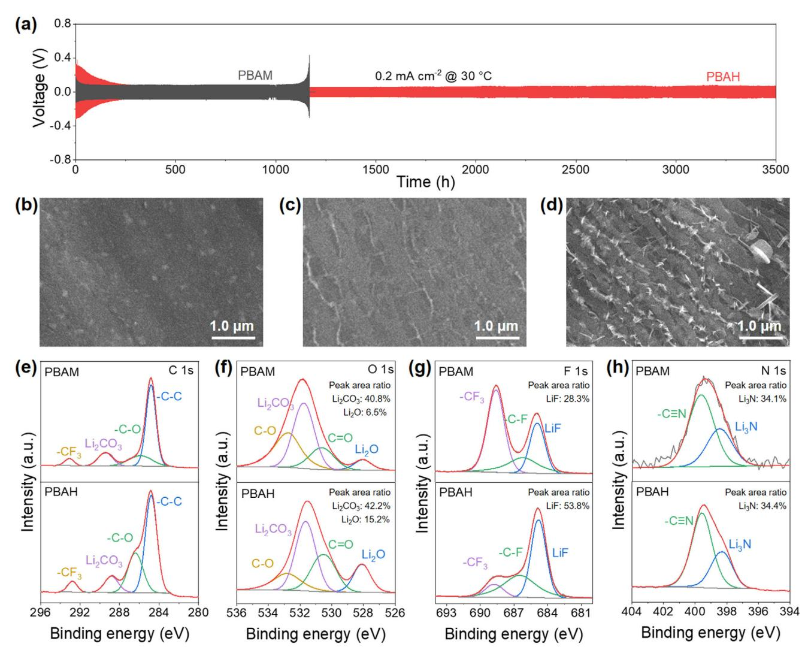
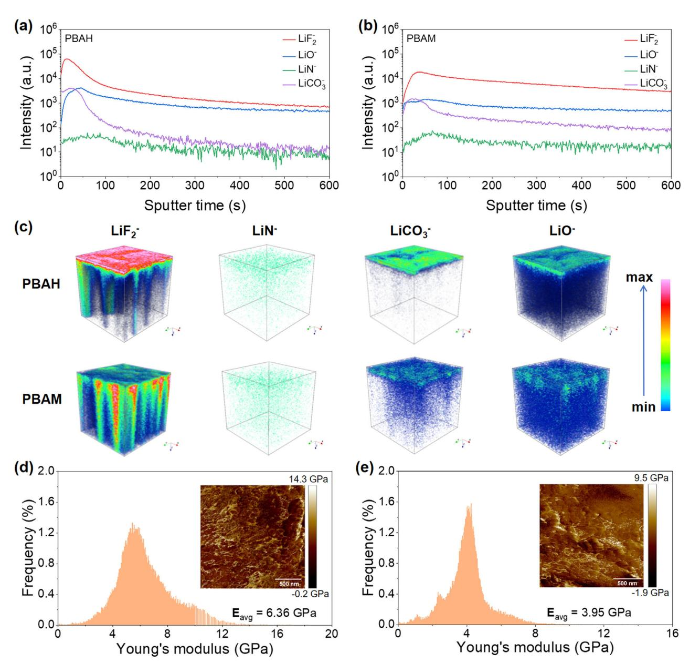
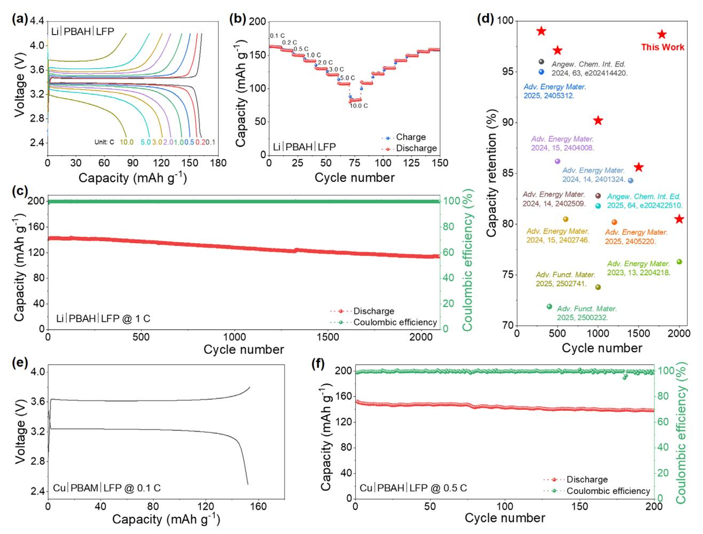
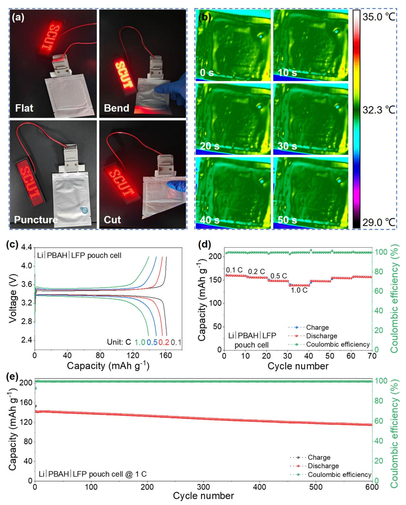

# **Carbonyl-Engineered Acrylate-Based Solid Polymer Electrolyte for High-Performance Lithium Metal Batteries**

*Qibang Pan, Shilin Zhang, Xiaoyu Gui, Jie Zhang, Wenbo Liu, Mingbao Huang, Zhiyong Fu,\* Kai Wan,\* and Zhenxing Liang\**

**Solid polymer electrolytes (SPEs) are promising for lithium metal batteries due to their non-flammability and solid-state nature, though interfacial instability limits practical application. In this work, novel acrylate-based SPEs with carbonyl-modified polymer backbones are synthesized using either bis(2-(acryloyloxy)ethyl) heptanedioate (BAH) or bis(2-acryloyloxyethyl) malonate (BAM) monomers, in the presence of succinonitrile and lithium salts. The wider carbonyl spacing in the BAH-derived SPE (PBAH) results in a weaker interaction with Li+ ions than the BAM-derived SPE (PBAM). This weaker interaction favors anion-dominated solvation structures, facilitating the formation of LiF-enriched solid electrolyte interphase. The Li|PBAH|Li cell exhibits a high cyclability for 3500 h at 0.2 mA cm−2. Li|PBAH|LiFePO4 delivers 162 mAh g−1 at 0.1 C with 80.8% capacity retention after 2000 cycles at 1 C. Li|PBAH|LiNi0.8Co0.1Mn0.1O2 delivers 223 mAh g−1 at 0.1 C with 69.7% capacity retention over 200 cycles at 1 C. Anode-free Cu|PBAH|LiFePO4 achieves 153 mAh g−1 at 0.1 C and 90.80% capacity retention after 200 cycles at 0.5 C. The Li|PBAH|LiFePO4 pouch cell demonstrates its practical viability, exhibiting 161 mAh g−1 at 0.1 C and 80.7% capacity retention after 600 cycles at 1 C. This work offers a rational SPE design to enhance lithium metal battery capacity and stability.**

## **1. Introduction**

Lithium metal anodes have attracted extensive attention due to their exceptionally high theoretical capacity and energy density in batteries.[\[1–5\]](#page-8-0) However, their practical application remains

Q. Pan, S. Zhang, X. Gui, J. Zhang, W. Liu, M. Huang, Z. Fu, K. Wan, Z. Liang

Guangdong Provincial Key Laboratory of Fuel Cell Technology School of Chemistry and Chemical Engineering South China University of Technology Guangzhou 510641, China E-mail: [zyfu@scut.edu.cn;](mailto:zyfu@scut.edu.cn)[wank@scut.edu.cn;](mailto:wank@scut.edu.cn) [zliang@scut.edu.cn](mailto:zliang@scut.edu.cn) K. Wan School of Chemical Engineering and Technology Sun Yat-Sen University Zhuhai 519082, China Z. Fu Beijing Laboratory of New Energy Storage Technology Beijing 102206, China

The ORCID identification number(s) for the author(s) of this article can be found under <https://doi.org/10.1002/aenm.202502815>

**DOI: 10.1002/aenm.202502815**

constrained by several critical challenges, particularly when paired with traditional liquid electrolytes, which are susceptible to flammability, leakage, and lithium dendrites formation.[\[6,7\]](#page-8-0) These dendrites, caused by uneven lithium deposition during cycling, may penetrate the separator, causing internal short circuits and posing severe safety risks.[\[8–10\]](#page-8-0) In this context, solid polymer electrolytes (SPEs), which possess intrinsic non-flammability and a solid-state structure, have emerged as promising alternatives to address these safety concerns.[\[11–14\]](#page-8-0) Nevertheless, the high reductive reactivity of lithium metal anodes often triggers undesirable side reactions with SPEs, leading to the formation of unstable decomposition products at the anode-electrolyte interface.[\[15–17\]](#page-8-0) These side reactions exacerbate the interfacial degradation, elevate interfacial impedance, and thus significantly undermine the stability and safety of the battery.[\[18,19\]](#page-8-0)

Constructing a stable solid electrolyte interphase (SEI) layer has been

widely recognized as a crucial strategy to mitigate the interfacial instability and safety concerns associated with lithium metal batteries.[\[20–22\]](#page-8-0) Among the various SEI components, LiF and Li3N are particularly important due to their excellent chemical inertness and superior ionic conductivity.[\[23,24\]](#page-8-0) These properties are essential for stabilizing the interface and enabling the practical use of lithium metal anodes in next-generation lithium batteries.[\[20,25\]](#page-8-0) In recent years, considerable efforts have been devoted to improving the stability of the electrode-electrolyte interface and promoting the formation of SEI layers enriched with LiF and Li3N.[\[26,27\]](#page-8-0) For example, Zhang et al.[\[28\]](#page-8-0) introduced fluoroethylene carbonate (FEC) as an additive in a gel polymer electrolyte system. The decomposition of FEC facilitates the formation of a LiF-rich SEI layer on the lithium metal anode. However, the inherent thermal instability and extreme sensitivity of FEC to trace amounts of water often result in gas evolution and hydrolysis, leading to the generation of corrosive HF.[\[29,30\]](#page-8-0) This degradation process severely undermines the interfacial stability and long-term battery performance. Additionally, Gao et al.[\[31\]](#page-9-0) incorporated high-concentration electrolytes into polymer electrolyte systems. The unique ion-pairing behavior of high-concentration electrolytes promotes the formation of intimate ion pair (IIP) and

**Figure 1.** a) Synthesis of the polymer monomers; b) Schematic illustration of the PBAH synthesis process; c) FTIR spectra of BAH precursor and PBAH; d) Thermogravimetric analysis curves of PBAH and PBAM; e) EDS mapping images of PBAH.

loose ion pair (LIP), which preferentially decompose lithium salt anions at the lithium metal surface, thereby facilitating the formation of SEI layers enriched with LiF and Li3N.[\[31,32\]](#page-9-0) However, the elevated viscosity of high-concentration electrolytes significantly impedes the ion transport, lowers the ionic conductivity, and limits their practical applicability.[\[33–35\]](#page-9-0)

In comparison, polymer backbone modification offers more innovative space in forming stable SEI layers.[\[36–38\]](#page-9-0) For example, Wang et al.[\[36\]](#page-9-0) introduced a 3-methylglutaric anhydride group as a site-blocking group into the poly(1,3-dioxolane) backbone, effectively weakening the interaction between the polymer backbone and lithium ions. This modification optimizes the ion coordination environment, facilitating the formation of anion-rich solvated structures. Similarly, Zhang et al.[\[38\]](#page-9-0) employed polyhedral oligomeric silsesquioxane (POSS) to modify the polymer backbone of poly(ethylene glycol) methyl ether methacrylate. The incorporation of POSS promotes the formation of the Li+-solvated sheath structure, which is dominated by anion-rich solvation environments. Such a structure enhances the preferential decomposition of anions on the lithium metal surface and favors the formation of a LiF-enriched SEI layer. As a result, the Li symmetric cell demonstrates a superior cyclability up to 2000 h at 0.05 mA cm−2. Despite these advancements, the polymer backbone modification is still preliminary and insufficient to achieve highly stable lithium metal batteries.

In this work, novel acrylate-based SPEs, namely PBAH and PBAM, with carbonyl-modified polymer backbones are synthesized using either bis(2-(acryloyloxy)ethyl) heptanedioate (BAH) or bis(2-acryloyloxyethyl) malonate (BAM) monomers, in the presence of succinonitrile (SN) and lithium salts. Theoretical calculations and physicochemical characterizations are performed to investigate the Li+ solvation structures, ionic conductivity, and Li+ transference number. Electrochemical results demonstrate that the Li|PBAH|Li symmetric cell with PBAH exhibits superior cyclability for 3500 h at 0.2 mA cm−2 without degradation, confirming the interfacial compatibility between PBAH and the lithium metal anode. Furthermore, the versatility of PBAH is validated through its use in full cells, including the Li|PBAH|LiFePO4, Li|PBAH|LiNi0.8Co0.1Mn0.1O2, and anode-free Cu|PBAH|LiFePO4 coin cells, as well as in a Li|PBAH|LiFePO4 pouch cell.

### **2. Results and Discussion**

#### **2.1. SPE Preparation and Characterization**

The bis(2-(acryloyloxy)ethyl) heptanedioate (BAH) and bis(2- (acryloyloxy)ethyl) malonate (BAM) monomers are synthesized by an esterification reaction (**Figure 1**a). The BAM backbone contains two adjacent carbonyl oxygen atoms, whereas the BAH features a larger spacing between two carbonyl oxygen atoms. The chemical structures of the BAH and BAM precursors are confirmed by 1H nuclear magnetic resonance (NMR) spectroscopy and Fourier transform infrared (FTIR) spectroscopy, as shown

**Figure 2.** a) Binding energies between Li+ and each electrolyte component calculated by DFT; b) 7Li solid-state NMR spectra of PBAH and PBAM; Raman spectra of TFSI− anions in c) PBAH and d) PBAM; e) Nyquist plots of PBAH and PBAM (Insert: ionic conductivity); f) Arrhenius plots of the ionic conductivities of the PBAH and PBAM from 30–80 °C; g) Li+ transference number of PBAH and PBAM.

in Figures S1 and S2 (Supporting Information). Subsequently, solid polymer electrolyte membranes are fabricated by a solution casting and thermal curing process in the presence of SN and lithium salts.[\[39\]](#page-9-0) Specifically, a homogeneous mixed precursor solution is cast onto a glass fiber membrane, followed by thermal curing at 80 °C under vacuum conditions for 8 h to ensure complete free radical polymerization (Figure [1b\)](#page-1-0). The resultant SPEs are denoted as PBAH and PBAM, respectively. The PBAH membrane thickness is 394 μm (Figure S3a, Supporting Information), and thinner membranes are beneficial for reducing internal resistance and improving rate performance. Additionally, the PBAH membrane exhibits no noticeable protrusions or depressions (Figure S3b, Supporting Information), ensuring good contact at the SPE-electrode interface.

FTIR spectra show that the characteristic absorption peak of ─C═C─ at 1630 cm−1 in the BAH precursor disappears after the polymerization (Figure [1c\)](#page-1-0), indicating the successful formation of cross-linked polymer networks.[\[40\]](#page-9-0) Thermogravimetric analysis (TGA) shows that both PBAH and PBAM undergo significant mass loss at ≈135.3 and 331.7 °C (Figure [1d\)](#page-1-0), corresponding to the decomposition of SN and the polymer backbone, respectively. These results indicate the superior thermal stability of the PBAH and PBAM. The mechanical properties of PBAH and PBAM are further evaluated through tensile stress–strain measurements (Figure S4, Supporting Information), which confirm the good tensile strength and elongation characteristics of the SPEs.[\[41,42\]](#page-9-0) The energy dispersive X-ray spectroscopy (EDS) mapping images reveal the uniform distribution of F, S, C, and N elements on the surface of the PBAH (Figure [1e\)](#page-1-0), indicating its high compositional homogeneity.

The lithium ion (Li+) coordination structures are investigated through a combination of theoretical calculations and spectroscopic characterization. Density functional theory (DFT) calculation is performed to determine the binding energies between Li+ ions and each electrolyte component, as presented in **Figure 2**a. It is seen that in the PBAH backbone, the Li+ ion is coordinated by a single carbonyl oxygen on one side of the heptanedioate group; in comparison, the Li+ ion is chelated by two carbonyl oxygens positioned on the malonate group in the PBAM. The binding energy between Li+ and PBAM is relatively strong (−1.63 eV) due to the chelating effect of closely spaced carbonyl oxygen atoms along the polymer backbone. Such a strong coordination confines Li+ within the polymer matrix, lowering its availability in the mobile phase and the probability of the Li+-TFSI− coordination. In comparison, PBAH features a wider spacing between carbonyl groups and shows a much weaker Li+ binding energy of −0.95 eV. It is noted that the binding energy of Li+ with PBAH is lower than both SN (−1.20 eV) and TFSI− (−1.16 eV). This weaker interaction allows Li+ ions to dissociate from the PBAH-Li+ coordination structure, increasing the concentration of free Li+ in the mobile phase. As a result, Li+ coordinates with TFSI− and SN, forming an anion-rich solvation structure and shifting the ion transport from the polymer segmental motion to the anion-assisted conduction.[\[43\]](#page-9-0)

The formation of the TFSI−-Li+ solvation structure is further confirmed by 7Li solid-state NMR spectroscopy, which shows that the Li+ peak for PBAH (−1.46 ppm) appears at a more negative chemical shift than PBAM (-0.49 ppm) (Figure [2b\)](#page-2-0). This negative shift suggests stronger negative charge shielding around Li+ in PBAH, indicating a higher local concentration of TFSI− anions surrounding Li+. [\[36\]](#page-9-0) Raman spectroscopy is employed to further elucidate the solvation structure of TFSI−-Li+ (Figure [2c,d\)](#page-2-0). The TFSI− anions can be classified into three types, including the intimate ion pair (IIP, 746 cm−1), the loose ion pair (LIP, 741 cm−1), and the free ions (FI, 738 cm−1).[\[36,44,45\]](#page-9-0) Figure [2c,d](#page-2-0) show that the PBAH exhibits a higher proportion of IIP (32.8%) and LIP (55.0%) than the PBAM (28.9% for IIP and 48.3% for LIP). This increased proportion of IIP and LIP in PBAH suggests the formation of an anion-rich solvated Li+ structure, which is acknowledged to promote the formation of a stable SEI layer.[\[46\]](#page-9-0)

In addition to the interfacial instability, the low ionic conductivity of SPEs also limits the practical application of lithium metal batteries. The ionic conductivities of the SPEs are investigated by electrochemical impedance spectroscopy (EIS). The ionic conductivities are calculated using Equation S1 (Supporting Information). It is acknowledged that both the addition of the SN and the concentration of lithium salt can significantly influence the ionic conductivity of SPEs.[\[47\]](#page-9-0) For instance, the ionic conductivity of the PBAH SPE without SN is 2.6 × 10−6 mS cm−1 (Figure S5, Supporting Information), revealing a limited ion transport. Given the crucial role of lithium salt content in determining ionic conductivity, the ratio of BAH precursor to lithium salt is further optimized (Figure S6, Supporting Information). Among the tested ratios, PBAH achieves the highest ionic conductivity at a BAH to lithium salt ratio of 1:1.2 (Figure S7, Supporting Information), which is thus selected as the optimal ratio for subsequent experiments. As shown in Figure [2e,](#page-2-0) PBAH shows a higher ionic conductivity of 1.21 mS cm−1 than PBAM (0.97 mS cm−1). The ion transport activation energies of PBAH and PBAM are 0.136 and 0.168 eV, respectively, which is consistent with their ionic conductivities (Figure [2f;](#page-2-0) Figure S8, Supporting Information). Due to its superior ionic conductivity, PBAH exhibits a higher exchange current density of 0.32 than 0.25 mA cm−2 for PBAM (Figure S9, Supporting Information).[\[42\]](#page-9-0) Additionally, PBAH shows a higher Li+ transference number of 0.61 than 0.50 for PBAM (Figure [2g;](#page-2-0) Figure S10, Supporting Information), indicating that the ion transport in PBAH is predominantly carried by Li+. A higher Li+ transference number is desirable as it reduces the concentration polarization loss, ensures uniform lithium deposition, suppresses the dendrite formation, and improves the overall energy efficiency of the battery.[\[48\]](#page-9-0) The electrochemical stability windows of PBAH and PBAM are investigated by linear sweep voltammetry. Both PBAH and PBAM exhibit high-voltage stability with a potential window exceeding 5.5 V (Figure S11, Supporting Information). These high decomposition voltage demonstrates their compatibility with cathode materials operating at elevated voltages, further supporting their potential for high-energy-density battery applications.[\[49\]](#page-9-0)

#### **2.2. Electrode-Electrolyte Interface Chemistry**

The Li||Li symmetric cells are assembled to investigate the interfacial stability of the SPEs with the lithium metal anode. As shown in **Figure 3**[a,](#page-4-0) the Li|PBAH|Li symmetric cell operates at a current density of 0.2 mA cm−2 for 3500 h without degradation, demonstrating superior interfacial stability between the PBAH and lithium metal anode. In comparison, the Li|PBAM|Li symmetric cell exhibits short-circuit behavior after 1170 h. Additionally, the average Coulombic efficiency (CE) of lithium plating/stripping is tested in Li-Cu half-cells. The Li|PBAH|Cu halfcell exhibits a higher average CE of 96.4% than the Li|PBAM|Cu half-cell (94.8%) (Figure S12, Supporting Information). This improvement in CE suggests a higher reversibility in lithium plating/stripping with PBAH, which is associated with its high ionic conductivity. Furthermore, the morphological evolution of the Li deposits on the lithium metal anode evidences the dendrite suppression. Figure [3b–d](#page-4-0) present the scanning electron microscopy (SEM) images of the lithium metal anode before and after battery cycling. It is seen that the lithium metal surface with the PBAH remains smooth without lithium dendrite, whereas the surface with the PBAM is rough due to the lithium dendrite growth.

X-ray photoelectron spectroscopy (XPS) is employed to analyze the surface composition of the SEI on the cycled lithium metal anode. Figure [3e–h](#page-4-0) display the high-resolution spectra and fitting results of C 1s, O 1s, F 1s, and N 1s after the battery cycling. The C 1s spectra are deconvoluted into four peaks at 284.8, 286.8, 289.4, and 293.1 eV (Figure [3e\)](#page-4-0), corresponding to C─C, C─O, Li2CO3, and ─CF3, respectively.[\[50\]](#page-9-0) The C─C, C─O, and Li2CO3 peaks are attributed to the decomposition of the polymer skeleton and SN, while the ─CF3 peaks originate from the decomposition of the TFSI− anion.[\[51\]](#page-9-0) The O 1s spectra exhibit four peaks at 528.1 (Li2O), 530.8 (C═O), 531.2 (Li2CO3), and 532.5 eV (C─O) (Figure [3f\)](#page-4-0), which might be attributed to the decomposition of both the polymer backbone and SN.[\[51\]](#page-9-0) The F 1s spectra are deconvoluted into three peaks at 684.8, 687.1, and 689.0 eV (Figure [3g\)](#page-4-0), assigned to LiF, ─C─F, and ─CF3, respectively.[\[18,51\]](#page-8-0) The F element can only originate from TFSI−, indicating the decomposition of TFSI− anion.[\[46\]](#page-9-0) The N 1s spectra show two peaks at 398.4 eV for LiN3 and 399.5 eV for ─C≡N (Figure [3h\)](#page-4-0) might be attributed to the decomposition of the TFSI− anion and SN.

To analyze the SEI composition, the peak area ratios obtained from the XPS spectra are used to estimate the relative contents of various species. Figure [3f](#page-4-0) shows that the PBAHderived SEI exhibits higher relative contents of Li2CO3 (42.2%) and Li2O (15.2%) than the PBAM-derived SEI (40.8% and 6.5%, respectively). Moreover, the LiF content in the PBAH-derived SEI (53.8%) is higher than that in the PBAM-derived SEI (28.3%)

www.advenergymat.de

Figure 3. a) Cycling performances of Li||Li symmetric cells; SEM images of lithium metal surface b) before cycling and after 400 cycles with c) PBAH and d) PBAM; XPS spectra and fitting results of e) C 1s, f) O 1s, g) F 1s and h) N 1s after cycling.

(Figure 3g). The SEIs derived from PBAH and PBAM exhibit comparable  $Li_3N$  contents, with values of 34.4% and 34.1%, respectively (Figure 3h). These results suggest that the PBAHderived SEI has a more inorganic-rich composition. Such an inorganic-rich SEI generally features an enhanced interfacial stability and improved electrochemical performance.[46] These findings are consistent with the superior interfacial stability observed in the symmetric lithium-metal battery.

Time-of-flight secondary ion mass spectrometry (ToF-SIMS) is further employed to investigate the chemical composition and spatial distribution of the SEI layers. The ToF-SIMS depth profiles of the SEI layers after 400 cycles are shown in **Figure 4a,b**. Four lithium compound fragments are identified in negative ion mode, including  $\text{LiF}_2^-$  (LiF),  $\text{Li}_3\text{N}^-$  (Li2CO3- (Li2CO3) and  $\text{LiO}^{-}$  (Li2O). The highest intensity of LiF2- signal proves the LiFenriched SEI layers for both PBAH and PBAM. The intensities of  $\text{LiF}_2^-$ ,  $\text{Li}_3\text{N}^-$ ,  $\text{Li}_2\text{CO}_3^-$ , and  $\text{LiO}^-$  species decrease with increasing etching time, indicating that these inorganic components are more concentrated on the outer layer of the SEI. Furthermore, the SEI layer derived from PBAH shows higher intensities of inorganic species than the PBAM, suggesting that the SEI layer of PBAH contains a higher content of inorganic components. Figure 4c presents the corresponding 3D rendering of the ToF-SIMS top-down depth sputtering, confirming that the LiF,  $Li_2CO_3$ ,  $Li_2O$ , and  $Li_3N$  are dominated in the outer SEI layer of PBAH. The high contents of LiF,  $Li_2O$ , and  $Li_3N$  contribute to a high interfacial energy with the lithium metal anode, effectively enhancing the lateral lithium-ion transport and minimizing the local ion accumulation.[51] The dense LiF- and Li2CO3-enriched SEI layer provides a higher mechanical strength.[25] Atomic force microscopy (AFM) measurements are performed to evaluate the Young's modulus of the SEI layer, which reflects the mechanical stiffness of the SEI and its ability to suppress the lithium dendrite growth. It is acknowledged that a Young's modulus above  $\approx$ 6 GPa allows the SEI to withstand the deposition stress and suppress the dendrite growth.[52] The SEI layer derived from the PBAH exhibits a higher Young's modulus of 6.36 GPa than the PBAM  $(3.95 \text{ GPa}, \text{Figure } 4d,e)$ . These results indicate that the

**Figure 4.** a,b) Plots of component distribution intensity versus etching time and c) Depth profiles and 3D rendering models of the SEI layers after 400 cycles; Young's modulus distribution of the d) PBAH-derived SEI layer and e) PBAM-derived SEI layer.

PBAH-derived SEI serves as an effective physical barrier to inhibit the dendrite propagation, thereby enhancing the cyclability of the lithium metal battery.

#### **2.3. Battery Performance with PBAH in Coin Cell**

To evaluate the performance and versatility of the SPEs, full batteries are assembled using LiFePO4 (LFP, 1 C = 170 mAh g−1) or LiNi0.8Co0.1Mn0.1O2 (NCM811, 1 C = 220 mAh g−1) as the cathodes, including Li|PBAH|LFP, Li|PBAH|NCM811, and anodefree Cu|PBAH|LFP configurations. The Li|PBAH|LFP full cell exhibits specific discharge capacities of 162, 157, 150, 142, 130, 120, 107, and 82 mAh g−1 at current rates of 0.1, 0.2, 0.5, 1, 2, 3, 5, and 10 C, respectively (**Figure 5**[a\)](#page-6-0). Stability tests at varying rates are conducted to investigate the cycling reversibility of the PBAH. Figure [5b](#page-6-0) reveals the capacity recovers to 158 mAh g−1 (97.5% recovery rate) when the current rate returns to 0.1 C, demonstrating its superior rate performance. The cyclability of the Li|PBAH|LFP full cell is also examined at 1 C, which shows the capacity retentions of 99.0%, 97.1%, 90.2%, 85.6% and 80.8% after 300, 500, 1000, 1500, and 2000 cycles, respectively (Figure [5c\)](#page-6-0). The superior performance of PBAH makes it one of the best-performing SPEs in Li||LFP full cells (Figure [5d;](#page-6-0) Table S1, Supporting Information). The Li|PBAH|NCM811 full cell delivers specific discharge capacities of 223, 193, 170, and 153 mAh g−1 at 0.1, 0.2, 0.5, and 1

**Figure 5.** a) Voltage-capacity profile, b) Rate performance, and c) Cycling performance of Li|PBAH|LFP; d) Comparison of Li|PBAH|LFP with other representative SPEs in literature;[\[23,53–62\]](#page-8-0) e) Initial charge–discharge curves and f) Cycling performance of anode-free Cu|PBAH|LFP.

C, respectively (Figure S13a, Supporting Information). And a superior cyclability is seen with a capacity retention of 69.7% after 200 cycles at 1 C (Figure S13b, Supporting Information). For the anode-free Cu|PBAH|LFP full cell, the initial specific discharge capacity is 153 mAh g−1 at 0.1 C within the voltage range of 2.5 to 3.8 V (Figure 5e). The cyclability of the anode-free Cu|PBAH|LFP full cell is investigated at 0.5 C, as shown in Figure 5f. The discharge capacity decreases from 153 to 139 mAh g−1 with a capacity retention of 90.80% and ≈100% CE after 200 cycles, further demonstrating the high cyclability of the PBAH.

#### **2.4. Performance of Pouch Cell**

A pouch cell is assembled to evaluate the practical application potential of the PBAH. To assess its flexibility and safety performance, a series of tests are conducted on the Li|PBAH|LFP pouch cell under extreme operating conditions (like bending, puncturing, and cutting) (**Figure 6**[a\)](#page-7-0). Despite these harsh conditions, the pouch cell continues to deliver a stable current to power an LED panel. To evaluate battery safety under severe damage, infrared thermography is conducted after puncture. As shown in Figure [6b,](#page-7-0) the temperature near the puncture site remains stable over 50 s, indicating that the PBAH effectively prevents the thermal runaway. The EIS results show that both bulk resistance (*R*s) and SEI resistance (*R*SEI) increase after the puncture (Figure S14, Supporting Information), which can be attributed to the membrane damage reducing ion transport pathways and the air exposure accelerating the SEI thickening. The Li|PBAH|LFP pouch cell demonstrates a low polarization loss during charge– discharge cycles with specific capacities of 161, 156, 149, and 140 mAh g−1 at 0.1, 0.2, 0.5, and 1 C, respectively (Figure [6c\)](#page-7-0). When the rate returns to 0.1 C, the specific capacity recovers to 157 mAh g−1 (97.6% recovery rate) with an average CE of 99.8% (Figure [6d\)](#page-7-0), demonstrating its superior charge–discharge reversibility. Furthermore, the Li|PBAH|LFP pouch cell exhibits a high long-term cyclability with a capacity retention of 80.7% and ≈100% CE after 600 cycles at 1 C (Figure [6e\)](#page-7-0).

### **3. Conclusion**

In summary, a novel acrylate-based SPE with a carbonyl-modified polymer backbone is synthesized from the BAH monomer. The increased spacing between carbonyl oxygen atoms in PBAH

**Figure 6.** Li|PBAH|LFP pouch cell performance (size: 4.5 cm × 5.5 cm). a) Mechanical abuse tests; b) Infrared thermography at 0, 10, 20, 30, 40, and 50 s after puncture; c) Voltage-capacity profiles; d) Rate performance and e) Cycling performance.

weakens its interaction with Li+, thereby promoting aniondominated solvation structures. This unique solvation environment results in the formation of a dense and stable SEI enriched with LiF. The lithium symmetric cell with PBAH demonstrates superior cyclability, retaining performance for 3500 h at 0.2 mA cm−2 without degradation. Additionally, PBAH exhibits a high compatibility in full cells, achieving a specific discharge capacity of 162 mAh g−1 at 0.1 C with 80.8% capacity retention after 2000 cycles at 1 C for Li|PBAH|LiFePO4 cell and 223 mAh g−1 at 0.1 C with 69.7% capacity retention after 200 cycles at 1 C for Li|PBAH|NCM811 cell. An anode-free Cu|PBAH|LiFePO4 cell exhibits a specific discharge capacity of 153 mAh g−1 at 0.1 C with 90.8% capacity retention after 200 cycles at 0.5 C. The Li|PBAH|LiFePO4 pouch cell delivers a specific discharge capacity of 161 mAh g−1 at 0.1 C with 80.7% capacity retention after 600 cycles at 1 C. This work provides the rational design for the SPE to address the critical challenges of the interfacial instability in lithium metal batteries.

## **Supporting Information**

Supporting Information is available from the Wiley Online Library or from the author.

### **Acknowledgements**

This work was jointly supported by the National Natural Science Foundation of China (22325802, U22A20417, 22178126, 92372106), the Guangdong Basic and Applied Basic Research Foundation (2023B1515120005), the Guangdong Natural Science Foundation (2024A1515011963), the Guangdong Major Project of Basic and Applied Basic Research (2023B0303000002), the Science and Technology Program of Guangzhou (2023B03J1281), the State Key Laboratory of Catalysis (2024SKL-A-009), the Energy Revolution S&T Program of Yulin Innovation Institute of Clean Energy (E411120705) and the Open Research Foundation of Beijing Laboratory of New Energy Storage Technology (NESTBJ001).

# **Conflict of Interest**

The authors declare no conflict of interest.

# **Author Contributions**

Q.B.P. and S.L.Z. contributed equally to this work. Q.B.P. conducted the investigation, curated the data, and prepared the original draft, while S.L.Z., X.Y.G., J.Z., W.B.L., and M.B.H. contributed through investigation, data curation, and formal analysis. Z.Y.F. and Z.X.L. supervised the work, provided resources, and validated the findings. K.W. conceptualized the study and reviewed and edited the manuscript.

# **Data Availability Statement**

The data that support the findings of this study are available from the corresponding author upon reasonable request.

#### **Keywords**

anode-free, interfacial stability, lithium metal battery, solid electrolyte interphase, solid polymer electrolyte

Received: May 23, 2025 Revised: July 27, 2025 Published online:

- [1] X. Zhang, A. Wang, X. Liu, J. Luo, *Acc. Chem. Res.* **2019**, *52*, 3223.
- [2] A. Wang, T. Yang, L. Zhang, C. Li, H. Chen, Y. Zhao, J. Luo, *ACS Energy Lett.* **2025**, *10*, 2727.
- [3] W. Jia, J. Zhang, L. Zheng, H. Zhou, W. Zou, L. Wang, *eScience* **2024**, *4*, 100266.
- [4] X. Liu, L. Sun, F. Zhai, T. Wu, P. Wang, H. Du, Y. Xu, X. Wang, *Adv. Energy Mater.* **2025**, *15*, 2405433.
- [5] X. Zhang, H. Yu, L. Ben, G. Cen, Y. Sun, L. Wang, J. Hao, J. Zhu, Q. Sun, R. Qiao, X. Yao, H. Zhang, X. Huang, *Adv. Mater.* **2025**, *37*, 2506298.
- [6] Y. Meng, D. Zhou, R. Liu, Y. Tian, Y. Gao, Y. Wang, B. Sun, F. Kang, M. Armand, B. Li, G. Wang, D. Aurbach, *Nat. Energy* **2023**, *8*, 1023.
- [7] S. Wu, N. Zhang, J. Du, F. Tao, W. Ma, X. Yin, Y. Wang, H. Zhang, P. Yu, X. Feng, X. Liu, *Angew. Chem., Int. Ed.* **2025**, *64*, 202422942.
- [8] Z. Song, X. Wang, W. Feng, M. Armand, Z. Zhou, H. Zhang, *Adv. Mater.* **2024**, *36*, 2310245.
- [9] J. Cao, Y. Shi, D. Muhtar, A. Gao, G. Qian, X. Lu, F. Xie, Y. Sun, X. Lu, *Adv. Mater.* **2025**, 2501811.
- [10] R. Bhattacharyya, B. Key, H. Chen, A. S. Best, A. F. Hollenkamp, C. P. Grey, *Nat. Mater.* **2010**, *9*, 504.
- [11] A. Z. Y. Song, F. F. Chen, M. Martinez-Ibañez, W. F. Feng, M. Forsyth, Z. B. Zhou, M. Armand, H. Zhang, *Nat. Commun.* **2023**, *14*, 4884.
- [12] H. Xu, W. Deng, J. Yu, L. Shi, W. Zhang, J. Long, C. He, L. Xu, *J. Am. Chem. Soc.* **2025**, *147*, 16154.
- [13] M. Zhou, W. Chen, H. Yang, Y. Hu, T. Lei, D. Chen, S. Wang, Y. Zhang, J. Xiong, *Adv. Energy Mater.* **2024**, *15*, 2403082.
- [14] X. Lu, Y. Wang, X. Xu, B. Yan, T. Wu, L. Lu, *Adv. Energy Mater.* **2023**, *13*, 2301746.
- [15] C. Zhao, Y. Lu, K. Yan, Y. Guan, S. Jiang, J. Wang, S. Guo, M. Cao, N. Li, Y. Su, F. Wu, L. Chen, *Adv. Energy Mater.* **2024**, *14*, 2304532.
- [16] J. Zhu, P. Bian, G. Sun, J. Zhang, G. Lou, X. Song, R. Zhao, J. Liu, N. Xu, A. Li, X. Wan, Y. Ma, C. Li, H. Zhang, Y. Chen, *Angew. Chem., Int. Ed.* **2025**, *64*, 202424685.
- [17] Z. Song, M. Tian, J. Zhu, J. Chen, W. Feng, L. Ben, H. Yu, X. Huang, M. Armand, Z. Zhou, H. Zhang, *Adv. Mater.* **2024**, *36*, 2410954.
- [18] S. Qi, M. Li, Y. Gao, W. Zhang, S. Liu, J. Zhao, L. Du, *Adv. Mater.* **2023**, *35*, 2304951.
- [19] T. Yi, E. Zhao, Y. He, T. Liang, H. Wang, *eScience* **2024**, *4*, 100182.
- [20] X. B. Cheng, S. J. Yang, Z. Liu, J. X. Guo, F. N. Jiang, F. Jiang, X. Xiong, W. B. Tang, H. Yuan, J. Q. Huang, Y. Wu, Q. Zhang, *Adv. Mater.* **2023**, *36*, 2307370.
- [21] W. Tang, T. Zhou, Y. Duan, M. Zhou, Z. Li, R. Liu, *Carbon Neutralization* **2024**, *3*, 386.
- [22] P. Sayavong, W. Zhang, S. T. Oyakhire, D. T. Boyle, Y. Chen, S. C. Kim, R. A. Vilá, S. E. Holmes, M. S. Kim, S. F. Bent, Z. Bao, Y. Cui, *J. Am. Chem. Soc.* **2023**, *145*, 12342.
- [23] W. Liang, X. Zhou, B. Zhang, Z. Zhao, X. Song, K. Chen, L. Wang, Z. Ma, J. Liu, *Angew. Chem., Int. Ed.* **2024**, *63*, 202320149.
- [24] X. Wang, Z. Chen, X. Xue, J. Wang, Y. Wang, D. Bresser, X. Liu, M. Chen, S. Passerini, *Nano Energy* **2025**, *133*, 110439.
- [25] J. Lee, W. Choi, E. Jang, H. Kim, J. Yoo, *Energy Environ. Sci.* **2025**, *18*, 5277.
- [26] Y. Yu, S. Qin, Z. Wang, M. Kui, D. Cheng, Y. Xiao, Y. Ren, S. Zhang, J. Chen, X. Xia, W. Hu, H. Yang, *Nano Energy* **2025**, *133*, 110454.
- [27] J. Lu, B. Sheng, M. Chen, M. Xu, Y. Zhang, S. Zhao, Q. Zhou, C. Li, B. Wang, J. Liu, J. Chen, Z. Lou, X. Han, *Energy Storage Mater.* **2024**, *71*, 103570.
- [28] W. Wu, D. Li, C. Gao, H. Wu, Y. Bo, J. Zhang, L. Ci, J. Zhang, *Adv. Sci.* **2024**, *11*, 2310136.

- [29] D. Y. Han, I. K. Han, H. Y. Jang, S. Kim, J. Y. Kwon, J. Park, S. Back, S. Park, J. Ryu, *Energy Storage Mater.* **2024**, *65*, 103176.
- [30] Z. Li, N. Yao, L. Yu, Y. X. Yao, C. B. Jin, Y. Yang, Y. Xiao, X. Y. Yue, W. L. Cai, L. Xu, P. Wu, C. Yan, Q. Zhang, *Matter* **2023**, *6*, 2274.
- [31] J. Feng, J. Wang, Q. Gu, P. Li, H. Xu, Y. Deng, P. Gao, *Adv. Funct. Mater.* **2024**, *35*, 2412287.
- [32] H. Wang, Z. Yu, X. Kong, S. C. Kim, D. T. Boyle, J. Qin, Z. Bao, Y. Cui, L. Electrolyte, *Joule* **2022**, *6*, 588.
- [33] C. Tian, K. Qin, L. Suo, *Mater. Futures* **2023**, *2*, 012101.
- [34] Y. Yamada, J. Wang, S. Ko, E. Watanabe, A. Yamada, *Nat. Energy* **2019**, *4*, 269.
- [35] W. Liu, J. Li, W. Li, H. Xu, C. Zhang, X. Qiu, *Nat. Commun.* **2020**, *11*, 3629.
- [36] Y. Liu, Z. Jin, Z. Liu, H. Xu, F. Sun, X. Q. Zhang, T. Chen, C. Wang, *Angew. Chem., Int. Ed.* **2024**, *63*, 202405802.
- [37] Q. Sun, Z. Gong, T. Zhang, J. Li, X. Zhu, R. Zhu, L. Wang, L. Ma, X. Li, M. Yuan, Z. Zhang, L. Zhang, Z. Qian, L. Yin, R. Ahuja, C. Wang, *Nano Micro Lett.* **2024**, *17*, 18.
- [38] S. Zhang, W. Chen, W. Hao, D. Li, C. Zhang, F. Yu, Y. Chen, *Chem. Eng. J.* **2024**, *484*, 149499.
- [39] J. Cui, F. Liu, Z. Lu, S. Feng, C. Liang, Y. Sun, J. Cui, B. Zhang, *Adv. Mater.* **2023**, *35*, 2211417.
- [40] Q. Sun, S. Wang, Y. Ma, D. Song, H. Zhang, X. Shi, N. Zhang, L. Zhang, *Adv. Mater.* **2023**, *35*, 2300998.
- [41] Y. He, C. Wang, P. Zou, R. Lin, E. Hu, H. L. Xin, *Angew. Chem., Int. Ed.* **2023**, *62*, 202308309.
- [42] F. Tao, K. Yan, C. Dong, J. Wang, Q. Pan, M. Gong, J. Gu, C. Shen, R. Yu, Y. Jiang, M. Yuan, C. Zhou, M. Huang, X. Xu, L. Mai, *Angew. Chem., Int. Ed.* **2025**, *64*, 202503037.
- [43] C. K. Zhang, H. F. Zheng, L. Lin, J. S. Wen, S. Y. Zhang, X. C. Hu, D. W. Zhou, B. Sa, L. S. Wang, J. Lin, Q. S. Xie, D. L. Peng, J. Lu, *Adv. Energy Mater.* **2024**, *14*, 2401324.
- [44] D. M. Seo, P. D. Boyle, R. D. Sommer, J. S. Daubert, O. Borodin, W. A. Henderson, *J. Phys. Chem. B* **2014**, *118*, 13601.
- [45] X. He, Y. Ni, Y. Hou, Y. Lu, S. Jin, H. Li, Z. Yan, K. Zhang, J. Chen, *Angew. Chem., Int. Ed.* **2021**, *60*, 22672.

- [46] N. Yao, S. Y. Sun, X. Chen, X. Q. Zhang, X. Shen, Z. H. Fu, R. Zhang, Q. Zhang, *Angew. Chem., Int. Ed.* **2022**, *61*, 202210859.
- [47] L. K. Chen, T. Gu, J. S. Mi, Y. H. Li, K. Yang, J. B. Ma, X. F. An, Y. Y. Jiang, D. F. Zhang, X. Cheng, S. K. Guo, Z. Han, T. Z. Hou, Y. D. Cao, M. Liu, W. Lv, Y. B. He, F. Y. Kang, *Nat. Commun.* **2025**, *16*, 3517.
- [48] P. Zhou, X. Zhang, Y. Xiang, K. Liu, *Nano Res.* **2022**, *16*, 8055.
- [49] X. Han, H. Jiang, P. Mu, W. Zhang, H. Zhang, G. Xu, Z. Chen, P. Han, G. Cui, *Angew. Chem., Int. Ed.* **2024**, *64*, 202412753.
- [50] Y. Li, S. Ma, Y. Zhao, S. Chen, T. Xiao, H. Yin, H. Song, X. Pan, L. Cong, H. Xie, *Energy Environ. Mater.* **2023**, *7*, 12648.
- [51] H. Zhang, J. Deng, H. Xu, H. Xu, Z. Xiao, F. Fei, W. Peng, L. Xu, Y. Cheng, Q. Liu, G. H. Hu, L. Mai, *Adv. Mater.* **2024**, *36*, 2403848.
- [52] A. Wang, Y. Nie, Y. Zhao, D. Xu, L. Zhang, Z. Zhao, L. Ren, S. Zhou, X. Liu, J. Luo, *Adv. Funct. Mater.* **2024**, *34*, 2401462.
- [53] A. H. Cho, J. H. Je, U. H. Choi, *Adv. Energy Mater.* **2025**, *15*, 2405312.
- [54] J. Li, J. Chen, X. Xu, Z. Wang, J. Shen, J. Sun, B. Huang, T. Zhao, *Adv. Energy Mater.* **2024**, *15*, 2402746.
- [55] J. Shan, R. Gu, J. Xu, S. Gong, S. Guo, Q. Xu, P. Shi, Y. Min, *Adv. Energy Mater.* **2025**, *15*, 2405220.
- [56] M. Yu, Y. Liu, L. Wang, F. Cui, B. Liu, W. Hu, Y. Lu, G. Zhu, *Adv. Energy Mater.* **2024**, *15*, 2404008.
- [57] X. Zhan, X. Pang, F. Mao, J. Lin, M. Li, Y. Zhao, P. Xu, Z. Xu, K. Liao, Q. Zhang, L. Zhang, *Adv. Energy Mater.* **2024**, *14*, 2402509.
- [58] S. Yun, S. Kim, P. L. Handayani, S. Jung, J. H. Park, U. H. Choi, *Adv. Funct. Mater.* **2025**, 2500232.
- [59] J. Li, C. Li, Y. Yao, Z. Li, J. Yao, L. Luo, W. Liao, X. Ye, W. Dai, F. Li, X. Zhang, Y. Xiang, *Adv. Energy Mater.* **2024**, *14*, 2402362.
- [60] W. Min, L. Li, M. Wang, S. Ma, H. Feng, W. Wang, H. Ding, T. Cheng, Z. Li, T. Saito, H. Yang, P. F. Cao, *Angew. Chem., Int. Ed.* **2025**, *64*, 202422510.
- [61] S. Yang, J. Yan, J. Chou, H. Zhang, Z. Wang, H. Guo, X. Li, G. Yan, W. Peng, G. Li, Z. Liu, J. Wang, R. Yu, H. Duan, *Adv. Funct. Mater.* **2025**, 2502714.
- [62] Y. Nie, T. Yang, D. Luo, Y. Liu, Q. Ma, L. Yang, Y. Yao, R. Huang, Z. Li, E. M. Akinoglu, G. Wen, B. Ren, N. Zhu, M. Li, H. Liao, L. Tan, X. Wang, Z. Chen, *Adv. Energy Mater.* **2023**, *13*, 2204218.