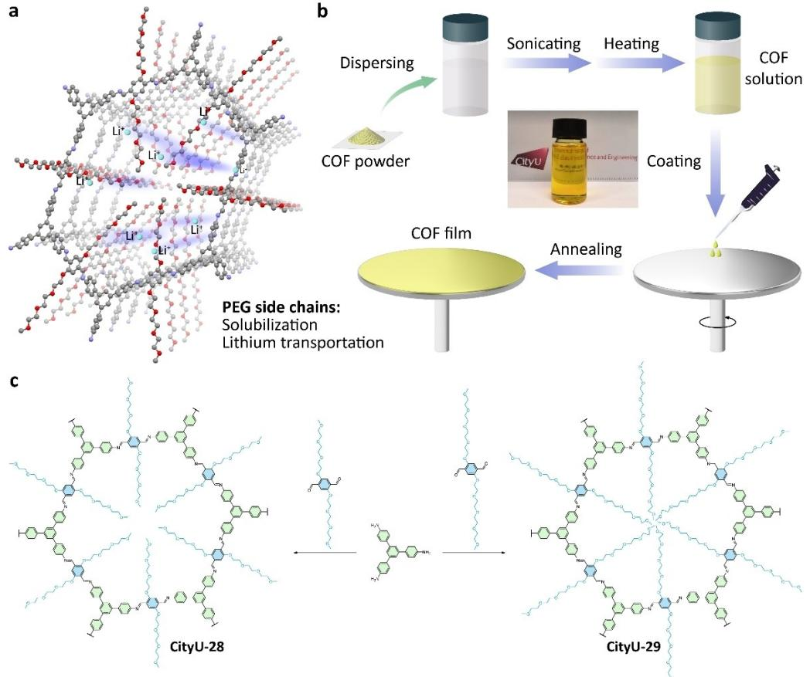
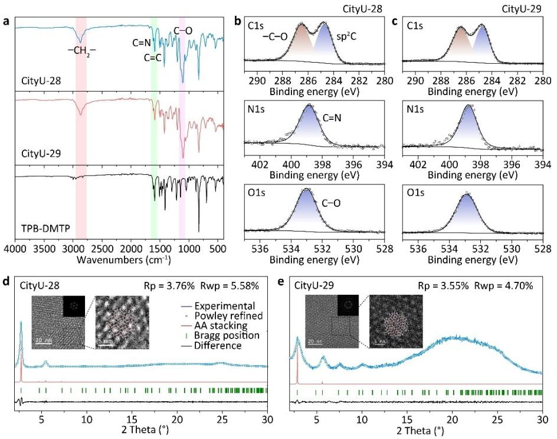
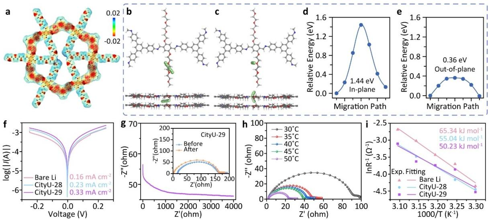
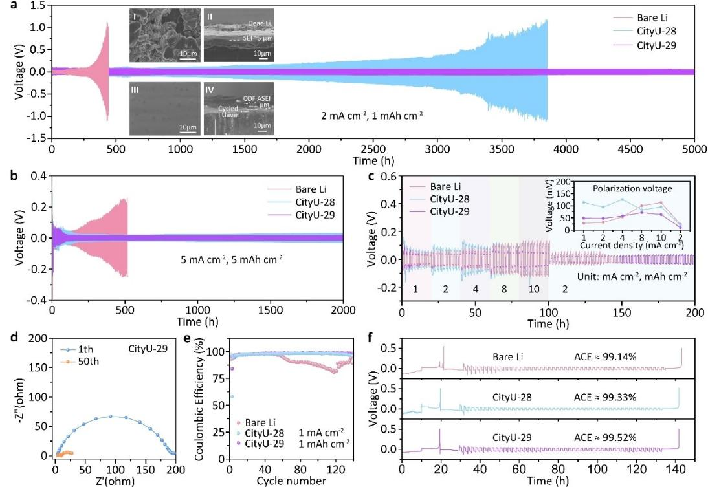
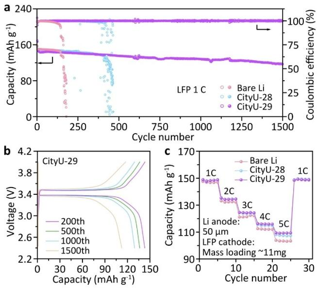

*Forschungsartikel*

*Angewandte Chemie* www.angewandte.org

## *Lithium Metal Batteries*

Zitierweise: *Angew. Chem. Int. Ed.* **2025**, *64*, e202422040 [doi.org/10.1002/anie.202422040](https://doi.org/10.1002/anie.202422040)

# **Soluble Covalent Organic Frameworks as Efficient Lithiophilic Modulator for High-Performance Lithium Metal Batteries**

*[Shen](http://orcid.org/0000-0002-0557-2003) Xu+ , Tuoya Naren+ , Yanwei Zhao, Qianfeng Gu, Ting Wai Lau, Chun-Sing Lee, Fu-Rong Chen,\* Jun Yin,\* Libao Chen,\* and [Qichun](http://orcid.org/0000-0003-1854-8659) Zhang\**

**Abstract:** Lithium metal batteries (LMBs) are regarded as the potential alternative of lithium-ion batteries due to their ultrahigh theoretical specific capacity (3860 mAhg 1 ). However, severe instability and safety problems caused by the dendrite growth and inevitable side reactions have hindered the commercialization of LMBs. To solve them, in this contribution, a design strategy of soluble lithiophilic covalent organic frameworks (COFs) is proposed. By introducing polyethylene glycol as the side chains, two COFs (**CityU-28** and **CityU-29**) not only become soluble for the facile coating technique, but also can facilitate the lithium-ion migration in batteries. Furthermore, when coated on the lithium anode of LMB, both COFs can act as artificial solid electrolyte interphase to prevent dendrite growth thus enabling the long-term stability of the cells. Notably, the symmetric CityU-29@Li cell can work for more than 5000 h at a current density of 2 mAcm 2 and an areal capacity of 1 mAhcm 2 . A remarkable capacity retention of 78.9% after 1500 cycles and a Coulombic efficiency of about 99.9% at 1.0 C can also be realized in CityU-29@Lij jLiFePO4 full cell. This work could provide a universal design strategy for soluble COFs and enlighten their application in diverse scenarios, especially energy-related fields.

### *Introduction*

[

Lithium metal batteries (LMBs) have been regarded as the "holy grail" of next-generation energy devices owing to their remarkably high theoretical specific capacity (3860 mAhg 1 ) and the lowest reduction potential ( 3.04 V).[1] However, the practical application of Li metal anode has been restricted due to the inevitable side reactions caused by the high reactivity of Li metal, the growth of Li dendrites, and safety concerns of electrolyte leakage and short-circuit fires.[2] Among all these issues, the formation of an unstable solid electrolyte interphase (SEI) at the interface of Li metal anode through the reaction between Li metal and the liquid electrolyte during the battery cycling process significantly exacerbates the degradation of the anode. Along with the Li stripping/plating, this naturally occurring SEI undergoes fragmentation and exposes fresh Li for further SEI generation. The self-perpetuating cycle results in significant morphological changes at Li anode interface, leading to dendritic extrusion and the potential formation of dead Li, ultimately depleting the electrolyte.

To solve the above problems, researchers have proposed a series of methods such as the incorporation of electrolyte additives,[3] the utilization of solid electrolytes,[4] the modification of separators,[5] the implementation of artificial solid electrolyte interphase (ASEI),[6] and the adoption of alloy anodes.[7] Among these approaches, the strategy of ASEI stands out as it targets the origin of the interfacial issue, potentially leading to a significant enhancement in

[\*] Dr. S. Xu,+ T. Naren,+ Y. Zhao, Q. Gu, Prof. Dr. F.-R. Chen, Prof. Dr. Q. Zhang Department of Materials Science and Engineering City University of Hong Kong Hong Kong SAR, 999077, P. R. China E-mail: qiczhang@cityu.edu.hk Dr. S. Xu+ State Key Laboratory of Flexible Electronics & Institute of Advanced Materials (IAM) Nanjing University of Posts & Telecommunications Nanjing 210023, P. R. China T. Naren,+ Prof. L. Chen State Key Laboratory of Powder Metallurgy Central South University Changsha 410083, P. R. China E-mail: lbchen@csu.edu.cn

T. Wai Lau, Dr. J. Yin Department of Applied Physics The Hong Kong Polytechnic University Hong Kong SAR 999077, P. R. China E-mail: jun.yin@polyu.edu.hk Prof. Dr. C.-S. Lee, Prof. Dr. Q. Zhang Department of Chemistry, Center of Super-Diamond and Advanced Films (COSDAF) & Hong Kong Institute of Clean Energy City University of Hong Kong Hong Kong SAR 999077, P.R. China Prof. Dr. Q. Zhang City University of Hong Kong Shenzhen Research Institute Shenzhen 518057, P.R. China +] These authors contributed equally to this work. © 2025 The Author(s). Angewandte Chemie published by Wiley-

VCH GmbH. This is an open access article under the terms of the Creative Commons Attribution License, which permits use, distribution and reproduction in any medium, provided the original work is properly cited.

*Angew. Chem.* **2025**, *137*, e202422040 (1 of 10) © 2025 The Author(s). Angewandte Chemie published by Wiley-VCH GmbH

interfacial stability and overall battery performance. Currently, there are two types of materials (inorganic ceramics[8] and organic polymers[9]) that represent the commonly investigated ASEIs. Although the inorganic ceramics hold the merits of excellent ionic conductivity and rigidity, they still suffer from brittleness caused fissure during the cycling process. On the other hand, organic polymers face a tradeoff between achieving high ionic conductivity and good mechanical strength. In this regard, developing new ASEI material with both tenacity, excellent mechanical strength, and high ionic conductivity is necessary.

Because of their low density, large specific surface area, excellent stability, and outstanding chemical tunability,[10] two-dimensional covalent organic frameworks (2D COFs) have been widely studied recently through exploring novel structures and discovering new properties. These efforts have led to the flourish of applications in various fields including energy/gas storage, chemical separation, catalysis, and bio-applications.[11] Especially, recent advances in the development of ionically conductive COFs for solid electrolyte[12] or ASEI[13] have been witnessed. Even though, their robust structures have been demonstrated to cause the issue of processibility.[14] The commonly obtained COFs are in powder form, which are unable to be utilized directly. Although some processing methods such as interfacial synthesis,[15] electrochemical synthesis,[16] and exfoliation into covalent organic nanosheets (CONs),[17] have been developed to prepare COF films, the complicated procedures strongly hinder the practical application of COFs, especially in large-area devices. Very recently, some researchers begin to seek the possibility in solution-processing COFs including self-exfoliation of ionic COFs[18] and acid protonation-induced exfoliation of imine COFs.[19] However, the self-exfoliation of ionic COFs requires special COF structures while the acid exfoliation method limits the application in acid sensitive scenarios. Therefore, a universal solution-processing method suitable for most COFs is highly desired but has not been realized yet.

To address the above issue, in this research, we designed and synthesized two polyethylene glycol (PEG)-grafted COFs, **CityU-28** and **CityU-29**, to realize the solutionprocessing. The selection of PEG sidechains is because they have been proven to improve the solubility of nanoscale graphene oxide.[20] Besides, they can also increase the π–π stacking distance thus weakening the interlayer interactions of COFs. By simple sonicating and heating processes, **CityU-28** and **CityU-29** can be easily dissolved in dimethyl sulfoxide (DMSO). The PEG chains show nearly no impact on the optoelectronic properties of COF skeleton and the characteristics of COFs remain unchanged during the solution-processing, demonstrating the universality of this strategy. This enables the solution-processing of **CityU-28** and **CityU-29** in extreme conditions, such as spin-coating COF film on Li metal to act as ASEI. By incorporating PEG chains, the ionic conductivity of **CityU-28** and **CityU-29** can also be promoted and the dendrite formation of the Li metal anode can be inhibited (Figure 1a). Consequently, the Li anode coated with **CityU-28** (**CityU-28**@Li) or **CityU-29** (**CityU-29**@Li) exhibited excellent stability during cycling. The symmetric battery of **CityU-29**@Li demonstrated remarkable cycling performance, maintaining 5000 h of cycling at 2 mAcm 2 and 1 mAhcm 2 (Table S1). Even at high areal capacity of 5 mAhcm 2 , **CityU-28**@Li and **CityU-29**@Li could sustain more than 2000 h of long-term cycling. These results indicate an ultra-stable practical application, particularly at large areal capacities. Furthermore, the **CityU-29**@Lij jLiFePO4 (LFP) full cell displayed exceptional cycle stability, achieving over 1450 cycles with 80% capacity retention at 1 C. Thus, we believe that the utilization of soluble PEG-grafted COFs on the Li anode surface can effectively inhibit dendrite formation, enabling the construction of stable LMBs.

#### *Results and Discussion*

In this research, TPB-DMTP was selected as the model COF owing to its excellent crystallinity.[21] In order to reduce the impact on the COF properties and increase the solubility, we introduced the methyl-encapsulated PEG (mPEG) as the side chain to replace the methoxyl groups of TPB-DMTP. A processing procedure was also developed to dissolve COF for the coating technique (Figure 1b). A bottom-up method was applied in grafting mPEG sidechains to guarantee the absolute chemical structure of the as-obtained COFs (**CityU-28** and **CityU-29**). The mPEGs (mPEG3 and mPEG4) were firstly tosylated, and then reacted with 2,5-dihydroxyterephthaldeyde (DHTP) to yield TP3 and TP4 (Figures S1–6). **CityU-28** / **CityU-29** were obtained through Schiff condensation reaction between 1,3,5-tri-(4-aminophenyl)benzene (TAPB) and TP3 / TP4 (Figure 1c).

The Fourier Transform infrared (FT-IR) spectra were performed to confirm the structure of **CityU-28** and **CityU-29** (Figure 2a). The existence of imine bond signal at 1614 cm 1 indicates the success of condensation reaction, which is similar to TPB-DMTP. However, in contrast to TPB-DMTP, two new peaks appear at around 2870 and 1100 cm 1 , referring to the signal of methylene and carbonoxygen single bond of mPEG chain, respectively.[22] The Xray photoelectron spectra (XPS) of **CityU-28** and **CityU-29** were also tested. Two COFs exhibited nearly identical XPS spectra due to the analogous chemical structure (Figure 2b,c). According to the C1s spectra, two peaks with similar intensity can be recognized. The peaks with binding energy of 284.7 and 286.5 eV refer to the signal of aromatic carbon and the carbon in mPEG chain, respectively.[23] Besides, the peak with binding energy of 398.9 eV in N1s spectra is originated from imine bond, while the peak at 533.0 eV in O1s spectra comes from the signal of C–O bond of mPEG. Therefore, the chemical structures of **CityU-28** and **CityU-29** can be clearly confirmed.

Then, the powder X-ray diffraction (PXRD) patterns were characterized to evaluate the crystalline feature of two COFs.[24] As shown in Figure 2d, three main peaks with 2θ of 2.74, 5.47 and 24.74° can be observed, corresponding to the (100), (200), and (001) facets, respectively. Besides, some small peaks at 2θ of 7.34, 9.68 and 12.21° can also be

*Forschungsartikel*

*Figure 1.* Schematic illustration of a) PEG enabled solubilization and lithium-ion transportation, as well as b) solution preparation process of mPEG-grafted COFs. Inset: photograph of **CityU-29** solution. c) Synthesis of **CityU-28** and **CityU-29**.

identified, referring to the (210), (310), and (320) facets, respectively. Based on the optimal monolayer structure of **CityU-28**, the eclipsed (AA) and staggered (AB) stacking modes were built and optimized by Materials Studio. The simulated PXRD patterns reveal that the experimental result matches the AA stacking well, adopting a space group of P6 with *a*=*b*=37.5250 Å, interlayer distance (c) of 3.6323 Å, α=β=90°, and γ=120° (Figure S7a and Table S2). The Rp and Rwp values are 3.76 and 5.58%, indicating the well-matched structure. The peak intensity of (100) facet reaches 120,000 cps, illustrating excellent crystallinity of **CityU-28**. Meanwhile, the high-resolution transmission electron microscope (HRTEM) image of **CityU-28** was acquired. As shown in inset of Figure 2d, clear lattice points can be observed which well match the COF structure. The fast Fourier transfer (FFT) pattern demonstrates bright diffraction points. These HRTEM results also evidence the excellent crystallinity of **CityU-28**. Similar to **CityU-28**, **CityU-29** shows 4 main peaks at 2θ of 2.84, 5.78, 7.55, and 10.13°, corresponding to the (100), (200), (210), and (310) facets, respectively (Figure 2e). A broad peak at around 20° is originated from the π–π stacking of (001) facet. The experimental PXRD pattern also matches the simulated AA stacking mode well (Figure S7b and Table S3). The Powley refined pattern exhibits Rp and Rwp values of 3.55 and 4.70%, respectively. The HRTEM image of **CityU-29** also illustrates its good crystallinity. The SEM images of COF powders clearly demonstrate their layered structure (Figure S8). Along with the increasing number of the PEG unit from 0 (TPB-DMTP) to 3 (**CityU-28**) then to 4 (**CityU-29**), the interlayer distance increases from 3.5215 to 3.6323 then to 4.2628 Å. This increment should be ascribed to the distortion of flexible mPEG chains. The obvious increase of interlayer distance from **CityU-28** to **CityU-29** could be attributed to the steric hindrance when the PEG chain freely extended in plane because of the mismatch of pore size and chain length, thus causing the chain twisting in perpendicular direction. This should also be the main reason of slightly poorer crystallinity of **CityU-29** than **CityU-28**. Nitrogen uptake isotherm was tested to evaluate the pore structure. Although grafted six mPEG3 chains in a single pore, **CityU-28** still provides a Brunauer–Emmett–Teller (BET) surface area of 183.6 m2 g 1 with pore width mainly distributed at 1.1 nm (Figure S9). The BET surface area of **CityU-29** is determined to be 81.1 m2 g 1 , which is relatively lower than **CityU-28** owing to the longer mPEG chains. The pore width of **CityU-29** is mainly distributed in 1.4–2.0 nm.

Solubility of the as-synthesized **CityU-28** and **CityU-29** is one of the most important features in this work. Excitingly, transparent solution in Pyrex tube was observed just after

*Figure 2.* a) FT-IR spectra of **CityU-28**, **CityU-29**, and THB-DMTP. C1s (top), N1s (middle), and O1s (bottom) XPS spectra of b) **CityU-28** and c) **CityU-29**. PXRD patterns of experimental results, Powley refined results, and their differences, as well as simulated AA stacking patterns and Bragg positions of d) **CityU-28** and e) **CityU-29**. Insets: HRTEM images of d) **CityU-28** and e) **CityU-29**, and corresponding fast Fourier transfer patterns.

72 h condensation reaction of **CityU-28** and **CityU-29**, which is quite different from the reaction of TPB-DMTP where powder was found even at 120 °C (Figure S10). However, after cooling down to the room temperature, the transparent solutions of **CityU-28** and **CityU-29** became gel similar to TPB-DMTP, thus the temperature has a great impact on the solubility of **CityU-28** and **CityU-29**. Besides, only powders of **CityU-28** and **CityU-29** can be obtained after the general processing steps (see Supplementary Method). Meanwhile, apparent volumetric contraction was noticed during the drying process. Therefore, we believe that the monolayer or few-layers of COF are loosely packed in solution or gel states, where PEG chains freely extend to avoid stacking. Along with the extraction of solvent molecules, the layered COFs quickly stack during the drying process. Considering the above factors, we decided to redissolve the COFs before drying. With the assistance of sonicating to form homogeneous dispersion and heating to increase the solubility, the transparent solutions of **CityU-28** and **CityU-29** could be achieved (inset in Figure 1b). Solvent screening demonstrated that **CityU-28** and **CityU-29** showed better solubility in polar aprotic solvents. The solubility of **CityU-29** can reach 7 mgmL 1 in DMSO. The reobtained COF from solution expresses distinct PXRD peaks (Figure S11), illustrating the success of COF dissolution.

Apart from the solubility, the lithium-ion transporting capability of mPEG-grafted COFs is also important and was evaluated by density functional theory (DFT) calculations. The electrostatic potential (ESP) distribution of **CityU-28** (Figure 3a) shows that negative charges are localized near oxygen atoms of mPEG chains and nitrogen atoms of imine linkages. These electron-rich positions provide potential coordination sites for lithium-ions (Li+).[25] As expected, the binding energies of O Li and N Li are below zero, confirming the possibility of Li+ coordination (Figure S12a,b).[26] Furthermore, the binding energies are larger than the desolvation energy, thus enabling the Li+ transport through the mPEG-grafted COFs (Figure S12c). The migration path of Li+ was also estimated.[27] According to Figures 3b-e and S13, the out-of-plane path near oxygen atoms shows lowest energy barrier of 0.36 eV during the migration, which is parallel to the 1D pore channel. Therefore, the lithium-ions can transport along the 1D pores through the mPEG chains.

To exploit the solubility and lithiophilicity of **CityU-28** / **29**, both COFs were in situ coated on the Li metal anode to reveal the possibility in suppressing dendrite growth caused by the generation of unstable SEI. The focused ion beam scanning electron microscope (FIB-SEM) image indicates that the thickness of coating layer is ~500 nm, which suggests a good adhesion between the Li and coating layer (Figure S14). This moderate thickness balances the enough protection for long-term cycling and fast Li+ transport. Moreover, the mechanical strength of the ASEI layer was tested by atomic force microscopy (AFM). High average Young's moduli of 16.88 and 17.01 GPa for **CityU-28** and **CityU-29** were obtained, respectively, which represent

*Figure 3.* a) Electrostatic potential (ESP) distribution of **CityU-28**, where red and blue represent negative and positive charge, respectively. Top-view (top) and front-view (bottom) of calculated b) in-plane and c) out-of-plane lithium-ion migration paths near oxygen and d,e) their diffusion energy barriers in **CityU-28**. f) Tafel plots of bare Li, **CityU-28**@Li, and **CityU-29**@Li symmetric cells and the calculated exchange current density. g) Polarization curve of **CityU-29**@Li symmetrical cell. Inset: EIS before and after polarization. h) EIS of **CityU-29**@Li symmetric cells at different temperatures. i) Corresponding Arrhenius curves and comparison of activation energies of bare Li, **CityU-28**@Li, and **CityU-29**@Li symmetric cells.

enough capability (*>*3 GPa) to prohibit the growth of Li dendrites (Figure S15).[28]

The porous structure and long mPEG chains can redistribute the Li+ flux to make the uniform stripping/ plating process smoothly.[29] The **CityU-28** or **CityU-29** can act as an ASEI layer, which could effectively prevent direct contact between the electrolyte and the anode thus avoiding the side reactions. To prove this, the electrochemical kinetic performance of **CityU-28/29**@Li was explored via testing the exchange current density (*I*0) from the corresponding Tafel plots (Figure 3f). The results show that, in the symmetric cells, the *I*0 of **CityU-29**@Li is 0.33 mAcm 2 for Li stripping/ plating, which is higher than that of **CityU-28**@Li (0.23 mAcm 2 ) and bare Li (0.16 mAcm 2 ). This suggests that mass transfer kinetics are effectively facilitated during the desolvation process. In addition, the migration of Li+ in the COF interlayer further confirms its kinetic and fast charging/discharging properties. The Li+ migration number (tLi+) of the symmetric cell increases from 0.33 of bare Li to 0.65 of **CityU-29**@Li, which is attributed to the accelerated ionic migration of the COF structure through the pore sieve effect and the assistant of mPEG chains (Figures 3g and S16). These results reveal that the adsorbed Li+ can freely diffuse over the relatively low migration barrier, and the unique structure of **CityU-29** helps to increase the Li+ mobility, which leads to an improved tLi+ number and agrees with the calculation.[30] Besides, it has been reported that PEG chains offer a distinctive solvation environment for Li+ due to the chelation capability of glymes through multiple coordination sites. The chelate effect produced by multidentate ligands provides increased stability to the complex ions, which means longer PEG chains create more stable complexes with Li+. [31] Regarding the dissolution evolution of electrolyte ( 1 M LiTFSI in DOL, DME) after the addition of **CityU-28/29**, the characteristic peaks at 1334.1 cm 1 in FT-IR spectra, corresponding to the stretching of SO within TFSI anion, shift to the 1334.8 cm 1 of **CityU-28**, and 1335.0 cm 1 of **CityU-29** (Figure S17). Meanwhile, other characteristic peaks remain unchanged. The shift of peaks after the introduction of **CityU-28/29** indicates the enhanced dissociation of LiTFSI on account of the forceful interaction of **CityU-28/29**-LiTFSI, which can effectively increase the free Li+ concentration of electrolyte.[32] To further explore the effect of the COF protective layer on the ion transport process, the temperature-dependent Nyquist data were fitted using the Arrhenius equation to determine the activation energy (*E*a) reflected by the reaction rate (Figure 3h,i). The activation energies were calculated to be 65.34, 55.04, and 50.23 kJmol 1 for symmetric cells of bare Li, **CityU-28**@Li, and **CityU-29**@Li, respectively. The significant reduction in activation energy confirms that the modified COF layer contributes to the improvement of ionic transport, accelerates the desolvation of Li+, and reduces the polarization of the cell during cycling.

The long cycling performance is the best way to test the reversibility of Li metal anodes. As shown in Figure 4a, both **CityU-28**@Li and **CityU-29**@Li exhibit excellent stability at current density of 2.0 mAcm 2 and areal specific capacity of 1.0 mAhcm 2 . The **CityU-29**@Li, in particular, can be stably cycled for more than 5000 h. It is noteworthy that although bare Li exhibits a low polarization voltage (~30 mV) during the first 200 h, which is much smaller than those of **CityU-28**@Li (~50 mV) and **CityU-29**@Li (~80 mV), the planned voltage of bare Li rises exponentially along with the cycling proceeds, indicating the cracks of the SEI and the growth of dendritic protrusions on bare Li. On the contrary, the polarization voltage of **CityU-29**@Li gradually decreased

# *Forschungsartikel*

*Figure 4.* Voltage time profiles of Li plating/stripping processes of bare Li, **CityU-28**@Li, and **CityU-29**@Li symmetrical cells a) at 2 mAcm 2 and 1 mAhcm 2 , and b) at 5 mAcm 2 and 5 mAhcm 2 . Inset of a): surface and cross section SEM images of (I, II) bare Li and (III, IV) **CityU-29**@Li deposition morphology after 100 cycles. c) Rate performance of symmetric cells with different current densities and areal capacity from 1 to 10 mAcm 2 . d) The Nyquist plots of symmetric **CityU-29**@Li cells measured at 1 and 50 cycles at 2 mAcm 2 /1 mAhcm 2 . e) Long-term cycling of Li Cu half cells under 1 mAcm 2 /1 mAhcm 2 . f) Average Coulombic efficiency (ACE) measurement after 50 cycles.

and stabilized at 65 mV during the cycling process, which laterally proves that **CityU-29**@Li has good stability on the Li metal surface. In addition, it has been shown that the higher the polarization voltage, the finer the grains formed and the denser the deposited layer.[33] After long cycling, the **CityU-29**@Li exhibits a dendrite-free and uniform Li deposition, as illustrated by inset images of Figure 4a. In contrast, the bare Li surface delivers uneven and porous Li deposition. This difference highlights the effect of the COF layer in inducing uniform Li deposition and inhibiting dendrite formation, thus resulting in a dense and compact structure in the **CityU-29**@Li sample. The XPS spectra of the anode were also characterized to analyze the conformation of SEI. For **CityU-29**@Li anode, no significant component change is observed because the COF acts as ASEI to prevent the direct contection of lithium and solvent (Figure S18). Only slight change in the ratio of N Li and PEG Li can be recognized in Li1s spectra owing to the increased amount of C–O involving the Li+ transport after cycling. In contrast, electrolyte decomposition products including RCO2Li and ROLi can be found in the SEI of bare Li anode after cycling, which is responsible for the dendrite growth and battery failure.[34] Therefore, the following Li plating/stripping process under the protection of COF ASEI is proposed. Lithium-ions firstly desolvate and pass through the COF's pores facilitated by the ordered structure and PEG chains. After migrating to the surface of

To further investigate the effect of COF-modified ASEI during Li plating/stripping process, we tested extreme condition at current density of 0.5 mAcm 2 and high areal capacity of 5.0 mAhcm 2 . For host-free Li metal anodes, cycling under high areal specific capacity requires a tight grain arrangement. Compared with bare Li which was cycled for only 400 h, **CityU-28**@Li and **CityU-29**@Li were stably cycled for more than 820 h and 1100 h, respectively (Figure S19). A harsher condition with both high current density of 5.0 mAcm 2 and high areal capacity of 5.0 mAhcm 2 was examined to estimate the protection of ASEI. As shown in Figure 4b, there is a more obvious polarization phenomenon in **CityU-28**@Li based cell due to harder Li+ transportation. The **CityU-29**@Li symmetrical cell reveals an outstanding stability of working for more than 2000 h, indicating that **CityU-29** coordinates the Li+ flux through the ordered pore structure and protects the Li metal anode well. This can be attributed to their order porous structures and PEG chains

Li metal surface, the lithium-ions combine with electrons thus leading to nucleation. The ordered structure and micropores of ASEI result in uniform nucleation and avoid the formation of dandrites. Besides, the high Young's modulus of COF ASEI can effctively suppress the growth of Li dentrites. During the stripping step, Li atoms lose electrons and become Li+ on the anode. These Li ions then travel the ASEI through the COF's ordered pores, with the PEG chain continuing to expedite their transport.

that protect the Li metal anode well. Particularly, **CityU-29**@Li exhibits a superior performance thanks to the longer PEG chains. The rate performance at current densities of 1, 2, 4, 8, 10, and 2 mAcm 2 was also tested to further investigate the cycling stability of bare Li, **CityU-28**@Li, and **CityU-29**@Li symmetrical cells. As illustrated in Figure 4c, **CityU-28**@Li and **CityU-29**@Li demonstrated slightly higher polarization voltages compared to bare Li at low current densities of 1 and 2 mAcm 2 , however, both exhibited relatively lower polarization voltages at high current densities of 4, 8, and 10 mAcm 2 . Notably, following a stable Li plating/stripping process in the preceding cycles, **CityU-28**@Li and **CityU-29**@Li maintained stable and minimally polarized cycling even as the current density abruptly decreased to 2 mAcm 2 . In contrast, bare Li quickly experienced a short circuit due to the lack of COF interface protection and the absence of uniform deposition induced by rich lithiophilic sites. The interfacial properties of two symmetric cells were monitored through the study of electrochemical impedance spectroscopy (EIS). Initially, **CityU-29**@Li exhibited higher impedance after the first cycle, attributed to the reduced conductivity of the COF material. However, after 50 cycles, the interfacial impedance of **CityU-29**@Li significantly decreased compared with that of the uncoated lithium battery (Figures 4d and S20). This reduction can be attributed to the activation of the interface, which is crucial in mitigating impedance. Without the protective COF layer, the Li anode is susceptible to developing numerous dendritic protrusions during long-term plating and stripping cycles. Consequently, the impedance increases as these protrusions detach from the surface. On the other hand, the COF layer offers protection to the Li metal, resulting in the stabilization and inhibition of dendrite growth. This protective effect ensures that the average symmetric electrode impedance remains stable over time.

The Coulombic efficiency (CE) is a crucial indicator to evaluate the reversibility of LMBs. A half-cell was constructed using Li foil and Cu foil (both coated with **CityU-28** or **CityU-29**) for a galvanostatic discharge/charge test to evaluate the utilization of Li metal during the plating/ stripping process. As shown in Figure 4e, the half-cell integrated with **CityU-29** demonstrates superior CE and cyclic stability at 98.5% after 150 cycles. In stark contrast, the CE of the Lij jCu half-cell exhibits significant fluctuations after 40 cycles at the same current density and a specific capacity of 1 mAhcm 2 , attributed to dendrite growth and the accumulation of dead Li. The Li plating profiles on Cu and COF-coated Cu foil are shown in Figure S21. The overpotential spike of the **CityU-29** modified asymmetric cell is as low as 200 mV, much lower than that of the **CityU-28** (420 mV) and unmodified one (620 mV).[35] These results highlight the effectiveness of COF in safeguarding the SEI against dendrite penetration and promoting uniform Li+ deposition. Furthermore, an approach was developed to accurately determine the average Coulombic efficiency (ACE), which circumvents substrate conditions' influence and evaluates the reversibility of Li metal anode under specific conditions.[36] **CityU-29**@Li demonstrates high ACE value of 99.52% over 50 cycles,

surpassing bare Li which is deemed inadequate for practical cell operation (Figure 4f).

Figure 5a shows the cycling performance of the LFPj j Li, LFPj j**CityU-28**@Li, and LFPj j**CityU-29**@Li full cells. All the three cells show similar initial specific capacities (~150 mAhg 1 ) at 1 C. The excellent long-term cycling stability of the LFPj j**CityU-29**@Li full cell is highlighted by its capacity retention of 78.9% after 1500 cycles and a CE value of about 99.9% at 1.0 C, contrasting the rapid capacity decay of the LFPj j**CityU-28**@Li after 415 cycles. The bare Li, on the other hand, exhibits a decay in specific capacity to 131 mAhg 1 after 161 cycles, attributed to repeated breakdown and reconstruction of the SEI, as well as the loss of active Li and accumulation of dead Li. This superior performance of **CityU-29** can be attributed to the beneficial features of the layered 2D COF, which prevents direct contact between the electrolyte and the Li metal, thereby reducing side reactions.[37] Additionally, the long PEG chains in **CityU-29** homogenize the transport and deposition of Li+, showing enhanced effectiveness with longer chains (Figure 5b). The unfilled pores of **CityU-28** due to the shorter mPEG chains may provide the room for small dendrite growth, leading to the crash of CE and specific capacity. The rate performance and cycle stability of the LFPj j**CityU-29**@Li cell are showcased in Figure 5c, where it delivers average discharge capacities of 148.9, 135.2, 124.5, 116.0, and 109.4 mAhg 1 at 1, 2, 3, 4, and 5 C, respectively. Notably, even after operating at higher current densities, the full cell maintains high capacities of 148.5 mAhg 1 upon recovery to 1 C, demonstrating excellent cycling stability and reversibility. In comparison, the rate performance of the LFPj jLi full cell lags behind that of the COF-modified Li foil due to uncontrolled dendrite growth on the anode surface.[38] Full-

*Figure 5.* a) Cycling performance of LFPj jLi, LFPj j**CityU-28**@Li, and LFPj j**CityU-29**@Li cells at 1 C. (b) Charge–discharge curves of LFPj j**CityU-29**@Li at different cycles. (c) Rate performance of LFPj j Li, LFPj j**CityU-28**@Li, and LFPj j**CityU-29**@Li at 1, 2, 3, 4, and 5 C.

*Angew. Chem.* **2025**, *137*, e202422040 (7 of 10) © 2025 The Author(s). Angewandte Chemie published by Wiley-VCH GmbH

cells using NCM811 as cathode were also assembled with high cathode mass loading (16.2 mg cm 2 ) and thin Li foil (50 μm). The NCMj j**CityU-29**@Li full cell with lower N/P ratio exhibits high capacity retention of 65% at 1.0 C after 200 cycles, illustrating good long-term stability (Figure S22).

#### *Conclusion*

In this work, we proposed a universal design strategy of soluble COFs and developed a processing procedure to prepare their solution. The mPEG chains introduced through a bottom-up synthetic method not only increase the solubility of bulk COF materials, but also promote the migration of lithium-ions due to their lithiophilicity. Combining with the outstanding stability and porous structure of the mPEG-grafted **CityU-28** and **CityU-29**, both could be served as the ASEI to protect the Li metal anode of LMBs. With the assistance of **CityU-29**, the Li+ migration number (tLi+) of the symmetric cell can be increased from 0.33 of bare Li to 0.65 of **CityU-29**@Li. The activation energy is also significantly reduced from 65.34 kJmol 1 for bare Li symmetric cell to 50.23 kJmol 1 for **CityU-29**@Li cell. As a result, the **CityU-29**@Li symmetric cell exhibits an outstanding long-term stability that can work for more than 5000 h at a current density of 2.0 mAcm 2 and an areal specific capacity of 1.0 mAhcm 2 without obvious change. In sharp contrast, the bare Li symmetric cell can only work for about 400 h. Even at a large areal specific capacity of 5.0 mAhcm 2 , the **CityU-29**@Li electrode can work for more than 2000 h while the symmetric cells of bare Li shortcircuited after 500 h. Meanwhile, the ACE of the **CityU-29**@Li symmetric cell can reach 99.52% after 50 stripping/ plating cycles. All these results clearly demonstrate the protection effect of mPEG-grafted COFs to prevent the dendrite formation during the cycling and the acceleration of the Li+ migration. Besides, the asymmetric LFP full cells were also assembled, where specific capacity of LFPj jLi cell rapidly dropped only after 180 cycles, while LFPj j**CityU-29**@Li full cell can work for more than 1500 cycles with a capacity retention of 78.9% and a CE above 99.9%. NCMj j **CityU-29**@Li full cell with lower N/P ratio exhibits high capacity retention of 65% at 1.0 C after 200 cycles. This further illustrates the excellent protection performance of mPEG-grafted COFs as ASEI for LMBs and the fascinating design concept of this contribution.

#### *Supporting Information*

The authors have cited additional references within the Supporting Information.[39–61]

#### *Acknowledgements*

Q.Z. acknowledges the funding support from the City University of Hong Kong (9380117 and 7020089), Hong Kong Branch of National Precious Metals Material Engi-

neering Research Center (NPMM), the National Natural Science Foundation of China (NSFC, 22475183), Shenzhen Science and Technology Program (JCYJ20240813153135046) the State Key Laboratory of Supramolecular Structure and Materials, and Jilin University (grant sklssm2024039). C.S.L. and Q.Z. thanks the funding support from the Innovation and Technology Fund (ITF, ITS/322/22). S.X. thanks the funding support from Natural Science Foundation of Jiangsu Province for Young Scientists Fund Program (BK20240640) and Natural Science Research Start-up Foundation of Recruiting Talents of Nanjing University of Posts and Telecommunications (Grant No. NY224003).

#### *Conflict of Interest*

The authors declare no conflict of interest.

#### *Data Availability Statement*

The data that support the findings of this study are available in the supplementary material of this article.

**Keywords:** artificial solid-electrolyte interphase **·** covalent organic frameworks **·** lithium metal battery **·** reticular chemistry **·** solution-processing

- [1] a) D. Lin, Y. Liu, Y. Cui, *Nat. [Nanotechnol.](https://doi.org/10.1038/nnano.2017.16)* **2017**, *12*, 194–206; b) W. Xu, J. Wang, F. Ding, X. Chen, E. Nasybulin, Y. Zhang, J. Zhang, *Energy [Environ.](https://doi.org/10.1039/C3EE40795K) Sci.* **2014**, *7*, 513–537; c) X. Zhang, Y. Yang, Z. Zhou, *Chem. Soc. Rev.* **2020**, *49*, 34–371; d) J. Sun, F. Kang, D. Yan, T. Ding, Y. Wang, X. Zhou, Q. Zhang, *Angew. Chem. Int. Ed.* **2024**, *63*, e202406511.
- [2] X. Cheng, R. Zhang, C. Zhao, Q. Zhang, *[Chem.](https://doi.org/10.1021/acs.chemrev.7b00115) Rev.* **2017**, *117*, [10403–10473](https://doi.org/10.1021/acs.chemrev.7b00115).
- [3] a) H. Zhang, G. G. Eshetu, X. Judez, C. Li, L. M. Rodriguez Martínez, M. Armand, *[Angew.](https://doi.org/10.1002/anie.201712702) Chem. Int. Ed.* **2018**, *57*, [15002–15027](https://doi.org/10.1002/anie.201712702); b) J. Zheng, M. H. Engelhard, D. Mei, S. Jiao, B. J. Polzin, J. Zhang, W. Xu, *Nat. Energy* **2017**, *2*, 17012; c) W. Li, H. Yao, K. Yan, G. Zheng, Z. Liang, Y. Chiang, Y. Cui, *Nat. Commun.* **2015**, *6*, 7436.
- [4] a) S. Duan, L. Qian, Y. Zheng, Y. Zhu, X. Liu, L. Dong, W. Yan, J. Zhang, *Adv. Mater.* **2024**, *36*, 2314120; b) L. Bai, B. Chen, D. Zhang, Y. Xu, S. Zhang, Y. He, F. Yu, K. Liu, D. Xu, Z. Chang, *Energy Fuels* **2024**, *38*, [10634–10652](https://doi.org/10.1021/acs.energyfuels.4c01525); c) Z. Zhang, W. Han, *Nano-Micro Lett.* **2024**, *16*, 24.
- [5] a) X. Yang, Y. Wang, Y. Guo, Z. Liao, W. Fu, J. Liu, *J. [Mater.](https://doi.org/10.1039/D4TA01269K) Chem. A* **2024**, *12*, [14848–14865](https://doi.org/10.1039/D4TA01269K); b) Z. Li, Y. Zheng, C. Liao, S. Duan, X. Liu, G. Chen, L. Dong, J. Dong, C. Ma, B. Yin, W. Yan, J. Zhang, *Adv. Funct. Mater.* **2024**, *34*, 2404427; c) X. B. Cheng, T. Z. Hou, R. Zhang, H. J. Peng, C. Z. Zhao, J. Q. Huang, Q. Zhang, *Adv. Mater.* **2016**, *28*, [2888–2895](https://doi.org/10.1002/adma.201506124).
- [6] a) T. Naren, R. Jiang, Q. Gu, G. Kuang, L. Chen, Q. Zhang, *Mater. Today [Energy](https://doi.org/10.1016/j.mtener.2024.101512)* **2024**, *40*, 101512; b) Q. Dong, B. Hong, H. Fan, C. Gao, X. Huang, M. Bai, Y. Zhou, Y. Lai, *[Energy](https://doi.org/10.1016/j.ensm.2021.11.022) Storage Mater.* **2022**, *45*, [1220–1228](https://doi.org/10.1016/j.ensm.2021.11.022); c) T. Naren, R. Jiang, P. Qing, S. Huang, C. Ling, J. Lin, W. Wei, X. Ji, Y. Chen, Q. Zhang, G. Kuang, L. Chen, *ACS Nano* **2023**, *17*, [20315–20324;](https://doi.org/10.1021/acsnano.3c06336) d) W. Zhou, M. Zhang, X. Kong, W. Huang, Q. Zhang, *Adv. Sci.* **2021**, *8*, 2004490.

*Angew. Chem.* **2025**, *137*, e202422040 (8 of 10) © 2025 The Author(s). Angewandte Chemie published by Wiley-VCH GmbH

*Angewandte Chemie*

- [7] a) M. Li, J. Lu, X. Ji, Y. Li, Y. Shao, Z. Chen, C. Zhong, K. Amine, *Nat. Rev. Mater.* **2020**, *5*, [276–294;](https://doi.org/10.1038/s41578-019-0166-4) b) M. Peng, K. Shin, L. Jiang, Y. Jin, K. Zeng, X. Zhou, Y. Tang, *Angew. Chem. Int. Ed.* **2022**, *61*, e2206770; c) M. Wan, S. Kang, L. Wang, H. Lee, G. W. Zheng, Y. Cui, Y. Sun, *Nat. Commun.* **2020**, *11*, 829.
- [8] a) D. R. MacFarlane, J. H. Huang, M. Forsyth, *[Nature](https://doi.org/10.1038/45514)* **1999**, *402*, [792–794;](https://doi.org/10.1038/45514) b) P. Bai, J. Li, F. R. Brushett, M. Z. Bazant, *Energy Environ. Sci.* **2016**, *9*, [3221–3229;](https://doi.org/10.1039/C6EE01674J) c) L. Fan, S. Wei, S. Li, Q. Li, Y. Lu, *Adv. Energy Mater.* **2018**, *8*, 1702657.
- [9] a) T. Naren, R. Jiang, G. C. Kuang, L. Zhou, L. Chen, *ChemSusChem* **2024**, *17*, e202301228; b) L. Ding, X. Yue, X. Zhang, Y. Chen, J. Liu, Z. Shi, Z. Wang, X. Yan, Z. Liang, *Proc. Natl. Acad. Sci. U.S.A.* **2023**, *120*, e1980703176; c) J. Sun, Y. Xu, Y. Lv, Q. Zhang, X. Zhou, *CCS [Chem.](https://doi.org/10.31635/ccschem.023.202302808)* **2023**, *5*, 1259– [1276;](https://doi.org/10.31635/ccschem.023.202302808) d) Q. Gu, X. Lu, C. Chen, X. Wang, F. Kang, Y. Y. Li, Q. Xu, J. Lu, Y. Han, W. Qin, Q. Zhang, *Angew. Chem. Int. Ed.* **2024**, *63*, e202409708; e) Q. Gu, J. Zha, C. Chen, X. Wang, W. Yao, J. Liu, F. Kang, J. Yang, Y. Y. Li, D. Lei, Z. Tang, Y. Han, C. Tan, Q. Zhang, *Adv. Mater.* **2024**, *36*, 2306414; f) F. Kang, L. Yan, Z. Chen, Y. Zhang, Q. Gu, J. Yang, S. Xu, X. Wang, C.-S. Lee, Y. Wang, Q. Zhang, *Angew. Chem. Int. Ed.* **2024**, [10.1002/anie.202417779.](https://doi.org/10.1002/anie.202417779)
- [10] a) C. S. Diercks, O. M. Yaghi, *Science* **2017**, *355*, eaal1585; b) N. Huang, P. Wang, D. Jiang, *Nat. Rev. Mater.* **2016**, *1*, 16068; c) A. P. Cote, A. I. Benin, N. W. Ockwig, M. O'Keeffe, A. J. Matzger, O. M. Yaghi, *Science* **2005**, *310*, 1166–1170; d) P. She, Y. Qin, X. Wang, Q. Zhang, *Adv. Mater.* **2022**, *34*, 2101175; e) S. Xu, Q. Zhang, *Mater. Today [Energy](https://doi.org/10.1016/j.mtener.2020.100635)* **2021**, *20*, [100635.](https://doi.org/10.1016/j.mtener.2020.100635)
- [11] a) Y. Shi, J. Yang, F. Gao, Q. Zhang, *ACS [Nano](https://doi.org/10.1021/acsnano.2c11346)* **2023**, *17*, [1879–1905;](https://doi.org/10.1021/acsnano.2c11346) b) J. Cao, G. Tang, F. Yan, *Adv. Energy Mater.* **2024**, *14*, 2304027; c) S. Xu, J. Wu, X. Wang, Q. Zhang, *[Chem.](https://doi.org/10.1039/D3SC04571D) Sci.* **2023**, *14*, [13601–13628](https://doi.org/10.1039/D3SC04571D); d) R. Liu, K. T. Tan, Y. Gong, Y. Chen, Z. Li, S. Xie, T. He, Z. Lu, H. Yang, D. Jiang, *[Chem.](https://doi.org/10.1039/D0CS00620C) Soc. Rev.* **2021**, *50*, [120–242](https://doi.org/10.1039/D0CS00620C); e) X. Liang, Y. Tian, Y. Yuan, Y. Kim, *Adv. Mater.* **2021**, *33*, 2105647; f) Y. Hu, L. J. Wayment, C. Haslam, X. Yang, S. Lee, Y. Jin, W. Zhang, *[EnergyChem](https://doi.org/10.1016/j.enchem.2020.100048)* **2021**, *3*, [100048](https://doi.org/10.1016/j.enchem.2020.100048); g) Y. Zhu, Q. Bai, S. Ouyang, Y. Jin, W. Zhang, *ChemSusChem* **2024**, *17*, e202301118; h) D. Yan, L. Song, F. Kang, X. Mo, Y. Lv, J. Sun, H. Tang, X. Zhou, Q. Zhang, *Angew. Chem. Int. Ed.* **2024**, [10.1002/anie.202422851.](https://doi.org/10.1002/anie.202422851)
- [12] a) Z. Liu, K. Zhang, G. Huang, S. Bian, Y. Huang, X. Jiang, Y. Pan, Y. Wang, X. Xia, B. Xu, G. Zhang, *[Chem.](https://doi.org/10.1016/j.cej.2021.133550) Eng. J.* **2022**, *433*, [133550](https://doi.org/10.1016/j.cej.2021.133550); b) Z. Shan, M. Wu, Y. Du, B. Xu, B. He, X. Wu, G. Zhang, *Chem. Mater.* **2021**, *33*, [5058–5066](https://doi.org/10.1021/acs.chemmater.1c00978); c) Y. Wang, K. Zhang, X. Jiang, Z. Liu, S. Bian, Y. Pan, Z. Shan, M. Wu, B. Xu, G. Zhang, *ACS Appl. Energy Mater.* **2021**, *4*, [11720–11725;](https://doi.org/10.1021/acsaem.1c02426) d) Y. Du, H. Yang, J. M. Whiteley, S. Wan, Y. Jin, S. Lee, W. Zhang, *Angew. Chem. Int. Ed.* **2016**, *55*, [1737–1741](https://doi.org/10.1002/anie.201509014); e) Y. Zhang, J. Duan, D. Ma, P. Li, S. Li, H. Li, J. Zhou, X. Ma, X. Feng, B. Wang, *Angew. Chem. Int. Ed.* **2017**, *56*, [16313–16317;](https://doi.org/10.1002/anie.201710633) f) Y. Hu, N. Dunlap, S. Wan, S. Lu, S. Huang, I. Sellinger, M. Ortiz, Y. Jin, S. Lee, W. Zhang, *J. Am. [Chem.](https://doi.org/10.1021/jacs.9b02448) Soc.* **2019**, *141*, [7518–7525;](https://doi.org/10.1021/jacs.9b02448) g) Y. Hu, N. Dunlap, H. Long, H. Chen, L. J. Wayment, M. Ortiz, Y. Jin, A. Nijamudheen, J. L. Mendoza-Cortes, S. Lee, W. Zhang, *CCS Chemistry* **2021**, *3*, [2762–2770.](https://doi.org/10.31635/ccschem.021.202101257)
- [13] a) L. Yue, X. Wang, L. Chen, D. Shen, Z. Shao, H. Wu, S. Xiao, W. Liang, Y. Yu, Y. Li, *Energy [Environ.](https://doi.org/10.1039/D3EE02803H) Sci.* **2024**, *17*, [1117–1131;](https://doi.org/10.1039/D3EE02803H) b) Q. Meng, X. Zhu, W. Xian, S. Wang, Z. Zhang, L. Zheng, Z. Dai, H. Yin, S. Ma, Q. Sun, *Proc. Natl. Acad. Sci. U.S.A.* **2024**, *121*, e1978251175; c) X. Ni, J. Liu, H. Ji, L. Chen, T. Qian, C. Yan, *J. Energy Chem.* **2021**, *61*, [135–140](https://doi.org/10.1016/j.jechem.2021.03.006).
- [14] X. Ni, J. Zhou, K. Long, P. Qing, T. Naren, S. Huang, W. Liu, Q. Zhao, Y. Qian, T. Qian, C. Yan, L. Chen, *Energy [Storage](https://doi.org/10.1016/j.ensm.2024.103295) Mater.* **2024**, *67*, [103295.](https://doi.org/10.1016/j.ensm.2024.103295)
- [15] H. Wang, Z. T. Zeng, P. Xu, L. S. Li, G. M. Zeng, R. Xiao, Z. Y. Tang, D. L. Huang, L. Tang, C. Lai, D. N. Jiang, Y. Liu,

H. Yi, L. Qin, S. J. Ye, X. Y. Ren, W. W. Tang, *[Chem.](https://doi.org/10.1039/C8CS00376A) Soc. Rev.* **2019**, *48*, [488–516.](https://doi.org/10.1039/C8CS00376A)

- [16] X. Wang, P. She, Q. Zhang, *[SmartMat](https://doi.org/10.1002/smm2.1057)* **2021**, *2*, 299–325.
- [17] D. Rodríguez-San-Miguel, C. Montoro, F. Zamora, *Chem. Soc. Rev.* **2020**, *49*, 2232–2291.
- [18] a) W. Kong, J. Wan, S. Namuangruk, J. Guo, C. Wang, *Sci. Rep.* **2018**, *8*, 5529; b) P. Peng, L. Shi, F. Huo, S. Zhang, C. Mi, Y. Cheng, Z. Xiang, *ACS Nano* **2019**, *13*, [878–884](https://doi.org/10.1021/acsnano.8b08667); c) L. Wang, C. Zeng, H. Xu, P. Yin, D. Chen, J. Deng, M. Li, N. Zheng, C. Gu, Y. Ma, *Chem. Sci.* **2019**, *10*, [1023–1028.](https://doi.org/10.1039/C8SC04255A)
- [19] D. W. Burke, C. Sun, I. Castano, N. C. Flanders, A. M. Evans, E. Vitaku, D. C. McLeod, R. H. Lambeth, L. X. Chen, N. C. Gianneschi, W. R. Dichtel, *[Angew.](https://doi.org/10.1002/anie.201913975) Chem. Int. Ed.* **2020**, *59*, [5165–5171](https://doi.org/10.1002/anie.201913975).
- [20] Z. Liu, J. T. Robinson, X. Sun, H. Dai, *J. Am. [Chem.](https://doi.org/10.1021/ja803688x) Soc.* **2008**, *130*, [10876–10877](https://doi.org/10.1021/ja803688x).
- [21] H. Xu, J. Gao, D. Jiang, *Nat. Chem.* **2015**, *7*, [905–912](https://doi.org/10.1038/nchem.2352).
- [22] M. C. Senarathna, H. Li, S. D. Perera, J. Torres Correas, S. D. Diwakara, S. R. Boardman, N. M. Al Kharji, Y. Liu, R. A. Smaldone, *Angew. Chem. Int. Ed.* **2023**, *62*, e202312617.
- [23] Q. Gu, J. Zha, C. Chen, X. Wang, W. Yao, J. Liu, F. Kang, J. Yang, Y. Y. Li, D. Lei, Z. Tang, Y. Han, C. Tan, Q. Zhang, *Adv. Mater.* **2024**, *36*, 2306414.
- [24] F. Kang, X. Wang, C. Chen, C. Lee, Y. Han, Q. Zhang, *J. [Am.](https://doi.org/10.1021/jacs.3c03938) Chem. Soc.* **2023**, *145*, [15465–15472.](https://doi.org/10.1021/jacs.3c03938)
- [25] P. T. Parvatkar, S. Kandambeth, A. C. Shaikh, I. Nadinov, J. Yin, V. S. Kale, G. Healing, A. Emwas, O. Shekhah, H. N. Alshareef, O. F. Mohammed, M. Eddaoudi, *J. Am. [Chem.](https://doi.org/10.1021/jacs.2c10471) Soc.* **2023**, *145*, [5074–5082](https://doi.org/10.1021/jacs.2c10471).
- [26] Z. Zhang, X. Dong, J. Yin, Z. Li, X. Li, D. Zhang, T. Pan, Q. Lei, X. Liu, Y. Xie, F. Shui, J. Li, M. Yi, J. Yuan, Z. You, L. Zhang, J. Chang, H. Zhang, W. Li, Q. Fang, B. Li, X. Bu, Y. Han, *J. Am. Chem. Soc.* **2022**, *144*, [6821–6829.](https://doi.org/10.1021/jacs.2c00563)
- [27] S. Zheng, S. Bi, Y. Fu, Y. Wu, M. Liu, Q. Xu, G. Zeng, *Adv. Mater.* **2024**, *36*, 2313076.
- [28] X. Shen, R. Zhang, X. Chen, X.-B. Cheng, X. Li, Q. Zhang, *Adv. Energy Mater.* **2020**, *10*, 1903645.
- [29] T. Naren, G. C. Kuang, R. Jiang, P. Qing, H. Yang, J. Lin, Y. Chen, W. Wei, X. Ji, L. Chen, *Angew. Chem. Int. Ed.* **2023**, *62*, e2305287.
- [30] X. Yang, L. Fang, J. Li, C. Liu, L. Zhong, F. Yang, X. Wang, Z. Zhang, D. Yu, *Angew. Chem. Int. Ed.* **2024**, *63*, e202401957.
- [31] A. Dutta, K. Matsushita, Y. Kubo, *Adv. Sci.* **2024**, *11*, 2404245.
- [32] C. He, H. Ying, L. Cai, H. Chen, Z. Xu, S. Liu, P. Huang, H. Zhang, W. Song, J. Zhang, L. Shi, W. Gao, D. Li, W. Q. Han, *Adv. Funct. Mater.* **2024**, 2410350.
- [33] M. Kim, J. Lee, Y. Kim, Y. Park, H. Kim, J. W. Choi, *J. [Am.](https://doi.org/10.1021/jacs.3c01614) Chem. Soc.* **2023**, *145*, [15776–15787.](https://doi.org/10.1021/jacs.3c01614)
- [34] H. Duan, Y. You, G. Wang, X. Ou, J. Wen, Q. Huang, P. Lyu, Y. Liang, Q. Li, J. Huang, Y. Wang, H. Liu, S. X. Dou, W. Lai, *Nano-Micro Lett.* **2024**, *16*, 78.
- [35] A. Pei, G. Zheng, F. Shi, Y. Li, Y. Cui, *[Nano](https://doi.org/10.1021/acs.nanolett.6b04755) Lett.* **2017**, *17*, [1132–1139](https://doi.org/10.1021/acs.nanolett.6b04755).
- [36] B. D. Adams, J. Zheng, X. Ren, W. Xu, J. G. Zhang, *Adv. Energy Mater.* **2018**, *8*, 1702097.
- [37] X. Wu, S. Zhang, X. Xu, F. Wen, H. Wang, H. Chen, X. Fan, N. Huang, *Angew. Chem. Int. Ed.* **2024**, *63*, e202319355.
- [38] Y. Yang, C. Zhang, G. Zhao, Q. An, Z. Y. Mei, Y. Sun, Q. Xu, X. Wang, H. Guo, *Adv. Energy Mater.* **2023**, *13*, 2300725.
- [39] P. E. Blöchl, *Phys. Rev. B* **1994**, *50*, [17953–17979.](https://doi.org/10.1103/PhysRevB.50.17953)
- [40] J. P. Perdew, K. Burke, M. Ernzerhof, *[Phys.](https://doi.org/10.1103/PhysRevLett.77.3865) Rev. Lett.* **1996**, *77*, [3865–3868](https://doi.org/10.1103/PhysRevLett.77.3865).
- [41] J. C. Sancho-García, J. L. Brédas, J. Cornil, *Chem. Phys. Lett.* **2003**, *377*, 63–68.
- [42] C. T. Lee, W. T. Yang, R. G. Parr, *[Phys.](https://doi.org/10.1103/PhysRevB.37.785) Rev. B* **1988**, *37*, 785– [789](https://doi.org/10.1103/PhysRevB.37.785).
- [43] A. D. Becke, *J. Chem. Phys.* **1993**, *98*, [5648–5652](https://doi.org/10.1063/1.464913).

*Angew. Chem.* **2025**, *137*, e202422040 (9 of 10) © 2025 The Author(s). Angewandte Chemie published by Wiley-VCH GmbH

- [44] M. J. Frisch, G. W. Trucks, H. B. Schlegel, G. E. Scuseria, M. A. Robb, J. R. Cheeseman, G. Scalmani, V. Barone, G. A. Petersson, H. Nakatsuji, X. Li, M. Caricato, A. V. Marenich, J. Bloino, B. G. Janesko, R. Gomperts, B. Mennucci, H. P. Hratchian, J. V. Ortiz, A. F. Izmaylov, J. L. Sonnenberg, D. Williams-Young, F. Ding, F. Lipparini, F. Egidi, J. Goings, B. Peng, A. Petrone, T. Henderson, D. Ranasinghe, V. G. Zakrzewski, J. Gao, N. Rega, G. Zheng, W. Liang, M. Hada, M. Ehara, K. Toyota, R. Fukuda, J. Hasegawa, M. Ishida, T. Nakajima, Y. Honda, O. Kitao, H. Nakai, T. Vreven, K. Throssell, J. A. Montgomery, Jr., J. E. Peralta, F. Ogliaro, M. J. Bearpark, J. J. Heyd, E. N. Brothers, K. N. Kudin, V. N. Staroverov, T. A. Keith, R. Kobayashi, J. Normand, K. Raghavachari, A. P. Rendell, J. C. Burant, S. S. Iyengar, J. Tomasi, M. Cossi, J. M. Millam, M. Klene, C. Adamo, R. Cammi, J. W. Ochterski, R. L. Martin, K. Morokuma, O. Farkas, J. B. Foresman, D. J. Fox, *Gaussian 16 Revision. A.03*, Gaussian Inc., Wallingford, CT, **2016**.
- [45] Y. Xie, Y. Huang, Y. Zhang, T. Wu, S. Liu, M. Sun, B. Lee, Z. Lin, H. Chen, P. Dai, Z. Huang, J. Yang, C. Shi, D. Wu, L. Huang, Y. Hua, C. Wang, S. Sun, *Nat. Commun.* **2023**, *14*, 2883.
- [46] S. Huang, Z. Wu, B. Johannessen, K. Long, P. Qing, P. He, X. Ji, W. Wei, Y. Chen, L. Chen, *Nat. Commun.* **2023**, *14*, 5678.
- [47] Z. Shi, Y. Wang, X. Yue, J. Zhao, M. Fang, J. Liu, Y. Chen, Y. Dong, X. Yan, Z. Liang, *Adv. Mater.* **2024**, *36*, 2401711.
- [48] J. Luo, Q. Huang, D. Shi, Y. Qiu, X. Zheng, S. Yang, B. Li, J. Weng, M. Wu, Z. Liu, Y. Yu, C. Yang, *Adv. Funct. Mater.* **2024**, *34*, 2403021.
- [49] Y. Gu, J. Hu, M. Lei, W. Li, C. Li, *Adv. Energy Mater.* **2024**, *14*, 2302174.
- [50] Z. Yu, S. Seo, J. Song, Z. Zhang, S. T. Oyakhire, Y. Wang, R. Xu, H. Gong, S. Zhang, Y. Zheng, Y. Tsao, L. Mondonico,

E. G. Lomeli, X. Wang, W. Kim, K. Ryu, Z. Bao, *Adv. Energy Mater.* **2022**, *12*, 2201025.

- [51] D. Wang, T. Xie, C. Qin, X. Wang, G. Li, Y. Liu, H. Zou, L. Huang, Y. Wu, *Adv. Funct. Mater.* **2022**, *32*, 2206405.
- [52] J. Kong, T. Hou, T. Shi, J. Li, X. Deng, D. Li, Y. Huang, H. Xu, *Sci. China Mater.* **2024**, *67*, [1403–1411](https://doi.org/10.1007/s40843-024-2914-x).
- [53] S. Ye, X. Chen, R. Zhang, Y. Jiang, F. Huang, H. Huang, Y. Yao, S. Jiao, X. Chen, Q. Zhang, Y. Yu, *Nano-Micro Lett.* **2022**, *14*, 187.
- [54] Y. Han, R. Fang, C. Lu, K. Wang, J. Zhang, X. Xia, X. He, Y. Gan, H. Huang, W. Zhang, Y. Xia, *ACS Appl. [Mater.](https://doi.org/10.1021/acsami.3c06007) Interfaces* **2023**, *15*, [31543–31551.](https://doi.org/10.1021/acsami.3c06007)
- [55] J. Liang, X. Li, Y. Zhao, L. V. Goncharova, G. Wang, K. R. Adair, C. Wang, R. Li, Y. Zhu, Y. Qian, L. Zhang, R. Yang, S. Lu, X. Sun, *Adv. Mater.* **2018**, *30*, 1804684.
- [56] C. Wang, R. Odstrcil, J. Liu, W. Zhong, *J. [Energy](https://doi.org/10.1016/j.jechem.2022.06.017) Chem.* **2022**, *73*, [248–258](https://doi.org/10.1016/j.jechem.2022.06.017).
- [57] F. Zhao, P. Zhai, Y. Wei, Z. Yang, Q. Chen, J. Zuo, X. Gu, Y. Gong, *Adv. Sci.* **2022**, *9*, 2103930.
- [58] L. Yu, Q. Su, B. Li, L. Huang, G. Du, S. Ding, W. Zhao, M. Zhang, B. Xu, *Chem. Eng. J.* **2022**, *429*, [132479.](https://doi.org/10.1016/j.cej.2021.132479)
- [59] F. Liu, L. Wang, Z. Zhang, P. Shi, Y. Feng, Y. Yao, S. Ye, H. Wang, X. Wu, Y. Yu, *Adv. Funct. Mater.* **2020**, *30*, 2001607.
- [60] X. Zheng, L. Huang, W. Luo, H. Wang, Y. Dai, X. Liu, Z. Wang, H. Zheng, Y. Huang, *ACS [Energy](https://doi.org/10.1021/acsenergylett.1c00647) Lett.* **2021**, *6*, 2054– [2063](https://doi.org/10.1021/acsenergylett.1c00647).
- [61] J. Zeng, Q. Liu, D. Jia, R. Liu, S. Liu, B. Zheng, Y. Zhu, R. Fu, D. Wu, *Energy Storage Mater.* **2021**, *41*, [697–702.](https://doi.org/10.1016/j.ensm.2021.07.002)

Manuscript received: November 12, 2024

- Accepted manuscript online: January 28, 2025
- Version of record online: February 7, 2025