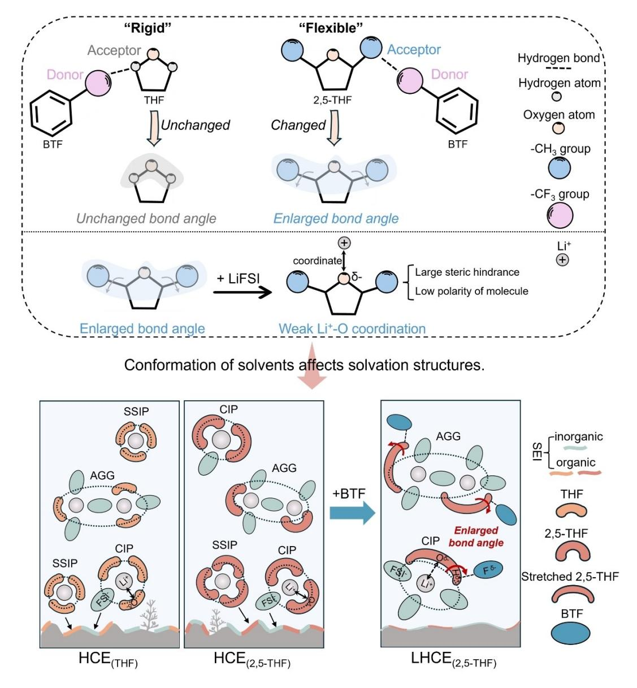
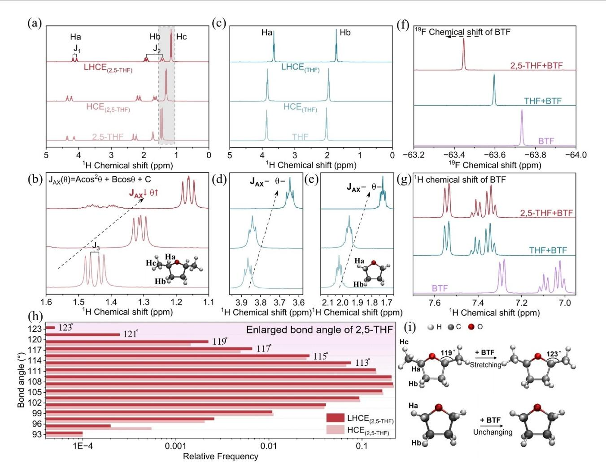
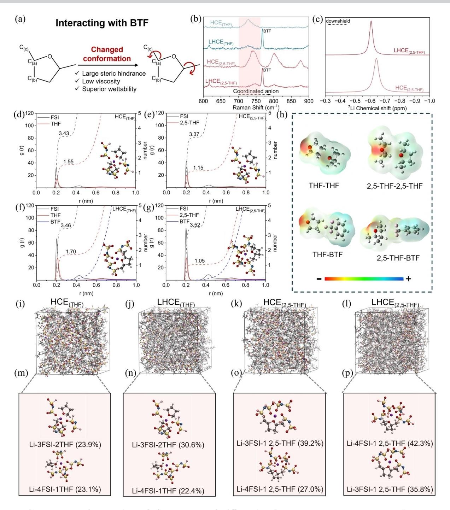
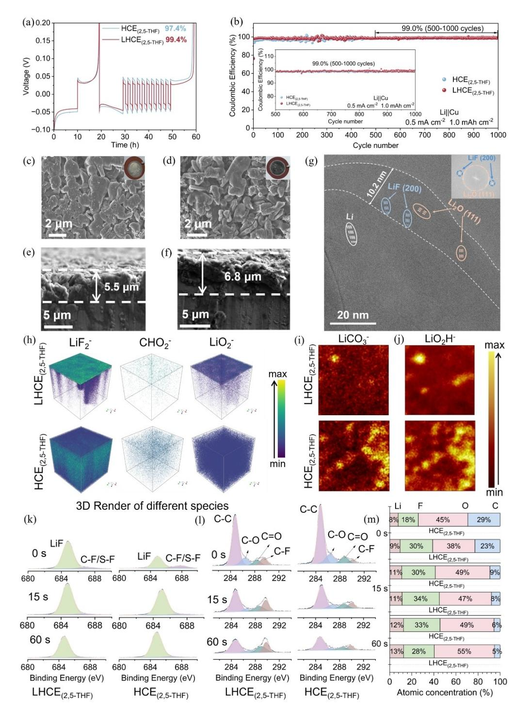
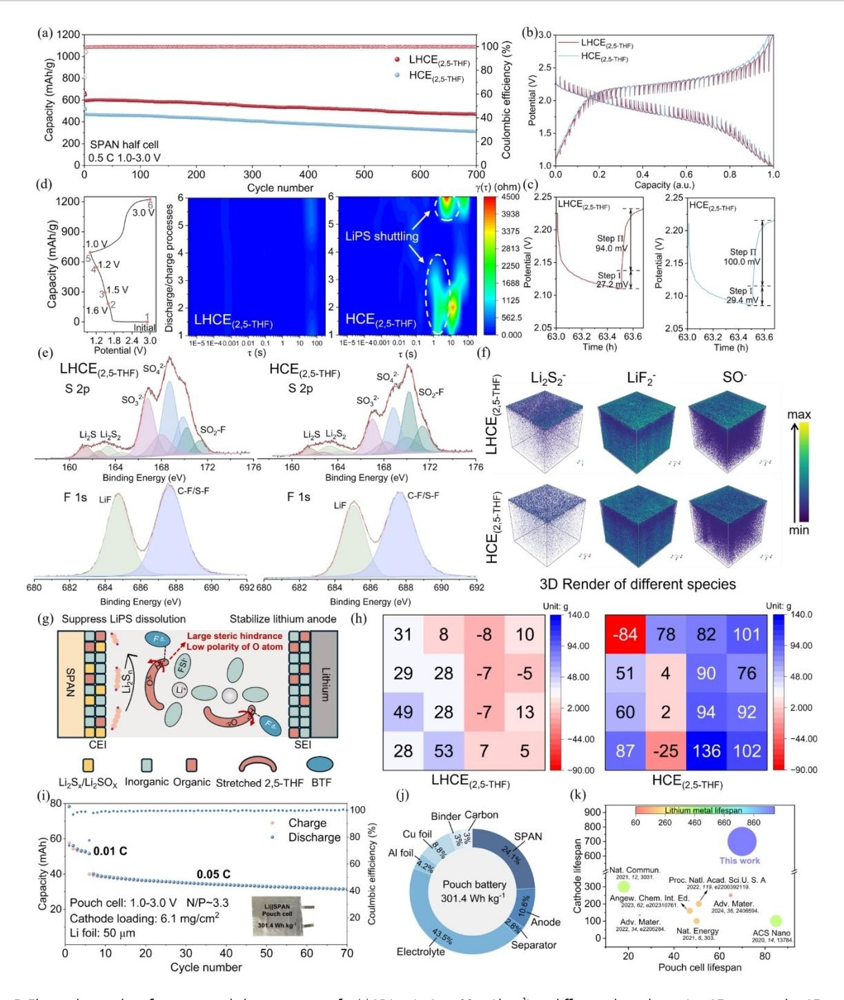

*Forschungsartikel*

*Lithium Metal Batteries Very Important Paper*

# **A "Flexible" Solvent Molecule Enabling High-Performance Lithium Metal Batteries**

*Lu Chen, Qing Zhang, Chunlei Song, Yanxin Jiang, Xitong Sheng, Hongji Pan, Liu Yang, Shumin Wu, Lin Zeng, Delong Sun, Chong Wang, Tianshuai Wang,\* [Yiju](http://orcid.org/0000-0001-9240-5686) Li,\* and Tianshou Zhao\**

**Abstract:** Electrolyte chemistries are crucial for achieving high cycling performance and high energy density in lithium metal batteries. The localized high-concentration electrolytes (LHCEs) exhibit good performance in lithium metal batteries. However, understanding how the intermolecular interactions between solvents and diluents in the electrolyte regulate the solvation structure and interfacial layer structure remains limited. Here, we reported a new LHCE in which strong hydrogen bonding between diluents and solvents alters the conformation and polarity of "flexible" solvent molecules, thereby effectively regulating the solvation structure of Li+ ion and promoting the formation of robust electrode interfaces. The endpoint H of the "flexible" chain O-CH-CH3 of the 2,5-dimethyltetrahydrofuran (2,5-THF) solvent and the F of the benzotrifluoride (BTF) diluent can form strong hydrogen bonds, which expand the maximum bond angle of the 2,5-THF molecule from 119° to 123°. The expanded bond angle increases the steric hindrance of the 2,5-THF molecule and decreases its polarity. This leads to an increase in the anion content within the solvation structure, which in turn enhances the performance of both the lithium metal anode and the sulfurized polyacrylonitrile (SPAN) cathode. As a result, the lithium metal anode shows a Coulombic efficiency (CE) of as high as 99.4%. The assembled Lij jSPAN battery based on our developed LHCE exhibits impressive stability with an average CE of 99.8% over 700 cycles. Moreover, the Lij jSPAN pouch cell can be stably cycled with a high energy density of 301.4 Whkg 1 . This molecular-level understanding of the correlation between molecular interactions and solvation structures provides new insights into the design of advanced LHCEs for high-performance lithium metal batteries.

### *Introduction*

Commercial lithium-ion batteries (LIBs) with graphite anodes usually provide energy densities lower than 250 Whkg 1 , which is far from the requirements of highenergy-density electrochemical energy storage.[1] Compared to graphite (~372 mAhg 1 ), lithium (Li) metal is the most promising electrode due to its high specific capacity (3860 mAhg 1 ) and ultra-low potential ( 3.04 V versus standard hydrogen electrode).[2] However, the notorious Li dendrite growth issue results in low Coulombic efficiency (CE) and safety hazards, seriously hindering the practical application of LMBs.[3]

In lithium metal batteries (LMBs), the electrolyte is readily reduced by the highly reactive Li metal, leading to the formation of various reduction species at the electrodeelectrolyte interface, known as the solid-electrolyte interphase (SEI). Unstable SEIs lead to uneven Li+ distribution and facilitate continuous parasitic side reactions, triggering early dendrite initiation and accelerating the dendrite growth process.[4] Numerous strategies have been developed to form robust inorganic-rich SEIs. Among these strategies, electrolyte engineering is an effective approach to developing a high-quality SEI layer for lithium metal anodes (LMAs).[5] Recently, increasing the Li salt concentration to create high-concentration electrolytes (HCEs) has emerged as a key focus in LMBs. Due to the high salt-to-solvent

Department of Mechanical and Energy Engineering, Southern University of Science and Technology, Shenzhen, 518055, China E-mail: liyj6@sustech.edu.cn

zhaots@sustech.edu.cn

L. Zeng, Y. Li, T. Zhao

SUSTech Energy Institute for Carbon Neutrality, Southern University of Science and Technology, Shenzhen, 518055, China

Xi'an Key Laboratory of Functional Organic Porous Materials, School of Chemistry and Chemical Engineering, Northwestern Polytechnical University, Xi'an, 710129, China E-mail: tianshuai@nwpu.edu.cn

L. Chen, C. Song, D. Sun, C. Wang, Y. Li

Department of Mechanical and Energy Engineering-Jiahua Chemicals. Inc. Joint Lab, Southern University of Science and Technology, Shenzhen, 518055, China

T. Wang

[\*] L. Chen, Q. Zhang, C. Song, Y. Jiang, H. Pan, L. Yang, S. Wu, L. Zeng, Y. Li, T. Zhao

X. Sheng, T. Wang

Chongqing Science and Technology Innovation Center of Northwestern Polytechnical University, Chongqing 401135, China

ratio, the content of free solvent molecules decreases and contact ion pairs (CIPs) and aggregates (AGGs) increase, leading to the preferential decomposition of anions and the formation of a robust inorganic-rich SEI layer on LMAs. Nevertheless, the high viscosity, inferior wettability, and high density of HCEs greatly hinder their further development in LMBs.

In response to the challenges posed by HCEs, localized high-concentration electrolytes (LHCEs) have been developed.[6] The addition of diluents in LHCEs can effectively reduce the electrolyte viscosity and improve the electrolyte wettability while maintaining the anion-rich solvation structure in the HCEs, facilitating the formation of a stable SEI layer on the surface of LMAs. In the initial stages of LHCE development, diluents were primarily regarded as agents for reducing electrolyte viscosity, with little consideration given to their role in the solvation structure or their interactions with other electrolyte components. However, recent studies have discovered that diluent molecules can also affect the solvation structure by interacting with solvent molecules and anions.[7] Unfortunately, current research on this topic is still limited, and the understanding of the role of diluent molecules requires further enhancement. Therefore, effectively designing suitable LHCE systems that leverage the molecular interactions between solvents and diluents to achieve targeted regulation of the solvation structure is of great significance for enhancing the performance of LMBs.

In this work, we designed a new LHCE and proposed a new mechanism that alters solvent molecule configuration through diluent-solvent molecular interactions, thereby regulating the solvation structure of Li+ ions to enhance the compatibility of the LHCE with LMAs. The 2,5-THF molecule, which features a "flexible" -O-CH-CH3 chain segment, is selected as the solvent, with BTF as the diluent to prepare LHCEs (the properties of solvents are shown in Table S1). It is revealed that the endpoint H(2,5-THF) in the "flexible" -O-CH-CH3 chain acts as a hydrogen bond acceptor to interact with F(BTF). The bond angle of the "flexible" chain is expanded by the hydrogen bonds between H(2,5-THF) and F(BTF), resulting in changes to the molecular size and polarity of 2,5-THF. The increased steric hindrance and decreased polarity of 2,5-THF molecules are beneficial to weaken the Li+-O(2,5-THF) coordination and increase the proportion of CIPs and AGGs in the solvation structure (Figure 1). The regulation of the solvation structure is conducive to the preferential decomposition of anions at the electrode interface to form a robust anion-derived inorganic-rich interfacial layer, thereby improving the reversibility of LMAs and SPANs. As a result, the assembled Lij j SPAN pouch batteries based on our developed LHCE can be stably operated over 70 cycles and obtain a high energy density of 301.4 Whkg 1 .

### *Results and Discussion*

#### *Electrolyte Preparation and Analysis of Solvent Molecular Conformation*

To investigate the intermolecular interactions between the various components in the electrolytes based on the "rigid" THF and "flexible" 2,5-THF solvent molecules, we formulated four electrolytes: HCE (3.0 m LiFSI THF and 3.0 m LiFSI 2,5-THF) and LHCE (1.5 m LiFSI THF-BTF and 1.5 m LiFSI 2,5-THF-BTF) with a solvent-to-BTF volume ratio of 1: 1. In this work, the 'm' stands for molar salt per liter of solvent+diluent. The four electrolytes, 3.0 m LiFSI THF, 3.0 m LiFSI 2,5-THF, 1.5 m LiFSI THF-BTF, and 1.5 m LiFSI 2,5-THF-BTF, hereafter referred to as HCE(THF), HCE(2,5-THF), LHCE(THF), and LHCE(2,5-THF), respectively.

In nuclear magnetic resonance (NMR) spectra, the magnitude of coupling constants (J, Hz) reflects the stereochemical relationships between vicinal nuclei.[8] The evolution of molecular stereo-structures of solvent in four electrolytes is analyzed by NMR. When LiFSI salt is mixed with the 2,5-THF solvent (HCE(2,5-THF)), the coupling constants (J1, J2, and J3) of Ha, Hb, and Hc in the 2,5-THF decrease compared to those in the pure 2,5-THF solvent. Further addition of an equivalent volume of BTF to the HCE(2,5-THF) solution results in a further decrease in all coupling constants (Figure 2a). The chemical shift of the -CH3 group of 2,5-THF is magnified in Figure 2b. The coupling constants J3 of -CH3 decreases from 8.0 Hz in pure 2,5-THF solvent to 1.2 Hz in the LHCE(2,5-THF) system, further reflecting the variations of molecular stereo-structures of 2,5-THF solvent in LHCE(2,5-THF) system. In contrast, the coupling constants of Ha and Hb of THF in the HCE(THF) and LHCE(THF) electrolytes have no change (Figures 2c-2e). According to the Karplus equation (Equation 1),[8b,9] the coupling constant J is directly related to the variation of molecular dihedral angle (q). The difference in coupling constants changes between 2,5-THF and THF solvent molecules indicates the evolution of the dihedral angle of H-C-C-H in the 2,5-THF molecules.

$$J(\theta) = A\cos^2\theta + B\cos\theta + C\tag{1}$$

Where A, B, and C are constants for saturated hydrocarbons.

The evolution of the dihedral angle of H-C-C-H in 2,5- THF solvent molecules indicates the change in the molecule conformation of 2,5-THF. Compared to the structure of THF solvent molecules, the -CH3 group in 2,5-THF plays an important role in regulating the conformation of 2,5-THF. The H atoms of -CH3 in the 2,5-THF molecule have the same chemical environment and the C-C single bond rotation of CH-CH3 is fast, each H in -CH3 is in a homogenized chemical environment. It follows that the rotation -CH3 around the -CH site does not alter the dihedral angles of 2,5-THF, rather, the changes in the dihedral angle are related to the bond angles of "flexible" segments -O-CH-CH3 in the 2,5-THF molecules.

*Angew. Chem.* **2025**, *137*, e202422791 (2 of 11) © 2025 Wiley-VCH GmbH

*Figure 1.* Schematics displaying conformational changes of "rigid" THF and "flexible" 2,5-THF molecules and difference of solvation structure in different electrolytes HCE(THF), HCE(2,5-THF) and LHCE(2,5-THF).

To unravel the factors influencing changes in the 2,5- THF conformation, 19F NMR and 1 H NMR spectra of BTF in both 2,5-THF- and THF-containing solutions are shown in Figures 2f and 2g. The F peaks at 63.8 ppm are assigned to -CF3. After mixing BTF with 2,5-THF or THF in an equal volume ratio, a deshielded effect of BTF happened in both systems due to hydrogen bond interaction between BTF and solvent molecules. A more pronounced downshift of the F peak was observed in 2,5-THF, whereas the chemical shifts of all H peaks in BTF remained at the same value in both THF+BTF and 2,5-THF+BTF systems. This indicates that the F atoms of BTF in LHCE(THF) and LHCE(2,5-THF) systems act as hydrogen bond donors interacting with solvent molecules. Consistently, the chemical shift of H(solvent) decreased, indicating that H atoms of solvents act as the acceptor (Figures 2a and 2c). Density functional theory (DFT) calculation of solvent-BTF complexes further explains the H(solvent)…F(BTF) interaction between 2,5-THF and BTF (Figure S1).

DFT calculations were also utilized to validate the influence of the intermolecular interaction between BTF and 2,5-THF on the molecular conformation of the 2,5-THF solvent. Figure 2h displays the bond angle distribution of the O-C-C bond of the "flexible" -O-CH-CH3 segment in the 2,5-THF molecule. In HCE(2,5-THF) electrolyte, the angle distribution of O-C-C of 2,5-THF molecule ranges from 93.0° to 119.0°. Upon adding BTF to HCE(2,5-THF), the maximum angle of O-C-C increases from 119.0° to 123.0° (angle distribution: 93.0°~123.0°). Moreover, the proportion of O-C-C bond angles in 2,5-THF that are �111.0° increases from 24.4% to 25.6% upon introducing BTF. The O-C-C bond angle distribution over time in the HCE(2,5-THF) with

*Figure 2.* Characterization and simulation of the evolution of solvent molecular conformations. NMR spectra of various electrolyte systems: (a) 1 H NMR spectra of LHCE(2,5-THF), HCE(2,5-THF), and 2,5-THF. (b) The magnified 1 H NMR spectra of -CH3 in LHCE(2,5-THF), HCE(2,5-THF), and 2,5-THF. (c) 1 H NMR spectra of LHCE(THF), HCE(THF), and THF. (d, e) The magnified 1 H NMR spectra of -CH2 in LHCE(THF), HCE(THF), and THF. (f) 19F NMR spectra and (g) 1 H NMR spectra of different solutions (THF-BTF, 2,5-THF-BTF, and BTF). (h) The simulation on change in bond angle of 2,5-THF with and without BTF (Relative frequency versus bond angle ranging from 93° to 123°). (i) The diagram of the maximum angle change of the O-C-C bond of the -O-CH-CH3 segment in 2,5-THF and the unchanged bond angle in THF after adding BTF.

and without adding BTF is shown in Figure S2. At the chosen time scale, the vibration amplitude range of the O-C-C bond angle of 2,5-THF after adding BTF is consistently greater than that of the O-C-C bond of 2,5-THF without adding BTF. This indicates that the introduction of BTF molecules increases the bond angles of the O-C-C bond in the "flexible" -O-CH-CH3 segment of 2,5-THF, resulting in a more 'stretched' molecular structure of 2,5-THF (Figure 2i).

#### *The Investigation of Solvation Structure*

Owing to the unique molecular structure of 2,5-THF and the interaction between BTF and 2,5-THF, the LHCE(2,5-THF) displays the lowest viscosity (2.29 mPa·S) and the smallest contact angle (39.1°) on the Celgard-2500 separator in different electrolytes (Figures S3 and S4). The strong

*Angew. Chem.* **2025**, *137*, e202422791 (4 of 11) © 2025 Wiley-VCH GmbH

H(solvent)…F(BTF) interaction between 2,5-THF and BTF makes the O-C-C bond angle of the -O-CH-CH3 segment in 2,5-THF larger than that in pure 2,5-THF, resulting in larger molecular steric hindrance (Figure 3a). A large molecular steric hindrance weakens the solvating ability of solvents, offering more probability for FSI anions to coordinate with Li+.

Raman spectroscopy was utilized to get an in-depth analysis of the solvation structures (Figure 3b). The shift at 700–760 cm 1 is attributed to the S-N-S symmetric stretching vibration of FSI anion in electrolytes. The higher wavenumber of the S-N-S band indicates the stronger coordination between Li+ and anion FSI . The Raman peak shows a slight shift reduction from HCE(THF) (728.3 cm 1 ) to LHCE(THF) (726.2 cm 1 ). However, the significant evolution of the Raman peak occurs from HCE(2,5-THF) (740.5 cm 1 ) to LHCE(2,5-THF) (748.5 cm 1 ). It indicates that more anions coordinate with Li+ in the first solvation sheath of LHCE(2,5-

**Forschungsartikel** 

Figure 3. Characterization and MD simulation of solvation structures for different electrolytes (HCE(THF), HCE(2,5-THF), LHCE(THF) and LHCE(2,5-THF)). (a) Schematic showing the conformation change of 2,5-THF upon interacting with BTF. (b) Raman spectra of four electrolytes in 600–900 cm-1. (c) 7Li NMR spectra of HCE(2.5-THF) and LHCE(2.5-THF) electrolytes. (d-g) The RDFs and coordination numbers in different electrolytes. (Inset: information on the highest proportion of solvation structure in different electrolytes.) (h) Electrostatic potential mapping of solvent-solvent and solvent-diluent complexes. (i-l) The snapshots of solvation environments and (m-p) corresponding top two solvation configurations in different electrolytes. (red ball: O; grey ball: C; white ball: H; pink ball: F; blue ball: N; yellow ball: S; purple ball: Li)

THF). Meanwhile, 7Li NMR spectra of different electrolytes were compared. When BTF was added in HCE(THF) and  $HCE_{(2.5\text{-THF})}$ , the opposite chemical shift of Li+ single resonance changes were discovered. The dominant resonance performs an upshield shift in  $LHCE(THF)$ . The upshield shift is attributed to the shielded function on  $Li^+$  nuclei by

surrounded electron density, indicating a stronger intensity of the Li+-solvent solvation effect (Figure S5). Stronger coordination with anions causes the downshield shift in LHCE(2,5-THF), which also confirms strengthened ion aggregation and strong Li-anion coordination in  $LHCE_{(2.5\text{-THF})}$  (Figure  $3c$ ).

Angew. Chem. 2025, 137, e202422791 (5 of 11)

© 2025 Wiley-VCH GmbH

Molecular dynamics (MD) simulations are further conducted to investigate the solvation structure. The radial distribution function (RDF, solid lines) and coordination numbers (dash lines) are shown in Figures 3d-3g. Based on the statistics of MD simulations, the O atoms of both solvent (THF or 2,5-THF) and FSI anions dominate the primary solvation shell coordination with Li+, and BTF hardly participates in the coordination with Li+. Moreover, the coordination number of O(FSI) is 3.35 times higher than the number of O(2,5-THF) in LHCE(2,5-THF), and the O(FSI) to O(solvent) ratio is 2.21 for HCE(THF), 2.93 for HCE(2,5-THF) and 2.04 for LHCE(THF). This result further verifies the strong interaction of Li+-FSI in LHCE(2,5-THF), which is expected to form an anion-rich solvation structure (anion-to-solvent (ASR) mole ratio �3) that decomposes to create an anion-derived SEI film.

The binding energy is calculated to investigate the interaction between solvents and BTF (Figure S6). The intermolecular interaction energies for THF-BTF and 2,5- THF-BTF solvent-diluent interaction are calculated to be 8.58 and 9.24 kcalmol 1 , respectively, indicating 2,5-THF exhibits a stronger binding affinity with BTF compared to THF. The influence of binding affinity on coordination between solvent molecules and Li+ can be analyzed by the electrostatic potential mapping (ESP) (Figure 3h). As an electron donor to combine with Li+, the negative charges of THF and 2,5-THF molecules are mainly localized at the O atom. When BTF interacts with 2,5-THF molecule (2,5- THF-BTF), the dispersed electron density of O atom of 2,5- THF results in weak Li+ solvating ability and promotes the formation of anionic solvation structure.

All ion-solvent configurations and corresponding frequencies in four electrolytes are summarized in Tables S2– S5. The snapshots of electrolyte bulk (Figures 3i-3l) and the top two ion-solvent configurations (Figures 3m-3p) in four electrolytes are compared. According to the MD simulation, the dominant solvation configurations coordination of Li+ in LHCE(2,5-THF) are Li+-4 FSI -1 2,5-THF and Li+-3 FSI -1 2,5-THF and the total occurrence frequency of these two solvation configurations reaches 78.1%. Moreover, the total occurrence frequency of anion-rich solvation configuration (ASR mole ratio �3) in the LHCE(2,5-THF) (86.5%) is substantially higher than those in the HCE(THF) (49.3%), LHCE(THF) (36.9%), and HCE(2,5-THF) (76.2%). The results confirm that the change in molecular configuration of 2,5- THF induced by the strong hydrogen bonding interaction between BTF and 2,5-THF reduces the polarity of 2,5-THF and thereby favors the formation of an anion-rich solvation configuration. The lowest unoccupied molecular orbital (LUMO) energy of the most occurrence frequency solvation cluster in four electrolytes is shown in Figure S7. The lower LUMO energy of Li+-4 FSI -1 2,5-THF in LHCE(2,5-THF) suggests that FSI anions likely preferentially decompose to contribute to producing robust fluoride-rich SEI layers on LMAs.

#### *The Compatibility of Electrolytes with LMAs*

The Lij jCu asymmetric batteries were assembled to evaluate the reversibility of Li plating/stripping. The LMA in the LHCE(2,5-THF) displays a high Coulombic efficiency (CE) of up to 99.4% (Figure 4a). In contrast, the CE of LMA in HCE(THF) and HCE(2,5-THF) is merely 98.6% and 97.4% (Figures 4a and Figure S8). It should be noted that the LMA is unable to stably operate in LHCE(THF) because of severe side reactions between LHCE(THF) and LMA (Figure S9).[10] The long cycling performance of Lij jCu half cells in different electrolytes was also investigated (Figure 4b). The Lij jCu half cells in the LHCE(2,5-THF) can stably cycle for 1000 cycles with an average CE of 98.8% and the average CE after 500 cycles keeps 99.0%. In contrast, the average CE of Lij jCu half cells in the HCE(2,5-THF) is only 98.1% at the same conditions. The morphology of the deposited Li (1 mAhcm 2 ) on the Cu foil was investigated by scanning electron microscope (SEM). A highly compact Li deposition structure with a thickness of 5.5 μm is observed in LHCE(2,5- THF) (Figures 4c and 4e). The Li deposited in the HCE(2,5-THF) and HCE(THF) shows relatively loose structures (Figures 4d, 4f, and S10). The dendrite-free morphology of Li metal in LHCE(2,5-THF) is beneficial for obtaining high CE and long cycling stability.

The microstructures of the cycled Li metal in LHCE(2,5- THF) were analyzed by cryogenic transmission electron microscopy (cryo-TEM).[11] As displayed in Figure 4g, the SEI layer on the Li metal is relatively uniform, with an average thickness of ~10 nm. The SEI layer is enriched with inorganic LiF (with a (200) d-spacing of 2.01 Å) and Li2O (with a (111) d-spacing of 2.66 Å) species. This inorganicrich SEI is believed to suppress the growth of Li dendrites and stabilize the long cycle life of LMAs. The time-of-flight secondary ion mass spectroscopy (TOF-SIMS) was applied to further analyze the components and structure evolution of SEI layers on LMAs. A series of compounds, LiF2 (mass charge ration (m/z)=45.0, fragment of LiF), CHO2 (m/z= 45.0, as a fragment of the organic components), and LiO2 (m/z=39.0, fragment of Li2O) were detected (Figure 4h). As the etching depth deepens, the intensities of LiF2 , CHO2 , and LiO2 remain a high signal in HCE(2,5-THF), suggesting the formation of a thick SEI. The phenomena are also shown in HCE(THF) electrolytes (Figure S11). In contrast, the intensities of LiF2 and LiO2 show significant weakening and almost disappearance after sputtering for 800 s in LHCE(2,5-THF). The intensity of organic CHO2 in the SEI layer on LMAs cycled in the LHCE(2,5-THF) system is lower than that cycled in HCE(THF) and HCE(2,5-THF). This indicates that a thin and inorganic-rich SEI layer is formed on the LMA in the LHCE(2,5-THF) electrolyte, facilitating the uniform deposition of Li. Meanwhile, the surface of the cycled LMAs in LHCE(2,5-THF) shows a weaker signal of LiCO3 (m/z=67.0, fragment of Li2CO3) and LiO2H (m/z=40.0, fragment of LiOH) than that in HCE(2,5-THF) (Figures 4i and 4j). The decreased Li2CO3 and LiOH species in the SEI layer on the LMA cycled in LHCE(2,5-THF) are conducive to delaying capacity degradation and stabilizing LMAs.[12]

# *Forschungsartikel*

*Figure 4.* Electrochemical performance and characterization of LMAs in HCE(2,5-THF) and LHCE(2,5-THF). (a) The Aurbach measurement of CE of Lij jCu half batteries in different electrolytes. (b) The plating/stripping performance of Lij jCu asymmetric batteries in different electrolytes (current density: 0.5 mAcm 2 ; capacity: 1 mAhcm 2 ). The top view and cross-sectional SEM images of deposited Li on Cu foil in LHCE(2,5-THF) (c, e) and HCE(2,5-THF) (d, f). (g) The cryo-TEM images of LMAs in LHCE(2,5-THF). (h) The 3D reconstruction TOF-SIMS images of the LiF2 , CHO2 , and LiO2 species of the cycled LMAs in LHCE(2,5-THF) (top) and HCE(2,5-THF) (bottom) electrolytes. (i-j) The 2D TOF-SIMS mappings of the LiCO3 and LiO2H species on the surface of the cycled LMAs in LHCE(2,5-THF) and HCE(2,5-THF) electrolytes. The XPS spectra of F 1s (k) and C 1s (l) of the cycled LMAs in different electrolytes. (m) Atomic concentration for Li, F, O, and C elements of SEI layers in LHCE(2,5-THF) and HCE(2,5-THF) electrolytes for different Ar+ sputtering durations.

Depth-dependent X-ray photoelectron spectroscopy (XPS) was conducted to further investigate the difference in the structure and composition of SEI layers on LMAs in different electrolytes (Figures 4k-4m). The F 1s spectra reveal two chemical states of F (at 684.9 eV and 687.3 eV), which are assigned to LiF and C F/S F bonds resulting

*Angew. Chem.* **2025**, *137*, e202422791 (7 of 11) © 2025 Wiley-VCH GmbH

from FSI decomposition. (Figure 4k). The C C (284.8 eV), C O (286.7 eV), and C=O (288.7 eV) bonds mainly originate from the decomposition of 2,5-THF or THF solvent (Figure 4l). As sputter time increases, the intensity of LiF remains high for the SEI layer on LMAs in LHCE(2,5-THF). Compared to the SEI layer on LMAs in HCE (2,5-THF), the SEI layer on LMAs in LHCE(2,5-THF) possesses higher F content and lower C content, suggesting that FSI anions preferentially decompose to form an inorganic-rich SEI on LMAs in LHCE(2,5-THF) (Figure 4m). Furthermore, the high intensity of fitted LiF (55.6 eV) and Li2O (54.6 eV) peaks in Li 1s XPS spectra for the LHCE(2,5-THF) also indicates the inorganic-rich SEI layer is formed on LMAs in LHCE(2,5-THF) (Figure S12).

#### *The Cycling Performance of SPAN Cathode in Electrolytes*

SPAN was synthesized by covalent bonding of short-chain sulfur to a conjugated pyridine skeleton (Figures S13–S14, Table S6). In ester-based electrolytes, SPAN can effectively achieve "solid-solid" redox reactions without dissolving redox intermediates into the electrolyte. However, in etherbased electrolytes, the redox intermediates of soluble lithium polysulfides (LiPS) are generated during the discharge/charge process, which causes severe shuttle effects, resulting in a loss of SPAN electrode capacity (Figure S15).[13]

The Lij jSPAN half cells were assembled to investigate the compatibility between LHCE(2,5-THF) and the highcapacity SPAN cathodes. In the LHCE(2,5-THF), the Lij j SPAN half cells stably cycle over 700 cycles with an average capacity decay of only 0.03% per cycle (Figure 5a), and the average CE of batteries is 99.8%, indicating the excellent compatibility between SPAN and LHCE(2,5-THF). In contrast, while the Lij jSPAN half cells demonstrate stable cycling performance in HCE(2,5-THF) and HCE(THF), the delivered specific capacities after 30 cycles are 483.0 and 462.6 mAhg 1 , respectively, which are lower than the 601.0 mAhg 1 observed in LHCE(2,5-THF) (Figure S16). To understand the above difference in cycling performance, the kinetic evolution of SPAN cathodes in LHCE(2,5-THF) and HCE(2,5-THF) are investigated using the galvanostatic intermittent titration technique (GITT).[14] During the charging process of 2.05 to 2.25 V, the ohm and charge transfer resistance (step Ι) decrease from 29.4 mV in HCE(2,5-THF) to 27.2 mV in LHCE(2,5-THF), and diffusion resistance of ionic species significantly (step П) drops from 100.0 mV in HCE(2,5-THF) to 94.0 mV in LHCE(2,5-THF) (Figures 5b and 5c). The distinct overpotential drop of the SPAN cathode is attributed to the accelerated "solid-solid" conversion kinetic in LHCE(2,5-THF). The rate performance of the SPAN cathodes in different electrolytes is shown in Figures S17– S19. The SPAN cathode in LHCE(2,5-THF) shows good rate performance, achieving a specific capacity of 447.0 mAhg 1 even at a high rate of 3 C, which is much higher than that in HCE(2,5-THF) (291.8 mAhg 1 ) and HCE(THF) (28.7 mAhg 1 ).

In situ electrochemical impedance spectroscopy (EIS) with a distribution of relaxation time (DRT) technique was applied to investigate the electrochemical process across different timescales (Figure 5d). At the initial stage 1, the relative relaxation time of DRT is attributed to the blocking behavior of the SPAN cathode.[15] As the discharge progresses to 1.0 V (from stage 2 to stage 5), the intensity of relaxation time in the range of 10.0 s to 100.0 s is decreased in LHCE(2,5-THF). The change is partly due to the formation of new pore structures and the optimization of electrodeblocking behavior in SPAN cathodes. More importantly, the discharge process is related to the conversion of solid-phase sulfur to solid-phase Li2S. The decreased resistance of the conversion process in LHCE(2,5-THF) indicates the enhanced "solid-solid" conversion kinetic in the SPAN cathode. Following the charge progresses to 3.0 V (from stage 5 to stage 6), the conversion resistance of SPAN in LHCE(2,5-THF) increases slightly, while the conversion resistance of SPAN in HCE(2,5-THF) increases significantly. The increased resistance is related to the generation and dissolution of more LiPS into the electrolyte, increasing the electrolyte viscosity.[16] Meanwhile, during the discharge/charging process, a new signal of the relaxation time occurs within the range of 0.1 s to 10 s,[16] which further proves the formation and diffusion of LiPS in HCE(2,5-THF). [17]

The favorable cathode electrolyte interphase (CEI) layer on the SPAN can also help suppress the dissolution of LiPS into the bulk electrolyte. The XPS spectra of SPAN cathodes are employed to investigate the components of CEI layers in two different electrolytes (Figure 5e). In the HCE(2,5-THF) system, a stronger SO2-F signal (169.0 eV/ 170.2 eV) is shown in S 2p spectra, attributed to the incomplete decomposition of LiFSI salt. In contrast, the higher signal of LiFSI salt decomposition species of SOx and the weaker SO2-F signal are detected in LHCE(2,5-THF). Moreover, due to the relatively complete decomposition of LiFSI, a higher LiF signal is observed in the CEI layer of SPAN in LHCE(2,5-THF). The stable inorganic-rich CEI layer is conducive to inhibiting the dissolution of LiPS and improving the cycling stability of SPAN cathodes. The TOF-SIMS technique was used to gain more details of the SPAN interphase in different electrolytes. The Li2S2 (m/z=78.0, fragment of Li2S2), LiF2 (mass charge ration (m/z)=45.0, fragment of LiF), and SO (m/z=47.9, as a fragment of the SOx) were detected through the 800 s depth sputtering (Figure 5f). The intensity of Li2S2 on SPAN remains high in LHCE(2,5-THF) compared to that in HCE(2,5-THF). This indicates that the dissolution of LiPS in bulk LHCE(2,5-THF) is inhibited, and more active materials are preserved in the SPAN cathode.[18] Moreover, the intensity of LiF2 and SO species on the SPAN in LHCE(2,5-THF) is higher than that in HCE(2,5-THF). This result further verifies that the decomposition of LiFSI in LHCE(2,5-THF) is improved, which is beneficial to the formation of a robust CEI layer on SPAN cathodes.

### *The Performance of Practical Li*j j*SPAN using LHCE(2,5-THF)*

Based on the above discussion, the performance enhancement mechanism of Lij jSPAN cells using the

# **Forschungsartikel**

**Figure 5.** Electrochemical performance and characteristics of Li||SPAN (1 C=500 mAh g-1) in different electrolytes. (LHCE(2,5-THF) and HCE(2,5-THF)). (a) The long cycling performance of Li | SPAN half cells in electrolytes (voltage range: 1.0–3.0 V). (b) The GITT curves of SPAN (a pulse current density of 50 mAg-1 for 10 min and standing time of 30 min). (c) The enlargement of GITT curves to compare the voltage relaxation process during charge in LHCE(2.5-THF) and HCE(2.5-THF). (d) In situ DRT profiles derived from in situ EIS measurements during the 1st cycle. (e) The XPS spectra of S 2p and F 1s of the cycled SPAN in different electrolytes. (f) The TOF-SIMS 3D reconstruction of the Li2S2-, LiF2-, and SO- components of the cycled SPAN in different electrolytes. (g) Sketch shows coordinated SPAN cathode and LMA performance improvement in LHCE12.STHFD. (h) Hotspot map of pressure distribution of Li||SPAN pouch battery with different electrolytes. (Test area: 4\*4 cm2) (i) The cycling performance of the pouch battery of Li||SPAN at 0.05 C (the pouch battery firstly activates 6 cycles at a rate of 0.01 C, the area of pouch battery 16.0 cm2). (j) A ring plot is presented to illustrate the components of the pouch battery along with their respective weight ratios. (k) Comparison of our LHCE(2.5-THF) performance to previous advanced electrolytes.

 $LHCE_{(2.5\text{-THF})}$  electrolyte is illustrated in Figure 5g. As the BTF diluent is added to the solvent, the conformation of

"flexible" 2,5-THF molecules can be altered by the  $F_{(BTF)}$ - $H_{(2,5\text{-THF})}$  hydrogen bond. This conformation change in-

Angew. Chem. 2025, 137, e202422791 (9 of 11)

creases the molecular steric hindrance and reduces the polarity of 2,5-THF molecules to achieve an anion-rich solvation structure. The increased anions in the solvation structure are preferentially reduced forming inorganic-rich SEI and CEI layers to hinder the growth of Li dendrites and the dissolution of LiPS. Meanwhile, the reduced polarity of 2,5-THF solvent molecules further suppresses the LiPS dissolution of the SPAN cathode. These effects contribute to the high cycling stability of LMAs and SPAN cathodes.

The internal stress evolution of Lij jSPAN pouch batteries is monitored using a pressure sensing system (Figures 5h and S20). At the end of the first discharge, the Lij jSPAN battery with the LHCE(2,5-THF) shows a minimum pressure variation. In contrast, some pots with large pressure variations (e.g. 84 and 136 g) are observed in the Lij j SPAN battery with the HCE(2,5-THF). The result indicates the even Li2S deposition on the SPAN cathode and uniform Li stripping in the LHCE(2,5-THF). [19] To further verify the practicality of LHCE(2,5-THF), the Lij jSPAN pouch cell was assembled with a SPAN cathode loading of 6.1 mg cm 2 and 50-μm Li metal (N/P ratio ~3.3). The pouch cell can stably operate for 70 cycles with a capacity of 412.1 mAhg 1 at 0.05 C (Figure 5i and Figures S21–S22). Impressively, a high energy density of 301.4 Whkg 1 can be achieved for the Lij j SPAN pouch cell with the LHCE(2,5-THF) (Figure 5j, calculation details shown in Table S7). Compared to typical reported Lij jSPAN pouch batteries, our Lij jSPAN batteries based on the LHCE(2,5-THF) demonstrate excellent performance in terms of the cycling life of LMAs, the compatibility of SPAN, and the stability of the pouch battery (Figure 5k and Table S8).[20]

## *Conclusion*

In this work, we demonstrated that the molecular structures of solvents in LHCEs can be regulated by diluent molecules to optimize the solvation structure to realize high-energydensity and long cycling life LMBs. The hydrogen bonding interaction between the "flexible" 2,5-THF solvent molecule and BTF diluent molecule expands the bond angle of the O-C-C bond of the "flexible" -O-CH-CH3 segment in the 2,5- THF molecule, which increases the steric hindrance and reduces the polarity of 2,5-THF. The optimized 2,5-THF molecules show weak coordination with Li+ forming the anion-rich solvation cluster. This is beneficial for constructing inorganic-rich SEI and CEI layers to favor uniform Li deposition and suppress the shuttle effect of LiPSs in the SPAN cathodes. As a result, the LMA showed an enhanced CE of 99.4%. Furthermore, the SPAN cathode exhibits excellent stability with a high average CE of 99.8% over 700 cycles. The assembled Lij jSPAN pouch cell can be cycled over 70 cycles with a high energy density of 301.4 Whkg 1 . Our work is expected to provide an effective way to design LHCEs for high-performance LMBs.

## *Acknowledgements*

This work is supported by the National Natural Science Foundation of China (52302261 and 22479070), the Guangdong Basic and Applied Basic Research Foundation (2023B1515120069 and 2024A1515012705), Shenzhen Science and Technology Plan Project (No. SGDX20230116091644003), high level of special funds (G03034K001), Guangdong Major Project of Basic and Applied Basic Research (2023B0303000002), the Department of Mechanical and Energy Engineering-Jiahua Chemicals. Inc. Joint Lab Program, the Postdoctoral Fellowship Program of CPSF under Grant Number (GZC20240635), the Natural Science Foundation of Chongqing (No. CSTB2023NSCQ-MSX0538), Natural Science Basic Research Program of Shaanxi (Program No. 2024JC-YBQN-0073) and Young Talent Fund of Association for Science and Technology in Shaanxi, China.

*Angewandte*

*Chemie*

## *Conflict of Interest*

The authors declare no conflict of interest.

## *Data Availability Statement*

The data that support the findings of this study are available on request from the corresponding author. The data are not publicly available due to privacy or ethical restrictions.

**Keywords:** Lithium metal batteries **·** Solvent-diluent interaction **·** Hydrogen bond **·** Molecular conformation

- [1] S. Chu, Y. Cui, N. Liu, *Nat. Mater.* **2016**, *16*, 16–22.
- [2] a) X. Peng, T. Wang, B. Liu, Y. Li, T. Zhao, *Energy [Environ.](https://doi.org/10.1039/D2EE02344J) Sci.* **2022**, *15*, [5350–5361;](https://doi.org/10.1039/D2EE02344J) b) D. Lin, Y. Liu, Y. Cui, *[Nat.](https://doi.org/10.1038/nnano.2017.16) [Nanotechnol.](https://doi.org/10.1038/nnano.2017.16)* **2017**, *12*, 194–206.
- [3] a) C. Niu, H. Lee, S. Chen, Q. Li, J. Du, W. Xu, J.-G. Zhang, M. S. Whittingham, J. Xiao, J. Liu, *Nat. [Energy](https://doi.org/10.1038/s41560-019-0390-6)* **2019**, *4*, 551– [559](https://doi.org/10.1038/s41560-019-0390-6); b) J. G. Zhang, W. Xu, J. Xiao, X. Cao, J. Liu, *[Chem.](https://doi.org/10.1021/acs.chemrev.0c00275) Rev.* **2020**, *120*, [13312–13348](https://doi.org/10.1021/acs.chemrev.0c00275).
- [4] a) Y. Li, W. Huang, Y. Li, A. Pei, D. T. Boyle, Y. Cui, *[Joule](https://doi.org/10.1016/j.joule.2018.08.004)* **2018**, *2*, [2167–2177](https://doi.org/10.1016/j.joule.2018.08.004); b) S. Zhang, R. Li, N. Hu, T. Deng, S. Weng, Z. Wu, D. Lu, H. Zhang, J. Zhang, X. Wang, L. Chen, L. Fan, X. Fan, *Nat. Commun.* **2022**, *13*, 5431.
- [5] a) Z. Wu, R. Li, S. Zhang, L. lv, T. Deng, H. Zhang, R. Zhang, J. Liu, S. Ding, L. Fan, L. Chen, X. Fan, *[Chem](https://doi.org/10.1016/j.chempr.2022.10.027)* **2023**, *9*, 650– [664](https://doi.org/10.1016/j.chempr.2022.10.027); b) Y. Jie, S. Wang, S. Weng, Y. Liu, M. Yang, C. Tang, X. Li, Z. Zhang, Y. Zhang, Y. Chen, F. Huang, Y. Xu, W. Li, Y. Guo, Z. He, X. Ren, Y. Lu, K. Yang, S. Cao, H. Lin, R. Cao, P. Yan, T. Cheng, X. Wang, S. Jiao, D. Xu, *Nat. [Energy](https://doi.org/10.1038/s41560-024-01565-z)* **2024**, *9*, [987–998](https://doi.org/10.1038/s41560-024-01565-z).
- [6] a) H. Peng, H. Liu, C. Li, Y. Li, Q. Chen, T. Li, *Chin. [Chem.](https://doi.org/10.1016/j.cclet.2024.109556) Lett.* **2025**, *36*, [109556](https://doi.org/10.1016/j.cclet.2024.109556); b) Z. Wang, L.-P. Hou, Q.-K. Zhang, N. Yao, A. Chen, J.-Q. Huang, X.-Q. Zhang, *Chin. [Chem.](https://doi.org/10.1016/j.cclet.2023.108570) Lett.* **2024**, *35*, [108570](https://doi.org/10.1016/j.cclet.2023.108570).
- [7] a) F. Ren, Z. Li, J. Chen, P. Huguet, Z. Peng, S. Deabate, *[ACS](https://doi.org/10.1021/acsami.1c21638) Appl. Mater. Interfaces* **2022**, *14*, [4211–4219](https://doi.org/10.1021/acsami.1c21638); b) Y. Liu, J. Li, X. Deng, S. S. Chi, J. Wang, H. Zeng, Y. Jiang, T. Li, Z. Liu, H. Wang, G. Zhang, Y. Deng, C. Wang, *Small* **2024**, *20*, 2311812;

c) Z. Cui, Z. Jia, D. Ruan, Q. Nian, J. Fan, S. Chen, Z. He, D. Wang, J. Jiang, J. Ma, X. Ou, S. Jiao, Q. Wang, X. Ren, *Nat. Commun.* **2024**, *15*, 2033.

- [8] a) W. A. Thomas, *Prog. Nucl. Magn. Reson. [Spectrosc.](https://doi.org/10.1016/S0079-6565(96)01033-3)* **1997**, *30*, [183–207](https://doi.org/10.1016/S0079-6565(96)01033-3); b) M. J. Minch, *Concepts Magn. Reson.* **2005**, *6*, 41–56; c) M. Karplus, *J. Am. Chem. Soc.* **1963**, *85*, [2870–2871.](https://doi.org/10.1021/ja00901a059)
- [9] B. Coxon, in *Adv. Carbohydr. Chem. Biochem., Vol. 62*, **2009**, pp. 17–82.
- [10] a) X. Chen, L. Qin, J. Sun, S. Zhang, D. Xiao, Y. Wu, *Angew. Chem. Int. Ed.* **2022**, *61*, e202207018; b) H.-W. Lee, J.-H. Lee, H. Kang, J.-Y. Kim, J.-S. Woo, S. Kansara, J.-Y. Hwang, W.-J. Kwak, *Energy [Storage](https://doi.org/10.1016/j.ensm.2024.103448) Mater.* **2024**, *70*, 103448.
- [11] Q. Zhang, B. Han, Y. Zou, S. Shen, M. Li, X. Lu, M. Wang, Z. Guo, J. Yao, Z. Chang, M. Gu, *Adv. Mater.* **2021**, *33*, 2102666.
- [12] a) B. Han, Z. Zhang, Y. Zou, K. Xu, G. Xu, H. Wang, H. Meng, Y. Deng, J. Li, M. Gu, *Adv. Mater.* **2021**, *33*, 2100404; b) Z. Zhao, W. Ye, F. Zhang, Y. Pan, Z. Zhuo, F. Zou, X. Xu, X. Sang, W. Song, Y. Zhao, H. Li, K. Wang, C. Lin, H. Hu, Q. Li, W. Yang, Q. Li, *Chem. Sci.* **2023**, *14*, [12219–12230](https://doi.org/10.1039/D3SC04377K).
- [13] a) Y. He, P. Zou, S.-M. Bak, C. Wang, R. Zhang, L. Yao, Y. Du, E. Hu, R. Lin, H. L. Xin, *ACS [Energy](https://doi.org/10.1021/acsenergylett.2c01093) Lett.* **2022**, *7*, 2866– [2875;](https://doi.org/10.1021/acsenergylett.2c01093) b) Y. Zhang, Z. Wang, Y. Pan, H. Yu, Z. Li, C. Li, S. Wang, Y. Ma, X. Shi, H. Zhang, D. Song, L. Zhang, *[Energy](https://doi.org/10.1039/D3EE04556K) Environ. Sci.* **2024**, *17*, [2576–2587](https://doi.org/10.1039/D3EE04556K).
- [14] a) W. Sun, C. Zhou, Y. Fan, Y. He, H. Zhang, Z. Quan, H. Kong, F. Fu, J. Qin, Y. Shen, H. Chen, *Angew. Chem. Int. Ed.* **2023**, *62*, e202300158; b) W. Sun, L. Chen, J. Wang, H. Zhang, Z. Quan, F. Fu, H. Kong, S. Wang, H. Chen, *J. [Mater.](https://doi.org/10.1039/D3TA01794J) Chem. A* **2023**, *11*, [15724–15731](https://doi.org/10.1039/D3TA01794J).
- [15] S. Risse, N. A. Cañas, N. Wagner, E. Härk, M. Ballauff, K. A. Friedrich, *J. Power Sources* **2016**, *323*, [107–114](https://doi.org/10.1016/j.jpowsour.2016.05.032).
- [16] R. Soni, J. B. Robinson, P. R. Shearing, D. J. L. Brett, A. J. E. Rettie, T. S. Miller, *Energy [Storage](https://doi.org/10.1016/j.ensm.2022.06.016) Mater.* **2022**, *51*, 97–107.

- [17] a) Y. Lu, C.-Z. Zhao, J.-Q. Huang, Q. Zhang, *[Joule](https://doi.org/10.1016/j.joule.2022.05.005)* **2022**, *6*, [1172–1198](https://doi.org/10.1016/j.joule.2022.05.005); b) X.-Y. Li, S. Feng, Y.-W. Song, C.-X. Zhao, Z. Li, Z.-X. Chen, Q. Cheng, X. Chen, X.-Q. Zhang, B.-Q. Li, J.-Q. Huang, Q. Zhang, *J. Am. Chem. Soc.* **2024**, *146*, [14754–14764.](https://doi.org/10.1021/jacs.4c02603)
- [18] Z. Wu, S. M. Bak, Z. Shadike, S. Yu, E. Hu, X. Xing, Y. Du, X. Q. Yang, H. Liu, P. Liu, *ACS Appl. Mater. [Interfaces](https://doi.org/10.1021/acsami.1c07903)* **2021**, *13*, [31733–31740](https://doi.org/10.1021/acsami.1c07903).
- [19] a) K. Park, M. Lee, J. Song, A. R. Ha, S. Ha, S. Jo, J. Song, S. H. Choi, W. Kim, K. Ryu, J. Nam, K. T. Lee, *Adv. Sci. (Weinh)* **2023**, *10*, e2304979; b) K. Sun, G. Thorsteinsson, A. Stiber, L. Katzman, W. Chang, R. May, D. A. Steingart, *[J.](https://doi.org/10.1149/1945-7111/ad803b) [Electrochem.](https://doi.org/10.1149/1945-7111/ad803b) Soc.* **2024**, *171*, 100504.
- [20] a) G. Cai, J. Holoubek, M. Li, H. Gao, Y. Yin, S. Yu, H. Liu, T. A. Pascal, P. Liu, Z. Chen, *Proc. Natl. Acad. Sci. U. S. A* **2022**, *119*, e2200392119; b) J. Holoubek, H. Liu, Z. Wu, Y. Yin, X. Xing, G. Cai, S. Yu, H. Zhou, T. A. Pascal, Z. Chen, P. Liu, *Nat. Energy* **2021**, *6*, [303–313;](https://doi.org/10.1038/s41560-021-00783-z) c) Z. Jiang, H.-J. Guo, Z. Zeng, Z. Han, W. Hu, R. Wen, J. Xie, *ACS Nano* **2020**, *14*, [13784–](https://doi.org/10.1021/acsnano.0c06133) [13793](https://doi.org/10.1021/acsnano.0c06133); d) A. L. Phan, B. Nan, P. M. L. Le, Q. Miao, Z. Wu, K. Le, F. Chen, M. Engelhard, T. Dan Nguyen, K. S. Han, J. Heo, W. Zhang, M. Baek, J. Xu, X. Zhang, P. Liu, L. Ma, C. Wang, *Adv. Mater.* **2024**, *36*, e2406594; e) T. Ma, Y. Ni, D. Li, Z. Zha, S. Jin, W. Zhang, L. Jia, Q. Sun, W. Xie, Z. Tao, J. Chen, *Angew. Chem. Int. Ed.* **2023**, *62*, e202310761; f) L. P. Hou, Z. Li, N. Yao, C. X. Bi, B. Q. Li, X. Chen, X. Q. Zhang, Q. Zhang, *Adv. Mater.* **2022**, *34*, e2205284; g) W. Guo, W. Zhang, Y. Si, D. Wang, Y. Fu, A. Manthiram, *Nat. Commun.* **2021**, *12*, 3031.

Manuscript received: November 22, 2024 Accepted manuscript online: January 31, 2025

Version of record online: February 12, 2025