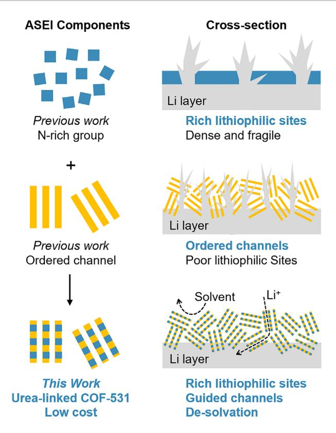
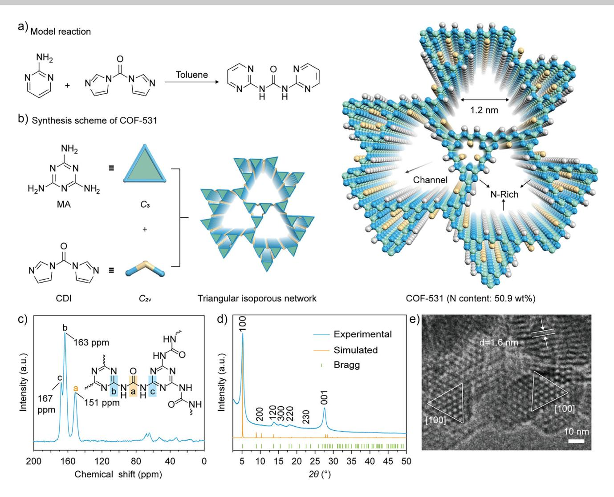
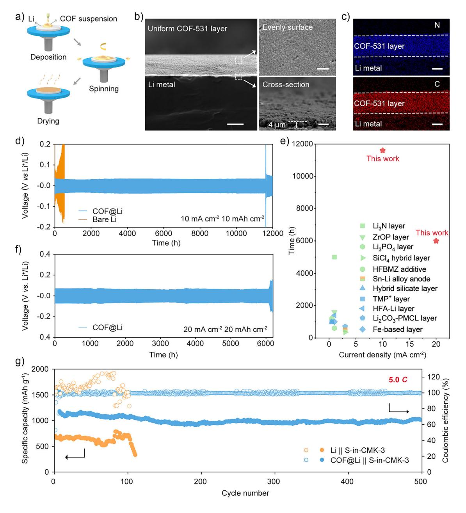
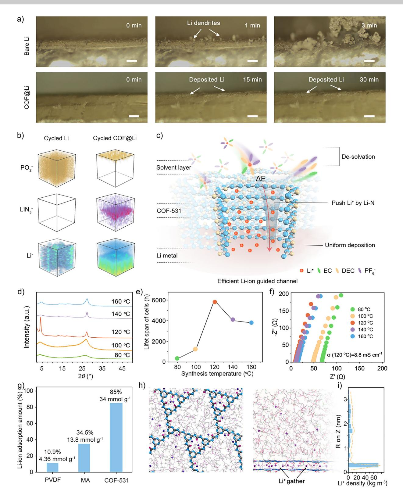
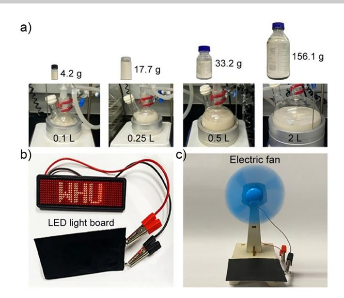

Zitierweise: *Angew. Chem. Int. Ed.* **2025**, *64*, e202500314 doi.org/10.1002/anie.202500314 *Batteries*

# **Urea-Linked Covalent Organic Framework as a Li-Ion Guided Channel Enabling Ultra-Stable Lithium Metal Anode in Carbonate-Based Electrolyte**

*Caihong Zhang*+*, Zhen Luo*+*, Kean Chen, Chunxing Yan, Lezhi Yi, Chengtao Gong,\* Yuliang Cao, and Fu-Sheng Ke\**

**Abstract:** Lithium (Li) metal exhibits great potential for achieving high-energy-density rechargeable batteries. However, the practical application of Li metal anodes is severely hindered by the uncontrollable growth of lithium dendrites as well as the instability of the spontaneously generated solid electrolyte interphase (SEI), causing safety concerns and lifespan issues. Herein, we customize a novel urea-linked covalent organic framework (COF-531) as an interfacial Li-ion guided channel. The COF-531 is constructed utilizing a highly dynamic urea-linkage, which balances the low reactivity of N-rich melamine (MA), and could simultaneously provide abundant lithiophilic N sites and crystallinity ordered ion channels. This structure is able to promote efficient Li+ de-solvation and transport, leading to uniform deposition via inhibiting dendrites growth. As a result, the COF@Li anode exhibits remarkable cycling performance under high current density (10 mA cm−2 over 11500 h and 20 mA cm−2 over 6000 h in the symmetric Li cells, and 1013 mAh g−1 after 500 cycles under 8.4 A g−1 in a COF@Li || S-in-CMK-3 cell), setting a new benchmark for long-cycle performance in carbonate-based electrolyte. Remarkably, the COF-531 can be produced at a low-cost (∼58.6 USD kg−1) on a kilogram scale. This work addresses a critical bottleneck in the commercialization of Li-metal batteries.

### *Introduction*

Li metal with its ultra-high theoretical capacity of 3860 mAh g−1, is one of the most promising approaches to overcome the energy density limitations of conventional rechargeable battery systems using graphite anodes

[kefs@whu.edu.cn](mailto:kefs@whu.edu.cn)

(372 mAh g−1).[\[1–6\]](#page-6-0) However, the commercialization of Li metal anode (LMA) is severely hindered by the notorious dendrites growth caused by sluggish de-solvation kinetics, uneven Li+ distribution, and fragile solid electrolyte interphase (SEI) in cycles.[\[7–9\]](#page-7-0) Among the various strategies to address these challenges, the modification or reconstruction of the SEI has emerged as one of the most effective approaches.[\[10–12\]](#page-7-0) Artificial SEI (ASEI) can directly regulate ion transport at the interface between active Li metal and electrolyte, thereby influencing Li deposition behaviors.[\[13–15\]](#page-7-0) It is noteworthy that the ASEI with high Li+ conductivity (*>*10−4 S cm−1) can be achieved by abundant Li─N bond species.[\[16,17\]](#page-7-0) The Li─N bond species, no matter via directly added or formed during the cycle process, have been shown to lower the Li+ migration barrier, and accelerate the Li+ flux.[\[18\]](#page-7-0) Moreover, it is proven that increasing the nitrogen content in ASEI layers is a straightforward and effective strategy for improving the Li metal performance.[\[13,19\]](#page-7-0) However, the Li─N-rich ASEI tends to show disordered organic/inorganic microstructure, lacking well-defined ion transport channels,[\[20,21\]](#page-7-0) which fails to achieve uniform interfacial Li+ concentration (Figure [1\)](#page-1-0).[\[16,22,23\]](#page-7-0)

To address this issue, crystalline porous materials, such as covalent organic frameworks (COFs), are used for constructing high-performance ASEI. COFs feature with various organic building blocks connected by strong covalent bonds.[\[20,24\]](#page-7-0) The intrinsic highly ordered pore structures of COFs can provide abundant migration pathways for Li+ transport. However, most reported COFs possess low nitrogen content, limiting their capacity on accelerating ion transport kinetics.[\[20\]](#page-7-0) In addition, the synthesis of nitrogenrich COFs often involves complex routes and expensive raw materials, hindering their large-scale production.[\[25,26\]](#page-7-0) Therefore, designing a COF-based interface layer that combines abundant nitrogen active sites, regular ion channels, and low-cost scalability represents a promising solution to the challenges faced by LMAs (Figure [1\)](#page-1-0).

Among the organic building blocks, melamine (MA) with N content up to 66.6 wt%, is an attractive candidate for constructing the interface of electrodes.[\[16\]](#page-7-0) However, the low reactivity of MA often leads to poor crystallinity, large block morphology, and harsh reaction conditions during constructing COF.[\[16,27–30\]](#page-7-0) Thus, it is challenging and meaningful to integrate chaotic nitrogen-rich units into highly periodic crystalline networks while maintaining favorable construction kinetics.

[\*] C. Zhang+, Z. Luo+, K. Chen, C. Yan, L. Yi, C. Gong, Y. Cao, F.-S. Ke Hubei Key Laboratory of Electrochemical Power Sources, Hubei Key Lab on Organic and Polymeric Opto-Electronic Materials, College of Chemistry and Molecular Sciences, Wuhan University, Wuhan 430072, China E-mail: [ctgong@whu.edu.cn](mailto:ctgong@whu.edu.cn)

[ +] These authors contributed equally to this work.

Additional supporting information can be found online in the Supporting Information section

*Forschungsartikel*

*Figure 1.* Schematic illustrations of Li deposition in three different ASEI, i.e., inorganic N-rich group, crystalline porous with ordered channel, and Li-ion guided channel COF-531. In previous work, the fragile N-rich interfacial layer lacked organized pores, making it difficult to regulate lithium deposition. In contrast, layer only with ordered pores but poor lithiophilic sites cannot enhance Li+ transport kinetics and inhibit dendrites growth. COF-531 layer combines sufficient nitrogen sites and ordered pores could accelerate Li+ flux and homogenize the ion concentration, achieving uniform and dendrite-free deposition.

In this work, based on dynamic covalent chemistry, we utilize high dynamic urea-linkage from *N*,*N* - Carbonyldiimidazole (CDI) to balance low reactivity of N-rich MA for the first time, realizing a novel highly crystalline urea-linked COF (denoted as COF-531). The COF-531 has regularly ordered pore structures and abundant lithiophilic sites with N content up to 50.9 wt%. It serves as a Li-ion guided channel on surface of LMA to enable uniform Li-ion transport and plating/stripping. The assembled COF@Li symmetric cells demonstrate ultra-long cycling stability with over 11 500 h at 10 mA cm−2, and significantly low over-potential for 6000 h even at a high current density of 20 mA cm−2 in the carbonate-based electrolyte. This result represents the longest cycling life reported so far. Furthermore, the COF@Li || S-in-CMK-3 full cell delivers considerable discharge capacities of 1013 mAh g−1 after 500 cycles at 5.0 *C*, highlighting its practical applicability. The superior performance profits from the COF-531, which serves as a Li-ion guided channel, enhancing the Li+ de-solvation, transport kinetic, and uniform deposition to effectively inhibit growth of dendrites. Additionally, MA and CDI have been widely used as industry raw materials with low cost about 0.94 and 19.774 USD kg−1, respectively. Therefore, an extremely low price of ∼58.6 USD kg−1 for this COF-531 was proven through kilogram-scale production in flasks. This work not only introduces a new class of MA-based urea-linked COFs for guiding Li-ion transportation, but also provides a practical solution to overcome the bottleneck of inhibiting lithium dendrites growth in LMAs.

# *Results and Discussion*

### *Synthesis and Characterization of COF-531*

To verify the feasibility of dynamic urea-linkage, a model reaction between 2-aminopyrimidine and CDI was initially performed that can yield 1,3-di(pyrimidin-2-yl)urea. This model molecule exhibits highly dynamic properties for the urea-linkage by exchange reactions with aniline (Figures [2a](#page-2-0) and S1–S5). Inspired by this result, urea-linked COF-531 featuring triangular heteroporous networks is constructed from 3-connected *C*3-symmetric MA and 2-connected *C*2vsymmetric CDI (Figures [2b](#page-2-0) and S6). As observed through in situ variothermal 1H NMR, the COF-531 is synthesized in two stages of liquid-phase polymerization followed by solidphase crystallization. Highly reversible urea-linkage enabled condensation and constant error correction between molecular fragments occur during the process (Figure S7). The formation of COF-531 is confirmed by solid-state 13C crosspolarization magic-angle-spinning (CP/MAS) NMR spectra, from which the signal of carbonyl carbon appears at 151 ppm (Figures [2c](#page-2-0) and S8). Furthermore, the peaks of 163 and 167 ppm are attributed to the carbon of triazine ring in the pore I and II, respectively. Meanwhile, the Fourier transform infrared (FT-IR) spectra of COF-531 shows the characteristic peak at 1741 cm−1, further indicating the formation of urealinkages (Figure S9). Elemental analyses reveal the C, H, and N contents are consisted with theoretical ratios (Table S1). And COF-531 also exhibits excellent thermal stability that initial decomposition temperatures up to 300 °C is confirmed by thermal gravimetric analysis (TGA) under nitrogen atmosphere (Figure S10).

As shown in Figure [2d,](#page-2-0) the crystal structure of COF-531 is characterized using the powder X-ray diffraction (PXRD) measurement. The high crystallinity of the synthesized COF-531 is evidenced by a series of multi-sharp diffraction peaks in the low angular range, which are quite different from the building blocks (Figure S11). Further comparing different possible 2D topological models and stacking types (Figures S12–S18), the experimental PXRD of COF-531 match well with the triangular heteroporous network for eclipsed AA-type stacking. The observed experimental PXRD peaks at 5.1°, 10.2°, 13.6°, 15.4°, 17.8°, 22.4°, and 27.5° are assigned to (100), (200), (120), (300), (220), (230), and (001) facets, respectively (Figure [2d\)](#page-2-0). In addition, refined unit cell parameters (*a* = *b* = 19.79 Å, *c* = 3.4458 Å) with *P*3 (No.143) space group and consistent parameters (*R*wp values of 6.57% and *R*p values of 4.83%) are obtained utilizing Rietveld refine, demonstrating the model structure (Figure S19, Tables S2 and S3 ).

*Forschungsartikel*

*Figure 2.* Synthetic scheme and structural characterization of COF-531. Synthetic scheme of the a) model reaction and b) urea-linked COF-531. According to the principle of network chemistry, including the geometric characteristics of monomers and periodic network models, COF-351 with a triangular heteroporous structure was obtained through the condensation of MA and CDI. c) Solid-state 13C NMR spectrum of COF-531, inset: structural unit of COF-531. d) Experimental, Rietveld-refined, and simulated PXRD patterns of COF-531. e) HR-TEM image of COF-531 along the [100] direction.

The N2 adsorption at 77 K are performed to evaluate the permanent porosity of COF-531 which exhibits a type I isotherm under relatively low-pressure region (*<P*/*P0* = 0.2). The pore size distribution, calculated from the solid-state density functional theory (QSDFT), exhibits the maximum aperture peak at 1.2 nm of COF-531, which is the same as the simulated results (Figures S20 and S21). In addition, COF-531 featuring large Brunauer-Emmett-Teller (BET) surface area is measured to be 300 m2 g−1 (Figure S22). Notably, the microcrystalline size of COF-531 is only about 20 nm, which is suitable for constructing the interfacial layer of LMA (Figures S23 and S24). As shown in the high-resolution TEM (HR-TEM) of COF-531, the clearly recognizable triangles and ordered pore features are highly consistent with the theoretical model (Figures 2e and S24). In addition, after immersion in boiling water, HCl (1 M), NaOH (1 M) aqueous solution for 24 hours or high-temperature treatment (250 °C in Ar), the PXRD of COF-531 show no significant change, proving its excellent chemical and physical stability (Figure S25). These results indicate the successful synthesis of COF-531 with N-rich and regular triangular channels that has the potential to regulate Li+ transport.[\[31\]](#page-7-0)

#### *Electrochemical Characterization*

The abundant N sites uniformly distribute in the lattice of COF-531 as Li+ affinity moieties to adsorb Li+ from the electrolyte, which facilitate de-solvation process and induce even plating of lithium. Besides, layered structures can shorten the distance of ion transport, which is beneficial for accelerating the migration of Li+. [\[32\]](#page-7-0) Therefore, we use spin coating method to construct COF-531 based ASEI on the surface of lithium metal to prepare modified electrodes (Figures [3a](#page-3-0) and [S26\)](#page-3-0). Through testing the cell performances with different spin-coating solvents and concentrations of

*Figure 3.* Electrochemical performances of COF@Li cells. a) Schematic step-by-step process of the spin-coating method. b) The SEM images of COF@Li, scale bars: 100 µm. Inserted images are top-view and cross-view of in the selected area, scale bars: 2 µm. c) Distribution of N and C element on the Li surface mapped by energy dispersive X-ray spectroscopy, scale bars: 2 µm. d) Voltage profile of cycling performances of symmetric cells with bare Li and COF@Li at 10 mA cm−2, 10 mAh cm−2. e) A cycling stability comparison of the COF@Li symmetric cells with similar works in recent literatures in carbonate-based electrolyte. The details of the references are shown in Table S4. f) Cycling performances of symmetric cells with COF@Li at 20 mA cm−2, 20 mAh cm−2. g) Cycle performances of Li || S-in-CMK-3 and COF@Li || S-in-CMK-3 cells at a current density of 5 *C* (8.4 A g−1 ).

COF-531, we select the best suitable conditions that the optimal electrode and named as COF@Li (Figures S27 and S28). As shown on the surface and cross-section of the COF@Li in the SEM images, the COF layer immediately adjacent to the lithium interface exhibits a homogeneous and dense surface morphology, and the thickness is about 4 µm (Figures 3b and S29). In order to observe the distribution of COF@Li, energy dispersive spectrometer (EDS) mapping clearly confirms the uniform distribution of C and N elements in the COF layer (Figure 3c).

To further investigate the interface stability of electrodes, galvanostatic cycling performances of COF@Li symmetric cells are carried out at various conditions in the carbonatebased electrolyte, and an activation process is carried out prior to the tests (Figure S30). When measure at current density to 10 mA cm−2 after activation process, the life span of COF@Li symmetric cell is still over 11 500 h under a stable overpotential of 35 mV (Figures [3d](#page-3-0) and S31). It is noteworthy that executed at ultra-high current density of 20 mA cm−2 and areal capacity of 20 mAh cm−2, COF@Li is still able to maintain a remarkable cycle life exceeds 6000 h with an impressively low overpotential of 66 mV (Figures [3f](#page-3-0) and S32). These results completely demonstrate the advantages of COF-531 in protecting lithium electrodes and can be considered as the new benchmark for the long cycle performances of lithium symmetric batteries in carbonate-based electrolytes (Figures [3e,](#page-3-0) S33 and Table S4).[\[1,21,22,33–42\]](#page-6-0)

Additionally, there is no significant voltage fluctuation or decrease in various current densities during the cycling process in COF@Li (Figure S34), and charge-discharge curves show a small hysteresis voltage, which is attributed to the low interfacial impedance of the electrodes indicating that excellent interfacial stability (Figures S35 and S36). To visualize the inhibitory effect of COF-531 on dendrites growth, we analyze the morphology of the plated Li foil after 500 cycles. In contrast to the mossy surface of the bare Li after cycling, COF@Li maintains a compact and uniform morphology without dendrites or "dead Li", verifying that COF-531 effectively inhibits dendrites growth (Figures S37 and S38). Moreover, the PXRD and X-ray Photoelectron Spectroscopy (XPS) of the COF@Li surface exhibit no significant distinction after cycling, indicating that COF-531 retains its high crystallinity and original chemical composition (Figures S39–S43). Impressively, the XPS spectra of N1s reveals the generation of new Li─N bonding peaks on the lithium surface, which offers the driving force for rapid Li + transporting.

The performance of full cells incorporating sulfur (S-in-CMK-3) cathodes is assessed within a carbonate electrolyte environment (Figures S44 and S45). Upon cycling at a rate of 5 *C* (corresponding to 8.4 A g−1), the Coulombic Efficiency (CE) of the Li || S-in-CMK-3 cell exhibits perturbations beyond 70 cycles. In stark contrast, the cell featuring COF-531 demonstrates a remarkable reversible capacity of up to 1013 mAh g−1 after 500 cycles, accompanied by an exceptionally low-capacity degradation rate and nearly 100% CE (Figure [3g\)](#page-3-0). When the operational rate is elevated to 10 *C* (16.8 A g−1), the COF@Li || S-in-CMK-3 cell maintains a reversible specific capacity of approximately 400 mAh g−1 after 500 cycles (Figures S46 and S47). These findings underscore the profound impact of COF-531, serving as an advanced ASEI, on enhancing both cycle stability and capacity retention in Li-S batteries.

#### *Mechanism Study and Application*

Combining the in situ optical microscopy and ToF-SIMS, we unveil the underlying mechanisms responsible for the exceptional performance of COF@Li. First, in situ optical microscopy shows visible protrusions formed on the bare lithium within a minute, which subsequently evolve into numerous dendrites. In contrast, COF@Li exhibits a smooth morphology devoid of dendrites even after 30 min, suggesting the effectiveness of COF-531 in mitigating dendrite growth (Figure [4a,](#page-5-0) video S1 and S2). Subsequent analysis of the electrode surface components using ToF-SIMS postcycling provides intriguing insights. 3D view models show the distribution of ionic fragments, obviously, the electrolyte anionic dissociation product PO2 − from PF6 − is only present in the outmost layer of cycled COF@Li, indicating that the COF-531 layer effectively blocks the direct contact between PF6 − and lithium (Figure [4b\)](#page-5-0). Regarding Li-ion transport, the uniformly distributed LiN3 − overlaps with the upper interface of the lithium signal, representing the ordered and abundant nitrogen sites in the COF-531 skeleton, which rapidly guides Li-ion transport from the interface to the lithium substrate through Li─N bonds (Figure S48). Furthermore, an examination of the lithium depth distribution post-cycling of COF@Li reveals a uniform and dense deposition pattern, while significantly favoring the loose distribution due to inhomogeneous deposition of bare Li. Consequently, during cycling, the COF-531 layer can be envisaged as an efficient Li-ion guided channel, accelerating the Li+ de-solvation process, enhancing Li+ conduction, and directing homogeneous deposition (Figure [4c\)](#page-5-0).

To elucidate the pivotal role of ordered, N-rich pore structures, comparative experiments are conducted. Disordered ASEIs, made from N-rich molecules or binder complexes, fail to stabilize the lithium interface (Figures S49–S51). Furthermore, a series of COF-531 with different crystallinity are successfully prepared by regulating the synthesis temperature (Figures S52–S58), with a direct correlation between the corresponding battery performance and ordered degrees, thus the channel of COF-531 plays a crucial role to improve Li-ion conduction (Figures [4d,e](#page-5-0) and S59–S64). The smaller polarization voltage is generally attributed to the higher interfacial ionic conductivity of the COF-531 sample synthesized at 120 °C w hich has the highest value of 8.8 × 10−3 S cm−1 among the samples with different degrees of crystallinity (Figure [4f\)](#page-5-0). On the other hand, COF-531 has more Li+ adsorption capacity in LiPF6 − based electrolyte (up to 34 mmol g−1) than MA (13.8 mmol g−1) and PVDF (4.36 mmol g−1) (Figure [4g\)](#page-5-0). DFT calculations modelling the ion distribution in the electrolyte and interfacial layer system. The top and cross-section views of the calculated model exhibit that Li-ion tend to distribute around the lithophilic sites (N/O) in the COF skeleton (Figure [4h\)](#page-5-0). The concentration of Li-ion in the COF-531 layer is considerably higher than the carbonate electrolyte. The ordered and Nrich COF-531, facilitates the detachment of lithium ions from solvated structures (Figure [4i\)](#page-5-0). Overall, COF-531 can be regarded as an efficient interfacial Li-ion guided channel, to regular distribution of lithium affinity sites traps lithium ions and shuttles them rapidly instead of leading to uneven ion concentration and dendrites formation.

Importantly, COF-531 emerges as a scarce, low-cost functional material amenable to large-scale production. Regarding its synthesis, the one-pot method conducted in a glass flask under ambient pressure offers straightforward scalability, solely contingent upon the reactor size (Figure [5a\)](#page-6-0). In contrast to other notable scalable COFs, the kilogram-scale production of COF-531 necessitates no specialized high-pressure reaction vessel.[\[43\]](#page-7-0) Impressively, the large-scale produced COF-531

# *Forschungsartikel*

*Figure 4.* Exploration of COF-531 Li-ion guided channel operational mechanism. a) In situ optical microscopy images of the Li deposition process of the bare Li anode and COF@Li anode, using a Li metal cathode at the current density of 5 mA cm−2, scale bar: 200 µm. b) 3D visualization of the architectural evolution of cycled Li and cycled COF@Li by using ToF-SIMS. c) Schematic of Li-ion guided channel, crystallinity ordered ion channels to boost the Li+ de-solvation, transport kinetics and uniform deposition to inhibit growth of dendrites. d) PXRD patterns, e) life span of Li symmetrical cells modified by COF-531 and f) Nyquist plots of COF-531 with different crystallinity degrees. Different colors represent COF-531 samples at different synthesis temperatures: green is 80 °C, orange is 100 °C, red is 120 °C, purple is 140 °C and blue is 160 °C. g) Li-ion adsorption amount in different supernatant of the 1.0 M LiPF6 in EC/DEC of 1:1 (vol) electrolyte after 2 h. h) DFT calculations modeling the ion distribution in the electrolyte and interfacial layer system and i) the concentration curve of Li-ion.

*Figure 5.* Large-scale synthesis and practical application prospects of COF-531. a) Photograph of the scale-up fabrication of COF-531 in different size of reactors: 0.1 L, 0.25 L, 0.5 L, and 2 L. Digital photographs of the pouch cell powering b) LED light board c) and an electric fan.

samples retain nearly identical crystallinity compared to their small-scale counterparts (Figure S65). Upon evaluating monomer and solvent costs, the cost formula yields a value of 58.6 USD kg−1, the quantity of COF-531 required for lithium per unit area is 0.32 mg cm−2, costing only 0.0000187 USD (Table S5). COF-531 is extremely advantageous in terms of cost over conventional COF production, especially in commercial applications (Table S6). As a proof of concept, pouch cells were then made using LiNi0.5Co0.2Mn0.3O2 (NCM523) as cathode. The COF@Li || NCM523 configuration cycles steadily for 60 cycles, representing a three-fold improvement compared to the bare Li || NCM523 setup (Figures S66 and S67). In addition, the pouch cell is capable of serving as power sources for electronic devices, including light-emitting diodes (LEDs) and electric fans (Figure 5b,c). These results demonstrate the commercial application potential of the COF@Li anode.

# *Conclusion*

This work presents a significant advancement in the development of advanced solid electrolyte interphases (ASEIs) for lithium-metal batteries, leveraging the unique properties of COF-531, a nitrogen-rich covalent organic framework (COF) with highly dynamic urea linkage In conclusion, this work highlights the potential of COF-531 as a transformative material for lithium-metal batteries, offering a combination of high performance, scalability, and cost-effectiveness that could revolutionize the field of energy storage.In this work, we demonstrate that a significant breakthrough by exploiting highly dynamic urea-linkage to build advanced ASEIs lithium-metal batteries, integrating N-rich MA units into covalently connected infinitely extended crystal network for COF-531. The COF-531-based ASEIs are proven to promote the de-solvation process of Li+. The abundant N-lithophilic sites attract Li-ion to the surface of the electrodes, meanwhile the Li─N bonds accelerate the uniform Li+ transport to prevent the formation of dendrites. As a result, the assembled symmetric Li cells and COF@Li || S-in-CMK-3 cells deliver ultra-high cycle stability, setting the new benchmark for achieving long cycle performance at high current densities in carbonate-based electrolytes. Combined with the costeffectiveness and readily availability for a kilogram scale, this advancement on COF-531-based SEIs marks a critical step toward the practical application of lithium-metal batteries in high-energy-density storage systems.

# *Acknowledgements*

This study was financially supported by the National Natural Science Foundation of China (Nos. 22172116 and 223B2117), Natural Science Foundation of Hubei Province (2024AFA021 and 2022CFB130), The authors thank Prof. Hexiang Deng and Prof. Hengjiang Cong (Wuhan University) for their invaluable assistance. F.S.K. acknowledges the Large-scale Instrument and Equipment Sharing Foundation of Wuhan University, and thanks Zhuofei Wang and Xue Zhou from the Core Research Facilities of CCMS (WHU) for NMR analysis. The numerical calculations in this paper were done on the supercomputing system in the Supercomputing Center of Wuhan University.

# *Conflict of Interests*

The authors declare no conflict of interest.

# *Data Availability Statement*

The data that support the findings of this study are available in the supplementary material of this article.

**Keywords:** ASEI • Covalent organic framework • Dynamic urea linkage • Lithium Anode

- [1] H. Mei, H. Cheng, Z. Wang, J. Li, *Chem. Eng. Sci.* **2017**, *164*, 81–89.
- [2] S. S. Haghighi, M. R. Rahimpour, S. Raeissi, O. Dehghani, *Chem. Eng. Sci.* **2013**, *228*, 1158–1167.
- [3] L. Zhao, Y. Tao, Y. Zhang, Y. Lei, W. H. Lai, S. Chou, H. K. Liu, S. X. Dou, Y. X. Wang, *Adv. Mater.* **2024**, *36*, 2402337.
- [4] Y.-J. Lei, X. Lu, H. Yoshikawa, D. Matsumura, Y. Fan, L. Zhao, J. Li, S. Wang, Q. Gu, H.-K. Liu, S.-X. Dou, S. Devaraj, T. Rojo, W.-H. Lai, M. Armand, Y.-X. Wang, G. Wang, *Nat. Commun.* **2024**, *15*, 3325.
- [5] N. LeGe, Y.-H. Zhang, W.-H. Lai, X.-X. He, Y.-X. Wang, L.-f. Zhao, M. Liu, X. Wu, S.-L. Chou, *Chem. Sci.* **2025**, *16*, 1179.
- [6] Y.-J. Lei, L. Zhao, W.-H. Lai, Z. Huang, B. Sun, P. Jaumaux, K. Sun, Y.-X. Wang, G. Wang, *Chem. Soc. Rev.* **2024**, *53*, 3829.

- [7] Q. Zhao, Z. Tu, S. Wei, K. Zhang, S. Choudhury, X. Liu, L. A. Archer, *Angew. Chem. Int. Ed.* **2018**, *57*, 992–996.
- [8] Y. Zhai, Z. Zhong, N. Kuang, Q. Li, T. Xu, J. He, H. Li, X. Yin, Y. Jia, Q. He, S. Wu, Q.-H. Yang, *J. Am. Chem. Soc.* **2024**, *146*, 15209–15218.
- [9] H. Dai, J. Dong, M. Wu, Q. Hu, D. Wang, L. Zuin, N. Chen, C. Lai, G. Zhang, S. Sun, *Angew. Chem. Int. Ed.* **2021**, *60*, 19852– 19859.
- [10] C. Jin, Y. Huang, L. Li, G. Wei, H. Li, Q. Shang, Z. Ju, G. Lu, J. Zheng, O. Sheng, X. Tao, *Nat. Commun.* **2023**, *14*, 8269.
- [11] J. Y. Liang, X. D. Zhang, Y. Zhang, L. B. Huang, M. Yan, Z. Z. Shen, R. Wen, J. Tang, F. Wang, J. L. Shi, L. J. Wan, Y. G. Guo, *J. Am. Chem. Soc.* **2021**, *143*, 16768–16776.
- [12] Z. Wang, J. Xia, X. Ji, Y. Liu, J. Zhang, X. He, W. Zhang, H. Wan, C. Wang, *Nat. Energy* **2024**, *9*, 251–262.
- [13] Y. Chen, J. Qian, X. Hu, Y. Ma, Y. Li, T. Xue, T. Yu, L. Li, F. Wu, R. Chen, *Adv. Mater.* **2023**, *35*, 2212096.
- [14] X. Wu, S. Zhang, X. Xu, F. Wen, H. Wang, H. Chen, X. Fan, N. Huang, *Angew. Chem. Int. Ed.* **2024**, *63*, e202319355.
- [15] Q. He, Z. Li, M. Wu, M. Xie, F. Bu, H. Zhang, R. Yu, L. Mai, Y. Zhao, *Adv. Mater.* **2023**, *35*, 2302418.
- [16] B.-Q. Xiong, X. Zhou, G.-L. Xu, X. Liu, Y. Hu, Y. Liu, L. Zhu, C.-G. Shi, Y.-H. Hong, S.-C. Wan, C.-J. Sun, S. Chen, L. Huang, S.-G. Sun, K. Amine, F.-S. Ke, *ACS Energy Lett.* **2020**, *5*, 3490– 3497.
- [17] Y. Wang, Z. Qu, S. Geng, M. Liao, L. Ye, Z. Shadike, X. Zhao, S. Wang, Q. Xu, B. Yuan, X. Zhang, X. Gao, X. Jiang, H. Peng, H. Sun, *Angew. Chem. Int. Ed.* **2023**, *62*, e202304978.
- [18] A. Hu, W. Chen, X. Du, Y. Hu, T. Lei, H. Wang, L. Xue, Y. Li, H. Sun, Y. Yan, J. Long, C. Shu, J. Zhu, B. Li, X. Wang, J. Xiong, *Energy Environ. Sci.* **2021**, *14*, 4115–4124.
- [19] J. Yu, X. Ma, X. Zou, Y. Hu, M. Yang, J. Yang, S. Sun, F. Yan, *Energy Environ. Sci.* **2024**, *17*, 4519–4530.
- [20] J. He, A. Bhargav, A. Manthiram, *Angew. Chem. Int. Ed.* **2022**, *61*, e202116586.
- [21] J. Huang, J. He, Q. Liu, J. Ma, *Adv. Funct. Mater.* **2023**, *33*, 2213811.
- [22] X. Fu, H. Duan, L. Zhang, Y. Hu, Y. Deng, *Adv. Funct. Mater.* **2023**, *33*, 2308022.
- [23] Y. Shufen, W. Lifeng, L. Fanfan, S. Pengcheng, W. Haiyun, W. Xiaojun, Y. Yan, *Adv. Energy Mater.* **2020**, *10*, 2002647.
- [24] Y. Xiao, J. Lu, K. Chen, Y. Cao, C. Gong, F.-S. Ke, *Angew. Chem. Int. Ed.* **2024**, *63*, e202404738.
- [25] Z. Li, W. Ji, T. X. Wang, Y. Zhang, Z. Li, X. Ding, B. H. Han, W. Feng, *ACS Appl. Mater. Interfaces* **2021**, *13*, 22586–22596.

- [26] Z. Conghui, X. Jiyang, Z. Changtai, Y. Yongxin, A. Qi, M. Zhiyuan, X. Qijun, D. Yuqing, Z. Genfu, G. Hong, *Adv. Mater.* **2023**, *35*, e2304511.
- [27] S. Zhou, S. Yang, D. Cai, C. Liang, S. Yu, Y. Hu, H. Nie, Z. Yang, *Adv. Sci.* **2022**, *9*, 2104205.
- [28] N. Sahiner, S. Demirci, K. Sel, *J P.Mater*. **2016**, *23*, 1025–1035.
- [29] H. Duan, K. Li, M. Xie, J.-M. Chen, H.-G. Zhou, X. Wu, G.-H. Ning, A. I. Cooper, D. Li, *J. Am. Chem. Soc.* **2021**, *143*, 19446– 19453.
- [30] J. Xie, J. Ye, F. Pan, X. Sun, K. Ni, H. Yuan, X. Wang, N. Shu, C. Chen, Y. Zhu, *Adv.Mater* **2019**, *31*, 1805654.
- [31] C. Zhao, C. S. Diercks, C. Zhu, N. Hanikel, X. Pei, O. M. Yaghi, *J. Am. Chem. Soc.* **2018**, *140*, 16438–16441.
- [32] D. Zhang, J. Cao, X. Zhang, Z. Zeng, N. Insin, J. Qin, Y. Huang, *Adv. Energy Sustain. Res.* **2022**, *3*, 2100183.
- [33] J. Meng, M. Lei, C. Lai, Q. Wu, Y. Liu, C. Li, *Angew. Chem. Int. Ed.* **2021**, *60*, 23256–23266.
- [34] L. Sheng, Q. Wang, X. Liu, H. Cui, X. Wang, Y. Xu, Z. Li, L. Wang, Z. Chen, G.-L. Xu, J. Wang, Y. Tang, K. Amine, H. Xu, X. He, *Nat. Commun.* **2022**, *13*, 172–182.
- [35] X. Li, J. Liu, J. He, S. Qi, M. Wu, H. Wang, G. Jiang, J. Huang, D. Wu, F. Li, J. Ma, *Adv. Sci.* **2022**, *9*, 2201297.
- [36] F. Liu, Q. Xiao, H. B. Wu, L. Shen, D. Xu, M. Cai, Y. Lu, *Adv. Energy Mater.* **2018**, *8*, 1701744.
- [37] Y. Gu, J. Hu, M. Lei, W. Li, C. Li, *Adv. Energy Mater.* **2024**, *14*, 2302174.
- [38] Y. Xie, Y. Huang, Y. Zhang, T. Wu, S. Liu, M. Sun, B. Lee, Z. Lin, H. Chen, P. Dai, Z. Huang, J. Yang, C. Shi, D. Wu, L. Huang, Y. Hua, C. Wang, S. Sun, *Nat. Commun.* **2023**, *14*, 2883–2883.
- [39] Z. Zhang, S. Guan, S. Liu, B. Hu, C. Xue, X. Wu, K. Wen, C. W. Nan, L. Li, *Adv. Energy Mater.* **2022**, *12*, 2103332.
- [40] N. Li, Y. Yin, C. Yang, Y. Guo, *Adv. Mater.* **2016**, *28*, 1853–1858.
- [41] T. Yu, T. Zhao, N. Zhang, T. Xue, Y. Chen, Y. Ye, F. Wu, R. Chen, *Nano Lett.* **2023**, *23*, 276–282.
- [42] Z. Tu, S. Choudhur, M. J. Zachman, S. Wei, K. Zhang, L. F. Kourkoutis, L. A. Archer, *Nat. Energy* **2018**, *3*, 310–316.
- [43] Z. Wang, Y. Zhang, E. Lin, S. Geng, M. Wang, J. Liu, Y. Chen, P. Cheng, Z. Zhang, *J. Am. Chem. Soc.* **2023**, *145*, 21483– 21490.

Manuscript received: January 05, 2025

- Revised manuscript received: March 17, 2025
- Accepted manuscript online: March 17, 2025 Version of record online: March 27, 2025