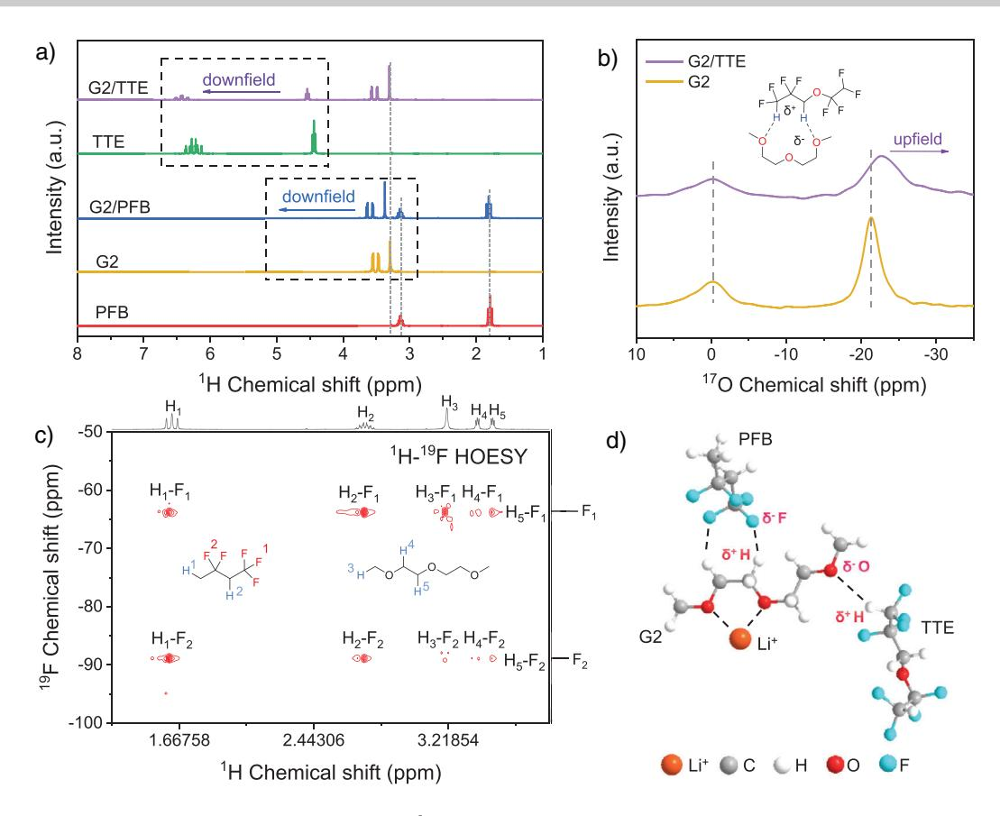
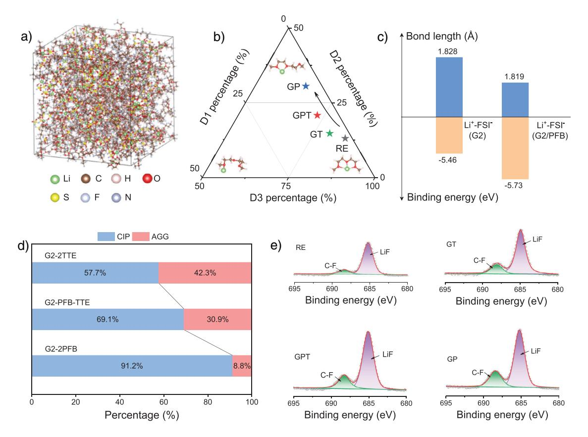
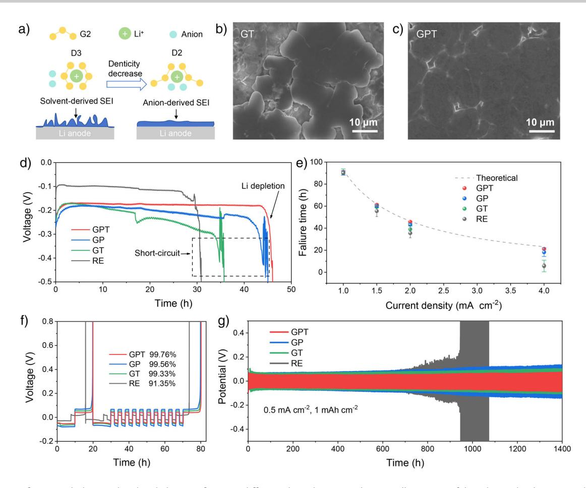
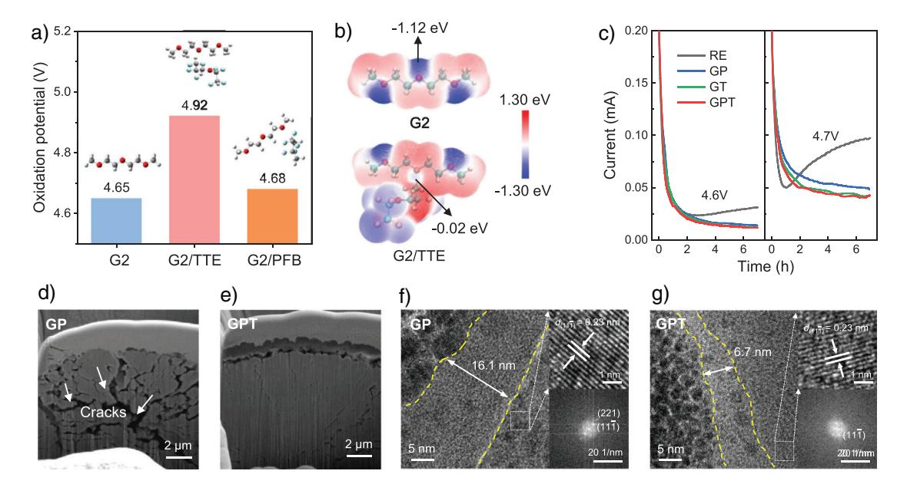
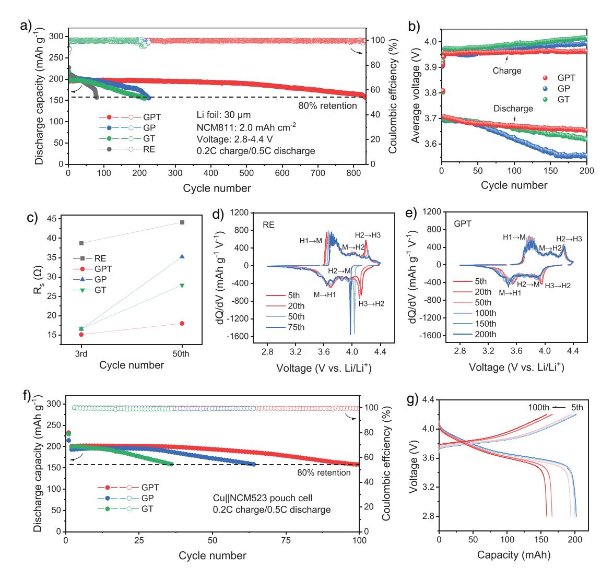

*Forschungsartikel*

Zitierweise: *Angew. Chem. Int. Ed.* **2025**, *64*, e202506395 doi.org/10.1002/anie.202506395 *Batteries Hot Paper*

# **Regulating Solvating Sites for Stable High-Voltage Lithium Metal Batteries**

*Zeyuan Liu*+*, Shuoqing Zhang*+*, Haikuo Zhang, Baochen Ma, Haotian Zhu, Tao Zhou, Long Li, Xuezhang Xiao, Ruhong Li, Lixin Chen, Tao Deng, and [Xiulin Fan\\*](https://orcid.org/0000-0001-7294-480X)*

**Abstract:** The long-lasting stability of high-voltage lithium metal batteries (LMBs) critically rely on both the cathodic and anodic stability of electrolytes, which can be enhanced by increasing the salt-to-solvent molar ratio. However, this approach is limited by solubility constraints. In this work, we introduce a dual-anchoring strategy to regulate the solvating sites of glymes via directional atomic interactions. Specifically, Fδ−–Hδ+ interactions transform the Li+-glyme coordination and induce more anion coordination within Li+ primary solvation sheath, whereas Hδ+–Oδ− interactions reduce the electron density at free oxygen sites, thus raising the oxidational potential of glyme and enhancing the overall oxidation stability of electrolytes. This strategy results in an electrolyte with exceptional compatibility with both lithium metal anode (LMA) and high-voltage cathode, enabling LMA with an ultrahigh coulombic efficiency (CE) of 99.76%. Furthermore, the assembled LMBs exhibit extended lifespans, retaining 80% of their capacity under aggressive conditions: 834 and 370 cycles at 4.4 and 4.5 V, respectively, for 30-µm-Li||2.0-mAh cm−2 LiNi0.8Co0.1Mn0.1O2 cells and 100 cycles for anode-free Cu||LiNi0.5Co0.2Mn0.3O2 pouch cells. This work offers novel insights into the advancement of next-generation LMBs based on ether-based electrolytes.

# *Introduction*

Lithium metal batteries (LMBs) have emerged as a pivotal research focus within the realm of next-generation energy storage technologies, owing to the ultrahigh specific capacity (3860 mAh g−1) and extremely low redox potential (−3.04 V versus standard hydrogen electrode) of lithium metal anode (LMA).[\[1–3\]](#page-8-0) However, the commercialization of LMBs faces significant challenges, primarily due to unconstrained dendritic Li growth and limited coulombic efficiency (CE), which lead to safety hazards and a shortened cycle life.[\[4–6\]](#page-8-0) Electrolyte engineering has proven effective in addressing these issues by alleviating side reactions at the interface.[\[7–9\]](#page-8-0)

China-UK Low Carbon College, Shanghai Jiao Tong University, Shanghai 201306, China

R. Li

ZJU-Hangzhou Global Scientific and Technological Innovation Center, Zhejiang University, Hangzhou 311215, China

L. Chen

Key Laboratory of Hydrogen Storage and Transportation Technology of Zhejiang Province, Hangzhou 310027, China

*Angew. Chem.* **2025**, *137*, e202506395 (1 of 9) © 2025 Wiley-VCH GmbH

Conventional carbonate electrolytes are not applicable to LMBs due to their high reactivity with LMA.[\[10,11\]](#page-8-0) In contrast, ether-based electrolytes, particularly those utilizing glymes (G*n*, where *n* represents the number of ether units in CH3[CH2CH2O]*n*OCH3) as solvents, significantly enhance the overall reversibility of LMBs owing to the exceptional reduction stability of glymes on LMA.[\[12\]](#page-8-0) Despite these advantages, the CE of Li plating/stripping in glyme-based electrolytes remains below the commercial requirements. Additionally, the intrinsic oxidation instability of glymes limits their compatibility with high-voltage cathodes, thus hindering the development of high-energy-density LMBs. Hence, glyme-based electrolytes require further modifications to ensure compatibility with both LMA and high voltage cathode.

The cathodic and anodic stability of the glyme-based electrolyte is critically dependent on the Li+ solvating configuration.[\[13\]](#page-8-0) Coordinating anions with Li+ enhances the cathodic stability of the electrolytes by promoting the formation of a robust, inorganic-rich solid electrolyte interphase (SEI).[\[14\]](#page-8-0) Simultaneously, increasing Li+-glyme coordination enhances the anodic stability of glymes by lowering the highest occupied molecular orbital (HOMO) energy level, facilitated by the donation of lone pairs from ethereal oxygen atoms to the Lewis acidic Li+. [\[12,15\]](#page-8-0) A direct approach to modulate the Li+ solvating configuration involves increasing the molar ratio of salts/solvents, as demonstrated by the high or localized high concentration electrolytes (HCEs/LHCEs).[\[16–18\]](#page-8-0) However, such an Li+ coordination strategy is limited by the solubility threshold as the salt concentration cannot be increased indefinitely in solvents. As a result, uncoordinated solvating sites (free sites) may

[\*] Z. Liu+, S. Zhang+, H. Zhang, B. Ma, H. Zhu, T. Zhou, L. Li, X. Xiao, R. Li, L. Chen, X. Fan

State Key Laboratory of Silicon and Advanced Semiconductor Materials, School of Materials Science and Engineering, Zhejiang University, Hangzhou 310027, China E-mail: [xlfan@zju.edu.cn](mailto:xlfan@zju.edu.cn)

S. Zhang+, T. Deng

[ +] Both authors contributed equally to this work.

Additional supporting information can be found online in the Supporting Information section

# **Forschungsartikel**

Figure 1. Schematic of electrolyte design principles. a) Various Li+-G2 configurations. b) Correlation between anion coordination tendency and oxidation resistance. c) Dual-anchoring strategy enabled by a synergistic effect of two anchoring agents. d)  $E_{min}(F^{\delta-})$  and  $E_{max}(H^{\delta+})$  of different cosolvents.

form, compromising the interfacial stability between the electrolyte and electrode. Therefore, it is imperative to exploit a nonionic coordination strategy to further enhance glyme-based electrolytes for high-voltage LMBs.

#### **Results and Discussion**

Before implementing the dual-anchoring strategy, it is essential to first elucidate the solvation configuration between Li+ Herein, we propose a dual-anchoring strategy to modulate and G2. G2 features three solvating sites, allowing for three potential Li+-G2 configurations: tridentate (denticity = 3, D3), bidentate (denticity  $= 2$ , D2), and monodentate (denticity = 1, D1) coordination (Figure 1a). Among these, D3 configuration exhibits the highest oxidation stability due to its complete coordination of all solvating sites, which aligns with the lowest HOMO energy level (Figure S1a). However, the highly solvating D3 configuration also shows the highest binding energy with Li+ (Figure S1b), thus hindering anion coordination. Conversely, the D1 configuration, although most conducive to anion ingress into the  $Li^+$  solvation sheath, sacrifices oxidation stability. As a result, the D2 configuration is identified as the optimal choice, balancing both oxidation stability and the tendency for anion coordination (Figure 1b).

To increase the proportion of D2 and further enhance its stability, we propose a dual-anchoring strategy to regulate the solvating sites of G2 molecule (Figure 1c). The first anchoring agent is designed to alter the configuration of Li+-G2, facilitating the transition from the D3 to the D2 configuration. This agent should contain highly electronegative F atoms, which generates sufficient intermolecular interactions with the H atoms of G2, thereby dragging the G2 molecule and transforming the configuration. The second anchoring agent targets the stabilization of the free oxygen sites in G2. This agent must feature electropositive H atoms to significantly decrease the electron density at these oxygen sites, thus

the solvating configuration of glymes via directional atomic interactions among solvents. This nonionic coordination significantly enhances the both cathodic and anodic stability of glyme-based electrolytes by introducing specific cosolvents. As a proof of concept, diglyme  $(G2)$  was selected as the base solvent due to its multiple ethereal oxygen atoms, which provides greater flexibility in coordinating with Li+ compared to monoglyme. To optimize the solvating structure, we introduced  $1,1,1,3,3$ -pentafluorobutane (PFB) and  $1,1,2,2$ -tetrafluoroethyl- $2,2,3,3$ -tetrafluoropropyl ether (TTE) as cosolvents to anchor G2 molecules. PFB utilizes the F-H interactions to stretch the molecular chain of G2, facilitating greater anion coordination with Li+, whereas TTE anchors the free oxygen sites of G2 via H–O interactions, thereby enhancing the oxidation stability of the glyme solvent. Accordingly, the designed electrolyte using this dual-anchoring strategy exhibits an impressive Li plating/striping CE of 99.76%. Furthermore, 30-µm-Lill2.0 mAh cm-2-LiNi0.8Co0.1Mn0.1O2 (NCM811) cells, incorporating this electrolyte, retain 80% of their initial capacity over 800 cycles at 4.4 V and over 350 cycles at 4.5 V. This work demonstrates a novel nonionic solvation regulation strategy via directional atomic anchoring effect, offering significant insights into the development of ether-based electrolytes for high-voltage LMBs.

*Figure 2.* Interactions between G2 and PFB and G2 and TTE. a) 1 H NMR spectra of different solvents and solvent mixtures. b) Comparison of 17O NMR spectra between G2 and G2/TTE. c) 2D 1 H-19F HOESY for G2/PFB. d) Schematic diagram of the interactions between G2 and PFB and TTE.

bolstering the oxidation stability of G2. To identify the ideal anchoring agents, we calculated the minimum electrostatic potentials (ESPs) of the fluorine atoms (donated as *E*min(Fδ−)) and the maximum ESPs of the hydrogen atoms (donated as *E*max(Hδ+)) across various common cosolvents, including hydrofluoroethers, fluoroalkanes, and benzene derivatives (Figures [1d](#page-1-0) and S2). *E*min(Fδ−) and *E*max(Hδ+) represent the degree of F electronegativity and H electropositivity, respectively.[\[19,20\]](#page-8-0) Among the tested cosolvents, PFB and TTE exhibit the smallest *E*min(Fδ−) and largest *E*max(Hδ+), making them ideal candidates for the dual-anchoring agents. Therefore, PFB and TTE were selected to atomically coordinate with G2 solvent, thereby enhancing both anion coordination and the oxidation stability of G2. This nonionic anchoring strategy effectively circumvents the solubility limitations that are inherent in ionic coordination approach.

The atomic interactions between G2, PFB, and TTE were examined using nuclear magnetic resonance spectroscopy (NMR). The 1H NMR reveals a noticeable increase in the chemical shifts of H (TTE) upon mixing with G2 (Figure 2a), indicating robust interactions between Hδ+ (TTE) and Oδ− (G2). By comparison, the interactions involving Oδ− (TTE)-Hδ+ (G2) or Fδ− (TTE)-Hδ+ (G2) are much weaker, as evidenced by the minimal change in the chemical shifts of H(G2). Geometry optimizations of the G2-TTE complexes, performed using density-functional theory (DFT), also support that the Hδ+ (TTE)-Oδ− (G2) interactions are favored over Fδ− (TTE)-Hδ+ (G2) interactions (Figure S3). The predominant Hδ+ (TTE)-Oδ− (G2) interactions are ascribed to the strong hydrogen donor group (CF2H) present in TTE molecule.[\[21\]](#page-8-0) To further confirm these interactions, 17O NMR was conducted, revealing a reduced chemical shift for the oxygen atom in G2 (Figures 2b and S4), which is additional evidence for the Hδ+ (TTE)-Oδ− (G2) interactions. It is worth noting that only a decrease in the chemical shift of the terminal oxygen atoms of G2 was observed in the 17O NMR, whereas the chemical shift of the central oxygen atom remained relatively unchanged. This suggests a preferential interaction of Hδ+ (TTE) with terminal Oδ− (G2).

In contrast, PFB anchors G2 through the Fδ− (PFB)-Hδ+ (G2) interaction, as validated by the significant shifts observed in H(G2) upon mixing with PFB. In comparison, only minimal shifts are observed when G2 is mixed with TTE. Moreover, the interaction between PFB and G2 was further corroborated by 1H–19F heteronuclear Overhauser effect spectroscopy (HOESY), where both intramolecular and intermolecular contacts between H and F indicate the presence of the Fδ− (PFB)-Hδ+ (G2) interactions in G2-PFB complex[\[22\]](#page-8-0) (Figure 2c). The potential Hδ+ (PFB)-Oδ− (G2) interactions in the G2-PFB complex were found to be weak, as indicated by the minimal shifts in H(PFB) when mixed with G2. These observations suggest that the interactions between G2 and two cosolvents can be summarized as follow: the Hδ+ of TTE bonds to the Oδ− of G2, whereas the Fδ− of PFB bonds to the Hδ+ of G2, as depicted in the model shown in Figure 2d.

*Figure 3.* Analysis of Li+ solvation structures and SEI components. a) MD snapshot of the GPT electrolyte. b) Statistics of D1, D2, and D3 configuration in different electrolytes. c) Binding energy and bond length of Li+-FSI-. d) AGG and CIP percentage in GT, GPT, and GP obtained from Raman spectra. e) XPS profiles of F 1s spectra on cycled LMA with different electrolytes.

To validate the impact of the dual-anchoring strategy on the electrochemical performance of glyme-based electrolytes, the electrolyte of 1.7 M LiFSI in G2 without cosolvents was selected as the reference electrolyte (labeled as RE). To validate the specific contributions of each cosolvent, two additional electrolytes were formulated:LiFSI-G2/PFB ( $v/v = 1:2$ , labeled as GP) and LiFSI-G2/TTE ( $v/v = 1:2$ , labeled as GT) electrolytes. Finally, an electrolyte incorporating both csolvents, LiFSI-G2/PFB/TTE ( $v/v/v = 1:1:1$ , labeled as GPT), was prepared to assess the effectiveness of the dual-anchoring strategy.

To investigate the interfacial chemistry of LMA in different electrolytes, we examined Li+ solvation structure and surface components. MD simulations were conducted to analyze the Li+ coordination behavior. Radical distribution functions (RDF) results display sharp peaks of  $\text{Li-O}_{G2}$  and  $\text{Li-O}_{FSI}$  pairs at 2 A (Figure S5), suggesting that the O atoms of both G2 and FSI- anions dominate the primary coordination sheath of Li+. On the contrary, the weak hump of Li– $OTTE$  pair and the absence of a peak for Li– $FPFB$ pair suggest minimal interactions between Li+ and PFB or TTE molecules. Figure 3a shows the snapshot of the GPT electrolyte, where the three  $Li^+$ -G2 configurations are observed (Figure S6). Upon increasing the PFB content in the electrolyte, we observed a notable transformation of the D3 configuration into D2, as shown in Figure 3b. DFT calculations further reveal that the binding energy of  $Li^+$  and FSI- in

G2 solvent  $(-5.46 \text{ eV})$  increases after adding PFB  $(-5.73 \text{ eV})$ , whereas the Li+-FSI- bond length decreases slightly (from 1.828 to 1.819 Å, Figure 3c). This indicates enhanced  $Li^+$ anion coordination facilitated by PFB. To corroborate these findings, Raman spectroscopy was performed to investigate the Li+-anion coordination in GT, GPT, and GP. As shown in Figure S7a, no significant shift in the characteristic peaks of PFB or TTE was observed, manifesting minimal coordination between  $Li^+$  and these two cosolvents,[8] which is consistent with the MD calculations (Figure S5c). The vibration signal of the free FSI $-$  anion, typically observed at 720 cm $-1$ , shifts to a higher wave number when coordinated with Li+ ion.[11,23] It is worth noting that there is a clear blueshift of FSIanion (from 743 to 753  $\text{cm}^{-1}$ ) in the order of GT, GPT, and GP, indicating an increased participation of  $FSI^-$  in the Li+ solvation shell in the form of contact ion pairs (CIPs) and aggregates (AGGs).[24,25] The proportions of AGGs in GP and GPT are 42.3% and 30.9%, respectively, whereas GT exhibits the lowest AGG proportion of only 8.8% (Figures 3d and S7b). These findings corroborate that PFB augments the interaction between Li+ and FSI-,[26-28] whereas TTE has little impact on the  $\mbox{Li}^+\mbox{-}\mbox{FSI}^-$  coordination.

To further examine the interfacial components on the LMA, X-ray photoelectron spectroscopy (XPS) was employed. The C-C, C-H, and C-O species detected in the C 1s spectra indicate the decomposition of  $G2$  and its participation in the SEI formation (Figure  $S8$ ). These

Figure 4. Interface morphology and cycling behavior of LMA in different electrolytes. a) Schematic illustration of the relationship between solvation configuration and Li deposition. SEM images of Li deposits in b) GT and c) GPT electrolytes. d) Chronopotentiometry measurements of the Li||Cu cells using different electrolytes at a current density of 2.0 mA cm-2. e) Cell failure time for Li||Cu cells using different electrolytes at various current densities from 1.0 to 4.0 mA cm-2. The dashed line indicates the theoretical depletion time of the LMA with the fixed capacity of 92.78 mAh cm-2. f) CE of LMA in Li||Cu cells adapting Aurbach's method. g) Cycling stability of LMA tested by Li||Li symmetric cells at 0.5 mA cm-2 with a capacity of 1.0 mAh cm $-2$ .

organic species can negatively impair the mechanical stability of the SEI.[29] However, the decomposition of G2 in GP and GPT electrolytes is suppressed, leading to SEI with fewer undesired organic species. Besides, the F 1s spectrum shows the strongest C-F and LiF intensities in GP and GPT (Figure 3e), and the LiF/C ratio, which reflects the relative content of LiF to organic species, is highest among the four electrolytes (Figure S9). This is attributed to the increased decomposition of anions at LMA facilitated by PFB, thereby promoting the formation of a more protective LiF-rich SEI.  $[24,30]$ 

The regulation of the solvation configuration significantly influences the Li deposition behavior (Figure 4a). The transition from D3 to D2 configuration releases more space for the entrance of anion into the Li+ primary solvation shell, leading to a favorable condition for anion decomposition and SEI formation while suppressing solvent decomposition.[31,32] The anion-derived SEI exhibits superior properties such as spatial homogeneity, chemical inertness, and mechanical robustness, which contribute to the uniform and flat morphology of Li deposition, preventing dendritic growth and improving cycling stability.[29,33] Scanning electron microscopy (SEM)

image (Figure S10) reveal that porous, nodule-like Li deposits form in the RE electrolyte, increasing the surface area in contact with the electrolyte and promoting side reactions.[34,35] In the GT electrolyte, Li particles exhibit a bulky shape but are sparsely distributed and poorly connected (Figure 4b). In stark contrast, the addition of PFB in GP and GPT electrolytes results in smooth, compact Li deposition without dendrites (Figures 4c and S10). This morphology minimizes parasitic reactions and leads to high Li plating/stripping  $CE.$ [8,23] Additionally, the thicknesses of the Li electrodeposit layer in GP ( $\sim$ 21.1 µm) and GPT ( $\sim$ 20.9 µm) is significantly thinner than in RE ( $\sim$ 81.3 µm) and GT ( $\sim$ 107 µm), suggesting denser and more controlled Li deposition in GP and GPT (Figure  $S11$ ).

The homogeneous Li deposition in GP and GPT electrolytes is anticipated to inhibit dendrite growth and internal short circuits. To further investigate the cyclic stability of LMA related to Li dendrite growth, LillCu cells were fabricated using different electrolytes, and chronopotentiometry tests were conducted at current densities ranging from 1.0 to 4.0 mA cm-2. The Li source of LMA would be fully plated on the Cu foil in the absence of short-circuiting. For

*Forschungsartikel*

*Figure 5.* Electrolyte oxidation stability and morphology of NCM811 cathodes. a) Calculated oxidation potentials of G2, G2/TTE, and G2/PFB. b) Electrostatic potential (ESP) maps of G2 and G2/TTE complex. c) Chronoamperometry measurements of Li||NCM811 full cells with different electrolytes at 4.6 and 4.7 V. Cross-sectional FIB-SEM images of NCM811 cathodes cycled in d) GP and e) GPT. HRTEM images of NCM811 cathodes cycled in f) GP and g) GPT. (111¯) and (221) correspond to crystalline planes with interplanar spacings of *d* = 0.23 nm and 0.12 nm, respectively.

instance, at a current density of 2.0 mA cm−2 (Figure [4d\)](#page-4-0), the Li||Cu cell with GPT electrolyte maintained a stable voltage profile for over 46 h until the LMA was completely depleted. This result aligns with the theoretical Li depletion time of 46.39 h, calculated based on the LMA capacity. By contrast, the Li||Cu cells with GP, GT and RE ceased operation after 45, 35, and 31 h, respectively. Their voltage– time curves fluctuated violently until the voltage dropped to cutoff value (-0.5 V) at a certain moment, meaning shortcircuiting occurred. The cell failure times of the cells at varying current densities are presented in Figure [4e,](#page-4-0) with the theoretical failure time—based on the capacity of the Li foil (92.78 mAh cm−2)—indicated by a dashed line. Among all the tested electrolytes, the failure time of the cell in GPT closely matches the theoretical value, highlighting the remarkable suppressive effect of the GPT electrolyte on Li dendrite growth.

To further evaluate the reversibility of Li plating/stripping, the Li||Cu cells were assembled to measure the CE of LMA in different electrolytes according to Aurbach's method.[\[36,37\]](#page-8-0) As shown in Figure [4f,](#page-4-0) the LMA in RE shows a low CE of 91.35%, primarily owing to the inferior SEI. The introduction of PFB significantly improves the LMA's CE, as evidenced by the higher CE in GP (99.56%) and GPT (99.76%) compared to GT (99.33%). Besides, the cell with GPT exhibits the lowest Li plating/stripping overpotential (44 mV, Figure S12) due to the highest ionic conductivity (2.7 mS cm−1, Figure S13) among all the electrolytes. This high ion conductivity mitigates the concentration gradient and results in dense Li deposition morphology.[\[38,39\]](#page-8-0) Moreover, the exchange current density (*j*0) was explored to investigate the interfacial Li+ transfer kinetics (Figure S14). GPT shows the largest *j*0 of 0.175 mA cm−2, demonstrating a facile Li plating/stripping. The superior dynamic performance of GPT accounts for its higher CE compared to GP, even though both electrolytes contain PFB. Finally, the long-term cycling stability of LMA in various electrolytes was assessed using Li||Li cells (Figure [4g\)](#page-4-0). The overpotential of Li||Li cell with GPT remains stable for over 1400 h, whereas the cells using the other three electrolytes suffer from increasing overpotential. These results collectively demonstrate the superior interfacial compatibility of GPT with LMA, confirming its ability to enhance the cycling stability and efficiency of LMBs.

To achieve a long cycle life in LMBs, the electrolyte must not only exhibit interfacial compatibility with LMA but also possess sufficient oxidation stability. The introduction of TTE significantly enhances the oxidation stability of the electrolytes. Figure 5a displays the oxidation potential of G2, G2-TTE, and G2-PFB complexes, calculated with the DFT method. A notable increase in oxidation potential is observed, rising from 4.65 for G2 to 4.92 V for G2-TTE, whereas the effect of PFB on the oxidation potential of G2 is negligible. This increase in oxidation potential is attributed to the anchoring effect of the TTE molecule on G2. The O atoms on G2 act as an electron-rich center, which are easily attacked by oxidizing agents (such as O2 and free radicals), causing oxidative decomposition. However, the Hδ+ of TTE weakens the electron density of oxygen atoms (Figure 5b), thereby improving the oxidation resistance of G2. Additionally, DFT calculations reveal that the HOMO orbital of G2 is predominantly localized on the O atom, the reduction in the O atom's electron density within G2 causes a downward shift in its HOMO energy level (Figure S15), thus enhancing the oxidation stability of G2. Regarding the free oxygen sites in G2 that are not coordinated by Li+, the anchoring effect of TTE facilitates coordination

*Forschungsartikel*

*Figure 6.* Electrochemical performance of LMBs. a) Cycling performance of Li||NCM811 cells with different electrolytes. b) Average charge–discharge voltage of Li||NCM811 cycled in GPT, GP, and GT. c) Interface resistance (*R*s) evolution of Li||NCM811 with various electrolytes. Differential-capacity plots for selected cycles using d) RE and e) GPT. f) Cycling performance of Cu||NCM523 pouch cells with GP, GT, and GPT. g) Voltage profiles of Cu||NCM523 pouch cells with GPT.

with these sites, thereby enhancing the overall oxidation stability of the electrolyte. Chronoamperometry tests were performed to further access the oxidation stability of different electrolytes toward high-voltage cathodes (Figure [5c\)](#page-5-0). The leakage current of Li||NCM811 cells was measured at 4.6 and 4.7 V, respectively. The GPT and GT electrolyte exhibit the lowest leakage current (below 0.05 mA after 2 h) compared with the RE and GP, indicating reduced side reactions due to the improved oxidation stability afforded by TTE.[\[40\]](#page-8-0)

The structural integrity of the cathode under high voltage is critically dependent on the oxidation stability of the electrolyte.[\[41\]](#page-8-0) Insufficient oxidation stability leads to a series of side reactions that destroy the cathode structure, accelerating the cell degradation.[\[42,43\]](#page-8-0) To further verify the effect of TTE on improving the cathode stability, the crosssection morphologies of the NCM811 cathodes cycled in GP and GPT electrolytes were characterized by focused ion beam scanning electron microscopy (FIB-SEM). As shown in Figure [5e,](#page-5-0) the cycled NCM811 cathode in the GPT electrolyte retain an intact structure without visible cracks, whereas intergranular cracks (highlighted by white arrows) are clearly observed in the NCM811 particles cycled in GP electrolyte (Figure [5d\)](#page-5-0). Additionally, high-resolution transmission electron microscopy (HRTEM) reveals a thin and compact cathode electrolyte interphase (CEI) of ∼6.7 nm formed in GPT electrolyte, compared to a much thicker CEI of ∼16.1 nm in GP electrolyte (Figure [5f,g\)](#page-5-0). This suggests that the addition of TTE reduces anodic decomposition in the GPT electrolyte, resulting in a more stable CEI and enhanced cathode integrity.

Thanks to the dual-anchoring strategy, the GPT electrolyte emerges as a highly promising electrolyte for high-voltage LMBs. To assess its performance under practical conditions, LMB cells with limited Li metal were fabricated using NCM811 cathode (2.0 mAh cm−2) and thin LMA (30 µm) with an N/P ratio of ∼3. The LMBs using the RE electrolyte experienced repaid capacity decay after just 50 cycles (Figure 6a), primarily due to the poor CE of LMA (Figure [4f\)](#page-4-0) and inferior oxidation resistance (Figure [5b\)](#page-5-0). Although cycle life was extended to around 200 cycles with the GP and GT, their lifespan remains unsatisfactory owing to their incompatibility with both LMA and highvoltage cathode. By comparison, the LMB utilizing the GPT electrolyte achieves an impressively long cycle life of over 800 cycles while retaining 80% of capacity retention. Even at an aggressive cut-off voltage of 4.5 V, the LMB with GPT is capable of stably cycling for 370 cycles (Figure S16), demonstrating the exceptional cathodic and anodic stability of the GPT electrolyte.

To explain the observed capacity decay in LMBs with different electrolytes, the average charge–discharge voltages of NCM811 cycled in the GP, GT, and GPT electrolytes are analyzed (Figure [6b\)](#page-6-0). As the cycle proceeds, the average charge and discharge voltages of the LMBs with single cosolvent electrolytes demonstrate significant electrode polarization, particularly in the cell with GP. The average charge voltage rapidly increases from 3.958 to 3.995 V, whereas the average discharge voltage decreases rapidly from 3.697 to 3.555 V within 200 cycles. In contrast, the average voltage of LMB with GPT keeps stable, which can be ascribed to the low resistance of interphases formed on the electrodes (Figures [6c](#page-6-0) and S17). Moreover, the galvanostatic intermittent titration technique (GITT) experiments demonstrate that the LMB with GPT achieves the highest capacity (206.3 mAh g−1) and smallest overpotential (0.123 V) (Figure S18), highlighting the superior kinetic performance realized by GPT.

To better understand the phase transition of the NCM811 cathode, the differential-capacity (d*Q*/d*V*) curves were analyzed to gain insight into the degradation mechanism of LMBs (Figures [6d,e](#page-6-0) and S19). Each distinct peak in the d*Q*/d*V* curves corresponds to a specific phase transition in the NCM811 cathode. The structural stability is significantly influenced by the phase transformation from hexagonal H2 to hexagonal H3 at a high charging state, which is accompanied by a highly anisotropic lattice strain.[\[44,45\]](#page-8-0) As shown in Figure [6d,](#page-6-0) the apparent decrease and shift of the H2–H3 peak in RE demonstrates a poor reversibility of the phase transition, contributing to the serious capacity fading of NCM811 cathode. The insufficient reversibility of phase transitions in LMBs with GP and GT (Figure S19) accounts for their unsatisfying cycling lifespan. In contrast, the NCM811 cycled in GPT exhibits highly reversible H2–H3 phase transition, as evidenced by the overlapping H2–H3 peaks after 200 cycles (Figure [6e\)](#page-6-0). This highly reversible phase transition originates from the favorable oxidation stability of the GPT electrolyte, which effectively alleviates the parasitic reactions and avoids structural collapse in cathode.

The practical application of GPT was further evaluated in the aggressive anode-free Cu||NCM523 pouch cells (200 mAh), with comparison to other electrolytes. All anode-free pouch cells were cycled at a slow charge (0.2 C) and fast discharge rate (0.5 C). The Cu||NCM523 pouch cell employing the GPT electrolyte demonstrates stable operation for 100 cycles with 80% capacity retention, significantly outperforming cells with other electrolytes (Figure [6f\)](#page-6-0). Additionally, the voltage profiles reveal a smaller overpotential for GPT compared to other electrolytes (Figures [6g](#page-6-0) and S20). These results underscore the promising potential of GPT electrolyte for practical applications in LMBs.

### *Conclusion*

In summary, we propose and validate a dual-anchoring strategy that modulates the solvating sites of the glyme solvent, effectively enhancing both the anion coordination tendency and oxidation stability of the electrolyte. Specifically, the PFB molecule decreases the denticity of Li+-G2 configuration via the Fδ− (PFB)-Hδ+ (G2) intermolecular force, facilitating the anion coordination with Li+. The TTE molecule further contributes by coordinating with G2's free solvating sites via the Hδ+ (TTE)-Oδ− (G2) bond, thus increasing the oxidation potential of G2. Accordingly, the developed GPT electrolyte exhibits high compatibility with LMA (CE = 99.76%) and high-voltage cathode. The 4.4 V and 4.5 V 30-µm-Li|| 2.0 mAh cm−2-NCM811 cells using the GPT electrolyte achieve impressive cycle life, retaining 80% of initial capacity after 834 and 370 cycles, respectively. Additionally, the GPT electrolyte enables the practical anode-free Cu||NCM523 pouch cells to sustain 100 cycles with 80% capacity retention. The successful application of LMBs validates the effectiveness of the proposed strategy, marking a significant step toward the practical realization of long-life, high-energy LMBs.

### *Acknowledgements*

This work is supported by the Key R&D Program of Zhejiang (2023C01128), the National Natural Science Foundation of China (U21A2081), the National Key Research and Development Program of China (2024YFB3814300), the Natural Science Foundation of Zhejiang Province (LR23B030002), the Fundamental Research Funds for the Central Universities (226–2024–00075), the Shanghai Natural Science Foundation (24ZR1440100), the China Postdoctoral Science Foundation (2024M761937) and "Hundred Talents Program" of Zhejiang University.

## *Conflict of Interests*

The authors declare no conflict of interest.

#### *Data Availability Statement*

The data that support the findings of this study are available from the corresponding author upon reasonable request.

**Keywords:** Atomic interaction • Coulombic efficiency • Li metal battery • Oxidation stability • Solvating site

*Forschungsartikel*

- [1] P. Xiao, X. Yun, Y. Chen, X. Guo, P. Gao, G. Zhou, C. Zheng, *Chem. Soc. Rev.* **2023**, *52*, 5255–5316.
- [2] X. Fan, C. Wang, *Chem. Soc. Rev.* **2021**, *50*, 10486–10566.
- [3] W. Xu, J. Wang, F. Ding, X. Chen, E. Nasybutin, Y. Zhang, J.-G. Zhang, *Energy Environ. Sci.* **2014**, *7*, 513–537.
- [4] A.-M. Li, Z. Wang, T. Lee, N. Zhang, T. Li, W. Zhang, C. Jayawardana, M. Yeddala, B. L. Lucht, C. Wang, *Nat. Energy* **2024**, *9*, 1551–1560.
- [5] S. Zhang, R. Li, N. Hu, T. Deng, S. Weng, Z. Wu, D. Lu, H. Zhang, J. Zhang, X. Wang, L. Chen, L. Fan, X. Fan, *Nat. Commun.* **2022**, *13*, 5431.
- [6] J. Shi, T. Koketsu, Z. Zhu, M. Yang, L. Sui, J. Liu, M. Tang, Z. Deng, M. Liao, J. Xiang, Y. Shen, L. Qie, Y. Huang, P. Strasser, J. Ma, *Nat. Mater.* **2024**, *23*, 1686–1694.
- [7] K. Ryu, K. Lee, J. Lim, M. J. Lee, K.-H. Kim, U. H. Lee, B. L. D. Rinkel, K. Kim, S. Kim, D. Kim, D. Shin, B. McCloskey, J. Kang, S. W. Lee, *Energy Environ. Sci.* **2024**, *17*, 7772–7781.
- [8] X. Zhu, J. Chen, G. Liu, Y. Mo, Y. Xie, K. Zhou, Y. Wang, X. Dong, *Angew. Chem. Int. Ed.* **2024**, *64*, e202412859.
- [9] B. Ma, H. Zhang, R. Li, S. Zhang, L. Chen, T. Zhou, J. Wang, R. Zhang, S. Ding, X. Xiao, T. Deng, L. Chen, X. Fan, *Nat. Chem.* **2024**, *16*, 1427–1435.
- [10] Y. Yang, X. Wang, J. Zhu, L. Tan, N. Li, Y. Chen, L. Wang, Z. Liu, X. Yao, X. Wang, X. Ji, Y. Zhu, *Angew. Chem. Int. Ed.* **2024**, *63*, 13.
- [11] Z. Cui, Z. Jia, D. Ruan, Q. Nian, J. Fan, S. Chen, Z. He, D. Wang, J. Jiang, J. Ma, X. Ou, S. Jiao, Q. Wang, X. Ren, *Nat. Commun.* **2024**, *15*, 2033.
- [12] D. Xia, L. Tao, D. Hou, A. Hu, S. Sainio, D. Nordlund, C. Sun, X. Xiao, L. Li, H. Huang, F. Lin, *Adv. Energy Mater.* **2024**, *14*, 2400773.
- [13] Y. Huang, R. Li, S. Weng, H. Zhang, C. Zhu, D. Lu, C. Sun, X. Huang, T. Deng, L. Fan, L. Chen, X. Wang, X. Fan, *Energy Environ. Sci.* **2022**, *15*, 4349–4361.
- [14] D. Lu, R. Li, M. M. Rahman, P. Yu, L. Lv, S. Yang, Y. Huang, C. Sun, S. Zhang, H. Zhang, J. Zhang, X. Xiao, T. Deng, L. Fan, L. Chen, J. Wang, E. Hu, C. Wang, X. Fan, *Nature* **2024**, *627*, 101–107.
- [15] D. Di Lecce, V. Marangon, H. G. Jung, Y. Tominaga, S. Greenbaum, J. Hassoun, *Green Chem.* **2022**, *24*, 1021–1048.
- [16] S. Chen, J. Zheng, D. Mei, K. S. Han, M. H. Engelhard, W. Zhao, W. Xu, J. Liu, J.-G. Zhang, *Adv. Mater.* **2018**, *30*, 1706102.
- [17] C. M. Efaw, Q. Wu, N. Gao, Y. Zhang, H. Zhu, K. Gering, M. F. Hurley, H. Xiong, E. Hu, X. Cao, W. Xu, J. G. Zhang, E. J. Dufek, J. Xiao, X. Q. Yang, J. Liu, Y. Qi, B. Li, *Nat. Mater.* **2023**, *22*, 1531–1539.
- [18] G. A. Giffin, *Nat. Commun.* **2022**, *13*, 5250.
- [19] T. Lu, F. Chen, *J. Comput. Chem.* **2012**, *33*, 580–592.
- [20] P. Politzer, J. S. Murray, *Theor. Chem. Acc.* **2002**, *108*, 134–142.
- [21] Y. Zafrani, G. Sod-Moriah, D. Yeffet, A. Berliner, D. Amir, D. Marciano, S. Elias, S. Katalan, N. Ashkenazi, M. Madmon, E. Gershonov, S. Saphier, *J. Med. Chem.* **2019**, *62*, 5628– 5637.
- [22] Q. Sun, Z. Cao, Z. Ma, J. Zhang, H. Cheng, X. Guo, G.-T. Park, Q. Li, E. Xie, L. Cavallo, Y.-K. Sun, J. Ming, *ACS Energy Lett.* **2022**, *7*, 3545–3556.

- [23] C. Zhu, C. Sun, R. Li, S. Weng, L. Fan, X. Wang, L. Chen, M. Noked, X. Fan, *ACS Energy Lett.* **2022**, *7*, 1338–1347.
- [24] Y. Yu, S. Wang, J. Zhang, W. Qian, N. Zhang, G. Shao, H. Bian, Y. Liu, L. Zhang, *Carbon Energy* **2023**, *6*, 13.
- [25] J. Holoubek, H. Liu, Z. Wu, Y. Yin, X. Xing, G. Cai, S. Yu, H. Zhou, T. A. Pascal, Z. Chen, P. Liu, *Nat. Energy* **2021**, *6*, 303–313.
- [26] N. Piao, J. Wang, X. Gao, R. Li, H. Zhang, G. Hu, Z. Sun, X. Fan, H. M. Cheng, F. Li, *J. Am. Chem. Soc.* **2024**, *146*, 18281–18291.
- [27] Y. Lu, Z. Yang, Q. Zhang, W. W. Xie, J. Chen, *J. Am. Chem. Soc.* **2024**, *146*, 1100–1108.
- [28] S. Chen, J. Fan, Z. Cui, L. Tan, D. Ruan, X. Zhao, J. Jiang, S. Jiao, X. Ren, *Angew. Chem. Int. Ed.* **2023**, *62*, e202219310.
- [29] Q. Zhang, X. Zhang, J. Wan, N. Yao, T. Song, J. Xie, L. Hou, M. Zhou, X. Chen, B. Li, R. Wen, H. Peng, Q. Zhang, J. Huang, *Nat. Energy* **2023**, *8*, 725–735.
- [30] Z. Wu, R. Li, S. Zhang, L. lv, T. Deng, H. Zhang, R. Zhang, J. Liu, S. Ding, L. Fan, L. Chen, X. Fan, *Chem* **2022**, *9*, 650–664.
- [31] Y. Yao, X. Chen, C. Yan, X. Zhang, W. Cai, J. Huang, Q. Zhang, *Angew. Chem. Int. Ed.* **2021**, *60*, 4090–4097.
- [32] Y. Huang, H. Fang, J. Geng, T. Zhang, W. Hu, F. Li, *J. Am. Chem. Soc.* **2024**, *146*, 26516–26524.
- [33] R. Xu, S. Zhang, X. Shen, N. Yao, J. F. Ding, Y. Xiao, L. Xu, C. Yan, J. Q. Huang, *Small Struct.* **2023**, *4*, 2200400.
- [34] J. Seo, W. Jeong, M. Lim, B. Choi, S. Park, Y. Jo, J. W. Lee, H. Lee, *Energy Storage Mater.* **2023**, *60*, 102827.
- [35] M. Baek, J. Kim, K. Jeong, S. Yang, H. Kim, J. Lee, M. Kim, K. J. Kim, J. W. Choi, *Nat. Commun.* **2023**, *14*, 1296.
- [36] B. D. Adams, J. Zheng, X. Ren, W. Xu, J. G. Zhang, *Adv. Energy Mater.* **2018**, *8*, 1702097.
- [37] D. Aurbach, O. Youngman, Y. Gofer, A. Meitav, *Electrochim. Acta* **1990**, *35*, 625–638.
- [38] Q. Cheng, T. Jin, Y. Miao, Z. Liu, J. Borovilas, H. Zhang, S. Liu, S.-Y. Kim, R. Zhang, H. J. J. Wang, *Joule* **2022**, *6*, 2372–2389.
- [39] J. Pu, J. Li, K. Zhang, T. Zhang, C. Li, H. Ma, J. Zhu, P. V. Braun, J. Lu, H. Zhang, *Nat. Commun.* **2019**, *10*, 10.
- [40] G.-X. Li, V. Koverga, A. Nguyen, R. Kou, M. Ncube, H. Jiang, K. Wang, M. Liao, H. Guo, J. Chen, N. Dandu, A. T. Ngo, D. Wang, *Nat. Energy* **2024**, *9*, 817–827.
- [41] Y. Jie, S. Wang, S. Weng, Y. Liu, M. Yang, C. Tang, X. Li, Z. Zhang, Y. Zhang, Y. Chen, F. Huang, Y. Xu, W. Li, Y. Guo, Z. He, X. Ren, Y. Lu, K. Yang, S. Cao, H. Lin, R. Cao, P. Yan, T. Cheng, X. Wang, S. Jiao, D. Xu, *Nat. Energy* **2024**, *9*, 987–998.
- [42] T. Zhou, J. Wang, L. Lv, R. Li, L. Chen, S. Zhang, H. Zhang, B. Ma, J. Huang, B. Wu, L. Chen, T. Deng, X. Fan, *Energy Environ. Sci.* **2024**, *17*, 9185–9194.
- [43] D. Lu, X. Lei, S. Weng, R. Li, J. Li, L. Lv, H. Zhang, Y. Huang, J. Zhang, S. Zhang, L. Fan, X. Wang, L. Chen, G. Cui, D. Su, X. Fan, *Energy Environ. Sci.* **2022**, *15*, 3331–3342.
- [44] F. Wu, S. Fang, M. Kuenzel, A. Mullaliu, J.-K. Kim, X. Gao, T. Diemant, G.-T. Kim, S. Passerini, *Joule* **2021**, *5*, 2177–2194.
- [45] L. de Biasi, A. Schiele, M. Roca-Ayats, G. Garcia, T. Brezesinski, P. Hartmann, J. Janek, *ChemSusChem* **2019**, *12*, 2240–2250.

Manuscript received: March 20, 2025 Revised manuscript received: May 12, 2025 Accepted manuscript online: May 27, 2025

Version of record online: June 10, 2025