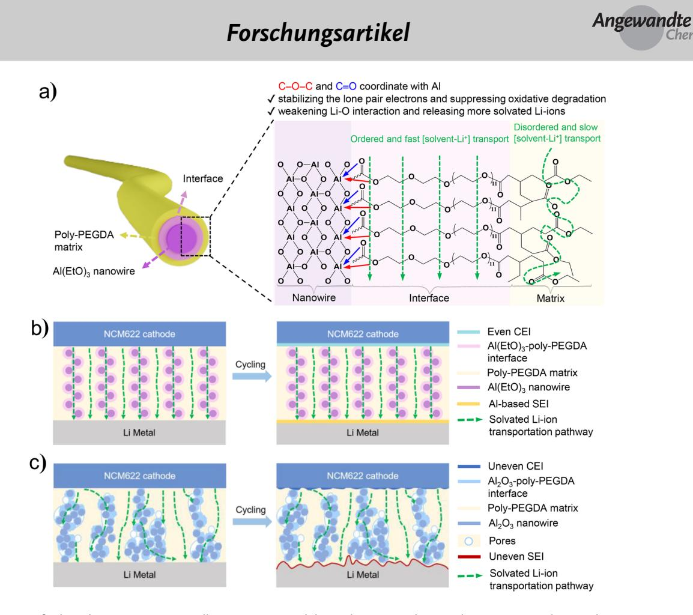
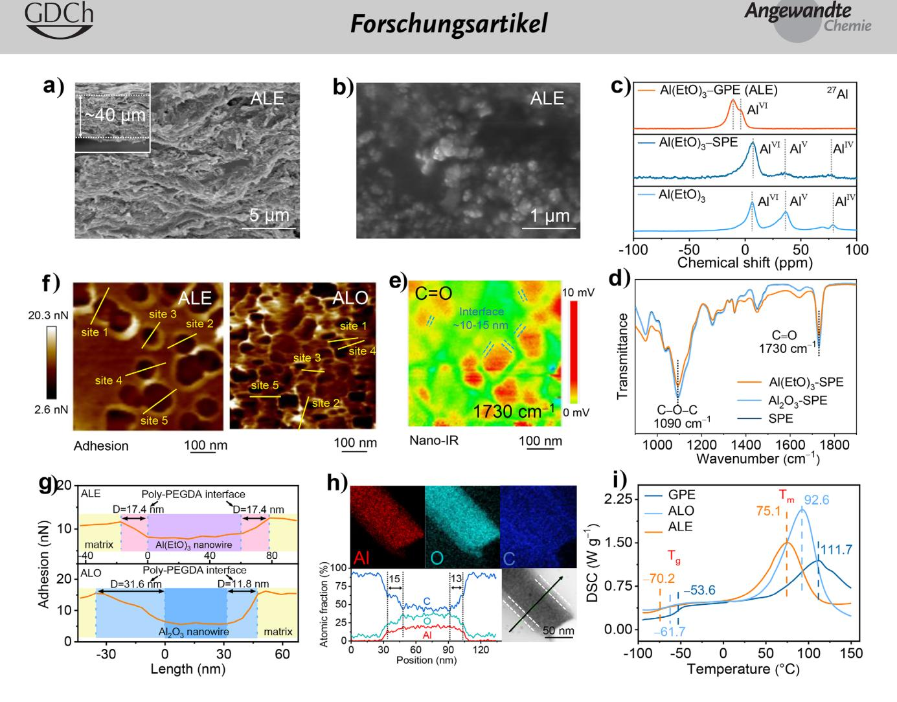
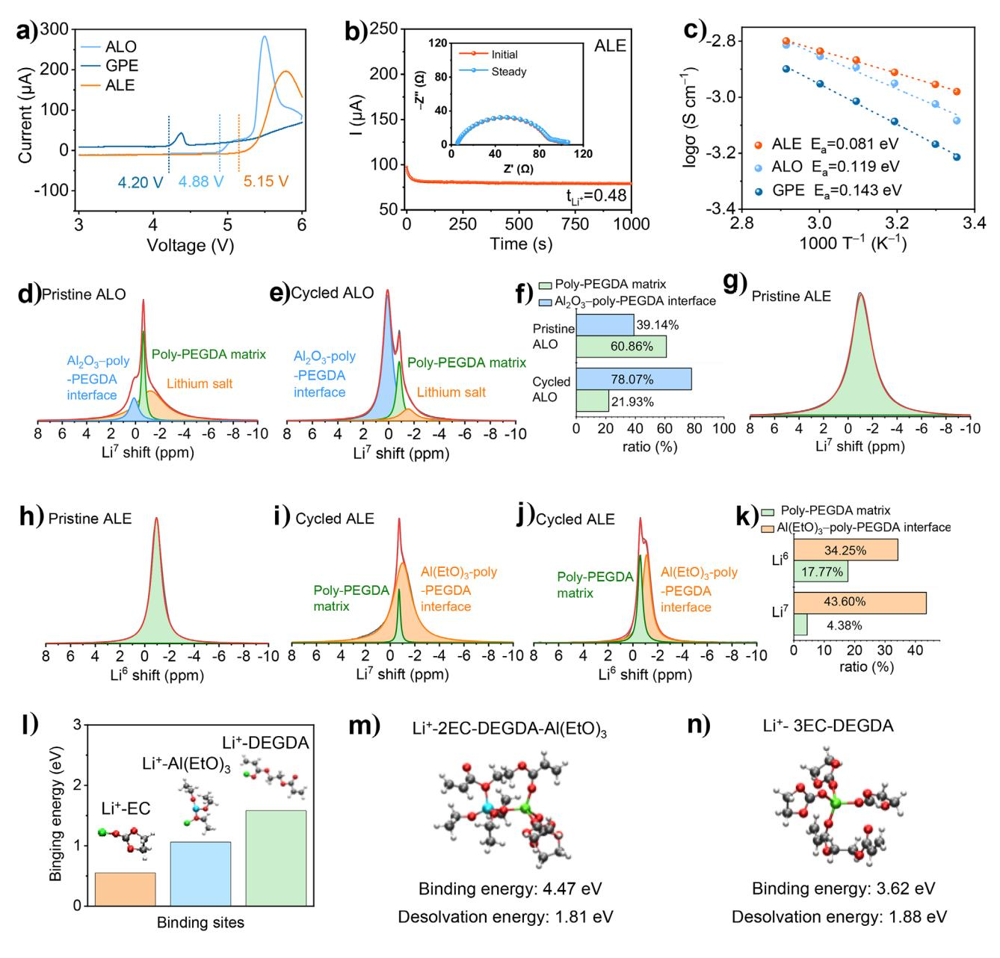
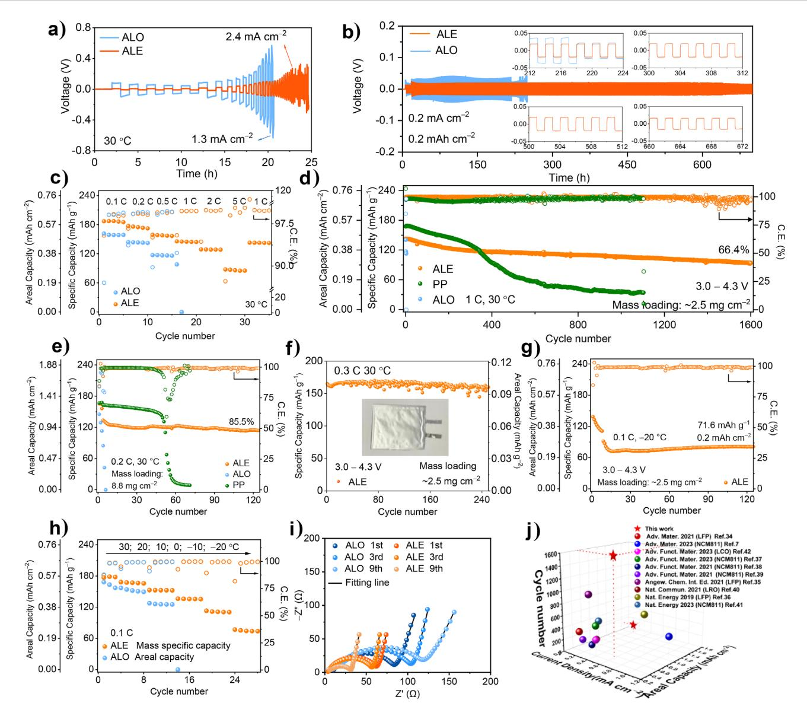
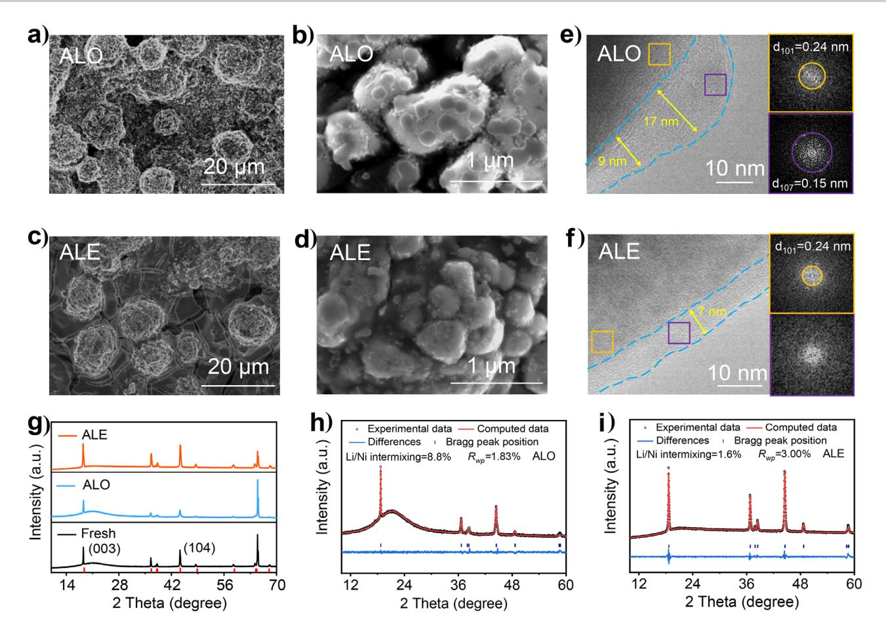
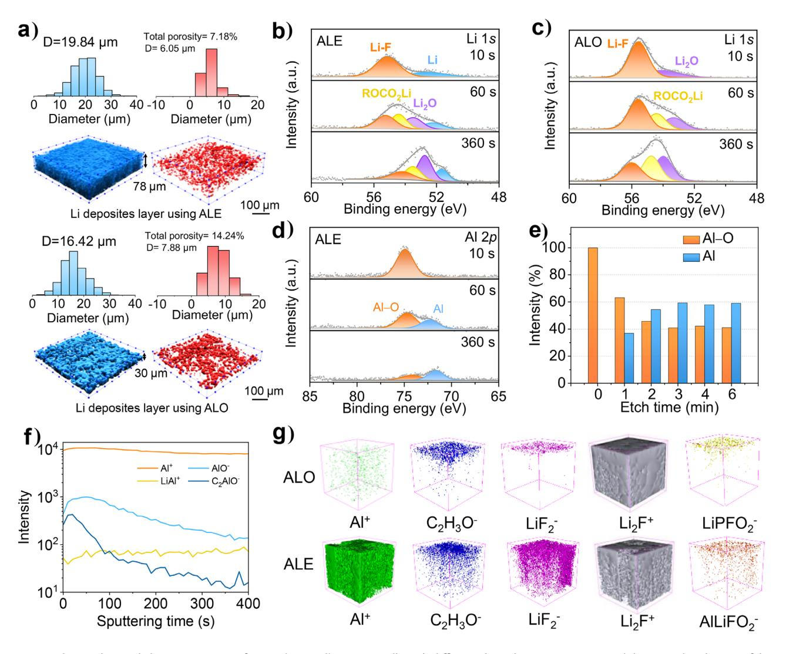

*Forschungsartikel*

Zitierweise: *Angew. Chem. Int. Ed.* **2025**, *64*, e202506662 doi.org/10.1002/anie.202506662 *Composite Polymer Electrolytes*

# **Regulating Ion Transport Through Direct Coordination in Composite Gel Polymer Electrolytes Toward High-Voltage and High-Loading Quasi-Solid-State Lithium Metal Batteries**

*Siyang Ye, Yuji Zhang, Yiheng Huang, Yan Li, Zhaojie Li, Chuan Ou, Minghui Lin, Fei Tian, Danni Lei,\* and Chengxin Wang\**

**Abstract:** Poly(ethylene oxide)-based composite gel polymer electrolyte is widely used in lithium metal batteries to address dendrite growth and side reactions. However, the low oxidative decomposition potential (*<*4.0 V) of poly(ethylene oxide) limits the cyclic stability with Ni-rich layered cathodes. What's more, poor interface compatibility between fillers and polymer severely deteriorates lithium-ion pathways, which cannot achieve lithium metal batteries with high-load cathode. Herein, polyether monomers coordinate with aluminum ethoxide nanowires via in situ ultraviolet curing, stabilizing the lone pair electrons of ethereal oxygen atoms and suppressing oxidative degradation. This coordination also forms abundant and tight interfaces as the predominant lithium-ion conduction pathways, contributing to ordered lithium-ion fluxes and dendrite-free deposition on the lithium anode. In addition, a robust solid electrolyte interphase containing aluminum-based species enhances the interfacial stability of lithium anode. Meanwhile, the good compatibility between the electrolyte and the cathode effectively suppresses side reactions and contributes to the structural stabilization of the cycled cathode. The delicate design allows the Li||LiNi0.6Co0.2Mn0.2O2 cells to present excellent cycling stability from −20 °C to 60 °C. Specially, cells with 8.8 mg cm−2 cathode cycle stably for over 120 cycles. This molecular structure engineering will greatly promote the practical application of solid-state lithium metal batteries.

## *Introduction*

Lithium metal batteries (LMBs) are attractive as nextgeneration energy-storage systems due to their ultrahigh

State Key Laboratory of Optoelectronic Materials and Technologies, School of Materials Science and Engineering, Sun Yat-sen (Zhongshan) University, Guangzhou 510275, China E-mail: [leidanni@mail.sysu.edu.cn](mailto:leidanni@mail.sysu.edu.cn) [wchengx@mail.sysu.edu.cn](mailto:wchengx@mail.sysu.edu.cn)

energy density.[\[1,2\]](#page-12-0) However, their practical application has been severely restricted by safety issues because of uncontrollable Li dendrite growth during cycling in a non-aqueous liquid electrolyte (LE).[\[3,4\]](#page-12-0) The solid-state[\[5,6\]](#page-12-0) (i.e., ceramic and solid polymer) and quasi-solid-state[\[7\]](#page-12-0) (i.e., gel polymer) electrolytes are considered promising substitutes for combustible LEs to achieve safer and high-performance LMBs. Although the ceramic electrolyte was expected to block Li dendrite puncture by its mechanical rigidity, it has been reported that the dendrites can grow along and around grain boundaries of ceramic electrolytes.[\[8,9\]](#page-12-0) In addition, the poor contact between the solid electrode and ceramic electrolyte usually results in slow charge transfer due to high and unstable interfacial resistance across their interface.[\[10\]](#page-12-0)

The solid polymer can improve the interfacial compatibility with the solid electrode.[\[11\]](#page-12-0) Among the various polymers, poly(ethylene oxide) (PEO)-based solid polymer electrolytes (SPEs) have been the subject of intensive research, while their poor oxidation resistance to high voltage, low ionic conductivity at room temperature, and low mechanical strength are critical challenges for their application in LMBs.[\[12–14\]](#page-12-0) In terms of the oxidative stability of PEO electrolyte, it has long been plagued by the narrow electrochemical stability windows (ESW*<*4.0 V), limiting its compatibility with the high-voltage positive electrodes, such as LiNi0.6Co0.2Mn0.2O2 (NCM622). Structurally, PEO comprises a main chain (─C─O─C─) and terminal hydroxide groups (─OH). Previous research has shown that replacing the ─OH groups with more electrochemically stable ─OR groups can extend the ESW to 4.3 V.[\[15\]](#page-12-0) However, further enhancement beyond this threshold (ESW *>*4.3 V) requires stabilization of the backbone ethereal oxygen atoms (─C─O─C─), which are prone to electron extraction under high-voltage conditions. This triggers C─H bond weakening and subsequent H-transfer to the anions, leading to polyether degradation (Figure S1).[\[16,17\]](#page-12-0) To enable compatibility between PEO electrolyte and highvoltage cathodes, surface coating to protect the cathode or composite blending of PEO with polyacrylonitrile (PAN) on the cathode side can avoid direct contact between NCM cathode and PEO,[\[18–20\]](#page-12-0) and molecular structure design of PEO can improve its intrinsic structural stability.[\[21\]](#page-12-0) To enable PEO-based SPEs to be used at room temperature, liquid components called plasticizers are required to be added into polymer skeleton to obtain PEO-based gel polymer electrolytes (GPEs) with high ionic conductivity.[\[22\]](#page-12-0) However, the mechanical strength becomes even worse, leading to

[\*] S. Ye, Y. Zhang, Y. Huang, Y. Li, Z. Li, C. Ou, M. Lin, F. Tian, D. Lei, C. Wang

Additional supporting information can be found online in the Supporting Information section

failure to inhibit the Li dendrite growth. A common approach to improve the ionic conductivity and enhance the stability of polymer electrolytes is to incorporate ceramic fillers into the polyether matrix to form hybrid SPEs.[\[23,24\]](#page-12-0) However, the structural incompatibility and adhesion between the polymers and ceramic fillers can significantly affect overall conductivity and performance. The implementation of graft coupling is an effective strategy to resolve the issue of interface within composite SPEs.[\[25,26\]](#page-12-0) For example, poly(ethylene glycol)diacrylate (PEGDA) is chemically connected with boron nitride nanosheets by the silane coupling agent.[\[25\]](#page-12-0) ZnO quantum dots can be chemically incorporated into the PEO matrix by vapor phase infiltration, which makes the manufacturing process become complicated.[\[26\]](#page-12-0) Despite these advancements, it is still an extremely challenging task to enhance the electrode/electrolyte interface stability and regulate ion transport behavior at the same time by the molecular structure engineering.

In this study, we developed a composite polyether electrolyte based on poly-PEGDA as an alternative to conventional hydroxyl-terminated PEO. Poly-PEGDA contains terminal ester groups, which exhibit inherently higher oxidation stability compared to the hydroxyl-terminated PEO. In addition, we employed an aluminum ethoxide (Al(EtO)3) network synthesized via selective dealloying as the foundational framework[\[27\]](#page-12-0) The unsaturated coordinated Al atoms function as Lewis acid sites, coordinating with the O atoms in monomeric terminal C═O groups and C─O─C segments of poly-PEGDA, while the O atoms in Al(EtO)3 act as Lewis base sites, coordinate with [solvent-Li+] complexes. This Al←O coordination effectively stabilizes the lone pair electrons of the ethereal oxygen atoms, thereby suppressing oxidative degradation. Meanwhile, the coordination also establishes a dense, Li-ion conductive interface within the Al(EtO)3-poly-PEGDA interface, thereby enhancing the ordered transport of [solvent-Li+] complexes. Additionally, the coordination of Al with O atom in C═O or C─O─C group weakens the interaction between [solvent-Li+] complexes and C─O─C or C═O group adjacent to the Al←O coordinated group within the same polymer segment, facilitating the dissociation of mobile [solvent-Li+] complexes and enabling rapid Li-ion conduction (Figure [1a\)](#page-2-0). Consequently, dendritefree deposition on the metallic anode is achieved due to the efficient, uniform, and continuous Li-ion flux (Figure [1b\)](#page-2-0). In the conventional CGPE, abundant pores are formed between Al2O3 nanowires due to poor Al2O3/Poly-PEGDA interfacial compatibility, leading to uneven and discontinuous ion transport, which ultimately promotes the growth of lithium dendrites (Figure [1c\)](#page-2-0). What's more, solid electrolyte interphase (SEI) containing aluminum-based species (such as Al, Al2O3, and Li─Al─F species) forms on the electrodes have high mechanical stability and ionic conductivity, which greatly suppresses the side reactions. The good compatibility between the electrolyte and the NCM622 cathode effectively suppresses side reactions and contributes to the structural stabilization of the cycled cathode. Therefore, an excellent cycling performance (66.4% capacity retention after 1600 cycles) is achieved in the Li| Al(EtO)3-GPE (ALE)|NCM622 cell at 30°C. By increasing the mass loading of the NCM622 cathode to 8.8 mg cm−2, the cell also demonstrates a high capacity retention of 85.5% after over 120 cycles. Notably, the Li||NCM622 cell maintains stable cycling over 260 cycles when operating at −20 °C. This work provides a promising avenue to design advanced CGPEs with excellent interfacial chemical stability and highly efficient ion transport capability for high-voltage LMBs.

### *Results and Discussion*

Scanning electron microscopy (SEM) image of the surface of the Al(EtO)3 nanowires membrane clearly shows crosslinked, dense, and uniform nanowires with an average diameter of 50.20 nm, ranging from 42.29 to 57.78 nm (Figure S2a,b). The cross-sectional SEM image of the Al(EtO)3 nanowires membrane shows that the nanowires are interconnected with each other to form a 3D porous nanonetwork structure (Figure S2c), and the thickness of the Al(EtO)3 nanowires membrane is ∼40 µm (Figure S2d). For comparison, an Al2O3 nanowire membrane was fabricated by calcining the Al(EtO)3 nanowires membrane at 800 °C for 2 h. As shown in Figure S3a,b, the obtained Al2O3 nanowire membrane shows the similar structure as the Al(EtO)3 nanowires membrane.

The Al(EtO)3-GPE (ALE) and Al2O3-GPE (ALO) were fabricated by photocuring under 365 nm UV light (detailed procedures are described in the Experimental Section). The molecular weight information of the GPE was obtained using gel permeation chromatography (GPC) measurement: *M*w (weight-average molecular weight) = 12 291 (Figure S4). The cross-sectional SEM image of ALE displays that the thickness of the membrane is ∼40 µm (Figure [2a\)](#page-3-0), and poly-PEGDA is seamlessly coated on the Al(EtO)3 nanowires (Figure [2b\)](#page-3-0). The surface SEM image of ALE shows that the poly-PEGDA fills the gaps to make the membrane flat (Figure S5). In contrast, the polymer is separated from the Al2O3 nanowires due to the poor interfacial compatibility between Al2O3 and poly-PEGDA (Figure S6). To explore the reasons for the good compatibility between Al(EtO)3 and poly-PEGDA, the Al(EtO)3-SPE (without the liquid electrolyte, corresponding to the PEGDA/photoinitiator phenyl bis(2,4,6-trimethylbenzoyl)-phosphine oxide (BAPO) precursor) and Al(EtO)3-GPE (ALE) (corresponding to liquid electrolyte/PEGDA/ photoinitiators BAPO precursor) were prepared by photocuring under 365 nm UV light for further characterization. The 27Al magic angle spinning solid-state nuclear magnetic resonance (ssNMR) spectrum of Al(EtO)3 shows three resonance peaks centered at approximately 78, 36, and 6 ppm, which correspond to 4-coordinated aluminum (AlIV), 5-coordinated aluminum (AlV), and 6-coordinated aluminum (AlVI),[\[28,29\]](#page-12-0) respectively (Figure [2c\)](#page-3-0). Compared with the Al(EtO)3, the Al(EtO)3-SPE shows weaker peaks at 78 and 36 ppm, which means the decreased coordination of AlIV and AlV, indicating that the O atom of the PEGDA monomer may directly coordinate with the Al atom in the Al(EtO)3. Notably, in the ALE, only the peaks centered at −10 and −3.5 ppm are observed, which also correspond to 6-coordinated aluminum (AlVI). It indicates that the introduction of liquid eletcrolyte may further improve the reactivity

**Figure 1.** Illustration of solvated Li-ion transport in Li||NCM622 quasi-solid-state batteries with ALE (Al(EtO)3-GPE) and ALO (Al2O3-GPE) electrolytes. a) Solvated Li-ion transport mechanism of ALE electrolyte. Working mechanism of quasi-solid-state Li||NCM622 batteries during long cycles with b) ALE and c) ALO electrolytes, respectively. The oxygen atom in the  $C=O$  and  $C-O-C$  of the PEGDA directly coordinates with Al atoms of Al(EtO)3, stabilizing the lone pair electrons of the ethereal oxygen atoms, thereby suppressing oxidative degradation. Subsequent polymerization of PEGDA results in the formation of a dense AI(EtO)3-poly-PEGDA interface that encapsulates the nanowires, creating ordered and fast channels for solvated Li-ion transport.

between poly-PEGDA and  $Al(EtO)$ 3 and thus enhance the interface compatibility between  $Al(EtO)$ 3 nanowires and poly-PEGDA matrix. Fourier transform infrared (FTIR) characterizations were conducted to investigate the chemical bonding between  $Al(EtO)$ 3 and PEGDA. The disappearance of the C=C bond peak in  $Al(EtO)_3$ -SPE as compared to PEGDA (1618 cm $-1$  and 1635 cm $-1$ ) indicates that PEGDA monomers are successfully crosslinked and polymerized after UV-curing (Figure S7). The detected peaks assigned to the stretching of C=O (1730 cm-1) and C-O-C (1090 cm-1) decrease in  $Al(EtO)_3$ -SPE as compared to  $Al_2O_3$ -SPE and SPE, confirming the strong coordination between  $Al(EtO)$ 3 nanowires and C=O and C-O-C segments in poly-PEGDA (Figure 2d). In addition, atomic force microscope-nano infrared spectroscopy (AFM-Nano-IR) was employed to further study the interaction between  $Al(EtO)$ 3 and PEGDA at the interface (Figure 2e). The ALE membrane used for testing was dried, ensuring that the observed C=O signals are free from carbonate solvent interference. The detected peak at 1730 cm-1 is assigned to the stretching of  $C=O$  in the terminal of the monomer. The intensity of the absorption peak along the  $Al(EtO)$ 3 nanowires is much stronger than that of the poly-PEGDA matrix, indicating that C=O is coordinated with Al atom in the  $Al(EtO)$ 3 nanowires and densifies the poly-PEGDA structure, thus resulting in the strong coordination between Al and O atoms from  $C-O-C$  segments to assemble a dense poly-PEGDA layer (10 to 15 nm) on the surface of the nanowire. The coordination of monomeric terminal  $C=0$  with Al atom in the  $Al(EtO)$ 3 nanowires induces an ordered arrangement of C-O-C segments, facilitating ordered solvated Li-ion migration. Additionally, the coordination of Al with the O atom in the  $C=O$  or  $C-O-C$  group weakens the interaction between [solvent- $Li^+$ ] complexes and the C-O-C or C=O group adjacent to the Al $\leftarrow$ O coordinated group within the same polymer segment, thus releasing more [solvent- $Li^+$ ] complexes and facilitating rapid solvated Li-ion transport. Therefore, the ALE with abundant and tight interfaces possesses ordered and fast Li-ion conduction characteristics. The possible reaction mechanism of  $Al(EtO)$ 3 and PEGDA is proposed in Figure 1a. Atomic force microscopy (AFM) was used to clearly characterize the interface between the nanowires and the poly-PEGDA matrix by measuring the adhesion of cross sections of ALE and ALO. As shown in Figures  $S8a$  and  $S9a$ , nanowires are clearly discernible in the cross-sectional AFM height images of ALE and ALO,

Chemie

Figure 2. Structure and morphology characterizations of nanowires and electrolytes. a) Cross-sectional SEM images of ALE membranes. b) Local cross-sectional magnification of ALE electrolyte. c) 27Al solid-state NMR spectra of Al(EtO)3, Al(EtO)3 -GPE, and Al(EtO)3 -SPE. d) FTIR spectra of Al(EtO)3-SPE, Al2O3-SPE, and SPE. e) Nano-IR overlap of C=O vibration at 1730 cm-1. f) Cross-sectional AFM adhesion images and g) adhesion-width curves of ALE and ALO. h) TEM image, EDS elemental mappings, and line profile along with the black arrow of  $Al(EtO)3$ -SPE. i) DSC plots of GPE, ALO, and ALE.

ensuring that the selected line in the adhesive images traverses the poly-PEGDA matrix-interface nanowire.[30] Adhesion images processed by Nano Scope Analysis software are shown in Figure 2f. The nanowires exhibit a high modulus and low adhesion, in contrast to the poly-PEGDA matrix, which demonstrates an inverse behavior characterized by a low modulus and high adhesion. Between these two components, a distinct interface with unique properties emerges, distinct from both the nanowires and the poly-PEGDA matrix. The corresponding line profiles of adhesion changes along the matrix-interface nanowire are shown in Figure 2g. Due to the consistent slopes on both sides of the nanowires, the nanowires within the ALE are uniformly coated by the interface and the thickness of the Al(EtO)3-poly-PEGDA interface ranges from 17 to 19 nm, as obtained from five random areas (Figure S8b–e). The  $Al(EtO)_3$ -poly-PEGDA interface region is favorable for Li-ion to migrate along  $Al(EtO)$ 3 nanowire-poly-PEGDA interfaces and induces the uniform deposition of Li. In contrast, the interface around the  $Al_2O_3$  nanowires is asymmetrical, ranging from 11.7 to 36.8 nm with unequal gradient slope due to the weak conglutination between the poly-PEGDA matrix and  $Al_2O_3$ nanowires, leading to chaotic Li-ion flux and the formation of Li dendrites (Figure 1c and S9b–e). The transmission electron microscopy (TEM) image of the  $Al(EtO)_3$ -SPE membrane given in Figure 2h provides a clearer characterization of the interface structure. The  $Al(EtO)$ 3 nanowire and poly-PEGDA matrix exhibit distinct morphologies and contrasts, easily differentiable from each other. The diameter of the  $Al(EtO)$ 3 nanowires is approximately 45 nm. Remarkably, a discernible interface layer, delineated by the dashed line, is present between the poly-PEGDA matrix and  $Al(EtO)$ 3 nanowire, evident from their contrasting features. The thickness of this interface layer is about 15 nm. The distribution of O, Al, and C was further characterized by the EDS elemental mappings and line profile along the black arrow of the  $Al(EtO)_3$ -SPE. For the O element, the signal intensity is stronger than in the matrix but weaker than in the nanowire. In contrast, the signal intensity of the C element at the interface is weaker than in the matrix but stronger than in the nanowire. The phenomenon further indicates the presence of a higher abundance of O-rich functional groups at the

interface, such as C-O-C and C=O, owing to the Al $\leftarrow$ O coordination. The rate constants of initiator decomposition affect polymerization rate. The higher the decomposition rate constant of photoinitiator the faster the polymerization rate. To investigate the interaction between  $Al(EtO)$ 3 and photoinitiators (BAPO), UV-vis spectra under 365 nm irradiation were measured (Figure S10a–d). The decomposition rate of the BAPO  $(k_d)$  with highly chemically reactive Al(EtO)3 nanowires (0.0168  $s^{-1}$ ) is lower than that of pure BAPO  $(0.0517 \text{ s}^{-1})$  and BAPO with the chemically inactive Al2O3 nanowires (0.0218  $s^{-1}$ ), which means that the interaction between  $Al(EtO)$ 3 and BAPO reduces the polymerization rate of PEGDA monomer, thus increasing the coordination time of PEGDA monomer with  $Al(EtO)$ 3 and constructing the interface. The synergistic effect of reducing initiator pyrolysis rate and coordinating with monomer may improve the interface compatibility between  $Al(EtO)$ 3 nanowires and poly-PEGDA matrix. The glass transition temperature, the melting temperature, and the thermal decomposition temperature are important parameters to evaluate the properties of polymer electrolyte. Differential scanning calorimetry (DSC) plots of GPE, ALO, and ALE are shown in Figure 2i. The glass transition temperature  $(T_g)$  of ALE is -70.2 °C, and the melting temperature  $(T_m)$  is 75.1 °C, much lower than that of ALO ( $T_g$  is -61.7 °C,  $T_m$  is 92.6 °C) and GPE ( $T_g$  is  $-53.6$  °C,  $T_m$  is 111.7 °C). The larger deviations in  $T_m$  and  $T_g$  from the pristine GPE suggests that Al(EtO)3 interacts more strongly with the polymer chains in ALE, disrupting their regular packing and reducing crystallinity. And the formation of flexible polymer chains rich in  $C-O-C$  at  $Al(EtO)$ 3-poly-PEGDA interface through  $Al(EtO)$ 3 coordinating with PEGDA monomer, which enhances the migration probability of [solvent-Li+] complexes. Thermogravimetric analysis (TGA) plots of GPE, ALO, and ALE are shown in Figure S11a,b. The weight loss from 30 to 65  $^{\circ}$ C corresponds to the evaporation of the LE solvent. The mass fractions of ALO and GPE decreased by 2.66 and 3.01, respectively. In contrast, the mass fraction of ALE only decreased by 1.06, demonstrating the stronger interaction between  $Al(EtO)$ 3 and the LE within the ALE. This provides a favorable condition for the battery to operate at a high temperature of 60  $^{\circ}$ C.

To evaluate the electrochemical stability of polymer electrolytes against high voltage, linear sweep voltammetry (LSV) was conducted to investigate the electrochemical window. The acidic surface groups on  $Al_2O_3$  can interact with anions from the lithium salt. This interaction is beneficial for suppressing anion decomposition and mitigating hydrogen transfer triggered by electron extraction from ethereal oxygen, thereby increasing the oxidation potential of ALO to  $4.88 \text{ V}$ .[31,32] Compared to the ALO and GPE, the ALE maintains oxidative stability to over 5.15 V. This is due to the Al $\leftarrow$ O coordination effectively stabilizes the lone pair electrons of the ethereal oxygen atoms, fundamentally mitigating electron extraction and thereby suppressing oxidative degradation (Figure 3a). The high stability of the ALE enables it to match high-voltage Ni-rich layered cathodes. The Li-ion conduction characteristics of the electrolytes were investigated using chronoamperometry tests. The ALE shows the highest Li-ion

Angew. Chem. 2025, 137, e202506662 (5 of 14)

transference number ( $t_{Li+}$  = 0.48) (Figure 3b) compared to the ALO ( $t_{Li+} = 0.33$ ) (Figure S12a) and GPE ( $t_{Li+} = 0.31$ ) (Figure S12b). The increase of Li-ion transference number is ascribed to the Al atoms from the  $Al(EtO)$ 3 nanowire network that can effectively coordinate with the  $PF_6^-$  and poly-PEGDA chains, thus enhancing the migration probability of [solvent- $Li^+$ ] complexes and endowing [solvent- $Li^+$ ] complexes with rapid transport pathways at the  $Al(EtO)$ 3 nanowire-poly-PEGDA interfaces. To further investigate the interaction between  $Al(EtO)$ 3 and  $LiPF$ 6 in the presence of the solvent, we supplemented our study with Raman spectroscopy to examine the solvation structure. As shown in Figure S13, the peak at 737  $\text{cm}^{-1}$  in the spectrum of LiPF6 (EC/DMC/EMC) corresponds to the P–F bond.[33] After the addition of Al(EtO)3, this peak shifts to 740 cm-1, indicating an increase in the polarization of the P–F bond. Meanwhile, the skeletal vibration of the solvent EC at 716  $\text{cm}^{-1}$  shows almost no shift,[34] demonstrating that  $Al(EtO)$ 3 interacts more strongly with  $PF_6^-$  than with EC. Given that EC is the dominant component in the solvation sheath's inner layer, this also excludes the influence of the sheath's outer-layer DMC and EMC molecules. The above analysis is consistent with the 27Al NMR results that the disappearance of the coordination of  $Al^{IV}$  and  $Al^{V}$  in the ALE may be due to the coordination between  $PF_6^-$  and  $Al(EtO)_3$ . Notably, the ALE membrane was dried prior to 27Al NMR characterization to eliminate the influence of solvents. The ionic conductivity of ALE, ALO, and GPE at different temperatures was measured via electrochemical impedance spectroscopy (EIS), and the Arrhenius plots are shown in Figure 3c. Due to the Al $\leftarrow$ O coordination (O atom in the C-O-C or C=O group of poly-PEGDA), the interaction between the [solvent- $Li^+$ ] complexes and C-O-C or C=O group adjacent to the  $Al \leftarrow O$  coordinated group within the same polymer segment is weakened, facilitating the easy release of mobile [solvent- $Li^+$ ] complexes and exhibiting the lowest activation energy  $(E_a)$  of 0.081 eV in ALE. In comparison, GPE exhibits the highest activation energy of  $0.143$  eV due to the strong Li-O (O atom in the  $C-O-C$  or  $C=O$  group of poly-PEGDA) bonding force. The low activation energy in ALO  $(0.119 \text{ eV})$  is attributed to the presence of numerous pores, which are filled with LE, facilitating the release of mobile [solvent-Li+] complexes. The ionic conductivity of ALE is calculated to be 1.05  $\times$   $10^{-3}$  S cm-1, which is higher than that of ALO (8.25  $\times$  10-4 S cm-1) and GPE (6.11  $\times$  10-4 S cm-1) at 25 °C (Figure S14). Besides, the ionic conductivity of ALE (3.22  $\times$  10-4 S cm-1) is approximately 1.68 times higher than that of ALO (1.91  $\times$  10-4 S cm-1) at  $-20$  °C. To provide a more scientific understanding of the low-temperature conduction mechanism, we further reevaluated the  $E_a$  for ion transport in the low-temperature range (0 °C to  $-20$  °C). As presented in Figure S15, ALE shows the lowest  $E_a$  of 0.225 eV, in contrast to 0.291 eV for ALO, suggesting that ALE offers a lower energy barrier for Li-ion migration under low-temperature conditions. The weakened interaction between [solvent- $Li^+$ ] complexes and  $C-O-C$  or  $C=O$  group of Al(EtO)3 nanowires-poly-PEGDA interfaces establishes an ordered and fast expressway for the transport of Li-ion. At the 3D interconnected  $Al(EtO)$ 3-poly-PEGDA interfaces network, Li-ions can efficiently transfer

*Figure 3.* Electrochemical characterization and Li-ion conduction mechanism of the electrolytes. a) Electrochemical stability window of GPE, ALO, and ALE determined by LSV. b) The chronoamperometry profile of Li||Li symmetrical cell using ALE under a polarization voltage of 10 mV and the EIS before and after the polarization. c) Ionic conductivities of GPE, ALO, and ALE membranes. 7Li NMR spectra of ALO d) before and e) after cycling of 6Li|ALO|6Li symmetric cell. f) Quantified contributions to Li-ion transport of components in ALO electrolyte. g) and i) 7Li and h) and j) 6Li NMR spectra of ALE electrolyte before and after cycling of 6Li|ALE|6Li symmetric cell. k) Quantified contributions to Li-ion transport of components in ALE electrolytes. l) The configurations and corresponding binding energies of Li-ion on EC, Al(EtO)3, and DEGDA. The configurations and corresponding binding energies and desolvation energies of [solvent-Li+] complexes at Al(EtO)3-poly-PEGDA interface m) and poly-PEGDA matrix n). The red balls represent O atom, green balls represent Li atom, black balls represent C atom, white balls represent H atom and the blue balls represent Al atom.

along the interconnected points at the nanowire interfaces, effectively shortening the conduction pathways between the positive and negative electrodes. This provides an ordered and well-aligned Li-ion conduction pathway within the ALE membrane, contributing to the highest ionic conductivity of ALE.

To verify the ion conduction behavior at the interface, 6Lito-7Li exchange experiments were performed on the 6Li||6Li symmetric cells with ALO and ALE and cycled for 30 times at a current density of 0.2 mA cm−2 and a capacity of 0.2 mAh cm−2. During this process, some [solvent-7Li+] complexes in electrolyte that conduct Li-ion will be replaced by [solvent-6Li+] complexes, and the solvated Li-ion transport channels will be preferentially enriched with 6Li and deprived with 7Li. Hence, high-resolution Li isotope ssNMR was performed to study the Li-ion migration behaviors within the composite electrolytes.[\[35\]](#page-13-0) Figure 3d,e show the 7Li NMR spectra of pristine ALO and cycled ALO, respectively. For ALO, three peaks corresponding to three different Li-ion environments were identified by fitting the asymmetric peak in the NMR spectra. The peaks at 0.1,  $-0.8$ , and  $-1.5$  ppm are assigned to the Li-ion coordinated with  $Al_2O_3$ -poly-PEGDA interface, poly-PEGDA matrix (Figure S16a), and lithium salt that derived from the pores rich in LE (Figure S16b), respectively. After the exchange behavior between 6Li and 7Li, the integral areas of peaks (the relative content of  ${}^{7}$ Li) ascribed to Al2O3poly-PEGDA interface increase from 39.14% to 78.07%, and that of poly-PEGDA matrix decrease from 60.86% to 21.93% (Figure 3f), respectively, demonstrating that [solvent- $^{6}$ Li+] complexes preferentially transport through the poly-PEGDA matrix.[36] Notably, the lithium salt peak significantly decreases after cycling in the ALO membrane. This is due to the mobility of the liquid electrolyte within the ALO pores, which allows side reactions with both the Li anode and NCM622 cathode, resulting in the decomposition of the lithium salt. With the poly-PEGDA loosely attached to the  $Al_2O_3$  nanowire membrane, ALO rich in pores has chaotic and uneven Li-ion flux, resulting in low ionic conductivity.

Whether in the 7Li or 6Li spectrum of pristine ALE (Figure 3g,h), one symmetric peak located at  $-1.08$  and  $-0.95$  ppm exists, respectively, owing to the [solvent-Li+] complexes were uniform distributed in the pristine ALE. Under these conditions, it is difficult to distinguish the [solvent- $Li^+$ ] complexes at the interface or in the matrix because the nuclear magnetic shift difference between these two regions is relatively small (approximately 0.3 ppm). After cycling, the electric field promotes the migration of [solvent- $Li^+$ ] complexes. Due to the different Li-ion transport capacities at the interface and matrix, the nonuniform distribution of the [solvent- $Li^+$ ] complexes between the two regions is significantly enhanced. There exists two peaks at  $-0.72$  and  $-1.01$  ppm in the 7Li spectrum of cycled ALE (Figure 3i), corresponding to the poly-PEGDA matrix and the  $Al(EtO)$ 3-poly-PEGDA interface, respectively. Meanwhile, the 6Li spectrum also reveals two peaks with distinct chemical shifts at  $-0.60$  and  $-1.08$  ppm, corresponding to the poly-PEGDA matrix and the  $Al(EtO)$ 3-poly-PEGDA interface (Figure  $3i$ ), respectively. By integrating the peak area ratios from the Li NMR spectra in cycled ALE, the proportion of accumulated concentrations of [solvent-Li+] complexes in the matrix and at the interface can be calculated (Figure 3k), 77.85% of the total [solvent- $Li^+$ ] complexes are concentrated at the interface, with  ${}^{6}$ Li (34.25%) and  ${}^{7}$ Li (43.6%). 22.15% of the total [solvent- $Li^+$ ] complexes are concentrated at the poly-PEGDA matrix, with  ${}^{6}$ Li (17.77%) and  ${}^{7}$ Li  $(4.38\%)$ . Therefore, a higher concentration of [solvent-Li+] complexes tend to accumulate at the  $Al(EtO)_3$ -poly-PEGDA interfaces in ALE compared to the matrix. [solvent- $Li^+$ ] complexes continuously transport between  $Al(EtO)$ 3 nanowires through the interconnected network formed by the  $Al(EtO)$ 3poly-PEGDA interfaces, significantly enhancing overall ion transport efficiency.

In parallel to the above ion conduction behavior, DFT calculations were also conducted to provide further insights. As EC molecules were identified to dominate the coordinative situation in the first solvation shell, they were used to simulate the Li-ion solvation structures in the gel polymer

electrolyte.[37] The diethylene glycol diacrylate (DEGDA) monomer and the  $Al(EtO)$ 3 alkoxide molecule were chosen as the host materials for modeling to simplify the polymer network and  $Al(EtO)$ 3 network, respectively.[38] As shown in Figure 31, the binding energy between Li-ion and  $O=C$ of DEGDA is 1.58 eV, and the binding energy between Li-ion and O of  $Al(EtO)$ 3 is 1.06 eV, both of which are larger than that between Li-ion and EC  $(0.55 \text{ eV})$ . This suggests a strong interaction between Li-ion at the  $Al(EtO)$ 3-poly-PEGDA interfaces. To further investigate Liion conduction at the interface and within the matrix, we conducted DFT calculations separately for the interface and matrix regions. As shown in Figure  $3m,n$ , the binding energy of Li-ion at the  $Al(EtO)$ 3-poly-PEGDA interface, where the Li-ion is coordinated by two EC molecules, one DEGDA molecule, and one  $Al(EtO)$ 3 molecule, is 4.47 eV. This is stronger than the binding energy of 3.62 eV for Liion coordinated by three EC molecules and one DEGDA molecule in the poly-PEGDA matrix, indicating a stronger interaction of the Li-ion with the four-coordination structure at the  $Al(EtO)$ 3-poly-PEGDA interface. Consequently, [solvent- $Li^+$ ] complexes tend to accumulate at the interface, maintaining a stable four-coordination structure (Li-ion is coordinated by two EC molecules, one DEGDA molecule, and one  $Al(EtO)$ 3 molecule), which is consistent with the NMR results. However, Li-ion conduction does not require complete dissociation from the four-coordination structure but requires desolvation from the O-coordination of DEGDA to form mobile [solvent- $Li^+$ ] complexes. The desolvation energy from DEGDA as calculated, is 1.81 eV at the  $Al(EtO)$ 3-poly-PEGDA interface, lower than the 1.88 eV in the poly-PEGDA matrix. This energy reduction is attributed to the Al $\leftarrow$ O coordination (O atom in C-O-C or C=O group), thereby weakening the interaction between [solvent- $Li^+$ ] complexes and C-O-C or C=O group adjacent to the Al $\leftarrow$ O coordinated group within the same polymer segment. Therefore, the high concentration of [solvent- $Li^+$ ] complexes at the interface, combined with the easy dissociation of mobile [solvent- $Li^+$ ] complexes, synergistically enhances the Li-ion conduction at the interface. This is consistent with the previously mentioned lowest activation energy and highest ionic conductivity of ALE.

Critical current density (CCD) tests were conducted to investigate the compatibility of the composite electrolytes with Li anodes and obtain the maximum current density under an areal capacity of 0.2 mAh cm-2. The Li|ALE|Li symmetric battery presents a critical current density of 2.4 mA cm-2, much higher than that with ALO (1.3 mA cm-2; Figure 4a), verifying that Li-ion transport along the interface may induce homogeneous uniform Li deposition and suppress Li dendrite growth to withstand battery shorting. Li symmetric cells were cycled at a current density of  $0.20 \text{ mA cm}^{-2}$  and a capacity of 0.20 mAh cm-2 at 30 °C. As shown in Figure 4b, the cell with ALE shows excellent long-term cycling stability for 700 h without a short circuit, while the comparative cell with ALO presents a short circuit after 218 h owing to the growth of Li dendrites. Therefore, the constructed continuous ion transport pathways along interconnected  $Al(EtO)$ 3 nanowires can effectively uniform Li-ion flux and

**Forschungsartikel** 

Figure 4. Electrochemical performances of Li|Li symmetrical cells and Li||NCM622 cells with different electrolytes. a) Galvanostatic cycling curves at step-increased current densities of Li||Li symmetric cells assembled with ALO and ALE. b) Galvanostatic cycling curves of Li||Li symmetrical cells using ALO and ALE at a current density of 0.2 mA cm-2. c) Rate performances of Li||NCM622 cells using ALO and ALE at 30 °C. d) Long-term cycling performances of Li||NCM622 cells using ALO, ALE, and PP under 30 °C. Mass loading of NCM622 is approximately 2.5 mg cm-2. e) Long-term cycling performance of Li||NCM622 cell using ALE, ALO, and PP at 0.2 C under 30 °C. Mass loading of NCM622 is 8.8 mg cm-2. f) Cycling performances of Li||NCM622 pouch cell at 0.3 C under 30 °C. g) Long-term cycling performances of Li||NCM622 cell using ALE under  $-20$  °C. The Li|ALO|NCM622 cell is unable to charge and discharge under  $-20$  °C. Mass loading of NCM622 is approximately 2.5 mg cm  $^{-2}$ . h) Discharge capacities with CEs of ALO and ALE electrolytes in Li||NCM622 cells at different temperatures. i) EIS plots of Li||NCM622 cells with ALE and ALO after different cycles. j) Comparison of cycle life of full cells with ALE and the reported polyether-based gel electrolytes.

suppress Li dendrite growth to achieve an ultra-stable cycling performance. The exchange current density  $(i_0)$  extracted from Tafel plots was used to quantitatively study interfacial Li-ion transfer kinetics (Figure S17). The  $j_0$  in ALE (0.15 mA)  $\text{cm}^{-2}$ ) is markedly larger than in ALO (0.09 mA cm-2), implying fast interfacial Li-ion transfer kinetics and the construction of highly conductive SEIs in ALE. To verify the reversibility of Li deposition, we assembled LillCu cells with the ALE and ALO. All cells were discharged into a fixed capacity of 0.1 mAh cm $-2$  and then charged to 1 V to strip the Li off at a current density of 0.1 mA cm $-2$ . As shown in Figure S18, the Coulombic efficiency (CE) of the cell using ALO fluctuated and rapidly declined to 66% after 40 cycles. In contrast, the cell using ALE demonstrated a stable CE with values exceeding 85% after 40 cycles. The high and stable CE of ALE can be attributed to the formation of a robust solid electrolyte interphase in situ on the Li anode, which enhances its interfacial stability.

To verify the composite electrolytes' excellent suppression ability of Li dendrites and stable against high voltage, the Li|ALE|NCM622 and Li|ALO|NCM622 cells were assembled (the mass loading of NCM622 was 2.7 mg  $\text{cm}^{-2}$ ) and tested

Angewandte

Chemie

within a voltage range from 3.0 to 4.3 V. Rate performance of LillNCM622 cells at different rates from 0.1 to 5 C were characterized at 30  $^{\circ}$ C (Figure 4c). The specific capacities of the cells at 0.1 C and 1 C are 186.92 mAh  $g^{-1}$  and 145.48 mAh  $g^{-1}$ , respectively, outperforming their counterparts. Particularly, as the current density increases to 5 C, the discharge capacity of the Li|ALE|NCM622 cell is 87.47 mAh  $g^{-1}$ , while the Li|ALO|NCM622 cell failed at the current density of 1 C. After completing 5 cycles at 5 C, the Li|ALE|NCM622 cell continues to cycle at 1 C, and a reversible capacity of 142.8 mAh  $g^{-1}$  was accomplished, which reveals the ultrahigh electrochemical stability of Li|ALE|NCM622 cell. Figure 4d shows the long cyclability of the Li|ALE|NCM622 battery. Remarkably, a capacity retention of 66.4% after 1600 cycles (94.8 mAh  $g^{-1}$ ) was accomplished even at a high current rate of 1 C, manifesting its excellent cyclic stability. In stark contrast to use the ALO that failed after 15 cycles, demonstrating the importance of the  $Al(EtO)$ 3-poly-PEGDA interfaces to significantly improve the long-term cycling performance of LiNCM622 full cells. The fluctuation in CE of Li|ALE|NCM622 cell is likely attributed to the formation of SEI containing aluminum-based species (such as Al,  $Al_2O_3$ , and Li-Al-F species) on the electrodes, which will be detailed in subsequent sections for discussion. The voltage profiles of different cycle numbers show that the polarization in the Li|ALE|NCM622 cell is much smaller than that in the Li|ALO|NCM622 cell (Figure S19a,b). Additionally, we have also tested the cycling performance of Li|PP|NCM622 with 40  $\mu$ L of liquid electrolyte to ensure a fair comparison. Before 340 cycles, the Li|PP|NCM622 cell delivers a higher specific capacity compared to ALE. However, after 340 cycles, the Li|PP|NCM622 cell experiences a sharp capacity fade, whereas ALE maintains stable and consistent specific capacity throughout the cycling test. This demonstrates ALE's superior long-term stability, attributed to improved interfacial compatibility and enhanced ion transport efficiency. When testing the cycling performances of Li|ALE|NCM622 with a broader voltage range from  $3.0$  V to  $4.5$  V, the discharge capacity of the Li|ALE| NCM622 cell is 68 mAh  $g^{-1}$  after 900 cycles at 1 C (Figure S20). In addition, as the NCM622 loading increases from 2.7 to 8.8 mg  $\text{cm}^{-2}$ , the discharge capacity of the Li|ALE|NCM622 cell is 133.57 mAh  $g^{-1}$ with a capacity retention of 85.5% after 123 cycles at 0.2 C (Figure 4e). Li|PP|NCM622 cell with liquid electrolyte experiences coulombic efficiency fluctuations and a significant specific capacity drop around 45 cycles. To verify the application feasibility of the ALE, we assembled a flexible Li|ALE|NCM622 single-layer pouch cell, which demonstrated a long cycle life of 250 cycles at a rate of 0.3 C. This result highlights ALE's significant potential for practical applications (Figure 4f). Figure 4g,h show low-temperature performances of both electrolytes in LillNCM622 cells. The Li|ALE|NCM622 cell provides high capacities of 136 mAh  $g^{-1}$  at 0 °C and 113 mAh  $g^{-1}$  at -10 °C, outperforming the Li|ALO|NCM622 cell, which cannot provide any capacity due to the slow charge-transfer kinetics in the electrolyte and through the interfaces (Figure 4h). The LillNCM622 coin cell using the ALE also shows much longer cycling stability at  $-20$  °C. As shown in Figure 4g, the Li|ALE|NCM622 cell

achieves a high capacity of 71.6 mAh  $g^{-1}$  even after over 250 cycles, owing to the rapid ion dynamics within the ALE electrolyte. Furthermore, high-temperature performance of ALE in Li||NCM622 cell is also outstanding (Figures S21 and S22). The Li|ALE|NCM622 cell provides high and stable capacities of 164.0 mAh  $g^{-1}$  at 30 °C and 165.8 mAh  $g^{-1}$  at 40 °C, outperforming the Li|ALO|NCM622 cell which only releases continuously diminishing capacities of  $\sim$ 157.2 mAh  $g^{-1}$  at 30 °C and ~146.9 mAh  $g^{-1}$  at 40 °C. Further increasing the temperature to 60 °C, the Li|ALE|NCM622 cell can still deliver a modest capacity of  $\sim$ 59 mAh g-1 after 190 cycles. In contrast, the Li|ALO|NCM622 cell cannot cycle due to severe side reactions in the ALO electrolyte, rendering the battery unable to charge properly. The EIS results of the Li|ALE|NCM622 and Li|ALO|NCM622 cells after different numbers of cycles are shown in Figure 4i. Both the charge transfer resistance  $(R_{ct})$  and cathode electrolyte interphase resistance ( $RCEI$ ) of the Li|ALE|NCM622 cells are smaller than those of Li|ALO|NCM622 after different numbers of cycles (Figure  $S23$  and Table  $S1$ ), indicating that ALE may improve the stability of the LillNCM622 cells. As shown in Figure  $4j$  and Table S2, previous studies on polyether-based electrolytes, which are primarily paired with  $LiFePO_4$  (LFP) cathodes due to their low oxidative stability (see References Adv. Mater. 2021,[39] Angew. Chem. Int. Ed. 2021,[40] and Nat. Energy  $2019^{[41]}$  in Figure 4i), have faced challenges in effectively pairing with high-voltage cathodes like NCM622, presenting a significant barrier to their commercial viability. Surface coating to protect the cathode or composite blending of PEO with polyacrylonitrile (PAN) (see References Adv. Funct. Mater.  $2023^{[42]}$  in Figure 4j) can improve the oxidative stability between the NCM cathode and PEO, but these methods are complex. Turning liquid ether electrolytes such as 1,3-dioxolane (DOL) into polyether electrolytes has sparked a lot of interest in LMBs. While transforming cyclic DOL into a long-chain linear structure can enhance its highvoltage tolerance and enable compatibility with high-voltage cathodes like NCM, partially residual free DOL exhibit poor long-cycle stability under high voltage (see Reference Adv. Mater.  $2023^{[7]}$  and Adv. Funct. Mater.  $2021^{[43,44]}$  in Figure 4i). Adding fluorinated electrolyte solvents to polyether-based GPEs can enhance the high-voltage stability of the electrolyte (see Reference Nat. Commun. 2021[45] and Nat. Energy  $2023^{[46]}$  in Figure 4i), but it also introduces complexity to the GPE composition. In our work, the ALE maintains oxidative stability to over 5.15 V due to the coordinate bonding between  $Al(EtO)$ 3 and poly-PEGDA chains promoting the chemical stability. Therefore, the cycling performance of the cells, assembled with ALE, is superior to that of the previous polyether-based gel electrolytes.  $[7,39-47]$  In regard to the better performance in high-load, high-rate applications, we would propose introduce a precursor with the same component as the ALE into the cathode. After UV-curing, a well-distributed  $Al(EtO)$ 3-poly-PEGDA polymer will effectively fill the pores between cathode particles, enhancing interfacial compatibility and Li-ion transport efficiency, suppressing side reactions and structural evolution throughout the bulk of the NCM622 electrode, thus ultimately boosting rate performance. This approach is hypothesized to extend our design of ALE.

*Forschungsartikel*

*Figure 5.* Physicochemical characterization of the cycled NCM622 cathodes with different electrolytes. Mass loading of NCM622 is approximately 2.5 mg cm−2. SEM images of the NCM622 cathode surface after cycling with the a) and b) ALO and c) and d) ALE. TEM analyses of the NCM622 particles after cycling with the e) ALO and f) ALE. g) XRD of the NCM622 cathodes before and after cycling with the ALO and ALE. Rietveld refinement patterns of NCM622 cathodes after cycling with the ALO h) and ALE i).

To understand the cycling stability mechanism of the Li|ALE|NCM622 and Li|ALO|NCM622 full cells, we further characterized the cycled Li anodes and NCM622 cathodes (charged and discharged between 3.0 and 4.3 V at 0.1 C for 3 cycles and 1.0 C for 10 cycles, and the voltage of the cell was 3.0 V before disassembly). As shown in Figure 5a,b, the primary NCM622 particles are separated, with an uneven poly-PEGDA matrix distribution on the relatively separated secondary particles due to the poor interfacial compatibility between ALO and the cathode, which disrupts continuous ion transport and results in inefficient Li-ion transport within the cathode. Notably, the adhesive properties of ALE enable effective coverage of the NCM622 particles, filling the inter-particle gaps and facilitating continuous Li-ion transport within the cathode, thereby significantly enhancing ion transport efficiency (the cracks observed in the poly-PEGDA matrix were caused by the drying pretreatment before SEM characterization). Therefore, compared to ALE, ALO demonstrates increased polarization and capacity fading over 13 cycles (Figure S24).

The transmission electron microscopy (TEM) image of cycled NCM622 particles when using ALO shows that a thick CEI containing some broken particles with thickness of about 15 nm was formed on the surface of NCM622 (Figure 5e). In contrast, a much thinner CEI (∼7 nm) without any broken particles was observed when ALE was used (Figure 5f), confirming that ALE is closely attached to the cathode, thus restraining the side reactions with NCM622. In addition, we also compared the X-ray diffraction (XRD) patterns of the NCM622 cathode after cycling with ALE and ALO (Figure 5g). The ratio of diffraction peak intensities at lattice planes (003) and (104) (I(003)/I(104)) serves as an indicator of Li/Ni mixing. In comparison to NCM622 cycled with ALO, the I(003)/I(104) ratio in NCM622 cycled with ALE aligns more closely with the fresh NCM622. This suggests that ALE is conducive to maintaining the well-ordered hexagonal layered structure of the NCM622 cathode material and mitigating the degree of Li/Ni mixing during cycling. XRD refinement was also performed to confirm the Li/Ni mixing of the NCM622 cathode after cycling with ALE and ALO, with the results presented in Figure 5h,i. The NCM622 cathode with ALO exhibits a Li/Ni mixing ratio of 8.8%, while the cathode with ALE demonstrates a significantly lower ratio of 1.6%. The minimal degree of Li/Ni mixing observed with ALE is likely attributed to the Al-doping effect, which stabilizes the NCM622 structure during cycling, thereby enhancing cycling stability. In contrast, the cathode with ALO exhibits significant cation mixing, which is consistent with the observed electrochemical performance, including increased polarization and rapid capacity fading (Figure S24). Characteristic X-ray photoelectron spectroscopy (XPS) can also reflect the degree of Li/Ni mixing during cycling, compared to the NCM622 cathode using ALO, much higher Ni3+/Ni2+ was exhibited in the Li|ALE|NCM622 cell after etching for 180 s, demonstrating less formation of the irreversible NiOlike rock-salt structure on the cathode surface,[\[48\]](#page-13-0) further indicating that ALE has better compatibility with NCM622 (Figure S25a). Al 2*p* peaks were observed at 75.35 eV and 73.80 eV, corresponding to the presence of various Al─O species, including Al2O3 and/or Al(EtO)3 (Figure S25b).[\[49,50\]](#page-13-0) The presence of Al─O species persists throughout the etching depth, indicating that ALE significantly enhances the compatibility between the cathode and electrolyte interfaces.

On the Li anode side, the ALE also exerts paramount effect on uniform Li depositions. A direct morphological observation of disassembled Li anode derived from the Li||NCM622 cells was conducted by SEM. The results indicate that whether the cell was disassembled at 3.0 V or 4.3 V, the Li anode in Li|ALO|NCM622 cell exhibits the emergence of massive lithium dendrites (Figure S26a,b). In contrast, the Li anode in Li|ALE|NCM622 cell displays a dense and relatively flat surface (Figure S26c,d). Micro-X-ray computed tomography (Micro-CT) was carried out to study the Li plating process after 20 cycles in Li|ALE|NCM622 and Li|ALO|NCM622 cells (Mass loading of NCM622 is 8.8 mg cm−2). Tomographic measurements capture transmission images from various viewing angles and reconstruct them into a 3D representation of the sample, as depicted in Figure S27. The reconstructed 3D tomograms reveal distinct boundaries among the electrolyte membrane, dead Li layer, Li deposit layer, and the Li anode layer. The 3D visualization allows for the observation of the porous structure and particle size of both the dead Li layer and Li deposit layer. The dead Li layer thickness in the Li| ALO|NCM622 cell measures 26 µm, thicker than when using ALE (Figure S28). This substantial dead Li layer in Li|ALO|NCM622 cells indicates the formation of numerous Li dendrites, leading to electrical isolation, consequently, capacity fading and a decline in the lifespan of Li|ALO|NCM622 cells. Figure [6a](#page-11-0) displays 3D maps and diameter distribution of particles and pores within the Li deposit layer utilizing both ALE and ALO. The total porosity of the Li deposit layer in Li|ALE|NCM622 cell is 7.18%, almost two times less than that of using ALO (14.24%). Correspondingly, the average diameter of the pore size is 6.05 µm when using ALE, smaller than the counterpart (7.88 µm). Due to the thin dead Li layer, the Li deposit layer in Li|ALE|NCM622 cell is thicker (78 µm), almost two and a half times thicker than that of using ALO (30 µm). Additionally, the average particle size of the Li deposit layer using ALE is 19.84 µm, bigger than that of using ALO which is 16.42 µm. Such a dense and uniform Li deposit layer in Li| ALE|NCM622 cell corresponds to the densely plated Li metal, indicating that the Al(EtO)3-poly-PEGDA interfaces providing ordered and fast Li-ion flux can induce dendrite-free Li deposition to receive stable recycling ability. To investigate the stability of the SEI formed on the Li anodes, the electrochemical impedance plots of the symmetric cell after different cycle numbers at the current density of 0.1 mA cm−2 and capacity of 0.1 mAh cm−2 were obtained. The semicircle of the Nyquist plots in the high-frequency region represents Li-ion migration through the SEI. As shown in Figure S29a, the Li|ALE|Li interfacial resistance gradually decreases with the increase in the number of cycles, indicating a stable SEI formed on the Li/ALE interface. In contrast, the *R*SEI values in the ALO heavily fluctuate owing to the unstable SEI formed during cycling (Figure S29b). To further elucidate the composition and distribution of SEI layer formation on lithium metal surface, XPS study was carried out (the voltage of the cell was 3.0 V before disassembly). As shown in the Li 1*s* spectra (Figure [6b,c\)](#page-11-0), a distinct Li metal signal (52.4 eV) is detected after sputtering for 10 s when using ALE,[\[51\]](#page-13-0) whereas no Li metal signal is observed even after sputtering for 360 s when using ALO. This indicates the use of ALE promotes the presence of a high-density SEI and intimate contact between the SEI and the Li anode. The proportion of Li─F[\[15\]](#page-12-0) in the ALE is lower than that in the ALO, indicating a higher degree of decomposition of the LiPF6 in the cell using ALO. This is consistent with the Li NMR spectra, which show that the lithium salt peak significantly decreases after cycling in the ALO membrane. With an increasing Ar+ etching time, the content of ROCO2Li[\[52\]](#page-13-0) drops when using ALE, whereas it increases when using ALO, indicating the suppression of side interfacial reactions of ALE and Li metal. The highresolution Al 2*p* XPS spectra of the SEI using the ALE show the presence of metallic Al (72.32 eV) when sputtering after 60 s,[\[53\]](#page-13-0) which derives from the reduction reaction between Al(EtO)3 and Li (Figure [6d\)](#page-11-0). In addition, it is uncertain whether Al─O (74.68 eV) species are derived from Al2O3 or Al(EtO)3. With increasing Ar+ etching time, the amount of Al─O species decreases while that of Al metal increases until it stablilizes after 180 s, which means that the inner SEI layer contains more Al metal (Figure [6e\)](#page-11-0). It is reported that the Al species formed in the SEI bring superlithiophilic sites and uniform Li-ion flux, which retards dendrite growth.[\[54,55\]](#page-13-0) There is no atomic content of Al when using ALO, as shown in Figure S30. These results exhibit the uniqueness of active metal alkoxide in Li anode protection compared with inert metallic oxides. Time-of-flight secondary ion mass spectrometry (TOF-SIMS) measurements were performed to provide more information about the composition of the SEI. As shown in Figure [6f,](#page-11-0) the intensity of Al+ species is stronger than the AlLi+ species, indicating that the Al species reduced from Al(EtO)3 would not tend to convert to LiAl during cycles. Notably, AlO− species is detected and its intensity is higher than that of C2AlO− species, which confirms that the Al─O signal of Al 2*p* XPS spectra is Al2O3 rather than Al(EtO)3. The presence of an Al/Al2O3 composite structure can effectively reduce the consumption of Li-ion during the formation of the SEI film. In the case of ALO, species of LiF2 −, Li2F+, LiPFO2 −, PF2O2 −, PF6 −, etc., are derived from the decomposition of LiPF6 and the result corresponds to the F 1*s* XPS spectrum of ALO (Figure [6g\)](#page-11-0). It is noteworthy that neither XPS nor TOF-SIMS can detect the presence of P─F species in ALE, but the decomposition products of lithium salt, such as Li2PO2 +, Li2PO3 +, Li4PO4 +, PO−, PO2 −, PO3 −, etc., and AlF+, AlLiFO+, AlLiF+, AlFO+, AlFO−, AlF2 −, AlF4 −, C2AlF2 −, AlLiFO2 −, etc., are detected

*Forschungsartikel*

*Figure 6.* Physicochemical characterizations of Li anodes in Li||NCM622 cells with different electrolytes. a) 3D maps and diameter distribution of the particles and pores in Li deposit layer using ALE and ALO, where the particles are shown in blue, and the pores are shown in red. Li 1*s* XPS spectra of Li anodes using b) ALE and c) ALO. d) Al 2*p* XPS spectra of Li anodes using ALE. e) Al─O/Al ratio as the XPS sputtering time using ALE. f) The depth profiling of several secondary ion fragments on the Li surface. g) TOF-SIMS 3D reconstruction of the sputtered volume of several secondary ion fragments on the Li surface.

in ALE by TOF-SIMS (Figures S31 and S32), which fully proves that Al(EtO)3 is involved in the formation of SEI. Research found that the Al─Li─F can rapidly conduct the Li ions, resulting in the evenly deposition of lithium ions on the electrode.[\[56–60\]](#page-13-0) The potential mechanism of ALE decomposing into aluminum-based species is shown in Figure S33.

In general, the Li|ALE|NCM622 cell exhibits exceptional cycling stability and outstanding rate performance, which can be attributed to several factors. First, the coordination bonding between Al(EtO)3 and poly-PEGDA chains facilitates the formation of dense, ordered and fast Li-ion transport channels, promoting uniform Li stripping/plating during cycling. Secondly, the presence of ALE attached to the cathode helps reduce side reactions, contributing to the structural stabilization of the cycled NCM622 particles. Lastly, the ALE layer attached to the Li anode forms a robust SEI containing Al metal and Al2O3 species, which

*Angew. Chem.* **2025**, *137*, e202506662 (12 of 14) © 2025 Wiley-VCH GmbH

enhances the stability and protection of the Li anode, and the Al─Li─F species can rapidly conduct the Li ions at electrode interface, further contributing to the overall high stability of the Li|ALE|NCM622 cell.

#### *Conclusion*

In this work, a polyether-based CGPE was developed through the rational design of direct coordination bonding between Al(EtO)3 and poly-PEGDA chains, which effectively stabilizes the lone pair electrons of the ethereal oxygen atoms, thereby suppressing oxidative degradation. This coordination also forms dense and abundant Al(EtO)3-poly-PEGDA interfaces, contributing to ordered and fast Li-ion flux, enabling dendrite-free deposition on the metallic anode. In addition, a robust SEI containing aluminum-based species is formed in situ on the Li anode, enhancing its interfacial stability. Meanwhile, the irreversible phase transformation of NCM622 particles is significantly mitigated due to the good compatibility between the ALE and the NCM622 cathode, which effectively suppresses side reactions and contributes to the structural stabilization of the cycled cathode. Consequently, the ALE exhibits excellent ionic conductivity of 1.05 × 10−3 S cm−1 at 25 °C, high voltage stability up to 5.15 V, and enables excellent cycling performance of Li||NCM622 full cells (66.4% capacity retention after 1600 cycles at 1 C). Furthermore, a full cell with a high-load NCM622 cathode (8.8 mg cm−2) also demonstrates high capacity, and the Li||NCM622 cell maintains stable cycling from −20 °C to 60 °C. This work affords a promising strategy to develop advanced polyether-based electrolytes for high-voltage LMBs.

#### *Author Contributions*

D.N.L. and C.X.W. conceived and supervised the project. D.N.L. and S.Y.Y. designed the experiments. S.Y.Y. performed the experiments with the help of Y.J.Z., Z.J.L., C.O., M.H.L. and F.T., Y.H.H., and Y.L. conducted the theoretical calculations. S.Y.Y., D.N.L., and C.X.W. discussed the results and wrote the initial paper, which was approved by all the authors.

#### *Acknowledgements*

This work was supported by the National Natural Science Foundation of China (Nos. 52222213, U23A20572), Guangdong Basic and Applied Basic Research Foundation (Nos. 2019B151502045), and the Fundamental Research Funds for the Central Universities of China (No. 22lgqb01). The authors thank Jingying Sun (Instrumental Analysis and Research Center, Sun Yat-sen Univsersity) for assistance with TEM measurements.

#### *Conflict of Interests*

The authors declare no conflict of interest.

## *Data Availability Statement*

The data that support the findings of this study are available from the corresponding author upon reasonable request.

**Keywords:** Direct chemical bonding • High voltage • Interfaces • Lithium metal batteries • Poly(ethylene oxide)

- [1] B. Liu, J.-G. Zhang, W. Xu, *Joule* **2018**, *2*, 833–845.
- [2] J. Liu, Z. Bao, Y. Cui, E. J. Dufek, J. B. Goodenough, P. Khalifah, Q. Li, B. Y. Liaw, P. Liu, A. Manthiram, Y. S. Meng, V. R. Subramanian, M. F. Toney, V. V. Viswanathan, M. S. Whittingham, J. Xiao, W. Xu, J. Yang, X.-Q. Yang, J.-G. Zhang, *Nat. Energy* **2019**, *4*, 180–186.

- [3] Y. Song, L. Yang, J. Li, M. Zhang, Y. Wang, S. Li, S. Chen, K. Yang, K. Xu, F. Pan, *Small* **2021**, *17*, 2102039.
- [4] C.-S. Jiang, N. Dunlap, Y. Li, H. Guthrey, P. Liu, S.-H. Lee, M. M. Al-Jassim, *Adv. Energy Mater.* **2020**, *10*, 2000219.
- [5] M. J. Lee, J. Han, K. Lee, Y. J. Lee, B. G. Kim, K.-N. Jung, B. J. Kim, S. W. Lee, *Nature* **2022**, *601*, 217–222.
- [6] Y. Gong, K. Fu, S. Xu, J. Dai, T. R. Hamann, L. Zhang, G. T. Hitz, Z. Fu, Z. Ma, D. W. McOwen, X. Han, L. Hu, E. D. Wachsman, *Mater. Today* **2018**, *21*, 594–601.
- [7] J.-C. Guo, S.-J. Tan, C.-H. Zhang, W.-P. Wang, Y. Zhao, F. Wang, X.-S. Zhang, R. Wen, Y. Zhang, M. Fan, S. Xin, J. Zhang, Y.-G. Guo, *Adv. Mater.* **2023**, *35*, 2300350.
- [8] A. Banerjee, X. Wang, C. Fang, E. A. Wu, Y. S. Meng, *Chem. Rev.* **2020**, *120*, 6878–6933.
- [9] S. Kim, C. Jung, H. Kim, K. E. Thomas-Alyea, G. Yoon, B. Kim, M. E. Badding, Z. Song, J. Chang, J. Kim, D. Im, K. Kang, *Adv. Energy Mater.* **2020**, *10*, 1903993.
- [10] S. Lou, F. Zhang, C. Fu, M. Chen, Y. Ma, G. Yin, J. Wang, *Adv. Mater.* **2021**, *33*, 2000721.
- [11] Q. Pan, D. Barbash, D. M. Smith, H. Qi, S. E. Gleeson, C. Y. Li, *Adv. Energy Mater.* **2017**, *7*, 1701231.
- [12] H. Wu, Y. Xu, X. Ren, B. Liu, M. H. Engelhard, M. S. Ding, P. Z. El-Khoury, L. Zhang, Q. Li, K. Xu, C. Wang, J.-G. Zhang, W. Xu, *Adv. Energy Mater.* **2019**, *9*, 1902108.
- [13] A. Nishimoto, K. Agehara, N. Furuya, T. Watanabe, M. Watanabe, *Macromolecules* **1999**, *32*, 1541–1548.
- [14] D. E. Fenton, J. M. Parker, P. V. Wright, *Polymer* **1973**, *14*, 589.
- [15] X. Yang, M. Jiang, X. Gao, D. Bao, Q. Sun, N. Holmes, H. Duan, S. Mukherjee, K. Adair, C. Zhao, J. Liang, W. Li, J. Li, Y. Liu, H. Huang, L. Zhang, S. Lu, Q. Lu, R. Li, C. V. Singh, X. Sun, *Energy Environ. Sci.* **2020**, *13*, 1318–1325.
- [16] T. Hou, D. Wang, B. Jiang, Y. Liu, J. Kong, Y. He, Y. Huang, H. Xu, *Nat. Commun.* **2025**, *16*, 962.
- [17] F. Faglioni, B. V. Merinov, W. A. Goddard, B. Kozinsky, *Phys. Chem. Chem. Phys.* **2018**, *20*, 26098–26104.
- [18] K. Nie, X. Wang, J. Qiu, Y. Wang, Q. Yang, J. Xu, X. Yu, H. Li, X. Huang, L. Chen, *ACS Energy Lett.* **2020**, *5*, 826–832.
- [19] M. Arrese-Igor, M. Martinez-Ibañez, E. Pavlenko, M. Forsyth, H. Zhu, M. Armand, F. Aguesse, P. López-Aranguren, *ACS Energy Lett.* **2022**, *7*, 1473–1480.
- [20] W. Zhou, Z. Wang, Y. Pu, Y. Li, S. Xin, X. Li, J. Chen, J. B. Goodenough, *Adv. Mater.* **2019**, *31*, 1805574.
- [21] Y. Wei, T.-H. Liu, W. Zhou, H. Cheng, X. Liu, J. Kong, Y. Shen, H. Xu, Y. Huang, *Adv. Energy Mater.* **2023**, *13*, 2203547.
- [22] J. Chen, J. Wu, X. Wang, A. Zhou, Z. Yang, *Energy Storage Mater.* **2021**, *35*, 70–87.
- [23] L. Chen, Y. Li, S.-P. Li, L.-Z. Fan, C.-W. Nan, J. B. Goodenough, *Nano Energy* **2018**, *46*, 176–184.
- [24] H. Chen, D. Adekoya, L. Hencz, J. Ma, S. Chen, C. Yan, H. Zhao, G. Cui, S. Zhang, *Adv. Energy Mater.* **2020**, *10*, 2000049.
- [25] H. An, Q. Liu, J. An, S. Liang, X. Wang, Z. Xu, Y. Tong, H. Huo, N. Sun, Y. Wang, Y. Shi, J. Wang, *Energy Storage Mater.* **2021**, *43*, 358–364.
- [26] W. Bao, L. Zhao, H. Zhao, L. Su, X. Cai, B. Yi, Y. Zhang, J. Xie, *Energy Storage Mater.* **2021**, *43*, 258–265.
- [27] D. Lei, J. Benson, A. Magasinski, G. Berdichevsky, G. Yushin, *Science* **2017**, *355*, 267–271.
- [28] F. Wang, K. Turcheniuk, B. Wang, A.-Y. Song, X. Ren, A. Vallamattam, A. Park, K. Hanley, T. Zhu, G. Yushin, *J. Am. Chem. Soc.* **2018**, *140*, 12493–12500.
- [29] Z. Wang, Y. Jiang, A. Baiker, J. Huang, *Acc. Chem. Res.* **2020**, *53*, 2648–2658.
- [30] C. Tian, G. Chu, Y. Feng, Y. Lu, C. Miao, N. Ning, L. Zhang, M. Tian, *Compos. Sci. Technol.* **2019**, *170*, 1–6.
- [31] S. Liu, W. Liu, D. Ba, Y. Zhao, Y. Ye, Y. Li, J. Liu, *Adv. Mater.* **2023**, *35*, 2110423.

- [32] C. H. Park, D. W. Kim, J. Prakash, Y.-K. Sun, *Solid State Ion* **2003**, *159*, 111–119.
- [33] Y. Wang, Z. Cao, W. Wahyudi, Z. Ma, Y. Liang, L. Cavallo, Q. Li, J. Ming, *Adv. Energy Mater.* **2023**, *13*, 2301354.
- [34] Y.-X. Yao, N. Yao, X.-R. Zhou, Z.-H. Li, X.-Y. Yue, C. Yan, Q. Zhang, *Adv. Mater.* **2022**, *34*, 2206448.
- [35] N. Wu, P.-H. Chien, Y. Li, A. Dolocan, H. Xu, B. Xu, N. S. Grundish, H. Jin, Y.-Y. Hu, J. B. Goodenough, *J. Am. Chem. Soc.* **2020**, *142*, 2497–2505.
- [36] N. Wu, P.-H. Chien, Y. Qian, Y. Li, H. Xu, N. S. Grundish, B. Xu, H. Jin, Y.-Y. Hu, G. Yu, J. B. Goodenough, *Angew. Chem. Int. Ed.* **2020**, *59*, 4131–4137.
- [37] Q. Zhang, Z. Liu, X. Song, T. Bian, Z. Guo, D. Wu, J. Wei, S. Wu, Y. Zhao, *Angew. Chem. Int. Ed.* **2023**, *62*, e202302559.
- [38] X. Zhou, Z. Li, W. Li, X. Li, J. Fu, L. Wei, H. Yang, X. Guo, *Adv. Fun. Mater.* **2023**, *33*, 2212866.
- [39] M. Zhou, R. Liu, D. Jia, Y. Cui, Q. Liu, S. Liu, D. Wu, *Adv. Mater.* **2021**, *33*, 2100943.
- [40] K. He, S. H.-S. Cheng, J. Hu, Y. Zhang, H. Yang, Y. Liu, W. Liao, D. Chen, C. Liao, X. Cheng, Z. Lu, J. He, J. Tang, R. K. Y. Li, C. Liu, *Angew. Chem. Int. Ed.* **2021**, *60*, 12116– 12123.
- [41] Q. Zhao, X. Liu, S. Stalin, K. Khan, L. A. Archer, *Nat. Energy* **2019**, *4*, 365–373.
- [42] S. Chai, Z. Chang, Y. Zhong, Q. He, Y. Wang, Y. Wan, M. Feng, Y. Hu, W. Li, W. Wei, A. Pan, *Adv. Funct. Mater.* **2023**, *33*, 2300425.
- [43] Z. Wen, Z. Zhao, L. Li, Z. Sun, N. Chen, Y. Li, F. Wu, R. Chen, *Adv. Funct. Mater.* **2022**, *32*, 2109184.
- [44] Y. Chen, F. Huo, S. Chen, W. Cai, S. Zhang, *Adv. Funct. Mater.* **2021**, *31*, 2102347.
- [45] J. Wu, X. Wang, Q. Liu, S. Wang, D. Zhou, F. Kang, D. Shanmukaraj, M. Armand, T. Rojo, B. Li, G. Wang, *Nat. Commun.* **2021**, *12*, 5746.
- [46] Y. Meng, D. Zhou, R. Liu, Y. Tian, Y. Gao, Y. Wang, B. Sun, F. Kang, M. Armand, B. Li, G. Wang, D. Aurbach, *Nat. Energy* **2023**, *8*, 1023–1033.
- [47] C. Fu, X. Zhang, H. Huo, J. Zhu, H. Xu, L. Wang, Y. Ma, Y. Gao, G. Yin, P. Zuo, J. Lu, *Adv. Funct. Mater.* **2024**, *34*, 2312187.

- [48] U.-H. Kim, G.-T. Park, P. Conlin, N. Ashburn, K. Cho, Y.-S. Yu, D. A. Shapiro, F. Maglia, S.-J. Kim, P. Lamp, C. S. Yoon, Y.-K. Sun, *Energy Environ. Sci.* **2021**, *14*, 1573–1583.
- [49] S. Han, Z. Li, Y. Zhang, D. Lei, C. Wang, *Energy Storage Mater.* **2022**, *48*, 384–392.
- [50] Y. Zhang, Y. Wu, H. Li, J. Chen, D. Lei, C. Wang, *Nat. Commun.* **2022**, *13*, 1297.
- [51] H. Chen, A. Pei, D. Lin, J. Xie, A. Yang, J. Xu, K. Lin, J. Wang, H. Wang, F. Shi, D. Boyle, Y. Cui, *Adv. Energy Mater.* **2019**, *9*, 1900858.
- [52] Z. Li, X. Zheng, S. Ye, C. Ou, Y. Xie, Z. Li, F. Tian, D. Lei, C. Wang, *Small* **2023**, *19*, 2301005.
- [53] C. Hinnen, D. Imbert, J. M. Siffre, P. Marcus, *Appl. Surf. Sci.* **1994**, *78*, 219–231.
- [54] Z. Lu, W. Li, Y. Long, J. Liang, Q. Liang, S. Wu, Y. Tao, Z. Weng, W. Lv, Q.-H. Yang, *Adv. Funct. Mater.* **2020**, *30*, 1907343.
- [55] K. Fu, Y. Gong, B. Liu, Y. Zhu, S. Xu, Y. Yao, W. Luo, C. Wang, S. D. Lacey, J. Dai, Y. Chen, Y. Mo, E. Wachsman, L. Hu, *Sci. Adv.* **2017**, *3*, e1601659.
- [56] E. Adhitama, S. van Wickeren, K. Neuhaus, L. Frankenstein, F. Demelash, A. Javed, L. Haneke, S. Nowak, M. Winter, A. Gomez-Martin, T. Placke, *Adv. Energy Mater.* **2022**, *12*, 2201859.
- [57] T. Fan, W. Kai, V. K. Harika, C. Liu, A. Nimkar, N. Leifer, S. Maiti, J. Grinblat, M. N. Tsubery, X. Liu, M. Wang, L. Xu, Y. Lu, Y. Min, N. Shpigel, D. Aurbach, *Adv. Funct. Mater.* **2022**, *32*, 2204972.
- [58] H. Wang, D. Lin, Y. Liu, Y. Li, Y. Cui, *Sci. Adv.* **2017**, *3*, e1701301.
- [59] G. Sun, Z. Zhang, D. Yang, Y. Wang, W. Lu, M. Liu, M. Feng, *J. Alloys Compd.* **2023**, *952*, 169971.
- [60] S. Klein, J. M. Wrogemann, S. van Wickeren, P. Harte, P. Bärmann, B. Heidrich, J. Hesper, K. Borzutzki, S. Nowak, M. Börner, M. Winter, J. Kasnatscheew, T. Placke, *Adv. Energy Mater.* **2022**, *12*, 2102599.

Manuscript received: March 24, 2025 Revised manuscript received: April 21, 2025 Accepted manuscript online: May 01, 2025 Version of record online: May 12, 2025