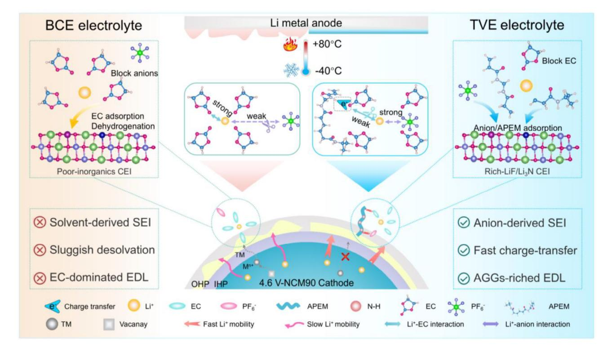
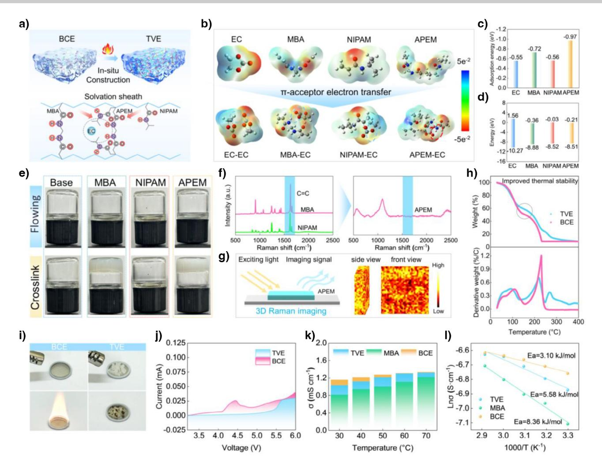
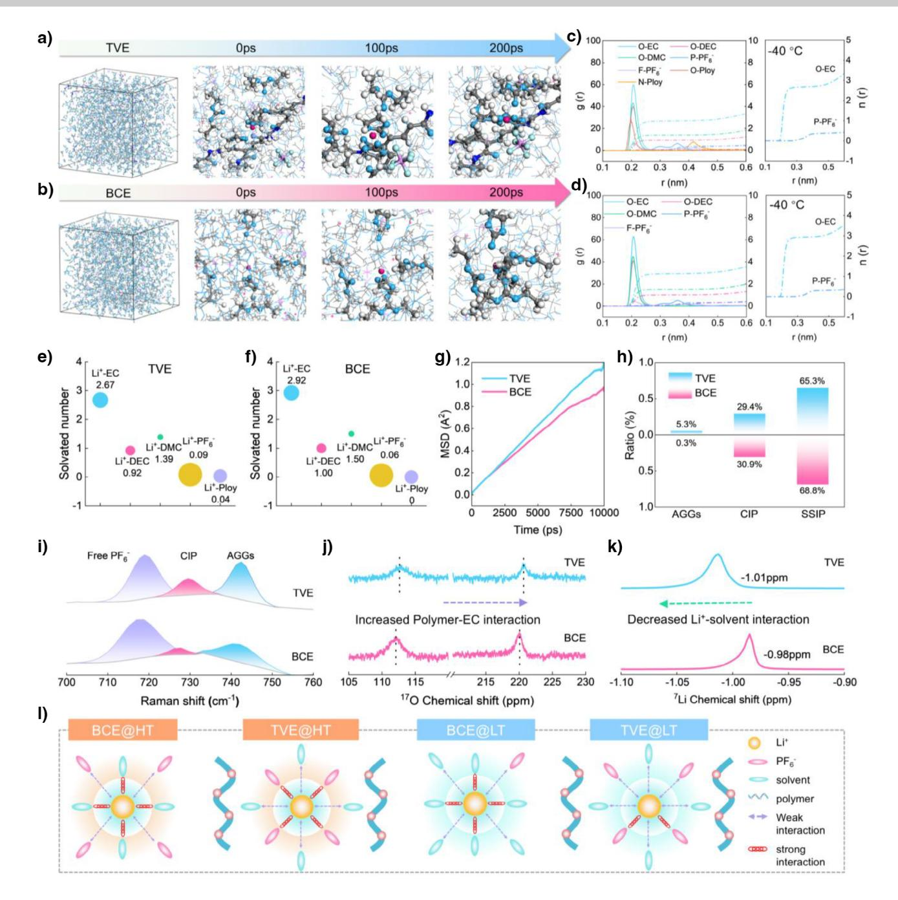
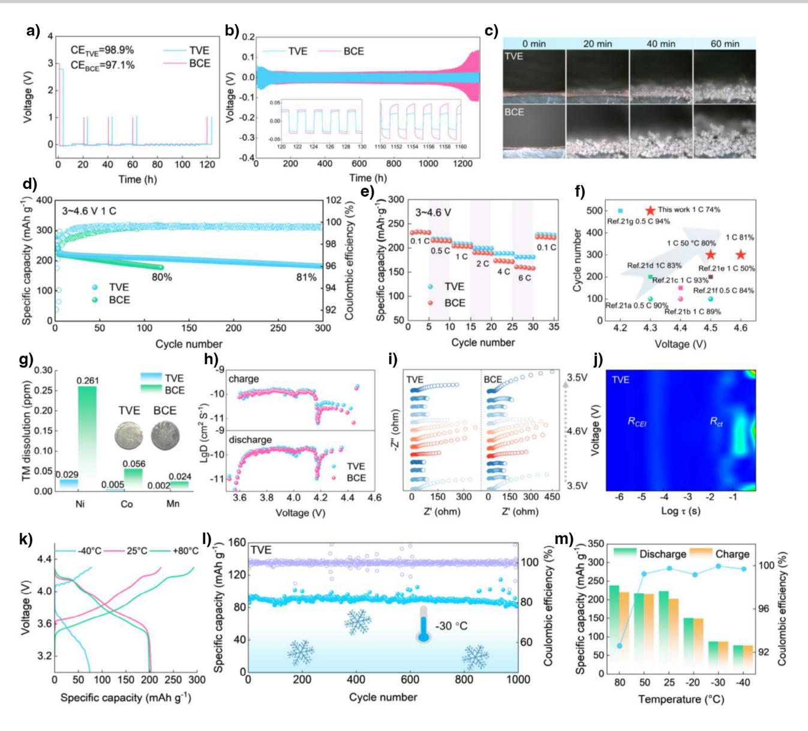
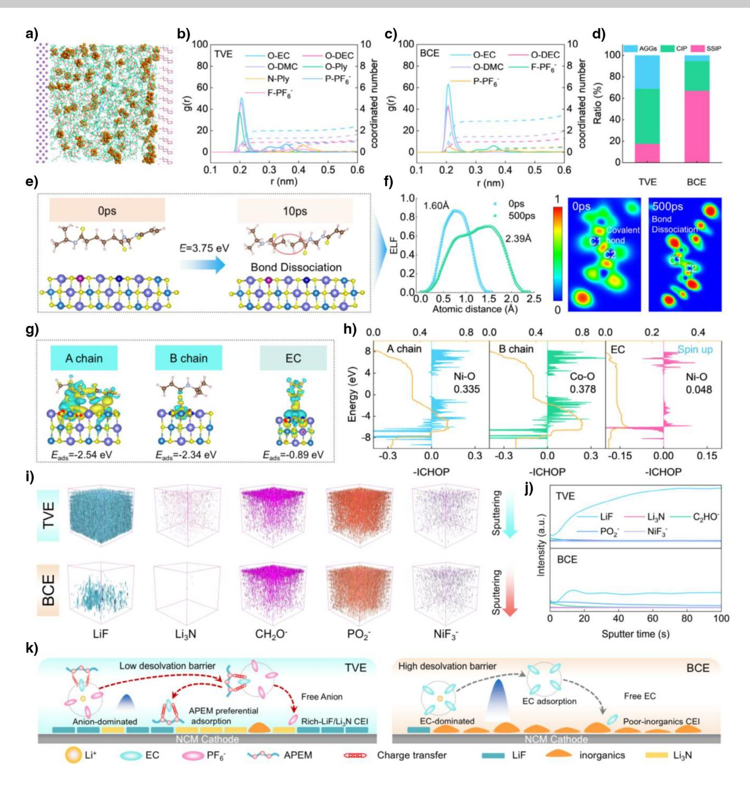
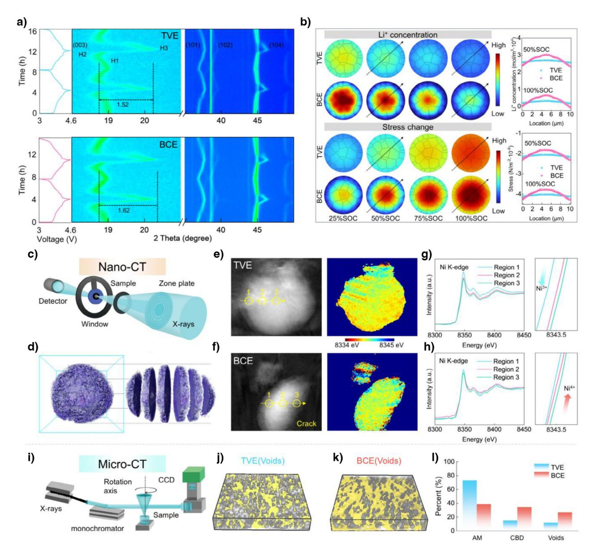
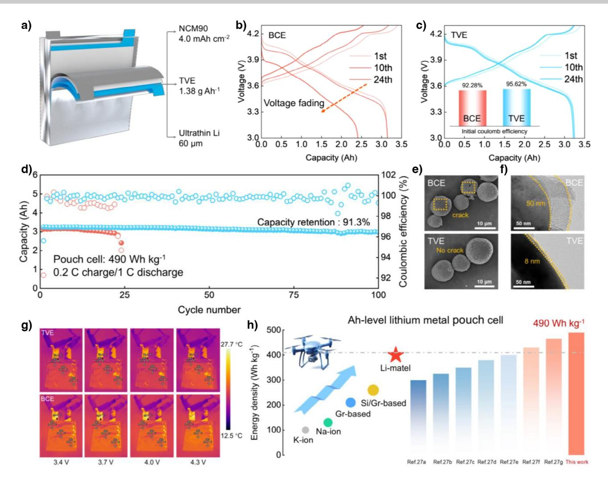

*Forschungsartikel*

Zitierweise: *Angew. Chem. Int. Ed.* **2025**, *64*, e202506750 doi.org/10.1002/anie.202506750 *Lithium Metal Batteries*

# **"Pseudo-Charge-Transfer Complex" Electrolyte Enables 490 Wh Kg−1 Lithium Metal Battery Operated From −40 to 80 °C**

*Shengwei Dong, Lingfeng Shi, Yan Zhang,\* Shenglu Geng, Zhuomin Qiang, Biao Deng, Fei Sun,\* Hua Huo, Geping Yin, and [Shuaifeng Lou\\*](https://orcid.org/0000-0002-1800-9105)*

**Abstract:** Electric vehicles and electric aircraft demand all-climate lithium metal batteries (LMBs) with high energy density. However, the interaction mechanism between charge transfer in the solvation sheath and interfacial evolution is not yet clear. Herein, we proposed a "pseudo-charge-transfer complex" strategy by introducing an amide polymer encapsulation matrix (APEM) to construct local charge-transfer channels to solvents for tuning the negative charge center. Theoretical calculations and synchrotron X-ray tomography reveal that the APEM drags out the polar solvent and promotes cationanion coordination in the primary solvation sheath, contributing to AGGs-dominated interfacial solvation chemistry. The designed electrolyte improves the cyclability of Li|LiNi0.9Co0.05Mn0.05O2 up to 300 cycles at 4.6 V and high-temperature capability at 80 °C. Even at −40 °C, it still delivers a high capacity of 87.9 mAh g−1 with negligible capacity decay for 160 cycles. Industrial 3 Ah-level pouch cells over 490 Wh kg−1 exhibit 91.3% capacity retention after 100 cycles, manifesting high potential in extreme applications.

## *Introduction*

Lithium metal battery, employing high-voltage nickel-rich LiNixCoyMn1-x-yO2 (NCM, *x* > 0.8) cathode is considered a promising next-generation high-energy-density energy storage device.[\[1,2\]](#page-11-0) However, all-climate applications of LMBs usually cause inevitable electrolyte parasitic reactions and interfacial degradations.[\[3,4\]](#page-11-0) With an elevated charging cutoff voltage and operating temperature, the highest occupied molecular orbital of solvation sheaths is higher than the decreased Fermi level of the cathode, leading to electrons spontaneously transferring to the cathode.[\[5,6\]](#page-11-0) As the temperature falls below 0 °C, the severe concentration polarization and high desolvation barrier limit charge transfer and Li+-intercalation throughput capacity at the electrodeelectrolyte interface.[\[7,8\]](#page-11-0) Therefore, decoupling the dynamic complex correlation of solvation chemistry and interfacial chemistry under extreme conditions beyond isolated solvation structures is highly expected.[\[9,10\]](#page-11-0)

Microscopic interaction is well understood in the bulk electrolyte, but knowledge about the charge-transfer mechanism within the solvation sheath is limited.[\[11,12\]](#page-11-0) The Li+ solvation sheath, consisting of solvent molecules and anions that coordinate with the cation, significantly influences the Li+ transport in the bulk electrolyte and the reaction mechanism at the interface.[\[13,14\]](#page-11-0) Previous work generally focused on regulating multiple interactions to construct an aniondominated solvation sheath, including high-concentration electrolytes (HC),[\[15,16\]](#page-11-0) locally high-concentration electrolytes (LHC),[\[17,18\]](#page-11-0) and weakly solvated electrolytes.[\[19,20\]](#page-11-0) However, all the above strategies are mainly limited to general adjustment of the species and ratio of strongly & weakly solvating solvents, where the charge-transfer mechanism within the adjacent solvent charges in the solvation sheath is absent.[\[21,22\]](#page-11-0)

The spatial structure of the solvation sheath holds the key to the spatiotemporal evolution of the electrode-electrolyte interface.[\[23,24\]](#page-11-0) Particularly, the desolvation process accompanied by charge transfer near the EDL induces anions and neutral small solvent molecules to adhere to the electrode, leading to the reconstruction of the interfacial electric field and species distribution.[\[25,26\]](#page-11-0) Prior studies have proved that the spatial dimensions of the EDL impact the oxidation resistance of electrolytes. In principle, the compact interface function area promotes a rapid modulation of interface potential to the bulk level, which in turn suppresses the continuous decomposition of the solvation sheath.[\[27\]](#page-11-0) Overall, revealing how charge transfer affects the solvation sheath evolution,[\[28,29\]](#page-11-0) especially the spatial distribution of the EDL region, can provide valuable guidance for the development of high-performance all-climate LMBs.[\[30\]](#page-11-0)

[shuaifeng.lou@hit.edu.cn](mailto:shuaifeng.lou@hit.edu.cn)

F. Sun

School of Energy Science and Engineering, Harbin Institute of

Technology, Harbin 150001, China E-mail: [sunf@hit.edu.cn](mailto:sunf@hit.edu.cn)

B. Deng, S. Lou

- Shanghai Synchrotron Radiation Facility, Shanghai Advanced Research Institute, Chinese Academy of Sciences, Shanghai 201204, China
- Additional supporting information can be found online in the Supporting Information section

[\*] S. Dong, L. Shi, Y. Zhang, S. Geng, Z. Qiang, H. Huo, G. Yin, S. Lou State Key Laboratory of Space Power-Sources, School of Chemistry and Chemical Engineering, Harbin Institute of Technology, Harbin 150001, China E-mail: [zhangyhit@hit.edu.cn](mailto:zhangyhit@hit.edu.cn)

# *Forschungsartikel*

*Scheme 1.* Schematic of the "pseudo-charge-transfer complex" design guidelines. The diagram reveals the different Li+ solvation sheaths and interfacial reaction mechanisms. For BCE, EC-dominated EDL and solvent-derived SEI obstacles for high-energy-density lithium metal batteries. For TVE, the designed electrolyte promotes AGGs-derived SEI, enhances Li+-anion interactions, and decreases Li+ desolvation barriers, which maintains thermodynamic and kinetic equilibrium.

Herein, we propose a "pseudo-charge-transfer complex" electrolyte design strategy consisting of an amide encapsulation matrix as the ideal electron-acceptor model and a basic carbonate electrolyte (BCE) with agglomerated carbonyl oxygen atoms as the baseline electrolyte. The synchrotron X-ray tomography and theoretical calculation reveal that an electron-deficient amide matrix induces the "π-electrons delocalization" effect, which enables disrupting the ethylene carbonate (EC)-dominated solvation sheath, preferentially occupying the highly active transition metal sites and reconstructing the surface chemical state (Scheme 1). Consequently, the batteries with the wide-temperature and highvoltage electrolytes (TVE) show an outstanding lithium metal service life (over 1300 hours) and exceptional performance operating at −40–80 °C and 4.6 V cutoff voltage (retention ratio of 81% at 1 C over 300 cycles). Moreover, a 3 Ah Li metal pouch cell with a high energy density exceeding 490 Wh kg−1 and a low capacity decay of 0.09% each cycle is achieved. Our work highlights that tuning of the electrolyte–cathode interfacial chemistry is crucial in all-climate LMBs.

### *Results and Discussion*

### *Design Principles for "Pseudo-Charge-Transfer Complex"*

Charge transfer is a multi-step, coupled dynamic process of electrochemical reactions in batteries, encompassing key steps such as desolvation, interface reactions, ion migration, and solvation sheath reconstruction. However, understanding how electron transfer influences the "cation-anion-solvent" co-coordination remains incomplete and limited.[\[31,32\]](#page-11-0) Herein, a "pseudo-charge-transfer complex" electrolyte is designed to tune delocalized π-electrons transfer. The cross-linking of N, N'-methylenebisacrylamide (MBA) and N-isopropylacrylamide (NIPAM) is selected as a high polarization matrix for model material owing to abundant electron-deficient sites (Figure [1a\)](#page-2-0). Further analysis reveals that the incorporation of the electron-deficient N-H group into the carbonyl oxygen atom establishes a local electron channel to attract π-electrons away from EC (Figure [1b\)](#page-2-0). Notably, the energetic hopping of delocalized πelectrons is also certified by the highest adsorption energy of APEM-EC (−0.97 eV), which surpasses that of other singly polarized chains (Figure [1c\)](#page-2-0). Meanwhile, the lower unoccupied molecular orbital (LUMO) and higher occupied molecular orbital (HOMO) of the amide matrix than EC indicate its preferential redox reactions (Figure [1d\)](#page-2-0), thereby inhibiting the electrolyte parasitic reaction for TVE.[\[13,33,34\]](#page-11-0)

To gain insight into the crosslinking spatial structure of the co-polarization matrix, we introduce in-situ polymerization experiments, which exhibit a stable polarized network in the "pseudo-charge-transfer complex" electrolyte (Figure [1e\)](#page-2-0). The Raman spectra reveal the absence of C═C stretches (1630–1680 cm−1) in APEM, confirming complete thermal polymerization of MBA/NIPAM into a crosslinked amide

*Forschungsartikel*

*Figure 1.* Electrons delocalization and charge-transfer dynamics. a) Schematic of the electrolyte synthesis and microscopic interaction. b) Electrostatic potential maps. c) Adsorption energies of the amide matrix to EC. d) LUMO and HOMO energy levels. e) Digital photos of the electrolyte optimization process. f) The Raman spectra. g) 3D Raman imaging of APEM. h) Thermogravimetric analysis of various electrolytes. i) The flammability tests. j) The linear sweep voltammetry curves under a sweep rate of 1 mV s−1 . k) The ion conductivity tests at different temperatures. l) Activation energy calculation and comparison.

network. Additionally, the broad peak observed at 1100 cm−1 in the Raman spectra further confirms the typical amorphous structure of APEM (Figure 1f). X-ray diffraction (XRD) exhibits that the APEM remains a typical amorphous phase peaks at 20°∼30° (Figure S1). Moreover, APEM features abundant oxygen atoms acting as active sites for Li+ transport, indicating potential Li+ conduction through the matrix. In Figure 1g, the 3D Raman imaging and scanning electron microscope (SEM) of the designed electrolyte verifies that the APEM exhibits a continuous microstructure constructed by a cross-linked amide matrix (yellow) and ion-conducting phase (black) (Figures S2 and S3). Generally, the thermal and electrochemical stability are taken into account when constructing suitable solvation sheaths for the wide-temperature electrolyte. First, we evaluated the thermal stability of the electrolytes, demonstrating that TVE with the amide matrix maintains superior component integrity above 100 °C (Figure 1h). In the ignition experiment, TVE extinguishes quickly and prevents thermal runaway while BCE continues to burn (Figure 1i). Then, high electrochemical stability is another essential factor for high-voltage electrolytes. The oxidation potential of TVE is 5.5 V, while the current in BCE rises sharply at about 4.0 V with a limited current of 10 uA (Figure 1j and Figure S4).

Low Li+ desolvation energy and rapid Li+ diffusion are necessary factors for all-climate LMBs. Despite of slight reduction in the ion conductivity of TVE than that of BCE, it demonstrates superior ionic conductivity compared to the MBA-modified electrolyte (Figure 1k). According to the Arrhenius equation (Figure 1l and Figure S5), the moderate activation energy in TVE is 5.58 kJ mol−1 compared to that of the MBA-modified electrolyte (8.36 kJ mol−1) and BCE (3.10 kJ mol−1). This suggests that TVE maintains faster ion diffusion kinetics approaching that of BCE compared to the MBA-modified electrolyte. With increasing amide matrix content in TVE, the overall ion conductivity decreases, while the activation energy increases to 10.03 kJ mol−1. This suggests that excessive amide groups could strengthen the electrolyte's temperature dependence and impair lowtemperature kinetics in the TVE.[\[19\]](#page-11-0) Benefiting from the unique mechanism of local-electron-channel transport, the electron-acceptor amide matrix induces the delocalization of electrons on the carbonyl oxygen, thereby effectively lowering the electron cloud density of the EC molecule. This molecular-scale regulation strategy precisely modulates the coordination environment of Li+ clusters, simultaneously reducing EC solvation ability while enhancing Li+-anion interactions.

To understand the underlying charge-transfer mechanism within adjacent solvation sheaths, we introduce molecular dynamics (MD) simulations to investigate the molecular-scale desolvation kinetics.[\[21\]](#page-11-0) The anion/solvent distribution around the Li+ in Figure [2a,b](#page-4-0) reveals a temperature-independent AGGs-dominated solvation structure in TVE compared to BCE at −40 °C. The Li+ first solvation shell for each electrolyte shows a radius of approximately 2.65 Å and is dominated by the EC molecule. Following this, PF6 − predominantly occupies the second solvation shell at around 4.2 Å due to mutually repulsive anion–anion interaction. Compared with the BCE, the PF6 − in TVE can more intensively enter the Li+ second solvation shell (Figure [2c,d\)](#page-4-0). The coordination numbers statistics reveal an increased participation of PF6 − and APEM within the solvation sheath in TVE. Such electron-deficient property is bound to result in a high π-electrons hopping frequency between APEM and carbonyl oxygen atoms, and π-acceptor electron reallocation in solvation sheaths (Figure [2e,f\)](#page-4-0).

In the BCE, Li+ transfer in the bulk electrolyte mainly depends on the vehicular transport mechanism, in which the EC/DEC/DMC solvent molecules are wrapped with Li+ for directional migration.[\[35\]](#page-11-0) Owing to the co-polarization APEM chain to chemical anchoring EC molecules, the Li+ transport mechanism transforms into a diffusion-dominated mechanism and gets rid of the steric hindrance and solvation barrier of large-volume solvent molecules. The Mean Squared Displacement also indicates excellent Li+ migration dynamics in TVE (Figure [2g\)](#page-4-0). This unique π-electrons-transfer mechanism not only pushes EC molecules away from the Li+ solvation sheaths through the delocalized π bond but also pulls PF6 − near Li+, resulting in the high concentration of anions in solvation sheaths. To quantitatively determine mesoscopic solvation structures from a statistical perspective, we focus on the formation of aggregates (AGGs) and contact ion pairs (CIP). As shown in Figure [2h,](#page-4-0) the ratio of CIP and AGGs is 31.0% and 51.5% extracted from MD simulations at −40 °C, which is higher than in BCE (5.3% and 27.8%). This is consistent with our supposition of the solvation sheath evolution based on the "pseudo-charge-transfer complex" mechanism. The aggregation state of anions in the Li+ solvation sheath is influenced by multiple factors, including the solvent nature and the specific anion type. The detailed solvation structure is further characterized using Raman spectra and Nuclear magnetic resonance (NMR) spectroscopy. Generally, the stretching band in PF6 − can be deconvolved into three components: free anion (718 cm−1), CIP (725 cm−1), and AGGs (743 cm−1). The increased signal intensity of AGGs in TVE than that of the BCE at −40 °C is indicative of the decreased Li+-EC interactions due to the dragging effect of the amide matrix (Figure [2i\)](#page-4-0). The O chemical shift of the C ═O position in EC can be observed owing to the electron-withdrawing amide matrix, also unveiling the increased APEM-EC interactions and reduced electron cloud density in EC (Figure [2j\)](#page-4-0).

Meanwhile, the upshift of 7Li in TVE indicates the enhanced Li+-anion interactions and thus the shielding effect of Li+ (Figure [2k\)](#page-4-0). That is, the "pseudo-charge-transfer complex" electrolyte can accommodate the delocalized πelectrons of the solvated EC molecule to construct continuous local electron channels, thus restructuring the electric field and force field inside solvation sheaths. It is worth noting that tuning solvent-cation-anion interactions can simultaneously achieve both AGGs-dominated solvation sheath and excellent Li+ desolvation kinetics. Typically, elevated temperatures accelerate the thermal motion of solvent molecules, weakening the interaction between Li+ and solvents, causing some solvent molecules to detach from the solvation shell. Conversely, lower temperatures restrict solvent molecule motion, thereby strengthening Li+-solvent coordination. The π-electron transfer becomes more active with increasing temperature, thereby enhancing the charge transfer kinetics, which leads to reduced EC coordination and increased anion aggregation.[\[36\]](#page-11-0) Due to the amide matrix participating in the formed solvation sheath, the "π-acceptor electron transfer" mechanism all along plays a key role in modulating solvation chemistry even at low-temperature conditions (Figure [2l\)](#page-4-0).

#### *Li***+** *Plating Kinetic and Wide-Temperature Electrochemistry*

The inappropriate solvation sheath causes sluggish Li+ desolvation, diffusion, and transfer kinetics, further inducing a series of chain reactions, such as severe dendritic Li, low coulomb efficiency, and inhomogeneous solid electrolyte interphase (SEI). To verify the lithium plating/stripping reversibility, the coulombic efficiency tests in Li|Cu cells are conducted by the modified Aurbach protocol. As presented in Figure [3a,](#page-5-0) the Li|Cu cells with TVE deliver higher CEs of 98.9% than the BCE (97.1%). Meanwhile, the higher critical current density (0.09 mA cm−2) and Li+ transference number (0.67) highlight the high compatibility of the Li anode and rapid Li+ transfer kinetics in "pseudo-chargetransfer complex" electrolyte (Figures S6 and S7). It is worth noting that the stable voltage response over 1300 h in the modulated electrolyte effectively suppresses the dead lithium accumulation and parasitic reactions (Figure [3b\)](#page-5-0). The solvation structure of the electrolyte has a profound influence on interfacial reactions. Through the scanning electron microscope (SEM) and atomic force microscopy (AFM) of cyclic lithium metal anodes, we found a more uniform anode surface in TVE, indicating the homogeneity of SEI and highly reversible Li plating (Figures S8 and S9). Moreover, the Derjaguin–Müller–Toporov (DMT) modulus analysis reveals the excellent mechanical properties of the Li surface in TVE owing to a high proportion of inorganic components in the solid electrolyte interphase. X-ray Photoelectron Spectroscopy is employed for qualitative analysis

*Forschungsartikel*

*Figure 2.* Unlocking the solvation structure of electrolytes at the atomic level. Environmental evolutions centered on a Li+ and a PF6 − within the MD snapshots of a) TVE and b) BCE. The radical distribution functions of c) TVE and d) BCE. The coordination number comparison of e) TVE and f) BCE. g) Comparison of various solvation structures in different electrolytes. h) The MSD curves of Li+ in TVE and BCE. i) The Raman spectra of the electrolytes. The NMR spectra of the electrolytes j) 17O and k) 7Li. l) Illustration of solvation structure changes in the TVE and BCE electrolytes at high-temperature and low-temperature conditions.

of the surface chemistry information. The anode-electrolyte interface containing LiF/Li3N validates that the AGGsrich solvation sheath tends to PF6 − decomposition, and the nitrogenous segment from APEM undergoes reductive decomposition (Figure S10).

High current density is likely to induce lithium dendrite growth using conventional carbonate electrolytes in lithium metal batteries. Further evidence for the high lithium metal compatibility in TVE in the current density range from 0.1 to 1 mA cm−2 is shown in Figure S11. A small overpotential of 30 mV can still be achieved even at a high current density of 1 mA cm−2. To visualize the Li deposition process, insitu optical microscopy images were utilized to record the real-time lithium dendrite (Figure [3c\)](#page-5-0). Notably, the lithium metal in TVE precursor electrolyte did not exhibit localized dominant deposition during the 60 min deposition process but instead was deposited in a planar and meticulous manner, suggesting that the "pseudo-charge-transfer complex" electrolyte

Figure 3. Li+ plating kinetics and high-voltage, wide-temperature performance. a) The Modified Aurbach's measurements in Li|Cu cells. b) Long-term cycling performances of Li|Li cells. c) In situ optical microscope pictures of lithium dendrite growth. d) High-voltage cycling performances of Li|NCM90 cells. e) Rate performances of Li|NCM90 cells. f) Comparison of cycling stability with previous reports. g) ICP-OES analysis of deposited TM on the anode in different electrolytes. h) Lithium-ion diffusivity ( $D_{Li+}$ ) of NCM90 determined from GITT measurements. i) In situ EIS plots of Li|NCM90 cells after 100 cycles at 4.6 V. j) 2D intensity color map of the DRT curves. k) Charge and discharge curves at  $-40$ , 25, and 80 °C. l) Long-term cycling stability of the NCM90 at  $-30$  °C. m) Temperature-dependent charge and discharge capacities of the Li|NCM90 cells operating from  $-40$  to 80 °C.

can effectively enhance the Li plating/stripping kinetics, and inhibit severe interfacial electron tunneling and persistent electrolyte decomposition. We, therefore, confirm that the " $\pi$ -acceptor electron transfer" mechanism remodels Li+ coordination architecture at the anode-electrolyte interface, thereby achieving the equilibrium of thermodynamics and kinetics to construct a more compact and LiF/Li3N-rich SEI.

Typically, the cathode interfacial reaction kinetics includes Li+ desolvation, ion diffusion, material transfer, etc., which directly affects the rate and stability of electrode reactions. The sweep-rate-dependent CV curves of NCM90 at 4.6 V in TVE exhibit a lower polarization potential than that of BCE (0.20 V vs. 0.32 V), which represents obvious apparent kinetic advantages (Figure S12). Similarly, Figures S13 and S14 demonstrate the excellent cycling capability of the NCM90 in TVE at 4.3 and 4.5 V. With the increased cutoff voltage in Figure 3d, the TVE cell exhibits a high initial discharge capability of 238.9 mAh  $g^{-1}$  and capacity retention of 81.0% over 300 cycles, outperforming the BCE (239.1 mAh  $g^{-1}$ , 80.0% over 119 cycles). Further evidence of the fast-charging capability of the NCM90 electrode in various electrolytes within the different current densities (Figure 3e), a high capacity of 160.8 mAh  $g^{-1}$  and a capacity retention of 78.8% can be maintained at an extremely high rate of 6 C at 4.6 V. Note that the capacity can be recovered to the initial capacity level at 0.1 C after 6 C at 4.3 and 4.6 V (Figure S15). The above results surpass those of the majority of the recently reported NCM90 electrodes in the different electrolytes (Figure [3f\)](#page-5-0).[\[37–43\]](#page-11-0) These findings illustrate that the interfacial desolvation kinetics and antioxidant stability are significantly improved owing to electron-deficient APEM effectively anchoring electron-rich carbonyl oxide atoms and undergoing sacrificial priority decomposition.

The increased overlap between the Ni3+/4+ eg orbits and the O2− 2p orbits induces more oxygen anions involved in charge compensation to undergo partial oxidation into oxygen, accompanied by transition metal (TM) dissolution under extreme conditions.[\[44\]](#page-11-0) Inductively coupled plasma-optical emission spectroscopy (ICP-OES) is conducted, indicating the decreased content of Ni, Co, and Mn precipitation in TVE (Figure [3g\)](#page-5-0). The AFM and SEM analysis in Figures S16 and S17 validate that the AGGs-dominated solvation sheath facilitates robust cathode electrolyte interphase (CEI), mitigating structural collapse and enabling adaptive highvoltage operation (Figure S18). The Galvanostatic intermittent titration technique (GITT) reveals that the Li+ diffusion coefficient in TVE is significantly higher than in BCE within 3.0∼4.0 V (Figure S19). The difference in Li+ diffusion coefficients between TVE and BCE diminished from 4.0 to 4.3 V. At 4.6 V and −30 °C operation, the GITT profiles exhibit comparable trends (Figure [3h\)](#page-5-0). These results demonstrate that either low-temperature conditions or high-voltage-induced structural degradation reduces Li+ diffusion rates while increasing interfacial charge-transfer impedance, thereby significantly limiting ion transport. Since TVE and BCE share core components, their Li+ diffusion coefficients become comparable under kinetically-limited conditions (high voltage/low temperature). Therefore, the amide-modified TVE primarily functions to improve film formation and enhance extreme electrochemical performance through cathode interface stabilization. Based on the in situ electrochemical impedance spectroscopy (EIS) in Figure [3i](#page-5-0) and Figure S20, DRT technology of impedance evolutions is employed to decouple overall bulk charge transfer and the cathode electrolyte interphase evolution.[\[45\]](#page-11-0) The cells using TVE exhibit reversible resistance evolution compared to BCE during the cycling process. Besides, TVE allows the cells consistently to maintain a lower charge transfer resistance and the CEI resistance at −4.5 and −1 s (Figure [3j](#page-5-0) and Figure S21). Therefore, the modified electrolyte exhibits excellent cycling performance over a wide temperature range (Figure [3k\)](#page-5-0).

In Figure [3l,](#page-5-0) the Li|NCM90 cells incorporating TVE exhibit a reversible capacity of 81.8 mAh g−1 even after 1000 cycles at −30 °C, attributed to their lower Li+ desolvation energy and rapid interfacial kinetics at low temperature (Figures S22 and S23). High temperatures inevitably accelerate the electrolyte parasitic reaction, so the BCE cells failed to control the serious electrolyte decomposition, and abnormal discharge curves appeared after only 100 cycles. In Figure [3m](#page-5-0) and Figure S24, owing to the interfacial impedances and high-temperature resistant APEM, the TVE cells demonstrate improved capacity retention, with up to 80.2% retention after 300 cycles at 50 °C, while maintaining good electrochemical performance and high coulombic efficiency even at 80 °C (Figures S25 and S26). All these results indicate that the "pseudo-charge-transfer complex" electrolyte possesses a dual interfacial regulation mechanism, where the AGGs-dominated interfacial solvation sheath facilitates low-temperature desolvation kinetics, and APEM promotes high-temperature thermodynamic stability.

#### *Interface Stability and Evolutionary Mechanism*

To understand the origins of the enhanced electrochemical performance of Ni-rich cathode under extreme conditions, MD simulations are employed to investigate the spatial distribution of PF6 −, Li+, and EC (Figure [4a\)](#page-7-0). Notably, APEM plays a role in constructing the Li+ solvation sheath in the EDL, indicating the similarity and stability of the "π-acceptor electron transfer" mechanism from the bulk electrolyte to the EDL. The results substantiate that the "pseudo-charge-transfer complex" electrolyte allows more PF6 − to enter the EDL region induced by the interfacial electric field in stark contrast with what occurred in BCE (Figure [4b,c\)](#page-7-0). On the other hand, the cation–ion aggregates possess excellent oxidation kinetics, preferentially moving toward the electrode surface within the EDL region in TVE (Figure [4d\)](#page-7-0). This further corroborates that EC molecules are tightly bound around APEM, driven by the "pseudo-chargetransfer complex" strategy, thereby promoting the AGGs accumulation within the EDL and inhibiting the persistent decomposition of EC molecules.[\[46\]](#page-11-0)

Inspired by that, we predict the APEM bond-dissociation tendencies and competitive adsorption mechanism on the cathode surface using ab initio molecular dynamics (AIMD). As depicted in Figure [4e,](#page-7-0) a clear bond dissociation phenomenon with a bond dissociation energy of 3.75 eV is observed in the C─C bond of APEM within the EDL region, which is consistent with the corresponding electron localization functions (ELF) of APEM (1.60 Å vs. 2.39 Å) in Figure [4f](#page-7-0) and Figure S27. The high adsorption energy (*Eads* = −2.54 eV) indicates that A chain holds the upper hand in spatial species distribution of the EDL region owing to the robust Ni3+-dipole interaction (Figure [4g\)](#page-7-0). The integrated crystal orbital Hamilton population (ICOHP) delivers the values Ni─O bond is 0.335 eV for the A chain and the values Co─O bond is 0.378 eV for the B chain in the spinup states, respectively, which are higher than those for the EC molecule (0.048 eV), preferentially orient themselves toward the cathode surface within the EDL region (Figure [4 h](#page-7-0) and Figure S28). Overall, the Nitrogen-containing chains derived from the APEM on the cathode surface can efficiently tune oxidizing species and reduce the decomposition of EC molecules for extreme applications.

To further reveal the correlation mechanism of the species distribution and interfacial components, the time-of-flight secondary ion mass spectrometry (TOF-SIMS) is employed to investigate the components and distribution of the organic and inorganic compounds within the CEI upon cycling at −40 °C (Figure [4i,j\)](#page-7-0).[\[47\]](#page-11-0) The depth-profiled TOF-SIMS in

*Forschungsartikel*

*Figure 4.* Evolutionary mechanisms for interface stability. a) Schematic of the solvation structure distribution at the cathode interface. Radial distribution function and coordination number b) TVE and c) BCE. d) The anion aggregation state statistics. e) Decomposition process of amide matrix on the surface of the cathode electrode. f) The corresponding ELF plots during the bond dissociation process. g) Comparisons of the adsorption energy and charge density difference. h) The ICOHP in A chain, B chain, and EC. i) TOF-SIMS tests of the NCM90 cathodes CEI formed at −40 °C for the BCE and TVE cells. j) TOF-SIMS depth plots of the CEI on cycled NCM90 cathodes in different electrolytes after 100 cycles. k) Schematic of NCM90 cathodes interface evolution mechanism of rich-LiF/Li3N.

TVE indicated a higher proportion of inorganic species, such as LiF originates from PF6 −, and Li3N stems from APEM, consequently creating an inorganic-rich CEI, thus inhibiting the severe electrolyte parasitic reaction (Figures S29 and S30). Undoubtedly, our "pseudo-charge-transfer complex" electrolyte proves to be an efficient strategy for optimizing the orientation of dipole moments and constructing an AGGsdominated solvation sheath through the "π-acceptor electron transfer" mechanism. Notably, nitrogen-enriched organic chain segments can selectively enter the EDL, disrupting the "adsorption-catalytic" chain reaction between C═O in EC molecules and Ni4+, thereby constructing a more stable and compact interphase and maintaining the excellent all-climate operation capacity (Figure 4k).

*Forschungsartikel*

*Figure 5.* Cross-scale analysis of the AGGs-dominated interface at the cathodes. a) In situ 2D contour of XRD plots of NCM90 in TVE and BCE. b) Finite element simulation of Li+ distribution and stress distribution of NCM90 in TVE and BCE. c) Schematic of the synchrotron X-ray tomography for the cycled NCM90 particle. d) 3D rendering for NCM90 particle in TVE at −40 °C. TXM images and 2D XANES chemical maps of Ni for cycled NCM90 particles in e) TVE and f) BCE. Ni K-edge XANES spectra of cycled NCM90 in g) TVE and h) BCE. i) Schematic of Micro-CT for cycled NCM90 electrode at −40 °C. 3D reconstructed electrodes with AM phase, CBD phase, and Voids phase for cycled NCM90 cathodes in j) TVE and k) BCE. l) The volume percentages of AM phase, CBD phase, and Voids phase.

A high chemical-mechanical-stability interface at the cathode can alleviate irreversible lattice damage and internal stress accumulation.[\[48\]](#page-11-0) To quantitatively evaluate the changes in crystal lattices, in situ XRD spectra are acquired at 4.6 V in TVE and BCE (Figure 5a and Figure S31). During the initial delithiation process, the (003) peak rapidly shifts to a higher angle, indicating a quick contraction of the interlayer spacing. Especially, in the H2–H3 phase transition, the rapid contraction of the *c*-axis lattice is significantly greater than that of the *a*-axis as the displacement angle increases. The smaller shifting angle of the H2–H3 phase transition peak in the TVE suggests that reducing anisotropic shrinkage alleviates the formation of microcracks resulting from structural damage, inhibits the propagation of internal microcracks, closes off the electrolyte penetration path, and further regulates the chemistry of the cathode interface.

The electrolyte–cathode interface, as a key functional area, profoundly influences the Li+ intercalation kinetics and stress-strain behavior of the bulk electrode. Hence, finite element analysis (FEA) is conducted to visualize the co-evolution of Li+ concentration and stress distribution during the initial Li+ insertion/extraction at the particle level (Figure 5b). During charging, Li+ at the NCM90 particle surface is preferentially extracted into the electrolyte under the applied electric field, while bulk Li+ undergoes concentrationgradient-driven diffusion toward the surface (Figures S32 and S23). This gradient diffusion mechanism minimizes irreversible particle fragmentation caused by electrochemical polarization and stress-strain in TVE, yielding more uniform Li+ distributions and smoother concentration gradients. However, significant variations in Li+ concentration gradients of BCE are observed in the NCM90 particle from the outer shell to the core region, attributed to the limited diffusion rate. Severe interface fragmentation and reshaping in BCE fail to prevent layered structure collapse, blocking Li+ diffusion pathways. Consequently, bulk Li+ extraction becomes disordered, creating severe concentration gradients. These significant gradients further generate substantial stress variations, propagating fractures from surface to core. The simulation results emphasize that modulated electrolyte engineering based on APEM competitive adsorption and anion active adsorption offers uniform ion diffusion and a stable interface to alleviate the stress accumulation on the Ni-rich cathode (Figures S34 and S35).

Synchrotron Micro-/Nano-CT tomography, serving as a cross-scale microstructure representation tool, is employed to monitor the structural degradation of the electrode and particles (Figure [5c\)](#page-8-0). Post-cycling analysis of the TVE batteries, visualized through Nano-CT characterization, reveals that NCM90 particles operated at -40 °C maintain higher structural integrity, displaying an intact ellipsoidal shape devoid of obvious cracks (Figure [5d\)](#page-8-0). Based on scanning transmission X-ray microscopy (STXM), the distinct regions labeled as regions 1∼3 within cycled NCM90 at −40 °C in TVE and BCE indicate varying Ni valence states. Figure [5e](#page-8-0) illustrates a more homogeneous color distribution of NCM90 in the 2D XANES chemical mapping, attributed to the effective interfacial protection along with rapid ion diffusion kinetics and electrochemical stability. Conversely, the NCM90 in BCE reveals a notable rise in the high valence state of Ni4+, likely stemming from irreversible insertion/extraction in Figure [5f,](#page-8-0) inducing local collapse of the layered structure, and Ni4+-catalyzed decomposition of electrolyte. The smaller shift of the Ni K-edge XANES spectra in TVE provides compelling evidence of restrained heterogeneous reactions and reduced electrochemical polarization (Figure [5g,h\)](#page-8-0).

Micro-CT is utilized to unveil the 3D spatial distribution for an in-depth analysis of the evolution behavior of mechanical stress of the NCM90 electrode cycled in BCE and TVE at −40 °C. In Figure [5i,l,](#page-8-0) the full 3D reconstructed microstructure maps segmented phases of AM, CBD and Voids, where the quantified volume ratio is 73.2%, 14.9%, 11.9% for NCM90 cathode within TVE and 38.7%, 34.4%, 26.9% for NCM90 electrode within BCE, respectively (Figure S36). Therefore, the "pseudo-charge-transfer complex" electrolyte exhibits huge advantages in modulating the EDL to construct the stable interface, but also optimizes the Li+ transfer kinetics and suppresses heterogeneous reactions to match high-voltage and all-climate batteries.

## *Exploration of Practical 490 Wh Kg***−***1 Lithium Metal Pouch Cell*

To rigorously evaluate the feasibility of "pseudo-chargetransfer complex" electrolyte coupling with both the lithium anode and the NCM90 cathode, we assembled lithium metal pouch cells under stringent design conditions. These pouch cells incorporate high-loading NCM90 cathodes (19 mg cm−2), a lean electrolyte configuration (1.38 g Ah−1), and an ultrathin lithium anode (60 µm, corresponding to an N/P ratio of 1.64) to achieve high energy density (Figure [6a](#page-10-0) and Table S1). The cycling stability of the pouch cell is accurately depicted by the voltage profiles across various cycles. The voltage profiles of the pouch cells exhibit reduced voltage polarization with TVE compared to BCE, attributed to rapid Li+ migration kinetics and stable interfacial chemistry (Figure [6b,c\)](#page-10-0). The modulated electrolyte enables 3 Ah-pouch cells with 490 Wh kg−1 to cycle 100 times at 0.2 C charge rate and 1 C discharge rate with a high capacity retention of 91.3% (Figure [6d\)](#page-10-0). In contrast, the pouch cell using BCE electrolyte shows accelerated capacity decay and reduced coulombic efficiency.

Furthermore, the structural evolution of the cycled NCM90 particles is also observed through SEM tests, where the NCM90 particles in BCE exhibit significant fragmentation, likely attributed to the collapse of the cathode structure and the dissolution of transition metals (Figure [6e](#page-10-0) and Figure S37). Conversely, the cathode particles in the TVE exhibit excellent structural integrity with mitigated stress-induced cracking. High-resolution transmission electron microscopy (HRTEM) images further reveal a thin and homogeneous CEI layer (8 nm) on the surface of NCM90 in the TVE electrolyte, whereas NCM90 cycled in BCE exhibits a thick and irregular CEI layer of 50 nm. The above results strongly demonstrate that our electrolyte design stabilizes the electrolyte–cathode interface for good cycle stability. Besides, the spatial heat distribution of the pouch cells remains nearly constant across different discharging and charging rates and states, suggesting the exceptional thermal safety of TVE batteries even under extreme conditions (Figure [6f\)](#page-10-0). Based on a comprehensive comparison with previous work,[\[49–55\]](#page-11-0) the "pseudo-charge-transfer complex" electrolyte demonstrates the great advantages for cooperative tuning of solvation sheath and interfacial chemistry, providing a new design concept for next-generation all-climate LMBs (Figure [6g\)](#page-10-0).

## *Conclusion*

In summary, we proposed a "pseudo-charge-transfer complex" electrolyte strategy for high-voltage and all-climate LMBs based on "charge transfer" inside carbonyl oxygen atoms to the electron-deficient matrix, which tunes local dipole orientation, disrupts the solvent molecular blockade, and enhances Li+ transport kinetics. The theoretical calculation revealed that the "π-electrons" local transport channel persists from the bulk electrolyte to the EDL, triggering the AGGs-dominated solvation sheath and the sacrificial oxidative decomposition of APEM at the electrolyte–cathode interface, contributing to the conductive Li3N/LiF-rich CEI. The APEM-EC interactions in interfacial solvation stabilize the NCM90 cathodes under lowtemperature conditions, facilitating Li+ desolvation kinetics and suppressing parasitic reactions, as revealed by syn-

*Forschungsartikel*

*Figure 6.* Practical application of 3-Ah pouch cells. a) Configuration of Li|NCM90 pouch cells of 490 Wh kg−1 . The galvanostatic discharge–charge profiles of Li|NCM90 pouch cells with b) BCE and c) TVE. d) Cycling performance of Li|NCM90 pouch cells at 0.2 C charge and 1 C discharge. e) Morphology of cycled NCM90 electrodes from Li|NCM90 pouch cells with different electrolytes. f) HRTEM images of cathodes cycled in different electrolytes. g) Infrared temperature images of Li|NCM90 pouch cells with different electrolytes. h) Energy density comparison of pouch cells with previously reported works and various energy systems.

chrotron X-ray tomography. Such well-modulated electrolyte realizes the dynamic balance between thermodynamics and kinetics, enabling the Li|NCM90 cells to exhibit excellent oxidative stability at the high cut-off voltages (4.6 V), high-temperature ability (80 °C), and negligible capacity decay for 165 cycles at −40 °C. Moreover, a 490 Wh kg−1 pouch cell (Li|NCM90) can deliver superior capacity retention of 91.3% after 100 cycles. This work provides unique insights for understanding the correlation between the intramolecular electric field in the solvation sheath and spatial distribution in the EDL, providing new insights into the electrolyte engineering of all-climate and high-energy LMBs.

## *Acknowledgements*

This work was supported by National Natural Science Foundation of China (22279026, 2247090373), Major Science and Technology Projects for Independent Innovation of China FAW Group Co., Ltd., Natural Science Foundation of Chongqing (CSTB2022NSCQ-MSX1401), Fundamental Research Funds for the Central Universities (grant no. HIT.OCEF.2022017), and the China Postdoctoral Science Foundation (2024M764198). The authors thank the beamline BL13HB at Shanghai Synchrotron Radiation Facility (SSRF) for SR-CT measurements.

## *Conflict of Interests*

The authors declare no conflict of interest.

## *Data Availability Statement*

Research data are not shared.

**Keywords:** AGGs-dominated interface • All-climate lithium metal batteries • Pseudo-charge-transfer complex • Synchrotron X-ray tomography

- [1] C. Kang, J. Zhu, F. Kong, X. Xiao, H. Huo, Y. Ma, Y. Xiong, Y. Luo, T. Lv, J. Xie, G. Yin, *Angew. Chem. Int. Ed.* **2024**, *63*, e202412703.
- [2] Y. Wei, H. Wang, X. Lin, T. Wang, Y. Cui, Y. Huang, J. Yang, T.- H. Liu, Y. Ren, X. Fan, H. Xu, Y. Huang, *Energy. Environ. Sci.* **2025**, *18*, 786–798.
- [3] Z. Xu, X. Zhang, J. Yang, X. Cui, Y. Nuli, J. Wang, *Nat. Commun.* **2024**, *15*, 9856.
- [4] W. Yang, Z. Zhang, X. Sun, Y. Liu, C. Sheng, A. Chen, P. He, H. Zhou, *Angew. Chem. Int. Ed.* **2024**, *63*, e202410893.
- [5] B. Zhang, K. Zhang, X. Wu, Q. Zheng, H. Luo, H. Zhang, Y. Chen, S. Zhou, Y. Zhu, J. Yin, Y. Zou, H. Liao, W. Jiao, N. Liu, Y. Qin, B. Zhang, C. Shen, Y. Qiao, S. Sun, *Adv. Energy Mater.* **2024**, 2404391.
- [6] W. Hou, Y. Ou, T. Zeng, Q. Feng, Q. Cao, P. Zhou, Y. Xia, X. Song, W. Zhang, Y. Lu, S. Yan, H. Zhou, H. Zhou, H. Liu, F. Liu, K. Liu, *Energy. Environ. Sci.* **2024**, *17*, 8325–8336.
- [7] Q. Wang, Z. Yao, C. Zhao, T. Verhallen, D. Tabor, M. Liu, F. Ooms, F. Kang, A. Aspuru-Guzik, Y.-S. Hu, M. Wagemaker, B. Li, *Nat. Commun.* **2020**, *11*, 4188.
- [8] C. Sun, R. Li, C. Zhu, L. Chen, S. Weng, C. Liu, T. Deng, L. Chen, X. Wang, *ACS Energy Lett.* **2023**, *8*, 4119–4128.
- [9] Y. Lu, Q. Cao, W. Zhang, T. Zeng, Y. Ou, S. Yan, H. Liu, X. Song, H. Zhou, W. Hou, Z. Pan, N. Hu, Q. Feng, Y. Li, K. Liu, *Nat. Energy* **2024**.
- [10] Y. Zhang, Y. Wang, W. Zhao, P. Zuo, Y. Tong, G. Yin, T. Zhu, S. Lou, *Nat. Commun.* **2024**, *15*, 6299.
- [11] L. Chen, Q. Zhang, C. Song, Y. Jiang, X. Sheng, H. Pan, L. Yang, S. Wu, L. Zeng, D. Sun, C. Wang, T. Wang, Y. Li, T. Zhao, *Angew. Chem. Int. Ed.* **2025**, *64*, e202422791.
- [12] Y. Meng, D. Zhou, R. Liu, Y. Wang, Y. Gao, Y. Wang, B. Sun, F. Kang, M. Armand, B. Li, G. Wang, D. Aurbash, *Nat. Energy* **2023**, *8*, 1023–1033.
- [13] P. Liang, J. Li, Y. Dong, Z. Wang, G. Ding, K. Liu, L. Xue, F. Cheng, *Angew. Chem. Int. Ed.* **2025**, *64*, e202415853.
- [14] D. Zhang, C. Z. J. Ma, M. Liu, K. Yang, Y. Li, X. Cheng, Z. Wang, H. Wang, W. Lv, Y. He, F. Kang, *Natl. Sci. Rev.* **2024**, *11*, nwae219.
- [15] Y. Chen, M. Li, Y. Liu, Y. Jie, W. Li, F. Huang, X. Li, Z. He, X. Ren, Y. Chen, X. Meng, T. Cheng, M. Gu, S. Jiao, R. Cao, *Nat. Commun.* **2023**, *14*, 2655.
- [16] L. Chen, Q. Nian, D. Ruan, J. Fan, Y. Li, S. Chen, L. Tan, X. Luo, Z. Cui, Y. Cheng, C. Li, X. Ren, *Chem. Sci.* **2023**, *14*, 1184–1193.
- [17] Z. Wu, R. Li, S. Zhang, L. Lv, T. Deng, H. Zhang, R. Zhang, J. Liu, S. Ding, L. Fan, L. Chen, X. Fan, *Chem* **2023**, *9*, 650–664.
- [18] Z. Piao, X. Wu, H.-R. Ren, G. Lu, R. Gao, G. Zhou, H.-M. Cheng, *J.Am.Chem.Soc* **2023**, *145*, 24260–24271.
- [19] M. Qin, Z. Zeng, Q. Wu, F. Ma, Q. Liu, S. Cheng, J. Xie, *Adv. Funct. Mater.* **2024**, *34*, 2406357.
- [20] S. Kim, J. Lee, T. Lee, K. Baek, J. Kim, B. Kim, J. Byun, H. Lee, S. Kang, J. Choi, S. Lee, M. Choi, J. Lee, N. Choi, *Energy. Environ. Sci.* **2023**, *16*, 5108–5122.
- [21] X. Liu, J. Zhang, X. Yun, J. Li, H. Yu, L. Peng, Z. Xi, R. Wang, L. Yang, W. Xie, J. Chen, Q. Zhao, *Angew. Chem. Int. Ed.* **2024**, *63*, e202406596.
- [22] H. Gao, Y. Chen, T. Teng, X. Yun, D. Lu, G. Zhou, Y. Zhao, B. Li, X. Zhou, C. Zheng, P. Xiao, *Angew. Chem. Int. Ed.* **2024**, *136*, e202410982.
- [23] K. Ge, H. Shao, Z. Lin, P. Taberna, P. Simon, *Nat. Nanotechnol.* **2025**, *20*, 196–208.

- [24] H. Tao, S. Wang, H. Liu, C. Lian, *Angew. Chem. Int. Ed.* **2025**, *64*, e202418447.
- [25] Y. Li, B. Wen, N. Li, Y. Zhao, Y. Chen, X. Yin, X. Da, Y. Ouyang, X. Li, P. Kong, S. Ding, K. Xi, G. Gao, *Angew. Chem. Int. Ed.* **2025**, *64*, e202414636.
- [26] K. Chen, X. Shen, L. Luo, H. Chen, R. Cao, X. Feng, W. Chen, Y. Fang, Y. Cao, *Angew. Chem. Int. Ed.* **2023**, *62*, e202312373.
- [27] L. Chen, H. Zhang, R. Li, S. Zhang, T. Zhou, B. Ma, C. Zhu, X. Xiao, T. Deng, L. Chen, X. Fan, *Chem* **2024**, *10*, 1196–1212.
- [28] M. Fang, B. Du, X. Zhang, X. Dong, X. Yue, Z. Liang, *Angew. Chem. Int. Ed.* **2024**, *63*, e202316839.
- [29] Q. Wu, M. McDowell, Y. Qi, *J. Am. Chem. Soc.* **2023**, *145*, 2473– 2484.
- [30] B. Ma, H. Zhang, R. Li, S. Zhang, L. Chen, T. Zhou, J. Wang, R. Zhang, S. Ding, X. Xiao, T. Deng, L. Chen, X. Fan, *Nat. Chem.* **2024**, *16*, 1427–1435.
- [31] P. Li, Z. Zhang, Z. Zhao, J. Li, Z. Xu, H. Zhang, G. Li, *Adv. Mater.* **2024**, *36*, 2406359.
- [32] S. Gu, Y. Zhang, M. Li, Q. Lin, G. Xu, N. Zhang, *Angew. Chem. Int. Ed.* **2025**, *64*, e202410020.
- [33] H. Chen, K. Chen, J. Yang, B. Liu, L. Luo, H. Li, L. Chen, A. Zhao, X. Liang, J. Feng, Y. Fang, Y. Cao, *J. Am. Chem. Soc.* **2024**, *146*, 15751–15760.
- [34] S. Yuan, S. Cao, X. Chen, J. Wei, Z. Lv, H. Xia, L. Chen, R. Ng, F. Tan, H. Li, X. Loh, S. Li, X. Feng, Chen, *J. Am. Chem. Soc.* **2025**, *147*, 4089–4099.
- [35] D. Lu, R. Li, M. Rahman, P. Yu, L. Lv, S. Yang, Y. Huang, C. Sun, S. Zhang, H. Zhang, J. Zhang, X. Xiao, T. Deng, L. Fan, L. Chen, J. Wang, E. Hu, C. Wang, X. Fan, *Nature* **2024**, *627*, 101–107.
- [36] Y. Chen, Q. He, Y. Zhao, W. Zhou, P. Xiao, P. Gao, N. Tavajohi, J. Tu, B. Li, X. He, L. Xing, X. Fan, J. Liu, *Nat. Commun.* **2023**, *14*, 8326.
- [37] Z. Tan, Y. Li, C. Lei, Y. Li, X. Xi, S. Jiang, F. Wu, Z. He, *Small* **2024**, *20*, 2305618.
- [38] T. Jiao, G. Liu, Y. Zou, X. Yang, X. Zhang, A. Fu, J. Zheng, Y. Yang, *J. Power Sources* **2021**, *515*, 230618.
- [39] X. Zhang, G. Liu, T. Jiao, Y. Cheng, Y. Zou, M.-S. Wang, Y. Yang, J. Zheng, *ACS Appl. Energy Mater.* **2021**, *4*, 12275–12284.
- [40] Y. Yang, F. Song, W. Chen, Q. Chen, *Appl. Surf. Sci.* **2024**, *660*, 159953.
- [41] Z. Liu, X. Wen, Y. Xie, F. Wang, L. Wang, Y. Wu, X. Feng, *Sci. China Mater.* **2024**, *67*, 3236–3244.
- [42] Y. Sun, W. Huang, G. Zhao, Q. Liu, L. Duan, S. Wang, Q. An, H. Wang, Y. Yang, C. Zhang, *ACS Energy Lett.* **2023**, *8*, 1629–1638.
- [43] Y. Sun, C. Wang, W. Huang, G. Zhao, L. Duan, Q. Liu, S. Wang, A. Fraser, H. Guo, X. Sun, *Angew. Chem. Int. Ed.* **2023**, *62*, e202300962.
- [44] K. Wu, P. Ran, W. Yin, L. He, B. Wang, F. Wang, E. Zhao, J. Zhao, *Angew. Chem. Int. Ed.* **2024**, *63*, e202410326.
- [45] Z. Li, Y.-X. Yao, M. Zheng, S. Sun, Y. Yang, Y. Xiao, L. Xu, C.-B. Jin, X.-Y. Yue, T. Song, P. Wu, C. Yan, Q. Zhang, *Angew. Chem. Int. Ed.* **2025**, *64*, e202409409.
- [46] J. Lian, S. Tan, J. Lou, J. Lan, W. Cui, Z. Han, G. Zheng, T. Hou, W. Lv, M. Liu, Z. Wang, *Adv. Funct. Mater.* **2024**, *35*, 2421802.
- [47] Y. Wang, D. Meng, Y. Han, G. Cheng, Z. Ren, X. Liu, K. Wang, L. Chen, H. Gu, J. Xie, L. Li, *ACS Energy Lett.* **2025**, *10*, 1457– 1465.
- [48] X. Liu, A. Mariani, T. Diemant, M. Di Pietro, X. Dong, A. Mele, S. Passerini, *Adv. Mater.* **2024**, *36*, 2309062.
- [49] Q. Zhao, N. W. Utomo, A. L. Kocen, S. Jin, Y. Deng, V. X. Zhu, S. Moganty, G. W. Coates, L. A. Archer, *Angew. Chem. Int. Ed.* **2022**, *61*, e202116214.
- [50] Z. Yu, H. Wang, X. Kong, W. Huang, Y. Tsao, D. Mackanic, K. Wang, X. Wang, W. Huang, S. Choudhury, S. Choudhury, Y. Zheng, C. Amanchukwu, S. Hung, Y. Ma, E. Lomeli, J. Qin, Y. Cui, Z. Bao, *Nat. Energy.* **2020**, *5*, 526–533.

- [51] L. Zhang, F. Min, Y. Luo, G. Dang, H. Gu, Q. Dong, M. Zhang, L. Sheng, Y. Shen, L. Chen, J. Xie, *Nano Energy* **2022**, *96*, 107122.
- [52] Y.-H. Tan, G.-X. Lu, J.-H. Zheng, F. Zhou, M. Chen, T. Ma, L.-L. Lu, Y.-H. Song, Y. Guan, J. Wang, Z. Liang, W.- S. Xu, Y. Zhang, X. Tao, H.-B. Yao, *Adv. Mater.* **2021**, *33*, 2102134.
- [53] K. Zhang, W. Liu, Y. Gao, X. Wang, Z. Chen, R. Ning, W. Yu, R. Li, L. Li, X. Li, K. Yuan, L. Ma, N. Li, C. Shen, W. Huang, K. Xie, K. Loh, *Adv. Mater.* **2021**, *33*, 2006323.
- [54] W. Deng, W. Dai, X. Zhou, Q. Han, W. Fang, N. Dong, B. He, Z. Liu, *ACS Energy Lett.* **2021**, *6*, 115–123.
- [55] Y. Wei, H. Wang, X. Lin, T. Wang, Y. Cui, Y. Huang, J. Y. ang, T. Liu, Y. Ren, X. Fan, H. Xu, Y. Huang, *Energy Environ. Sci.* **2025**, *18*, 786–798.

Manuscript received: March 25, 2025 Revised manuscript received: May 09, 2025 Accepted manuscript online: May 27, 2025 Version of record online: June 30, 2025