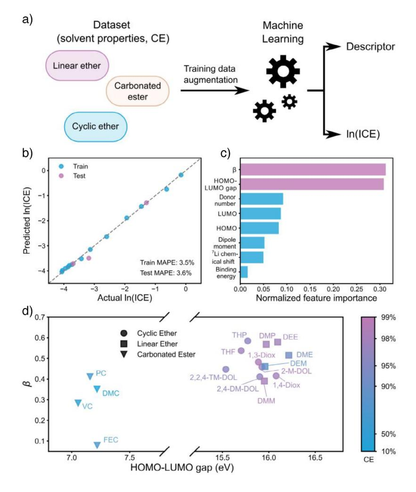
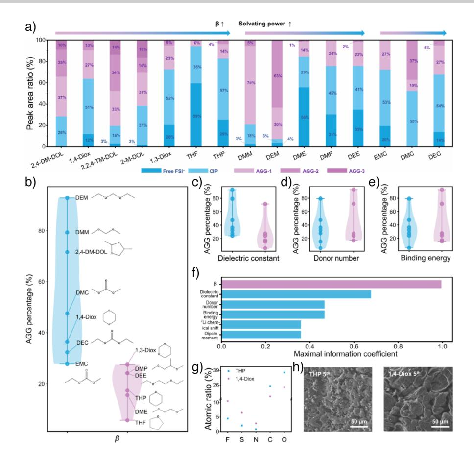
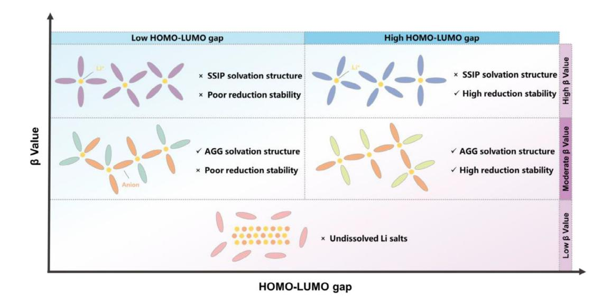
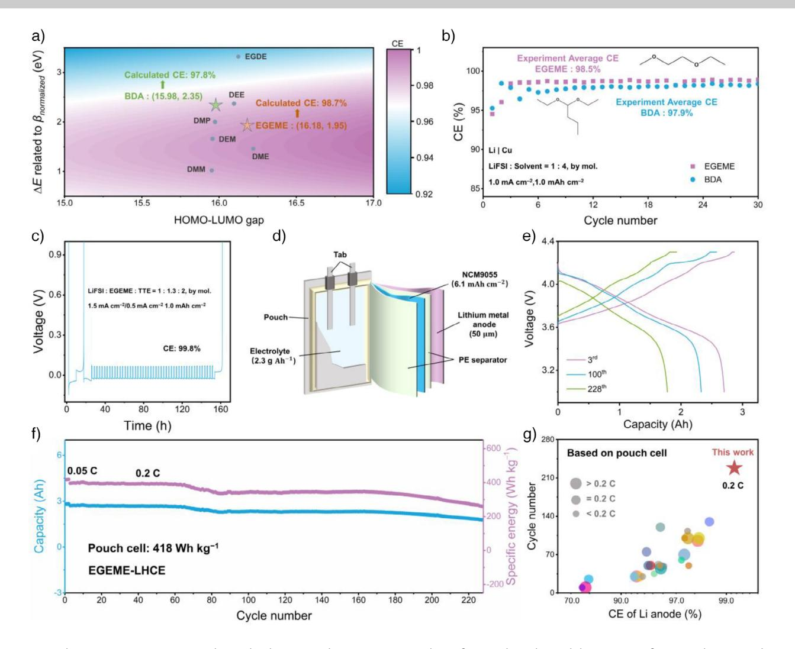

## doi.org/10.1002/anie.202507387 *Batteries Very Important Paper*

Zitierweise: *Angew. Chem. Int. Ed.* **2025**, *64*, e202507387

# **Deciphering Coulombic Efficiency of Lithium Metal Anodes by Screening Electrolyte Properties**

*Zhao Zheng*+*, Xinyan Liu*+*, Xue-Qiang Zhang,\* Shu-Yu Sun, Jia-Lin Li, Ya-Nan Wang, Nan Yao, Dong-Hao Zhan, Wen-Jun Feng, Hong-Jie Peng, Jiang-Kui Hu, Jia-Qi Huang, and [Qiang Zhang\\*](https://orcid.org/0000-0002-3929-1541)*

**Abstract:** Coulombic efficiency (CE) is a quantifiable indicator for the reversibility of lithium metal anodes in high-energydensity batteries. However, the quantitative relationship between CE and electrolyte properties has yet to be established, impeding rational electrolyte design. Herein, an interpretable model for estimating CE based on data-driven insights of electrolyte properties is proposed. Hydrogen-bond acceptor basicity (β) and the energy level gap between the lowest unoccupied and the highest occupied molecular orbital (HOMO-LUMO gap) of solvents are identified as the top two parameters impacting CE by machine learning. β and HOMO-LUMO gap of solvents govern anode interphase chemistry. A regression model is further proposed to estimate the CE based on β and HOMO-LUMO gap. Using the new solvent screened by above regression model, the lithium metal anode in the pouch cell with an energy density of 418 Wh kg−1 achieves the highest CE of 99.2%, which is much larger than previous CE ranging from 70%–98.5%. This work provides a reliable interpretable quantitative model for rational electrolyte design.

## *Introduction*

Rechargeable batteries with high energy density have attracted great interest due to their strong demand in the fields of electric vehicles and portable electronic devices.[\[1,2\]](#page-8-0) The energy density of lithium (Li)-ion batteries is approaching the ceiling of 350 Wh kg−1. In pursuit of a high energy density of over 400 Wh kg−1, Li metal batteries, equipped with

E-mail: [zhang-qiang@mails.tsinghua.edu.cn](mailto:zhang-qiang@mails.tsinghua.edu.cn)

Institute of Fundamental and Frontier Sciences, University of Electronic Science and Technology of China, Chengdu 611731, P.R. China

Dr. X.-Q. Zhang, J.-L. Li, Y.-N. Wang, D.-H. Zhan, J.-K. Hu, Prof. J.-Q. Huang

Advanced Research Institute of Multidisciplinary Science, Beijing Institute of Technology, Beijing 100081, P.R. China E-mail: [zhangxq@bit.edu.cn](mailto:zhangxq@bit.edu.cn)

The Innovation Center for Smart Solid State Batteries, Yibin 644002, P.R. China

Prof. Q. Zhang

Institute for Carbon Neutrality, Tsinghua University, Beijing 100084, P.R. China

Additional supporting information can be found online in the Supporting Information section

Li metal anodes, are revived.[\[3–5\]](#page-8-0) However, the short cycle life of Li metal batteries, which derives from the poor reversibility of Li metal anodes during repeated plating and stripping cycles, hinders their applications in practical scenarios.[\[6,7\]](#page-8-0) The Coulombic efficiency (CE) of Li metal anodes, defined as the strippable fraction of deposited Li, is most widely employed as the key quantifiable indicator of its reversibility.[\[8,9\]](#page-8-0)

The low CE of Li metal anodes is ascribed to the continuous formation of inactive Li, including the Li-containing components in solid electrolyte interphase (SEI, inactive Li+) and metallic Li wrapping by SEI (inactive Li0).[\[10\]](#page-8-0) The formation of inactive Li0 and Li+ is dictated by the uniformity and passivation capability of SEI, respectively, of which the modulation is crucial to achieve high CE for Li metal anodes.[\[11\]](#page-8-0) As a passivation film between the electrolyte and anode, SEI is derived from the spontaneous decomposition of electrolytes on Li metal anodes, and thus electrolyte properties have a notable impact on CE.[\[12–15\]](#page-8-0) However, the design and formulation of electrolytes to improve CE have been so far primarily based on the trialand-error approach, which is time- and resource-consuming. Establishing fundamental relationships between quantifiable electrolyte properties and CE is imperative to facilitate the exploration of novel electrolytes.

As a chief component of electrolytes, solvent plays a crucial role in modulating electrolyte properties, and solvent screening has been identified as a pivotal strategy for electrolyte design. At the present stage, various solvent properties, such as dielectric constant,[\[16,17\]](#page-8-0) dipole moment,[\[18,19\]](#page-8-0) binding energy to Li+, [\[20,21\]](#page-8-0) donor number (DN),[\[22,23\]](#page-8-0) the lowest unoccupied molecular orbital (LUMO) energy level,[[24\]](#page-8-0) the highest occupied molecular orbital (HOMO) energy level,[\[24\]](#page-8-0) HOMO-LUMO gap,[\[25\]](#page-8-0) and so on

[\*] Dr. Z. Zheng+, S.-Y. Sun, N. Yao, W.-J. Feng, Prof. Q. Zhang Beijing Key Laboratory of Complex Solid State Batteries & Tsinghua Center for Green Chemical Engineering Electrification, Department of Chemical Engineering, Tsinghua University, Beijing 100084, P.R. China

Dr. X. Liu+, Prof. H.-J. Peng

J.-K. Hu

[ +] Both authors contributed equally to this work.

have been separately employed as the indicator of the solvent with high CE. However, it remains yet to be established for a reliable and comprehensive quantitative relationship between solvent properties and CE of Li metal anodes. Two reasons account for the absence of a quantifiable relationship. On the one hand, as an indispensable piece of solvent properties, the solvating power is not quantified with high precision. However, the related solvation structure of Li+ has a vital impact on the components and structure of SEI, which govern the uniformity and passivation capability of SEI. On the other hand, the impact of solvent properties on CE is complex, and the importance of each solvent property on CE fails to be figured out quantitatively. If a comprehensive database of solvent properties, including the key descriptors of solvating power, and a quantitative relationship between these properties and CE can be established, the calculation of CE from easily accessible properties will streamline the rational design of electrolytes with high CE, offering an efficient alternative to conventional electrochemical cycling experiments.

In this contribution, an interpretable model to estimate CE of Li metal anodes is presented. The hydrogen-bond acceptor basicity (β), also known as Kamlet–Taft Lewis basicity, which describes the solvating power of solvents, serves as an experimentally measurable property and is supplemented to the database encompassing a variety of well-documented solvent properties. Machine learning (ML) methods are utilized to analyze the contribution of various solvent properties in determining the CE of Li metal anodes. β and HOMO-LUMO gap are found to be the top two properties, which can be further rationalized through spectroscopic investigation of solvation structures and interfacial chemistry. Furthermore, a manageable regression model is proposed to estimate the CE of Li metal anodes based on β and HOMO-LUMO gap. The solvent with a moderate β*normalized* (0.45–0.65) and a high HOMO-LUMO gap (>16.9 eV) is preferable for high CE. In particular, new solvents are explored to evaluate the calculation accuracy of the regression model. The calculated CE of ethylene glycol ethyl methyl ether (EGEME) and butylaldehyde diethyl acetal (BDA)-based electrolytes align well with the experimental CE. EGEME-based localized high-concentration electrolyte (LHCE) achieves a superior CE of 99.2% than other electrolytes in pouch cells and enables the pouch cell of 418 Wh kg−1 with stable cycling for 228 cycles.

### *Results and Discussion*

### *Quantifiable Indicator of Solvent Solvating Power*

The solvating power of solvents mainly dictates the solvation structure of Li+ in electrolytes. The components in the solvation structure have a higher probability of approaching Li metal anodes and further dominate SEI components.[\[26,27\]](#page-8-0) Quantifying the solvating power of solvents emerges as a key challenge in the field. Relative solvating power obtained by internally referenced diffusion-ordered spectroscopy technique and the change of solvation energy obtained by potentiometric measurement have been employed to describe the solvating power of solvents.[\[28–30\]](#page-8-0) However, the two measurement methods fail to be widely used due to their complexity. Considering the convenience of data acquisition and the potential for broad applications, 7Li chemical shift[\[31\]](#page-9-0) and DN[\[32\]](#page-9-0) are generally used to characterize the solvating power of various solvents. However, their accuracy in describing the solvating power of solvents remains uncertain.

Considering the ease of accessibility and the analogy between hydrogen bond and Li bond, β, a new quantifiable indicator for the solvating power of solvents, was used in this work. β reflects the hydrogen bond interaction between probes and solvents, which is analogous to the interaction between Li+ and solvent molecules in electrolytes.[\[33\]](#page-9-0) β is obtained by the solvatochromic comparison method solely requiring a UV–vis spectrophotometer, which is widely accessible in general chemistry laboratories. In particular, *p*nitrophenol (abbreviated as p-NP) with the hydroxy group (─OH) and 4-nitroanisole (abbreviated as 4-NA) with the methoxy group (─O─CH3) as the pair of probes were selected to measure β for their availability and low toxicity. p-NP and 4-NA are structurally similar except for the extra hydrogen bond site in p-NP (Figure [1a\)](#page-2-0). Specially, p-NP exhibits both hydrogen bond and van der Waals interactions with solvents while 4-NA only retains van der Waals interaction with solvents. Using UV–vis spectrophotometer, maximum absorption wavenumber of 4-NA and p-NP, *v*max,exp(4-NA), and *v*max,exp(p-NP), can be obtained, reflecting the stabilization energy of probes in solvents by single van der Waals interaction and the combination of van der Waals interaction and hydrogen bond interaction, respectively. Maximum absorption wavenumber of p-NP in solvents only by van der Waals interaction, *v*max,cal(p-NP), can be calculated by the linear correlation obtained from the spectroscopic results of nonpolar solvents. Hence, the normalized difference between *v*max,cal(p-NP) and *v*max,exp(p-NP), which refers to β, can reflect the stabilization energy of probes in the solvents induced by hydrogen bond interaction (Figure [1b\)](#page-2-0). More calculation details for β are provided in the experimental sections of Supporting Information.

The β of fluor-ethers, cyclic ethers, linear ethers, and carbonated esters (25 solvents in total), which are commonly used in Li metal batteries, were measured (Figures S1–S4) and are summarized in Figure [1c](#page-2-0) and Table S1. All β were measured for three times to obtain the average value and standard deviation. It can be observed that β of fluoroethers are lower than nonfluorinated ethers and carbonated esters, suggesting that fluorination notably diminishes the solvating power of solvents due to its electron-withdrawing effect.[\[34\]](#page-9-0) This observation aligns with the general trend from experimental data. In addition, β of ethers is higher than that of carbonated esters and there is no notable difference between cyclic and linear ethers. Therefore, from a qualitative perspective, β can serve as an indicator to discern the variations in the solvating power among different solvents. In addition, the chemical shift of 7Li in various solvents and the DN of solvents are also summarized in Table S2 and the details of data collection are listed in Supporting Information (Figures S5–S8).

## *Forschungsartikel*

*Figure 1.* The measurement principles of β and specific β for various solvents. a) Molecular structure of probes used for calculating β and the interaction types between probes and solvents. b) Schematic diagram of the calculation method of β through UV–vis measurements. c) Summary of β at room temperature for typical fluoro-ethers (green region), cyclic ethers (blue region), linear ethers (purple region), and carbonated esters (brown region). β are represented as mean of the three test values with standard deviation as error bars.

Although the solvating power of solvents is an important parameter, it is not the only property that may impact the CE of Li metal anodes. Hence, more solvent properties related to CE were also included to build a comprehensive database (Table S3). First, dipole moment and binding energy to Li+ have been previously proposed as important solvent properties influencing the CE of Li metal anodes. In addition, the chemical stability, which determines the decomposition reactivity of solvents on Li metal anodes, also plays an important role in the formation process of SEI and further determines the CE of Li metal anodes. Based on molecular orbital theory, the ability of a solvent to lose and receive electrons is highly related to its LUMO and HOMO energy level, respectively. At present, LUMO energy level, HOMO energy level, and HOMO-LUMO gap are generally used to compare the chemical stability of solvents. Density functional theory calculations were employed to quantitatively analyze the LUMO energy level, HOMO energy level, and HOMO-LUMO gap of various solvents (Table S4). Therefore, a database of solvent properties related to CE is constructed, laying a solid foundation for data-driven exploration of the electrolyte property–CE relationship.

#### *Identifying Key Solvent Properties in Dictating CE by Machine Learning*

To establish the fundamental relationship between solvent properties and the reversibility of Li metal anodes, the CE of Li | Cu half cells in various electrolytes (Li bis(fluorosulfonyl)imide (LiFSI):solvents = 1:10, by mol.) were rigorously evaluated. The current density and capacity were set to 1.0 mA cm−2 and 1.0 mAh cm−2, respectively. The average CE from the 1st to 30th cycle, which can avoid the influence of electrolyte depletion, were used to represent the CE of Li metal anodes in various solvents. For each solvent, more than four cells were evaluated to provide CE data statistics. Detailed CE data and calculated average CE are listed in Figures S9–S11 and S12, respectively.

Based on the high-quality database encompassing various solvent properties and CE, a universal ML-based method was proposed to leverage suitable solvent properties, including β, 7Li chemical shift, DN, dipole moment, the binding energy of a solvent with a Li+, the energy levels of LUMO and HOMO, and the HOMO-LUMO gap, as feature inputs for the prediction of CE (Figure [2a\)](#page-3-0). The logarithm of Coulombic inefficiency, ln(ICE) = ln(1 − CE), was set as the prediction target due to its direct relation to the cycle life of Li metal batteries with limited excessive Li. More importantly, a mathematic transformation from CE to ln(ICE) results in a more uniform distribution of data across a relatively large space (Figure S13). It is noted that none of the above features presents a sufficiently high linear correlation with ln(ICE), indicating the necessity of building a more comprehensive model to describe the fundamental relationship beyond linear scaling (Figure S14). A gradient boosting decision tree model[\[35\]](#page-9-0) was thereby built for ln(ICE) prediction with roughly 80% of the data adopted for model training while the

Figure 2. Importance analysis for the impact of solvent properties on CE of Li metal anodes. a) Schematic diagram of machine learning workflow. b) Parity plot between the actual and predicted In(ICE) of Li metal anodes in the training and test set. c) Feature importance ranking analysis of solvent properties on influencing the CE of Li metal anodes. d) Summary of  $\beta$ , HOMO-LUMO gap, and CE of various solvents.

remaining 20% for testing (Table S5). Specifically, to quantify the model's performance on all types of electrolytes considered, we ensured each category (i.e., cyclic ether, linear ether, and carbonated ester) contained a test electrolyte. To improve the model performance, the training data was then augmented based on the mean and standard deviation of feature inputs (see Supporting Information for more details). The model exhibits satisfactory prediction accuracy for ln(ICE) with mean absolute percentage errors (MAPEs) for training and testing of  $3.5\%$  and  $3.6\%$  (Figure 2b), respectively, and good model generality across different types of electrolytes.

In addition to the predictability, the ML model also offers insights into the most significant solvent properties to describe the reversibility of Li metal anodes. Although all the considered properties can be intuitively related to the solvating power or chemical stability of solvents, the feature importance ranking analysis explicitly reveals that  $\beta$  and HOMO-LUMO gap are the top two properties profoundly influencing the CE of Li metal anodes (Figure 2c). The superiority of  $\beta$  in describing solvating power of a solvent can be rationalized through the similarity between the interactions of target-probe molecule in  $\beta$  testing system and the interactions of solvent–Li+ in electrolytes.  $\beta$  reflects the hydrogen bond interaction between target molecules as a solvent and the hydroxy group  $(-OH)$  of probe molecule.[36] The atom size of the hydrogen atom in  $-OH$  is similar to that of a Li ion. Moreover,  $\beta$  reflects the bulk property of the target molecule. Considering that Li ions in the electrolyte interact with the bulk solvents to undergo dissolution, dissociation, and solvation processes, the role of target molecule in the  $\beta$ testing system is similar to the role of solvent in electrolyte. In comparison, DN was found less ideal, as it employs antimony pentachloride which presents a larger size discrepancy, compared with either  $Li^+$  or the OH-containing probe molecule, to assess the interactions with solvents. Meanwhile, DN is assessed for an isolated base molecule in a weakly interacting solvent. Dipole moment, on the other hand, is generated from the isolated models that do not take into account intermolecular interactions.[37] As for the binding energy, only the interaction between one solvent molecule and one  $Li^+$  is considered, while the collective dynamic behaviors involving multiple solvent complexations and the competitive solvent–solvent interaction are undesirably neglected.[\[38\]](#page-9-0) In terms of dictating the solvent stability, the higher importance of HOMO-LUMO gap than the LUMO energy level of pure solvent reveals the higher relevance of ion−solvent complex than pure solvent.[\[39\]](#page-9-0) Since the HOMO energy level describes the tendency of a solvent molecule to donate electron to an acceptor (e.g., Li+), the change in LUMO energy level upon ion–solvent complexation reasonably correlates with the HOMO energy level of pure solvent (Figure S15). Therefore, HOMO-LUMO gap is shown to be more deterministic than the LUMO energy level according to the ML model. Owing to the availability of frontier molecule orbital properties of pure solvents in existing databases, the composite descriptor, HOMO-LUMO gap, can serve as an accessible alternative to the LUMO energy level of ion–solvent complex without additional quantum chemical calculation.

The influence of β and HOMO-LUMO gap on CE is further visualized in Figure [2d.](#page-3-0) Carbonated esters all exhibit low CE, along with their HOMO-LUMO gap all being lower than 7.5 eV. The CE in this case is insensitive to β. In contrast, for cyclic and linear ethers generally possessing a higher redox stability (HOMO-LUMO gap >15.5 eV), their CE are largely influenced by both β and HOMO-LUMO gap, with such influence being nonmonotonic and specific to the category of ethers. For instance, a moderate β of around 0.5 corresponds to high CE for cyclic ethers (e.g., 1,3-diox and 2- M-DOL) albeit the lowest CE of DEM among linear ethers. Enlarging the HOMO-LUMO gap, namely enhancing solvent stability, does not necessarily result in a high CE, especially for linear ethers (e.g., DME). All these complex patterns not only highlight the adequacy of as-proposed ML model to accurately quantify CE from multiple properties, but also point out the necessity of further model rationalization and insight extraction.

### *The Rationalization of Key Solvent Descriptors in Dictating CE*

To rationalize the machine learnt patterns that β is highly deterministic to CE performance, solvation structure information, anticipated as a bridge between solvent properties and apparent CE performance, was collected using Raman spectroscopy. As shown in Figures S16–S18, the bending signal of S─N─S in FSI− anion can be identified between 700 and 800 cm−1, offering fingerprint information regarding specific solvation structures; free anion (FA, non-coordinated FSI−), contact ion pair (CIP, one FSI− binding with one Li+), ion aggregate with different sizes (AGG-1, AGG-2, and AGG-3, one FSI− binding with two or more Li+) exhibit Raman shift from low to high.[\[40\]](#page-9-0) According to the peak area[\[41\]](#page-9-0) the proportions of above species in various electrolytes (LiFSI:solvent = 1:10, by mol.) were calculated and summarized in Figure [3a.](#page-5-0) The proportion of AGG in electrolytes increases with the reduction of β.

To perform a more statistically vigorous analysis, violin plots were adopted to quantify distributions of AGG percentages of various solvents with respect to parameters characterizing solvating power. The parameters include the model-allocated β (Figure [3b\)](#page-5-0) and other common descriptors, including dielectric constant, DN, Li+ binding energy, 7Li chemical shift, and dipole moment (Figures [3c–e](#page-5-0) and S20). It is shown that when halving all molecules in the order from the highest to the lowest values of the property, β enables complete separation of molecules into two groups possessing either a high AGG percentage (>27%) or a low AGG percentage (<27%, Figure [3b\)](#page-5-0); while using other properties, the distributions of AGG percentage all overlap to some extent, indicating the inferiority of these properties in describing the favorable AGG formation in the electrolyte (Figures [3c–e](#page-5-0) and S20). Further evaluation using maximal information coefficient (MIC, 0∼1),[\[42\]](#page-9-0) a measure of dependence for two-variable relationships with excellent equitability and generality, indicates that β has the highest MIC (0.996) with AGG percentage among all considered parameters, substantiating the statistical superiority of β in dictating Li+ solvation structures (Figure [3f\)](#page-5-0).

Furthermore, the anode/electrolyte interface was investigated in terms of SEI composition and Li deposition morphology to identify the comprehensive impact mechanism of solvent properties on CE. Specifically, SEI on Li metal anodes at the 5th deposition in Li | Cu cells using THPand 1,4-diox-based electrolytes were analyzed for the distinct CE of Li metal anodes in the two electrolytes. Based on Xray photoelectron spectroscopy (XPS), the atomic ratios of C, O, F, S, and N at different sputtering times are shown in Figure S21. Among 0–120 s sputtering time, the average atomic ratio of F, mainly derived from the decomposition of FSI−, is 4.5% in THP-based electrolytes while the atomic ratio of F in 1,4-diox-based electrolytes is 10.5% (Figure [3g\)](#page-5-0). Meanwhile, the atomic ratio of C, which is mainly derived from the decomposition of solvents, shows a decreased trend when comparing 1,4-diox- (15.9%) to THP-based electrolytes (25.2%). Both the increased F concentration and reduced C concentration in SEI imply that more FSI− and less solvents participate in the formation process of SEI in 1,4-diox-based electrolytes compared with THP-based electrolytes. From F 1 s spectra, it can be observed that LiF dominate the Fcontaining components (Figure S22), and more LiF tends to promote denser and more uniform Li deposition.[\[43,44\]](#page-9-0) As shown in Figure [3h,](#page-5-0) the morphology of Li deposition at the 5th cycle is detected by scanning electron microscopy (SEM), in which mound-like structure can be identified in 1,4-dioxbased electrolyte, but wire-like deposition Li is observed in THP-based electrolyte. The CE of THP and 1,4-diox-based electrolytes are 96.7% and 97.9%, respectively. Benefiting from the synergistic effect of appropriate solvating power and high chemical stability of solvents, 1,4-diox-based electrolytes are more inclined to form anion-derived SEI compared with that based on THP-based electrolytes, further contributing to enhancing the CE of Li metal anodes.

The mechanism of β and the HOMO-LUMO gap of solvents to regulate CE is described in Figure [4.](#page-5-0) For solvents with high β and low HOMO-LUMO gap, SSIP dominates the solvation structure due to the high β of solvents, which is unfavorable for the formation of anion-derived SEI with superior uniformity and passivation capability. Moreover, the solvents have poor reduction stability at the anode/electrolyte interface, resulting in the rapid and continuous decomposition

# *Forschungsartikel*

*Figure 3.* The mechanism of solvent properties affecting CE of Li metal anodes. a) The ratio of free FSI–, CIP, AGG-1, AGG-2, and AGG-3 in various electrolytes based on the corresponding peak area ratio in Raman spectra. b)–e) Violin plots for distributions of AGG percentages of various solvent molecules with respect to b) β, c) dielectric constant, d) donor number, and e) binding energy. f) Maximal information coefficient of various solvating power-related solvent properties in dictating solvation structures of electrolytes. g) The atomic ratios of F, S, N, C, and O element in SEI on Li metal anode at the 5th discharging. h) The SEM images of deposited Li at the 5th discharging in THP-based electrolytes (left) and 1,4-diox-based electrolytes (right).

#### *Figure 4.* Schematic diagram of the effect of the β and HOMO-LUMO gap on electrolyte solvation structure and the CE of Li metal anodes. β dictates the solvating power of solvents and then solvation structure of electrolytes. HOMO-LUMO gap determines the stability of solvent against Li metal anodes. The solvent with a moderate β and a larger HOMO-LUMO gap is favorable for Li metal anodes with high CE.

of solvents, which deteriorates CE. For solvents with moderate  $\beta$  and low HOMO-LUMO gap, more anions can participate in the solvation structure of  $Li^+$ , leading to the formation of AGG solvation structure and promoting the construction of anion-derived SEI. However, the solvents with poor reduction stability inevitably permeate SEI and contact with Li metal anodes, inducing the loss of active Li and further decreasing CE. For solvents with high  $\beta$  and high HOMO-LUMO gap, the reduction stability of solvents is improved, however, SSIP dominates the solvation structure and anion-derived SEI cannot form, which is not favorable to improve SEI uniformity and passivation capability. For solvents with moderate  $\beta$  and high HOMO-LUMO gap, AGG domains solvation structure and anion-derived SEI forms. Meanwhile, the improved reduction stability of solvents can mitigate the reactions between Li metal anodes and solvents although solvents inevitably permeate SEI and contact with Li metal anodes. The above two aspects together ensure the high CE of Li metal anodes. For solvents with low  $\beta$ , a normal electrolyte cannot be achieved because the Li salts cannot be dissolved in the solvents with low  $\beta$ .

### **Establishing a Quantitative Regression Model for Screening New Solvents**

In practical applications of Li metal batteries, a relatively high concentration of Li salts is typically required to form a stable SEI, which generally results in high cycling stability of Li metal batteries.[45,46] Linear ether solvents are well-known for their high solubility of Li salts, enabling the formulation of high-concentration electrolytes (HCEs) which makes them promising candidates to construct highperformance electrolytes for Li metal batteries.[47] Hence, typical linear ether-based electrolytes with relatively high Li salt concentration (LiFSI:solvent = 1:4, by mol.) were constructed. From the data of Raman spectra, it is observed that the proportion of AGG in the electrolyte increases at higher salt concentrations (Figures S23–S25), contributing to the formation of stable SEI (Figures  $$26–$29$ ) and the enhancement of the cycling stability of Li metal anodes (Figures S30 and S31).

Furthermore, a manageable quantitative regression model, that correlates CE of Li metal anodes with the two ML-inspired solvent properties,  $\beta$  and HOMO-LUMO gap, is established based on HCEs. Both the type of solvation structure of Li ions, which is mainly dictated by the solvating power of solvents, and the amount of the solvation structure of Li ions near anode surface determines the components and structure of SEI. When various solvents exhibit the same  $\beta$  but different molecular weights and densities, the amount of the solvation structure of Li ions near anode surface is different in the same volume of electrolytes with various solvents. Therefore, normalizing the  $\beta$  by relative molecular weight and density of solvent is conducive to distinguish various solvents with the same  $\beta$  but different molecular weights and densities. Hence,  $\beta$  is normalized, defined as  $\beta_{\text{normalized}}$ , with the molecular weight and density of the solvent (DME as reference) to

expand the applications of quantitative regression model for various solvents. To ensure the same dimensionality of the two parameters,  $\beta$  is converted to energy-related parameter by the relation between wavelength and energy:  $E = hc / \lambda$ and  $\lambda = constant / \beta$ , where *h* is Planck constant, *c* is the velocity of light,  $\lambda$  represents wavelength (see Supporting Information for more details). The obtained energy-related parameter based on  $\beta$  is defined as  $\Delta E_{related \text{ to } \beta normalized}$ , which exhibits the same dimension (eV) with the HUMO-LOMO gap.  $\Delta E_{related \ to \ βnormalized}$  and HOMO-LUMO gap are regressed simultaneously to the averaged CE of Li metal anodes using Max implementation optimization arithmetic of 1stOpt software. Consequently,  $z = a + bx^2 + cy^2 + dxy$  type regression function, in which *x* refers to  $\Delta E_{related to \beta normalized}$ , *y* represents HOMO-LUMO gap, and  $z$  is CE, is screened out to satisfy the following three factors:

1. Good fitting precision: the correlation coefficient of regression analysis is higher than  $0.90$ ;

2. Logical characteristics of function: CE cannot monotonically decrease with  $\Delta E_{related to \beta normalized}$  or HOMO-LUMO gap according to domain knowledge;

3. CE calculated in the value range of  $\Delta E_{related \text{ to } \beta\text{normalized}}$ and HOMO-LUMO gap should not exceed 100%.

Specially, the formulas of  $z = 0.926 + 0.000134x^2$  $-0.0126y^2 + 0.00232xy$  is constructed to quantitatively describe the correlation between solvents' properties and CE of Li metal anodes, and the corresponding regression phase diagram is shown in Figure 5a. Obviously, when the solvating power of solvent is fixed, improving the chemical stability (i.e., enlarging the HOMO-LUMO gap) of solvent in the electrolyte is beneficial to the enhancement of CE. Meanwhile, a moderate  $\Delta E_{related to \beta normalized}$ , corresponding to a moderate  $\beta_{normalized}$ , is preferred to elevate the CE of Li metal anodes at a certain HOMO-LUMO gap. Accordingly, the solvent with a high HOMO-LUMO gap ( $>16.9$  eV) and a moderate  $\beta_{normalized}$  (0.45–0.65), which has potential to support a CE higher than 99.5% under the electrolyte formulation of LiFSI:solvent  $= 1:4$ , by mol., is considered as ideal linear ether candidate for high-CE electrolytes.

The above manageable quantitative regression model can therefore enable the calculation of CE using solely two accessible solvent properties, offering a quantitative electrolyte design strategy for Li metal anodes. As homologues of representative linear ether (DME), ethylene glycol ethyl methyl ether (EGEME for short) and 1,1-diethoxybutane (BDA for short) that are less commonly used for electrolytes of Li metal batteries, are adopted to verify the accuracy of the regression equation in estimating CE. Specially, EGEME presents a HOMO-LUMO gap of 16.18 eV and a  $\Delta E_{related\ to\ βnormalized}$  of 1.476 eV (corresponding to  $\beta_{normalized}$  of 0.682), and BDA presents a HOMO-LUMO gap of 15.98 eV and a  $\Delta E_{related\ to\ βnormalized}$  of 2.348 eV (corresponding to  $\beta$ normalized of 0.820, Figures 5a and S32). CE of Li | Cu cells with the electrolytes of LiFSI:EGEME or  $BDA = 1:4$ , by mol. under current density of 1.0 mA  $\text{cm}^{-2}$  and capacity of 1.0 mAh cm $-2$  was measured (Figure 5b). The experimental average CE from the 1st to 30th cycle is 98.5% for EGEME and 97.9% for BDA, which is close to the estimated CE (98.7% for EGEME and 97.8% for BDA) calculated by

**Forschungsartikel** 

*Figure 5.* The quantitative regression relationship between solvent properties and CE of Li metal anodes and the screening for new solvents. a) The heat map for the quantitative regression relationship of  $\beta_{normalized}$  and HOMO-LUMO gap to CE for linear ethers. b) CE of Li | Cu half cells in the electrolyte of LiFSI:EGEME and BDA = 1:4, by mol. c) Modified Aurbach's measurement profile of Li | Cu cell with EGEME-based LHCE. d) Schematic illustration of Li | NCM9055 pouch cell of 418 Wh kg-1. e) Galvanostatic charge–discharge profiles of Li | NCM9055 pouch cell at the 3rd, 100th, and 228th cycle. f) Cycling performance of Li  $|$  NCM9055 pouch cell at 0.1C charge / 0.2C discharge after two formation cycles. g) The comparison of cycle number, CE of Li metal anodes, and discharge rate of Li metal pouch cells reported in previous publications and this work. Discharge rate >0.2 C (big circles), discharge rate = 0.2 C (middle circles), Discharge rate  $<$ 0.2 C (small circles).

the quantitative regression function, verifying the rationality and accuracy of the above model. Based on Raman spectra and SEM data, AGG dominates solvation structure and mound-like Li deposition morphology can be observed in EGEME-based HCE (Figures S33 and S34). As an advance of HCEs, LHCEs retain the favorable solvation structure of AGG while circumventing the drawbacks associated with high salt concentrations, such as poor wettability and increased viscosity.[48] Considering the substantial CE of EGEME in formulation of LiFSI:solvent =  $1:4$ , by mol., salt concentration optimization and LHCE strategies are employed to optimize the EGEME electrolyte system for designing high-CE electrolyte for Li metal anodes. By modified Aurbach method, the experimental average CE of Li | Cu half cell reaches up to 99.8% in EGEME-based LHCE (LiFSI:EGEME:HFE = 1:1.3:2, by mol.), which is superior compared with previous reports (Figure 5c and Table S6).

To evaluate the performance of EGEME-based LHCE practical conditions, Li | LiNi0.9Co0.05Mn0.05O2 under (NCM9055) pouch cell was additionally assembled using high-loading NCM9055 cathode (6.1 mAh  $cm^{-2}$ ), ultrathin Li metal anodes (50  $\mu$ m), and lean electrolyte (2.3 g (Ah)-1, Figures 5d and S35). Taking masses of all components in pouch cell into consideration for the calculation of energy density, an energy density of 418 Wh  $kg^{-1}$  is achieved along with the capacity of 2.82 Ah, and the detailed parameters of the pouch cell are summarized in Table S7. As shown in Figure 5e,f, the pouch cell achieves a capacity retention of 65.8% after 228 cycles at 0.1 C charge / 0.2 C discharge. Compared with the CE of Li metal anodes  $(70\%-98.5\%)$  in previously reported Li | NCM pouch cells (see Table S8 for the formula and more detailed parameters used to calculate the average CE), the CE of Li metal anodes achieve 99.2% in pouch cells with EGEME-based LHCE, which support a remarkable cycle life of 228 (Figure [5g\)](#page-7-0). These results underscore the promising application potential of EGEME in practical Li metal batteries and verify the effectiveness of the quantitative regression model.

### *Conclusion*

An interpretable quantitative model to estimate CE was established and further guide the screening of solvents for high-performance electrolytes in Li metal batteries. Based on ML method, β and HOMO-LUMO gap of solvents are identified as the top two parameters profoundly impacting CE. In particular, β reflects the solvating power of solvent to Li ions, determining the solvation structure of electrolytes while HOMO-LUMO gap describes the stability of solvents. The solvating power governs the appearance probability of solvent molecules on Li metal anodes while the stability reflects the decomposition reactivity of solvent molecules, together, determining the formation of stable SEI and then the CE of Li metal anodes. Moreover, a manageable quantitative regression model, that correlates the CE of Li metal anodes with the two ML-inspired solvent properties, β and HOMO-LUMO gap, was established. Accordingly, the solvents with a high HOMO-LUMO gap (>16.9 eV) and a moderate β*normalized* (0.45–0.65) are the ideal candidates for high-CE electrolytes. A new solvent molecule, EGEME, was then screened to improve CE of Li metal anodes. In coin cell, EGEME-based LHCE enables high CE value of 99.8%. In particular, the Li metal anode delivers a record-breaking CE (99.2%) in the pouch cell using EGEMEbased LHCE. This work identifies the key solvent properties influencing the CE of Li metal anodes and further establishes the quantitative regression model between them, which can effectively promote the rational design of high-performance electrolytes.

## *Acknowledgements*

This work was supported by National Key Research and Development Program (2021YFB2500300), National Natural Science Foundation of China (22393900, 22393903, 22425901, 22209010, 22379013, 22309100, and 22379021), Beijing Municipal Natural Science Foundation (L233004), Tianjin Natural Science Foundation (23JCZDJC00130), and the China Postdoctoral Science Foundation (2024M751708).

## *Conflict of Interests*

The authors declare no conflict of interest.

## *Data Availability Statement*

The data that support the findings of this study are available from the corresponding author upon reasonable request.

**Keywords:** Coulombic efficiency • Electrolyte properties • Lithium metal batteries • Machine learning • Pouch cell

- [1] D. Larcher, J. M. Tarascon, *Nat. Chem.* **2015**, *7*, 19–29.
- [2] J. M. Tarascon, M. Armand, *Nature* **2001**, *414*, 359–367.
- [3] T. Placke, R. Kloepsch, S. Dühnen, M. Winter, *J. Solid State Electrochem.* **2017**, *21*, 1939–1964.
- [4] W. Cao, J. Zhang, H. Li, *Energy Storage Mater.* **2020**, *26*, 46–55.
- [5] Y.-W. Song, L. Shen, X.-Y. Li, C.-X. Zhao, J. Zhou, B.-Q. Li, J.-Q. Huang, Q. Zhang, *Nat. Chem. Eng.* **2024**, *1*, 588–596.
- [6] M. He, L. G. Hector, F. Dai, F. Xu, S. Kolluri, N. Hardin, M. Cai, *Nat. Energy* **2024**, *9*, 1199–1205.
- [7] C. Niu, D. Liu, J. A. Lochala, C. S. Anderson, X. Cao, M. E. Gross, W. Xu, J.-G. Zhang, M. S. Whittingham, J. Xiao, J. Liu, *Nat. Energy* **2021**, *6*, 723–732.
- [8] J. Xiao, Q. Li, Y. Bi, M. Cai, B. Dunn, T. Glossmann, J. Liu, T. Osaka, R. Sugiura, B. Wu, J. Yang, J.-G. Zhang, M. S. Whittingham, *Nat. Energy* **2020**, *5*, 561–568.
- [9] S.-Y. Sun, X.-Q. Zhang, X.-Y. Yan, Z. Zheng, Q.-K. Zhang, J.-Q. Huang, *EES Batteries* **2025**. [https://doi.org/10.1039/](https://doi.org/10.1039/D4EB00034J) [D4EB00034J.](https://doi.org/10.1039/D4EB00034J)
- [10] C. Fang, X. Wang, Y. S. Meng, *Trends Chem.* **2019**, *1*, 152–158.
- [11] Y. Jiang, B. Wang, P. Liu, B. Wang, Y. Zhou, D. Wang, H. Liu, S. Dou, *Nano Energy* **2020**, *77*, 105308.
- [12] B. Jagger, M. Pasta, *Joule* **2023**, *7*, 2228–2244.
- [13] X.-B. Cheng, R. Zhang, C.-Z. Zhao, F. Wei, J.-G. Zhang, Q. Zhang, *Adv. Sci.* **2016**, *3*, 1500213.
- [14] S.-Y. Sun, X.-Q. Zhang, Y.-N. Wang, J.-L. Li, Z. Zheng, J.-Q. Huang, *Mater. Today* **2024**, *77*, 39–65.
- [15] P. Xu, X. Lin, Z. Sun, K. Li, W. Dou, Q. Hou, Z. Zhou, J. Yan, M. Zheng, R. Yuan, Q. Dong, *J. Energy Chem.* **2022**, *72*, 186–194.
- [16] Y.-X. Yao, X. Chen, C. Yan, X.-Q. Zhang, W.-L. Cai, J.-Q. Huang, Q. Zhang, *Angew. Chem. Int. Ed.* **2021**, *60*, 4090–4097; *Angew. Chem.* **2021**, *133*, 4136–4143.
- [17] N. Yao, X. Chen, X. Shen, R. Zhang, Z.-H. Fu, X.-X. Ma, X.- Q. Zhang, B.-Q. Li, Q. Zhang, *Angew. Chem. Int. Ed.* **2021**, *60*, 21473–21478; *Angew. Chem.* **2021**, *133*, 24643–21648.
- [18] T. D. Pham, K.-K. Lee, *Small* **2021**, *17*, 2100133.
- [19] K. Chen, X. Shen, L. Luo, H. Chen, R. Cao, X. Feng, W. Chen, Y. Fang, Y. Cao, *Angew. Chem. Int. Ed.* **2023**, *62*, e202312373; *Angew. Chem.* **2023**, *135*, e202312373.
- [20] J. Xu, J. Zhang, T. P. Pollard, Q. Li, S. Tan, S. Hou, H. Wan, F. Chen, H. He, E. Hu, K. Xu, X.-Q. Yang, O. Borodin, C. Wang, *Nature* **2023**, *614*, 694–700.
- [21] Z. Zhu, J. Ji, X. Qi, Y. Ji, Z. Liu, W. Du, Y. Pan, D. Yang, J. Ma, L. Qie, Y. Huang, *Adv. Energy Mater.* **2023**, *13*, 2300936.
- [22] P. Zhou, Y. Xiang, K. Liu, *Energy Environ. Sci.* **2024**, *17*, 8057– 8077.
- [23] J. Chen, Y. Zhang, H. Lu, J. Ding, X. Wang, Y. Huang, H. Ma, J. Wang, *eScience* **2023**, *3*, 100135.
- [24] Q. Wang, Z. Yao, C. Zhao, T. Verhallen, D. P. Tabor, M. Liu, F. Ooms, F. Kang, A. Aspuru-Guzik, Y.-S. Hu, M. Wagemaker, B. Li, *Nat. Commun.* **2020**, *11*, 4188.
- [25] Y. Meng, J. Li, S. Gu, Y. Fu, Z. Wang, J. Liu, X. Gong, *Electrochim. Acta.* **2023**, *449*, 142262.
- [26] S. Perez Beltran, P. B. Balbuena, *J. Power Sources* **2022**, *551*, 232203.
- [27] H. Cheng, Q. Sun, L. Li, Y. Zou, Y. Wang, T. Cai, F. Zhao, G. Liu, Z. Ma, W. Wahyudi, Q. Li, J. Ming, *ACS Energy Lett.* **2022**, *7*, 490–513.
- [28] C.-C. Su, M. He, R. Amine, Z. Chen, K. Amine, *Angew. Chem. Int. Ed.* **2018**, *57*, 12033–12036; *Angew. Chem.* **2018**, *130*, 12209– 12212.
- [29] C.-C. Su, M. He, R. Amine, T. Rojas, L. Cheng, A. T. Ngo, K. Amine, *Energy Environ. Sci.* **2019**, *12*, 1249–1254.

- [30] S. C. Kim, X. Kong, R. A. Vilá, W. Huang, Y. Chen, D. T. Boyle, Z. Yu, H. Wang, Z. Bao, J. Qin, Y. Cui, *J. Am. Chem. Soc.* **2021**, *143*, 10301–10308.
- [31] N. Leifer, D. Aurbach, S. G. Greenbaum, *Prog. Nucl. Mag. Res. Sp.* **2024**, *142–143*, 1–54.
- [32] P. Zhou, W. Hou, Y. Xia, Y. Ou, H.-Y. Zhou, W. Zhang, Y. Lu, X. Song, F. Liu, Q. Cao, H. Liu, S. Yan, K. Liu, *ACS Nano* **2023**, *17*, 17169–17179.
- [33] R. W. Taft, M. J. Kamlet, *J. Am. Chem. Soc.* **1976**, *98*, 2886–2894.
- [34] Y. Zhao, T. Zhou, M. Mensi, J. W. Choi, A. Coskun, *Nat. Commun.* **2023**, *14*, 299.
- [35] F. Pedregosa, G. Varoquaux, A. Gramfort, V. Michel, B. Thirion, O. Grisel, M. Blondel, G. Louppe, P. Prettenhofer, R. Weiss, R. J. Weiss, J. Vanderplas, A. Passos, D. Cournapeau, M. Brucher, M. Perrot, E. Duchesnay, *J. Mach. Learn. Res.* **2011**, *12*, 2825–2830.
- [36] M. J. Kamlet, R. W. Taft, *J. Am. Chem. Soc.* **1976**, *98*, 377–383.
- [37] B. Cui, J. Xu, *J. Mater. Chem. A* **2025**, *13*, 8223–8245.
- [38] X. Chen, X. Q. Zhang, H. R. Li, Q. Zhang, *Batteries Supercaps* **2019**, *2*, 128–131.
- [39] Y.-C. Gao, N. Yao, X. Chen, L. Yu, R. Zhang, Q. Zhang, *J. Am. Chem. Soc.* **2023**, *145*, 23764–23770.
- [40] Y. Yamada, M. Yaegashi, T. Abe, A. Yamada, *Chem. Commun.* **2013**, *49*, 11194.

- [41] L. Suo, D. Oh, Y. Lin, Z. Zhuo, O. Borodin, T. Gao, F. Wang, A. Kushima, Z. Wang, H.-C. Kim, Y. Qi, W. Yang, F. Pan, J. Li, K. Xu, C. Wang, *J. Am. Chem. Soc.* **2017**, *139*, 18670–18680.
- [42] D. N. Reshef, Y. A. Reshef, H. K. Finucane, S. R. Grossman, G. McVean, P. J. Turnbaugh, E. S. Lander, M. Mitzenmacher, P. C. Sabeti, *Science* **2011**, *334*, 1518–1524.
- [43] R. Guo, K.-H. Kim, B. M. Gallant, *J. Electrochem. Soc.* **2022**, *169*, 100523.
- [44] T. Li, X.-Q. Zhang, P. Shi, Q. Zhang, *Joule* **2019**, *3*, 2647–2661.
- [45] L. Suo, Y.-S. Hu, H. Li, M. Armand, L. Chen, *Nat. Commun.* **2013**, *4*, 1481.
- [46] H. Wan, J. Xu, C. Wang, *Nat. Rev. Chem.* **2024**, *8*, 30–44.
- [47] Y. Chen, Z. Yu, P. Rudnicki, H. Gong, Z. Huang, S. C. Kim, J.-C. Lai, X. Kong, J. Qin, Y. Cui, Z. Bao, *J. Am. Chem. Soc.* **2021**, *143*, 18703–18713.
- [48] Z. Wu, R. Li, S. Zhang, L. lv, T. Deng, H. Zhang, R. Zhang, J. Liu, S. Ding, L. Fan, L. Chen, X. Fan, *Chem* **2023**, *9*, 650–664.

Manuscript received: April 02, 2025 Revised manuscript received: May 21, 2025 Accepted manuscript online: May 21, 2025 Version of record online: June 01, 2025