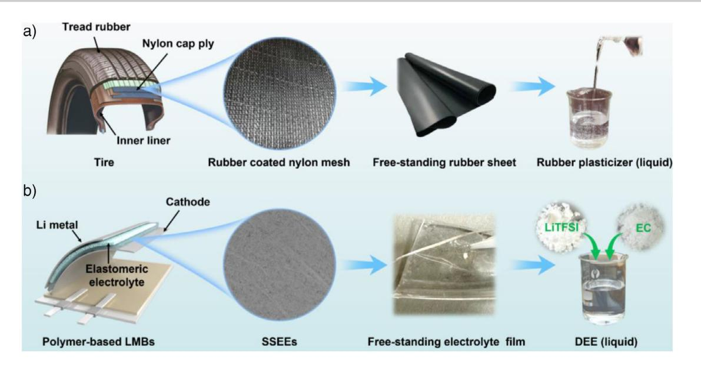
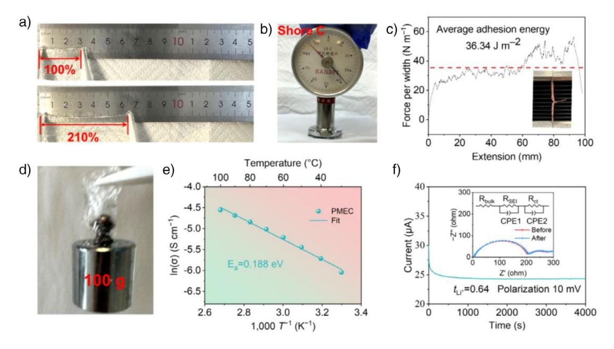
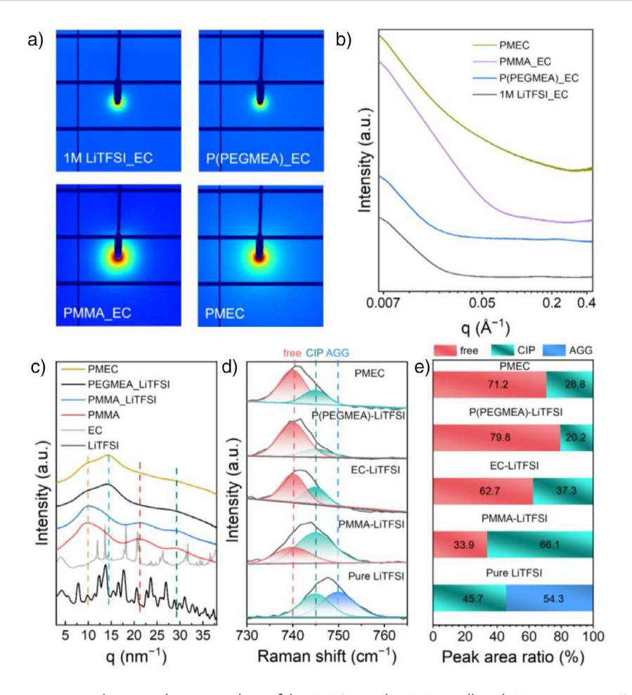
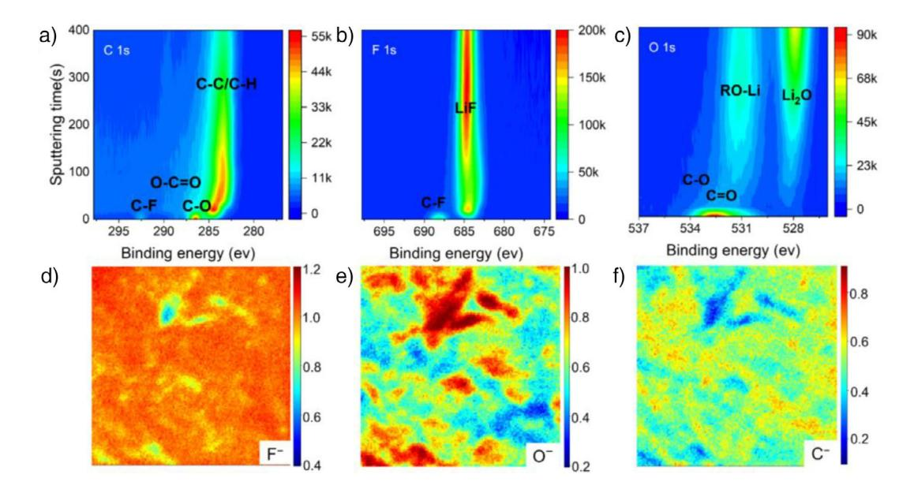
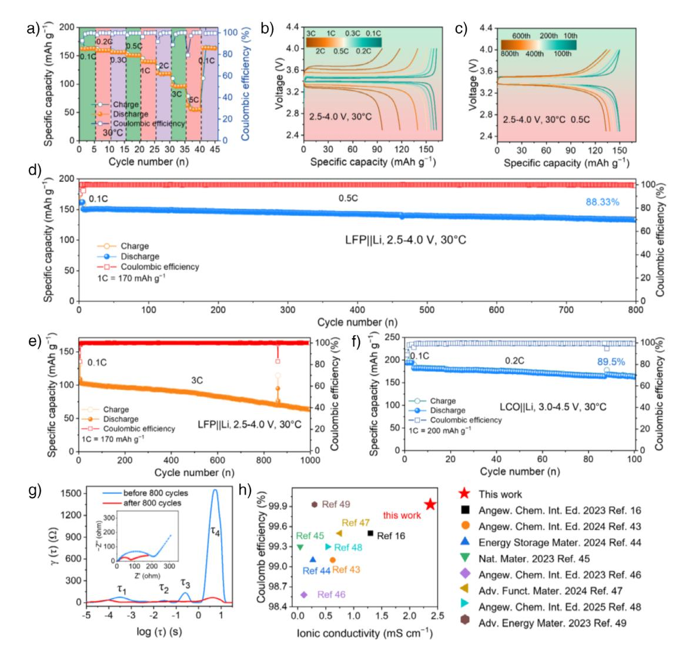
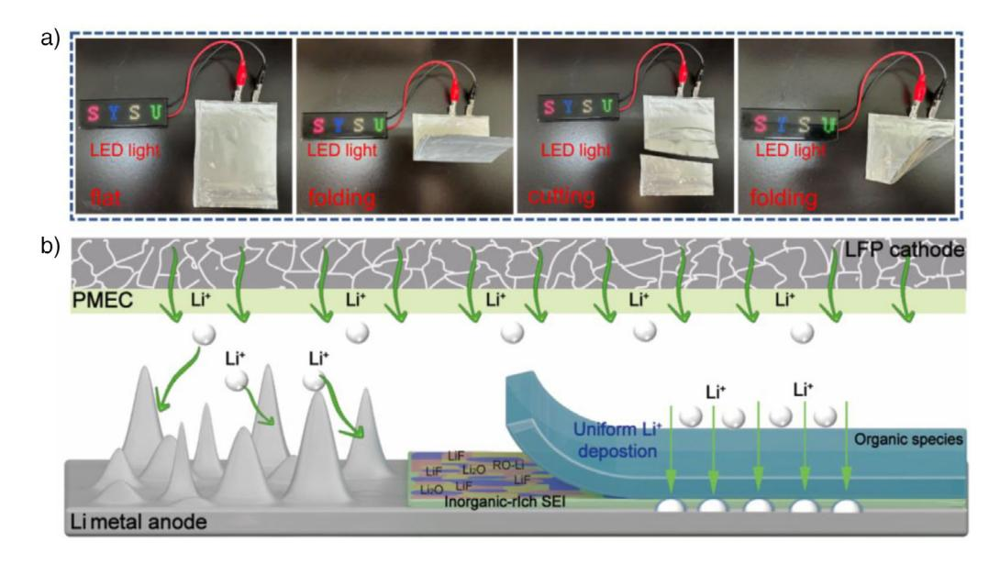

Zitierweise: *Angew. Chem. Int. Ed.* **2025**, *64*, e202513167 doi.org/10.1002/anie.202513167 *Lithium Metal Batteries*

# **Design and Preparation of Self-Adaptive and Robust Solid-State Elastomeric Electrolyte for Lithium Metal Battery Inspired by Rubber Tire**

*Zhengyin Yao, Zhen Liu, Kang Xia, Shuo Zhao, Haoru Xie, Xurui Li, Sili Zhou, Dongbai Sun, and [Peng Zhang\\*](https://orcid.org/0000-0003-1695-360X)*

**Abstract:** The development of safe, high-performance solid-state electrolytes remains a central challenge for advancing lithium metal batteries (LMBs) toward practical deployment. Inspired by the durable, deformable nature of rubber tires, we report the design and preparation of a self-adaptive solid-state elastomeric electrolyte containing a deep eutectic electrolyte, termed PMEC, which integrates molecular-level plasticizer dispersion, mechanical flexibility, and interfacial adaptivity. The PMEC membrane exhibits high ionic conductivity (2.37 mS cm−1 at 30 °C), a high Li+ transference number (0.64), excellent elasticity, and robust interfacial adhesion (36.34 J m−2). Structural characterizations confirm its amorphous and homogeneously mixed nature, while micro-Raman and XPS/TOF-SIMS analyses reveal uniform component distribution and the formation of an organic–inorganic gradient SEI layer on lithium. These features enable exceptional electrochemical performance in both symmetric and full batteries, including over 2000 h of stable cycling and >800 cycles at 0.5 C in LFP|PMEC|Li batteries with >88% capacity retention. Moreover, PMEC-based pouch batteries maintain functionality under severe mechanical abuse. This tire-inspired electrolyte design offers a generalizable platform for high-safety and high-performance solid-state lithium batteries.

### *Introduction*

The pursuit of high-energy-density lithium metal batteries (LMBs) is driven by the urgent need for safe and efficient energy storage systems to support the transition to electrified transportation and renewable energy integration.[\[1,2\]](#page-9-0) Central to this effort is the development of solid-state electrolytes that simultaneously exhibit high ionic conductivity, mechanical robustness, and interfacial compatibility with reactive lithium metal anodes.[\[3\]](#page-9-0) While inorganic ceramic electrolytes offer high conductivity and mechanical strength, their brittleness and poor interfacial contact with electrodes pose significant limitations.[\[4\]](#page-9-0) On the other hand, polymer-based electrolytes provide desirable elasticity and ease of processing, yet often suffer from low ionic conductivity and inadequate suppression of lithium dendrites.[\[5,6\]](#page-9-0)

Recent advances in elastomeric solid-state electrolytes have introduced hybrid systems incorporating liquid or

Z. Liu

quasi-liquid phases within polymer matrices to enhance ionic mobility.[\[5,7–10\]](#page-9-0) However, achieving a structural balance between flexibility, ion transport, and dendrite resistance remains an outstanding challenge.[\[11\]](#page-9-0) In this context, nature and industry offer instructive design analogies. One such example is the rubber tire: a robust, flexible, and durable composite engineered to withstand dynamic mechanical stress over extended lifetimes.[\[12,13\]](#page-9-0) The tire's performance arises from a synergistic integration of a soft rubber matrix, a liquid plasticizer that modulates viscoelasticity, and a rigid reinforcing network composed of steel or nylon mesh that imparts structural integrity.[\[11,14\]](#page-9-0)

Inspired by this hierarchical composite architecture, we present a new class of solid-state elastomeric electrolyte containing a deep eutectic electrolyte (SSEE-d) that integrate a soft polymer matrix, a liquid deep eutectic electrolyte (DEE), and a rigid porous polyethylene (PE) scaffold. In this design, the elastomer matrix provides mechanical flexibility and hosts the ion-conducting DEE phase, which ensures high ionic conductivity while plasticizing the polymer segments.[\[7,8\]](#page-9-0) The rigid PE mesh functions analogously to the nylon mesh in tires, reinforcing the composite, mitigating deformation, and inhibiting dendritic penetration.[\[15\]](#page-9-0) This tri-phase structure enables cooperative transport-mechanical behavior and maintains electrochemical performance under strain.[\[5,8,16,17\]](#page-9-0)

Here, we demonstrate the synthesis, structure, and electrochemical properties of these tire-inspired SSEE-d. Through rational tuning of the elastomer-to-DEE ratio and interfacial integration with a reinforcing PE scaffold, the resulting SSEEd achieves high ionic conductivity (2.37 mS cm−1 at room

[\*] Z. Yao, K. Xia, S. Zhao, H. Xie, X. Li, S. Zhou, D. Sun, P. Zhang School of Materials Science and Engineering, Key Laboratory for Polymeric Composite and Functional Materials of Ministry of Education, Southern Marine Science and Engineering Guangdong Laboratory (Zhuhai), Institute of Green Chemistry and Molecular Engineering, Sun Yat-sen University, Guangzhou 510006, China E-mail: [zhangpeng3@mail.sysu.edu.cn](mailto:zhangpeng3@mail.sysu.edu.cn)

Medical Devices Research & Testing Center, South China University of Technology, Guangzhou 510006, China

Additional supporting information can be found online in the Supporting Information section

*Figure 1.* a) Schematic illustration of the design and preparation of rubber tire. b) Schematic illustration of the design and preparation of solid-state elastomeric electrolyte containing a DEE inspired by rubber tire.

temperature) and low interfacial resistance in both symmetric and full-battery configurations, along with exceptional cycling stability in full cells, retaining 133.2 mAh g−1 after 800 cycles with 88.33% capacity retention. Mechanistic analysis reveals that the electrolyte forms a self-organized bilayer SEI, which together provide dendrite suppression and interfacial protection. Our results demonstrate a tire-inspired strategy for engineering structurally integrated, homogeneous elastomeric electrolytes, addressing key limitations in solid-state lithium cell systems and offering a path forward for safe, high-performance energy storage.

### *Results and Discussion*

The development of a solid-state electrolyte that simultaneously achieves mechanical robustness, ionic conductivity, and interfacial adaptability is crucial for advancing LMBs.[\[18,19\]](#page-9-0) Inspired by the structural principles of commercial rubber tires—namely, their hybrid composition of rigid and soft domains, reinforced by chemical crosslinking—we designed a SSEE-d that mimics the durability, flexibility, and selfadaptive compliance of tire rubber.[\[20\]](#page-9-0) As illustrated in Figure 1, this design incorporates a flexible copolymer network, chemically crosslinked to form a freestanding solid, while embedded with lithium-conducting deep eutectic components to ensure continuous ionic transport.

The core of the elastomeric matrix is a copolymer of methyl methacrylate (MMA) and poly(ethylene glycol)methyl ether acrylate (PEGMEA) (Figure S1). PMMA provides mechanical strength and thermal stability, while P(PEGMEA) introduces flexible, low-glass-transition side chains that facilitate local polymer segmental motion and lithium-ion mobility.[\[8,16\]](#page-9-0) To unify these components into a robust, yet compliant structure, poly(ethylene glycol) diacrylate (PEGDA) was employed as a bifunctional crosslinker. This crosslinking strategy—directly inspired by the chemical vulcanization used in rubber tire manufacturing—ensures the formation of a covalent polymer network that retains mechanical elasticity under deformation while resisting structural degradation under cycling (cf. Figure S4). The resulting SSEEd is not only elastomeric but also maintains intimate contact with the solid lithium metal anode, suppressing interfacial void formation and promoting homogeneous Li-ion flux. This mechanically adaptive interface is essential for mitigating dendrite growth and enables stable cycling performance and long-term electrochemical durability.

An essential aspect of this design lies in the conversion of a partially liquid mixture into a solid-state material. Although the formulation contains significant proportions of ethylene carbonate (EC) and unreacted monomers (MMA, PEGMEA), the incorporation of a low concentration (0.5 wt%) of 2,2--azobis(2-methylpropionitrile) (AIBN) initiator and 0.5 wt% PEGDA crosslinker (relative to monomer mass) enables complete polymerization and network formation during thermal curing at 70 °C for 12 h. Remarkably, the resulting SSEE-d forms a cohesive, rubber-like solid without phase separation or liquid leakage highlighting the successful confinement of mobile components within a chemically crosslinked matrix. This solid-state nature, despite the eutectic fluid content, is a hallmark of the tire-inspired strategy: it combines soft-segment dynamics with bulk mechanical integrity, ensuring the solid nature of PMEC is retained, even under thermal and electrochemical operation.

The optimization of ionic conductivity began with the formulation of a DEE based on LiTFSI (1.0 M) in a binary liquid mixture of EC and MMA. By systematically tuning the volume ratio between EC and MMA, an optimal composition was identified at EC:MMA = 5:5 (v/v), which achieved a balanced Shore C hardness (Figure S6 and Table S1) and an ionic conductivity of 1.09 × 10−3 S cm**−**1 at 25 °C (Figure S5a), indicating an effective trade-off between mechanical integrity and ionic transport properties. Building upon this, PEGMEA was incorporated to introduce flexible ethylene oxide segments, and the molar ratio of MMA:PEGMEA was optimized to 7:3, resulting in the final elastomeric electrolyte, denoted PMEC. This composition achieved a significantly improved conductivity of 2.37  $\times$  10-3 S cm-1 (Figure S5b), attributed to enhanced segmental motion and Li+ coordination pathways. All ionic conductivity measurements were performed on freestanding PMEC films without embedded PE membrane, ensuring intrinsic transport properties of the elastomeric matrix were probed. The optimized composition of PMEC was MMA:PEGMEA:LiTFSI:EC:PEGDA =  $66:134:115:272:1$ (mass ratio), based on the total monomer content. Notably, even in the absence of PE reinforcement, PMEC displayed excellent elasticity and full shape recovery (Figure S7), supporting its elastomeric nature.

For subsequent electrochemical and full-battery evaluations, a porous PE membrane was embedded within the PMEC matrix prior to curing. This approach—analogous to the embedded nylon mesh in rubber tires (Figure 1)—further enhanced mechanical durability, dendrite resistance, and long-term dimensional stability, without compromising ionic conductivity.[20] Unless otherwise specified, all battery tests in this work were conducted using PE-embedded PMEC films. Taken together, this rational, tire-inspired design strategy combining segmental flexibility, ionic eutectic dispersion, chemical crosslinking, and membrane reinforcement—offers a practical blueprint for the development of robust, deformable, and electrochemically stable SSEE-d for lithium metal batteries.

Following the tire-inspired design and formulation of PMEC, we next investigated the fundamental physical and electrochemical features of the as-prepared SSEE-d to evaluate its suitability for LMBs (Figure 2). These properties—such as stretchability, surface adhesion, mechanical durability, and ion transport kinetics—are all essential for ensuring long-term electrochemical operation and are directly correlated with the elastomeric architecture and deep eutectic integration highlighted in the preceding section. As shown in Figure 2a, the PMEC membrane forms a transparent, freestanding film after in situ thermal polymerization. The high optical clarity suggests a homogeneous dispersion of the LiTFSI/EC-based DEE within the polymer matrix, without visible phase separation or crystallite formation. This uniformity confirms that the eutectic liquid is effectively confined within the polymeric network, which is consistent with recent reports on ion gel-type elastomers and plastic crystal-polymer hybrids.[7,8]

The PMEC electrolyte exhibits rubber-like mechanical properties, including high stretchability (Figure 2a), excellent elastic recovery (Figure 2b), and robust interfacial adhesion  $(36.34 \text{ J m}^{-2})$ , Figure 2c,d). The membrane without PE support can be manually stretched to over 210% of its original length without rupture (Figure  $2a$ ), and quantitative tensile testing confirms a maximum tensile strain of  $187 \pm 5\%$  and a Young's modulus of 104  $\pm$  3 kPa (Figure S8). This high elongation is enabled by the flexible polyether side chains from PEGMEA and the elastomeric crosslinked backbone introduced by PEGDA, which together mimic the strain-accommodating nature of vulcanized rubber in tires.[21,22] Such largestrain compliance is critical for maintaining intimate and crack-free interfaces between electrolyte and lithium metal, especially under dynamic volume changes during cycling.

To further evaluate the mechanical durability of PMEC, we measured its hardness using a Shore C durometer, yielding a value of  $37.5$  (Figure 2b). This value is comparable to the hardness of typical athletic shoe soles, such as those used in commercial Nike sports footwear, and lies in the optimal range for elastomeric materials that balance softness with resilience.[23] This similarity underscores the durable yet flexible mechanical profile of PMEC, a trait vital for both battery longevity and resistance against lithium dendrite intrusion—a challenge long recognized in solid-state electrolyte research.[11] Adhesion to solid-state electrodes is another prerequisite for effective electrolyte performance. Figure  $2c$  shows the results of an interfacial adhesion test, where a PMEC membrane was sandwiched between two copper foils and subjected to  $180^{\circ}$  peel testing. The average interfacial adhesion energy was measured to be 36.34 J  $m^{-2}$ , significantly higher than typical values reported for dry polymer electrolytes.[7] This strong adhesion is attributed to the viscoelastic nature of the PMEC network and the surface-wetting behavior induced by EC-rich domains, which synergistically enable the formation of conformal and intimate interfaces with metal electrodes, a key requirement for suppressing interfacial delamination and enabling uniform Li plating/stripping.[8] The practical implications of these properties are demonstrated in the Li|PMEC|Li symmetric battery, which exhibited stable cycling for over 2000 h at 0.1 mA  $\text{cm}^{-2}$  and 0.1 mAh  $\text{cm}^{-2}$  without noticeable voltage polarization (Figure S16), indicating excellent lithiummetal compatibility. The self-adhesive and cohesive nature of PMEC is further demonstrated in Figure 2d, where the membrane is shown to lift a 100 g weight without rupture or delamination. This remarkable adhesive strength and tensile cohesion again reflect the optimized elastomeric crosslinking density and the entrapment of the DEE within a percolated yet structurally unified polymer network. It also highlights the practical processability of PMEC for battery assembly, as it can be directly laminated onto electrodes without requiring additional bonding agents.

To evaluate the ion transport performance, temperaturedependent ionic conductivity of PMEC was measured, and the resulting Arrhenius plot is shown in Figure 2e. The sample exhibits a high conductivity of 2.37 mS  $\text{cm}^{-1}$  at 30 °C, which is 117% higher than the counterpart without P(PEGMEA), confirming the critical role of polyether side chains in enabling segmental motion and facilitating Li+ coordination and diffusion.[16] The calculated activation energy  $(E_a)$  of 0.188 eV is among the lowest reported value for solid-state polymer electrolytes,  $[6,24]$  reflecting a highly efficient ion transport mechanism. These values are particularly promising in the context of solid-state batteries, where conductivity and flexibility are often mutually exclusive.[7,25,26] Furthermore, to investigate the lithium-ion transference behavior, Li|PMEC|Li symmetric batteries were polarized under a DC bias of 10 mV at 30  $\degree$ C (Figure 2f).

*Figure 2.* Mechanical and ion transport characteristics of the tire-inspired solid-state elastomeric electrolyte containing a DEE. a) Photograph of the as-prepared freestanding PMEC membrane, showing optical transparency and exceptional stretchability (210%) without fracture. b) Measurement of membrane hardness using a Shore C durometer, yielding a value of 37.5. c) Interfacial adhesion performance of PMEC sandwiched between Cu foils, with an average peel strength of 36.34 J m**−**2. d) Demonstration of the adhesive and cohesive strength of PMEC, which is capable of lifting a 100 g weight without mechanical failure. e) Temperature-dependent ionic conductivity of PMEC, plotted as an Arrhenius curve, showing a high room-temperature conductivity of 2.37 mS cm−1 and a low activation energy (*E*a) of 0.188 eV. f) Chronoamperometric polarization of a symmetric Li|PMEC|Li battery under a DC bias of 10 mV at 30 °C, with steady-state analysis yielding a high lithium-ion transference number (*t*+) of 0.64. Inset: equivalent circuit for modeling Nyquist plots of symmetric Li batteries. Note: all measurements in (a, b, and d) were conducted in an argon-filled glovebox to avoid air and humidity interference.

The resulting steady-state current enabled the calculation of a lithium-ion transference number (*t*+) of 0.64, which is substantially higher than that of conventional PEO-based electrolytes (typically ∼0.2–0.3).[\[24\]](#page-9-0) The high *t*+ observed in PMEC is attributed to strong interactions between the copolymer and LiTFSI, which promote salt dissociation and form interconnected Li+-transport pathways. This mechanism, supported by Raman spectroscopy and consistent with prior studies on elastomeric electrolytes containing deep eutectic or plastic crystal phases,[\[7,8,27,28\]](#page-9-0) distinguishes PMEC from conventional gel electrolytes where polymer matrices primarily serve as passive scaffolds for liquid electrolytes. This high *t*+ value is critical for reducing concentration polarization and promoting stable Li deposition—again reinforcing the elastomeric network's ability to regulate ion migration and suppress electrochemical inhomogeneities at the electrode interface.[\[29,30\]](#page-9-0) Together, these results affirm the rubber tireinspired structural design of PMEC: it forms a robust, cohesive, ion-conducting solid with remarkable mechanical softness, stretchability, and interfacial compatibility. These features enable the membrane to accommodate electrode deformation, maintain intimate contact during long cycling, and resist dendritic penetration—all of which are essential characteristics for practical solid-state LMBs. In the following section, we delve into the molecular and nanoscale structure of PMEC, using X-ray scattering and Raman spectroscopy to gain insight into the polymer network architecture and ion coordination environment that underpins these macroscopic performance attributes.

To understand the structural basis underpinning the observed mechanical resilience and ionic transport behavior of PMEC, we conducted complementary small-angle X-ray scattering (SAXS), wide-angle X-ray scattering (WAXS), and Raman spectroscopy analyses. These characterizations offer molecular-level insights into the electrolyte's amorphous morphology, component compatibility, and lithium salt coordination environment, all of which are essential to the design of a tire-inspired solid electrolyte that can simultaneously support deformability and electrochemical performance.[\[31,32\]](#page-9-0) As shown in Figure [3a, 2D](#page-4-0) SAXS patterns of PMEC and reference samples—including the 1 M LiTFSI/EC binary DEE, PMMA/EC, and P(PEGMEA)/EC hybrids—display only diffuse scattering halos, with no distinct Bragg spots or ring patterns. This absence of ordered scattering features indicates the lack of long-range phase separation or microphase segregation, affirming the high degree of component miscibility within the hybrid network.[\[33\]](#page-9-0) The compositional uniformity of the hybrid matrix at the microscale was also supported by the Raman mapping analyses (Figure S9). This structural homogeneity is further supported by the high-angle annular dark-field scanning transmission electron microscopy (HAADF-STEM) images shown in Figure S10, which reveal no discernible domain segregation at the nanometer scale. The corresponding 1D SAXS profiles in Figure [3b](#page-4-0) confirm these conclusions, showing broad halos rather than discrete peaks. Notably, no ordered or semi-ordered structural motifs are detected, in contrast to phase-separated or crystallized systems commonly observed in PEO-based solid polymer

*Figure 3.* Structural characterization and ion coordination analysis of the PMEC sample. a) 2D small-angle X-ray scattering (SAXS) patterns of PMEC and reference samples, including 1 M LiTFSI/EC, PMMA/EC, and P(PEGMEA)/EC hybrids. b) 1D SAXS profiles corresponding to the samples in panel a, confirming the absence of ordered structures and the homogeneous nature of PMEC. c) 1D wide-angle X-ray scattering (WAXS) curves of PMEC and its components or binary hybrids, showing amorphous scattering features with no crystallization from EC or LiTFSI, and bumpy peaks typical of disordered PMMA segment packing. d) Raman spectra (730–765 cm**−**1 ) of PMEC and reference samples, deconvoluted into peaks corresponding to free TFSI− anions (740 cm**−**1 ), contact ion pairs (CIPs, 745 cm**−**1 ), and aggregates (AGGs, 750 cm**−**1 ), reflecting the ion coordination environment. e) Relative population of TFSI− species (free, CIP, AGG) in different samples, derived from peak fitting of the Raman spectra in panel d, highlighting the predominance of free anions in PMEC.

electrolytes.[\[34,35\]](#page-9-0) This amorphous and homogeneous morphology facilitates uninterrupted lithium-ion transport by minimizing interfacial impedance and segmental freezing.[\[24\]](#page-9-0) These features align well with the elastomeric and optically transparent nature of PMEC (Figure [2a\)](#page-3-0) and resonate with the inspiration from the tire's uniform but robust microstructure—soft and adaptable, yet strongly cohesive under mechanical and thermal stress.[\[36\]](#page-9-0)

To further explore the molecular-level interactions and packing, we analyzed the 1D WAXS curves derived from 2D patterns in Figure 3c. While pristine EC and LiTFSI show distinct sharp diffraction peaks corresponding to their crystalline nature, PMMA exhibits three broad peaks centered at q = 9.89, 21.32, and 29.23 nm−1—features associated with the amorphous packing of PMMA segments.[\[37\]](#page-9-0) Both the PMMA/LiTFSI and P(PEGMEA)/LiTFSI hybrids retain these diffuse patterns, with slight peak shifts and shape modulations, indicating modified chain packing upon salt and co-monomer incorporation.[\[38\]](#page-9-0) The PMEC electrolyte, which integrates all these components, likewise displays a fully amorphous WAXS signature, with no detectable crystallization of EC or LiTFSI. These observations are further corroborated by the XRD data in Figure S11, supporting the claim that the final elastomer retains a rubbery, glassyamorphous state—a prerequisite for mechanical softness and dendrite-suppressing elasticity under dynamic cell operation.

Beyond phase morphology, we investigated the solvation structure of the TFSI− anion in the various hybrid systems by high-resolution Raman spectroscopy. As shown in Figure 3d, the spectral region from 730 to 765 cm**−**1—assigned to the S– N–S bending mode of the TFSI**−** anion—was deconvoluted into three components: free TFSI**−** anions (740 cm**−**1), contact ion pairs (CIPs) (745 cm**−**1, where a single Li+ coordinates to one TFSI**−**), and aggregates (AGGs) (750 cm**−**1, where multiple Li+ ions coordinate to a single anion).[\[39\]](#page-9-0) The evolution of these spectral features provides insight into the ion–polymer and ion–solvent coordination environments across different formulations. Quantitative analysis based on peak area ratios (Figure [3e\)](#page-4-0) reveals a substantial shift in coordination environment upon hybrid formation.[\[39\]](#page-9-0) Compared to neat LiTFSI (45.7% free, 54.3% CIP) and the EC/LiTFSI DEE (62.7% free, 32.3% CIP), the PMMA/LiTFSI hybrid demonstrates a highly bound state (only 33.9% free TFSI−), reflecting poor ionic dissociation. In contrast, P(PEGMEA)/LiTFSI and PMEC exhibit markedly higher degrees of ion dissociation— 79.8% and 71.2% free TFSI−, respectively—attributable to the solvation capability of ether oxygen in PEGMEA and the high dielectric EC solvent.[\[16\]](#page-9-0) The optimized coordination environment in PMEC, rich in free anions and low in ion aggregates, underlies its high ionic conductivity and transference number, consistent with the electrochemical findings discussed earlier (Figure [2e,f\)](#page-3-0).

Together, the structural analyses in Figure [3](#page-4-0) establish a cohesive picture: the tire-inspired PMEC electrolyte features a mechanically coherent yet molecularly disordered network that blends polar and nonpolar units without inducing crystallinity or phase separation. The elastomeric solid retains rubber-like softness and interfacial adaptability, yet supports rapid and selective lithium-ion conduction via a predominantly free-ion transport regime.[\[8\]](#page-9-0) These features provide the structural foundation for the electrochemical and mechanical advantages of PMEC and set the stage for further analysis of its interface chemistry and stability with lithium metal electrodes, as discussed in the next section using XPS and TOF-SIMS.

Achieving interfacial stability and dendrite suppression in LMBs requires solid-state electrolytes that not only provide ionic conduction but also adaptively conform to the dynamic, chemically reactive metal surface.[\[19,32\]](#page-9-0) In this context, the self-adaptive nature of the tire-inspired PMEC plays a pivotal role in constructing a mechanically and chemically robust SEI. To unveil the interfacial evolution at the Li/PMEC interface, XPS depth profiling and TOF-SIMS mapping were conducted after extended cycling of Li|PMEC|Li symmetric cells. As presented in Figures [4a–c](#page-6-0) and S12, the depth-dependent XPS spectra of the cycled Li anode reveal the compositional stratification of the SEI. At the surface (0 min Ar+ sputtering), C 1s signals include distinct peaks for C─F (293.0 eV), O─C═O (288.5 eV), C─O (286.5 eV), and C─C/C─H (284.8 eV), while F 1s and O 1s regions feature C─F (688.6 eV), LiF (685.0 eV), C─O (533.5 eV), C═O (533.2 eV), and ROLi (531.5 eV), along with Li2O (528.2 eV).[\[8\]](#page-9-0) These results suggest that the PMEC forms an organically rich SEI layer enriched with electrolyte- and polymer-derived species. Notably, as the sputtering time increases to 400 s, the organic components diminish, while the inorganic species particularly LiF and Li2O—intensify, indicating the formation of an inner, inorganic-dominated SEI base.[\[8\]](#page-9-0)

This layered SEI architecture reflects the self-adaptive interfacial behavior of PMEC. As an elastomer matrix crosslinked by PEGDA and swollen with EC and LiTFSI, PMEC exhibits a capacity for local reconfiguration when in contact with the highly reactive Li surface. This enables spontaneous formation of a gradient interphase—wherein mobile polar segments of PEGMEA and EC coordinate with Li+ and sacrificially decompose to yield a structurally and chemically tailored SEI (Figure S13).[\[16\]](#page-9-0) The surface-layer softness and bulk elasticity of PMEC allow it to maintain conformal contact with the dynamically evolving Li surface, thereby reducing interfacial impedance and mitigating void formation during repeated plating/stripping.[\[7\]](#page-9-0)

To further characterize the spatial distribution of SEI components, TOF-SIMS mapping (Figure [4d–f\)](#page-6-0) was performed after 2000 hours of cycling. Secondary ion signals from F−, O−, and C−—corresponding to LiF, Li2O, and organic residues—show broad and homogeneous distribution across the Li surface, in agreement with MALDI-TOF-MS results presented in Figure S14. [\[6\]](#page-9-0) These distributions confirm the cooperative decomposition and rearrangement of electrolyte components to produce a chemically diverse, yet spatially continuous, interphase. Such self-organized structures are advantageous for suppressing local current hotspots and inhibiting dendritic growth.[\[19\]](#page-9-0)

The performance consequences of these interfacial features are compelling. The Li|PMEC|Cu half-cell demonstrates a high Coulombic efficiency of 96.34%, signifying minimal parasitic side reactions and efficient lithium utilization (Figure S15).[\[40\]](#page-9-0) More impressively, the Li|PMEC|Li symmetric cell operates stably for over 2000 h at 0.1 mA cm−2 and 0.1 mAh cm−2, without short circuiting or voltage fluctuations (Figure S16). Even when subjected to increasing current densities—up to 1.0 mA cm**−**2, then down to 0.5 mA cm**−**2 the interface remains mechanically and electrochemically stable (Figure S17). These outcomes highlight how the tireinspired crosslinked elastomeric design, with its ability to self-adjust at the interface, directly translates to long-term reliability in lithium metal systems.

Building upon the unique mechanical robustness, structural uniformity, and self-adaptive interfacial behavior discussed above, we further evaluated the electrochemical performance of the tire-inspired PMEC in full-battery LMB configurations. As an essential demonstration of practical viability, Figure [5](#page-7-0) presents the electrochemical behavior of LFP|PMEC|Li and LCO|PMEC|Li cells under various testing conditions. The PMEC electrolyte exhibits excellent anodic stability, as confirmed by linear sweep voltammetry (LSV) and chronoamperometric measurements using SS||Li (Figure S18) and Ni88||Li asymmetric cells (Figure S19), maintaining electrochemical inertness up to 4.85 V (versus Li+/Li) and suppressing leakage currents below 10 µA cm−2 at 4.8 V for extended periods. These results underscore the electrolyte's compatibility with high-voltage cathode materials and its capability to suppress parasitic redox side reactions—a notable advantage over conventional PEO-based SSEs, which typically suffer from limited oxidative stability below 4 V.[\[24\]](#page-9-0)

Figure [5a](#page-7-0) displays the rate capability of LFP|PMEC|Li cells at 30 °C, revealing high discharge capacities of 162.1, 159.3, 156.2, 151.2, 140.2, 120.0, 98.0, and 62.5 mAh g−1 at current densities ranging from 0.1 to 5 C (1 C = 170 mA g−1). Notably, the capacity fully recovered to 163.8 mAh g−1 upon returning to 0.1 C, demonstrating the remarkable reversibility and mechanical resilience of the PMEC under rigorous dynamic conditions. The corresponding charge/discharge profiles (Figure [5b\)](#page-7-0) show low polarization even at higher rates, highlighting the effective ion transport pathways and intimate electrode/electrolyte interfaces enabled by the elastomeric

**Figure 4.** a)–c) X-ray photoelectron spectroscopy (XPS) depth profiles of the Li anode after 2000 h of cycling in a Li|PMEC|Li symmetric cell, showing the evolution of C 1s (a), F 1s (b), and O 1s (c) spectra as a function of  $Ar^+$  sputter-cleaning time. The surface SEI is rich in organic species (C–F, O–C=O, C–O, C–C/C–H, C=O), while LiF and Li2O dominate in the inner SEI after prolonged sputtering, indicating the formation of a graded organo-inorganic SEI. d)-f) Time-of-flight secondary ion mass spectrometry (TOF-SIMS) surface maps of the cycled Li anode showing the spatial distribution of  $F^{-1}$  (d),  $O^{-1}$  (e), and  $C^{-1}$  (f) signals, corresponding to LiF, Li2O, and organic SEI species, respectively.

matrix.[7] To highlight the importance of structural reinforcement, a control PMEC sample lacking the embedded polyethylene (PE) membrane was fabricated. Although this PE-free formulation formed a self-standing film, it required a much greater thickness ( $\sim$ 825 µm) (Figure S20a) and showed limited rate performance—failing to operate above 2 C (Figure S21). In contrast, the composite PMEC membrane with embedded PE mesh (analogous to the reinforcing nylon mesh used in tire rubber; cf. Figure  $1$ ) achieved robust mechanical integrity at only  $\sim$ 19 µm thickness, enabling both high-rate capability and practical form factor (Figure 5a). This comparison underscores the critical role of internal reinforcement in balancing mechanical strength and ionic accessibility. To further assess the advantages of the PMEC system, we conducted comparison experiments using only 1 M LiTFSI in EC electrolyte, without the polymer matrix. As shown in Figure S22a, the LillLi symmetric cells demonstrate limited stability with fluctuating overpotentials and cycling up to  $\sim$ 100 h, in contrast to the more stable performance of PMEC-based cells (Figure S16a). Similarly, Figure S22b shows that LFPILi full cells with the baseline electrolyte exhibit moderate cycling stability (100 cycles) but inferior capacity retention compared to PMEC-based cells. These results underscore the essential role of the polymer matrix in stabilizing the electrolyte/electrode interface and enabling durable electrochemical performance.

Cycling performance at 0.5 C (30  $\degree$ C) is shown in Figure 5c,d. The LFPIPMECILi cell delivers an initial discharge capacity of 150.0 mAh  $g^{-1}$  and retains 133.2 mAh  $g^{-1}$  after 800 cycles (88.33% retention), with Coulombic efficiencies exceeding 99.8%. At a more aggressive rate of 3 C, the cell maintained 63.4 mAh  $g^{-1}$  after 1000 cycles (Figures 5e and  $S23c$ ), further corroborating the endurance of the elastomeric electrolyte under high current loads. This exceptional cycling stability outperforms many state-of-the-art solid-state systems employing brittle ceramics or crystalline polymer matrices.[6,17] Encouraging results were also obtained for highvoltage systems. Figures 5f and S24a shows the performance of LCOPMECILi cells operated up to 4.5 V. The cell delivered an initial capacity of 182 mAh  $g^{-1}$  at 0.2 C and retained 89.5% of this value after 100 cycles, accompanied by an excellent CE of 99.22%. Similarly, Ni88ILi full cells delivered 197.7 mAh  $g^{-1}$  initially and retained 83.6% capacity over prolonged operation, maintaining comparable CE (Figure  $S24b$ ,c). These results underscore the broad voltage window and interface stability of the PMEC electrolyte in practical cathode pairings.

To further elucidate the interfacial charge transfer behavior, electrochemical impedance spectroscopy (EIS) and distribution of relaxation time (DRT) analysis were performed before and after 800 cycles (Figure 5g). The EIS inset shows a dramatic reduction in high-frequency interfacial resistance from 203 to 75  $\Omega$  post-cycling, consistent with the formation of a highly conductive and stable SEI layer observed in the previous section. DRT analysis revealed four distinguishable time constants ( $log(\tau)$  from -5 to 1 s), with significant attenuation in  $\tau_1$  (electrode–electrolyte interface resistance) and  $\tau_2-\tau_4$  (bulk and charge-transfer resistances), suggesting improved interfacial kinetics and Li+ transport upon long-term cycling.[41] These enhancements stem from the elastomer's ability to maintain interfacial conformity under volume fluctuation and cycling strain, echoing its rubbertire inspiration.[42] Finally, as benchmarked in Figure 5h, the PMEC system shows superior performance in both ionic conductivity and CE when compared to leading solidstate electrolyte technologies, including polymer-ceramic

*Figure 5.* Illustrates the performance metrics of the LFP|PMEC|Li cells: a) C-rate performance. b) Charge/discharge voltage profiles of the LFP|PMEC|Li cell at different rate. c) Charge/discharge voltage profiles of different cycles obtained from LFP|PMEC|Li at 0.5 C (30 °C). d) Cycling stability obtained from LFP|PMEC|Li at 0.5 C (30 °C). e) Cycling stability obtained from LFP|PMEC|Li at 3 C (30 °C). f) Cycling stability obtained from LCO|PMEC|Li at 0.2 C (30 °C). g) The DRT of LFP|PMEC|Li cell before and after 800 cycles (the inset displays the EIS data recorded before and after 800 cycles). h) Comparison with the electrochemical performances of different solid-state LMBs reported in the literatures.

hybrids, PEO-based materials, and elastomeric electrolyte systems.[\[16,43–49\]](#page-9-0) This competitive positioning is a direct outcome of the strategic molecular design and microstructural tuning of the PMEC, which enables a synergistic coupling between mechanical resilience, interfacial stability, and ion transport. Taken together, these results reinforce the structural–electrochemical correlations of the tire-inspired SSEE-d. The uniformly dispersed ion-solvating domains, the rubbery matrix ensuring continuous interfacial contact, and the gradient SEI chemistry collectively deliver stable and efficient cycling in both low- and high-voltage systems. The subsequent section (Figure [6\)](#page-8-0) will further consolidate these findings into a schematic illustration of the structure–property relationship underpinning the design rationale of the PMEC system.

To further validate the mechanical adaptability and operational safety of the tire-inspired PMEC system under realistic deformation conditions, we assembled LFP|PMEC|Li pouch cells and subjected them to mechanical damage tests while monitoring their electrochemical function. As shown in Figure [6a,](#page-8-0) a single PMEC-based pouch cell successfully powered an LED and retained uninterrupted illumination even after undergoing physical cutting and bending, clearly indicating the system's remarkable structural integrity, ionic conduction continuity, and electrochemical stability under extreme handling conditions. This robust mechanical compliance directly echoes the structural inspiration from tire rubber—a material long valued for its durability and deformation tolerance in harsh conditions.[\[50\]](#page-9-0) This real-world demonstration provides direct evidence that the elastomeric matrix and homogeneous distribution of conductive pathways within PMECs can accommodate severe mechanical stress without compromising ionic transport or interface functionality. More importantly, the stable per-

*Figure 6.* a) Photographs showing the operation of an LFP|PMEC|Li pouch cell powering an LED before and after mechanical damage, including cutting and folding. b) Schematic illustration of the structure–property correlation in PMEC.

formance under such conditions implies the absence of short-circuiting, indicating efficient suppression of lithium dendrites and intact electrode–electrolyte interfaces—a critical challenge for solid-state LMBs that PMECs successfully address.

To rationalize the observed performance and reinforce the structure–property relationship that has been revealed throughout this work, Figure 6b presents a schematic summary of the design and function of the tire-inspired SSEE-d. The schematic drawing illustrates how the PMEC integrates multiple synergistic features: a) Rubbery elasticity and shape recoverability inherited from the polymer matrix allow for self-adaptive interfacial contact with dynamically evolving Li metal anodes; b) Uniform dispersion of ion-solvating domains, including EC and TFSI−, enables continuous, fast Li+ transport across the bulk; c) Self-formed gradient SEI, with organic-rich outer layers and inorganic-enriched inner domains (LiF, Li2O), suppresses dendritic growth and enhances long-term interfacial stability; d) Electrochemical and mechanical resilience supports sustained cell operation under a wide range of current densities, voltages, and deformation conditions. Taken together, the multilevel design of PMEC enables it to function not merely as a passive ion-conducting medium, but as an active and adaptive component within the LMB architecture. It facilitates uniform ion transport, accommodates electrode volume fluctuations, and maintains stable interfacial contact under mechanical and electrochemical stress. These integrated features collectively contribute to the superior cycling stability observed in both pouch cell configurations and high-voltage systems. This study establishes a clear structure–property relationship: by emulating the durability and adaptability of rubber-like architectures, the PMEC-based solid-state elastomeric electrolytes effectively address the mechanical, chemical, and electrochemical challenges that have traditionally limited the practical application of solid-state LMBs.

### *Conclusion*

In this work, we present a tire rubber-inspired design strategy for constructing self-adaptive solid-state elastomeric electrolytes, embodied by the PMEC system, which effectively reconciles mechanical resilience, ionic conductivity, and interfacial compatibility. By leveraging homogeneous dispersion of deep eutectic components and a deformable polymer matrix, the PMEC electrolyte achieves a unique combination of high stretchability, robust adhesion, and strong electrochemical performance. Structural analyses via X-ray scattering, Raman spectroscopy, and depth-resolved XPS/TOF-SIMS collectively validate the amorphous, well-mixed nature of PMEC and its capability to induce a compositional gradient SEI that promotes smooth Li+ flux and dendrite suppression. These characteristics translate into long-term stability, high Coulombic efficiency, and compatibility with high-voltage cathodes, as demonstrated in LFP, LCO, and Ni-rich NCM full cells. The enduring operation of PMEC-based pouch cells under mechanical damage further underscores its practical robustness. Altogether, this work provides a compelling blueprint for the rational design of next-generation SSEEs that mimic the adaptive mechanics and structural integrity of rubber tires, paving the way for safer, longer-lasting, and more reliable solid-state LMBs.

### *Experimental Section*

The Experimental Section is available in the Supporting Information.

### *Acknowledgements*

The authors acknowledge the financial support from the National Natural Science Foundation of China (Nos. U2032101 and 11905306), the National Key Research and Development Program of China (No. 2022YFB2402602), and

the Natural Science Foundation of Guangdong Province (No. 2024A1515012260). Prof. Dr. Xiang Yao from Chee Shine Ltd. Co. is acknowledged for his helpful discussion of the experiment design. The authors thank the staff members of the BL19U2 beamline [\(https://cstr.cn/31129.02.NFPS.BL19U2\)](https://cstr.cn/31129.02.NFPS.BL19U2) at the National Facility for Protein Science in Shanghai [\(https://](https://cstr.cn/31129.02.NFPS) [cstr.cn/31129.02.NFPS\)](https://cstr.cn/31129.02.NFPS) for providing technical support and assistance in data collection and analysis.

#### *Conflict of Interests*

The authors declare no conflict of interest.

#### *Data Availability Statement*

The data that support the findings of this study are available from the corresponding author upon reasonable request.

**Keywords:** Deep eutectic electrolyte • Elastomeric electrolyte • In situ polymerization • Lithium metal battery • Solid-state battery

- [1] R. Van Noorden, *Nature* **2014**, *507*, 26–28.
- [2] J. M. Tarascon, M. Armand, *Nature* **2001**, *414*, 359–367.
- [3] C. Lu, H. Jiang, X. Cheng, J. He, Y. Long, Y. Chang, X. Gong, K. Zhang, J. Li, Z. Zhu, J. Wu, J. Wang, Y. Zheng, X. Shi, L. Ye, M. Liao, X. Sun, B. Wang, P. Chen, Y. Wang, H. Peng, *Nature* **2024**, *629*, 86–91.
- [4] F. Liang, Y. Sun, Y. Yuan, J. Huang, M. Hou, J. Lu, *Mater. Today* **2021**, *50*, 418–441.
- [5] J. Park, H. Seong, C. Yuk, D. Lee, Y. Byun, E. Lee, W. Lee, B. J. Kim, *Adv. Mater.* **2024**, *36*, e2403191.
- [6] Z. Yao, Y. Kang, M. Hou, J. Huang, J. Zhang, B. Yang, Y. Dai, F. Liang, *Adv. Funct. Mater.* **2022**, *32*, 2111919.
- [7] M. J. Lee, J. Han, K. Lee, Y. J. Lee, B. G. Kim, K. N. Jung, B. J. Kim, S. W. Lee, *Nature* **2022**, *601*, 217–222.
- [8] Z. Yao, Z. Liu, K. Xia, H. Xie, S. Xie, P. Zhang, *Chem. Sci.* **2025**, *16*, 6812–6821.
- [9] J. Park, D. Lee, S. Kim, M. J. Lee, W. Lee, N.-S. Choi, B. J. Kim, *ACS Nano* **2025**, *19*, 15220–15255.
- [10] L. Yin, P. Zhang, J. Yang, J. Meng, M. Wu, X. Pu, *Angew. Chem. Int. Ed.* **2024**, *63*, e202404769.
- [11] J. Han, M. J. Lee, K. Lee, Y. J. Lee, S. H. Kwon, J. H. Min, E. Lee, W. Lee, S. W. Lee, B. J. Kim, *Adv. Mater.* **2023**, *35*, e2205194.
- [12] J. Hui, L. Liu, B. Zhao, L. Zhao, J. Xue, L. Zhang, *Polymer* **2025**, *325*, 128308.
- [13] A. Dasgupta, P. Dutta, *J. Rubber Res.* **2024**, *27*, 137–157.
- [14] H. Aldhufairi, K. Essa, *Adv. Automot. Eng.* **2019**, *1*, 167–183.
- [15] Q. Zhao, R. Wang, X. Hu, Y. Wang, G. Lu, Z. Yang, Q. Liu, X. Yang, F. Pan, C. Xu, *Adv. Sci.* **2022**, *9*, e2102215.
- [16] D. Zhang, Y. Liu, Z. Sun, Z. Liu, X. Xu, L. Xi, S. Ji, M. Zhu, J. Liu, *Angew. Chem. Int. Ed.* **2023**, *62*, e202310006.
- [17] H. Peng, T. Long, J. Peng, H. Chen, L. Ji, H. Sun, L. Huang, S. G. Sun, *Adv. Energy Mater.* **2024**, *14*, 2400428.
- [18] M. Li, S. Yang, B. Li, *Interdiscip. Mater.* **2024**, *3*, 805–834.
- [19] Y. He, C. Wang, R. Zhang, P. Zou, Z. Chen, S. M. Bak, S. E. Trask, Y. Du, R. Lin, E. Hu, H. L. Xin, *Nat. Commun.* **2024**, *15*, 10015.
- [20] B. Rodgers, *Rubber Compounding: Chemistry and Applications*, CRC Press, Boca Raton **2015**.

- [21] L. Qu, G. Huang, Y. Nie, J. Wu, G. Weng, P. Zhang, *J. Appl. Polym. Sci.* **2011**, *120*, 1346–1354.
- [22] L. Qu, G. Huang, Z. Liu, P. Zhang, G. Weng, Y. Nie, *Acta Mater.* **2009**, *57*, 5053–5060.
- [23] W. K. Lam, W. X. Ng, P. W. Kong, *Res. Sports Med.* **2017**, *25*, 37–47.
- [24] L. Zhao, M. Hou, K. Ren, D. Yang, F. Li, X. Yang, Y. Zhou, D. Zhang, S. Liu, Y. Lei, F. Liang, *Small Methods* **2024**, *8*, e2301579.
- [25] P. Zhang, Z. Liu, K. Xia, H. Jia, in *Encyclopedia of Electrochemical Power Sources*, 2nd ed. (Ed: J. Garche), Elsevier, Oxford **2025**, pp. 513–525.
- [26] T. S. Dörr, A. Pelz, P. Zhang, T. Kraus, M. Winter, H.-D. Wiemhöfer, *Chem. Eur. J.* **2018**, *24*, 8061–8065.
- [27] Y. Zhang, C. Ding, J. Ding, J. Chen, W. Wang, G. Wang, C. Li, *Adv. Mater.* **2025**, 2507331.
- [28] K. Xia, Z. Yao, Z. Liu, S. Luo, H. Xie, X. Li, X. Yao, G. Liang, P. Zhang, *Nano Res. Energy* **2025**, [https://doi.org/10.26599/NRE.](https://doi.org/10.26599/NRE.2025.9120181) [2025.9120181.](https://doi.org/10.26599/NRE.2025.9120181)
- [29] A. Pelz, T. S. Dörr, P. Zhang, P. W. de Oliveira, M. Winter, H.-D. Wiemhöfer, T. Kraus, *Chem. Mater.* **2019**, *31*, 277–285.
- [30] L. Imholt, T. S. Dörr, P. Zhang, L. Ibing, I. Cekic-Laskovic, M. Winter, G. Brunklaus, *J. Power Sources* **2019**, *409*, 148–158.
- [31] Z. Song, F. Chen, M. Martinez-Ibañez, W. Feng, M. Forsyth, Z. Zhou, M. Armand, H. Zhang, *Nat. Commun.* **2023**, *14*, 4884.
- [32] S. Choudhury, S. Stalin, D. Vu, A. Warren, Y. Deng, P. Biswal, L. A. Archer, *Nat. Commun.* **2019**, *10*, 4398.
- [33] W. Zhang, V. Koverga, S. Liu, J. Zhou, J. Wang, P. Bai, S. Tan, N. K. Dandu, Z. Wang, F. Chen, J. Xia, H. Wan, X. Zhang, H. Yang, B. L. Lucht, A.-M. Li, X.-Q. Yang, E. Hu, S. R. Raghavan, A. T. Ngo, C. Wang, *Nat. Energy* **2024**, *9*, 386–400.
- [34] Z. Zhou, R. Zou, Z. Liu, P. Zhang, *Giant* **2021**, *6*, 100056.
- [35] B. Hammouda, D. L. Ho, S. Kline, *Macromolecules* **2004**, *37*, 6932–6937.
- [36] J. L. Leblanc, *Prog. Polym. Sci.* **2002**, *27*, 627–687.
- [37] R. Lovell, A. H. Windle, *Polymer* **1981**, *22*, 175–184.
- [38] Z. Zhou, Z. Tao, L. Zhang, X. Zheng, X. Xiao, Z. Liu, X. Li, G. Liu, P. Zhao, P. Zhang, *ACS Appl. Mater. Interfaces* **2022**, *14*, 32994–33003.
- [39] Y. Yamada, K. Furukawa, K. Sodeyama, K. Kikuchi, M. Yaegashi, Y. Tateyama, A. Yamada, *J. Am. Chem. Soc.* **2014**, *136*, 5039–5046.
- [40] S. Ko, T. Obukata, T. Shimada, N. Takenaka, M. Nakayama, A. Yamada, Y. Yamada, *Nat. Energy* **2022**, *7*, 1217–1224.
- [41] H. Liu, S. Wang, W. Kong, Y. Liu, W. Ren, H. Wang, *Adv. Energy Mater.* **2025**, *15*, 2404046.
- [42] G. Derringer, R. Suich, *J. Qual. Technol.* **1980**, *12*, 214–219.
- [43] T. Wang, B. Chen, C. Liu, T. Li, X. Liu, *Angew. Chem. Int. Ed.* **2024**, *63*, e202400960.
- [44] H. Zhao, Y. Liu, L. Huang, L. Li, X. Li, Z. Cui, L. Du, S. Liao, *Energy Storage Mater.* **2024**, *71*, 103625.
- [45] S. Han, P. Wen, H. Wang, Y. Zhou, Y. Gu, L. Zhang, Y. Shao-Horn, X. Lin, M. Chen, *Nat. Mater.* **2023**, *22*, 1515–1522.
- [46] K. Guo, J. Wang, Z. Shi, Y. Wang, X. Xie, Z. Xue, *Angew. Chem. Int. Ed.* **2023**, *62*, e202213606.
- [47] W. Tang, T. Zhao, K. Wang, T. Yu, R. Lv, L. Li, F. Wu, R. Chen, *Adv. Funct. Mater.* **2024**, *34*, 2314045.
- [48] Y. Xu, Z. Chen, J. Wang, B. Li, J. Li, Z. He, L. Li, L. Gao, S. Han, J. Bian, J. Zhu, L. Wang, Y. Zhao, Q. Xu, R. Zhao, *Angew. Chem. Int. Ed.* **2025**, *64*, e202416170.
- [49] S. Qin, Y. Yu, J. Zhang, Y. Ren, C. Sun, S. Zhang, L. Zhang, W. Hu, H. Yang, D. Yang, *Adv. Energy Mater.* **2023**, *13*, 2301470.
- [50] J. R. Beatty, *Rubber Chem. Technol.* **1964**, *37*, 1341–1364.

Manuscript received: June 16, 2025 Revised manuscript received: August 02, 2025

Accepted manuscript online: August 06, 2025 Version of record online: August 18, 2025