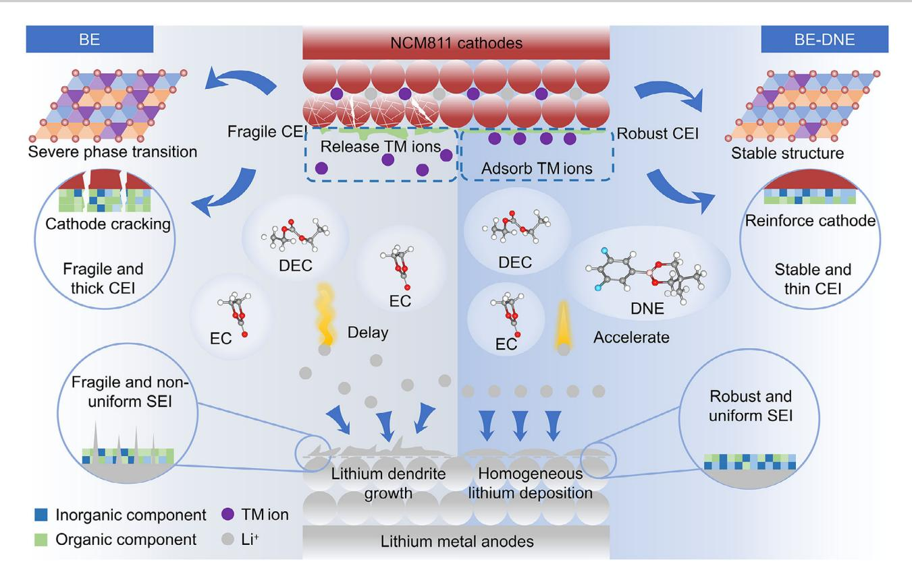
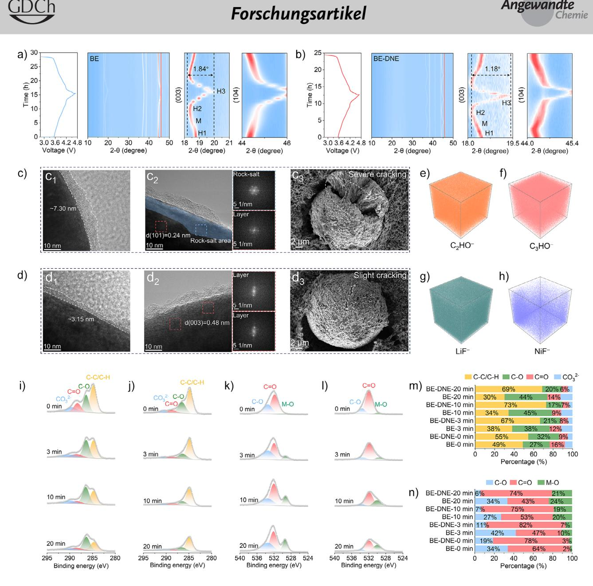
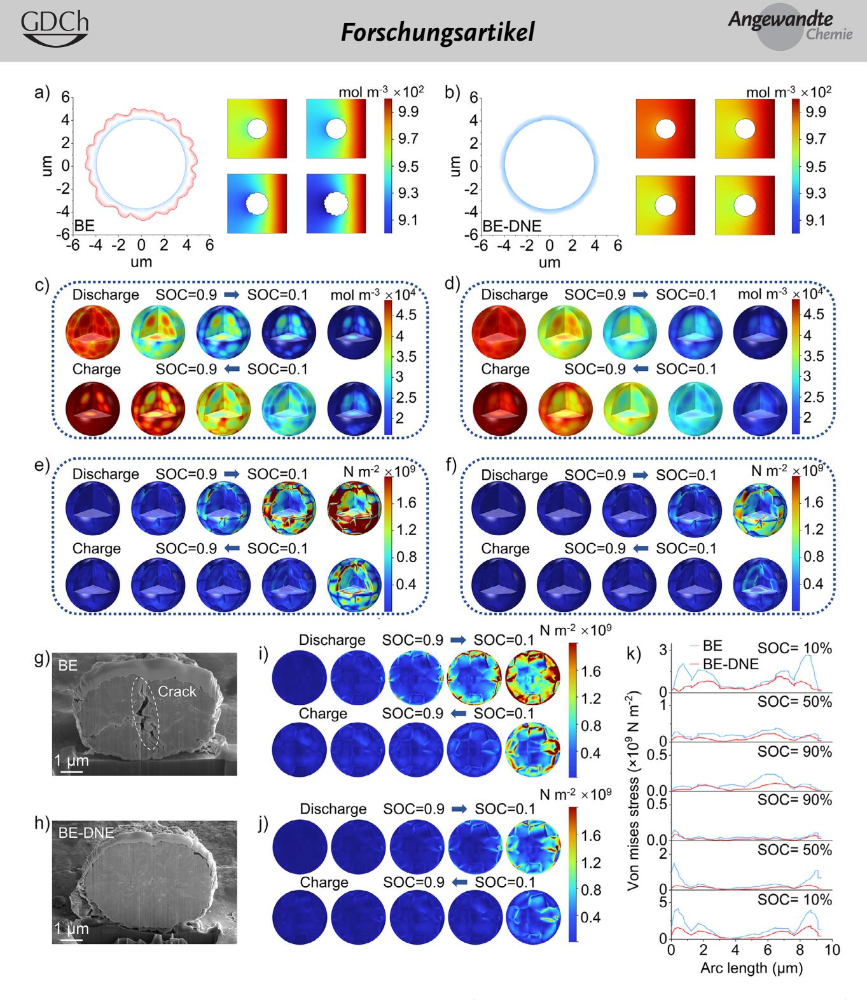
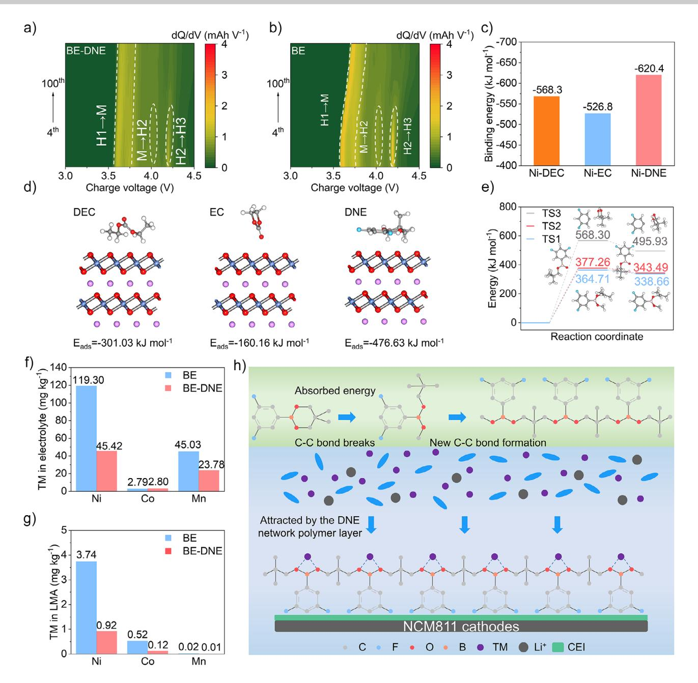
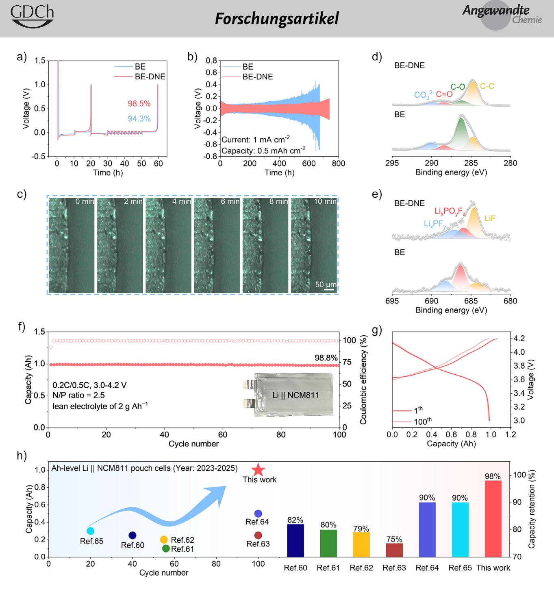

Zitierweise: *Angew. Chem. Int. Ed.* **2025**, e202513321 doi.org/10.1002/anie.202513321 *Lithium Metal Batteries*

# **Single-Molecule Dual-Anchor Design Enables Extreme-Condition Lithium Metal Batteries Through Solvation Reconstruction and Cathode Polymerization**

*Ruizhe Xu*+*, [Anjun Hu](https://orcid.org/0000-0003-4025-0330)*+*,\* Wang Xu*+*, Wei Yang, Fei Li, Yuanjian Li, Yongbiao Mu,\* Lin Zeng, [Jianping Long,](https://orcid.org/0000-0001-7245-8991)\* and Shimou Chen\**

**Abstract:** Lithium metal batteries (LMBs) have emerged as the most promising candidate for next-generation high-energydensity energy storage systems. However, their practical implementation is hindered by the inability of conventional carbonate electrolytes to simultaneously stabilize the lithium metal anode and LiNi0.8Co0.1Mn0.1O2 (NCM811) cathode interfaces, particularly under extreme operating conditions. Herein, we present a transformative molecular design using 3,5-difluorophenylboronic acid neopentyl glycol ester (DNE), which uniquely integrates dual interfacial stabilization mechanisms in a single molecule. Unlike conventional additives, DNE's Lewis acidic B─O bonds chemically anchor PF6 − anions, reconstructing the Li+ solvation sheath to enable a lithium fluoride-rich solid electrolyte interphase that suppresses dendrites and lithium dendrite growth. Simultaneously, its cyclic borate ester undergoes in situ polymerization on the cathode surface, forming a transition metal ion-trapping network that optimizes the cathode electrolyte interphase and mitigates structural degradation in NCM811 cathodes. This synergistic dual-action mechanism endows Li||NCM811 cells with exceptional cycling stability under extreme conditions (4.7 V, 60 °C, and 5 C). Furthermore, a 1 Ah pouch cell with an energy density of 331 Wh kg−1 maintains 98.8% capacity retention after 100 cycles. This dual-interface molecular anchoring strategy establishes a design paradigm for developing high-performance LMBs suitable for operations in extreme conditions.

# *Introduction*

Lithium metal batteries (LMBs), featuring an ultrahigh theoretical capacity (3860 mAh g−1) and the lowest reduction potential (-3.04 V versus standard hydrogen electrode) of the lithium metal anode,[\[1–5\]](#page-10-0) stand as the most promising next-generation high-energy-density battery system. When paired with high-nickel layered oxide cathodes (e.g., LiNi0.8Co0.1Mn0.1O2, NCM811), they exhibit significant potential for constructing reliable high-density energy storage systems.[\[6\]](#page-10-0) The solvation structure of electrolytes, as the "lifeline" of LMBs, fundamentally dictates lithium-ion transport kinetics and electrode/electrolyte interface stability. However, conventional carbonate-based electrolytes fail to concurrently stabilize the highly reactive lithium metal anode and the high-voltage NCM811 cathode interface.[\[7\]](#page-11-0) On the anode side, carbonate solvents readily undergo reductive decomposition on lithium metal surfaces, forming solventderived, organically-dominated solid electrolyte interphases (SEI).[\[8–10\]](#page-11-0) These unstable, thick, and porous SEI layers are prone to fracture under high current densities, triggering continuous lithium dendrite growth and potential shortcircuit risks.[\[11–14\]](#page-11-0) On the cathode side, deep delithiation of NCM811 cathodes under high voltage/temperature induces transition metal (TM) dissolution, which catalyzes electrolyte oxidative decomposition, deteriorates cathode structural stability, and compromises cathode electrolyte interphase (CEI) integrity.[\[15–18\]](#page-11-0) Consequently, developing novel electrolyte systems enabling dual-interface stabilization and rapid ion transport is of critical urgency.[\[19\]](#page-11-0)

[\*] R. Xu+, Dr. A. Hu+, W. Xu+, W. Yang, Prof. Dr. J. Long College of Materials and Chemistry & Chemical Engineering (College of Lithium Resources and Lithium Battery Industry), Chengdu University of Technology, Chengdu 610059, P.R. China E-mail: [anjunhu@cdut.edu.cn](mailto:anjunhu@cdut.edu.cn) [longjianping@cdut.cn](mailto:longjianping@cdut.cn)

Prof. Dr. S. Chen

State Key Laboratory of Chemical Resource Engineering, Beijing Key Laboratory of Electrochemical Process and Technology of Materials, Beijing University of Chemical Technology, Beijing 10029, P.R. China E-mail: [chensm@mail.buct.edu.cn](mailto:chensm@mail.buct.edu.cn)

Dr. Y. Mu, Prof. Dr. L. Zeng Department of Mechanical and Energy Engineering, Southern University of Science and Technology, Shenzhen 518055, P.R. China E-mail: [muyb2021@mail.sustech.edu.cn](mailto:muyb2021@mail.sustech.edu.cn)

Prof. Dr. F. Li

Prof. Dr. Y. Li

Institute of Materials Research and Engineering (IMRE), Agency for Science, Technology and Research (A\*STAR), 2 Fusionopolis Way, Innovis #08-03, Singapore 138634, Republic of Singapore

- [ +] These authors contributed equally to this work.
- Additional supporting information can be found online in the Supporting Information section

School of Materials and Energy, University of Electronic Science and Technology of China, Chengdu 610054, P.R. China

# *Forschungsartikel*

*Figure 1.* Molecular anchoring-driven dual-interface stabilization mechanism.

To address these challenges, recent studies have proposed multi-dimensional improvement strategies through electrolyte engineering.[\[20–22\]](#page-11-0) High-concentration electrolytes (HCEs) promote the formation of anion-derived inorganic SEI by reducing free solvent proportions and inhibiting ligand reactivity, effectively suppressing lithium dendrite,[\[23–28\]](#page-11-0) but their high viscosity and poor wettability limit practical applications.[\[29\]](#page-11-0) Introducing non-solvating solvents (such as hydrofluoroethers) as diluents into HCEs to form localized HCEs (LHCEs) reduces viscosity and improves wettability while maintaining anion-involved solvation structures.[\[30–33\]](#page-11-0) Yet LHCEs suffer from low ionic conductivity due to diluent-encapsulated Li+ solvation sheaths, which restricts ion migration speed.[\[34\]](#page-11-0) Weak solvation electrolytes (WSEs) achieve anion-rich solvation under dilute conditions to reduce viscosity, with all solvents participating in the solvation process (without non-solvating diluents) to enhance ionic conductivity relative to HCEs/LHCEs.[\[35,36\]](#page-11-0) However, the strong Li+−anions interaction in WSEs increases the desolvation energy barriers, leading to low Li+ transference numbers that fail to meet high current density demands.[\[37–39\]](#page-11-0) Moreover, WSEs primarily focus on anode SEI stability but poorly inhibit TM dissolution and cathode structural phase transitions, resulting in inadequate high-voltage stability. In essence, existing strategies predominantly focus on single-interface optimization and face trade-off between ionic conduction and interfacial stability. Additionally, the previously reported dual-interface additives primarily focused on solvation structure optimization and SEI/CEI composition tailoring, with insufficient exploration of cathode stabilization mechanisms and validation under extreme operating conditions.

Herein, we break this paradigm through a single-molecule dual-anchoring strategy using 3,5-difluorophenylboronic acid neopentyl glycol ester (DNE), which uniquely combines two transformative mechanisms in one molecule (Figure 1). Unlike conventional additives, DNE's Lewis acidic B─O bonds chemically anchor PF6 − anions, reconstructing the Li+ solvation sheath to significantly reduce solvent–Li+ coordination and lower the Li+ desolvation energy barrier. Simultaneously, this strategy promotes the formation of a thin and dense LiF-rich SEI layer, effectively inhibiting lithium dendrite growth. Moreover, its cyclic borate ester undergoes voltage-triggered polymerization on cathodes, forming a protective B-/F-rich polymeric network layer, which not only captures dissolved Ni2+ but also optimizes CEI composition and suppresses cathode structure degradation. Leveraging this synergistic dual-action optimization, the BE-DNE-based Li||NCM811 cell achieves 77% capacity retention after 200 cycles at 4.7 V, 70% after 300 cycles at 60 °C/4.5 V, and 76% after 500 cycles at 5 C. Notably, a 1 Ah pouch cell (energy density 331 Wh kg−1, N/P ratio of 2.5, lean electrolyte of 2 g Ah−1) maintains 98.8% capacity after 100 cycles at room temperature, outperforming state-of-the-art LMBs electrolytes. By concomitantly solving solvation structure and interfacial challenges, this work establishes a new design paradigm for extreme-condition batteries.

# *Results and Discussion*

### *Characteristics and Electrochemical Properties of Electrolytes*

Guided by the dual-interface molecular anchoring strategy, cyclic borate molecules with Lewis acidic sites, including 3 cyanophenylboronic acid neopentyl glycol ester (BNE) and DNE, were screened as electrolyte additives. As shown in Figure [2a,b,](#page-3-0) BNE and DNE display elevated highest occupied molecular orbital (HOMO) and depressed lowest unoccupied molecular orbital (LUMO) energy levels. This characteristic enables them to preferentially participate in electrode interface reactions, laying the foundation for dual-interface synergistic modification. Introducing different concentrations (1–3 wt%) of BNE and DNE into the baseline electrolyte (BE) constructed a series of modified electrolytes (BE-BNE-x and BE-DNE-x). As depicted in Figures [2c](#page-3-0) and S1, both modified Li||NCM811 cells show significantly improved cycling performance at 1 C compared to the BEbased cell, with BE-DNE outperforming BE-BNE across all concentrations. Cyclic voltammetry tests (Figure [2d\)](#page-3-0) reveals that BE-DNE-3 enhanced redox peak currents and reduced polarization voltage, indicating its synergistic optimization of dual-interface kinetics. Electrochemical impedance spectroscopy (EIS) (Figure S2) further confirms that BE-DNE-3 exhibited reduced interfacial resistance (*R*CT) after 50 cycles, validating the formation of stable SEI and CEI. At a high cut-off voltage of 4.5 V, BE-DNE-3 based Li||NCM811 cell achieves 83% capacity retention after 300 cycles at 1 C (Figure S3). Electrochemical floating tests (Figure [2e\)](#page-3-0) and linear sweep voltammetry (LSV) (with an oxidation window up to 5.22 V, Figure S4) fully verify its interfacial stability under high-voltage conditions. Owing to its highest HOMO and lowest LUMO energy level, DNE preferentially participates in the formation of a stable SEI/CEI layer. This tailored interface significantly enhances the battery's high-voltage stability. Therefore, BE-DNE-3 (abbreviated as BE-DNE) is selected for subsequent evaluation.

The cut-off voltage was increased to 4.7 V to further evaluate the high-voltage compatibility of BE-DNE (Figures [2f](#page-3-0) and S5). After 100 cycles, the capacity retentions of BE and BE-DNE are were 67.84% and 85.76%, respectively; after 200 cycles, BE-DNE still maintains 77.43%, while BE shortcircuits after 102 cycles. At a high temperature of 60 °C, BE-DNE achieves 82% capacity retention after 250 cycles, far exceeding 33% for BE (Figure S6). Under the combined conditions of high voltage (4.5 V) and high temperature (60 °C), BE-DNE still retains 70% capacity after 300 cycles (Figure [2g\)](#page-3-0). This performance is attributed to the dualinterface synergistic mechanism of DNE molecules anchoring PF6 − anions through Lewis acidic B─O bonds to reconstruct the Li+ solvation sheath and stabilize the anode SEI, while its borate ester ring structure undergoes in situ polymerization to form a cathode CEI capture network. Compared with electrolyte systems reported in the literature (Figure [2h\)](#page-3-0), the optimized Li||NCM811 cell exhibits superior cycling stability under extreme conditions.[\[40–46\]](#page-11-0) In high-rate performance tests, the BE-DNE-based cell delivers 156 mAh g−1 at a 5 C current density (142 mAh g−1 for BE) and achieves 76.22% capacity retention after 500 cycles, whereas the BE-based cell decays to 34.96% capacity and short-circuitsDensity Functional Theory after 331 cycles (Figures S7 and [2i\)](#page-3-0). As shown in Figure [2j,](#page-3-0) our BE-DNE-based cell stands out in 5 C fast charging, long cycling stability (300 cycles), and high capacity retention (83.57%), highlighting the optimization of ionic conduction kinetics by the DNE molecular anchoring strategy.[\[47–52\]](#page-11-0)

# *Solvation Structure of Electrolytes*

The anion-capturing capability of the Lewis acidic B─O bonds in DNE molecules is critical for reconstructing the Li+ solvation sheath. Density functional theory (DFT) calculations reveal a DNE–PF6 − binding energy of −33.77 kJ mol−1 (Figure S8). This spontaneous anion anchoring effect causes PF6 − to dissociate from the Li+ solvation sheath, thereby directly modifying the coordination environment. Molecular dynamics (MD) simulations confirm that the Li+−PF6 − coordination number in BE-DNE decreases from 1.46 in BE to 1.21 (Figure [3a–d\)](#page-4-0), which is attributed to partial binding of PF6 − by DNE. An Li+−DNE coordination peak appears at 1.64 Å in Figure [3b,](#page-4-0) with a low coordination number of 0.36, indicating that DNE prefers to bind PF6 − and that its addition reduces the coordination numbers of Li+ with EC and DEC (as DNE occupies inner solvation sheath space). Nuclear magnetic resonance (NMR) spectra further support this, as 11B NMR spectroscopy confirms that the B─O bonds of DNE coordinate with other ions or molecules after being added to the electrolyte (Figure [3e\)](#page-4-0). Meanwhile, 19F NMR spectroscopy (Figure [3f\)](#page-4-0) reveals a high-field shift of the PF6 − peak in BE-DNE, indicating an increased electron cloud density around PF6 − due to weakened Li+−PF6 − binding. Additionally, consistent observations from 7Li NMR, 31P NMR, and Fourier-transform infrared (FTIR) spectroscopy (Fig. S9) further corroborate these findings. In summary, the Lewis acidic B─O bonds of DNE spontaneously bind PF6 − and hinder Li+ coordination with EC/DEC, fundamentally restructuring the solvation environment as illustrated in Figure [3g.](#page-4-0)

DFT calculations were performed to investigate how changes in solvation structure affect the physicochemical properties of the electrolytes. Figure [3h](#page-4-0) shows that the introduction of DNE lowers the LUMO energy level and raises the HOMO energy level of the solvation sheath, and such modulation of energy levels facilitates the preferential formation of a LiF-rich inorganic SEI. As shown in Figure S10, the addition of DNE increases the Li+ transference number from 0.31 to 0.71, as anion anchoring by DNE prevents solvent molecules from entering the solvation sheath. The exchange current density of BE-DNE (0.591 mA cm−2) in Figure [3i](#page-4-0) is significantly higher than that of BE (0.117 mA cm−2), indicating faster kinetic processes, a result also confirmed by the microcurrent exchange current density in Figure S11. Impedance data of Li||Li cell at different temperatures show that both the Li+ desolvation energy

*Figure 2.* Properties of the electrolyte and its cycling stability at high cut-off voltages. a) HOMO and b) LUMO energy levels of DEC, EC, DNE, LiPF6, and BNE. c) Cycling performance of different electrolytes at a charge–discharge rate of 1 C within a voltage range of 2.8–4.3 V. d) Cyclic voltammetry of Li||NCM811 cell between 3 and 4.5 V in BE, BE-BNE-3, and BE-DNE-3 at a rate of 0.1 mV s−1 . e) Electrochemical floating test of BE, BE-BNE-3, and BE-DNE-3. f) Cycling performance of Li||NCM811 cell at a cut-off voltage of 4.7 V. g) Cycling performance of Li||NCM811 cells under extreme conditions of high voltage (2.8–4.5 V) and high temperature (60 °C). h) Comparison of the cycling performance of Li||NCM811 cell in this study with other reported data under extreme conditions such as high temperature and high voltage. i) Cycling performance of Li||NCM811 cells at 5 C. j) Performance comparison of the Li||NCM811 cell in our work with others at high rates.

**Forschungsartikel** 

*Figure 3.* Solvation structure and kinetic properties of electrolytes. a) and b) Snapshots and radial distribution functions (RDFs) of BE-DNE electrolyte after MD simulations. c) and d) Snapshots and RDFs of BE after MD simulations. e) and f) Comparative 11B and 19F NMR of BE and BE-DNE electrolytes. g) Solvation sheath models of BE and BE-DNE. h) HOMO and LUMO energy level distributions of typical Li+ solvation sheaths in BE and BE-DNE. i) Tafel plots tested via Li||Li symmetric cells. j) Activation energies for charge transfer ( $E_{a,ct}$ ) and SEI layer ( $E_{a,SE1}$ ) calculated by fitting EIS data of LillLi cells at different temperatures. k) GITT profiles of NCM811 electrodes in BE and BE-8CME at different states of charge and corresponding average  $Li^+$  diffusion coefficients. I)–o) DRT results for I, (m) BE, and (n, o) BE-DNE.

 $(E_{\text{a,ct}})$  and interfacial transport activation energy  $(E_{\text{a,SEI}})$  of BE-DNE are lower than those of BE (Figures 3j and S12). The former is attributed to improved solvation structure, while the latter is related to DNE-regulated SEI composition, which will be discussed later.

Galvanostatic intermittent titration technique (GITT) tests on LillNCM811 cell (Figures 3k and S13c,d) demonstrate that the average Li+ diffusion coefficient of BE-DNE  $(24.44 \pm 8.66 \times 10^{-10} \text{ cm}^2 \text{ s}^{-1})$  is higher than that of BE  $(20.15 \pm 6.03 \times 10^{-10} \text{ cm}^2 \text{ s}^{-1})$ , along with higher capacity and lower overpotential (Figure S13a,b). The optimization occurs primarily because the electrolyte exhibits reduced  $Li^+$  migration resistance while simultaneously enabling faster solvation shell stripping. In situ electrochemical impedance spectroscopy (EIS) probed interfacial  $Li^+$  desolvation kinetics in Li $\parallel$ NCM811 cells (Figures 31–o and S14). Four distinct relaxation processes were resolved via distribution of relaxation times (DRT) analysis, characterized by time constants ( $\tau$ ): Li+ migration through the SEI ( $\tau \approx 10^{-3}$  s), Li+ permeation across the CEI ( $\tau \approx 10^{-2}$  s), and desolvation of Li+ from the solvent sheath ( $\tau \approx 10^{-2}$ –10-1 s).[53,54] For SEI impedance ( $R_{SEI}$ ) at  $\tau_{SEI}$  and CEI impedance ( $R_{CEI}$ )

at  $\tau_{CEI}$ , BE-DNE (Figure 3n,o) exhibited more reversible relaxation processes and smaller peaks compared to BE (Figure  $3l,m$ ), indicating superior interfacial stability and kinetics. The significant reduction in charge transfer resistance  $(R_{\text{CT}})$  within the 10-2-10-1 s range directly confirms that DNE-mediated solvation structures optimize the desolvation process at the interface. The observed reduction in Li+ desolvation energy and interfacial transport activation energy, combined with the elevated Li+ diffusion coefficient from GITT and in situ EIS findings, conclusively demonstrate the optimization of Li+ solvation structure, which promotes more efficient  $Li^+$  migration within the electrolyte. These experimental observations align precisely with MD simulation predictions, while the DNE molecular further enhances Li+ migration kinetics through the optimized interphase.

#### **Structure and Composition of CEI**

Based on the bifunctional properties of DNE molecules, we demonstrated the unique advantages of the CEI constructed at the cathode interface under high cut-off voltages through

*Figure 4.* Stability of CEI on 4.7 V NCM811 cathode. a) and b) In situ XRD analysis of NCM811 under 2.8–4.7 V. c) and d) TEM and SEM images of NCM811 cathodes after 100 cycles in (c) BE and (d) BE-DNE, respectively. e)–h) Spatial distribution of different CEI components in BE-DNE demonstrated by TOF-SIMS three-dimensional spatial distribution maps. XPS etching C 1s spectra of NCM811 cathodes after 100 cycles in i) BE and j) BE-DNE. XPS etching O 1s spectra of NCM811 cathodes after 100 cycles in k) BE and l) BE-DNE. m) and n) Percentage of each integrated peak area in XPS spectra.

multidimensional characterization. In situ X-ray diffraction (XRD) monitored structural evolution of the NCM811 cathode during cycling. As shown in Figure 4a,b, the (003) peak of both cathodes shifted to lower angles from 2.5– 3.9 V during charging, reaching the minimum 2θ, which was attributed to an increase in the lattice parameter c driven by enhanced electrostatic repulsion. Subsequently, the (003) peak rapidly shifted to higher angles, indicating lattice c-axis shrinkage caused by the H2-H3 phase transition.[\[55,56\]](#page-11-0) The phase transition continued to 4.3 V, with the reverse process occurring during discharge. Both BE and BE-DNE exhibited the same phase transition trends during cycling. However, the angular shift of the (003) peak for the NCM cathode in BE is 1.84°, whereas that in BE-DNE was only 1.18°, suggesting that the detrimental H2–H3 phase transition is suppressed. Similar trends in structural changes are also observed in the shifts of the (101) and (104) peaks. These results indicate that the unit cell volume change in BE is higher than that in BE-DNE, which increases the possibility of crack formation in NCM811 cathode particles.

Transmission electron microscopy (TEM) further reveals microscopic differences in the CEI. The cathode surface cycled in BE forms a thick and nonuniform CEI (∼7.30 nm) with significant rock-salt phase deposition (Figure 4c1,c2). This dense structure severely hinders Li+ migration and exacerbates capacity loss due to short ionic spacing and strong interactions. In contrast, the electrode surface cycled in BE-DNE is covered by a uniform CEI with a thickness of only ∼3.15 nm, and the layered phase did not undergo extensive transformation into the rock-salt phase (Figure [4d1,d2\)](#page-5-0). Scanning electron microscopy (SEM) images (Figure [4c3,d3\)](#page-5-0) show that the BE-DNE-derived interfacial phase better prevented cathode crack propagation under high voltage, confirming its advantage in interfacial stability.

Time-of-flight secondary ion mass spectrometry (TOF-SIMS) characterized the CEI composition. The CEI formed in BE-DNE shows increased content of inorganic characteristic fragments such as LiF−, reduced organic characteristic fragments like C2HO−, and decreased signal intensities of NiF−, CoF−, etc. (Figures [4e–h](#page-5-0) and S15–S17), demonstrating that the B-/F-rich inorganic inner layer effectively captures dissolved TM ions and suppresses side reactions. Depth XPS analysis revealed that, compared with BE, the CEI of BE-DNE exhibits reduced organic components (such as C─O, C═O) and enhances inorganic components (such as LiF) with increasing sputtering time (Figure [4i–l\)](#page-5-0), forming a CEI structure with an organic-rich outer layer and an inorganicdominated inner layer. The B1s spectrum indicates that DNE decomposition products participated in CEI formation, and the resulting uniform and stable B-/F-rich CEI could effectively protect the high-voltage cathodes. Additionally, the intensity of M─O peaks associated with transition metal dissolution in BE-DNE is suppressed with increasing sputtering time (Figures S18 and [4l\)](#page-5-0), consistent with the TOF-SIMS results. Interestingly, the M─O peak detected at around 529.7 eV in the O 1s spectrum of BE-DNE (Figure [4l\)](#page-5-0) is slightly higher than that in BE (Figure [4k\)](#page-5-0) at 0 min. This observation does not imply intensified active material decomposition but rather indicates that the B─O bonds in the CEI inner layer chelate TM ions (such as Ni2+) via Lewis acidbase interactions, forming stable surface complexes, thereby fundamentally inhibiting TM dissolution. This mechanism is fundamentally different from the passive protection offered by traditional CEI through physical barriers, and it will be further discussed in the following sections.

#### *Simulation and Analysis of Cathode Interface*

COMSOL finite element simulations were employed to investigate the growth morphology, Li+ concentration distribution, and stress evolution of the DNE-derived CEI. As shown in Figure [5a,b,](#page-7-0) the morphological evolution of the CEI and the Li+ concentration distribution near the cathode during charging/discharging (0–100 s) in BE and BE-DNE electrolytes were simulated. The results show that the CEI formed in BE-DNE is denser and more uniform, whereas the CEI in BE exhibits irregular protrusions and a loose structure. Additionally, severe concentration polarization in BE leads to unstable interfacial reactions and nonuniform CEI growth. In contrast, BE-DNE demonstrates a more uniform Li+ concentration distribution near the cathode particles, promoting stable CEI formation.

Further simulations analyzed Li+ concentration and stress distribution within NCM811 particles under high cut-off voltages. As depicted in Figure [5c,d,](#page-7-0) NCM811 particles in BE experience concentration polarization during charging/discharging, which induces structural transformation from the layered to the rock-salt phase. This degradation hinders internal Li+ diffusion, resulting in reduced diffusion coefficients, consistent with the GITT results. In comparison, NCM811 particles in BE-DNE exhibit minimal concentration gradients due to the stable CEI layer. Stress distribution maps in Figure [5e,f](#page-7-0) indicate that poor Li+ diffusion and strain differences arising from concentration gradients in BE induce stress at grain boundaries. The equivalent stress increases significantly during charging, exceeding pre-charging levels, which may lead to irreversible electrode damage. In BE-DNE, however, the uniform Li+ diffusion and stress distribution within NCM811 particles reduce the possibility of crack formation.

To validate these findings, cross-sectional NCM811 particles after 50 cycles at high cut-off voltages were observed using focused ion beam SEM (FIB-SEM). As shown in Figure [5g,h,](#page-7-0) noticeable cracks are observed in NCM811 particles cycled in the BE-based cell after 50 cycles, while the internal structure of particles in BE-DNE remains largely intact, consistent with the simulation results. Utilizing these FIB-SEM results, we develop a COMSOL multiphysics model (Figure S19) to simulate stress evolution along NCM811 grain boundaries during cycling. The simulations (Figure [5i,j\)](#page-7-0) demonstrate that stress gradients originate at the outer particle surfaces and propagate inward through grain boundaries, with BE systems exhibiting highly localized stress concentrations that drive crack formation. In contrast, the DNE-derived CEI uniformly distributes interfacial stresses during Li+ insertion/extraction, effectively suppressing stress concentration at grain boundaries. Slice analysis of stress distribution along defined pathways (Figure [5k\)](#page-7-0) confirms these findings, collectively demonstrating that BE-DNE's stable CEI mechanically buffers NCM811 particles against degradation by dispersing stress concentrations, thereby validating its superior cathode protective capabilities under high-voltage operation.

### *Protection Mechanism for NCM811 Cathode*

The addition of DNE enhances the stability of BE under extreme conditions such as high temperature and voltage, as evidenced by the differential capacity (dQ/dV) curves of Li||NCM811 cell. Phase transition information during Li+ insertion/extraction can be inferred from the dQ/dV curves (Figures [6a,b](#page-8-0) and S20). In the BE system, significant changes in the intensity of phase transition peaks assigned to the hexagonal H1 + monoclinic M and H2 + H3 phases were observed, along with increased polarization in the H2 + H3 phase transition voltage after 100 cycles. This reflects an increase in microcracks due to volume expansion (Figures [6a,b](#page-8-0) and S19). In contrast, the BE-DNE system exhibits smaller voltage variations, indicating that its CEI effectively suppresses irreversible H2 + H3 phase transitions.

The high-voltage stability of BE-DNE not only stems from the thermal stability of DNE's phenyl group but also from the ability of DNE molecules to adsorb TM ions. DFT calculations show that DNE has a higher binding

*Figure 5.* Simulation of cathode interface. a) Comparison of CEI thickness and Li+ concentration around cathode particles in BE and b) BE-DNE. Li+ concentration distribution within cathode particles during charging/discharging in c) BE and d) BE-DNE. Stress distribution within cathode particles during charging/discharging in e) BE and f) BE-DNE. Cross-sectional views of cathode particles after 50 cycles in g) BE and h) BE-DNE, respectively. Stress distribution on the cross-section of cathode particles during charging/discharging in i) BE and j) BE-DNE. k) Stress distribution curves along the selected X-axis within the NCM811 particles.

energy to Ni2+ than EC and DEC and is more readily adsorbed by the NCM811 (003) crystal plane (Figures [6c,d](#page-8-0) and S21). Additionally, based on the hard/soft acid/base theory analysis confirms DNE's multidentate coordination capability toward both Co2+ and Mn2+ ions. The resulting CEI can effectively adsorb TM ions, reducing their dissolution and mitigating catalytic side reactions with the electrolyte. XPS results indicate that the M─O peak at 529.7 eV in BE-DNE originates from TM ion adsorption by the CEI rather than side reactions of active materials (Figure S22a), and its CEI structure with an outer inorganic and inner organic layer further suppresses TM dissolution (Figure S22b–d).

*Forschungsartikel*

*Figure 6.* Protection mechanism of CEI. a) and b) dQ/dV curves in the (a) charging and (b) discharging processes of BE-DNE. c) Binding energies of DEC, EC, and DNE with Ni2+. d) Adsorption energies of different molecules on the (003) crystal plane of NCM811. e) Energy distribution of different oxidation decomposition pathways of DNE. f) and g) Contents of dissolved TM ions in (f) electrolytes and (g) deposited on lithium anodes. h) Schematic illustration of the CEI constructed in BE-DNE.

Further DFT calculations were conducted on the oxidation structure of DNE molecules under Ni2+ catalysis, as shown in Figure S23. After oxidation, the bond lengths of C─C bonds in DNE molecules all exhibit an increasing trend, suggesting that C─C bond cleavage occurs during oxidation, leading to the formation of new compounds. By analyzing different decomposition pathways of DNE molecules (Figure 6e), it was found that C─C bond breaking requires overcoming an energy barrier of approximately 364.71 kJ mol−1, and this pathway is more favorable among the three possible decomposition modes. Inductively coupled plasma optical emission spectrometry (ICP-OES) was used to measure the content of TM ions deposited on the lithium anode and in the residual electrolyte after 100 cycles of the Li||NCM811 cell. The results in Figure 6f,g shows that, compared with BE, the contents of TM ions deposited on the lithium anode and present in the residual electrolyte in BE-DNE are significantly lower in BE-DNE, indicating that DNE can effectively adsorb TM ions, which is consistent with the DFT calculation results.

Based on the above results, a network polymer model was constructed (Figure 6h). After oxidation, DNE molecules

*Figure 7.* Anode interfacial stability and battery performance. a) CE of Li||Cu cells measured by the Aurbach method. b) Cycling performance of Li symmetric cells. c) In situ optical images of Li deposition process in BE-DNE. d) and e) C 1s and F 1s XPS spectra of the Li anode surface after 100 cycles. f) and g) Performance of Li||NCM811 pouch cell. h) Performance comparison of pouch cell in our study with other analogous systems.

adsorbed on the cathode surface undergo C─C bond cleavage, with the generated reactive fragments polymerizing through the formation of new C─C bonds. Subsequently, multiple DNE molecules crosslink and polymerize in situ to form a network polymer layer on the cathode surface. The gel permeation chromatography (GPC) and FTIR results (Figure S24) of BE-DNE further corroborate these conclusions. The B─O bonds in this polymer layer act as Lewis base sites that chelate TM ions through coordination, forming stable surface complexes (e.g., B─O─Ni2+), thereby inhibiting the detrimental dissolution of TM ions. Unlike conventional CEI

structures featuring an outer organic/inner inorganic bilayer, DNE enriches the organic component in the CEI outer layer. This DNE-derived interface enhances Li+ transport kinetics and demonstrates superior mechanical integrity versus conventional CEI. Experimental data demonstrate that the unique CEI formed by DNE molecules provides effective protection for NCM811 cathodes under high cutoff voltages and elevated temperatures, while also capturing dissolved TM ions, thereby significantly enhancing the overall stability of the cell under harsh operating conditions (Table S2).

#### *Effects on Lithium Anode and Pouch Cell Evaluation*

Li||Cu and Li||Li cells were assembled using BE and BE-DNE electrolytes, respectively, to evaluate Coulombic efficiency (CE) and cycling performance. As shown in Figure [7a,](#page-9-0) the CE of BE-DNE (98.5%) measured by the Aurbach method is higher than that of BE (94.3%). The cycling performance of Li||Li cells (Figure [7b\)](#page-9-0) reveals that after 600 hours of cycling at 1 mA cm−2, the voltage polarization in BE was significantly higher than in BE-DNE. Li||NCM811 cells were fabricated to assess the performance of both electrolytes under high current density. In situ optical microscopy was further employed to observe the lithium deposition morphology on lithium metal anodes. Figures S25 and [7c](#page-9-0) present the lithium deposition morphologies of Li||Li cells assembled with BE and BE-DNE at 1 mA cm−2, respectively. In contrast to BE that exhibits loose and rough dendritic growth, the lithium metal anode in BE-DNE exhibits more uniform and dense lithium deposition. Results from SEM (Figure S26a,b) and atomic force microscopy (AFM, Figure S26c) are consistent with the in situ optical microscopy observations, confirming improved lithium deposition behavior in BE-DNE. The composition of the SEI formed by the two electrolytes is further analyzed using XPS. As shown in Figures [7d,e](#page-9-0) and S27, the BE-DNE-derived SEI contains fewer organic components and a higher proportion of inorganic species compared to that formed in BE. Such an SEI structure exhibits enhanced electrochemical stability and facilitates fast Li+ transport. These results demonstrate that DNE improves lithium deposition and stripping behavior on the anode, which can be attributed to its ability to optimize the electrolyte solvation environment.[\[57–59\]](#page-11-0)

Additionally, under stringent conditions (N/P ratio of 2.5, lean electrolyte of 2 g Ah−1), 1 Ah Li||NCM811 pouch cells with an energy density of 331 Wh kg−1 were fabricated. The pouch cell employing BE-DNE maintains 98.8% of its capacity retention after 100 cycles at 0.2 C charge/0.5 C discharge (Figure [7f,g\)](#page-9-0). Compared to previously reported analogous systems,[\[60–65\]](#page-12-0) the pouch cell with the designed electrolyte demonstrates significant advantages in terms of charge/discharge capacity, cycling stability, and capacity retention (Figure [7h\)](#page-9-0). This performance improvement stems from the synergistic effect of the dual-interface molecular anchoring strategy. A uniform SEI on the anode side suppresses dendrite formation, while a TM-trapping network on the cathode side prevents structural degradation. These results highlight the practical feasibility of incorporating DNE into commercial carbonate electrolytes.

# *Conclusion*

This study demonstrates a transformative molecular design strategy through the development of DNE, a cyclic borate ester molecule that uniquely combines Lewis-acidic anion anchoring and in situ cathode polymerization in a single molecular scaffold. Unlike conventional additives, DNE's electron-deficient B─O bonds chemically reconstruct the Li+ solvation sheath, enabling simultaneous optimization of ion transport kinetics (tLi+ = 0.71) and LiF-rich SEI formation. At the cathode interface, DNE undergoes voltage-triggered polymerization to form a transition metal-trapping network, fundamentally addressing TM dissolution. The synergistic dual-action mechanism enables Li||NCM811 cells retain 77% capacity after 200 cycles at 1 C under high voltage of 4.7 V, maintain 70% capacity after 300 cycles at 60 °C under 4.5 V, and preserve 76% capacity after 500 cycles at 5 C under fastcharging conditions. Furthermore, a 1 Ah pouch cell (energy density: 331 Wh kg−1) assembled under an N/P ratio of 2.5 and lean electrolyte of 2 g Ah−1, retains 98.8% capacity after 100 cycles. This molecular anchoring-mediated dual-interface engineering provides a design paradigm for the operation of lithium metal batteries in extreme conditions such as rapid charging of electric vehicles and high-temperature energy storage.

# *Acknowledgements*

This work was supported by the National Natural Science Foundation of China (52425207, 52402226), the Natural Science Foundation of Sichuan Province (2024NSFSC1016), and the Key Laboratory of Sichuan Province for Lithium Resources Comprehensive Utilization and New Lithium Based Materials for Advanced Battery Technology (LRMKF202405). The authors appreciate SCI-GO (www.scigo.com) for the XPS analysis, Ms. Shi Qin-ling from Scientific Compass (www.shiyanjia.com) for the NMR analysis, and Phadcalc (www.phadcalc.com) for the MD simulation.

# *Conflict of Interests*

The authors declare no conflict of interest.

# *Data Availability Statement*

Research data are not shared.

**Keywords:** Extreme conditions • Interface stabilization • Lithium metal batteries • Molecular anchoring • Transition metal dissolution

- [1] Z. Cui, Z. Jia, D. Ruan, Q. Nian, J. Fan, S. Chen, Z. He, D. Wang, J. Jiang, J. Ma, X. Ou, S. Jiao, Q. Wang, X. Ren, *Nat. Commun.* **2024**, *15*, 2033.
- [2] K. Li, A. Hu, R. Xu, W. Xu, B. Yang, T. Li, Y. Li, Z. W. Seh, J. Long, S. Chen, *Adv. Energy Mater.* **2025**, *15*, 2501236.
- [3] T. Li, A. Hu, Y. Li, B. Yang, K. Li, K. Chen, J. Jiang, F. Li, Z. W. Seh, J. Wang, J. Long, *Adv. Funct. Mater.* **2025**, *35*, 2507310.
- [4] R. Xu, A. Hu, Z. Wang, K. Chen, J. Chen, W. Xu, G. Wu, F. Li, J. Wang, J. Long, *J. Energy Chem.* **2025**, *105*, 35–43.
- [5] Z. Wang, C. Su, R. Xu, K. Li, B. Yang, T. Li, K. Chen, W. Xu, J. Chen, F. Li, B. Li, A. Hu, J. Long, *Energy Storage Mater.* **2025**, *75*, 104105.
- [6] Z. Wu, C. Wang, Z. Hui, H. Liu, S. Wang, S. Yu, X. Xing, J. Holoubek, Q. Miao, H. L. Xin, P. Liu, *Nat. Energy* **2023**, *8*, 226–227.

- [7] K. Chen, A. Hu, G.-R. Zhu, Y. Li, J. Jiang, B. Yang, T. Li, K. Li, J. Chen, W. Xu, Z. Wang, R. Xu, W. Yang, J. Wang, G. Wu, J. Long, Z. W. Seh, *ACS Nano* **2025**, *19*, 14284–14298.
- [8] S. Xia, C. Li, J. A. Yuwono, Y. Wang, C. Wang, M. Li, X. Zhang, J. Yang, J. Mao, S. Zheng, Z. Guo, *Angew. Chem. Int. Ed.* **2024**, *63*, e202409327.
- [9] S. Xia, F. Li, X. Zhang, L. Luo, Y. Zhang, T. Yuan, Y. Pang, J. Yang, W. Liu, Z. Guo, S. Zheng, *ACS Nano* **2023**, *17*, 20689– 20698.
- [10] S. Xia, Z. Jiang, X. Zhao, J. A. Yuwono, X. Zhang, X. Zhang, G. Yang, J. Yang, Y. Jiang, J. Mao, K. Davey, Z. Guo, S. Zheng, *Adv. Energy Mater.* **2024**, *14*, 2304407.
- [11] W. Yang, J. Cai, C. Xu, A. Chen, Y. Wang, Y. Shi, P. He, H. Zhou, *Adv. Mater.* **2025**, *37*, 2505285.
- [12] X. Zhao, C. Wang, X. Fan, Y. Li, D. Li, Y. Zhang, L. Fan, *InfoMat* **2025**, *7*, e70012.
- [13] J. Gui, Z. Huang, J. Lu, L. Wang, Q. Cao, H. Hu, M. Zheng, K. Leng, Y. Liang, *Carbon Neutralization* **2025**, *4*, e182.
- [14] J. Park, D. Lee, S. Kim, M. J. Lee, W. Lee, N.-S. Choi, B. J. Kim, *ACS Nano* **2025**, *19*, 15220–15255.
- [15] C. Wang, X. Zhao, D. Li, C. Yan, Q. Zhang, L. Fan, *Angew. Chem. Int. Ed.* **2024**, *63*, e202317856.
- [16] W. Wang, Y. Chen, Z. Wang, M. Li, L. Ouyang, P. Xiao, J. Wu, J. Liu, *Adv. Funct. Mater.* **2025**, *35*, 2507638.
- [17] Z. Wen, W. Fang, F. Wang, H. Kang, S. Zhao, S. Guo, G. Chen, *Angew. Chem. Int. Ed.* **2024**, *63*, e202314876.
- [18] W. Tang, T. Zhou, Y. Duan, M. Zhou, Z. Li, R. Liu, *Carbon Neutralization* **2024**, *3*, 386–395.
- [19] J. Chen, A. Hu, K. Chen, Y. Xia, W. Xu, K. Li, B. Yang, T. Li, R. Xu, Z. Wang, B. Li, F. Li, J. Long, *Nano Energy* **2025**, *139*, 110959.
- [20] L. He, Y. Shao, S. Li, Y. Nie, Y. Chu, G. Feng, X. Liu, Q. Li, D. Luo, X. Wang, Z. Chen, *Angew. Chem. Int. Ed.* **2025**, *64*, e202507222.
- [21] Y. Hou, Y. Wang, Z. Wei, Z. Wu, D. Li, Q. Li, S. Li, Z. Chen, Y. Wang, G. Liang, K. Wang, C. Zhi, *Angew. Chem. Int. Ed.* **2025**, *64*, e202505147.
- [22] Z. Liu, S. Zhang, H. Zhang, B. Ma, H. Zhu, T. Zhou, L. Li, X. Xiao, R. Li, L. Chen, T. Deng, X. Fan, *Angew. Chem. Int. Ed.* **2025**, *64*, e202506395.
- [23] B. Yang, Y. Wang, R. Zheng, W. Yang, Y. Li, T. Li, K. Li, A. Hu, J. Long, S. Ding, *Angew. Chem. Int. Ed.* **2025**, *64*, e202508486.
- [24] S. Kondou, M. Abdullah, I. Popov, M. L. Martins, L. A. O'Dell, H. Ueda, F. Makhlooghiazad, A. Nakanishi, T. Sudoh, K. Ueno, M. Watanabe, P. Howlett, H. Zhang, M. Armand, A. P. Sokolov, M. Forsyth, F. Chen, *J. Am. Chem. Soc.* **2024**, *146*, 33169–33178.
- [25] D. Lee, M. Shin, *ACS Energy Lett.* **2025**, *10*, 658–667.
- [26] Y. Yin, J. Holoubek, K. Kim, A. Liu, B. Bhamwala, S. Wang, B. Lu, K. Yu, H. Gao, M. Li, G. Raghavendran, G. Cai, W. Li, P. Liu, Y. S. Meng, Z. Chen, *Angew. Chem. Int. Ed.* **2025**, *64*, e202420411.
- [27] T. D. Pham, A. Bin Faheem, J. Kim, K. Kwak, K. Lee, *Adv. Funct. Mater.* **2023**, *33*, 2305284.
- [28] M. Mominur Rahman, E. Hu, *Angew. Chem. Int. Ed.* **2023**, *62*, e202311051.
- [29] C. Shi, Z. Li, M. Wang, S. Hong, B. Hong, Y. Fu, D. Liu, R. Tan, P. Wang, Y. Lai, *Energy Environ. Sci.* **2025**, *18*, 3248–3258.
- [30] C. Wang, K. Wan, P. Liu, C. Zeng, S. Wang, Y. Huang, Y. Zhang, H. Xiao, C. Shu, Z. Liang, *Angew. Chem. Int. Ed.* **2025**, *64*, e202506083.
- [31] R. Liu, Y.-S. Xu, R. Zhou, S.-J. Tan, Y.-N. Li, S.-J. Jiang, S. Xin, Y.-G. Guo, F.-F. Cao, *Angew. Chem. Int. Ed.* **2025**, *64*, e202416610.
- [32] M. Li, Y. Liu, X. Yang, Q. Zhang, Y. Cheng, L. Deng, Q. Zhou, T. Cheng, M. D. Gu, *Adv. Mater.* **2024**, *36*, 2404271.
- [33] Y. M. Kim, B. K. Park, S. Kang, S. J. Yang, S. H. Choi, D. Yoo, K. J. Kim, *Adv. Funct. Mater.* **2024**, *34*, 2408365.

- [34] Z. Piao, X. Wu, H.-R. Ren, G. Lu, R. Gao, G. Zhou, H.-M. Cheng, *J. Am. Chem. Soc.* **2023**, *145*, 24260–24271.
- [35] Z. Qu, P. Xue, X. Hu, Q. Ji, Y. Dai, L. Ma, S.-S. Lyu, *ACS Energy Lett.* **2025**, *10*, 2913–2923.
- [36] H. Xie, L. Liu, H. Chen, K. S. Hui, Z. Kuang, G. Zhou, Y. Sun, H.-M. Cheng, K. N. Hui, *Adv. Mater.* **2025**, *37*, 2504248.
- [37] S. C. Kim, J. Wang, R. Xu, P. Zhang, Y. Chen, Z. Huang, Y. Yang, Z. Yu, S. T. Oyakhire, W. Zhang, L. C. Greenburg, M. S. Kim, D. T. Boyle, P. Sayavong, Y. Ye, J. Qin, Z. Bao, Y. Cui, *Nat. Energy* **2023**, *8*, 814–826.
- [38] G. Wang, Q. Ma, T. Zhang, Y. Deng, G. Zhang, *Nano Energy* **2025**, *140*, 111064.
- [39] I. R. Choi, Y. Chen, A. Shah, J. Florian, C. Serrao, J. Holoubek, H. Lyu, E. Zhang, J. H. Lee, Y. Lin, S. C. Kim, H. Park, P. Zhang, J. Lee, J. Qin, Y. Cui, Z. Bao, *Nat. Energy* **2025**, *10*, 365–379.
- [40] G. Hu, Z. Yang, X. Zhang, Y. Liu, Y. Lin, S. Chen, Y. Chen, B. Sa, Y. Zhang, *Energy Storage Mater.* **2024**, *69*, 103402.
- [41] S. Zhang, F. Sun, X. Du, X. Zhang, L. Huang, J. Ma, S. Dong, A. Hilger, I. Manke, L. Li, B. Xie, J. Li, Z. Hu, A. C. Komarek, H.-J. Lin, C.-Y. Kuo, C.-T. Chen, P. Han, G. Xu, Z. Cui, G. Cui, *Energy Environ. Sci.* **2023**, *16*, 2591–2602.
- [42] W. Cai, Y. Deng, Z. Deng, Y. Jia, Z. Li, X. Zhang, C. Xu, X. Zhang, Y. Zhang, Q. Zhang, *Adv. Energy Mater.* **2023**, *13*, 2301396.
- [43] Y. Li, B. Wen, N. Li, Y. Zhao, Y. Chen, X. Yin, X. Da, Y. Ouyang, X. Li, P. Kong, S. Ding, K. Xi, G. Gao, *Angew. Chem. Int. Ed.* **2025**, *64*, e202414636.
- [44] S. Chen, R. Yang, G. Wu, Z. Zheng, W. Wang, S. Wang, Y. Gao, *Energy Storage Mater.* **2025**, *78*, 104276.
- [45] J. Lian, S. Tan, J. Lou, J. Lan, W. Cui, Z. Han, G. Zheng, T. Hou, W. Lv, M. Liu, Z. Wang, *Adv. Funct. Mater.* **2025**, *35*, 2421802.
- [46] M. Li, L. Xu, A. He, H. Xie, K. Deng, *Energy Storage Mater.* **2025**, *77*, 104208.
- [47] M. M. Rahman, S. Tan, Y. Yang, H. Zhong, S. Ghose, I. Waluyo, A. Hunt, L. Ma, X.-Q. Yang, E. Hu, *Nat. Commun.* **2023**, *14*, 8414.
- [48] P. Zhou, H. Zhou, Y. Xia, Q. Feng, X. Kong, W. Hou, Y. Ou, X. Song, H. Zhou, W. Zhang, Y. Lu, F. Liu, Q. Cao, H. Liu, S. Yan, K. Liu, *Angew. Chem. Int. Ed.* **2024**, *63*, e202316717.
- [49] T. Yang, L. Li, J. Zou, Y. Yao, Q. Zhang, Z. Jiang, Y. Li, *Adv. Funct. Mater.* **2024**, *34*, 2404945.
- [50] Y. Song, J. Ju, J. Wang, K. Li, X. Wang, R. Gao, H. Lu, D. Chao, Y. Wang, *Adv. Mater.* **2025**, *37*, 2500941.
- [51] Y. Li, T. Xue, J. Yan, Y. Chen, K. Shi, T. Lian, J. Qian, R. Chen, *Angew. Chem. Int. Ed.* **2025**, *64*, e202504116.
- [52] D. J. Kautz, X. Cao, P. Gao, B. E. Matthews, Y. Xu, K. S. Han, F. Omenya, M. H. Engelhard, H. Jia, C. Wang, J. Zhang, W. Xu, *Adv. Energy Mater.* **2023**, *13*, 2301199.
- [53] Y. Lu, C.-Z. Zhao, J.-Q. Huang, Q. Zhang, *Joule* **2022**, *6*, 1172– 1198.
- [54] S. Zhang, R. Li, T. Deng, Q. Ma, X. Hong, H. Zhang, R. Zhang, S. Ding, Y. Wu, H. Zhu, M. Li, H. Zhang, D. Lu, B. Ma, L. Lv, Y. Li, L. Chen, Y. Shen, R. Guo, X. Fan, *Nat. Energy* **2024**, *9*, 1285–1296.
- [55] B. Wang, K. Li, G. Xu, Z. Zhang, X. Wang, J. Sun, Y. Song, X. Zhang, Y. Liang, D. Kong, Y. Qiu, Q. Teng, X. Cui, J. Chen, J. Zhao, J. Wang, H. Yang, J. Huang, Y. Tang, *Angew. Chem. Int. Ed.* **2025**, *64*, e202502725.
- [56] M. Wang, M. Li, J. Wu, Y. Meng, J. Hao, D. Zhou, C. Han, B. Li, *Adv. Mater.* **2025**, *37*, 2502076.
- [57] S. Pal, X. Lin, P. Apostol, C. Ungureanu, D. Tie, V. R. Bakuru, D. Rambabu, N. Campagnol, A. Kachmar, C. Poleunis, G. Barozzino-Consiglio, M. Buga, A. Vlad, *ACS Energy Lett.*. **2024**, *9*, 4399-4407.
- [58] Y. Zhang, Z. Yuan, B. Xie, J. Cao, H. Zhang, S. Zhang, D. Wang, F. Sun, X. Du, J. Zhang, G. Cui, *Adv. Funct. Mater.* **2025**, *35*, 2504367.

- [59] G. Li, X. Lyu, A. Nguyen, R. Kou, C. George, S. Wu, R. Li, K. Wang, T. Li, D. Wang, *Adv. Energy Mater.* **2025**, *15*, 2405680.
- [60] J. Chen, D. Zhang, L. Zhu, M. Liu, T. Zheng, J. Xu, J. Li, F. Wang, Y. Wang, X. Dong, Y. Xia, *Nat. Commun.* **2024**, *15*, 3217.
- [61] J.-X. Guo, F. Jiang, N.-L. Shen, W.-B. Tang, T. Wang, Y. Ma, Y. Zhong, J. He, Z. Zhu, F. Wang, X.-B. Cheng, Y. Wu, *ACS Energy Lett.*. **2024**, *9*, 4800-4809.
- [62] P. Liang, H. Hu, Y. Dong, Z. Wang, K. Liu, G. Ding, F. Cheng, *Adv. Funct. Mater.* **2024**, *34*, 2309858.
- [63] F. Li, J. Liu, H. Wang, Y. Ren, X. Tang, G. Li, *ACS Energy Lett.*. **2025**, *10*, 779-787.
- [64] Y. Ou, W. Hou, D. Zhu, C. Li, P. Zhou, X. Song, Y. Xia, Y. Lu, S. Yan, H. Zhou, Q. Cao, H. Zhou, H. Liu, X. Ma, Z. Liu, H. Xu, K. Liu, *Energy Environ. Sci.* **2025**, *18*, 1464-1476.
- [65] X. Zhu, J. Chen, G. Liu, Y. Mo, Y. Xie, K. Zhou, Y. Wang, X. Dong, *Angew. Chem., Int. Ed.* **2025**, *64*, e202412859.

Manuscript received: June 18, 2025 Revised manuscript received: August 15, 2025 Accepted manuscript online: September 01, 2025 Version of record online: ,