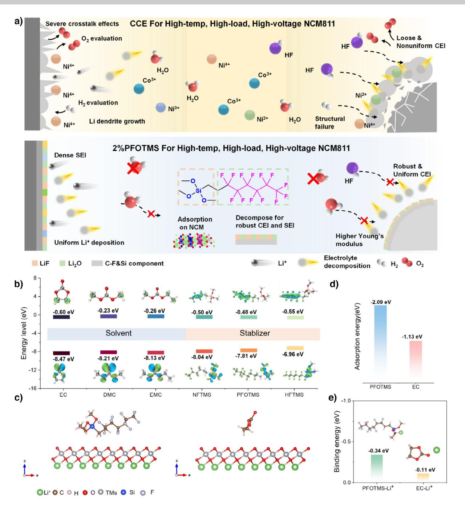
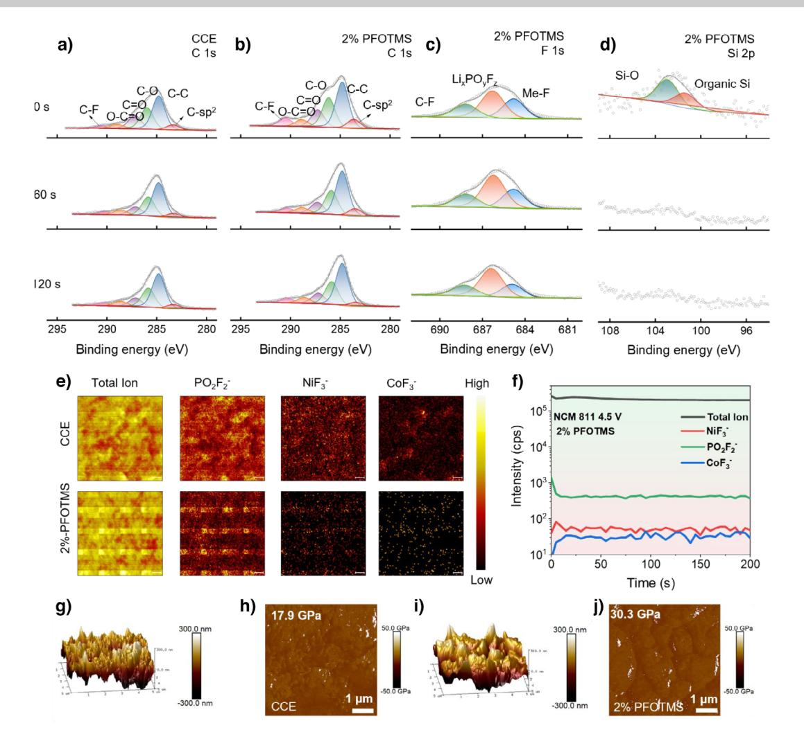
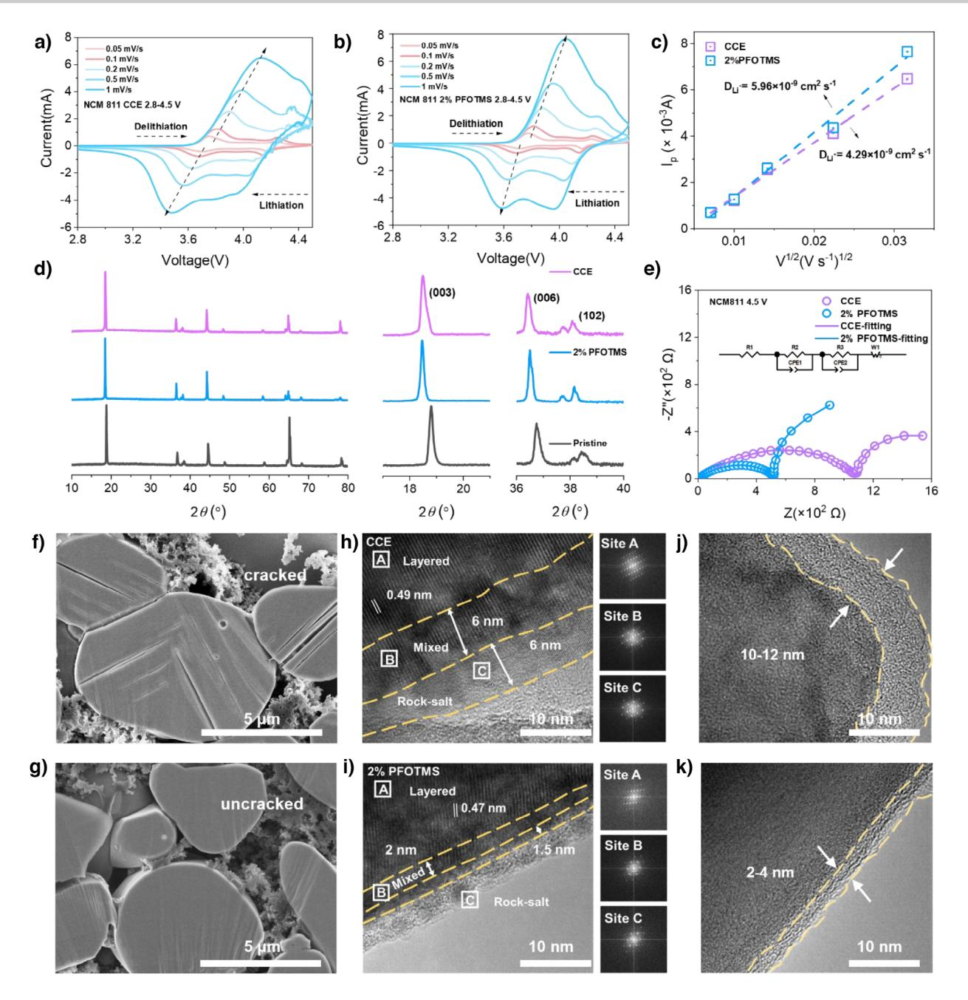
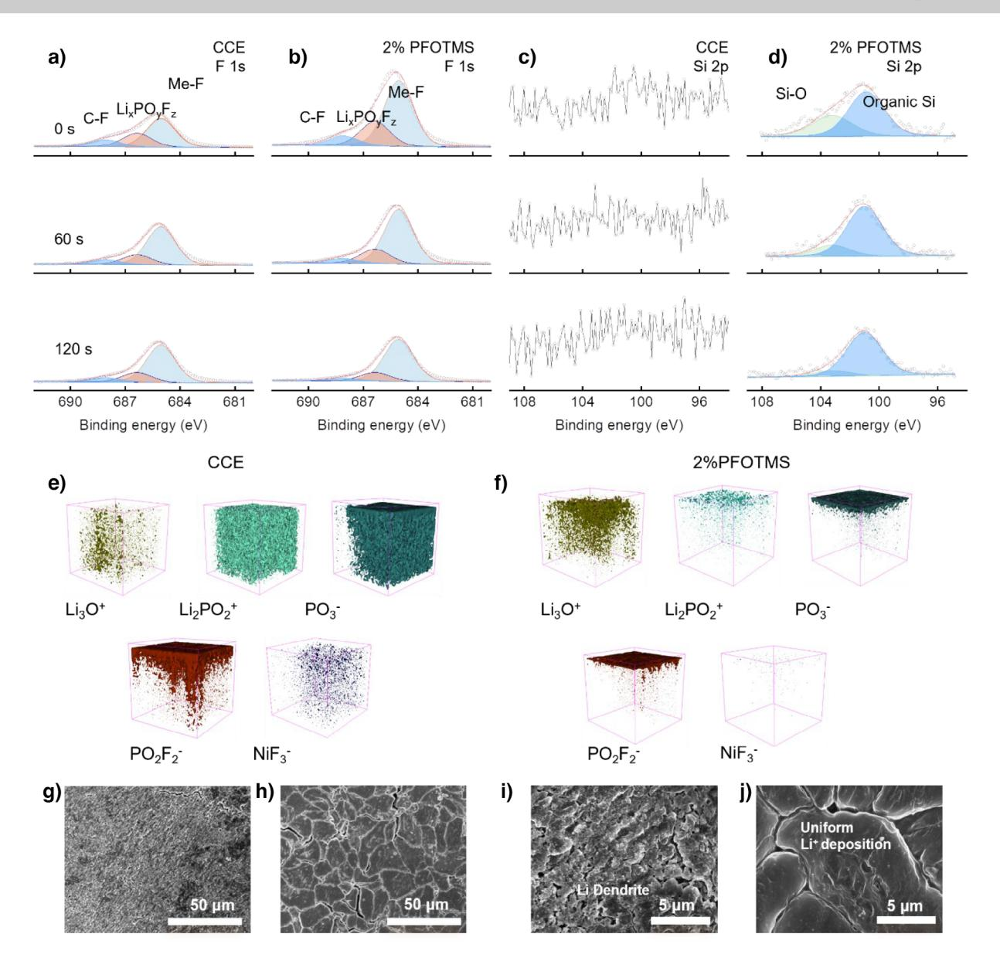
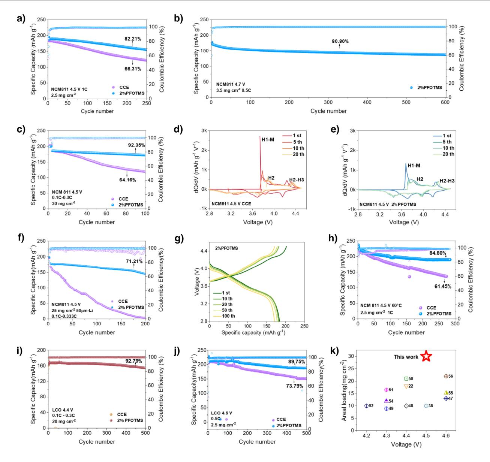

How to cite: *Angew. Chem. Int. Ed.* **2025**, *64*, e202508008 doi.org/10.1002/anie.202508008 *Lithium Metal Batteries*

# **Si**─**O Molecular Engineering Enhances Cathode-Anode Interface Stability for High-Loading and High-Voltage Layered Cathode-Lithium Metal Batteries**

*Shangjuan Yang*+*, Zhoujie Lao*+*, Zhuo Han, Hai Su, Guanyou Xiao, Guangmin Zhou,\* [Danfeng Zhang,](https://orcid.org/0000-0002-6273-3395)\* and [Yan-Bing He\\*](https://orcid.org/0000-0001-5787-5498)*

**Abstract:** Nickel-rich layered cathodes and lithium metal anode are promising for the next generation high-energydensity batteries. However, the unstable electrodeelectrolyte interface induces structural degradation and battery failure under high-voltage and high-loading conditions. Herein, we report a fluorosilane-coupled electrolyte stabilizer with 1H, 1H, 2H, 2H-perfluorooctyltrimethoxysilane (PFOTMS), which presents higher adsorption energy with LiNi0.8Co0.1Mn0.1O2 cathode than solvents through the conjugation of Si─O bonds and therefore is oxidized on its surface to derive an interfacial layer rich in F and Si─O species. This architecture effectively stabilizes the cathode structure, suppresses transition metal migration, and promotes Li+ conduction and uniform deposition, which also suppresses the side reactions of electrolyte with both cathode and anode. This unique interfacial stabilization mechanism enables the Li||NCM811 battery to achieve a capacity retention rate of 80.8% after 600 cycles at 4.7 V. The Li||LiCoO2 cell with a high mass loading of 20 mg cm−2 achieves a remarkably high-capacity retention of 92.79% after 500 cycles at 4.4 V. This work proposes an interfacial stabilization that overcomes high-voltage limitations in practical nickel-rich cathode/lithium metal batteries.

# *Introduction*

The global energy and climate crises have accelerated the growth of the new energy vehicle industry. However,

Shenzhen All-Solid-State Lithium Battery Electrolyte Engineering Research Center, Institute of Materials Research (IMR), Tsinghua Shenzhen International Graduate School, Shenzhen 518055, China E-mail: [guangminzhou@sz.tsinghua.edu.cn](mailto:guangminzhou@sz.tsinghua.edu.cn) [dfzhang@nuc.edu.cn](mailto:dfzhang@nuc.edu.cn)

[he.yanbing@sz.tsinghua.edu.cn](mailto:he.yanbing@sz.tsinghua.edu.cn)

D. Zhang

School of Energy and Power Engineering, North University of China, Taiyuan 030051, P.R. China

challenges such as range anxiety and insufficient charging infrastructure necessitate the development of batteries with higher energy density.[\[1,2\]](#page-8-0) Nickel-rich layered cathodes can further enhance their energy density by increasing the cut-off voltage and areal capacity, making them strong candidates for cathode materials to achieve 500 Wh kg−1 power batteries.[\[3\]](#page-8-0)

However, due to the high nickel content, the substantial deintercalation of lithium ions (Li+) at high voltages (>4.3 V) leads to irreversible structural phase transitions and microcracks that hinder Li+ diffusion.[\[4–8\]](#page-8-0) Furthermore, the heightened oxidative potential activates transition metal (TM) ions dissolution, particularly Ni3+/Ni4+ species, which catalyzes parasitic decomposition of carbonate-based electrolytes, forming resistive cathode-electrolyte interphases (CEI) and significantly increasing cell impedance.[\[5,9,10\]](#page-8-0) On the other hand, the transmission path of lithium ions within the cathode is prolonged under high-loading thick electrodes, which increases the battery polarization.[\[11\]](#page-9-0) The structural deteriorations synergistically expose fresh catalytic surfaces that accelerate electrolyte oxidative decomposition under extreme conditions.[\[12,13\]](#page-9-0) Previous studies demonstrate that engineered electrolyte formulations capable of forming robust electrodeelectrolyte interface can significantly mitigate capacity fading in nickel-rich layered cathodes under aggressive cycling conditions. Electrolyte modification is a convenient and efficient method to construct a stable electrode-electrolyte interface. However, current high-voltage electrolyte engineering often focuses on solvent modification and lithium salt replacement strategies, with little focus on dual interface stabilization between cathode and anode and electrolyte.[\[14–17\]](#page-9-0) Chen et al.[\[18\]](#page-9-0) used a 5 M lithium bis(fluorosulfonyl)imide (LiFSI) /diethyl fluorocarbonate (ETFEC) electrolyte to mitigate the adverse side reactions between lithium metal and ester solvents. Jiang et al.[\[19\]](#page-9-0) demonstrated that a dual-salt concentrated ether-based electrolyte is capable of safeguarding the NCM333 cathode and lithium metal. Liu et al.[\[20\]](#page-9-0) employed cyclopentyl isocyanate (CPI) as an additive for NCM83 exemplifies cathode-targeted protection. However, these approaches primarily target either the cathode or anode individually, failing to comprehensively address both cathode particle fractures from anisotropic lattice strain and uncontrolled lithium dendrite growth at the anode. Moreover, they are characterized by singular effectiveness, high costs, and difficulties in widespread implementation. Only by simultaneously stabilizing both the cathode and anode interfaces can we truly achieve enhanced stability and

[\*] S. Yang+, Z. Lao+, Z. Han, H. Su, G. Xiao, Prof. G. Zhou, D. Zhang, Prof. Y.-B. He

[ +] Both authors contributed equally to this work.

Additional supporting information can be found online in the Supporting Information section

*Research Article*

*Figure 1.* a) The schematic illustration of electrolyte stabilizer mechanisms for high-nickel-rich cathodes with CCE and 2%PFOTMS electrolytes at high-voltage. The components have been noted in the diagram. b) HOMO and LUMO energy levels of EC, DMC, EMC, NFTMS, PFOTMS and HFTMS. c) The adsorption configurations of PFOTMS and EC on the (003) crystal plane of NCM811 (left to right). d) Adsorption energy of PFOTMS and EC to NCM811. e) Binding energy of PFOTMS and EC to Li+. Color scheme: dark blue for Si, dark grey for F, green for Li+, brown for C, white for H, red for O and light grey for TM ions.

safety for nickel-rich cathodes, especially under high loading and high voltage conditions.

Herein, we introduced 1H, 1H, 2H, 2H-perfluorooctyltrimethoxysilane (PFOTMS) as an interfacial stabilizer into commercial carbonate-based electrolytes (CCE) to construct *d-p* conjugation of Si─O bonds (Figure 1a). The PFOTMS presented high adsorption energy with LiNi0.8Co0.1Mn0.1O2 (NCM811) cathode, which can preferentially adsorb on the NCM cathode surface to exclude some solvents and therefore is oxidized to derive an interfacial layer rich in F and Si─O species. The resulted composition and architecture effectively stabilized the cathode structure, suppressed migration of TM ions, and promoted Li+ conduction and uniform Li+ deposition. A stable solid electrolyte interface (SEI) was also constructed on Li metal anode by PFOTMS, and the dissolution of TM ions was substantially mitigated on Li metal to significantly improve its stability. Consequently, the Li|2%PFOTMS|NCM811 batteries maintain 80.8% capacity retention after 600 cycles under high cut-off voltage of 4.7 V. Moreover, with high LiCoO2 (LCO) loading of 20 mg cm−2, the Li|2%PFOTMS|LCO batteries exhibited capacity retention rates of 92.79% and 89.8% after 500 cycles with cutoff voltage of 4.4 and 4.6 V, respectively. This work provides a dual-interface stabilizer expanding the application scope of high-voltage layered cathodes.

# *Results and Discussion*

#### *Design of the Electrolyte Stabilizers for High-Voltage Nickel-Rich Layered Cathodes*

Silicon (Si), possessing 3*d* empty orbitals, can form Si─O bonds with oxygen atoms through unique conjugation. These Si─O bonds exhibit significantly higher bond energies (452 kJ mol−1) compared to C─O bonds (352 kJ mol−1). This implies that the Si─O bonds possess voltage-tolerant characteristics, which can weaken the interactions between Li+-solvent molecules, thereby facilitating the storage and transport of lithium ions. Molecules with appropriate highest occupied molecular orbital (HOMO) and lowest unoccupied molecular orbital (LUMO) energy levels can facilitate the formation of stable CEI and SEI to reduce the interfacial side reactions. Density functional theory (DFT) calculations reveal that the HOMO energy levels increased in the order of ethylene carbonate (EC) < dimethyl carbonate (DMC) < ethyl methyl carbonate (EMC) < PFOTMS, whereas the LUMO energy levels followed the reverse order (Figure [1b\)](#page-1-0). This trend indicates a progressive decrease in antioxidant capability and an increase in anti-reduction capability from EC to PFOTMS. These findings are corroborated by linear sweep voltammetry (LSV) measurements (Figure S1) and the PFOTMS is predictably decomposed at 3.4 V.

The gradient fluorinated chain-length design enables the construction of a graded fluorinated interphase spanning from the cathode surface to the bulk electrolyte, where NFTMS (C9H13F9O3Si), PFOTMS (C11H13F13O3Si) and HFTMS (C13H13F17O3Si) were strategically selected as interfacial stabilizers based on their progressively extended perfluoroalkyl chains (Figure S2). This rational design motivated the systematic evaluation of their synergistic effects through room-temperature cycling tests in Li||NCM811 coin cells to reveal the correlation between fluorocarbon chain length and CEI stability. When combined with electrochemical cycling tests at 25 °C within a voltage range of 2.8–4.3 V, the electrolyte with PFOTMS demonstrated superior cycling stability than nonafluorobutylethyltrimethoxysilane (NFTMS) and heptadecafluorodecyltrimethoxysilane (HFTMS) (Figures S3, S4). Compared with PFOTMS, the effect of NFTMS on enhancing the long-cycle stability of batteries was minimal, while the long fluorine chain in HFTMS compromised its environmental properties. The enhanced bond energy and oxygen-supplying capability of the Si─O structure enable it to preferentially fill oxygen vacancies on NCM811 particles. Computational results indicated that the adsorption energy of PFOTMS on NCM811 (-2.09 eV) was obviously larger than that of EC (-1.13 eV) (Figure [1c,d\)](#page-1-0). Furthermore, the Si─O bond of PFOTMS with the unique large internal cavity enhanced its binding affinity with Li+ due to the higher binding energy of -0.34 eV compared to that of EC (- 0.11 eV), mitigating the decomposition of solvents dominated by EC (Figure [1e\)](#page-1-0). The findings indicate that the PFOTMS undergoes preferential oxidation compared to the electrolyte, resulting in the formation of a new CEI on the NCM811 cathode. Accordingly, the PFOTMS possesses robust Si─O bonds and a favorable capability for F-containing species.[\[20\]](#page-9-0) These distinctive characteristics facilitate the regulation of Li+ solvation and the formation of compact CEI and SEI layers, thereby preventing unstable side reactions.[\[21–23\]](#page-9-0)

Owing to the high electronegativity of fluorine atoms, the considerable bond energy of C─F bonds (105.4 kcal mol−1) and the low surface tension, the organofluoride compounds demonstrate remarkable hydrophobic properties.[\[24\]](#page-9-0) Therefore, the PFOTMS with extended fluorine chains exhibits both hydrophobic and lipophilic properties.[\[25,26\]](#page-9-0) Figure S5 illustrated that initial contact of the various electrolytes with the separator and the contact angle for electrolyte with 2%PFOTMS is 34.3°, significantly lower than the 46.9° observed for CCE.[\[27\]](#page-9-0) Due to its nonflammability and flameretardant properties, the PFOTMS enhances the overall safety of the electrolytes (Figure S6). These results indicate that the 2%PFOTMS is an optimal global stabilizer for electrolytes.

# *CEI Formed on NCM811 Cathode Using PFOTMS*

To elucidate the mechanism of electrolyte design for cathode stabilization, the CEI chemical evolution on cycled NCM811 cathodes was comparatively investigated by X-ray photoelectron spectroscopy (XPS). For the NCM811 cathode cycled in CCE, the CEI layer predominantly comprised lithium alkyl carbonate (ROCO2Li) alongside LiF, LixPOyFz and electrolyte-derived species (Figures [2a,](#page-3-0) S7, S8). Conversely, the CEI of NCM811 cathode cycled in CCE with 2%PFOTMS demonstrated exhibited minimal ROCO2Li species and an elevated content of C-F species (Figure [2b,c\)](#page-3-0). The rational gradient design of Me-F, LixPOyFz and C─F has enhanced the mechanical properties and electrochemical stability of the cathode interface in the 2%PFOTMS electrolyte when operating under 4.5 V[\[28\]](#page-9-0) (Figure S9). These results indicate the reduced decomposition of the ester solvent due to preferential oxidization of PFOTMS, leading to a F-dominated CEI on NCM811 under high voltage.[\[29\]](#page-9-0) The manifestation of Si─O and organic Si peaks solely on the cathode surface using CCE with 2%PFOTMS electrolyte implied that the ongoing decomposition of the electrolyte solvent on the NCM811 cathode was inhibited once a CEI layer is established owing to PFOTMS oxidation (Figures [2d,](#page-3-0) S10), which could potentially alleviate structural degradation and performance decline of the NCM811 cathode.

Time-of-flight secondary ion mass spectrometry (ToF-SIMS) measurements showed that the CEI components identified contain TMs fluoride-containing species (e.g., NiF3 −, CoF3 −), inorganic species (e.g., Li2F+, Li3O+) and organic species (e.g., Li2PO2 +, PO3 −, PO2F2 −), observed at

*Research Article*

*Figure 2.* a–d) XPS measurements of NCM811 cathode retrieved from Li||NCM811 cells using CCE a) and 2%PFOTMS b–d) after 100 cycles at 4.5 V. e) ToF-SIMS chemical mapping and f) depth profiling of secondary ion fragments of PO2F2 −, NiF3 −, CoF3 − on the NCM811 surface using CCE and 2%PFOTMS electrolytes. The CEI roughness of cycled NCM811 electrodes with g) CCE and i) 2%PFOTMS. The modulus distribution of cycled NCM811 using h) CCE and j) 2%PFOTMS electrolytes after 100 cycles at 4.5 V.

the CEI on the NCM811 surface.[\[30,31\]](#page-9-0) It is noted that the signals of NiF3 − and CoF3 − in NCM811 cathode using CCE with 2%PFOTMS were less than those of NCM811 cathode using CCE, which suggested the PFOTMS inhibits the TMs dissolution and the formed CEI preserved cathode structure under harsh conditions[\[32\]](#page-9-0) (Figure 2e,f). Furthermore, the signals of PO2F2 − and Li2PO2 + as the decomposition products of LiPF6 were notably weaker in NCM811 cathode using CCE with 2%PFOTMS samples, illustrating that the Si─O can effectively suppress the decomposition of lithium salts during cycles. It was evident that the content of Li3O+ on NCM811 cathode using CCE with 2%PFOTMS was considerably higher than that on NCM811 cathode using CCE but the Li2F+ was slightly lower compared to that on NCM811 cathode using CCE[\[33\]](#page-9-0) (Figures S11, S12). Whereas, the contents of NiF3 −, CoF3 − and Li2PO2 + on NCM811 cathode using CCE with 2%PFOTMS were obviously lower than that on NCM811 cathode using CCE (Figure S13), which correlated with the significant stabilization of the cathode structure by PFOTMS-containing electrolyte due to the removal of detrimental by-products (HF and H2O) by Si─O bond (Figure S14). A high modulus CEI can effectively counter the mechanical stresses induced by anisotropic lattice strain during cycling. The Young's modulus of the CEI on NCM811 cathode using CCE with 2%PFOTMS was 30.3 Gpa, which was significantly higher compared to 17.9 GPa for the CEI on NCM811 cathode using CCE alone. This enhancement is attributed to the presence of abundant inorganic constituents such as Li2O and Si─O species[\[34\]](#page-9-0) (Figure 2g–j). The robust CEI can maintain integrity during cycling and inhibit NCM811 phase transitions under high cut-off voltage.[\[35\]](#page-9-0)

#### *Dynamics and Phase-Transition of NCM811 Cathode Using CCE with 2%PFOTMS*

To elucidate the roles of PFOTMS in enhancing high-voltage battery performance, cyclic voltammetry (CV), galvanostatic intermittent titration technique (GITT) and electrochemical

**Research Article** 

*Figure 3.* CV curves of Li||NCM811 batteries with a) CCE and b) 2%PFOTMS at 25 °C. c)  $D_{Li+}$  for NCM811 cathode using in CCE and 2%PFOTMS electrolytes obtained by fitting curves between peak current ( $I_p$ ) and square root of scan rate ( $v^{1/2}$ ). d) Ex situ XRD measurements of NCM811 cathodes before and after 100 cycles using CCE and 2%PFOTMS electrolyte at 1C under 25 °C. e) Nyquist plots of Li||NCM811 cells using CCE and 2%PFOTMS. Inset is the equivalent circuit diagram. Cross-section SEM images of cycled NCM811 cathode from f) Li $|CCE|$ NCM811 battery and g) Li|2%PFOTMS|NCM811 battery. Ex situ FFT and TEM images of cycled NCM811 cathodes using h, j) CCE and i, k) 2%PFOTMS electrolyte after 100 cycles at 1C under 25 °C (4.5 V). The cells were disassembled at fully discharged state.

impedance spectroscopy (EIS) of LillNCM811 using CCE with and without 2% PFOTMS batteries have been evaluated. As depicted in Figure 3a,b, the structure of the NCM811 cathode using CCE with 2%PFOTMS was more stable, exhibiting better structural reversibility and lithium-ion transport kinetics,[36] which was further confirmed by GITT. The Lil2%PFOTMSINCM811 cell demonstrated smaller voltage polarization and a higher  $Li^+$  diffusion coefficient ( $D_{Li+}$ ) compared to Li|CCE|NCM811 cell.[37] The disparity in voltage

polarization grew with the cycling number, illustrating the deterioration of electron and ion transport channels (Figure S15). The  $D_{Li+}$  for NCM811 cathode using CCE with 2%PFOTMS electrolyte was  $5.96 \times 10^{-9}$  cm2 s-1, significantly surpassing that of NCM811 cathode using CCE at  $4.29 \times 10^{-9}$  $\text{cm}^2$  s-1 (Figure 3c). Importantly, Li|2%PFOTMS|NCM811 cell exhibited enhanced rate performance. When the areal mass-loading of the battery increased to 30 mg  $\text{cm}^{-2}$ , the Li|CCE|NCM811 cell struggled to return to 140.7 mA h  $g^{-1}$ 

after a 0.5C rate discharge, whereas Li|2%PFOTMS|NCM811 cell was able to cycle and return to 187.2 mA h g−1 (Figure S16).

Moreover, the structural degradation of the NCM811 cathode can be further identified via X-ray diffraction (XRD). Consequently, it was demonstrated that the crystallinity of NCM811 cathode using CCE with 2%PFOTMS was wellpreserved after 100 cycles compared to NCM811 cathode using CCE (Figure [3d\)](#page-4-0), indicating superior structural integrity. The improved cathode stability was further substantiated by EIS, revealing a lower and more stable interfacial bulk resistance in Li|2%PFOTMS|NCM811 cell (2.89–5.1 from 5 to 100 cycles) than in Li|CCE|NCM811 cell (4.10– 8.85 from 5 to 100 cycles) (Figure S17, Table S1). Minor alterations in the bulk structure impedance culminated in a significantly lower and smoother CEI (RCEI = 533.7 -) for Li|2%PFOTMS|NCM811 cell after 500 cycles compared to the easily peeling and unstable CEI (RCEI = 1132.0 -) of Li|CCE|NCM811 cell (Figure [3e\)](#page-4-0). These comparisons confirm that PFOTMS-containing electrolyte efficiently maintain performance metrics for energy-dense, high-rate and cycling-stable lithium metal battery (LMB).

Microcracks in high-nickel cathode particles created channels through which the electrolyte infiltrates, enlarging the surface area exposed to electrolyte erosion. These cracks lead to substantial particle pulverizations, electrolyte penetration, and cathode structure transitions, which were detrimental to cathode performance.[\[38\]](#page-9-0) The scanning electron microscopy (SEM) images of NCM811 particles using CCE displayed numerous cracks (Figure [3f\)](#page-4-0). In contrast, the NCM811 particles using CCE with 2%PFOTMS remained intact without crack (Figure [3g\)](#page-4-0). The TEM images of NCM811 cathode using CCE with 2%PFOTMS revealed a thin rock-salt phase (1.5 nm) and mixed-phase (2 nm) indicating that the surface reconstruction had been effectively suppressed (Figure [3i\)](#page-4-0). Conversely, a considerably thicker rock-salt phase (6 nm) and mixed-phase (6 nm) was observed on the surface region of the NCM811 cathode using CCE (Figure [3h\)](#page-4-0). TEM images substantiate the considerably improved uniformity of the CEI in NCM811 cathode using CCE with 2%PFOTMS (2–4 nm) (Figure [3k\)](#page-4-0), which greatly surpassed that of NCM811 cathode using CCE (10–12 nm) (Figure [3j\)](#page-4-0). Severe phase transitions routinely occurred in conjunctions and produce more significant lattice strain, inducing microcracks and particle pulverization that reduces cycling stability. An excessive CEI layer heightens the Li||NCM811 cell internal resistance, leading to higher polarization during cycling.

#### *SEI Construction on Li Metal Anode Using CCE with 2%PFOTMS*

A uniformly structured SEI layer provided a stable pathway for Li+ transport, thereby reducing the resistance encountered by lithium ions between lithium metal anode (LMA) and the carbonate-based electrolyte.[\[39\]](#page-9-0) XPS analysis revealed that the long fluorine-containing chains derived from PFOTMS significantly enhanced the intensity of the C─F peaks in the SEI of the 2%PFOTMS electrolyte (Figure S18). The increased intensity of the Si─O peak and the decreased intensity of the C─O/C═O peaks suggest that PFOTMS was involved in the optimization of SEI composition and reduced the irreversible decomposition of the solvent (Figure S19). These results are beneficial for suppressing dendrite growth and promoting uniform lithium deposition. Furthermore, the SEI of LMA using CCE with 2%PFOTMS mainly comprised of LiF and Li2O, with minor amounts of organic species (Figure [4a,b\)](#page-6-0), distinguished by a significant peak in the O1s spectra (Li─O, 528 eV) and a strong Li─F signal in the F1s spectra.[\[40\]](#page-9-0) These findings indicated PFOTMS participated in formation of a LiF and Li2O composite SEI structure. The slight increase in the content of LixPOyFz improved the crosstalk effect of Li||NCM811 cells at high voltages. The Si 2p spectra from LMA using CCE with 2%PFOTMS revealed two peaks corresponding to Si─O (103.8 eV) and organic Si bonds (101.8 eV) during depth profiling, as contrasted with samples from LMA using CCE (Figures [4c,d,](#page-6-0) S20), suggesting the deposition of reduction products of PFOTMS on the lithium metal surface.[\[41–43\]](#page-9-0) The spatial distribution of decomposition fragments analyzed by ToF-SIMS further confirms the involvement of the PFOTMS in the formation of the SEI layer and suppression of LiPF6 decomposition (Figure [4e,f\)](#page-6-0).[\[44\]](#page-9-0) The NiF3 − fragment signified inorganic components derived from cathode, with Li2PO2 +, PO2F2 − and PO3 − fragments denoting the decomposition byproducts of LiPF6. Notably, the PFOTMS-derived SEI exhibited decreased signal intensities of Li2PO2 +, PO2F2 − and PO3 − but increased Li3O+ signal intensity compared to CCE (Figures S21, S22).[\[45\]](#page-9-0) Evidently, the distribution of NiF3 − fragments was barely observed on SEI of LMA surfaces using CCE with 2%PFOTMS (Figures S23, S24). These results substantiated that the PFOTMS-containing electrolyte supported the Li surface in forming an inorganic-rich SEI with a Li2O and LiF-rich layer, significantly enhancing the mechanical strength and uniformity of SEI.[\[46,47\]](#page-9-0)

The improvement mechanism in LMB performance through the design of PFOTMS was elucidated by examining LMB morphology by SEM after 100 cycles at a cut-off voltage of 4.5 V. It was seen that the LMA using CCE exhibited loosely deposited due to the issues of dead lithium deposition and crosstalk of TM ions (Figure [4g\)](#page-6-0). In sharp contrast, lithium dendrites within a specific dimensional range exhibited more pronounced morphological features on the surface on LMA of 2%PFOTMS electrolyte (Figure [4i\)](#page-6-0). Furthermore, the lithium deposition in LMA using CCE with 2%PFOTMS demonstrated flat, smooth and densely packed lithium with large granules after 100 cycles (Figure [4h,j\)](#page-6-0). A high and stable Coulombic efficiency (CE) over 175 cycles also indicated efficient and reversible lithium deposition and stripping processes, suggesting minimal side reactions or irreversible losses of lithium (Figure S25). SEM characterization revealed uniform and reversible lithium deposition on LMA using CCE with 2%PFOTMS compared to highly dendritic and irreversible lithium deposition in LMA using CCE, correlating well with battery performance difference between various electrolytes.

*Research Article*

*Figure 4.* Ex situ XPS measurements and analysis of LMAs retrieve from a, c) Li|CCE|NCM811 cell and b, d) Li|2%PFOTMS|NCM811 cell. a, b) F 1s, c, d) Si 2p. Ex situ ToF-SIMS 3D reconstruction of the sputtered volume on the cycled NCM811 surface using e) CCE and f) 2%PFOTMS. g–j) SEM characterization of the surface morphology of the LMAs from the Li||NCM811 cells using g, i) CCE and h, j) 2%PFOTMS after 100 cycles under 25 °C. The cells were disassembled at a fully discharged state.

### *Performance of High-Voltage Lithium Metal Batteries Using 2%PFOTMS*

As shown in Figure [5a,](#page-7-0) the Li|2%PFOTMS|NCM811 cell at 4.5 V achieved a capacity retention of 82.21% after 250 cycles at 1C, significantly which was much higher than that of the Li|CCE|NCM811 cell (66.31%). Additionally, the Li|2%PFOTMS|NCM811 cell displayed higher specific capacity up to approximately 190 mAh g−1 (0.5C) and high-capacity retention of 80.8% after 600 cycles at 4.7 V (Figure [5b\)](#page-7-0). The Li|2%PFOTMS|NCM811 cell with high mass-loading of 30 mg cm−2 enabled a capacity retention of 87.78% after 200 cycles with a high CE of 99.95% (Figure S26). In contrast, the Li|CCE|NCM811 cell encountered a short circuit after approximately 100 cycles. Elevating the charging cut-off voltage can substantially increase the energy density of LMBs. The Li|CCE|NCM811 cell exhibited a faster capacity decline to 64.16% after merely 100 cycles at a cut-off voltage of 4.5 V. The Li|2%PFOTMS|NCM811 cell achieved capacity retention of 92.35% after 100 cycles at 4.5 V with an average CE of 99.81% (Figures [5c,](#page-7-0) S27, S28a). Derived from charge/discharge curves, the dQ/dV curves indicated the degree of polarization and structural transformation of the cathode. The intensity of the H2 and H2-H3 peaks in the Li|CCE|NCM811 battery began to weaken and showed significant shifts after the fifth cycle, indicating the loss of active material in the cathode. The excellent overlap of dQ/dV curves of Li|2%PFOTMS|NCM811 cell suggested that

*Research Article*

*Figure 5.* Performance of Li||NCM811 and Li||LCO batteries with CCE and 2%PFOTMS electrolytes. a) Cycling performance between 2.8 and 4.5 V of Li||NCM811 batteries. b) Cycling performance between 2.8 and 4.7 V of Li||NCM811 batteries. c) Cycling performance of Li||NCM811 batteries with high NCM811 loading of 30 mg cm−2 between 2.8 and 4.5 V at 0.1 C charge/0.3 C discharge. The dQ/dV profiles of d) Li|CCE|NCM811 and e) Li|2%PFOTMS|NCM811 between 3 and 4.5 V. f) Cycling performance using 50 µm Li foil at 0.1 C charge/0.3 C discharge. g) Charge-discharge curves of Li||NCM811 batteries using 50 µm Li foil between 2.8 and 4.5 V. h) Cycling performance of Li||NCM811 batteries under 60 °C between 2.8 and 4.5 V. i) Cycling performance of Li||LCO batteries with LCO loading of 20 mg cm−2 between 3 and 4.4 V at 0.1 C charge/0.3 C discharge. j) Cycling performance of Li||LCO batteries with LCO using loading of 2.5 mg cm−2 between 3 and 4.6 V. k) Comparison graph of the performance of NCM811 at an areal loading of 30 mg cm−2 and a cutoff voltage of 4.5 V with reported works.

PFOTMS substantially enhanced the NCM811 reversibility during the lithiation/delithiation process (Figure 5d,e). Notably, the Li|2%PFOTMS|NCM811 cell with a highloading cathode (25 mg cm−2) and thin Li foil (50 µm) showed good cycling stability with high-capacity retention of 71.21% after 200 cycles (Figures 5f,g, S28b). At a higher temperature of 60 °C, the capacity of Li|2%PFOTMS|NCM811 cell declined merely 0.05% per cycle, which was much lower than that of Li|CCE|NCM811 cell (0.14%) (Figure 5h). Li|2%PFOTMS|LiNi0.9Co0.05Mn0.05O2 (Ni90) battery achieved 64% capacity retention after 500 cycles, while Li|CCE|Ni90 battery declined to the 64% of its initial capacity after 300 cycles (Figure S29). Li||NCM811 pouch cell (20 mg cm−2, 2.8–4.5 V) was assembled to confirm the molecular design rationality of the PFOTMS stabilizer (Figure S30), fully demonstrating the practical potential of PFOTMS. Table S2 shows the mass energy density accounting of Li|2%PFOTMS|NCM811 battery reaches 387.95 Wh kg−1. Furthermore, PFOTMS was also beneficial in improving the electrochemical performance of lithium cobalt oxide (LCO). The Li|2%PFOTMS|LCO cell with a high massloading of 20 mg cm−2 achieved an excellent capacity

retention of 92.79% and high discharge specific capacity of 166.17 mA h g−1 after 500 cycles at a high cut-off voltage of 4.4 V. In contrast, the Li|CCE|LCO cell was overcharged after ∼30 cycles (Figure [5i\)](#page-7-0). With a higher cut-off voltage of 4.6 V, the Li|2%PFOTMS|LCO cell showed a better electrochemical performance than those of Li|CCE|LCO cell (Figures [5j,](#page-7-0) S31, S32). In addition, the Li|2%PFOTMS|LCO cell with a high-loading cathode (20 mg cm−2) and thin Li foil (50 µm) showed favorable cycling stability (Figure S33). The markedly improved performances of PFOTMS electrolytes over CCE electrolytes illustrate the benefits of PFOTMS design in achieving highly reversible, cycling stable, and high-rate LMBs (Figures [5k,](#page-7-0) S34; Tables S3, S4).[\[48–56\]](#page-9-0) Additionally, the cost advantage of PFOTMS not only endows it with significant appeal in terms of cost control but also provides strong support for its feasibility in large-scale applications (Figure S35, Table S5). We recognize the deficiencies of fluorinated compounds with respect to degradability and environmental adaptability. However, it cannot be overlooked that PFOTMS and its associated family of fluorinated compounds have significantly enhanced the stability of chemicals and broadened their applicability. These attributes have rendered it difficult for the industrial sector to identify comparable alternatives that can replicate their efficacy. When utilizing PFOTMS as a stabilizer for highvoltage layered cathodes, we ensure that it is employed at the minimal concentration required for effectiveness and low cost. Furthermore, strict compliance with the protocols for the handling and use of fluorinated chemicals is maintained throughout the testing and experimental processes to mitigate the potential environmental risks associated with PFOTMS leakage.

# *Conclusion*

We introduce PFOTMS, an interfacial stabilizer engineered with long fluorine chains and Si─O bonds, effectively stabilizes CEI and SEI components. This configuration effectively mitigates the crosstalk reaction between the cathode-electrolyte and the electrolyte-anode interfaces. Consequently, the fluorinated alkyl group PFOTMS confers fluorination-induced exceptional stability and substantial mechanical strength on CEI and SEI. The 2%PFOTMS electrolyte forms a stable, high ionic conductivity, inorganic and organic species co-derived interphase, thereby ensuring the protection of both anode and cathode and addressing interfacial issues such as cracks and over-regenerations. Furthermore, the Si─O bond is instrumental in the removal of detrimental by-products (HF and H2O) from the electrochemical cycle. It is strongly postulated that the PFOTMS has the potential to simultaneously stabilize CEI and SEI layers, alleviate structural degradation of high-nickel material, and extend the cycle life of NCM811. A Li||NCM811 cell with PFOTMS operates reliably within a broad temperature span from 25°C to 60 °C, and a 4.5 V Li||NCM811 (with a loading capacity of up to 30 mg cm−2) cell demonstrates considerable capacity retention of approximately 92.35% after 100 cycles. This electrolyte engineering approach, leading to stable and thermally resistant interphases on electrode surfaces, provides valuable insights into the advancement of next-generation high-energy-density lithium metal batteries suitable for highvoltage and high-temperature operational conditions.

# *Acknowledgements*

This work was supported by the National Science Fund for Distinguished Young Scholars (No. 52325206), National Key Research and Development Program of China (2021YFF0500600), Shenzhen All-Solid-State Lithium Battery Electrolyte Engineering Research Centre Upgrade Project (XMHT20240108008), National Natural Science Foundation of China (No. U2001220), Shenzhen Outstanding Talents Training Fund (RCJC20200714114436091) and Shenzhen Technical Plan Project (Nos. JCYJ20220818101003007, and JCYJ20241202124002004), Shenzhen Pengrui Young Faculty Program Research Plan (SZPR2023006), Graduate Education Innovation Grants, Tsinghua University.

# *Conflict of Interests*

The authors declare no conflict of interest.

# *Data Availability Statement*

The data that support the findings of this study are available from the corresponding author upon reasonable request.

**Keywords:** Cathode electrolyte interphase • High-voltage and high loading • Lithium metal batteries • Long fluorination • Transitional ions dissolution

- [1] B. L. D. Rinkel, J. P. Vivek, N. Garcia-Araez, C. P. Grey, *Energy Environ. Sci.* **2022**, *15*, 3416–3438.
- [2] X. Han, Q. Xiang, C. Zhou, J. Huang, J. Sun, *Nano Lett.* **2023**, *23*, 7404–7410.
- [3] M. Mao, L. Gong, X. Wang, Q. Wang, G. Zhang, H. Wang, W. Xie, L. Suo, C. Wang, *Proc. Natl. Acad. Sci* **2024**, *121*, e2316212121.
- [4] J. Wu, Z. Ju, X. Zhang, X. Xu, K. J. Takeuchi, A. C. Marschilok, E. S. Takeuchi, G. Yu, *ACS Nano* **2022**, *16*, 4805–4812.
- [5] D. Zhao, W. Chen, *J. Energy Storage* **2023**, *71*, 108159.
- [6] J. Zheng, Y. Ye, T. Liu, Y. Xiao, C. Wang, F. Wang, F. Pan, *Accounts Chem. Res.* **2019**, *52*, 2201–2209.
- [7] M. Kim, H. Kim, I. Kim, B. Chang, J. W. Choi, *Proc. Natl. Acad. Sci* **2022**, *119*, e2211436119.
- [8] T. Yu, T. Zhao, N. Zhang, T. Xue, Y. Chen, Y. Ye, F. Wu, R. Chen, *Nano Lett.* **2023**, *23*, 276–282.
- [9] Y. Song, Y. Cui, B. Li, L. Geng, J. Yan, D. Zhu, P. Zhou, J. Zhou, Z. Yan, Q. Xue, Y. Tang, W. Xing, *Nano Energy* **2023**, *116*, 108846.
- [10] Z. Ju, Y. Zhu, X. Zhang, D. M. Lutz, Z. Fang, K. J. Takeuchi, E. S. Takeuchi, A. C. Marschilok, G. Yu, *Chem. Mat.* **2020**, *32*, 1684–1692.

- [11] M. Zhang, M. Chouchane, S. A. Shojaee, B. Winiarski, Z. Liu, L. Li, R. Pelapur, A. Shodiev, W. Yao, J.-M. Doux, S. Wang, Y. Li, C. Liu, H. Lemmens, A. A. Franco, Y. S. Meng, *Joule* **2023**, *7*, 201–220.
- [12] J. Li, H. Hua, X. Kong, H. Yang, P. Dai, J. Zeng, J. Zhao, *Energy Storage Mater.* **2022**, *46*, 90–99.
- [13] K. An, Y. H. T. Tran, S. Kwak, J. Han, S.-W. Song, *Adv. Funct. Mater.* **2021**, *31*, 2106102.
- [14] S. Zhang, X. Zhuang, X. Du, X. Zhang, J. Li, G. Xu, Z. Ren, Z. Cui, L. Huang, S. Wang, F. Sun, L. Qiao, S. Dong, G. Cui, *Adv. Mater.* **2023**, *35*, 2301312.
- [15] G. Chen, L. Qiao, G. Xu, L. Li, J. Li, L. Li, X. Liu, Z. Cui, S. Zhang, S. Cheng, C. Han, S. Wang, X. Zhou, G. Cui, *Angew. Chem., Int. Ed.* **2024**, *63*, e202400797.
- [16] Y. Wang, Y. Zhao, S. Zhang, L. Shang, Y. Ni, Y. Lu, Y. Li, Z. Yan, Z. Miao, J. Chen, *Angew. Chem., Int. Ed.* **2024**, *63*, e202412108.
- [17] H. Wang, Z. Yu, X. Kong, W. Huang, Z. Zhang, D. G. Mackanic, X. Huang, J. Qin, Z. Bao, Y. Cui, *Adv. Mater.* **2021**, *33*, 2008619.
- [18] S. Chen, Y. Xiang, G. Zheng, Y. Liao, F. Ren, Y. Zheng, H. He, B. Zheng, X. Liu, N. Xu, M. Luo, J. Zheng, Y. Yang, *ACS Appl. Mater. Interfaces* **2020**, *12*, 27794–27802.
- [19] Z. Jiang, T. Yang, C. Li, J. Zou, H. Yang, Q. Zhang, Y. Li, *Adv. Funct. Mater.* **2023**, *33*, 2306868.
- [20] G. Liu, N. Xu, Y. Zou, K. Zhou, X. Yang, T. Jiao, W. Yang, Y. Yang, J. Zheng, *ACS Appl. Mater. Interfaces* **2021**, *13*, 12069– 12078.
- [21] K. Kim, D. Hwang, S. Kim, S. O. Park, H. Cha, Y.-S. Lee, J. Cho, S. K. Kwak, N.-S. Choi, *Adv. Energy Mater.* **2020**, *10*, 2000012.
- [22] M. Liu, J. Vatamanu, X. Chen, L. Xing, K. Xu, W. Li, *ACS Energy Lett.* **2021**, *6*, 2096–2102.
- [23] J.-G. Han, M.-Y. Jeong, K. Kim, C. Park, C. H. Sung, D. W. Bak, K. H. Kim, K.-M. Jeong, N.-S. Choi, *J. Power Sources* **2020**, *446*, 227366.
- [24] Y. Wang, Z. Wu, F. M. Azad, Y. Zhu, L. Wang, C. J. Hawker, A. K. Whittaker, M. Forsyth, C. Zhang, *Nat. Rev. Mater.* **2024**, *9*, 119–133.
- [25] L. Sun, Z. Jiang, B. Yuan, S. Zhi, Y. Zhang, J. Li, A. Wu, *Chem. Eng. Res. Des.* **2021**, *174*, 71–78.
- [26] N. Hu, Z. Zhang, Q. Wang, Y. Li, Y. Pei, Z. Zhang, *Chem. Eng. J.* **2024**, *499*, 155829.
- [27] C. Li, Z. Liang, L. Wang, D. Cao, Y.-C. Yin, D. Zuo, J. Chang, J. Wang, K. Liu, X. Li, G. Luo, Y. Deng, J. Wan, *ACS Energy Lett.* **2024**, *9*, 1295–1304.
- [28] D. Zhang, M. Liu, J. Ma, K. Yang, Z. Chen, K. Li, C. Zhang, Y. Wei, M. Zhou, P. Wang, Y. He, W. Lv, Q.-H. Yang, F. Kang, Y.-B. He, *Nat. Commun.* **2022**, *13*, 6966.
- [29] Z. Ren, H. Qiu, C. Fan, S. Zhang, Q. Zhang, Y. Ma, L. Qiao, S. Wang, G. Xu, Z. Cui, G. Cui, *Adv. Funct. Mater.* **2023**, *33*, 2302411.
- [30] M. Yi, A. Dolocan, A. Manthiram, *Adv. Funct. Mater.* **2023**, *33*, 2213164.
- [31] Y. Dong, Y. Chen, X. Yue, Z. Liang, *Energy Environ. Sci.* **2024**, *17*, 2500–2511.
- [32] J. Wang, J. Luo, H. Wu, X. Yu, X. Wu, Z. Li, H. Luo, H. Zhang, Y. Hong, Y. Zou, S. Cao, Y. Qiao, S.-G. Sun, *Angew. Chem., Int. Ed.* **2024**, *63*, e202400254.
- [33] Y. Zhang, Y. Wu, H. Li, J. Chen, D. Lei, C. Wang, *Nat. Commun.* **2022**, *13*, 1297.
- [34] C. Sun, R. Li, S. Weng, C. Zhu, L. Chen, S. Jiang, L. Li, X. Xiao, C. Liu, L. Chen, T. Deng, X. Wang, X. Fan, *Angew. Chem., Int. Ed.* **2024**, *63*, e202400761.

- [35] P. Dai, X. Kong, H. Yang, S. Kuang, J. Zeng, J. Zhao, *ACS Appl. Mater. Interfaces* **2022**, *14*, 39927–39938.
- [36] S. S. Zhang, *J. Energy Chem.* **2020**, *41*, 135–141.
- [37] Y. Gao, G. Wu, W. Fang, Z. Qin, T. Zhang, J. Yan, Y. Zhong, N. Zhang, G. Chen, *Angew. Chem., Int. Ed.* **2024**, *63*, e202403668.
- [38] H. Zeng, K. Yu, J. Li, M. Yuan, J. Wang, Q. Wang, A. Lai, Y. Jiang, X. Yan, G. Zhang, H. Xu, J. Wang, W. Huang, C. Wang, Y. Deng, S.-S. Chi, *ACS Nano* **2024**, *18*, 1969–1981.
- [39] Y. Li, Q. Qu, L. Lv, J. Shao, H. Zheng, *Adv. Funct. Mater.* **2024**, *34*, 2314100.
- [40] H. Kim, J. M. Kim, G. T. Park, Y. J. Ahn, J. Y. Hwang, D. Aurbach, Y. K. Sun, *Adv. Energy Mater.* **2025**, *15*, 2403386.
- [41] Y. Li, F. Bai, C. Li, Y. Wang, T. Li, *Adv. Energy Mater.* **2024**, *14*, 2304414.
- [42] L. Deng, L. Dong, Z. Wang, Y. Liu, J. Zhan, S. Wang, K.-P. Song, D. Qi, Y. Sang, H. Liu, H. Chen, *Adv. Energy Mater.* **2024**, *14*, 2303652.
- [43] H.-Z. Jiang, C. Yang, M. Chen, X.-W. Liu, L.-M. Yin, Y. You, J. Lu, *Angew. Chem., Int. Ed.* **2023**, *62*, e202300238.
- [44] T. Zhou, J. Wang, L. Lv, R. Li, L. Chen, S. Zhang, H. Zhang, B. Ma, J. Huang, B. Wu, L. Chen, T. Deng, X. Fan, *Energy Environ. Sci.* **2024**, *17*, 9185–9194.
- [45] Y. Wang, C. Zheng, W. Xie, X. Liu, Y. Lu, Y. Hou, T. Ma, Z. Yan, J. Chen, *Adv. Mater.* **2024**, *36*, 2312302.
- [46] H. Huang, S. Liu, Y. Xie, J. Liu, C. Shi, M. Sun, H. Peng, J. Lan, Y.-P. Deng, L. Huang, S.-G. Sun, *J. Am. Chem. Soc.* **2024**, *146*, 31137–31149.
- [47] T. Meng, S. Yang, Y. Peng, P. Li, S. Ren, X. Yun, X. Hu, *Adv. Energy Mater.* **2025**, *15*, 2404009.
- [48] X. Fan, L. Chen, X. Ji, T. Deng, S. Hou, J. Chen, J. Zheng, F. Wang, J. Jiang, K. Xu, C. Wang, *Chem* **2018**, *4*, 174–185.
- [49] J. Fu, X. Ji, J. Chen, L. Chen, X. Fan, D. Mu, C. Wang, *Angew. Chem., Int. Ed.* **2020**, *59*, 22194–22201.
- [50] S. Chen, J. Zheng, L. Yu, X. Ren, M. H. Engelhard, C. Niu, H. Lee, W. Xu, J. Xiao, J. Liu, J.-G. Zhang, *Joule* **2018**, *2*, 1548– 1558.
- [51] X. Cao, L. Zou, B. E. Matthews, L. Zhang, X. He, X. Ren, M. H. Engelhard, S. D. Burton, P. Z. El-Khoury, H.-S. Lim, C. Niu, H. Lee, C. Wang, B. W. Arey, C. Wang, J. Xiao, J. Liu, W. Xu, J.-G. Zhang, *Energy Storage Mater.* **2021**, *34*, 76–84.
- [52] Z. Li, H. Rao, R. Atwi, B. M. Sivakumar, B. Gwalani, S. Gray, K. S. Han, T. A. Everett, T. A. Ajantiwalay, V. Murugesan, N. N. Rajput, V. G. Pol, *Nat. Commun.* **2023**, *14*, 868.
- [53] Z. Yu, H. Wang, X. Kong, W. Huang, Y. Tsao, D. G. Mackanic, K. Wang, X. Wang, W. Huang, S. Choudhury, Y. Zheng, C. V. Amanchukwu, S. T. Hung, Y. Ma, E. G. Lomeli, J. Qin, Y. Cui, Z. Bao, *Nat. Energy* **2020**, *5*, 526–533.
- [54] E. Park, J. Park, K. Lee, Y. Zhao, T. Zhou, G. Park, M.-G. Jeong, M. Choi, D.-J. Yoo, H.-G. Jung, A. Coskun, J. W. Choi, *ACS Energy Lett.* **2023**, *8*, 179–188.
- [55] X. Peng, T. Wang, B. Liu, Y. Li, T. Zhao, *Energy Environ. Sci.* **2022**, *15*, 5350–5361.
- [56] M. Mao, X. Ji, Q. Wang, Z. Lin, M. Li, T. Liu, C. Wang, Y.-S. Hu, H. Li, X. Huang, L. Chen, L. Suo, *Nat. Commun.* **2023**, *14*, 1082.

Manuscript received: April 10, 2025 Revised manuscript received: June 02, 2025 Accepted manuscript online: June 11, 2025 Version of record online: June 29, 2025

