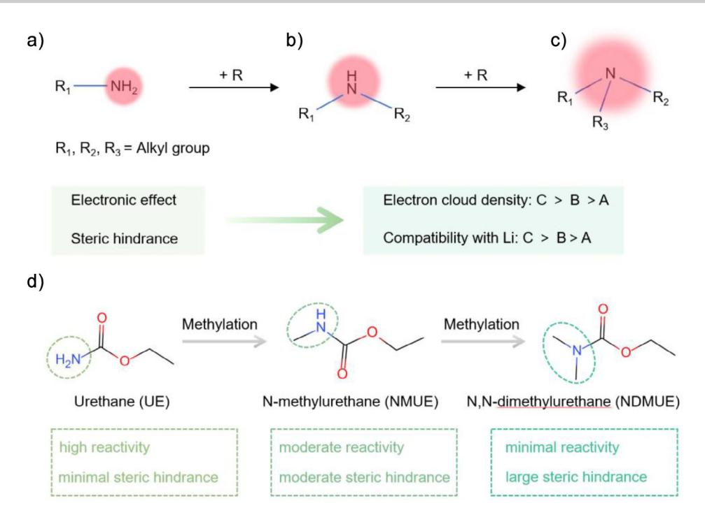
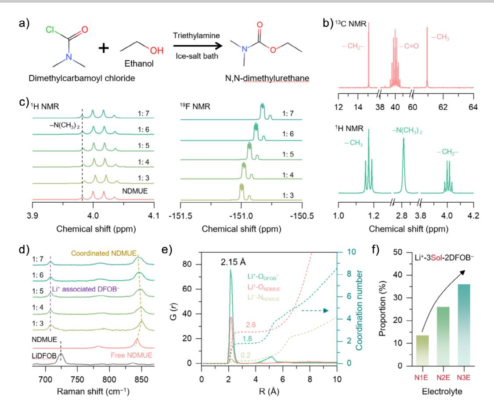
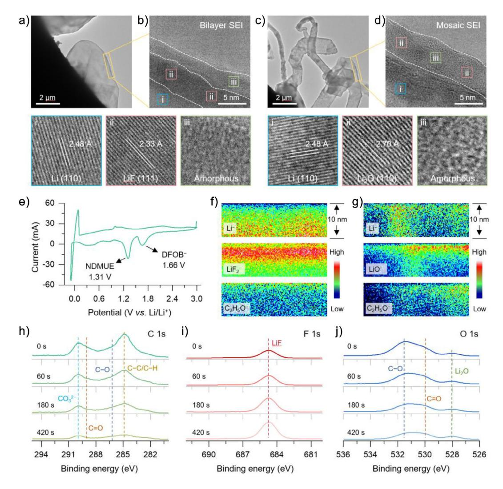
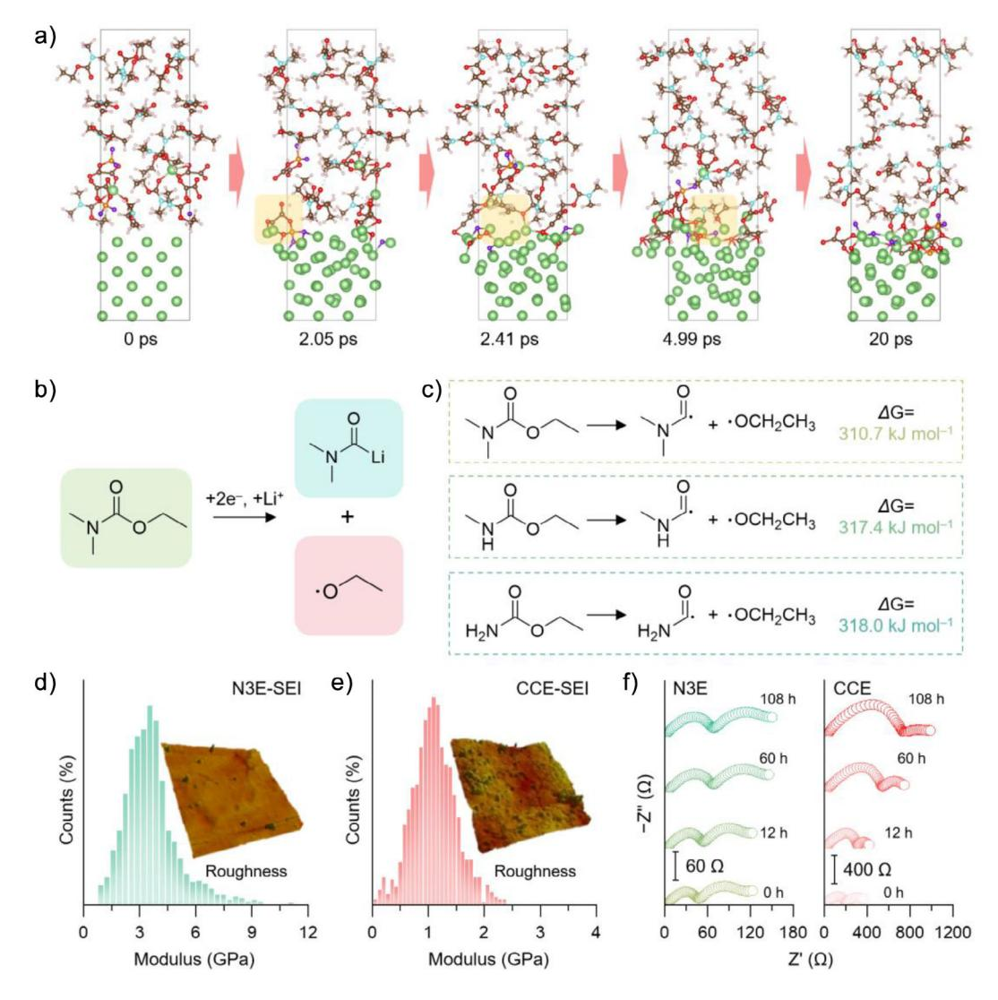
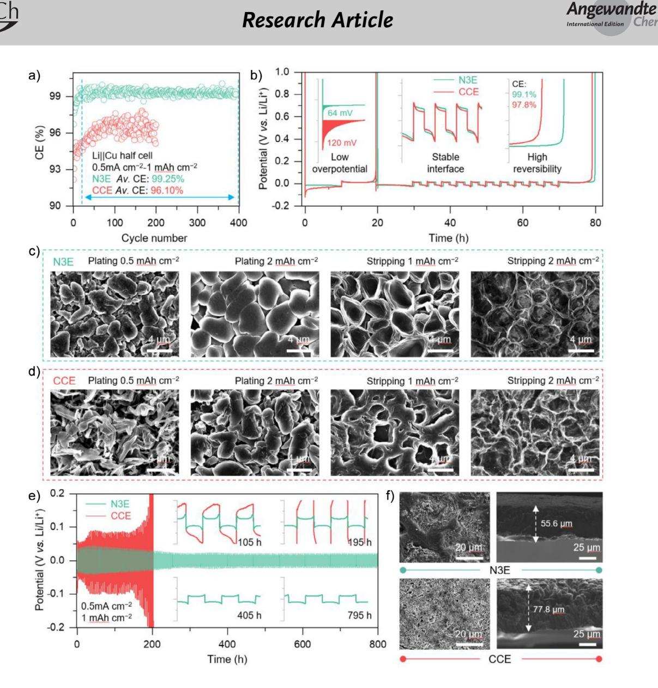
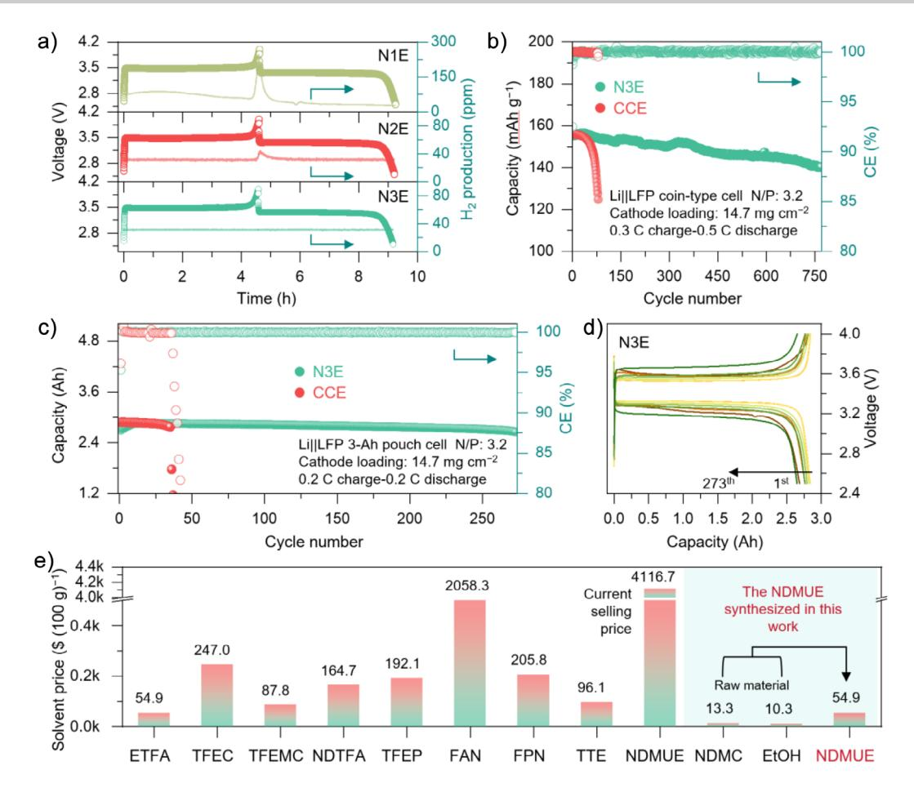

*Research Article*

How to cite: *Angew. Chem. Int. Ed.* **2025**, *64*, e202511222 doi.org/10.1002/anie.202511222 *Batteries*

# **A Tertiary Amine-Based Electrolyte with Methylation-Mediated Steric and Electronic Synergy for High-Performance Lithium Metal Batteries**

*Mingming Fang*+*, Xubing Dong*+*, Andy Qi, Simin Liu, Jieqiu Wang,\* Kang Yuan, Minfeng Li, Yongteng Dong, Zhangqin Shi, Xinran Zhang, Yuanmao Chen, Xinyang Yue,\* and [Zheng Liang\\*](https://orcid.org/0000-0001-9137-0338)*

**Abstract:** The application of the amine-based solvents (AS) in lithium metal batteries (LMBs) electrolyte is hindered by the severe parasitic reactions between active hydrogen and Li metal. In this study, we synthesized a methylated AS (N, N-dimethylurethane, NDMUE), by replacing the reactive hydrogen with a methyl group. We further demonstrated its performance as a single-component solvent for LMB electrolytes. Its performance as a single-component solvent for LMB electrolytes was demonstrated. The methyl substitution was found to enhance steric hindrance and introduce a hyperconjugated structure, Its weak solvent ─Li+ interactions promote anion-dominated solvation, and facilitating controlled solvent reduction. This molecular modification leads to a mechanically robust bilayer solid electrolyte interphase (SEI) on the lithium metal anode through the sequential reduction processes: the anion-driven reduction produced an inner inorganic layer, while the ester moiety contributed to an outer organic layer. Together, these layers effectively suppressed dendrite growth. As a result, we demonstrated outstanding cycling performance with a 3-Ah LiFePO4||Li pouch cell using the NDMUE-based electrolyte, retaining nearly 100% of its capacity after 273 cycles at 0.2 C. This work establishes a rational design strategy for amine-derived electrolytes and provides a fundamental framework for developing advanced electrolyte systems in durable LMBs.

## *Introduction*

Lithium-metal batteries (LMBs) have been recognized as a key innovation in next-generation energy storage, with their commercialization expected to significantly impact electric vehicles, renewable energy systems, and advanced electronics.[\[1–4\]](#page-9-0) However, two primary challenges continue to impede their practical deployment. First, Li deposition during charging often results in the formation of dendrites, which are caused by uneven electric field distributions and Li+ concentration gradients.[\[5–7\]](#page-9-0) These dendrite structures can compromise safety by penetrating separators and decrease capacity through the accumulation of electrically isolated "dead Li" fragments. [\[1,8\]](#page-9-0) Second, conventional carbonatebased electrolytes exhibit poor chemical compatibility with

Shanghai 200240, China E-mail: [wjq19121729927@sjtu.edu.cn](mailto:wjq19121729927@sjtu.edu.cn)

[xinyangyue@sjtu.edu](mailto:xinyangyue@sjtu.edu) [liangzheng06@sjtu.edu.cn](mailto:liangzheng06@sjtu.edu.cn)

Department of Chemistry, Chemistry Research Laboratory, University of Oxford, 12 Mansfield Road, OX1 3TA, Oxford, UK Li metal, forming a structurally unstable and compositionally inhomogeneous solid electrolyte interphase (SEI).[\[9,10\]](#page-9-0) Repeated formation and mechanical breakdown of the SEI during cycling lead to continuous electrolyte consumption, irreversible Li loss, and increased interfacial resistance.[\[11–15\]](#page-9-0)

To address these challenges, electrolyte engineering has been widely adopted as an effective strategy to stabilize the SEI and suppress Li dendrite formation.[\[16–19\]](#page-9-0) High-concentration electrolytes (HCEs) and localized highconcentration electrolytes (LHCEs) have been shown to form solvation structures rich in contact ion pairs (CIPs) and cation−anion aggregates (AGGs).[\[20,21\]](#page-9-0) These configurations promote anion-predominant decomposition pathways, forming of inorganic-rich SEIs that suppressed beyond traditional thermodynamic limits.[\[22,23\]](#page-9-0) However, the high viscosity and cost of these systems have hindered their commercial viability.[\[24\]](#page-9-0) At the same time, fluorinated solvents have also been explored to improve interfacial stability, but there are concerns regarding their environmental persistence, lack of industrial-scale recycling protocols, and potential for bioaccumulation.[\[25–27\]](#page-9-0) As a result, the development of new electrolyte systems, particularly those with reduced or no fluorine content that still deliver effective interfacial passivation, has been identified as a critical objective in the advancement of practical LMBs.

The amine-based solvent (AS) has recently attracted interest due to its favorable coordination properties, structural tunability, ease of synthesis, and low cost.[\[28–34\]](#page-9-0) The nitrogen atom in these solvents can participate in Li+ solvation, benefiting ion transport and SEI regulation.[\[35\]](#page-9-0) However,

[\*] M. Fang+, X. Dong+, A. Qi, S. Liu, J. Wang, M. Li, Y. Dong, Z. Shi, X. Zhang, Y. Chen, X. Yue, Z. Liang Frontiers Science Center for Transformative Molecules, School of Chemistry and Chemical Engineering, Shanghai Jiao Tong University,

K. Yuan

[ +] Both authors contributed equally to this work.

Additional supporting information can be found online in the Supporting Information section

*Figure 1.* Schematics of the differences in electronic effects and steric hindrance among a) primary amine, b) secondary amine, and c) tertiary amine solvent molecules. d) Design strategy of amine-based solvents, methylation design on UE molecules to enhance the compatibility with Li when formulating electrolytes with LiDFOB salt. Theoretically, the NDMUE formed by the methylation of two α-H atoms on the UE molecule leads to an increase in steric hindrance and the dispersion of electron cloud density, resulting in a low coordination number with Li+ and improved anodic stability.

primary (R─NH2) and secondary amines (R2─NH) containing active N─H bonds have demonstrated poor compatibility with Li metal. These N─H groups readily react with Li to form resistive byproducts (e.g., R─LiN or R2─LiN) and dangerous gas (e.g., H2), accelerating electrolyte decomposition (Figures 1a,b, and S1).[\[30,36\]](#page-9-0) In contrast, tertiary amines (R3─N), which lack N─H bonds, have exhibited improved compatibility with Li metal. Although their solvation strength is reduced due to steric hindrance, this shortcoming is compensated by enhanced stability (Figure 1c). The introduction of methyl groups expands steric bulk and donates electron density, which collectively reduces the electron availability on the nitrogen atom through spatial and electronic effects.[\[37,38\]](#page-9-0) This dual modulation effectively minimizes parasitic reactions between the AS and Li, suppressing continuous electrolyte decomposition and irreversible Li loss. Despite these promising attributes, comprehensive studies on the molecular design of tertiary amine-based electrolytes remain scarce, especially regarding structure-property relationships and their impact on overall battery performance.

In this work, a molecular engineering strategy was developed to design a tertiary amine-based electrolyte system comprising lithium difluoro(oxalato)borate (LiDFOB) and a synthetically derived N, N-dimethylurethane (NDMUE). Multiscale characterization and theoretical simulations reveal that the NDMUE-based electrolyte effectively stabilizes the Li metal anode and suppresses dendrite formation (Figure 1d). This solvent architecture was found to support a sequential interfacial passivation process: initial anion reduction forms an inner LiF-rich SEI, which is followed by controlled decomposition of ester groups to create a viscoelastic organic outer layer that accommodates interfacial stress. The electrochemical performance of this system was evaluated using a 3-Ah LiFePO4||Li pouch cell, which demonstrated stable cycling over 273 cycles with minimal capacity loss, indicating strong interfacial stability. In addition, a cost comparison assessing the commercial viability of NDMUE backs its potential scalability for practical LMB applications.

# *Results and Discussion*

A tertiary amine-type NDMUE solvent was synthesized via a nucleophilic substitution reaction, as shown in Figure [2a.](#page-2-0) Under ice bath conditions, triethylamine was added dropwise to a mixture of N, N-dimethylcarbamyl chloride and anhydrous ethanol. The reaction was allowed to proceed for 16 h(Detailed synthetic procedures are described in the experimental section). The structure of the synthesized compound was confirmed by nuclear magnetic resonance (NMR) spectroscopy (Figure [2b\)](#page-2-0). Specifically, spin-spin coupling between the two methyl groups on the nitrogen atom and the carbonyl carbon induced 13C peak splitting, a similar characteristic detected in the 1H NMR spectrum also well. To investigate optimal electrolyte formulations, LiDFOB was used as the Li salt to prepare a series of NDMUE-based electrolytes, with salt-to-solvent molar ratios ranging from 1:3 to 1:7. For comparison, two active hydrogen-containing solvents (urethane and N-methylurethane, denoted as UE and NMUE, respectively) were employed to formulate electrolytes with

*Figure 2.* a) Synthesis route of NDMUE. b) 1 H NMR and 13C NMR spectra of NDMUE. c) 1 H NMR and 19F NMR spectra of LiDFOB-NDMUE electrolytes with different molar ratios. d) Raman spectra of LiDFOB, NDMUE, and LiDFOB-NDMUE electrolytes with different molar ratios. e) RDF profiles of N3E. f) The proportion of the Li+-2sol-2DFOB− solvation configuration in N1E, N2E, and N3E.

identical molar ratios, aiming to elucidate the influence of methylation-induced steric hindrance and electronic effects on the solvation structure and electrochemical performance of the electrolytes.

The solvation structure of the NDMUE-based electrolyte was investigated using NMR and Raman spectra. As shown in Figure 2c, increased the salt concentration induced downfield shifts in the proton signals of NDMUE in 1H NMR while it caused upfield shifts in 19F NMR of the DFOB− anion. These shifts suggest that at higher concentration, Li+- NDMUE coordination was weakened, and the anions became more involved in the solvation. This behavior was primarily attributed to the increased steric hindrance introduced by the two methyl groups on the nitrogen atom of NDMUE. These bulky substituents not only impose spatial constraints but also increase the electron density on nitrogen through electrondonating effects. Consistent with this observation, 7Li NMR showed minimal changes in the chemical shift, indicating that the electron environment around Li+ remained largely unaffected. Raman spectroscopy provided further evidence of solvation changes, with the emergence of a new peak at 713 cm−1 corresponding to Li+-associated DFOB−, confirming partial salt dissociation. Additionally, shifts in the carbonyl stretching region (840–850 cm−1) revealed the increase in proportions of contact ion pairs (CIPs) and aggregates (AGGs) as the concentration of free NDMUE decreased (Figures 2d and S2). Based on these findings, a salt-to-solvent molar ratio of 1:3 was selected for subsequent experimental studies to encourage greater anion involvement in solvation. The electrolytes derived from primary, secondary, and tertiary amine solvents were designated as N1E, N2E, and N3E, respectively.

Molecular dynamics (MD) simulations along with Radial distribution function (RDF) analysis were conducted to examine the Li-ion coordination environment in amine-based electrolytes as influenced by the degree of methyl substitution (Figure 2e). In the tertiary amine system, the coordination numbers of approximately 2.8 and 1.8 were observed between Li ion and oxygen atoms of NDMUE (O\_NDMUE) and DFOB− (O\_DFOB−), respectively, while coordination with the nitrogen atom of NDMUE was negligible. In contrast, the primary solvation structures in N1E and N2E, based on the solvents UE and NMUE, exhibited higher coordination between Li+ and nitrogen atoms. Specifically, coordination numbers of 1.1 and 0.7 were recorded for Li+−N interactions in N1E and N2E, respectively (Figure S3). These results indicate that the methylation of the nitrogen atom in tertiary amines reduces electron density through inductive effects, thereby suppressing nitrogen coordination with Li+. Simultaneously, the enhanced steric hindrance promotes greater involvement of DFOB− anions in the solvation structure. This trend is further confirmed by the increase in the proportion of Li+−3solvent − DFOB− configurations across the electrolyte series from N1E to N3E (Figure [2f\)](#page-2-0).

Although the ─H3 group is classified as electron-donating, its introduction increases the spatial separation between the adjacent nitrogen atom and Li+, thereby weakening the iondipole interaction between the solvent and the ion. This phenomenon is described by the ion-dipole interaction energy Equation (1):

$$E_{\text{ion-dipole}} = -\frac{Z * \mu * \cos \alpha}{r^2} \tag{1}$$

where *Z* represents the ionic charge, μ represents the dipole moment, α represents the orientation angle, and *r* represents the distance between the Li+ and the solvent molecule.[\[39–41\]](#page-9-0) Furthermore, the incorporation of −CH3 groups into the AS molecule enhances electron delocalization through a hyper-conjugated structure. This delocalization diminishes the electrostatic attraction between the carbonyl oxygen and Li+ (Figure S4). As a result, the N3E electrolyte, containing two ─CH3 groups in NDMUE, was found to exhibit a larger primary solvation shell (2.15 Å) and lower solvation energy compared to N1E and N2E (Figure S5). Critically, the weakened interaction between NDMUE and Li+ not only enhances the reduction stability of NDMUE, despite its lack of α-H, but also facilitates the anion participation in the solvation structure. This leads to the abundance of the contact ion pairs (CIPs) and aggregates (AGGs) (Figure S2), forming an inorganic-rich SEI. Such an SEI is essential for regulating Li deposition and mitigating dendrite formation during battery cycling.

Cryogenic transmission electron microscopy (cryo-TEM) was employed to analyze the morphology and composition of the solid electrolyte interphase (SEI) formed in different electrolytes. For each observation, 1.0 mAh cm−2 of Li metal was deposited onto a copper mesh substrate. Differences in the SEI structure were observed between the carbonate-based conventional electrolyte (CCE) and the tertiary-amine-based N3E electrolyte. As shown in Figure [3a,](#page-4-0) the N3E system yielded a smooth, dendrite-free Li deposition with a relatively low surface area. A well-defined bilayer SEI structure was observed on the Li metal surface (Figure [3b\)](#page-4-0), where a clear interface was identified between an inner inorganic layer and an outer organic layer. The inner layer, in direct contact with the Li metal, was dense with an approximate thickness of 5 nm. This layer was found to be rich in LiF, attributed to the preferential reduction of the DFOB− anion. The presence of LiF was confirmed by its characteristic lattice spacing of 2.33 Å corresponding to the (111) plane (Figure [3bii\)](#page-4-0).[\[42,43\]](#page-10-0) In contrast, the outer layer was amorphous and approximately 3 nm thick, composed primarily of organic species generated from the reductive decomposition of NDMUE. The SEI formed in the CCE exhibited a 3D dendritic morphology and a mosaic-like monolayer structure (Figures [3c,d,](#page-4-0) consistent with previous findings on CCE-based systems. Unlike the LiF-rich composition of N3E, the SEI generated from CCE was dominated by Li2O, as confirmed by a lattice spacing of 2.70 Å corresponding to the (110) plane Figure [3dii\)](#page-4-0). This Li2O formation indicates the extensive decomposition of the carbonate solvent.[\[44,45\]](#page-10-0)

The observed structural heterogeneity of the solid electrolyte interphase (SEI) was attributed to variations in the reduction-decomposition kinetics of the electrolyte components. To evaluate these behaviors, cyclic voltammetry (CV) measurements were conducted using Li||Cu half cells with the N3E electrolyte. As shown in Figure [3e,](#page-4-0) two distinct reduction peaks appeared during the initial scan at 1.66 and 1.31 V, corresponding to the reduction of the DFOB− anion and the NDMUE solvent, respectively. In contrast, the CV profiles of half cells utilizing N1E and N2E electrolytes displayed disordered curves (Figure S6), likely due to spontaneous chemical reactions between the α-hydrogens of the NMUE and UE solvents and the Li metal surface. This reactivity was visually confirmed by digital images showing altered electrolyte appearance following immersion of Li metal foil (Figure S7). These electrochemical results supported the preferential reduction of the DFOB− anion in N3E, which facilitates the formation of an inner, inorganic-rich SEI layer. Subsequently, the controlled decomposition of NDMUE generates an outer organic layer, which enhances the mechanical resilience of the SEI, accommodating the volume fluctuations of the Li metal anode during cycling. The chemical composition of the SEI is probed by the time of-flight secondary ion mass spectrometry (TOF-SIMS) and X-ray photoelectron spectroscopy (XPS). Specific ion fragments, LiF2 − and C2H5O−, were used as markers for LiF and organic species, respectively. In the bilayer SEI formed with the N3E electrolyte, organic components were predominantly localized near the surface (within several nanometers), while LiF2 − signals intensified markedly in the inner layer, as shown in Figure [3f.](#page-4-0) These findings aligned well with the bilayer structure observed in cryo-TEM images. In contrast, the SEI formed in the carbonate-based commercial electrolyte (CCE) displayed a uniform distribution of organic components throughout the entire interfacial region, with minimal LiF presence and a higher proportion of Li2O. (Figure [3g\)](#page-4-0). This distribution reflected a monolayer SEI with a mosaic structure. Further comparison of in-depth XPS spectra (Figures [3h–j\)](#page-4-0). revealed distinct differences between the SEIs formed in N3E and CCE. In the CCEderived SEI, the C 1s spectra showed persistent signals for organic functionalities, e.g. C═O (288.8 eV), C─O (286.6 eV), and C─C (284.8 eV), throughout the etched depths. The Li2O peak followed a similar trend, indicating a uniformly mixed monolayer structure (Figure S8). In contrast, the SEI from N3E exhibited a depth-dependent compositional profile: LiF signals increased progressively with etching depth, whereas organic signals decreased accordingly. In addition, voltage-resolved XPS depth profiling further validates the component information formed by the reduction of anions and solvents in N3E at specific potentials (Figure S9). These combined analyses confirm that N3E promotes the formation of a bilayer SEI consisting of an inner LiFrich layer and an outer organic-rich layer. This architecture arises from the solvent's steric hindrance and its sequential reduction behavior, effectively stabilizing the Li metal interface.

Figure 3. a) Cryo-TEM and b) HRTEM images of the SEI formed in N3E. c) Cryo-TEM and d) HRTEM images of the SEI formed in CCE. e) CV curves of Li||Cu cells in N3E at a scanning rate of 0.2 mV s-1. The spatial distribution of Li-, LiF2-, LiO-, and C2H5- in the cross-section region of SEI harvested from the cycled LiFePO4||Li cells using f) N3E and g) CCE. XPS spectra of h) C 1s, i) F 1s, and j) O 1s on the Li metal interphase cycled in N3E.

To further investigate the formation mechanism of the bilaver SEI in N3E, ab initio molecular dynamics (AIMD) simulations were performed to examine the dynamic interactions between electrolyte components and the evolving interphase. The decomposition pathways of the anion and solvent were tracked at three representative time points: initial (2.05 ps), intermediate (2.42 ps), and late (4.99 ps), as shown in Figure 4a. During the initial stage, the DFO $B^-$  anion underwent preferential reduction due to its lower LUMO energy level compared with other components (Figure S10). At 2.05 ps, the C–O bond in DFOB $-$  was cleaved, releasing the  $-BO_2F_2$  fragment. By 2.42 ps, F- ions generated from the decomposition of  $-BO_2F_2$  reacted promptly with Li metal to form a LiF-rich SEI layer. In the late stage (4.99 ps), the ester group of NDMUE, having higher reducibility than the rest of the molecule, underwent reduction, yielding organic byproducts and limited Li2O. This reduction behavior of NDMUE is linked to its electronic structure. The two methyl groups on the nitrogen atom delocalizes electron density toward the

C–N bond, while coordination with  $Li^+$  reduces the electron cloud density around the carbonyl group. Consequently, the C-O bond becomes susceptible to electron attack, leading to its cleavage and the formation of  $C_2H_6N-CO-$  and  $-OC2H5$  radicals (Figure 4b). Calculated energy barriers for C-O bond cleavage confirm this trend: NDMUE (310.7 kJ  $mol^{-1}$ ) required less energy than NMUE (317.4 kJ  $mol^{-1}$ ) and UE (318.0 kJ mol $-1$ ) (Figures 4c and S11), highlighting the facilitative effect of methyl substitution. As the bilayer SEI forms, the dense and electronically insulating inner inorganic layer inhibits further reduction of NDMUE, thereby slowing the growth of the outer organic layer. In summary, methyl substitution offers three key benefits: 1) suppression of Li etching via removal of reactive  $\alpha$ -H, 2) promotion of anion-involved solvation through steric hindrance, and 3) modulation of AS reduction via hyper-conjugation tuning.

The bilayer SEI formed in N3E exhibits superior mechanical strength and favorable Li-ion transport characteristics. To

Figure 4. a) The detailed reaction mechanism of DFOB- anion and NDMUE solvent in N3E from MD simulations. b) Possible reduction reactions of NDMUE on Li metal surface. c) The dissociation energies of the UE, NMUE, and NDMUE calculated by density functional theory (DFT). Distribution of DMT modulus for d) LiN3E and e) LiCCE (the insert images are AFM morphology, representing the roughness of the Li metal). F) Time-dependent EIS profiles of Li symmetric cells with N3E and CCE at 60 °C.

evaluate these properties, atomic force microscopy (AFM) measurements were performed on SEI layers generated by depositing 1 mAh cm-2 of Li onto smooth Cu foil using either CCE or N3E electrolytes. As shown in Figures 4d,e, the Derjaguin-Muller-Toporov (DMT) modulus of the SEI derived from N3E was approximately 3 GPa, significantly higher than the  $\sim$ 1 GPa recorded for the CCE-derived SEI. Additionally, force  $-$  displacement analysis revealed  $\Delta F/\Delta H$  values of 454.1 N m-1 for N3E and 263.6 N m-1 for CCE (Figure S12), confirming the enhanced stiffness of the SEI formed in N3E. This mechanical robustness can be attributed to the high LiF content in the bilayer SEI. LiF is well established as a desirable SEI component due to its superior mechanical integrity, high interfacial energy, and low diffusion barrier for Li+, all of which contribute to improved SEI stability, suppression of dendrite formation, and uniform Li deposition.[46] Correspondingly, AFM height profiles indicated that the surface roughness of the N3E- treated sample was significantly lower than that of the CCE-treated one, reflecting a more uniform SEI distribution and smoother Li deposition. (Figures 4d and S13).

Other than its LiF-rich composition, the bilayer architecture of the SEI also contributes significantly to enhanced structural stability compared to conventional monolayer SEIs. The spatial separation between organic and inorganic layers reduces the impact of organic layer degradation on the underlying inorganic structure. As shown in Figures 4f and S14, the interfacial resistance of Li symmetric cells using N3E remains relatively stable during storage at 60 °C. In contrast, the interfacial resistance of cells using CCE increases markedly under the same conditions. This instability is attributed to the mosaic-like SEI structure formed in CCE, where dissolution of organic components creates porous regions in the inorganic layer, promoting uncontrolled SEI growth. Thus, the bilayer SEI formed in N3E prolongs the functional lifetime of the inner LiF-rich layer, enabling sustained regulation of Li

**Figure 5.** a) Li plating/stripping CE of the Li||Cu cells using different electrolytes. b) Modified Aurbach's measurement of the Li||Cu cells using different electrolytes. Morphological evolution of Li plating/stripping in c) N3E and d) CCE across cycling stages. e) The cycling of the Li symmetric cells in different electrolytes (the insert images are enlarged voltage profiles). f) The surface and cross-sectional SEM images of the Li metal anode after 50 cycles in the symmetric cells using N3E and CCE.

deposition behavior and effective suppression of dendrite formation.

The Coulombic efficiency (CE) of Li plating and stripping was assessed in LillCu half cells at a current density of 0.5 mA cm-2 with a capacity of 1.0 mAh cm-2. As shown in Figures 5a and S15, the N3E-based cell exhibited a higher initial CE of 96.7%, compared to 81.0% for the CCE cell. Over 393 cycles, the average CE remained at 99.25% for N3E, significantly surpassing the 96.1% average observed for CCE. This advantage of N3E was more pronounced at higher current densities (Figure S15). Such improvement was attributed to the rapid formation of a passivating SEI and effective suppression of dendrites in N3E. Modified Aurbach tests corroborated these findings, yielding average CEs of 99.1% for N3E and 97.8% for CCE (Figure 5b). Voltage profiles (Figure S16) showed a marked reduction in

polarization throughout cycling when CCE was replaced with N3E. It is important to note that the inherent ion diffusion within the electrolyte has some influence on cell polarization. Although N3E shows an ion conductivity ( $\sigma_{ion}$ ) lower than CCE due to the large solvation structure, the transference number  $(t_{Li}^+)$  is higher. Following the formula of  $\sigma_{Li}^+$  $\sigma_{\text{ion}} \times t_{\text{Li}}^+$ , the calculated  $\sigma_{\text{Li}}^+$  for N3E is comparable to that for CCE (Figures S17 and S18), underscoring the critical role of the LiF-rich SEI in regulating ion transport and mitigating dendrite formation (Figure S19). Additionally, the N3E system demonstrated a lower overpotential for Li nucleation  $(64 \text{ mV})$ , suggesting the formation of larger and more uniform Li nuclei that promote homogeneous deposition.

To further understand the relationship between Coulombic efficiency and electrodeposition morphology, scanning electron microscopy (SEM) was employed to examine

Chemie

Li deposition behaviors. At a deposition capacity of 0.5 mAh cm−2, the bilayer SEI in the N3E system guided dendrite-free Li growth, characterized by fewer but larger Li nucleation sites compared to the CCE system (Figures [5c](#page-6-0) and S20). These larger Li nuclei expanded uniformly during subsequent plating, resulting in an island-like morphology. Upon increasing the plating capacity to 2 mAh cm−2, the enlarged Li deposition compacted due to spatial confinement, yielding a dense, dendrite-free structure with reduced surface area. The SEM images of the Li stripping process are shown in Figure [5c.](#page-6-0) Under the regulation of the bilayer SEI on Li-ion transport, the dissolution of the Li deposition could occur as uniformly as its plating process. The Li deposition layer gradually shrinks along the texture and then forms a "bowl-shaped" structure morphology. After the stripping program is complete, only a small quantity of mesh film from SEI is observed on the surface of the Cu foil (Figure S21). Moreover, as the number of cycles increases, its structure remains intact, and the components show an inorganic inner and organic outer distribution (Figure S22). This residual network structure indicated that the SEI retained its integrity and flexibility, resisting fracture during Li metal contraction. In the CCE system, poor Li+ transport through the SEI led to the accumulation of space charge, promoting moss-like dendrite formation during Li deposition (Figures [5d](#page-6-0) and S23). At a capacity of 2 mAh cm−2, although some growth in deposit size was observed, the structure remained porous and lacked density. These dendritic features, with their high surface area, accelerated parasitic side reactions with the electrolyte, resulting in the irreversible consumption of active Li ions. Following the stripping process, significant amounts of dead Li were observed, originating from the non-uniform dissolution of the porous deposits. This uncontrolled plating and stripping behavior in CCE contributed directly to the low Coulombic efficiency. SEM images after prolonged cycling confirmed this outcome, revealing a disordered, dendrite-rich Li layer with extensive dead Li. In contrast, Li metal cycled in N3E retained a dense and smooth morphology, with minimal dendrite formation and less inactive Li, consistent with the observed high Coulombic efficiency and reduced polarization (Figure S24).

The cycling stability of Li symmetric cells using CCE and N3E electrolytes was evaluated under a current density of 0.5 mA cm−2 and a plating/stripping capacity of 1 mAh cm−2. The N3E-based cell exhibited prolonged cycling stability exceeding 800 h, maintaining a steadily decreasing overpotential that remained consistently lower than that observed in the CCE cell (Figure [5e\)](#page-6-0). After 50 cycles, the N3E cell preserved a compact and uniform Li surface morphology, indicative of highly reversible Li plating and stripping. In contrast, the CCE system resulted in a porous and uneven Li structure (Figure [5f\)](#page-6-0). These discrepancies were further attributed to differences in SEI stability. In the CCE system, the monolayer SEI thickened rapidly due to structural instability and dendritic growth, contributing to severe polarization. Conversely, the bilayer SEI formed in N3E remained structurally intact throughout cycling. Both the LiF-rich inner layer and the organic-dominated outer layer were preserved without notable SEI overgrowth (Figure S25).

Prior to conducting full-cell tests, gas evolution behavior during the initial charge/discharge cycles of the N3E electrolyte was systematically evaluated, as gas generation not only reflects electrolyte stability but also directly impacts battery safety. In situ ultrasonic non-destructive monitoring was applied to pouch cells, enabling real-time, quantitative analysis of gas evolution by detecting changes in acoustic impedance caused by bubble formation within the electrolyte. Compared with N1E and N2E, the N3Ebased cell demonstrated significantly reduced gas production (Figure [6a\)](#page-8-0). This suppression was attributed to the absence of reactive α-hydrogen in NDMUE and the robust, bilayer SEI structure that stabilized interfacial reactions and limited parasitic decomposition. The cycling performance of LMBs employing LiFePO4 (LFP) cathodes and N3E electrolyte was evaluated under conditions simulating realistic high-energydensity applications. Cells were assembled using a high LFP cathode loading of approximately 2.5 mAh cm−2 and a 40 µm-thick Li metal anode. The N3E-based cell retained over 91.5% of the nominal specific capacity (170 mAh g−1) at 0.3 C (Figures [6b](#page-8-0) and S26). Over prolonged cycling, the cell demonstrated excellent stability, with 87% capacity retention after 770 cycles. Notably, this stability was maintained even at an elevated temperature of 80 °C (Figure S27). In contrast, cells using N1E and N2E electrolytes failed within a few cycles (Figure S28). Post-cycling analyses confirmed that the N3E cell maintained structural integrity, with no evident dendrite formation, dead Li accumulation, or significant insoluble decomposition byproducts on the Li metal anode (Figure S29). By comparison, the CCE-based cell exhibited a rapid capacity fade, retaining only 80% of its initial capacity after 81 cycles. This decline was attributed to severe degradation at the Li metal interface, including observable cracking after cycling, ultimately leading to early battery failure.

To assess practical applicability, the N3E electrolyte was evaluated in 3-Ah pouch cells paired with LFP cathodes and Li metal anodes (Figure [6c,d\)](#page-8-0). Cycling tests were conducted at a current rate of 0.2 C, with gas generated during the formation cycles being vented from the pouch cells. When using the conventional carbonate-based electrolyte (CCE), the cells exhibited rapid capacity degradation, retaining only 16.8% of their initial capacity after 42 cycles (Figure S30). This failure was attributed to dendritic Li growth and severe parasitic reactions, which depleted active Li consistent with observations in coin cell configurations. In contrast, cells employing the N3E electrolyte demonstrated significantly improved performance. Notable enhancements were observed in both operating voltage stability and capacity retention. Impressively, the N3E-based pouch cell maintained nearly 100% of its capacity after 273 cycles, underscoring its potential for advanced LMB applications and highlighting its superior performance relative to previously reported modified electrolyte systems.

In addition to electrochemical performance, the commercial viability of a novel electrolyte solvent is critical. The cost of N, N-dimethylurethane (NDMUE) was preliminarily assessed based on its laboratory-scale synthesis. While commercial sources list NDMUE at approximately \$4116.70 per 100 g, the synthesized version in this study was

*Figure 6.* a) In situ DEMS analysis of the LiFePO4||Li cells to monitor the H2 evolution in N1E, N2E, and N3E. b) Cycling stability of LiFePO4||Li cells at 0.3 C charge and 0.5 C discharge rates after two-cycle activation at 0.1 C. c) Cycling performance of 3-Ah LiFePO4||Li pouch cells with 0.2 C charge and 0.2 C discharge rates. d) Corresponding charge–discharge curves of LiFePO4||Li pouch cells using the N3E. e) Compare the price disparities among the fluorine-containing solvents that have been extensively researched, the commercially available NDMUE, and the as-prepared NDMUE (the price statistics on the website of SynQuest Labs, Inc. on May 1, 2025).

produced at a substantially lower cost of \$54.90 per gram. This indicates a strong potential for economic scalability of the N3E electrolyte. When compared to commonly used fluorinated solvents in both commercial and experimental LMB systems, NDMUE presents a more cost-effective alternative (Figure 6e and Table S1). Moreover, NDMUE offers additional advantages, including low volatility, feasibility for large-scale production, and environmental compatibility. These properties position NDMUE as a promising candidate for replacing expensive, heavily fluorinated, or high-concentration electrolytes in next-generation LMBs.

# *Conclusion*

This study introduces a rational molecular design approach for enhancing Li metal battery performance through the development of a methyl-functionalized tertiary amine solvent, N, N-dimethylurethane (NDMUE). The substitution of the reactive α-hydrogen with a methyl group significantly improved the chemical compatibility of the amine-based solvent with lithium metal. The incorporation of methyl

These effects enabled the sequential reduction of DFOB− and NDMUE, forming a stable bilayer SEI on the Li metal surface. The inner layer, rich in LiF, provided high mechanical strength and low ionic resistance, while the outer organic layer accommodated interfacial stress during cycling. This architecture supported uniform Li deposition and improved interfacial stability. In Li||Cu half-cells, this scheme maintained an average Coulombic efficiency of 99.3% over 200 cycles, surpassing that of conventional carbonatebased electrolytes. In 3 Ah LiFePO4||Li pouch cells, the NDMU-based electrolyte achieved stable cycling over 273 cycles with negligible capacity loss, demonstrating its practical viability. Despite these promising results, future work could explore compatibility with high-voltage cathodes and assess long-term performance under demanding conditions. Challenges such as large-scale solvent synthesis and integration into current manufacturing processes need to be addressed before commercial deployment. Overall, the NDMUE-based electrolyte offers a cost-effective and fluorine-free alternative

groups also increased steric hindrance and modified the hyper-conjugated structure, promoting a solvation environment enriched with anions while facilitating solvent reduction.

# *Research Article*

to traditional systems, advancing the development of safe and high-energy-density LMBs suitable for next-generation energy storage applications.

## *Acknowledgements*

This work was supported by the funds from Henan Yujing Energy Technology (Grant No. 23H010101832), Shanghai PMSM Technology (Grant No. 21H010101815), and the China Postdoctoral Science Foundation (Grant No. 2024M751952 and GZC20240991).

## *Conflict of Interests*

The authors declare no conflict of interest.

## *Data Availability Statement*

The data that support the findings of this study are available from the corresponding author upon reasonable request.

**Keywords:** Amine-based electrolyte • Cycling stability • Li metal anode • Li metal battery • Steric hindrance

- [1] D. Lin, Y. Liu, Y. Cui, *Nat. Nanotech.* **2017**, *12*, 194–206.
- [2] P. Albertus, S. Babinec, S. Litzelman, A. Newman, *Nat. Energy* **2017**, *3*, 16–21.
- [3] S. C. Kim, J. Wang, R. Xu, P. Zhang, Y. Chen, Z. Huang, Y. Yang, Z. Yu, S. T. Oyakhire, W. Zhang, L. C. Greenburg, M. S. Kim, D. T. Boyle, P. Sayavong, Y. Ye, J. Qin, Z. Bao, Y. Cui, *Nat. Energy* **2023**, *8*, 814–826.
- [4] Q.-K. Zhang, X.-Q. Zhang, J. Wan, N. Yao, T.-L. Song, J. Xie, L.-P. Hou, M.-Y. Zhou, X. Chen, B.-Q. Li, R. Wen, H.-J. Peng, Q. Zhang, J.-Q. Huang, *Nat. Energy* **2023**, *8*, 725–735.
- [5] C. Monroe, J. Newman, *J. Electrochem. Soc.* **2003**, *150*, A1377– A1384.
- [6] X. Guan, A. Wang, S. Liu, G. Li, F. Liang, Y. W. Yang, X. Liu, J. Luo, *Small* **2018**, *14*, 1801423.
- [7] J. Xiao, *Science* **2019**, *366*, 426–427.
- [8] F. Ding, W. Xu, G. L. Graff, J. Zhang, M. L. Sushko, X. Chen, Y. Shao, M. H. Engelhard, Z. Nie, J. Xiao, X. Liu, P. V. Sushko, J. Liu, J.-G. Zhang, *J. Am. Chem. Soc.* **2013**, *135*, 4450– 4456.
- [9] Y. Gao, X. Du, Z. Hou, X. Shen, Y.-W. Mai, J.-M. Tarascon, B. Zhang, *Joule* **2021**, *5*, 1860–1872.
- [10] M. J. Zachman, Z. Tu, S. Choudhury, L. A. Archer, L. F. Kourkoutis, *Nature* **2018**, *560*, 345–349.
- [11] Z. Yu, P. E. Rudnicki, Z. Zhang, Z. Huang, H. Celik, S. T. Oyakhire, Y. Chen, X. Kong, S. C. Kim, X. Xiao, H. Wang, Y. Zheng, G. A. Kamat, M. S. Kim, S. F. Bent, J. Qin, Y. Cui, Z. Bao, *Nat. Energy* **2022**, *7*, 94–106.
- [12] Y. Huang, R. Li, S. Weng, H. Zhang, C. Zhu, D. Lu, C. Sun, X. Huang, T. Deng, L. Fan, L. Chen, X. Wang, X. Fan, *Energy Environ. Sci.* **2022**, *15*, 4349–4361.
- [13] C. Fang, J. Li, M. Zhang, Y. Zhang, F. Yang, J. Z. Lee, M.-H. Lee, J. Alvarado, M. A. Schroeder, Y. Yang, B. Lu, N. Williams, M. Ceja, L. Yang, M. Cai, J. Gu, K. Xu, X. Wang, Y. S. Meng, *Nature* **2019**, *572*, 511–515.

- [14] Y. Xiang, M. Tao, G. Zhong, Z. Liang, G. Zheng, X. Huang, X. Liu, Y. Jin, N. Xu, M. Armand, J.-G. Zhang, K. Xu, R. Fu, Y. Yang, *Sci. Adv.* **2021**, *7*, eabj3423.
- [15] X. B. Cheng, R. Zhang, C. Z. Zhao, F. Wei, J. G. Zhang, Q. Zhang, *Adv. Sci.* **2016**, *3*, 1500213.
- [16] K. Xu, *Chem. Rev.* **2014**, *114*, 11503–11618.
- [17] G. M. Hobold, J. Lopez, R. Guo, N. Minafra, A. Banerjee, Y. Shirley Meng, Y. Shao-Horn, B. M. Gallant, *Nat. Energy* **2021**, *6*, 951–960.
- [18] Y. Jie, X. Ren, R. Cao, W. Cai, S. Jiao, *Adv. Funct. Mater.* **2020**, *30*, 1910777.
- [19] N. von Aspern, G. V. Röschenthaler, M. Winter, I. Cekic-Laskovic, *Angew. Chem. Int. Ed.* **2019**, *58*, 15978–16000.
- [20] Z. Piao, X. Wu, H.-R. Ren, G. Lu, R. Gao, G. Zhou, H.-M. Cheng, *J. Am. Chem. Soc.* **2023**, *145*, 24260–24271.
- [21] Y. Chen, M. Li, Y. Liu, Y. Jie, W. Li, F. Huang, X. Li, Z. He, X. Ren, Y. Chen, X. Meng, T. Cheng, M. Gu, S. Jiao, R. Cao, *Nat. Commun.* **2023**, *14*, 2655.
- [22] Y. Yamada, J. Wang, S. Ko, E. Watanabe, A. Yamada, *Nat. Energy* **2019**, *4*, 269–280.
- [23] X. Ren, L. Zou, X. Cao, M. H. Engelhard, W. Liu, S. D. Burton, H. Lee, C. Niu, B. E. Matthews, Z. Zhu, C. Wang, B. W. Arey, J. Xiao, J. Liu, J.-G. Zhang, W. Xu, *Joule* **2019**, *3*, 1662– 1676.
- [24] X. Cao, H. Jia, W. Xu, J.-G. Zhang, *J. Electrochem. Soc.* **2021**, *168*, 010522.
- [25] G. Hernández, R. Mogensen, R. Younesi, J. Mindemark, *Batteries Supercaps* **2022**, *5*, e202100373.
- [26] J. Holoubek, M. Yu, S. Yu, M. Li, Z. Wu, D. Xia, P. Bhaladhare, M. S. Gonzalez, T. A. Pascal, P. Liu, Z. Chen, *ACS Energy Lett.* **2020**, *5*, 1438–1447.
- [27] M. G. Evich, M. J. B. Davis, J. P. McCord, B. Acrey, J. A. Awkerman, D. R. U. Knappe, A. B. Lindstrom, T. F. Speth, C. Tebes-Stevens, M. J. Strynar, Z. Wang, E. J. Weber, W. M. Henderson, J. W. Washington, *Science* **2022**, *375*, eabg9065.
- [28] F. Wang, H. Hua, Y. Zhuang, J. Wu, J. Zeng, J. Zhao, *Adv. Funct. Mater.* **2025**, *35*, 2414181.
- [29] F. Wang, H. Hua, D. Wu, J. Li, Y. Xu, X. Nie, Y. Zhuang, J. Zeng, J. Zhao, *ACS Energy Lett.* **2023**, *8*, 780–789.
- [30] L.-L. Su, M.-X. Wu, S.-Y. Sun, C.-X. Bi, Z. Zheng, M. Zhao, B.- Q. Li, X.-Q. Zhang, J.-Q. Huang, *ACS Energy Lett.* **2025**, *10*, 313– 319.
- [31] H. Lu, X. Zhang, M. Luo, K. Cao, Y. Lu, B. B. Xu, H. Pan, K. Tao, Y. Jiang, *Adv. Funct. Mater.* **2021**, *31*, 2103514.
- [32] A. Naveed, T. Li, A. Ali, F. Ahmad, W. A. Qureshi, M. Su, X. Li, Y. Zhou, J. C. Wu, Y. Liu, *Small* **2024**, *20*, 2401589.
- [33] M. Fang, X. Yue, Y. Dong, Y. Chen, Z. Liang, *Joule* **2024**, *8*, 91– 103.
- [34] L. Pompizii, M. Liu, L. Braks, T. Ashirov, T. Zhou, M. Mensi, D. Park, J. W. Choi, A. Coskun, *ACS Energy Lett.* **2025**, *10*, 246–253.
- [35] S. Xu, T. Naren, Y. Zhao, Q. Gu, T. W. Lau, C. S. Lee, F. R. Chen, J. Yin, L. Chen, Q. Zhang, *Angew. Chem. Int. Ed.* **2025**, *64*, e202422040.
- [36] P. Ding, H. Yuan, L. Xu, L. Wu, H. Du, S. Zhao, D. Yu, Z. Qin, H. Liu, Y. Li, X. Zhang, H. Yu, M. Tang, Y. Ren, L. Li, C. W. Nan, *Adv. Mater.* **2025**, *37*, 2413654.
- [37] J. Cui, Y. Liu, Y. Du, L. Zhao, P. Wang, D. Li, S. Zhang, Y. Li, H. Li, *Adv. Mater.* **2025**, *37*, 2500876.
- [38] T. Zhang, H. Huang, *Angew. Chem. Int. Ed.* **2023**, *62*, e202310114.
- [39] Z. Zhu, Y. Li, J. Ji, X. Qi, J. Pan, J. Ma, L. Qie, Y. Huang, *Angew. Chem. Int. Ed.* **2025**, *64*, e202423940.
- [40] P. Liang, J. Li, Y. Dong, Z. Wang, G. Ding, K. Liu, L. Xue, F. Cheng, *Angew. Chem. Int. Ed.* **2025**, *64*, e202415853.
- [41] H. Chen, K. Chen, J. Yang, B. Liu, L. Luo, H. Li, L. Chen, A. Zhao, X. Liang, J. Feng, Y. Fang, Y. Cao, *J. Am. Chem. Soc.* **2024**, *146*, 15751–15760.

- [42] J. Jang, C. Wang, G. Kang, C. Han, J. Han, J.-S. Shin, S. Ko, G. Kim, J. Baek, H.-T. Kim, H. Lee, C. B. Park, D.-H. Seo, Y. Li, J. Kang, *Nat. Energy* **2025**, *10*, 502–512.
- [43] Q. Xu, T. Li, Z. Ju, G. Chen, D. Ye, G. I. N. Waterhouse, Y. Lu, X. Lai, G. Zhou, L. Guo, K. Yan, X. Tao, H. Li, Y. Qiu, *Nature* **2025**, *637*, 339–346.
- [44] K. Steinberg, X. Yuan, C. K. Klein, N. Lazouski, M. Mecklenburg, K. Manthiram, Y. Li, *Nat. Energy* **2022**, *8*, 138–148.
- [45] R. Lin, Y. He, C. Wang, P. Zou, E. Hu, X.-Q. Yang, K. Xu, H. L. Xin, *Nat. Nanotech.* **2022**, *17*, 768–776.
- [46] B. Jagger, M. Pasta, *Joule* **2023**, *7*, 2228–2244.

Manuscript received: May 22, 2025 Revised manuscript received: August 12, 2025 Manuscript accepted: August 20, 2025 Version of record online: August 26, 2025