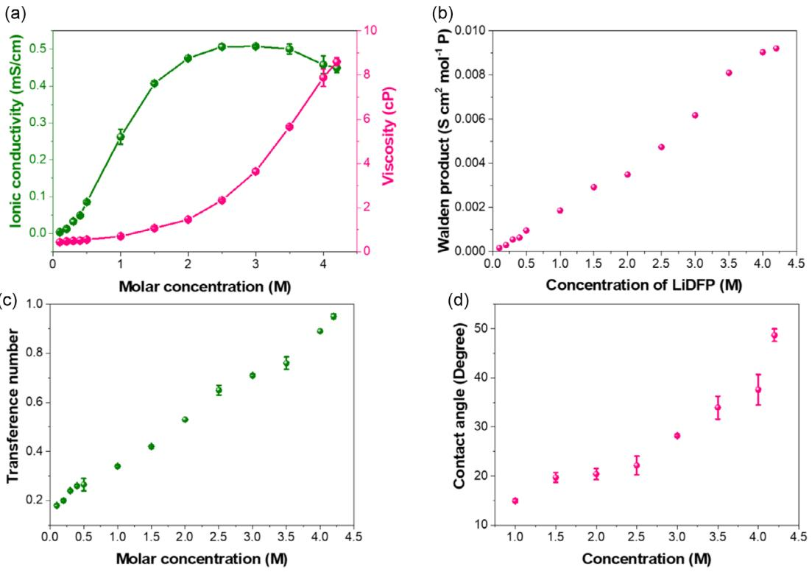
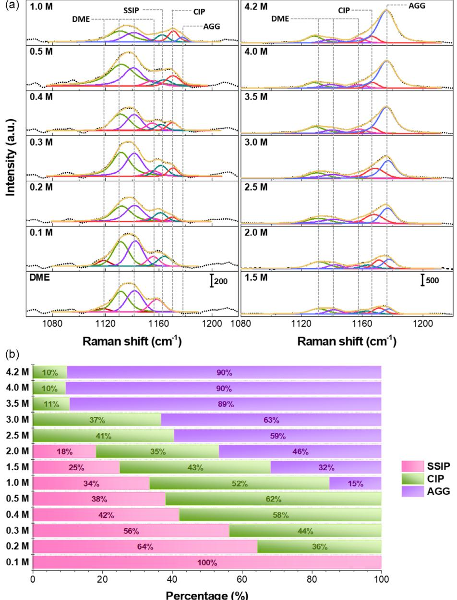
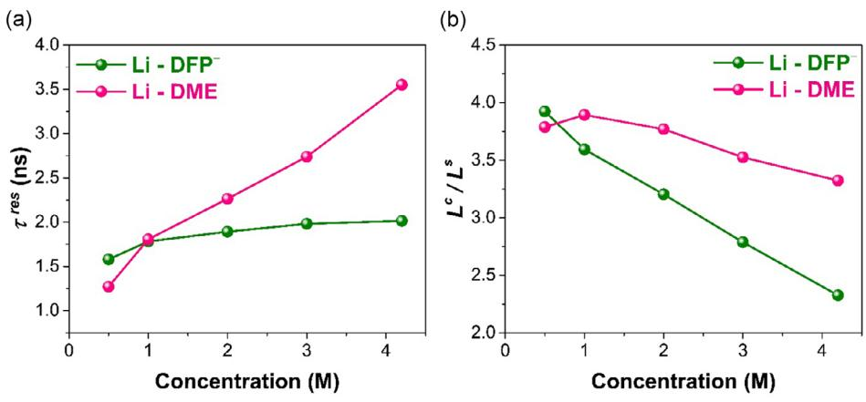
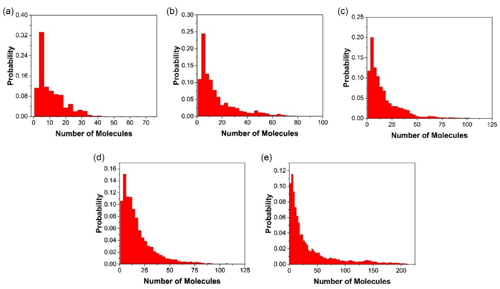
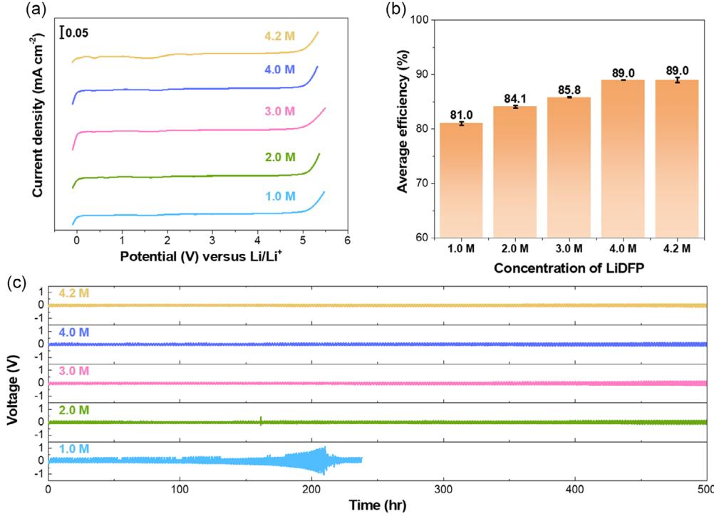
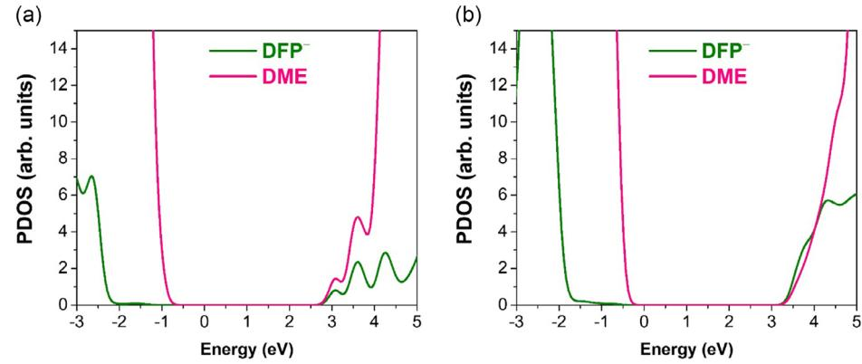

# Tuning Physical and Electrochemical Properties of Lithium Metal Batteries: Effect of Lithium Difluorophosphate at Different Concentrations in 1,2-Dimethoxyethane

[Thuy Duong Pham,](https://orcid.org/0000-0002-5918-6618) [Abdullah Bin Faheem,](https://orcid.org/0000-0002-9209-1581) [Kyungwon Kwak,\\*](https://orcid.org/0000-0003-1680-0996) and [Kyung-Koo Lee\\*](https://orcid.org/0000-0001-8176-6232)

Despite the reported benefits of lithium difluorophosphate (LiDFP), studies on its physical and electrochemical properties remain limited. This work systematically investigates LiDFP and its potential for lithium metal battery (LMB) electrolytes using a combined experimental and theoretical approach. Solubility, ionic conductivity, viscosity, lithium-ion transference number,

diffusion coefficient, and contact angle are experimentally evaluated to provide a comprehensive understanding of its behavior. A key finding is the decoupling of ionic conductivity and viscosity

## 1. Introduction

The pursuit of technological advancement in the domain of electric vehicles and portable electronics has highlighted an unprecedented demand for energy storage solutions that are both efficient and compact. At the forefront of this endeavor, lithium-ion batteries (LIBs) have emerged as the cornerstone of modern energy storage systems.[1,2] Despite their widespread adoption, the traditional graphite (Gr) anodes employed in these batteries are increasingly unable to meet the escalating requirements for higher energy densities. This limitation is particularly pronounced in the context of

T. D. Pham

| Faculty of Biotechnology Chemistry and Environmental Engineering                                                 |
|------------------------------------------------------------------------------------------------------------------|
| Phenikaa School of Engineering                                                                                   |
| Phenikaa University                                                                                              |
| Hanoi 10000, Vietnam                                                                                             |
| A. Bin Faheem, K.-K. Lee                                                                                         |
| Department of Chemistry                                                                                          |
| Kunsan National University                                                                                       |
| Gunsan, Jeonbuk 54150, Korea                                                                                     |
| E-mail: kklee@kunsan.ac.kr                                                                                       |
| K. Kwak                                                                                                          |
| Department of Chemistry                                                                                          |
| Korea University                                                                                                 |
| Seoul 02841, Korea                                                                                               |
| E-mail: kkwak@korea.ac.kr                                                                                        |
| K. Kwak                                                                                                          |
| Center for Molecular Spectroscopy and Dynamics Institute for Basic                                               |
| Science (IBS)                                                                                                    |
| Seoul 02841, Korea                                                                                               |
| Supporting information for this article is available on the WWW under https:// doi.org/10.1002/batt.202500163 |
|                                                                                                                  |

© 2025 The Author(s). Batteries & Supercaps published by Wiley-VCH GmbH. This is an open access article under the terms of the [Creative Commons](http://creativecommons.org/licenses/by/4.0/) [Attribution-NonCommercial License,](http://creativecommons.org/licenses/by/4.0/) which permits use, distribution and reproduction in any medium, provided the original work is properly cited and is not used for commercial purposes.

at high concentrations. Additionally, Raman and nuclear magnetic resonance spectroscopy, along with molecular dynamics simulations, reveal the formation of large cation–anion aggregates at high concentrations, which facilitate lithium-ion transport and contribute to the stabilization of the solid electrolyte interphase. The results reported herein emphasize the potential of LiDFP as an attractive component for advanced electrolyte formulations in energy storage, providing new insights into optimizing LMB performance.

electric vehicles and advanced portable electronics, where the quest for extended range and longer usage times necessitates batteries with significantly enhanced energy storage capacities.

Among the materials explored as anode materials, lithium metal has distinguished itself as an attractive alternative. With an ultrahigh theoretical specific capacity of 3,860 mAh g1 and a low reduction potential of 3.040 V versus the standard hydrogen electrode, lithium metal holds the promise of dramatically increasing battery energy density.[3,4] However, the transition from potential to practical application has been a challenge. The growth of dendrites, low Coulombic efficiency (CE), unstable cycle life, and safety concerns have, for decades, obstructed the widespread adoption of lithium metal batteries (LMBs).[5,6]

In general, due to the thermodynamic instability of lithium metal, it exhibits high reactivity with virtually all electrolyte solvents in electrochemical environments, leading to considerable irreversible lithium loss. Consequently, ongoing reactions between lithium metal and the electrolyte result in the formation of thick, fragile, and heterogeneous solid electrolyte interphase (SEI) layers.[6,7] Other than the excessive degradation of the electrolyte, this also leads to inhomogeneous lithium deposition, forming dendrites that can result in short circuits. Therefore, one of the most promising strategies for overcoming these challenges involves simultaneously controlling both the structure and chemistry of the SEI layer.[2,7] This protective layer is important in stabilizing the interface between the highly reactive lithium metal anode and the liquid electrolyte. A well-constructed SEI layer acts as a selective barrier that permits the passage of lithium ions while blocking electrons. This prevents detrimental side reactions and leads to uniform lithium deposits on the lithium anode, inhibiting dendrite growth, reducing the risk of short circuits, and facilitating efficient ion transport during charging and discharging.

As the lithium metal anode readily reacts with the electrolyte, the choice of electrolytes and their lithium salts is crucial in

establishing a stable SEI layer.[6,7] Common lithium salts like lithium hexafluorophosphate (LiPF6), lithium bis(trifluoromethanesulfonyl) imide (LiTFSI), and lithium bis(fluorosulfonyl)imide (LiFSI) have been extensively studied, alongside newer lithium salts introduced to the market. Recently, lithium difluorophosphate (LiDFP) has emerged as a promising alternative for LMBs.[8–10] LiDFP exhibits reduced sensitivity to moisture in comparison to LiPF6 because of its slower hydrolysis rate.[11,12] Additionally, its incorporation into LMB electrolytes promotes the formation of stable SEI layers, enhancing battery performance.[11,13–15] LiDFP contributes beneficial inorganic components to the SEI layer, enhancing its stability and effectiveness in preventing direct contact between the highly reactive lithium metal and the liquid electrolyte. This, in turn, mitigates the formation of dendrites and improves the operational longevity and efficiency of battery. Furthermore, LiDFP can serve as an electrolyte additive to improve low-temperature performance by forming an SEI/cathode electrolyte interphase (CEI) layer enriched with P- and F-containing inorganics, such as Li3PO4 and LiF. These layers facilitate lithium-ion transport and reduce interfacial impedance, leading to improved capacity retention and rate capability in cold environments.[16,17] In a previous study by our group, we proposed a concentrated bisalt electrolyte system consisting of LiDFP and LiTFSI.[9] It was observed that mixing two salts with remarkably different cation–anion interaction energies can lead to unique ion solvation structures, and the investigated electrolyte (2.2 M LiDFP þ 1.23 M LiTFSI in 1,2-dimethoxyethane (DME)) was observed to possess enhanced physical (σ = 6.57mS cm1 ) electrochemical properties (average CE = 98.3%) and suppressed lithium dendrite growth in LMBs.

Although LiDFP has shown promising results in improving the SEI layer, leading to enhancements in LMB performance, a thorough understanding of its full impact remains limited. Specifically, detailed investigations into the physical and electrochemical properties of LiDFP within electrolyte solutions are scarce. This limits the ability to fully exploit the potential benefits of LiDFP in enhancing LMBs. To address this, this study presented, for the first time to our knowledge, an in-depth analysis of how varying concentrations of LiDFP in DME, a commonly used ether solvent for LMB electrolytes, influence the physical properties, solvation structure, and cycling stability. Key physical properties including solubilities, ionic conductivities, viscosities, lithium-ion transference numbers, diffusion coefficients, and contact angles across different LiDFP concentrations and temperatures were explored. Additionally, we employed Raman spectroscopy, nuclear magnetic resonance (NMR) spectroscopy, and molecular dynamics (MD) simulations to investigate ion speciation and ion transport within LiDFP–DME electrolyte systems. This comprehensive approach allowed us to analyze the interactions between cations and anions, as well as anions and solvents, providing detailed insights into the ionic speciation within the electrolytes containing LiDFP and ether solvent (DME). By correlating the measured transference numbers with MD simulation results, insights were gained into the mechanisms underlying the observed high-cation transference numbers. Ultimately, the electrochemical tests demonstrated the significant impact of LiDFP concentration on the electrochemical performance of LMBs.

# 2. Result and Discussion

## 2.1. Macroscopic Properties

The solubility of a salt often reflects the relative strength of interaction energy between the chemical species within the electrolyte system, suggesting that a solvent can effectively dissolve a given salt if the interaction energy of the salt–solvent complex surpasses that of the anion-cation complexes. In the first step toward the study of LiDFP, the solubility of LiDFP in common carbonate and ether solvents was determined and is tabulated in Table S1, Supporting Information. Intriguingly, LiDFP exhibited limited (less than 0.5 M) solubility in carbonate solvents, such as dimethyl carbonate (DMC), ethylene carbonate (EC), and propylene carbonate (PC). The low solubility of LiDFP in carbonate solvents not only leads to serious malfunctions in LMBs but also hinders the application of LiDFP in these electrolyte systems. In contrast, LiDFP showed considerably higher solubility in ether solvents such as 1,3-dioxolane (DOL) and DME, achieving maximum concentrations of 2.8 and 4.2 M, respectively. Given its low viscosity and strong bidentate coordination to Liþ, DME stands out as an optimal linear ether-based solvent for LMB electrolytes.[18]

Macroscopic properties such as ionic conductivity, shear viscosity, lithium-ion transference number, and the contact angle between the PP separator and the electrolyte were measured and are presented in Figure 1. The ionic conductivity and shear viscosity (η) of LiDFP in DME (hereafter denoted as LiDFP–DME) were measured across a salt concentration range of 0.1 to 4.2 M at 25 °C (Figure 1a and Table S2, Supporting Information). Initially, ionic conductivity increases with concentration, indicating a greater number of charge carriers. This trend continues until it peaks at around 3.0 M. Beyond this point, ionic conductivity declines slightly rather than steeply, despite a significant and continuous increase in viscosity. The slight decrease in conductivity occurs in a regime where, traditionally, a more substantial drop would be expected due to the higher viscosity hindering the movement of ions.[19–21] At higher salt concentrations, the number of charge carriers increases. However, the viscosity of the solution also rises due to stronger ion–ion interactions within the electrolyte, which reduces ionic mobility. Despite this, Figure 1a indicates that the electrolyte maintains ion transport efficiency to some extent, even as the medium becomes significantly more viscous. The aforementioned discussion suggests that the ionic conductivity in LiDFP–DME electrolytes is primarily affected by the concentration of charge carriers rather than being directly influenced by the viscosity of the solution. The absence of an inverse correlation between these two properties warrants further investigation into the unique ion transport mechanism that governs the electrolyte system on. The practical implication of this observation is significant for the design of LMBs. Electrolytes whose ionic conductivity does not decrease in spite of increasing viscosity are desirable for high-performance batteries. They offer the potential for increased energy density by allowing for higher salt concentrations without the penalty of greatly reduced ion mobility.

To investigate the temperature dependence of ion mobility, the ionic conductivity and viscosity of 1.0 M LiTFSI–DME were

Figure 1. a) Ionic conductivity and viscosity, b) Walden product, c) lithium-ion transference number, and d) contact angle of LiDFP in DME as a function of concentration at 25 o C.

measured over a temperature range from 5 °C to 55 °C. These properties were analyzed using the Arrhenius equation (Equation S1 and S2, Supporting Information). As displayed in Figure S1, Supporting Information, a linear relationship between ln σ (ln η) and 1000/T is observed and the R-square of the linear fitting is greater than 0.999 (0.998), indicating that experiment results perfectly fit the Arrhenius behavior. The values of activation energies of ionic conductivity (Eaσ) and viscosity (Eaη) are 1.46 and 1.71 kJ mol1 , respectively. While Eaσ is slightly lower than Eaη, the difference is negligible and can be considered to be approximately equal.[22] This implies that the Walden product, which is the product of viscosity and molar conductivity (Λ), is independent of temperature and the mechanism for ionic motion is not effected by temperature.[22–24]

To investigate the effect of the salt concentration on the Walden product, the variation of the Walden product with respect to LiDFP concentration is depicted in Figure 1b. Normally, the larger number of charge carriers at a higher salt concentration increases ionic conductivity (Λ). In contrast, a larger number of ion–ion interactions at higher salt concentration results in a rise in viscosity (η), which impedes ionic motion and thus lowers the ionic conductivity. Generally, these opposing phenomena balance each other such that the product of molar conductivity (Λ) and viscosity (η), known as the Walden product (Λη), remains approximately constant higher salt concentrations.[25–30] However, Figure 1b reveals a clear deviation from the expected behavior for the LiDFP-DME electrolyte system. Instead of Λη remaining constant, it increases almost linearly with increasing salt concentration. This suggests that the ionic conductivity does not decrease as rapidly as expected, despite the continued rise in viscosity, indicating a decoupling between viscosity and ionic conductivity.

Interestingly, similar trends have been observed in previously investigated electrolytes. For instance, Sadek et al. reported a linear increase in the Walden product along the concentration for different ions in water.[31] Similarly, Nilsson et al. reported an increase in Λη values along salt concentration for electrolytes systems which contain significant ion–ion pairing.[32] These findings suggest that the deviation in the Walden product for the LiDFP-DME electrolyte necessitates a detailed investigation into the underlying ion transport mechanisms, which will be explored further in the subsequent sections.

Lithium-ion transference number tþ was determined using a potentiostatic polarization method for various concentrations of LiDFP–DME, as shown in Figure 1c. The tþ increases with increasing salt concentration. For salt concentrations less than 1.5 M LiDFP, tþ is smaller than 0.5, indicating a higher contribution from the anion to the total ionic conductivity compared to the cation.[19,33] Surprisingly, tþ of moderate to high concentration (more than 2.0 M) reach unexpectedly high values (tþ = 0.95 at 4.2 M), while range of tþ for traditional dilute electrolytes is 0.2–0.4. A key explanation underlying the ion transport mechanism of the LiDFP–DME electrolyte systems at high concentration focuses on a hopping-like behavior (the Grotthuss mechanism).[21,33] The ionic species in LiDFP–DME electrolytes exist as cation-anion associate states such as contact-ion pairs (CIPs) and aggregates (AGGs) due to strong interaction between Liþ and DFP- (as mentioned previously). Therefore, CIPs or AGGs could facilitate the Grotthuss mechanism, where Liþ can jump from one coordination site to another.[33,34] This hopping-like behavior is expected to be present in high-concentration electrolytes in which the number of associated states is sufficiently high, ensuring close proximity between ions. Evidence of increased hopping-like Liþ transport at higher concentrations is further investigated using classical MD (CMD) simulations and is discussed later on.

Good wettability of the electrolyte on the separator is vital for LMB performance and it also facilitates electrolyte diffusion during the assembly of the cell. The contact angle between the PP separator and the LiDFP–DME electrolyte along the concentration was measured to investigate the wettability. Figure 1d indicates that the contact angle increases with increasing salt concentration. Good wettability is normally indicated by a small contact angle while poor wettability implies a large contact angle value. When the LiDFP–DME molar concentration increases from 1.0 to 4.2 M, the contact angle gradually increases from 15° to 48.7°. This indicates that a high concentration of LiDFP– DME impairs separator wettability in comparison to that at low concentration. This trend can be attributed to stronger ion–ion interactions in the electrolyte, leading to the formation of associated complexes and a polar solvation structure.[35,36] As a result, the electrolyte interacts less effectively with the nonpolar polymer separator, increasing the contact angle and reducing wetting.

#### 2.2. Solvation Structures

The underlying ion transport mechanism is inherently linked to the solvation structures present in the electrolyte. It is for this reason, the solvation structure of the different concentrations of Liþ with DME in the LiDFP–DME electrolyte was studied by using Raman vibrational spectroscopy in the range 760–920 cm1 (see Figure S2a, Supporting Information). The pure DME solvent exhibits a band at ≈820 and ≈850 cm1 , associated with the C─O─C stretching vibrations mode of free DME. Upon the introduction of LiDFP, new peaks are observed at 868–870 cm1 , signaling the formation of a [Li(DME)2] þ complex. This occurs because Liþ interacts with DME through both of its oxygen atoms.[37] With increasing LiDFP salt concentration, the intensity of the peak at ≈820 cm1 decreases, while the peak at ≈850 cm1 , also indicative of free DME, increases. This unexpected trend prompted further investigation: the Raman spectrum of 1.0 M LiDFP–DOL was measured and displayed in Figure S2b, Supporting Information. Figure 2b illustrates two peaks around 850 cm1 , attributed to the symmetric stretching and asymmetric stretching mode of P-F in the DFP- anion. It is notable that the peaks of P-F peak at ≈850 cm1 and the C─O─C peak of DME solvent at ≈848.3 cm1 may overlap, explaining the increase in the peak at ≈850 cm1 in Figure S2a, Supporting Information with increasing salt concentration. Hence, the peak at ≈820 cm1 was selected to represent free DME. The reduced intensity of this peak indicates an increase in coordinated DME (≈870 cm1 ) at higher salt concentrations. As the LiDFP concentration increases, fewer DME molecules are available to separate Liþ cations and DFP anions, reducing the charge shielding effect in Liþ solvation. This strengthens cation–anion interactions, promoting the formation of CIPs and AGGs, as discussed in detail later.

To gain deeper insight into the solvation interactions between DME and Liþ, we conducted 17O NMR spectroscopy (Figure S3, Supporting Information). The chemical shift of the 17O-NMR signal in DME exhibits a downfield shift from δO = 14.31 to δO = 13.43 ppm as the LiDFP concentration increases. This shift suggests enhanced coordination between DME and Liþ, as electron density withdrawal from the oxygen atoms reduces their shielding effect, leading to a lower chemical shift.[38,39] The trend observed in NMR aligns well with the Raman spectra in Figure S2, Supporting Information, further supporting the strengthening of Liþ–DME interactions at higher salt concentrations.

Similar to that discussed previously, Figure 2 illustrates the ionic speciation of between Liþ and DFP in LiDFP–DME using Raman vibrational spectroscopy in the range 1060–1220 cm1 . Based on the experimental findings (Figure 2), the most intense LiDFP vibrations are observed at ≈1175 cm1 , indicating the presence of the P─O stretching vibration mode.[34] This band is considered to determine the variations in the cation–anion coordination as a function of salt concentration since it is greatly sensitive to ionic speciation. Generally, anions without any Liþ ions near them are classified as free ions. Similarly, solventseparated ion pairs (SSIPs) defines the case where Liþ and the anions are separated by solvent molecules in between them. Due to the rapid dissociation and formation of SSIP complexes, it is challenging to differentiate between free ions and SSIPs using Raman spectra, and hence, free ions and SSIPs are often considered to be the same. CIPs are defined as anions coordinated with a single Liþ, while AGGs represent the anions that are coordinated with multiple Liþ. [34,40] It is well known that Liþ is usually accompanied by three to four solvent molecules in its primary solvation sheath in dilute electrolytes. Hence, at low concentrations, the electrolytes are dominated by free solvent molecules and SSIPs. In contrast, in concentrated electrolytes, the number of solvent molecules in the first coordination shell of Liþ decrease and the Liþ ions coordinate with anions to form CIPs and AGGs.[40] To analyze the interactions between Liþ cations and DFP anions in DME, the most intense Raman peak at ≈1170 cm1 , corresponding to the P─O stretching vibration mode, was chosen based on Figure S2c, Supporting Information.[34] The intensity of this peak increases with higher LiDFP concentrations, indicating changes in cation–anion coordination. Notably, while the peak at ≈850 cm1 appears stronger than the ≈1170 cm1 peak in Figure S2c, Supporting Information, it overlaps with contributions from free DME and P─F bonds, making it unsuitable for determining solvation structures. Furthermore, in LiDFP salt, the oxygen atoms in the P─O bonds of the anion tend to coordinate with Liþ due to their high electronegativity, resulting in a strong electrostatic interaction.[38,41] This makes the oxygen atoms the primary coordination sites for lithium cations. Three types of cation–anion complexes (SSIPs, CIPs, and AGGs) were identified based on their distinct vibrational modes in the Raman spectrum. The spectra were deconvoluted into four Voigt (Gaussian– Lorentz) functions. The dotted black and solid beige lines represent the original spectra and the fitting results, respectively. The peaks centered at ≈1156 cm1 (solid peacock line),

Figure 2. a) Raman analysis of DME and LiDFP–DME electrolytes in the 1100 to 1200 cm1 region (C─O─C asymmetric stretching vibration mode of DME and P─O symmetric stretching vibration mode of the DFP anion). Curve fitting was performed with Gaussian–Lorentz functions. The shaded region corresponds to the fitted peak profile. The black dot line and beige solid lines represent the original spectra and the fitting results, respectively. The Bordeaux solid line, green solid line, purple solid line, and pink solid line are attributed to C─O─C asymmetric stretching vibration mode of DME. The peacock solid line, red solid line, and cornflower blue solid line correspond to SSIP, CIP, and AGG, respectively. b) Distribution of the Liþ solvates for the different concentrations of LiDFP in DME from the Raman spectra.

≈1166 cm1 (solid red line), and ≈1176 cm1 (solid blue line) were attributed to the SSIP, CIP, and AGG complexes, respectively. Based on the fitting results shown in Figure 2a, the percentage of ionic speciation was determined by dividing the area of the specific peak by the total area of the four peaks. The resulting percentages are presented in Figure 2b. As shown in Figure 2b, SSIP is dominant (>50%) in LiDFP–DME electrolytes at very low concentrations (<0.4 M). AGGs begin to emerge at concentrations exceeding 0.5 M. Notably, the proportion of AGG increases with rising LiDFP salt concentrations. It is worth mentioning that the ionic speciation of LiDFP–DME is predominantly characterized by the presence of AGG (≈89% at 3.5, ≈9% at 4.0, and ≈4.2 M. Interestingly, the fraction of ions participating in AGGs remains relatively constant after 3.5 M, and will be discussed further in the following sections.

19F NMR and pulsed-field gradient (PFG) NMR spectroscopies were obtained to further understand the interactions of DME with the Liþ ions. The coordination between cation and anion is further investigated by the 19F–NMR exhibited and is illustrated Figure S3b, Supporting Information. The 19F–NMR exhibits a doublet at δF ≈ 12 ppm, which is attributed to DFP. The doublet exhibits an upfield shift with increasing concentration, indicating that the electron cloud of the F atom in the DFP anion expands to accommodate the electrostatic interaction between the DFP anion and Liþ. Self-diffusion coefficients of the Liþ cations (DLiþ), DFP anions (DDFP), and DME (DDME), were determined using 7 Li, 19F, and 1 H PFG NMR, respectively. As presented in Figure S4, Supporting Information, all the diffusion coefficients decrease with the concentration of LiDFP increase owing to the increase in electrolyte viscosity (refer to Figure 1a) as predicted by the Stokes–Einstein diffusion theory.[42] The significant difference between DLiþ and DDME across all concentrations indicates decoupled motion, suggesting weak Liþ–DME coordination. This implies that Liþ transport is influenced more by interactions with anions or aggregated structures rather than solvent-assisted diffusion. In contrast, DLiþ and DDFP were similar from low to high concentration, suggesting that all the Liþ cations and DFP anions were moving together and DFP were strongly coordinated with the Liþ cations. This is consistent with the solution structure analysis, which confirms that Liþ preferentially coordinates with DFP regardless of concentration

#### 2.3. Liþ Transport Mechanism

As discussed previously, the solvation structures present in the electrolyte have a significant effect on the performance of the electrolyte and the Liþ transport mechanism. CMD simulations were carried out to further investigate the effect of the solvation structures in LiDFP–DME on Liþ transport. The efficacy of the force field used herein is apparent in Figure S5, Supporting Information, which illustrates the densities and ionic conductivities from CMD simulations and experimental results. From Figure S5, Supporting Information, it can be seen that the calculated physical properties reasonably reproduce experimental trends. In addition, the CMD methods used herein have been observed to reliably reproduce solvation structures from first-principles MD.[9] Therefore, the choice of the force field used in this study can sufficiently model the studied electrolytes.

The two main proposed transport mechanisms of Liþ in electrolytes are vehicular and structural (or hopping-like). In vehicular diffusion, the Liþ ion moves with the solvent molecules in its solvation shell. In contrast, structural diffusion arises from the Liþ hoping from one coordination site to another. Vehicular motion is mainly prevalent at low salt concentrations, while at high salt concentrations, structural diffusion is more apparent.[43] The study of the type of transport mechanism that governs Liþ motion is a challenging endeavor experimentally. However, theoretical methods, such as MD simulations offer a straightforward approach and thus can be employed to provide insights on Liþ transport.

To study the diffusional modes of Liþ, we employ the methods reported by Self et al.[43] The diffusion of species i relative to species j can be characterized by calculating the distance traveled (Lc ) while i and j are coordinated with each other. The diffusional mode of species i can then be determined by comparing the Lc value to the size of the coordination shell (Ls ). If Lc is greater than Ls , it implies that species i and j travel together over distances significantly greater than the size of the solvation shell, which indicates vehicular diffusion. In contrast, if Lc is less than Ls , i and j remain coordinated over distances shorter than the size of the solvation shell, indicating structural diffusion. The value for Lc can be calculated using the following equation:

$$
L^c = \sqrt{6D_i \tau_{ij}^{\text{res}}}
$$
 (1)

where Di is the diffusion coefficient of species i. For our case, we consider molecule i as Liþ, hence the diffusion coefficients of Liþ are used.[43] The diffusion coefficient (D) can be obtained via the following expression:[44]

$$
D = \lim_{t \to \infty} \frac{1}{6t} \frac{1}{N} \sum_{n=1}^{N} (x_n(t) - x_n(0))^2
$$
 (2)

where xn(0) and xn(t) are the position of the molecule at a time 0 and t, respectively, and N is the total number of molecules. The calculated diffusion coefficients are illustrated in Figure S6, Supporting Information. As expected, as the concentration increases, the value of the diffusion coefficients decreases. To calculate τ res ij , or the average time where species i and j travel together before separating, we characterize the cutoff as the size of the coordination shell from the first minima of the cationanion/solvent COM RDFs. Hence, the Ls values for DFP and DME are 4.25 and 3.95 Å, respectively. The function of residence time Hij(t) can be characterized as Hij(t) = 1, if the distance between i and j is less than Ls , and H(t) = 0 otherwise. In this manner, an autocorrelation function ξ(t) can be used to evaluate the average change that takes place in the coordination shell of Liþ. From the autocorrelation function values, a bi-exponential fit can be utilized to analyze the residence times.[43]

$$
\zeta(t) = H_{ij}(t) H_{ij} \tag{3}
$$

$$
\zeta(t) = a \exp\left(-\left(\frac{t}{\tau_{ij}^{\text{res}}}\right)^{\beta}\right) + (1 - a) \exp\left(\frac{-t}{\tau_{ij}^{\text{short}}}\right) \tag{4}
$$

where τ res ij , τ short ij , and β are the fitting parameters. Since τ short ij represents the subdiffusive regime, only τ res ij is relevant in discussing the type of diffusion mechanisms that govern Liþ transport. Figure 3a and S7, Supporting Information illustrate the τ res ij and τ short ij values as a function of concentration. From Figure S7, Supporting Information, it can be seen that the τ short ij values are significantly smaller than τ res ij and can be used to take into account the nondiffusive behavior at short time scales. β can deviate from unity and lie between 0 and 1, as diffusion modes at different time scales might contribute to ξðtÞ. Nevertheless, from the result reported herein, it was observed that for all cases, β exhibited values close to 1.0, with the lowest being 0.82.[47]

From Figure 3a and S7, Supporting Information, it can be seen that as the salt concentration increases, the residence time for DME and DFP in the coordination shell of Liþ increases as well. This is consistent with the increase in viscosity (Figure 1a). The Liþ diffusion mechanism can be elucidated from the Lc /Ls values and is illustrated in Figure 3b. At low concentrations, the movement of Liþ relative to DFP and DME is

Figure 3. a) Residence times (τ res) and b) Lc values for the Li-DFP and Li-DME interactions.

vehicular, with large Lc /Ls values. This implies that the DFP and DME travel alongside the Liþ cations over large distances. As the concentration increases, the Lc decreases and is closer to the respective Ls values of DFP (4.25 Å) and DME (3.95 Å). For example, the Lc /Ls ratio for DME decreases from 3.8 (0.5 M) to 3.3 (at 4.2 M). In comparison, for DFP, the Lc /Ls ratio decreases significantly from 3.9 (at 0.5 M) to 2.3 (at 4.2 M). This indicates that the diffusion of Liþ with DME and DFP is increasingly structural at greater salt concentrations.

Additionally, this shift toward a more structural diffusion mechanism at higher concentrations coincides with observations regarding the Liþ transference number, which is found to be significantly high at elevated salt concentrations (Figure 1c). The high Liþ transference number at these concentrations further supports the notion that as the system becomes more concentrated, Liþ ions exhibit a preference for structural (or hoppinglike) diffusion mechanism, facilitating their transport. Similar results have been reported by our group previously as well, where increasing the salt concentration led to a noticeable increase in the degree of structural diffusion exhibited by the Liþ ions.[45] Hence, the enhanced Liþ transference number at high concentrations highlights the connection between microscopic coordination structures and macroscopic physical properties of the electrolyte.

As discussed in previous sections, the ionic conductivity did not experience a notable decrease at high concentrations where viscosity is high (Figure 1). Additionally, the formation of AGGs begin to appear even at a low concentration of 1.0 M LiDFP in DME (Figure 2).[46] As physical properties of the electrolyte are highly dependent on the solvation structures present in the electrolyte, this highlights the importance of investigating the size of the aforementioned AGGs. Hence, to investigate the change in the total size of the complexes consisting of Liþ and DFP as a function of the salt concentration, the AGGREGATES package was utilized.[47] The probability of a specific number of molecules in a complex consisting of Liþ and DFP is illustrated in Figure 4. To determine the aggregate size, each Liþ–DFP pair is first identified based on a distance criterion (for our case, the COM RDFs were employed). Any Liþ–DFP pairs meeting this criterion are considered connected, and these connections are used to group ions into distinct clusters. The total number of molecules in each cluster (Liþ and DFP) are then counted to quantify the aggregate size.

At low concentrations (0.5 M), a large fraction of the observed aggregates contains less than 10 ions (Figure 4a). However, as the concentration increases to ≤1.0 M, cation-anion aggregates with more than 50 ions are present (Figure 4b–e). This implies that although the coordination number remains relatively similar at higher salt concentrations (Figure 2), the maximum size of the aggregates varies. Aggregates with large sizes imply that Liþ and DFP forms networks consisting of ions. The formation of these networks consisting of cations and anions plays a major role in governing the Liþ transport mechanism and the physical properties of the electrolyte. At high concentrations, large cation– anion aggregates form extensive networks, creating continuous conduction pathways that facilitate rapid Liþ exchange. These interconnected networks promote Liþ mobility through structural diffusion, allowing Liþ to hop between coordination sites and effectively lower the overall barriers to Liþ transport. Hence, the high Liþ transference numbers for LiDFP-DME at high concentrations can be explained by the large cation-anion aggregates, which result in a large portion of Liþ to undergo structural diffusion.

Furthermore, the formation of large cation–anion aggregates at high concentrations also promotes the previously discussed decoupling between ionic conductivity and viscosity (Figure 2). Although viscosity increases significantly with higher salt concentration, the interconnected cation–anion networks enable efficient Liþ transport via structural diffusion, resulting in relatively high ionic conductivity. This decoupling arises because Liþ migration relies on localized network pathways, effectively mitigating the slowdown in Liþ transport caused by high viscosity at high salt concentrations.

Hence, our findings provide direct and not commonly discussed empirical and evidence of this mechanism in concentrated LiDFP–DME electrolytes. By quantifying aggregate size distributions and linking them to Liþ transference numbers comparable to those in polymer electrolytes, we offer novel mechanistic insights into ionic motion in the LiDFP-DME electrolyte systems.

Research Article [doi.org/10.1002/batt.202500163](http://doi.org/10.1002/batt.202500163)

Figure 4. Distribution of the number of molecules in cation/anion complexes for a) 0.5 M, b) 1.0 M, c) 2.0 M, d) 3.0, and e) 4.2 M LiDFP in DME. The aggregates consist of Liþ and DFP ions where the cutoff for the inclusion of an ion in the coordination shell of a counter-ion was obtained from the first minima of the COM RDFs.

#### 2.4. Electrochemical Performance

To investigate the electrochemical performance of LiDFP–DME, linear sweep voltammetry system (LSV) and charge-discharge cycling tests with various cell systems such as Li||Cu and Li||Li were obtained. LSV characterization was conducted to compare the electrochemical windows of LiDFP–DME electrolytes at different concentrations. As displayed in Figure 5a, wide electrochemical windows (≈4.7 V) with high oxidation potentials (≈5.0 V) were obtained in the investigated concentration range, suggesting the stability of the LiDFP–DME electrolyte. As illustrated in Figure S8, Supporting Information, a reduction was peak located at ≈0.68 V (vs Li/Liþ), which indicates the reduction reaction of LiDFP for forming the SEI layer. The reductive potential of LiDFP is close to the result of 0.59 and 0.62 V reported by Kim et al. and Shi et al. respectively.[11,48] The average CE of Li metal in LiDFP– DME in the concentration range of 1.0 to 4.2 M was determined to investigate the cycling stability of Li plating/stripping, and is illustrated in Figure 5b. It can be observed that upon increasing the salt concentration, the average CE progressively increased from 81% at 1.0 to 89% at 4.2 M. However, the average CE of 4.0 and 4.2 M show a negligible difference. This improved cycling stability behavior as a function of LiDFP concentration is similar to the reported electrolyte systems consisting of LiFSI–DME or LiTFSI–DOL:DME (1:1, by volume).[19,20] Qian et al. reported that at high salt concentrations, side reactions are limited, resulting in a higher CE in comparison to that at low salt concentrations.[20]

The Li||Li symmetric cells were measured to further investigate the stability of the Li metal anode with different LiDFP concentrations in DME. A current density of 1.0 mA cm2 and a capacity of 1.0 mAh cm2 was used for the cycling tests. Figure 5c shows the voltage profile of coin-type Li||Li symmetric cells with LiDFP concentration ranging from 1.0 to 4.2 M. With increasing salt concentration, the cyclability of the cell improved gradually. Additionally, introducing high salt concentration to electrolytes can also reduce the overpotential in comparison to that with dilute electrolytes. It can be seen that during prolong plating/ stripping processes, the overpotential of the cell with 1.0 M continuously increases until 210 h, then, it dramatically drops irreversibly by a dendrite-induced short circuit, whereas cells with 2.0, 3.0, 4.0, and 4.2 M electrolyte operated over 500 h without any short circuits due to lithium dendrites.[49] However, the overpotential of the cell with 2.0 M LiDFP–DME fluctuates and remains higher than that of cells with 3.0, 4.0, or 4.2 M LiDFP–DME. Furthermore, cells with 4.0 and 4.2 M LiDFP–DME exhibit a similar overpotential of ≈0.2 V and show no significant increase over 500 h. LiDFP concentration affects the electrochemical performance of the cell. Zheng et al. reported that at high salt concentrations, when the cation-anion coordination consists of purely CIPs and AGGs, the SEI layer is mainly built up from decomposed salt anions and is rich in inorganic compounds such as LiF.[40] LiF components can enhance the quality and strength of the protective layer, and hence, improve the cell performance. Indeed, the ratio of AGG increases at greater LiDFP concentration, resulting in the development of stable SEI layers.

From a thermodynamic point of view, molecules with lower lowest unoccupied molecular orbitals (LUMO) are preferentially reduced. Hence to investigate molecules that are preferentially

Figure 5. a) LSV at a scan rate of 2 Mv s1 of the different LiDFP concentrations in DME. The working electrode is Pt foil, the counter and reference electrode are Li metal. b) Average CE of Li metal in electrolytes with LiDFP concentration from 1.0 to 4.2 M. c) Cycling stability of Li||Li symmetric cells in LiDFP–DME electrolytes at a current density and capacity of 1.0 and 1.0 mAh cm2 , respectively.

decomposed at the anode, projected density of states (PDOS) calculations were performed using first-principles MD (FPMD) simulations (see supporting information). FPMD simulations were conducted at low (1.0 M) and high (4.2 M) LiDFP concentrations and the PDOS of the FPMD snapshots is illustrated in Figure 6. From Figure 6a, it can be seen that the LUMO energy levels in 1.0 M LiDFP-DME electrolyte are mainly occupied by the orbitals of the DME molecules. As such, DME can readily undergo decomposition reactions and form unstable SEI layers composed of organic moieties. In comparison, at a higher concentration of 4.2 M (Figure 6b), the LUMO energy levels exhibit a noticeably greater occupation by the DFP orbitals. This leads to the formation of relatively stable SEI layers that are rich in inorganic species and lead to an improved performance of the electrolyte at higher concentrations.

In this study, we investigate LiDFP in DME at concentrations ranging from 0.1 to 4.2 M, utilizing various experimental and theoretical methods. Notably, our findings revealed a decoupling between ionic conductivity and viscosity, an unusual phenomenon that indicates the unique behavior of LiDFP in DME. To explain this, the underlying solvation structures were probed via Raman/NMR spectroscopy, which revealed the formation of cation-anion associated complexes at even low concentrations of LiDFP in DME. As the concentration increased, large cationanion aggregates formed, allowing for efficient lithium-ion transport even when the solution viscosity was high. Such complexes,

Figure 6. PDOS obtained from FPMD simulations of a) 1.0 M and b) 4.2 M LiDFP in DME.

in turn, give rise to beneficial cell chemistry by contributing to SEI layer stability and improved LMB performance.

# 3. Conclusion

LiDFP has emerged as a notable contender for use in LMBs, prompting a detailed investigation into its properties and behaviors in electrolyte solutions. With the rising interest in its application, the study aimed to elucidate the mechanisms by which LiDFP influences electrolyte characteristics, particularly within DME. This involved a rigorous examination of the physical properties of LiDFP, particularly experimental solubilities, ionic conductivities, viscosities, lithium-ion transference numbers, diffusion coefficients, and contact angles, and their impact on battery performance. From the physical properties of LiDFP in DME, we observed a notable decoupling between ionic conductivity and viscosity. These findings were in sharp contrast to traditional expectations, where higher viscosity typically correlates with reduced ionic mobility. To further explore the structural and dynamic aspects of LiDFP in DME, Raman spectroscopy and NMR spectroscopy were employed to provide evidence of cation-anion complexes at even low concentrations of LiDFP.

MD simulations were subsequently utilized to investigate lithium-ion transport mechanisms within the LiDFP–DME system. MD simulations revealed the formation of large cation-anion aggregates with increasing LiDFP concentration, which shed light on both the observed decoupling of ionic conductivity from viscosity and the high lithium-ion transference numbers. The presence of these aggregates facilitates efficient lithium-ion transport through the electrolyte, despite higher solution viscosities at high salt concentrations.

The electrochemical performance of LMBs incorporating LiDFP-DME electrolytes was also assessed, with a focus on the effects of LiDFP concentration. Our findings demonstrated that higher concentrations of LiDFP enhance electrochemical performance, which was attributed to the formation of stable and conductive SEI layers. In summary, our comprehensive study on LiDFP in DME solutions offers significant insights into its promising role in LMB electrolytes. By elucidating the physical properties, solvation structures, and ion transport mechanisms of LiDFP, our work contributes to the foundational understanding necessary for optimizing LMB performance. These findings pave the way for future research in electrolyte development, highlighting the importance of LiDFP in advancing energy storage technologies.

# 4. Experimental Section

#### Materials

Lithium diluorophosphate (LiDFP) of battery-grade was provided by Chunbo Co., Ltd, and 1,2-dimethoxyethane (DME) solvent was purchased from Sigma-Aldrich. Lithium (Li) chips (15.6 mm diameter, 250 μm thick) were ordered from MTI Corporation. Polypropylene (PP) separator Celgard 2400 and copper (Cu) foil were purchased

from Wellcos Corporation. The chemicals were kept and handled in a glovebox (O2 < 1 ppm and H2O < 1 ppm).

## Physical Properties

Ionic conductivity measurements were performed with a conductivity bench meter (S30, Mettler Toledo) and a Cond Probe Inlab710 (Mettler Toledo). The system was calibrated before each measurement using an aqueous 0.1 M KCl solution. Viscosity measurements were conducted by Brookfield Rheometer DV3T, calibrated using DI water. Both ionic conductivity and viscosity were examined over a temperature range of 5 to 55 °C, with temperature control maintained within 0.1 °C using a Lab. Companion RW-2025 G water bath.

A contact angle tester (Phoenix – Pico ASCO) was used to take pictures of the contact angles between the PP separator and electrolytes. The images were then analyzed to determine the contact angle by ImageJ software.

#### Solvation Structure

Raman (Horiba LabRAM HR Evolution Visible-NIR) was used in the study of solution structure. The Raman spectrometer used a 523 nm wavelength laser. The small volume of each electrolyte was injected into a cuvette and tightly sealed in the glove box. The Raman spectra were deconvoluted using a Voigt (Gaussian–Lorentzian) function.

NMR spectra including 7 Li, 17O, 19 F, and 1 H PFG-NMR were acquired on a Bruker Avance III-HD 500 MHz spectrometer.

### Electrochemical Measurement

The lithium transference numbers (tþ) were obtained by combining alternating-current (AC) impedance and direct current (DC) polarization measurements using a symmetric Li|electrolyte|Li cell at 25 °C. The measurement was performed with a BioLogic VMP3. AC impedance test was performed to obtain electrode resistance (R0, Rss). Then DC polarization was carried out to obtain initial currents (I0) and stable current (Iss). Potentiostatic polarization experiments were done with an applied voltage of 10 mV for 1 h; impedances were measured in the frequency range of 0.1–100 000 Hz. The lithium-ion transference number (tþ) was calculated by the formula below:[50]

$$
t_{+} = \frac{I_{ss} (\Delta V - I_{0} R_{0})}{I_{0} (\Delta V - I_{ss} R_{ss})}
$$
\n(5)

where Iss is steady-state current, I0 is initial current, ΔV is the applied potential, Rss and R0 are the resistances of electrodes after and before polarization, respectively.

LSV studies of electrolyte systems were conducted in a threeelectrode configuration in the glove box. A Pt disk (AT Frontier) served as the working electrode, while Li metal (MTI Corporation) was used as both the counter and the reference electrode. LSV measurement was performed on a BioLogic VMP3 potentiostat with a scan rate of 2 mV s1 . The charge/discharge performances of the LMBs were examined by CR-2032 coin-type batteries. The average CE of Li||Cu cell was obtained by modifying method 3 reported by Adam et al.[51] A Li chip (15.6 mm diameter), a disc of PP separator (19 mm diameter), and a Cu foil (19 mm diameter) were assembled in a CR2032 coin cell with 70 μL electrolyte. The first preparation cycle was acquired by Li depositing onto Cu substrate at 0.4 mA cm2 for 10 h, then, stripping Li to 1.0 V. An excess Li (QT) was plating onto Cu substrate at 0.4 mA cm2 for 10 h. The next step is that a small portion of this charge (QC) is applied to cycle Li between working and counter electrodes for 10 cycles at 0.4 mA cm2 with 0.5 mAh cm2 for each

charge/discharge process. At the final stripping charge (Qs), the current density is kept the same as the previous step and the cut-off voltage is 1.0 V. The average CEs (CEavg) were determined by the equation below:

$$
CE_{avg} = \frac{10Q_c + Q_s}{10Q_c + Q_T}
$$
 (6)

The Li||Li symmetric cell was assembled with Li chip used as working and counter electrodes. The charge-discharge steps of Li||Li cells were operated at 0.5 mA cm2 with a current density of 1.0 mA cm2 for one charge/discharge cycle. All coin cells were assembled in the glove box. Electrochemical measurements in this study were carried out using a battery cycler (WonATech WBCS3000).

#### Calculation

Density functional theory calculations (B3LYP/6-31þþG(d,p)) were applied to assign the Raman spectra of LiDFP and DME. Additionally, classical and first-principles MD were used to investigate the solvation structures and the Liþ diffusion mechanism (see Supporting information).

## Acknowledgements

This research was supported by the National Research Foundation of Korea (NRF) grant funded by the Korean government (MSIT) (RS-2024-00348663) and Gunsan City, Korea, under the Human Resources Program for the EV industrial cluster. The authors would like to thank Prof. Kyungwon Kwak (Department of Chemistry, Korea University, Republic of Korea) for providing the computational tools required to carry out this study.

## Conflict of Interest

The authors declare no conflict of interest.

## Author Contributions

Thuy Duong Pham: conceptualization (lead); formal analysis (lead); investigation (lead); methodology (lead); writing—original draft (lead); writing—review editing (lead). Abdullah Bin Faheem: conceptualization (lead); investigation (lead); methodology (lead); software (lead); writing—original draft (lead); writing—review editing (lead). Kyungwon Kwak: supervision (equal); validation (equal); visualization (equal). Kyung-Koo Lee: conceptualization (equal); funding acquisition (lead); project administration (lead); supervision (lead); validation (lead); writing—review editing (equal). Thuy Duong Pham and Abdullah Bin Faheem contributed equally.

# Data Availability Statement

The data that support the findings of this study are available from the corresponding author upon reasonable request.

Keywords: electrolytes · lithium difluorophosphate · molecular dynamics · physical properties · solvation structures

- [1] K. Xu, Chem. Rev. 2014, 114, 11503.
- [2] R. Wang, W. Cui, F. Chu, F. Wu, J. Energy Chem. 2020, 48, 145.
- [3] K. Gao, L. Sun, K. Wang, Y. Zhang, Mater. Today Energy 2023, 17, 101413.
- [4] Q. Nie, W. Luo, Y. Li, C. Yang, H. Pei, R. Guo, W. Wang, F. B. Ajdari, J. Song, Small 2023, 19, 2302690.
- [5] W. Xu, J. Wang, F. Ding, X. Chen, E. Nasybulin, Y. Zhang, J.-G. Zhang, Energy Environ. Sci. 2014, 7, 513.
- [6] B. Liu, J. G. Zhang, W. Xu, Joule 2018, 2, 833.
- [7] E. Peled, S. Menkin, J. Electrochem. Soc. 2017, 164, A1703.
- [8] N. Dong, G. Yang, H. Luo, H. Xu, Y. Xia, Z. Liu, J. Power Sources 2018, 400, 449.
- [9] T. D. Pham, A. Bin Faheem, S. Y. Chun, J. Rho, K. Kwak, K. Lee, Adv. Energy Mater. 2021, 11, 2003520.
- [10] X. Shangguan, G. Xu, Z. Cui, Q. Wang, X. Du, K. Chen, S. Huang, G. Jia, F. Li, X. Wang, D. Lu, S. Dong, G. Cui, Small 2019, 15, 1900269.
- [11] P. Shi, L. Zhang, H. Xiang, X. Liang, Y. Sun, W. Xu, ACS Appl. Mater. Interfaces 2018, 10, 22201.
- [12] E. Markevich, R. Sharabi, H. Gottlieb, V. Borgel, K. Fridman, G. Salitra, D. Aurbach, G. Semrau, M. A. Schmidt, N. Schall, C. Bruenig, Electrochem. Commun. 2012, 15, 22.
- [13] H. Zheng, H. Xiang, F. Jiang, Y. Liu, Y. Sun, X. Liang, Y. Feng, Y. Yu, Adv. Energy Mater. 2020, 10, 2001440.
- [14] T. D. Pham, A. Bin Faheem, J. Kim, S. H. Ma, K. Kwak, K. K. Lee, Small 2024, 20, 2307951.
- [15] F. Qi, P. Yu, Q. Zhou, Y. Liu, Q. Sun, B. Ma, X. Ren, T. Cheng, J. Chem. Phys. 2023, 158, 104704.
- [16] A. Wang, L. Wang, H. Liang, Y. Song, Y. He, Y. Wu, D. Ren, B. Zhang, X. He, Adv. Funct. Mater. 2023, 33, 2211958.
- [17] D. Zhao, L. Song, J. Wang, J. Zhang, X. Cui, P. Wang, J. Sun, X. Cai, J. Huang, N. Zhang, L. Zhang, S. Li, J. Power Sources 2022, 549, 232147.
- [18] Y. Yamada, M. Yaegashi, T. Abe, A. Yamada, Chem. Commun. 2013, 49, 11194.
- [19] L. Suo, Y.-S. Hu, H. Li, M. Armand, L. Chen, Nat. Commun. 2013, 4, 1481. [20] J. Qian, W. A. Henderson, W. Xu, P. Bhattacharya, M. Engelhard,
- O. Borodin, J.-G. Zhang, Nat. Commun. 2015, 6, 6362.
- [21] Y. Yamada, J. Wang, S. Ko, E. Watanabe, A. Yamada, Nat. Energy 2019, 4, 269.
- [22] C. L. Berhaut, D. Lemordant, P. Porion, L. Timperman, G. Schmidt, M. Anouti, RSC Adv. 2019, 9, 4599.
- [23] P. Walden, Zeitschrift für Phys. Chemie 1906, 55, 1.
- [24] C. Schreiner, S. Zugmann, R. Hartl, H. J. Gores, J. Chem. Eng. Data 2010, 55, 1784.
- [25] R. Riedel, A. G. Seel, D. Malko, D. P. Miller, B. T. Sperling, H. Choi, T. F. Headen, E. Zurek, A. Porch, A. Kucernak, N. C. Pyper, P. P. Edwards, A. G. M. Barrett, J. Am. Chem. Soc. 2021, 143, 3934.
- [26] A. Wypych-Stasiewicz, J. Benko, O. Vollaˇrovaˇ, A. Bald, J. Mol. Liq. 2014, 190, 54.
- [27] A. Bald, Z. Kinart, Ionics 2015, 21, 2781.
- [28] A. Apelblat, J. Phys. Chem. B 2008, 112, 7032.
- [29] A. Dukhin, D. Pavlenishvilli, Colloids Surf. A Physicochem. Eng. Asp. 2023, 678, 132466.
- [30] K. Kondo, M. Sano, A. Hiwara, T. Omi, M. Fujita, A. Kuwae, M. Iida, K. Mogi, H. Yokoyama, J. Phys. Chem. B 2000, 104, 5040.
- [31] H. Sadek, J. Electroanal. Chem. 1983, 144, 11.
- [32] V. Nilsson, D. Bernin, D. Brandell, K. Edström, P. Johansson, ChemPhysChem 2020, 21, 1166.
- [33] S. Hwang, D. H. Kim, J. H. Shin, J. E. Jang, K. H. Ahn, C. Lee, H. Lee, J. Phys. Chem. C 2018, 122, 19438.
- [34] L. Suo, F. Zheng, Y. S. Hu, L. Chen, Chin. Phys. B 2016, 25, 016101.
- [35] J. K. Song, M. Kim, S. Park, Y. J. Kim, J. Energy Chem. 2023, 78, 574.
- [36] N. Toyama, J. Y. Kohno, F. Mafuné, T. Kondow, Chem. Phys. Lett. 2006, 419, 369.
- [37] M. Shimizu, H. Usui, H. Sakaguchi, Phys. Chem. Chem. Phys. 2016, 18, 5139.
- [38] G. Zhang, J. Chang, L. Wang, J. Li, C. Wang, R. Wang, G. Shi, K. Yu, W. Huang, H. Zheng, T. Wu, Y. Deng, J. Lu, Nat. Commun. 2023, 14, 1081.
- [39] X. Deng, M. Y. Hu, X. Wei, W. Wang, Z. Chen, J. Liu, J. Z. Hu, J. Power Sources 2015, 285, 146.
- [40] J. Zheng, J. A. Lochala, A. Kwok, Z. D. Deng, J. Xiao, Adv. Sci. 2017, 4, 1700032.
- [41] L. Dong, Y. Liu, K. Wen, D. Chen, D. Rao, J. Liu, B. Yuan, Y. Dong, Z. Wu, Y. Liang, M. Yang, J. Ma, C. Yang, C. Xia, B. Xia, J. Han, G. Wang, Z. Guo, W. He, Adv. Sci. 2022, 9, 1.
- [42] W. S. Price, Aust. J. Chem. 2003, 56, 855.
- [43] J. Self, K. D. Fong, K. A. Persson, ACS Energy Lett. 2019, 4, 2843.
- [44] A. Bin Faheem, J. Y. Kim, S. E. Bae, K. K. Lee, J. Mol. Liq. 2021, 337, 116579.

- [45] A. Bin Faheem, T. D. Pham, K. K. Lee, J. Mol. Liq. 2024, 415, 126344.
- [46] F. Chen, M. Forsyth, Phys. Chem. Chem. Phys. 2016, 18, 19336.
- [47] C. E. S. Bernardes, J. Comput. Chem. 2017, 38, 753.
- [48] K. E. Kim, J. Y. Jang, I. Park, M. H. Woo, M. H. Jeong, W. C. Shin, M. Ue, N. S. Choi, Electrochem. commun. 2015, 61, 121.
- [49] S. Choudhury, L. A. Archer, Adv. Electron. Mater. 2016, 2, 1500246.
- [50] J. Evans, C. A. Vincent, P. G. Bruce, Polymer 1987, 28, 2324.
- [51] B. D. Adams, J. Zheng, X. Ren, W. Xu, J. G. Zhang, Adv. Energy Mater. 2018, 8, 1702097.

Manuscript received: March 6, 2025 Revised manuscript received: April 9, 2025 Version of record online: