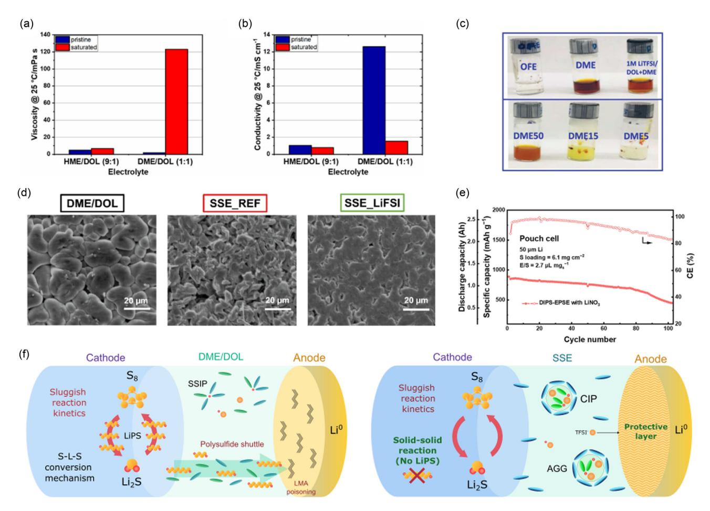
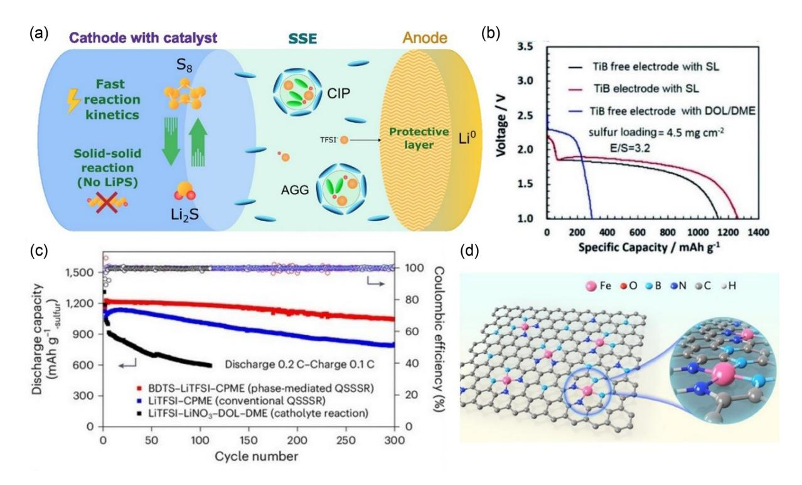

# **Integrated Sparingly Solvating Electrolyte–Catalyst** Strategies to Unlock Lithium-Sulfur Battery Viability: A Perspective

Asier Soria-Fernández, Julen Castillo, Adrián Robles-Fernandez, Sergi Gadea, Alexander Santiago,\* and Daniel Carriazo

Lithium-sulfur batteries (LSBs) are considered promising candidates for next-generation energy storage due to their high theoretical energy density and cost-effectiveness. However, their commercialization is impeded by challenges, such as the polysulfide shuttle effect. This perspective critically examines the integration of sparingly solvating electrolytes (SSEs) and catalysts as a synergistic approach to mitigate polysulfide dissolution and the sluggish solid-state conversion kinetics arising from SSE usage. SSEs regulate lithium polysulfide solubility, enabling

## 1. Introduction

Growing concerns over climate change, combined with the significant reduction in battery costs, are driving a global shift toward transport electrification and smart mobility alternatives.[1] However, despite years of optimization, conventional lithium-ion batteries (LIBs) are approaching their practical energy density limits, which are insufficient to meet future energy storage demands.[2,3] This has led to increasing interest in the development of rechargeable batteries based on conversion reactions, which promise significantly higher energy storage capabilities. Among these, lithium-sulfur batteries (LSBs) emerge as a particularly promising alternative due to their impressive theoretical specific energy density of 2500 Wh kg $-1$  (nearly ten times higher than LIBs). Additionally, sulfur is both cost-effective and naturally abundant, reducing dependence on critical raw material. These advantages make LSBs attractive candidates for enabling the electrification of lightweight and high-energy-demandapplications, including drones, aviation, buses, and heavy trucks.[4]

A. Soria-Fernández, J. Castillo, A. Robles-Fernandez, S. Gadea, A. Santiago, D. Carriazo

Centre for Cooperative Research on Alternative Energies (CIC energiGUNE) Basque Research and Technology Alliance (BRTA) 01510 Vitoria-Gasteiz, Spain *E-mail: asantiago@cicenergigune.com* A. Soria-Fernández, S. Gadea Department of Applied Chemistry University of the Basque Country (UPV/EHU)

Avda. Manuel de Lardizabal, 3, 20018 Donostia-San Sebastián, Spain  $D$  Carriazo Ikerbasque, Basque Foundation for Science

Plaza Euskadi 5, 48009 Bilbao, Spain

lean-electrolyte operation while stabilizing the lithium metal anode. In parallel, catalysts enhance sulfur redox kinetics and promote efficient Li2S nucleation and oxidation. Recent advancements in SSE formulations, electrolyte-catalyst interactions, and their impact on electrochemical performance are analyzed. Future research directions are outlined to optimize SSE-catalyst constructive interaction, thereby facilitating the transition of LSBs toward commercial viability.

The remarkable potential of LSBs has not only driven a surge in academic research, as evidenced by the growing number of published studies but it is also attracting relevant industry investment.[5-7] Nonetheless, despite this growing interest, there are still several critical technological challenges remaining, which must be addressed prior to LSB commercialization.

The remarkable energy density of LSBs is rooted in their complex multiphase redox reactions, where sulfur undergoes several oxidation or reduction steps. LSBs follow a distinctive solidliquid-solid conversion mechanism, which is fundamentally different from the intercalation mechanism found in conventional LIBs. During discharge, soluble intermediate products, called lithium polysulfides (LiPS, e.g.,  $Li_2S_{4-8}$ ), are formed through the reduction of the solid octasulfur  $(S_8)$  during the first conversion plateau. These intermediates are further reduced to insoluble and solid lithium sulfides (Li2S2 and Li2S) during the second conversion plateau.[8,9]

LiPSs act as a double-edged sword within the LSB operation, both facilitating reactions and presenting challenges. On one hand, their efficient charge transfer and redox mediation promote the high specific capacity characteristic of Li-S technology. However, the same solubility that aids the redox reactions also causes the notorious "shuttle effect", a major obstacle to the commercialization of LSBs. In conventional 1,2-dimethoxyethane/ 1,3-dioxolane (DME/DOL)-based electrolytes, LiPS are highly soluble (up to 6 M of  $Li_2S_6$ ), enabling them to diffuse to the anode side, where they react irreversibly with the lithium metal anode (LMA).[10] This parasitic reaction leads to rapid capacity decay due to the continuous loss of active material, low Coulombic efficiency (CE) from LMA corrosion, and severe self-discharge. To mitigate these challenges, extensive research efforts have focused on developing physical and/or chemical LiPS-trapping

strategies within the cathodes or separators. However, most LSBs incorporating these strategies have been evaluated under mild or ideal operating conditions, including lithium excess (negativeto-positive ratio; N/P > 15), flooded electrolyte conditions (>10 μL mgS 1 ), and low sulfur loadings (<2 mgS cm2 ).[11] For LSBs to achieve commercially viable energy densities, practical working conditions must be adopted, such as limited Li excess (N/P < 3), lean electrolyte conditions (<3.0 μL mgS 1 ), and high S loading (>4.0 mgS cm2 ).[12] Among these factors, the electrolyte volume plays a particularly crucial role, as it is the primary contributor to overall cell weight. Minimizing electrolyte content is essential for maximizing energy density; however, operating under low electrolyte to sulfur (E/S) ratios when using conventional electrolytes presents significant challenges. A reduced amount of electrolyte leads to a sharp increase in LiPS concentration, potentially exceeding solubility limits, resulting in saturation and premature precipitation of these soluble species.[13] Moreover, the high LiPS concentration raises electrolyte viscosity, reducing ionic conductivity, and slowing down redox kinetics (Figure 1a,b ).[14] Consequently, the performance of LSBs with conventional electrolytes is highly sensitive to electrolyte volume, making it especially challenging to reduce the E/S ratios to practical values without compromising cell performance in terms of cyclability and power.

Therefore, suppressing the shuttle effect under realistic leanelectrolyte conditions is imperative to fully harness the inherent energy density advantages of Li─S technology while ensuring long-term cyclability that meets the requirements for commercial viability.

In recent years, electrolyte design and engineering have emerged as key strategies for mitigating the shuttle effect in LSBs.[15] Among these strategies, the development of sparingly solvating electrolytes (SSEs) has proven particularly effective in minimizing LiPS solubility, as illustrated in Figure 1c, and decoupling electrolyte volume from sulfur redox reactions, thereby enabling practical E/S ratios.[16] This approach encompasses various electrolyte formulations, including high-concentration electrolytes (HCEs), ionic liquids, localized HCEs (LHCEs), locally

Figure 1. a) Viscosity and b) ionic conductivity of pristine and LiPS saturated HME/DOL SSE and conventional DME/DOL electrolyte at 25 °C. Reproduced from Schmidt et al.,[47] licensed under CC BY 4.0. c) Saturate Li2S8 in different solutions after 2 weeks standing. Reproduced from Zheng et al.,[48] with permission from Wiley. d) SEM images of the lithium deposition on Cu foil with three different electrolytes: conventional DME/DOL, conventional SSE based on LiTFSI, and LiFSI-tailored SSE. Reproduced from Castillo et al.,[32] licensed under CC BY 4.0. e) Practical example of potential performance of SSE-based system under prototype scale. Reprinted from Hou et al.[49] Copyright (2022), with permission from Elsevier. f ) Schematic representation of the working principles of a Li─S battery, along with the challenges and the differences arising from changing the conventional electrolytes to SSEs.

concentrated ionic liquids, and weakly solvating electrolytes (WSEs). Significantly reduced LiPS solubility in SSEs shifts the sulfur redox mechanism from a conventional solid–liquid–solid pathway to a quasisolid or direct solid–solid transformation.[17] While this mechanism eliminates the shuttle effect, it introduces new challenges, such as sluggish reaction kinetics inherent to solid–solid conversion.

This perspective examines the role of SSEs and catalysts in optimizing LSBs, exploring their contributions and the combined potential they hold for bridging the gap to achieve commercial viability.

# 2. SSEs: A Key Strategy to Overcome the Shuttle Effect

Under the LHCE design, the formulation of SSEs typically involves dissolving a high lithium salt concentration in a primary organic solvent, followed by dilution with a cosolvent or diluent with a low donor number and minimal interaction with the lithium salt. In this context, the work from Dokko et al.[18] represented a significant milestone by developing the first formulation. Their approach centered on increasing the concentration of lithium bis(trifluoromethanesulfonyl)imide (LiTFSI) in tetraethylene glycol dimethyl ether solvent, effectively reducing the solubility of LiPS. To counteract the high viscosity associated with the concentrated electrolyte, they introduced the nonsolvating 1,1,2,2-tetrafluoroethyl-2,2,3,3-tetrafluoropropyl ether as diluent. This innovative electrolyte composition led to substantial improvements in the cycle life of the LSB. Since this breakthrough, extensive research has focused on this electrolyte family, deepening the understanding of their electrochemical behavior, and achieving remarkable cycling performance at the prototype pouch cell scale.[19–21] Therefore, LHCEs present a promising class of next-generation electrolytes with significant potential for scalable use in battery applications, especially in LSBs. From a cost perspective, LHCEs have a clear advantage over HCEs by including inert diluents that lower the overall lithium salt content to a level close to that of conventional electrolytes (around 1 M). However, their reliance on highly fluorinated cosolvents, usually per- and polyfluoroalkyl substances (PFAS), remains a major limitation due to high costs and environmental issues.[22,23] Progress toward scalable adoption depends on developing PFAS-free, low-fluorine, or fluorine-free alternatives that preserve electrochemical performance. Regarding manufacturing compatibility, LHCEs have physicochemical properties, such as viscosity and wettability, similar to conventional liquid electrolytes, allowing easy integration into existing battery production processes without major changes. Additionally, LHCEs show promising long-term storage stability, likely due to the chemical inertness of their diluents, which helps prevent side reactions and degradation over time. These qualities make LHCEs a strong candidate for practical use, provided ongoing research addresses their remaining cost and sustainability challenges.

## 2.1. Compatibility with LMA and the Key Role of the Lithium Salt Anion

Beyond mitigating the LiPS shuttle effect and its associated challenges, a key attribute of SSEs is their enhanced compatibility with the LMA. This improved compatibility arises not only from the reduced solubility of the highly reactive LiPS in the electrolyte but also from the formation of a stable solid electrolyte interphase (SEI) layer.[24,25] The favorable interface affinity between SSEs and the LMA is driven by their unique solvation structure, which is dominated by strong cation-anion interactions and the prevalence of contact ion pairs and cation-anion aggregates.[26,27] This distinctive solvation structure promotes the formation of an inorganic-rich SEI layer, primarily composed of anion-derived decomposition products from the lithium salt.[28] This contrasts conventional electrolytes, where free solvent molecules induce a weak, and nonstable organic-rich SEI. Consequently, the appropriate selection of lithium salt plays a key role in SSE formulation design. However, while the role of the lithium salt anion has been extensively investigated in lithium metal battery (LMB) technology, its influence in LSBs, particularly when elemental sulfur is used as the active material, remains largely unexplored. This knowledge gap is reflected in the predominant use of LiTFSI as the sole salt for the development of SSEs.[29,30] Although LiTFSI offers favorable properties such as high ionic conductivity, excellent chemical stability, and thermal robustness, its highly stable anion leads to a weak SEI on the LMA surface. This inadequate SEI fails to guarantee sufficient protection, resulting in poor cyclability for practical applications.

Building on insights from LMB technology, recent studies have attempted to address this gap by incorporating lithium bis(fluorosulfonyl)imide (LiFSI) salt as an additive within the SSE composition to leverage the anion role.[31,32] LiFSI is known for promoting the formation of stable inorganic SEIs, and it has demonstrated significant improvements in electrolyte compatibility with the LMA when used as an additive. This is represented by higher CE values, more uniform and compact lithium deposition as proven by Castillo et. al in Figure 2 1d, and enhanced cycling stability compared to SSE containing only LiTFSI. However, these works also highlight the current gaps in understanding the role of LiFSI in LSBs. While some reports indicate irreversible reactivity between LiFSI and LiPS,[33,34] others show improved performance with its incorporation.[31,32] This inconsistency underscores the need for further research to clarify the mechanism governing the behavior of LiFSI and to establish guidelines for its effective application in LSBs. Furthermore, exploring alternative lithium salts and leveraging the critical role of the anions in SSE design remains essential for promoting robust and favorable SEIs, improving LSB cyclability to levels suitable for practical applications.

## 2.2. Reaction Kinetics Challenge of SSEs in LSBs

Despite the significant potential of SSEs for practical LSB applications, as demonstrated by Peng Hou and colleagues, achieving Perspective [doi.org/10.1002/batt.202500313](http://doi.org/10.1002/batt.202500313)

Figure 2. a) Schematic representation of the advantages of combining a sparingly solvating electrolyte and an electrocatalyst within the cathode composition. b) Comparative first discharge curves at C/10 of pouch cells using TiB as additive with either DOL/DME or the SSE, reprinted with permission from Liu et al.[38] Copyright (2021) Royal Society of Chemistry. c) Long cycling comparative of Li─S cells using the SoA DOL/DME, a WSE, and the combination of this WSE and the redox mediator BDTS, reproduced from Liu et al.,[50] with permission from Springer Nature. d) Sketch of the atomic structure of an iron single-atom catalyst embedded into a boron and nitrogen-doped carbonaceous matrix, reprinted from Li et al.[44] Copyright (2023), with permission from Elsevier.

prototype cells of 1 Ah that reached 100 cycles under challenging conditions (Figure 1e), a critical challenge remains insufficiently addressed: the sluggish redox reaction kinetics due to the reaction mechanism change. Figure 1f compares the mechanisms of conventional DME/DOL-based electrolytes and SSEs. In conventional electrolytes, a solid–liquid–solid conversion occurs, accompanied by the polysulfide shuttle and anode passivation. In contrast, SSEs facilitate a solid–solid reaction, which mitigates the shuttle effect but results in slower reaction kinetics due to limited LiPS dissolution. Additionally, the salt-solvent solution structures in SSEs contribute to the formation of a protective layer on LMA. Slower kinetics leads to increased cell polarization and low sulfur utilization, particularly under fast cycling conditions. This limitation is evident in the LSB literature, where prototype cells involving SSEs are commonly evaluated at moderate to slow cycling rates (typically < 0.2 C).

The absence or minimal presence of free solvent molecules in SSEs drastically reduces LiPS solubility, significantly altering the sulfur redox mechanism. In these systems, it has been observed that the formed Li2S is difficult to fully delithiate during the charging process at a typical charge-cut-off voltage of 2.8 V due to the formation of large, inactive Li2S particles.[35] The accumulation of these electronically insulator Li2S large particles presents significant challenges, including long-range Liþ and electron transport pathways, as well as inherently low Liþ diffusivity coefficients.[36] These factors collectively lead to lower sulfur utilization, strong capacity decay, and compromised performance at high-power operations. Therefore, addressing these challenges is pivotal for enhancing the rate capability and overall SSE LSB performance, advancing their practical application in high-energy and high-power environments.

## 3. Catalysts

To further address the challenge related to the sluggish sulfur redox kinetics, the introduction of catalysts in SSE-based LSBs has emerged as an essential strategy to enhance reaction kinetics and improve overall performance. As shown in the scheme of Figure 2a, by promoting the conversion and uniform nucleation of sulfur species, catalysts help to facilitate Li2S oxidation and enhance charge transfer, thereby reducing polarization, increasing sulfur utilization, and stabilizing cycling performance.

However, to fully assess their role in SSE-based LSBs, it is also important to consider the potential limitations and trade-offs associated with catalyst integration. While the use of catalysts in LSBs has demonstrated clear benefits, their implementation also presents several intrinsic challenges that must be addressed. Traditional catalyst materials, such as transition metal compounds and carbon-based composites, may degrade over time due to structural instability or chemical incompatibility with active species. In some cases, catalysts may exhibit limited selectivity, leading to unwanted side reactions, especially in systems where reactive intermediates like LiPSs are present. Additionally,

catalytic additives can increase the overall weight and complexity of the electrode, potentially compromising gravimetric energy density and scalability. Advanced systems such as single-atom catalysts (SACs) and heterostructures, while promising in terms of activity, face challenges related to synthesis complexity and high production costs.

In this context, the adoption of SSEs presents an opportunity to help mitigate several of these limitations. By significantly suppressing LiPS dissolution and stabilizing interfacial reactions, SSEs reduce the need for polysulfide-trapping functionalities. This allows catalyst design to shift from a focus on liquid-phase interactions toward promoting direct solid–solid conversion reactions. The synergy between SSEs and catalysts thus not only enhances performance but also alleviates some of the structural and economic challenges associated with catalyst use, opening a path toward more efficient and durable LSB systems.

Despite extensive research on catalysts in academia, their integration into SSE-based systems remains underexplored. Given the fundamental shift in the conversion reaction pathways when SSEs are employed, catalyst design must be rethought to align with the electrolyte's solvation structure for optimal performance.

#### 3.1. Catalysts for SSE-Based Li─S Batteries

The first approaches reported in the literature involve the use of titanium-based compounds, proving significant performance enhancements. One notable approach involved the use of titanium black (TiB), a mixture of TiO2 and TiN, in conjunction with a sulfolane (SL)-based SSE,[37,38] yielding key electrochemical benefits. It was claimed that TiO2, due to its high polarity, was found to facilitate a uniform Li2S nucleation site and serve as a polysulfide immobilizer. Meanwhile, TiN contributed to enhancing electronic conductivity of the cathode by activating the nucleation sites, thereby enhancing redox kinetics. The synergistic interaction between TiB and SL-based SSE improves sulfur utilization and cycling stability, even under high sulfur loading and lean electrolyte conditions, achieving energy densities over 300 Wh Kg1 , as shown in Figure 2b. In this figure, it is observed not only how the presence of the catalyst increases the discharge capacities achieved for the SSE samples, but also how it further demonstrates that under lean conditions, SSEs outperform conventional electrolytes. In addition to TiB, pure TiN has also been investigated due to its conductive and electrocatalytic activity, which promotes LiPS charge transfer, reduces polarization, and improves overall kinetics, since LiPS immobilization is not needed in SSE systems. Studies incorporating TiN in the cathode have demonstrated energy densities exceeding 350 Wh kg1 with extended cycle life under practical working conditions.[39]

Beyond titanium-based compounds, transition metal sulfides have also been investigated for their ability to mitigate sluggish Li2S deposition. Among these, copper sulfide (CuS) nanoparticles[40] have demonstrated their catalytic activity, effectively preventing Li2S accumulation, enhancing redox kinetics, and significantly improving sulfur utilization and long-term cycling stability. In addition to sulfides, recent advances have also explored oxide-based catalysts to further enhance electrochemical performance. Ghosh et al.[41] introduced lithium aluminate (LiAlO2) nanoflakes as a cathode additive, showing that LiAlO2 facilitates Li-ion diffusion and improves electrolyte accessibility in high-sulfur-loading cathodes. This approach led to the development of pouch cells with an E/S ratio of 3 μL mg1 , delivering 800 mAh g1 and maintaining 80% capacity retention over 50 cycles at C/30.

#### 3.2. Redox Mediators: A New Pathway for SSE–Catalysis Marriage

Beyond cathode-supported solid-state electrocatalysts, incorporating redox mediators directly into the SSE formulation presents a highly promising and practical alternative. This approach eliminates the need for additional synthesis and deposition steps required for supporting solid electrocatalysts on the sulfur cathode, significantly simplifying manufacturing and reducing overall costs. A notable example of this strategy is the study by Liu et al.,[50] which effectively demonstrates its feasibility and performance benefits.[41] Their work explores the incorporation of bis(dimethylthiocarbamyl) sulfide as a phase mediator to enhance quasisolid sulfur redox reaction (QSSSR) kinetics in a WSE based on the apolar solvent cyclopentyl methyl ether. BTDS facilitates QSSSR by dynamically coordinating with quasisolid LiPSs, forming localized solution zones on the electrode surface that accelerate redox kinetics. This phase-mediated QSSSR mechanism, combined with a tailored WSE rich in contact ion pair structures, enabled remarkable Li─S cell performance, achieving high power capabilities (494 mAh g1 at 16 C) and stable cycling under high sulfur loading (3–5 mg cm2 ) with lean electrolyte conditions (3–5 μL mg1 ), as can be inferred from Figure 2c.

The successful integration of redox mediators into SSE-based systems presents an opportunity to enhance redox kinetics while simplifying cell fabrication and improving scalability. However, further research is needed to exploit this approach, trying to optimize the compatibility of redox mediators with the electrolyte, avoiding possible side reactions.

#### 3.3. Toward Next-Generation SSE–Catalysts

As previously discussed, the adoption of SSEs fundamentally alters the sulfur redox pathway in LSBs from a conventional solid–liquid–solid mechanism to a predominantly solid–solid or quasisolid process. This transformation substantially impacts the fitness requirements for catalyst design. In conventional electrolytes, catalysts are primarily evaluated based on their ability to absorb and mediate soluble LiPS, facilitating redox shuttling and intermediate stabilization.[38,42] However, in SSE-based systems where LiPS solubility is drastically suppressed, such intermediate-mediated mechanisms are absent or minimal. As a result, effective catalysts must instead focus on directly facilitating solid-state conversions, notably the nucleation and oxidation of Li2S, without relying on solution-phase mediation.

This imposes stringent requirements on catalyst surface accessibility, electronic conductivity, and ionic transport facilitation within the cathode composite. Catalysts must exhibit high activity for Li2S oxidation even in the absence of solvated LiPS and promote uniform Li2S deposition to prevent insulating buildup.[40] Moreover, given the altered solvation environment in SSEs, catalyst performance becomes highly dependent on their interfacial compatibility with the electrolyte system.

To address these challenges, several strategies followed in conventional LSBs can be explored. One of the most promising approaches involves modifying the carbon network with heteroatoms such as B, N, or O or decorating it with heterostructures (metallic nitrides, phosphides, and sulfides), to tune cathode polarity and enhance electrochemical conversion capability. Another promising alternative could be the inclusion of SACs,[43] isolated metal atoms anchored onto conductive substrates, as shown in Figure 2d, that offer high catalytic efficiency, tailored electronic states, and superior atom utilization than common nanoparticles. SAC systems facilitate sulfur redox reactions with minimal mass addition, making them ideal for high-energy-density applications.[44,45]

Despite the promising step towards the commercialization of LSBs through this strategy, there are still challenges to overcome like the compatibility between these catalysts and the SSEs. The unique solvation structures of SSEs could influence the catalyst performance, requiring tailored interactions between both components to increase its efficiency. To address this, computational modeling and machine learning have emerged as essential tools for accelerating catalyst discovery and optimization. By overcoming these barriers, next-generation SSEs coupled with advanced catalysts can significantly enhance the viability and commercial feasibility of LSBs.

# 4. Outlook and Perspectives

The combination of SSEs and advanced catalysts represents a promising avenue for developing high-performance LSBs under practical conditions. While SSEs mitigate the LiPS solubility, avoiding the shuttle effect, catalysts enhance conversion kinetics, ensuring efficient sulfur conversion reactions and improving power capability. The synergistic effect of these two approaches has the potential to overcome the key technological challenges that currently hinder the commercialization of LSBs.

Despite recent breakthroughs, several challenges in the development of SSE-based LSBs remain unsolved. A primary challenge lies in the widespread reliance on LiTFSI as lithium salt for SSE formulation in LSBs. While LiTFSI offers favorable ionic conductivity and electrochemical stability, it leads to the formation of a weak SEI layer that fails to sufficiently stabilize the LMA, especially under practical cycling conditions. To address this, exploring alternative lithium salts such as LiFSI or novel anions which could improve the SEI robustness and enhance LMA protection is critical. However, the compatibility of LiFSI with sulfur conversion mechanisms in SSEs remains insufficiently understood, requiring further studies to assess its suitability in SSE-based systems.

A second critical challenge is related to the use of perfluorinated cosolvents in SSE formulations. While these solvents are effective in reducing LiPS solubility and extending cycle life, they introduce trade-offs in terms of high density, which reduces the gravimetric energy density of the cell, and raise significant environmental and human health concerns due to their chemical persistence.[46] To overcome this, future research should prioritize the development of low-density fluorine-free or low fluorine solvents that keep the required solvation characteristics and chemical stability meanwhile improving environmental sustainability and reducing overall cell mass to not penalize the gravimetric energy-density.

In terms of catalytic integration, the transition from a conventional solid-liquid-solid redox pathway to a quasisolid or solid–solid mechanism, as imposed by SSEs, necessitates a fundamental reevaluation of catalyst design. The diminished role of soluble polysulfide intermediates in these systems renders conventional LiPS-trapping strategies less effective. Therefore, next-generation catalysts must focus on promoting charge transfer and facilitating Li2S nucleation and oxidation, which are inherently sluggish in solid–solid systems. Promising approaches include heteroatom doping of conductive matrices, SACs, and hybrid electrocatalyst-carbon frameworks. These strategies, initially developed for conventional systems, may be adapted for SSEs environments through careful consideration of interfacial interactions and ionic transport pathways.

Moving forward, the future of LSB development will be linked to the optimization of the electrolyte-catalyst system. This includes ensuring high ionic conductivity, effective polysulfide suppression, long-term electrochemical stability, sustainability, stable electrode interfaces, and maximized practical energy density under lean electrolyte conditions. In this context, advanced characterization techniques, along with computational modeling (e.g., machine learning-driven electrolyte and catalyst optimization) will play a crucial role in accelerating the discovery of optimized SSE formulations and catalytic materials specifically engineered for real-world applications.

The next decade will be crucial for bridging the gap between academic innovation and industrial deployment of LSBs. By strategically integrating SSEs and advanced catalytic frameworks, LSBs have the potential to move beyond the laboratory and emerge as a commercially viable alternative to lithium-ion technology, particularly for high-energy-demand applications such as aviation, electric trucks, and pseudosatellites. Achieving this goal requires a multidisciplinary approach, bringing together expertise in materials science, electrochemistry, and engineering, along with increased industry involvement to address manufacturing challenges and scale-up these advancements into real-world energy storage solutions.

## Acknowledgements

This work was supported by the Basque Government (GV-ELKARTEK-2025).

# Conflict of Interest

The authors declare no conflict of interest.

# Author Contributions

Asier Soria-Fernández: writing—original draft (supporting); writing—review & editing (supporting). Julen Castillo: writing original draft (equal); writing—review & editing (equal). Adrián Robles-Fernandez: writing—original draft (supporting); writing review & editing (supporting). Sergi Gadea: writing—original draft (supporting); writing—review & editing (supporting). Alexander Santiago: writing—original draft (lead); writing—review & editing (lead). Daniel Carriazo: supervision lead; writing—original draft (supporting); writing review & editing (supporting).

Keywords: catalysts · lithium–sulfur batteries · scale-ups · sparingly solvating electrolytes

- [1] Z. P. Cano, D. Banham, S. Ye, A. Hintennach, J. Lu, M. Fowler, Z. Chen, Nat. Energy 2018, 3, 279.
- [2] J. W. Choi, D. Aurbach, Nat. Rev. Mater. 2016, 1, 16013.
- [3] F. Duffner, N. Kronemeyer, J. Tübke, J. Leker, M. Winter, R. Schmuch, Nat. Energy 2021, 6, 123.
- [4] S. Dörfler, S. Walus, J. Locke, A. Fotouhi, D. J. Auger, N. Shateri, T. Abendroth, P. Härtel, H. Althues, S. Kaskel, Energy Technol. 2021, 9, 2000694.
- [5] LG Energy Solution aiming to develop lithium sulfur battery within 3 years. [https://www.thelec.net/news/articleView.html?idxno](https://www.thelec.net/news/articleView.html?idxno=4368)=4368.
- [6] Stellantis and Zeta Energy Announce Agreement to Develop Lithium-Sulfur EV Batteries. [https://www.stellantis.com/en/news/press](https://www.stellantis.com/en/news/press-releases/2024/december/stellantis-and-zeta-energy-announce-agreement-to-develop-lithium-sulfur-ev-batteries)[releases/2024/december/stellantis-and-zeta-energy-announce-agreement](https://www.stellantis.com/en/news/press-releases/2024/december/stellantis-and-zeta-energy-announce-agreement-to-develop-lithium-sulfur-ev-batteries)[to-develop-lithium-sulfur-ev-batteries](https://www.stellantis.com/en/news/press-releases/2024/december/stellantis-and-zeta-energy-announce-agreement-to-develop-lithium-sulfur-ev-batteries).
- [7] Stellantis Invests in Lyten's Breakthrough Lithium-Sulfur EV Battery Technology. [https://www.stellantis.com/en/news/press-releases/2023/](https://www.stellantis.com/en/news/press-releases/2023/may/stellantis-invests-in-lyten-s-breakthrough-lithium-sulfur-ev-battery-technology) [may/stellantis-invests-in-lyten-s-breakthrough-lithium-sulfur-ev-battery](https://www.stellantis.com/en/news/press-releases/2023/may/stellantis-invests-in-lyten-s-breakthrough-lithium-sulfur-ev-battery-technology)[technology](https://www.stellantis.com/en/news/press-releases/2023/may/stellantis-invests-in-lyten-s-breakthrough-lithium-sulfur-ev-battery-technology).
- [8] J. T. Kim, H. Su, Y. Zhong, C. Wang, H. Wu, D. Zhao, C. Wang, X. Sun, Y. Li, Nat. Chem. Eng. 2024, 1, 400.
- [9] J. J. Zhao, Z. X. Chen, Q. Cheng, M. Zhao, X. Ma, X. Q. Zhang, J. Q. Huang, B. Q. Li, J. Mater. Chem. A Mater. 2024, 12, 21845.
- [10] C. X. Bi, N. Yao, X. Y. Li, Q. K. Zhang, X. Chen, X. Q. Zhang, B. Q. Li, J. Q. Huang, Adv. Mater. 2024, 36, 2411197.
- [11] S. Dörfler, H. Althues, P. Härtel, T. Abendroth, B. Schumm, S. Kaskel, Joule 2020, 4, 539.
- [12] C. Zhao, A. Daali, I. Hwang, T. Li, X. Huang, D. Robertson, Z. Yang, S. Trask, W. Xu, C. J. Sun, G. L. Xu, K. Amine, Angew. Chem. – Int. Ed. 2022, 61, e202203466.
- [13] H. Shi, W. Sun, J. Cao, S. Han, G. Lu, Z. A. Ghazi, X. Zhu, H. Lan, W. Lv, Adv. Funct. Mater. 2023, 33, 2306933.
- [14] S. Kirchhoff, P. Härtel, S. Dörfler, T. Abendroth, H. Althues, S. Kaskel, Batteries Supercaps 2024, 7, e202400155.
- [15] F. Yang, X. Qi, H. Du, R. Jiang, R. Zhao, Y. Pan, Q. Jin, X. Jin, L. Qie, Y. Huang, Energy Storage Mater. 2023, 55, 272.
- [16] S. C. Kim, X. Gao, S. L. Liao, H. Su, Y. Chen, W. Zhang, L. C. Greenburg, J. A. Pan, X. Zheng, Y. Ye, M. S. Kim, P. Sayavong, A. Brest, J. Qin, Z. Bao, Y. Cui, Nat. Commun. 2024, 15, 1268.
- [17] H. S. Yang, D. M. Kim, Y. Kim, Y. J. Lee, K. T. Lee, ChemElectroChem 2021, 8, 2321.
- [18] K. Dokko, N. Tachikawa, K. Yamauchi, M. Tsuchiya, A. Yamazaki, E. Takashima, J.-W. Park, K. Ueno, S. Seki, N. Serizawa, M. Watanabe, J. Electrochem. Soc. 2013, 160, A1304.

- [19] A. Robles-Fernández, G. Moreno-Fernández, A. Soria-Fernández, J. Castillo, A. Santiago, D. Carriazo, Carbon 2024, 229, 119442.
- [20] I. Kim, S. Kim, H. Cho, J. Jung, H. Kwon, D. Kim, Y. Shin, H. Kim, Adv. Energy Mater. 2024, 15, 2403828.
- [21] H. Cheng, S. Zhang, B. Zhang, Y. Lu, Small 2023, 19, 2206375.
- [22] X. Liu, C. Xu, H. Adenusi, Y. Wu, S. Passerini, Acc. Chem. Res. 2025, 58, 354. [23] W. Gao, Y. Peng, Y. Lu, X. Liu, Y. Xu, K. Yang, Y. Wu, J. He, Energy Storage Mater. 2025, 80, 104378.
- [24] J. Castillo, J. A. Coca-Clemente, J. Rikarte, A. S. De Buruaga, A. Santiago, C. Li, APL Mater. 2023, 11, 010901.
- [25] X. Kong, Y. Kong, Y. Zheng, L. He, D. Wang, Y. Zhao, Small 2022, 18, 2205017.
- [26] J. X. Guo, W. B. Tang, X. Xiong, H. Liu, T. Wang, Y. Wu, X. B. Cheng, Front. Chem. Sci. Eng. 2023, 17, 1354.
- [27] C. Zhang, S. Gu, D. Zhang, J. Ma, H. Zheng, M. Zheng, R. Lv, K. Yu, J. Wu, X. Wang, Q. H. Yang, F. Kang, W. Lv, Energy Storage Mater. 2022, 52, 355.
- [28] I. Kim, S. Kim, H. Cho, J. Jung, H. Kwon, D. Kim, Y. Shin, H. T. Kim, Adv. Energy Mater. 2025, 15, 2403828.
- [29] X. Gao, Z. Yu, J. Wang, X. Zheng, Y. Ye, H. Gong, X. Xiao, Y. Yang, Y. Chen, S. E. Bone, L. C. Greenburg, P. Zhang, H. Su, J. Affeld, Z. Bao, Y. Cui, Proc. Natl. Acad. Sci. U S A 2023, 120, e2301260120.
- [30] C. Weller, J. Pampel, S. Dörfler, H. Althues, S. Kaskel, Energy Technol. 2019, 7, 1900625.
- [31] J. Liu, A. Ghosh, S. Kondou, S. Li, K. Ueno, K. Dokko, M. Watanabe, ACS Appl. Energy Mater. 2025, 8, 1570.
- [32] J. Castillo, A. Soria-Fernández, S. Rodriguez-Pena, J. Rikarte, ˜ A. Robles-Fernández, I. Aldalur, R. Cid, J. A. González-Marcos, J. Carrasco, M. Armand, A. Santiago, D. Carriazo, Adv. Energy Mater. 2024, 14, 2302378.
- [33] J. W. Park, K. Ueno, N. Tachikawa, K. Dokko, M. Watanabe, J. Phys. Chem. C 2013, 117, 20531.
- [34] L. Yoshida, Y. Matsui, M. Deguchi, T. Hakari, M. Watanabe, M. Ishikawa, ACS Appl. Mater. Interfaces 2023, 15, 37467.
- [35] X. Qi, F. Yang, P. Sang, Z. Zhu, X. Jin, Y. Pan, J. Ji, R. Jiang, H. Du, Y. Ji, Y. Fu, L. Qie, Y. Huang, Angew. Chem. – Int. Ed. 2023, 62, e202218803.
- [36] Z. X. Chen, Q. Cheng, X. Y. Li, Z. Li, Y. W. Song, F. Sun, M. Zhao, X. Q. Zhang, B. Q. Li, J. Q. Huang, J. Am. Chem. Soc. 2023, 145, 16449.
- [37] S. Li, S. Ishikawa, J. Liu, K. Ueno, K. Dokko, G. Inoue, M. Watanabe, Batteries Supercaps 2022, 5, e202100409.
- [38] J. Liu, S. Li, M. Marium, B. Wang, K. Ueno, K. Dokko, M. Watanabe, Sustain. Energy Fuels 2021, 5, 1821.
- [39] X. Y. Li, S. Feng, Y. W. Song, C. X. Zhao, Z. Li, Z. X. Chen, Q. Cheng, X. Chen, X. Q. Zhang, B. Q. Li, J. Q. Huang, Q. Zhang, J. Am. Chem. Soc. 2024, 146, 14754.
- [40] R. Jiang, X. Qi, J. Ji, F. Yang, C. Feng, J. Zheng, X. Jin, R. Zhang, L. Qie, Energy Storage Mater. 2024, 66, 103215.
- [41] A. Ghosh, J. Liu, S. Li, K. Ueno, K. Dokko, M. Watanabe, ACS Appl. Mater. Interfaces 2023, 15, 23104.
- [42] H. Chen, Z. Wu, M. Zheng, T. Liu, C. Yan, J. Lu, S. Zhang, Mater. Today 2022, 52, 364.
- [43] Z. Liang, J. Shen, X. Xu, F. Li, J. Liu, B. Yuan, Y. Yu, M. Zhu, Adv. Mater. 2022, 34, 2200102.
- [44] S. Li, J. Lin, B. Chang, D. Yang, D. Y. Wu, J. Wang, W. Zhou, H. Liu, S. Sun, L. Zhang, Energy Storage Mater. 2023, 55, 94.
- [45] C. Zhao, G.-L. Xu, Z. Yu, L. Zhang, I. Hwang, Y.-X. Mo, Y. Ren, L. Cheng, C.-J. Sun, Y. Ren, X. Zuo, J.-T. Li, S.-G. Sun, K. Amine, T. Zhao, Nat. Nanotechnol. 2021, 16, 166.
- [46] A. P. Bline, J. C. DeWitt, C. F. Kwiatkowski, K. E. Pelch, A. Reade, J. R. Varshavsky, Curr. Environ. Health Rep. 2024, 11, 118.
- [47] F. Schmidt, A. Korzhenko, P. Härtel, F. S. Reuter, S. Ehrling, S. Dörfler, T. Abendroth, H. Althues, S. Kaskel, J. Phys. Energy 2022, 4, 014004.
- [48] J. Zheng, G. Ji, X. Fan, J. Chen, Q. Li, H. Wang, Y. Yang, K. C. DeMella, S. R. Raghavan, C. Wang, Adv. Energy Mater. 2019, 9, 1803774.
- [49] L. P. Hou, X. Q. Zhang, N. Yao, X. Chen, B. Q. Li, P. Shi, C. B. Jin, J. Q. Huang,
- Q. Zhang, Chem 2022, 8, 1083.
- [50] Y. Liu, Y. An, C. Fang, Y. Ye, Y. An, M. He, Y. Jia, X. Hong, Y. Liu, S. Gao, Y. Hao, J. Chen, J. Zheng, Y. Lu, R. Zou, Q. Pang, Nat. Chem. 2025, 17, 614.

Manuscript received: April 25, 2025 Revised manuscript received: July 14, 2025 Version of record online: