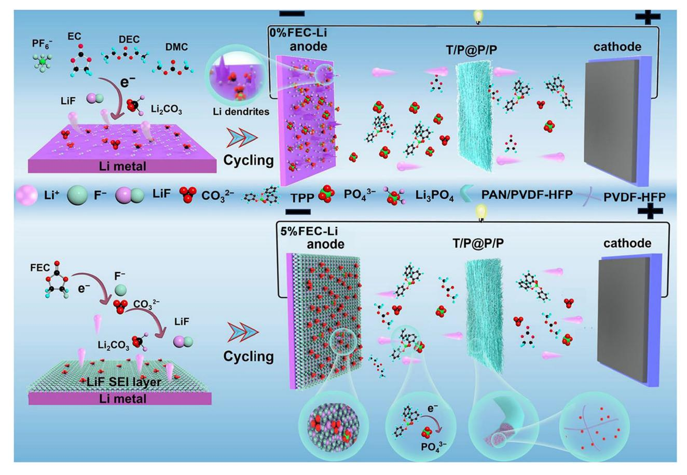
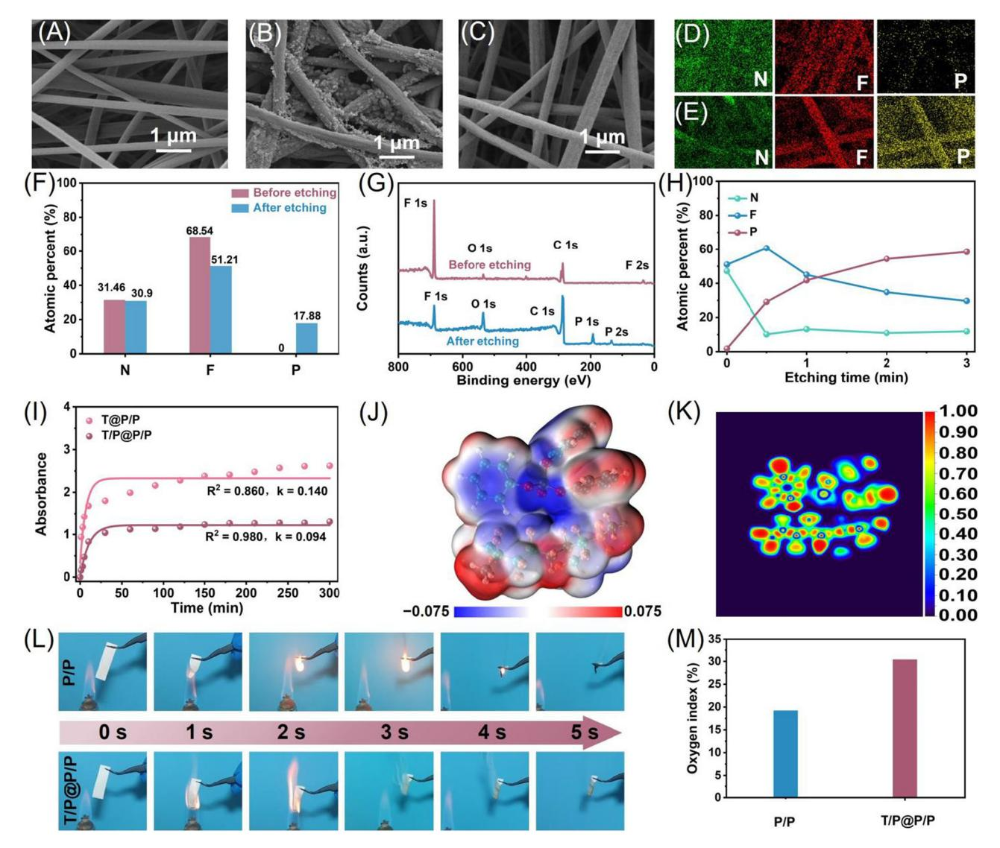
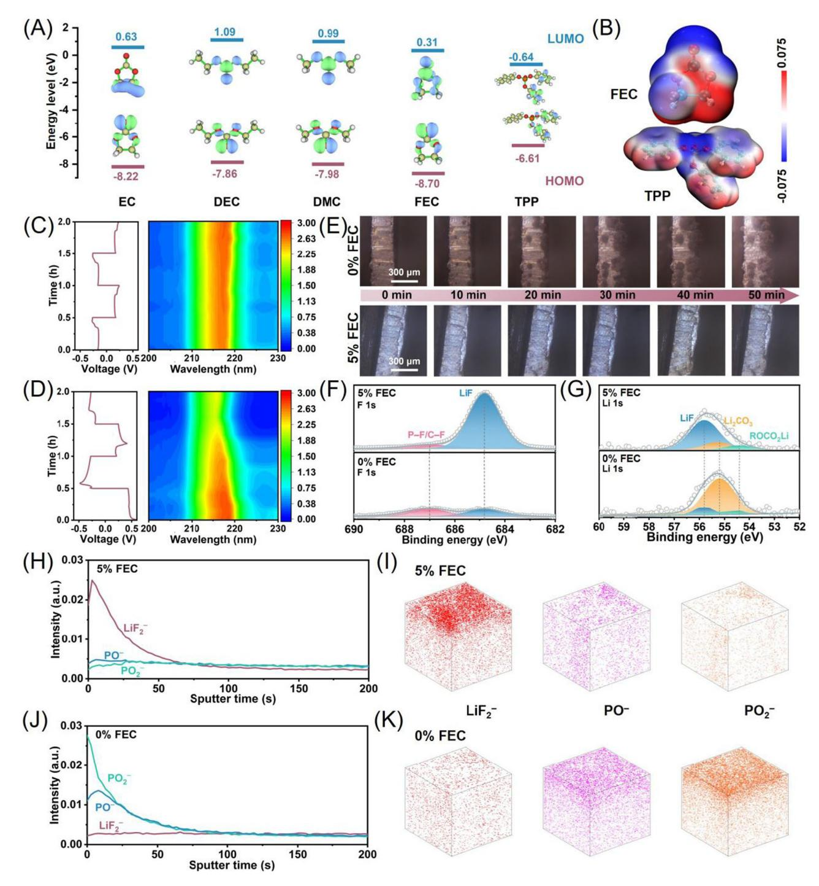
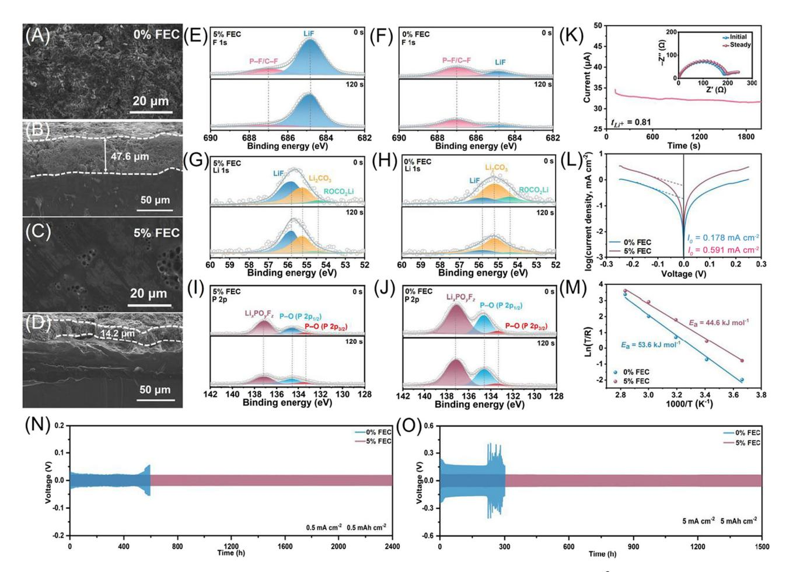
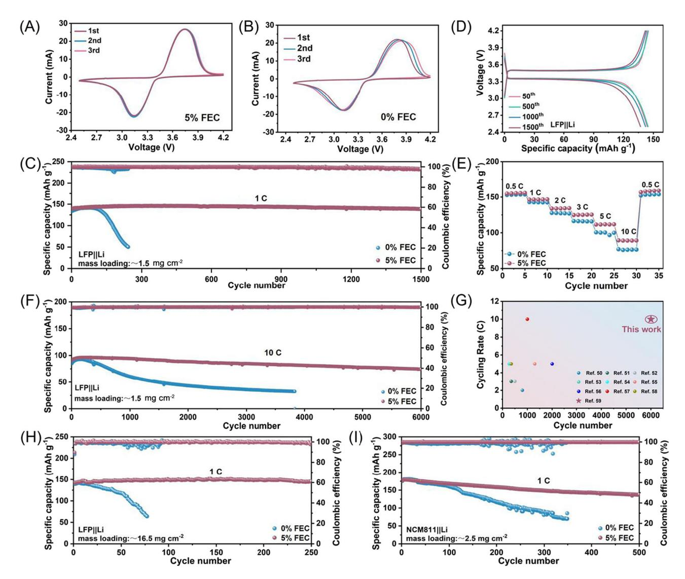
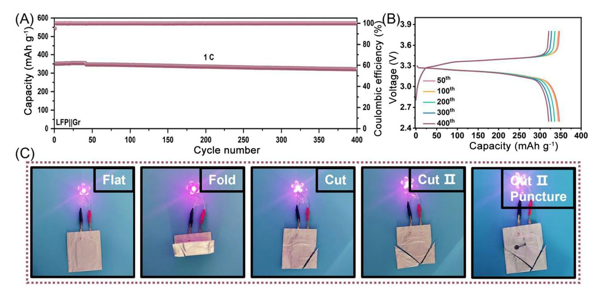

RESEARCH ARTICL[E](https://doi.org/10.1002/cey2.70077)

# Customized Design of LiF‐Rich SEI Layer on Lithium Metal Anode for High Flame Retardant Electrolyte

Haibo L[i1](#page-0-0) | Xiaoya Qu[1](#page-0-0) | Yicai Pan[2](#page-0-1) | Na Li[1](#page-0-0) | Chuancong Zhou[3](#page-0-2) | Zaowen Zhao[3](#page-0-2) | Zhenyue Xing[3](#page-0-2) | Xiaodong Shi[3](#page-0-2) | Xinlong Tia[n3](#page-0-2) | Peng Wang[1](#page-0-0)

1 Hebei Key Laboratory of Flexible Functional Materials, School of Materials Science and Engineering, Hebei University of Science and Technology, Shijiazhuang, China | 2 Department of Materials Science and Engineering & Center of Super‐Diamond and Advanced Films (COSDAF), City University of Hong Kong, Hong Kong, China | 3 School of Marine Science and Engineering, State Key Laboratory of Tropic Ocean Engineering Materials and Materials Evaluation, School of Materials Science and Engineering, Hainan University, Haikou, China

Correspondence: Na Li [\(nali90@hebust.edu.cn](mailto:nali90@hebust.edu.cn)) | Xiaodong Shi ([shixiaodong@hainanu.edu.cn\)](mailto:shixiaodong@hainanu.edu.cn) | Xinlong Tian [\(tianxl@hainanu.edu.cn\)](mailto:tianxl@hainanu.edu.cn) | Peng Wang ([pengwang85@hebust.edu.cn](mailto:pengwang85@hebust.edu.cn))

Received: 21 April 2025 | Revised: 27 May 2025 | Accepted: 24 June 2025

Funding: This study was supported by the National Natural Science Foundation of China (52404316, 52474325), the S&T program of Hebei Province (225A4404D), the Natural Science Foundation of Hainan Province (524RC475), the Collaborative Innovation Center of Marine Science and Technology of Hainan University (XTCX2022HYC14), and the Xingtai City Natural Science Foundation (2023ZZ027). The Pico Electron Microscopy Center of Hainan University partially supported this study.

Keywords: dual confinement effects | gel polymer electrolyte | lithium metal batteries | solid electrolyte interphase layer

### ABSTRACT

Gel polymer electrolytes (GPEs) with high flame‐retardant concentration can remarkably reduce the thermal runaway risk of lithium metal batteries (LMBs). However, higher flame‐retardant content in GPEs always leads to increased leakage of active component and severe lithium corrosion, which greatly hinders the service life of LMBs. Herein, GPEs with high‐loading triphenyl phosphate (TPP) are originally fabricated by coaxial electrospinning and stabilized by dual confinement effects, including chemisorption of polyvinylidene fluoride‐hexafluoropropylene (PVDF‐HFP), and physical encapsulation of polyacrylonitrile (PAN)/PVDF‐HFP. These effects arise from the strong polar interactions between the −CF3 group in PVDF‐HFP and P=O group in TPP, as well as the superior anti‐swelling property of PAN. To mitigate TPP‐induced corrosion during cycling, the optimized Li anode is armored with LiF‐rich solid electrolyte interphase (SEI) layer through immersing it in fluoroethylene carbonate‐containing electrolyte. As expected, the corresponding Li||Li symmetric cells deliver long‐term stable cycling behavior over 2400 h at 0.5 mA cm−2 , and the LiFePO4||Li batteries hold a high‐capacity retention ratio of 81.7% after 6000 cycles at 10 C with excellent flame retardancy. These findings offer new insight into designing the SEI layer for lithium metal in flame‐retardant electrolytes, thus promoting the development and application of high‐security LMBs.

## 1 | Introduction

Lithium metal batteries (LMBs) are leading candidates for next‐ generation high‐energy‐density storage devices owing to the highest theoretical capacity (3860 mAh g−1 ) and the lowest standard electrode potential (−3.04 V vs. standard hydrogen electrode) of lithium metal [1[–](#page-8-0)4]. However, LMBs in common liquid electrolytes always suffer from significant challenges, further blocking the practical applications. For example, nonuniform Li deposition leads to uncontrollable dendrite growth, reducing Coulombic efficiency (CE), inducing short circuits, and shortening cycle life. Meanwhile, lithium metal's intrinsic

© 2025 The Author(s). Carbon Energy published by Wenzhou University and John Wiley & Sons Australia, Ltd.

Haibo Li and Xiaoya Qu contributed equally to this study.

This is an open access article under the terms of the [Creative Commons Attribution](http://creativecommons.org/licenses/by/4.0/) License, which permits use, distribution and reproduction in any medium, provided the original work is properly cited.

instability and flammability in liquid electrolytes further increase the risk of thermal runaway [5–[7\]](#page-8-1).

In comparison to liquid electrolytes, LMBs in solid electrolytes had been extensively studied as the safest alternative [8–[11\]](#page-8-2), but the practical application of solid electrolytes was limited by the low ionic conductivity and poor interfacial compatibility with the electrodes [12–[18](#page-8-3)]. Balancing the advantages of solid electrolytes and liquid electrolytes, gel polymer electrolytes (GPEs) possess high ionic conductivity and good interfacial compatibility while eliminating the risks of solvent leakage and volatilization [\[19](#page-8-4)–21]. The flammability risk of GPEs still persists due to the soaking treatment in traditional organic solvents [\[22, 23](#page-8-5)], and the development of non‐flammable GPEs remains a critical need and top priority [[24](#page-9-0)–26]. Phosphate‐based flame retardants, including triphenyl phosphate (TPP), trimethyl phosphate (TMP), triethyl phosphate (TEP), dimethyl methyl phosphonate (DMMP), and diethyl ethyl phosphonate (DEEP), have been identified as promising flame‐retardant additives [\[27](#page-9-1)–30]. Although the incorporation of phosphate‐based flame retardants into GPEs can confer non‐flammability, these unbound and unconfined phosphates in GPEs inescapably undergo irreversible decomposition on the surface of the active anode. For LMBs, the substance from chemical decomposition/ leakage of flame retardants persistently corrodes the Li anode, leading to the formation of a thick solid electrolyte interface (SEI) layer, which greatly diminishes the migration kinetics of Li+ at the interface of the Li anode and GPEs [31–[35\]](#page-9-2). In other words, more flame‐retardant additives in GPEs can boost the safety feature but bring the issue of Li anode corrosion due to the leakage of active flame‐retardant components [[36, 37](#page-9-3)]. To balance the high flame retardancy and high electrochemical stability of LMBs, it is still a significant challenge to effectively restrain the leakage of flame retardants while maintaining the interface stability of Li anode [38–[40\]](#page-9-4).

Recently, the flame retardant of TPP was physically encapsulated into the composite shell of polyacrylonitrile (PAN) and polyvinylidene fluoride‐hexafluoropropylene (PVDF‐HFP) to achieve the controllable leakage of TPP component in GPEs [\[41\]](#page-9-5). Nevertheless, only physical confinement cannot fully resolve the problem, particularly the high‐concentration encapsulation of flame‐retardant in GPEs. Additionally, owing to the high polarity and strong electron donor characteristics of most organic phosphates, phosphate‐based flame retardants in GPEs tend to participate in the initial formation of the SEI layer on the surface of Li anode [\[42, 43\]](#page-9-6). The reduction products of organic phosphates possess a weak electrostatic shielding effect, making it a great challenge to prevent the continuous decomposition of phosphate‐ based flame retardants at the interface [\[44, 45](#page-9-7)]. To regulate the interface compatibility for GPEs with high‐loading phosphate‐ based flame retardant, the artificial SEI layer strategy attracted wide attention [[46](#page-9-8)–48]. Sulfonate‐rich ion‐exchange layer coating layer on the surface of zinc metal effectively inhibited the electrochemical corrosion caused by polyiodides [\[49\]](#page-9-9), while robust Li‐Sn alloy/LiF composite layer on Li anode successfully suppressed the polysulfide shuttle effect and protected it from corrosive reaction by lithium polysulfides [\[50](#page-9-10)]. Currently, there is still a lack of in‐depth research on the targeted design of the SEI layer to prevent contact corrosion between lithium metal and flame‐retardant‐containing GPEs.

Herein, GPEs with high‐loading TPP (70 wt.%) are prepared via electrospinning, with TPP/PVDF‐HFP composite core and PAN/PVDF‐HFP composite polymer shell (labeled as T/P@P/P). As demonstrated by the experimental and theoretical calculation results, the PVDF‐HFP at the core position can chemically absorb the TPP molecule to reduce its release, and the PAN/PVDF‐HFP shell contributes to restraining TPP leakage through physical confinement effect. Meanwhile, a uniform, dense, and LiF‐rich SEI layer is elaborately constructed on the surface of the Li anode by soaking in 5% fluoroethylene carbonate (FEC)‐containing electrolyte. Benefiting from the synergistic effect of LiF‐rich SEI layer and high flame‐retardant electrolytes, the optimized Li||Li cells exhibit excellent cyclic stability for 1500 h at the high‐current density of 5 mA cm−2 , and the corresponding LiFePO4 (LFP)||Li batteries achieve high reversible capacity of 138.55 mAh g−1 after 1500 cycles at 1 C with high‐capacity retention ratio of 98.9%.

#### 2 | Results and Discussions

Figure [1](#page-2-0) shows the pre‐formation of a LiF‐rich SEI layer by soaking the Li anode in a 5%FEC‐containing electrolyte (1 M LiPF6 in ethylene carbonate (EC):diethyl carbonate (DEC): dimethyl carbonate (DMC) + 5% FEC) and its protective role in highly flame‐retardant electrolytes. The uniform, dense SEI layer prevents electrode corrosion and suppresses dendrite growth, enabling stable Li deposition. Coaxial electrospinning technique was adopted to prepare the TPP‐containing fiber membranes and PAN/PVDF‐HFP composite as the core and shell components, respectively. The raw PAN/PVDF‐HFP (P/P) composite shell exhibits uniform nanofiber morphology and smooth surface (Figure [2A](#page-3-0)). As comprehensively demonstrated in our previous work, the TPP leakage can be effectively inhibited by the construction of core–shell structure, and the package content of TPP in the reported TPP@PAN/PVDF‐HFP (T@P/P) fiber membrane was about 18.5 wt.%. However, when the TPP content in T@P/P is raised to 70 wt.%, it is difficult to encapsulate, resulting in a rough nanofiber surface and severe TPP leakage (Figures [2B](#page-3-0) and [S1\)](#page-10-0). To realize the high‐loading content of TPP, a novel electrospinning fiber membrane constructed by TPP/PVDF‐HFP composite core and P/P composite shell is fabricated. As presented in Figure [2C,](#page-3-0) the stable package content of TPP in the T/P@P/P fiber membrane is as high as 70 wt.%, and its fibrous structure remains uniform without significant changes compared to the initial morphology of P/P membrane. For the T/P@P/P fiber membrane, when the package content of TPP is further improved, the uniform fiber structure will be destroyed due to the uncontrollable swelling effect induced by the TPP leakage (Figure [S2](#page-10-0)).

The sputter etching technique was conducted on the optimized T/P@P/P fiber membrane to identify the effective encapsulation of TPP into the P/P composite shell. According to the elemental mapping images (Figure [2D, E](#page-3-0)), energy dispersive spectroscopy (EDS, Figures [S3](#page-10-0) and [S4](#page-10-0)), and the element content analysis (Figure [2F](#page-3-0)), phosphorus element can be only detected after etching treatment, which mainly originates from the TPP component, confirming the core‐shell structure of T/P@P/P fiber membrane. X‐ray photoelectron spectroscopy (XPS) was also implemented to analyze the difference in element type and

**FIGURE 1** | Schematic illustration of SEI protective layer pre-formation and dendrite growth on 0%FEC-Li and 5%FEC-Li anodes during cycling.

element content before and after etching treatment. Consequently, the characteristic peaks of P 1s, as well as P 2p (Figure 2G), and the increasing phosphorus content with the etching time (Figure  $2H$ ) further verify the central position of TPP component in  $T/P@P/P$  fiber membrane. To testify the chemical confinement capability of PVDF-HFP on the TPP, both the  $T/P@P/P$  and  $T@P/P$  fiber membranes were immersed in the liquid electrolyte, and TPP was released into the electrolyte due to the swelling effect of the P/P composite shell. The corresponding release behavior of TPP was synchronously monitored by the ultraviolet-visible (UV-vis) spectra test and fitted by the quasi-first-order kinetic equation  $(A = A \propto (1 - e^{-kt}))$ , where *A* is the absorbance at the time *t*,  $A^{\infty}$  is the final equilibrium absorbance, and *k* is the release rate constant. As a result, the k values for  $T/P@P/P$  and  $T@P/P$  fiber membranes are  $0.094$  and  $0.14$  (Figure 2I), respectively, manifesting the faster release rate of TPP in  $T@P/P$  fiber membrane, i.e., the stronger immobilization ability of T/P@P/P fiber membrane for TPP. Owing to the same  $P/P$  shell of  $T/P@P/P$  and  $T@P/P$  fiber membranes, the slower release behavior of TPP may be ascribed to the strong chemisorption capability between PVDF-HFP and TPP, which is also demonstrated by the density functional theory calculations. Based on simulation results of electrostatic potential (ESP, Figure 2J) and electron localization function (ELF, Figure 2K), the  $P=O$  group in the TPP molecule delivers obvious electronegativity, while the  $-CF_3$  group in PVDF-HFP exhibits an opposite charge, implying intrinsically strong interaction within TPP and PVDF-HFP.

Figure S5 further reveals the binding energy between TPP and PVDF-HFP is  $-0.53$  eV, which effectively prevents active TPP molecules from leaking out of  $T/P@P/P$  fiber membrane. Therefore, the structural stability of  $T/P@P/P$  fiber membrane can be attributed to the polar interaction between the  $-CF_3$ group in PVDF-HFP and the P=O group in TPP, which contributes to reducing the TPP leakage during the electrospinning and electrolyte immersing process. Meanwhile, the introduction of PVDF-HFP in the core component increases the viscosity of the spinning solution, and TPP molecules can be firmly encapsulated into the P/P composite shell. The flame retardancy of  $T/P@P/P$  and  $P/P$  fiber membranes was compared to reflect the key role of the TPP component. As obviously detected from Figure 2L and Video S1, the  $T/P@P/P$  fiber membrane only contracts but does not burn under open flame conditions, while the  $P/P$  membrane burns to ashes within 5 s (Video S2). Figure 2M presents the limiting oxygen index test results of different membranes, and the required oxygen concentration for the combustion of  $T/P@P/P$  membrane is almost twice that of the P/P membrane, highlighting its superior flame-retardant property.

High-loading TPP can be achieved through the physical encapsulation of the  $P/P$  composite shell and the chemical binding of PVDF-HFP in T/P@P/P fiber membrane, which enhances the flame retardancy. Nevertheless, TPP leakage remains inevitable during the immersion process in liquid electrolytes to prepare the corresponding GPEs. According to the calculated

FIGURE 2 | SEM images of (A) P/P, (B) T@P/P, and (C) T/P@P/P fiber membranes. The elemental mappings of T/P@P/P fiber membrane (D) before and (E) after etching treatment. (F) The element content analysis, and (G) the survey XPS spectra of T/P@P/P fiber membrane before and after 3 min etching treatment. (H) Atomic ratio of F, N, and P in T/P@P/P fiber membranes after various etching treatment times. (I) The fitted TPP release behavior in the T/P@P/P and T@P/P fiber membranes by the quasi‐first‐order kinetic equation. (J) The ESP and (K) the ELF analysis of TPP and PVDF‐HFP. (L) Flame‐retardancy tests and (M) limiting oxygen index test of T/P@P/P and P/P films.

highest occupied molecular orbital (HOMO) and lowest unoccupied molecular orbital (LUMO) energy levels in Figure [3A](#page-4-0), the TPP molecule holds the lowest LUMO values (−0.64 eV), manifesting that it is more receptive to electrons and more reactive to form a solid SEI on the surface of Li metal anode. Thus, the leakage of TPP components from T/P@P/P GPEs during the cycling process will result in the continuous corrosion of TPP on the Li metal, which greatly reduces the service life of LMBs. To well balance the flame‐retardant characteristics and service life of Li‐metal batteries, it is an imperious demand to pre‐construct stable SEI film on the surface of Li metal anode, prevent the electrochemical corrosion of TPP, and improve the interfacial compatibility of T/P@P/P GPEs with high‐loading TPP. Among the solvent components, FEC has a comparatively lower LUMO value (0.31 eV) than that of EC (0.63 eV), DEC (1.09 eV), and DMC (0.99 eV), indicating that FEC conduces to forming a uniform and SEI layer rich in LiF on the surface of Li metal anode [\[51](#page-9-11)–53]. Figure [3B](#page-4-0) compares the ESP of TPP and FEC molecules, suggesting their intrinsic electron acceptor characteristic. On this basis, an efficient SEI construction strategy rich in LiF components is proposed by immersing Li foil into the FEC‐containing liquid electrolyte (1 M LiPF6 in EC:DEC:DMC + 5%FEC), and the obtained Li foil is named as 5%FEC. As a contrast, the Li foil immersed into the FEC‐free liquid electrolyte (1 M LiPF6 in EC:DEC:DMC) is marked as 0%FEC. Generally, LiF plays a crucial role in regulating the transport and deposition behavior of Li⁺ ions on the surface of Li foil, and the LiF‐modified interface effectively protects Li metal from the electrochemical corrosion originating from TPP leakage [\[54](#page-9-12)].

To examine the protective effect of the LiF layer on the Li metal, in situ UV–vis spectra of Li||Li symmetric cells were recorded in a homemade cuvette device at 5 mA cm−2 with TPP as electrolyte additive. Notably, the characteristic absorbance of TPP (215–220 nm) remains stable for 5%FEC‐Li metal during cycling

FIGURE 3 | (A) Computational calculations of LUMO and HOMO values of EC, DEC, DMC, FEC, and TPP. (B) ESP mapping of FEC and TPP molecules. In situ UV–vis spectra of (C) 5%FEC‐Li||5%FEC‐Li and (D) 0%FEC‐Li||0%FEC‐Li symmetric cells. (E) In situ optical images of Li plating on Li metal in Li||Li symmetric cells with 0%FEC and 5%FEC‐Li anodes at a current density of 5 mA cm−2 ; (F) F 1s and (G) Li 1s XPS spectra of 5%FEC‐Li and 0%FEC‐Li; TOF‐SIMS depth profiles and distributions of LiF2 −, PO−, and PO2− species on the surface of the Li metal anode after 30 cycles at 1 mA cm−2 in (H, I) 5%FEC‐Li and (J, K) 0%FEC‐Li.

process (Figure [3C](#page-4-0)), while the TPP content gradually decreases for the 0%FEC‐Li metal (Figure [3D](#page-4-0)), implying the continuous reaction between TPP additive and 0%FEC‐Li metal, as well as effective inhibition of TPP erosion for 5%FEC‐Li metal. Benefiting from the protective effect of the LiF layer, stable and dendrite‐free interface can be achieved for the 5%FEC‐Li metal based on T/P@P/P GPEs (Figure [3E\)](#page-4-0). The surface roughness values of the 5%FEC‐Li and 0%FEC‐Li were compared by measuring the average surface root mean square via high‐ resolution atomic force microscopy, which for 5%FEC‐Li and 0%FEC‐Li are 6.71 and 28.99 nm, respectively (Figure [S6\)](#page-10-0). Furthermore, the accurate SEI composition of 5%FEC‐Li metal and 0%FEC‐Li metal after cycles was investigated by time‐of‐ flight secondary‐ion mass spectrometry (TOF‐SIMS) to uncover the differences in the longitudinal corrosion behavior of TPP. As summarized in Figure [3H](#page-4-0)–K and Figure [S7](#page-10-0), the depth distribution of  $\text{LiF}_2^-$  component on 5%FEC-Li metal is more significant than that of 0%FEC-Li metal, corresponding to the XPS results (Figure 3F, G). Conversely, the depth distribution of PO $-$  and PO2 $-$  components on 0%FEC-Li metal is more obvious, demonstrating that the constructed LiF layer on 5%FEC-Li metal effectively blocks the depth corrosion of TPP, which is beneficial for the long-term cyclic stability of Li-metal batteries.

The surface and cross-section morphology of different Li foils after 100 cycles in LillLi symmetric cells was observed. Obviously, the 0%FEC-Li metal exhibits a loose and pulverized surface with a thick Li dendrite layer of  $47.6 \mu m$  (Figure 4A, B), while the 5%FEC-Li metal displays a smooth and dense surface with a relatively thin Li dendrite layer of  $14.2 \mu m$  (Figure 4C, D). These expected results manifest that the LiF-rich protective layer contributes to hindering the side reaction within TPP and Li metal. To elucidate the composition of the SEI layer on different Li metal surfaces, high-resolution C 1s, F 1s, Li 1s, and P 2p spectra were collected through XPS technique equipped with argon ion etching treatment. The characteristic peaks of C 1s serves as indicators of organic components, primarily originating from carbonate compounds within the SEI layer (Figure S8). Notably, the signal intensity of LiF component in high-resolution F 1s (Figure 4E, F) and Li 1s (Figure 4G, H) spectra of 5%FEC-Li metal is significantly stronger than that of 0%FEC-Li metal, which is consistent with the characteristic peak fitting results in Figure 3F, 3G. It is worth noting that a substantial amount of LiF still remains even after argon ion etching treatment, suggesting the uniform depth distribution of LiF. For the 0%FEC-Li metal, the existing LiF solely originates from the decomposition of  $\text{LiPF}_6$  in the GPEs. According to the high-resolution Li 1s spectra of 5%FEC-Li metal, LiF and  $Li_2CO_3$  are the main components of the SEI layer. As reported, LiF is an excellent electronic insulator with low ionic conductivity [55], and  $Li_2CO_3$  is a good ionic conductor [56]. The formation of  $LiF/Li_2CO_3$  composite SEI layer conduces to inhibiting the continuous electrolyte decomposition [57]. In contrast, the SEI layer of 0%FEC-Li metal is primarily composed of abundant Li2CO3 and minimal LiF, and the exposed  $Li_2CO_3$  is relatively unstable, prone to react with the electrolyte, and leads to poor battery performance.

Based on the high-resolution P 2p spectra, the content of phosphorus-containing component  $(Li_xPO_vF_z)$  on the surface of 5%FEC-Li metal is significantly lower than that of 0%FEC-Li metal (Figure  $4I$ , J). After sputtering etching, the P 2p signal intensity remains unchanged, suggesting TPP undergoes

**FIGURE 4** | Top surface and cross-section SEM of Li deposited morphology after 100 cycles at 1 mA cm-2 in (A, B) 0%FEC-Li and (C, D) 5%FEC-Li anodes. High-resolution (E, F) F 1s, (G, H) Li 1s, and (I, J) P 2p XPS spectra for the SEI component analysis of Li metal in LillLi cells after 20 cycles with 5%FEC-Li and 0%FEC-Li anodes. (K) Chronoamperometry curve of LillLi cells in 5%FEC-Li anode (inset image shows the EIS changes before and after the Chronoamperometry test). (L) Tafel plot for Li plating/stripping of the LillLi symmetric cells. (M) The interface activation energy barriers of LillLi cells in 5%FEC-Li and 0%FEC-Li anodes. Cycling performance of LillLi cells with 5%FEC-Li and 0%FEC-Li anodes at the condition of (N) 0.5 mA cm-2 and 0.5 mAh cm-2 and (O) 5 mA cm-2 and 5 mAh cm-2.

**FIGURE 5** | CV curves of LFP||Li batteries with (A) 5%FEC-Li and (B) 0%FEC-Li anodes. (C) Cycling performances of LFP4||Li batteries with 5%FEC-Li and 0%FEC-Li anodes at 1 C. (D) The corresponding galvanostatic charge/discharge curves of LFP||Li batteries with 5%FEC-Li anode at 1 C. (E) Rate performances of LFP||Li batteries with 5%FEC-Li and 0%FEC-Li anodes. (F) Cycling performances of LFP||Li batteries with 5%FEC-Li and 0%FEC-Li anodes at 10 C. (G) Comparison of high-rate ( $\geq$  2 C) cycling performance of LFP||Li cells in this study with state-of-the-art GPE performance. (H) Cycling performance with 5%FEC-Li and 0%FEC-Li anodes under high cathode mass loading amount conditions in LFPIILi cells. (I) Cycling performances of NCM811||Li cells with 5%FEC-Li and 0%FEC-Li anodes at 1 C.

continuous corrosion reaction with unprotected Li metal. In brief, immersing Li foil into the FEC-containing liquid electrolyte facilitates the pre-construction of a protective layer rich in LiF, which contributes to establishing a stable  $LiF/Li_2CO_3$ composite SEI layer with negligible corrosion effect of TPP during the cycling process. Figure 4K, Figure S9, and Table S1, respectively, present the Li-ion transference number  $(t_{i+1})$  in GPEs based on the current-time  $(I-t)$  curves and impedance changes before and after the activation process of LillLi symmetric cells. Consequently, the calculated  $t_{Li}$ + value of 5%FEC-Li metal is 0.81, higher than that of 0%FEC-Li metal (0.58), proving the fast migration behavior of  $Li^+$  on the surface of 5%FEC-Li metal [58]. Figure 4L compares the exchange current density  $(I_0)$  of Li metal by fitting the Tafel plots of Li||Li symmetric cells. As expected, the  $I_0$  value of 5%FEC-Li metal is  $0.591$  mA cm-2, 3 times larger than that of 0%FEC-Li metal  $(0.178 \text{ mA cm}^{-2})$ , indicating the enhanced Li+ transfer kinetics

at the interface of 5%FEC-Li metal and GPEs [59, 60]. Additionally, the Nyquist plots of LillLi symmetric cells under different test temperatures ( $0^{\circ}$ C/ $20^{\circ}$ C/ $40^{\circ}$ C/ $60^{\circ}$ C/ $80^{\circ}$ C) were also obtained to calculate the activation energy  $(E_a)$  based on the Arrhenius equation. As derived from Figure 4M, Figure S10, and Table S2, the  $E_a$  value for the 5%FEC-Li metal anode is  $44.6 \text{ kJ mol}^{-1}$ , lower than that of 0%FEC-Li metal anode (53.6 kJ mol $-1$ ), manifesting lower migration barrier of Li+ ions at the SEI/electrolyte interface of 5%FEC-Li metal anode [61].

To verify the practical application effect of preconstructed protective layer, the cycling stability of LillLi symmetric cells was further evaluated. As shown in Figure 4N, the Lilli symmetric cells based on 5%FEC-Li metal can deliver reversible cycling behavior for 2400 h at a low-current density of  $0.5 \text{ mA cm}^{-2}$ , while the Li||Li symmetric cells based on 0%FEC-Li metal exhibit severe voltage polarization after 504 h.

When the current density increases to  $5 \text{ mA cm}^{-2}$ , the corresponding stable cyclic times for the 5%FEC- and 0%FEC-based Li metal anode are 1500 and 219 h (Figure  $40$ ), respectively. The stable cycling performance of 5%FEC-Li metal can be attributed to the attendance of the LiF-containing SEI layer, which effectively blocks the erosion behavior of the TPP component. Figure S11 exhibits the charge transfer resistance  $(R_{ct})$ change of different Li||Li symmetric cells. Notably, all the  $R_{ct}$ values of LillLi symmetric cells based on 5%FEC-Li metal are much smaller than those of 0%FEC-Li metal, which can be ascribed to the erosion effect of TPP, resulting in the unstable electrode/electrolyte interface. Additionally, the cyclic voltammetry (CV) curves (Figure S12), plating-stripping curves (Figure S13), and CE curves (Figure S14) of LillCu asymmetric cells also respectively demonstrate the faster reaction kinetics, lower nucleation overpotentials, and higher plating/stripping CE of 5%FEC-Li metal.

To evaluate the possibility of practical application, LFP cathode was employed as the counter electrode, and both 5%FEC-Li||LFP as well as 0%FEC-Li||LFP cells were assembled with GPEs as electrolytes for further electrochemical performance test. Figure 5A, B represents the normalized CV curves of the LFP cathode matched with different Li metal anode. The higher current density and better CV coincidence of 5%FEC-Li||LFP cells manifest the higher energy density and higher reversibility of redox reaction. The Nyquist plots in Figure S15 verify the smaller  $R_{ct}$  value of 5%FEC-Li||LFP cells, indicating its faster charge transfer kinetics. After 50 cycles, these values increased to 171.6 and 563.9  $\Omega$ , respectively. This difference confirms that the LiF protective layer effectively prevents TPP-induced corrosion of the lithium metal anode (Figure S16). Owing to these electrochemical advantages, 5%FEC-LillLFP cells deliver highly stable cycling behavior, lasting for 1500 cycles at 1 C with a reversible capacity of 138.55 mAh  $g^{-1}$ , and the corresponding capacity retention ratio is as high as 98.9% after 1500 cycles (Figure 5C). The cycling stability closely matched that of LFP||Li cells with TPP-free P/P electrolytes (Figure S17). This minor performance difference confirms the effective suppression of TPP leakage and mitigation of its anode degradation mechanisms. In sharp contrast, the specific capacity of 0%FEC-Li||LFP cells decreases from 133.79 to 50.2 mAh  $g^{-1}$  with 242 cycles, which may be induced by the severe interfacial side reaction between TPP and Li metal. Additionally, the voltage platforms in the galvanostatic charge/discharge curves (Figure 5D) can be well consistent with the redox peaks in CV curves. Figure  $5E$  exhibits the rate performances of the LFP cathode matched with different Li metal anodes. Briefly, the reversible capacities of 5%FEC-LillLFP cells are 155.2, 146.5, 133.9, 125, 111.7, and 89 mAh  $g^{-1}$  at 0.5, 1, 2, 3, 5, and 10 C, respectively, which are higher than that of 0%FEC-Li||LFP cells (respectively, 153.3, 142.6, 127.2, 116, 100.2, and 76.2 mAh  $g^{-1}$ ), implying superior rate capacity of 5%FEC-LillLFP cells. When the current density rises to 10 C, the 5%FEC-Li||LFP cells can still keep an ultra-stable cycling performance for 6000 cycles, corresponding to the capacity decrease from 90.93 to  $74.3 \text{ mAh g}^{-1}$  with an extremely low-capacity decay ratio of 0.28% per cycle (Figure 5F). For the 0%FEC-Li||LFP cells, the remaining capacity is as low as 32.3 mAh  $g^{-1}$  after 3833 cycles at 10 C. As summarized in Figure 5G and Table S3, the long-term cycling stability of 5%FEC-Li||LFP cells has a considerable competitive advantage  $[62-70]$ . Even at a high loading of 16.5 mg cm $-2$ , the 5%FEC-Li||LFP cells display a stable capacity of  $145.65 \,\mathrm{mAh\,g^{-1}}$  after 250 cycles at 1 C, while the corresponding capacity for 0%FEC-Li||LFP cells is only 48.62 mAh  $g^{-1}$ after 90 cycles (Figure 5H).

To expand the applications of optimized Li anode and GPEs,  $LiNi0.8Co0.1Mn0.1O2$  (NCM811) cathode is also chosen as the counter electrode, and the 5%FEC-Li||NCM811 full cells were further assembled. As presented in Figure 5I, the reversible capacity of 5%FEC-Li| $|NCM811|$  cells stabilizes at 137.88 mAh g-1 at 1 C after 500 cycles with an impressive capacity retention of 76.1%. For the 0%FEC-Li||NCM811 cells, the corresponding

**FIGURE 6** | (A) Cycling performances of LFP||Gr pouch battery in GPE at 1 C. (B) The corresponding galvanostatic charge/discharge curves of LFP||Gr pouch battery at 1 C. (C) Lighting experiments of LFP||Gr pouch batteries under fold, cut, and puncture conditions.

capacity remains only 70 mAh g−1 after 350 cycles. Furthermore, LFP||graphite (LFP||Gr) pouch cells were also assembled to verify the practicability, safety, and flame retardation of GPEs with high‐loading TPP. Figure [6A, B](#page-7-0) testifies the long‐term stable cyclic performance of LFP||Gr pouch cells with a high reversible capacity of 320.9 mAh g−1 and a high‐capacity retention ratio of 91.4% after 400 cycles at 1 C. Figure [6C](#page-7-0) demonstrates the excellent mechanical flexibility and inherently high security of LFP||Gr pouch cells with GPEs as the electrolyte. In detail, it can maintain stable electrochemical performance after folding and cutting treatment.

### 3 | Conclusion

In conclusion, high‐concentration TPP‐loaded GPEs were fabricated via electrospinning technology, where TPP molecule leakage is effectively suppressed by the chemisorption capability of PVDF‐HFP and the physical confinement of the PAN/PVDF‐ HFP polymer shell. A LiF‐rich SEI film is pre‐formed on the lithium metal anode by immersion in an FEC‐containing electrolyte, preventing chemical corrosion from leaked TPP during cycling. As a result, the LiF‐rich SEI film enables highly reversible lithium plating/stripping for 1500 h at a high current density of 5 mA cm−2 in Li||Li cells and ensures 81.7% capacity retention after 6000 cycles at 10 C in LFP||Li cells. This study underscores the critical role of artificial SEI films in stabilizing lithium anodes in high‐TPP‐concentration electrolytes and offers a promising strategy for designing safe and long‐lasting LMBs.

#### Acknowledgments

The authors thank the financial support from the National Natural Science Foundation of China (52404316, 52474325), the S&T program of Hebei Province (225A4404D), the Natural Science Foundation of Hainan Province (524RC475), the Collaborative Innovation Center of Marine Science and Technology of Hainan University (XTCX2022HYC14), and the Xingtai City Natural Science Foundation (2023ZZ027). Additionally, this study is partially supported by the Pico Election Microscopy Center of Hainan University.

#### Conflicts of Interest

The authors declare no conflicts of interest.

#### Data Availability Statement

The data that supports the findings of this study are available within the manuscript and the corresponding supplementary information file.

#### References

1. W. J. Kong, C. Z. Zhao, S. Sun, et al., "From Liquid to Solid‐State Batteries: Li‐Rich Mn‐Based Layered Oxides as Emerging Cathodes With High Energy Density," Advanced Materials 36, no. 14 (2024): 2310738.

2. S. Xin, X. Zhang, L. Wang, et al., "Roadmap for Rechargeable Batteries: Present and Beyond," Science China Chemistry 67, no. 1 (2024): 13–42.

3. H. Li, Y. Kang, W. Wei, et al., "Branch‐Chain‐Rich Diisopropyl Ether With Steric Hindrance Facilitates Stable Cycling of Lithium Batteries at −20°C," Nano‐Micro Letters 16, no. 1 (2024): 197.

4. P. Xu, Y. C. Gao, Y. X. Huang, et al., "Solvation Regulation Reinforces Anion‐Derived Inorganic‐Rich Interphase for High‐Performance Quasi‐Solid‐State Li Metal Batteries," Advanced Materials 36, no. 44 (2024): 2409489.

5. Q. Wang, H. Wang, J. Wu, M. Zhou, W. Liu, and H. Zhou, "Advanced Electrolyte Design for Stable Lithium Metal Anode: From Liquid to Solid," Nano Energy 80 (2021): 105516.

6. F. Ding, Y. Li, G. Zhang, et al., "High‐Safety Electrolytes With an Anion‐Rich Solvation Structure Tuned by Difluorinated Cations for High‐Voltage Lithium Metal Batteries," Advanced Materials 36, no. 23 (2024): 2400177.

7. J. W. Xiang, Y. Zhang, B. Zhang, et al., "A Flame‐Retardant Polymer Electrolyte for High Performance Lithium Metal Batteries With an Expanded Operation Temperature," Energy & Environmental Science 14, no. 6 (2021): 3510–3521.

8. J. Y. Wu, L. X. Yuan, W. X. Zhang, et al, "Reducing the Thickness of Solid‐State Electrolyte Membranes for High‐Energy Lithium Batteries," Energy & Environmental Science 14, no. 1 (2021): 12–36.

9. X. Meng, Y. Liu, M. Guan, J. Qiu, and Z. Wang, "A High‐Energy and Safe Lithium Battery Enabled by Solid‐State Redox Chemistry in a Fireproof Gel Electrolyte," Advanced Materials 34, no. 28 (2022): 2201981.

10. S. Wen, Z. Sun, X. Wu, et al., "Regulating Interfacial Chemistry to Boost Ionic Transport and Interface Stability of Composite Solid‐State Electrolytes for High‐Performance Solid‐State Lithium Metal Batteries," Advanced Functional Materials 35 (2025): 2422147.

11. X. Zhan, M. Li, X. Zhao, et al., "Self‐Assembled Hydrated Copper Coordination Compounds as Ionic Conductors for Room Temperature Solid‐State Batteries," Nature Communications 15, no. 1 (2024): 1056.

12. B. Jagger and M. Pasta, "Solid Electrolyte Interphases in Lithium Metal Batteries," Joule 7, no. 10 (2023): 2228–2244.

13. Q. Lv, Y. Song, B. Wang, et al., "Bifunctional Flame Retardant Solid‐ State Electrolyte Toward Safe Li Metal Batteries," Journal of Energy Chemistry 81 (2023): 613–622.

14. L. Ye and X. Li, "A Dynamic Stability Design Strategy for Lithium Metal Solid State Batteries," Nature 593, no. 7858 (2021): 218–222.

15. Z. Sun, Q. Yin, H. Chen, et al., "Building Better Solid‐State Batteries With Silicon‐Based Anodes," Interdisciplinary Materials 2, no. 4 (2023): 635–663.

16. X. Han, L. H. Gu, Z. F. Sun, et al., "Manipulating Charge‐Transfer Kinetics and a Flow‐Domain LiF‐Rich Interphase to Enable High‐ Performance Microsized Silicon‐Silver‐Carbon Composite Anodes for Solid‐State Batteries," Energy & Environmental Science 16, no. 11 (2023): 5395–5408.

17. J. Lu, C. Xu, W. Dose, et al., "Microstructures of Layered Ni‐Rich Cathodes for Lithium‐Ion Batteries," Chemical Society Reviews 53, no. 9 (2024): 4707–4740.

18. X. Shi, C. Zhou, Y. Gao, et al., "Pore Structure and Oxygen Content Design of Amorphous Carbon Toward a Durable Anode for Potassium/Sodium‐Ion Batteries," Carbon Energy 6, no. 9 (2024): e534.

19. R. Li, Y. Fan, C. Zhao, et al., "Air‐Stable Protective Layers for Lithium Anode Achieving Safe Lithium Metal Batteries," Small Methods 7, no. 1 (2023): 2201177.

20. W. Ren, C. Ding, X. Fu, and Y. Huang, "Advanced Gel Polymer Electrolytes for Safe and Durable Lithium Metal Batteries: Challenges, Strategies, and Perspectives," Energy Storage Materials 34 (2021): 515–535.

21. L. Z. Fan, H. He, and C. W. Nan, "Tailoring Inorganic‐Polymer Composites for the Mass Production of Solid‐State Batteries," Nature Reviews Materials 6, no. 11 (2021): 1003–1019.

22. G. Chen, K. Zhang, Y. Liu, et al., "Flame‐Retardant Gel Polymer Electrolyte and Interface for Quasi‐Solid‐State Sodium Ion Batteries," Chemical Engineering Journal 401 (2020): 126065.

23. J. Li, D. Röhrens, G. Dalfollo, et al., "Low‐Temperature Replacement Construction of Three‐Dimensional Corrosion‐Resistant Interface for Deeply Rechargeable Zn Metal Batteries," Nano Materials Science 6, no. 3 (2024): 329–336.

24. J. Feng and L. Lu, "A Novel Bifunctional Additive for Safer Lithium Ion Batteries," Journal of Power Sources 243 (2013): 29–32.

25. X. Zhu, X. Jiang, X. Ai, H. Yang, and Y. Cao, "Bis(2,2,2‐ Trifluoroethyl) Ethylphosphonate as Novel High‐Efficient Flame Retardant Additive for Safer Lithium‐Ion Battery," Electrochimica Acta 165 (2015): 67–71.

26. K. Li, W. Shen, T. Xu, et al., "Fibrous Gel Polymer Electrolyte for an Ultrastable and Highly Safe Flexible Lithium‐Ion Battery in a Wide Temperature Range," Carbon Energy 3, no. 6 (2021): 916–928.

27. S.‐J. Tan, J. Yue, Y.‐F. Tian, et al., "In‐Situ Encapsulating Flame‐ Retardant Phosphate Into Robust Polymer Matrix for Safe and Stable Quasi‐Solid‐State Lithium Metal Batteries," Energy Storage Materials 39 (2021): 186–193.

28. H. F. Xiang, Q. Y. Jin, R. Wang, C. H. Chen, and X. W. Ge, "Nonflammable Electrolyte for 3‐V Lithium‐Ion Battery With Spinel Materials LiNi0. 5Mn1. 5O4 and Li4Ti5O12," Journal of Power Sources 179, no. 1 (2008): 351–356.

29. Q. Wang, L. Jiang, Y. Yu, and J. Sun, "Progress of Enhancing the Safety of Lithium Ion Battery From the Electrolyte Aspect," Nano Energy 55 (2019): 93–114.

30. Z. Zeng, B. Wu, L. Xiao, et al., "Safer Lithium Ion Batteries Based on Nonflammable Electrolyte," Journal of Power Sources 279 (2015): 6–12.

31. Q. Zheng, Y. Yamada, R. Shang, et al., "A Cyclic Phosphate‐Based Battery Electrolyte for High Voltage and Safe Operation," Nature Energy 5, no. 4 (2020): 291–298.

32. X. Guan, Q. Wu, X. Zhang, X. Guo, C. Li, and J. Xu, "In‐Situ Crosslinked Single Ion Gel Polymer Electrolyte With Superior Performances for Lithium Metal Batteries," Chemical Engineering Journal 382 (2020): 122935.

33. H. Zhang, J. Cheng, H. Liu, et al., "Prelithiation: A Critical Strategy Towards Practical Application of High‐Energy‐Density Batteries," Advanced Energy Materials 13, no. 27 (2023): 2300466.

34. Y. Wu, X. Wang, K. Zhang, et al., "Solvation and Interface Engineering for Stable Operation of Lithium Metal Batteries Under Harsh Conditions," Energy Storage Materials 73 (2024): 103875.

35. X. Liu, W. Kang, X. Li, et al., "Solid‐State Mechanochemistry Advancing Two Dimensional Materials for Lithium‐Ion Storage Applications: A Mini Review," Nano Materials Science 5, no. 2 (2023): 210–227.

36. K. Xu, M. S. Ding, S. Zhang, J. L. Allen, and T. R. Jow, "Evaluation of Fluorinated Alkyl Phosphates as Flame Retardants in Electrolytes for Li‐Ion Batteries: I. Physical and Electrochemical Properties," Journal of the Electrochemical Society 150, no. 2 (2003): A161–A169.

37. M. Morita, Y. Niida, N. Yoshimoto, and K. Adachi, "Polymeric Gel Electrolyte Containing Alkyl Phosphate for Lithium‐Ion Batteries," Journal of Power Sources 146, no. 1–2 (2005): 427–430.

38. K. Xu, M. S. Ding, S. Zhang, J. L. Allen, and T. R. Jow, "An Attempt to Formulate Nonflammable Lithium Ion Electrolytes With Alkyl Phosphates and Phosphazenes," Journal of the Electrochemical Society 149, no. 5 (2002): A622–A626.

39. K. Matsumoto, K. Nakahara, K. Inoue, et al., "Performance Improvement of Li Ion Battery With Non‐Flammable TMP Mixed Electrolyte by Optimization of Lithium Salt Concentration and SEI Preformation Technique on Graphite Anode," Journal of the Electrochemical Society 161, no. 5 (2014): A831–A834.

40. Y. Li, J. Li, Z. Zeng, et al., "Surface‐Reconstructed High‐Nickel Cathodes for Ultrastable 4.5 V Tolerant Sulfide‐Based All‐Solid‐State Batteries," ACS Energy Letters 10, no. 5 (2025): 2203–2211.

41. P. Wang, H. B. Li, N. Li, et al., "Electrospinning Fiber Membrane‐ Derived Gel Polymer Electrolytes With High Mechanical Strength and Low Swelling Effect for High‐Safety Lithium Metal Batteries," Advanced Functional Materials 35, no. 3 (2025): 2413544.

42. X. Bogle, R. Vazquez, S. Greenbaum, A. W. Cresce, and K. Xu, "Understanding Li+–Solvent Interaction in Nonaqueous Carbonate Electrolytes With 17O NMR," Journal of Physical Chemistry Letters 4, no. 10 (2013): 1664–1668.

43. S. J. Tan, Y. F. Tian, Y. Zhao, et al., "Noncoordinating Flame‐Retardant Functional Electrolyte Solvents for Rechargeable Lithium‐Ion Batteries," Journal of the American Chemical Society 144 (2022): 18240–18245.

44. M. Liu, Z. Zeng, W. Zhong, et al., "Non‐Flammable Fluorobenzene‐ Diluted Highly Concentrated Electrolytes Enable High‐Performance Li‐ Metal and Li‐Ion Batteries," Journal of Colloid and Interface Science 619 (2022): 399–406.

45. M. Liu, F. Ma, Z. Ge, et al., ""In‐N‐Out" Design Enabling High‐ Content Triethyl Phosphate‐Based Non‐Flammable and High‐ Conductivity Electrolytes for Lithium‐Ion Batteries," Science China Chemistry 67, no. 2 (2023): 724–731.

46. Y. Yu, K. Long, S. Huang, et al., "Bilayer Artificial Solid Electrolyte Interphase With 75 gpa Young's Modulus Enable High Energy Density Lithium Metal Pouch Cells," Advanced Functional Materials 35 (2025): 2424386.

47. Z. Huang, J.‐C. Lai, S.‐L. Liao, et al., "A Salt‐Philic, Solvent‐Phobic Interfacial Coating Design for Lithium Metal Electrodes," Nature Energy 8, no. 6 (2023): 577–585.

48. H. Song, J. Lee, M. Sagong, et al., "Overcoming Chemical and Mechanical Instabilities in Lithium Metal Anodes With Sustainable and Eco‐Friendly Artificial SEI Layer," Advanced Materials 36, no. 47 (2024): 2407381.

49. L. Zhang, J. Huang, H. Guo, et al., "Tuning Ion Transport at the Anode‐Electrolyte Interface via a Sulfonate‐Rich Ion‐Exchange Layer for Durable Zinc‐Iodine Batteries," Advanced Energy Materials 13, no. 13 (2023): 2203790.

50. W. Guo, Q. Han, J. Jiao, et al., "In Situ Construction of Robust Biphasic Surface Layers on Lithium Metal for Lithium‐Sulfide Batteries With Long Cycle Life," Angewandte Chemie International Edition 60, no. 13 (2021): 7267–7274.

51. Y. Li, B. Wen, N. Li, et al., "Electrolyte Engineering to Construct Robust Interphase With High Ionic Conductivity for Wide Temperature Range Lithium Metal Batteries," Angewandte Chemie International Edition 64, no. 2 (2024): e202414636.

52. X. Lan, S. Yang, T. Meng, C. Zhang, and X. Hu, "A Multifunctional Electrolyte Additive With Solvation Structure Regulation and Electrode/Electrolyte Interface Manipulation Enabling High‐Performance Li‐Ion Batteries in Wide Temperature Range," Advanced Energy Materials 13, no. 16 (2023): 2203449.

53. Y. L. Yang, H. P. Wang, C. L. Zhu, and J. M. Ma, "Armor‐Like Inorganic‐Rich Cathode Electrolyte Interphase Enabled by the Pentafluorophenylboronic Acid Additive for High‐Voltage Li||NCM622 Batteries," Angewandte Chemie‐International Edition 62, no. 22 (2023): e202300057.

54. G. Li, X. Duan, X. Liu, et al., "Locking Active Li Metal Through Localized Redistribution of Fluoride Enabling Stable Li‐Metal Batteries," Advanced Materials 35, no. 2 (2022): 2207310.

55. J. Pan, Y. T. Cheng, and Y. Qi, "General Method to Predict Voltage‐ Dependent Ionic Conduction in a Solid Electrolyte Coating on Electrodes," Physical Review B 91, no. 13 (2015): 134116.

56. S. Shi, Y. Qi, H. Li, and L. G. Hector, "Defect Thermodynamics and Diffusion Mechanisms in Li2CO3 and Implications for the Solid Electrolyte Interphase in Li‐Ion Batteries," Journal of Physical Chemistry C 117, no. 17 (2013): 8579–8593.

57. Q. Zhang, J. Pan, P. Lu, et al., "Synergetic Effects of Inorganic Components in Solid Electrolyte Interphase on High Cycle Efficiency of Lithium Ion Batteries," Nano Letters 16, no. 3 (2016): 2011–2016.

58. Q. Sun, S. Wang, Y. Ma, et al., "Li‐Ion Transfer Mechanism of Gel Polymer Electrolyte With Sole Fluoroethylene Carbonate Solvent," Advanced Materials 35, no. 28 (2023): 2300998.

59. D. Wu, J. He, J. Liu, et al., "Li2CO3/LiF‐Rich Heterostructured Solid Electrolyte Interphase With Superior Lithiophilic and Li+‐Transferred Characteristics via Adjusting Electrolyte Additives," Advanced Energy Materials 12, no. 18 (2022): 2200337.

60. X. Wang, S. Wang, H. Wang, et al., "Hybrid Electrolyte With Dual‐ Anion‐Aggregated Solvation Sheath for Stabilizing High‐Voltage Lithium‐Metal Batteries," Advanced Materials 33, no. 52 (2021): 2007945.

61. H. Huang, S. Liu, Y. Xie, et al., "Constructing an Artificial Interface as a Bifunctional Promoter for the Li Anode and the NCM Cathode in Lithium Metal Batteries," Journal of the American Chemical Society 146, no. 45 (2024): 31137–31149.

62. X. Pei, Y. Li, T. Ou, et al., "Li‐N Interaction Induced Deep Eutectic Gel Polymer Electrolyte for High Performance Lithium‐Metal Batteries," Angewandte Chemie International Edition 61, no. 31 (2022): e202205075.

63. X. Zhang, M. Zhang, J. Wu, et al., "Lewis Acid Fluorine‐Donating Additive Enables an Excellent Semi‐Solid‐State Electrolyte for Ultra‐ Stable Lithium Metal Batteries," Nano Energy 115 (2023): 108700.

64. Y. Liu, S. Wang, W. Chen, et al., "5.1 µm Ion‐Regulated Rigid Quasi‐ Solid Electrolyte Constructed by Bridging Fast Li‐Ion Transfer Channels for Lithium Metal Batteries," Advanced Materials 36, no. 28 (2024): 2401837.

65. X. Deng, J. Chen, X. Jia, et al., "Highly Tough Slide‐Crosslinked Gel Polymer Electrolyte for Stable Lithium Metal Batteries," Angewandte Chemie International Edition 63, no. 43 (2024): e202410818.

66. S. Chai, Y. Zhang, Y. Wang, Q. He, S. Zhou, and A. Pan, "Biodegradable Composite Polymer as Advanced Gel Electrolyte for Quasi‐ Solid‐State Lithium‐Metal Battery," eScience 2, no. 5 (2022): 494–508.

67. Y. He, X. Shan, Y. Li, et al., "In‐Situ Formation of Quasi‐Solid Polymer Electrolyte for Wide‐Temperature Applicable Li‐Metal Batteries," Energy Storage Materials 68 (2024): 103281.

68. S. Mo, H. An, Q. Liu, et al., "Multistage Bridge Engineering for Electrolyte and Interface Enables Quasi‐Solid Batteries to Operate at −40°C," Energy Storage Materials 65 (2024): 103179.

69. X.‐Y. Chen, X.‐J. Gao, H.‐Y. Wu, Y. L. Liu, X. F. Yang, and R. C. Sun, "Lignin‐Reinforced PVDF Electrolyte for Dendrite‐Free Quasi‐Solid‐ State Li Metal Battery," Rare Metals 43, no. 3 (2024): 1006–1016.

70. S. Chai, Z. Chang, Y. Zhong, et al., "Regulation of Interphase Layer by Flexible Quasi‐Solid Block Polymer Electrolyte to Achieve Highly Stable Lithium Metal Batteries," Advanced Functional Materials 33, no. 27 (2023): 2300425.

### Supporting Information

Additional supporting information can be found online in the Supporting Information section.