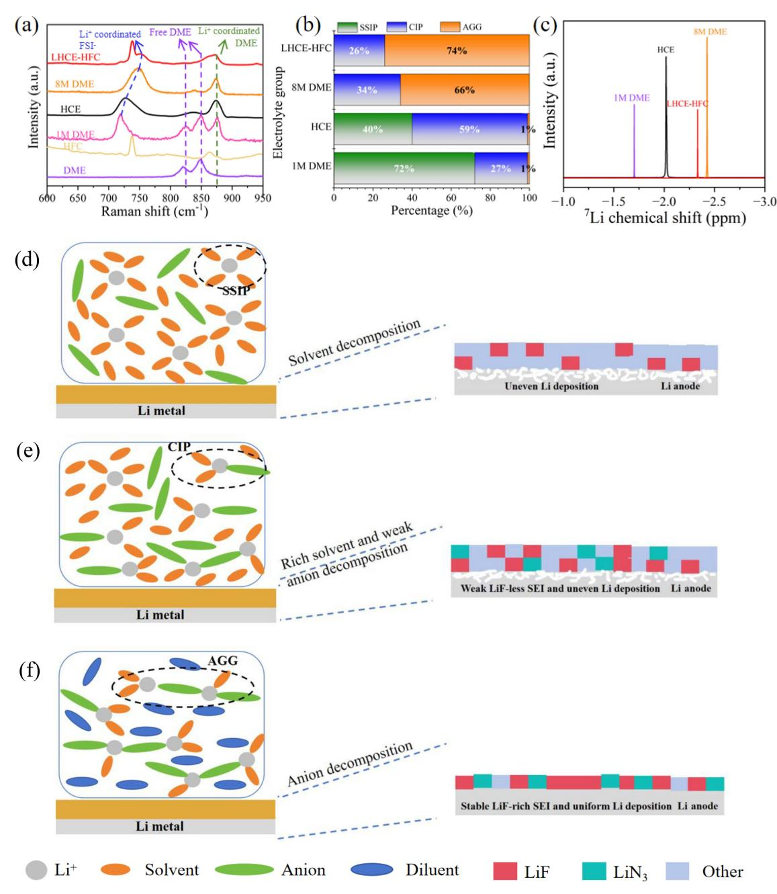
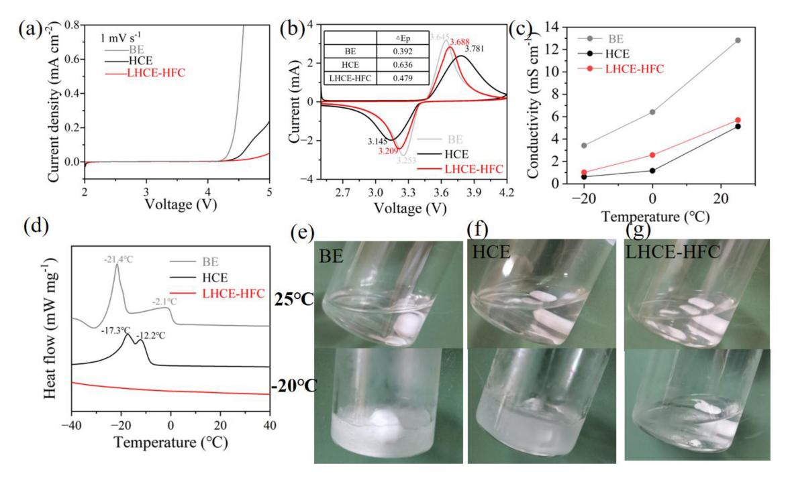
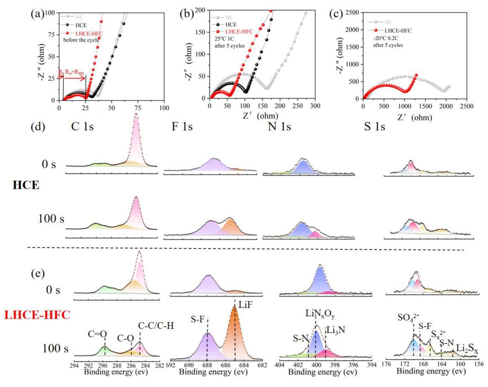
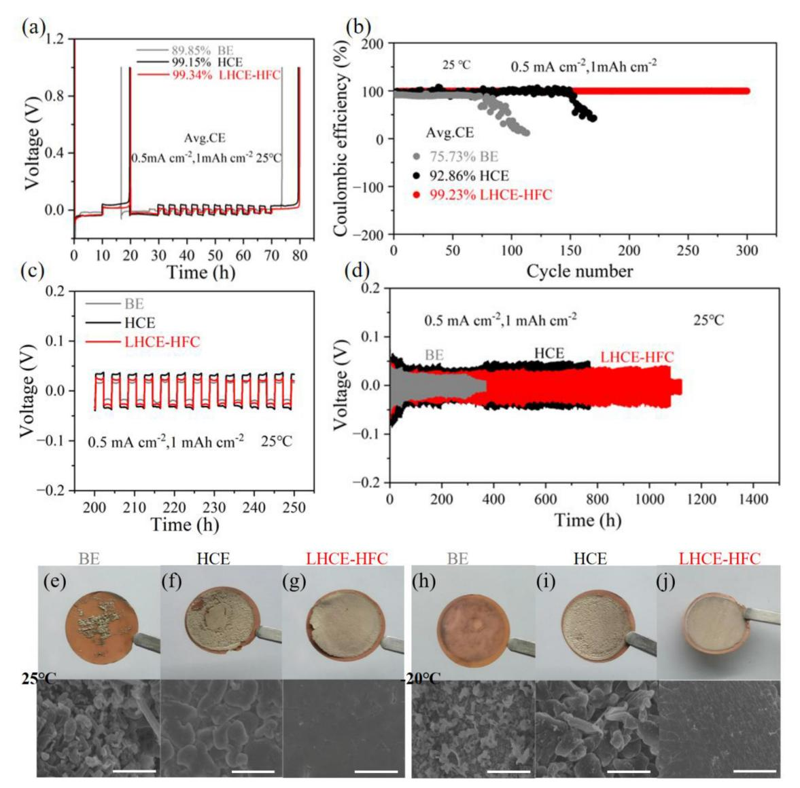
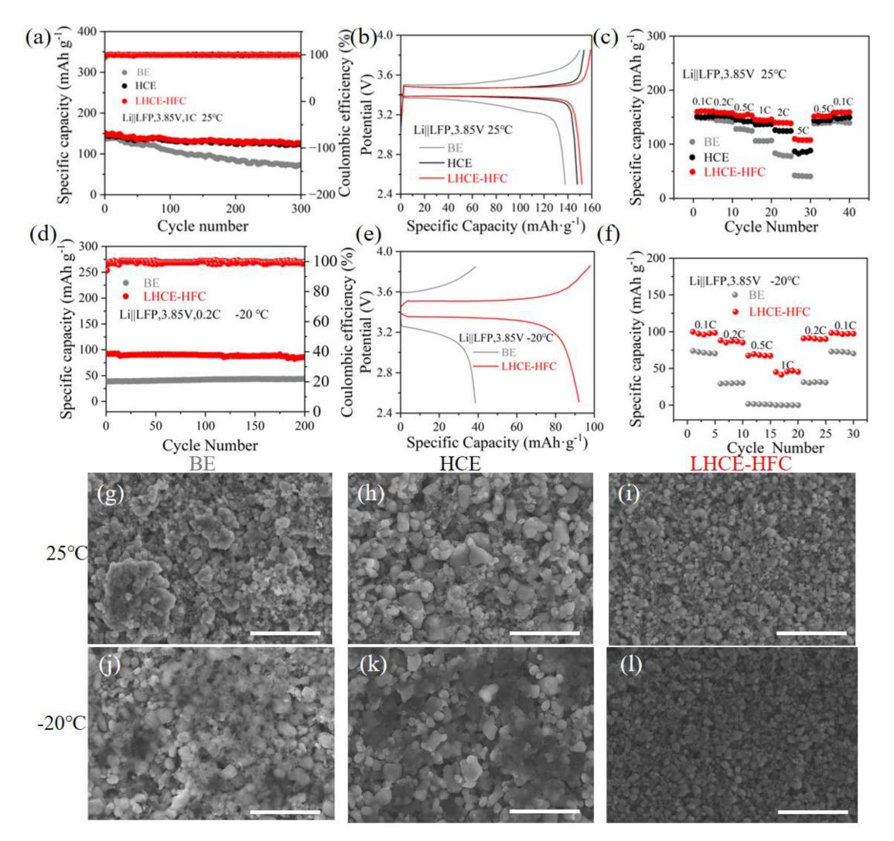

# **2H,3H-Decafluoropentane Endorsed Localized High Concentration Electrolyte for Low-Temperature Lithium-Metal Batteries**

Jie Wang,[a] Yubin Liu,[b] Haikuo Lei,[b] Wenbin Sun,[a] Xiaoyu Huang,[a] and Yanli Ruan\*[a]

A lithium-metal battery's electrochemical performance is affected by the kinetics of desolvation and ion transport at low temperatures. Here, we propose a low-temperature lithiummetal battery electrolyte. 1,2-Dimethoxyethane (DME) is used as the solvent, 2H,3H-decafluoropentane (HFC) as the diluent, and a high concentration of lithium bis(fluorosulfonyl)imide (LiFSI) as the solute. The addition of HFC diluent increases the number of anions bound to lithium ions and decreases the number of solvents in the solvation structure, which is conducive to the desolvation process at low temperatures. In addition, the anion-

# 1. Introduction

Since the beginning of the 1990s, lithium-ion batteries (LIBs) have found use in a variety of applications, including portable electronics, electric vehicles, and extensive energy storage systems.[1-4] However, LIBs do not perform well under extreme conditions, such as low temperatures, which limits their further development in military and aerospace applications. LIBs' poor low-temperature performance is related to the following factors: (1) Li+ exhibits poor diffusion efficiency at low temperatures,[5-8] (2) in commercial applications, organic solvent electrolytes like ethylene carbonate (EC) and dimethyl carbonate (DMC) have high melting points, making them prone to freezing at low temperatures, which significantly reduces or even halts  $Li^+$  conductivity; (3) at low temperatures, solvated Li+ desolvates poorly at the electrode-electrolyte interface and (4) severe Li plating caused by anode polarization at low  $\quad \ \ \text{temperatures.}^{\text{[9-11]}}$ 

The mentioned problems are strongly tied to the electrolyte's solvation structure, and adjusting the solvation structure has been identified as an efficient and probable way to promote cell fast charging  $\quad\text{and}\quad$ low-temperature performance.[12] The solvation structure primarily determines the composition of the SEI, where the porous, organic-rich SEI is fragile and has a high electrical resistance, allowing dendritic Li

[b] Y. Liu, H. Lei School of Material Science and Engineering, Tiangong University, Tianjin 300387. P. R. China

 $\Box$  Supporting information for this article is available on the WWW under https://doi.org/10.1002/cphc.202400920

dominated solvation structure is conducive to the formation of an inorganic rich solid electrolyte interface (SEI), which effectively enhances the compatibility of LHCE-HFC electrolyte with lithium metal. The LHCE-HFC achieves ultra-high coulombic efficiency of lithium metal anode in Li||Cu batteries (99.31%) and Li | Li batteries (1080 h) that have strong fluorine content in the interface. The Li |  $\angle$ LiFePO4 (LFP) cells provide a discharge-specific capacity of 92.1 mAh  $q^{-1}$  at 0.2 C at  $-20$  °C and capacity retention of 89.6% after 200 cycles.

to grow. On the other hand, the SEI with a high inorganic content is durable, conductive, and significantly better at facilitating the swift movement of Li+ through the SEI and ensuring even Li deposition.[13-15] As a result, multiple practical electrolyte techniques have been researched to utilize the solvation structures and create inorganic-rich SEIs effectively. Because of the weak connections between the solvation structures, carboxylate esters that have low freezing points and viscosities have been successfully utilized as cosolvents for adequate maintaining ionic conductivity  $at$ low temperatures.[16-20] However, these ester cosolvents do not yield effective SEI, which typically results in poor cycling stability. Recently, high-concentration electrolytes (HCEs) were created by adding the concentration of Li salts in order to alter the  $Li^+$ solvation structure. In HCE systems, the solvent seldom participates in the Li+ solvation structure, since the anion can be significantly restored to the Li+ solvation structure, leading to superior oxidative stability and an inorganic-rich SEI derived from the anion, which enhances Li cycling.[21-24] However, the HCEs are very viscous, weakly wettable, and function poorly at low temperatures.[25,26]

To address these issues, non-solventized hydrofluoroethers (HFEs) such as 1,1,2,2-tetrafluoroethyl-2,2,3,3-tetrafluoropropyl ether (TTE) and bis(2,2,2 trifluoro ethyl)ether (BTFE) can be used to dilute HCE and create a localized high concentration electrolyte (LHCE). Liu et al. found that LHCE with TTE as a diluent could promote the formation of anion-derived cathode-electrolyte interface rich in inorganic matter, thus reducing the charge transfer resistance and promoting the transport of Li+ below 0 °C.[27] Holoubek et al. recently investigated the effect of LHCE solvation structure on reversed Li metal at low temperatures. They showed that LHCE with BTFE as a diluent could enable reversible Li cycling at current densities as low as  $-20$  °C and 0.25 mA cm $-2$ .[22] LHCE preserves the solvation structure rich in

[a] J. Wang, W. Sun, X. Huang, Y. Ruan School of Chemical Engineering and Technology, Tiangong University, Tianiin 300387, P. R. China *E-mail: ruanyanli@tiangong.edu.cn* 

anions for HCE and addresses the issue of its elevated viscosity. Within the Li+ solvation structure, a binding energy exists between Li+ and the solvent, which influences the electrochemical kinetics through this energy barrier. The LHCE main Li+ solvation sheath contains fewer solvent molecules than typical concentration electrolytes, which has a significant influence on Li desolvation kinetics and uniformity. This decrease leads to a significantly reduced desolvation energy when  $Li^+$  enters the SEI.[28,29] However, the diluent for local high concentration electrolyte is mainly HFEs, and the application of fluorinated alkane diluents is rarely reported.

In summary, LHCE-HFC employs HFC with a higher fluorine content as a diluent. HFC exhibits a lower lowest unoccupied molecular orbital (LUMO) energy, which makes it easier to decompose in lithium metal batteries.[30] The addition of HFC modulates the coordination of Li+ with DME and anions, reduces the binding of Li+ with DME, lowers the desolvation energy of Li+, allows more anions to occupy the solvation sheath of Li+, and forms an anion-dominated solvated structure. This unique solvation structure is dominated by contact ion pairs (CIPs) and aggregates (AGGs), which promote the accelerated decomposition of anions and diluents, resulting in the construction of an inorganic-rich SEI with high mechanical strength. The SEI avoids adverse interactions between DME solvents and the Li metal anode, thereby inhibiting Li dendrites while increasing coulombic efficiency. LHCE-HFC achieves ultrahigh coulombic efficiency of Li metal anode in Li | Cu batteries (99.31%) and Li | Li batteries (1080 h). Li | LFP batteries have a specific capacity of 109.7 mAh  $g^{-1}$  at 5 C under 25 °C, as well as still provide a discharge specific capacity of 92.1 mAh  $g^{-1}$  at 0.2 C under  $-20$  °C and a capacity retention rate of 89.6% after 200 cycles.

### **Experimental**

#### **Preparation of Materials**

The DME, EC, DMC, LiFSI, battery separator (Celgard 2400), lithium foil, Cu foil, and CR-2023-type coin-cell cases were bought from Guangdong Canrd New Energy Technology Co.Ltd. HFC was purchased from Aladdin. The electrolyte mentioned in this manuscript was prepared by dissolving 1 M LiPF6 salt in EC/DMC (volume ratio: 1:1, BE), 1 M LiFSI in DME (1 M DME), 4 M LiFSI in DME (HCE), 8 M LiFSI in DME (8 M DME) and 1 M LiFSI in DME/HFC (volume ratio: 1:7, LHCE-HFC) in an Ar-filled glovebox. Guangdong Canrd New Energy Technology Co. Ltd. provided the LFP, SuperP, and PVDF, which were then measured in a mass ratio of  $8:1:1$  before being mixed. N-methyl-2-pyrrolidone (NMP), supplied by Aladdin, was utilized to adjust the viscosity of the slurry. The cathode slurry was coated with aluminum foil and then dried for 8 hours at 100°C in a vacuum oven. A 12 millimeter disc was pierced with the dried LFP electrodes, and the active material mass loading was about  $2 \text{ mg cm}^{-2}$ .

#### **Material Characterization**

The electrolyte's Raman spectra was acquired using an Ocean Optics QE Prospectrometer, which has an emission wavelength of 532 nm. The viscosity of the electrolytes were determined by a

ChemPhysChem 2025, 26, e202400920 (2 of 10)

viscometer (SVM3001, Anton Paar) at a temperature of 25 °C. A 7Li NMR sample was prepared by mixing 500 µL electrolyte with 100 µL deuterated chloroform in an NMR tube. NMR spectra were acquired on a Bruker Avance III 500 MHz NMR spectrometer. The surface topography of the electrode was examined using a scanning electron microscope (SEM, MAIA3, TESCAN Brno, s.r.o.). The composition of the electrode surface was assessed using X-ray photoelectron spectroscopy (XPS, PerkinElmer PHI1600 ESCA). Cells were disassembled within an Ar glovebox where the  $O_2$  and  $H_2O$ concentrations were maintained below 0.01 ppm. Electrodes underwent a thorough rinse with DME to eliminate any remaining salt and were subsequently dried in a vacuum. The cleaned electrodes were moved from the glovebox to the XPS and SEM chambers with no exposure to air. The ion conductivities ( $\sigma$ , S cm-1) for the three electrolytes were determined using the equation below:

 $\sigma = \frac{I}{RS}$ 

where R represents the intercept (Ohm) of the Nyquist curve and horizontal axis, and S and I are the area ( $cm^{-2}$ ) and distance (cm) of stainless-steel spacers, respectively.

#### **Electrochemical Characteriazation**

All electrochemical assessments were performed with a 2032-type coin cell. Each of these cells held 40  $\mu$ L of electrolyte and utilized Celgard 2400 as the separating material. Cells of Li | Cu, Li | Li, and Li||LFP were tested at different current densities using a LAND CT2001 A instrument from Wuhan Jinnuo Electronic Co. Ltd. To assess the cycling performance of a Li||Cu cell, a deposition of 1 mAh cm-2 of lithium was applied to the Cu electrode and subsequently stripped to a voltage of 1.0 V. The average coulombic efficiency across various electrolytes was evaluated using a modified Aurbach methodology, with Li||Cu cells cycled at a current density of 0.5 mA cm $-2$ . Initially, a Li deposit of 5 mAh cm $-2$  was applied to the Cu electrode, which was subsequently completely stripped from the electrode for precycling purposes. After depositing 5 mAh cm-2 of Li on the Cu electrode as a reservoir (Qi), 10 cycles of Li stripping/plating with a capacity of 1 mAh cm $-2$  were performed  $(Q_c)$ . In the final phase, the initially deposited Li was entirely stripped to 1.0 V. The average coulombic efficiency (CE) was estimated using the equation below:

$$CE = \left(\frac{n^*Q_c + Q_s}{n^*Q_c + Q_r}\right)$$

Where n is the cycle number (here  $n = 10$ ) and Qs is the final charge capacity. At different current densities and temperatures, the potential of Li||LFP cells varies from 2.5-3.85 V. First, the cell is activated at room temperature at 0.1 C for 3 cycles, followed by room temperature and low temperature cycles and magnification tests. To maintain the thermal equilibrium of the cell, a low temperature test for the battery is performed after three hours at the predetermined temperature. Techniques such as linear sweep voltammetry (LSV), the lithium ion transference number ( $t_{li+}$ ), cyclic voltammetry (CV), and electrochemical impedance spectroscopy (EIS) were conducted utilizing a potentiostat (VMP3, Bio-Logic). The LSV tests were carried out from open circuit voltage (OCV) to 5.0 V at a scan rate of 1 mVs-1. EIS spectrum was collected at a frequency range of 1 MHz to 10 MHz. CV test range is 2.5–4.2 V and the scan rate is 1 mVs-1. The Li+ transference number ( $t_{ij+}$ ) was determined at various temperatures by providing a tiny DC polarization

potential (i. e., 10 mV) to the Lij j Li cell for 20 minutes to achieve a steady state. The *tLi*þ was computed using the equation below:

$$\textit{t}_{\textit{Li}^{+}}=\frac{I_{S}(\Delta V~-~I_{0}R_{0})}{I_{0}(\Delta V~-~I_{S}R_{S})}$$

In this equation, ΔV represents the applied potential, Ro and Rs are the original and steady-state resistances, and Io and Is are the original and steady-state currents.

## **2. Results and Discussion**

### **2.1. Solvation Structure and Properties of Electrolytes**

Commercial EC-based electrolytes have poor transport kinetics due to electrolyte consolidation at low temperatures, high desolvation energies due to strong Li+-EC coordination, and ECderived organic SEIs, which induce high resistance and sluggish ion diffusion.[1–3,31] To meet the pressing need for quick charging high-energy cells at low temperatures, DME was chosen as a solvent with high oxidation tolerance, and highly fluorinated HFC was selected as a diluent to rationally formulate the LHCE-HFC, which is expected to optimize electrochemical performances of the LIBs at fast-charging low temperatures.

The Raman spectrum characterized the intermolecular interactions of electrolytes, a widely used approach for examining weak interactions in these substances, as illustrated in Figure 1a. In 1 M DME, the presence of free DME exhibited two distinct peaks near 825 cm 1 and 850 cm 1 . However, in HCE, 8 M DME, and LHCE-HFC electrolytes, the high concentration of lithium salts led to a reduction in the amount of free DME, rendering these peaks nearly undetectable. In comparison to 1 M DME, the peak corresponding to Li+ binding DME at 875 cm 1 diminishes with increasing concentrations of lithium salts, particularly in LHCE-HFC. This trend indicates a decrease in the number of DME coordinated with Li+. [32] Meanwhile, after co-dissolving LiFSI with DME, the peak near 865 cm 1 of the C O C stretching vibration of HFC shifts to 868 cm 1 , suggesting the involvement of HFC in the solvation reaction. The Raman bands spanning 700–760 cm 1 are attributed to the S N S stretching vibrational mode of FSI . Peak splitting analysis was conducted to investigate the FSI content within the solvation structure (Figure 1b and Figure S1). The bands at 718 cm 1 , 733 cm 1 , and 747 cm 1 correspond to solventseparated ion pairs (SSIP, meaning unbound FSI ), contact ion pairs (CIP, indicating one FSI and one Li+ linked), and aggregates (AGG, where one FSI is connected to two or more Li+).[33,34] In 1 M DME, most of the FSI exist in the free state, with SSIP as high as 72%, while the S N S peaks of HCE, 8 M DME and LHCE-HFC show an obvious blue shift, indicating that a large number of FSI enter the solvated sheath to generate CIP and AGG. Compared with 8 M DME, the AGG content of LHCE-HFC electrolyte was further increased from 66% to 74% after the addition of HFC diluent, indicating that the amount of FSI bound to Li+ in the solvation structure increased.[35,36] The chemical environment of Li+ in the solvated structure was analyzed by 7 Li NMR test, as shown in Figure 1c. As the concentration of lithium salt increases, the NMR pattern gradually shifts to a higher (more negative) direction, which can be attributed to the fact that Li+ combine with more FSI , enhancing the shielding effect of Li+. When HFC is added to the 8 M DME electrolyte, CIP and AGG are separated by HFC, resulting in a looser solvation structure. At the same time, the combination of Li+ and DME is reduced, causing the 7 Li NMR of LHCE-HFC to shift to the low field, and the de-shielding effect of the Li+ is enhanced.[37–40]

The Li metal deposition mechanism is schematically shown in Figure 1d–f. The 1 M DME solvation structure is enriched with a large number of solvent molecules, dominated by SSIP, leading to inhomogeneous Li+ deposition as well as organicrich SEI in Figure 1d. The solvation structure of HCE increases CIP, but its FSI incomplete decomposition forms SEI with small amounts of LiF and uneven Li deposition (Figure 1e). Due to the high concentration of lithium salt, the viscosity of 8 M DME electrolyte increases to 52.09 mPa s, which is much higher than the viscosity of LHCE-HFC electrolyte 3.71 mPa s (Figure S2a). The voltage of Lij j Li battery rises sharply after cycling for about 30 h (Figure S2b), and the compatibility with Li metal is poor. Therefore, 8 M DME electrolyte is not suitable for lithium metal battery electrolyte. When the diluent HFC is added, the solvation structure is dominated by CIP and AGG, the FSIcontent is further increased. The decomposition of FSI anions produces a highly robust and conductive LiF-rich inorganic SEI component, which allows the desolvated Li+ to pass through quickly, thus ensuring the performance of lithium metal batteries at low temperatures and fast charging (Figure 1f).[27,41,42]

The electrochemical window of the electrolyte was characterized using LSV, as illustrated in Figure 2a. The decomposition potentials of the HCE and the LHCE-HFC were significantly higher than conventional carbonate electrolyte BE, suggesting that increasing the concentration of the electrolyte and the addition of diluent can keep the electrolyte stable at higher potentials with a wide potential window. After 4.3 V, the polarization current density of LHCE-HFC increases slowly compared with that of HCE, the stable electrolyte ensures effective compatibility between lithium-metal batteries and the electrolyte throughout the charging and discharging processes. Figure 2b shows the CV curves of lithium-metal batteries with BE, HCE, and LHCE-HFC electrolytes. Theoretically, electrolytes with DME as a solvent usually have higher polarization due to the lower dielectric constant of DME (7.2) than EC (89.78). The potential difference (ΔEp) of HCE, a highly concentrated electrolyte with DME as the solvent, was the highest at 0.636 V. The ΔEp of the cell with LHCE-HFC as the electrolyte was decreased compared to that of HCE, which indicates that the addition of the diluent HFC reduced the concentration of the electrolyte and effectively improved the Li+ transport efficiency, resulting in a lower polarization of the lithium-metal battery. Three electrolytes were examined at various temperatures to determine the ionic conductivity in order to investigate the impact of solvation structure on ionic conductivity, as shown in Figure 2c. Due to the high solvation capacity of the carbonate-

**Figure 1.** Experimental studies of electrolytes solvation structure. (a) Raman spectra of the electrolytes and their components. (b) The peak area ratio of SSIP, CIP, and AGG in four electrolytes was obtained from the fitting results of Raman spectra. (c) 7 Li NMR spectra of different electrolytes. Schematic illustration of the structure, SEI formation, and Li deposition behavior of (d) 1 M DME, (e) HCE, and (f) LHCE-HFC.

based electrolytes EC and DMC, the BE electrolyte showed the greatest ionic conductivity among the three electrolytes at every temperature that was examined. The LHCE-HFC electrolyte exhibits a high ionic conductivity of 5.69 mS cm 1 at 25 °C, which is higher than that of HCE (5.12 mS cm 1 ). In particular, at 20°C, the LHCE-HFC electrolyte can still maintain a high ionic conductivity of 1.02 mScm 1 , and has a high Li+ transference number of 0.68, which is higher than that of BE (0.41) and HCE (0.55) electrolytes (Figure S3). This shows that adjusting the solvation structure can be conducive to the transport of Li+, thus improving the battery's efficiency in low-temperature conditions.

Figure 2d illustrates the differential scanning calorimetry (DSC) findings for the liquid phase range of the electrolyte. Because of EC's high freezing point (36.4°C), the commercial electrolyte BE shows separate heat absorption peaks at 21.4°C and 2.1°C, indicating electrolyte solidification. The solvent DME possesses a low freezing point ( 58°C). However, the HCE exhibits a considerable heat absorption peak at 17.3 and 12.2°C due to the high concentration of lithium salt. In contrast, LHCE-HFC does not experience a substantial phase

**Figure 2.** Physical properties of the electrolytes. (a) The LSV of three electrolytes at a scan rate of 1 mVs 1 . (b) The CV curves of Lij j LFP cells in different electrolytes within 2.5 to 4.2 V at 1 mVs 1 . (c) Electrolyte conductivities at different temperatures. (d) DSC results of BE, HCE, and LHCE-HFC. Digital images for (e) BE, (f) HCE, and (g) LHCE-HFC after cooling at 20°C for 3 h.

change, even at 40°C, which guarantees the LHCE-HFC electrolyte's low-temperature performance. The DSC results were confirmed by investigating the flexibility of the electrolytes following low-temperature storage. According to Figure 2e, f, BE and HCE showed obvious crystallization phase transition after 3 h of storage at 20°C resulting in poor mobility, while LHCE-HFC showed no obvious crystallization phase transition after 3 h of storage at 20°C, and maintained excellent mobility, as seen in Figure 2g, which demonstrated its ultra-wide operating temperature range.

#### **2.2. EIS of Batteries and Composition of Interfacial Film**

The impedance is made up of three parts: the baseline cell's bulk impedance (Rs), the resistance associated with charge transfer (Rct), and the resistance encountered by desolvated Li+ as it migrates through the solid electrolyte interphase (RSEI). The EIS of the cells was tested to explore the evolution of the interfacial impedance after 5 cycles in different environments, as shown in Figure 3a–c. It can be noticed that the impedance is close between the cells using the three electrolytes before cycling in Figure 3a. This indicates that variations in the electrochemical performance of the cells arose throughout the cycling process.[43] Figure 3b represents that the Rct+RSEI of LHCE-HFC is much lower than that of BE and HCE at 25°C and the significant decrease in Rct+RSEI indicates the higher conductivity interfacial film obtained from the LHCE-HFC electrolyte and the faster desolvation process used for the embedding and de-embedding of Li+. [44] When the temperature was lowered from 25°C to 20°C, the resistance of both BE and LHCE-HFC increased, with LHCE-HFC having the lowest resistance (Figure 3c), which was attributed to the stabilized conductive interfaces and rapid desolvation. From the above EIS results, it is obvious that changing the solvent structure of the electrolyte can lead to the reduction of Rct and RSEI, which is conducive to improving the performance of the battery at fast charging and low temperature.

The solvation structure of the electrolyte has been demonstrated to influence the chemistry of the SEI in Lij jCu cells employing various electrolytes. After 10 cycles of lithium plating and stripping, the SEI chemistry of lithium deposited on Cu was examined utilizing argon ion sputtering XPS. The SEI produced by BE is enriched with organic components (C=C, C C, etc.), which is produced when the carbonate solvents (EC, DMC) break down,[45] which leads to an increased Li+ diffusion resistance, thus affecting the fast charging and the low-temperature capacity of the Lij j LFP batteries (Figure S5). While for the cells using HCE and LHCE, the surface of Li metal consists of organic (C=O, C O, etc.) and inorganic substances (LiF, LiNxOy, sulfides, etc.), which originate mainly from the decomposition of FSI and DME in the solvated sheath.[29,46] With more details, it is found that HCE produced less LiF and less nitrogen sulfide compared to LHCE-HFC, which could be attributed to the incomplete decomposition of the FSI anion, resulting in an inhomogeneous, thick, and brittle SEI (Figure 3d). Figure 3e demonstrates that in the SEI produced in the LHCE-HFC, the inorganic materials (LiF, LiNxOy, sulfides, etc.) are significantly increased, while the organic materials are minimized. Furthermore, following 100 s of argon ion sputtering, the organic

**Figure 3.** Electrochemical impedance spectra (EIS) of Lij j LFP cells. (a) The cells use the three electrolytes before the cycle. (b) The cells use the three electrolytes after 5 cycles at 25 °C (1 C). (c) The cells use the three electrolytes after 5 cycles at 20 °C (0.2 C). XPS of Li metal deposited on Cu in (d) HCE and (e) LHCE-HFC after 10 cycles at 0.5 mAcm 2 for 1 mAhcm 2 at room temperature.

species concentration fell dramatically while the inorganic LiF content increased, resulting in improved interfacial stability and rapid Li+ migration for the Li-metal anode.[47,48] Consequently, the fast charging capabilities and low-temperature performance of the LHCE-HFC battery were improved.[25,49]

#### **2.3. Highly Reversible Li Plating and Stripping**

In order to investigate the compatibility of the electrolyte with the lithium metal anode, the coulombic efficiency of Lij jCu cells was assessed at ambient temperature, utilizing a current density of 0.5 mAcm 2 /1 mAhcm 2 through the modified Aurbach technique (Figure 4a).[48] LHCE-HFC shows a very high CE (99.34%), which is superior to HCE (99.15%) and BE (89.85%). Figure 4b evaluates the long-term cycling performance of the above-mentioned Lij jCu batteries. The Lij jCu cells using BE and HCE show severe fluctuating decreases in CE after 75 and 150 cycles, respectively. The cells failed quickly because the unstable, organic-rich SEI was unable to stop side reactions and unregulated dendritic growth, and the CE was unable to maintain a constant value.[50,51] However, because of the comparatively stable inorganic-rich SEI, the Lij jCu cell with LHCE-HFC exhibits remarkably steady cycling, with an average CE of 99.23% over 300 cycles.

The compatibility of BE, HCE, and LHCE-HFC with Li metal at 0.5 mAcm 2 /1 mAhcm 2 was investigated additionally in Lij j Li cells. Despite the BE's small overpotential, as shown in Figure 4c, the carbonate-based electrolyte's low compatibility with lithium metal causes a short circuit at 320 hours.[52] Due to the improved solvated structure and SEI stability of HCE, its cycle life is extended to 790 h. However, such SEI is insufficient to support extended cycling. In contrast, Lij j Li cells with LHCE-HFC display stable cycling for 1080 h, which can be attributed to the very stable cycling of the inorganic SEI in Lij jCu cells, which is generated from the special anion-dominated solvation structure (Figure 4d).[53]

To better analyze the morphological interaction between the solvation structure and Li metal characteristics of various electrolytes, SEM tests and optical photographs were done on Li deposited on Cu collectors at 25°C and 20°C, respectively. Photographs of Cu collectors taken after deposition at different temperatures had micron-sized Li metal deposits with a silverlike appearance. BE electrolytes suffered from severe Li plating/ stripping processes. Optical photographs at 25°C and 20°C clearly showed that Li was hardly deposited on the Cu collector, and SEM observed a porous structure of granular and acicular

**Figure 4.** Li metal test results at room temperature. Coulombic efficiency (a) and cycling performance (b) of Lij jCu cells at room temperature. (c–d) Cycling stability of Lij j Li cells at 0.5 mAcm 2 . SEM images and optical photos of Cu coated with Li at (e–g) 25°Cand (h–j) 20°C with three electrolytes. (Scale bar=20 μm)

dendritic Li (Figure 4e, h). The Li deposited in the HCE is relatively improved, but the optical photographs show uneven and inhomogeneous Li deposition morphology, and the SEM, although larger Li deposits are observed, are still porous and condensed structures of Li (Figure 4f, i). In particular, the photographs of LHCE-HFC showed a flat and uniform silver appearance, which is typical of uniform Li deposits. Its SEM observed larger Li deposits with well-defined borders and dense island-like morphology (Figure 4g, j). In conclusion, LHCE-HFC enhances the production of robust and uniform Li deposits, resulting in fewer Li negative interactions with the electrolyte, greater CE, and a longer lifetime.

### **2.4. The Electrochemical Performance of Li**j j**LFP Cells**

Figure 5 depicts the electrochemical perpormance of Lij j LFP batteries using various electrolytes. Due to the unique anionrich solvation structure, low desolvation energy, and low freezing point, the LHCE-HFC has stable fast charging and long cycle performance. The capacity retention of Lij j LFP cells using LHCE-HFC is 89.77% when they are cycled for 300 cycles at 3.85 V with 1 C. The retention of capacity in Lij j LFP cells utilizing the BE and HCE is represented as 52.07% and 81.93%, respectively, in Figure 5a. This phenomenon could be attributed to ongoing side reactions occurring between the electrolyte and the anode, the development of Li dendrites on the anode side, and an unstable SEI.[54,55] Furthermore, the multiplicative performance of Lij j LFP cells was examined at various C-rates, with charge and discharge going on at the same rate (Figure 5c). For the cell using BE, the reversible capacity declines

**Figure 5.** Electrochemical performance of Lij j LFP cells at different temperatures. Cycling performance of Lij j LFP cells at (a) 25°C (1 C), (d) 20°C(0.2 C). The initial charge-discharge curves of Lij j LFP cells at various temperatures (b) 25°C (1 C), (e) 20°C (0.2 C). Rate performance of the Lij j LFP cells at (c) 25°C, (f) 20°C. SEM images of half cells (g–i) after 50 cycles at 25°C (1 C) and (j–l) after 50 cycles at 20°C (0.2 C) (Scale bar=5 μm).

considerably with higher C-rates, resulting in a low capacity of 42.2 mAhg 1 at 5 C. Notably, HCE and LHCE-HFC provide high capacities of 86.8 mAhg 1 and 109.7 mAhg 1 at 5 C, with better fast charging performance, indicating that Li+ can be embedded and dislodged efficiently at high speeds, avoiding the generation of Li metal dendrites.

For evaluating low-temperature performance, Lij j LFP cells were tested with multiplication experiments at 20°C. As the temperature drops, the viscosity of the HCE rises because of a greater concentration of salt, making it difficult for the cell to operate properly at low temperatures. The cell using LHCE-HFC has a specific capacity of 92.1 mAhg 1 at 0.2 C and exhibits very stable long-term cycling at 0.2 C, with 89.6% capacity retention after 200 cycles, whereas the cell using BE only has a specific capacity of 38.7 mAhg 1 at 0.2 C (Figure 5d). Figure 5f shows the two electrolytes' rates of performance at low temperatures. LHCE-HFC electrolytes have good low-temperature fast charging performance. The LHCE-HFC cell can give a high capacity of 45.1 mAhg 1 at 1 C. In contrast, the BE-based cell was unable to offer any effective capacity at 0.5 C. In addition to enhanced capacity, the LHCE-HFC cell has much lower polarization at low temperatures (Figure 5e). Because the electrodes stay unaltered, the decreased polarization might be attributable to improved contact between the electrolyte and the electrodes.[43]

The LFP electrodes cycled with different electrolytes were observed using SEM. Figure S6 shows the SEM image of the original LFP cathode. After 50 cycles at 25°C, LFP particles aggregation and coarsening were seen in BE and HCE cells, however, LFP particles in LHCE-HFC cells remained evenly dispersed, as shown in Figure 5g–i. With the exception of a few apparent deposits, the cells cycled at 20°C had the same appearance (Figure 5j–l). However, agglomeration was suppressed at both 25°C and 20°C in cells with LHCE-HFC electrolytes, a phenomenon that may be related to its anionrich solvation structure and stable and homogeneous electrode/electrolyte interfacial film.[47]

# **3. Conclusions**

In summary, altering the solvation structure of the electrolyte is proposed to create a low-temperature electrolyte for lithium metal batteries. The addition of HFC diluent increases the Li+ -FSI bonding in the solvated sheath layer, and the solvation structure, which is dominated by CIP and AGG, contributes to the formation of low-resistance and LiF-rich SEI. The results show that the use of the LHCE-HFC electrolyte for the batteries exhibits excellent electrochemical performance at both room and low temperatures. LHCE-HFC achieves ultra-high Coulombic efficiency of Li metal anode in Lij jCu batteries (99.31%) and Lij j Li batteries (1080 h). Lij j LFP batteries have a specific capacity of 109.7 mAh g 1 at 5 C at 25°C. It still provides a discharge-specific capacity of 92.1 mAhg 1 and capacity retention of 89.6% after 200 cycles at 0.2 C at 20°C. This study demonstrates that by adjusting the solvation structure of the electrolyte, one can optimize the composition, stability, and lithium ion transport kinetics at the anode interface, effectively addressing the issues related to the low-temperature performance of lithium-metal batteries.

### *Author Contributions*

The manuscript was written through contributions of all authors.

### *Acknowledgements*

This work was supported by the Natural Science Foundation of Tianjin (No. 20JCYBJC00230). The Tiangong University Analytical & Testing Center provided technical assistance for the authors' XRD, SEM, and XPS measurements.

### *Conflict of Interests*

The authors declare no competing financial interest.

### *Data Availability Statement*

The data that support the findings of this study are available from the corresponding author upon reasonable request.

**Keywords:** Low temperature electrolyte **·** Lithium-metal battery **·** LiFePO4 **·** Solid electrolyte interface

- [1] A. Gupta, A. Manthiram, *Adv. Energy Mater.* **2020**, *10*, 2001972.
- [2] J. Zhang, J. Zhang, T. Liu, H. Wu, S. Tian, L. Zhou, B. Zhang, G. Cui, *Adv. Energ. Sustain. Res.* **2021**, *2*, 2100039.
- [3] D. Luo, M. Li, Y. Zheng, Q. Ma, R. Gao, Z. Zhang, H. Dou, G. Wen, L. Shui, A. Yu, *Adv. Sci.* **2021**, *8*, 2101051.
- [4] M. Rodriguez-Pena, I. F. Mena, J. A. B. Perez, C. E. Barrera-Diaz, M. A. Rodrigo, *J. Environ. Chem. Eng.* **2022**, *10*, 107578.

[5] X. L. Wu, Y. G. Guo, J. Su, J. W. Xiong, Y. L. Zhang, L. J. Wan, *Adv. [Energy](https://doi.org/10.1002/aenm.201300159) Mater.* **2013**, *3*, [1155–1160](https://doi.org/10.1002/aenm.201300159).

- [6] B. Zhao, J. Xie, H. Zhuang, X. Liu, W. Li, X. Hu, Y. Jiang, J. Zhang, *[Solid](https://doi.org/10.1016/j.ssi.2020.115245) State Ionics* **2020**, *347*, [115245.](https://doi.org/10.1016/j.ssi.2020.115245)
- [7] J. Li, S. Li, Y. Zhang, Y. Yang, S. Russi, G. Qian, L. Mu, S. J. Lee, Z. Yang, J. S. Lee, *Adv. Energy Mater.* **2021**, *11*, 2102122.
- [8] X. Wu, W. Wang, J. Du, *Int. J. Energy Res.* **2020**, *44*, [1775–1788.](https://doi.org/10.1002/er.5022)
- [9] M. T. F. Rodrigues, G. Babu, H. Gullapalli, K. Kalaga, F. N. Sayed, K. Kato, J. Joyner, P. M. Ajayan, *Nat. Energy* **2017**, *2*, 1–14.
- [10] T. Teranishi, K. Kozai, S. Yasuhara, S. Yasui, N. Ishida, K. Ishida, M. Nakayama, A. Kishimoto, *J. Power Sources* **2021**, *494*, [229710.](https://doi.org/10.1016/j.jpowsour.2021.229710)
- [11] X. Fan, X. Ji, L. Chen, J. Chen, T. Deng, F. Han, J. Yue, N. Piao, R. Wang, X. Zhou, *Nat. Energy* **2019**, *4*, [882–890](https://doi.org/10.1038/s41560-019-0474-3).
- [12] S. Wang, Z. Xue, F. Chu, Z. Guan, J. Lei, F. Wu, *J. [Energy](https://doi.org/10.1016/j.jechem.2022.12.060) Chem.* **2023**, *79*, [201–210](https://doi.org/10.1016/j.jechem.2022.12.060).
- [13] S. Liu, X. Ji, N. Piao, J. Chen, N. Eidson, J. Xu, P. Wang, L. Chen, J. Zhang, T. Deng, *Angew. Chem. Int. Ed.* **2021**, *60*, [3661–3671](https://doi.org/10.1002/anie.202012005).
- [14] Q. K. Zhang, S. Y. Sun, M. Y. Zhou, L. P. Hou, J. L. Liang, S. J. Yang, B. Q. Li, X. Q. Zhang, J. Q. Huang, *Angew. Chem.* **2023**, *135*, e202306889.
- [15] G. Xu, S. Huang, Z. Cui, X. Du, X. Wang, D. Lu, X. Shangguan, J. Ma, P. Han, X. Zhou, G. Cui, *J. Power [Sources](https://doi.org/10.1016/j.jpowsour.2019.01.085)* **2019**, *416*, 29–36.
- [16] X. Ma, R. S. Arumugam, L. Ma, E. Logan, E. Tonita, J. Xia, R. Petibon, S. Kohn, J. Dahn, *J. [Electrochem.](https://doi.org/10.1149/2.0411714jes) Soc.* **2017**, *164*, A3556.
- [17] R. Galimzyanov, S. Stakhanova, I. Krechetov, A. Kalashnik, M. Astakhov, A. Lisitsin, A. Y. Rychagov, T. Galimzyanov, F. Tabarov, *J. Power [Sources](https://doi.org/10.1016/j.jpowsour.2020.229442)* **2021**, *495*, [229442.](https://doi.org/10.1016/j.jpowsour.2020.229442)
- [18] Y. Zou, Z. Cao, J. Zhang, W. Wahyudi, Y. Wu, G. Liu, Q. Li, H. Cheng, D. Zhang, G. T. Park, *Adv. Mater.* **2021**, *33*, 2102964.
- [19] W. Lin, J. Li, J. Wang, K. Gu, H. Li, Z. Xu, K. Wang, F. Wang, M. Zhu, Y. Fan, *Small* **2023**, *19*, 2207093.
- [20] Z. Xiang, L. Wang, X. Yang, Y. Yang, Y. Qu, Y. Gao, X. Li, W. Lü, *[Nanotechnology](https://doi.org/10.1088/1361-6528/ad50de)* **2024**, *35*, 345706.
- [21] S. Kim, B. Seo, H. V. Ramasamy, Z. Shang, H. Wang, B. M. Savoie, V. G. Pol, *ACS Appl. Mater. Interfaces* **2022**, *14*, [41934–41944.](https://doi.org/10.1021/acsami.2c09338)
- [22] J. Holoubek, K. Kim, Y. Yin, Z. Wu, H. Liu, M. Li, A. Chen, H. Gao, G. Cai, T. A. Pascal, *Energy Environ. Sci.* **2022**, *15*, [1647–1658.](https://doi.org/10.1039/D1EE03422G)
- [23] Y. Yamada, M. Yaegashi, T. Abe, A. Yamada, *Chem. [Commun.](https://doi.org/10.1039/c3cc46665e)* **2013**, *49*, [11194–11196.](https://doi.org/10.1039/c3cc46665e)
- [24] L. Suo, Y. S. Hu, H. Li, M. Armand, L. Chen, *Nat. Commun.* **2013**, *4*, 1481.
- [25] Y. Zhang, S. Li, J. Shi, J. Lai, Z. Zhuang, J. Liu, W. Yang, L. Ma, Y. P. Cai, J. Xu, *J. Energy Chem.* **2024**, *94*, [171–180](https://doi.org/10.1016/j.jechem.2024.02.059).
- [26] Y. Jie, X. Ren, R. Cao, W. Cai, S. Jiao, *Adv. Funct. Mater.* **2020**, *30*, 1910777.
- [27] L. Liu, Z. Shadike, X. Cai, M. Hong, Y. Gao, S. Shen, J. Zhang, *J. [Mater.](https://doi.org/10.1039/D3TA07347E) Chem. A* **2024**, *12*, [6947–6954](https://doi.org/10.1039/D3TA07347E).
- [28] M. L. Gordin, F. Dai, S. Chen, T. Xu, J. Song, D. Tang, N. Azimi, Z. Zhang, D. Wang, *ACS Appl. Mater. Interfaces* **2014**, *6*, [8006–8010.](https://doi.org/10.1021/am501665s)
- [29] S. Chen, J. Zheng, D. Mei, K. S. Han, M. H. Engelhard, W. Zhao, W. Xu, J. Liu, J. G. Zhang, *Adv. Mater.* **2018**, *30*, 1706102.
- [30] Z. Wu, R. Li, S. Zhang, T. Deng, H. Zhang, R. Zhang, J. Liu, S. Ding, L. Fan, L. Chen, *Chem* **2023**, *9*, [650–664.](https://doi.org/10.1016/j.chempr.2022.10.027)
- [31] C. B. Jin, N. Yao, Y. Xiao, J. Xie, Z. Li, X. Chen, B. Q. Li, X. Q. Zhang, J. Q. Huang, Q. Zhang, *Adv. Mater.* **2023**, *35*, 2208340.
- [32] Z. Cheng, Z. Zhang, F. Qiu, Z. Gao, H. Xie, Z. Xu, M. Jia, X. Zhang, H. Zhou, *ACS Energy Lett.* **2024**, *10*, 177–184.
- [33] J. Shi, C. Xu, J. Lai, Z. Li, Y. Zhang, Y. Liu, K. Ding, Y. P. Cai, R. Shang, Q. Zheng, *Angew. Chem. Int. Ed.* **2023**, *62*, e202218151.
- [34] Y. Mo, G. Liu, Y. Yin, M. Tao, J. Chen, Y. Peng, Y. Wang, Y. Yang, C. Wang, X. Dong, Y. Xia, *Adv. Energy Mater.* **2023**, *13*, 2301285.
- [35] F. Hai, Y. Yi, Z. Xiao, J. Guo, X. Gao, W. Chen, W. Xue, W. Hua, W. Tang, M. Li, *Adv. Energy Mater.* **2024**, *14*, 2304253.
- [36] C. Zhang, S. Gu, D. Zhang, J. Ma, H. Zheng, M. Zheng, R. Lv, K. Yu, J. Wu, X. Wang, *Energy Storage Mater.* **2022**, *52*, [355–364](https://doi.org/10.1016/j.ensm.2022.08.018).
- [37] Z. Qin, Y. Gao, T. Zhang, Y. Li, R. Zhao, N. Zhang, X. Liu, L. Chen, G. Chen, *Energy Lab* **2024**, *2*, 240012–240019.
- [38] Z. Guo, Z. Cui, R. Sim, A. Manthiram, *Small* **2023**, *19*, 2305055.
- [39] G. Song, Z. Yi, F. Su, L. Xie, Z. Wang, X. Wei, G. Xu, C.-M. Chen, *[ACS](https://doi.org/10.1021/acsenergylett.2c02903) Energy Lett.* **2023**, *8*, [1336–1343](https://doi.org/10.1021/acsenergylett.2c02903).
- [40] Y. Huang, J. Geng, Z. Jiang, M. Ren, B. Wen, J. Chen, F. Li, *Angew. Chem.* **2023**, *135*, e202306236.
- [41] K. A. See, H. L. Wu, K. C. Lau, M. Shin, L. Cheng, M. Balasubramanian, K. G. Gallagher, L. A. Curtiss, A. A. Gewirth, *ACS Appl. Mater. [Interfaces](https://doi.org/10.1021/acsami.6b11358)* **2016**, *8*, [34360–34371.](https://doi.org/10.1021/acsami.6b11358)
- [42] J. Yao, M. Shi, W. Li, Q. Han, M. Wu, W. Yang, E. Wang, X. Lu, *ChemElectroChem* **2022**, *9*, e202200223.

- [43] S. Zhang, K. Xu, T. Jow, *[Electrochim.](https://doi.org/10.1016/j.electacta.2003.10.016) Acta* **2004**, *49*, 1057–1061.
- [44] R. Tatara, P. Karayaylali, Y. Yu, Y. Zhang, L. Giordano, F. Maglia, R. Jung, J. P. Schmidt, I. Lund, Y. Shao-Horn, *J. [Electrochem.](https://doi.org/10.1149/2.0121903jes) Soc.* **2019**, *166*, [A5090–A5098](https://doi.org/10.1149/2.0121903jes).
- [45] X. Ren, X. Zhang, Z. Shadike, L. Zou, H. Jia, X. Cao, M. H. Engelhard, B. E. Matthews, C. Wang, B. W. Arey, *Adv. Mater.* **2020**, *32*, 2004898.
- [46] X. Ren, S. Chen, H. Lee, D. Mei, M. H. Engelhard, S. D. Burton, W. Zhao, J. Zheng, Q. Li, M. S. Ding, *Chem* **2018**, *4*, [1877–1892.](https://doi.org/10.1016/j.chempr.2018.05.002)
- [47] D. J. Yoo, Q. Liu, O. Cohen, M. Kim, K. A. Persson, Z. Zhang, *ACS [Appl.](https://doi.org/10.1021/acsami.1c23934) Mater. Interfaces* **2022**, *14*, [11910–11918](https://doi.org/10.1021/acsami.1c23934).
- [48] B. D. Adams, J. Zheng, X. Ren, W. Xu, J. G. Zhang, *Adv. Energy Mater.* **2018**, *8*, 1702097.
- [49] Y. Zou, F. Cheng, Y. Lu, Y. Xu, C. Fang, J. Han, *Small* **2023**, *19*, 2203394.
- [50] Y. Liu, D. Lin, Y. Li, G. Chen, A. Pei, O. Nix, Y. Li, Y. Cui, *Nat. Commun.* **2018**, *9*, 3656.
- [51] C. Yan, Y. X. Yao, X. Chen, X. B. Cheng, X. Q. Zhang, J. Q. Huang, Q. Zhang, *Angew. Chem. Int. Ed.* **2018**, *57*, [14055–14059.](https://doi.org/10.1002/anie.201807034)

- [52] Z. Wang, Z. Sun, Y. Shi, F. Qi, X. Gao, H. Yang, H. M. Cheng, F. Li, *Adv. Energy Mater.* **2021**, *11*, 2100935.
- [53] H. Jia, J. M. Kim, P. Gao, Y. Xu, M. H. Engelhard, B. E. Matthews, C. Wang, W. Xu, *Angew. Chem.* **2023**, *135*, e202218005.
- [54] S. Zhang, K. Xu, T. Jow, *[Electrochim.](https://doi.org/10.1016/S0013-4686(02)00620-5) Acta* **2002**, *48*, 241–246.
- [55] V. Zinth, C. Von Lüders, M. Hofmann, J. Hattendorff, I. Buchberger, S. Erhard, J. Rebelo-Kornmeier, A. Jossen, R. Gilles, *J. Power [Sources](https://doi.org/10.1016/j.jpowsour.2014.07.168)* **2014**, *271*, [152–159.](https://doi.org/10.1016/j.jpowsour.2014.07.168)

Manuscript received: September 23, 2024 Revised manuscript received: January 27, 2025 Accepted manuscript online: February 4, 2025 Version of record online: February 19, 2025