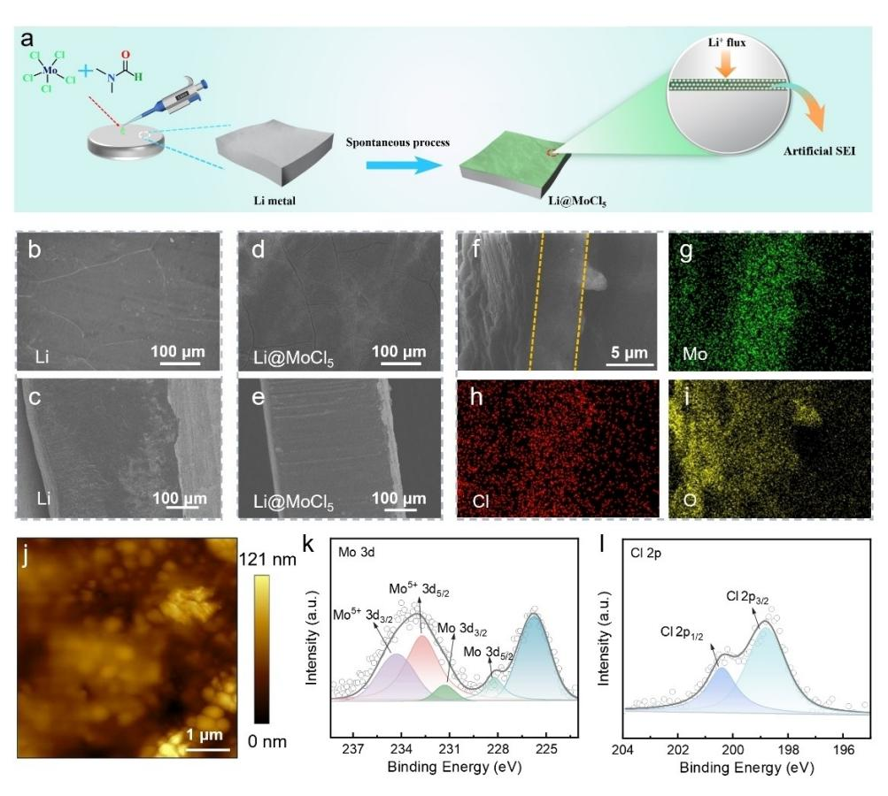
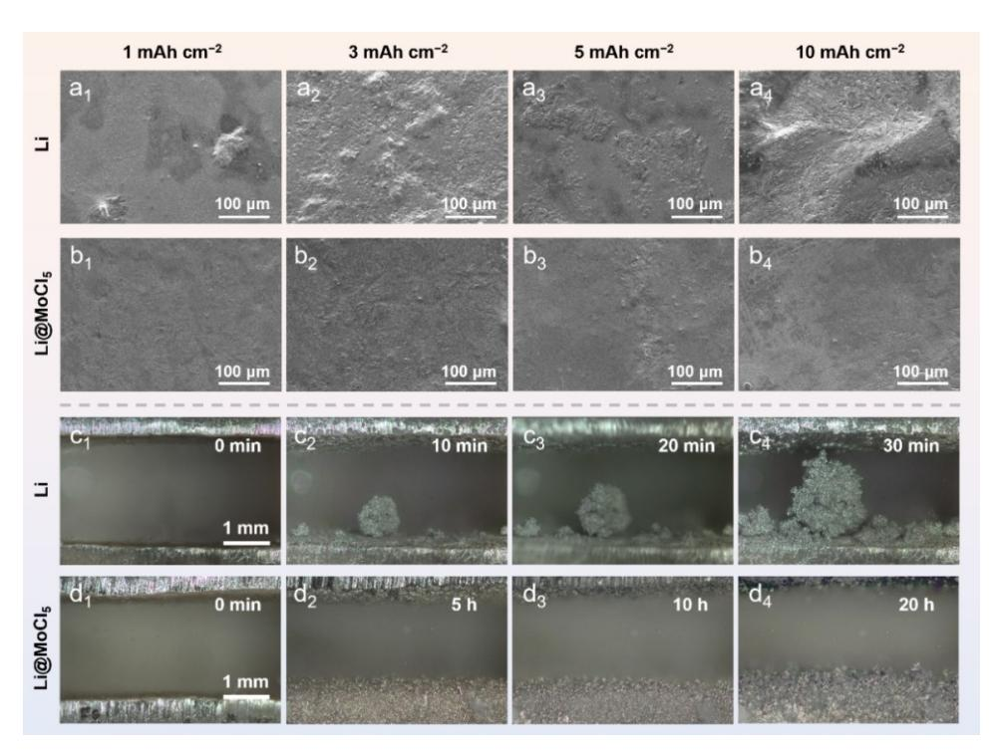
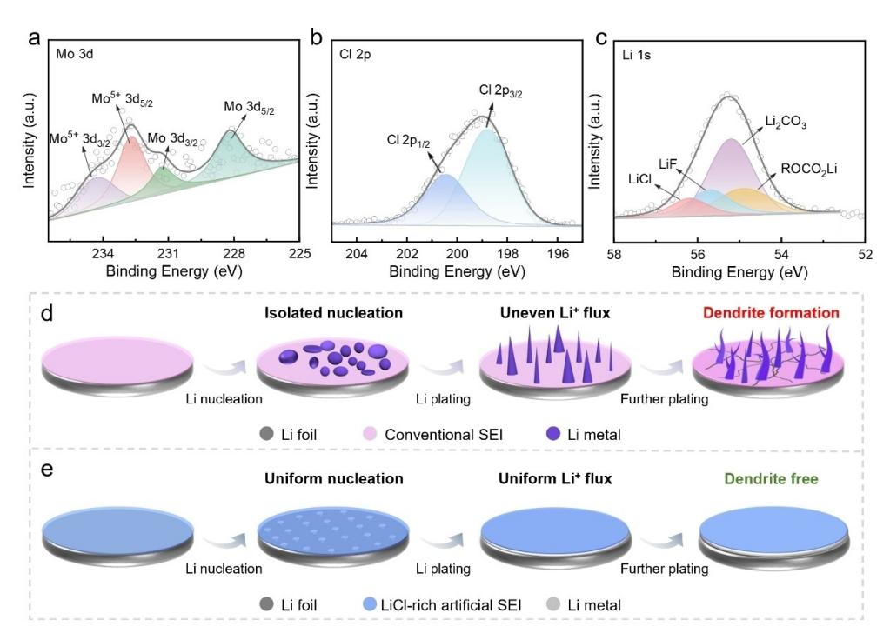
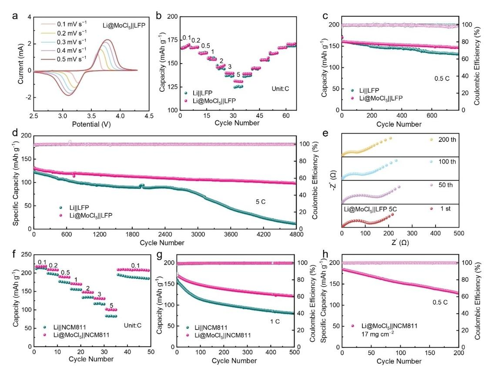

# *In-Situ* **Construction of LiCl-Rich Artificial Solid Electrolyte Interphase for High-Performance Lithium Metal Anode**

Zhen [Chen,](http://orcid.org/0000-0002-5199-0935)\*[a] Xi Wang,[a] Shengjie Qian,[a] Hai-Peng Liang,\*[b] Minghua Chen,[a] and Zexiang Shen[a]

In the pursuit of high-energy-density lithium metal batteries (LMBs), the development of stable solid electrolyte interphase (SEI) is critical to address issues such as lithium dendrite growth and low Coulombic efficiency. Herein, we propose a facile strategy for the *in-situ* fabrication of a LiCl-rich artificial SEI layer on Li surfaces through reaction of MoCl5 with Li (Li@MoCl5 ). The resulting artificial SEI significantly enhances the uniformity of Li deposition, effectively suppresses dendrite formation, and

## **Introduction**

High-energy-density batteries are pivotal for the progress of electric vehicles, mobile devices, and electric vertical takeoff and landing (eVTOL) applications, particularly in light of global efforts toward sustainable development and clean energy.[1–4] Lithium (Li) metal, owing to its high theoretical specific capacity (3860 mAhg @1 ) and extremely low redox potential (@3.04 V *vs.* H/H+ ), is regarded as a promising anode material for future energy storage devices.[5–8] However, the quest of high-energydensity lithium metal batteries (LMBs) faces challenges such as uncontrolled lithium dendrite growth, low Coulombic efficiency (CE), and extensive volume expansion, which significantly hinder their practical application.[9–11]

The primary challenges for LMBs stem from the interfacial interactions between lithium metal and liquid electrolytes.[12,13] These interactions can trigger electrolyte decomposition and initiate undesirable side reactions, leading to the formation of non-conductive by-products that degrade battery performance and shorten service life.[14] Moreover, imperfections in the solid electrolyte interphase (SEI) can cause uneven lithium deposi-

*Correspondence: Zhen Chen, Key Laboratory of Engineering Dielectric and Applications (Ministry of Education), School of Electrical and, Electronic Engineering, Harbin University of Science and Technology, Harbin 150080, China.*

*Email: chen.zhen@hrbust.edu.cn*

*Hai-Peng Liang, Department of Materials and Chemical Engineering, GBA Institute of Collaborative Innovation, Sino-Singapore Guangzhou Knowledge City 510555, China. Email: lianghp@jingjinji.cn*

*Supporting Information for this article is available on the WWW under <https://doi.org/10.1002/cssc.202402638>*

*ChemSusChem* **2025**, *18*, e202402638 (1 of 8) © 2025 Wiley-VCH GmbH

improves electrochemical performance. As a result, Li@MoCl5 symmetric cells demonstrate remarkable stability, achieving continuous cycling of 4200 h under a high current density of 10 mAcm@2 with an areal capacity of 1 mAh cm@2 . Full-cells employing Li@MoCl5 exhibit superior cycling stability and rate capability, even at high cathode loading (17 mgcm@2 ). These results highlight the potential of this interface engineering strategy for advanced practical application of LMBs.

tion, which in turn promotes the growth of lithium dendrites.[15] Consequently, the development of a robust SEI layer that promotes ion transport while preventing dendrite formation is crucial for the stability of LMBs. An ideal SEI should exhibit high ionic conductivity, strong chemical stability, and excellent compatibility with electrode materials.[16–19] The fabrication of artificial SEI layers allows for precise and rational design of SEI nanostructure and interfacial properties, ensuring the long-term stable operation of lithium metal anodes (LMAs).

In recent years, numerous studies have shown that halogenated interphases are highly effective as protective layers in LMBs.[20–25] A trace dual-salt electrolyte additive was used to accelerate the formation of LiF-rich anode interphase.[26] Jin et al. created a stable SEI by applying a fluorinated selfassembled monolayer onto a boehmite-coated polyethylene separator.[27] While LiF is prized for its protective properties, it falls short in areas such as surface diffusion barriers and interfacial energies compared to other halides. Despite their potential, the use of halides other than fluoride in SEI construction remains underexplored. There is a growing interest in leveraging LiCl for constructing artificial SEIs.[28–30] Lin et al. achieved controlled formation of high-quality SEI enriched with LiCl by developing 1,2,4,5-benzenetetraminetetrahydrochloride as a bifunctional electrolyte additive.[31] However, the efficacy of such additives is often limited by their low concentration, which may not provide enduring interfacial protection. Thus, a more direct approach to integrate an interlayer is essential for enhancing the cycle stability of LMBs.

In this study, a highly stable artificial SEI layer comprising LiCl was successfully fabricated *in-situ* through a direct ionexchange reaction between Li metal and MoCl5 (Li@MoCl5 ). The LiCl, which is electronically insulating, serves as a barrier to prevent unwanted electron flow, ensuring uniform lithium deposition at the Li/electrolyte interface. This artificial SEI layer significantly enhances the dynamics of Li+ transport across the interface and effectively suppresses Li dendrite formation. As a result, full-cells incorporating LiFePO4 (LFP) and

[a] *Key Laboratory of Engineering Dielectric and Applications (Ministry of Education), School of Electrical and, Electronic Engineering, Harbin University of Science and Technology, Harbin, China*

[b] *Department of Materials and Chemical Engineering, GBA Institute of Collaborative Innovation, Sino-Singapore Guangzhou Knowledge City, China*

 $LiNi_{0.8}Co_{0.1}Mn_{0.1}O_2$  (NCM811) with Li@MoCl5 anodes demonstrate superior electrochemical performance. This research offers valuable insights into the design of artificial SEI layers for dendrite-free LMAs.

## **Experimental Section**

#### **Materials**

Molybdenum pentachloride (MoCl5) and dimethylformamide (DMF) were purchased from Aladdin.

## **Preparation of Li@MoCl5**

The fabrication of Li@MoCl5 was carried out in an Ar-filled glove box (H2O < 0.1 ppm). 50  $\mu$ L of a 1 mmol MoCl5 solution (using DMF as the solution) was dripped onto the surface of the Li foil, and the reaction continued for 30 s. Subsequently, the processed Li foil was placed in DMF solvent to ensure the removal of residual MoCl5 solution, and then dried in a glove box at room temperature for 3 h to ensure the evaporation of DMF on the Li foil, forming the Li@MoCl5 anode.

#### **Cell Assembly**

CR2032-type coin cells with a two-electrode configuration were used for the galvanostatic measurement. Symmetric Li||Li cell was characterized in the ether-based electrolyte (60  $\mu$ L in total), which consisted of a 1 M solution of lithium bis-(trifluoromethanesulfonyl)imide (LiTFSI) dissolved in a mixture of 1,3-dioxolane (DOL) and 1,2-dimethoxyethane (DME) (1:1 by volume), with 2% of LiNO3 as additive. The carbonate electrolyte (100  $\mu$ L in total) used for the full-cell assembly was 1 M LiPF6 in ethylene carbonate (EC), diethyl carbonate (DEC) and dimethyl carbonate (DMC)  $(1:1:1)$  by volume) with 5% of fluoroethylene carbonate (FEC) as the additive. LFP ( $ca.$  4 mg cm-2, Canrd) and NCM811 (*ca.* 5 mg cm $-2$  and 17 mg cm $-2$ , Canrd) electrodes were employed as cathodes for the full-cells and prepared using the doctor blade method.

The cathode composition of commercial LFP (or NCM811) powder, Super P, (Canrd) and polyvinylidene difluoride (PVdF, Arkema) was fixed at a mass ratio of 8:1:1. A commercial polypropylene membrane (Celgard 2500) was employed as the separator for all cells. Full-cells were cycled within the voltage range of 2.5–4.0 V (the dis-/charge rate was set to 170 mA  $g^{-1}$  at  $1C$  for LFP) and 3.0–4.3 V (the dis-/charge rate was set to 200 mA  $g^{-1}$  at 1 C for NCM811). The cell activation was achieved by cycling the cells at 0.1 C for three cycles.

#### **Materials Characterization**

The surface morphology, microstructure, and elemental analysis were investigated by scanning electron microscopy (SEM, SU8020, Hitachi). X-ray photoelectron spectroscopy (XPS) measurements were conducted using the K-Alpha+ XPS system (Thermo Kalpha; Thermo ESCALAB 250XI; Axis Ultra DLD Kratos AXIS SUPRA; PHI 5000 versaprobe III) with monochromatic Al  $K\alpha$ radiation. In-situ optical observations were carried out to visualize Li plating/stripping behavior of different current collectors by adopting a polytetrafluoroethylene cell with transparent quartz window (Beijing Scistar Technology Co., Ltd., LIB-MS), in which the effective geometric area for electrochemical process was 0.8 cm×0.8 cm and the distance between the working electrode (Li foil) and the counter electrode (Li foil) was ca., 1.5 mm. During the Li plating/stripping process, an optical microscope (YUESCOPE, YM710R) was used to capture photographs. The applied current density was set at 1 mA cm-2 by using an SP-50e electrochemical working station (Bio-Logic, France). The disassembled electrodes for SEM/energy dispersive X-ray spectroscopy (EDS)/XPS investigations were rinsed with DMC and dried at 60°C for 2 h to remove the residual electrolyte, followed by storing in a vacuum box before further characterizations. Atomic force microscopy (AFM) was performed to investigate the changes in surface roughness of sample before and after modification, using an ICON, Veeco/ Bruker.

#### **Flectrochemical Measurements**

Linear sweep voltammetry (LSV) was performed on symmetric cells to measure the exchange current density. A fixed sweep rate of 1.0 mVs $-1$  was employed in the voltage range from  $-100$  mV to 100 mV. The Tafel curve was acquired by LSV at a scan rate of  $1 \text{ mV s}^{-1}$  using Li||Li symmetrical cell. Cyclic voltammetry (CV) was conducted in a voltage range of 2.5-4 V with varying sweep rates.

The electrochemical impedance spectroscopy (EIS) measurements were carried out over a range of temperatures to assess the ion transport behavior in a frequency range from 7 MHz to 0.1 Hz. The Li $+$  transfer activation energy (*Ea*) of the Li | |Li cells was calculated by the Arrhenius formula (Equation 1).

$$\frac{1}{R_{ct}} = A \exp\left(\frac{E_a}{RT}\right) \tag{1}$$

where A is the pre-exponential factor,  $Rct$  is the impedance value from the EIS test results,  $T$  is the absolute temperature, and  $R$  is the molar gas constant.

The Li+ transference number ( $t_{Li+}$ ) was calculated by AC impedance and DC polarization experiment in the  $Li||Li$  cells. The equation for calculating is shown in Equation 2.

$$t_{Li^{+}} = \frac{I_{s}(\Delta V - I_{0}R_{0})}{I_{0}(\Delta V - I_{s}R_{s})}$$
 (2)

where  $\Delta V$  is polarization voltage (50 mV),  $I_0$ ,  $I_s$  and  $R_0$ ,  $R_s$ represent the current and impedance in the initial and steadystate after 7200 s of polarization, respectively.

LSV, Tafel, CV and EIS measurements were performed using a VMP-300 workstation (Bio-Logic, France).

## **Results and Discussion**

The fabrication process of the artificial SEI on Li metal is schematically illustrated in Figure 1a. Initially, a solution of MoCl5 in DMF was dripped onto the surface of the Li metal in an Ar-filled glove box (O2 *<*0.1 ppm; H2O *<*0.1 ppm). Due to the high reactivity of Li metal, an ion-exchange reaction immediately occurred between the Li metal and the solution at room temperature. After a 30-second reaction, a uniform LiClrich artificial SEI layer was formed on the lithium surface, resulting in the Li@MoCl5 structure. Compared to the bare Li which clearly shows a shinny metallic appearance, the Li@MoCl5 electrode exhibits a faint light white layer on its surface (Figure S1), suggesting the formation of a modified surface. Comparative SEM images of bare Li and Li@MoCl5 samples are presented in Figure 1b–e. Compared to the bare Li foil (Figure 1b, c), a thin film is observed covering on the Li@MoCl5 surface (Figure 1d, e). Furthermore, some fine cracks of varying sizes are evidenced (Figure 1d), primarily a result of the rapid evaporation of residual DMF during the drying process, which leads to surface contraction and subsequent crack formation. EDS mapping of the cross-section of the interface film reveals its thickness to be approximately 5 μm, as shown in Figure 1f–i. The elemental mappings confirm the presence of molybdenum (Mo), chlorine (Cl), and oxygen (O) in the film. The surface flatness of the LiCl-rich artificial SEI layer was further examined by AFM (Figure 1j, Figure S2). The average roughness (Ra) for Li@MoCl5 and bare Li (Figure S3) was determined to be 11.73 nm and 14.25 nm, respectively, suggesting a decrease in surface roughness after MoCl5 coating. Additional chemical composition analysis of the Li@MoCl5 was conducted using XPS. The Mo 3d XP spectrum (Figure 1k) exhibits four main peaks at 234.3, 232.7, 231.3, and 228.2 eV, corresponding to Mo5+ and Mo, respectively. The high-resolution Cl 2p XP spectrum (Figure 1l) displays peaks at 198.8 and 200.4 eV, corresponding to Cl 2p3/2 and Cl 2p1/2, respectively. The Li 1s XP spectrum of the Li@MoCl5 anode reveals the presence of LiCl (56.2 eV) and Li2CO3 (55.2 eV) on the surface (Figure S4). These findings confirm the formation of a LiCl-rich artificial SEI layer.

The role of the artificial SEI in suppressing lithium dendrite growth was further investigated by SEM analyses. The morphology evolution of bare Li and Li@MoCl5 during Li deposition process is shown in Figure 2a, b. At the initial phase of Li deposition at a capacity of 1 mAhcm@2 (Figure 2a1 ), the deposited Li is randomly distributed across the bare Li electrode, forming a dendrite-like structure. As the deposition capacity increases to 3 mAh cm@2 , more pronounced Li dendrites are evident on the surface of bare Li (Figure 2a2 ).

**Figure 1.** (a) Schematic illustration of the preparation process of Li@MoCl5 . SEM images of (b, c) bare Li and (d, e) Li@MoCl5 . (f-i) SEM image and its corresponding EDS mapping results of Li@MoCl5 . (j) AFM surface characteristics image of Li@MoCl5 . XP spectra of (k) Mo 3d and (l) Cl 2p of Li@MoCl5 .

Figure 2. SEM images of (a) bare Li and (b) Li@MoCl5 after depositing with an areal capacity of 1, 3, 5, and 10 mAh cm-2. *In-situ* optical microscopy during deposition on (c) bare Li and (d) Li@MoCl5 at a current density of 1 mA cm-2.

Upon reaching a deposition capacity of 5 and 10 mAh  $\text{cm}^{-2}$ (Figure  $2a_3$ ,  $a_4$ ), the electrode surface is almost completely covered by large and porous Li protrusions. This uneven lithium evolution leads to severe interfacial side reactions and causes continuous electrolyte consumption. In stark contrast, Li@MoCl5 exhibits a smooth Li deposition pattern at  $1 \text{ mAh cm}^{-2}$  (Figure  $2b_1$ ). As capacity increases to 3 mAh cm-2 (Figure 2b2), the surface of Li@MoCl5 still remains uniformly deposited. Notably, even at higher deposition capacities of 5 and 10 mAh cm-2 (Figure 2b3, b4), Li@MoCl5 maintains a smooth and dendrite-free appearance. These results underscore the effectiveness of the LiCl-rich artificial SEI layer in enabling uniform lithium deposition and mitigating dendrite formation. The real-time behavior of Li plating on bare Li and Li@MoCl5 was examined using an in-situ optical microscope. Consistent with previous observations, the bare Li anode begins to develop dendrites after just 10 min of deposition, corresponding to a capacity of 0.17 mAh cm $-2$  (Figure 2c2). As the deposition continues, reaching a capacity of  $0.5 \text{ mAh cm}^{-2}$  after 30 min, the volume of lithium dendrites expands significantly, eventually resulting in a short circuit (Figure  $2c_4$ ). In contrast, Li@MoCl5 maintains a dense and uniform surface throughout the entire 20-h of deposition period (Figure 2d). This observation indicates that the LiCl-rich artificial SEI layer could effectively mitigate side reactions between metallic lithium with the electrolyte, promoting the even distribution of Li+, thereby facilitating uniform Li nucleation and deposition.

To further investigate the composition of the SEI layer, XPS analysis was carried out on cycled Li electrodes. Both Li and Li@MoCl5 electrodes underwent 10 cycles of plating and

ChemSusChem 2025, 18, e202402638 (4 of 8)

stripping at  $1 \text{ mA cm}^{-2}$  with a capacity limit of  $1 \text{ mAh cm}^{-2}$  in symmetric cells. The C 1s XP spectra reveal peaks at 293.0, 289.4, 288.2, 286.3, and 284.8 eV, corresponding to  $CF_{xy}$  Li2CO3,  $C=0$ ,  $C=0$ , and  $C=C/C-H$  groups, respectively, which are decomposition products of solvents (Figure S5a, b). The O 1s XP spectra exhibit two peaks at 532.6 and 531.2 eV, attributed to  $ROCO_2Li$  and  $Li_2CO_3$  species, respectively (Figure S5c, d). The F 1s XP spectra show two peaks locating at 688.8 and 685.2 eV, assigned to CFx and LiF originating from the decomposition of LiTFSI, respectively (Figure S5e, f). Notably, the cycled Li@MoCl5 shows low-intensity LiF peak than cycled bare Li counterpart, indicating that the artificial layer effectively alleviates LiTFSI decomposition. The Mo 3d XP spectrum exhibits four peaks at 234.3/232.7 and 231.3/228.2 eV, assigning to  $Mo^{5+}$  and Mo peaks, respectively (Figure 3a). In the Cl 2p XP spectrum, peaks at 200.4 eV (Cl  $2p_{1/2}$ ) and 198.8 eV (Cl  $2p_{3/2}$ ,) confirm the formation of a LiCl-rich SEI (Figure 3b). The Li 1s XP spectrum (Figure 3c) further confirms the presence of LiCl during cycling, with a corresponding peak centering at 56.2 eV. The peaks at 55.7, 55.2, and 54.9 eV correspond to LiF,  $Li2CO3$ , and ROCO2Li, respectively (Figure 3c, Figure S6). This LiCl-rich SEI serves as a protective shield, preventing further electrolyte consumption and enhancing the transport kinetics of Li-ions by regulating Li+ diffusion. Based on these findings, schematic diagrams in Figure 3d, e illustrate the mechanisms of Li plating behavior. Figure 3d depicts the Li plating behavior on bare Li anode, where the absence of a stable SEI leads to anisotropic Li nucleation, dendrite growth and SEI cracks, while Figure 3e highlights the uniform deposition facilitated by the robust LiClrich SEI on Li@MoCl5. The electronically insulating LiCl compo-

Figure 3. The XP spectra of (a) Mo 3d, (b) Cl 2p, and (c) Li 1s of cycled Li@MoCl5 electrode recovered from Li@MoCl5 ||Li@MoCl5 symmetric cell after cycling at 1 mA cm-2 with a capacity of 1 mAh cm-2 for 10 cycles. Schematic diagram showing the evolution of (d) bare Li and (e) Li@MoCl5 during the Li plating process.

nent acts as an electron-blocking shield at the Li/electrolyte interface, promoting uniform Li deposition and preventing the formation of Li dendrites.

The superior electrolyte wettability of the LiCl-rich SEI layer was confirmed by its negligible contact angle (Figure S7), which is favorable for the even distribution of the Li+ flux and promotes Li nucleation by reducing the nucleation barrier. The Li+ transference number was further measured. For bare Li symmetrical cells, the Li+ transference number is as low as 0.471 (Figure S8). However, for the Li@MoCl5, the Li $+$  transference number significantly increases to 0.684, confirming the critical role of the LiCl-rich SEI layer in enhancing  $Li^+$  migration (Figure 4a). The superior kinetics of the modified symmetric cell are further confirmed through Tafel curve analysis based on LSV measurements. As shown in Figure 4b, the  $J^0$  values for Li@MoCl5 and bare Li are 1.84 and 0.39 mA cm $-2$ , respectively, indicating enhanced mass transport and reduced surface diffusion barriers at the Li@MoCl5 interface. Li||Li symmetric cells were assembled to characterize the Li+ transfer kinetics through the SEI. The activation energy  $(Ea)$  was calculated from the temperature dependence of the impedance data. Arrhenius plots indicate that the Li@MoCl5||Li@MoCl5 cell exhibits a smaller Ea of 49.4 kJ mol-1 compared to that of the Li||Li cell (57.0 kJ mol-1), suggesting that the Li@MoCl5 anode enhances the Li+ transport kinetic process (Figure 4c, Figure S9).

To further evaluate long-term interfacial stability, lithium stripping-plating tests were conducted in symmetric cells. Figure S10a reveals an extended lifespan of 7500 h in Li@- $MoCl_5$  | Li@MoCl5, impressively, with minimal voltage hysteresis of approximately 18 mV at  $1 \text{ mA cm}^{-2}$  and  $1 \text{ mA h cm}^{-2}$ . In contrast, the polarization voltage of bare Li||Li increases after 500 h, reaching approximately 42 mV after 900 h of cycling. A detailed comparison of voltage profiles (inset, Figure S10a) verifies that Li@MoCl5 exhibits a more stable interface and higher reversibility than the bare Li electrode. Upon increasing the current density to 5 mAcm-2, as demonstrated in Figure S10b, the symmetric Li@MoCl5 cell maintains stable overpotential (ca., 95 mV) for over 6000 h, whereas the bare Li cell sustains similar stability for 200 h but with higher overpotential (*ca.*, 103 mV). Even at 10 mA cm $-2$ , the symmetric Li@MoCl5 cell exhibits an exceptional lifespan of 4200 h. The locally amplified voltage curves reveal that the overpotentials at 200 h and 3000 h are 200 mV and 290 mV, respectively. In contrast, the bare Li experiences rapid overpotential increasing after 200 h (Figure 4d). Moreover, the Li anode exhibits a significantly higher nucleation overpotential (287.0 mV), with respect to that of the Li@MoCl5 anode (120.6 mV) during the initial plating process (Figure S11). This reflects an increased difficulty of Li deposition beneath the electrolyte-derived native SEI at ultrahigh current densities. Taken together, the artificial layer protects the Li/electrolyte interface for better cycle stability with faster ion migration kinetics. It is noteworthy that the performance of Li@MoCl5 symmetric cell significantly outperforms those results recently reported on artificial protective layers for LMAs (Figure 4e and Table S1).

To further evaluate the interfacial stability, EIS and SEM were conducted at various time intervals on symmetric Li@MoCl5 | Li@MoCl5 cells under 3 mA cm-2 and 1 mAh cm-2. As shown in Figure 4f, symmetric Li@MoCl5 cell exhibits stable cycling for 700 h, with overpotentials of 88, 83, and 73 mV at 45, 295, and 600 h, respectively. In contrast, symmetric bare Li cell shows overpotentials of 43 and 195 mV at 45 and 295 h,

Figure 4. (a) Li+ transference number of the Li@MoCl5 | |Li@MoCl5 symmetric cell. (b) Tafel plots of symmetric cells with Li and Li@MoCl5. (c) Arrhenius plots of Li | Li and Li@MoCl5 | Li@MoCl5 cells. (d) Voltage profiles of symmetric cells with Li and Li@MoCl5 at 10 mA cm-2 and 1 mAh cm-2. (e) Comparison of the corresponding cycle life of Li@MoCl5 and representative literature also using protective layers at different current densities with a capacity of 1 mAh cm-2. (f) Voltage profiles and (g) corresponding Nyquist plots of symmetric cells at 3 mA cm-2 and 1 mAh cm-2.

respectively. During cycling, EIS was conducted to identify the reasons for the significant performance enhancement. The selective Nyquist plots recorded with an interval of 100 h are presented in Figure 4g and Figure S12. Through comparison, it is revealed that the total resistance of Li@MoCl5 not only exhibits smaller values but also remains relatively constant over 500 h of cycling. To gain deeper insights into the Li deposition/ stripping behavior, SEM images of bare Li and Li@MoCl5 were captured after cycling for 100, 200, 300 h, and 460 h/700 h. After 100 h cycling, "dead Li" accumulates on the surface of bare Li, with a thickness of approximately 46 µm (Figure S13a). This layer further develops into a loose and porous structure with larger cracks, accompanied by a notable increase in overpotential, growing to 90 µm in thickness after 200 h (Figure S13c) and further to 110  $\mu$ m after 300 h (Figure S13e) of cycling, respectively. By 460 h, the surface morphology of bare Li deteriorates significantly, showing an extensive accumulation of "dead Li" with a thickness of 126  $\mu$ m, corresponding to a volumetric expansion rate of 8.22% (Figure S13g). In sharp contrast, the surface of Li@MoCl5 remains relatively smooth, with minimal accumulation of "dead Li" (Figure S13b) after 100 h of cycling. Prolonged cycling to 200 h and 300 h still results in well-preserved surface morphology, with "dead Li"

layers limited to 16 µm (Figure S13d) and 47 µm (Figure S13f), respectively. Even after 700 h, only a 71 µm thick "dead Li" layer is observed, corresponding to a volumetric expansion rate of 3.14% (Figure S11h). The deposited Li on the Li@MoCl5 surface maintains a uniform and dense morphology, underscoring the protective effect of the LiCl-rich artificial SEI layer in mitigating degradation and ensuring long-term stability (Figure S14).

To evaluate the potential application of Li@MoCl5 in practical LMBs, full-cells using LFP cathode were assembled. First, CV curves of Li||LFP and Li@MoCl5||LFP full-cells are obtained at varying scan rates from 0.1 to 0.5 mV  $s^{-1}$ . Notably, compared to the Li||LFP full-cells (Figure S15), Li@MoCl5||LFP cells exhibit higher peak current densities and more pronounced redox activities, indicating improvements in Li+ transport kinetics and reduced polarization (Figure 5a). Figure 5b further elucidates the kinetic advantages of the Li@MoCl5 | LFP full-cells through a comparison of rate capabilities. The Li@MoCl5||LFP full-cells maintain capacities of 168.6 mAh  $g^{-1}$ 167.1 mAh  $q^{-1}$  $(0.2 C)$ , 160.9 mAh  $g^{-1}$  $(0.5 C)$ ,  $(0.1 C)$ . 156.4 mAh g-1 (1 C), 146.6 mAh g-1 (2 C), 139.8 mAh g-1 (3 C), and 131.1 mAh  $q^{-1}$  (5 C), respectively, showcasing exceptional high-rate performance. In contrast, Li||LFP full-cells exhibit lower capacities at high densities, with values of 167.6  $mAhg^{-1}$ 

**Figure 5.** (a) CV curves for the Li@MoCl5 j j LFP full-cells at 0.1–0.5 mVs @1 . (b) Rate performance of Lij j LFP full-cells. The long-term cycling of full-cells with the LFP cathode at (c) 0.5 C and (d) 5 C. (e) Nyquist plots of Li@MoCl5 j j LFP full-cell at different cycles. (f) Rate performance and (g) cycling performances of Lij jNCM811 full-cells. (h) Long-term cycling performance of full-cells with a high mass loading of NCM811.

(0.1 C), 167.0 mAhg @1 (0.2 C), 161.3 mAhg @1 (0.5 C), 156.1 mAhg @1 (1 C), 144.2 mAhg @1 (2 C), 136.3 mAhg @1 (3 C), and 125.2 mAhg @1 (5 C). Subsequently, the cycling performance of full-cells at various C-rates are also investigated to assess their long-term stability and efficiency. At 0.5 C (Figure 5c**)**, the initial capacities of Li@MoCl5 j j LFP and bare Lij j LFP cells are 161.6 and 160.8 mAhg @1 , respectively. After 780 cycles, the capacity of Li@MoCl5 j j LFP remains at 147.3 mAhg @1 , which corresponds to an impressive capacity retention ratio of 91.2%. In contrast, the capacity of the bare Lij j LFP decays significantly to 131.5 mAhg @1 , resulting in a capacity retention of 81.8%. At 1 C (Figure S16), Li@MoCl5 j j LFP full-cell achieves an impressive retention rate of 93.8% after 500 cycles, significantly outperforming the bare Lij j LFP full-cell (74.6%). Even at a current density of 5 C (Figure 5d), the Li@MoCl5 j j LFP full-cell delivers an initial discharge capacity of 131.8 mAhg @1 , retaining 98.5 mAhg @1 after 4800 cycles, showcasing an outstanding capacity retention ratio of 74.7%. In contrast, the bare Lij j LFP cell experiences a notable capacity decay, from an initial value of 124.6 mAhg @1 to only 11.7 mAhg @1 , corresponding to a retention ratio of just 9.4%. Figure S17 further supports these findings by highlighting the consistency of the charge and discharge voltage profiles of the Li@MoCl5 j j LFP cell across the 1 st, 1000th, 2000th, 3000th, and 4000th cycles, demonstrating minimal polarization and exceptional cycling stability. Nyquist plots presented in Figure S18 and Figure 5e illustrate the impedance characteristics of both cells at different cycle numbers. The Li@MoCl5 j j LFP cell demonstrates lower total resistance and a relatively constant impedance profile over 200 cycles, indicating reduced interfacial impedance and fast charge transfer kinetics. In contrast, the bare Lij j LFP cell exhibits an increasing resistance, indicative of strong interface degradation and reduced performance over extended cycling.

To further demonstrate the potential application in highvoltage LMBs, Li@MoCl5 j jNCM811 and Lij jNCM811 full-cells were assembled. Their rate performance is compared in Figure 5f. Notably, compared with the Lij jNCM811 cell, the Li@MoCl5 j jNCM811 cell consistently delivers higher discharge capacities at all C-rates, *i. e.*, 218.1 *vs.* 214.0 (0.1 C), 208.9 *vs.* 197.5 (0.2 C), 189.0 *vs.* 175.4 (0.5 C), 170.3 *vs.* 156.6 (1 C), 147.7 *vs.* 134.3 (2 C), 130.9 *vs.* 117.6 (3 C), and 100.9 *vs.* 83.2 (5 C) mAh g @1 , respectively. At a current density of 1 C (Figure 5g), the Li@MoCl5 j jNCM811 cell exhibits an impressive initial capacity of 170.8 mAhg @1 , which declines to 99.9 mAh g @1 after 500 cycles, resulting in a capacity retention of 58.5%. In contrast, the Lij jNCM811 cell, which starts with a lower initial capacity of 159.8 mAhg @1 , experiences a decrease to 80.5 mAh g @1 after 500 cycles, yielding a capacity retention of only 50.3%. The voltage profile comparison between Li@MoCl5 j jNCM811 and Lij jNCM811 cells reveals significantly reduced voltage and capacity fading in the Li@MoCl5 j jNCM811 cells (Figure S19). This improvement is attributed to the suppressed polarization

observed in the Li@MoCl5 j jNCM811 cells. Additionally, the cycling performance of Li@MoCl5 j jNCM811 under high NCM811 mass loading condition was also evaluated (Figure 5h). At a loading of 17 mgcm@2 , the full-cell demonstrates an initial discharge capacity of 184.9 mAhg @1 at 0.5 C, which remains at 128.4 mAhg @1 after 200 cycles, resulting in a capacity retention of 69.4%. These results underscore the effectiveness of the LiClrich artificial SEI layer in enhancing the cycling stability and overall performance of LMBs.

## **Conclusions**

In summary, a facile *in-situ* method to create LiCl-rich artificial SEI on LMAs *via* a simple ion-exchange reaction between Li and MoCl5 is developed. The LiCl-rich artificial SEI layer serves as an electron-blocking shield at the Li/electrolyte interface, promoting uniform Li deposition and effectively preventing the formation of Li dendrites. Notably, symmetric cells with this artificial SEI layer exhibit remarkable cycling stability, operating stably for over 4200 h at 10 mA cm @2 and 7500 h at 1 mAcm@2 . Furthermore, the Li@MoCl5 j j LFP full-cells maintain an impressive capacity retention rate of 74.7% after 4800 cycles at 5 C, while the Li@MoCl5 j jNCM811 full-cells demonstrate good cycle stability even under high areal capacity. This method significantly enhances battery stability, and longevity, particularly under high current density conditions. This *in-situ* preparation technique, being straightforward and cost-effective, provides a promising strategy for the development of high-performance LMBs.

#### *Acknowledgments*

This work is supported by the National Natural Science Foundation of China (Grant No. 52277215), the Postdoctoral Science Foundation of China (No. 2023 M730884), and the Postdoctoral Science Foundation of Heilongjiang Province of China (LBH. Z23024).

## *Conflict of Interests*

The authors declare no conflict of interest.

## *Data Availability Statement*

The data that support the findings of this study are available from the corresponding author upon reasonable request.

**Keywords:** *In-situ*fabrication **·** Artificial SEI **·** LiCl-rich phases **·** Uniform Li deposition **·** Lithium metal anode

- [1] J. Zhang, Y. Li, Z. Chen, Q. Liu, Q. Chen, M. Chen, *Energy Environ. Mater.* **2023**, *6*, e12573.
- [2] Y. Y. Liu, X. Y. Xu, O. O. Kapitanova, P. V. Evdokimov, Z. X. Song, A. Matic, S. Z. Xiong, *Adv. Energy Mater.* **2022**, *12*, 2103589.
- [3] Y. Liu, Y. Li, L. Chen, F. Yan, Z. H. Lin, J. M. Wang, J. Y. Qiu, G. P. Cao, B. Y. Wang, H. Zhang, *Energy Storage Mater.* **2022**, *53*[, 621–628.](https://doi.org/10.1016/j.ensm.2022.10.006)
- [4] S. Shen, Y. Chen, J. Zhou, H. Zhang, X. Xia, Y. Yang, Y. Zhang, A. Noori, M. F. Mousavi, M. Chen, *Adv. Energy Mater.* **2023**, *13*, 2204259.
- [5] P. Liu, S. H. Shen, Z. Qiu, T. Q. Yang, Y. N. Liu, H. Su, Y. Q. Zhang, J. R. Li, F. Cao, Y. Zhong, X. Q. Liang, M. H. Chen, X. P. He, Y. Xia, C. Wang, W. J. Wan, J. P. Tu, W. K. Zhang, X. H. Xia, *Adv. Mater.* **2024**, *36*, 2312812.
- [6] K. Y. Peng, X. B. Wang, X. B. Yan, *Chin. Chem. Lett.* **2024**, *35*[, 109274.](https://doi.org/10.1016/j.cclet.2023.109274)
- [7] B. Zhao, C. Xing, Y. R. Shi, Q. M. Duan, C. Shen, W. R. Li, Y. Jiang, J. J. Zhang, *J. Colloid Interface Sci.* **2023**, *642*[, 193–203](https://doi.org/10.1016/j.jcis.2023.03.168).
- [8] X. Wang, Z. Chen, K. Jiang, M. Chen, S. Passerini, *Adv. Energy Mater.* **2024**, *14*, 2304229.
- [9] H. F. Zhuang, H. Xiao, T. F. Zhang, F. C. Zhang, P. Y. Han, M. Y. Xu, W. J. Dai, J. R. Jiao, L. Jiang, Q. M. Gao, *Angew. Chem.-Int. Edit.* **2024**, *63*, e202407315.
- [10] X. K. Yin, R. X. Zhu, X. F. Hu, H. Y. Zhao, X. Y. Li, L. M. Liu, S. W. Niu, J. Z. Wang, Y. Meng, Y. Q. Su, S. J. Ding, W. Yu, *Adv. Funct. Mater.* **2024**, *34*, 2310358.
- [11] M. Chen, X. Zhou, X. Liang, S. Qiu, Y. Li, Z. Chen, *[Electrochim.](https://doi.org/10.1016/j.electacta.2023.142615) Acta* **2023**, *460*[, 142615](https://doi.org/10.1016/j.electacta.2023.142615).
- [12] B. L. Wu, C. G. Chen, D. L. Danilov, Z. Q. Chen, M. Jiang, R. A. Eichel, P. H. L. Notten, *Energy Environ. Mater.* **2024**, *7*, e12642.
- [13] C. L. Wu, J. L. Hu, Q. F. Yang, M. Lei, Y. F. Yu, C. Z. Lai, C. L. Li, *Nano* Energy **2023**, *113*, 108523.
- [14] P. Peljo, H. H. Girault, *Energy Environ. Sci.* **2018**, *11*[, 2306–2309.](https://doi.org/10.1039/C8EE01286E)
- [15] C. C. Fang, J. X. Li, M. H. Zhang, Y. H. Zhang, F. Yang, J. Z. Lee, M. H. Lee, J. Alvarado, M. A. Schroeder, Y. Y. C. Yang, B. Y. Lu, N. Williams, M. Ceja, L. Yang, M. Cai, J. Gu, K. Xu, X. F. Wang, Y. S. Meng, *[Nature](https://doi.org/10.1038/s41586-019-1481-z)* **2019**, *572*, [511–515](https://doi.org/10.1038/s41586-019-1481-z).
- [16] C. Monroe, J. Newman, *J. Electrochem. Soc.* **2005**, *152*[, A396–A404](https://doi.org/10.1149/1.1850854).
- [17] J. W. Fergus, *J. Power Sources* **2010**, *195*[, 4554–4569](https://doi.org/10.1016/j.jpowsour.2010.01.076).
- [18] K. Liu, A. Pei, H. R. Lee, B. Kong, N. Liu, D. C. Lin, Y. Y. Liu, C. Liu, P. C. Hsu, Z. A. Bao, Y. Cui, *J. Am. Chem. Soc.* **2017**, *139*[, 4815–4820](https://doi.org/10.1021/jacs.6b13314).
- [19] X. Wang, Z. Chen, X. Xue, J. Wang, Y. Wang, D. Bresser, X. Liu, M. Chen, S. Passerini, *Nano Energy* **2024**, *133*, 110439.
- [20] Q. D. Wang, Y. N. Zhou, X. L. Wang, H. Guo, S. P. Gong, Z. P. Yao, F. T. Wu, J. L. Wang, S. Ganapathy, X. D. Bai, B. H. Li, C. L. Zhao, J. Janek, M. Wagemaker, *Nat. Commun.* **2024**, *15*, 1050.
- [21] X. Zeng, M. Mahato, W. Oh, H. Yoo, V. H. Nguyen, S. Oh, G. Valurouthu, S. K. Jeong, C. W. Ahn, Y. Gogotsi, *Energy Environ. Mater.* **2024**, e12686.
- [22] X. B. Zhou, S. Yan, X. He, H. Zhou, J. Ning, H. M. Li, K. L. Wang, K. Jiang, *Energy Storage Mater.* **2023**, *61*[, 102889.](https://doi.org/10.1016/j.ensm.2023.102889)
- [23] X. T. Xie, J. B. Chen, X. Y. Chen, Z. C. Shi, *J. Electroanal. Chem.* **2023**, *949*, 8.
- [24] M. R. Cosby, C. J. Bartel, A. A. Corrao, A. A. Yakovenko, L. C. Gallington, G. Ceder, P. G. Khalifah, *Chem. Mat.* **2023**, *35*[, 917–926](https://doi.org/10.1021/acs.chemmater.2c02543).
- [25] X. N. Li, J. T. Kim, J. Luo, C. T. Zhao, Y. Xu, T. Mei, R. Y. Li, J. W. Liang, X. L. Sun, *Nat. Commun.* **2024**, *15*, 53.
- [26] Y. C. Xia, W. H. Hou, P. Zhou, Y. Ou, G. Y. Cheng, C. Guo, F. X. Liu, W. L. Zhang, S. S. Yan, Y. Lu, Y. X. Zeng, K. Liu, *Nano Lett.* **2024**, *24*, 12791– 12798.
- [27] H. Jin, S. Pyo, H. Seo, J. Cho, J. Han, J. Han, H. Yun, H. Kim, J. Lee, B. Min, J. Yoo, Y. S. Kim, *Small* **2024**, *9*, 2401928.
- [28] D. D. Chai, H. T. Yan, X. Wang, X. Li, Y. Z. Fu, *Adv. Funct. Mater.* **2024**, *34*, 2310516.
- [29] H. Su, J. R. Li, Y. Zhong, Y. Liu, X. H. Gao, J. E. Kuang, M. K. Wang, C. X. Lin, X. L. Wang, J. P. Tu, *Nat. Commun.* **2024**, *15*, 4202.
- [30] D. B. Li, H. Liu, C. Wang, C. Yan, Q. Zhang, C. W. Nan, L. Z. Fan, *Adv. Funct. Mater.* **2024**, *34*, 2315555.
- [31] Z. H. Lin, F. Bettels, T. R. Li, S. K. Satheesh, Y. P. Liu, C. F. Zhang, F. Ding, L. Zhang, *Adv. Electron. Mater.* **2024**, *10*, 2300772.

Manuscript received: December 11, 2024 Revised manuscript received: January 23, 2025 Accepted manuscript online: January 25, 2025 Version of record online: February 5, 2025