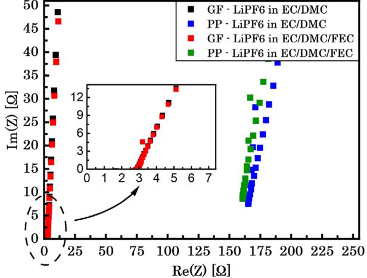
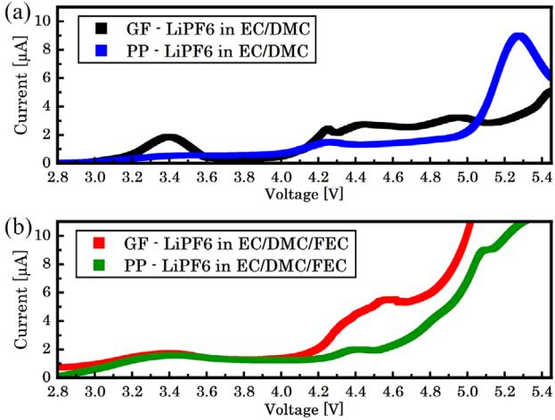
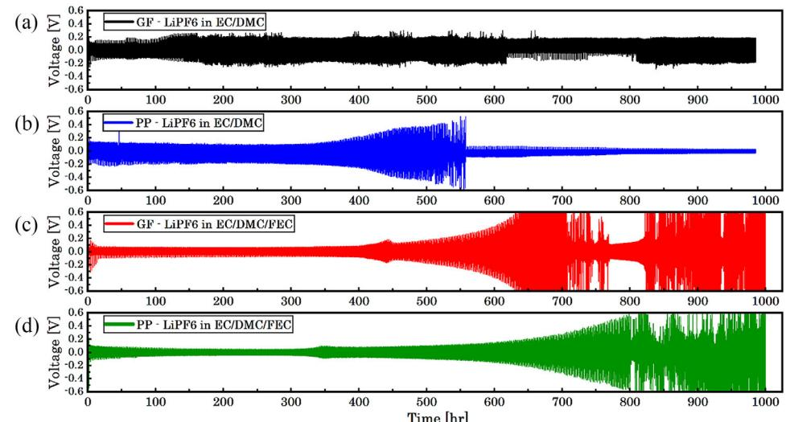
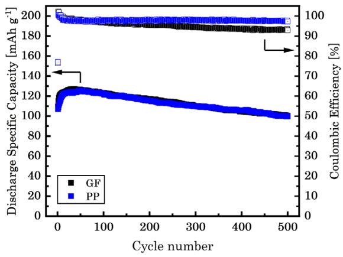
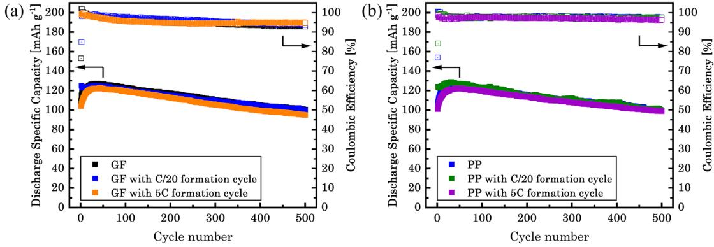
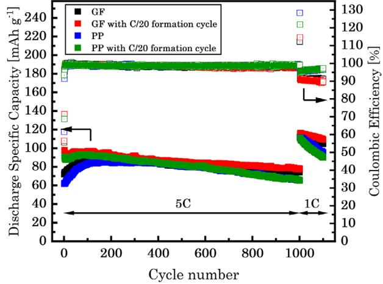
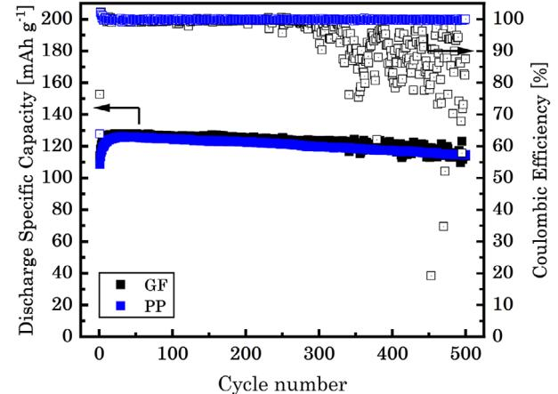
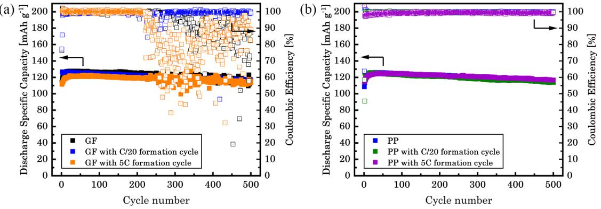
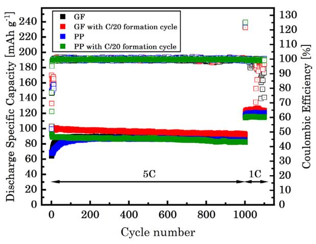
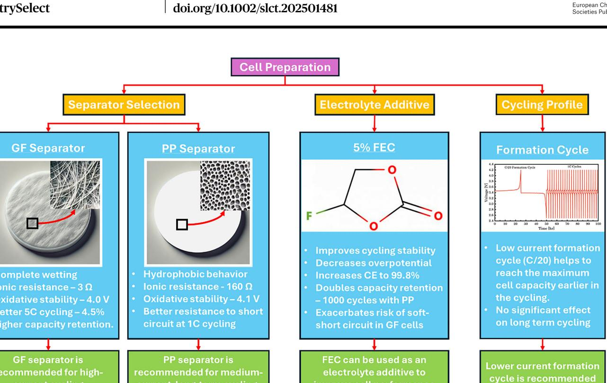

# **Effect of Separator Type, Formation Cycle, and Fluoroethylene Carbonate on the long-Term Cycling Performance of Lithium Metal Half-Cells**

[Stoyan Stoyanov,](https://orcid.org/0009-0001-3582-7214)[a] [Timothy G. Ritter,](https://orcid.org/0000-0002-5139-1908)[b] Samhita Pappu,[a] [Said Al-Hallaj,](https://orcid.org/0009-0008-8313-3074)[c] and [Reza Shahbazian-Yassar\\*](https://orcid.org/0000-0002-7744-4780)[a]

As the world shifts toward cleaner energy sources, prompted by the efforts for decarbonization, lithium-ion batteries are becoming pivotal in energy storage. Great effort has been dedicated to the development of a new generation of battery materials to enhance the energy density and cycle life of lithium-ion batteries. Typically, new cathode and anode materials are tested in half-cells with lithium metal as the reference electrode. However, given the wide range of separator and electrolyte options available for preparing a cell in battery material research, researchers new to the field may find it challenging to choose the most suitable components. The effect of separator type, presence of formation cycle, and fluoroethylene carbonate as an electrolyte additive, on the long-term cycling performance of LiFePO4||Li

# **1. Introduction**

Since their commercial breakthrough in the 1990s, lithiumion batteries (LIBs) have gained widespread use in various portable electronic devices due to their high energy and power densities.[\[1,2\]](#page-11-0) LIBs offer several fundamental advantages over other battery chemistries, including high energy efficiency, the absence of memory effects, and longer cycle and shelf life.[\[3\]](#page-11-0) Moreover, some LIBs can exhibit a relatively flat charge– discharge curve, enabling effective utilization of stored power while maintaining a nearly constant voltage.[\[4\]](#page-11-0) In response to climate change and global decarbonization efforts, there is a growing shift away from fossil fuels, creating new opportunities

[a] S. Stoyanov, S. Pappu, R. Shahbazian-Yassar Department of Mechanical and Industrial Engineering, University of Illinois at Chicago, Chicago, IL 60607, USA E-mail: [rsyassar@uic.edu](mailto:rsyassar@uic.edu)

[b] T. G. Ritter

Department of Civil & Materials Engineering, University of Illinois at Chicago, Chicago, IL 60607, USA

[c] S. Al-Hallaj

Department of Chemical Engineering, University of Illinois at Chicago, Chicago, IL 60607, USA

Supporting information for this article is available on the WWW under <https://doi.org/10.1002/slct.202501481>

© 2025 The Author(s). ChemistrySelect published by Wiley-VCH GmbH. This is an open access article under the terms of the [Creative Commons Attribution](http://creativecommons.org/licenses/by/4.0/) License, which permits use, distribution and reproduction in any medium, provided the original work is properly cited.

half-cells were investigated in this study to provide guidance on coin cell preparation. At medium current rates (1C), the glass fiber and polypropylene separators show similar performance, although the GF separator is more prone to soft-short circuits. At high current rates (5C) the glass fiber separator performs better due to its higher electrolyte uptake and lower ionic resistance. The impact of the formation cycle is most pronounced at the start of cycling but diminishes as cycling progresses, due to the impact of current density on the surface roughness of the fresh lithium anode. Further, it is observed that fluoroethylene carbonate doubles the capacity retention and enhances the Coulombic efficiency to 99.8% because of the more stable LiF-rich SEI layer.

for LIB applications in areas such as transportation, renewable energy storage, and aviation.[\[5–7\]](#page-11-0) Electric vehicles (EVs) are expected to replace the majority of internal combustion vehicles in the near future, prompting extensive research into the development of new battery materials to achieve longer driving range, faster charging, improved acceleration, longer lifespan, reduced cost, and enhanced safety. Additionally, the rising popularity of green energy technologies like solar and wind power generation is expanding the applications of LIBs, making cost and performance improvements in batteries a major focus of current research endeavors.[\[8–10\]](#page-11-0)

The main components of a LIB cell include the cathode, anode, electrolyte, and separator. During the charging process, Li+ ions migrate from the cathode to the anode via the electrolyte, and during discharge, they move back to the cathode.[\[1,11\]](#page-11-0) Lithium iron phosphate (LFP) is one of the popular cathode materials used in commercial LIBs. LFP offers several advantages over other cathode materials, such as non-toxicity, high thermal stability, and low cost.[\[12,13\]](#page-11-0) With a theoretical capacity of 170 mAh g−1 and an olivine structure known for its thermal stability and high-power capability, LFP has proven to be a reliable option in energy storage applications.[\[14–16\]](#page-11-0) Nevertheless, its utilization is limited by high impedance, arising from lower intrinsic electronic conductivity and lithium-ion diffusion. This limitation can be addressed by finely powdering and blending LFP with conductive carbon materials.[\[17–19\]](#page-11-0)

The separator is a porous membrane that physically separates the cathode from the anode, preventing electron flow between the two electrodes. The porous structure of the

separator is filled with electrolytes, facilitating ionic transport between the electrodes. A number of factors influence the choice of separator, and a wide range of properties are used to compare them. Crucial properties to consider include good electrical insulation, minimal ionic resistance, mechanical, dimensional, thermal, and chemical stability, good wettability by the electrolyte, uniform thickness, and effectiveness in preventing dendrite penetration and migration of particles and soluble species between electrodes. Balancing these conflicting requirements is essential for good performance in battery applications. For example, lower thickness, lower tortuosity, and larger pore size generally result in better ionic conductivity, higher specific capacity, and higher power. However, these factors also increase the risk of migration of active material particles between the battery electrodes and the occurrence of internal short circuits caused by dendrite penetration.[\[20–22\]](#page-11-0) In the case of lithium-metal batteries, minimizing dendrite growth originating from points of non-uniform current density is crucial, making the selection of a separator that inhibits dendrite growth highly beneficial for cycle life. Microporous polyolefin membranes made from polyethylene (PE) and/or polypropylene (PP) are widely used as separators in LIBs, offering excellent mechanical properties, chemical stability with most conventional electrolytes, good oxidation resistance when in contact with the positive electrode, and low thickness.[\[23–25\]](#page-11-0) Glass fiber (GF) membranes, composed of borosilicate microfibers, represent another common separator type. GF membranes feature a highly porous structure, excellent wettability, and high electrolyte uptake.[\[26,27\]](#page-11-0) While polyolefin separators find use in most commercially produced LIBs, GF separators are employed in emerging battery technologies such as lithium-sulfur and lithium-oxygen batteries.[\[28–30\]](#page-11-0)

The electrolyte in LIBs typically consists of a lithium salt dissolved in organic solvents, with lithium hexafluorophosphate (LiPF6) being one of the commonly used salts. Organic solvents typically employed with LiPF6 include ethyl methyl carbonate, dimethyl carbonate, diethyl carbonate, propylene carbonate, and ethylene carbonate, as they enhance the mobility of lithium ions.[\[1,21,31\]](#page-11-0) Key requirements for electrolyte composition include high ionic conductivity and electronic insulation, wide electrochemical windows, good thermal stability, and compatibility with other battery components. Since no single solvent satisfies all requirements, a combination of solvents is often used to improve performance. Various additives are incorporated in small percentages to further enhance electrolyte performance, primarily by improving the quality of the solid electrolyte interphase (SEI) layer or enhancing the ionic transport of lithium ions.[\[32–34\]](#page-11-0) One such group of additives is fluorinated organic solvents, which have gained attention in LIB applications due to their ability to improve electrolyte stability and cycle performance.[\[35–39\]](#page-11-0)

While graphite currently dominates as the anode material, considerable research efforts have focused on lithium metal as an alternative due to its high theoretical specific capacity (3860 mAh g−1 ), low density (0.59 g cm−3 ), and lowest negative electrochemical potential (−3.040 V versus the standard hydrogen electrode).[\[40–42\]](#page-11-0) The main challenges with lithium metal batteries involve the uneven growth of lithium dendrites during repeated charge/discharge cycles and the low Coulombic efficiency (CE), which adversely affect safety and cycle life. Various approaches to dendrite prevention focus on improving the stability and uniformity of the SEI layer on the lithium surface through adjustments in electrolyte composition and optimization of SEI formation additives. Additionally, ex situ coatings and mechanical barriers on the separators are employed to suppress dendrite penetration.[\[1,9,43\]](#page-11-0) Although lithium metal batteries are not yet commercialized, lithium metal serves as the reference electrode in half-cell electrochemical testing of new battery cathode and anode materials.[\[44\]](#page-11-0)

Given the wide range of separator and electrolyte options available for preparing a cell in battery material research, researchers new to the field may find it challenging to choose the most suitable components. Furthermore, there is a lack of studies comparing the influence of GF and PP separators on the long-term cycling performance of half-cells. This study aims to provide clarity on proper battery cell evaluation by offering guidance on separator selection, electrolyte additives, and insights into electrochemical performance testing of half-cells. Our investigation focuses on several critical factors influencing the electrochemical performance of LFP half-cells, including the choice of separator material, the implementation of a formation cycle, and the incorporation of fluoroethylene carbonate (FEC) into the electrolyte. The impact of these variables was assessed at both medium (1C) and high (5C) charge/discharge rates. This study aims to show to what degree half-cell component selection and cycling procedure can affect the final results in electrochemical testing, thus facilitating more informed decisions in cell preparation for new anode and cathode development and testing.

# **2. Experimental Procedure**

#### **2.1. Electrode Preparation**

The cathode material was prepared by mixing LFP (Sigma Aldrich), carbon black (Sigma Aldrich), and polyvinylidene fluoride binder (PVDF, Sigma Aldrich) in a ratio of 70:15:15. Initially, PVDF was dissolved in 1-methyl-2-pyrrolidinone (NMP) solvent using a magnetic stirrer for 1 hour at room temperature and rotation speed of 320 rpm. Next, LFP was added and stirred for another hour. Finally, carbon black was added, the temperature was increased to 45 °C and the mixture was stirred for 2 to 4 hours to form a uniform homogeneous slurry. The slurry was cast on an aluminum foil using the doctor blade method and dried in a vacuum oven at 80 °C overnight. The thickness of the coating was found to be 150 μm. Subsequently, 14 mm diameter disks, with an average active material loading density of 1.5 mg cm−2 , were cut using a punch.[\[45\]](#page-11-0)

#### **2.2. Electrochemical Measurements**

All the electrochemical analyses were performed using BioLogic VMP3, and Neware CT-4008–5V10mA-164-U battery cyclers with CR2032 coin cells. The prepared LFP electrodes were assembled

| specifications. | Table 1. GF and PP separator properties according to manufacturer's |                |              |
|-----------------|---------------------------------------------------------------------|----------------|--------------|
| Separator       | Thickness [μm]                                                      | Pore Size [μm] | Porosity [%] |
| GF              | 670                                                                 | 2.7            | –            |
| PP              | 25                                                                  | 0.064          | 55           |

in half-cells with lithium metal (0.25 mm thick, MSE Supplies) as the counter electrode and either Whatman GF/D glass microfiber or Celgard 2500 monolayer polypropylene separator. The GF and PP separators were cut into 17 mm disks using a punch. Table 1 shows the properties of the GF and PP separators as provided by the manufacturer.

The half-cells were assembled in an argon-filled glove box with 1 M LiPF6 in EC/DMC = 50/50 (v/v) (Sigma Aldrich) electrolyte. To investigate the effect of Fluoroethylene carbonate (4-Fluoro-1,3-dioxolan-2-one, Sigma Aldrich) as an additive to the electrolyte, FEC was mixed with 1 M LiPF6 in EC/DMC = 50/50 (v/v) in a ratio of 5% by volume.[\[46\]](#page-11-0)

Figure S1 illustrates the components and assembly of the coin cells. The following procedure was followed when assembling the half-cells: A wave spring was placed in the bottom case. A 0.5 mm thick stainless-steel spacer was placed on top of the wave spring along with an LFP cathode. Next, a separator was placed on top of the LFP electrode and 200 μL of electrolyte was uniformly dispensed using a measuring pipette. The lithium metal anode was then placed on top of the separator and the top case was used to close the cell. For the PP separator, an additional stainless-steel spacer was placed on top of the lithium metal anode to compensate for the low thickness of the PP separator and to ensure sufficient contact pressure. The cell was then crimped with a manual coin-cell crimper. A similar procedure was followed when assembling the overpotential, EIS, and LSV coin cells.[\[47\]](#page-11-0) All electrochemical tests were performed at room temperature unless stated otherwise.

The ionic resistance attributed to the separator was determined via Electrochemical Impedance Spectroscopy (EIS) performed on SS || Separator || SS coin cells (Figure S1C). EIS was performed in the frequency range of 1 MHz to 100 mHz with an amplitude of 10 mV.[\[48\]](#page-11-0) EIS with the same frequency range was also performed on the LFP || Separator || Li cells before the formation cycle, after the formation cycle, and after 50 cycles to investigate the effect of the formation cycle on the charge transfer resistance.

The anodic stability of the electrolyte was determined via Linear Sweep Voltammetry (LSV) performed on an asymmetric Li || Separator || SS cell (Figure S1F). The voltage was scanned from open-circuit voltage (OCV) to 5.5 V with a scan rate of 1 mV s−1 .

The electrolyte overpotential was determined by galvanostatic cycling of symmetric Li || Separator || Li cells (Figure S1D,E). The cells were subjected to plating and stripping for 1 hour at a current density of 1 mA cm−2 for 500 cycles.

The study of the formation cycle was carried out on LFP || Separator || Li half-cells (Figure S1A,B) in a voltage range of 2.5–4.2 V. Two galvanostatic charge–discharge test profiles were

**Figure 1.** Nyquist plot of symmetrical SS || Separator || SS cells assembled with GF or PP separators, using 1 M LiPF6 in EC/DMC or 1 M LiPF6 in EC/DMC/FEC electrolyte.

performed to investigate the behavior of the cells at medium and high currents. The medium current test profile included 1C (120 mA g−1 ) cycling over 500 cycles and the high current test profile included 5C (600 mA g−1 ) cycling over 1000 cycles followed by 1C cycling for 100 cycles. The effects of a low C-rate and a high C-rate formation cycle on the performance of the halfcells were also investigated. After assembly, the half-cells with a low C-rate formation cycle were charged and discharged once with C/20 (6 mA g−1 ) current and then cycled with either the medium or high current test profile. The half-cells with a high Crate formation cycle were charged and discharged 50 times with 5C current and then cycled with the medium current test profile.

# **3. Results and Discussion**

#### **3.1. Electrochemical Impedance Spectroscopy**

During the assembly process, a notable difference between the interaction of the electrolyte with GF and PP separators was observed. The GF separator exhibited complete wetting, while the PP separator displayed hydrophobic behavior, which is consistent with the observations reported by Zhu et al.[\[49\]](#page-11-0) The contact angle of PP separators with liquid electrolytes is reported to be between 37° and 43°.[\[50–56\]](#page-11-0) The better wettability of the GF separator is attributed to its larger pore size, wellinterconnected microporous structure, and lyophilic nature of borosilicate,[\[49\]](#page-11-0) which facilitates better electrolyte uptake and ionic conductivity.[\[57–60\]](#page-11-0) Figure 1 shows the Nyquist plot of the symmetric cells with blocking SS electrodes. The ionic resistance of the cells is indicated by the intercept of the extended line of the impedance curve and the horizontal axis.[\[61–63\]](#page-12-0) As can be seen from Figure 1, the GF separator has lower ionic resistance (3 Ω) compared to the PP separator (160 Ω), implying better ionic conductivity of the GF separator. It has been shown that GF separators have lower tortuosity and larger pore size, which can improve ionic conductivity.[\[64,65\]](#page-12-0) It should be noted that the ionic

**Figure 2.** LSV of Li || Separator || SS cells assembled with GF or PP separators using a) 1 M LiPF6 in EC/DMC or b) 1 M LiPF6 in EC/DMC/FEC electrolyte.

resistance of the samples with the PP separator ranged from ∼100 to 200 Ω, which shows significantly higher variation than that of the GF samples. This difference is attributed to the poor wettability of the PP separator. Furthermore, the addition of FEC to the electrolyte had no significant effect on the ionic conductivity of the separators as the GF cells with FEC and the PP cells with FEC exhibited ionic resistances of 3 and 153 Ω, respectively.

#### **3.2. Linear Sweep Voltammetry**

The stability of the GF and PP separators was analyzed by LSV, and the results are presented in Figure 2. As can be seen from Figure 2a, the PP separator shows an onset of an anodic current at 4.1 V, while the GF separator shows the onset of an anodic current at 4.0 V attributed to an oxidation reaction.[\[66\]](#page-12-0) A peak is observed at 3.4 V for the GF cells, which could be due to side reactions of the electrolyte with the GF separator, indicating better compatibility of the PP separator with the carbonate electrolyte compared to the GF separator.[\[67–71\]](#page-12-0) Further, the addition of FEC increases the anodic stability of the GF separator to 4.1 V, and that of the PP separator to 4.3 V (Figure 2b). This is ascribed to the enhanced stability of the electrolyte/electrode interface, achieved through the formation of a LiF-rich SEI layer facilitated by the addition of FEC to the electrolyte.[\[72,73\]](#page-12-0) Also, there is no peak at 3.4 V for the GF cells with FEC, alluding to suppressed side reactions.

#### **3.3. Overpotential Performance of Symmetric Li-Li Cells**

The overpotential analysis of PP and GF separators on symmetrical Li || Separator || Li cells is presented in Figure [3.](#page-4-0) To explain these results, relevant literature was explored, focusing on studies that detail the mechanisms of SEI growth, separator degradation, dendrite formation, and lithium metal morphology. While we have not conducted additional characterizations beyond electrochemical analysis, this approach aligns with the primary focus of our manuscript on electrochemical performance. The referenced studies provide supplementary context to help interpret the observed phenomena, ensuring that our findings are well-grounded within the broader scientific discourse.

The PP cells with 1 M LiPF6 in EC/DMC electrolyte show a lower overpotential and a more stable voltage profile compared to the cells with a GF separator. Both the GF and the PP cells show an initial decrease in the overpotential due to the formation of mossy dendrites, which changes the morphology of the lithium metal surface and results in increased active surface area and faster reaction rate associated with the freshly exposed lithium.[\[59,74\]](#page-11-0) The GF cells exhibit an erratic voltage profile during the galvanostatic cycling, which can be attributed to the formation and isolation of dendritic shorting pathways through the separator.[\[75\]](#page-12-0) The GF separator is more susceptible to that kind of behavior compared to the PP separator due to its larger pore size and lower tortuosity. Further, the cells with a PP separator exhibit a gradual increase in potential hysteresis starting at ≈350 hours, suggesting an increased interfacial resistance due to continuous breakdown and reformation of the SEI layer, resulting in continuous consumption of the electrolyte and a deteriorated electrolyte/electrode interface.[\[76\]](#page-12-0) As the cycling continues the dendrites break off the lithium surface and become electrically insulated resulting in the accumulation of a porous layer of "dead lithium".[\[52,54,60,77,78\]](#page-11-0) Therefore, the rapid increase in overpotential is attributed to electrolyte decomposition leading to the formation of excessive SEI and inactive "dead lithium".[\[75,79\]](#page-12-0) Additionally, separator degradation and pore blockage caused by SEI debris, along with mechanical deformation due to dendrites, hinder ionic transport and increase non-uniform lithium deposition, further accelerating dendrite growth and exacerbating cell degradation.[\[69,80,81\]](#page-12-0)

Over long cycling, the "dead lithium" layer becomes thick and mass transport through the interphase becomes the dominant factor in the delivery of lithium ions to the desired electrode.[\[74\]](#page-12-0) This results in a decreased concentration of Li+ at the electrolyte/electrode interface, and at a certain time, referred to as "Sand's time", there is severe Li+ depletion which gives rise to morphology evolution of the lithium dendrites from reactionlimited mossy to diffusion-limited fractal dendrites. Fractal dendrites are typically characterized by their rapidly expanding length and small branches, which are likely to cause erratic voltage behavior and short circuits in the cell.[\[82,83\]](#page-12-0) Additionally, the PP cells show a sudden drop in voltage at ≈550 hours which is indicative of an internal short circuit.[\[52,68,69,78\]](#page-11-0)

The addition of FEC to the electrolyte significantly reduces the overpotential and improves the cycling stability of both the GF and PP cells, as observed in Figure [3c,d.](#page-4-0) This is attributed to the improved film uniformity by the LiF-rich SEI layer, implying controlled and uniform lithium metal deposition behavior.[\[72\]](#page-12-0) LiF enhances the surface diffusion of Li+ due to its low diffusion energy, resulting in the observed lower overpotential and suppressed parasitic reactions between the lithium metal and the electrolyte, which extends the stable cycling window of the symmetric cells.[\[46,73\]](#page-11-0) Both the GF and PP cells with FEC additive to the electrolyte exhibit a rapid increase in overpotential,

**Figure 3.** Overpotential of symmetric Li || Separator || Li cells assembled with a) GF and b) PP separator using 1 M LiPF6 in EC/DMC, and c) GF or d) PP separator using 1 M LiPF6 in EC/DMC/FEC electrolyte, tested at 1.0 mA cm−2 current density for 1 hour plating or striping.

**Figure 4.** Galvanostatic 1C charge/discharge cycling of LFP || Separator || Li half-cells assembled with GF or PP separator, using 1 M LiPF6 in EC/DMC electrolyte.

before short circuiting due to fractal dendrites. However, the onset of the failure in PP cells occurs ≈100 hours later than in GF cells, ascribed to the more stable oxidative stability of the PP separator, as evidenced by the LSV analysis (Figure [2\)](#page-3-0).

#### **3.4. Galvanostatic Cycling Performance of LFP Half-Cells**

## *3.4.1. Comparison of GF and PP Separators at the Medium Current Test*

The medium current test (1 C-rate) demonstrates that the GF and PP separators exhibit similar performance over 500 cycles, as depicted in Figure 4. The maximum capacity reaches 127.1 and 125.6 mAh g−1 for the GF and PP separators after 25 cycles, respectively. The lower maximum capacity, in comparison to the theoretical value, is attributed to the lower electronic conductivity and Li-ion diffusivity of the LFP cathode.[\[84–86\]](#page-12-0) The low CE of 76.5% in the first cycle is representative of the SEI formation.[\[9,87,88\]](#page-11-0) The increase in capacity to reach the maximum value during the initial cycles is attributed to the increase in the surface area on the lithium metal anode due to dendrite formation.[\[89,90\]](#page-12-0)

Both separators in 1 M LiPF6 EC/DMC electrolyte exhibit a similar degradation profile. The capacity retention is observed to be 79.0% for the GF and 79.2% for the PP cells at the end of the 500 cycles. This is generally considered the end of life for batteries in most applications.[\[91–95\]](#page-12-0) The capacity loss of the LFP half-cells is attributed to electrolyte decomposition and thickening of the SEI layer.[\[96,97\]](#page-12-0) It should be noted that a considerable number of the tested cells with GF separator manifested voltage instability during charging, with instances observed as early as 250 cycles. This is depicted in Figure S2. Since lithium is plated on the lithium metal anode during the charging process, the erratic voltage behavior is indicative of dendrite penetration through the separator and soft short circuits, as current pathways are broken and reformed.[\[41,74,98–100\]](#page-11-0) This voltage instability is observed toward the end of the charge and becomes more severe as the cycling continues. Eventually, a hard short circuit is observed, when the voltage falls below the minimum voltage limit of 2.5 V. This phenomenon is more likely to manifest in areas where larger particles of LFP are present, exerting greater stress on the separator, which would explain why it was observed in only some of the GF cells.[\[101\]](#page-12-0) As illustrated in Figure S3, the connection path of the hard short circuit can be broken after an extended charging period, allowing cycling to resume. Nevertheless, subsequent instances of hard short circuits are observed thereafter. The PP separator, on the other hand, does not exhibit voltage instability during the charging process for all 500 cycles. This can be explained by the fact that the PP separator has a smaller pore size and higher tortuosity compared to the GF separator, which results in better resistance to dendrite growth and penetration of particles.[\[98\]](#page-12-0)

Coulombic efficiency (CE) is an important indicator of cell performance and is used to quantify how well the battery is

**Figure 5.** Galvanostatic 1C charge/discharge cycling of a) LFP || GF || Li and b) LFP || PP || Li half-cells in 1 M LiPF6 in EC/DMC electrolyte, with and without formation cycles.

converting electrical energy to chemical energy during charging and subsequently back to electrical energy during discharging. Higher CE is indicative of lower losses of electrical energy due to side reactions in the cells. Generally, lithium metal batteries have low CE; however, this can be compensated for by an excess amount of lithium, which is the case in half-cells.[\[9,102\]](#page-11-0) In the first 100 cycles, the GF and PP separator cells show a comparable CE of ≈97.7%. However, a gradual decrease in CE to 92.9% is observed in GF after 500 cycles, while the PP cells maintained 97.7%. This decrease in CE could be attributed to the lower tortuosity and larger pore size of the GF separator, which results in poor resistance to Li dendrite penetration through the SEI layer,[\[103\]](#page-12-0) and the lower anodic stability of the cells with the GF separator.

## *3.4.2. Effect of Formation Cycle on Cycling Performance of LFP Half-Cells at the Medium Current Test*

Often, initial low C-rate formation cycles are performed on cells at the start of cycling in the hopes of establishing a more stable SEI layer. To determine this effect on the cycling performance of the cells, the formation cycle analysis in this paper was carried out at a rate of C/20. It is observed that during the medium current test, cells with a C/20 formation cycle showed higher specific capacity in the initial ≈15–35 cycles than those without a formation cycle, as shown in Figure 5a,b. The maximum capacity difference observed during the first cycle is 15.5 and 16.9 mAh g−1 for the GF and PP cells respectively. This is attributed to the enhanced electrolyte penetration and electrode wetting during the C/20 formation cycle.[\[104\]](#page-12-0) The maximum capacity of the GF and PP with a C/20 formation cycle was 125.0 and 128.7 mAh g−1 respectively, which is comparable to the values of the cells without a formation cycle. It is also observed that some cells with GF separator and C/20 formation cycle exhibit voltage instability during the charging process at ≈250 cycles, similar to the cells without formation cycle. However, the same is not observed in the PP separator cells with the C/20 formation cycle for the entire 500 cycles. Further, the capacity retention of GF and PP cells with the C/20 formation cycle was found to be similar at 79.3% and 77.4% respectively, indicating no significant effect of the C/20 formation cycle on the long-term lithium dendrite growth and capacity fade.

To gain further insight into the influence of current density on the formation of the SEI layer, cells with 5C formation cycles were tested. As depicted in Figure 5a,b, the cells with 5C formation cycles showed maximum capacity of 122.8 and 122.4 mAh g−1 for the GF and PP cells, respectively, which is slightly lower compared to the cells without a formation cycle. There is a capacity increase in the ≈25 cycles after the 5C formation cycles before reaching the maximum capacity, which is indicative of further reformation of the SEI layer. That is attributed to the depletion of dendritic lithium and the stripping of lithium from the bulk of the anode, which could result in the formation of "dead lithium".[\[105\]](#page-12-0) It is understood that, due to the lower overpotential at lower current densities, more lithium can be plated and stripped from the anode during the initial cycles, resulting in a rougher anode surface and decreased SEI layer resistance.[\[106\]](#page-12-0) Thus, the maximum capacity will be reached within fewer cycles. The capacity retention of the cells with formation cycles at 5C was found to be 77.3% and 80.8% for the GF and PP cells respectively, which is similar to that of the cells without a formation cycle. The CE of the cells was also comparable, regardless of the formation cycle, as seen in Figure 5a,b. A summary of the results for the medium current test is presented in Table. S1.

GF cells with and without 5C formation cycles showed erratic voltage behavior due to a soft short circuit, while the cells with the PP separator remained free from voltage instability throughout the 500 cycles. This agrees with the results from the cells without a formation cycle. Overall, it is recommended to perform a C/20 formation cycle to get higher capacity at the beginning of the cycling. However, the formation cycle was ultimately found to have no significant effect on the long-term cycling performance of the cells.

The conclusions drawn from the cycling data are further substantiated by EIS tests conducted at three stages: before formation (freshly assembled cells), after formation, and after 50 cycles at a 1C rate for both GF and PP half-cells. The EIS data were analyzed using the circuit model employed by Wand et al., with the results illustrated in Figure S4. [\[86\]](#page-12-0) The EIS spectra consist of a semicircle in the high-frequency region, representing lithiumion migration through the SEI at the electrode/electrolyte

| Table 2. Charge transfer resistance of GF and PP LFP half-cells. |                         |                        |                              |  |
|------------------------------------------------------------------|-------------------------|------------------------|------------------------------|--|
|                                                                  | Before Formation [Ω] | After Formation [Ω] | After 50 Cycles at 1C [Ω] |  |
| GF with C/20 formation cycle                                  | 148.7                   | 47.9                   | 31.9                         |  |
| GF with 5C formation cycle                                    | 150.8                   | 90.2                   | 37.5                         |  |
| PP with C/20 formation cycle                                  | 420.9                   | 162.5                  | 21.7                         |  |
| PP with 5C formation cycle                                    | 364.5                   | 258.4                  | 16.3                         |  |

interface, and an inclined line in the low-frequency region, indicating lithium-ion diffusion within the bulk of the electrode material.

The resistance associated with the semicircle in the mid-high frequency range, labeled as R2 in Figure S4, is attributed to the charge transfer resistance. Table 2 summarizes the charge transfer resistance values for GF and PP half-cells with C/20 and 5C formation cycles. Notably, in the GF cells, the C/20 formation cycle reduces the charge transfer resistance from 148.7 to 47.9 -, which is significantly lower than the 90.2 observed after the 5C formation cycles. Furthermore, the charge transfer resistance decreases further after the 50 cycles at a 1C rate, resulting in values that are similar for the cells with C/20 formation cycle and 5C formation cycles. The decrease in charge transfer resistance results in the increase in specific capacity observed at the beginning of the cycling. Since the charge transfer resistance is very similar after the C/20 formation cycle and after the subsequent 50 cycles at a 1C rate, the maximum specific capacity is reached almost right after the formation cycle, which supports the conclusions from the cycling experiments. On the other hand, since there is a significant decrease in charge transfer resistance after the 5C formation cycles and after the 50 cycles with a 1C rate, there is a corresponding increase in specific capacity observed at the beginning of the 1C cycling.

In contrast, the PP half-cells exhibit higher initial charge transfer and ohmic resistance than the GF cells, likely due to the poorer wettability of the PP separator. The ohmic resistance, identified by the left intercept of the semicircle with the real axis, significantly decreases after the formation cycle to levels comparable to those of the GF cells. Although the PP cells consistently show higher charge transfer resistance than GF cells, a similar trend in resistance reduction with different formation cycles is observed: the C/20 formation cycle achieves a more substantial reduction than the 5C cycle. After 50 cycles at a 1C rate, PP cells demonstrate a lower charge transfer resistance than GF cells, suggesting a more stable electrolyte/electrode interface, which may contribute to the superior long-term stability of the PP cells.

We acknowledge that the lack of direct microstructural characterization in our study could limit the depth of interpretation regarding the underlying mechanisms. However, the referenced literature serves to bridge this gap, providing a broader context for understanding the observed electrochemical results.

## *3.4.3. Comparison of GF and PP Separators at the High Current Test*

The results from the high current test (5C for 1000 cycles followed by 1C for 100 cycles) are presented in Figure [8.](#page-8-0) The maximum capacity of the GF and PP cells are 91.2 and 86.0 mAh g−1 , respectively. The PP separator exhibits slightly lower maximum capacity than the GF separator due to its higher ionic resistance, as evidenced by the EIS results, which leads to a higher Li-ion gradient across the separator and reduced capacity at higher current densities.[\[107\]](#page-12-0) The maximum capacity during the 5C cycling in the high current test is 28.2% and 31.5% lower compared to the maximum capacity at the medium current test, for the GF and PP cells, respectively. The lower discharge capacity is attributed to the slow diffusion of Li ions in the LFP particles, which results in higher polarization with an increase in current density.[\[108–110\]](#page-12-0) As illustrated in Figures S5 and S6, the polarization during 5C cycling is twice as high as the polarization during 1C cycling, ≈0.2 and ≈0.1 V, respectively. The capacity retention at the end of the 5C cycling is 81.3% and 76.8% for the GF and PP cells, respectively. The difference in capacity retention is attributed to the higher electrolyte uptake and higher ionic conductivity of the GF separator.[\[111,112\]](#page-12-0) At higher currents, the low porosity and high tortuosity of the PP separator can induce an inhomogeneous current and encourage dendrite growth and formation of "dead lithium".[\[98,113\]](#page-12-0)

It is observed that the capacity degradation at the 5C cycling of the high current test is lower compared to that of the 1C cycling of the medium current test. The reduced degradation observed at higher C-rates is because less lithium is deposited/stripped away from the anode due to the higher overpotential induced by the low conductivity of LFP. Consequently, there is less expansion of the SEI layer, leading to decreased cracking and subsequent reformation. Cracking of the SEI is undesirable because cracks expose fresh lithium, which further reacts with the electrolyte to form thicker SEI resulting in electrolyte consumption and capacity fade.[\[89,90,106,114\]](#page-12-0) The average CE of the GF and PP cells during the 5C cycling is found to be 98.4% and 98.6%, respectively.

The reversibility of LFP is demonstrated by the fact that the capacity recovers to 113.2 and 111.4 mAh g−1 for the GF and PP cells, respectively, after changing the current density to 1C following the end of the 5C cycling. This confirms that the capacity decrease at higher C-rates is due to Li-ion diffusion limitations.[\[115–117\]](#page-12-0) However, the capacity does not fully recover, due to the aging of the battery after being cycled for 1000 cycles at the 5C current rate. Upon changing the current density from 5C to 1C, a sudden drop in CE is observed to 91.2% and 95.7% for the GF and PP cells, respectively. The CE of the first 1C cycle is more than 100% for all the cells, indicating the partial dissolution of the SEI layer and recovery of cyclable lithium.[\[118\]](#page-12-0) This initiates degradation of the SEI layer, triggering additional side reactions with the electrolyte, and ultimately leading to the drop in CE. It can be concluded that changes in the current density after prolonged cycling negatively affect the electrolyte/lithium metal interface. The capacity retention over the 100 cycles at 1C following the 5C cycling is 92.5% and 86.1% for the GF and PP

cells. A more pronounced capacity fading rate is demonstrated, compared to the medium current test, which can be attributed to the change in current density, resulting in lower CE and more side reactions. Although the PP separator has higher CE, it shows higher capacity fade over the 100 cycles, due to inhomogeneous lithium deposition caused by electrolyte depletion and pore blockage resulting in the formation of "dead lithium" and increased interfacial impedance.[\[76,111\]](#page-12-0)

No erratic voltage behavior was observed for both the GF and PP separator cells during the high current test. This is in contrast to what is observed in the medium current test for the GF separator and is attributed to the smaller volume expansion of the SEI during the 5C cycling and the fast capacity fade resulting in more "dead lithium" formation from detachment of dendrites due to the poor electrolyte/lithium metal interface during the subsequent 1C cycling.

#### *3.4.4. Effect of Formation Cycle on Cycling Performance of LFP Half-Cells at the High Current Test*

In the high current test, it was observed that the cells with the C/20 formation cycle had higher maximum capacity than those without a formation cycle, with a difference of 6.8 and 7.3 mAh g−1 for the GF and PP cells, respectively. This is attributed to the fact that at high C-rates the SEI layer takes more cycles to fully form, indicated by the increase in specific capacity in the first ∼100 cycles, thus consuming more active material resulting in higher interfacial resistance.

The capacity retention during the 5C cycling of the GF cells with the C/20 formation cycle is 79.5%, which is 1.8% lower compared to that of the GF cells without a formation cycle. However, during the subsequent 1C cycling, the GF cells with the C/20 formation cycle show 3.1 mAh g−1 higher maximum capacity and 1.6% higher capacity retention. The capacity retention during the 5C cycling of the PP cells with the C/20 formation cycle is 69.9%, which is 6.9% lower compared to that of the PP cells without a formation cycle. However, the capacity at 1000 cycles is only 0.8 mAh g−1 lower compared to that of the cells without a formation cycle. During the subsequent 1C cycling the GF cells with the C/20 formation cycle show only 0.5 mAh g−1 lower maximum capacity, but 4.4% lower capacity retention compared to the cells without a formation cycle. From this, it can be concluded that the C/20 formation cycle leads to an enhancement of the SEI in the GF cells, but to its deterioration in the PP cells. A summary of the results for the high current test is presented in Table S2.

Overall, the C/20 formation cycle has a most noticeable effect in the first ≈100 cycles at 5C cycling, during which it results in significantly higher specific capacity; however, this effect diminishes as cycling goes on. The C/20 formation cycle does not have a significant effect on the CE for either the GF or the PP separator, as seen in Figure 6.

## *3.4.5. Effect of FEC on Cycling Performance of LFP Half-Cells at the Medium Current Test*

During the medium current test, the GF and PP cells with FEC exhibited 0.8 mAh g−1 higher specific capacity compared to the

**Figure 6.** Galvanostatic charge/discharge cycling for 1000 cycles at 5C followed by 1C charge/discharge cycling for 100 cycles of LFP || Separator || Li half-cells assembled with either GF or PP separators.

**Figure 7.** Galvanostatic 1C charge/discharge cycling of LFP || Separator || Li half-cells assembled with GF or PP separator, with FEC electrolyte additive.

cells without FEC. Hence, it can be concluded that adding FEC to the electrolyte does not affect the maximum specific capacity, which could be explained by the fact that the limiting factor for the maximum capacity is the Li-ion diffusion in the LFP electrode. However, the addition of FEC did show improvement in capacity retention and CE for both the GF and PP cells. As illustrated in Figure 7, all the cells with a GF separator and FEC showed erratic voltage behavior during charging, starting as early as 200∼250 cycles, so a reliable comparison of the capacity degradation could not be made over the 500 cycles. This can be attributed to the fact that FEC creates a more stable SEI layer, and successive charging and discharging may lead to the formation of larger, and sturdier dendrites that can penetrate the separator, rather than the formation of "dead lithium". Conversely, the PP separator with FEC did not show any voltage instability for the duration of the cycling.

The capacity retention at 200 cycles for the GF cells with FEC was 97.6%, compared to 92.3% for the cells without FEC. Similarly, at 500 cycles, the PP cells with FEC exhibited a

**Figure 8.** Galvanostatic 1C charge/discharge cycling of a) LFP || GF || Li and b) LFP || PP || Li half-cells in 1 M LiPF6 in EC/DMC/FEC electrolyte, with and without formation cycles.

capacity retention of 90.1%, compared to 79.3% for the cells without FEC. As illustrated in Figure S7, the capacity retention of the PP cells with FEC is 85.1% at 1000 cycles, compared to 66.4% for the cells without FEC. Thus, FEC has the potential to more than double the cycle life of the PP cells. There is no notable distinction in the capacity retention between the GF and PP cells with FEC during the medium current test, mirroring the case without FEC. The addition of FEC to the electrolyte raises the CE to 99.8% for both the GF and PP cells, which is 2.1% higher than that of the cells without FEC. The improvements in capacity retention and CE are attributed to the more uniform and compact SEI layer enriched with LiF due to the reaction of FEC with the lithium metal anode.[\[46,72\]](#page-11-0) LiF enhances the surface diffusion of Li+ through the SEI layer and renders uniform lithium deposition. This in turn stabilizes the electrolyte/electrode interface, resulting in the suppression of dendrites and "dead lithium" formation.[\[46,72\]](#page-11-0)

## *3.4.6. Effect of Formation Cycle on Cycling Performance of LFP Half-Cells With FEC at the Medium Current Test*

At the medium current test with FEC, there was no significant difference between cells with the C/20 formation cycle and cells without a formation cycle, apart from the fact that the cells with the C/20 formation cycle showed higher specific capacity in the first ≈15–35 cycles than those without a formation cycle as seen in Figure 8a,b. The maximum capacities of GF and PP cells with the C/20 formation cycle were 126.8 and 126.0 mAh g−1 respectively, which is comparable to the values of the cells without a formation cycle (125.0 and 128.7 mAh g−1 ). The GF cells with the C/20 formation cycle start to exhibit voltage instability around the 200th cycle during the charging process resulting in longer charge times and decreased CE, similar to the cells without a formation cycle. The PP cells with the C/20 formation cycle did not exhibit voltage instability for the full 500 cycles. The capacity retention at 200 cycles for the GF cells with the C/20 formation cycle was 97.0% and that of the PP cells with the C/20 formation cycle was 96.3% at 200 cycles and 90.3% at 500 cycles. These results are comparable to the cells without a formation cycle, with a difference of less than 1% in capacity retention. The CE of both the cells with GF and PP separators and the C/20 formation cycle was stable at 99.3%, before the occurrence of erratic voltage behavior in the GF cells. These results indicate that the C/20 formation cycle has no significant effect on the long-term lithium dendrite growth and capacity fade of the cells with FEC cycled at 1C current rate.

Cells with FEC were also subjected to 5C formation cycles. As depicted in Figure 8a,b, the maximum capacity of the GF cells with 5C formation cycles is 122.8 mAh g−1 , which is 5.1 mAh g−1 lower compared to the cells without a formation cycle. The lower maximum capacity in the case with 5C formation cycles is attributed to SEI cracking and the formation of "dead lithium" resulting from the formation of larger dendrites at the lower current density. The PP cells with 5C formation cycles showed 125.4 mAh g−1 maximum capacity similar to the cells without formation cycle. The capacity retention of the GF cells with 5C formation cycles was 97.7% at 200 cycles, which is similar to the cells without a formation cycle. The capacity retention of the PP cells with 5C formation cycles was 93.3% at 500 cycles, which is 2.3% higher than the cells without formation cycles. The CE of both GF and PP cells with 5C formation cycles was comparable to the cells without formation cycles. A summary of the results for the medium current test with FEC is presented in Table S3. The GF cells with 5C formation cycles showed voltage instability during the charge, while the PP cells did not, similar to the cells without a formation cycle.

It can be concluded that the formation cycle does not play a significant role in the capacity retention and CE of the cells cycled at medium currents (1C), although a high current formation cycle is more beneficial for the PP cells, while a slow current formation cycle is more beneficial for the GF cells. This difference is evident in both cases with FEC and without FEC and can be attributed to the difference in morphology of the separators.

## *3.4.7. Effect of FEC on Cycling Performance of LFP Half-Cells at the High Current Test*

At the high current profile (5C cycling for 1000 cycles followed by 1C cycling for 100 cycles), the GF and PP cells with FEC have 90.1 and 88.4 mAh g−1 maximum capacity, respectively, which is comparable to the cells without FEC. However, as illustrated in Figure [9,](#page-9-0) FEC significantly improves the capacity retention and

**Figure 9.** Galvanostatic 5 C charge/discharge cycling for 1000 cycles followed by 1 C charge/discharge cycling for 100 cycles of LFP||Separator||Li half-cells assembled with either GF or PP separator in 1 M LiPF6 EC/DMC/FEC electrolyte. The cells were either cycled without a formation cycle or subjected to a C/20 formation cycle.

CE of both the GF and PP cells. The GF cells demonstrate 95.7% capacity retention at the end of the 5C cycling, compared to 81.3% for the cells without FEC. Similarly, the capacity retention of the PP cells is 94.8% at the end of the 5C cycling, compared to 76.8% for the PP cells without FEC. CE for the GF and PP cells is 99.6% and 99.8% respectively. This improvement in capacity retention and CE is attributed to the flexible and resilient volume change accommodation of the LiF-rich SEI layer, which results in less "dead lithium" formation and electrolyte consumption by side reactions.[\[119,120\]](#page-12-0) The more substantial enhancement in capacity retention observed when FEC is introduced into the electrolyte during 5C cycling in the high current test, as opposed to the 1C cycling in the medium current test, can be attributed to the reduced volume change of the SEI layer, resulting from the higher overpotential at higher current densities and reduced deposition/dissolution capacity.

During the 1C cycling of the high current test, the discharge capacity recovers to 122.6 and 121.2 mAh g−1 for the GF and PP cells with FEC, respectively, which is ≈10 mAh g−1 higher compared to the cells without FEC. The capacity retention over the 100 cycles of 1C cycling of the high current test is 98.6% and 99.5% for the GF and PP cells with FEC respectively, compared to 92.5% and 86.0% for the cells without FEC. A summary of the results for the high current test with FEC is presented in Table S4. It is worth noting that the GF cells exhibit erratic voltage behavior after ≈25 to 50 cycles, while PP cells remain stable throughout the entire 100 cycles as illustrated by Figure 9. This is in contrast to the observation made in the GF cells without FEC and is attributed to the LiF-rich SEI layer. This denser SEI layer effectively suppresses the formation of "dead lithium," facilitating greater lithium deposition over time, compared to the cells without FEC where rapid capacity fading is observed due to poor electrode/electrolyte interface and formation of "dead lithium". However, it is important to note that the LiF-rich SEI layer, while mechanically stronger, cannot completely prevent dendrite formation.[\[119,120\]](#page-12-0) This, combined with the increased lithium deposition, ultimately leads to the occurrence of a soft-short circuit in the GF cells.

Similarly to the case without FEC, a CE of more than 100% is observed in the first cycle of the 1C cycling in the high current test, indicating the dissolution of the SEI layer. However, this does not lead to a drop in CE in the subsequent cycles as it is observed in the cells without FEC. Therefore, this significant improvement in the capacity retention and CE is attributed to the more uniform, volume-change-accommodating LiF-rich SEI layer.

#### *3.4.8. Effect of Formation Cycle on Cycling Performance of LFP Half Cells With FEC at the High Current Test*

At the high current test with FEC, it is observed that the cells with the C/20 formation cycle have higher maximum capacity than those without a formation cycle, with a difference of 12.7 and 5.0 mAh g−1 for the GF and PP cells, respectively.

The capacity retention during the 5C cycling of the GF cells with the C/20 formation cycle is 89.9%, compared to 95.7% for the GF cells without a formation cycle. However, it should be noted that although the capacity retention of the cells with the C/20 formation cycle is lower, their capacity at 1000 cycles of 5C cycling was 6.3 mAh g−1 higher than that of the cells without a formation cycle. Also, during the subsequent 1C cycling the GF cells with the C/20 formation cycle show 2.8 mAh g−1 higher maximum capacity and similar capacity retention compared to the cells without a formation cycle. The maximum capacity of the GF cells with FEC and the C/20 formation cycle at the 1C cycling of the high current test is comparable to that of the medium current test, which indicates almost no aging of the battery during the 5C cycling. The GF cells with FEC and the C/20 formation cycle also exhibit voltage instability starting at ≈25–50 cycles, similar to the GF cells without a formation cycle.

The capacity retention during the 5C cycling of the PP cells with the C/20 formation cycle is 88.2%, compared to 94.8% for the PP cells without a formation cycle. However, the capacity at 1000 cycles is only 1.5 mAh g−1 lower compared to that of the cells without a formation cycle. During the subsequent 1C cycling the PP cells with the C/20 formation cycle show 5.2 mAh g−1 lower maximum capacity, but only 0.6% lower capacity retention. The lower capacity retention of the cells with the C/20 formation cycle could be due to the larger volume change of the SEI layer in the first ≈100 cycles of the 5C cycling, resulting in faster degradation of the electrolyte/electrode interface compared to the cells without a formation cycle.

The results from the cells with FEC confirm the conclusion that the C/20 formation cycle leads to an enhancement of the SEI layer in the GF cells, but to its deterioration in the PP cells. Overall, the C/20 formation cycle has the most noticeable effect in the first ≈100 cycles, during which it results in significantly higher specific capacity; however, this effect diminishes with cycling. The CE for both the GF and PP cells with FEC and the C/20 formation cycle is comparable to that of the cells with FEC and without a formation cycle. This aligns with the conclusions from the analysis of the cells without FEC.

**Figure 10.** Overview of key factors in cell preparation: separator selection, electrolyte additive, and formation cycle.

Figure 10 presents a flowchart summarizing the key insights from this study, illustrating the influence of separator selection, the addition of FEC as an electrolyte additive, and the formation cycling profile on battery performance. The GF separator demonstrates superior wetting characteristics and is more suitable for high-current cycling, whereas the PP separator exhibits higher oxidative stability and better resistance to dendrite penetration and short circuits. The inclusion of 5% FEC improves cycling stability and capacity retention but may increase the risk of soft shorts in GF cells. Additionally, a lower current formation cycle (C/20) facilitates early capacity maximization without negatively impacting long-term cycling performance.

# **4. Conclusion**

In conclusion, the cells with GF and PP separators showed similar performance when cycled at medium current rates (1C) over 500 cycles. However, the GF cells showed a decrease in CE and a soft short circuit while the PP cells remained stable. Thus, for long-term cycling at medium current rates, the PP separator is recommended, due to its superior resistance to dendrite penetration.

At high current rates (5C) the GF cells had higher maximum capacity and capacity retention compared to the PP cells, due to the lower ionic resistance and higher electrolyte uptake. Therefore, for long-term cycling at high current rates, the GF separator is recommended, due to its superior performance.

The C/20 formation cycle showed no significant effect on the long-term cycling for both the GF and the PP cells. It was observed that PP cells favored higher current rates during the SEI formation, while GF cells favored lower current rates. Cells cycled with lower current rates during the initial formation of the SEI layer reached their maximum specific capacity earlier in the cycling process. Thus, a C/20 formation cycle is recommended to have better utilization of the cell capacity.

Further, FEC had no noticeable effect on the maximum specific capacity of both GF and PP cells. However, it showed significant improvement in capacity retention and CE due to improved electrolyte/electrode interface, resulting in suppression of "dead lithium" formation. The cells with FEC added to the electrolyte, showed potential to more than double the cycle life compared to those without FEC, exhibiting 85.1% capacity retention at 1C for 1000 with a PP separator. The CE was also found to be improved to 99.8% for both the GF and PP cells. FEC exacerbates the risk of short circuits in GF cells due to the higher capacity retention and more stable LiF-rich SEI layer, resulting in sturdier lithium dendrites, rather than their detachment and isolation as "dead lithium". The GF and PP cells showed comparable capacity retention at the high current rate, due to a more stable SEI layer and reduced electrolyte consumption resulting from modified FEC-containing electrolyte.

Hence, both the GF and PP separators are suitable for use in coin cell investigations, but they should be targeted at different current rates. The GF separator is more suitable for high current rates, while the PP separator is preferred for low current rates and longer cycling.

# *Author Contributions*

S.S. performed conceptualization, data curation, formal analysis, investigation, wrote the final manuscript. T.R. performed

data curation, validation, wrote, reviewed, and edited the final manuscript. S.P. performed validation, wrote, reviewed, and edited the final manuscript. S.A.-H. performed supervision, validation, wrote, reviewed, and edited the final manuscript. R.S.-Y. performed funding acquisition, supervision, validation, resources, wrote, reviewed, and edited the final manuscript.

# *Acknowledgements*

The authors acknowledge partial financial support from the National Science Foundation CBET-2313395.

# *Conflict of Interests*

The authors declare no conflict of interest.

# *Data Availability Statement*

The data that support the findings of this study are available from the corresponding author upon reasonable request.

**Keywords:** FEC • Formation cycle • GF separator • Half-cells • LFP • Lithium metal batteries • Long-term cycling • PP separator

- [1] G. Zubi, R. Dufo-López, M. Carvalho, G. Pasaoglu, Renew. Sustain. Energy Rev. **2018**, 89, 292–308.
- [2] M. Armand, J.-M. Tarascon, Nature **2008**, 451, 652–657.
- [3] Y. Chen, Y. Kang, Y. Zhao, L. Wang, J. Liu, Y. Li, Z. Liang, X. He, X. Li, N. Tavajohi, B. Li, J. Energy Chem. **2021**, 59, 83–99.
- [4] B. Diouf, R. Pode, Renew Energy **2015**, 76, 375–380.
- [5] M. S. Whittingham, Proc. IEEE **2012**, 100, 1518–1534.
- [6] M. Rahimi, Batteries **2021**, 7, 8.
- [7] J. Cabana, T. Alaan, G. W. Crabtree, P. W. Huang, A. Jain, M. Murphy, J. N'Diaye, K. Ojha, G. Agbeworvi, H. Bergstrom, S. Gersib, H. Harb, A. Stejer, G. Quiles-Galarza, O. Rodriguez, I. Caruso, J. M. Gonçalves, G. Y. Chen, C. A. Fernández, H. Pan, K. Ritter, Y. Yang, H. Zhang, A. C. García-Álvarez, S. Ilic, K. Kumar, R. Silcox, Y. Yao, H. Song, S. Stoyanov, M. Saraf, C. H. Chen, S. M. S. Subasinghe, R. Gomes, S. Lang, E. Murphy, A. S. Thind, Y. Zheng, ACS Energy Lett. **2023**, 8, 740.
- [8] A. S. Aricò, P. Bruce, B. Scrosati, J.-M. Tarascon, W. van Schalkwijk, Nat. Mater. **2005**, 4, 366–377.
- [9] W. Xu, J. Wang, F. Ding, X. Chen, E. Nasybulin, Y. Zhang, J. G. Zhang, Energy Environ. Sci. **2014**, 7, 513–537.
- [10] M. Li, J. Lu, Z. Chen, K. Amine, Adv. Mater. **2018**, 30, 1800561.
- [11] D. Deng, Energy Sci. Eng. **2015**, 3, 385–418.
- [12] Y. Cui, X. Zhao, R. Guo, J. Alloys Compd. **2010**, 490, 236–240.
- [13] D. R. Rajagopalan Kannan, P. K. Terala, P. L. Moss, M. H. Weatherspoon, Int. J. Electrochem. **2018**, 2018, 1–7.
- [14] N. Nitta, F. Wu, J. T. Lee, G. Yushin, Mater. Today **2015**, 18, 252–264.
- [15] I. Sanz-Gorrachategui, P. Pastor-Flores, M. Pajovic, Y. Wang, P. V. Orlik, C. Bernal-Ruiz, A. Bono-Nuez, J. S. Artal-Sevil, IEEE Trans. Instrum. Meas. **2021**, 70, 1–10.
- [16] C. Jones, P. Gilbert, L. Stamford, Environ. Sci. Technol. **2019**, 54, 67–75.
- [17] Z. Chen, J. R. Dahn, J. Electrochem. Soc. **2002**, 149, A1184.
- [18] R. Tian, H. Liu, Y. Jiang, J. Chen, X. Tan, G. Liu, L. Zhang, X. Gu, Y. Guo, H. Wang, L. Sun, W. Chu, ACS Appl. Mater. Interfaces **2015**, 7, 11377–11386.
- [19] P. M. Pratheeksha, E. H. Mohan, B. V. Sarada, M. Ramakrishna, K. Hembram, P. V. V. Srinivas, P. J. Daniel, T. N. Rao, S. Anandan, Phys. Chem. Chem. Phys. **2017**, 19, 175–188.
- [20] P. Arora, Z. Zhang, Chem. Rev. **2004**, 104, 4419–4462.
- [21] X. Huang, J. Solid State Electrochem. **2011**, 15, 649–662.
- [22] H. Lee, M. Yanilmaz, O. Toprakci, K. Fu, X. Zhang, Energy Environ. Sci. **2014**, 7, 3857–3886.
- [23] J. Chen, M. Chen, H. Ma, W. Zhou, X. Xu, Energy Reviews **2022**, 1, 100005.
- [24] K. Prasanna, C. W. Lee, J. Solid State Electrochem. **2013**, 17, 1377–1382.
- [25] K. K. Patel, J. M. Paulsen, J. Desilvestro, J. Power Sources **2003**, 122, 144– 152.
- [26] R. Raccichini, L. Furness, J. W. Dibden, J. R. Owen, N. García-Araez, J. Electrochem. Soc. **2018**, 165, A2741–A2749.
- [27] Y. Li, J. Zhu, P. Zhu, C. Yan, H. Jia, Y. Kiyak, J. Zang, J. He, M. Dirican, X. Zhang, J. Memb. Sci. **2018**, 552, 31–42.
- [28] T. Evans, J. H. Lee, V. Bhat, S. H. Lee, J. Power Sources **2015**, 292, 1–6.
- [29] C. Wang, X. Peng, Y. Liu, C. Zhou, W. Fang, J. Ye, Y. Zhu, L. Fu, L. Liu, Y. Wu, Energy and Fuels **2022**, 36, 4609–4615.
- [30] M. Kirchhöfer, J. Von Zamory, E. Paillard, S. Passerini, Int. J. Mol. Sci. **2014**, 15, 14868–14890.
- [31] K. Xu, Chem. Rev. **2004**, 104, 4303–4418.
- [32] F. Meutzner, M. U. De Vivanco, AIP Conf. Proc. **2014**, 1597, 185.
- [33] R. Younesi, G. M. Veith, P. Johansson, K. Edström, T. Vegge, Energy Environ. Sci. **2015**, 8, 1905–1922.
- [34] D. Aurbach, Y. Talyosef, B. Markovsky, E. Markevich, E. Zinigrad, L. Asraf, J. S. Gnanaraj, H. J. Kim, Electrochim. Acta **2004**, 50, 247–254.
- [35] M. S. Kim, Z. Zhang, P. E. Rudnicki, Z. Yu, J. Wang, H. Wang, S. T. Oyakhire, Y. Chen, S. C. Kim, W. Zhang, D. T. Boyle, X. Kong, R. Xu, Z. Huang, W. Huang, S. F. Bent, L. W. Wang, J. Qin, Z. Bao, Y. Cui, Nat. Mater. **2022**, 21, 445–454.
- [36] R. McMillan, H. Slegr, Z. X. Shu, W. Wang, J. Power Sources **1999**, 81–82, 20–26.
- [37] L. Hu, Z. Zhang, K. Amine, Electrochem. Commun. **2013**, 35, 76–79.
- [38] J. Xia, M. Nie, J. C. Burns, A. Xiao, W. M. Lamanna, J. R. Dahn, J. Power Sources **2016**, 307, 340–350.
- [39] P. G. Kitz, M. J. Lacey, P. Novák, E. J. Berg, J. Power Sources **2020**, 477, 228567.
- [40] J. Jang, J. Oh, H. Jeong, W. Kang, C. Jo, Materials **2020**, 13, 4625.
- [41] Y. Liu, D. Lin, Z. Liang, J. Zhao, K. Yan, Y. Cui, Nat. Commun. **2016**, 7, 10992.
- [42] M. Zhang, A. L. Gui, W. Sun, J. Becking, O. Riedel, X. He, D. Berghus, V. Siozios, D. Zhou, T. Placke, M. Winter, P. Bieker, J. Electrochem. Soc. **2019**, 166, A2142–A2150.
- [43] J.-M. Tarascon, M. Armand, Nature **2001**, 414, 359–367.
- [44] Y. Cao, M. Li, J. Lu, J. Liu, K. Amine, Nat. Nanotechnol. **2019**, 14, 200–207.
- [45] E. Talaie, P. Bonnick, X. Sun, Q. Pang, X. Liang, L. F. Nazar, Chem. Mater. **2017**, 29, 90–105.
- [46] X. Q. Zhang, X. B. Cheng, X. Chen, C. Yan, Q. Zhang, Adv. Funct. Mater. **2017**, 27, 1605989.
- [47] R. Deivanayagam, R. Shahbazian-Yassar, Batter Supercaps **2021**, 4, 596– 606.
- [48] T. S. Mathis, N. Kurra, X. Wang, D. Pinto, P. Simon, Y. Gogotsi, Adv. Energy Mater. **2019**, 9, 1902007.
- [49] J. Zhu, M. Yanilmaz, K. Fu, C. Chen, Y. Lu, Y. Ge, D. Kim, X. Zhang, J. Memb. Sci. **2016**, 504, 89–96.
- [50] S. D. A. Zaidi, C. Wang, Q. Shao, J. Gao, S. Zhu, H. Yuan, J. Chen, J. Energy Chem. **2020**, 42, 217–226.
- [51] J. Guan, X. Feng, Q. zeng, Z. Li, Y. Liu, A. Chen, H. Wang, W. Cui, W. Liu, L. Zhang, Adv. Sci. **2023**, 10, 2203916.
- [52] X. Chen, R. Zhang, R. Zhao, X. Qi, K. Li, Q. Sun, M. Ma, L. Qie, Y. Huang, Energy Storage Mater. **2020**, 31, 181–186.
- [53] X. Han, J. Chen, M. Chen, W. Zhou, X. Zhou, G. Wang, C. P. Wong, B. Liu, L. Luo, S. Chen, S. Shi, Energy Storage Mater. **2021**, 39, 250–258.
- [54] C. Zhou, W. Zong, G. Zhou, X. Fan, Y. E. Miao, Comp. Commun. **2021**, 25, 100696.
- [55] E. J. Cheng, K. Nishikawa, T. Abe, K. Kanamura, Ionics (Kiel) **2022**, 28, 5089–5097.
- [56] K. Rafiz, Y. Jin, Y. S. Lin, Sustain Energy Fuels **2020**, 4, 1254–1264.
- [57] J. Hao, G. Lei, Z. Li, L. Wu, Q. Xiao, L. Wang, J. Memb. Sci. **2013**, 428, 11–16.
- [58] D. Li, H. Wang, L. Luo, J. Zhu, J. Li, P. Liu, Y. Yu, M. Jiang, ACS Appl. Energy Mater. **2021**, 4, 879–887.
- [59] Y. Yerkinbekova, S. Kalybekkyzy, N. Tolganbek, M. V. Kahraman, Z. Bakenov, A. Mentbayeva, Scient. Rep. **2022**, 12, 18272.
- [60] Y. He, H. Li, S. Huo, Y. Chen, Y. Zhang, Y. Wang, W. Cai, D. Zeng, C. Li, H. Cheng, J. Power Sources **2021**, 490, 229545.

- [61] D. Parikh, T. Christensen, C.-T. Hsieh, J. Li, J. Electrochem. Soc. **2019**, 166, A3377–A3383.
- [62] W. Xie, W. Liu, Y. Dang, A. Tang, T. Deng, W. Qiu, J. Power Sources **2019**, 417, 150–158.
- [63] W. Xie, W. Liu, Y. Dang, A. Tang, Y. Luo, Eur. Polym. J. **2020**, 127, 109587.
- [64] W. Sun, Q. M. Li, P. Xiao, P. Carbone, J. Power Sources **2023**, 563, 232835.
- [65] D. Djian, F. Alloin, S. Martinet, H. Lignier, J. Y. Sanchez, J. Power Sources **2007**, 172, 416–421.
- [66] T. G. Ritter, J. M. Gonçalves, S. Stoyanov, A. Ghorbani, T. Shokuhfar, R. Shahbazian-Yassar, J. Energy Storage **2023**, 72, 108491.
- [67] G. Zainab, X. Wang, J. Yu, Y. Zhai, A. Ahmed Babar, K. Xiao, B. Ding, Mater. Chem. Phys. **2016**, 182, 308–314.
- [68] Z. Hao, Y. Wu, Q. Zhao, J. Tang, Q. Zhang, X. Ke, J. Liu, Y. Jin, H. Wang, Adv. Funct. Mater. **2021**, 31, 2102938.
- [69] G. Lin, K. Jia, Z. Bai, C. Liu, S. Liu, Y. Huang, X. Liu, Adv. Funct. Mater. **2022**, 32, 2207969.
- [70] S. Ma, H. Lin, L. Yang, Q. Tong, F. Pan, J. Weng, S. Zheng, Electrochim. Acta **2019**, 320, 134528.
- [71] V. A. Agubra, D. De La Garza, L. Gallegos, M. Alcoutlabi, J. Appl. Polym. Sci. **2016**, 133, 42847.
- [72] X. Ren, Y. Zhang, M. H. Engelhard, Q. Li, J. G. Zhang, W. Xu, ACS Energy Lett. **2018**, 3, 14–19.
- [73] T. Hou, G. Yang, N. N. Rajput, J. Self, S. W. Park, J. Nanda, K. A. Persson, Nano Energy **2019**, 64, 103881.
- [74] K. N. Wood, M. Noked, N. P. Dasgupta, ACS Energy Lett. **2017**, 2, 664–672.
- [75] E. Kazyak, K. N. Wood, N. P. Dasgupta, Chem. Mater. **2015**, 27, 6457–6462.
- [76] Z. Rao, Z. Yang, W. Gong, S. Su, Q. Fu, Y. Huang, J Mater Chem A Mater **2020**, 8, 3859–3864.
- [77] J. Yan, F. Liu, Z. Hu, J. Gao, W. Zhou, H. Huo, J. Zhou, L. Li, Nano Lett. **2020**, 20, 3798–3807.
- [78] C. Jiang, Y. Gu, M. Tang, Y. Chen, Y. Wu, J. Ma, C. Wang, W. Hu, ACS Appl. Mater. Interfaces **2020**, 12, 10461–10470.
- [79] Z. Hu, F. Liu, J. Gao, W. Zhou, H. Huo, J. Zhou, L. Li, Adv. Funct. Mater. **2020**, 30, 1907020.
- [80] H. An, Y. Roh, Y. Jo, H. Lee, M. Lim, M. Lee, Y. M. Lee, H. Lee, Energy Environm. Mater. **2023**, 6, e12397.
- [81] J. Seo, J. Im, M. Kim, D. Song, S. Yoon, K. Y. Cho, Small **2024**, 20, 2312132.
- [82] P. Bai, J. Li, F. R. Brushett, M. Z. Bazant, Energy Environ. Sci. **2016**, 9, 3221– 3229.
- [83] R. N. Wasalathanthri, R. Akolkar, J. Electrochem. Soc. **2022**, 169, 092519.
- [84] X. Zhou, F. Wang, Y. Zhu, Z. Liu, J. Mater. Chem. **2011**, 21, 3353.
- [85] H. Göktepe, H. ¸Sahan, ¸S. Patat, Int. J. Hydrogen Energy **2016**, 41, 9774– 9779.
- [86] Z. Ma, Y. Peng, G. Wang, Y. Fan, J. Song, T. Liu, X. Qin, G. Shao, Electrochim. Acta **2015**, 156, 77–85.
- [87] E. Peled, S. Menkin, J. Electrochem. Soc. **2017**, 164, A1703–A1719.
- [88] D. Aurbach, E. Zinigrad, Y. Cohen, H. Teller, Solid State Ion **2002**, 148, 405.
- [89] K. N. Wood, E. Kazyak, A. F. Chadwick, K. H. Chen, J. G. Zhang, K. Thornton, N. P. Dasgupta, ACS Cent. Sci. **2016**, 2, 790–801.
- [90] A. J. Sanchez, E. Kazyak, Y. Chen, K. H. Chen, E. R. Pattison, N. P. Dasgupta, ACS Energy Lett. **2020**, 5, 994–1004.
- [91] W. Zhou, Q. Lu, Y. Zheng, Machines **2022**, 10, 512.
- [92] C. P. Lin, J. Cabrera, F. Yang, M. H. Ling, K. L. Tsui, S. J. Bae, Appl. Energy **2020**, 275, 115338.
- [93] Y. Wu, W. Li, Y. Wang, K. Zhang, IEEE Access **2019**, 7, 54843–54854.
- [94] B. Long, W. Xian, L. Jiang, Z. Liu, Microelectronics Reliability **2013**, 53, 821.
- [95] M. Dubarry, B. Y. Liaw, J. Power Sources **2009**, 194, 541–549.
- [96] H. Zheng, L. Chai, X. Song, V. Battaglia, Electrochim. Acta **2012**, 62, 256– 262.
- [97] G. Salitra, E. Markevich, M. Afri, Y. Talyosef, P. Hartmann, J. Kulisch, Y. K. Sun, D. Aurbach, ACS Appl. Mater. Interfaces **2018**, 10, 19773–19782.
- [98] K. M. Abraham, Electrochim. Acta **1993**, 38, 1233–1248.
- [99] X. Zhang, E. Sahraei, K. Wang, Sci. Rep. **2016**, 6, 32578.
- [100] W. Manalastas, J. Rikarte, R. J. Chater, R. Brugge, A. Aguadero, L. Buannic, A. Llordés, F. Aguesse, J. Kilner, J. Power Sources **2019**, 412, 287–293.
- [101] B. Wu, Y. Yang, D. Liu, C. Niu, M. Gross, L. Seymour, H. Lee, P. M. L. Le, T. D. Vo, Z. D. Deng, E. J. Dufek, M. S. Whittingham, J. Liu, J. Xiao, J. Electrochem. Soc. **2019**, 166, A4141–A4149.
- [102] H. K. Jing, L. L. Kong, S. Liu, G. R. Li, X. P. Gao, J. Mater. Chem. A Mater. **2015**, 3, 12213–12219.
- [103] F. Ding, W. Xu, G. L. Graff, J. Zhang, M. L. Sushko, X. Chen, Y. Shao, M. H. Engelhard, Z. Nie, J. Xiao, X. Liu, P. V. Sushko, J. Liu, J. G. Zhang, J. Am. Chem. Soc. **2013**, 135, 4450–4456.
- [104] D. Lv, Y. Shao, T. Lozano, W. D. Bennett, G. L. Graff, B. Polzin, J. Zhang, M. H. Engelhard, N. T. Saenz, W. A. Henderson, P. Bhattacharya, J. Liu, J. Xiao, Adv. Energy Mater. **2015**, 5, 1400993.
- [105] J. Seok, C. N. Gannett, S. H. Yu, H. D. Abruña, Anal. Chem. **2021**, 93, 15459–15467.
- [106] G. Bieker, M. Winter, P. Bieker, Phys. Chem. Chem. Phys. **2015**, 17, 8670– 8679.
- [107] M. F. Lagadec, R. Zahn, V. Wood, Nat. Energy **2019**, 4, 16–25.
- [108] H. Raj, A. Sil, J. Mater. Sci.: Mater. Electron. **2019**, 30, 13604.
- [109] H. Zheng, J. Li, X. Song, G. Liu, V. S. Battaglia, Electrochim. Acta **2012**, 71, 258–265.
- [110] H. C. Shin, W. I. Cho, H. Jang, Electrochim. Acta **2006**, 52, 1472–1476.
- [111] Z. Wang, W. Huang, J. Hua, Y. Wang, H. Yi, W. Zhao, Q. Zhao, H. Jia, B. Fei, F. Pan, Small Methods **2020**, 4, 2000082.
- [112] M. M. Rahman, S. Mateti, Q. Cai, I. Sultana, Y. Fan, X. Wang, C. Hou, Y. Chen, Energy Storage Mater. **2019**, 19, 352–359.
- [113] J. Wang, Y. Liu, Q. Cai, A. Dong, D. Yang, D. Zhao, Adv. Mater. **2022**, 34, 2107957.
- [114] Z. Li, M. Peng, X. Zhou, K. Shin, S. Tunmee, X. Zhang, C. Xie, H. Saitoh, Y. Zheng, Z. Zhou, Y. Tang, **2021**, Adv. Mater. 33, 2100793.
- [115] H. Bi, F. Huang, Y. Tang, Z. Liu, T. Lin, J. Chen, W. Zhao, Electrochim. Acta **2013**, 88, 414–420.
- [116] B. Guo, H. Ruan, C. Zheng, H. Fei, M. Wei, Sci. Rep. **2013**, 3, 2788.
- [117] G. Peng, X.-L. Yang, G. Liang, L.-L. Zhang, ECS Meeting Abstracts **2012**, MA2012-02, 915.
- [118] Q. Jing, J. Zhang, Y. Liu, W. Zhang, Y. Chen, C. Wang, ACS Sustain Chem. Eng. **2020**, 8, 17622–17628.
- [119] J. Chen, Q. Li, T. P. Pollard, X. Fan, O. Borodin, C. Wang, Mater. Today **2020**, 39, 118–126.
- [120] K. H. Chen, K. N. Wood, E. Kazyak, W. S. Lepage, A. L. Davis, A. J. Sanchez, N. P. Dasgupta, J. Mater. Chem. A Mater. **2017**, 5, 11671–11681.

Manuscript received: March 12, 2025