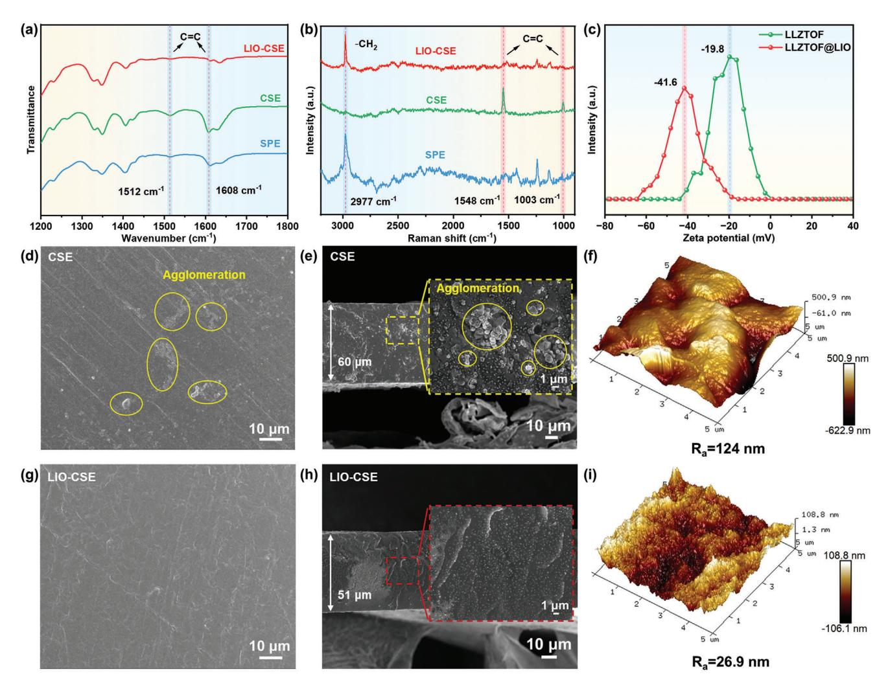
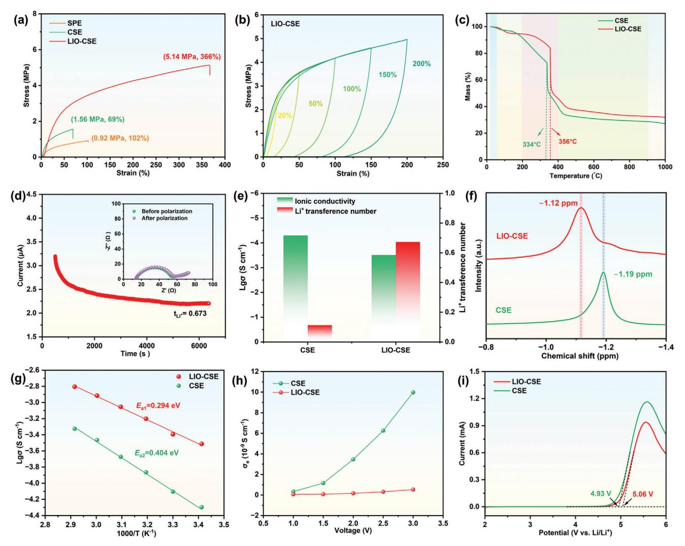
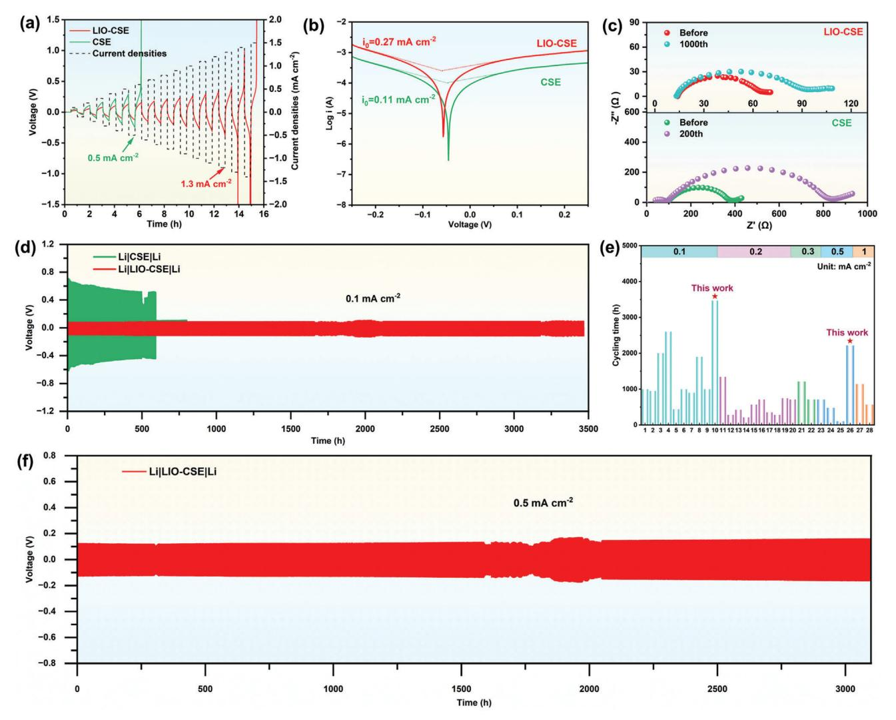
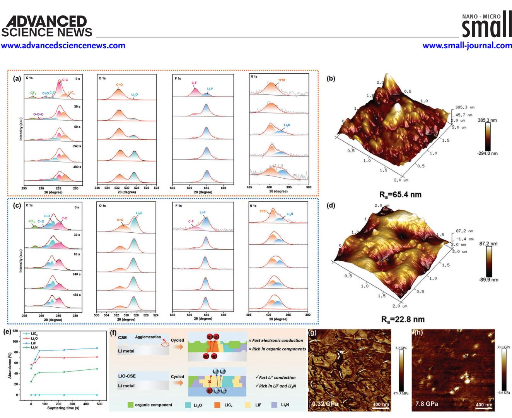
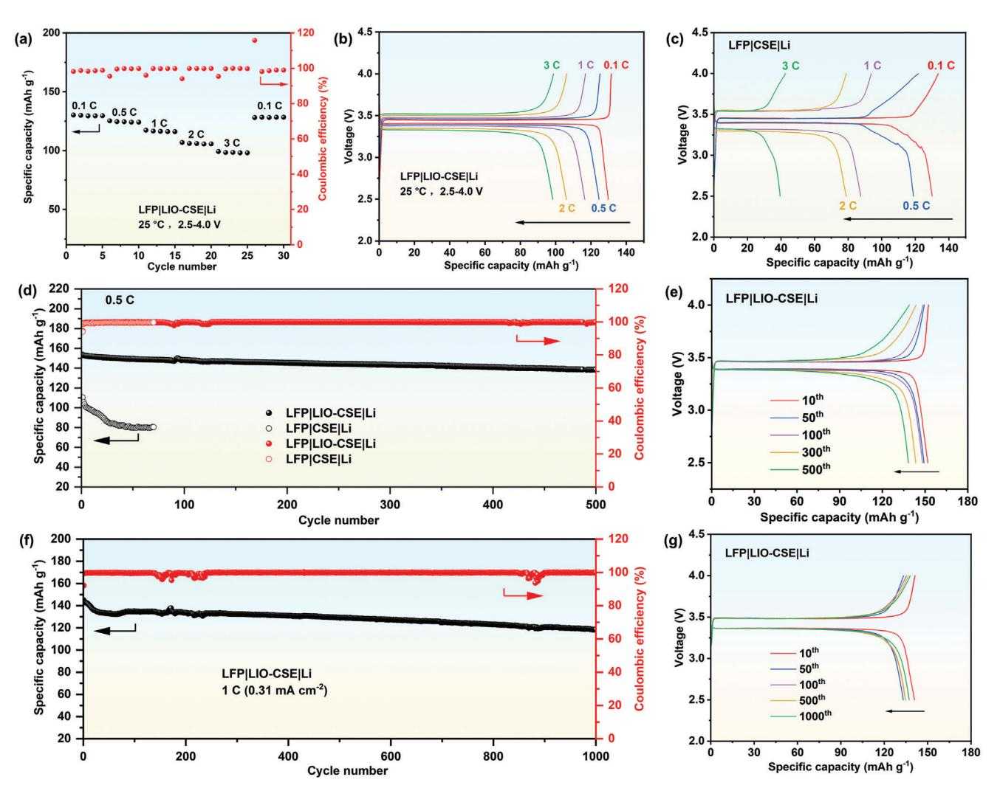

# **Compatible Interfaces Constructed by Surficial Indiumization on Garnet Solid Electrolyte for Long-Cycling All-Solid-State Lithium Metal Battery**

*Xiaoming Zhou, Zejian Ouyang, Jin Liu, Fangyang Liu, Zongliang Zhang, Yanqing Lai, Jie Li, and Liangxing Jiang\**

**Composite solid electrolytes (CSEs) based on poly(vinylidene fluoride)-co-hexafluoropropylene (PVDF-HFP) and Li6.4La3Zr1.4Ta0.6O12 (LLZTO) show great potential in building high energy density all-solid-state lithium metal batteries (ASSBs). Nevertheless, the Li2CO3 passivation layer formed on the LLZTO surface not only induces dehydrofluorination of PVDF-HFP but also blocks Li+ transport at the interfaces of PVDF-HFP/LLZTO and CSE/electrodes. Herein, lithium acetate-assisted surficial indiumization with a thickness of 4 nm is carried out to convert the detrimental Li2CO3 into a stable Li+ conductor of LiInO2 (LIO) on LLZTO. With this modification, high air stability of CSEs is achieved which prevents Li2CO3 regeneration and PVDF-HFP dehydrofluorination effectively. Attributed to the unblocked Li+ transport paths at the LLZTO@LIO/PVDF-HFP (LIO-CSE) interface, high ionic conductivity of 3.1 × 10−4 S cm−1 and the Li+ transference number of 0.673 are attained. The Li2CO3-free LLZTO also contributes to constructing robust solid electrolyte interphase with predominantly inorganic components, which successfully decreases the side reactions and ultimately realizes good compatibility at the LLZTO/polymer and electrolyte/electrode interfaces. The assembled Li|LIO-CSE|Li cells exhibit excellent electrochemical stability for 3100 h at 0.5 mA cm−2. The Li/LIO-CSE/LiFePO4 ASSB delivers high-capacity retention of 81.8% after 1000 cycles at 25 °C. This work provides a promising method toward remarkable interfacial compatibility for ASSBs.**

#### **1. Introduction**

Current commercialized liquid lithium-ion batteries reach ultimate energy density (350 Wh kg−1) and fail to meet the demand for high-energy-density (*>*500 Wh kg−1) electric vehicles.

X. Zhou, Z. Ouyang, J. Liu, F. Liu, Z. Zhang, Y. Lai, J. Li, L. Jiang

School of Metallurgy and Environment

National Energy Metal Resources and New Materials Key Laboratory Hunan Provincial Key Laboratory of Nonferrous Value-added Metallurgy Central South University Changsha 410083, China

E-mail: [lxjiang@csu.edu.cn](mailto:lxjiang@csu.edu.cn)

The ORCID identification number(s) for the author(s) of this article can be found under <https://doi.org/10.1002/smll.202411062>

**DOI: 10.1002/smll.202411062**

The all-solid-state lithium metal battery (ASSB) has higher energy density and safety when a flammable liquid electrolyte is replaced with a solid electrolyte (SE), and a high nickel cathode and lithium metal anode are used.[\[1\]](#page-9-0) Solid electrolytes are mainly categorized into three types: inorganic SEs, solid polymer electrolytes (SPEs), and composite solid electrolytes (CSEs). The garnettype oxide SE is considered to be one of the inorganic SEs with great potential for application owing to the advantages of high room-temperature ionic conductivity and wide electrochemical window.[\[2\]](#page-9-0) However, the rigidity and brittleness of garnet electrolyte pellets and poor interfacial contact with the electrode materials have seriously hindered their practical application.[\[3\]](#page-9-0) Polymer electrolytes are characterized by lightweight, easy processing, and good flexibility to achieve close contact with the electrode material, but lack sufficient ionic conductivity as well as electrochemical stability.[\[4\]](#page-9-0) Compositing inorganic SE with SPEs is an effective solution that combines high mechanical strength and lithium-ion transfer ability of inorganic SEs and SPEs flexibility.[\[5\]](#page-9-0) Among them, CSEs based on poly(vinylidene fluorideco-hexafluoropropylene) (PVDF-HFP) and

Li6.4La3Zr1.4Ta0.6O12 (LLZTO) have been widely investigated for their high ionic conductivity, favorable membrane-forming ability and mechanical strength. Owing to low air stability, LLZTO powder is susceptible to corrosion by moisture and CO2 during preparation and storage, resulting in a drastic Li+/H+ exchange.[\[1\]](#page-9-0) This will generate more Li+-insulating and lithiophobic Li2CO3 contaminants and lithium-deficient phases,[\[6\]](#page-10-0) severely hindering Li+ conduction and greatly reducing the ionic conductivity of CSE. Moreover, the alkaline environment generated by Li2CO3 contaminants on the surface of LLZTO leads to severe electrochemical incompatibility and instability at the LLZTO/PVDF-HFP interface. It will trigger dehydrofluorination of the PVDF chains and generate a large number of free radicals and unsaturated conjugated C═C bonds due to the low oxidation potential of C═C bonds,[\[7\]](#page-10-0) which makes the CSE incompatible with high-voltage cathodes. Meanwhile, the

**Figure 1.** Schematic illustration of surficial indiumization by converting Li2CO3 to LIO on the surface of LLZTOF, inhibiting dehydrofluorination of the PVDF chains and constructing an even SEI layer for high-performance CSE ASSBs.

dehydrofluorination reduces the flexibility of PVDF-HFP and causes obvious solvent (such as N,N-dimethylformamide (DMF), N,N-dimethylacetamide (DMA)) residues in CSE.[\[8\]](#page-10-0) Some studies show that the residual solvents are unstable to lithium metal.[\[9\]](#page-10-0) Therefore, the dehydrofluorination not only damages the thermal stability and mechanical strength of electrolytes but also seriously deteriorates the cycling stability of ASSBs.

Different solutions for the contaminants on the surface of LLZTO were proposed in previous reports. For example, mechanical polishing proposed by Zheng[\[10\]](#page-10-0) and Liang[\[11\]](#page-10-0) et al. induces the formation of a large number of surface defects and is applicable to the treatment of electrolyte pellet surfaces but not powders. In addition, acid or salt solutions (e.g., HCl,[\[12\]](#page-10-0) H3PO4, [\[13\]](#page-10-0) polyphosphoric acid,[\[14\]](#page-10-0) Al(NO3)3+HF,[\[15\]](#page-10-0) etc.) may corrode the crystal structure of electrolytes, further promoting surficial contaminants and lithium-deficient phases. High-temperature heat treatment is the other solution. But it will cause lithium loss and lead to more Li+-insulated lithium-deficient phases and a deterioration of the Li+ conductivity of electrolytes.[\[16\]](#page-10-0) Converting contaminants into lithium-ion conductors is an effective method. Li2CO3 is converted into LiAlO2 at the electrolyte grain boundaries by adding Li3AlF6 during sintering, which effectively improves the resistance of electrolyte pellets to lithium dendrites.[\[17\]](#page-10-0) The LLZTO electrolyte pellet/Li metal interface resistance is reduced to 5.1 Ω cm2 by employing LiPO2F2. [\[18\]](#page-10-0) Besides, the ZrO2 and Li2CO3 co-sintering method is able to eliminate contaminants and lithium-deficient phases from the surface and grain boundaries of the electrolyte pellet and increase the critical current density of LLZTO to 2.1 mA cm−2. [\[19\]](#page-10-0) Unfortunately, these methods are only applicable to the treatment of electrolyte pellets and it is not known whether they are effective for electrolyte powders. This is due to the fact that the specific surface area of the powder is much higher than that of the electrolyte pellets, and the above-mentioned methods of treating the powder are highly reactive, making it difficult to control the reaction time that can easily lead to excessive corrosion of the powder. Although the contaminants are almost removed, the alkaline environment created by the combination of La atoms in LLZTO with N atoms and C═O groups in solvents (e.g., DMF, DMA) still makes dehydrofluorination of LLZTO/PVDF-HFP.[\[20\]](#page-10-0) On the other hand, the solid electrolyte interphase (SEI) is typically enriched in organic components with low ionic conductivity (*<*10−6 S cm−1) and high electronic conductivity (*>*10−7 S cm−1). This leads to inhomogeneous Li+ flux and Li plating/stripping at the electrolyte/Li metal interface that accelerates Li dendrite growth.[\[21\]](#page-10-0) Therefore, three issues must be addressed in order to prevent dehydrofluorination of LLZTO/PVDF-HFP CSE and improve the interfacial compatibility of the LLZTO/PVDF-HFP electrolyte/lithium metal. The first is to eradicate contaminants and lithium-deficient phases from LLZTO and increase its air stability. The second is to isolate LLZTO from direct contact with PVDF-HFP. And the third is to construct an SEI layer richly in inorganic Li+ conductors.

In this work, a lithium acetate-assisted surface indiumization strategy is used to convert the detrimental Li2CO3 layer into a Li+ conductor LiInO2 (LIO) nanolayer on the surface of garnet particles (**Figure 1**). Lithium acetate is designed to compensate for lithium loss, transform the lithium-deficient phase, and prevent corrosion of the crystal structure by the addition of indium nitrate. This LIO nanolayer enables the  $\text{Li}_{6.25}\text{La}_3\text{Zr}_{1.4}\text{Ta}_{0.6}\text{O}_{11.85}$ - $F_{0.15}$  (LLZTOF) surface to exhibit neutrality and isolates LLZTOF from contact with PVDF-HFP that prohibits the dehydrofluorination of PVDF-HFP, resulting in uniform dispersion of LLZTOF (LLZTOF@LIO) in CSE. A fast Li+ conductivity is achieved by constructing rapid Li+ transmission paths in CSE. And, LIO can suppress effectively the side reaction between the CSE/lithium metal interface, and construct a steady SEI layer to realize homogeneous lithium plating/stripping. As a result, a high ionic conductivity of 3.1  $\times$  10-4 S cm-1 is obtained for the CSE, and the lithium-symmetric battery maintains stable lithium plating/stripping for more than 3400 h without short-circuiting. This work provides a new method for improving the air stability of solid electrolytes and realizing high-performance CSE ASSBs.

## 2. Results and Discussions

SCIENCE NEWS www.advancedsciencenews.com

#### 2.1. Physical and Chemical Characterization of LLZTOF@LIO

 $\text{Li}_{6.25}\text{La}_3\text{Zr}_{1.4}\text{Ta}_{0.6}\text{O}_{11.85}\text{F}_{0.15}$  (LLZTOF) electrolyte was prepared according to the method reported in a previous study.[22] In order to investigate the air stability of the LLZTOF powder, it was exposed to humid air (humidity of 60%) for two days and was characterized by a scanning electron microscope (SEM). The LLZTOF is heavily agglomerated before exposure to air, and its surface is rough with a small amount of lithium residue present (Figure S1a–c, Supporting Information). When the powder was exposed in air for two days, the surface roughness increased, and a large number of contaminants Li2CO3 were formed (Figure S1d-f, Supporting Information). Owing to the fact that the amount of excess lithium components is difficult to precisely regulate, some lithium residues still exist on the surface of the LLZTOF powder, which easily forms Li2CO3 contaminants after exposure to air.

**Figure 2a** demonstrates the presence of  $Li2CO3$  on the LLZTOF surface. However, the Li2CO3 diffraction peak of LIOmodified electrolyte powder (LLZTOF@LIO) disappears and the characteristic peak of LIO appears. Raman spectroscopy and Fourier transform infrared spectroscopy (FTIR) were used to characterize the compositional changes of the electrolyte powder. As seen by Raman spectra of LLZTOF (Figure  $2b$ ), the peaks located at 157 and 1091 cm $-1$  are attributed to Li2CO2,[23] and the peaks at 297 and 460 cm-1 are signed to  $La_2Zr_2O_7$  from the lithium-deficient phase.[19] By contrast, the characteristic peaks of Li2CO3 almost disappear from LLZTOF@LIO, and a new characteristic peak at 383 cm-1 is attributed to LIO,[24] proving that  $Li_2CO_3$  is eliminated and LIO is generated. As seen in Figure 2c, this peak at 3566 cm-1 in the FTIR of LLZTOF powder is due to LiOH, and the peaks at 1430 and 863 cm-1 are attributed to Li2CO3. However, no characteristic peaks of these contaminants are detected from LLZTOF@LIO after surficial indiumization, which further proves that the contaminants are basically eliminated.

The XPS spectroscopy was employed to further explore the difference in the chemical composition of the powder surface (Figure 2d). The peak at 289.7 eV in the C 1s spectrum and the  $\frac{1}{2}$ peak at 55 eV in the Li 1s represent  $Li_2CO_3$ . The characteristic peaks of Li2CO3 basically disappear in LLZTOF@LIO, and its peak position shifts to 54 eV in the corresponding Li 1s spectra.

(Figure 2e). In addition, no In 3d signal is detected on the surface of the LLZTOF powder, while the In 3d peak on the surface of LLZTOF@LIO powder is found from LIO (Figure 2f).[25] These results reveal that Li2CO3 on the LLZTOF surface is converted into LIO and thereby eliminated.

The electrolyte surface morphology and elemental distribution were characterized by scanning electron microscopy (SEM) combined with EDS energy spectroscopy as well as transmission electron microscopy (TEM). High-angle annular dark-field transmission electron microscopy (ADF-TEM) images reveal the presence of LLZTOF, Li2CO3, and LIO (Figure 2g,h). The insets in Figure  $2g$ ,h are the high-resolution transmission electron microscopy (HRTEM) images corresponding to the red boxes. The  $(233)$  crystal orientation has a lattice spacing of 2.75 Å and the (024) crystal orientation has a lattice spacing of 2.88 Å, respectively. As shown in Figure S2 (Supporting Information), this rough surface of LLZTOF with a high intensity of the C element mapping indicates the presence of a large number of contaminants. It is further confirmed by the TEM images (Figure 2g). On the contrary, this surface of LLZTOF@LIO becomes smooth, and there exists a uniform and dense nanolayer with a strong In-element mapping signal (Figure S3, Supporting Information). Combined with the results in Figure 2a-c, it is inferred that the surface coating layer is LIO with a thickness of  $\approx$ 4 nm (Figure 2h). The average particle size of the LLZTOF@LIO is 0.651  $\mu$ m, which is slightly larger than LLZTOF's 0.572  $\mu$ m (Figure  $2i$ ).

Attributed to the hydrophobicity of LIO, the erosion of electrolytes by  $H_2O/CO_2$  in air is improved. For air stability testing, both LLZTOF and LLZTOF@LIO electrolytes were exposed to humid air for six weeks (the samples labeled as LLZTOF-aged and LLZTOF@LIO-aged). As shown in Figure 2i, the stronger Li2CO3 diffraction peaks are detected in the XRD pattern of LLZTOF-aged, indicating that more Li2CO3 form when LLZTOF exposed in air. The Raman spectra of LLZTOF-aged at 157 and 1091 cm $-1$  with Li2CO3 characteristic peaks (Figure 2k), as well as the significant enhancement of LiOH characteristic peaks at 3566 cm-1 and  $\text{Li}_2\text{CO}_3$  characteristic peaks at 1430 and 863 cm-1 in the FTIR spectra (Figure 21), show that a large amount of  $Li2CO3$  and LiOH form on the surface of LLZTOF-aged, whereas the chemical compositions on the LLZTOF@LIO-aged surface do not change obviously. In addition, the pH of LLZTO@LIO and LLZTO was tested before and after exposure to humid air. The pH of LLZTO@LIO did not change significantly before and after two weeks of exposure to air. In contrast, LLZTO showed a drastic increase in pH from 11.96 to 13.17 after 1 h of exposure to air (Figure S4, Supporting Information). Undoubtedly, the microscopic and spectroscopic characterization demonstrates that the lithium acetate-assisted surface indiumization strategy is capable of forming a uniform LIO nanolayer on the LLZTOF surface without corroding the electrolyte crystal structure, simultaneously assuring the high air stability of LLZTOF@LIO.

#### 2.2. Dehydrofluorination Inhibition of PVDF-HFP

As shown in **Figure 3a**, dehydrofluorination of the PVDF chains is observed from the presence of two broad absorption peaks at 1512 and 1608  $\text{cm}^{-1}$ , respectively representing C=C and

**Figure 2.** a) XRD patterns, b) Raman spectra, c) FTIR spectra, and XPS spectra of different elements, d) C 1s, e) Li 1s, and f) In 3d of LLZTOF@LIO and LLZTOF. g,h) ADF-TEM images of LLZTOF and LLZTOF@LIO. The inset shows the HRTEM image corresponding to the red box of LLZTOF and LLZTOF@LIO. i) Particle size distribution of LLZTOF@LIO. j) XRD patterns, k) Raman spectra, and l) FTIR spectra of LLZTOF-aged and LLZTOF@LIO-aged.

its cross-linking products in the composite electrolyte prepared by LLZTOF (denoted as CSE).[\[9\]](#page-10-0) A weaker absorption peak at 1608 cm−1 in PVDF-HFP SPE is ascribed to the fact that the solvent DMA causes a slight dehydrofluorination of the PVDF chain. After LIO modification, the Li2CO3 contaminants on the surface of LLZTOF are removed, and a uniform and dense LIO layer is formed in the composite electrolyte prepared by LLZTOF@LIO (denoted as LIO-CSE). This is able to prevent direct interactions between La atoms and the solvent, avoid the electron aggregation around the N atoms in DMA, and ultimately inhibit dehydrofluorination of the PVDF chains. It is further confirmed by Raman spectroscopy (Figure [3b\)](#page-4-0). This disappearance

**Figure 3.** a) FTIR spectra and b) Raman spectra of SPE, CSE, and LIO-CSE. c) Zeta potential of LLZTOF and LLZTOF@LIO. d,g) Top view and e,h) cross-sectional SEM images of CSE and LIO-CSE, respectively. f,i) AFM 3D images of LLZTOF and LLZTOF@LIO, respectively.

of the ─CH2 vibration at 2977 cm−1 and the appearance of the C═C bond vibrations at 1003 and 1548 cm−1 in CSE further reveal this dehydrofluorination.[\[26\]](#page-10-0) Conversely, the above changes do not appear in the Raman spectra of LIO-CSE. Thus, these results demonstrate that LLZTOF@LIO does not change the molecular structure of PVDF, but suppresses the dehydrofluorination of PVDF-HFP.

The zeta potential reflects the magnitude of electrostatic repulsion between neighboring particles. When the absolute value of zeta potential is more than 30 mV, the powder can be uniformly dispersed in the slurry.[\[27\]](#page-10-0) As shown in Figure 3c, LLZTOF@LIO has a higher zeta potential (−41.6 mV) compared to that of LLZTOF (−19.8 mV). This means that the surface of LLZTOF@LIO particles has more negative charges and stronger surface forces. The strong surface forces on the particles facilitate a high dispersion of LLZTOF@LIO in the slurry. Figure 3d,e show the SEM images of the top-view and cross-section of CSE, respectively. A large amount of Li2CO3 is seen on the surface of LLZTOF that induces the dehydrofluorination of PVDF, leading to rapid gelation of the slurry during the preparation process. And, LLZTOF is agglomerated, as seen from an extremely rough surface of the CSE (Figure 3f). When Li2CO3 is removed from the surface of LLZTOF and coated by LIO, it effectively inhibits dehydrofluorination. This process enables LLZTOF@LIO to uniformly disperse in the LIO-CSE (Figure 3g,h), and the surface of LIO-CSE becomes smooth (Figure 3i), which will promote uniform current distribution.

#### **2.3. Electrochemical and Mechanical Characterization of LLZTO@LIO/PVDF-HFP CSE**

The tensile stress–strain and cyclic stress–strain of the composite electrolyte were measured to assess its mechanical properties. As shown in **Figure 4**[a,](#page-5-0) the mechanical strength of the electrolyte is improved by the addition of LLZTOF. However, the C═C bond is observed, indicating PVDF dehydrofluorination. This dehydrofluorination will cause LLZTOF agglomeration and lead to stress concentration and a decrease of the CSE flexibility, in which the maximum elongation of CSE is decreased to 69%. Instead, after suppressing dehydrofluorination, the maximum breaking stress and elongation of LIO-CSE increase to

**Figure 4.** a) Tensile stress-strain curves of SPE, CSE, and LIO-CSE. b) Cyclic tensile stress-strain curves of LIO-CSE at different strains. c) Thermogravimetric diagrams of CSE and LIO-CSE. d) Polarization curves of Li|LIO-CSE|Li cells, the inset shows EIS plots before and after cell polarization. e) The ionic conductivity and Li+ transference number of CSE and LIO-CSE. f) 7Li NMR spectra of CSE and LIO-CSE. g) Arrhenius plots of ionic conductivities at different temperatures for CSE and LIO-CSE. h) Electronic conductivity at different voltages for CSE and LIO-CSE. i) Linear scanning voltammetry curves for CSE and LIO-CSE.

5.14 MPa and 366%, respectively, showing favorable mechanical strength and excellent flexibility. In addition, the decomposition temperature of LIO-CSE increases, demonstrating higher thermal stability than that of CSE (Figure 4c). The hysteresis area of the cyclic tensile stress–strain curves of LIO-CSE under different deformations also increases significantly as the strain increases (Figure 4b), indicating that LIO-CSE has higher elasticity. It enables LIO-CSE to achieve tight interfacial contact with the electrodes to accommodate the volume change of lithium metal.[\[28\]](#page-10-0)

Electrochemical impedance spectroscopy (EIS) was used to measure the ionic conductivity of LIO-CSE with different LLZTOF@LIO contents. The ionic conductivity of LIO-CSE is maximized at LLZTOF@LIO content of 30% (Figure S5a, Supporting Information). Figure S5b (Supporting Information) displays the impedance profiles of CSE and LIO-CSE with the optimal filler content of 30% at 20 °C, and their ionic conductivities are 5.03 × 10−5 cm−1 and 3.1 × 10−4 S cm−1, respectively. This is attributed to the conversion of the lithium-ion insulating Li2CO3 (*<*10−7 S cm−1) on the LLZTOF surface into LIO with a higher ionic conductivity (6.56 × 10−5 S cm−1, Figure S6, Supporting Information). Figure 4d shows that LIO-CSE has a higher Li+ transference number (tLi+ ) of 0.673, which is far higher than that of CSE with the tLi+ of 0.113 (Figure S7, Supporting Information). This suggests that continuous Li+ transport paths at the LLZTOF/PVDF-HFP interface are obtained by converting lithiophobic Li2CO3 into LIO ionic conductors. It promotes a rapid Li+ conduction, leading to the 5.95 and 6.20-fold increase of the tLi+ and ionic conductivity of LIO-CSE over CSE, respectively (Figure 4e).

The 7Li solid nuclear magnetic resonance (NMR) of Figure 4f reveals different Li+ chemical environments around CSE and LIO-CSE, with the chemical shift from  $-1.19$  ppm downfield in CSE to  $-1.12$  ppm in LIO-CSE. This change should be due to the reduced electron density around Li and looser Li–O coordination in LIO-CSE that will improve the dissociation of LiTFSI, and attenuate the [DMA-Li+] interaction.[29] In particular, the weakened interaction facilitates the rapid coupling and decoupling between [DMA-Li+] and  $-CF_{2}$ ,[30] which enhances the Li+ transport capacity of LIO-CSE.

To further investigate the Li+ conduction mechanism in the composite electrolytes, the EIS of CSE and LIO-CSE were tested at different temperatures (Figure S8, Supporting Information). The results show that the activation energy decreases from 0.404 eV for CSE to 0.294 eV for LIO-CSE (Figure  $4g$ ). This decrease is due to  $Li_2CO_2$  inhabiting  $Li^+$  transport at the LLZTOF and PVDF-HFP interfaces, whereas after the elimination of  $Li_2CO_3$ , LIO opens the interfacial transport channels for continuous Li+ transfer.

Electrolytes with high electronic conductivity will provide potential channels for current leakage and exacerbate lithium dendrite formation. The steady-state currents of CSE and LIO-CSE at different voltages were measured by chronoamperometry to evaluate their ability for suppressing lithium dendrites (Figure S9, Supporting Information). The electronic conductivity of CSE increases dramatically with increasing voltage. At a voltage of 3 V, the electronic conductivity is  $\approx 1 \times 10^{-8}$  S cm-1 (Figure 4h). On the contrary, the electronic conductivity of LIO-CSE remains a stable value of  $5.3 \times 10^{-10}$  S cm-1, which reveals that LIO-CSE can prevent lithium dendrite formation. In addition, the electrochemical window increases from 4.93 V for CSE to 5.06 V for LIO-CSE (Figure 4i), proving the good ability of LIO-CSE against high voltage. Hence, the electrolyte modified by LIO has better electrochemical properties, mechanical strength, and thermal stability.

#### 2.4. Interfacial Compatibility Characterization of LIO-CSE/Li

Assembling Li|CSE|Li and Li|LIO-CSE|Li symmetric cells were used to investigate the effect of the surficial indiumization on the interfacial compatibility of CSE and LIO-CSE with lithium metal. In Figure 5a, the critical current density (CCD) increases from 0.5 mA cm-2 for Li|CSE|Li to 1.3 mA cm-2 for Li|LIO-CSE|Li, showing that LIO-CSE regulates lithium deposition at the LIO-CSE/Li interface and inhibits lithium dendrite penetration.[31] Tafel curves were used to study the transport kinetics of lithium ions at the electrolyte/Li metal interface. The surface modification results in an exchange current density ( $i_0$ ) of 0.27 mA cm-2 at the LIO-CSE/Li interface, which is much higher than that of 0.11 mA cm $-2$  for CSE/Li (Figure 5b). Because of this, Li|LIO-CSE|Li maintains stable Li plating/stripping with a low polarization voltage of ≈72 mV under a current density of 0.1 mA cm-2 for more than 3400 h at 25  $\degree$ C (Figure 5d). When the current density is further increased to 0.5 mA cm-2, Li|LIO-CSE|Li retains stable cycling for more than 3100 h (Figure 5f), demonstrating excellent interfacial stability of the cell. It is encouraging to note that the Li plating/stripping of Li|LIO-CSE|Li is much longer than reported in the literature in Figure 5e and Table S1 (Supporting Information). But for Li|CSE|Li, the polarization voltage gradually decreases from the initial 0.705 to 0.507 V during cycling and drastically drops at 591 h with a short circuit (Figure  $5d$ ).

Figure 5c shows the impedance changes of Li|LIO-CSE|Li and Li|CSE|Li before and after cycling for 1000th and 200th, respectively. The interfacial resistance of Li|CSE|Li increases from 142.4  $Ω$  before cycling to 375.8  $Ω$  after cycling, whereas there is no obvious change (the resistance changes from 24.6 to 38.7  $\Omega$ ) in the Li|LIO-CSE|Li impedance. This is due to the poor interfacial compatibility of CSE/Li leading to inhomogeneous deposition of lithium. And a large number of voids formed at the electrolyte/electrode interface further increases the interfacial resistance. High CCD and long-time galvanostatic cycling results demonstrate that the surficial indiumization constructs a stable SEI layer and improves the  $Li^+$  flux and transport kinetics at the interface of LIO-CSE/Li.

The Li+ deposition behavior at the electrolyte/lithium metal interface after 50 cycles of Li|CSE|Li and Li|LIO-CSE|Li cell was analyzed by X-ray photoelectron spectroscopy (XPS) profiling analysis to characterize the chemical composition of the SEI layer. The high-resolution C 1s spectra of Figure 6a reveal the presence of LiCx ( $\approx$ 283.1 eV) in the SEI layer of CSE, which is attributed to the dehydrofluorination of the PVDF chains resulting in agglomerates of LLZTOF on the surface of CSE, also as evidenced by the SEM images of CSE. Numerous bare Li2CO3 on LLZTOF surface are reduced to  $\text{LiC}_r$  by Li metal during the Li plating. On the other hand, these agglomerates cause inhomogeneous electrolyte/Li interfacial contact and Li deposition, leading to the formation of a rough SEI layer (Figure 6b). It is noteworthy that the peak intensity of  $\text{LiC}_x$  increases with the sputtering time. Since  $\text{LiC}_x$  provides a high electronic conductivity (Figure 6f), the growth of lithium dendrites is further accelerated.[17] The peaks located at 292.5 eV in the C 1s spectrum and 683.4 eV in the F 1s spectrum originate from  $-CF_3$  in the TFSI-, and the peak at 685 eV is assigned to LiF. The peak at 397 eV in the N 1s spectrum is assigned to Li3N, both of which are formed by the decomposition of TFSI-.[32] The peak at 528.6 eV in the O 1s spectrum is attributed to  $Li_2O$ . Nevertheless, the  $LiC_x$  peak is not observed in the C 1s spectra of the LIO-CSE attributed to the elimination of  $Li_2CO_3$  from the LLZTOF@LIO surface. The indiumization on the surface of LLZTOF is effective in preventing the formation of the electron conductor of  $\text{LiC}_r$  that avoids electron transports in the SEI layer (Figure 6c). With the suppression of dehydrofluorination, a symmetrical and compact interface of LIO-CSE/Li is constructed, further promoting the reversibility of the plating/stripping process. The peak intensities of LiF in the F 1s spectrum,  $Li_3N$  in the N 1s spectrum, and  $Li2O$  in the O 1s spectrum increase gradually with increasing sputtering time. Meanwhile, the peak intensities of  $Li_2O$ ,  $Li_3N$ , and LiF of LIO-CSE are higher than those of the corresponding peaks of CSE. This indicates that LLZTOF@LIO is more favorable to promote the LiTFSI dissociation and Li2O formation than LLZTOF@Li2CO3.[33] More importantly, the C–F intensity located at 688.1 eV in the F 1s spectrum of Figure 6a decreases abruptly with sputtering growth, indicating that the surface of the SEI layer is enriched with organic components such as C–F. Compared with CSE (Figure S10, Supporting Information), the SEI of LIO-CSE is enriched with inorganic  $Li^+$  conductors such as LiF,  $\text{Li}_2O$ , and  $\text{Li}_3N$ , but does not contain  $\text{LiC}_x$ electron conductors (Figure 6e). This suppression of electronic

**Figure 5.** a) CCD of Li|CSE|Li and Li|LIO-CSE|Li. b) Exchange current density extracted from Tafel curves of Li|CSE|Li and Li|LIO-CSE|Li. c) EIS curves of Li|CSE|Li and Li|LIO-CSE|Li before and after 200th and 1000th cycles, respectively. d) Galvanostatic cycling performance of Li|CSE|Li and Li|LIO-CSE|Li under 0.1 mA cm−2 at 25 °C. e) Comparison graph of galvanostatic cycle times for Li symmetric cells. Details of the references are shown in Table S1 (Supporting Information). f) Galvanostatic cycling performance of Li|LIO-CSE|Li under 0.5 mA cm−2 at 25 °C. (Note: The erratic voltage fluctuations in Figure 5d,f are attributed to thermostat insulation failure.).

conduction and construction of fast Li+ conduction is shown in Figure [6f.](#page-8-0)

The SEIs of LIO-CSE exhibit a high Young's modulus of 7.8 Gpa, which is higher than the threshold reported in previous studies for hindering the growth of lithium dendrites (6 GPa).[\[34\]](#page-10-0) Because the LiF and Li2O SEIs dominated by inorganic components have high Young's modulus and fast Li+ transport, local stress concentration is decentralized, and lithium dendrite penetration can be avoided. On the contrary, for CSE, the average Young's modulus of the organic components (e.g., C–F) dominated SEI layer is only 0.32 Gpa. This is due to the side reaction of the residual solvents with lithium metal. Meanwhile, the weak ionic conduction of the SEI layer and the low Li+ flux at the electrolyte/Li metal interface may lead to the non-uniform deposition of Li and rapid failure of the cell.[\[35\]](#page-10-0) In a word, this surficial indiumization of LLZTOF is not only effective in preventing PVDF dehydrofluorination, but also in building the robust SEI nanolayer dominated by inorganic Li+ conductors and inhibiting interfacial side reactions.

#### **2.5. Electrochemical Performance of ASSBs**

The practicality of LIO-CSE is further explored by assembling ASSBs based on LiFeO4 (LFP) cathode, the composite electrolyte, and lithium metal anode. As expected, good interface compatibility helps LFP|LIO-CSE|Li to achieve excellent rate performance with the discharge-specific capacities of 159.5, 154.2, 146.1, 135.6, and 128.1 mAh g−1 at 0.1 C, 0.5 C, 1 C, 2 C, and 3 C rates, respectively. When the rate returned to 0.1 C, LFP|LIO-CSE|Li maintained a reversible specific capacity of 158.3 mAh g−1 (**Figure 7**[a\)](#page-9-0). On the contrary, LFP|CSE|Li exhibits severe polarization and a

**Figure 6.** a) C 1s, O 1s, F 1s, and N 1s XPS depth profiling spectra of Li metal surface after cycling in the electrolytes of CSE after 50 cycles. b) AFM 3D images of Li metal surface after cycling in the electrolytes of CSE. c) C 1s, O 1s, F 1s, and N 1s XPS depth profiling spectra of Li metal surface after cycling in the electrolytes of LIO-CSE. d) AFM 3D images of Li metal surface after cycling in the electrolytes of LIO-CSE. e) Depth profiling of the absolute intensities of Li3N, LiF, LiC*x,* and Li2O within the Li metal surface after cycling in the electrolytes of LIO-CSE. f) Schematic illustration of the effects of SEI based on CSE and LIO-CSE formation. Average Young's modulus of g) CSE and h) LIO-CSE.

sharp capacity drop with increasing current multiplication. A high voltage polarization of 0.24 V is observed at a rate of 1 C, and a sudden drop is seen in the discharge specific capacity of 87.5 mAh g−1 (Figure [7c\)](#page-9-0). But, LFP|LIO-CSE|Li exhibits a small overpotential of only 0.10 V at a rate of 1 C and flat voltage plateau at different discharge rates (Figure [7b\)](#page-9-0). And, LFP|LIO-CSE|Li releases a capacity of 138.4 mAh g−1 despite stable cycling for 500 cycles at a rate of 0.5 C (Figure [7d\)](#page-9-0) with a high-capacity retention of 90.1% and low overpotential of 0.07 V and average coulombic efficiency of 99.8% (Figure [7e\)](#page-9-0). However, the capacity of LFP|CSE|Li decays to 80 mAh g−1 after 60 cycles at 0.5 C. This is due to the presence of residual solvent DMA destabilizing lithium metal by dehydrofluorination that results in an increase of the interfacial resistance and a decrease of the capacity. At the same time, the growth of lithium dendrites induced by the highly electron-conducting SEI ultimately leads to the rapid short-circuit failure of the battery. Besides, the capacity retention of LFP|LIO-CSE|Li is 81.8% with a low overpotential of 0.12 V after 1000 cycles at a high rate of 1 C (Figure [7f,g\)](#page-9-0). Clearly, the significant improvement in the cycling performance is ascribed to the excellent ion conduction of LIO-CSE and the robust SEI layer.

#### **3. Conclusion**

In conclusion, we proposed lithium acetate-assisted indiumization by converting Li2CO3 into a stable LIO ionic conductor on the LLZTOF surface. Through this process, the composite solid electrolyte shows high air stability, ionic conductivity, and lithiumion transference number. In addition, a strong compatible electrolyte/electrode interface is achieved by inhibiting PVDF dehydrofluorination. Attributed to the elimination of Li2CO3, a LiC*x*free SEI nanolayer dominated by inorganic ionic conductors such as LiF and Li2O was constructed, effectively suppressed lithium dendrite penetration. Based on the above results, the LIO-CSEassembled lithium symmetric cell has a high CCD and is capable of constant-current plating/stripping with high interfacial stability. The LFP|LIO-CSE|Li all-solid-state lithium metal battery exhibits excellent rate performance and is stably cycling at 1 C for 1000 cycles with a capacity retention as high as 81.8%. This work highlights the roles of surficial indiumization on the dehydrofluorination of PVDF and SEI formation and provides a new insight into the construction of compatible interfaces and robust SEIs for ASSBs.

**Figure 7.** a) Rate performance and b) Charge/discharge curves at each rate of LFP|LIO-CSE|Li. c) Charge/discharge curves of LFP|CSE|Li at different rates. d) Cycling performance of LFP|LIO-CSE|Li and LFP|CSE|Li at 0.5 C and e) Charge/discharge curves of LFP|LIO-CSE|Li. f) Cycling performance and g) the charging/discharging curves of LFP|LIO-CSE|Li at 1 C. All tests were carried out at 25 °C.

# **Supporting Information**

Supporting Information is available from the Wiley Online Library or from the author.

# **Acknowledgements**

This work was supported by the Ministry of Science and Technology of China (Grant no. 2022YFC3900804) and the Hunan Provincial Natural Science Foundation (Grant no. 2022JJ10074). XPS measurements were conducted at Shiyanjia Lab [\(www.Shiyanjia.com\)](http://www.Shiyanjia.com). XRD and Raman measurements were conducted at Hunan Navi New Materials Technology.

# **Conflict of Interest**

The authors declare no conflict of interest.

# **Data Availability Statement**

The data that support the findings of this study are available from the corresponding author upon reasonable request.

### **Keywords**

air stability, composite solid electrolyte, dehydrofluoridation, indiumization, solid electrolyte interphase

> Received: November 19, 2024 Revised: January 16, 2025 Published online: February 5, 2025

- [1] M. B. Dixit, B. S. Vishugopi, W. Zaman, P. Kenesei, J.-S. Park, J. Almer, P. P. Mukherjee, K. B. Hatzell, *Nat. Mater.* **2022**, *21*, 1298.
- [2] L. Ye, X. Li, *Nature* **2021**, *593*, 218.
- [3] W. Feng, Y. Zhao, Y. Xia, *Adv. Mater.* **2024**, *36*, 2306111.
- [4] a) X. Dong, A. Mayer, Z. Chen, S. Passerini, D. Bresser, *ACS Energy Lett.* **2024**, *9*, 5279; b) X. Dong, A. Mayer, X. Liu, S. Passerini, D. Bresser, *ACS Energy Lett.* **2023**, *8*, 1114.

- [5] a) H. Liang, L. Wang, A. Wang, Y. Song, Y. Wu, Y. Yang, X. He, *Nano-Micro Lett.* **2023**, *15*, 42; b) C. Yuan, J. Li, P. Han, Y. Lai, Z. Zhang, J. Liu, *J. Power Sources* **2013**, *240*, 653.
- [6] H. Duan, W. P. Chen, M. Fan, W. P. Wang, L. Yu, S. J. Tan, X. Chen, Q. Zhang, S. Xin, L. J. Wan, Y. G. Guo, *Angew. Chem., Int. Ed.* **2020**, *59*, 12069.
- [7] X. Zhang, S. Wang, C. Xue, C. Xin, Y. Lin, Y. Shen, L. Li, C. W. Nan, *Adv. Mater.* **2019**, *31*, 1806082.
- [8] Q. Liu, G. Yang, X. Li, S. Zhang, R. Chen, X. Wang, Y. Gao, Z. Wang, L. Chen, *Energy Storage Mater.* **2022**, *51*, 443.
- [9] K. Yang, L. Chen, J. Ma, C. Lai, Y. Huang, J. Mi, J. Biao, D. Zhang, P. Shi, H. Xia, G. Zhong, F. Kang, Y. B. He, *Angew. Chem., Int. Ed.* **2021**, *60*, 24668.
- [10] H. Zheng, G. Li, R. X. Ouyang, Y. Han, H. Zhu, Y. M. Wu, X. Huang, H. Z. Liu, H. N. Duan, *Adv. Funct. Mater.* **2022**, *32*, 2205778.
- [11] W. J. Ji, B. Luo, Q. Wang, G. H. Yu, Z. H. Liu, Z. W. Zhao, R. R. Zhao, S. B. Wang, X. W. Wang, B. Zhang, J. F. Zhang, F. Hou, J. Liang, *Adv. Energy Mater.* **2023**, *13*, 2300165.
- [12] H. Y. Huo, Y. Chen, N. Zhao, X. T. Lin, J. Luo, X. F. Yang, Y. L. Liu, X. X. Guo, X. L. Sun, *Nano Energy* **2019**, *61*, 119.
- [13] a) N. W. Li, Y. X. Yin, C. P. Yang, Y. G. Guo, *Adv. Mater.* **2016**, *28*, 1853; b) J. Tang, Y. Niu, Y. Zhou, S. Chen, Y. Yang, X. Huang, B. Tian, *ACS Appl. Mater. Interfaces* **2023**, *15*, 5345.
- [14] C. Guo, Y. Shen, P. Mao, K. Liao, M. Du, R. Ran, W. Zhou, Z. Shao, *Adv. Funct. Mater.* **2022**, *33*, 2213443.
- [15] G. Lu, W. Liu, Z. Yang, Y. Wang, W. Zheng, R. Deng, R. Wang, L. Lu, C. Xu, *Adv. Funct. Mater.* **2023**, *33*, 2304407.
- [16] a) C. Wang, H. Xie, W. Ping, J. Dai, G. Feng, Y. Yao, S. He, J. Weaver, H. Wang, K. Gaskell, L. Hu, *Energy Storage Mater.* **2019**, *17*, 234; b) J. F. Wu, B. W. Pu, D. Wang, S. Q. Shi, N. Zhao, X. Guo, X. Guo, *ACS Appl. Mater. Interfaces* **2019**, *11*, 898.
- [17] J. Biao, B. Han, Y. Cao, Q. Li, G. Zhong, J. Ma, L. Chen, K. Yang, J. Mi, Y. Deng, M. Liu, W. Lv, F. Kang, Y. B. He, *Adv. Mater.* **2023**, *35*, 2208951.
- [18] X. R. Yang, S. J. Tang, C. X. Zheng, F. C. Ren, Y. X. Huang, X. J. Fei, W. Yang, S. Y. Pan, Z. L. Gong, Y. Yang, *Adv. Funct. Mater.* **2022**, *33*, 2209120.
- [19] X. Zhou, J. Liu, Z. Ouyang, F. Liu, Z. Zhang, Y. Lai, J. Li, L. Jiang, *Small* **2024**, *20*, 2402086.

- [20] a) X. Yi, Y. Guo, S. Chi, S. Pan, C. Geng, M. Li, Z. Li, W. Lv, S. Wu, Q.-H. Yang, *Adv. Funct. Mater.* **2023**, *33*, 2303574; b) X. Zhang, T. Liu, S. Zhang, X. Huang, B. Xu, Y. Lin, B. Xu, L. Li, C.-W. Nan, Y. Shen, *J. Am. Chem. Soc.* **2017**, *139*, 13779; c) Y. Wang, P. Yuan, X. X. Liu, S. Feng, M. Cao, J. Ding, J. Liu, S. Z. Kure-Chu, T. Hihara, L. Pan, Z. Sun, *Adv. Funct. Mater.* **2024**, *34*, 2405060.
- [21] J. Y. Yoo, T. Y. Kim, D. M. Shin, Y. Kang, M. H. Wu, Y. C. Kang, D. Y. Kim, *Adv. Funct. Mater.* **2023**, *34*, 2308103.
- [22] a) J. Shi, G. Sun, L. Li, Y. Xia, F. Du, X. Liu, H. Hou, X. Hou, B. Zheng, X. Wu, K. Huang, S. Feng, *ACS Energy Lett.* **2022**, *8*, 48; b) X. Ma, Y. Xu, *ACS Appl. Mater. Interfaces* **2022**, *14*, 2939.
- [23] Y. Li, X. Chen, A. Dolocan, Z. Cui, S. Xin, L. Xue, H. Xu, K. Park, J. B. Goodenough, *J. Am. Chem. Soc.* **2018**, *140*, 6448.
- [24] K. Kushida, T. Koba, K. Kuriyama, *J. Appl. Phys.* **2003**, *93*, 2691.
- [25] J. Leng, H. M. Liang, H. Y. Wang, Z. Q. Xiao, S. T. Wang, Z. T. Zhang, Z. L. Tang, *Nano Energy* **2022**, *101*, 107603.
- [26] S. Zhang, J. Shen, X. Qiu, D. Weng, W. Zhu, *J. Power Sources* **2006**, *153*, 234.
- [27] L. Zhu, J. Chen, Y. Wang, W. Feng, Y. Zhu, S. F. H. Lambregts, Y. Wu, C. Yang, E. R. H. van Eck, L. Peng, A. P. M. Kentgens, W. Tang, Y. Xia, *J. Am. Chem. Soc.* **2024**, *146*, 6591.
- [28] H. Huo, Y. Chen, J. Luo, X. Yang, X. Guo, X. Sun, *Adv. Energy Mater.* **2019**, *9*, 1804004.
- [29] C. Wang, H. Liu, Y. Liang, D. Li, X. Zhao, J. Chen, W. Huang, L. Gao, L. Z. Fan, *Adv. Funct. Mater.* **2022**, *33*, 2209828.
- [30] P. Ding, L. Wu, Z. Lin, C. Lou, M. Tang, X. Guo, H. Guo, Y. Wang, H. Yu, *J. Am. Chem. Soc.* **2023**, *145*, 1548.
- [31] B. Yang, C. Deng, N. Chen, F. Zhang, K. Hu, B. Gui, L. Zhao, F. Wu, R. Chen, *Adv. Mater.* **2024**, *36*, 2403078.
- [32] a) H. Zhang, J. Deng, H. Xu, H. Xu, Z. Xiao, F. Fei, W. Peng, L. Xu, Y. Cheng, Q. Liu, G. H. Hu, L. Mai, *Adv. Mater.* **2024**, *36*, 2403848; b) N. Wang, M. Jia, Z. Bi, X. Guo, *Adv. Funct. Mater.* **2024**, *34*, 2401400; c) Y. Yuan, X. Liu, X. Dong, Y. Kong, H. Liu, Y. Ma, H. Lu, *ACS Appl. Mater. Interfaces* **2024**, *16*, 59547.
- [33] Z. Hao, D. Liu, X. Zuo, H. Yu, Y. Zhang, *Adv. Mater.* **2024**, *36*, 2404983.
- [34] M. D. Tikekar, L. A. Archer, D. Koch, *Sci. Adv.* **2016**, *2*, 1600320.
- [35] a) K. Cui, T. Wang, Q. Zhang, H. Zhang, *Small* **2024**, *21*, 2409866; b) S. Shi, P. Lu, Z. Liu, Y. Qi, L. G. Hector, H. Li, S. J. Harris, *J. Am. Chem. Soc.* **2012**, *134*, 15476.