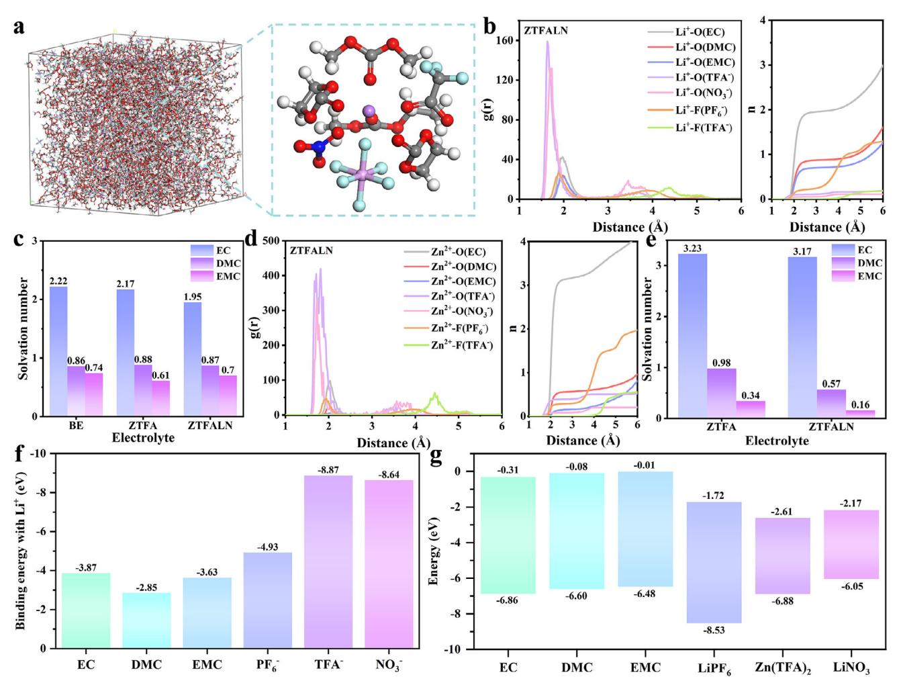
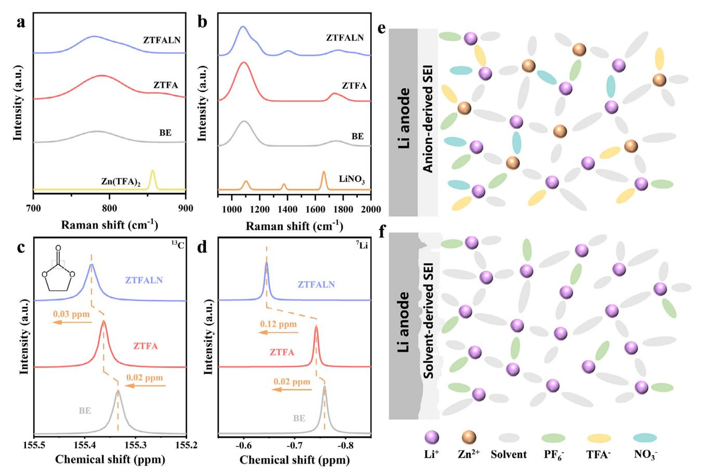
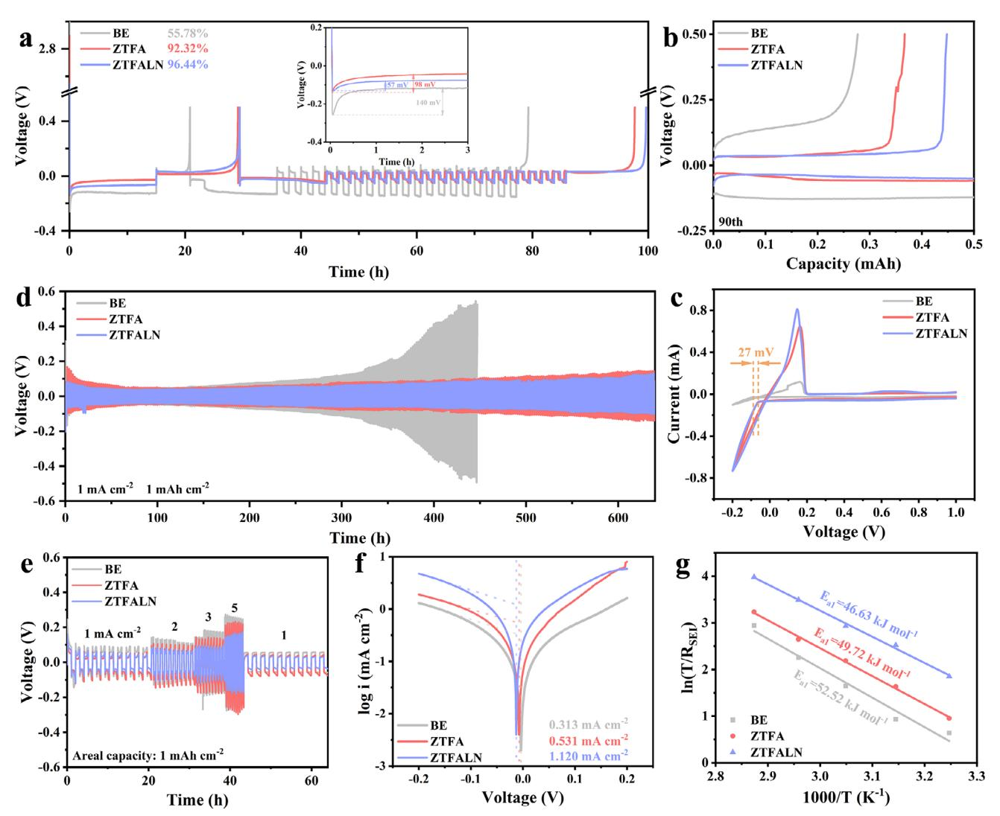
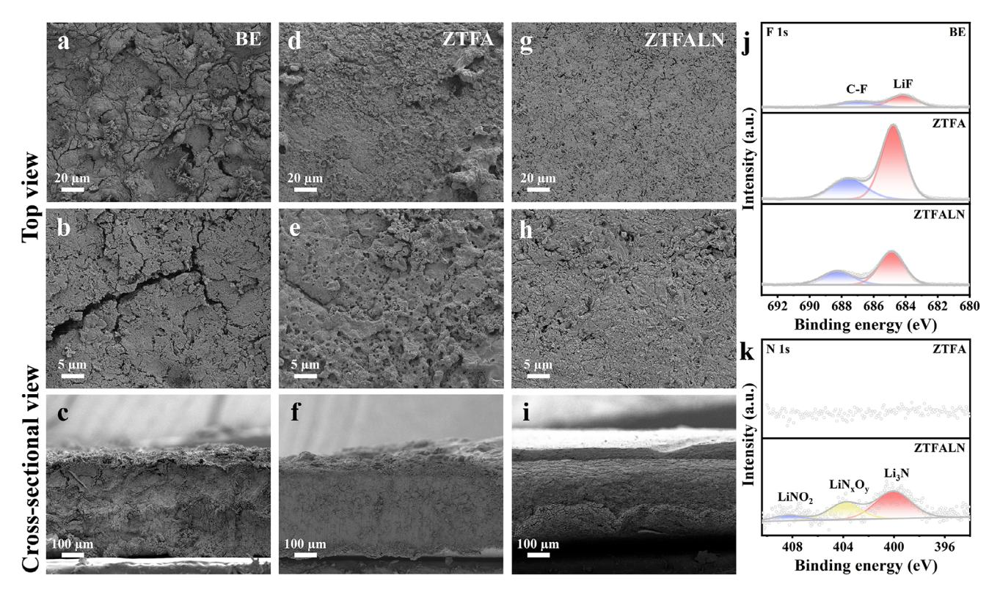
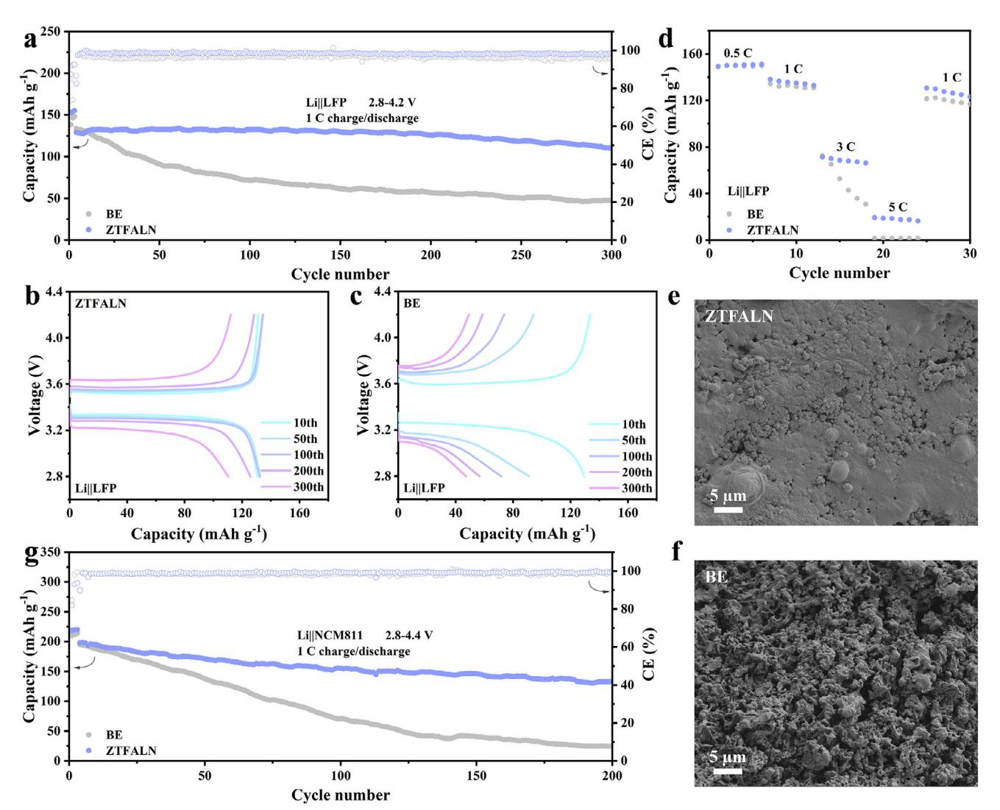

# **Customized Solvation Structures for Long-Term Stable Lithium Metal Batteries**

*Yanlin Zhang, Hongting Yin, Shun Yao, Siyu Li, Keqi Zhou, and Ruiping Liu\**

**Lithium metal batteries (LMBs) suffer from severe lithium dendrite growth and side reactions in conventional carbonate electrolytes, which are characterized by low coulombic efficiency and poor cycling stability, and electrolyte engineering is an effective method for increasing the reversibility of lithium anodes. Herein, the solubility of lithium nitrate (LiNO3), which is almost insoluble in carbonate electrolyte, is improved by adding zinc trifluoroacetate (Zn(TFA)2), and a competitive solvation structure is constructed, forming an anion-enriched Li+ solvation structure, which is conducive to the formation of stable SEI and effectively inhibits adverse side reactions. The lithium metal anode exhibits uniform lithium deposition and extended cycle life, with high reversibility over plating/stripping for 640 h. Furthermore, the Li||LFP full cell with the upgraded carbonate electrolyte can operate steadily for over 300 cycles at 1 C, and the compatibility of the lithium anode with the high-voltage NCM811 cathode are also significantly improved. This work provides a feasible strategy for dependable interfacial chemistry of lithium metal anodes.**

#### **1. Introduction**

Lithium metal batteries (LMBs) are considered to be the most promising next-generation high-energy-density batteries due to the highest theoretical specific capacity (3860 mAh g−1) and the lowest electrochemical potential (−3.04 V vs SHE, the standard hydrogen electrode) of lithium metal.[\[1–3\]](#page-7-0) However, severe dendrites and the irreversibility of lithium metal anodes originated from the intrinsic properties of Li metal have hampered advanced LMBs.[\[1,4\]](#page-7-0) Lithium metal will react with electrolyte and form a unstable solid electrolyte layer (SEI), which is easily destroyed during cycling, exposing the fresh Li inside and causing numerous side reactions that eventually decrease the performance of LMBs.[\[5,6\]](#page-7-0) The continuous growth and development of lithium dendrites, particularly in batteries that use conventional carbonate electrolytes, can progressively pierce the separator, causing dangerous short circuits and safety concerns.[\[7\]](#page-7-0) Electrolyte

The ORCID identification number(s) for the author(s) of this article can be found under <https://doi.org/10.1002/smll.202412398>

**DOI: 10.1002/smll.202412398**

engineering is a viable technique to guide the homogeneous deposition of Li and achieve practical LMBs.[\[2,8,9\]](#page-7-0)

In electrolyte, the Li+ solvation structure is formed by the strong interaction and competitive coordination between solvents and anions with Li+. [\[10,11\]](#page-7-0) Then lithium ions migrate to the surface of anode along with the solvated sheath, where the solvents and anions are subsequently desolvated and preferentially decomposed to create SEI.[\[12\]](#page-7-0) Additive engineering of electrolytes has been proven to be a simple and cost-effective strategy to enhance the performance of LMBs.[\[13,14\]](#page-7-0) Electrolyte additives can be mainly divided into reactive and non-reactive additives, among which reactive additives can participate in the formation of SEI, and the solvation structure and SEI composition can be controlled.[\[15–18\]](#page-7-0) The cycle life of LMB can be significantly increased by anion-derived SEI that

effectively protects the lithium metal anode.[\[19,20\]](#page-8-0) However, the solvent-dominated Li+ solvation structure is typically formed in carbonate electrolyte due to the large permittivity of solvent, resulting the difficulty for anions to enter the primary solvation sheath.[\[13,21\]](#page-7-0) Lithium nitrate (LiNO3) has been widely reported as an ether electrolyte additive, which can improve the conductivity of lithium ions in SEI and promote the uniform deposition of lithium.[\[22–24\]](#page-8-0) Unfortunately, the poor solubility of lithium nitrate in most carbonates weakens the functionality.[\[25–27\]](#page-8-0) Numerous work have been done to increase the solubility of LiNO3 in carbonate electrolytes by adding additives with strong Lewis acidity,[\[28\]](#page-8-0) using multivalent linear esters,[\[29\]](#page-8-0) or introducing deep eutectic solvents,[\[30\]](#page-8-0) however, there are still a large number of solvents involved in the Li+ solvation structure and will be reduced to form unstable organic-rich SEI.

In this work, zinc trifluoroacetate (Zn(TFA)2) was applied as an effective additive to improve the solubility of LiNO3 in the carbonate electrolyte. In addition to forming a competition relationship of solvent with Li+, the multivalent Zn2+ ion has a stronger ability to bind with the solvents, optimizing solvation structure of Li+ and improving the reduction of anions on the surface of lithium anode. At the same time, the strong electrostatic interaction between anions and Li+ ions also encourages the entry of more NO3 −, TFA−, and PF6 − anions into the primary solvation sheath and reduces the coordination of solvent molecules, contributing to the formation of inorganic rich SEI (LiF and Li3N) with high ionic conductivity.[\[2,25\]](#page-7-0) The strong and stable

Y. Zhang, H. Yin, S. Yao, S. Li, K. Zhou, R. Liu School of Chemical & Environmental Engineering China University of Mining & Technology (Beijing) Beijing 100083, P. R. China E-mail: [201402@cumtb.edu.cn](mailto:201402@cumtb.edu.cn)

anion-derived SEI effectively promotes uniform lithium deposition and suppresses adverse reactions. Therefore, the lithium symmetric cell with the electrolyte containing  $Zn(TFA)$ , and  $LiNO3$  can be stably cycled for 640 h with low polarization at 1 mA  $\text{cm}^{-2}$  and 1 mAh  $\text{cm}^{-2}$ , and the Li||LFP full cell achieves a high capacity retention rate of 85.36% after 300 cycles. This work provides a feasible strategy for dependable interfacial chemistry of lithium metal anodes.

#### 2. Results and Discussion

The precipitation appears at the bottom of the solution due to the low solubility of LiNO3 in the carbonate electrolyte when 0.1 M LiNO3 is introduced to the baseline electrolyte, 1 M LiPF6 in EC/DMC/EMC (1:1:1 in vol., denoted as BE) (Figure  $S1$ , Supporting Information). In contrast, it yields a clear solution after adding 0.1 M LiNO3 and 0.05 M  $Zn(TFA)$ 2 to the same electrolyte (denoted as ZTFALN), which can be attributed to the solubilization of LiNO3 by Zn(TFA)2. Additionally, 0.05  $\mu$  Zn(TFA)2 was added to BE (referred to as ZTFA) as a control. XPS analysis is performed on the lithium foils before cycling after the addition of ZTFA and ZTFALN electrolytes (Figure S2, Supporting Information). XPS analysis is performed on the lithium foils before cycling after the addition of ZTFA and ZTFALN electrolytes (Figure S2, Supporting Information). The Zn 2p spectra reveals the peaks of Zn element and  $\text{Li}_{v}$ Znv alloy, suggesting that Zn(TFA)2 in electrolyte can react with the Li spontaneously.

$$2\text{Li} + \text{Zn (TFA)}_2 \rightarrow \text{Zn} + 2\text{LiTFA} \tag{1}$$

$$Zn + Li \rightarrow Li_x Zn_v$$
 (2)

The formation of  $Li_xZn_y$  alloys increases the lithiophilic sites on the surface of anode, which can significantly reduce the nucleation barrier of Li, accelerating the reaction kinetics of  $\quad \ \ \text{interface.}^{[31,32]}$ 

Density functional theory (DFT) calculations and molecular dynamics (MD) simulations were used to examine the effect of the modified electrolyte on the solvation structure of Li+ (**Figure 1a,b**). According to the radial distribution function (RDF), the peaks of Li+-O (TFA-) and Li+-O (NO3-) locate at  $\approx$ 1.65 and  $1.71$  Å, respectively, and the intensities are significantly higher than that of the Li+-solvent molecules, suggesting that TFA- and  $NO_3$ - anions enter the first solvated sheath. In particular, the first solvated sheath of Li+ is primarily filled by 1.95 EC, 0.87 DMC, 0.70 EMC solvent, 0.24 PF $_6$ -, 0.11 TFA-, and 0.05 NO $_3$ - anions on average. The coordination number (n) of EC drops dramatically from 2.22 in BE to 1.95 in ZTFALN due to the entry of TFA $^$ and  $NO_3^-$  into the Li+ solvation structure (Figure 1c; Figure S3, Supporting Information). Additionally, the introduction of TFA- anions in ZTFA decreases the quantity of EC in the Li+ solvation structure significantly, which reduces the consumption of solvent molecules, leading more anions reducted at anode and forming stable SEI during cycling (Figure S4, Supporting Information). The  $Zn^{2+}$  solvation structure is also encouraged to form by the addition of  $Zn(TFA)$ , which competes with Li+ for solvents. The  $Zn^{2+}$  solvated sheath is composed of more solvent molecules than the Li+ solvation structure, indicating by the RDFs and coordination numbers of  $Zn^{2+}$  in ZTFALN and ZTFA (Figure 1d;

Figure S5, Supporting Information). Due to the larger radius of  $Zn^{2+}$  than Li+, as well as a larger binding energy between  $Zn^{2+}$ and solvent molecules, it can coordinate with more solvents to form  $Zn^{2+}$  solvation structures (Figure 1e). The decrease of free solvent molecules suggests that more  $PF_6^-$ , TFA-, and  $NO_3^-$  anions can participate in the formation of Li+ solvation structure. Despite the fact that the solvent molecules are mainly engaged in the first solvation sheath, more anions enter into the  $Li^+$  solvation structure in ZTFA and ZTFALN compared with BE, which is conducive to the formation of anion-derived inorganic compound rich SEI on the surface of the lithium metal anode during cycling.

Subsequently, the formation mechanism and physicochemical property of the SEI were examined. The binding energies of Li+ with different solvents and anions are displayed in Figure 1f, where the TFA $-$  and NO3 $-$  anions have the highest binding energies with Li+, and as a result, a stronger propensity to coordinate with Li+ in the electrolyte will be obtained, which is in accordance with the RDF results. The frontier molecular orbital energy levels of different solvent molecules and lithium salts in the ZTFALN electrolyte are shown in Figure 1g.  $Zn(TFA)$ 2 and LiNO3 together occupy the relatively high HOMO (highest occupied molecular orbital) energy level and the lowest LUMO (lowest unoccupied molecular orbital) energy level, suggesting that TFA- and NO3- anions are more likely to undergo redox decomposition preferentially before other components, leading to the formation of robust anion-derived inorganic SEI

Raman spectra were used to investigate the effects of LiNO3 and  $Zn(TFA)$ 2 on electrolytes. Raman spectra display various characteristic vibration bands in the range of 600–2000  $\text{cm}^{-1}$ , and it is worth noting that there are no vibration bands of  $Zn(TFA)$ , or LiNO3 in ZTFA and ZTFALN, indicating that they are completely dissolved in the electrolyte. The Raman peaks of ZT-FALN and ZTFA around at 817 and 866 cm-1 can be assigned to TFA- (Figure 2a), and ZTFALN shows three new peaks at 1176, 1404, and 1886  $\text{cm}^{-1}$ , which can be attributed to the asymmetric stretching vibration of  $NO_3^-$  (Figure 2b). Though the solvent peaks of ZTFALN are not considerably reduced and numerous solvent molecules are still present in the solvated sheath, the anions successfully entered the solvation structure of Li+ ions, which reduce preferentially at the anode compared to the solvent. Furthermore, nuclear magnetic resonance spectroscopy (NMR) verified the unique solvation effect of the modified electrolyte after the introduction of  $Zn(TFA)$ 2 and LiNO3. A slight downfield shift in the peak of carbon from carbonyl group of the EC molecule in ZTFALN is evident from  ${}^{13}$ C NMR, as seen in Figure  $2c$ , which suggests a decrease in the interaction between EC and Li+, indicating that the anions displace some of the EC molecules as well as  $Zn^{2+}$  ion also competes for more EC, resulting in the decrease of electron cloud density around the carbon of carbonyl group (Figure S6, Supporting Information). Concurrently, the migration of ZTFALN to the direction of high chemical shift in 7Li NMR is led by the increased interaction between TFA-, NO3-, and PF6- anions with Li+ ion, favoring the formation of anion-derived SEI, which is consistent with the results of MD simulations (Figure 2d). Compared to ZTFA and BE electrolytes, the 17O peaks of ZTFALN exhibit a downshift, suggesting a lower electron cloud density on the O of solvent molecules

**Figure 1.** a) The snapshot of the cell in steady state and schematic diagram of Li+ solvation structure in ZTFALN electrolyte. b) RDFs and coordination numbers of Li+ in ZTFALN and c) the solvation numbers of Li+ solvation structure based on MD simulation in different electrolytes. d) RDFs and coordination numbers of Zn2+ in ZTFALN and e) the solvation numbers of Zn2+ solvation structure based on MD simulation in different electrolytes. f) The binding energy of Li+ with solvents or anions. g) The frontier orbital energy levels of various components of the electrolytes.

and further proving the decreased interaction between Li+ and solvents (Figure S7, Supporting Information).

The solvation structures in the ZTFALN and BE electrolytes are depicted based on the aforementioned results (Figure [2e,f\)](#page-3-0). During the lithium deposition process, the Zn2+ ions in the bulk ZTFALN electrolyte play a major role in the competition of solvent molecules. The trace amounts of divalent Zn2+ ions near the electrode/electrolyte interface will not be reduced on the anode surface due to the higher reduction potential (−0.76 V vs SHE),[\[33\]](#page-8-0) and the strong electrostatic interaction with the anions pushes the organic solvent away from the interface, thus the anions involved in the solvation structure of Zn2+ are more likely to be carried by zinc ions to the surface of the negative electrode to achieve a stable interface.[\[34\]](#page-8-0) At the same time, the solvated Li+ ions go through the desolvation process, where the substances in the primary solvation sheath are critical to achieve a stable SEI layer.[\[35\]](#page-8-0) Therefore, the preferentially decomposed NO3 −, TFA−, and PF6 − anions form the LiF/Li3N-rich inorganic SEI on the surface of lithium metal, which improves electrochemical stability and Li+ ion transport kinetics. In contrast, a lot of solvent molecules present in the solvation structure of Li+ ion in BE, creating a organic-rich SEI that is unstable with a low ionic conductivity, results in the growth of lithium dendrites and continuous detrimental side reactions.

To investigate the stability and reversibility of lithium anodes in the electrolytes, Li||Cu half cells were assessed to evaluate the behavior of lithium plating/stripping. By using the Aurbach method, the reversibility of lithium plating/stripping in various electrolytes was assessed (**Figure 3**[a\)](#page-4-0). The cells with ZTFALN have a high coulombic efficiency (CE) of 96.44%, which is significantly higher than that of ZTFA (92.32%) and BE (55.78%). It suggests that the ZTFALN electrolyte can increase the utilization of lithium metal and facilitate the stability during lithium plating/stripping. With the addition of LiNO3 and Zn(TFA)2, the nucleation overpotential of lithium drops dramatically from 140 to 57 mV. The lower starting potential indicates that the ZTFALN electrolyte can effectively control Li deposition at a lower barrier, demonstrating faster reaction kinetics. Meanwhile, the average

**Figure 2.** a,b) Raman spectra of different electrolytes and additives. NMR spectra of c) 13C and d) 7Li in different electrolytes. Schematic illustration of SEI formed on the surface of the lithium metal anode in e) ZTFALN and f) BE electrolytes.

CE of Li||Cu half cell is displayed in Figure S8 (Supporting Information) at the current density of 1 mA cm−2, with a cut-off voltage of 0.5 V. It is notably that the average CE of 88.0% in ZTFALN is obtained after 180 cycles, revealing the remarkable reversibility and stability of the lithium anode. For comparison, the cells using ZTFA show lower and fluctuating CE, with a sudden drop in CE after 120 cycles. After 70 cycles, the CE of the cell with BE likewise suddenly decreases, only displaying a lower average CE of 71.7%. It is believed that Zn(TFA)2 can be used to enhance the electrode– electrolyte interface, and the solubilization of LiNO3 can form a robust anion-derived SEI on the surface of the anode during cycling, which improves the kinetics of interfacial transport. The corresponding voltage-capacity curves of Li||Cu cells demonstrate that the capacity decay and polarization of ZTFALN within 100 cycles are significantly smaller than those of ZTFA and BE, which confirms the high compatibility between the ZTFALN electrolyte and lithium metal anode (Figure [3b;](#page-4-0) Figure S9, Supporting Information). As evidenced by cyclic voltammetry (CV) curves, the half cell with ZTFALN shows higher lithium plating/stripping capacity and lower overpotential in comparison to BE, indicating the better reversibility of the lithium anode with ZTFALN (Figure [3c\)](#page-4-0).

Li||Li symmetric cells were assembled to further analyze the enhanced stability of lithium plating/stripping. Symmetric cell with BE electrolyte experiences a dramatic increase in polarization voltage only after 350 h at a current density of 1 mA cm−2 and a capacity of 1 mAh cm−2, which is followed by cell failure (Figure [3d\)](#page-4-0). In contrast, the symmetric cell with ZTFA can operate steadily for 640 h with the addition of Zn(TFA)2. The symmetric cell with ZTFALN, which further constructs a stable inorganic-rich SEI, confirms the excellent reversibility and an accelerated reaction kinetics of lithium plating/stripping, showing a stable cycling capability over 640 h with the lowest overpotential. The cells were tested at a high current density of 3 mA cm−2 to further assess the performance under extreme conditions. At the capacity of 1 mAh cm−2, the symmetric cell with ZTFALN electrolyte can stabilize for 170 cycles, maintaining the lowest polarization and cycling stably even when the capacity is increased to 3 mAh cm−2 (Figure S10, Supporting Information). Moreover the symmetric cell with ZTFALN remains stable when the capacity is fixed at 1 mAh cm−2 and the current density is progressively raised from 1 mA cm−2 to 5 mA cm−2 and then back to 1 mA cm−2, while ZTFA and BE show asymmetry and higher polarization voltages (Figure [3e\)](#page-4-0).

Lower overpotential and faster kinetics of lithium plating/stripping of the cell with ZTFALN was further supported by the Tafel plot (Figure [3f\)](#page-4-0). The exchange current density (*i*0) is correlated with the rate of charge transfer reaction at the interface.

**Figure 3.** a) The average CE tested by using the Aurbach method and b) charge–discharge curves of Li||Cu half cells in different electrolytes at a current density of 1 mA cm−2 with a cut-off voltage of 0.5 V. c) The CV curves of Li||Cu half cells at the voltage from 1.0 to −0.2 V. Cycling performance of Li||Li symmetric cells in different electrolytes at d) a current density of 1 mA cm−2, e) a current density varying from 1 to 5 mA cm−2, with a fixed capacity of 1 mAh cm−2. f) The Tafel plots and g) activation energies of different electrolytes.

The *i*0 of ZTFALN (1.120 mA cm−2) is more than three times larger than that of BE (0.313 mA cm−2), which is attributed to the reduction of LiNO3 on the surface of the anode and formation of SEI with high conductivity of Li ions. To study the significant variations in cycling stability among the different electrolytes, electrochemical impedance spectroscopy (EIS) was performed before and after 10 cycles of the symmetric cells (Figure S11, Supporting Information). The impedance of the cell with ZTFALN is the lowest both before and after cycling, reflecting the formation of SEI with excellent ionic conductivity. For symmetric cells with ZTFA and BE, the unstable SEI, which raises the diffusion barrier of Li ions and causes detrimental side reactions continually, results in a slower reaction kinetics. Furthermore, the activation energy for Li+ transport through the SEI layer of symmetric cell with ZTFALN is determined to be 42.98 kJ mol−1, based on the impedance values measured at temperatures ranging from 298 to 323 K, whereas the cells with ZTFA and BE show higher activation energies of 49.72 and 52.52 kJ mol−1, respectively (Figure 3g; Figure S12 and Table S2, Supporting Information). Therefore, the ZTFALN electrolyte can realize outstanding SEI performance and fast lithium migration.

The deposition morphology of lithium is essential for enhancing the reversibility of LMBs, so the effects of various electrolytes on the deposition morphology of Li on Cu and symmetric cells before and after cycling were investigated using scanning electron microscopy (SEM). Figure S13 (Supporting Information) displays the surface morphology of Li deposited on Cu in ZT-FALN, ZTFA and BE with a capacity of 1 mAh cm−2 at a current density of 1 mA cm−2. The sparse deposition and dendrite Li in BE and loose lithium deposition morphology in ZTFA can be observed, both with a large number of tiny cracks on the surface, which is consistent with the fast declining coulombic efficiency and poor reversibility during cycling of half cells. In contrast, a dense and flat bulk lithium is yielded in ZTFALN. After

**Figure 4.** SEM images show the morphology of top and cross-sectional view of lithium metal after 10 cycles in a–c) BE, d–f) ZTFA, and g–i) ZTFALN electrolytes at 1 mA cm-2 and 1 mAh cm-2. XPS spectra of j) N 1s and k) F 1s of lithium metal anodes after 10 cycles in different electrolytes.

10 cycles at a current density of 1 mA  $\text{cm}^{-2}$  and a capacity of 1 mAh cm $-2$ , the symmetric cells were disassembled, and the top and cross-sectional SEM images of the lithium foils were examined. Large fissures, numerous dendrites and dead lithium are evident on the loose and uneven surface of lithium in BE, as shown in **Figure 4a,b**, which suggests that the initial unstable electrode–electrolyte interface is insufficient to protect the lithium metal anode. The surface of lithium metal in ZTFA also exhibits an uneven lithium deposition with a large number of holes, which suggests that adverse side reactions occur at the interface (Figure  $4d_e$ ). In stark contrast, it maintains a dense and uniform surface of the lithium in ZTFALN after cycling and the formation of lithium dendrites is effectively suppressed, demonstrating the improved performance of lithium plating/stripping behavior (Figure 4g,h). While a significant volume change takes place, and loose surface of deposited lithium is visible in BE, the cross-sectional SEM images also clearly display the minimal volume change of lithium in ZTFALN, exhibiting an outstanding reversibility and structural stability (Figure  $4c,f,i$ ). According to the energy dispersive spectroscopy (EDS) in Figures S14–S16 (Supporting Information), all the elements of lithium anode cycled in ZTFALN are consistently distributed, whereas ZTFA and BE display a partially uneven elemental distribution.

By using X-ray photoelectron spectroscopy (XPS), the composition of SEI after 10 cycles in BE, ZTFA, and ZTFALN electrolytes were determined. The SEI on lithium metal in BE is primarily composed of organic compounds and a small amount of inorganic compounds, which are derived from the reduction of solvents and  $PF_6^-$  anions, according to the C 1s and O 1s

spectra (Figure **S17**, Supporting Information). With the addition of  $Zn(TFA)$ , that has lower LUMO energy level, the LiF signal of SEI on the surface of lithium metal in ZTFA is greatly increased, which has been considered advantageous for accelerating the interfacial diffusion of Li (Figure 4j). The significantly increased content of LiF compared to BE also demonstrated that  $TFA^-$  enters the primary solvation structure of lithium ions and decomposes at the interface,[36] which encourages the formation of inorganic-rich SEI, improving the interface of electrode/electrolyte and achieving uniform lithium deposition. The F 1s spectrum of ZTFALN shows that the content of LiF in SEI is significantly higher than that of BE but lower than that of ZTFA. It is due to the higher binding energy of  $LiNO_3$  with  $Li^+$ , where  $NO_3^-$  ions occupy parts of the solvents and  $PF_6^-$  anions, participating in the solvation structure of  $Li^+$ , and fewer  $PF_6^-$  ions are reduced, which leads to the comparative decrease of fluoride signal in SEI. At the same time, due to the low LUMO energy level of  $LiNO3$ , it is preferentially reduced to various nitrogen-containing inorganic compounds during charging and discharging, such as  $\text{Li}_3\text{N}, \text{LiN}_x\text{O}_y$ , and  $\text{LiNO}_2$ , which have been demonstrated to be effective in enhancing the conductivity of SEI and accelerating the  $Li^+$  interfacial diffusion (Figure 4k). The heterogeneous SEI of LiF and  $Li_3N$  synergistically increases the mechanical strength of the interface and achieves stable lithium plating/stripping.[37,38] The signals of Zn and  $Li_vZn_v$  are also detected in Zn 2p spectrum of ZTFALN,[39] suggesting that Zn metal is present on the surface of lithium anode and forms an alloy with lithium spontaneously. The intensities of the peaks of  $Z_n$  and  $Li_vZ_n$ , alloy do not, however, change significantly from the XPS spectra of Zn 2p before

www.small-journal.com

**Figure 5.** The a) cycling performance at 1 C and b,c) corresponding charge/discharge curves of Li||LFP full cells in ZTFALN and BE electrolytes. d) Rate performance of Li||LFP full cells in ZTFALN and BE electrolytes. The morphology of lithium metal anodes of Li||LFP full cells in e) ZTFALN and f) BE after 300 cycles. g) The cycling performance at 1 C of Li||NCM811 full cells in ZTFALN and BE electrolytes.

cycling, which further suggests that there is essentially little Zn2+ ions deposition during cycling. The highly lithiophilic interface significantly lowers the nucleation barrier and further accelerates the transport kinetics of lithium (Figure S18, Supporting Information). The formation of inorganic-rich SEI in ZTFALN with the high transport capability of Li ions and mechanical property can effectively control the deposition morphology of lithium and prevent dendrites from piercing the interface, which are beneficial for exceptional electrochemical performance of LMBs.

In order to evaluate the practical feasibility of the ZTFALN electrolyte, full cells were assembled by pairing cathodes and lithium metal anodes. The full cells with both LFP and NCM811 in ZTFA electrolyte show excessively extended charging times during the first cycle of activation, exhibiting significant overcharging (Figure S19, Supporting Information). According to the LSV curves, the ZTFA electrolyte exhibits an oxidation peak at ≈4.0–4.3 V, which corresponds to the decomposition of TFA− due to the lower LUMO energy level of Zn(TFA)2 than LiNO3 (Figure S20, Supporting Information). In contrast, NO3 − anions in ZTFALN, which have slightly higher LUMO energy level, partially replace TFA− anions in the Li+ ion solvation structure, preventing the decomposition of electrolyte at low voltage and enabling the stable cycling for the full cells at operating voltages. The Li||LFP full cell with ZTFALN exhibits extremely stable cycling behavior and a lower overpotential of charge/discharge at 1 C (1 C = 170 mAh g−1), with an average coulombic efficiency of 98.24% and a high capacity retention rate of 85.36% after 300 cycles (**Figure 5**a–c). It demonstrates that anion-derived inorganicrich SEI can enhance the electrochemical performance and greatly improve the kinetics of ion diffusion. However, with the average coulombic efficiency of 96.29%, the full cell with BE electrolyte shows a rapid capacity decay during cycling. It is caused by the continuous side reaction between the electrolyte and the unprotected lithium metal, where the accumulation of byproducts and the gradual depletion of active lithium result in a significant decrease in the capacity of cell. Furthermore, the full cell with ZTFALN has an excellent rate performance, consistently maintains a greater capacity during the gradual increase in rate from 0.5 to 5 C, while the capacity of full cell with BE drastically drops at 3 C and fails at 5 C (Figure [5d\)](#page-6-0). ZTFALN electrolyte significantly enhances the thermodynamic stability and interfacial reaction kinetics of carbonate electrolyte, as demonstrated by its good performance of long-term cycling and rate capability. It is evident that the lithium anode in ZTFALN retains a comparatively flat and dense surface, indicating that the exceptional anion-derived SEI successfully protects the lithium metal anode, which explains its excellent cycling performance. While the lithium metal in BE displays a loose surface and large volume change with severe dendrites, resulting in its poor electrochemical performance (Figure [5e,f;](#page-6-0) Figure S21, Supporting Information).

Finally, the full cells with NCM811 cathodes were also assembled to evaluate the compatibility of ZTFALN electrolyte with high-voltage cathodes. The full cell with BE experiences a rapidly capacity decay and significant increase in polarization voltage at 1 C (1 C = 200 mAh g−1), while the full cell with ZTFALN operates steadily for 200 cycles with a high average CE of 98.86%, demonstrating the superior cycling stability and faster interface transport dynamics (Figure [5g;](#page-6-0) Figure S22, Supporting Information). The rate performance of the full cell with ZTFALN is also demonstrated, which confirms the improved reaction kinetics (Figure S23, Supporting Information). Specifically, the NCM811 full cell in ZTFALN consistently maintains a higher specific capacity at varying rates from 0.2 to 3 C, and the capacity exceeds 170 mAh g−1 at 3 C. The as-obtained results also exhibit excellent electrochemical performance among the previous reported literatures on the solvation structure modification of electrolytes (Table S3, Supporting Information). The results further highlight the superiority and enormous potential of Zn(TFA)2 and LiNO3 as the additives of carbonate electrolyte, assisting in realizing the highly stable lithium metal anodes and prolonging the cycling life of LMBs.

#### **3. Conclusion**

In conclusion, an electrolyte modification strategy was proposed by adding Zn(TFA)2 to enhance the solubility of LiNO3 in carbonate electrolytes, and the competitive solvation structure increased the anions coordinated with Li+, creating the anion-derived SEI on the surface of lithium anode. This inorganic-rich SEI generated in situ in the ZTFALN electrolyte greatly accelerates the interfacial reaction kinetics and can effectively address the issues of lithium dendrite growth, huge volume change and short cycle life in LMBs. As a result, stable long-term cycling performance was achieved in ZTFALN, with symmetric cell cycled for 640 h with low polarization at a current density of 1 mA cm−2 and a capacity of 1 mAh cm−2. The full cell assembled with LFP cathode demonstrated exceptional rate performance and long-time cycling, which remains a high capacity retention rate of 85.36% after 300 cycles at 1 C. Additionally, the compatibility between the high-voltage NCM811 cathode and the lithium anode in ZT-FALN was also significantly enhanced. This work demonstrates a unique strategy of electrolyte modification for long-term stable lithium metal anodes, providing insights for the further development of LMBs.

# **Supporting Information**

Supporting Information is available from the Wiley Online Library or from the author.

### **Acknowledgements**

This work was supported by the National Natural Science Foundation of China (52272258).

## **Conflict of Interest**

The authors declare no conflict of interest.

#### **Data Availability Statement**

The data that support the findings of this study are available from the corresponding author upon reasonable request.

#### **Keywords**

anion-derived SEI, competition mechanism, lithium metal battery, solvation structure

> Received: December 19, 2024 Revised: February 14, 2025 Published online: March 6, 2025

- [1] W. Xu, J. L. Wang, F. Ding, X. L. Chen, E. Nasybutin, Y. H. Zhang, J. G. Zhang, *Energy Environ. Sci.* **2014**, *7*, 513.
- [2] B. Liu, J.-G. Zhang, W. Xu, *Joule* **2018**, *2*, 833.
- [3] R. Zhang, N. W. Li, X. B. Cheng, Y. X. Yin, Q. Zhang, Y. G. Guo, *Adv. Sci.* **2017**, *4*, 1600445.
- [4] C. Fang, B. Lu, G. Pawar, M. Zhang, D. Cheng, S. Chen, M. Ceja, J.-M. Doux, H. Musrock, M. Cai, B. Liaw, Y. S. Meng, *Nat. Energy* **2021**, *6*, 987.
- [5] S. H. Zou, Y. Yang, J. R. Wang, X. Y. Zhou, X. H. Wan, M. Zhu, J. Liu, *Energy Environ. Sci.* **2024**, *17*, 4426.
- [6] S. Fang, Y. Zhang, X. Liu, *Chem. Eng. J.* **2021**, *426*, 131880.
- [7] X. F. He, X. Liu, Q. Han, P. Zhang, X. S. Song, Y. Zhao, *Angew. Chem., Int. Ed.* **2020**, *59*, 6397.
- [8] H. S. Wang, Z. Yu, X. Kong, S. C. Kim, D. T. Boyle, J. Qin, Z. N. Bao, Y. Cui, *Joule* **2022**, *6*, 588.
- [9] R. Y. Deng, F. L. Chu, F. Kwofie, Z. Q. Guan, J. S. Y. Chen, F. X. Wu, *Angew. Chem., Int. Ed.* **2022**, *61*, 202215866.
- [10] D. Lu, R. Li, M. M. Rahman, P. Yu, L. Lv, S. Yang, Y. Huang, C. Sun, S. Zhang, H. Zhang, J. Zhang, X. Xiao, T. Deng, L. Fan, L. Chen, J. Wang, E. Hu, C. Wang, X. Fan, *Nature* **2024**, *627*, 101.
- [11] N. Li, K. Gao, K. Fan, L. Ma, Z. H. Li, B. L. He, C. Shen, Q. Ye, K. Y. Xie, H. T. Huang, *Energy Environ. Sci.* **2024**, *17*, 5468.
- [12] P. T. Xiao, X. R. Yun, Y. F. Chen, X. W. Guo, P. Gao, G. M. Zhou, C. M. Zheng, *Chem. Soc. Rev.* **2023**, *52*, 5255.
- [13] Z. H. Piao, R. H. Gao, Y. Q. Liu, G. M. Zhou, H. M. Cheng, *Adv. Mater.* **2023**, *35*, 2206009.
- [14] W. H. Tang, J. Y. Ma, X. Q. Zhang, Y. J. Li, S. Q. Meng, Y. L. Zhang, H. Y. Dong, R. P. Liu, R. Gao, M. Feng, *Energy Storage Mater.* **2024**, *64*, 103084.
- [15] H. Wang, J. Liu, G. Jiang, J. Huang, D. Wu, G. Yang, J. Ma, *Adv. Energy Mater.* **2024**, *14*, 2400067.

- [16] Z. Wang, L. P. Hou, Z. Li, J. L. Liang, M. Y. Zhou, C. Z. Zhao, X. Zeng, B. Q. Li, A. Chen, X. Q. Zhang, P. Dong, Y. Zhang, J. Q. Huang, Q. Zhang, *Carbon Energy* **2022**, *5*, e283.
- [17] Z. J. Li, X. Y. Zheng, S. Y. Ye, C. Ou, Y. Xie, Z. B. Li, F. Tian, D. N. Lei, C. X. Wang, *Small* **2023**, *19*, 2301005.
- [18] F. Li, J. He, J. D. Liu, M. G. Wu, Y. Y. Hou, H. P. Wang, S. H. Qi, Q. H. Liu, J. W. Hu, J. M. Ma, *Angew. Chem., Int. Ed.* **2021**, *60*, 6600.
- [19] M. L. Sun, Y. X. Xie, C. Zhong, Y. X. Huang, H. Chen, H. Y. Huang, P. Dai, S. S. Liu, W. C. Zheng, C. Y. Liu, S. J. Liao, L. Huang, S. G. Sun, X. F. Wang, *Energy Storage Mater.* **2024**, *65*, 103166.
- [20] F. Y. Cheng, W. Zhang, Q. Li, C. Fang, J. T. Han, Y. H. Huang, *ACS Nano* **2023**, *17*, 24259.
- [21] S. Tan, O. Borodin, N. Wang, D. Yen, C. Weiland, E. Y. Hu, *J. Am. Chem. Soc.* **2024**, *146*, 30104.
- [22] Y. L. Jie, X. D. Ren, R. G. Cao, W. B. Cai, S. H. Jiao, *Adv. Funct. Mater.* **2020**, *30*, 1910777.
- [23] G. G. Eshetu, X. Judez, C. M. Li, O. Bondarchuk, L. M. Rodriguez-Martinez, H. Zhang, M. Armand, *Angew. Chem., Int. Ed.* **2017**, *56*, 15368.
- [24] X. Q. Zhang, X. Chen, X. B. Cheng, B. Q. Li, X. Shen, C. Yan, J. Q. Huang, Q. Zhang, *Angew. Chem., Int. Ed.* **2018**, *57*, 5301.
- [25] M. Yeddala, L. Rynearson, B. L. Lucht, *ACS Energy Lett.* **2023**, *8*, 4782.
- [26] Z. H. Piao, P. T. Xiao, R. P. Luo, J. B. Ma, R. H. Gao, C. Li, J. Y. Tan, K. Yu, G. M. Zhou, H. M. Cheng, *Adv. Mater.* **2022**, *34*, 2108400.
- [27] Q. Zhao, N. W. Utomo, A. L. Kocen, S. Jin, Y. Deng, V. X. Zhu, S. Moganty, G. W. Coates, L. A. Archer, *Angew. Chem., Int. Ed. Engl.* **2022**, *61*, 202116214.

- [28] J. Zhong, Z. X. Wang, X. L. Yi, X. H. Li, H. J. Guo, W. J. Peng, J. X. Wang, G. C. Yan, *Small* **2024**, *20*, 2308678.
- [29] Z. Jin, Y. Liu, H. Xu, T. Chen, C. Wang, *Angew. Chem., Int. Ed. Engl.* **2024**, *63*, 202318197.
- [30] W. Fang, Z. Wen, F. Wang, L. Chen, Y. Zhang, N. Zhang, X. Liu, G. Chen, *Sci. Bull.* **2024**, *69*, 1686.
- [31] S. S. Chi, Q. R. Wang, B. Han, C. Luo, Y. D. Jiang, J. Wang, C. Y. Wang, Y. Yu, Y. H. Deng, *Nano Lett.* **2020**, *20*, 2724.
- [32] Y. X. Lin, Z. P. Wen, C. C. Yang, P. Zhang, J. B. Zhao, *Electrochem. Commun.* **2019**, *108*, 106565.
- [33] H. B. Yan, S. M. Li, J. Y. Zhong, B. Li, *Nano-Micro Lett.* **2024**, *16*, 15.
- [34] S. Liu, J. Xia, W. Zhang, H. Wan, J. Zhang, J. Xu, J. Rao, T. Deng, S. Hou, B. Nan, C. Wang, *Angew. Chem., Int. Ed. Engl.* **2022**, *61*, 202210522.
- [35] X. M. Zhang, Z. W. Deng, C. H. Y. Xu, Y. Deng, Y. Jia, H. Luo, H. Wu, W. L. Cai, Y. Zhang, *Adv. Energy Mater.* **2023**, *13*, 2302749.
- [36] J. Li, J. W. Zhang, H. Q. Yu, Z. H. Xi, Z. Y. Fan, S. X. Ren, X. Liu, K. Li, Q. Zhao, *Small* **2024**, *20*, 202408164.
- [37] S. Basu, W. B. Zhu, G. S. Hwang, *ACS Appl. Mater. Interfaces* **2024**, *16*, 13170.
- [38] Y. N. Li, A. J. Hu, X. D. Gan, M. He, J. Zhu, W. Chen, Y. Hu, T. Y. Lei, F. Li, Y. Y. Li, Y. X. Fan, F. Wang, M. J. Zhou, A. Wen, B. H. Li, *Nano Res.* **2023**, *16*, 8304.
- [39] K. Thanner, A. Varzi, D. Buchholz, S. J. Sedlmaier, S. Passerini, *ACS Appl. Mater. Interfaces* **2020**, *12*, 32851.