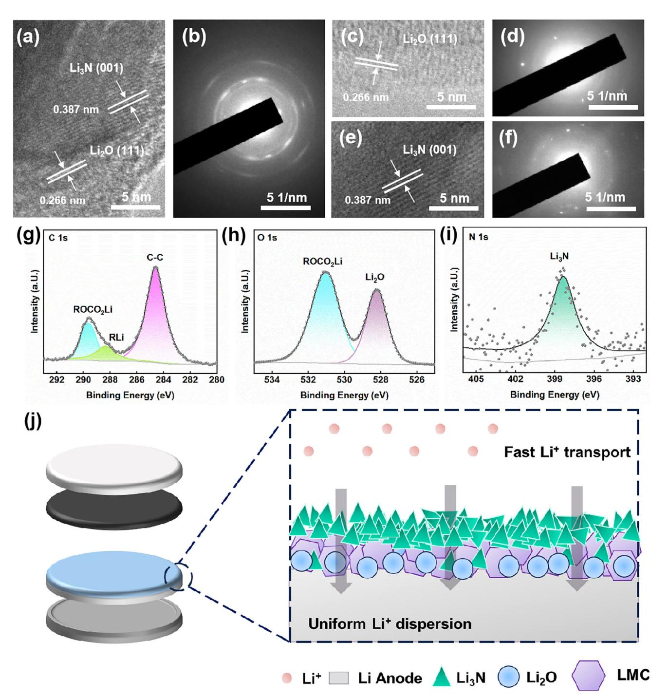
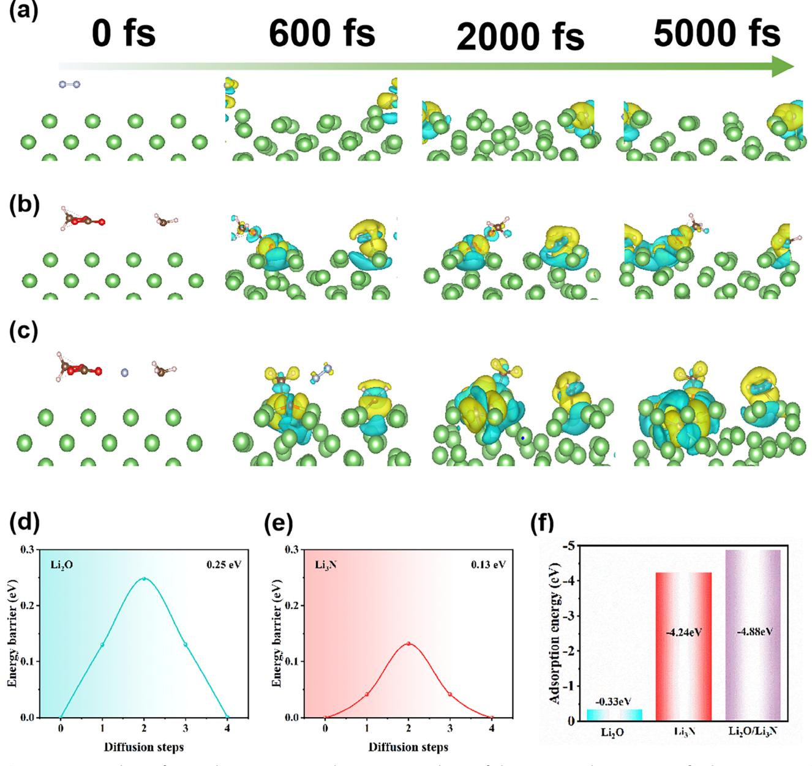
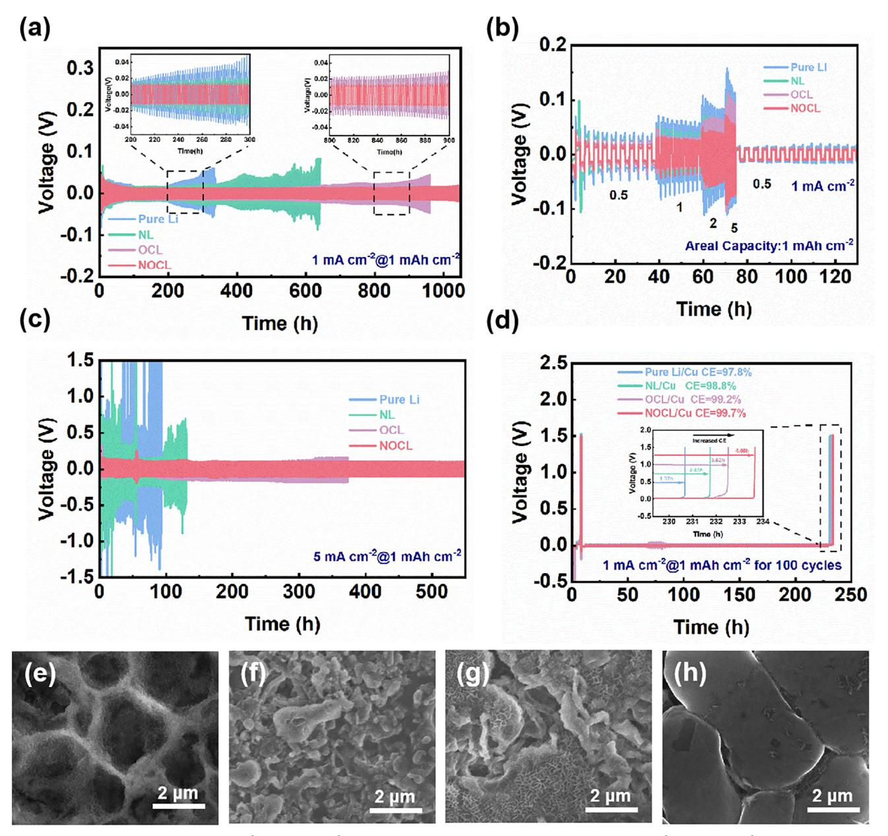
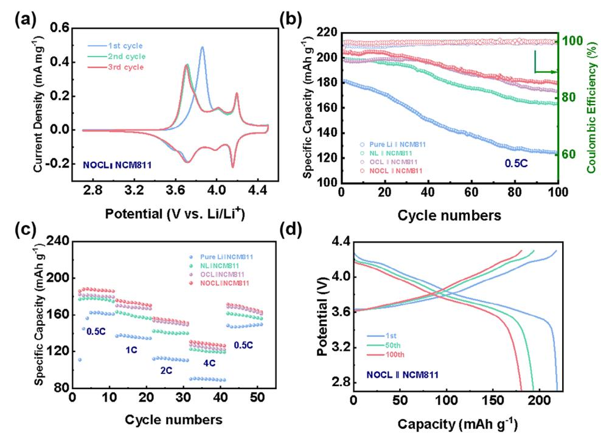

# **Construction of Organic–Inorganic Solid Electrolyte Interphase by Gas-Liquid Plasma for High Performance Lithium Metal Anodes**

*Jiahao Wang, Ping Liu, Zhong Qiu, Tianqi Yang, Feng Cao, Jiayuan Xiang,\* Xinqi Liang, Shenghui Shen, Yongqi Zhang, Yang Xia,\* Chen Wang, Wangjun Wan, Jun Zhang, Hui Huang, Ruyi Fang, Xinping He, Yongping Gan, Xinyong Tao, Xinhui Xia,\* and Wenkui Zhang*

**The construction of high-quality solid electrolyte interphase (SEI) on Li metal is one of the key strategies to improve the performance of Li metal anodes. Herein, we propose a novel gas-liquid hybrid source plasma technology to construct composite SEI consisting of organic lithium methyl carbonate (LMC) and inorganic lithium nitride (Li3N) and lithium oxide (Li2O) on the lithium metal. Supported by the theoretical calculation, the inorganic Li3N and Li2O phases possess low diffusion barrier potentials, favorable for fast Li+ transportation, and enhanced lithophilicity. Meanwhile, the organic LMC can effectively accommodate the volume expansion of lithium metal due to its high mechanical flexibility. Accordingly, the lithium metal anode modified by plasma-made SEI has a low overpotential of 11.4 mV at 1 mAh cm−2 for 950 h with an average Coulombic efficiency of 99.7%, superior to the unmodified Li metal anode. When coupled with LiNi0.8Co0.1Mn0.1O2 (NCM811) cathode, the assembled full cell is proven with a higher capacity retention of 87.77% after 100 cycles at 0.5 C, indicating its significantly enhanced cycling stability due to the synergistic effect between Li3N, Li2O, and LMC in the composite SEI. This research demonstrates that plasma is a unique method for constructing high-quality SEI to achieve enhanced lithium anodes for energy storage.**

### **1. Introduction**

For pursuing a carbon-neutral and wireless society, the escalating demand for electric vehicles and portable electronics has highlighted the need for high-energy-density rechargeable batteries.[\[1–3\]](#page-8-0) However, the energy density of commercial lithium-ion batteries with graphite anode is approaching the maximum theoretical value of 350 Wh kg−1, necessitating the development of novel battery systems. Lithium metal batteries (LMBs), which utilize lithium metal as the anode, offer an energy density exceeding 350 Wh kg−1 and are considered as a promising candidate for the nextgeneration battery configuration.[\[4\]](#page-8-0) However, the highly reactive nature of lithium gives rise to a series of ongoing side reactions with the electrolyte and consequently hastens the depletion of both the lithium source and electrolyte constituents.[\[5–7\]](#page-8-0) This adverse effect results in low Coulombic

J. Wang, P. Liu, T. Yang, Y. Xia, J. Zhang, H. Huang, R. Fang, X. He, Y. Gan, X. Tao, X. Xia, W. Zhang College of Materials Science and Engineering Zhejiang University of Technology Hangzhou 310014, P. R. China E-mail: [nanoshine@zjut.edu.cn;](mailto:nanoshine@zjut.edu.cn) [helloxxh@zju.edu.cn](mailto:helloxxh@zju.edu.cn) P. Liu, X. Xia School of Materials Science & Engineering Zhejiang University Hangzhou 310027, China Z. Qiu, X. Liang, Y. Zhang Institute of Fundamental and Frontier Science University of Electronic Science and Technology of China Chengdu 611371, P. R. China

The ORCID identification number(s) for the author(s) of this article can be found under <https://doi.org/10.1002/smll.202500300>

#### **DOI: 10.1002/smll.202500300**

Z. Qiu, J. Xiang, S. Shen Narada Power Source Co. Ltd. Hangzhou 310014, P. R. China E-mail: [xiangjy@naradapower.com](mailto:xiangjy@naradapower.com) F. Cao Department of Engineering Technology Huzhou College Huzhou 313000, P. R. China S. Shen School of Materials Science & Engineering Zhejiang Sci-Tech University Hangzhou 310018, P. R. China C. Wang, W. Wan Zhejiang Academy of Science and Technology for Inspection & Quarantine Hangzhou 311215, P. R. China Y. Zhang, X. Xia Yangtze Delta Region Institute (Huzhou) University of Electronic Science and Technology of China Huzhou 313002, P. R. China

efficiency and decreased cycle life. In addition, the formation of dendrites, which is caused by the non-uniform distribution of Li ions across the electrode surface, poses a significant risk of internal short-circuiting within the battery.[\[8–10\]](#page-8-0) Thus, it is necessary to construct a high-performance solid electrolyte interphase (SEI) layer on lithium metal to stabilize the lithium deposition/stripping processes during the cycling.

The natural SEI layer is extremely unstable and does not possess sufficient mechanical properties to effectively inhibit the growth of lithium dendrites.[\[11\]](#page-8-0) It is also not flexible enough to resist the huge volume change of lithium metal. Compared with the natural SEI layer, the artificial SEI layer can effectively inhibit the growth of lithium dendrites and resist the volume effect.[\[12\]](#page-8-0) Therefore, direct contact between Li and electrolytes can be avoided, reducing the generation of side reactions,[\[13\]](#page-8-0) and the consumption of Li with electrolytes is reduced. Consequently, the Coulomb efficiency is preserved and the cycle life of the battery is enhanced.[\[14\]](#page-8-0) To date, the reported SEI layers are mainly categorized into two types: inorganic and organic compounds. It is reported that inorganic SEI layers have the advantages of high rigidity and mechanical strength, and thus provide effective barriers against lithium dendrite penetration.[\[15–17\]](#page-8-0) For example, Lee et al. employed an in situ chemical approach to fabricate inorganic SEI layers enriched with Li-P-S compounds.[\[18\]](#page-8-0) This SEI layer could effectively inhibit the growth of lithium dendrites without decreasing the ionic conductivity. However, the substantial volumetric expansion associated with lithium metal deposition causes the failure of the inorganic SEI layer due to its inherent brittleness and rigidity.[\[19,20\]](#page-8-0) Given all that, organic SEI layers are widely developed to accommodate the volumetric change of lithium metal anode due to their superior flexibility and excellent capacity.[\[21,22\]](#page-8-0) Zhang et al. in situ synthesized stable organic SEI layers with a high content of ─CH3 groups.[\[23\]](#page-8-0) Their designed SEI layer with high strength and high strain toughness could accommodate volume change in the lithium metal anode. Therefore, the combination of organic and inorganic SEI layers can exploit the advantages of both, thereby enhancing the electrochemical performance of lithium metal anodes.

Lots of fabrication technologies have been reported for SEI layers including chemical vapor deposition, liquid-phase reaction, and in situ chemical methods. For instance, Cao et al. reported a hybrid SEI layer comprising poly(ethylene glycol) diacrylate (PEGDA) and lithium difluoro(oxalato)borate (LiDFOB) via a facile coating method to achieve a high-performance lithium metal anode.[\[24\]](#page-8-0) Their symmetrical cells maintained stable overpotentials for 700 h at a current density of 0.5 mA cm−2 with a lithium plating capacity density of 1 mAh cm−2. Although Cao's work is effective in improving the performance of symmetric batteries, their cycling performance is still unsatisfactory. The highperformance lithium anode prepared in our work can maintain a longer cycling life at higher current densities. Moreover, the method used in this work takes only a few minutes to prepare SEI, much more efficient than other methods. However, these conventional technologies are still limited by large-scale production and synthesis efficiency. In this regard, plasma technology has emerged as a highly effective approach for the construction of artificial SEI layers due to its convenience and versatility.[\[25\]](#page-8-0) The plasma-treated SEI layer possesses controllable composition and thickness enabled by reactions between plasma-induced radicals and lithium. This process is high-efficiency and can be completed within seconds. Compared with the traditional preparation technology, the plasma technology as a green, reliable, and low-cost process is widely used for the preparation of different films.[\[27\]](#page-8-0) It is considered to be a new green process for the preparation of high-performance SEI films. It is also a popular method for the modification of lithium metal anodes. Cao et al. used plasma technology to polymerize the thiophene layer (P-PTh) on the Li surface with high Young's modulus and showed strong stability and LiF-rich SEI.[\[28\]](#page-8-0) Our group also used SF6 plasma to construct LiF-dominated SEI on Li metal to achieve reinforced performance.[\[29\]](#page-8-0) This method is very powerful and can easily modulate the components of SEI by selecting the reaction precursors. Furthermore, the components of SEI layers can be modulated by the multi-phase plasma sources such as liquid, gas, and solid phases to form a high-quality SEI layer.[\[30\]](#page-8-0) It is believed that N2-coupled plasma is beneficial for the synthesis of the Li3N-rich SEI layer. Up to now, there are few works on the construction of SEI layers by N2-coupled dimethyl carbonate (DMC) plasma. And the formation mechanism and performance enhancement mechanism have not been revealed yet.

Herein, we propose nitrogen gas and DMC liquid hybrid plasma technology to in situ construct an artificial inorganic– organic SEI via a plasma-enhanced chemical vapor deposition (PECVD) system (Figure S1). The components of SEI have been studied and are mainly composed of inorganic lithium nitride (Li3N), lithium oxide (Li2O), and organic methyl lithium carbonate (CH3OCOOLi) components on the surface of lithium metal anode referred to as NOCL anode. Theoretical calculations prove that the inorganic components provide low diffusion barrier potential and adsorption energy to promote Li+ transportation, while the organic materials offer high flexibility to release the volume expansion. Compared to the recent studies on artificial SEI layers, the lithium metal anode prepared in this work demonstrates superior electrochemical performance (Table S1). According to our summarized Table S1, the SEI we constructed has better performance than the counterparts in the literature. As a result, the symmetric batteries paired with the NOCL anodes present enhanced electrochemical performance with an overpotential stability after 950 h at a current density of 1 mA cm−2. Moreover, the full cell with modified lithium metal anode and LiNi0.8Co0.1Mn0.1O2 (NCM811) cathode shows better capacity retention of 87.77% even after 100 cycles at 0.5 C, further verifying its superior cycling stability. Our research confirms that plasma is an effective means of constructing high-quality lithium metal anodes for electrochemical energy.

#### **2. Results and Discussion**

X. Xia

State Key Laboratory of New Textile Materials and Advanced Processing Technologies Wuhan Textile University Wuhan 430200, P. R. China

The schematic illustration of the construction of NOCL is illustrated in **Figure 1**[a.](#page-2-0) First nitrogen plasma was employed as a gas source to construct inorganic Li3N on the surface of the

**Figure 1.** (a) Schematic illustration of the fabrication process of NOCL anode. Plasma photos of (b) N2, (c) DMC, (d) DMC&N2. SEM images of (e) NL, (f) OCL, and (g) NOCL, respectively.

lithium metal anode, which is considered as a solid lithium-ion conductor with a high Young's modulus of 48 GPa and lithiumion conductivity of 6 × 10−3 S cm−1. [\[31\]](#page-8-0) Subsequently, the DMC was adopted as a liquid source to construct a hybrid inorganic– organic SEI layer containing Li2O and LMC components (Figure S2).[\[32,33\]](#page-9-0) The synthesis of the composite SEI can effectively release the lithium volume changes, and promote the Li+ transport behaviors.[\[34,35\]](#page-9-0) As illustrated in Figure 1b–d, the plasma glow photos of the N2, DMC, DMC&N2 show the colors of orange, white, and pink, respectively, due to various plasma radicals. After treatments, the surface of pure Li is relatively flat with the quantity of defects, which may act as nucleation sites and lead to the generation of lithium dendrites (Figure S3). The SEM image of the lithium metal anode modified by Li3N (NL) reveals obvious etching traces, suggesting that the reaction of the N2-plasma with lithium is effective and vigorous (Figure 1e). Besides, the surface of the lithium metal anode modified by Li3N, Li2O, and LMC (OCL) sample is completely different from that of the NL sample, with the appearance of a compact SEI layer (Figure 1f). As for the NOCL sample, a dense and uniform layer is observed (Figure 1g), which can effectively prevent the generation of lithium dendrites to some extent. According to the cross–sectional SEM images (Figure S4), the thickness of the plasma-formed SEI is almost the same for all three samples at ∼ 6 μm.

To analyze the components of artificial layers, the three samples were further inspected by a high-resolution transmission electron microscope (HRTEM). All the samples exhibit clear lattice fringes as depicted in **Figure 2**[a–f.](#page-3-0) In detail, the lattice spacings of the NOCL sample are measured to be 3.87 and 2.66 Å, respectively, well matching with the Li3N (001) and Li2O (111) planes. However, the NL sample has the (001) crystal plane of Li3N, and the OCL sample exhibits the (111) planes of Li2O. Meanwhile, the compositions of the SEI layer are further investigated by X-ray photoelectron spectroscopy (XPS). In the OCL sample, the C signal and O signal are detected at 288.4 and 531.6 eV, respectively. In the O 1s spectrum, a characteristic peak of Li2O is observed located at 528.1 eV (Figure S5), indicating an inorganic–organic hybrid SEI layer consisting of LMC and Li2O is formed on the surface of the OCL sample. In contrast, the N 1s spectra of NL demonstrate the characteristic peak of Li3N

**Figure 2.** HRTEM and SEAD images of (a,b) NOCL, (c,d) OCL, (e,f) NL. XPS spectra of NOCL: (g) C 1s, (h) O 1s, (i) N 1s. (j) Schematic diagram of Li+ transmission in NOCL.

at 398.5 eV (Figure S6), implying the formation of a SEI layer consisting of Li3N on the lithium metal surface. Meanwhile, as for the NOCL sample, the N signal at 398.5 eV and the O signal at 528.1 eV are simultaneously detected on the surface as displayed in Figure 2g–i. Furthermore, various lithium compounds are matched well in the Li 1s spectra (Figure S7). These results illustrate the successful synthesis of inorganic–organic composite SEI layer composed of LMC, Li3N, and Li2O on the surface of the NOCL sample. Additionally, we carried out the depth-XPS test to investigate the structure of NOCL by performing etching detection on the SEI surface (Figure S8). Depth-XPS spectra show that the composition of the SEI layer changes significantly with increasing etching time. The SEI surface layer is dominated by inorganic Li3N SEI. With deeper etching, the composition of Li3N gradually decreases, and the content of the inorganicorganic mixed SEI layer composed of LMC and Li2O gradually

**Figure 3.** AIMD simulation of (a) NL, (b) OCL, (c) NOCL. Li+ migration energy barrier of (d) Li2O (111) and (e) Li3N (001). (f) Adsorption energy of different interfaces.

increases. Based on the XPS results, the structure diagram of SEI has been updated (Figure [2j\)](#page-3-0), revealing a three-dimensional architecture with Li3N at the top layer, LMC in the mid-lower layer, and Li2O at the bottom region.

Additionally, the AIMD (Ab Initio Molecular Dynamics) simulations are further conducted to investigate the mechanism of SEI formation in three different plasma environments.[\[36\]](#page-9-0) In this work, the AIMD simulations on the Li surface are carried out at 5000 fs. From the simulation snapshot at the corresponding time, the dissociation of N2 molecules and the initial formation of Li3N are observed at 600 fs (**Figure 3**a). Subsequently, until 2000 fs, the dissociated N atoms interacted with Li metal to form Li3N. At 5000 fs, Li3N is only formed on the surface of Li metal, and N atoms have not entered the lattice of Li metal. Meanwhile, the AIMD simulations of the DMC on Li surfaces under plasma conditions are performed as well. Previously, bond dissociation energies were calculated for the three possible bond-breaking positions of DMC (Figure S9), indicating the CH3- bond is likely to break from DMC. Based on the XPS and bond dissociation energy results, an AIMD simulation (Figure 3b) with a duration of 5000 fs is carried out on the Li surface with selected CH3 and CH3OCOO- fragments. The snapshots show the formation of methyllithium (CH3Li) and CH3OCOOLi at 600 fs. There is no significant change until 2000 and 5000 fs, and the product is also only present on the surface of the Li metal, which does not penetrate the lattice. Finally, a mixed DMC and  $N_2$  source is simulated (Figure  $3c$ ). From the snapshots at the corresponding times, the generation of CH3Li and LMC occurs at 600 fs, followed by the complete dissociation of the N2 molecule while complete dissociation of  $N_2$  molecules and formation of Li3N occurs at 2000 fs. At 5000 fs, N atoms enter the internal lattice of metallic Li, indicating the formation of a Li3N-Li2O/CH3OCOOLi inorganicorganic bilayer structure on the surface.

To further evaluate the role of the artificial SEI layer in enhancing Li+ transport, the DFT (Density functional theory) calculations are employed to investigate the inorganic components. It is assumed that lithium diffuses in the crystal structure via a vacancy mechanism. The diffusion of  $Li^+$  in the  $Li_2O$  and  $Li_3N$  bulk phases is then assessed using the climbing image nudged elastic band (CINEB) method. The results of the migration energy barriers reveal that Li has a value of 0.25 eV (Figure 3d) in the  $Li2O$ bulk phase and 0.13 eV (Figure  $3e$ ) in the Li3N. It is demonstrated that the SEIs of Li3N and Li2O constructed with the introduction of N2-Plasma and DMC-Plasma are both beneficial for achieving the rapid transport of  $Li^{+}[37]$  The adsorption energies of  $Li^{+}$  on  $\text{Li}_2\text{O}$  (111),  $\text{Li}_3\text{N}$  (001), and  $\text{Li}_2\text{O}$  (111)/ $\text{Li}_3\text{N}$  (001) heterojunctions are further calculated. The calculations show that the adsorption energy of Li on the  $Li_3N$  (001) plane is -4.24 eV, while  $Li_2O$ (111) is -0.33 eV, and the  $\text{Li}_2\text{O}$  (111)/ $\text{Li}_3\text{N}$  (001) heterojunction has the largest value of -4.88 eV. The interfacial impedance is effectively reduced due to the improved affinity of the interfacial layer for lithium.[38,39] Moreover, the corresponding parameters are extracted from the optimal model in order to assess the stability and resistance to lithium dendrite growth of the SEI interfacial layer (Table S2). Apparently, the Li  $(111)/Li_3N$  (001) interface exhibits the lowest interfacial energy, implying a more stable interface. Concurrently, the adhesion work is at its maximum, and the ability to resist lithium dendrites is enhanced.[40,41] Conversely, the Li  $(111)$ /Li2O  $(111)$  interface is more unstable with a higher interfacial energy. Following the introduction of lithium nitride, the stability of the Li  $(111)$ /Li2O  $(111)$  interfacial energy is enhanced by the formation of the  $\text{Li}_2\text{O}$  (111)/ $\text{Li}_3\text{N}$  (001) heterointerface. In light of these findings that  $Li_3N$  can facilitate rapid  $Li^+$  transport and that the interface constructed with Li exhibits enhanced interfacial stability and the ability to impede the growth of lithium dendrites, it has been demonstrated that the Li3N heterointerfaces are more stable than the Li  $(111)$ /Li2O  $(111)$  interfaces. Nevertheless, the band gap of  $Li_3N$  is relatively small, which facilitates electron shuttling into the SEI (Figure S10).[42] This process results in the combination of  $Li^+$  and  $e^-$  within the SEI, thereby facilitating the nucleation of Li, contributing to the destruction of the SEI and exposure of fresh metal Li surface, thereby initiating a continuous side reaction between the electrolyte and the metal Li. In contrast,  $Li_2O$ , despite exhibiting inferior properties to  $Li_3N$ , offers superior electronic insulation due to its wider bandgap.[43] Consequently, the double-layer heterogeneous  $Li_3N/Li_2O$  artificial SEI constructed by DMC&N2-plasma exhibits a synergistic effect, enabling rapid Li+ transport and providing effective electronic insulation, thus ensuring the long-term stability of the battery.[44,45] In this study, the source of lithium oxide is introduced as DMC, which generates both the inorganic and organic layers of lithium oxide. The organic layer is one of the common organic components in the esters-electrolyte-derived SEI. The introduced LMC effectively resists the bulk effect of LMBs as well as compensates for the shortcomings of the inorganic layer.[46] The simultaneous composite effect of LMC and lithium oxide can enhance the performance of the SEI layer, exceeding that of a single  $Li_3N$  layer. This highlights the significance of LMC and Li2O, which can effectively enhance the electrochemical properties.

In order to verify the superior performance of plasmamodified LMBs, symmetrical cells are assembled and tested. The electrochemical impedance spectroscopy (EIS) tests (Figure S11a,b) are initially analyzed. The charge transfer interface resistance ( $R_f$ ) of the NOCL cell, OCL cell, and NL cell are 263.43, 228.46, and 184.33  $\Omega$ , respectively, which are higher than that of the pure Li cell of 147  $\Omega$ . This is consistent with the surface SEM images. After 100 charge-discharge cycles of the symmetrical cells, the  $R_f$  of the NOCL cell, OCL cell, and NL cell decreases to 3.93, 6.11, and 8.14  $\Omega$ , respectively, which are much lower than that of pure Li cell (9.87  $\Omega$ ). This suggests that the sufficiently activated anodes have more rapid Li+ transportation within designed SEIs, causing the reduction of impedance. This indicates that the interface exhibits enhanced electrochemical kinetic performance and a more stable interfacial layer during the cycling processes, which is further evidenced by the rate performance (**Figure 4b**).[47] Moreover, the overpotential voltage of the NOCL cell is significantly lower than that of the pure Li cell at current densities of 0.5, 1, 2, and 5 mA  $\text{cm}^{-2}$ . In the long-term cycling test (Figure 4a), the cycle life of the NOCL cell not only reaches 950 h at a current density of 1 mA  $\text{cm}^{-2}$  and a specific capacity of 1 mAh cm-2, but also maintains a low overpotential of 11.4 mV. These results demonstrate that the plasma-constructed inorganic–organic SEI layer greatly enhances the cycling stability, while the life of the OCL cell and the NL cell also show some enhancement compared with pure Li batteries, with significant overpotential voltage enhancement occurring only at 600 and 420 h, respectively. In contrast, the pure Li cell exhibits a larger overpotential voltage after only 200 h of cycling. This may be attributed to the occurrence of side effects and excessive thickness of the SEI layer. To further validate the electrochemical performance, the cycling tests at higher current density (5 mA cm-2) and surface capacity (1 mAh cm-2) are performed. The NOCL cell remains stable after 500 h cycling as displayed in Figure 4c, further suggesting excellent cycling stability. In order to evaluate the retention of Li in modified lithium metal anodes. Finally, lithium-copper half-cells (Figure 4d) are assembled with NOCL, OCL, NL, and pure Li as anodes and copper sheets as the cathodes. The Coulombic efficiency of the pure Li/Cu cathode is the lowest at 97.8% among all the samples. The respective Coulombic efficiencies of the NOCL, OCL, and NL samples are 99.7%, 99.2%, and 98.8%. It can be concluded that the artificial SEI layer effectively isolates the lithium metal and electrolyte, reducing the occurrence of side reactions, the consumption of active materials, and lifting the battery capacity retention.

In order to observe the changes in SEIs after cycling, SEM images are conducted to inspect lithium anodes disassembled from the symmetrical batteries cycled after 100 cycles. On the surface of a pure Li sample, a considerable number of lithium dendrites form with chaotic growth and voids due to the volume effect (Figure 4e). In contrast, the OCL and NL samples deliver only partially disordered dendrites and a few voids (Figure 4f,g).

**Figure 4.** (a) Cycling stability at 1 mA cm−2@1 mAh cm−2. (b) Rate performance. (c) Cycling stability at 5 mA cm−2@1 mAh cm−2. (d) Constant current charge and discharge curves at 1 mA cm−2@1 mAh cm−2 for 100 cycles to calculate average CE. SEM images of (e) pure Li, (f) NL, (g) OCL, and (h) NOCL anodes after 100 cycles.

Impressively, as illustrated in Figure 4h, the NOCL sample still maintains a relatively tight and flat crystal structure. Obviously, the introduced inorganic–organic SEI layer comprising Li3N and Li2O/CH3OCOOLi effectively promotes the diffusion of Li+ and accelerates the kinetics of internal electrochemical reactions, thus inhibiting the growth of lithium dendrites. To investigate the preformed inorganic-organic SEI layer and whether will react with the electrolyte through novel mechanisms, the battery was disassembled after 10 cycles. X-ray photoelectron spectroscopy (XPS) analysis was conducted and N 1s and F 1s distributions were compared (Figure S12). The results reveal that the NOCL anode significantly enhances the growth of Li3N and LiF compared to pure Li anodes. These results demonstrate that the artificial SEI layer can promote the generation of beneficial components in the native SEI.

Finally, the application potential of this rationally designed NOCL anode is further validated. In this work, full cells are assembled by using the NOCL anode and NCM811 cathode. After the initial cycle at a scan rate of 0.1 mV s−1, the NOCL‖NCM811 full cell shows enhanced stability compared to the pure Li‖NCM811 cell (Figure S13). Furthermore, the overlap between the second and third cycles is more pronounced, indicating that the full cell is electrochemically stable and reversible (**Figure 5**[a\)](#page-7-0). The average discharge capacities of the

**Figure 5.** Electrochemical performance of cells paired with NCM811 cathode: (a) Cyclic voltammogram at a scan rate of 0.1 mV s−1 of NOCL‖NCM811. (b) Cycling stability at 0.5 C. (c) Rate performance. (d) Selected charge–discharge profiles of full cells with NOCL at different cycles.

NOCL‖NCM811 cell at different rates of 0.5 C, 1 C, 2 C, and 4 C are superior to those of the OCL‖NCM811 cell and the NL‖NCM811 cell, and considerably better than pure Li systems (Figure 5c). Additionally, the average discharge capacity of 166.46 mAh g−1 is maintained when returning to 0.5 C, indicating the NOCL‖NCM811 full cell also exhibits satisfactory multiplicative performance. Moreover, as depicted in Figure 5b, after 100 cycles at 0.5 C, the NOCL‖NCM811 cell is able to have a much higher specific discharge capacity (182.83 mAh g−1) than other counterparts, with a capacity retention of 87.77%. Finally, Figure 5d and Figure S14 show the charging–discharging curves of the NOCL‖NCM811 cell and the pure Li‖NCM811 cell. Comparing the curves of the 50th and 100th cycles, the polarization interval of the pure Li‖NCM811 cell increased with cycling, whereas the NOCL‖NCM811 cell remained well. To further validate the utility of NOCL in full cells, we also prepared full cells with lower N/P ratios and NCM activity of 5.6 mg cm−2. The performance enhancement is demonstrated here by the multiplicity test. An LFP-positive electrode was also prepared to match with negative electrode material. The electrochemical performance indicates that the modified anode material has enhanced performance and great potential for practical application (Figure S15). Apparently, the NOCL‖NCM811 cell exhibits remarkable cycle stability and superior rate capability, verifying the modified lithium metal anode has great potential in LMBs.

#### **3. Conclusions**

In conclusion, we present a novel surface modification strategy for the construction of high-performance lithium metal anodes through a feasible plasma technology. Impressively, we groundbreakingly utilize nitrogen and DMC hybrid sources for plasma treatment. The results demonstrate that the use of a gas-liquid hybrid source modification can in situ construct the artificial SEI on the surface of the Li metal anode. The artificially constructed inorganic–organic SEI layer of Li3N/Li2O/LMC is capable of effectively inhibiting the growth of lithium dendrites, regulating the Li+ flux, as well as reducing the occurrence of side reactions, thereby enhancing the cycle life and Coulombic efficiency. Therefore, both symmetrical cells and full cells of the NOCL sample display improved stability at the interface, reduced voltage hysteresis, diminished overpotentials, and augmented cycling and rate performance. Furthermore, our findings offer a promising foundation for the development of alternative lithium metal anodes.

## **4. Experimental Section**

*Fabrication of NL, OCL, and NOCL Anodes*: Li metals were transferred into a quartz tube in an argon-filled glovebox. 5 ml DMC was loaded into the liquid phase device. Subsequently, the surface of lithium metal was modified by N2 plasma, DMC plasma, DMC and N2 mixed plasma, respectively, in the plasma-enhanced chemical vapor deposition (PECVD) system (Hangzhou Zhehe Plasma Co., Ltd.) to form the final NL, OCL, and NOCL anodes. The specific parameters were as follows: the gas flow was N2 20 sccm; the radio frequency power was 80 W at a vacuum degree of 3 Pa; the reaction time was 60 s; and the temperature was room temperature.

*Materials Characterization*: The morphologies of the obtained Li anodes were characterized by a field emission scanning electron microscope (FESEM, Hitachi SU8010) with an energy-dispersive X-ray detector (EDS). The lattice fringes, elemental mapping, and selected area electron diffraction (SAED) patterns were detected by a high-resolution transmission

electron microscope (HR-TEM, FEI Tecnai G2 F20). X-ray photoelectron spectroscopy (XPS, ESCALAB 250Xi) was utilized to analyze the chemical composition of the artificial SEI layer.

*Fabrication of LiNi0.8Co0.1Mn0.1 (NCM811) Cathode*: NCM811 slurry was mixed with NCM811 powder, carbon black, and polyvinylidene fluoride (PVDF) at a fixed weight ratio of 8:1:1. N-methyl-2-pyrrolidone (NMP) was used as solvent. The as-obtained slurry was coated on the Al foil, and dried at 120 °C for 12 h. The areal mass load of NCM811 active materials was 2.5 mg cm−2.

*Electrochemical Measurement*: CR2025 cells were assembled in an Arfilled glovebox with moisture and oxygen contents of *<*0.01 ppm. The electrolyte used for symmetrical batteries was a standard electrolyte (1 m LiTFSI in DME: DOL = 1:1 vol% with 2% LiNO3) provided by Suzhou Duoduo Chemical Technology Co., Ltd. The cycle stabilities of symmetrical batteries and full batteries were both tested on the Neware battery test system. Cyclic voltammetry (CV) measurements were performed on the CHI 660e electrochemical workstation (Shanghai Chenhua Co., Ltd.). Electrochemical impedance spectroscopy (EIS) was performed on the CHI650B electrochemical workstation (Chenhua, Shanghai, China). The EIS study was conducted by sweeping the frequency from 10−1 to 105 Hz.

### **Supporting Information**

Supporting Information is available from the Wiley Online Library or from the author.

#### **Acknowledgements**

J.H.W. and P.L. contributed equally to this work. This work was supported by Natural Science Foundation of Zhejiang Province (Grant No. LD25E020003), National Natural Science Foundation of China (Grant No. 52372235, 52302316, 22279116, 52225208, U20A20253), Key Scientific Research Project of Hangzhou (Grant No. 2024SZD1B12), Science and Technology Project of Huzhou (Grant No. 2024GZ02), Science and Technology Department of Zhejiang Province (Grant No. 2023C01231, Q23E020046, LD22E020006), State Key Laboratory of New Textile Materials and Advanced Processing Technologies (Grant No. FZ2024009), Natural Science Foundation of Zhejiang Province (Grant No. LQ23E020009, LY21E020005), Zhejiang Provincial Postdoctoral Research Project (ZJ2023080), Fundamental Research Funds of Zhejiang Sci-Tech University (LW-YP2024030), Key Laboratory of Engineering Dielectrics and Its Application (Harbin University of Science and Technology), Ministry of Education (Grant No. KFM 202303).

## **Conflict of Interest**

The authors declare no conflict of interest.

#### **Data Availability Statement**

Research data are not shared.

#### **Keywords**

Li metal anodes, plasma, solid electrolyte interphase, surface modifications

- Received: January 8, 2025
- Revised: April 17, 2025
- Published online: May 19, 2025

- [1] S. Ha, J. Y. Park, S. H. Huh, S. H. Yu, J. H. Kwak, J. Park, H. D. Lim, D. J. Ahn, H. J. Jin, H. K. Lim, S. J. Yang, Y. S. Yun, *Small* **2024**, *20*, 2400638.
- [2] H. Liu, J. Di, P. Wang, R. Gao, H. Tian, P. Ren, Q. Yuan, W. Huang, R. Liu, Q. Liu, M. Feng, *Carbon Energy* **2022**, *4*, 654.
- [3] G. Peng, Q. Zheng, G. Luo, D. Zheng, S. Feng, U. Khan, A. R. Akbar, H. Luo, F. Liu, *Small* **2023**, *19*, 2303787.
- [4] X. Liu, H. Liu, K. Ren, W. Tang, C. Guo, W. Bao, F. Yu, X. Cheng, J. Li, *Small* **2024**, *20*, 2401675.
- [5] N. Zhu, Y. Yang, Y. Li, Y. Bai, J. Rong, C. Wu, *Carbon Energy* **2024**, *6*, 423.
- [6] M. L. Meyerson, P. E. Papa, A. Heller, C. B. Mullins, *ACS Nano* **2021**, *15*, 29.
- [7] G. Huang, J. Han, F. Zhang, Z. Wang, H. Kashani, K. Watanabe, M. Chen, *Adv. Mater.* **2019**, *31*, 1805334.
- [8] P. Liu, H. Su, Y. Liu, Y. Zhong, C. Xian, Y. Zhang, X. Wang, X. Xia, J. Tu, *Small Struct.* **2022**, *3*, 2200010.
- [9] B. Liu, Y. Zhang, Z. Wang, C. Ai, S. Liu, P. Liu, Y. Zhong, S. Lin, S. Deng, Q. Liu, G. Pan, X. Wang, X. Xia, J. Tu, *Adv. Mater.* **2020**, *32*, 2003657.
- [10] Z. Ju, J. Nai, Y. Wang, T. Liu, J. Zheng, H. Yuan, O. Sheng, C. Jin, W. Zhang, Z. Jin, H. Tian, Y. Liu, X. Tao, *Nat. Commun.* **2020**, *11*, 488.
- [11] Z. H. Huang, M. Jing, P. Wang, W. Shao, Z. Zhang, G. Zhang, X. Shen, *Ceram. Int.* **2023**, *49*, 5510.
- [12] H. Wu, R. Li, J. Li, L. Zhou, Y. Liu, G. Zhang, M. Jing, *Surfaces and Interfaces* **2024**, *46*, 104048.
- [13] J. X. Li, L. Zhong, H. Wu, L. Zhou, Y. Liu, Z. Wang, G. Zhang, L. Zou, M. Jing, *ACS Sustainable Chem. Eng.* **2024**, *12*, 18058.
- [14] H. Yang, M. Jing, L. Wang, H. Xu, X. Yan, X. He, *Nano-Micro Lett.* **2024**, *16*, 33.
- [15] Y. Qin, D. Wang, M. Liu, C. Shen, Y. Hu, Y. Liu, B. Guo, *ACS Appl. Mater. Interfaces* **2021**, *13*, 49445.
- [16] C. Li, T. Zhang, Z. Qiu, B. Ye, X. Liang, X. Liu, M. Chen, X. Xia, C. Wang, W. Wan, Y. Zhang, *Carbon Energy* **2025**, *7*, 641.
- [17] S. Perez Beltran, P. B. Balbuena, *J. Power Sources* **2022**, *551*,232203.
- [18] S. Lee, J. Hwang, J. Ming, H. Kim, H. G. Jung, Y. K. Sun, *ACS Energy Lett.* **2021**, *6*, 2153.
- [19] C. Chen, Q. Liang, G. Wang, D. Liu, X. Xiong, *Adv. Funct. Mater.* **2022**, *32*, 2107249.
- [20] D. Wei, Z. Jin, J. Lu, Y. Guo, Z. Wang, G. Cao, J. Qiu, A. Wang, W. Wang, *J. Materiomics* **2023**, *9*, 318.
- [21] L. Liu, H. Jiang, R. Hu, Z. Shen, H. Li, J. Liu, *J. Power Sources* **2023**, *555*, 232395.
- [22] D. Han, Z. Wang, S. Chen, J. Zhou, S. Chen, M. Wang, D. Wu, X. Meng, C. W. Bielawski, J. X. Geng, *Small* **2024**, *20*, 2405453.
- [23] S. Zhang, S. Li, X. Wang, C. Li, Y. X. Liu, H. Cheng, S. Mao, Q. Wu, Z. Shen, J. Mao, H. Pan, Y. Lu, *Nano Energy* **2023**, *114*, 108639.
- [24] W. Cao, J. Lu, K. Zhou, G. Sun, J. Zheng, Z. Geng, H. Li, *Nano Energy* **2022**, *95*, 106983.
- [25] S. Cao, X. He, M. Chen, Y. Han, K. Wang, K. Jiang, M. Zhou, *J. Mater. Chem. A* **2023**, *11*, 7545.
- [26] L. Guo, Z. Zhang, H. Sun, D. Dai, J. Cui, M. Li, Y. Xu, M. Xu, Y. Du, N. Jiang, F. Huang, C. Lin, *Carbon* **2018**, *129*, 456.
- [27] P. Liu, S. Shen, Z. Qiu, T. Yang, Y. Liu, H. Su, Y. Zhang, J. Li, F. Cao, Y. Zhong, X. Liang, M. Chen, X. He, Y. Xia, C. Wang, W. Wan, J. Tu, W. Zhang, X. Xia, *Adv. Mater.* **2024**, *36*, 2312812.
- [28] Z. Qiu, S. Shen, P. Liu, C. Li, Y. Zhong, H. Su, X. Xu, Y. Zhang, F. Cao, A. Noori, M. F. Mousavi, M. Chen, X. He, X. Xia, Y. Xia, W. Zhang, J. Tu, *Adv. Funct. Mater.* **2023**, *33*, 2214987.
- [29] F. Khelifa, S. Ershov, Y. Habibi, R. Snyders, P. Dubois, *Chem. Rev.* **2016**, *116*, 3975.
- [30] P. Liu, Z. Qiu, F. Cao, Y. Zhang, X. He, S. Shen, X. Liang, M. Chen, C. Wang, W. Wan, Y. Xia, X. Xia, W. Zhang, *J. Mater. Sci. Technol.* **2024**, *177*, 68.

- [31] K. Chen, R. Pathak, A. Gurung, E. A. Adhamash, B. Bahrami, Q. He, H. Qiao, A. L. Smirnova, J. Wu, Q. Qiao, Y. Zhou, *Energy Storage Mater.* **2019**, *18*, 389.
- [32] R. Guo, B. M. Gallant, *Chem. Mater.* **2020**, *32*, 5525.
- [33] K. Tasaki, A. Goldberg, J. Lian, M. Walker, A. Timmons, S. J. Harris, *J. Electrochem. Soc.* **2009**, *156*, A1019.
- [34] S. Basu, G. S. Hwang, *ACS Appl. Mater. Interfaces* **2023**, *15*, 59494.
- [35] H. Liu, X. Wang, H. Zhou, H. Lim, X. Xing, Q. Yan, Y. Meng, P. Liu, *ACS Appl. Energy Mater.* **2018**, *1*, 1864.
- [36] S. Huang, Z. Wu, B. Johannessen, K. Long, P. Qing, P. He, X. Ji, W. Wei, Y Chen, L. C. Chen, *Nat. Commun.* **2023**, *14*, 5678.
- [37] C. Niu, D. Liu, J. A. Lochala, C. S. Anderson, X. Cao, M. E. Gross, W. Xu, J. Zhang, M. S. Whittingham, J. Xiao, J. Liu, *Nat. Energy* **2021**, *6*, 723.
- [38] S. Wang, Y. Yin, T. Zuo, W. Dong, J. Li, J. Shi, C. Zhang, N. Li, C. Li, Y. Guo, *Adv. Mater.* **2017**, *29*, 1703729.
- [39] M. Li, J. Lu, Z. Chen, K. Amine, *Adv. Mater.* **2018**, *30*, 1800561.

- [40] Y. Han, B. Liu, Z. Xiao, W. Zhang, X. Wang, G. Pan, Y. Xia, X. Xia, J. Tu, *InfoMat* **2021**, *3*, 155.
- [41] C. Wang, L. Yu, W. Fan, J. Liu, L. Ouyang, L. Yang, M. Zhu, *ACS Appl. Energy Mater.* **2018**, *1*, 2647.
- [42] Z. Liu, Y. Qi, Y. X. Lin, L. Chen, P. Lu, L. Q. Chen, *J. Electrochem. Soc.* **2016**, *163*, A592.
- [43] A. J. Hu, W. Chen, X. C. Du, Y. Hu, T. Y. Lei, H. B. Wang, L. X. Xue, Y. Y. Li, H. Sun, Y. C. Yan, J. P. Long, C. Z. Shu, J. Zhu, B. H. Li, X. F. Wang, J. Xiong, *Energ. Environ. Sci* **2021**, *14*, 4115.
- [44] Y. Zhao, M. Amirmaleki, Q. Sun, C. T. Zhao, A. Codirenzi, L. V. Goncharova, C. H. Wang, K. Adair, X. Li, X. F. Yang, F. P. Zhao, R. Y. Li, T. Filleter, M. Cai, X. L. Sun, *Matter.* **2019**, *1*, 1215.
- [45] M. W. Shang, O. G. Shovon, F. E. Y. Wong, J. J. Niu, *Adv. Mater.* **2023**, *35*, 2210111.
- [46] H. D. Liu, H. Y. Zhou, B. S. Lee, X. Xing, M. Gonzalez, P. Liu, *ACS Appl. Mater. Interfaces* **2017**, *9*, 30635.
- [47] Q. Wang, B. Liu, Y. Shen, J. Wu, Z. Zhao, C. Zhong, W. Hu, *Adv. Sci.* **2021**, *8*, 2101111.