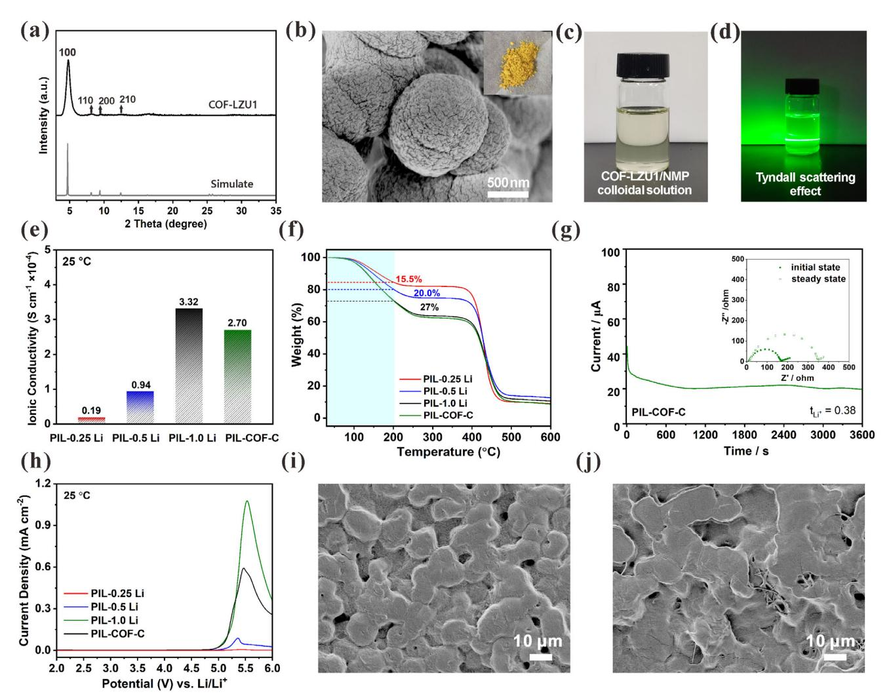
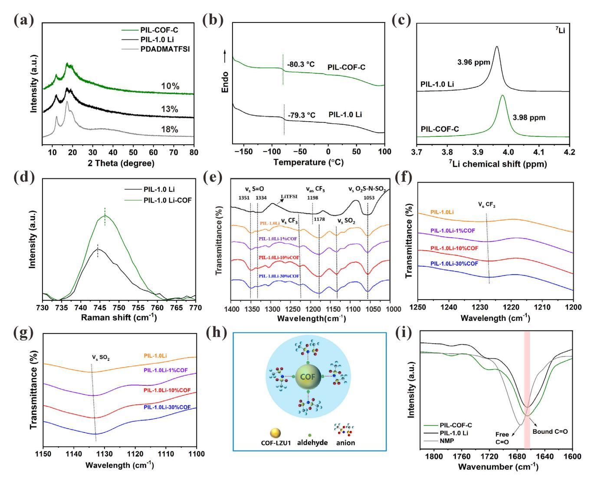
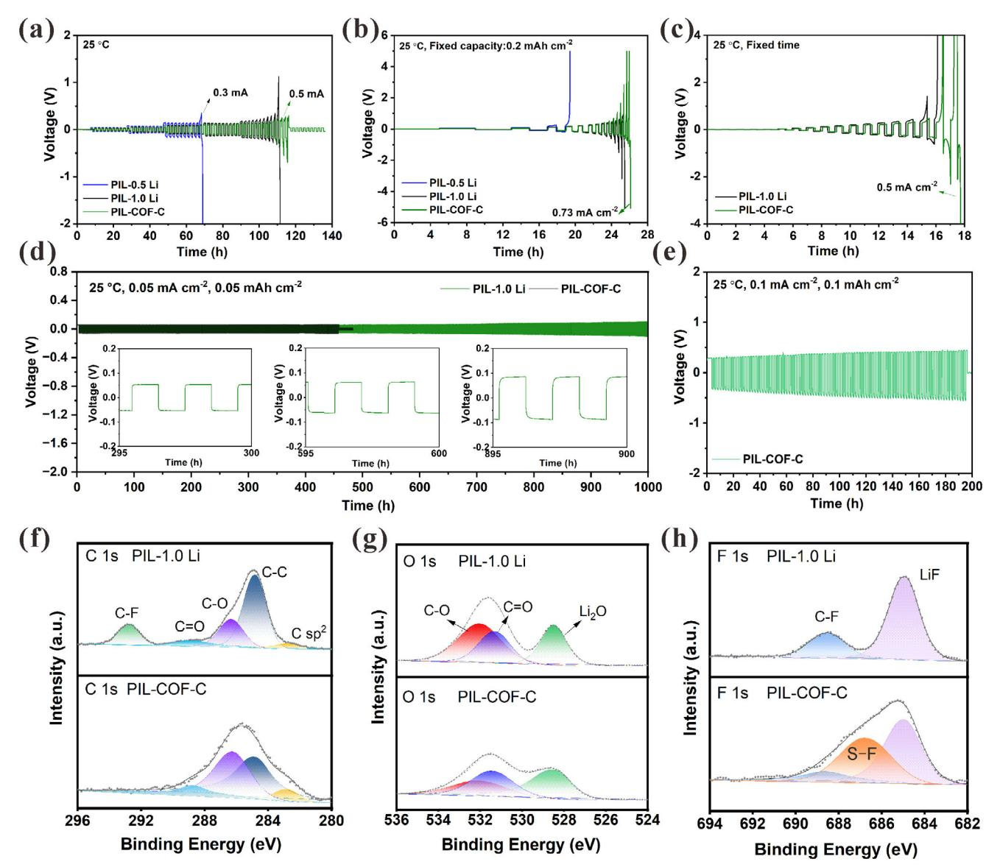
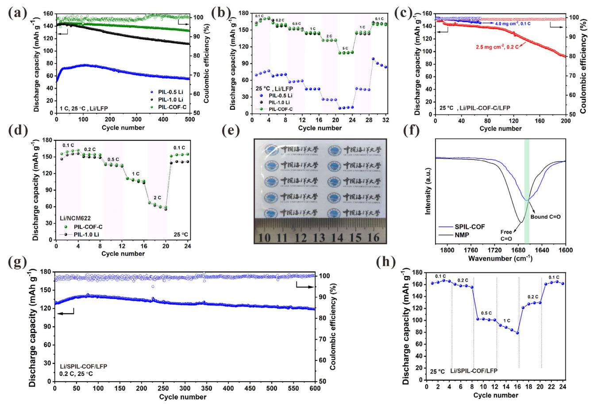

# **Multifunctional COF Colloid Regulates Anion Coordination** in Solid Poly(Ionic Liquid)-Based Electrolyte for Lithium **Metal Batteries**

Hui Chang, Jinling Zhong, Zeao Kang, Jian-Qiang Wang, Yao Liu,\* Linjuan Zhang,\* and Yongcheng Jin\*

The development of solid polymer electrolytes (SPEs) has been significantly impeded by two primary challenges: low ionic conductivity and the inhomogeneous deposition of lithium metal anode. Overcoming these limitations needs to reduce polymer crystallization and to design continuous, stable, fast ion transport pathways. In this study, the incorporation of covalent organic framework colloid (COF-C) as a multifunctional additive to SPEs is proposed, aiming to regulate lithium transport and construct stable electrolyte-electrode interphases. The interaction of COF-C with anions of poly(ionic liquid) (PIL) restricts the growth of PIL spherical crystals and reduces the crystallinity of the electrolyte. Acting as an anion receptor, COF-C promotes uniform Li+ distribution and enhances ion transport kinetics. Additionally, COF-C demonstrates to regulate the anions coordination and create stable solid-state electrolyte interphases between the lithium metal and SPEs. As a result, optimized SPE enables ionic conductivity of 2.70  $\times$  10-4 S  $cm^{-1}$  at 25 °C. The solid-state Li/PIL-COF-C/LiFePO4/ batteries demonstrate exceptional cycle stability, evidenced by a notable discharge specific capacity of 142.4 mAh  $g^{-1}$  at 1 C, along with a commendable capacity retention of 93.1% following 500 cycles. In addition, the PIL-COF-C can be adapted to a higher mass loading of LiFePO4.

#### 1. Introduction

To enhance the energy density and safety of rechargeable batteries, integrating lithium-metal anodes with solid-state electrolytes has emerged as a highly effective strategy.[1] Among solidstate electrolytes, solid polymer electrolytes (SPEs), composed of

H. Chang, Y. Jin School of Materials Science and Engineering Ocean University of China Qingdao 266100, China E-mail: jinyongcheng@ouc.edu.cn H. Chang, J. Zhong, Z. Kang, J.-Q. Wang, Y. Liu, L. Zhang Shanghai Institute of Applied Physics Chinese Academy of Sciences Shanghai 201800, China E-mail: liuyao@sinap.ac.cn; zhanglinjuan@sinap.ac.cn

The ORCID identification number(s) for the author(s) of this article can be found under https://doi.org/10.1002/smll.202502178

DOI: 10.1002/smll.202502178

lithium salt and polymer matrix, are considered promising candidates for solid-state lithium metal batteries (SSLMBs) due to their flexibility, processability, and compatibility with lithium metal.[2] However, traditional SPEs, such as those based on poly(ethylene oxide) (PEO), face significant limitations. For instance, the strong coordination between ether oxygen groups in PEO and Li ions reduces ion mobility, leading to low ion conductivity (typically less than  $10^{-4}$  S cm-1).[3,4] In contrast, recent advances propose incorporating ionic liquid moieties into poly(ionic liquid) (PIL) frameworks as a solution. By embedding ionic liquids into the repeating unit of PIL, researchers aim to enhance carrier ion density and decouple ion transport from polymer chain dynamics, thereby improving overall ionic conductivity.[5,6]

However, in a PIL-based system, Coulombic interactions between cations and anions often drive excessive aggregation of ion pairs, which impedes efficient ion mobility and limits Li+ ionic conductivity.[7,8] To address this,

weakening the binding strength between anions and cations  $(Li+)$  is crucial for improving the Li+ mobility in the polymer matrix. A promising strategy involves incorporating anion receptors, e. g. molecular additives, that destabilize ion pairs by selectively coordinating anions. This concept is widely implemented in electrolyte chemistry. For example, electron-deficient boron-containing molecules can effectively dissociate Li+-anions by competing for anion-binding sites, thereby liberating Li+ for conduction.[9,10] Furthermore, studies has been demonstrated that integrating anion receptors into SPEs can regulate anion participation in solid electrolyte interphase (SEI) formation.[11]

To reduce the crystallization and improve ion conduction in SPEs, researchers have explored the incorporation of functional fillers, including lithium-conductive ceramic, e.g.  $\text{Li}_{6.5}\text{La}_3\text{Zr}_{1.5}\text{Ta}_{0.5}\text{O}_{12}$ ,[12]  $\text{Li}_{1.3}\text{Al}_{0.3}\text{Ti}_{1.7}(\text{PO}_4)_{3}$ ,[13] and inert porous materials such as covalent organic frameworks (COF),[14] metalorganic frameworks (MOF),[15]  $Al_2O_3$  nanoparticles.[16] These fillers are hypothesized to enhance the ion transport and mechanical robustness by fostering Lewis acid-based interactions between the additives and polymer chains, which disrupt

**Figure 1.** a) XRD and simulated XRD pattern of COF-LZU1, b) SEM images of COF-LZU1 (the appearance of the COF-LZU1 (insert)), c) The appearance of COF-LZU1/NMP colloidal solution, d) Tyndall scattering effect of COF-LZU1 colloidal solution in NMP, Ionic conductivity e) and TGA f) of PIL-0.25 Li, PIL-0.5 Li, PIL-0.75 Li, PIL-1.0 Li and PIL-COF-C, g) Polarization curves, as well as the initial and steady-state impedance diagram of Li/PIL-COF-C/Li, h) Electrochemical stability of PIL-0.25 Li, PIL-0.5 Li, PIL-1.0 Li and PIL-COF-C, Surface SEM images of PIL-1.0 Li i) and PIL-COF-C j).

crystallinity and create percolation pathways for Li+ migration.[\[16\]](#page-7-0) However, the practical efficacy of this approach is hindered by the poor dispersibility of micro-scale inorganic particles within the polymer matrix. Agglomeration of fillers results in discontinuous ion transport channels, preventing uniform Li+ flux across the electrolyte.[\[17\]](#page-7-0) Therefore, reducing polymer crystallization and designing continuous, stable, fast ion transport pathways are of great significance.

Herein, we introduce the integration of covalent organic framework colloid (COF-C) as a multifunctional additive into SPEs to regulate lithium-ion transport and stabilize electrolyteelectrode interphases. The COF-C interacts with PIL anions, suppressing the formation of PIL crystalline domains and reducing overall electrolyte crystallinity. Simultaneously, COF-C serves as an anion receptor, weakening Li+-anion binding to promote homogeneous Li+ diffusion. Furthermore, COF-C has been demonstrated to regulate the coordination of anions, fostering the in situ formation of stable SEI at the lithium metal surface. This synergistic design enables solid-state Li/PIL-COF-C/LiFePO4 batteries to exhibit exceptional cycle stability, demonstrating 93.1% capacity retention over 500 cycles at 1 C at room temperature.

### **2. Results and Discussion**

Covalent organic frameworks-Lanzhou University1 (COF-LZU1) features a structure connected by an imine bond, with amino and aldehyde groups at the ends. As illustrated in **Figure 1**a, the XRD pattern of COF-LZU1 exhibits prominent diffraction peaks at 4.8° (100), 8.1° (110), 9.5° (200), and 12.4° (210) which align closely with both the simulated XRD pattern and previously reported literature.[\[18\]](#page-7-0) FT-IR spectrometry further confirms the chemical composition of COF-LZU1 (Figure S3, Supporting Information). A distinct absorption band at 1620 cm−1 is attributed to the C═N stretching vibration of the imine linkage,[\[19\]](#page-7-0) while peaks at 3224, 3360, and 1663 cm−1 correspond to N─H (amino group) and C═O (aldehyde group) stretching vibrations, respectively.[\[20\]](#page-7-0) The particle morphology of COF-LZU1 are presented in Figure [1b.](#page-1-0) The powder is a yellowish powder (Figure [1b,](#page-1-0) insert), and the SEM images reveal that it has a spherical shape with a diameter of ≈1 μm. Notably, COF-LZU1 demonstrates excellent dispersibility in NMP, forming a stable, light-yellow transparent dispersion. This dispersion exhibits the Tyndall effect indicative of colloidal stability. (Figure [1c,d\)](#page-1-0).

A critical determinant for the practical performance of electrolyte is achieving high ionic conductivity. Initially, the ionic conductivity of electrolytes with different LiTFSI contents was systematically evaluated, while keeping other variables constant. The initial raw material ratio is established as follows: X LiTFSI: 1.0 PDADMATFSI: 5 NMP (X = 0.25, 0.5, and 1, by weight). The fabricated electrolyte membrane was designated as PIL-X Li. As can be observed in Figure [1e](#page-1-0) and Figure S4 (Supporting Information), the ionic conductivity exhibited a gradual increase with the increase of the concentration of lithium salt. Specifically, PIL-0.25 Li exhibits the lowest conductivity of 1.90 × 10−5 S cm−1, while the ionic conductivity of PIL-1.0 Li electrolyte is 3.32 × 10−4 S cm−1, which meets the requirements for room temperature operation. The thermogravimetric analysis (Figure [1f\)](#page-1-0) demonstrates that the residual NMP in the polymer electrolyte correlated with the lithium salt concentration. The PIL-0.25 Li retained 15.5% NMP whereas PIL-1.0 Li contained 27.0% NMP. The trend aligns with the enhanced ionic conductivity observed at higher LiTFSI/NMP ratio, attributed to the formation of [Li (NMP)X] + complex that facilitates ion mobility. Notably, in the presence of COF-LZU1, a slight decline in the ionic conductivity of the electrolyte was observed, measuring 2.70 × 10−4 S cm−1. This phenomenon was ascribed to the adsorption effect of COF-LZU1 on TFSI− as Lewis acid, although it promoted the dissociation of LiTFSI to a certain extent, the adsorption effect on TFSI− led to a decrease in total anionic migration, and similar effects have been previously reported in the literature.[\[21\]](#page-7-0)

As illustrated in Figure [1g](#page-1-0) and Figure S5 (Supporting Information), the polarization current versus time for Li/electrolyte/Li symmetric cells is demonstrated. The Li+ transference number (*tLi*+) of PIL-COF-C is 0.38, which is significantly higher than that of 0.16 for PIL-1.0 Li. This is attributable to the aldehyde group in COF-LZU1 adsorbing TFSI− in the PIL skeleton through a Lewis acid-base interaction. This, in turn, binds the TFSI− and restricts its migration, thereby accelerating lithium-ion transport. To further elucidate the function of COF-LZU1, the activation energies of PIL-1.0 Li and PIL-COF-C electrolytes were calculated. The fitting outcomes of the temperature relationship with conductivity within the temperature range of 30–70 °C are illustrated in Figure S6 (Supporting Information). Utilizing the VTF equation, the activation energies of PIL-1.0 Li and PIL-COF-C were determined to be 0.0769 and 0.0763 eV, respectively, thereby indicating that the incorporation of COF-LZU1 is beneficial to promote the rapid ion transport. As demonstrated in Figure [1h,](#page-1-0) both PIL-1.0 Li and PIL-COF-C demonstrated stability up to 4.8 V. Since COF-C exhibits negligible redox activity within the investigated electrochemical potential range (Figure S7, Supporting Information), its incorporation into the electrolyte system does not enhance the overall electrochemical stability. As shown in Figure [1i,j,](#page-1-0) the surface of PIL-1.0 Li features the morphology of spherical crystals in a semicrystalline state, with a distribution of holes between the crystals. The disordered Li+ flux and inadequate mechanical strength that are the consequence of the porous structure of SPE result in uneven Li deposition and accelerate Li dendrite growth.[\[22–24\]](#page-7-0) However, upon the addition of COF-LZU1, a transformation in the surface structure of PIL-COF-C is evident, manifesting as a flatter and more compact configuration. The integration of COF-LZU1 not only facilitated the interconnection of PIL spherical crystals but also effectively constrained the growth of these crystals, thereby contributing to a reduction in the crystallinity of the electrolyte film, a result that agrees with the XRD. The electrolyte film thickness is ≈42–44 μm, a thickness which facilitates rapid ion transport and increases the weight energy density.[\[25,26\]](#page-7-0) Additionally, the electrolyte exhibits dimensional stability at temperatures of up to 200 °C, a property that contributes to enhancing the safety performance of batteries (Figure S8, Supporting Information).

The XRD spectra of PIL, PIL-1.0 Li, and PIL-COF-C are displayed in **Figure 2**[a,](#page-3-0) where the crystallinity of PIL-1.0 Li is reduced to 13% in comparison to PIL (18%), which is ascribed to the plastic effect of lithium salt and NMP. The incorporation of COF-LZU1 further diminished the crystallinity of PIL-COF-C to 10%, suggesting that the interaction between COF-LZU1 and PIL led to a subsequent reduction in the crystallinity of the PIL-COF-C electrolyte (Table S1, Supporting Information). The critical temperature, *Tg*, is the point at which an amorphous polymer changes from a brittle and glassy lustre state to one of reduced hardness and increased rubberiness. At temperatures above the *Tg*, there is a relative increase in the degree of freedom of polymer molecular motion, which promotes rapid ion transport. The DSC curves of PIL-1.0 Li and PIL-COF-C electrolytes are illustrated in Figure [2b.](#page-3-0) Evident in the figure is the slight decrease in *Tg* of PIL-COF-C compared to that of PIL-1.0 Li. This change can be attributed to the incorporation of COF-LZU1, which undergoes Lewis acid-base interactions with PIL and acts as a physical spacer for PIL at the molecular level.[\[27\]](#page-7-0) The 7Li NMR spectra demonstrated that the chemical shift of the resonance peak of PIL-COF-C was shifted to a lower field compared to PIL-1.0 Li (Figure [2c\)](#page-3-0). This finding indicates that the density of the electron cloud surrounding Li+ was reduced, resulting in the release of a significant amount of free Li+. This, in turn, contributes to an increase in the number of lithium ions migrating. To demonstrate the interaction between COF-LZU1 and TFSI−, Raman spectroscopy was performed on PIL-1.0 Li and PIL-COF-C, and the results are shown in Figure [2d.](#page-3-0) The Raman peak of PIL-1.0Li was near 744 cm−1, which migrated to 746 cm−1 upon the addition of COF-LZU1, indicating that the free TFSI− content decreased and the concentration of TFSI−in the complexed state increased. This phenomenon can be attributed to the adsorption of COF-LZU1 on TFSI−, which is consistent with the role of a Lewis acid in increasing TFSI− in the complexed state.[\[28\]](#page-7-0)

To further verify the interaction between COF-LZU1 and TFSI−, 1–30% (wt.%) of COF-LZU1 filler was doped into the polymer, followed by FT-IR analysis, the results are shown in Figure [2e–g.](#page-3-0) Among them, the 1198 cm−1 absorption peak is the characteristic peak of C-F in TFSI−, compared to LiTFSI, this peak shifted to 1178 cm−1 in the polymer electrolyte, which is due to the electrostatic interactions between the cationic skeleton and TFSI−. [\[29,30\]](#page-7-0) Furthermore, an increase in the concentration of COF-LZU1 was accompanied by a migration of the

**Figure 2.** a) XRD patterns of PDADMATFSI, PIL-1.0 Li and PIL-COF-C, b) DSC curves of PIL-1.0 Li and PIL-COF-C with a heat rate of 10 °C min−1, c) 7Li solid-state NMR spectra of PIL-1.0 Li and PIL-COF-C, d) Raman spectra of PIL-1.0 Li and PIL-COF-C in the range of 730–770 cm−1, e–g) FT-IR spectra of LiTFSI, PIL-1.0 Li, PIL-1.0 Li-1%COF, PIL-1.0 Li-10%COF and PIL-1.0 Li-30%COF, h) Schematic representation of COF-LZU1 interacting with TFSI−, i) FT-IR spectra of PIL-1.0 Li and PIL-COF-C in the range of 1820–1600 cm−1.

characteristic peaks of CF3 and SO2 toward low wavenumbers. This observation suggests that the aldehyde group in COF-LZU1 acts as a Lewis acid, thereby improving the interaction with TFSI− (Lewis base).[\[31\]](#page-7-0) The interaction between COF-LZU1 and TFSI− is shown schematically in Figure 2h. To detect the effect of residual organic solvent (NMP), thermogravimetric analysis (TGA) was performed on PIL-1.0Li and PIL-COF-C. As demonstrated in Figure [1f,](#page-1-0) the residual amount of NMP in both PIL-1.0Li and PIL-COF-C was 27%, and no signals of free NMP were detected in both electrolytes (Figure 2i), thereby indicating that the residual NMP in the polymer electrolytes were all in the bound form of [Li(NMP)X] +. [\[32\]](#page-7-0)

The durability of the interphase between the polymer electrolyte and the lithium metal anode has been demonstrated to greatly affect the cycling stability of lithium metal batteries. It has been demonstrated that the presence of lithophilic aldehyde groups in the electrolyte can impede the growth of lithium dendrites on the anode surface.[\[31\]](#page-7-0) In order to evaluate the compatibility between PIL-COF-C electrolyte and lithium anode, Li/PIL-COF-C/Li symmetric cells were assembled and the lithium deposition/dissolution process was monitored and compared with Li/PIL-0.5 Li/Li and Li/PIL-1.0 Li/Li cells. The constant-current charge/discharge cycling performance at varying current densities of symmetric batteries were demonstrated in **Figure 3**[a.](#page-4-0) The Li/PIL-COF-C/Li battery exhibits a stable over potential during cycling, suggesting enhanced compatibility with lithium metal. Subsequently, the above symmetric battery was tested for critical current density (CCD) with 1 h charging/1 h discharging process. As demonstrated in Figure [3b,c,](#page-4-0) the CCD of Li/PIL-COF-C/Li batteries, as determined by the fixed-capacity method and the fixed-time method, were 0.73 and 0.5 mA cm−2, respectively. This value was found to be significantly higher than that of the value of the Li/PIL-1.0 Li/Li batteries tested under identical conditions. The Li/PIL-COF-C/Li and Li/PIL-1.0 Li/Li batteries were

**Figure 3.** a) The voltage profiles of lithium/lithium symmetrical cells with PIL-0.5 Li, PIL-1.0 Li, and PIL-COF-C at various current densities during cycling with a capacity of 0.2 mAh cm−2, CCD tests of the electrolytes using capacity control method b) and time control method c–e) Voltage profiles of symmetrical Li cells with PIL-1.0 Li and PIL-COF-C for long-term operation. XPS spectrum of C 1s f), O 1s g), and F 1s h) for symmetrical Li cells after cycling with PIL-1.0 Li and PIL-COF-C.

subsequently tested with a current density of 0.05 mA cm−2, for a duration of 1 h of charging and 1 h discharging. The results of this testing are shown in Figure 3d. During the initial cycling phase, the Li/PIL-COF-C/Li demonstrated a much lower over potential of 52 mV, whereas the symmetric cell assembled with a PIL-1.0 Li electrolyte membrane showed a slightly higher over potential, and the cell was short-circuited after 457 h of cycling. Conversely, the Li/PIL-COF-C/Li cell exhibited a more stable voltage profile, which remained stable after 1000 h of continuous cycling. Furthermore, at an augmented current density of 0.1 mA cm−2, the battery demonstrated a capacity to cycle for 195 h, a phenomenon attributed to the elevated Li-ion mobility of the PIL-COF-C electrolyte and its exceptional compatibility with lithium metal.

The composition of the lithium metal surfaces was analyzed by XPS after cycling to determine the effect of COF-C on the electrolyte-lithium metal interphase. The XPS results for the SEI show that the C 1s spectra include C─C (284.8 eV) from the polymer. It should be noted that the C─C peak ratio using PIL-COF-C is lower than that using PIL-1.0 Li, indicating that the organic components are reduced in the SEI. As shown in Figure 3f–h and Figure S9 (Supporting Information), the inorganic components of SEI are mainly composed of LiF, Li2O, Li2CO3, Li2S, and Li3N, which have been proven to be the main components of SEI.[\[33–38\]](#page-7-0) In contrast to PIL-COF-C, the utilization of PIL-1.0 Li resulted in the presence of a C─F bond, indicative of the existence of CF3, thereby indicating a direct free movement of TFSI− toward the Li surface. The present result provides further

**Figure 4.** Electrochemical performances of PIL-0.5 Li, PIL-1.0 Li, and PIL-COF-C based cells. a) Cycling performance of Li/LFP cells at 1 C, b) Rate capacities at rates of 0.1C–5C of Li/LFP cells, c) Cycling performance at high mass loading, d) Rate capacities of Li/NCM622 cells, e) The appearance of the SPIL-COF, f) FT-TR spectra of SPIL-COF, g) Cycling performance of Li/SPIL-COF/LFP at 0.2 C, h) Rate capacities of Li/SPIL-COF/LFP.

indication that the introduction of COF can effectively inhibit the free migration of TFSI−. The F 1s plot exhibited a novel peak of S-F, which may be derived from the combination of sulfur radicals and free fluorine. The XPS results demonstrate that the introduction of COF modulates the coordination micro-environment of TFSI−, facilitating the stabilization of the electrolyte-electrode interphase. To evaluate the application of PIL-COF-C electrolyte in LMBs. Li/PIL-COF-C/LFP cells have been assembled and compared with LFP/Li assembled with PIL-0.5 Li and PIL-1.0 Li electrolytes. **Figure 4** and Figures S10–S12 (Supporting Information) depict the electrochemical performance of these cells. The discharge capacity of Li/PIL-0.5 Li/LFP shows an increasing characteristic in the first 105 cycles. This can be attributed to the limited plastic effect of PIL-0.5 Li due to its low content of lithium salts and NMP, which may prevent sufficiently tight interfacial contact with the electrode. However, as the number of cycles increases, the bond between the electrolyte and electrode gradually improves, resulting in better material utilization and increased effective capacity.[\[39\]](#page-7-0) The Li/PIL-COF-C/LFP displayed an initial discharge capacity of 142.4 mAh g−1 at 1 C, and maintained 93.1% capacity retention after 500 cycles, with a discharge specific capacity of 132.6 mAh g−1 (Figure 4a). In addition, 80% capacity retention was achieved after 700 cycles (Figure S10, Supporting Information). In contrast, the discharge specific capacity of the Li/PIL-1.0 Li/LFP battery decreased to 111.5 mAh g−1 after 500 cycles. Despite undergoing 400 cycles of Li/PIL-COF-C/LFP at 2C, the cell still maintains a discharge specific capacity of 84 mAh g−1 with a capacity retention rate of 72.3% (Figure S11, Supporting Information). This finding indicates that the incorporation of COF-LZU1 has a substantial impact on enhancing the specific capacity and cycling stability of SSLMBs. A comparison of the cycling performance of the Li/PIL-COF-C/LFP cell with that of previously reported electrolytes reveals that the cycling stability of the former is superior to that of solid-state lithium metal batteries assembled with electrolytes such as LaF3-doped P(VDF-CTFE), PVDF-co-HFP/PHEMA based GPE (Table S2, Supporting Information). As illustrated by Figure 4b and Figure S12 (Supporting Information), the electrochemical performance of the Li/PIL-COF-C/LFP battery is demonstrated at varying charging and discharging current density. The Li/PIL-COF-C/LFP exhibited consistent charging and discharging platforms across a range of current densities from 0.1 C to 5 C. The discharge specific capacities of the cell were determined to be 165.8, 159.7, 153.6, 145.5, 132.3, and 109.7 mAh g−1 at 0.1 C, 0.2 C, 0.5 C, 1 C, 2 C, and 5 C, respectively. Notably, the cell demonstrated a specific capacity of up to 160.6 mAh g−1 upon coming back to 0.1 C after 5 C cycling. This finding is analogous to the initial 0.1 C value, thereby suggesting that the Li/PIL-COF-C/LFP battery exhibits excellent rate performance and highly reversible charging and discharging processes.

To achieve higher energy density, it is effective to increase the loading of active substances in the electrodes. However, it is important to note that as the loading increases, the polymer electrolyte film can become challenging to penetrate and wet effectively, leading to suboptimal lithium-ion transport within the positive electrode and at the interphase. To further explore the compatibility and suitability of PIL-COF-C with thick and dense LFP, the loadings of LFP were increased to 2.5 and 4.0 mg cm−2. As demonstrated in Figure [4c](#page-5-0) and Figure S13 (Supporting Information), the initial discharge capacity of the cell was 148.6 mAh g−1 at 0.2 C with the LFP loading of 2.5 mg cm−2, and the discharge specific capacity could be sustained at 91.6 mAh g−1 after 200 cycles, with a capacity retention rate of 61.6%. When the LFP loading was increased to 4.0 mg cm−2, the initial discharge capacity of the cell increased to 153.3 mAh g−1 at 0.1 C, and the discharge specific capacity of 145.6 mAh g−1 was sustained after 70 cycles, with a capacity retention of 95%. The stable operation of the Li/PIL-COF-C/LFP cell with high loading of the cathode material is demonstrated. This phenomenon can be attributed to the higher NMP residue in PIL-COF-C, which maintains its flexible property and thus can effectively penetrate and wet the LFP, ensuring the cycling stability of the battery. As demonstrated in Figure S14 (Supporting Information), the battery has the capacity to be operated at 5 C. This suggests that its utilization is anticipated for applications in fast charging. The NCM622 high voltage cathode material was selected for further evaluation of its potential application in high voltage lithium batteries. The rate performance of the Li/PIL-COF-C/NCM622 battery is demonstrated in Figure [4d](#page-5-0) and Figure S15 (Supporting Information). The discharge capacity of the cell at current densities of 0.1 C, 0.2 C, 0.5 C, 1 C, and 2 C was determined to be 162.1, 154.4, 137.0, 109.2, and 64.8 mAh g−1, respectively. These results indicated the compatibility of the PIL-COF-C electrolyte with the NCM622 cathode. Conversely, the rate performance of the Li/PIL-1.0 Li/NCM622 cell was found to be marginally inferior. These results indicated that PIL-COF-C is anticipated to be utilized in higher energydensity solid-state batteries.

Poly(ionic liquid)-based self-supported electrolytes have attracted much attention because of their rich active sites, faster ion accessibility, and good mechanical flexibility.[\[40\]](#page-7-0) In order to verify the effectiveness of COF in self-supported membranes, the self-supported electrolyte membrane SPIL-COF was prepared by a simple solution casting method. As demonstrated in Figure [4e,](#page-5-0) SPIL-COF exhibits a transparent appearance. Its dimensions can be expanded to 6 cm × 6 cm. The surface is characterized by dense and flatness (Figure S16a, Supporting Information), which facilitates effective contact with the electrode material. SPIL-COF has a thickness of ≈50 μm (Figure S16b, Supporting Information). The XRD spectrum of SPIL-COF is presented in Figure S16c (Supporting Information), and the calculated crystallinity is 14.6%. In the FT-IR spectrum of SPIL-COF (Figure S17, Supporting Information), the peaks located at 1348, 1173, 1131, and 1050 cm−1 are the characteristic peaks of TFSI−. Furthermore, the Raman spectra in Figure S18 (Supporting Information) demonstrates that the peak of -S-N-S- in SPIL-COF migrates to 747.3 cm−1 in comparison to LiTFSI, indicating the Lewis acid-base interaction between COF-LZU1 and TFSI−. The thermogravimetric analysis demonstrated that the residual organic solvent NMP in SPIL-COF was 16% (Figure S19, Supporting Information) and that NMP was not in the free state but existed in the electrolyte membrane as [Li (NMP)X] + (Figure [4f\)](#page-5-0).[\[32\]](#page-7-0)

As demonstrated in Figure [4g,h](#page-5-0) and Figure S20–S23 (Supporting Information), the electrochemical properties of the SPIL-COF electrolyte membrane are exhibited. Its EIS spectra are presented in Figure S20 (Supporting Information). The ionic conductivity of SPIL-COF is calculated to be 1.51 × 10−5 S cm−1. The relationship between the ionic conductivity of SPIL-COF and temperature is illustrated in Figure S21 (Supporting Information), where it is evident that the ionic conductivity of SPIL-COF increases with an increase in temperature. This phenomenon is analogous to that observed in polymer electrolytes in a previous report. The enhanced ionic conductivity at higher temperatures can be attributed to the accelerated migration of ions within the electrolyte and the accelerated movement of the chain segments of the PIL. The increased mobility of these segments facilitates the migration of ions, thereby enhancing the ionic conductivity of the electrolyte. The electrochemical stability window of SPIL-COF at 25 °C was characterized by the LSV test, as demonstrated in Figure S22 (Supporting Information), where SPIL-COF can remain stable up to 4.7 V without decomposition. Figure S23 (Supporting Information) presents the Li/SPIL-COF/Li cell polarization current versus time, and the tLi+ of SPIL-COF was calculated to be 0.16. To evaluate the application of SPIL-COF in SSLMBs, Li/SPIL-COF/LFP cells were assembled. The cycling stability of the Li/SPIL-COF/LFP cell at 25 °C is demonstrated in Figure [4g](#page-5-0) and Figure S24 (Supporting Information). The initial discharge capacity of the cell was 127.7 mAh g−1 at 0.2 C, and the discharge specific capacity of 118.8 mAh g−1 was found to be maintained after 600 cycles, with a capacity retention rate of 93%. As illustrated in Figure [4h](#page-5-0) and Figure S25 (Supporting Information), the Li/SPIL-COF/LFP cell demonstrates rate performance, exhibiting a stable charge/discharge plateau at varying current densities. Specifically, the discharge capacities of the cell are 166.9, 157.9, 100.7, and 88.4 mAh g−1 at current densities of 0.1 C, 0.2 C, 0.5 C, and 1 C. In addition, when the cell is returned to 0.1 C after 1 C cycling, its discharge capacity can still reach 164.8 mAh g−1, which is almost equivalent to the initial discharge capacity at 0.1 C. Compared with Li/SPIL/LFP (Figure S26, Supporting Information), Li/SPIL-COF/LFP cell exhibits excellent rate performance.

### **3. Conclusion**

In this work, we demonstrate that the incorporation of COF-C as a multifunctional additive into solid polymer electrolytes effectively regulates lithium-ion transport and stabilizes electrolyteelectrode interphases. COF-C interacts with the PIL matrix to suppress the restrict spherical crystals growth and reduce electrolyte crystallinity. While, its functions as an anion receptor to immobilize TFSI−, thereby promotes uniform Li+ transport. Additionally, COF-C has been demonstrated to regulate the anions coordination and construct stable interphase between the lithium metal and the electrolyte. As a result, the optimized PIL-COF-C electrolyte achieves an ion conductivity of 2.70 × 10−4

S cm−1 (25 °C). The solid-state Li/PIL-COF-C/LiFePO4 batteries demonstrate exceptional cycle stability, evidenced by a notable discharge specific capacity of 142.4 mAh g−1 at 1 C, along with a commendable capacity retention of 93.1% following 500 cycles. This strategy not only advances the rational design of anionregulating SPEs but also highlights the potential of COF in highperformance, dendrite-resistant lithium metal batteries.

#### **Supporting Information**

Supporting Information is available from the Wiley Online Library or from the author.

#### **Acknowledgements**

This work was financially supported by the National Natural Science Foundation of China (Grant No. 52172245), the Strategic Priority Research Program of the Chinese Academy of Sciences (Grant No. XDA 0400000), and the One Hundred Person Project of the Chinese Academy of Sciences, Shanghai Magnolia Talent Plan Pujiang Project (Grant No. 23PJ1415600), and the Shanghai International S&T Cooperation Program (Grant No. 23160711700).

## **Conflict of Interest**

The authors declare no conflict of interest.

## **Data Availability Statement**

The data that support the findings of this study are available from the corresponding author upon reasonable request.

## **Keywords**

anion coordination, multifunctional additive, poly(ionic liquid), solid-state lithium metal batteries, ultra-low content

> Received: February 19, 2025 Revised: April 3, 2025 Published online: April 17, 2025

- [1] X.-B. Cheng, R. Zhang, C.-Z. Zhao, Q. Zhang, *Chem. Rev.* **2017**, *117*, 10403.
- [2] F. He, W. Tang, X. Zhang, L. Deng, J. Luo, *Adv. Mater.* **2021**, *33*, 2105329.
- [3] L. Chen, Y. Li, S.-P. Li, L.-Z. Fan, C.-W. Nan, J. B. Goodenough, *Nano Energy* **2018**, *46*, 176.
- [4] F. Fu, Y. Zheng, N. Jiang, Y. Liu, C. Sun, A. Zhang, H. Teng, L. Sun, H. Xie, *Chem. Eng. J.* **2022**, *450*, 137776.
- [5] F. Zhang, Y. Sun, Z. Wang, D. Fu, J. Li, J. Hu, J. Xu, X. Wu, *ACS Appl. Mater. Interfaces* **2020**, *12*, 23774.
- [6] G. G. Eshetu, D. Mecerreyes, M. Forsyth, H. Zhang, M. Armand, *Mol. Syst. Des. Eng.* **2019**, *4*, 294.
- [7] E. W. Stacy, C. P. Gainaru, M. Gobet, Z. Wojnarowska, V. Bocharova, S. G. Greenbaum, A. P. Sokolov, *Macromolecules* **2018**, *51*, 8637.
- [8] M. Chen, J. W. Dugger, X. Li, Y. Wang, R. Kumar, K. M. Meek, D. W. Uhrig, J. F. Browning, L. A. Madsen, T. E. Long, B. S. Lokitz, *J. Polym. Sci., Part A: Polym. Chem.* **2018**, *56*, 1346.

- [9] L. Zhao, Q. Dong, Y. Wang, G. Xue, X. Wang, Z. Li, H. Shao, H. Chen, Y. Shen, L. Chen, *Angew. Chem., Int. Ed.* **2024**, *63*, 202412280.
- [10] H. Chang, H. Hu, W. Li, G. Kang, V. G. Sergeyev, W. Liu, Y. Jin, *Chem. Eng. J.* **2025**, *503*, 158397.
- [11] X. Zhang, Y. Zhao, S. Wang, X. Jing, *Mater. Chem. Front.* **2021**, *5*, 5534.
- [12] C. Zheng, Y. Lu, Q. Chang, Z. Song, T. Xiu, J. Jin, M. E. Badding, Z. Wen, *Adv. Funct. Mater.* **2023**, *33*, 2302729.
- [13] X. Song, C. Wang, J. Chen, S. Xin, D. Yuan, Y. Wang, K. Dong, L. Yang, G. Wang, H. Zhang, S. Zhang, *Adv. Funct. Mater.* **2022**, *32*, 2108706.
- [14] G. Feng, Q. Ma, D. Luo, T. Yang, Y. Nie, Z. Zheng, L. Yang, S. Li, Q. Li, M. Jin, X. Wang, Z. Chen, *Angew. Chem., Int. Ed.* **2024**, *64*, 202413306.
- [15] Y. Ma, Y. Qiu, K. Yang, S. Lv, Y. Li, X. An, G. Xiao, Z. Han, Y. Ma, L. Chen, D. Zhang, W. Lv, Y. Tian, T. Hou, M. Liu, Z. Zhou, F. Kang, Y.-B. He, *Energy Environ. Sci.* **2024**, *17*, 8274.
- [16] B. Liang, S. Tang, Q. Jiang, C. Chen, X. Chen, S. Li, X. Yan, *Electrochim. Acta* **2015**, *169*, 334.
- [17] J. Zhang, Y. Zeng, Q. Li, Z. Tang, D. Sun, D. Huang, L. Zhao, Y. Tang, H. Wang, *Energy Storage Mater.* **2023**, *54*, 440.
- [18] S.-Y. Ding, J. Gao, Q. Wang, Y. Zhang, W.-G. Song, C.-Y. Su, W. Wang, *J. Am. Chem. Soc.* **2011**, *133*, 19816.
- [19] S. Y. Ding, X. H. Cui, J. Feng, G. Lu, W. Wang, *Chem. Commun.* **2017**, *53*, 11956.
- [20] R. Kose, S. A. Gungor, S. E. Kariper, M. Kose, M. Kurtoglu, *Inorg. Chim. Acta* **2017**, *462*, 130.
- [21] Y. Li, Z. Sun, D. Liu, S. Lu, F. Li, G. Gao, M. Zhu, M. Li, Y. Zhang, H. Bu, Z. Jia, S. Ding, *Energy Environ. Mater.* **2021**, *4*, 434.
- [22] W. Xu, J. Wang, F. Ding, X. Chen, E. Nasybulin, Y. Zhang, J.-G. Zhang, *Energy Environ. Sci.* **2014**, *7*, 513.
- [23] Z. Li, Y. Zhou, Y. Wang, Y. C. Lu, *Adv. Energy Mater.* **2019**, *9*, 1802207.
- [24] K. Yang, L. Zhao, X. An, L. Chen, J. Ma, J. Mi, Y. B. He, *Angew. Chem., Int. Ed.* **2023**, *62*, 202302586.
- [25] L. Xu, Y. Xiao, Z. X. Yu, Y. Yang, C. Yan, J. Q. Huang, *Angew. Chem., Int. Ed.* **2024**, *63*, 202406054.
- [26] X. Yang, K. R. Adair, X. Gao, X. Sun, *Energy Environ. Sci.* **2021**, *14*, 643.
- [27] J.-F. Zhang, Y.-Y. Wang, X.-F. Li, G.-Y. Zhang, Y. Li, R. Liu, S.-L. Hu, T.-P. Hu, R. Knibbe, Q.-B. Xia, *Rare Met.* **2024**, *43*, 984.
- [28] H. Wang, H. Cheng, D. Li, F. Li, Y. Wei, K. Huang, B. Jiang, H. Xu, Y. Huang, *Adv. Energy Mater.* **2023**, *13*, 2204425.
- [29] N. Zhou, Y. Wang, Y. Zhou, J. Shen, Y. Zhou, Y. Yang, *Electrochim. Acta* **2019**, *301*, 284.
- [30] H. Chen, H. Tu, C. Hu, Y. Liu, D. Dong, Y. Sun, Y. Dai, S. Wang, H. Qian, Z. Lin, L. Chen, *J. Am. Chem. Soc.* **2018**, *140*, 896.
- [31] Y. Xu, Y. Zhou, T. Li, S. Jiang, X. Qian, Q. Yue, Y. Kang, *Energy Storage Mater.* **2020**, *25*, 334.
- [32] J. Yang, R. Li, P. Zhang, J. Zhang, J. Meng, L. Li, Z. Li, X. Pu, *Energy Storage Mater.* **2024**, *64*, 103088.
- [33] X. Fan, X. Ji, F. Han, J. Yue, J. Chen, L. Chen, T. Deng, J. Jiang, C. Wang, *Sci. Adv.* **2018**, *4*, eaau9245.
- [34] X. Q. Zhang, X. Chen, X. B. Cheng, B. Q. Li, X. Shen, C. Yan, J. Q. Huang, Q. Zhang, *Angew. Chem., Int. Ed.* **2018**, *57*, 5301.
- [35] Z. Liu, Y. Qi, Y. X. Lin, L. Chen, P. Lu, L. Q. Chen, *J. Electrochem. Soc.* **2016**, *163*, A592.
- [36] Q. Zhang, J. Pan, P. Lu, Z. Liu, M. W. Verbrugge, B. W. Sheldon, Y.-T. Cheng, Y. Qi, X. Xiao, *Nano Lett.* **2016**, *16*, 2011.
- [37] J. Shi, P. Li, K. Han, D. Sun, W. Zhao, Z. Liu, G. Liang, K. Davey, Z. Guo, X. Qu, *Energy Storage Mater.* **2022**, *51*, 306.
- [38] X. Wu, Z. Piao, M. Zhang, G. Lu, C. Li, K. Jia, Z. Zhuang, R. Gao, G. Zhou, *J. Am. Chem. Soc.* **2024**, *146*, 14036.
- [39] H. Cui, Y. Song, D. Ren, L. Wang, X. He, *Joule* **2024**, *8*, 29.
- [40] X. Wang, F. Chen, G. M. A. Girard, H. Zhu, D. R. MacFarlane, D. Mecerreyes, M. Armand, P. C. Howlett, M. Forsyth, *Joule* **2019**, *3*, 2687.