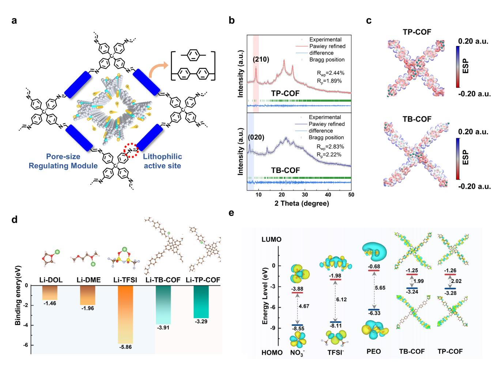
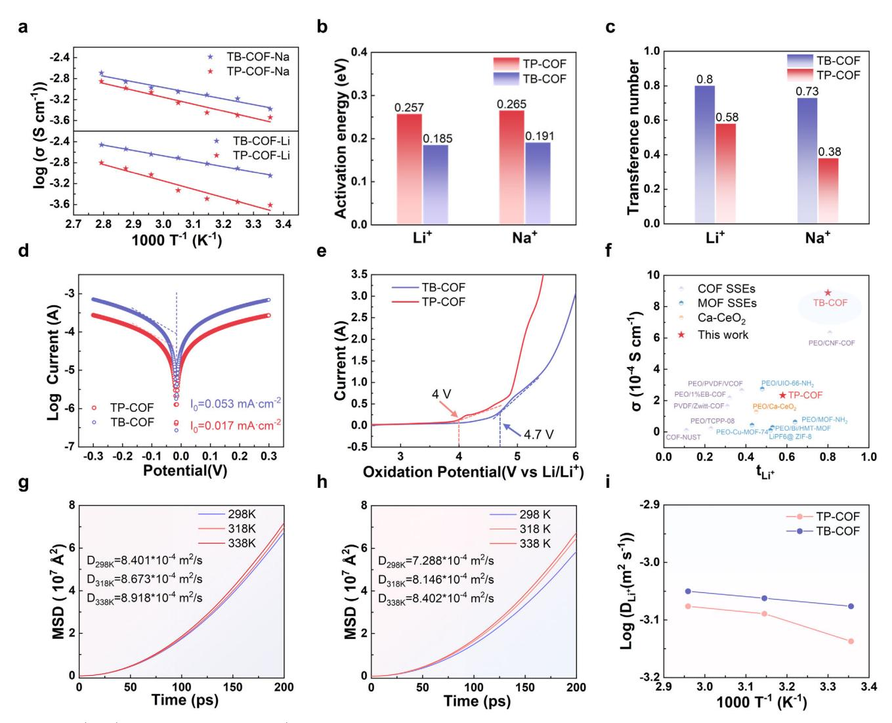
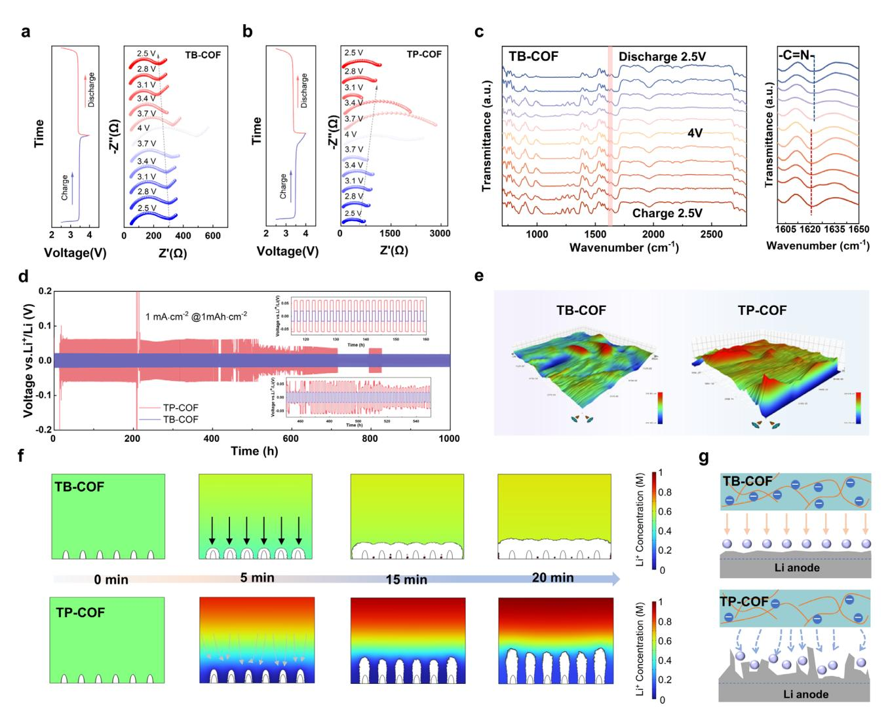
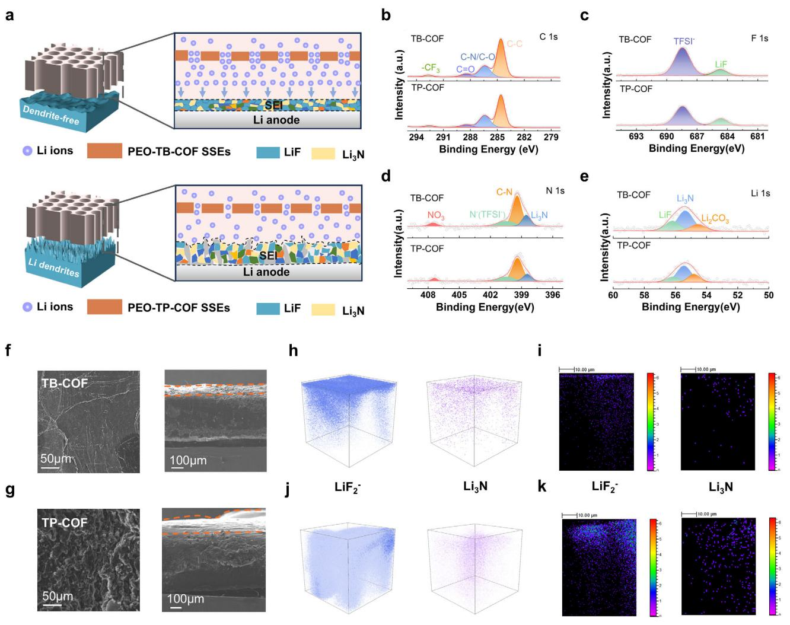
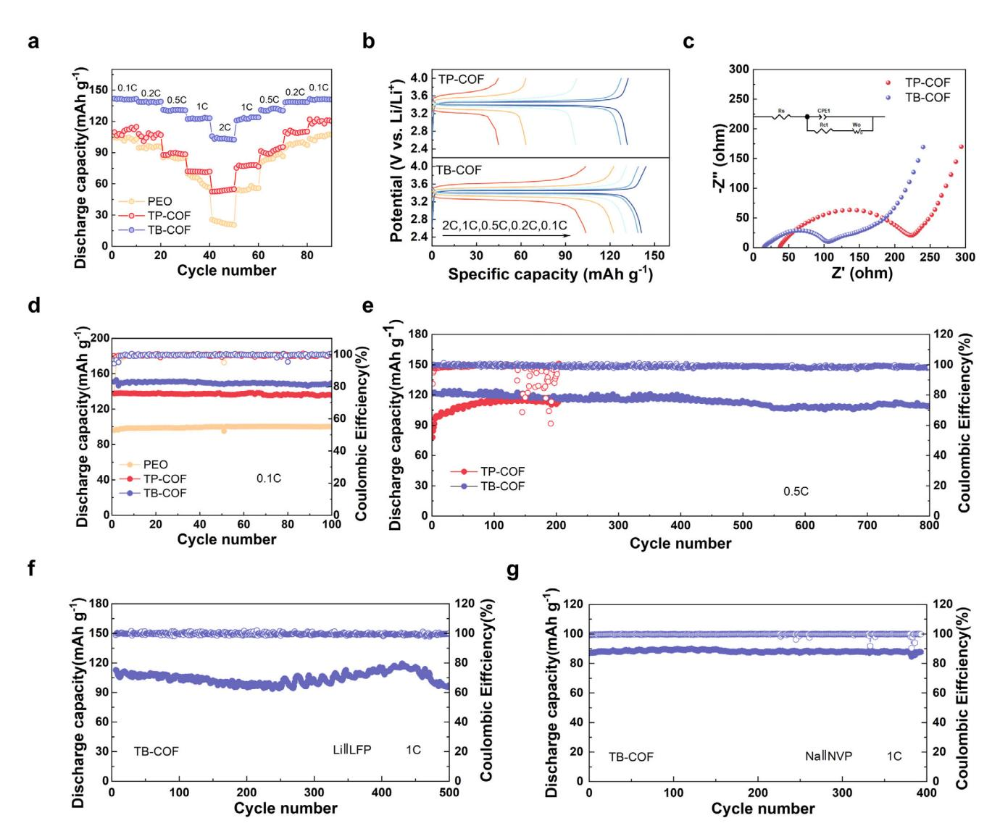

# **Engineering 4-Connecting 3D Covalent Organic Frameworks with Oriented Li+ Channels for High-Performance Solid-State Electrolyte in Lithium Metal Battery**

*Yanan Zhang, Chi Shan, Zhuo Chen, Shun Wang, Chenhui Wei, Yuanyuan Tian, Xilang Jin,\* Yaoxiao Zhao, Xiangyu Liu, Yaoyu Wang, and Wenhuan Huang\**

**The development of rapid and stable ion-conductive channels is pivotal for solid-state electrolytes (SSEs) in achieving high-performance lithium metal batteries (LMBs). Covalent organic frameworks (COFs) have emerged as promising Li-ion conductors due to their well-defined channel architecture, facile chemical tunability, and mechanical robustness. However, the limited active sites and restricted segmental motion for Li+ migration significantly impede their ionic conductivity. Herein, a rational design strategy is presented to construct 3D porous COF frameworks (TP-COF and TB-COF) using linear ditopic monomers connected via C**─**C and C**─**N linkages. These COFs, integrated with polymer electrolytes, provide enhanced Li+ transport pathways and stabilize lithium anodes in LMBs. The TB-COF, featuring larger pore apertures and abundant** ─**C**═**N**─ **active sites, facilitates superior Li+ conduction (8.89 × 10−4 S cm−1) and a high transference number (0.80) by enhancing lithium salt dissolution. LiF/Li3N-rich SEI enables uniform Li deposition, enabling PEO-TB-COF SSEs to achieve** *>***1000 h stability at 1 mA cm−2 while retaining 90% capacity through 800 cycles (0.5 C) in LFP||Li cells. Molecular dynamics simulations and COMSOL Multiphysics modeling reveal that extended Li+ transport channels and reduced interfacial diffusion barriers are key to enhanced performance.**

#### ion batteries (LIBs) due to their high theoretical capacity and low redox potential, which can significantly enhance energy density through the low operating voltage and high specific capacity of metallic lithium.[\[1,2\]](#page-9-0) However, the use of conventional liquid electrolytes poses significant safety challenges, including high flammability and potential leakage. Replacing liquid electrolytes with solid-state electrolytes (SSEs) offers a viable solution, as SSEs exhibit superior mechanical strength and can effectively suppress lithium dendrite growth.[\[3–5\]](#page-9-0) SSEs are generally categorized into solid inorganic electrolytes (SIEs) and solid polymer electrolytes (SPEs). While SIEs demonstrate excellent ionic conductivity (10−1–10−3 S cm−1) and mechanical strength, their rigid and rough surfaces result in poor electrode contact, high interfacial impedance, and limited stability.[\[6,7\]](#page-9-0) In contrast, SPEs, composed of flexible linear polymers, offer improved interfacial compatibility and cycling stability.[\[8–11\]](#page-9-0) However, their ionic conductivity remains

# **1. Introduction**

Lithium metal batteries (LMBs) are emerging as a promising next-generation energy storage technology to replace lithium-

Y. Zhang, C. Shan, Z. Chen, S. Wang, Y. Tian, W. Huang Key Laboratory of Chemical Additives for China National Light Industry College of Chemistry and Chemical Engineering Shaanxi University of Science and Technology Xi'an 710021, P. R. China E-mail: [huangwenhuan@sust.edu.cn](mailto:huangwenhuan@sust.edu.cn) Y. Zhang, C. Shan, Z. Chen, S. Wang, Y. Tian, W. Huang Flexible Energy storage and Interfacial Chemistry Key Laboratory of Shaanxi University College of Chemistry and Chemical Engineering Shaanxi University of Science and Technology Xi'an 710021, P. R. China

The ORCID identification number(s) for the author(s) of this article can be found under <https://doi.org/10.1002/smll.202502407>

**DOI: 10.1002/smll.202502407**

inadequate (10−7–10−5 S cm−1), limiting practical applications.[\[12\]](#page-9-0) For instance, polyethylene oxide (PEO) is a leading candidate for SPEs due to its viscoelastic properties and strong lithium-ion coordination. Nevertheless, its high crystallinity and low ionic

C. Wei, X. Jin, Y. Zhao School of Materials and Chemical Engineering Xi'an Technological University Xi'an 710021, P. R. China E-mail: [jinxilang@xatu.edu.cn](mailto:jinxilang@xatu.edu.cn) X. Liu State Key Laboratory of High-Efficiency Utilization of Coal and Green Chemical Engineering College of Chemistry and Chemical Engineering Ningxia University Yinchuan 750021, P. R. China Y. Wang Key Laboratory of Synthetic and Natural Functional Molecule of the Ministry of Education Shaanxi Key Laboratory of Physico-Inorganic Chemistry College of Chemistry and Materials Science Northwest University Xi'an 710127, P. R. China

conductivity at ambient temperatures hinder its widespread  $use.$ [13]

To address these limitations, incorporating functional fillers into SPEs has emerged as a promising strategy. These fillers can disrupt polymer crystallinity while creating more favorable Li+ transport channels[14,15] Among potential fillers, porous crystalline frameworks such as metal-organic frameworks (MOFs), covalent organic frameworks (COFs), and hydrogen-bonded organic frameworks (HOFs) have garnered significant attention due to their structural tunability, ordered channels, and facile functionalization.[16,17] COFs, in particular, stand out for their superior chemical and thermal stability, which is attributed to robust covalent bonds, making them ideal candidates for Libased batteries.[18] Their adjustable pore structures enable excellent electrolyte wettability and efficient ion transport.[19] Recent research has explored various strategies to enhance the ionic conductivity of COFs, including pore size regulation, functional group incorporation, and host-guest interactions.[20,21] The pore size with a wide range of 0.52–6.50 nm was designed to reduce ionic diffusion energy barrier.[21,22] For example, Chen et al. demonstrated that COFs with larger pore sizes and higher specific surface areas facilitate ion migration and enhance capacity.[23] However, ionic conductivity is influenced by multiple factors beyond pore size, such as pore wall functionality and segmental dynamics.[24] Furthermore, functional group engineering has proven effective in accelerating ion transport. Sun et al. reported COFs with dual-active centers ( $C=O$  and  $C=N$ ) groups), which exhibited enhanced lithium-ion capture and diffusion capabilities.[25] Similarly, Yu et al. synthesized polymer frameworks co-modified with —CN and —F groups, significantly boosting ionic conductivity in PEO-based SSEs.[14] Despite these advancements, the interplay between structural modifications and ionic transport mechanisms remains insufficiently understood, necessitating further exploration. Inspired by these findings, this study focuses on regulating pore size and modifying active sites in COFs to optimize Li+ transport pathways and elucidate the underlying transport mechanisms.

Herein, we report the design of two 3D COFs (TP-COF and TB-COF) with imine-linked porous structures and abundant  $-C=N$  active sites. 3D COFs outperform 2D counterparts in LMBs through enhanced surface area, reduced density, and abundant active sites that facilitate Li+ transport, while their rigid porous frameworks regulate ion flux for uniform Li depositioncontrasting with 2D COFs' layered stacking that induces current heterogeneity and dendrite proliferation.[26-28] The robust C=N bonds not only enhance thermal/chemical stability and cycling durability but also facilitate  $C=N$ –Li interactions that homogenize ion flux, eliminate anode hotspots, and direct uniform nucleation, thereby comprehensively suppressing lithium dendrite formation.[29] Therefore, these COFs were incorporated into PEO to prepare SSEs for LMBs. Experimental results combined with theoretical simulations revealed that the large open channels and active sites in TB-COF facilitate rapid and continuous Li+ transport, significantly enhancing ionic conductivity (8.89  $\times$  $10^{-4}$  S cm-1 at 25 °C) and Li+ mobility (transference number  $= 0.80$ ). Moreover, the enlarged pore size promotes the formation of a LiF/Li2N-rich solid electrolyte interface (SEI), enabling uniform lithium deposition. The quasi-solid-state battery assembled with PEO-TB-COF SSEs demonstrated excellent rate performance and long-term cycling stability, retaining over 90% capacity after 800 cycles at 0.5 C. This study highlights the potential of rationally designed COFs with tailored pore structures and active sites as effective fillers in SPEs. It provides valuable insights into the development of high-performance, next-generation SSEs for LMBs, bridging the gap between material design and practical application.

### 2. Results and Discussion

#### 2.1. Design Principles and Characterization of Pore-Size-Modulated COF-Based SSEs

The precise design and chemical modification of solid-state electrolytes (SSEs) at the molecular level allow covalent organic frameworks (COFs) to serve as ideal models for investigating ion conduction mechanisms. Here, two COFs (TP-COF and TB-COF) with tailored pore structures and lithiophilic sites were synthesized via a  $[4 + 2]$  condensation reaction under solvothermal conditions. These COFs were constructed using a tetrahedral building block tetraminophenylmethane (TAPM) and two distinct linear ditopic monomers, terephthalaldehyde (PDA) and 4,4'-Biphenyldicarboxaldehyde (BPDA), forming imine-linked 3D porous structures based on diamond topology. This topology created 1D rectangular channels extending along the  $c$ -axis (**Figure 1a**; Figures S1 and S2, Supporting Information).[30,31]

To confirm the successful synthesis and structural integrity of the COFs, a series of advanced characterizations were performed. Powder X-ray diffraction (PXRD) patterns revealed well-defined diffraction peaks at  $2\theta = 8.9^{\circ}$  and 6.1° for TP-COF and TB-COF, corresponding to the (210) and (020) planes, respectively, indicative of long-range ordered structures and uniform pore size distribution (Figure 1b). Pawley refinement showed a strong agreement between experimental and simulated PXRD patterns, with low  $R_p$  and  $R_{wp}$  values (TP-COF:  $R_p = 1.89\%$ ,  $R_{wp} = 2.44\%$ ; TB-COF:  $R_p = 2.22\%$ ,  $R_{wp} = 2.83\%$ ).[30–32] The resulting crystalline powders were subjected to systematic morphological characterization using FE-SEM. As evidenced in Figure S3 (Supporting Information), both TP-COF and TB-COF exhibit well-defined hierarchical architectures with distinct core–shell configurations. Brunauer–Emmett–Teller (BET) measurements combined with the density functional theory model (DFT) analysis demonstrated that TB-COF exhibited a larger pore size (11.79 Å) compared to TP-COF (8.57 Å) (Figure S4, Supporting Information). Additionally, the simulation calculations using PLATON[33,34] program revealed that TB-COF exhibited higher porosity (77.2%) than TP-COF (62.7%), further confirming its advantages in both pore size and porosity compared to TP-COF. The larger pore size and porosity of TB-COF enhance electrolyte infiltration and Li+ transport efficiency within the ordered channels.

SSE membranes were fabricated via solution casting, incorporating 10 wt.% COFs as functional fillers to ensure the formation of continuous Li+ transport pathways (Figure S5, Supporting Information). The prepared diaphragm exhibited excellent flexibility and self-supporting properties (Figure S6, Supporting Information). SEM images showed a flat and dense crosssections with a thickness of  $\approx$ 127 µm (Figure S7, Supporting Information). EDS elemental mapping confirmed homogeneous distribution of C and N species throughout the matrix, verifying

**Figure 1.** Design of 3D COF aperture structures and characterization of their electronic structures. a) Synthesis of TB-COF and TP-COF; b) PXRD the Pawley refinement; c) Electrostatic potential (ESP) of repeating units from DFT calculations; d) Binding energies between Li+ and solvent molecules or COFs fragment. e) Calculated LUMO and HOMO energies and corresponding optimized geometrical structures of solvents and COFs.

successful TB-COF incorporation and uniform dispersion. Concurrent detection of F, O, and S elements with spatial uniformity further indicated complete dissolution and homogeneous distribution of LiTFSI salt within the PEO matrix (Figure S8, Supporting Information). Fourier transform infrared (FT-IR) spectra confirmed the presence of characteristic ─C═N─ stretching vibrations at 1620 cm−1, indicative of the successful incorporation of COFs[\[35\]](#page-10-0) (Figure S9, Supporting Information). XRD analyzed reveals distinct diffraction peaks at 19° and 23° for pure PEO SPEs (attributed to its crystalline phase), whereas the incorporation of TP-COF and TB-COF significantly attenuates peak intensity (Figure S10, Supporting Information). This crystallization inhibition effect is mainly due to the spatial site-blocking effect of the COF skeleton, which prevents the PEO molecular chains from regularizing. Notably, PEO-TB-COF SSEs with higher pore size exhibit weaker diffraction signals, indicating enhanced disruption of PEO chain ordering. Furthermore, Raman analyzed probed LiTFSI dissociation in PEO-COF SSEs. The deconvoluted spectra showed peaks at 738 cm−1 (free TFSI−) and 744 cm−1 (Li+-coordinated). TB-COF systems exhibited lower coordinated anions (14% vs 28%) and higher free TFSI− (86% vs 72%), indicating enhanced salt dissociation (Figure S11, Supporting Information). This improvement correlates with TB-COF's larger pores and increased surface area, which facilitate ion transport and migration number enhancement in SSEs.

The mechanical strength, thermal stability, and flammability of these COF-based membranes were systematically evaluated. Tensile testing revealed that PEO-TB-COF membranes exhibited the highest tensile strength (7.96 MPa), outperforming both PEO-TP-COF (5.95 MPa) and pure PEO membranes (2.04 MPa), further emphasizing their superior mechanical robustness (Figure S12, Supporting Information). Thermal stability tests using thermogravimetric analysis (TGA) indicated that PEO-TB-COF membranes decomposed at 420 °C (72% weight loss), significantly higher than PEO-TP-COF membranes, which began pyrolyzing at 355 °C (91% weight loss) (Figure S13, Supporting Information). Thermal shrinkage tests corroborated these findings, demonstrating enhanced thermal stability for PEO-TB-COF membranes (Figure S14, Supporting Information). Finally, contact angle measurements verified improved electrolyte wettability upon incorporating COFs into PEO membranes. This modification enhanced ionic conductivity and minimized impedance, demonstrating the efficacy of COF fillers in optimizing the electrochemical performance of SSEs (Figure **S15.** Supporting Information). The effects of TB-COF content (5, 10, 15 wt.%) on the performance of SSEs membranes were investigated through tensile testing, TGA, and ionic conductivity measurements. The results revealed 10 wt.% TB-COF exhibited optimal mechanical properties with a tensile strength of 7.96 MPa and an elongation at break of 521% (Figure S16, Supporting Information). TGA analysis indicated that the membrane with a 10% content has higher stability and can be stabilized up to 420 °C (Figure S17, Supporting Information). Ionic conductivity measurements showed the highest room-temperature conductivity (8.89  $\times$  10-4 S cm-1) has been obtained for the 10 wt.% system (Figure S18, Supporting Information). The above test results indicated that 10 wt.% TB-COF in the electrolytes is an optimal balance between ionic transport efficiency and mechanical durability.

**IDVANCED** SCIENCE NEWS www.advancedsciencenews.com

#### **2.2. Analysis and Calculation of Li+ Transport and Conduction Mechanism**

To explore the influence of the microenvironment in COF channels on ion migration, the optimal molecular models of TP-COF and TB-COF were computed using density functional theory (DFT), revealing distinct local charge distributions on the electrostatic potential (ESP) surface (Figure 1c). TP-COF, with its shorter connectors, exhibited higher negative charge density, resulting in confined Li+ distribution and reduced ion mobility. In contrast, the longer and more conjugated biphenyl pore walls of TB-COF reduced polarization and facilitated electron delocalization, weakening Li+ binding and enabling faster ion transport through extended 1D channels.[15] Moreover, the expanded channels in TB-COF exposed more high-affinity  $-C=N$  active sites, which enhanced the dissociation of Li+ and TFSI- ions within the channels. We further probed the interaction between  $Li^+$  and lithium salt dissociation in COF channels through DFT calculations (Figure 1d). The binding energy of Li+ to DOL and DME was found to be weak, whereas the binding energy with TFSI-, TB-COF, and TP-COF was stronger. Notably, the binding energy between Li $+$  and TB-COF was  $-3.91$  eV, much higher than that between  $Li^+$  and TP-COF (-3.29 eV). This stronger binding energy with TB-COF suggests a superior Li+ transport capability, attributed to the efficient utilization of lipophilic active sites facilitated by pore expansion. These enhanced interactions between TB-COF and  $Li^+$  are expected to significantly influence the  $Li^+$ migration number in PEO-TB-COF SSEs.[36]

Moreover, the highest occupied molecular orbital (HOMO) and the lowest unoccupied molecular orbital (LUMO) energy levels, which govern the redox behavior of materials, were also considered. The bandgap of TP-COF and TB-COF is comparable and much smaller than that of solvent molecules, indicating that electrons are more likely to migrate toward the COF active sites, thereby establishing specific and fast lithium-ion migration pathways (Figure 1e). Molecular orbital theory suggests that components with lower LUMO values, such as NO3- and TFSI-, are more likely to undergo reductive decomposition. These findings support the formation of a solid electrolyte interphase (SEI) layer rich in fluorine (F) and nitrogen (N) elements.[37,38] According to

the calculations, the larger pore size in TB-COF alleviates ion diffusion constraints and accommodates a greater influx of lithium salts. which benefits the rapid conduction of more free lithium ions (Figure S19, Supporting Information).

#### 2.3. Refined Pore Size of COFs for Enhanced Ion Migration Dynamics

Based To examine ion transport properties, the lithium and sodium ion conductivities of PEO-COF SSEs were measured using stainless steel symmetric cells across a temperature range of 25-85 °C. PEO-TB-COF SSEs demonstrated superior ionic conductivity across the entire temperature range compared to PEO-TP-COF SSEs (Figure 2a; Figures S20 and S21, Supporting Information). At 25 °C, the ion conductivity of PEO-TB-COF was  $8.89\times10^{-4}~\mathrm{S~cm^{-1}}$ , significantly surpassing that of PEO-TP-COF  $(2.43 \times 10^{-4} \text{ S cm}^{-1})$ . Similarly, Na+ conductivity was  $4.32 \times 10^{-4}$ S cm-1 for PEO-TB-COF, compared to  $2.21 \times 10^{-4}$  S cm-1 for PEO-TP-COF. Arrhenius plots revealed activation energies  $(E_2)$ of 0.185 eV and 0.257 eV for Li+ migration in PEO-TB-COF and PEO-TP-COF, respectively, both lower than those for Na+ migration (0.191 and 0.265 eV) (Figure 2b). This suggests higher  $Li^+$ ion conductivity in the COF-based SSEs.

Further, symmetric Li/Na| PEO-COF SSEs| Na/Li cells were assembled at 25  $\degree$ C to evaluate ion migration capabilities (Figure 2c; Figures S22 and S23, Supporting Information). The lithium and sodium ion transport numbers ( $t_{Li}^+$  = 0.80,  $t_{Na}^+$  = 0.73) were calculated for PEO-TB-COF SSEs, while PEO-TP-COF SSEs exhibited  $t_{1i}^+$  and  $t_{Na}^+$  values of 0.58 and 0.38, respectively. These results demonstrate that PEO-TB-COF SSEs exhibit excellent dynamic behavior due to reduced constraints within the expanded pore channels. The larger pore size plays a crucial role in enhancing ion migration (Figure S24, Supporting Information). In terms of ion conductivity and transport number, PEO-TB-COF SSEs significantly outperform other reported PEO-based SSEs (Figure 2f; Table S1, Supporting Information). Additionally, PEO-TB-COF SSEs exhibited a higher exchange current density as indicated by the Tafel curve analysis (Figure 2d), suggesting superior interfacial ion transport kinetics. Furthermore, the electrochemical stability window of PEO-TB-COF SSEs extended to 4.7 V (vs  $Li^+/Li$ ), whereas the PEO-TP-COF SSEs had a reduced window of  $4.0 \text{ V}$  (Figure 2e).

To further investigate the effect of large ion-oriented channels in COFs on Li+ transport, molecular dynamics (MD) simulations were employed to elucidate the mechanisms of ionic conductivity. The Mean Square Displacement (MSD) at different temperatures was calculated to examine Li+ diffusion (Figure 2g,h). The results confirmed that the diffusivity of TB-COF is 8.401  $\times$  10-4 m2 s-1 at 298 K, while the diffusivity of TP-COF is 7.288  $\times$  10-4 m2 s-1, demonstrating the superior ion migration capability of TB-COF. The Li+ diffusion coefficient increases significantly with temperature, as shown by the simulated Arrhenius plot, indicating that the activation energy for Li+ migration in TB-COF is lower than in TP-COF (Figure 2i).[15]

As shown in the radial distribution function (RDF) within the simplified model (**Figure 3b**), the Li-N (TFSI $-$ ) peak for TP-COF appears around 3.5 nm, whereas in TB-COF, Li-N (TFSI $-$ ) is found at a greater distance, primarily at 4.25 nm. This www.advancedsciencenews.com

IENCE NEWS

**Figure 2.** Li+/Na+ transport properties and Li+ conduction mechanism in PEO-COF SSEs. a) Arrhenius ionic conductivity ( $\sigma$ ) plots of PEO-COF-Na and PEO-COF-Li; b,c) Comparison of Li+/Na+ activation energy ( $E_a$ ) (b) and Li+/Na+ transference number (c); d) Tafel curves of symmetric cells; e) Linear sweep voltammetry curves of PEO-COF SSEs; f) Comparison of the typical performance of reported Li+ SSEs (the numerical values and testing temperature for the ionic conductivities provided in Supplementary Table 1); g,h) MSD versus diffusion time ( $\tau$ ) of Li+ transport of TB-COF (g) and TP-COF SSEs (h); i) Arrhenius plot of  $Li^+$  diffusivity of TP-COF and TB-COF SSEs from MD simulations.

observation can be attributed to the high charge delocalization within TB-COF, which enhances the utilization of active sites in the porous channels and facilitates the dissociation of more  $Li^+$ ions from lithium salts. Subsequently, the migration behavior of Li+ in COF channels was analyzed, and it was found that the Li+ migration rate in TB-COF exceeds that in TP-COF, consistent with the conductivity test results (Figure 3a). Subsequently, the migration paths of lithium ions were analyzed from both side and top views. As illustrated in the simulation snapshots (Figure  $3c-f$ ; Figures S25 and S26, Movie S1, Supporting Information), the extended ligand linkages in TB-COF endow it with larger pore sizes, which enables the  $-C=N$ -lithiophilic active sites to be more readily exposed on the surface or within the channels. This configuration increases the contact area and opportunities between Li+ and active sites, thereby forming uniformly distributed and broad ion transport channels with enhanced active site accessibility. Consequently, TB-COF channels can accommodate higher lithium salt content. The improved nitrogen utilization in active sites facilitates strong ion-dipole interactions, which promote the dissociation of lithium salts. Additionally, the reduced oscillation range of lithium ions within the channels contributes to rapid Li+ transport (Figure 3e,f). In TP-COF, the smaller pore sizes limit lithium salt accommodation and may suffer from channel blockage or closure. This structural constraint conceals portions of active sites within the material, diminishing their accessibility and utilization. The restricted interaction between  $Li^+$  and  $-C=N$ —lithiophilic sites weakens the binding capability of TP-COF with Li+, resulting in larger vibrational amplitudes of  $Li^+$  (Figure 3c,d). Consequently, the lower content of free Li+ in TP-COF channels experiences slower diffusion rates due to these structural limitations. In summary, the large open channels in TB-COF expose more active

**Figure 3.** Effects of Pore Expansion on Lithium-Ion Transport in Electrolytes and the Dissociation of Lithium Salts Studied Through MD Simulations. a) Simulated structures and schematic diagram of cavities of TP-COF-Li (left) and TB-COF-Li SSEs(right) b) Li-N(COF) and Li-N(TFSI−) radial distribution function; c,e) The Schematic illustration of LiTFSI dissociation in two different PEO-COFs SSEs; d,f) Structural snapshots from MD simulations of a fast-moving Li+ transporting in TP-COF (d) and TB-COF SSEs (f).

sites with high lithium affinity via ion-dipole interactions and reduce the vibration range of lithium ions, promoting rapid and ordered Li+ diffusion along the wide 1D channels. In contrast, the relatively narrow and confined transport channels in TP-COF lead to slower Li+ diffusion and a reduced transmission rate.

#### **2.4. Uniform Li Deposition and SEI Stabilization**

To elucidate the reaction kinetics during charge/discharge cycles and the interfacial stability, in situ electrochemical impedance spectroscopy (EIS) was conducted on LFP/PEO-COF SSEs/Li cells (**Figure 4**[a,b\)](#page-6-0). The PEO-TB-COF SSEs exhibited consistent charge transfer impedance (*R*ct) values in the high-frequency region, suggesting that dead lithium formation was minimal, and a stable SEI was established, enabling the reliable operation of LFP/SSEs/Li cells.[\[39\]](#page-10-0) Conversely, PEO-TP-COF SSEs displayed persistently higher *R*ct values, indicative of potential dead lithium formation, interfacial degradation, and irreversible capacity loss.

Fourier transform infrared spectroscopy (FTIR) analysis of the prepared SSEs under varying voltages revealed significant shifts in the ─C═N─ peaks, confirming their coordination with Li+ ions (Figure [4c\)](#page-6-0). This coordination promoted uniform lithium ions flux and facilitated the homogeneous nucleation of lithium ions on the anode surface, effectively suppressing dendrite growth.[\[25,40\]](#page-10-0) To assess the mechanical stability during lithium plating and stripping, Li/SSEs/Li symmetric cells were assembled (Figure [4d\)](#page-6-0). The Li/PEO-TB-COF/Li cells demonstrated a low overpotential of 40 mV at 1.0 mA cm−2 over 1000 h, indicating excellent interfacial compatibility and long-term stability. In contrast, PEO-TP-COF SSEs exhibited a sharp increase in overpotential, leading to a short circuit at 210 h, suggesting the forma-

**Figure 4.** Interfacial stability of solid-state electrolytes and inhibition of lithium dendrite growth. a,b) Illustration of the in situ EIS of full cells for PEO-COF SSEs; c) FT-IR spectra of PEO-TB-COF SSEs at different charging voltages and discharge voltages; d) Comparison of cycling performance of Li// Li symmetric cells with the TP-COF and TB-COF electrolytes plating/ striping at 1 mA cm−2/1 mAh cm−2 for 1000 h, the insets show the enlarged view of cycle stages; e) Step meter test plot of PEO-COF SSEs after 1000 h; f) The Li+ concentration distribution in the PEO-COF SSEs during the Li plating process at 1 mA cm−2 by COMSOL.

tion of an unstable solid electrolyte layer. Additionally, Li/PEO-TB-COF/Li cells displayed stable oscillations under increasing current densities, highlighting superior rate performance (Figure S27, Supporting Information). Moreover, surface profilometry of the two PEO-COF SSEs membranes after extended cycling revealed that the PEO-TB-COF SSEs maintained a dense and uniform surface, effectively mitigating lithium dendrite growth in long-cycling cells (Figure 4e).

To further analyze the lithium plating/stripping behavior and interfacial stability, COMSOL Multiphysics simulations were conducted to examine the concentration distribution, current density distribution, and interfacial electric field of the PEO-COF SSEs (Figure S28, Supporting Information). For PEO-TP-COF SSEs, low Li+ mobility and high TFSI− concentration gradients hindered Li+ transport, resulting in a more significant Li+ concentration gradient during the plating/stripping process[\[41–43\]](#page-10-0) (Figure 4f). Over time, non-uniform Li+ deposition and increased diffusion barriers caused an uneven interfacial electric field and localized current density, promoting continuous dendrite growth (Figures S29 and S30, Supporting Information). By contrast, PEO-TB-COF SSEs, with their larger ion channels, facilitated enhanced Li+ diffusion, reduced nucleation barriers, and ensured uniform Li+ nucleation, thereby mitigating electric field variations on the Li metal surface. Experimental and theoretical results confirm that larger pore channels in PEO-TB-COF effectively regulate lithium plating/stripping behavior and suppress dendrite formation (Figure 4g).

Correspondingly, the SEI formation processes were further investigated (**Figure 5**[a\)](#page-7-0). XPS analysis of the lithium anode surface from detached cells identified the chemical composition and valence states of the SEI (Figure [5b–e\)](#page-7-0). The C1s spectra showed peaks corresponding to C─C, C─O, O─C═O, and -CF3, indicative of contributions from the electrolyte and minor additives. The F1s XPS spectra revealed a prominent LiF peak at 684.7 eV,

**Figure 5.** Microscopic characterization and mechanistic study of anode-measured enriched LiF/Li3N SEIs. a) The Schematic illustration of Li migration in two different PEO-COFs SSEs; b–e) XPS spectra of the lithium anode surface; f,g) SEM images of Li anode surface in LFP//Li cell after 10 cycles; h–k) TOF-SIMS 3D and 2D spectra of LiF2 − and Li3N for the Li anode surface of the PEO-TB-COF and PEO-TP-COF SSEs.

while N1s spectra exhibited a strong Li3N peak at 398.5 eV for lithium cycled with PEO-TB-COF SSEs. These results suggest the SEI primarily comprises LiF and Li3N, likely formed from the decomposition of LiTFSI and LiNO3. The larger pore size of TB-COF promoted more efficient LiTFSI dissociation and TFSI− decomposition, forming a LiF/ Li3N-rich SEI layer with high mechanical strength, low Li+ diffusion barriers, and excellent thermal stability. This robust SEI layer facilitated rapid lithium ions transfer and uniform deposition during cycling, resulting in a smooth and dense deposition morphology.[\[44\]](#page-10-0)

Subsequently, scanning electron microscopy (SEM) images of the lithium anode after 10 cycles in LFP/PEO-TB-COF SSEs/Li cells revealed uniform lithium deposition, effectively inhibiting dendrite growth (Figure 5f). In contrast, the PEO-TP-COF SSEs exhibited loose and irregular "dead lithium" deposits (Figure 5g). Time-of-flight secondary ion mass spectrometry (TOF-SIMS) depth profiles further corroborated these findings, showing higher LiF and Li3N signals with denser, thinner distributions on the lithium surfaces of PEO-TB-COF SSEs compared to PEO- TP-COF SSEs (Figure 5h–k; Figures S31–S33, Supporting Information).

#### **2.5. Assembly and Performance of Quasi -Solid-State LFP/SSEs/Li Cells**

To evaluate the electrochemical performance of PEO-COF membranes in lithium metal batteries (LMBs), LFP/PEO-COF/Li CR2032 coin cells were assembled, and compared with cells using PEO SPEs. Their rate performance and charge/discharge characteristics at varying current densities were analyzed (**Figure 6**[a,b\)](#page-8-0). The LFP/PEO-TB-COF/Li batteries exhibited average discharge capacities of 141, 139, 131, 123, and 103 mA h g−1 at 0.1, 0.2, 0.5, 1, and 2 C, respectively, demonstrating excellent rate capability. In comparison, cells containing PEO-TP-COF SSEs exhibit progressively lower capacities (114, 108, 88, 72, and 53 mA h g−1) under identical testing conditions. The control group with pure PEO SPEs shows further diminished performance (101, 95,

**Figure 6.** Electrochemical performance of quasi-solid-state metal batteries. a–d) Rate capability(a), Charge–discharge (b) and Nyquist plots profiles (c) Cycling performance at 0.1C (d) comparison of the LFP//Li cells using the PEO-COF SSEs and PEO SPEs; e) Cycling performance of LFP/PEO-COF SSEs/Li cells at 0.5 C (e); f,g) Cycling performances of the LFP//Li cell and NVP//Na cell assembled with PEO-TB-COF-Li and PEO-TB-COF-Na SSEs at 1C.

85, 56, and 53 mA h g−1), confirming the critical role of COF fillers in electrolyte optimization. Notably, the overall resistance of the PEO-TB-COF cell was lower than that of the PEO-TP-COF cell, indicating superior ionic conductivity and interfacial compatibility (Figure 6c).

The cyclic voltammetry (CV) curves of the PEO-TB-COF cell revealed a smaller potential gap and higher current response, suggesting enhanced ionic and electronic conduction and faster Li+ diffusion kinetics (Figure S34, Supporting Information). Additionally, the LFP/PEO-TB-COF/Li full cell delivered an initial discharge capacity of 151 mA h g−1 at 0.1 C, with a capacity retention of 99% after 100 cycles (Figure 6d). Even under higher cycling rates, the full cell maintained excellent performance, retaining ≈90% of its initial capacity after 800 cycles at 0.5 C (Figure 6e). At high current rates of 1 and 2 C, the cell sustained specific capacities of 115 and 92 mA h g−1, respectively (Figure 6f; Figures S35 and S36, Supporting Information). In contrast, the LFP/PEO-TP-COF/Li cell showed an initial discharge capacity of 140 mA h g−1 at 0.1 C but experienced rapid degradation, failing after 140 cycles at 0.5 C. The pristine PEO SPEs exhibited an initial specific capacity of merely 99 mA h g−1 when cycled at 0.1 C rate under room-temperature conditions. Considering the wide ESW of PEO-TB-COF, high voltage NCM811 cathode was employed and the cycling performance is tested at 3.0–4.3 V in Figure S37 (Supporting Information). Li/PEO-TB-COF SSEs/NCM811 battery presents reversible capacities of 161.1 mA h g−1 at 0.1 C. A flexible pouch cell with PEO-TB-COF SSEs stably illuminated an LED under standard conditions and maintained discharge after cropping, demonstrating the material's safety and utility (Figure S38, Supporting Information).

To further validate the versatility of the PEO-TB-COF SSEs, quasi-solid-state sodium batteries were developed using a vanadium phosphate sodium (NVP) cathode. The NVP| PEO-TB-COF| Na cell demonstrated exceptional performance, achieving an initial capacity of 87 mA h g−1 at 1 C and retaining nearly 100% of its capacity after 400 cycles (Figure [6g;](#page-8-0) Figure S39, Supporting Information). These results underscore the robust performance of the PEO-TB-COF membrane, which not only excels in lithium metal batteries but also shows promising applicability in sodiumbased quasi-solid-state batteries.

### **3. Conclusion**

In summary, we successfully developed 4-connected 3D COFs with tailored pore structures and lithiophilic sites to fabricate high-performance SSE for LMB. The resulting PEO-TB-COF SSEs exhibited exceptional ionic conductivity (8.89 × 10−4 S cm−1 at 25 °C) and a high Li+ transference number (*t*Li+ = 0.80), attributed to their well-organized ion transport channels and abundant exposed active sites that facilitate efficient Li+ flux. The larger open channels of the TB-COF significantly enhanced the utilization of active sites and enabled rapid, orderly Li+ diffusion. Moreover, the in situ formation of a LiF/Li3N-rich SEI during cycling contributed to uniform lithium deposition, effectively suppressing lithium dendrite growth. This led to a remarkably low overpotential and high cycling stability, achieving a lifespan of over 1000 h at 1 mA cm−2 in Li–Li symmetric cells. Additionally, quasi-solid-state lithium batteries employing PEO-TB-COF SSEs demonstrated outstanding cycling stability (over 800 h at 0.5 mA cm−2) and superior rate performance. This work provides valuable insights into the rational design of structurally optimized SSEs and highlights the strategic importance of filler selection for advancing the performance and safety of LMBs.

# **Supporting Information**

Supporting Information is available from the Wiley Online Library or from the author.

# **Acknowledgements**

This work received financial support from the National Natural Science Foundation of China (22271178), the Shaanxi Special Support Program– Youth Top Talent Project, International Cooperation Key Project of Science and Technology Department of Shaanxi, China (2022KWZ-06), the Research project of Xi'an Science and Technology Bureau (2022GXFW0011), the Xi'an Science and Technology Plan Project (24GXFW0004), the Shaanxi Fundamental Science Research Project for Chemistry and Biology (Grant no. 23JHQ008), the National Natural Science Foundation of China (22463010), the Beijing Natural Science Foundation (2232033), the Young Top-notch Talent Cultivation Program of Ningxia Province, and the Project of Central Government Guides Local Science and Technology Development (2024FRD05053).

# **Conflict of Interest**

The authors declare no conflict of interest.

# **Author Contributions**

Y.N.Z. and C.S. designed the experiments. C.S. analyzed the data and wrote the manuscript-original draft. W.H.H. modified the manuscript and

# **Data Availability Statement**

The data that support the findings of this study are available from the corresponding author upon reasonable request.

### **Keywords**

covalent organic framework, Li+ and Na+ ionic conductivity, Li metal battery, pore structural design, solid-state electrolytes

> Received: March 20, 2025 Published online: April 21, 2025

- [1] Q. Chen, B. Gao, Z. Yang, Y. Li, Q. Zhai, Y. Jia, Q. Zhang, X. Gu, J. Zuo, L. Wang, T. Wang, P. Zhai, C. Yang, Y. Gong, *Nat. Commun.* **2024**, *15*, 10045.
- [2] S. Kim, G. Park, S. J. Lee, S. Seo, K. Ryu, C. H. Kim, J. W. Choi, *Adv. Mater.* **2023**, *35*, 2206625.
- [3] Y. He, C. Wang, R. Zhang, P. Zou, Z. Chen, S. M. Bak, S. E. Trask, Y. Du, R. Lin, E. Hu, H. L. Xin, *Nat. Commun.* **2024**, *15*, 10015.
- [4] Q. Zhao, S. Stalin, C. Z. Zhao, L. A. Archer, *Nat. Rev. Mater.* **2020**, *5*, 229.
- [5] Y. Zhang, R. Qiao, Q. Nie, P. Zhao, Y. Li, Y. Hong, S. Chen, C. Li, B. Sun, H. Fan, J. Deng, J. Xie, F. Liu, J. Song, *Nat. Commun.* **2024**, *15*, 4454.
- [6] P. Dong, X. Zhang, W. Hiscox, J. Liu, J. Zamora, X. Li, M. Su, Q. Zhang, X. Guo, J. McCloy, M. K. Song, *Adv. Mater.* **2023**, *35*, 2211841.
- [7] J. Peng, D. Lu, S. Wu, N. Yang, Y. Cui, Z. Ma, M. Liu, Y. Shi, Y. Sun, J. Niu, F. Wang, *J. Am. Chem. Soc.* **2024**, *146*, 11897.
- [8] G. Ye, L. Zhu, Y. Ma, M. He, C. Zheng, K. Shen, X. Hong, Z. Xiao, Y. Jia, P. Gao, Q. Pang, *J. Am. Chem. Soc.* **2024**, *146*, 27668.
- [9] J. Li, D. Guan, X. Wang, C. Miao, J. Li, J. Xu, *Adv. Mater.* **2024**, *36*, 2312661.
- [10] X. Xie, P. Zhang, X. Li, Z. Wang, X. Qin, M. Shao, L. Zhang, W. Zhou, *J. Am. Chem. Soc.* **2024**, *146*, 5940.
- [11] L. T. Wu, E. K. W. Andersson, M. Hahlin, J. Mindemark, D. Brandell, J. C. Jiang, *Sci. Rep.* **2023**, *13*, 9060.
- [12] X. Zhan, M. Li, X. Zhao, Y. Wang, S. Li, W. Wang, J. Lin, Z. A. Nan, J. Yan, Z. Sun, H. Liu, F. Wang, J. Wan, J. Liu, Q. Zhang, L. Zhang, *Nat. Commun.* **2024**, *15*, 1056.
- [13] H. An, M. Li, Q. Liu, Y. Song, J. Liu, Z. Yu, X. Liu, B. Deng, J. Wang, *Nat. Commun.* **2024**, *15*, 9150.
- [14] X. Yang, L. Fang, J. Li, C. Liu, L. Zhong, F. Yang, X. Wang, Z. Zhang, D. Yu, *Angew. Chem., Int. Ed.* **2024**, *63*, 202401957.
- [15] X. Wang, L. Song, L. Zheng, D. Guan, C. Miao, J. Li, J. Li, J. Xu, *Angew. Chem., Int. Ed.* **2023**, *62*, 202308837.
- [16] L. Ding, X. Yue, X. Zhang, Y. Chen, J. Liu, Z. Shi, Z. Wang, X. Yan, Z. Liang, *Proc. Natl. Acad. Sci., U. S. A.* **2023**, *120*, 2314264120.
- [17] Y. N. Zhang, C. Y. Su, J. L. Chen, W. H. Huang, R. Lou, *Rare Met.* **2023**, *42*, 769.
- [18] J. Xue, Z. Sun, B. Sun, C. Zhao, Y. Yang, F. Huo, A. Cabot, H. K. Liu, S. X. Dou, *ACS Nano* **2024**, *18*, 17439.
- [19] G. Qiao, X. Wang, X. Li, J. Li, K. Geng, E. Jin, J. Xu, J. Yu, *J. Am. Chem. Soc.* **2024**, *146*, 3373.
- [20] S. Haldar, A. Schneemann, S. Kaskel, *J. Am. Chem. Soc.* **2023**, *145*, 13494.

- [21] Y. Yan, Z. Liu, T. Wan, W. Li, Z. Qiu, C. Chi, C. Huangfu, G. Wang, B. Qi, Y. Yan, T. Wei, Z. Fan, *Nat. Commun.* **2023**, *14*, 3066.
- [22] S. D. Diwakara, W. S. Y. Ong, Y. H. Wijesundara, R. L. Gearhart, F. C. Herbert, S. G. Fisher, G. T. McCandless, S. B. Alahakoon, J. J. Gassensmith, S. C. Dodani, R. A. Smaldone, *J. Am. Chem. Soc.* **2022**, *144*, 2468.
- [23] J. Zhao, M. Zhou, J. Chen, L. Tao, Q. Zhang, Z. Li, S. Zhong, H. Fu, H. Wang, L. Wu, *Chem. Eng. J.* **2021**, *425*, 1385.
- [24] Y. Cao, M. Wang, H. Wang, C. Han, F. Pan, J. Sun, *Adv. Energy Mater.* **2022**, *12*, 2200057.
- [25] G. Zhao, H. Li, Z. Gao, L. Xu, Z. Mei, S. Cai, T. Liu, X. Yang, H. Guo, X. Sun, *Adv. Funct. Mater.* **2021**, *31*, 2101019.
- [26] T. Zhu, Y. Kong, B. Lyu, L. Cao, B. Shi, X. Wang, X. Pang, C. Fan, C. Yang, H. Wu, Z. Jiang, *Nat. Commun.* **2023**, *14*, 5926.
- [27] S. Zheng, Y. Fu, S. Bi, X. Yang, X. Xu, X. Li, Q. Xu, G. Zeng, *Angew. Chem., Int. Ed.* **2025**, *64*, 202417973.
- [28] M. Xu, D. Li, Y. Feng, Y. Yuan, Y. Wu, H. Zhao, R. V. Kumar, G. Feng, K. Xi, *Adv. Mater.* **2024**, *36*, 2405079.
- [29] Y. Yang, S. Yao, Y. Wu, J. Ding, Z. Liang, F. Li, M. Zhu, J. Liu, *Nano Lett.* **2023**, *23*, 5061.
- [30] F. J. Uribe -Romo, J. R. Hunt, H. Furukawa, C. Klock, M. O'Keeffe, O. M. Yaghi, *J. Am. Chem. Soc.* **2009**, *131*, 4570.
- [31] Y. B. Zhang, J. Su, H. Furukawa, Y. Yun, F. Gándara, A. Duong, X. Zou, O. M. Yaghi, *J. Am. Chem. Soc.* **2013**, *135*, 16336.

- [32] J. Li, J. Zhang, Y. Hou, J. Suo, J. Liu, H. Li, S. Qiu, V. Valtchev, Q. Fang, X. Liu, *Angew. Chem., Int. Ed.* **2024**, *63*, 202412452.
- [33] A. L. Spek, *PLATON, A Multipurpose Crystallographic Tool*, Utrecht Unversity Utrecht, The Netherlands **2001**.
- [34] A. L. Spek, *J. Appl. Crystallogr.* **2003**, *36*, 7.
- [35] Z. Li, X. Ding, Y. Feng, W. Feng, B. H. Han, *Macromolecules* **2019**, *52*, 1257.
- [36] Huang, W., Wang, S., Zhang, X., Kang, Y., Zhang, H., Deng, N., Liang, Y., Pang, H., *Adv. Mater.* **2023**, *35*, 2310147.
- [37] X. Miao, J. Hong, S. Huang, C. Huang, Y. Liu, M. Liu, Q. Zhang, H. Jin, *Adv. Funct. Mater.* **2024**, *35*, 2411751.
- [38] R. Lin, Y. Jin, X. Zhang, Y. Li, Y. Zhang, Y. Xiong, *Chem. Eng. J.* **2024**, *479*, 1385.
- [39] L. Yue, X. Wang, L. Chen, D. Shen, Z. Shao, H. Wu, S. Xiao, W. Liang, Y. Yua, Y. Li, *Enery Environ SCI* **2024**, *17*, 1117.
- [40] Y. Yang, S. Yao, Y. Wu, J. Ding, Z. Liang, F. Li, M. Zhu, J. Liu, *Nano Lett.* **2023**, *23*, 5061.
- [41] J. Guo, F. Feng, S. Zhao, R. Wang, M. Yang, Z. Shi, Y. Ren, Z. Ma, S. Chen, T. Liu, *Small* **2023**, *19*, 2206740.
- [42] X. Li, Y. Wang, K. Xi, W. Yu, J. Feng, G. Gao, H. Wu, Q. Jiang, A. Abdelkader, W. Hua, G. Zhong, S. Ding, *Nano-Micro Lett.* **2022**, *14*, 210.
- [43] X. Zhang, Q. Su, G. Du, B. Xu, S. Wang, Z. Chen, L. Wang, W. Huang, H. Pang, *Angew. Chem., Int. Ed.* **2023**, *62*, 202304947.
- [44] S. Sun, X. Zhang, Y. Wang, J. Li, Z. Zheng, J. Huang, *Mater. Today* **2024**, *77*, 39.