# **Ceramic–Polymer Composite Solid-State Electrolytes for Solid-State Lithium Metal Batteries: Mechanism, Strategy, and Prospect**

*Peng Chen, Bing Ding, Hui Dou,\* and Xiaogang Zhang\**

**The low energy density and safety problems of lithium-ion batteries based on liquid electrolyte have set off a new wave of high specific capacity and high safety battery design to meet the need of future market. Solid-state lithium metal battery has been widely concerned for its high energy density, safety, and electrochemical stability. Especially, polymer-based solid-state electrolytes (polymer SSEs) have attracted much attention due to the good interfacial contact, flexible mechanical properties, and physical/chemical stability. However, the deficiencies of low ionic conductivity and weak mechanical strength limit the further development of polymer SSEs. Here, hybrid ceramic–polymer composite solid-state electrolytes (CSSEs), specifically consisted of polymers and inorganic ceramic active fillers, can achieve good interfacial contact, high ionic conductivity, excellent mechanical properties, and Li dendrite growth inhibition. Based on the intrinsic characteristics of polymers, this review expounds the strategies to improve the performance of ceramic–polymer CSSEs. Especially, the screening and modification strategies of polymer and ceramic active fillers in recent years, including structural design, surface modification, and interface engineering, are reviewed. Finally, the core ideas of the existing designs, and proposed feasible solutions, aiming at providing future development and industrialization of ceramic–polymer CSSEs are summarized.**

# **1. Introduction**

Traditional lithium-ion batteries (LIBs) based on liquid electrolytes have been commercialized due to their high energy efficiency and well-established manufacturing processes, which are gradually occupying the market share in the 3C electronics, electrical vehicles, and grid storage systems.[\[1–3\]](#page-23-0) However, the lower energy density (200 W h kg−1) limited by the theoretical capacity of graphite anode and the safety concerns associated with organic liquid electrolytes have hindered further developments of

Jiangsu Key Laboratory of Electrochemical Energy Storage Technologies College of Materials Science and Technology Nanjing University of Aeronautics and Astronautics Nanjing 210016, P. R. China

E-mail: [dh\\_msc@nuaa.edu.cn;](mailto:dh_msc@nuaa.edu.cn) [azhangxg@nuaa.edu.cn](mailto:azhangxg@nuaa.edu.cn)

The ORCID identification number(s) for the author(s) of this article can be found under <https://doi.org/10.1002/smll.202503743>

**DOI: 10.1002/smll.202503743**

LIBs.[\[4, 5\]](#page-23-0) Currently, lithium metal anode delivers much higher theoretical specific capacity (3860 mA h g−1) than graphite anode and lowest oxidation–reduction potential −3.04 V vs the standard hydrogen electrode), which has been considered as the potential anode for lithium metal batteries (LMBs) to achieve high theoretical energy density.[\[6–9\]](#page-23-0) The conventional organic liquid electrolytes for LMBs have the advantages of excellent interfacial contact, high ionic conductivity, and variety Li+ transport channels (**Figure 1**[a\)](#page-1-0), but inevitably bringing about unstable interface induced uncontrollable Li dendrite growth, repeatedly rupture and repairment of solid-electrolyte interphase (SEI) layer, the formation of dead Li, and the safety risks.[\[10–12\]](#page-23-0) These problems may shorten the lifespan and deteriorate the Coulombic efficiency of the LMBs. The solid-state electrolytes (SSEs) with excellent mechanical properties and higher thermal stability, such as oxide SSEs, sulfide SSEs, polymer SSEs, etc., are potential choice to provide broadened operating temperature and adjustable electrochemical window for higher

energy density (Figure [1b\)](#page-1-0).[\[13, 14\]](#page-23-0) Despite above advantages, SSEs still face great challenges, such as poor interfacial contact,[\[15, 16\]](#page-23-0) low ionic conductivity, and limited ion transport. In recent years, increasing attention on improving the ionic conductivity of SSEs has been paid, and the works focused on interfacial contact between anode/cathode and SSEs have been boomed around the world (Figure [1c\)](#page-1-0).[\[17\]](#page-23-0)

At present, oxide-, sulfide-, and polymer-based SSEs dominate the research focus. **Figure 2**[a](#page-2-0) illustrates the fundamental physical/chemical characteristics of these SSEs.[\[15, 18–20\]](#page-23-0) Obviously, the oxide SSEs exhibit excellent thermal stability and broader electrochemical potential window.[\[16, 21, 22\]](#page-23-0) However, the lower ionic conductivity and inherent brittleness hinder the further development of oxide SSEs, as the uneven interfacial contact necessitates the maintenance of high pressure for oxide-SSE-based batteries during cycling (Figure [2b\)](#page-2-0).[\[23\]](#page-23-0) Moreover, insufficient contact also leads to uneven local current distribution, inducing the growth of Li dendrites. In addition, the high activity at grain boundaries in the oxide SSEs greatly contributes to the migration and deposition of Li ion (Li+) along the grain boundaries,

P. Chen, B. Ding, H. Dou, X. Zhang

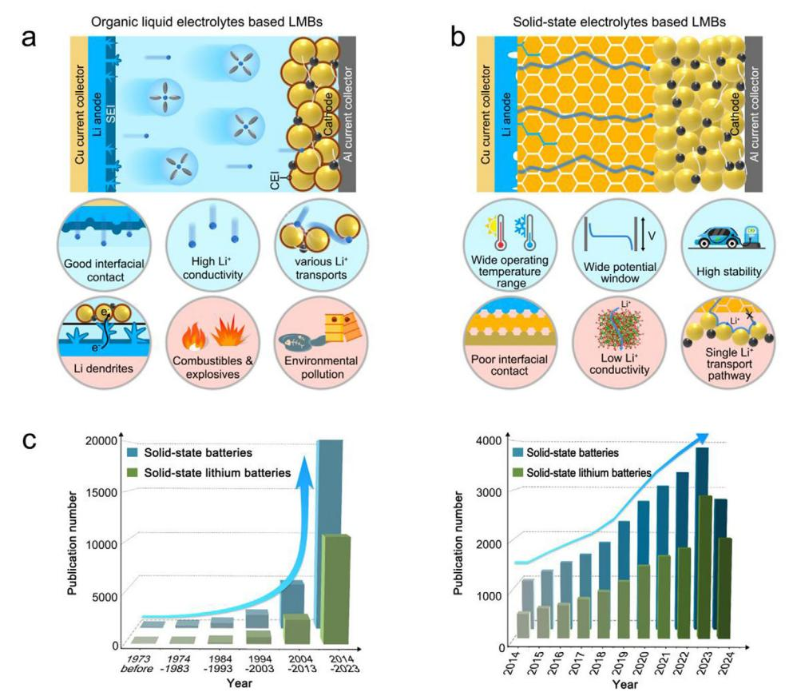

**Figure 1.** Schematic diagram of advantages and disadvantages of a) organic-liquid-electrolyte-based and b) SSE-based LMBs. c) Statistical summary of reported researches on solid-state batteries up to date.

which induces continuous growth of Li dendrites and ultimately results in short circuits (Figure [2c\)](#page-2-0).[\[24\]](#page-23-0) Although the sulfide SSEs have the advantage of high ionic conductivity (Figure [2a\)](#page-2-0), the sensitivity to moisture and air need to pay more attention on the operation conditions. Moreover, the necessity of high pressure ensures a tighter interfacial contact, thereby facilitating stable and continuous Li+ transfer (Figure [2d\)](#page-2-0).[\[25, 26\]](#page-23-0) Similarly to oxide SSEs, the high activity and electron conductivity at the grain boundaries of sulfide SSEs may induce the progressive formation of Li dendrites.[\[27, 28\]](#page-23-0) Although the externally applied high pressure can partially creep the Li dendrites, the Li dendrites still extend along the grain boundaries and eventually short circuit after several cycles (Figure [2e,f\)](#page-2-0).[\[14, 29\]](#page-23-0)

Alternatively, the interface compatibility of organic polymer SSEs with anode/cathode is better than the oxide/sulfide SSEs, which helps to improve the electrochemical performance of polymer-SSE-based batteries.[\[30–32\]](#page-23-0) At the same time, the insulation of polymer skeletons reduces the possibility of Li dendrites deposition inside the polymer SSEs.[\[33\]](#page-23-0) More importantly, the good air stability and flexibility of polymers make polymer SSEs easy to prepare on a large scale and facilitate the commercialization. However, the intrinsic low ionic conductivity (10−6–10−5 S cm−1) and low oxidation potential (*<*4 V) of most polymers make them difficult to match with highpotential cathode, such as LiNi1−*x*−*y*Co*y*Mn*z*O2 and LiCoO2, restricting their further development.[\[34, 35\]](#page-23-0) More importantly, the sluggish internal/interfacial ion transport induces uneven Li atoms deposition, which will puncture polymer SSEs with insufficient hardness.[\[36, 37\]](#page-23-0) Researches have shown that incorporating high-conductivity ceramic-based active fillers (AFs) to construct high-performance ceramic–polymer composite solidstate electrolytes (CSSEs) helps to suppress the Li dendrites growth (**Figure 3**[a,b\)](#page-3-0).[\[19, 37, 38\]](#page-23-0) This review focuses on the ceramic– polymer CSSEs, which are primarily composed of polymers, Li salts, ceramic AFs (Figure [3c\)](#page-3-0). Therefore, it is necessary to summarize and analyze the components of the ceramic– polymer CSSEs to light up the design of ceramic–polymer-CSSEbased batteries with excellent electrochemical performance. Further, the future development of ceramic–polymer CSSEs is also prospected and outlooked.

### **2. Components of Ceramic–Polymer Composite Solid-State Electrolytes**

Polymers commonly used in ceramic–polymer CSSEs include poly(ethylene oxide) (PEO), polyvinylidene fluoride (PVDF), and its copolymers PVDF─hexafluoropropylene (PVDF─HFP), polyacrylonitrile (PAN), poly(methylmethacrylate), and poly(propylene carbonate), etc.[\[32, 39–42\]](#page-23-0) Among them, the PEO has the advantages of strong binding energy with Li+, low cost, and easy production. Besides, PEO can be intenerated at high temperature, which potentially enhance the interfacial contact

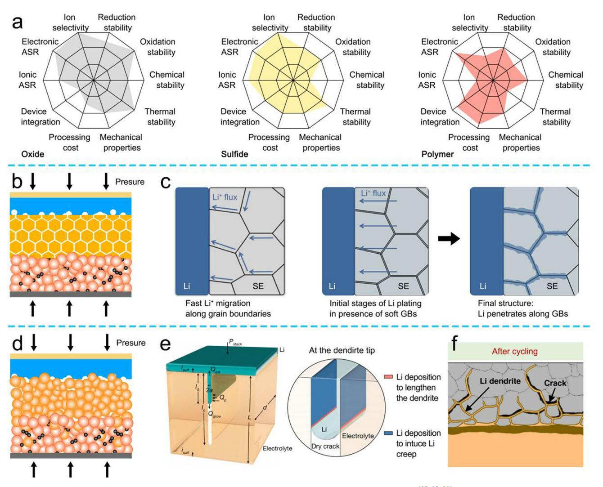

**Figure 2.** a) Radar maps of the basic physical/chemical characteristics of oxide/sulfide/polymer SSEs.[\[15, 18, 19\]](#page-23-0) b) Schematic diagram of the oxide-SSE-based battery. c) Rapid migration of Li+ and continuous growth of Li dendrites along the grain boundaries of the oxide SSEs. Reproduced with permission.[\[24\]](#page-23-0) Copyright 2018, American Chemical Society. d) Schematic diagram of the sulfide-SSE-based battery. e) Schematic diagram of Li dendrites growth along the crack. Reproduced with permission.[\[28\]](#page-23-0) Copyright 2023, Springer Nature. f) Schematic diagram of Li dendrites growth along the crack. Reproduced with permission.[\[14\]](#page-23-0) Copyright 2021, Springer Nature.

with anode/cathode and ceramic–polymer CSSEs. Therefore, the Li+ mobility will be improved and the growth of Li dendrites will also be inhibited under high temperature.[\[41, 43\]](#page-24-0) The PVDF/PVDF─HFP possesses a high dielectric constant, which promotes the dissociation of Li salt and then increases the ionic conductivity. At the same time, through introduction of elemental F, the electrochemical window of the ceramic–polymer CSSEs is broadened, thereby improving the electrochemical stability under high-potential conditions. Also, PAN can be woven into 3D nanofibers by electrospinning method to improve the mechanical properties of the ceramic–polymer CSSEs. Consequently, the appropriate polymers can be selected to construct ceramic–polymer-CSSE-based batteries depending on their specific features according to the desired requirements.[\[19, 44\]](#page-23-0) As known, adding ceramic AFs to the ceramic–polymer CSSEs can reduce the crystallinity of the polymer and promote the dissociation of Li salts, thus improving the ionic conductivity. Typically, the ceramic AFs include Li7La3Zr2O12 (LLZO), Li6.75La3Zr1.75Ta0.25O12 (LLZTO), Al*x*Ti2−*x*(PO4)3 (LATP), and other solid-state electrolytes, which can also provide multiple Li+ transmission pathways.[\[45, 46\]](#page-24-0) Therefore, the rational design of polymer-Li salts-ceramic AFs components can simultaneously improve the ionic conductivity, broaden the electrochemical window, promote the uniform Li nucleation and inhibit the growth of Li dendrites. Moreover, Li salts are the main donor of Li+ in batteries using either organic liquid electrolytes or ceramic– polymer CSSEs.[\[47\]](#page-24-0) Therefore, selecting Li salts with high ionic conductivity and easy dissociation is crucial for enhancing the electrochemical performance of ceramic–polymer-CSSEbased batteries.[\[48, 49\]](#page-24-0) In addition, the Li salts will be partially decomposed during cycling, which helps to form SEI, thereby improving the stability of the anode interface. The commonly

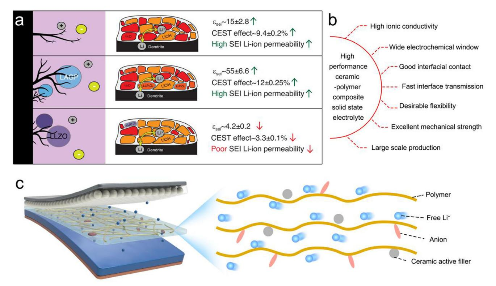

**Figure 3.** a) Schematic of polymer SSEs with/without ceramic AFs. Reproduced with permission.[\[37\]](#page-24-0) Copyright 2024, Springer Nature. b) Characterization of the ideal polymer SSEs. c) Schematic representation of the structure of the ceramic–polymer CSSEs.

used Li salts include LiClO4, LiPF6, LiTFSI, LiFSI, etc., of which the LiTFSI and LiFSI are widely preferred due to their excellent stability and low dissociation energy.[\[50–52\]](#page-24-0)

In this review, the Li+ transport mechanism and fundamental characteristics of ceramic–polymer CSSEs are first analyzed. Second, the advantages and disadvantages of various polymers are discussed, and the strategies for improving Li+ transport and interfacial contact, and inhibiting Li dendrites are summarized. Third, ceramic AFs such as LLZO, LLZTO, LATP in increasing Li+ transmission, improving the interfacial contact, and enhancing the stability of the ceramic–polymer CSSEs are explored. Finally, the modification strategies reported in existing research are summarized systematically, highlighting both breakthroughs and limitations. The goal is to shed light on the core aspects of current improvement strategies and provide feasible directions for future research on high-performance ceramic–polymer-CSSE-based batteries (**Figure 4**[\)](#page-4-0).

## **3. Strategies for Polymer Design**

#### **3.1. Mechanism of Li-Ion Transport**

The electrolyte plays a crucial role in the Li+ transport and the conversion mechanism in batteries. In organic-liquid-electrolytebased LMBs, Li salts are dissolved in the liquid-phase solvents, achieving sufficient dissociation of Li+ and anions. However, the polar solvent molecules spontaneously coordinate with free Li+ to form the solvation structure (Li(solvents)*x* +), resulting in the sluggish Li+ transport dynamics (**Figure 5**[a\)](#page-5-0).[\[53\]](#page-24-0) By contrast, the Li salts in polymer SSEs are distributed among the polymer chains, making it difficult for Li+ and anions to dissociate, which leads to a lower Li+ transference number (*t*Li+).[\[15, 40, 54\]](#page-23-0) The continuous coordination/dissociation between the polar active sites (N, O, F) and Li+ in the polymers realizes the leaping transmission of Li+ along the polymer chains. However, the strong coordination with the polar active sites results in a high Li+ dissociation energy barrier, which reduces the Li+ transport and leads to a low ionic conductivity. Additionally, the lower electrochemical window of the most polymers can also cause continuous decomposition at high-potential level, leading to interface instability and unsatisfactory battery performance.[\[55, 56\]](#page-24-0)

### **3.2. Screening Strategy for the Polymers**

The gradient-composited LLZTO/PEO solid electrolyte (GLPE) was prepared by Ge and co-workers, achieving good interfacial stability and rapid Li+ transport (Figure [5b\)](#page-5-0).[\[57\]](#page-24-0) The PEO-rich side enhances the interfacial stability and effective protection for the Li anode. As shown in Figure [5c,](#page-5-0) the GLPE-based symmetric cell can cycle for 3700 and 750 h under 0.1 and 0.2 mA cm−2, respectively. On the other hand, the LLZTO-rich side provides the fast Li+ transmission channels for the cathode. However, despite the excellent flexibility of the polymer, the low hardness and lower ionic conductivity induce the rapid growth of Li dendrites to eventually puncture the polymer, leading to short circuit. Therefore, improving the hardness of ceramic–polymer CSSEs is needed to inhibit the Li dendrite growth. Guo and co-workers

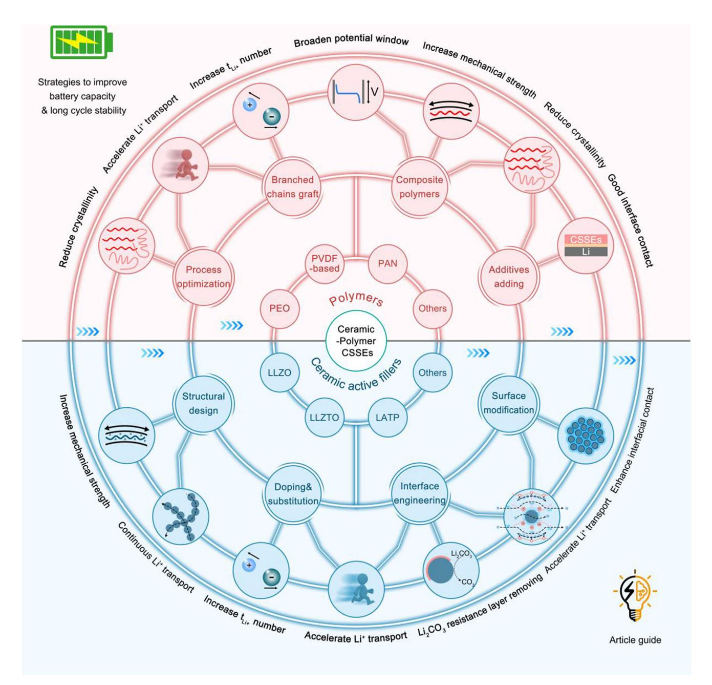

**Figure 4.** The mind mapping of the core content in this review.

prepared stable ceramic–polymer CSSEs with hierarchical structures (Figure [5d\)](#page-5-0), in which the PEO with 10 wt% LLZTO had a good ionic conductivity (1.4 × 10−4 S cm−1), providing excellent interfacial contact and rapid Li+ migration.[\[58\]](#page-24-0) Moreover, PEO with 40 wt% LLZTO exhibits excellent mechanical properties to impede the Li dendrite growth. Consequently, The LFP/CSSE/Li can still retain capacity retention of 80.6% after 150 cycles at 0.1 C. Stimulated by above research, Hang et al.[\[59\]](#page-24-0) proposed a composite structure design of 10–80–10 wt% LLZTO/PEO CSSEs (GCSEs) to achieve long cycle stability (Figure [5e\)](#page-5-0).[\[60\]](#page-24-0) More importantly, the scanning electron microscope (SEM) images in Figure [5f](#page-5-0) show that the surface of Li metal protected by GCSEs remains smooth even after plating/stripping for 1200 h, while the Li anode protected by SCSEs displays significant cracking morphology. This evidence underscores that the well-considered structural design can enhance the electrochemical properties of ceramic–polymer CSSEs.

The intrinsic low oxidation potential and low dielectric of PEO constant limit its further development, while PVDF-based polymers have good dielectric constant to promote the dissociation of Li salts. More importantly, the introduction of F element helps to increase the intrinsic oxidation potential to match the highpotential cathode. For instance, Xiong and co-workers introduced LATP in the flexible PVDF-based ceramic–polymer CSSEs to

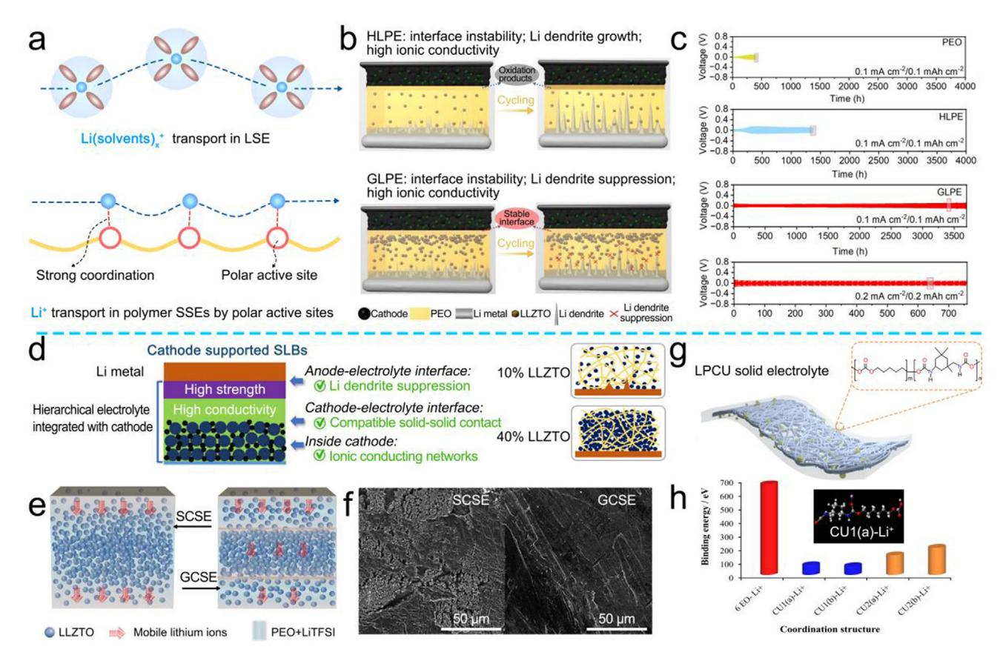

**Figure 5.** a) Schematic diagram of Li+ transport in organic liquid electrolytes and polymer SSEs. b) Schematic diagram of Li dendrite growth and interface reaction in HLPE and GLPE. c) Long cycling performance of different ceramic–polymer-CSSE-based Li//Li symmetric cells. Reproduced with permission.[\[57\]](#page-24-0) Copyright 2013, The Royal Society of Chemistry. d) Schematic representation of advantages of the hierarchical electrolyte design. Reproduced with permission.[\[58\]](#page-24-0) Copyright 2021, Elsevier. e) Schematic diagram of Li+ movement in GCSEs and SCSEs. f) SEM images of Li anode surface protected by SCSEs and GCSEs. Reproduced with permission.[\[60\]](#page-24-0) Copyright 2024, Elsevier. g) Schematic diagram of the PCU ceramic–polymer CSSE structure. h) Comparison of the binding energy of PCU/PEO with Li+. Reproduced with permission.[\[62\]](#page-24-0) Copyright 2023, Elsevier.

broaden the electrochemical window (4.76 V) and achieve high Li+ transfer number (0.45).[\[39\]](#page-24-0)

The polar active sites in the polymer chain, such as N, O, and F, facilitate fast anchoring of Li+. In the existing reports, the polar ─CN group exhibits strong electron-withdrawing characteristics, which helps to anchor the anions and accelerates the rapid Li+ transport. However, the interface instability between ─CN group and anode limits its application. To address this, Yang and coworkers selected PAN as a flexible substrate, preparing a stable ceramic–polymer CSSEs with the rigid and fast-Li+ conductor LATP (PLL-10).[\[61\]](#page-24-0) Upon the synergistic effect of LATP with PAN, the electrochemical window of the PLL-10 was broadened from 3.5 to 4.3 V.

It was reported that the functional groups of polymers significantly influence their fundamental properties. For example, the polyurethane (PU) with high polarity ─NHCOO─ and ─OCO─ functional groups can realize the coordination of Li+ and accelerate Li+ migration (Figure 5g).[\[62\]](#page-24-0) Density functional theory (DFT) calculations in Figure 5h verified that the EO functional groups of PEO exhibits a strong anchoring effect on Li+ (665.88 kJ mol−1), which limits the rapid Li+ transport. By contrast, the CU with the existence of ─NHCOO─ and ─OCO─ functional groups exhibits lower Li+ binding energy (144.41 vs 199.89 kJ mol−1), which can achieve rapid anchoring/dissociation of Li+. On the basis of theoretical simulations, Wang and co-workers combined PCU with LLZTO to obtain the ceramic–polymer CSSEs with high ion conductivity (2.22 × 10−4 S cm−1) and high Li+ transfer number (0.55).

#### **3.3. Mechanism of Decreasing Polymer Crystallinity to Enhance Ion Migration**

The crystal structure of polymer significantly influences the Li+ transport. For example, both crystalline and amorphous phases are presented in the PEO, which is the typical polymer. Li+ transports more rapidly in the amorphous phase, while the transition rate of Li+ is greatly reduced in the crystalline phase (**Figure 6**[a\)](#page-6-0).[\[63–65\]](#page-24-0) Specifically, in the crystal phase, Li+ can only migrate the tunnels within the crystal structure, leading to a slow Li+ transport rate. While in the amorphous phase, Li+ can coordinate and migrate more quickly, aided by the anchoring/dissociation of polar functional groups along the molecular chain. To improve Li+ ionic conductivity, the crystallization of

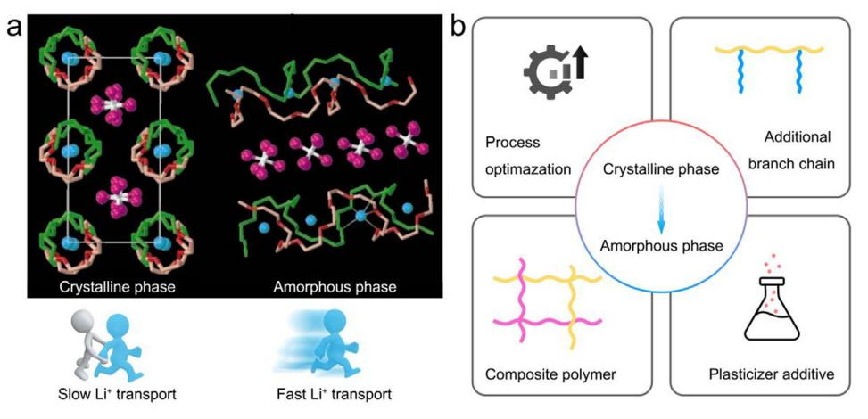

Figure 6. a) Schematic representation of the Li+ transport in the crystalline and amorphous phase of the PEO. Reproduced with permission.[63] Copyright 1999, Springer Nature. b) Modification strategies to reduce the crystallization properties of the ceramic-polymer CSSEs.

polymer molecules can be reduced through various approaches, such as process optimization, branched chains graft, composite polymers, additive adding (Figure 6b).[66]

3.3.1. Process Optimization of Ceramic–Polymer CSSEs

The conventional process for preparing ceramic–polymer CSSEs is the solution pouring method.[67] Yang et al. introduced porous structure in PEO/LLZTO CSSEs, which inhibits the crystallization of PEO.[68] The porous-PEO/LLZTO CSSEs with moderate pores contain more Li+ channels than that without pores. However, it should be noted that an excessive increase in pore size can lead to discontinuous Li+ transport channel, reducing the electrochemical performance. Further, the Li anode protected by porous-PEO/LLZTO CSSEs also maintains a flat surface after plating/stripping for 1000 h. This is in sharp contrast to the Li anode protected by the ceramic-polymer CSSEs, indicating that the interfacial stability between the anode and ceramicpolymer CSSEs has been enhanced by the optimization of the structure. In addition, the trace amounts of solvent remaining in ceramic–polymer CSSEs prepared by pouring method can also cause the instability of the anode. Therefore, using the solventfree cold pressing films may be feasible to improve the stability of anode.  $[69]$ 

### 3.3.2. Graft the Branch Chain of Polymers

Grafting Li+ conductor side chains in polymers contributes to increasing the transport channel of Li+, thus improving the Li+ conductivity.[70, 71] Yan and co-workers grafted the fast-Li+ conductor lithium taurine onto PVDF-HFP to construct a  $P(VDF-HFP)$ -Li10-50LATP CSSE with high ionic conductivity  $(7.88 \times 10^{-4} \text{ S cm}^{-1})$  (Figure 7a).[72] Further molecular dynamics simulations verified that  $-SO3$  Li group can effectively anchor Li+, with the bond length and coordination number of the remaining Li+ significantly higher than that of TFSI-. Thus, the  $\text{Li}^+$  transference number of P(VDF–HFP)– $\text{Li}_{10}$ –50LATP CSSEs

is increased to 0.61. Therefore, constructing the conductive polymer of Li+ conductor can provide a continuous Li+ transport channel and reduce the interface impedance.

### 3.3.3. Introduce Multiple Polymers

In addition, the introduction of different polymers in CSSEs, by using the competitive adsorption mechanism of Li+ between different functional groups, can promote the dissociation of Li salts, which can also reduce the anchoring effect of the single functional group on Li+, facilitating more flexible and rapid Li+ transport between molecular chains.[73] While, each polymer has its own unique advantages and disadvantages, and the construction of ceramic–polymer CSSEs can better broaden their application range. For example, PEO exhibits good physical interfacial contact with anode at high operating temperature but poor mechanical properties, whereas PVDF-based polymers have wider electrochemical window and better mechanical strength. Yao and coworkers observed that the F atoms in PVDF form H-F bonds with the H atoms in PEO, and the intermolecular hydrogen bonds reduced the crystallinity of PEO (Figure 7b).[74] At the same time, the  $-CF_2$  group in PVDF interacts strongly with the C-O-C group in PEO, enhancing the compatibility and reducing the crystallization of PEO. Moreover, the competing mechanisms between the functional groups of PEO and PVDF promote rapid Li+ anchoring/dissociation. Therefore, the Li+ transfer number of PEO/PVDF-based ceramic–polymer CSSEs (LP82) is increased to 0.78. Moreover, the introduction of PVDF broadens the oxidation electrochemical window of LP82 up to 5.5 V. In addition, Guo and co-workers blended PEO with PVDF and LLZTO to form PEO/PVDF/LLZTO (PLFF) CSSEs (Figure 7c).[75] It has been shown that PVDF reduces the crystallinity of PEO and expands the migration channel of Li+, thereby improving the ionic conductivity of the PLFF (3.23  $\times$  10-4 S cm-1 at 25 °C). In addition, the introduction of PVDF also increases the mechanical strength of the PLFF (5.21 MPa), which contributes to inhibit the Li dendrite growth. PVDF-HFP, the derivative of PVDF, has lower crystallinity to obtain more excellent ionic conductivity. Li

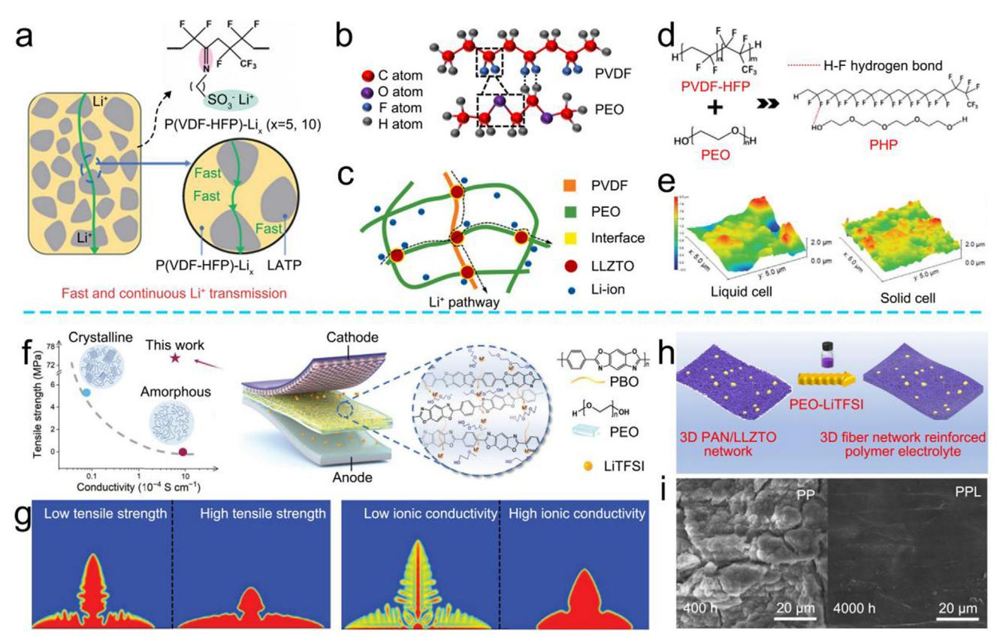

**Figure 7.** a) Schematic of the Li+ transmission path in the P(VDF─HFP)─Li10─50LATP CSSEs. Reproduced with permission.[\[72\]](#page-24-0) Copyright 2022. The Royal Society of Chemistry. b) Schematic diagram of the interaction between PVDF and PEO. Reproduced with permission.[\[74\]](#page-24-0) Copyright 2024, Springer Nature. c) Schematic diagram of Li+ transmission in PLFF. Reproduced with permission.[\[75\]](#page-24-0) Copyright 2020, Elsevier. d) Schematic diagram of the interaction between PVDF─HFP and PEO. e) AFM images of Si electrodes. Reproduced with permission.[\[77\]](#page-24-0) Copyright 2024, Wiley-VCH. f) Relationship between the mechanical strength and ionic conductivity of PEO and PBO/PEO CSSEs. g) Morphology growth of Li dendrites under high/low tensile strength and high/low ionic conductivity simulated by COMSOL. Reproduced with permission.[\[79\]](#page-24-0) Copyright 2024, Wiley-VCH. h) Preparation of PPL. i) SEM images of Li anode surface protected by PP and PPL. Reproduced with permission.[\[82\]](#page-24-0) Copyright 2021, Elsevier.

and co-workers mixed LLZTO, PEO, PVDF─HFP, and LiTFSI as PPHT, achieving a high ionic conductivity (1.05 × 10−4 S cm−1 at 35 °C).[\[76\]](#page-24-0) Thus the LFP/PPHT/Li cell demonstrated the low median voltage gap (0.095 V) benefiting from good interfacial contact and fast Li+ transport. Similar to PVDF, the C─F functional group in PVDF─HFP forms hydrogen bonds between the ─OH functional group of PEO (Figure 7d).[\[77, 78\]](#page-24-0) In addition, the ceramic–polymer CSSEs prepared by PVDF─HFP and PEO also have good interface contact with the Si anode, and exhibits excellent mechanical properties, which can inhibit the volume change of the Si anode (Figure 7e).

After the polymers have been mixed, the overall crystallinity decreases, resulting in an increase in Li+ mobility within ceramic–polymer CSSEs. However, the decrease in crystallinity can also lead to a decrease in the mechanical properties of the ceramic–polymer CSSEs. Therefore, it is necessary to further improve the electrochemical and physical properties of the ceramic– polymer CSSEs through reasonable structure regulation and process optimization. Poly(*p*-phenylene benzobisoxazole) (PBO) nanofibers, abundant in active sites, were chosen as the carrier for constructing PBO/PEO ceramic–polymer CSSEs by Yang and co-workers.[\[79\]](#page-24-0) The porous structure of PBO nanofibers facilitates the penetration of PEO, reducing the crystallinity of PEO and facilitating the Li+ hopping transmission between chains (Figure 7f). More importantly, the COMSOL calculation in Figure 7g verifies that the PBO/PEO ceramic–polymer CSSEs, with high tensile strength (74.4 MPa) and high ionic conductivity (6.1 × 10−4 S cm−1 at 60 °C), promote the lateral deposition of Li atom (Li0) and inhibit the longitudinal growth of the Li dendrites.

Besides, polymers can be spun into a flexible and high mechanical strength substrate by electrospinning. PAN, a classical electrospun material, offers the excellent fiber-forming property and spin ability.[\[80, 81\]](#page-24-0) Moreover, the rich C≡N functional groups in PAN contribute to the rapid transport of Li+ and the anchoring of the anions. What is more, the antioxidant properties of PAN also improve the electrochemical window of the ceramic–polymer CSSEs, thus making up for the defect of the low oxidation potential of the single polymer SSEs. Chao and coworkers combined PEO and PAN networks to construct a highly stable 3D network structure (PPL).[\[82\]](#page-24-0) The addition of PAN addresses the limitation of PEO, which can easily react with the anode due to its oxygen-containing functional groups, thereby improving the electrochemical window of the PPL to 5.2 V. As a result, the PPL-based symmetric cell achieves an impressive

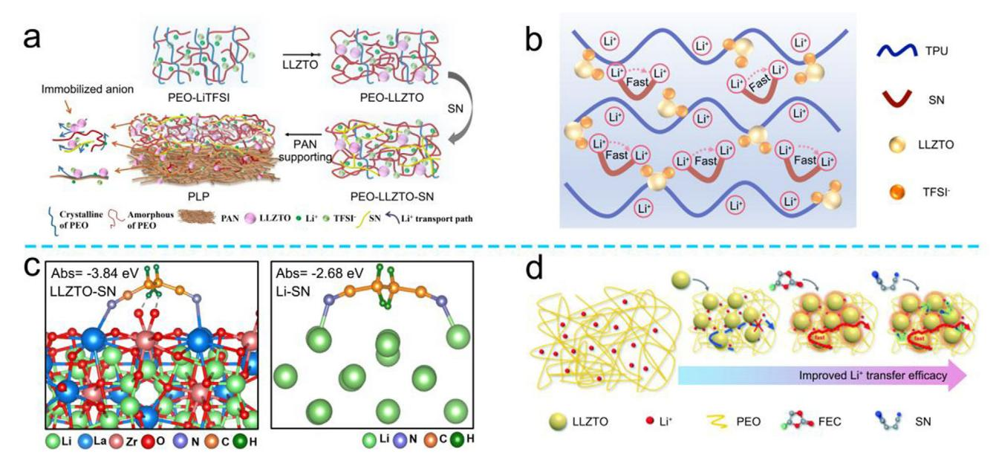

**Figure 8.** a) Schematic diagram of SN reducing the crystallinity of PLP and then enhancing the Li+ transport. Reproduced with permission.[\[93\]](#page-24-0) Copyright 2021, Wiley-VCH. b) Schematic illustration of Li+ transport in TPU/LLZTO/SN. Reproduced with permission.[\[94\]](#page-24-0) Copyright 2023, Elsevier. c) The adsorption energy of SN─LLZTO and Li atom. Reproduced with permission.[\[95\]](#page-24-0) Copyright 2023, Elsevier. d) The schematic of the preparation of PEO─SPES surfaces. Reproduced with permission.[\[97\]](#page-24-0) Copyright 2022, The Royal Society of Chemistry.

stable cycle for 4000 h at 0.2 mA cm−2 without short circuit (Figure [7h,i\)](#page-7-0).

Moreover, PVDF-based polymers are also the excellent materials for electrospinning. Cai and co-workers combined the PEO matrix with sulfonated polyethersulfone (SPES)─PVDF─HFP nanofiber membrane to construct the D─SPES─PH─PEO ceramic–polymer CSSEs, of which the SPES─PVDF─HFP nanofibers reduce the crystal region of the PEO matrix, promoting the rapid Li+ transport.[\[83\]](#page-24-0) More importantly, the ─SO3H functional group on SPES, the C─F bond in PVDF─HFP and the ether─oxygen bond in PEO, providing multiple channels for the Li+ transport. Additionally, PVDF─HFP partially decomposes during cycling, forming the LiF-rich SEI that enhances the Li+ transmission at the CSSE/anode interface. Therefore, the D─SEPS─PH─PEO-based symmetric cell is continuously plating/stripping for 2500 h at 0.2 mA cm−2 without short circuit. In fact, reliable, continuous preparation processes need to be developed to achieve the industrial-scale production of ceramic– polymer CSSEs. Zhou and co-workers proposed using electrospinning technology to achieve the continuous growth of PVD-FandPU/LLZTO CSSEs.[\[84\]](#page-24-0) The ceramic–polymer CSSEs prepared by this method can reach a thickness of 18 μm and exhibit an impressive tensile strength of 8.08 MPa. Besides, the 3D continuous skeleton of the aramid nanofiber and poly(*m*phenylene isophthalamide) (PMIA) membranes of the similar functional group also has excellent mechanical stability and thermal stability.[\[85–87\]](#page-24-0)

#### *3.3.4. Functional Additive Adding*

Various functional additives have also been introduced into ceramic–polymer CSSEs to reduce the crystallinity of the polymers, thus accelerating the transmission of Li+. Some additives also act as self-sacrificial agents, helping to establish a stable anode/ceramic–polymer CSSE interface. Therefore, selecting appropriate additives based on actual working conditions is crucial for enhancing the practicality and performance of ceramic– polymer CSSEs.[\[88–91\]](#page-24-0)

*Reduce Crystallinity*: The crystalline regions in the ceramic– polymer CSSEs hinder the Li+ migration, thereby reducing the ionic conductivity. To address this, plasticizers are used to accelerate the Li+ transport between polymer chains by reducing the crystallization of polymers.[\[92\]](#page-24-0) Zhou and co-workers added the plasticizer succinonitrile (SN) into LLZTO/PEO/PAN (PLP) ceramic–polymer CSSEs.[\[93\]](#page-24-0) With the addition of LLZTO and SN, the amorphous regions of PEO have been enlarged (**Figure 8**a) and the low crystallinity contributes to the uniform dispersion of LLZTO, resulting in an enhanced Li+ transport (2.57 × 10−4 S cm−1 at 30 °C). What is more, TPU, a polymer with both Li+ transport network and high mechanical strength, is limited by extensive hydrogen bonding between polymer chains, which impedes the Li+ migration. To overcome this, Wu and coworkers added SN to break the intermolecular hydrogen bond of TPU/LLZTO ceramic–polymer CSSEs, thereby increasing the Li+ transport rate (6.45 × 10−4 S cm−1) between molecular chains (Figure 8b).[\[94\]](#page-24-0)

*Improve Interfacial Stability*: The interfacial stability between ceramic–polymer CSSEs and Li anode significantly impacts the performance of solid-state batteries. Thus, enhancing the interfacial stability reduces impedance at the electrolyte–anode interface, thereby facilitating Li+ transport.[\[19\]](#page-23-0) Additionally, improved stability contributes to reduce side reactions, resulting in superior cycle stability of ceramic–polymer CSSE-based batteries. A small amount of SN contributes to promoting the Li+ transport, but excess SN will corrode the anode, leading to the instability at

the anode interface and a decrease in the mechanical strength of the ceramic-polymer CSSEs. Huo and co-workers confirmed that the addition of LLZTO contributed to reduce the activity of  $C=N$ groups by theoretical calculation and FTIR spectroscopy, thereby mitigating the corrosion of anode.[95] As shown in Figure  $8c$ , the adsorption energy between the active N site of SN and the  $La^{3+}$  of LLZTO was significantly higher than that between Li-SN  $(-3.84)$ vs  $-2.68$  eV), indicating that LLZTO can effectively anchor SN. Furthermore, the La site of LLZTO reduces the activity of SN, thereby stabilizing the anode interface and accelerate the Li+ diffusion. As a result, the ceramic-polymer-CSSE-based symmetric cell demonstrates stable cycling for 1000 h at 0.1 mA  $\text{cm}^{-2}$ , with the anode surface remaining smooth after cycling. The decomposition of the self-sacrificing additives containing N, O, and F sites promotes the formation of a protective SEI layer, consisting of  $Li_3N$ ,  $Li_2O$ , and  $LiF$ , which contributes to the anode protection. Fluoroethylene carbonate (FEC), an excellent electrolyte additive, generates LiF to accelerate the rapid Li+ transport at the interface and realize the interface protection.[96] Sun and co-workers used FEC and SN as additives in LLZTO/PEO CSSEs (Figure 8d).[97] With the help of SN, the crystallinity of PEO is reduced, leading to the rapid Li+ transport. Moreover, the fluorinated oligomers produced by the decomposition of FEC to achieve anions anchoring and create a stable interface layer between the anode and ceramic-polymer CSSEs.

*Interfacial Contact:* In organic-liquid-electrolyte-based batteries, sufficient contact between electrolyte and anode/cathode is crucial for promoting the rapid Li+ transport. However, the poor fluidity of polymer leads to interface contact area decrease.[98, 99] Wang et al.[100] demonstrated that discontinuous or nonuniform interfacial contact between SSEs and anode reduced Li+ transfer and increased the diffusion energy barrier, resulting in higher interfacial impedance, thus leading to the solid state batteries' performance degradation. To address this, the operating temperature of ceramic-polymer CSSEs, such as PEO-based, is typically maintained above 60 °C to soften the polymer and ensure good interfacial contact. In addition, the construction of a well-designed intermediate layer can improve the interfacial contact, thereby enhancing the electrochemical performance.[101, 102] Chang and co-workers used SN, FEC, and LiTFSI to construct a fluid fluorine-rich intermediate layer (SNI) to achieve good interfacial contact between the ceramic-polymer CSSEs and anode. SN offers excellent electrochemical stability, decreasing polymer crystallinity, and improving Li+ transport.[103-105] Meanwhile, the introduction of FEC and LiTFSI contributes to form the LiF-rich SEI layer and achieves a stable interface. In addition, the SNI insulates the interfacial side reaction between PVDF-HFP and Li anode, thus improving the long-cycle stability of the ceramic– polymer-CSSE-based batteries.

In summary, it is difficult for single-polymer-based SSEs to achieve both excellent ionic conductivity and good mechanical properties. However, by introducing the polymer with rigidity or high ionic conductivity, the ceramic-polymer CSSEs with excellent comprehensive properties can be formed.[38] Among them, the interaction between the functional groups of different polymers contributes to promoting the dissociation of Li salts, thereby increasing the Li+ transference number. More importantly, the competitive mechanism of active sites and the formation of intermolecular hydrogen bond reduce the binding energy and the dissociation energy of Li+. In addition, the reader should note that the ceramic AFs play a very important role in the ceramic–polymer CSSEs (**Table 1**). The introduction of a ceramic AFs with Lewis acid sites further increases the Li+ mobility by anchored anion and added Li+ transport pathway.[38, 106, 107] More importantly, the intrinsic higher electrochemical window of ceramic AFs can expand the oxidation electrochemical window of the ceramic–polymer CSSEs. In the next section, we will focus on discuss the mechanism of rapid Li+ migration facilitated by Lewis acid–base interactions will be expounded.

# 4. Strategies for Ceramic Active Filler Design

#### 4.1. The Advantages of Introducing Ceramic Active Fillers

In conventional ceramic–polymer CSSEs, the dissociated Li+ primarily migrate by hopping between molecular chains of the polymers to achieve internal Li+ transport (Figure 9a).[51] Additionally,  $Li(DMF)$ + formed by residual solvent molecules during the preparation process, which will also be transported by the long-chain molecules of polymer.[110] With the addition of ceramic AFs, Li+ not only hops between the molecular chains of the polymer but also realizes the transport within the amorphous phase and within the ceramic AFs. Thus, the introduction of the rigid ceramic AFs with fast Li+ conductor (LLTO, LLZTO, LATP), is crucial for promoting the large-scale application of ceramic–polymer CSSEs.[38] Specifically: 1) ceramic AFs are the fast Li+ conductor that provide additional Li+ migration pathway (Figure 9b); [106, 111, 112] 2) ceramic AFs with Lewis-acidrich sites have a strong anchoring effect on anions to increase Li+ transference number;  $[102]$  3) the introduction of ceramic AFs with Lewis acid site can also form the competitive mechanism with the polar functional groups of the polymer, accelerating the Li+ transport between molecular chains; [40, 106] 4) the addition of ceramic AFs reduces the crystallinity of the ceramic-polymer CSSEs, accelerating the Li+ transport (Figure 9c);[113] 5) the introduction of rigid ceramic AFs improves the mechanical strength of ceramicpolymer CSSEs to inhibit the Li dendrite growth, ensuring the stability of ceramic-polymer-CSSE-based batteries (Figure 9d); 6) ceramic AFs with a high electrochemical window can compensate for the limited oxidation stability of ceramic–polymer CSSEs, broadening their potential application (Figure  $9e$ ); 7) the ceramic AFs with high thermal stability can also broaden the working temperature and achieve better safety ceramic-polymer-CSSEbased batteries.[108, 114]

The improvement of the electrochemical performance of the ceramic-polymer CSSEs is very important. However, the interface transmission dynamics and stability of cathode/ceramicpolymer CSSEs/anode are also crucial indicators to comprehensively evaluate the performance of the ceramic-polymer-CSSE-based batteries.[88] Zhang and co-workers explored the mechanism of LLZTO/PVDF-HFP (LLZTO/PH) CSSEs improving the interface charge distribution and inhibiting the Li dendrite growth.[115] First, LLZTO promotes the uniform reduction of the potential across the ceramic-polymer CSSEs, which enhances uniform Li+ transmission, contributing to the uniform Li0 plating/stripping and reducing the interface polarization (Figure  $10a,b$ ). In addition to theoretical simulation, physical characterization to explore the surface/internal

| www.advancedsciencenews.com | www.small-journal.com |
|-----------------------------|-----------------------|

|                    |                |                              | Table 1. Basic performance table of ceramic–polymer CSSEs mentioned in this section. |                            |                            |                     |                        |                             |                                    |       |
|--------------------|----------------|------------------------------|--------------------------------------------------------------------------------------|----------------------------|----------------------------|---------------------|------------------------|-----------------------------|------------------------------------|-------|
| Polymers           | Active fillers | strength [MPa] Mechanical | Ionic conductivity [S cm−1]                                                       | potential [V] Oxidation | Li+ transference number | Cathode material |                        | Electrochemical performance | Symmetrical battery performance | Refs. |
|                    |                |                              |                                                                                      |                            |                            |                     | density [C] Current | Reversible capacity         |                                    |       |
| PEO                | LLZTO          | 7.1                          | 3.75 × 10−4                                                                          | 5.3                        | 0.66                       | LFP                 | 0.5                    | 83.8% (200th)               | 0.1 mA cm−2, 3700 h                | [57]  |
| PEO                | LATP           | –                            | –                                                                                    | 4.7                        | –                          | LFP                 | 1                      | 97.8% (150th)               | –                                  | [69]  |
| PEO                | LLZTO          | 7.88                         | 1.5 × 10−4                                                                           | –                          | 0.53                       | LFP                 | 0.5                    | 90% (200th)                 | 0.1 mA cm−2, 600 h                 | [60]  |
| PEO                | LLZTO          | 0.42                         | 2.26 × 10−4                                                                          | 5.6                        | 0.35                       | LFP                 | 0.5                    | 92.6% (1300th)              | 0.1 mA cm−2, 2500 h                | [68]  |
| PVDF               | LATP           | 14.2                         | 1.64 × 10−3                                                                          | 4.76                       | 0.45                       | LFP                 | 0.3                    | 92.9% (40th)                | 0.2 mA cm−2, 600 h                 | [39]  |
| PVDF               | LLZTO          | 7.1                          | 1.86 × 10−4                                                                          | 5                          | –                          | LCO                 | 0.2                    | 86% (150th)                 | 0.1 mA cm−2, 1000 h                | [108] |
| ─HFP PVDF       | LLZTO          | 28.6                         | 7.13 × 10−4                                                                          | –                          | –                          | LFP                 | 0.5                    | 98% (100th)                 | –                                  | [75]  |
| PAN                | LATP           | –                            | 2.12 × 10−4                                                                          | 5                          | –                          | NCM                 | 0.5                    | 78.6% (100th)               | –                                  | [61]  |
| PU                 | LLZTO          | –                            | 2.22 × 10−4                                                                          | –                          | 0.55                       | LFP                 | 1                      | 90% (150th)                 | 0.5 mA cm−2, 500 h                 | [62]  |
| PEO + PVDF         | LLZTO          | –                            | 6.49 × 10−4                                                                          | 5.5                        | 0.78                       | LFP                 | 0.2                    | 90.7% (180th)               | 0.1 mA cm−2, 4000 h                | [74]  |
| PEO + PVDF         | LLZTO          | 5.21                         | 3.23 × 10−4                                                                          | 5.08                       | –                          | LFP                 | 0.4                    | 160.1 mAh g−1 (200th)       | 0.2 mA cm−2, 1000 h                | [75]  |
| ─HFP PEO + PVDF | LATP           | –                            | 1.49 × 10−4                                                                          | 4.82                       | 0.43                       | LFP                 | –                      | –                           | 0.2 mA cm−2, 600 h                 | [109] |
| ─HFP PEO + PVDF | LLZTO          | –                            | 1.05 × 10−4                                                                          | 5.2                        | 0.53                       | LFP                 | 0.5                    | 99.4% (200th)               | 0.2 mA cm−2, 900 h                 | [77]  |
| PEO + PBO          | –              | –                            | 6.1 × 10−4                                                                           | 4.6                        | –                          | LFP                 | 0.5                    | 73% (200th)                 | 0.1 mA cm−2, 1000 h                | [79]  |
| PEO + PAN          | LLZTO          | 8.7                          | 6.0 × 10−4                                                                           | 5.2                        | –                          | LFP                 | 0.5                    | 95.6% (120th)               | 0.1 mA cm−2, 500 h                 | [80]  |
| PEO + ANF          | LATP           | 2.9                          | 1.0 × 10−4                                                                           | 5.0                        | –                          | LFP                 | 0.3                    | 133 mAh g−1 (100th)         | 0.1 mA cm−2, 300 h                 | [86]  |
| PEO + PAN          | LLZTO          | 7.8                          | 6.5 × 10−5                                                                           | –                          | –                          | LFP                 | 1                      | 90.5% (400th)               | 0.1 mA cm−2, 1800 h                | [81]  |
| PEO + PAN          | LLZTO          | 9.47                         | –                                                                                    | 5.2                        | 0.53                       | LFP                 | 1                      | 86.0% (1000th)              | 0.1 mA cm−2, 4000 h                | [82]  |
| PEO + PMIA         | LLZTO          | 8.5                          | 1.38 × 10−4                                                                          | 5.03                       | –                          | LFP                 | 1                      | 114.6 mAh g−1 (2000th)      | 0.2 mA cm−2, 1800 h                | [85]  |
| ─HFP + PU PVDF  | LLZTO          | 8.08                         | 1.0 × 10−3                                                                           | 4.5                        | 0.78                       | SPAN                | 0.5                    | 92.4% (500th)               | 0.1 mA cm−2, 1000 h                | [106] |
|                    |                |                              |                                                                                      |                            |                            |                     |                        |                             |                                    |       |

**Figure 9.** a) Li+ transport mechanism of polymer SSEs, polymer/ceramic AFs ceramic–polymer CSSEs, and "polymers in salt" ceramic–polymer CSSEs. Reproduced with permission.[\[51\]](#page-24-0) Copyright 2022, Elsevier. b) Schematic diagram of the accelerated Li+ transport mechanism of the ceramic AFs in the ceramic–polymer CSSEs. c) Schematic diagram of the reduced crystallinity of ceramic–polymer CSSEs by LLZTO. d) Stress–strain curves of ceramic– polymer CSSEs with/without LLZTO. e) LSV of CSSEs with/without LLZTO. Reproduced with permission.[\[113\]](#page-25-0) Copyright 2019, Elsevier.

changes of the anode/ceramic–polymer CSSEs after long cycling is also essential for evaluating ceramic–polymer CSSE performance. Zhao and co-workers disassembled the PEO─LiTFSIbased and PEO─LiTFSI─10LLZTO-based symmetric cells after plating/stripping and characterized their microstructure.[\[116\]](#page-25-0) Figure [10c](#page-12-0) shows that the PEO─LiTFSI─10LLZTO CSSEs remain unchanged significantly before and after cycling, suggesting the Li dendrite growth is inhibited by the introduction of LLZTO. By contrast, the bare PEO SSEs present a smooth surface with a large number of particles appeared on the surface after long cycle. As shown in Figure [10d,](#page-12-0) the C and F contents in this region were relatively small, indicating the formation of Li dendrites.

Most existing characterizations focus on the Li anode or ceramic–polymer CSSEs before and after cycling. It is particularly important to use advanced techniques to observe the role of ceramic–polymer CSSEs at the interface between the Li anode and CSSEs during in situ electrochemical processes.[\[117\]](#page-25-0) Exciting, Wang and co-workers used the in situ synchrotronbased X-ray absorption near-edge structure (XANES) with Xray fluorescence spectrometer to investigate the mechanism of the circulating ceramic–polymer-CSSE-based cells during cycling (Figure [10e\)](#page-12-0).[\[118\]](#page-25-0) They found that the peak position of Zr K-edge shifted slightly to lower energy during cycling. While, it shifted back to the original position after cycling (Figure [10f\)](#page-12-0). This observation confirmed the stability of LLZTO during the reaction process, indicating that it did not react with PEO or Li salts.

In addition to the representative ceramic AFs such as LLZO and LLZTO, NASICON-type LATP has been extensively studied. Yang and co-workers separately prepared LATP- and LLZTObased ceramic–polymer CSSEs to investigate the performance differences between these two AFs and the underlying reasons (Figure [10g\)](#page-12-0).[\[119\]](#page-25-0) DFT calculation evaluated that the Li+ diffusion energy barrier on the LATP surface was also lower than that of LLZTO (0.21 vs 0.26 eV). Furthermore, the interface affinity between PEO and LATP was much higher than that between PEO and LLZTO. As a result, under the same parameters, the Li+ migration rate of PEO/LATP was higher than that of PEO/LLZTO. Therefore, the PEO/LATP-based Li+ transport pathway was more diverse, leading to better electrochemical performance. By contrast, PEO/LLZTO could only transport Li+ in the dissociated region, greatly limiting the Li+ transport capability.[\[37\]](#page-24-0) At the same time, similar to LLZTO, the introduction of LATP also enhanced the mechanical properties and thermal stability of the ceramic–polymer CSSEs, providing the development for subsequent LATP-based ceramic–polymer CSSEs.[\[120\]](#page-25-0)

In summary, the addition of ceramic AFs improves both the mechanical properties and electrochemical properties of ceramic–polymer CSSEs. However, the ceramic AFs still face several challenges, including low ionic conductivity, high surface energy, and poor interface compatibility.[\[37, 38\]](#page-24-0) Specifically: 1) the low ionic conductivity results in uneven Li+ transport, which induces longitudinal Li dendrites growth; 2) the high surface energy promotes the agglomeration of the AFs, resulting

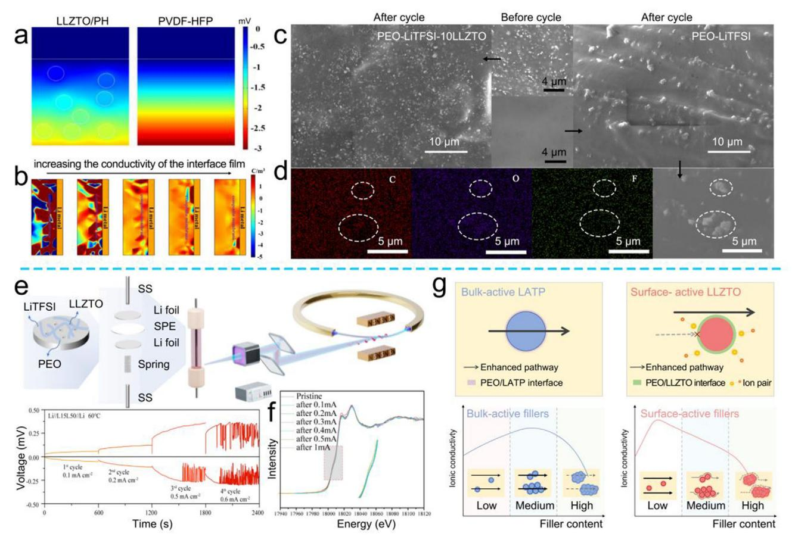

**Figure 10.** COMSOL simulation of a) potential gradient and b) distribution of charge density. Reproduced with permission.[\[115\]](#page-25-0) Copyright 2021, American Chemical Society. c) SEM images of CSSEs with/without LLZTO after cycling for 800 h. d) elemental mapping of select area. Reproduced with permission.[\[116\]](#page-25-0) Copyright 2020, Elsevier. e) Schematic diagram of the in situ XANES imaging. f) Normalized Zr K-edge XANES at different states of bulk. Reproduced with permission.[\[118\]](#page-25-0) Copyright 2024, American Chemical Society. g) Schematic of Li+ pathway for PEO─LATP and PEO─LLZTO ceramic–polymer CSSEs. Reproduced with permission.[\[119\]](#page-25-0) Copyright 2023, Wiley-VCH.

the inhomogeneity of Li+ transport and the formation of Li dendrites; 3) LLZO and LLZTO react with H2O and CO2 to form the Li2CO3 layer on the surface, which has very low ionic mobility and covers the Lewis-acid active sites, ultimately reducing electrochemical performance; 4) the poor affinity between inorganic fillers and organic polymers reduces the tensile strength of ceramic–polymer CSSEs. To address these issues, researchers have employed strategies such as structural regulation, element doping/substitution, and surface modification to enhance the interface compatibility between polymers and ceramic AFs. These modification strategies help to increase the dissociation of Li salts and promote Li+ transport, thereby improving the overall performance of ceramic–polymer-CSSE-based batteries.

#### **4.2. Structural Regulation**

#### *4.2.1. 0D Ceramic AFs*

The use of 0D ceramic AFs can expose more active sites, which contributes to promoting the dissociation of Li salts and thus increases the Li+ migration number. Meanwhile, 0D ceramic AF particles can be better dispersed within the ceramic–polymer CSSE matrix, leading to the uniform Li+ transport. Ma and coworkers prepared the CPE-20 with 3D Li+ transport network composed of nano-LLZTO and PVDF─HFP.[\[121\]](#page-25-0) **Figure 11**[a](#page-13-0) shows that it is difficult to obtain continuous Li+ transport paths in CPE-0 with a small amount of N─LLZTO AFs. While, the addition of excessive LLZTO may lead to particle agglomeration. Furthermore, the poor compatibility between LLZTO and PVDF─HFP causes the formation of pores at the LLZTO/PVDF─HFP interface, affecting the continuous Li+ transmission. The optimal addition of 20 wt% N─LLZTO provides the balance ionic conductivity and mechanical strength. As a result, LFP|CPE-20|Li full cell can still retain 95% of the high specific capacity after 200th at 0.5 C. In addition, the particle size of the ceramic AFs also has an important effect on the ceramic–polymer CSSEs. The small particles are unable to form the uniform Li+ transport channel, while the large particles create high surface roughness, both of which contribute to instability at the anode/ceramic–polymer CSSE interface. Zhang and co-workers showed that the addition of ceramic AFs with moderate size and appropriate content (PIC) can achieve both interfacial stability and rapid Li+ transport of ceramic–polymer CSSEs.[\[122\]](#page-25-0) The optimal particle size of LLZTO

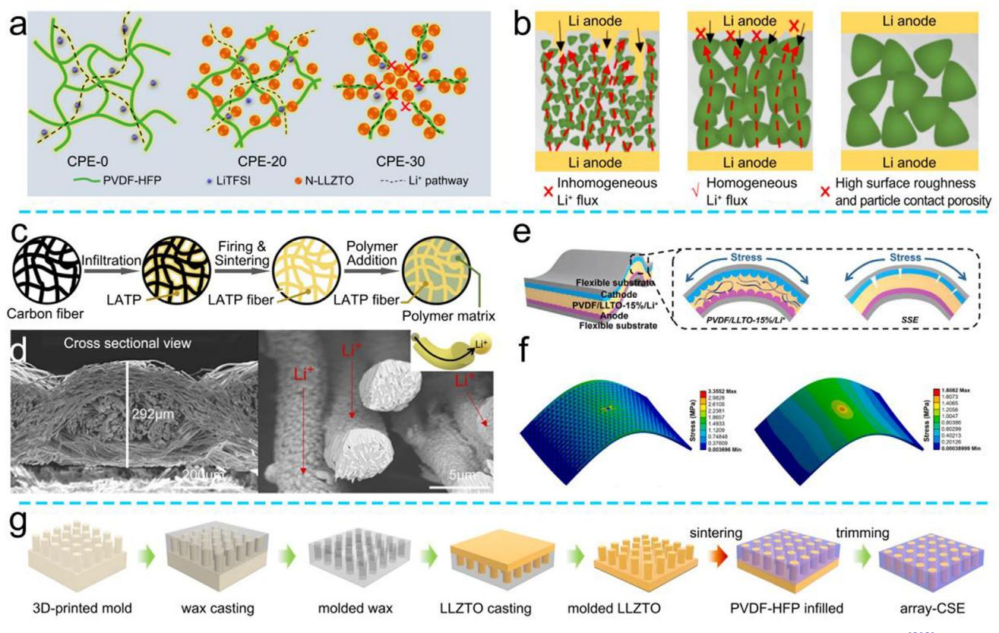

**Figure 11.** a) Schematic illustration of Li+ pathway in the CSSEs constructed by LLZTO of different sizes. Reproduced with permission.[\[121\]](#page-25-0) Copyright 2021, American Chemical Society. b) Schematic illustration of Li+ pathway and interfacial stability in the ceramic–polymer CSSEs constructed by LLZTO of different sizes. Reproduced with permission.[\[122\]](#page-25-0) Copyright 2024, Elsevier. c) Schematic illustration of the LATP fiber preparation. d) SEM images of the LATP fibers and Li+ pathway in the LATP fibers. Reproduced with permission.[\[124\]](#page-25-0) Copyright 2023, The Royal Society of Chemistry. e) The schematics of 1D LLTO ceramic–polymer CSSEs and traditional polymer SSEs under stress and expansion. f) Finite element results of 1D LLTO ceramic–polymer CSSEs and traditional polymer SSEs under stress. Reproduced with permission.[\[125\]](#page-25-0) Copyright 2020, Elsevier. g) Schematic illustration of the array ceramic–polymer CSSE preparation. Reproduced with permission.[\[126\]](#page-25-0) Copyright 2023, The Royal Society of Chemistry.

promotes the uniform passage of Li+ (4.11 × 10−4 S cm−1 at 60 °C), achieving better interfacial stability (0.2 mA cm−2 for 2800 h). Furthermore, the Li+ fluxes of PIC CSSEs was analyzed by COMSOL. Figure 11b shows that the rapid Li+ migration of PIC resulted from the continuous distribution of LLZTO, which has optimal particle size of 17 μm. While, the LLZTO with a size of 380 nm exhibits uneven distribution and numerous gap, which leads to the blockage of the Li+ migration path and reduced the Li+ transmission kinetics. Therefore, the particle size and addition amount of 0D ceramic AFs have great influence on the properties of ceramic–polymer CSSEs.

#### *4.2.2. 1D Ceramic AFs*

Although the high activity of 0D ceramic AFs increases the ionic conductivity, it will also cause the agglomeration of particles and the decrease of mechanical properties. To address this, Luo and co-workers used 0D nano-LLTO to prepare 1D LLTO nanotubes by electrospinning process.[\[123\]](#page-25-0) 1D LLTO nanotubes provide longrange ordered Li+ transport channels. Furthermore, the interfacial contact between LLTO and PVDF is further enhanced, reducing the interface impedance between anode and ceramic– polymer CSSEs (231 vs 109 Ω). In addition, 1D nanotubes act as the skeleton for the ceramic–polymer CSSEs to improve the mechanical properties. Lee and co-workers used template sacrifice method to construct a PEO-coated 1D LATP ceramic–polymer CSSE to achieve high ionic conductivity (10−4 S cm−1 at 60 °C) and flexibility (Figure 11c).[\[124\]](#page-25-0) Figure 11d shows that the interlacing structure of 1D LATP fiber facilitates the long-distance Li+ transport within LATP and fibers. Moreover, the surface of LATP forms certain pores after high-temperature calcination, which promotes the PEO infiltration and improves the interfacial contact between the two phases. Furthermore, Xu and coworkers verified the mechanical strength of ceramic–polymer CSSEs enhanced by filling 1D LLTO nanowires through mechanical strength testing and finite element analysis.[\[125\]](#page-25-0) The incorporation of 1D LLTO nanowires allows for even stress dispersion during tensile deformation, resulting in a satisfactory tensile strength (10 MPa) and a high Young's modulus (20 MPa) (Figure 11e). Finite element analysis also demonstrated that the ceramic–polymer CSSEs with 1D LLTO nanowires as the skeleton and PVDF as the filling layer could buffer the mechanical expansion during folding or bending (Figure 11f), providing the guidance for subsequent research of flexible ceramic–polymer CSSEs.

#### *4.2.3. 3D Ceramic AFs*

In addition to 1D ceramic AF nanowires that facilitate continuous Li+ transport, 3D ceramic AFs can provide multiple Li+ transport pathways. Furthermore, the long-range, orderly transport of Li+ within 3D structures is expected to significantly improve the ionic conductivity of the ceramic–polymer CSSEs. For example, Yeh and Li constructed a 3D LLZTO array by using 3D printing to achieve a higher Li+ transference number (0.71) and the lower transmission activation energy (0.17 eV), as shown in Figure [11g.](#page-13-0) [\[126\]](#page-25-0) COMSOL simulation indicated that the multiple channels within the 3D LLZTO array achieved the continuous and fast transmission of Li+. By contrast, in the 0D LLZTO-dispersion ceramic–polymer CSSEs, Li+ transport pathways within the ceramic AF particles or polymer, and across the ceramic AF/polymer interface both exhibited unsatisfactory Li+ transport efficiency. Beyond the 3D printing, the stencil method is another classic and convenient approach to prepare 3D structure. Fan and co-workers constructed a 3D interconnected LATP continuous Li+ conductor framework by using template method.[\[127\]](#page-25-0) Moreover, the 3D LATP structure exhibited a large number of active pores after template removal and hightemperature calcination, which facilitated the adequate infiltration of the PEO/LiTFSI mixture, thereby improving the interfacial contact (CPE-3D). As a result, the surface of the anode, protected by CPE-3D, remained smooth and free of obvious dendrites, due to the continuous Li+ transmission network of 3D LATP and the higher mechanical strength (≈30 MPa).

In summary, the structure of ceramic AFs has the great influence on the properties of ceramic–polymer CSSEs. 1) The 0D ceramic AF particles expose the most active site, which promotes the dissociation of Li salts. 2) 1D ceramic AF nanowires support the rapid/long-range ordered Li+ transport and further improve the flexibility and mechanical strength of the ceramic–polymer CSSEs. 3) 3D ceramic AF skeleton provides more continuous Li+ transport channels inside. Moreover, the rigid skeleton contributes to inhibiting the further Li dendrite growth, improving the cycle life of the ceramic–polymer-CSSE-based batteries.

#### **4.3. Strategy to Improve the Ionic Conductivity of Ceramic AFs**

The adjustment of ceramic AFs structure has a limited effect on the Li+ mobility and mechanical strength of ceramic–polymer CSSEs. Therefore, researchers should focus on enhancing the intrinsic ionic conductivity of ceramic AFs. Recent research has shown that element substitution/doping of ceramic AF crystal structure can generate defect/disorder-high active sites, which reduce the Li+ transition energy, accelerate the Li+ transport, and improve the ionic conductivity of ceramic–polymer CSSEs.[\[128\]](#page-25-0)

#### *4.3.1. Oxygen Vacancy*

The construction of oxygen vacancies in ceramic AFs is a direct and effective approach to improve the ionic conductivity. The oxygen vacancies can also serve as the anchor sites for polar atoms of polymer, thus improving the interface compatibility (**Figure 12**[a\)](#page-15-0).[\[129\]](#page-25-0) Sun and co-workers demonstrated an increase in ionic conductivity by introducing oxygen vacancies in LLZTO crystals (OV-LLZTO) within a reducing atmosphere (5.6 × 10−4 vs 3.7 × 10−4 S cm−1 at 60 °C). Furthermore, DFT calculations in Figure [12b](#page-15-0) verify that oxygen vacancies act as the anchor sites for PEO, increasing the binding energy between PEO and LLZTO without/with oxygen vacancies from 1.34 to 1.97 eV. Besides, the strong microscopic binding force led to an increase in the macroscopic tensile modulus (7.51 MPa). Consequently, the OV-LLZTO/PEO ceramic–polymer-CSSE-based symmetric cell exhibited low polarization voltage of 41.3 mV even after cycling for 1000 h (Figure [12c\)](#page-15-0). Similarly, Wu and co-workers verified that the presence of oxygen vacancies reduced the Li+ migration energy barrier within the H-LLTO-500 nanofibers (from 0.18 to 0.10 eV) and activation energy for grain boundaries conduction between H-LLTO-500 nanofibers (from 0.38 to 0.20 eV) (Figure [12d\)](#page-15-0).[\[130\]](#page-25-0) Moreover, the oxygen vacancies also facilitated the rapid Li+ transport at the H-LLTO/PVDF─HFP interface, providing a high ionic conductivity (3.4 × 10−4 S cm−1) and enabling stable plating/stripping behaviors for up to 500 h at 0.5 mA cm−2.

#### *4.3.2. Element Doping/Substitution*

Doping or substituting other elements within the lattice of ceramic AFs to introduce lattice distortion is another strategy for creating the defects.[\[131\]](#page-25-0) Wu and co-workers employed N to partially substitute the O in LLTO, causing lattice distortion that reduced the Li+ transition energy barrier to 0.29 eV and increased the ionic conductivity to 4.28 × 10−6 S cm−1. [\[132\]](#page-25-0) Uncontrollable N doping sites brought different degrees of lattice distortion, which subsequently contributed to a reduction in the energy barrier for Li+ transition.

LLZO/LLTO/LLZTO have higher reduction potentials, whereas LATP readily reacts with the Li anode, resulting in decreased interfacial stability. Specifically, Ti4+ will be reduced by Li0 to Ti3+, which decreases the ionic conductivity of LATP.[\[133\]](#page-25-0) To address this, Yang and co-workers constructed multilayer ceramic–polymer CSSEs with Al─LLTO/LATP/Al─LLTO (t-CSEs1) to protect LATP from direct contact with the Li anode (Figure [12e\)](#page-15-0).[\[134\]](#page-25-0) The high reduction potential of the t-CSEs1 extends the cycle life of the symmetric cell to 1950 h at 0.1 mA cm−2, demonstrating the effectiveness of t-CSEs1 protective layers for interfacial stability. Moreover, doping/substitution of LATP can enhance the ionic conductivity while increasing the reduction potential. Huang and co-workers doped Bi in the LATP (LABTP), which densifies the LATP surface and prevented the reduction of Ti4+. Figure [12f](#page-15-0) illustrates that Bi atom anchored Li atom (−1.94 eV) more effectively than Al atom (−1.72 eV), thereby increasing the ionic conductivity of LABTP (6.31 × 10−4 S cm−1). Furthermore, the characteristic peak of Ti3+ was not observed in the LABTP@PVB ceramic–polymer CSSEs after cycling, which verified that Bi doping contributed to the stable LATP-based ceramic–polymer CSSE construction. In addition, Yang and coworkers investigated the changes in ionic conductivity of LATP with Co/Cu doping.[\[135\]](#page-25-0) The Co-doped LATP exhibited an enhanced ionic conductivity of 3.18 × 10−4 S cm−1, slightly higher than that of Cu-doped LATP (2.99 × 10−4 S cm−1). Based on this, Patra and co-workers explored the effects of ionic conductivity of LATP by Co, Cu, Sn, V, and Zr doping, respectively.[\[136\]](#page-25-0)

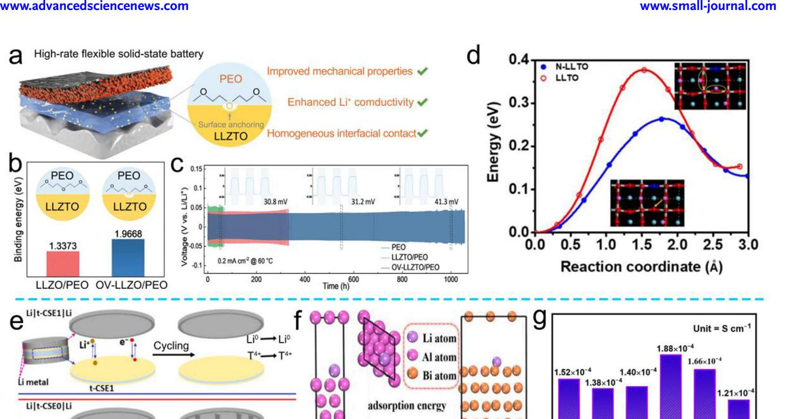

**Figure 12.** a) Schematic representation of the working mechanisms of OV-LLZTO/PEO ceramic–polymer CSSEs. b) Simulated binding energy of PEO/LLZTO-with/without OV. c) Different ceramic–polymer-CSSE-based Li//Li symmetric cells. Reproduced with permission.[\[129](#page-25-0)] Copyright 2023, Wiley-VCH. d) Energy profiles and barriers for Li+ hop in N─LLTO/LLTO structure. Reproduced with permission.[\[132\]](#page-25-0) Copyright 2021, IOP. e) Schematic diagram of the working mechanism of LATP reduction by Li anode and LATP protection by Al─LLZO during electrochemistry. Reproduced with permission. Copyright 2024, Elsevier. f) DFT of Li+ adsorption energy in LATP and LABTP. Reproduced with permission.[\[133\]](#page-25-0) Copyright 2023, Elsevier.[\[133\]](#page-25-0) g) Li+ conductivity of different element-doping LATP-based ceramic–polymer CSSEs. Reproduced with permission.[\[136\]](#page-25-0) Copyright 2024, MDPI.

Among them, the Sn and V doping introduced more defects, thereby improving the crystal activity and promoting the rapid Li+ migration within the lattice. Notably, the binding energy of Li─Sn bond was the lowest (−0.326 eV atom−1), indicating that the Li+ conducting pathways of Sn─LATP was relatively easy to form. Therefore, the ceramic–polymer CSSEs based on Sn─LATP had the highest ionic conductivity (1.88 × 10−4 S cm−1), as shown in Figure 12g. These result show that the moderate amount of element doping/substitution induces the lattice distortion, thereby accelerating the Li+ transport of ceramic AFs.

#### *4.3.3. Interface Engineering*

Additionally, researchers have employed the interface engineering strategy to modify the surface of ceramic AFs, providing multiple active sites to enhance the dissociation of Li salts and increase the Li+ migration kinetics.[\[137–139\]](#page-25-0) Kang and co-workers designed BaTiO3─LLTO heterojunctions with PVDF to construct high conductive and dielectric PVBL ceramic–polymer CSSEs (**Figure 13**[a\)](#page-16-0).[\[140\]](#page-25-0) The lattice interleaving demonstrates the synthesis of the BTO─LLTO heterojunction (Figure [13b\)](#page-16-0). What is more, the BTO─LLTO heterojunction generates a built-in electric field, which promotes the dissociation of Li salts and achieves the rapid Li+ transport at the heterojunction interface (8.2 × 10−4 S cm−1). In addition, the COMSOL simulations indicate that the BTO─LLTO coupling contributed to achieve uniform distribution of potential. Inspired by the design of heterojunction structure, Wu and co-workers incorporated WO3 onto the surface of LLZTO (LLZTO@*x*W) to construct Li+ conductor with an expanded interface (Figure [13c\)](#page-16-0).[\[141\]](#page-25-0) Further, WO3 improved the contact between LLZTO@*x*W and PEO, while also protecting the internal LLZTO. Moreover, the low crystallinity at the WO3/LLZTO interface facilitated the dissociation of Li salts and accelerated the rapid Li+ transport. Besides, introducing nitride modification layer helps to generate the stable Li3N layer to achieve the interfacial stability of anode/ceramic–polymer CSSEs. Guo and co-workers used calcination to in situ grow g-C3N4 on the surface of LATP (LATP@CN) to improve the electrochemical stability between LATP and Li anode.[\[142\]](#page-25-0) Moreover, the abundant N sites on the surface of g-C3N4 can rapidly anchor Li+ and accelerate the Li+ migration at the LATP@CN interface.[\[143\]](#page-25-0)

Compared with the growth of functional protective layer on the surface of ceramic AFs, the surface functionalization strategy is an effective strategy to protect the bulk phase structure. This approach consumes elements on the surface of ceramic AFs to in situ grow a protective layer. Li and co-workers coated LLZTO surface with fast Li+ conductor LaRuO3 to protect LLZTO and improve the ionic conductivity (6.06 × 10−4 S cm−1), as

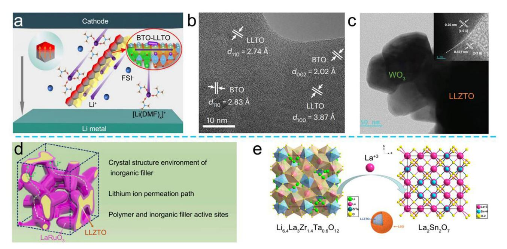

**Figure 13.** a) Schematic illustration of the Li+ transport by the coupled BTO@LLTO in the PVBL ceramic–polymer CSSEs. b) Various lattice interleaving of BTO@LLTO. Reproduced with permission.[\[140\]](#page-25-0) Copyright 2023, Springer Nature. c) HRTEM images of LLZTO@3W. Reproduced with permission.[\[141\]](#page-25-0) Copyright 2023, Wiley-VCH. d) Schematic diagram of the LLZTO@3% LRO structure and Li+ transport. Reproduced with permission.[\[144\]](#page-25-0) Copyright 2023, Elsevier. e) Schematic diagram of in situ synthesis of the LLZTO@LSO. Reproduced with permission.[\[145\]](#page-25-0) Copyright 2021, American Chemical Society.

shown in Figure 13d. [\[144\]](#page-25-0) By consuming La in LLZTO, certain defects were introduced in the LLZTO surface phase, reducing the Li+ migration energy barrier. Moreover, lattice distortion at the LaRuO3/LLZTO interface increased the activity, which facilitated the dissociation of Li salts and accelerated the Li+ migration. Furthermore, due to the bonding effect of Li2Zr2O7 under high temperature sintering, LLZTO@LRO grew 3D inorganic skeleton to achieve the long-range and rapid Li+ transport. Similarly, Kang and co-workers constructed LLZTO@LSO core–shell structure by consuming La in LLZTO to generate La2Sn2O7 protective layer (Figure 13e).[\[145\]](#page-25-0) The high activity at the LLZTO/LSO interface improved the contact between LLZTO@LSO and PVDF, thus reducing the interface impedance (from 296 to 213 Ω) and accelerating the Li+ diffusion at the interface. Consequently, LLZTO@3% LRO-CSSE-based cell still retained 110.6 mAh g−1 after 400 cycles at 0.2 C.

The strategies of doping/modification the surface of ceramic AFs enhance the Li+ transport at the interface and reduce the interface impedance. At the same time, exposing more active sites in anchoring anions increases the Li+ transference number (**Table 2**[\)](#page-17-0). However, the doping/modification strategy cannot effectively address the issue of poor interface compatibility between polymers and ceramic AFs, which limits the improvement in the mechanical properties of ceramic–polymer CSSEs. In addition, the high activity on the surface of ceramic AFs, such as LLZO and LLZTO, leads to the formation of Li2CO3 resistance layer.[\[146\]](#page-25-0) Therefore, it is necessary to analyze the interface structure of the ceramic AFs to provide theoretical insights for designing the ceramic AFs with high ionic conductivity, high stability, and good interface compatibility.

#### **4.4. Strategy to Improve the Interface Compatibility**

#### *4.4.1. Surface Engineering*

The low conductivity and lithiophobicity properties of Li2CO3 layer increase the interface resistance, which hinders the Li+ transport and reduces the overall performance of ceramic– polymer CSSEs (**Figure 14**[a\)](#page-17-0). Huo and co-workers employed both 1D and 2D exchange nuclear magnetic resonance spectroscopy to investigate the impact of Li2CO3 layer on the Li+ transport mechanism of LLZTO-based ceramic–polymer CSSEs.[\[147\]](#page-25-0) Surprisingly, strong exchange interactions were observed between Li2CO3 and PEO, facilitating Li+ movement. However, the sluggish ion transport dynamic between the Li2CO3 layer and LLZTO hinders the Li+ exchange between LLZTO and PEO. Moreover, the Li+─H+ exchange between solvent and LLZTO during the ceramic–polymer CSSE preparation, resulting in the Li-deficient layer, hindering the transport of Li+ between LLZTO and PEO (Figure [14b\)](#page-17-0). Therefore, it is necessary to remove the Li2CO3 layer and optimize the process to enable multiple possibilities of Li+ transport pathways, thereby improving the electrochemical performance of the ceramic–polymer-CSSE-based batteries.[\[146, 148\]](#page-25-0) The existing improvement strategies include process optimization, surface etching, and conversion. Among them, process optimization and surface etching involve physical or chemical treatments to remove the Li2CO3 layer from the surface of the ceramic AFs. Besides, conversion refers to the chemical conversion of the low Li+-conductivity Li2CO3 into the fast Li+ conductor/Licontaining compound within the lipophilic layer, establishing multipathways for Li+ transport.

# **SCIENCE NEWS** www.advancedsciencenews.com

**Table 2.** Basic performance table of ceramic–polymer CSSEs mentioned in this section.

| Polymers    | Active fillers                     | Ionic conductivity $[S \text{ cm}^{-1}]$ | Oxidation potential $[V]$ | $Li^+$ transference number | Cathode material | Electrochemical performance |                            | Symmetrical battery performance             | Refs.   |
|-------------|---------------------------------------|------------------------------------------------|------------------------------|-------------------------------|---------------------|-----------------------------|----------------------------|------------------------------------------------|---------|
|             |                                       |                                                |                              |                               |                     | Current density $[C]$    | Reversible capacity        |                                                |         |
| <b>PEO</b>  | <b>LLZTO</b>                          | $5.6 \times 10^{-4}$                           |                              | 0.328                         | <b>LFP</b>          | 5                           | 75.68% (500th)             | 0.2 mA cm <math>-2</math> , 1000 h  | $[129]$ |
| PEO         | LLZTO@xW                              | $1.9 \times 10^{-4}$                           | 5.1                          | 0.67                          | <b>LFP</b>          | 1                           | 144.3 mAh $g^{-1}$ (400th) | 0.1 mA cm <math>-2</math> , 2000 h  | $[141]$ |
| <b>PVDF</b> | <b>LLTO</b>                           | $5.8 \times 10^{-4}$                           | 5.2                          | $\overline{ }$                | <b>LFP</b>          | 0.2                         | 140 mAh $g^{-1}$ (200th)   | 0.1 mA cm <math>-2</math> , 520 h   | $[125]$ |
| <b>PVDF</b> | <b>LLTO</b>                           | $3.5 \times 10^{-4}$                           | $4.8 \\$                     |                               | <b>LFP</b>          | 0.5                         | 91.4% (100th)              | 0.1 mA cm <math>-2</math> , 220 h   | $[123]$ |
| <b>PVDF</b> | $BaTiO_3$ -LLTO                       | $8.2 \times 10^{-4}$                           | $4.8$                        | 0.57                          | <b>LFP</b>          | $\overline{ }$              |                            | 0.1 mA cm <math>-2</math> , 1900 h  | $[140]$ |
| <b>PVDF</b> | LLZTO@LSO                             | $1.30 \times 10^{-4}$                          | 5.5                          | 0.44                          | <b>LFP</b>          | 0.2                         | 86% (200th)                |                                                | $[145]$ |
| <b>PVDF</b> | LLZTO@LRO                             | $6.06 \times 10^{-4}$                          | 5.25                         | 0.55                          | <b>LFP</b>          | 0.2                         | 129.6 mAh $g^{-1}$ (400th) |                                                | $[144]$ |
| PVDF-HFP    | <b>LLZTO</b>                          | $8.8 \times 10^{-6}$                           |                              | $\overline{\phantom{a}}$      | <b>LFP</b>          | $\overline{\phantom{a}}$    |                            | 0.5 mA cm <math>-2</math> , 2000 h  | $[115]$ |
| PVDF-HFP    | LLATO/Li 3 PO 4 | $5.1 \times 10^{-4}$                           | 5                            | 0.45                          | <b>LFP</b>          | 0.5                         | 87.8% (160th)              | 0.5 mA cm <math>-2</math> , 800 h   | $[128]$ |
| PVDF-HFP    | $A$ -LLZO + LATP                      | $6.46 \times 10^{-4}$                          | 4.76                         | 0.69                          | <b>LFP</b>          | 0.5                         | 85.53% (200th)             | 0.1 mA cm <math>-2</math> , 1950 h  | $[134]$ |
| PVDF-HFP    | <b>LLZTO</b>                          | $4.1 \times 10^{-4}$                           | 6                            | 0.71                          | LF P     | 0.5                         | 98% (225th)                | 0.1 mA cm <math>-2</math> , 1000 h  | $[126]$ |
| PVDF-HFP    | N-LLZTO                               | $1.7 \times 10^{-4}$                           | $4.8$                        | 0.57                          | <b>NCM</b>          | 0.5                         | 82% (500th)                | 0.05 mA cm <math>-2</math> , 1200 h | $[132]$ |
| PVB         | Bi-LATP                               | $6.31 \times 10^{-4}$                          | $4.5$                        | $\overline{ }$                | <b>LFP</b>          |                             |                            | 0.2 mA cm <math>-2</math> , 300 h   | $[133]$ |

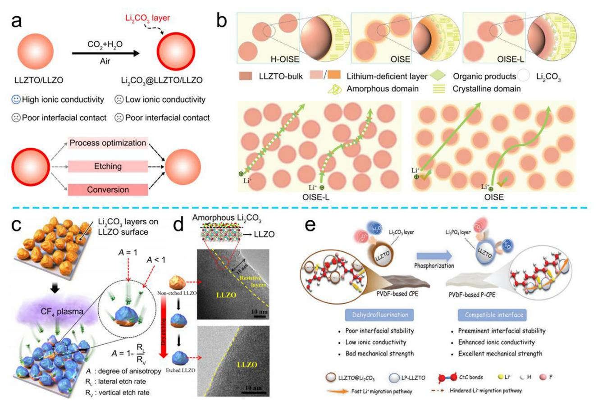

Figure 14. a) Schematic representation of  $Li_2CO_3$  generated on the ceramic AF surface and the modification strategy of removed  $Li_2CO_3$  layer. b) Schematic representation of the presence of Li2CO3 and Li-deficient layers inhibited the continuous transport of Li+ between the polymer and ceramic AFs. Reproduced with permission.[147] Copyright 2024, Wiley-VCH. c) Schematic illustration for CF4 etching of Li2CO3 layers. d) HRTEM of LLZTO before and after etching. Reproduced with permission.[150] Copyright 2021, Elsevier. e) Schematic diagram of performance improvement after converting Li2CO3 on the ceramic AF surface into Li3PO4 layer. Reproduced with permission.[155] Copyright 2023, Wiley-VCH.

Due to the high activity of LLZTO surface, the formation of Li2CO3 and particle agglomeration are easily generated during the ceramic–polymer-CSSE-making process. Lim and co-workers prepared Li2CO3-free LLZTO@US by using dry mixing and solvent-assisted ultrasonic method.[149] After conventional wet milling, the LLZTO surface generates a  $Li_2CO_3$  layer with high interface resistance, which was physically removed by ultrasoundassisted mixing, facilitating the rapid Li+ transfer between PEO and LLZTO. Furthermore, with the aid of ultrasound, the LLZTO particles were well-dispersed in the PEO, thus promoting uniform Li+ transport. However, it is difficult to control the etching direction when removing the  $Li_2CO_3$  layer from the ceramic AF surface by using physical method. Briefly, the etching rates differ between horizontal and vertical directions, resulting in the removal of only the outer  $Li_2CO_3$  layer, while the internal layer remains challenging to eliminate (Figure 14c).[150] Based on this, Lee et al. used the gas phase method to uniformly etch the  $Li2CO3$ layer on the LLZO surface, and the Li2CO3 layer basically disappeared after etching (Figure 14d). In addition, a large number of highly active defects were created on the etched LLZO surface, which contributes to the rapid Li salt dissociation, increasing the concentration of free Li+ in ceramic-polymer CSSEs and improving the Li+ conductivity (4.05  $\times$  10-4 S cm-1). Moreover, using acids, such as acetic acid and boric acid, to etch the  $Li_2CO_3$  layer on the surface of ceramic AFs and reduce interface resistance is also a feasible method.[151, 152]

However, process optimization and surface etching methods to remove the Li2CO3 layer are not the permanent solutions. When the ceramic AFs expose to air, a  $Li_2CO_3$  resistance layer forms again at the high-activity defects. Thus, the primary focus of current research lies in transforming the insulating  $Li_2CO_3$  layer into a stable and active lithium-compound layer that exhibits enhanced ionic conductivity and reduced interfacial resistance.[153, 154] Yang and co-workers used phosphoric acid and citric acid to remove the Li2CO3 layer on the surface of LLZTO and introduced the fast  $Li^+$ -conductor,  $Li_3PO_4$  layer, to enhance Li+ transport at the interface between the two phases (Figure 14e).[155] Furthermore, the  $Li_3PO_4$  layer prevented the direct contact between LLZTO and PVDF-HFP, thereby inhibiting the dehydrofluorination of PVDF-HFP and the generation of free radicals.[156] This improved the stability of the ceramicpolymer CSSEs, which exhibited stable performance over 950 h at 0.2 mA cm $-2$ .

Meanwhile, process optimization and surface etching methods can only eliminate the influence of high-resistance  $Li_2CO_3$ layer, while the issue of ceramic AF/polymer interface compatibility remains unresolved. Our group has verified that the  $Li2CO3$ layer can be converted into the organic coating protection by using the -COOH functional group, which can enhance the rapid Li+ transport at the ceramic AF/polymer interface and improve the mechanical strength of the ceramic-polymer CSSEs.[157, 158] Moreover, Zhang and co-workers employed melamine and cubic acid as the raw materials to grow zwitterionic COF-HUT4 on the surface of LLZTO (LLZTO@HUT4).[159] During the process of in situ polymerization, the LiOH and Li2CO3 resistance layer on the LLZTO surface are replaced by HUT4, significantly enhancing the  $Li^+$  transfer kinetics at the two-phase interface (0.73 mS  $\text{cm}^{-1}$ ). In addition, the research also shows that the introduction of LLZTO@HUT4 decreased the crystallinity of PEO. Moreover,

the abundant polar active sites (such as N and O) on HUT4 can anchor the anions and promote the dissociation of Li salts, thus enhancing the rapid Li+ diffusion.

### 4.4.2. Surface Modification

In summary, the excessive activity of the ceramic AFs surface contributes to the Li salts dissociation. While, the increased surface activity can lead to the aggregation of the ceramic AFs in the ceramic–polymer CSSEs and the formation of Li2CO3 resistance layer, which hinders the continuous Li+ transport. To mitigate these issues, surface modification of the ceramic AFs has been employed to reduce the surface energy and protect the Li+ transport channels of the ceramic AFs. Among these research, coating the ceramic AFs with the organic layer contributes to improving the Li+ transport at the interface between the two phases and form a "passivation layer" to protect the inactivation of the ceramic AFs.[160, 161] More importantly, the organic modification layer promotes the ceramic AFs to bond tightly with the polymer, thus improving the toughness of the ceramic–polymer CSSEs.[70] Effective surface modification methods include by using the surfactants, interfacial adhesives, and silane coupling agents.[162]

Surfactant Modification: In addition to Li2CO3, LiOH residues on the LLZTO surface also hinder the electrochemical performance of ceramic-polymer CSSEs. Therefore, by using the -OH functional group as the binding site and introducing suitable surfactants, the protection of ceramic AFs can be realized. Yang and co-workers used cetyltrimethylammonium bromide (CTAB) as the additive to adsorb onto the LLZTO, forming a protective layer that reduced the surface activity and protected the LLZTO (Figure 15a,b).[163] Furthermore, the dispersion of LLZTO@CTAB in PEO is further improved due to the removal of  $-OH$  groups. Figure 15c shows that the affinity of LLZTO@CTAB for PEO increases significantly (from 76° to 39°). Consequently, the PEO-LLZTO@CTAB-CSSE-based cell maintains 91% of the initial specific capacity after 300 cycles at 0.2 C, demonstrating the benefits of improved interfacial contact between LLZTO@CTAB and PEO.

*Interfacial Adhesive:* Polydopamine (PDA), rich in hydroxyl and  $-NH2$  functional groups, which can rapidly form a film on the surface of the materials under alkaline conditions.[164] Moreover, the rich O- and N-containing functional groups help to improve the Li salts dissociation, thereby increasing the Li+ transference number. Yang and co-workers used PDA to coat LLZAO (PDA@LLZAO) and construct multiple ceramic-polymer CSSE membranes (CSEs1) (Figure 15d).[165] HRTEM image shows that the LLZAO has been coated with  $\approx$ 6.38 nm PDA protective layer, which enhances the contact between PVDF-HFP and PDA@LLZAO, thus improving the mechanical properties of the CSSEs1. By contrast, Figure 15e shows that the pure LLZAO has a poor interfacial contact with PVDF-HFP, which will greatly affect the Li+ transmission. Furthermore, Chen and co-workers also verified that the PDA coating reduced the surface energy of LLZTO, thus promoting the uniform dispersion.[166] Moreover, thanks to the excellent mechanical stability of PAN and good interfacial contact, the ceramic-polymer CSSEs can carry 300 g weights without breaking.

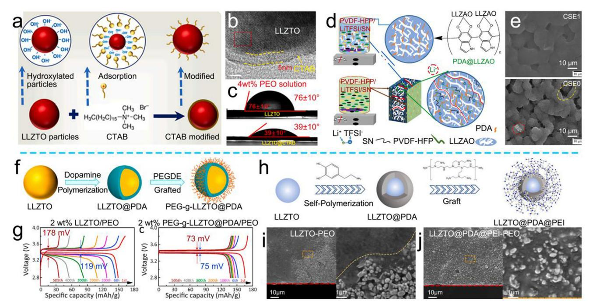

**Figure 15.** a) Schematic illustration of the CTAB modification mechanism. b) TEM image of LLZTO@CTAB. c) Contact angle testing. Reproduced with permission.[\[163\]](#page-25-0) Copyright 2023, Elsevier. d) Synthesis procedure of multilayer CSSEs1 membrane. e) SEM images of CSSEs1 and CSSEs0. Reproduced with permission.[\[165\]](#page-26-0) Copyright 2022, Elsevier. f) Schematic illustration of the preparation of PEG-*g*-LLZTO@PDA. g) charge/discharge curve of the different ceramic–polymer-CSSE-based cell. Reproduced with permission.[\[167\]](#page-26-0) Copyright 2021, Elsevier. h) Schematic illustration of the preparation of LLZTO@PDA@PEI. SEM images of i) LLZTO─PEO and j) LLZTO@PDA@PEI─PEO. Reproduced with permission.[\[168\]](#page-26-0) Copyright 2024, Elsevier.

With the assistance of the hydroxyl group and ─NH2 functional groups on PDA, functional side chains can be grafted to overcome the limitations of PDA modification. Yao and co-workers selected poly(ethylene glycol) (PEG), which has the molecular structure similar to PEO, onto the surface of LLZTO@PDA to enhance the interface compatibility between the PEO/PEG-*g*-LLZTO@PDA (Figure 15f).[\[167\]](#page-26-0) Therefore, the 2 wt% PEG-*g*-LLZTO@PDA/PEO-based cell has very low interface impedance (5.4 Ω). Furthermore, Figure 15g shows that the overpotential of the cell remains stable at 74 mV from 6th to 505th, while the polarization voltage of the unmodified bare LLZTO ceramic–polymer-CSSE-based cell from 119 mV (6th) to 178 mV (505th). Building on these findings, Huang and coworkers screened polyethylenimine (PEI) with the ─NH2 group to react with both ether linkages in PEO and the phenolic hydroxyl of PDA, thereby reducing the Li+ transport barrier between PDA@LLZTO and PEO (Figure 15h).[\[168\]](#page-26-0) Figure 15i shows that the poor affinity between LLZTO and PEO leads to the uneven distribution of LLZTO in PEO, which hinders smooth Li+ transport. While, the PEI@PDA bridge allows the LLZTO to be more uniformly dispersed in PEO, facilitating uniform Li+ transport (Figure 15j). Consequently, the ionic conductivity of the ceramic–polymer CSSEs increases from 6.14 × 10−5 to 1.89 × 10−4 S cm−1. In addition, the rich functional groups on PEI accelerate the Li salts dissociation, thus accelerating the Li+ migration. As the result, this composited coating not only protects the ceramic AFs but also reduces the interface resistance, thereby creating favorable conditions for rapid Li+ transport.

*Silane Coupling Agents*: In contrast to physical adsorption/self-polymerization of surfactants and interfacial adhesives, silane coupling agents are capable of forming more stable chemical bonds with inorganic substances after the hydrolysis of their alkoxy groups, resulting in stronger bonding between ceramic AFs and polymers. Kang and co-workers employed 3-methacryloxypropyltrimethoxysilane (MPS) to react with the residual LiOH on the surface of LLZTO, forming stable Si─O─Li chemical bonds (**Figure 16**[a\)](#page-20-0).[\[169\]](#page-26-0) Moreover, AIBN has been introduced as an initiator to bond PVDF with MPS, improving the interaction between PVDF and LLZTO@MPS, and thus creating the continuous Li+ transport pathway (Figure [16b\)](#page-20-0). DFT calculations reveal that with the help of C═O and Si─O─CH3 groups, the adsorption energy of MPS─[Li (DMF)*x*] + (1.67 eV) is higher than that of PVDF (1.33 eV) and LLZTO (0.83 eV), indicating that MPS facilitates the enrichment of Li+ at the highefficiency cross-phase ion transport sites, leading to an enhanced ionic conductivity (8.7 × 10−4 S cm−1). Simultaneously, Song and co-workers conducted further verification through the synthesis of 3-methacryloxypropyltrimethoxysilane (MEMO)@LLZTO.[\[170\]](#page-26-0) Their findings indicate that the silane coupling agent initially forms silanol bonds, which subsequently undergoes dehydration and bonded with the ─OH groups on the surface of LLZTO, ultimately forming stable Si─O chemical bonds. Besides, the DFT calculations demonstrate that the binding energy between LLZTO─MEMO and PEO (−1.537 eV) is much higher than that between LLZTO and PEO (−0.812 eV). Moreover, the charge density distribution confirms strong interface interactions between MEMO, LLZTO, and PEO, which helps to reduce the

**Figure 16.** a) Mechanism diagram of MPS bridging LLZTO and PVDF. b) Schematic illustration of Li+ transport pathways in the ceramic–polymer CSSEs with/without MPS. Reproduced with permission.[\[169\]](#page-26-0) Copyright 2023, Elsevier. c) Schematic representation of the structure of the C═N bonds in the SHENE ceramic–polymer CSSEs. Reproduced with permission.[\[176\]](#page-26-0) Copyright 2024, Elsevier. d) Schematic representation of the structure of the ─S─S─ bonds in the PBHL@LLZTO@DDB ceramic–polymer CSSEs. Reproduced with permission.[\[177\]](#page-26-0) Copyright 2024, Elsevier. e) Schematic illustration of Li@LLZTO synthesis process. Reproduced with permission.[\[178\]](#page-26-0) Copyright 2022, Elsevier. f) Schematic illustration of PSAb20A synthesis process. Reproduced with permission.[\[179\]](#page-26-0) Copyright 2022, American Chemical Society.

interface impedance between MEMO@LLZTO and PEO. Additionally, the Li+ diffusion energy barrier on MEMO@LLZTO (0.32 eV) is lower than that on LLZTO (0.51 eV). Thanks to the bridging effect of MEMO functional coating layer and the low Li+ diffusion energy barrier, MEMO@LLZTO─PEO CSSEs provide a high Li+ mobility of 2.16 × 10−4 S cm−1 at 30 °C.

The organic groups in the silane coupling agent are also related to the binding energy of the polymer. Zhang and coworkers screened three silane coupling agents for the surface modification of LLZTO and explored the interaction between functional groups on the ceramic AFs with the polymer. The silane coupling agent (KH550) can form hydrogen bonds with PEO and achieve high binding energy (−1.459 kcal mol−1) due to ─NH2 functional groups, which help to reduce the interface impedance.[\[171\]](#page-26-0) Based on this, Zhang and co-workers selected 3-aminopropyltriethoxysilane (APTES), a coupling agent with ─NH2 functional group, to connect LLZO nanofibers with PVDF─HFP.[\[172\]](#page-26-0) Grafting APTES provides abundant ─NH2 functional groups on the surface of LLZO nanofibers, which enhances the binding force of NH2@LLZO nanofibers and PVDF─HFP through hydrogen bonding, thereby reducing the Li+ transport resistance. Moreover, the hydrogen bond between the ─NH2 functional group and the TFSI− has been formed, which reduces the binding energy between Li+ and TFSI− molecule to −2.82 eV. This theory was further validated by Gao and co-workers and Zhang and co-workers.[\[173, 174\]](#page-26-0)

In the long-term cycling process of ceramic–polymer CSSEs, the migration of Li+ induces serious volume changes and microcracks, which leads to the fracture failure of ceramic– polymer CSSEs.[\[175\]](#page-26-0) Therefore, it is crucial not only to consider the interface compatibility between the ceramic AFs and the polymer, but also should pay more attention to the interfacial stability between the two phases during the electrochemical process. Liu and co-workers used APTES to bridge LLZTO and 2-hydroxyethyl methacrylate-g-4-formylbenzoic acid (CHO@HEMA)/poly(ethylene glycol) methoxy acrylate (PEGMA) to from the self-healing flexible CSSEs (SHENE) by using silane bonds and ─NH2 groups (Figure 16c).[\[176\]](#page-26-0) The ─NH2 group (from APTES) reacts with aldehyde group (from CHO@HEMA) to form C═N bonds, which endow the ceramic– polymer CSSEs with excellent mechanical properties and self-healing ability. The C═N bonds enable the electrolyte to selfheal by breaking/reforming during the electrochemical process, effectively mitigating the formation of crack and maintaining the structural integrity of ceramic–polymer CSSEs. In addition to C═N bonds, disulfide (─S─S─) bonds have also proven to

**[www.advancedsciencenews.com](http://www.advancedsciencenews.com) [www.small-journal.com](http://www.small-journal.com)**

**Table 3.** Basic performance table of ceramic–polymer CSSEs mentioned in this section.

| Polymers             | Active fillers  | Ionic conductivity | Oxidation potential [V] | Li+ transference number | Cathode material | Electrochemical performance |                     | Symmetrical battery performance | Refs. |
|----------------------|-----------------|-----------------------|----------------------------|----------------------------|---------------------|-----------------------------|---------------------|------------------------------------|-------|
|                      |                 | [S cm−1]              |                            |                            |                     | Current density [C]      | Reversible capacity |                                    |       |
| PEO                  | CTAB@LLZTO      | 4.17 × 10−5           | 4.5                        | –                          | LFP                 | 0.2                         | 91.0% (300th)       | 0.2 mA cm−2, 1000 h                | [163] |
| PEO                  | Li@LLZTO        | 1.50 × 10−3           | 5.3                        | 0.77                       | LFP                 | 1                           | 92% (120th)         | 0.05 mA cm−2, 1000 h               | [178] |
| PEO                  | PDA@LATP        | 2.07 × 10−4           | 5.2                        | –                          | NCM                 | 0.2                         | 96.7% (200th)       | –                                  | [164] |
| PEO                  | PEG-g-LLZTO@PDA | 1.1 × 10−4            | 4.8                        | 0.34                       | LFP                 | 0.5                         | 90.35% (500th)      | 0.1 mA cm−2, 440 h                 | [167] |
| PEO                  | SCA─IL@LATP     | 1.455 × 10−3          | 4.76                       | –                          | LFP                 | 0.2                         | 83.9% (120th)       | 0.2 mA cm−2, 1200 h                | [180] |
| PEO                  | MEMO@LLZTO      | 2.16 × 10−4           | –                          | 0.53                       | LFP                 | 1                           | 146 (200th)         | 0.1 mA cm−2, 4000 h                | [170] |
| PEO + PAN            | APTS─LLZTO      | 1.58 × 10−4           | 5.1                        | –                          | NCM                 | 0.3                         | 4.74% (100th)       | 0.1 mA cm−2, 500 h                 | [173] |
| PVDF                 | Li@LLZTO        | 8.73 × 10−4           | 5                          | 0.53                       | NCM811              | 2                           | 80.4% (1700th)      | 0.2 mA cm−2, 1400 h                | [169] |
| PVDF─HFP             | PDA@LLZTO       | 4 × 10−4              | 4.8                        | 0.6                        | LFP                 | 0.5                         | 82.7% (300th)       | 0.1 mA cm−2, 1800 h                | [166] |
| PBHL                 | LLZTO@DDB       | 1.24 × 10−4           | 5.16                       | 0.4                        | LFP                 | 0.2                         | 95% (700th)         | 0.05 mA cm−2, 3200 h               | [177] |
| PEGMEA + CHO@HEMA | APTES@LLZTO     | 2.16 × 10−4           | 5.3                        | –                          | LFP                 | 0.1                         | 87% (100th)         | 0.05 mA cm−2, 5000 h               | [176] |

be effective for self-healing in ceramic–polymer CSSEs.[\[177\]](#page-26-0) Liu and co-workers constructed the dynamic 3D inorganic/organic hybrid network by utilizing ─S─S─ bond exchange reaction between LLZTO@silane coupling agent (DDB) and polyurethane (PBHL) (Figure [16d\)](#page-20-0). Thanks to the excellent self-healing ability of ─S─S─ bond and good interface compatibility, the tensile strength of PBHL@LLZTO@DDB CSSEs is greatly improved (1.5 times higher than PBHL). Therefore, the introduction of dynamic self-healing structural bonds in the ceramic–polymer CSSEs improve the compatibility of the ceramic AF/polymers interface to increase the durability and stability during long-term electrochemical cycling, which is essential for high-performance ceramic–polymer-CSSE-based batteries.

Grafting functional chains, such as single-Li+ conductive chain, can help to reduce the internal resistance at the interface between polymer and ceramic AFs, enabling continuous Li+ conduction. Xu and co-workers grafted LiSTFSI onto APTES@LLZTO (Li@LLZTO) and constructed the PL@LCSEs with PEO (Figure [16e\)](#page-20-0).[\[178\]](#page-26-0) The results show that the single-Li+ conductive layer not only accelerates the Li+ hopping, but also improves the interface compatibility between the Li@LLZTO and PEO. As a result, the PL@LCSEs provide effective protection to the anode through enhanced interfacial contact and excellent ionic conductivity (1.5 mS cm−1 at 60 °C). Brunklaus and co-workers grafted single Li+ conductive polysulfonamine (PSA) onto APTES@LATP to facilitate rapid Li+ transport across the two-phase interface (Figure [16f\)](#page-20-0).[\[179\]](#page-26-0) In addition, ionic liquid is also an excellent fast Li+ conductor with low melting point, which can achieve both good interfacial contact and rapid Li+ transport. Yang and co-workers constructed a bifunctional modified layer, consisting of silane coupling agent and ionic liquid on LATP (LATP@SCA─0.25IL).[\[180\]](#page-26-0) It is worth mentioning that the existence of the modified layer avoids the adverse reaction between LATP and anode, improving the electrochemical stability of the ceramic–polymer CSSEs.

Therefore, surface modification of the ceramic AFs is beneficial for improving the compatibility of the two-phase interface, thereby reducing the internal resistance at the interface (**Table** **3**). More importantly, the doping/modification of inorganic substances accelerate the Li+ transfer, achieving the uniform Li0 deposition. While, the modification of organic substances enhances the interface affinity, which promotes the rapid Li+ transport at the ceramic AF/polymer interface. However, coating with organic substances may impact the oxidation electrochemical window of the ceramic–polymer CSSEs. So, the design requirements necessitate careful consideration.

# **5. Conclusion and Perspectives**

Polymer SSEs have been widely considered for its good interfacial contact, excellent physical/chemical stability, and flexibility. However, low ionic conductivity and oxidation electrochemical window, interface side reactions, and the Li dendrite growth inhibit the further development of polymer-SSE-based batteries. The market demand for polymer-SSE-based LMBs with high safety and high energy density will be further increased. Therefore, a large number of researches have been exploring and modifying the ceramic–polymer CSSEs to address the limitations of polymer-SSE-based LMBs. This review focuses on the design and modification of each component in ceramic–polymer CSSEs, where the polymer serves as the main skeleton and ceramic AFs. In general, the purpose of modification is primarily to increase the Li+ transport kinetics and improve the interface compatibility/stability. The strategies of ceramic–polymer CSSEs include material screening, structure regulation, and surface modification (**Figure [17](#page-22-0)**).

1) The main properties of the ceramic–polymer CSSEs are primarily determined by the characteristics of polymers, including but not limited to ionic conductivity, electrochemical window, and mechanical strength. Among them, the transport of Li+ in the polymer is coordinating/dissociating by the transition of polar functional groups in the chains. However, the ionic conductivity in the crystalline region of the polymer is lower than that in the amorphous region. Therefore, reducing the crystallinity of the polymer is a feasible approach to improve Li+ transport. While, the modification strategy to enhance Li+ conductivity including

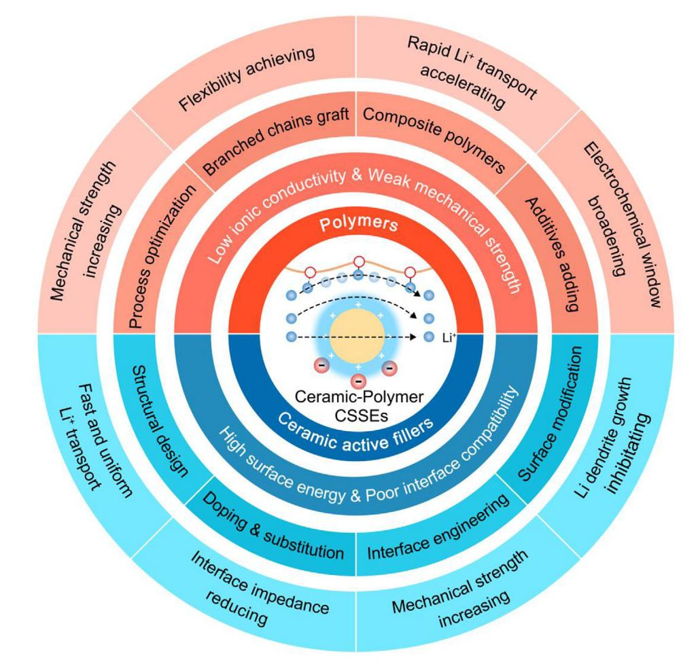

**Figure 17.** Summary and perspective of modification strategies in ceramic–polymer CSSEs.

the process optimization, polymer modification, composite polymer design, inorganic filler's introduction, and additive addition. However, it should be noted that reducing the crystallinity often leads to a decrease of the mechanical properties of the ceramic– polymer CSSEs, which will compromise the flexibility and expose the issues such as Li dendrite growth. To address this, the construction of polymer-based flexible substrate film by electrospinning and other methods is conducive to the improvement of mechanical strength. Therefore, combining flexible film substrates with low-crystallinity polymers may provide a promising strategy to enhance both ionic conductivity and mechanical strength.

2) Ceramic AFs serve as the Li+ conductor, and their introduction into the ceramic–polymer CSSEs increase the Li+ migration pathways. Moreover, the abundant Lewis-acid active sites in the ceramic AFs contribute to the Li salt dissociation, thus increasing the concentration of free Li+. To enhance the performance of ceramic AFs, structural optimization, element doping/substitution, and interface engineering are employed, enabling rapid Li+ transport. Additionally, incompatibility between inorganic fillers and organic polymers increases the interface impedance. To address this, surface modification, such as coating the ceramic AFs with an organic layer, improves the interface compatibility. What is more, the surface modification also contributes to achieving uniform Li+ transport and improves the mechanical properties of the ceramic–polymer CSSEs. Of course, the data reported in the literatures seem to be full of surprises, but it should be noted that the relative mechanical strength of the ceramic–polymer CSSEs is mainly related to the intrinsic properties of the polymers. However, the introduction of rigid ceramic AFs also improves the mechanical properties of ceramic–polymer CSSEs, thereby inhibiting the longitudinal Li dendrite growth. Moreover, the introduction of ceramic AFs broadens the electrochemical window of the ceramic–polymer CSSEs. It should be noticed that the strategies of interface engineering and optimizing the surface coating will not only reduce the interface impedance, but also broaden the electrochemical window of the ceramic–polymer CSSEs.

3) Artificial intelligence (AI) technology offers new opportunities in the development of ceramic–polymer CSSEs. Unlike traditional experimental methods, AI technology utilizes machine learning algorithms to rapidly screen and design new polymers and ceramic AFs. Moreover, AI technology can optimize the factors, such as polymer structure, molecular weight, and cross-linking degree, enhancing ceramic–polymer CSSE performance, which previously relied solely on traditional experience before. Furthermore, the interfacial stability and compatibility

between ceramic–polymer CSSEs and anode/cathode are critical to ceramic–polymer-CSSE-based batteries' performance. AI simulations can predict and model the stability of various interface morphologies and material combinations, helping to improve the interfacial stability of ceramic–polymer-CSSE-based batteries, thus obtaining satisfactory electrochemical properties.

Overall, the optimization of ceramic–polymer CSSEs requires considering numerous factors. It is essential to select polymers with excellent chemical/physical stability, ceramic AFs with good ionic conductivity and interface compatibility. Taking all the above into account, it is possible to design high-performance ceramic–polymer CSSEs that will drive the advancement of the ceramic–polymer-CSSE-based batteries under practical conditions.

### **Acknowledgements**

This work was supported by the National Key Research and Development Project Intergovernmental International Science and Technology Innovation Cooperation (Grant No. 2022YFE0109400), the National Key Research and Development Program of China (Grant No. 2023YFB2405800), and the Leading Edge Technology of Jiangsu Province (Grant Nos. BK20220009 and BK20232022).

# **Conflict of Interest**

The authors declare no conflict of interest.

# **Author Contributions**

P.C. initiated the concept of the paper, contributed to the research, figure preparation, discussion of data, writing, editing, and proofreading of the paper. B.D. discussed the paper in all parts. H.D. contributed to preparation, discussion of data, editing, proofreading of the paper, and providing the fundings for this review. X.Z. discussed the paper in all parts, and providing the fundings for this review.

# **Keywords**

ceramic–polymer composite solid-state electrolytes, interfacial engineering, internal/interfacial Li+ transport, screening and modification strategies

> Received: April 7, 2025 Published online: May 2, 2025

- [1] B. Hu, J. Xu, Z. Fan, C. Xu, S. Han, J. Zhang, L. Ma, B. Ding, Z. Zhuang, Q. Kang, X. Zhang, *Adv. Energy Mater.* **2023**, *13*, 2203540.
- [2] J. Wang, L. Li, H. Hu, H. Hu, Q. Guan, M. Huang, L. Jia, H. Adenusi, K. V. Tian, J. Zhang, S. Passerini, H. Lin, *ACS Nano.* **2022**, *16*, 17729.
- [3] J. Zhang, R. He, L. Jia, C. You, Y. Zhang, M. Liu, N. Tian, H. Lin, J. Wang, *Adv. Funct. Mater.* **2023**, *33*, 2305674.
- [4] J. Wang, J. Zhang, Y. Zhang, H. Li, P. Chen, C. You, M. Liu, H. Lin, S. Passerini, *Adv. Mater.* **2024**, *36*, 2402792.
- [5] S. Zhou, C. Fu, Z. Chang, Y. Zhang, D. Xu, Q. He, S. Chai, X. Meng, M. Feng, Y. Zhang, J. Lin, A. Pan, *Energy Storage Mater.* **2022**, *47*, 482.

- [6] P. Chen, T. Wang, D. He, T. Shi, M. Chen, K. Fang, H. Lin, J. Wang, C. Wang, H. Pang, *Angew. Chem., Int. Ed.* **2023**, *62*, 202311693.
- [7] Y. Liu, Z. Ma, G. Yang, Z. Wu, Y. Li, J. Gu, J. Gautam, X. Gong, A. N. Chishti, S. Duan, C. Chen, M. Chen, L. Ni, G. Diao, *Adv. Funct. Mater.* **2021**, *32*, 2109462.
- [8] J. Wang, H. Hu, L. Jia, J. Zhang, Q. Zhuang, L. Li, Y. Zhang, D. Wang, Q. Guan, H. Hu, M. Liu, L. Zhan, H. Adenusi, S. Passerini, H. Lin, *InfoMat* **2024**, *6*, 12558.
- [9] Q. Guan, J. Wang, Q. Zhuang, J. Zhang, L. Li, L. Jia, Y. Zhang, H. Hu, H. Hu, S. Cheng, H. Zhang, H. Li, M. Liu, S. Wang, H. Lin, *Energy Environ. Sci.* **2024**, *17*, 3765.
- [10] Z. Jiang, T. Yang, C. Li, J. Zou, H. Yang, Q. Zhang, Y. Li, *Adv. Funct. Mater.* **2023**, *33*, 202306868.
- [11] J. Wang, J. Zhang, J. Wu, M. Huang, L. Jia, L. Li, Y. Zhang, H. Hu, F. Liu, Q. Guan, M. Liu, H. Adenusi, H. Lin, S. Passerini, *Adv. Mater.* **2023**, *35*, 2302828.
- [12] J. Xu, W. Tang, C. Yang, I. Manke, N. Chen, F. Lai, T. Xu, S. An, H. Liu, Z. Zhang, Y. Cao, N. Wang, S. Zhao, D. Niu, R. Chen, *ACS Energy Lett.* **2021**, *6*, 3053.
- [13] X. Yang, J. Luo, X. Sun, *Chem. Soc. Rev.* **2020**, *49*, 2140.
- [14] S. Luo, Z. Wang, X. Li, X. Liu, H. Wang, W. Ma, L. Zhang, L. Zhu, X. Zhang, *Nat. Commun.* **2021**, *12*, 6968.
- [15] T. Yang, C. Wang, W. Zhang, Y. Xia, H. Huang, Y. Gan, X. He, X. Xia, X. Tao, J. Zhang, *J. Energy Chem.* **2023**, *84*, 189.
- [16] R. Yu, Y. Chen, X. Gao, D. Chao, *Energy Storage Mater.* **2024**, *72*, 103752.
- [17] X. Zhou, M. Jiang, Y. Duan, Z. Jia, C. Yuan, K. Feng, Q. Fu, L. Zhang, X. Yang, X. Li, *Angew. Chem., Int. Ed.* **2024**, *64*, 202416635.
- [18] R. Amin, U. Nisar, M. M. Rahman, M. Dixit, A. Abouimrane, I. Belharouak, *J. Mater. Chem. A* **2024**, *12*, 14186.
- [19] Y. Peng, X. Xiong, W. Fan, W. Gao, X. Cheng, J. He, L. Fu, T. van Ree, T. Wang, Y. Wu, *Mater. Chem. Front.* **2024**, *8*, 1421.
- [20] L. Wang, X. Sun, J. Ma, B. Chen, C. Li, J. Li, L. Chang, X. Yu, T. S. Chan, Z. Hu, M. Noked, G. Cui, *Adv. Energy Mater.* **2021**, *11*, 202100881.
- [21] K. J. Kim, M. Balaish, M. Wadaguchi, L. Kong, J. L. M. Rupp, *Adv. Energy Mater.* **2020**, *11*, 2002689.
- [22] B. Xun, J. Wang, Y. Sato, S. Jia, S. Ohno, H. Akamatsu, K. Hayashi, *Adv. Energy Mater.* **2024**, *15*, 2402891.
- [23] W. Feng, Y. Zhao, Y. Xia, *Adv. Mater.* **2024**, *36*, 2306111.
- [24] S. Yu, D. J. Siegel, *ACS Appl. Mater. Interfaces* **2018**, *10*, 38151.
- [25] D. Cao, X. Sun, Q. Li, A. Natan, P. Xiang, H. Zhu, *Matter* **2020**, *3*, 57.
- [26] Z. Fan, B. Ding, T. Zhang, Q. Lin, V. Malgras, J. Wang, H. Dou, X. Zhang, Y. Yamauchi, *Small* **2019**, *15*, 1903952.
- [27] J. Kasemchainan, S. Zekoll, D. Spencer Jolly, Z. Ning, G. O. Hartley, J. Marrow, P. G. Bruce, *Nat. Mater.* **2019**, *18*, 1105.
- [28] Z. Ning, G. Li, D. L. R. Melvin, Y. Chen, J. Bu, D. Spencer-Jolly, J. Liu, B. Hu, X. Gao, J. Perera, C. Gong, S. D. Pu, S. Zhang, B. Liu, G. O. Hartley, A. J. Bodey, R. I. Todd, P. S. Grant, D. E. J. Armstrong, T. J. Marrow, C. W. Monroe, P. G. Bruce, *Nature* **2023**, *618*, 287.
- [29] X. Yang, X. Gao, M. Jiang, J. Luo, J. Yan, J. Fu, H. Duan, S. Zhao, Y. Tang, R. Yang, R. Li, J. Wang, H. Huang, C. Veer Singh, X. Sun, *Angew. Chem., Int. Ed.* **2023**, *62*, 202215680.
- [30] S. Wang, S. Bessette, R. Gauvin, G. P. Demopoulos, *Cell Rep. Phys. Sci.* **2024**, *5*, 102213.
- [31] J. Shen, J. Chen, X. Xu, J. Li, Z. Wang, Y. Wang, P. Lin, J. Sun, B. Huang, T. S. Zhao, *Angew. Chem., Int. Ed.* **2024**, *64*, 202419367.
- [32] Y. Song, M. Su, H. Xiang, J. Kang, W. Yu, Z. Peng, H. Wang, B. Cheng, N. Deng, W. Kang, *Small* **2024**, *21*, 2408045.
- [33] F. Han, A. S. Westover, J. Yue, X. Fan, F. Wang, M. Chi, D. N. Leonard, N. J. Dudney, H. Wang, C. Wang, *Nat. Energy* **2019**, *4*, 187.
- [34] Q. Zhao, Z. Cao, X. Wang, H. Chen, Y. Shi, Z. Cheng, Y. Guo, B. Li, Y. Gong, Z. Du, S. Yang, *J. Am. Chem. Soc.* **2023**, *145*, 21242.
- [35] Z. Chen, H. Zhang, H. Xu, S. Dong, M. Jiang, Z. Li, G. Cui, *Chem. Eng. J.* **2022**, *433*, 133589.

- [36] Z. Fan, B. Ding, B. Hu, Z. Li, D. Xiao, C. Xu, H. Dou, X. Zhang, *Electrochim. Acta* **2022**, *436*, 141441.
- [37] A. Maity, A. Svirinovsky-Arbeli, Y. Buganim, C. Oppenheim, M. Leskes, *Nat. Commun.* **2024**, *15*, 9956.
- [38] S. C. Sand, J. L. M. Rupp, B. Yildiz, *Chem. Soc. Rev.* **2024**, *26*, 6216.
- [39] Y. Jin, C. Liu, Z. Jia, X. Zong, D. Li, M. Fu, J. Wei, Y. Xiong, *J. Alloys Compd.* **2021**, *874*, 159890.
- [40] Q. Zhou, J. Ma, S. Dong, X. Li, G. Cui, *Adv. Mater.* **2019**, *31*, 1902029.
- [41] X. Yang, M. Jiang, X. Gao, D. Bao, Q. Sun, N. Holmes, H. Duan, S. Mukherjee, K. Adair, C. Zhao, J. Liang, W. Li, J. Li, Y. Liu, H. Huang, L. Zhang, S. Lu, Q. Lu, R. Li, C. V. Singh, X. Sun, *Energy Environ. Sci.* **2020**, *13*, 1318.
- [42] Z. Zhang, T. Zhao, S. Huang, S. Wang, D. Han, H. Guo, M. Xiao, Y. Meng, *Adv. Energy Mater.* **2024**, *15*, 2403678.
- [43] J. Ma, S. Zhang, Y. Zheng, T. Huang, F. Sun, S. Dong, G. Cui, *Adv. Mater.* **2023**, *35*, 2301892.
- [44] G. Lu, Y. Zhang, J. Zhang, X. Du, Z. Lv, J. Du, Z. Zhao, Y. Tang, J. Zhao, G. Cui, *Carbon Energy* **2023**, *5*, 287.
- [45] W. Feng, P. Yang, X. Dong, Y. Xia, *ACS Appl. Mater. Interfaces* **2022**, *14*, 1149.
- [46] W. Feng, J. Hu, G. Qian, Z. Xu, G. Zan, Y. Liu, F. Wang, C. wang, Y. Xia, *Sci. Adv.* **2022**, *8*, add8972.
- [47] Z. Jiang, Y. Deng, J. Mo, Q. Zhang, Z. Zeng, Y. Li, J. Xie, *Nano Lett.* **2023**, *23*, 8481.
- [48] X. Fan, Y. Zhou, M. Wang, J. Lai, W. Shan, Z. Xing, H. Tang, G. Dai, G. Zhang, L. Tan, *ACS Appl. Mater. Interfaces* **2024**, *16*, 17587.
- [49] J. Liu, K. Liang, H. Duan, G. Chen, Y. Deng, *ACS Appl. Mater. Interfaces* **2023**, *15*, 57293.
- [50] A. Orue, M. Arrese-Igor, U. Gonzalez, N. Gómez, R. Cid, P. López-Aranguren, *J. Mater. Chem. A* **2024**, *12*, 22775.
- [51] J. Zhang, Y. Zeng, Q. Li, Z. Tang, D. Sun, D. Huang, L. Zhao, Y. Tang, H. Wang, *Energy Storage Mater.* **2023**, *54*, 440.
- [52] Z. Li, L. Wang, X. Huang, X. He, *Adv. Funct. Mater.* **2024**, *34*, 2408319.
- [53] K. Huang, S. Bi, B. Kurt, C. Xu, L. Wu, Z. Li, G. Feng, X. Zhang, *Angew. Chem., Int. Ed.* **2021**, *60*, 19232.
- [54] H. Yang, W. Wang, Z. Huang, Z. Wang, L. Hu, M. Wang, S. Yang, S. Jiao, *Adv. Mater.* **2024**, *36*, 2401008.
- [55] W. Chen, Y. Chen, J. Li, S. Zhang, D. Zhang, D. Li, S. Wang, F. Yu, Y. Chen, J. Zhang, *Energy Storage Mater.* **2024**, *68*, 103349.
- [56] X. Liu, L. Guo, Z. Zhang, J. Wang, H. Lin, G. Li, X. Ou, D. Wang, W. Zheng, *Adv. Funct. Mater.* **2024**, *35*, 202408525.
- [57] H. He, J. Shang, S. Li, C. Cao, H. Zhang, W. Zhang, H. Liu, Y. Feng, R. Li, S. Chen, B. Fei, M. Ge, *J. Mater. Chem. A* **2024**, *12*, 22971.
- [58] Z. Bi, S. Mu, N. Zhao, W. Sun, W. Huang, X. Guo, *Energy Storage Mater.* **2021**, *35*, 512.
- [59] X. Zhang, H. Zhao, N. Wang, Y. Xiao, S. Liang, J. Yang, X. Huang, *J. Colloid. Interface. Sci.* **2024**, *658*, 836.
- [60] X. Liu, L. Guo, Z. Zhang, J. Wang, H. Lin, G. Li, X. Ou, D. Wang, W. Zheng, *Adv. Funct. Mater.* **2024**, *35*, 202408525.
- [61] H. Ren, Y. Zhang, Y. Chen, Y. Yang, C. Yang, X. Miao, W. Li, G. Yang, *Solid State Sci.* **2024**, *148*, 107444.
- [62] Y. Gao, C. Wang, H. Wang, C. Feng, H. Pan, Z. Zhang, J. He, Q. Wang, *Chem. Eng. J.* **2023**, *474*, 145446.
- [63] G. S. MacGlashan, Y. G. Andreev, P. G. Bruce, *Nature* **1999**, *398*, 792.
- [64] Z. Jia, Y. Liu, H. Li, Y. Xiong, Y. Miao, Z. Liu, F. Ren, *J. Energy Chem.* **2024**, *92*, 548.
- [65] F. Li, T. Dong, Y. Ji, L. Liang, K. Chen, H. Zhang, G. Cui, G. Hou, *J. Energy Chem.* **2024**, *93*, 377.
- [66] H. Hou, Y. Wang, X. Liu, X. Yu, J. Rong, Y. Niu, M. Ye, Y. Jia, *J. Energy Storage* **2024**, *89*, 111737.
- [67] Y. Xu, L. Gao, X. Wu, S. Zhang, X. Wang, C. Gu, X. Xia, X. Kong, J. Tu, *ACS Appl. Mater. Interfaces* **2021**, *13*, 23743.
- [68] X. Li, S. Liu, J. Shi, M. Huang, Z. Shi, H. Wang, Z. Yan, *Chem. Eng. J.* **2023**, *468*, 143795.

- [69] F. Ma, Y. Liu, X. Du, Q. Lu, *Solid State Ionics* **2024**, *405*, 116450.
- [70] M. Shen, Z. Wang, D. Cheng, H. Cheng, H. Xu, Y. Huang, *eTransportation* **2023**, *18*, 100264.
- [71] G. Lu, X. Du, J. Wang, H. Qiu, J. Niu, Q. Zhang, T. Dong, G. Wang, A. Du, J. Zhao, Y. Zhang, G. Cui, *ACS Energy Lett.* **2023**, *8*, 4923.
- [72] J. Yu, Y. Hu, X. Ma, X. Zou, H. Qi, Y. Zhou, F. Yan, *J. Mater. Chem. A* **2022**, *10*, 12842.
- [73] T. Zhao, Q. Gai, X. Deng, J. Ma, H. Gao, *J. Energy Storage* **2023**, *73*, 108576.
- [74] Y. Wu, T. Zhu, Y. Lv, J. Fang, S. Dong, S. Yao, *Ionics* **2023**, *30*, 787.
- [75] C. Bai, Z. Wu, W. Xiang, G. Wang, Y. Liu, Y. Zhong, B. Chen, R. Liu, F. He, X. Guo, *J. Power Sources* **2020**, *472*, 228461.
- [76] J. Huang, Y. Huang, Z. Zhang, H. Gao, C. Li, *Energy Fuels* **2020**, *34*, 15011.
- [77] X. Liu, D. Wang, X. Wang, D. Wang, Y. Li, J. Fu, R. Zhang, Z. Liu, Y. Zhou, G. Wen, *Small* **2024**, *20*, 2309724.
- [78] X. Liu, D. Wang, Z. Zhang, G. Li, J. Wang, G. Yang, H. Lin, J. Lin, X. Ou, W. Zheng, *Small* **2024**, *20*, 2404879.
- [79] A. Du, H. Lu, S. Liu, S. Chen, Z. Chen, W. Li, J. Song, Q. H. Yang, C. Yang, *Adv. Energy Mater.* **2024**, *14*, 202400808.
- [80] Y. Li, L. Yang, R. Dong, T. Zhang, J. Yuan, Y. Liu, Y. Liu, Y. Sun, B. Zhong, Y. Chen, Z. Wu, X. Guo, *Electrochim. Acta* **2022**, *404*, 139701.
- [81] B. Sarmad, L. Gao, W. Kang, *Polymer* **2023**, *285*, 126275.
- [82] Z. Zhang, Y., Huang, G., Zhang, L. Chao, *Energy Storage Mater.* **2021**, *41*, 631.
- [83] Q. Yang, M. Liao, P. Ren, D. Li, N. Deng, W. Kang, G. Cai, *Chem. Eng. J.* **2024**, *495*, 153448.
- [84] L. Nie, J. Zhu, X. Wu, M. Zhang, X. Xiao, R. Gao, X. Wu, Y. Zhu, S. Chen, Z. Han, Y. Yu, S. Wang, S. Ling, G. Zhou, *Adv. Mater.* **2024**, *36*, 2400115.
- [85] H. Xiang, N. Deng, L. Gao, W. Yu, B. Cheng, W. Kang, *Chin. Chem. Lett.* **2024**, *35*, 109182.
- [86] L. Liu, D. Zhang, T. Yang, W. Hu, X. Meng, J. Mo, W. Hou, Q. Fan, K. Liu, B. Jiang, L. Chu, M. Li, *J. Energy Chem.* **2022**, *75*, 360.
- [87] F. Pei, Y. Huang, L. Wu, S. Zhou, Q. Kang, W. Lin, Y. Liao, Y. Zhang, K. Huang, Y. Shen, L. Yuan, S. G. Sun, Z. Li, Y. Huang, *Adv. Mater.* **2024**, *36*, 2409269.
- [88] P. Ding, Z. Lin, X. Guo, L. Wu, Y. Wang, H. Guo, L. Li, H. Yu, *Mater. Today* **2021**, *51*, 449.
- [89] X. Li, X. An, Y. Li, L. Chen, S. Guo, R. Wang, L. Huang, S. Li, Y. B. He, *Adv. Mater. Interfaces* **2021**, *8*, 202100790.
- [90] L. Zhu, H. Xie, W. Zheng, K. Zhang, *Electrochim. Acta* **2022**, *435*, 141384.
- [91] R. Wang, W. Feng, X. Yu, Q. Shi, P. Wang, Y. Liu, J. Zhang, Y. Zhao, *eScience* **2024**, *4*, 100274.
- [92] X. Hao, H. Wenren, X. Wang, X. Xia, J. Tu, *J. Colloid Interface Sci.* **2020**, *558*, 145.
- [93] L. Gao, B. Tang, H. Jiang, Z. Xie, J. Wei, Z. Zhou, *Adv. Sustainable Syst.* **2022**, *6*, 2100389.
- [94] Z. Zhao, B. Wu, Y. Zhang, J. Cui, L. Zhang, Y. Su, F. Wu, *Electrochem. Commun.* **2023**, *150*, 107472.
- [95] X. Zhang, C. Fu, S. Cheng, C. Zhang, L. Zhang, M. Jiang, J. Wang, Y. Ma, P. Zuo, C. Du, Y. Gao, G. Yin, H. Huo, *Energy Storage Mater.* **2023**, *56*, 121.
- [96] Y. Liao, L. Yuan, Y. Han, C. Liang, Z. Li, Z. Li, W. Luo, D. Wang, Y. Huang, *Adv. Mater.* **2024**, *36*, 2312287.
- [97] C. Song, Z. Li, J. Peng, X. Wu, H. Peng, S. Zhou, Y. Qiao, H. Sun, L. Huang, S.-G. Sun, *J. Mater. Chem. A* **2022**, *10*, 16087.
- [98] D. Song, J. Liao, S. Huang, W. Yuan, C. Li, J. He, *J. Energy Storage* **2024**, *75*, 109591.
- [99] D. Zhang, X. Xu, X. Huang, Z. Shi, Z. Wang, Z. Liu, R. Hu, J. Liu, M. Zhu, *J. Mater. Chem. A* **2020**, *8*, 18043.
- [100] S. Lou, Q. Liu, F. Zhang, Q. Liu, Z. Yu, T. Mu, Y. Zhao, J. Borovilas, Y. Chen, M. Ge, X. Xiao, W. K. Lee, G. Yin, Y. Yang, X. Sun, J. Wang, *Nat.Commun.* **2024**, *11*, 5700.

- [101] J. Huang, Z. Song, J. Wu, Y. Miao, M. Li, D. Lin, K. Zhu, X. Chen, X. Li, Y. Chen, *Energy Mater. Devices* **2024**, *2*, 9370051.
- [102] F. Tao, K. Yan, C. Dong, J. Wang, Q. Pan, M. Gong, J. Gu, C. Shen, R. Yu, Y. Jiang, M. Yuan, C. Zhou, M. Huang, X. Xu, L. Mai, *Angew. Chem., Int. Ed.* **2025**, 202503037.
- [103] P. C. Rath, M. S. Liu, S. T. Lo, R. S. Dhaka, D. Bresser, C. C. Yang, S. W. Lee, J. K. Chang, *ACS Appl. Mater. Interfaces* **2023**, *15*, 15429.
- [104] J. Li, L. Zhong, J.-X. Li, H.-F. Wu, W.-W. Shao, P.-Q. Wang, M.-Q. Liu, G. Zhang, M.-X. Jing, *Colloids Surf., A* **2023**, *671*, 131704.
- [105] D. Pei, Z. Liu, R. Ma, S. Huang, S. Hou, M. Liu, G. Cao, H. Jin, *Chem. Eng. J.* **2022**, *446*, 136827.
- [106] Q. Lin, D. Kundu, M. Skyllas-Kazacos, J. Lu, D. Zhao, K. Amine, L. Dai, D. W. Wang, *Adv. Mater.* **2024**, *36*, 2406151.
- [107] Y. Nie, T. Yang, D. Luo, Y. Liu, Q. Ma, L. Yang, Y. Yao, R. Huang, Z. Li, E. M. Akinoglu, G. Wen, B. Ren, N. Zhu, M. Li, H. Liao, L. Tan, X. Wang, Z. Chen, *Adv. Energy Mater.* **2023**, *13*, 202204218.
- [108] X. Ma, Y. Lu, Y. Ou, S. Yan, W. Hou, P. Zhou, K. Liu, *Nano Res.* **2024**, *17*, 8754.
- [109] Z. Yao, K. Zhu, X. Li, J. Zhang, J. Li, J. Wang, K. Yan, J. Liu, *ACS Appl. Mater. Interfaces* **2021**, *13*, 11958.
- [110] K. Yang, J. Ma, Y. Li, J. Jiao, S. Jiao, X. An, G. Zhong, L. Chen, Y. Jiang, Y. Liu, D. Zhang, J. Mi, J. Biao, B. Li, X. Cheng, S. Guo, Y. Ma, W. Hu, S. Wu, J. Zheng, M. Liu, Y. B. He, F. Kang, *J. Am. Chem. Soc.* **2024**, *146*, 11371.
- [111] H. Gan, J. Sun, Y. Xia, P. Qiu, L. Li, W. Zhu, *J. Phys. Chem. C* **2023**, *127*, 21015.
- [112] X. Yang, Q. Yin, C. Wang, K. Doyle-Davis, X. Sun, X. Li, *Prog. Mater. Sci.* **2023**, *140*, 101193.
- [113] J. Lu, Y. Liu, P. Yao, Z. Ding, Q. Tang, J. Wu, Z. Ye, K. Huang, X. Liu, *Chem. Eng. J.* **2019**, *367*, 230.
- [114] C. Fang, K. Huang, J. Zhao, S. Tian, H. Dou, X. Zhang, *Nano Res.* **2024**, *17*, 5251.
- [115] Y. Zhang, Y. He, K. Ma, P. Li, Z. Wang, X. Li, Y. Zhang, *Energy Fuels* **2021**, *35*, 5333.
- [116] H. Zhuang, W. Ma, J. Xie, X. Liu, B. Li, Y. Jiang, S. Huang, Z. Chen, B. Zhao, *J. Alloys Compd.* **2021**, *860*, 157915.
- [117] Z. Lin, O. Sheng, X. Cai, D. Duan, K. Yue, J. Nai, Y. Wang, T. Liu, X. Tao, Y. Liu, *J. Energy Chem.* **2023**, *81*, 358.
- [118] L. Zhang, J. Feng, G. Zhu, J. Yan, S. Bartlett, Z. Wang, Z. Hao, Z. Gao, R. Wang, *ACS Appl. Mater. Interfaces* **2024**, *16*, 13786.
- [119] S. Xue, S. Chen, Y. Fu, H. Zhu, Y. Ji, Y. Song, F. Pan, L. Yang, *Small* **2023**, *19*, 2305326.
- [120] S.-Y. Chen, C.-T. Hsieh, R.-S. Zhang, D. Mohanty, Y. A. Gandomi, I. M. Hung, *Electrochim. Acta* **2022**, *427*, 140903.
- [121] Y. Xu, K. Wang, Y. An, W. Liu, C. Li, S. Zheng, X. Zhang, L. Wang, X. Sun, Y. Ma, *J. Phys. Chem. Lett.* **2021**, *12*, 10603.
- [122] S. Chang, Q. Wang, A. Wang, M. Yi, B. Zhu, M. Zhang, Y. Xiao, Y. Hu, X. Wang, Y. Lai, M. Wang, Z. Zhang, *J. Colloid Interface Sci.* **2024**, *671*, 477.
- [123] L. Xu, L. Zhang, Y. Hu, L. Luo, *Chem. Commun.* **2021**, *57*, 11068.
- [124] H. W. Kim, J. Kim, D. Kim, Y. Kim, W.-G. Lee, *J. Mater. Chem. A* **2023**, *11*, 14655.
- [125] B. Li, Q. Su, L. Yu, W. Liu, S. Dong, S. Ding, M. Zhang, G. Du, B. Xu, *Appl. Surf. Sci.* **2021**, *541*, 148434.
- [126] S.-M. Yeh, C.-C. Li, *J. Mater. Chem. A* **2023**, *11*, 24390.
- [127] G. Wang, H. Liu, Y. Liang, C. Wang, L.-Z. Fan, *Energy Storage Mater.* **2022**, *45*, 1212.
- [128] H. Yang, J. Bright, B. Chen, P. Zheng, X. Gao, B. Liu, S. Kasani, X. Zhang, N. Wu, *J. Mater. Chem. A* **2020**, *8*, 7261.
- [129] Y. Fu, K. Yang, S. Xue, W. Li, S. Chen, Y. Song, Z. Song, W. Zhao, Y. Zhao, F. Pan, L. Yang, X. Sun, *Adv. Funct. Mater.* **2023**, *33*, 2210845.
- [130] H. Yang, M. Abdullah, J. Bright, W. Hu, K. Kittilstved, Y. Xu, C. Wang, X. Zhang, N. Wu, *J. Power Sources* **2021**, *495*, 229796.
- [131] F. Gui, X. Zhou, K. Huang, X. Li, Z. Yan, Z. Luo, L. Yang, J. Huang, G. Wang, G. Xu, X. Ou, *Acta Mater.* **2025**, *286*, 120720.

- [132] H. Yang, K. Tay, Y. Xu, B. Rajbanshi, S. Kasani, J. Bright, J. Boryczka, C. Wang, P. Bai, N. Wu, *J. Electrochem. Soc.* **2021**, *168*, 110507.
- [133] X. Zhang, J. Wang, D. Hu, W. Du, C. Hou, H. Jiang, Y. Wei, X. Liu, F. Jiang, J. Sun, H. Yuan, X. Huang, *Energy Storage Mater.* **2024**, *65*, 103089.
- [134] D. Y. Kibret, T. H. Mengesha, K. Z. Walle, Y.-S. Wu, J.-K. Chang, R. Jose, C.-C. Yang, *J. Energy Storage* **2024**, *94*, 112523.
- [135] P. K. Panda, T.-S. Cho, C.-T. Hsieh, P.-C. Yang, *J. Energy Storage* **2024**, *95*, 112559.
- [136] C. T. Hsieh, T. S. Cho, J. K. Chang, J. Patra, *Polymers* **2024**, *16*, 1251.
- [137] B. Ding, Z. Fan, Q. Lin, J. Wang, Z. Chang, T. Li, J. Henzie, J. Kim, H. Dou, X. Zhang, Y. Yamauchi, *Small Methods* **2019**, *3*, 201900277.
- [138] W. Chen, Y. Chen, H. Li, S. Zhang, D. Li, F. Yu, Y. Chen, W. Yan, J. Zhang, *Energy Storage Mater.* **2024**, *73*, 103779.
- [139] Y. Yuan, L. Chen, Y. Li, X. An, J. Lv, S. Guo, X. Cheng, Y. Zhao, M. Liu, Y.-B. He, F. Kang, *Energy Mater. Devices* **2023**, *1*, 9370004.
- [140] P. Shi, J. Ma, M. Liu, S. Guo, Y. Huang, S. Wang, L. Zhang, L. Chen, K. Yang, X. Liu, Y. Li, X. An, D. Zhang, X. Cheng, Q. Li, W. Lv, G. Zhong, Y. B. He, F. Kang, *Nat. Nanotechnol.* **2023**, *18*, 602.
- [141] K. Khan, M. B. Hanif, H. Xin, A. Hussain, H. G. Ali, B. Fu, Z. Fang, M. Motola, Z. Xu, M. Wu, *Small* **2024**, *20*, 2305772.
- [142] J. Chen, G. Liu, P. Zhai, Y. Wan, X. Guo, *ACS Appl. Mater. Interfaces* **2024**, *16*, 33388.
- [143] M. Liu, Z. Wu, S. Liu, T. Guo, P. Chen, X. Cao, S. Pan, T. Zhou, L. Pompizii, M. Najafov, A. Coskun, Y. Fu, *Angew. Chem., Int. Ed.* **2024**, *64*, 202417624.
- [144] H. Liu, M. Zhao, X. Bai, P. Wang, X. Wang, J. Li, *eTransportation.* **2023**, *16*, 100234.
- [145] H. Liu, J. Li, W. Feng, F. Kang, *ACS Appl. Mater. Interfaces* **2021**, *13*, 39414.
- [146] H. Huo, Y. Chen, N. Zhao, X. Lin, J. Luo, X. Yang, Y. Liu, X. Guo, X. Sun, *Nano Energy* **2019**, *61*, 119.
- [147] X. Zhang, S. Cheng, C. Fu, G. Yin, P. Zuo, L. Wang, H. Huo, *Adv. Energy Mater.* **2024**, *14*, 202401802.
- [148] J. Zhang, C. Wang, M. Zheng, M. Ye, H. Zhai, J. Li, G. Tan, X. Tang, X. Sun, *Nano Energy* **2022**, *102*, 107672.
- [149] Y.-W. Song, H. Lee, S.-J. Park, D. Hwang, M.-Y. Kim, J. Kim, J. Lim, *J. Phys. Chem. C* **2023**, *127*, 18291.
- [150] M. J. Lee, D. O. Shin, J. Y. Kim, J. Oh, S. H. Kang, J. Kim, K. M. Kim, Y. M. Lee, S. O. Kim, Y.-G. Lee, *Energy Storage Mater.* **2021**, *37*, 306.
- [151] I. Cuevas, K. Elbouazzaoui, M. Valvo, J. Mindemark, D. Brandell, K. Edstrom, *ChemSusChem* **2024**, *18*, 202401304.
- [152] X. Ma, M. Liu, Y. Qi, X. Li, F. Wang, H. Liu, Q. Wu, X. Guan, J. Xu, *ACS Appl. Mater. Interfaces* **2022**, *5*, 14175.
- [153] Y. N. Yang, Y. X. Li, Y. Q. Li, T. Zhang, *Nat. Commun.* **2020**, *11*, 5519.
- [154] Z. Pan, S. Cao, X. Lu, G. Zhang, Q. Shen, C. Mao, X. Dai, F. Chen, *J. Mater. Chem. A* **2023**, *11*, 20676.
- [155] X. Yi, Y. Guo, S. Chi, S. Pan, C. Geng, M. Li, Z. Li, W. Lv, S. Wu, Q. H. Yang, *Adv. Funct. Mater.* **2023**, *33*, 202303574.
- [156] R.-A. Tong, L. Chen, B. Fan, G. Shao, R. Liu, C.-A. Wang, *ACS Appl. Mater. Interfaces* **2021**, *4*, 11802.
- [157] C. Tang, Z. Fan, B. Ding, C. Xu, H. Wu, H. Dou, X. Zhang, *Small* **2024**, *21*, 2407558.
- [158] B. Luo, J. Wu, M. Zhang, Z. Zhang, X. Zhang, Z. Fang, Z. Xu, M. Wu, *Chem. Sci.* **2023**, *14*, 13067.
- [159] S. Wang, M. Li, G. Yan, Z. Yang, Y. Guo, X. Sun, Y. Wang, Y. Feng, H. Ding, X. Zhang, *Nanoscale* **2023**, *15*, 12961.
- [160] C. Shen, W. Feng, Y. Yu, H. Wang, Y. Cheng, C. Dong, J. Gu, A. Zheng, X. Liao, X. Xu, L. Mai, *Adv. Energy Mater.* **2024**, *14*, 2304511.
- [161] K. Zhou, M. Zhang, X. Zhang, T. Wang, H. Wang, Z. Wang, X. Tang, M. Bai, S. Li, Z. Wang, Y. Ma, *Chem. Eng. J.* **2023**, *464*, 142537.
- [162] X. Wang, G. Hu, Z. Peng, Y. Cao, Q. Yan, C. Ding, K. Du, *Ionics* **2023**, *29*, 3129.
- [163] P. Dong, Q. Deng, Q. Zhang, C. Chen, C. Yang, *J. Colloid Interface Sci.* **2023**, *652*, 567.

- [164] L. He, J.-H. Cao, Y.-K. Wang, D.-Y. Wu, *Energy Adv.* **2022**, *1*, 1028.
- [165] T. Hailu Mengesha, S. Lemma Beshahwured, Y.-S. Wu, S.-H. Wu, R. Jose, C.-C. Yang, *Chem. Eng. J.* **2023**, *452*, 139340.
- [166] Y. Wang, Z. Chen, Y. Wu, Y. Li, Z. Yue, M. Chen, *ACS Appl. Mater. Interfaces* **2023**, *15*, 21526.
- [167] Q. Guo, F. Xu, L. Shen, Z. Wang, J. Wang, H. He, X. Yao, *J. Power Sources* **2021**, *498*, 229934.
- [168] H. Zhao, X. Zhang, N. Wang, Y. Xiao, S. Liang, W. Zhuang, J. Yang, X. Huang, *J. Alloys Compd.* **2024**, *990*, 174460.
- [169] L. Zhao, X. Yu, J. Jiao, X. Song, X. Cheng, M. Liu, L.-l. Wang, J. Zheng, W. Lv, G. Zhong, Y.-B. He, F. Kang, *Cell Rep. Phys. Sci.* **2023**, *4*, 101382.
- [170] T. Duan, H. Cheng, Y. Liu, Q. Sun, W. Nie, X. Lu, P. Dong, M.-K. Song, *Energy Storage Mater.* **2024**, *65*, 103091.
- [171] S. Li, J. Wang, F. Ji, M. Wang, Z. Hu, S. Huo, S. Zhang, H. Cheng, Y. Zhang, *J. Power Sources* **2024**, *592*, 233969.
- [172] W. Han, G. Li, J. Zhang, *ACS Appl. Mater. Interfaces* **2024**, *16*, 27280.

- [173] T. Wang, X. Liu, L. Xie, Y. He, H. Ji, L. Wang, X. Niu, J. Gao, *J. Alloys Compd.* **2023**, *945*, 168877.
- [174] S. Wen, Z. Sun, X. Wu, S. Zhou, Q. Yin, H. Chen, J. Pan, Z. Zhang, Z. Zhuang, J. Wan, W. Zhou, D. L. Peng, Q. Zhang, *Adv. Funct. Mater.* **2025**, 2422147.
- [175] M. Liu, P. Chen, X. Pan, S. Pan, X. Zhang, Y. Zhou, M. Bi, J. Sun, S. Yang, A. L. Vasiliev, P. J. Kulesza, X. Ouyang, J. Xu, X. Wang, J. Zhu, Y. Fu, *Adv. Funct. Mater.* **2022**, *32*, 202205031.
- [176] Y. Zhang, X. Yu, X. Li, J. Ren, P. He, C. Zhang, C. Teng, Y.-E. Miao, T. Liu, *Chem. Eng. J.* **2024**, *497*, 154397.
- [177] Y. Jiang, K. Chen, J. He, Y. Sun, X. Zhang, X. Yang, H. Xie, J. Liu, *J. Colloid Interface Sci.* **2025**, *678*, 200.
- [178] M. Liu, X. Guan, H. Liu, X. Ma, Q. Wu, S. Ge, H. Zhang, J. Xu, *Chem. Eng. J.* **2022**, *445*, 136436.
- [179] G. M. Overhoff, M. Y. Ali, J. P. Brinkmann, P. Lennartz, H. Orthner, M. Hammad, H. Wiggers, M. Winter, G. Brunklaus, *ACS Appl. Mater. Interfaces* **2022**, *14*, 53636.
- [180] Y. Wu, M. Chao, C. Lu, H. Xu, K. Zeng, D. Li, R. Yang, *J. Power Sources* **2024**, *599*, 234206.

**Peng Chen** is currently a doctoral student at the Nanjing University of Aeronautics and Astronautics. He graduated from the Yangzhou University with a master's degree. His current research interests are focused on high-performance lithium metal batteries.

**Bing Ding** is an Associate Professor at the Nanjing University of Aeronautics and Astronautics, specializing in electrochemical energy storage materials and devices. His research focuses on developing advanced technologies for lithium–sulfur batteries, and all-solid state lithium metal batteries.

**Hui Dou** is a Professor at the Nanjing University of Aeronautics and Astronautics, specializing in electrochemical energy storage materials and devices. Her research focuses on developing advanced technologies for supercapacitors, lithium-ion batteries, lithium–sulfur batteries, and zinc-ion batteries. She has secured funding from the National Natural Science Foundation and the Jiangsu Provincial Nature Foundation, and her work has been recognized with two provincial/ministerial awards and two other awards. She has authored or coauthored over 60 research papers in prestigious journals such as Angew. Chem., Int. Ed., ACS Nano, Adv. Funct. Mater., Chem. Commun., Energy Storage Mater., J. Mater. Chem. A.

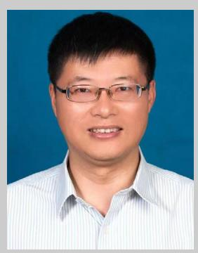

**Xiaogang Zhang** is a Professor at the Nanjing University of Aeronautics and Astronautics, specializing in electrochemical energy storage materials and devices. He is a recipient of the Jiangsu "Qinglan Project" Middle-Aged and Young Academic Leader and the Jiangsu "333" Talent Engineering Second-Level Program. To date, he has published over 300 research articles as the corresponding author in prestigious international journals, including Nat. Commun., Angew. Chem., Int. Ed., Adv. Mater., and Adv. Energy Mater., garnering over 10 000 citations. He has consistently been listed as a Highly Cited Researcher in China by Elsevier and a Highly Cited Researcher globally by Clarivate.