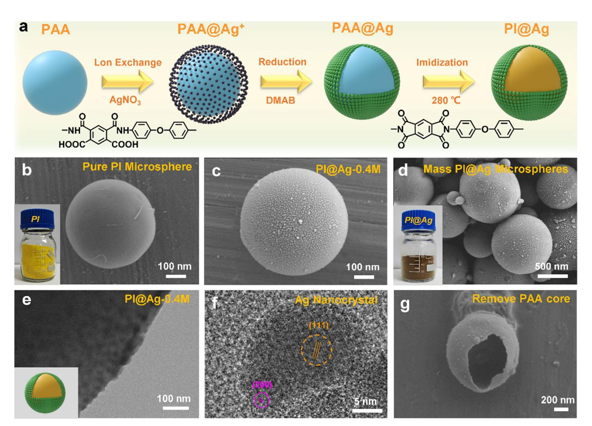
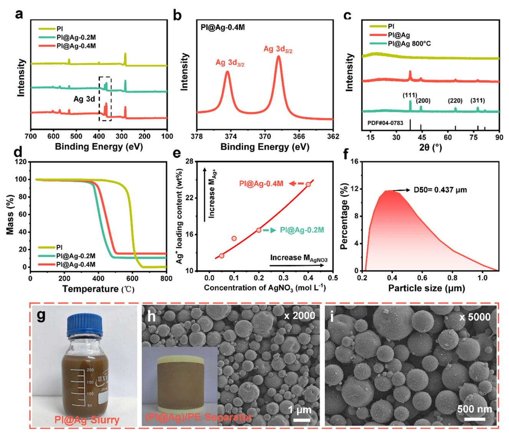
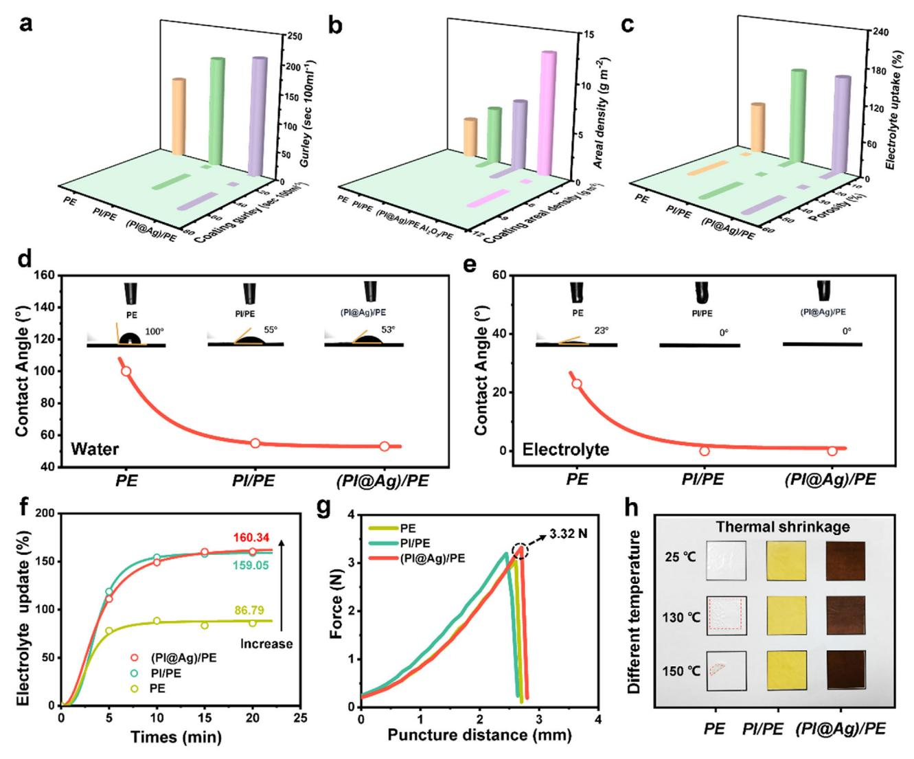
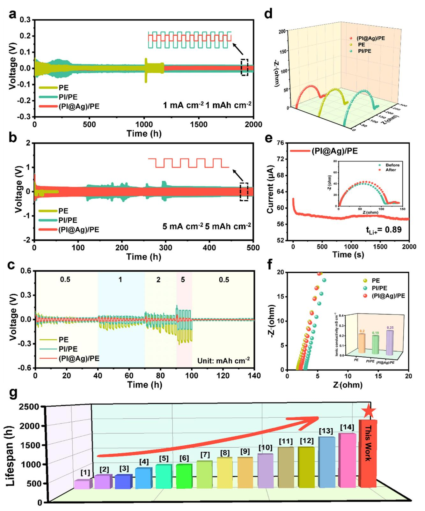
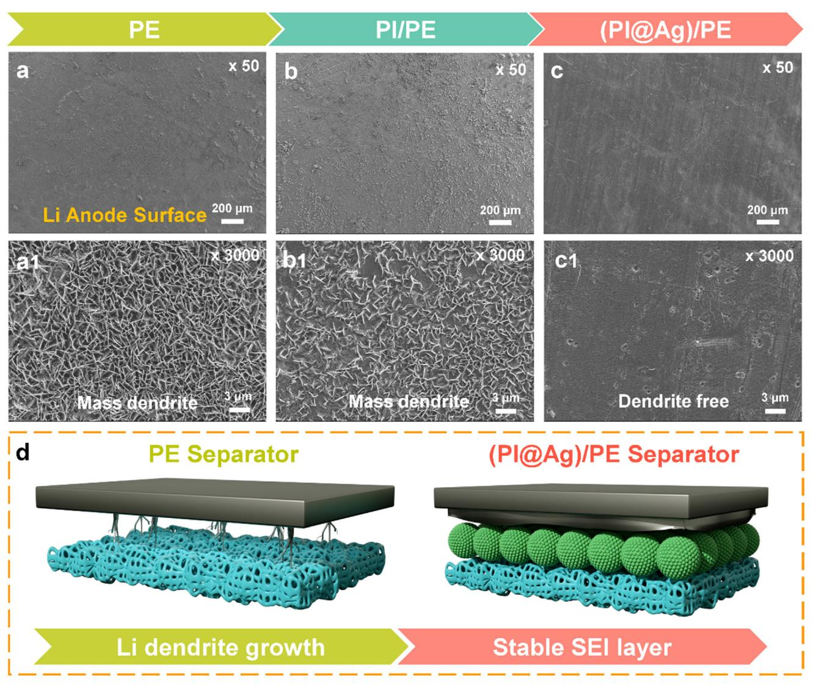
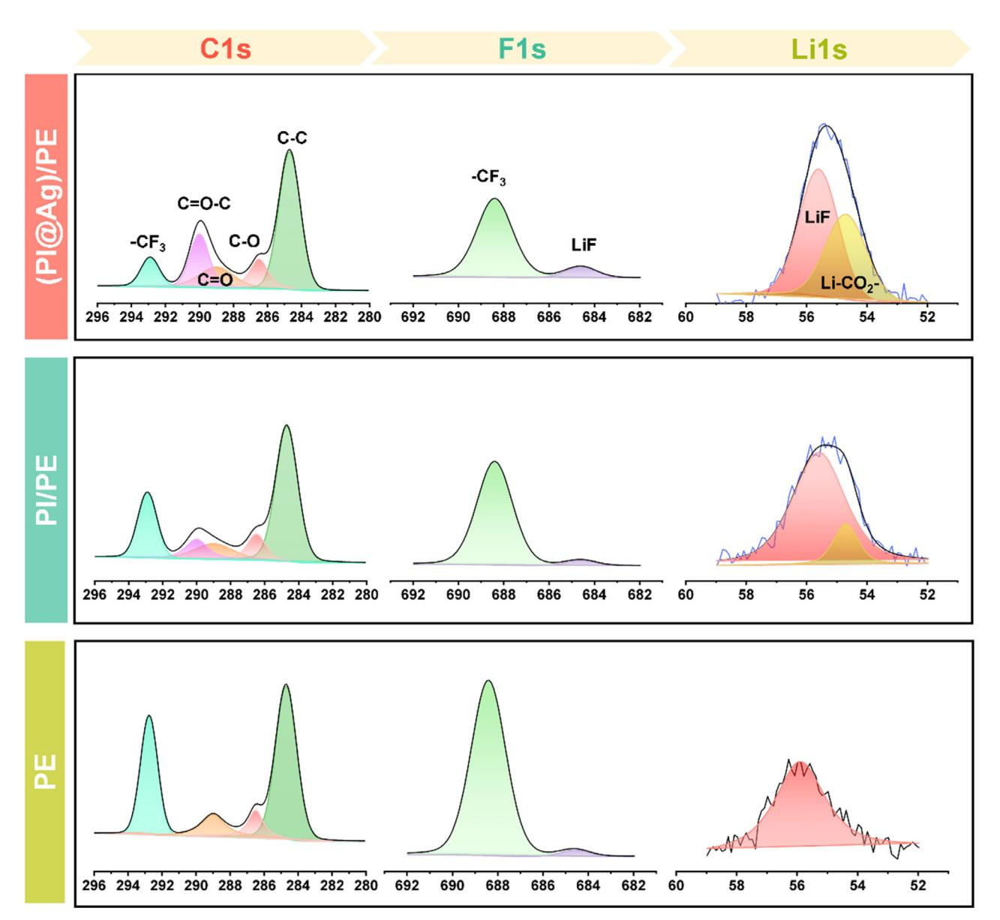
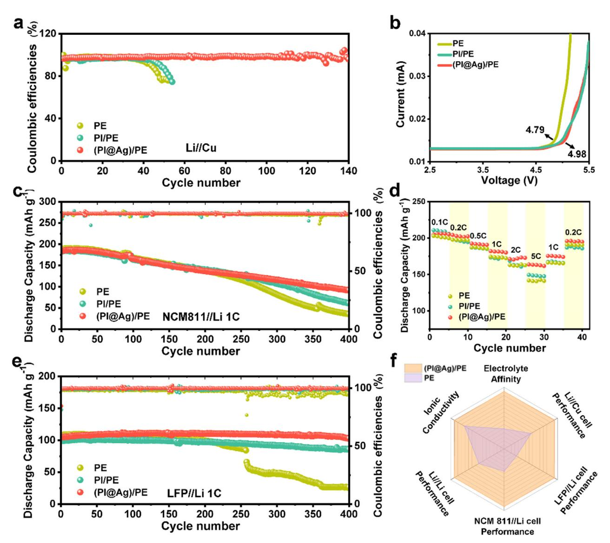

# **Separator Engineering Regulating Reversible Li Electrodeposition Enabled by Lithiophilic Polyimide@Ag Coating Layer for Dendrite-Free Lithium Metal Batteries**

*Zhaoyi Wang, Hanrui Xu, Kefan Liu, Nanxi Dong, Nanfang Jia, Bingxue Liu, Daolei Lin, Zheng Zhao, Guofeng Tian, Shengli Qi,\* and Dezhen Wu*

**Heterogeneity Li deposition predominantly induce the growth of Li dendrite, which hinders the practical application of lithium metal batteries (LMBs). Previous researches have mainly focused on the modification of lithium anode, but lithium is sensitive to water and oxygen, which consequently limits its industrialization process. Herein, a novel polyimide@Ag coated polyethylene separator ((PI@Ag)/PE) strategy is reported to inhibit Li dendrites growth. It has been clarified that the lithiophilic PI@Ag microspheres can greatly reduce the nucleation barrier of Li electrodeposition. Consequently, the Li//Li cells with this separator exhibit stable and dendrite-free Li+ plating/stripping over 2000 h at 1 mAh cm−2 and 500 h at 5 mAh cm−2. Moreover, the LiFePO4//Li cells and Ni0.8Co0.1Mn0.1//Li cells exhibit excellent cycling performance and capacity retention after 400 cycles at 1C. Multiple characterization analyses have proved that the lithiophilic PI@Ag layer can significantly inhibit the growth of Li dendrites and help to construct a stable solid electrolyte interfacial (SEI) layer. The above results manifest that the present strategy provides a simple and generalized achievable method to solve the lithium dendrite problem, demonstrating bright engineering application value and broad prospect.**

Z. Wang, H. Xu, K. Liu, D. Lin, G. Tian, S. Qi, D. Wu State Key Laboratory of Chemical Resource Engineering Beijing University of Chemical Technology Beijing 100029, China E-mail: [qisl@mail.buct.edu.cn](mailto:qisl@mail.buct.edu.cn) N. Dong, N. Jia Beijing Yucheng Technology Co., Ltd. Beijing 102299, China B. Liu China Automotive Battery Research Institute Co., Ltd. Beijing 100088, China Z. Zhao Beijing Economic and Technological Development Zone Beijing Zeqiao Medical Technology Co., Ltd. Beijing 100176, China S. Qi, D. Wu Changzhou Institute of Advanced Materials Beijing University of Chemical Technology Changzhou, Jiangsu 213164, China

The ORCID identification number(s) for the author(s) of this article can be found under <https://doi.org/10.1002/smll.202504870>

#### **DOI: 10.1002/smll.202504870**

**1. Introduction**

Lithium metal batteries (LMBs) are considered to be prospective electrochemical devices to meet the needs of electric automobiles and electronic equipment due to their high theoretical capacity (3860 mAh g−1) and low negative electrochemical potential.[\[1–5\]](#page-8-0) Nevertheless, LMBs suffer from uncontrollable dendrite growth problems caused by heterogeneous Li+ deposition, which brings about many acute problems such as fragile solid electrolyte interfacial (SEI) films, cycle life reduction, and even thermal runaways.[\[6–10\]](#page-9-0)

Recently, many strategies have been proposed as efficient ways to inhibit the growth of lithium dendrites, including the construction of artificial SEI, modification of electrolyte additive, and modification of lithium metal anodes.[\[11–14\]](#page-9-0) Among these methods, strategies focusing on controlling Li nucleation to enable uniform Li deposition have increasingly become a key research focus. Accordingly, researchers

devoted to constructing lithiophilic metals (such as Au, Ag, and Zn) on the surface of Li metal to form multiple alloy phases.[\[15–19\]](#page-9-0) Although this strategy can substantially reduce the nucleation overpotential and enhance the electric conductivity, forming an alloy layer on the Li metal surface is very difficult and uneconomical. The methods for constructing alloy layers on the anode surface can be divided into chemical reduction, solid-state alloying reaction, and electrochemical deposition.[\[20\]](#page-9-0) These three methods are complicated and difficult to realize industrialization. Moreover, Li metal is sensitive to water and oxygen, and the process can only be carried out in a glove box, which makes severe limitations for the real application.

As an alternative, constructing the lithiophilic metals on the separator adjacent to the Li metal is supposed an effective strategy to suppress dendrite growth. Separators perform a pivotal role in LMBs by electrically insulating the electrodes while permitting ionic conduction. The separator with functional surface-modified possesses enormous potential to guide the Li+ deposition process but has not received enough attention until now.[\[21–23\]](#page-9-0)

In the present work, a functional coating layer composed of silver-nanocrystal decorated polyimide microsphere (PI@Ag

**Figure 1.** Fabrication and structural characterization of the PI@Ag microspheres. a) Schematic of the preparation procedure of PI@Ag microspheres. b) SEM image of the pure PI microsphere. c) SEM image of the PI@Ag-0.4 m microsphere. d) SEM image of massive PI@Ag microspheres. e,f) TEM images of various magnifications. g) SEM image of the Ag-nanolayer prepared via the dissolution process.

microsphere) is elaboratedly designed and coated on a commercial polyethylene (PE) separator as a lithiophilic layer for stable LMBs. Polyimide (PI) is an ideal separator coating material due to its excellent light weight, high-temperature resistance, excellent chemical stability, and diversified structural designability.[\[24,25\]](#page-9-0) Besides, PI can be readily processed into microsphere and further utilized as an effective matrix for metal deposition. Therefore, loading Ag nanocrystals onto the PI microsphere surface might be a convenient way to construct a lithiophilic coating layer on the separator. The existence of a lithiophilic PI@Ag layer could greatly reduce the nucleation barrier for Li electrodeposition and thus may act as favorable electrochemical active sites to promote uniform Li nucleation. As expected, the Ag nanoparticles spontaneously migrated to the surface of the Li anode to form Ag–Li alloy,[\[26\]](#page-9-0) and the cells assembled with (PI@Ag)/PE separator demonstrated dendrite-free Li plating/stripping behavior and enhanced cycling performance. Considering the pivotal role and simple manufacturing approach, the separator engineering in this work provides an efficient and low-cost method for dendrite-free and high-energy-density LMBs.

#### **2. Results and Discussion**

**Figure 1**a shows the fabrication schematic of the PI@Ag microspheres. The synthesized poly(amic acid) (PAA) microspheres were soaked into AgNO3 solution and dimethylamine borane (DMAB) solution for loading Ag nanolayer on PI microspheres. By controlling the concentration of AgNO3 (0.1, 0.2, and 0.4 mol L−1), PI@Ag-0.1 m, PI@Ag-0.2 m, and PI@Ag-0.4 m microspheres were obtained. Figure 1b,c reveals the scanning electron microscope (SEM) image of pure PI and PI@Ag-0.4 m microsphere. Compared to the PI, massive particles were closely packed on the surface of the PI@Ag-0.4 m. Figure S1 (Supporting Information) shows SEM images of PI@Ag microspheres with different AgNO3 concentrations. We can find that with the increase of AgNO3 concentration, the particle density on the PI microsphere surfaces progressively increases. The SEM image of massive PI@Ag microspheres is shown in Figure 1d, this fabrication process is economically feasible and has the potential for large-scale production. The energy dispersive spectrometer (EDS) mapping images of PI@Ag-0.4 m microspheres in Figure S2 (Supporting Information) have confirmed the existence of

**Figure 2.** Characterizations of PI@Ag microspheres and the (PI@Ag)/PE separators. a,b) XPS patterns and Ag 3d spectra of PI@Ag microspheres. c) XRD patterns of PI, PI@Ag, and PI@Ag (800 °C) microspheres. d) TGA curves of PI, PI@Ag-0.2 m, PI@Ag-0.4 m microspheres. e) ICP pattern of PAA@Ag+-0.05 m, PAA@Ag+-0.1 m, PAA@Ag+-0.2 m, and PAA@Ag+-0.4 m microspheres. f) DLS tests of the PI@Ag microspheres. g) Large-scale preparation of the PI@Ag microspheres slurry. h,i) Top-View SEM images of (PI@Ag)/PE separators under various magnifications.

Ag elements. The high resolution transmission electron microscope (HR-TEM) images in Figure [1e–f](#page-1-0) can be directly observed (111) and (200) lattice orientation on the Ag crystallites. Ag+ can induce superficial PAA cross-linking during the ion-exchange process,[\[27\]](#page-9-0) so the superficial PAA cannot be dissolved by polar solvents (N,N-Dimethylformamide, DMF). Subsequently, we dissolved PAA@Ag microspheres (after ion exchange) in DMF and removed the PAA cores (Figure [1g\)](#page-1-0). It shows that Ag nanoparticles exist only on the surface of the PAA microspheres, demonstrating this method can reasonably distribute silver on the shallow surface and is an economical strategy.

X-ray photoelectron spectroscopy (XPS) was used to analyze the surface composition and chemical bonding states of PI@Ag microspheres in **Figure 2**a,b. Two strong peaks located at 368.1 and 374.1 eV are corresponded to Ag 3d5/2 and Ag 3d3/2 spin states and confirm the metallic state of Ag0 in the high-resolution Ag 3d spectrum.[\[28\]](#page-9-0) X-ray diffraction (XRD) patterns of PI@Ag microspheres can be recognized that (111), (200), (220), and (311) peaks of Ag crystallites,[\[3\]](#page-8-0) districting from the amorphous PI (Figure 2c). This indicates that Ag nanocrystals are successfully loaded on the surface of PI microspheres. The thermogravimetric analysis (TGA) test curves (Figure 2d) manifest the weight of PI@Ag-0.2 m and PI@Ag-0.4 m microspheres still retained 10.7% and 15.4% at 800 °C. In order to further quantitatively study the influencing of AgNO3 concentrations, inductively coupled plasma (ICP) tests were carried out on PAA@Ag+ microspheres with different AgNO3 concentrations in Figure 2e. We found that as the concentration of AgNO3 increased, the amount of Ag+ adsorbed by the PAA microspheres also increased, which is consistent with the conclusion obtained by the TGA result.

**Figure 3.** Physical properties analysis of (PI@Ag)/PE separators. a) Gurley number of PE, PI/PE, and (PI@Ag)/PE separators. b) Areal density of the above separators. c) Porosity and electrolyte uptake test of the above separators. Contact angles of the above separators with d) water and e) electrolyte. f) Electrolyte absorption rate of the above separators. g) Puncture strength test results of the above separators. h) Thermal shrinkage results of the above separators.

Therefore, based on the above conclusions, the PI@Ag-0.4 m microspheres were selected as the best surface morphology, the Ag nanoparticles layer is evenly distributed on the PI microsphere. Figure [2f](#page-2-0) demonstrates the dynamic light scattering (DLS) results of PI@Ag microspheres, in which the particle size of the PI@Ag microspheres was distributed between 200 and 800 nm.

Then, the PI@Ag slurry (8 wt.%) was prepared as shown in Figure [2g.](#page-2-0) The slurry was left for over 10 h to observe stability. The DLS result of the slurry before and after 10 h indicates the slurry has no agglomeration phenomenon and possesses excellent long-term stability (Figure S3, Supporting Information). The obtained slurry was subsequently coated on a commercially available PE separator (7 μm) as a functional layer with designed coating thickness, producing the (PI@Ag)/PE composite separator (7+4 μm). The top-view and cross-view SEM images of (PI@Ag)/PE separator in Figure [2h,i](#page-2-0) and Figure S4 (Supporting Information) display that the PI@Ag microspheres were tightly packed and uniformly dispersed without agglomeration.

**Figure 3** shows the physical properties of the PE, PI/PE, and (PI@Ag)/PE separators. From the gurley test in Figure 3a, we discover the PI@Ag coating layer leads to its gurley number maintained at a low level (206 s 100 cc−1). Figure 3b shows that the areal density of (PI@Ag)/PE (7.23 g cm−2) is lower than (Al2O3)/PE separators (12.77 g cm−2), demonstrating that the introduction of PI@Ag will not increase the weight and reduce the energy-density in the battery. The excellent wettability and high-efficiency absorption of the electrolyte by the separator plays a crucial role in storing the electrolyte, which is necessary for creating channels that enable the transmission of Li+ ions.[\[29\]](#page-9-0) Porosity and electrolyte uptake results of PE, PI/PE, and (PI@Ag)/PE separators are compared in Figure 3c. The porosity of the above separators is 38.52%, 53.11%, and 53.99%,

**Figure 4.** Electrochemical performance of (PI@Ag)/PE separators for Li//Li symmetric cells. Voltage profiles for Li//Li symmetric cells with PE, PI/PE and (PI@Ag)/PE separators during galvanostatic cycles under a) 1 mAh cm−2 and b) 5 mAh cm−2. c) The rate performance of Li//Li symmetric cells with the above separators at various current density from 0.5 to 5 mAh cm−2. d) The EIS spectra of Li//Li symmetric cells equipped with the above separators. e) Polarization curve of Li//Li symmetric cells equipped with (PI@Ag)/PE separators. (Inset: EIS spectra before and after polarization.) f) The EIS spectra of SS//SS cells equipped with the above separators. (Inset: ionic conductivity of the above separators.) g) Comparison of the cycling lifespans of the (PI@Ag)/PE separator and other reported separators. The related references are given in Table S1 (Supporting Information).

**Figure 5.** Lithium dendrite inhibition effect of (PI@Ag)/PE separators. SEM images of the Li anode surface of Li//Li symmetric cells with a,a1) PE, b,b1) PI/PE, and c,c1) (PI@Ag)/PE separators. d) The mechanism of Li dendrite growth in the Li//Li symmetric cells with PE and (PI@Ag)/PE separator.

respectively. The porosity and electrolyte absorption of PI/PE and (PI@Ag)/PE separators possess markedly improved than PE. To further evaluate the wettability of separators, electrolyte diffusion tests are measured in Figure S5 (Supporting Information). The (PI@Ag)/PE separator revealed enhanced electrolyte wettability, while the PE separator was difficult to be completely infiltrated by electrolytes within 10 s. The (PI@Ag)/PE separator revealed an outstanding water contact angle (55°) than PE separator (100°) in Figure [3d,e.](#page-3-0) Besides, the above separators were soaked in organic electrolytes at different times to obtain the electrolyte absorption speed results (Figure [3f\)](#page-3-0). After immersion in the electrolyte for 5 min, the electrolyte uptake of PE, PI/PE, and (PI@Ag)/PE separators were 78.02%, 118.78%, and 129.92%, respectively. The (PI@Ag)/PE separators exhibit superior electrolyte absorption speed than PE, which may be attributed to the introduction of a 3D-dimensionally microstructure coating layer. As shown in Figure [3g,](#page-3-0) the (PI@Ag)/PE separator possesses stronger puncture resistance (3.32 N) compared with PE. The dimensional stability of the separators was measured after heating at 130 and 150 °C (Figure [3h\)](#page-3-0). The (PI@Ag)/PE separator exhibits enhanced dimensional stability at 150 °C, which can provide battery better safety.

The electrochemical performances of separators were studied in the 2032 button cell. The Li//Li batteries with separators were assembled to elucidate the inhibition effect of Li dendrites (**Figure 4**[a–c\)](#page-4-0). The cell using (PI@Ag)/PE separator shows exceptional long-term cycling stability, maintaining a stable voltage plateau for over 2000 h at 1 mA cm−2 and 1 mAh cm−2, while the polarization overpotential of PE symmetric cell rose promptly after 1200 h (Figure [4a;](#page-4-0) Figure S6, Supporting Information). Notably, the symmetric cells using (PI@Ag)/PE separator demonstrate splendid cycle performance under high current density (1 mA cm−2 and 5 mAh cm−2). The (PI@Ag)/PE separator displays steady cyclability for 500 h with a relatively small

**Figure 6.** The component analysis of the formed SEI layer of (PI@Ag)/PE separators. The XPS spectra of the SEI layer in Li//Li symmetric cells with PE, PI/PE, and (PI@Ag)/PE separators.

polarization voltage of 133.5 mV, whereas the PE separator started to drop and fluctuate after 20 h in Figure [4b](#page-4-0) and (Figure S7, Supporting Information). This indicates that the (PI@Ag)/PE symmetric cells were inclined to improve the stability of the SEI layer, while the PE separator occurred unexpected growth of Li dendrite. In addition, the (PI@Ag)/PE symmetric cell shows the superior rate performance from 0.5 mAh cm−2 to 5 mAh cm−2 in Figure [4c.](#page-4-0) The (PI@Ag)/PE symmetric cell can maintain a steady voltage curve and low polarization voltage at 5 mAh cm−2 and can recover lower polarization voltage (28 mV) when the current density drops to 0.5 mAh cm−2. By comparison, the symmetric cell with a PE separator cannot endure the high current density of 5 mAh cm−2 and experienced serious interfacial reactions and overpotential fluctuation. To further elucidate the mechanisms responsible for the excellent cycle stability and low overpotential of the cells, the electrochemical impedance spectroscopy (EIS) was measured before the cycle (Figure [4d\)](#page-4-0). The Li//Li symmetric cell with (PI@Ag)/PE separator exhibits a lower interfacial resistance (137.6 Ω) than those with PI/PE (183.9 Ω) and PE (153.2 Ω) separators, indicating a stable SEI layer. The Li+ transference number (tLi+) was calculated by sequentially performing chronoamperometry and EIS to explore Li+ transport behavior in Figure [4e](#page-4-0) and (Figure S8, Supporting Information). The tLi+ of PE and (PI@Ag)/PE separator were calculated to be 0.74 and 0.89. This phenomenon may originate from the unique 3D micropore structure and the Ag nanoparticles with abundant lithiophilic sites on the surface of the PI@Ag microsphere. Consequently, the ionic conductivity of the above separators was measured in

**Figure 7.** Electrochemical performance of Li//Cu half cells, LFP//Li full cells, and NCM811//Li full cells with (PI@Ag)/PE separators. a) Coulomb efficiency for Li//Cu cells with PE, PI/PE and (PI@Ag)/PE separators at 1 mAh cm−2. b) LSV testes of the above separators from 2.5 to 5.5 V. c) Cycling performance of the NCM811//Li (NCM811 loading ≈4.5 mg cm−2) full cells of the above separators at 1C. d) The rate performance of NCM811//Li cells with the above separators. e) Cycling performance of the LFP//Li (LFP loading ≈4 mg cm−2) full cells of the above separators at 1C. f) Comprehensive performance comparison of the separators.

Figure [4f.](#page-4-0) The ionic conductivities of PE, PI/PE, and (PI@Ag)/PE separators were calculated to be 0.2, 0.19, and 0.25 mS cm−1, respectively. The above results strongly confirm that the PI@Ag microsphere coating layer with lithiophilic properties can promote Li+ transport and stabilize the cycling process.

To elucidate the electrochemical reactions at the separator/Li anode interface, we characterized the cycled Li anode morphology (after 100 cycles at 1 mA cm−2) in **Figure 5**[a–c.](#page-5-0) The Li anode with PE separator reveals massive and jaggy dendrites after 100 cycles at 1 mAh cm−2 (Figure [5a\)](#page-5-0), which is reasonable to conclude that the uncontrollable growth of dendrites caused by unregulated Li deposition processes. Similarly, Massive dendrite formation similarly occurs on the anode with PI/PE separators (Figure [5b\)](#page-5-0), although the PI coating layer had a certain physical blocking effect on dendrite growth. Furthermore, the Li anode of the cell assembled with (PI@Ag)/PE separators maintained a uniform and smooth appearance after 100 cycles (Figure [5c\)](#page-5-0). It is possibly because the PI@Ag coating layer can guide the homogeneous deposition of Li+ and the nucleation process (Figure [5d\)](#page-5-0).

It is perceived that one of the failure mechanisms of LMBs lies in the repetitive rupture and regeneration of SEI during the repetitive Li deposition processes. To analyze the chemical composition of SEI, XPS was tested on anodes of the Li//Li symmetric cells with the above separators after cycling at 100 cycles (**Figure 6**[\)](#page-6-0). From the C 1s spectra, the peaks attributed to C─C (284.8 eV), C─O (286.5 eV), C═O (289 eV), C═O─C (290 eV), and CF3 (292.9 eV) had originated from the decomposition of the electrolyte. In the F 1s spectra, the diffraction peaks of LiF and CF3 species appear at 684.6 and 688.4 eV, respectively.[\[30\]](#page-9-0) From F 1s spectra, we can that the contents of the LiF in (PI@Ag)/PE separators (10.67%) are predominantly larger than those in PE (2.88%) and PI/PE (3.88%) separators. Furthermore, this law of the difference in LiF contents also appears in the Li 1s spectrum. It is widely demonstrated that the LiF is a favorable constitute of SEI and is pivotal for achieving homogeneous Li+ plating/stripping processes.[\[30\]](#page-9-0) Moreover, we found a faint diffraction peak of Ag0 in SEI of (PI@Ag)/PE separators (Figure S9, Supporting Information), indicating that Ag spontaneously migrated from the separator to the SEI layer and in-situ formed Ag–Li alloy during charging and discharging process. Therefore, we can deduce that the generation of Ag–Li alloy helps to reduce the nucleation overpotential of Li+ and the formation of LiF-rich SEI helps to improve the stability of the SEI layer.

To evaluate the reversibility of Li plating/stripping in a single interface, the coulombic efficiency (CE) and cycle property of Li//Cu cells with separators are tested in **Figure 7**[a.](#page-7-0) The battery with (PI@Ag)/PE separator keeps a stable CE over 97% after 140 cycles at 1 mAh cm−2, while the PE separator could only survive for 50 cycles with unstable CE. The linear sweep voltammetry (LSV) tests in Figure [7b](#page-7-0) reveal the electrochemical stability of the (PI@Ag)/PE separator is higher than pristine PE separator. In order to further explore the feasibility of applying (PI@Ag)/PE separator in practical application, the Ni0.8Co0.1Mn0.1//Li (NCM811) and LiFePO4//Li (LFP) full cells with separators were used to evaluate electrochemical behavior. The cycling performance of NCM811//Li full cells assembled with (PI@Ag)/PE separator at 1C was measured in Figure [7c.](#page-7-0) The cell with (PI@Ag)/PE appears a remarkable discharge capacity of 91.6 mAh g−1 after 400 cycles with a high CE of 98.9% (Figure [7c\)](#page-7-0). On the contrary, the cell with the PE separator appears a lower specific capacity, and occurs specific capacity decays rapidly after 250 cycles (Figure S10, Supporting Information). Notably, the cell with (PI@Ag)/PE separator delivered a higher rate performance than PE separator and devoted a capacity of 161.7 mAhg−1 at 5 C (Figure [7d\)](#page-7-0). The cycling behavior under higher current density (5 C) with separators has been characterized in Figure S11 (Supporting Information). The (PI@Ag)/PE cell maintains stable discharge capacity and no significant attenuation throughout the entire process of 500 cycles. While the pristine PE cell only exhibits noticeable capacity decay and dive after 335 cycles. In addition, we further investigated the practical application of the (PI@Ag)/PE separator in LFP//Li full cells (Figure [7e\)](#page-7-0). The discharge capacity after 400 cycles with (PI@Ag)/PE, PI/PE, and PE separators are 103.5, 86.1 and 26.6 mAhg−1, respectively at 1C, and the capacity retention rate are 96.3%, 86.7%, and 24.6%, respectively (Figure S12, Supporting Information). The improved cycling performance proves the substantial advantages of lithiophilic PI@Ag layer in guiding uniformly electrochemical nucleating. Compared with the PE separator with certain defects, the (PI@Ag)/PE separator also exhibits superior electrolyte affinity, ionic conductivity, half-cell and full-cell electrochemical performance, synchronously (Figure [7f\)](#page-7-0).

#### **3. Conclusion**

In summary, a novel (PI@Ag)/PE separator with a superior inhibition effect of lithium dendrites has been successfully fabricated by an ion exchange-reduction process and slurry coating method. As expected, the immobilized Ag nanoparticles on the PI microsphere spontaneously migrated to the Li anode surface to form Ag-Li alloy during the cycling process. Consequently, the lithiophilic PI@Ag microsphere coating layer can guide the uniformly electrochemical nucleating process of Li+ and serve as homogeneous nucleation sites. The stable nucleation process can facilitate the formation of a stable SEI layer and reduce the generation of Li dendrites. To be specific, the symmetrical Li//Li cells of (PI@Ag)/PE separator deliver more stable cycling performance over 2000 h at 1 mAh cm−2 and 500 h at 5 mAh cm−2, resulting in low overpotential and dendrite-free Li anode. The NCM811//Li cells with (PI@Ag)/PE separator exhibit excellent cycle stability after 400 cycles at both 1C and 5C. The LFP//Li cells with (PI@Ag)/PE separator display enhanced specific discharge capacity (103.5 mAhg−1) and retention rate (96.3%) after 400 cycles at 1C. It is expected that the present separator engineering strategy could provide a new thought for solving the lithium dendrite problem for the development of advanced high-energydensity LMBs.

## **Supporting Information**

Supporting Information is available from the Wiley Online Library or from the author.

## **Acknowledgements**

The study was financially supported by the Fundamental Research Funds for the Central Universities [XK1802-2]; the National Natural Science Foundation of China [51673017]; the National Natural Science Foundation of China [21404005].

# **Conflict of Interest**

The authors declare no conflict of interest.

#### **Data Availability Statement**

Research data are not shared.

#### **Keywords**

dendrite-free Li deposition, lithium metal battery, polyimide, separator, silver

> Received: April 20, 2025 Revised: June 2, 2025 Published online: June 20, 2025

- [1] M. F. Lagadec, R. Zahn, V. Wood, *Nat. Energy* **2019**, *4*, 16.
- [2] M. S. Gonzalez, Q. Yan, J. Holoubek, Z. Wu, H. Zhou, N. Patterson, V. Petrova, H. Liu, P. Liu, *Adv. Mater.* **2020**, *32*, 1906836.
- [3] X. Li, Y. Su, Y. Qin, F. Huang, S. Mei, Y. He, C. Peng, L. Ding, Y. Zhang, Y. Peng, Z. Deng, *Adv. Mater.* **2023**, *35*, 2303489.
- [4] Y. Zhao, J. Yan, J. Yu, B. Ding, *ACS Nano* **2022**, *16*, 17891.

- [5] Q. Zhao, R. Wang, X. Hu, Y. Wang, G. Lu, Z. Yang, Q. Liu, X. Yang, F. Pan, C. Xu, *Adv. Sci.* **2022**, *9*, 2102215.
- [6] Z. Zhang, W.-Q. Han, *Nano-Micro Lett.* **2023**, *16*, 24.
- [7] J. Liang, Q. Chen, X. Liao, P. Yao, B. Zhu, G. Lv, X. Wang, X. Chen, J. Zhu, *Angew. Chem., Int. Ed. Engl.* **2020**, *59*, 6561.
- [8] T. Naren, R. Jiang, P. Qing, S. Huang, C. Ling, J. Lin, W. Wei, X. Ji, Y. Chen, Q. Zhang, G.-C. Kuang, L. Chen, *ACS Nano* **2023**, *17*, 20315.
- [9] S. Sun, J. Wang, X. Chen, Q. Ma, Y. Wang, K. Yang, X. Yao, Z. Yang, J. Liu, H. Xu, Q. Cai, Y. Zhao, W. Yan, *Adv. Energy Mater.* **2022**, *12*, 2202206.
- [10] D. Yang, X. Wu, L. He, Z. Sun, H. Zhao, M. Wang, Y. Wang, Y. Wei, *Nano Lett.* **2023**, *23*, 336.
- [11] X. Jiao, Y. Wang, O. O. Kapitanova, X. Xu, V. S. Volkov, Y. Liu, Z. Song, A. Matic, S. Xiong, *Energy Storage Mater.* **2023**, *61*, 102916.
- [12] Y. Zhu, Y. Gao, C. Cui, Y. Zhuang, Y. Yang, T. Zhang, *Chem. Eng. J.* **2023**, *477*, 147041.
- [13] Z. Li, M. Peng, X. Zhou, K. Shin, S. Tunmee, X. Zhang, C. Xie, H. Saitoh, Y. Zheng, Z. Zhou, Y. Tang, *Adv. Mater.* **2021**, *33*, 2100793.
- [14] Z. Wang, F. Liu, X. Li, B. Liu, D. Lin, G. Tian, S. Qi, D. Wu, *ACS Appl. Mater. Interfaces* **2024**, *16*, 23826.
- [15] Y. Fang, S. L. Zhang, Z. P. Wu, D. Luan, X. W. D. Lou, *Sci. Adv.* **2021**, *7*, abg3626.
- [16] H. Wang, P. Hu, X. Liu, Y. Shen, L. Yuan, Z. Li, Y. Huang, *Adv. Sci.* **2021**, *8*, 2100684.
- [17] Y. Zhao, L. Wang, J. Zou, Q. Ran, L. Li, P. Chen, H. Yu, J. Gao, X. Niu, *J. Energy Chem.* **2022**, *65*, 666.

- [18] C. Yang, Y. Yao, S. He, H. Xie, E. Hitz, L. Hu, *Adv. Mater.* **2017**, *29*, 1702714.
- [19] Y. Wang, J. Tan, Z. Li, L. Ma, Z. Liu, M. Ye, J. Shen, *Energy Storage Mater.* **2022**, *53*, 156.
- [20] M. Zhu, X. Zhao, R. Yan, J. Zhang, *Curr. Opin. Solid State Mater. Sci.* **2023**, *27*, 101079.
- [21] Y. Yang, W. Wang, G. Meng, J. Zhang, *J. Mater. Chem. A* **2022**, *10*, 14137.
- [22] Z. Hao, Q. Zhao, J. Tang, Q. Zhang, J. Liu, Y. Jin, H. Wang, *Mater. Horiz.* **2021**, *8*, 12.
- [23] J. Seo, J. Im, M. Kim, D. Song, S. Yoon, K. Y. Cho, *Small* **2024**, *20*, 2312132.
- [24] M. Zhang, L. Wang, H. Xu, Y. Song, X. He, *Nano-Micro Lett.* **2023**, *15*, 135.
- [25] Z. Wang, X. Li, N. Dong, B. Liu, G. Tian, S. Qi, D. Wu, *Mater. Today Energy* **2022**, *30*, 101155.
- [26] Y.-G. Lee, S. Fujiki, C. Jung, N. Suzuki, N. Yashiro, R. Omoda, D.-S. Ko, T. Shiratsuchi, T. Sugimoto, S. Ryu, J. H. Ku, T. Watanabe, Y. Park, Y. Aihara, D. Im, I. T. Han, *Nat. Energy* **2020**, *5*, 299.
- [27] S. Qi, Z. Wu, D. Wu, W. Yang, R. Jin, *Polymer* **2009**, *50*, 845.
- [28] M. Liu, N. Deng, J. Ju, L. Wang, G. Wang, Y. Ma, W. Kang, J. Yan, *ACS Appl. Mater. Interfaces.* **2019**, *11*, 17843.
- [29] X. Huang, R. He, M. Li, M. O. L. Chee, P. Dong, J. Lu, *Mater. Today* **2020**, *41*, 143.
- [30] Y. Liu, X. Tao, Y. Wang, C. Jiang, C. Ma, O. Sheng, G. Lu, X. W. Lou, *Science* **2022**, *375*, 739.