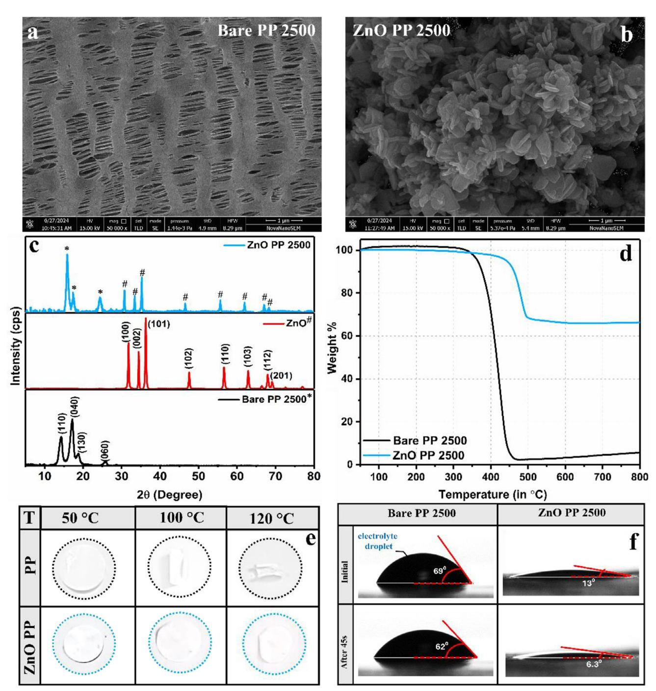
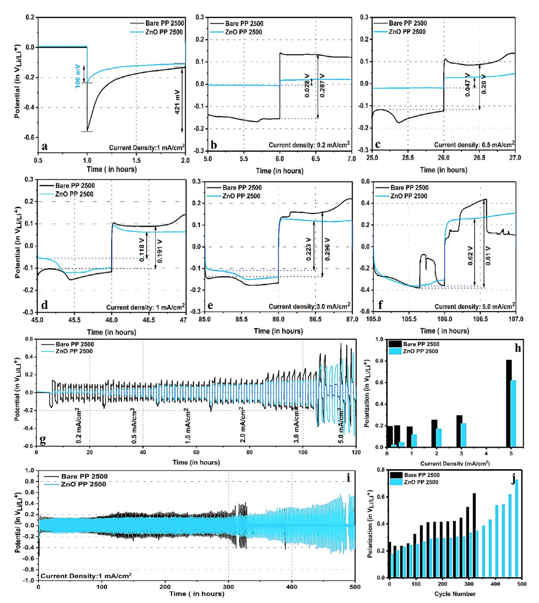
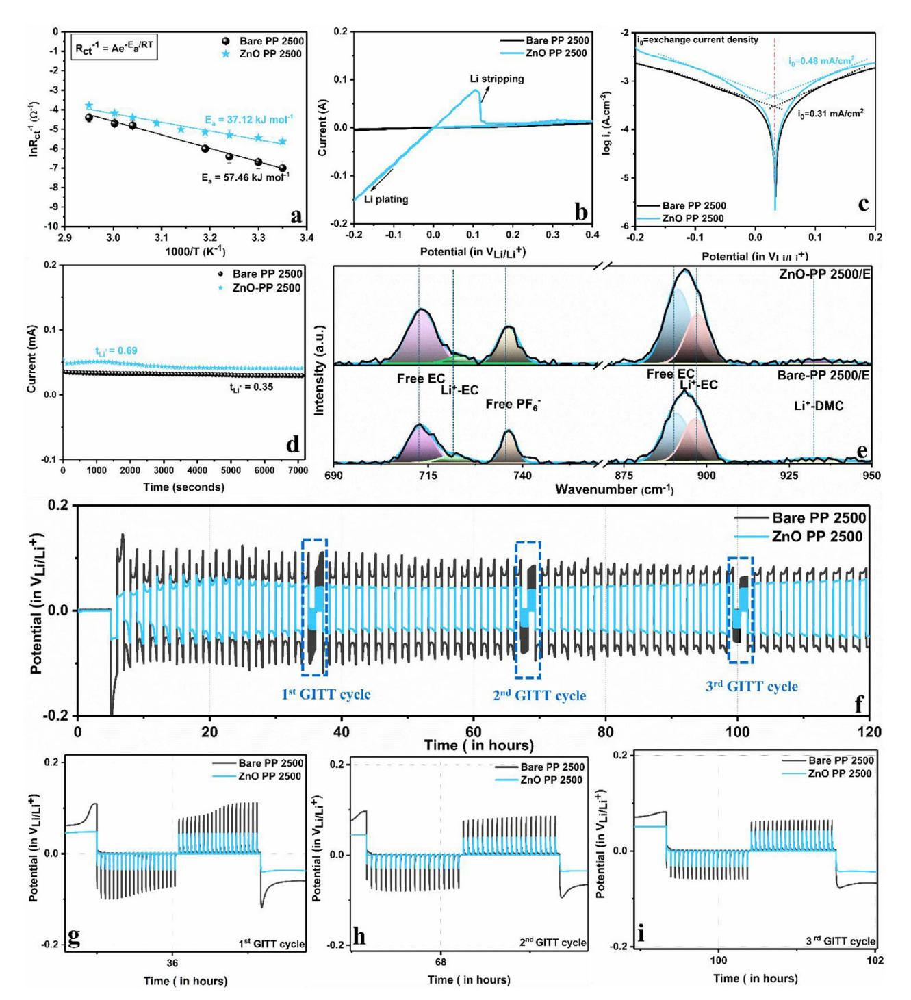
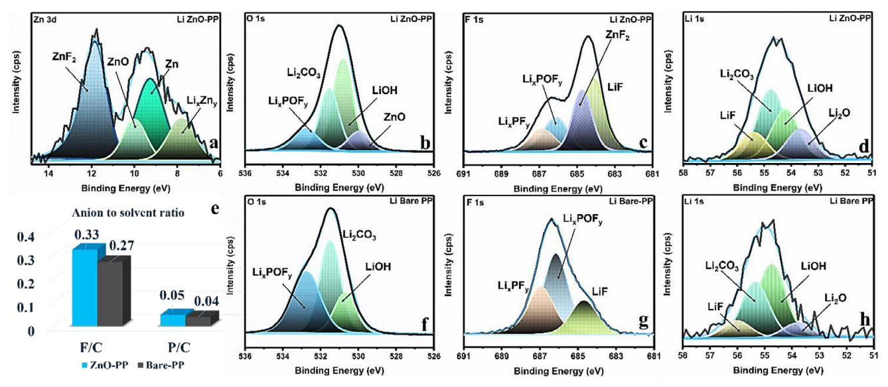
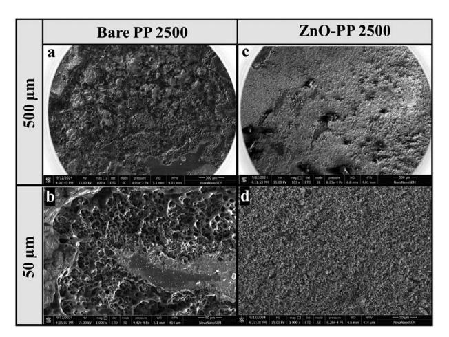
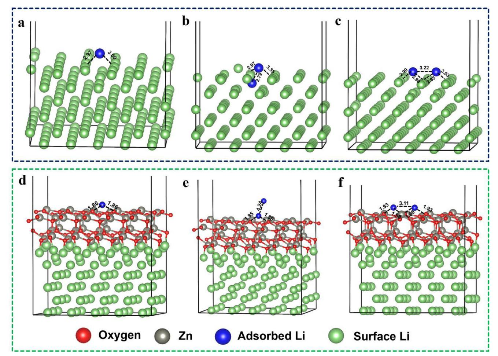
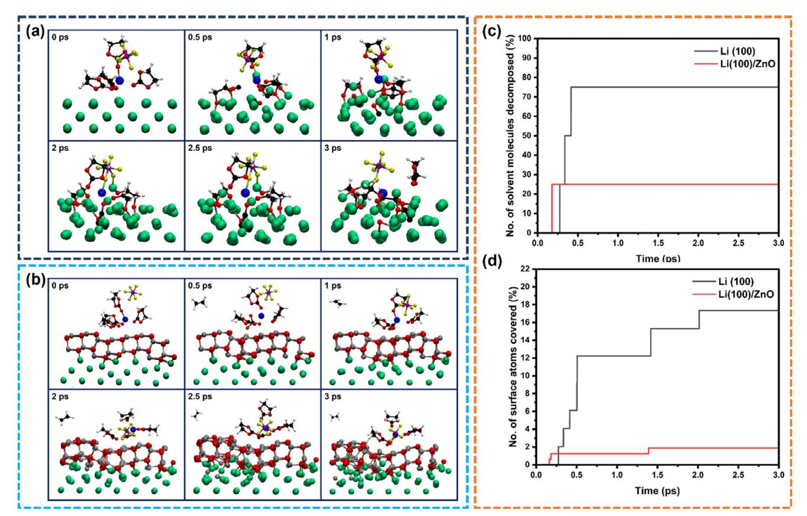
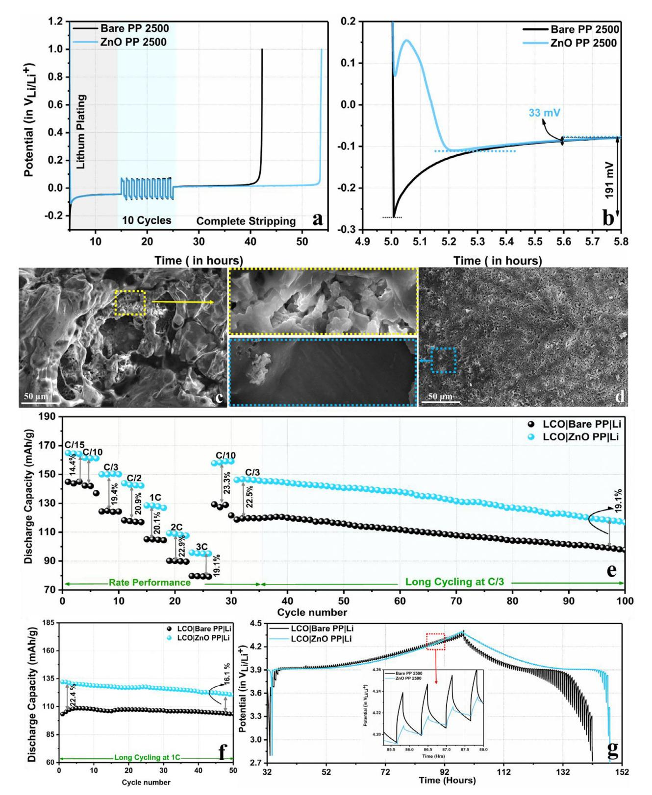

# **Computational and Experimental Insights on the Role of ZnO Nanoplatelets Coated Separator in Stabilizing Lithium Metal Anodes**

*Ankush Kumar Singh, Rashmi Yadav, Madhurja Buragohain, Sooraj Kunnikuruvan, and Rosy\**

**Severe interfacial instability, dendritic growth, poor reversibility, and compromised cycle life of lithium metal anode have limited its application as a potential anode. Herein, a lithiophilic ZnO-coated separator (ZnO-PP) is used to mitigate the interfacial instability by creating an artificial solid electrolyte interface (ASEI) in situ through the spontaneous reaction of ZnO with the lithium surface. The composite separator exhibited excellent wettability, high ionic conductivity, improved Li+ transference number, and exchange current density. Ascribed to the formation of Zn-rich ASEI, a substantially lower nucleation overpotential is observed in the presence of ZnO-PP with a 55% increase in the cycle life compared to the unmodified separator. The improved electrochemical performance and prolonged cycle life are a result of smooth and uniform metal plating due to Zn-based SEI, which is confirmed by the post-cycling measurements. The density functional theory and AIMD calculations further showed that the 'by-side' lithium plating is preferred in the case of ZnO-PP, resulting in smooth plating, and suppressed electrolyte degradation. Furthermore, a Li|Cu and full cell with lithium cobalt oxide showed substantially improved reversibility, rate performance, and capacity retention with ZnO-PP.**

# **1. Introduction**

Lithium–ion batteries (LIBs) have been extensively utilized in contemporary civilization since 1991, mostly because of their

A. K. Singh, R. Yadav, Rosy Department of Chemistry IIT(BHU) Varanasi 221005, India E-mail: [rosy.chy@iitbhu.ac.in](mailto:rosy.chy@iitbhu.ac.in) M. Buragohain, S. Kunnikuruvan Department of Chemistry Indian Institute of Technology Madras

Chennai 600036, India S. Kunnikuruvan Centre for Atomistic Modelling and Materials Design & Centre for Molecular Materials and Functions

Indian Institute of Technology Madras Chennai 600036, India

The ORCID identification number(s) for the author(s) of this article can be found under <https://doi.org/10.1002/smll.202505175>

**DOI: 10.1002/smll.202505175**

substantial capacity, stable voltage profile, and excellent coulombic efficiency.[\[1–3\]](#page-13-0) Increasing need for electric cars, energy storage, and portable electronics strongly drives the development of better rechargeable batteries with high energy density. Nevertheless, the electrochemical capabilities of conventional LIBs are getting closer to their theoretical limits.[\[4\]](#page-13-0) Developing next-generation high-energy-density batteries is of utmost urgency to meet the growing energy demand. Considerable efforts have been dedicated to further increasing the maximum energy density of commercial lithium–ion batteries. The high specific capacity (3860 mAh g−1) and low redox potential (−3.040 V vs standard hydrogen electrode) of lithium metal have made it a highly sought-after anode material for next-generation batteries, especially the solid-state batteries with superior energy density, exceeding 400 Wh kg−1. [\[5,6\]](#page-13-0) However, the actual use of Li metal has been impeded by its inherent exceptional

chemical reactivity and interfacial instability. This leads to dendritic and mossy deposition, resulting in significant volume expansion, poor reversibility, short circuits, and thermal runaway.[\[7–9\]](#page-14-0) During battery cycling, lithium metal reacts with all known electrolyte solutions, forming an unstable solid electrolyte interphase (SEI) that continuously accumulates by irreversibly consuming the electrolyte solution. At the same time, lithium's "hostless" property causes a significant change in volume during Li plating or stripping, causing fractures in SEI and exposing more active lithium to the electrolyte. The repetitive occurrence of SEI fracture and repair process is one of the major causes of dendritic proliferation and accumulation of dead lithium. The dendritic growth and interfacial instability negatively impact the electrochemical performance of metal anode by increasing the charge-transfer resistance and impeding the diffusion of lithium–ions, ultimately resulting in poor coulombic efficiency and short cycle life.[\[10\]](#page-14-0) Designing and fabricating a stable electrode/electrolyte interphase to minimize interfacial electrolyte degradation and to control the uniformity of the Li surface during plating/stripping is crucial for high-performance lithium metal batteries.[\[7,11,12\]](#page-14-0)

To date, anode stabilization and dendritic suppression have been addressed by a number of creative approaches, including the in situ formation of solid electrolyte interphase (SEI) using electrolyte additives, the fabrication of 3D hosts,[\[13\]](#page-14-0) and the anode surface treatment for creating an artificial SEI prior to exposing it to the electrolyte.[\[14\]](#page-14-0) Engineering artificial SEI film is a highly effective method to attain optimal Li+ flux and enhanced kinetics.[\[7,12,15–18\]](#page-14-0) Nevertheless, considering the unparalleled reactivity of lithium, it is critical to carry out such a process under a vacuum or inert atmosphere, making it expensive and practically less viable. In contrast, the process of modifying porous separators using lithiophilic materials is seen as more straightforward and promising due to the simplicity of the pre-treatment step and their ability to interact with both the electrolyte and the metal surface.[\[19–22\]](#page-14-0) Apparently, the process of Li deposition is strongly influenced by the presence of space charge areas caused by Li+ depletion, the uneven diffusion of Li+, and the energy barrier for nucleation at the electrode/electrolyte interphase. Commercial separators like polypropylene (PP) and polyethylene (PE) are ineffective in inhibiting dendrite formation and exhibit inadequate Li+ diffusion, resulting in a significant concentration gradient that can expedite the uncontrolled development of Li dendrites and reduce battery lifespan. Furthermore, conventional separators undergo shrinkage, softening, and even melting when subjected to severe conditions like fast charging, overcharging and overheating. These situations can lead to internal short circuits, fires, and deadly explosions.[\[23–25\]](#page-14-0) In order to address the aforementioned issues, the separators have been coated with either an organic/polymer coating (ethylene methacrylate, polyvinylidene fluoride, polyacrylonitrile) or a ceramic coating (Al2O3, SiO2, TiO2, MgO).[\[23–28\]](#page-14-0)

Here, we propose modifying the separator by applying a lithiophilic ZnO coating to achieve uniform Li+ plating-stripping behavior by mitigating the dendritic growth.[\[29,30\]](#page-14-0) This modification aims to counteract dendritic deposition by improving the interfacial stability through in situ formation of Zn-rich SEI and by homogenizing the Li+ flux.[\[31\]](#page-14-0) The inherent lithiophilic properties of ZnO facilitate the formation of LixZny, which serves as a buffer layer between the separator and anode and helps uniformly distribute Li+ flux to the anode surface.[\[13,32\]](#page-14-0) Furthermore, the spontaneous reduction of ZnO on the metal surface results in in situ modulation of SEI composition and formation of a more robust, inorganic-rich SEI made up of Zn, LixZny, ZnF2, LiOH, and Li2O. The modulated SEI is characterized by the lithiophilic Li2O, LiOH, and ZnF2 phases, which allow selective adsorption and facilitated nucleation of Li, while the electron-conductive Zn and LixZny phase enables fast electron transport.[\[29,30,33–36\]](#page-14-0) All this synergistically homogenizes the Li+ flux, lowers the nucleation overpotential, stabilizes the polarization on higher current density, and increases the cycle life and coulombic efficiency of the electrochemical process. Recently, a few research articles have employed yolk-shell structured ZnO/C spheres, rod-like ZnO, and AgNWs@ZnO modified separators for mitigating the interfacial instability of lithium metal.[\[37,34,33\]](#page-14-0) These articles rely on the use of material composites and a large percentage of PVDF binders (up to 40%). In contrast, the proposed method uses ZnOnanoplatelets synthesized via a single-step hydrothermal process to modify a commercial separator employing the least PVDF percentage (5%). Furthermore, unlike the reported publications, a similar scale of improvements has been shown in more aggressive and practical carbonate-based solvents throughout the investigation. Here in this work, through detailed spectroscopy, microscopy, electrochemical, and computational tools, the ZnOcoated separator is shown to be efficient for regulating the Li+ mass transfer, ionic conductivity, and charge-transfer dynamics due to its high lithiophilicity and its ability to form a Zn-rich ASEI on the surface of lithium metal.

# **2. Results and Discussion**

#### **2.1. ZnO Engineered Separator**

The PP 2500 separator has been modified with ZnO nanoplatelets using the doctor blade approach. The highresolution scanning electron microscopy (HR-SEM) image of the uncoated separator (**Figure 1**[a\)](#page-2-0) exhibits a porous structure similar to that portrayed by Celgard. In contrast, the ZnO-coated separator (ZnO-PP) was found to be well-decorated with ZnO nanoplatelets as visible in Figure [1b.](#page-2-0) The Energy Dispersive X-ray Analysis (EDAX) and elemental mapping unequivocally illustrated the uniform Zn and O distribution on the measured area, as shown in Figure S2 (Supporting Information). Using a micrometer, an average coating thickness of ≈15 μm was found for ZnO-PP. The X-ray diffraction (XRD) pattern of ZnO-PP (Figure [1c\)](#page-2-0) exhibits peaks corresponding to both ZnO and the PP separator, further confirming the ZnO surface layer over the PP separator.

The PP separator has significant mechanical strength and electrochemical stability; nevertheless, it demonstrates moderate thermal stability. As the cell temperature approaches the melting point of the separator material, the porous structure collapses, leading to the shrinkage of the separator, which results in a short circuit between the positive and negative electrodes. To ascertain the thermal stability of the coated separator, the Thermogravimetric Analysis (TGA) curve was recorded and is presented in Figure [1d.](#page-2-0) The TGA curve distinctly indicates that the bare separator begins to lose weight at ≈270 °C, with a progressive mass loss exceeding 95% at 450 °C. However, the ZnO-coated separator exhibits exceptional thermal stability, as it commences mass loss at 400 °C and continues to lose only up to 65% of its mass. Subsequently, no mass loss was observed. The initial slight decrease in ZnO-PP separator can be ascribed to the evaporation of the trapped NMP.

Additionally, the thermal shrinkage study was conducted at three distinct temperatures: 50, 100, and 120 °C. The separators of identical dimensions were exposed to the corresponding temperatures for a fixed duration of 1 h. Figure [1e](#page-2-0) illustrates that the unmodified separator shrank at 100 °C and crumpled at 120 °C, but the ZnO-PP exhibited significant thermal shrinkage stability. At 100 °C, it remains entirely stable, and at 120 °C, very little shrinkage was observed. The inadequate wettability of the polypropylene separator is another issue that affects the electrochemical performance of the cell. Enhancing the wettability and electrolyte absorption can promote interfacial chargetransfer, hence improving specific capacity and rate capability. Therefore, a dynamic contact angle of the electrolyte drop was monitored to assess the wettability of both modified and unmodified polypropylene separators. Figure [1f](#page-2-0) illustrates that the bare

**Figure 1.** HR-SEM images of a) Bare PP b) ZnO-PP, Comparative c) XRD patterns, d) TGA plots, e) Thermal shrinkage, f) contact angle measurements of Bare and ZnO-PP separator.

polypropylene (PP) exhibits an initial contact angle of 69°, which decreases to 62° after 45 s, indicating a notably low electrolyte wettability of the bare PP separator. Nevertheless, the ZnO-coated PP separator exhibits exceptional wettability with an initial contact angle of 13°, which decreases to 6° after 45 s, exhibiting lyophilic characteristics. The contact angle analysis demonstrates that the ZnO modification significantly enhances the wettability of the electrolyte. The electrolyte uptake for both bare and modified electrodes was further determined using Equation [\(1\)](#page-12-0). **Table [1](#page-3-0)** clearly demonstrates that the ZnO-modified separator exhibits an electrolyte uptake of 467.3%, whereas the bare PP separator displays an uptake of 434.5%. The enhanced wettability and electrolyte uptake exhibited by the modified separator are anticipated to increase the ionic conductivity. The electrochemical impedance spectroscopy (EIS) was thus recorded in the frequency range of 1 Hz to 100 kHz using two separators soaked **Table 1.** The observed electrolyte uptake percentage and ionic conductivity values of the bare and ZnO-PP separators

| Separators | Electrolyte Uptake [%] | Ionic Conductivity [𝜎] | Thickness |
|------------|---------------------------|---------------------------|-----------|
| Bare PP    | 434.5                     | 1.60 mS cm−1              | 36.0 μm   |
| ZnO-PP     | 467.3                     | 3.65 mS cm−1              | 52.0 μm   |

in the electrolyte for 1 h, sandwiched between two stainless steel current collectors. The Nyquist plot for both the bare and modified electrodes is depicted in Figure S3 (Supporting Information). Using the bulk resistance, the ionic conductivity was calculated to be 1.6 and 3.65 mS cm−1 for the Bare PP and ZnO-PP, respectively. The enhanced wettability and electrolyte uptake distinctly contribute to the increase in ionic conductivity of the ZnOmodified separator, which is nearly three times that of the bare PP separator. All the aforementioned studies suggested the superior characteristics of the ZnO-PP, therefore its ability to enable uniform lithium plating stripping behavior was next investigated.

#### **2.2. Electrochemical Testing**

The effect of ZnO-PP on the lithium metal stripping/plating behavior was tested by assembling symmetrical cells with modified and unmodified PP separators. For the symmetrical cell with bare PP, a sharp dip in potential was observed for the nucleation at 0.2 mA cm−2, showcasing an overpotential of 136 mV. Whereas in the presence of ZnO, a substantially lower nucleation overpotential of 9 mV was observed (Figure S4, Supporting Information). Even at a higher current density of 1 mA cm−2, the cell with ZnO-PP exhibited a nucleation overpotential of 220 mV in contrast to 550 mV for bare lithium (**Figure 2**[a\)](#page-4-0). Furthermore, in the presence of ZnO-PP, the difference between the nucleation and growth overpotential was reduced to 106 mV compared to 421 mV. The lower nucleation and growth overpotential suggested a facilitated nucleation in the presence of ZnO, which can be ascribed to its lithiophilic character and better ionic conductivity.

To have more comprehensive testing of ZnO-PP, the voltage hysteresis of lithium plating and stripping was monitored in response to increasing current densities. At all current densities ranging from 0.2 to 5 mA cm−2, ZnO-PP exhibited lower voltage hysteresis than unmodified PP, as shown in Figure [2b–h.](#page-4-0) The lower voltage hysteresis in the case of ZnO-PP and the reversible plating stripping at 5 mA cm−2 suggests the ability of ZnO to delay the dendritic proliferation, allowing prolonged stripping and platting behavior. After the rate performance, the cycling stability of the symmetrical cells was evaluated at 1 mA cm−2 and 1 mAh cm−2 capacity. Figure [2i](#page-4-0) demonstrated that the voltage hysteresis of the symmetrical cell having bare PP starts growing just after 100 cycles, and the cell shorted at 310 h. Meanwhile, cells with ZnO-PP can operate stably for up to 400 h, after which the voltage hysteresis starts evolving, ultimately leading to cell shorting at 486 h. This increase in the 176 cycles, which is ≈55% of the total cycle life of lithium in bare PP, confirmed the role of ZnO in stabilizing the lithium metal anode and its stripping plating behavior.

To further analyze the comprehensive performance of the Li|Li symmetrical cell, a series of experiments were performed, such as EIS at different temperatures, cyclic voltammetry, linear polarization experiment (Tafel), chronoamperometry, and galvanostatic intermittent titration technique (GITT). Generally, the process of Li+ plating can be categorized into four main categories: the movement of solvated Li+ ions within the bulk electrolyte, the desolvation of Li+ at the boundary between the electrolyte and the solid electrolyte interphase (SEI), the passage of Li+ through the SEI layer, and the deposition of Li+ onto the electrode surface facilitated by electron uptake. Among these steps, Li+ desolvation at the interface and Li+ diffusion through the SEI layer are the two rate-limiting processes, as they require driving force to overcome significant energy barriers. To determine the activation energy of lithium deposition on ZnO-PP and Bare PP, the Li|Li cell was assembled, and the Nyquist plots were recorded at temperatures ranging from 25 to 65 °C (Figure S5a,b, Supporting Information). Arrhenius equation was then used to calculate the activation energy by using the Li+ diffusion resistance (R1) through the SEI layer observed at high-to-medium frequencies, obtained from the fitting of the Nyquist plot over the varied temperature range.[\[38,39\]](#page-14-0) **Figure 3**[a](#page-5-0) shows the Ea of bare PP came out to be 57.46 kJ mol−1, while for ZnO-PP, the Ea was 37.12 kJ mol−1, which was much lower than the bare PP. The low activation energy in the presence of ZnO-PP indicates the facilitated lithium metal plating, which can be ascribed to the formation of stable SEI, less accumulation of dead lithium, and rapid Li+ diffusion kinetics in comparison to the bare PP.[\[40\]](#page-14-0)

The catalytic activity of the cells was determined using cyclic voltammetry (CV) (Figure [3b\)](#page-5-0). The CV recorded using the coin cell having ZnO-PP shows a higher current response and lower onset overpotential of –10 mV compared to –154 mV for bare PP, indicating improved charge-transfer. Also, the influence of ZnO-PP modified separator on the antioxidant stability in the electrolyte was examined by measuring the current response and onset potential of Li|ZnO-PP|Al and Li|Bare-PP|Al coin cells through linear sweep voltammetry (LSV) across a potential range of 3.6–4.6 V at a scan rate of 0.5 mV s−1 (Figure S6, Supporting Information). The oxidative current response was found to be much lower with an onset potential that was 0.12 V higher than bare PP, suggesting an extended electrochemical stability window for electrolyte decomposition in the case of ZnO-PP. To study the exchange current density, the Tafel plot was recorded and is presented in Figure [3c.](#page-5-0) [\[38\]](#page-14-0) The Tafel plot further shows the fitted exchange current density for ZnO-PP to be 0.48 mA cm−2, which was 1.55 times the bare PP (0.31 mA cm−2), indicating an enhanced ion transport across the ZnO-PP interfacial layer.[\[41\]](#page-14-0)

Next, the lithium–ion transference number (tLi +) for ZnO-PP and bare PP was investigated. The tLi + is a crucial criterion for assessing how effectively lithium–ions move through electrolyte membranes. An electrode with a high transference number of lithium–ions is less susceptible to side reactions. The transference number for ZnO-PP, as determined by fitting Figure [3d](#page-5-0) and Figure S7 (Supporting Information), was 0.69, nearly two times higher than 0.35 for bare PP, indicating faster Li+ mass-transfer and a uniform Li+ flux through ZnO-PP.[\[38,39,42–44\]](#page-14-0) The higher transference number and ionic conductivity of Li+ through ZnO-PP was further validated using Raman spectroscopy. Figure [3e](#page-5-0) illustrates the Raman spectra of bare and ZnO-PP soaked in a

**Figure 2.** a) Comparative nucleation overpotential at 1 mA cm−2. Comparative voltage profiles of Li|Li symmetrical cells at b) 0.2 mA cm−2, c) 0.5 mA cm−2, d) 1 mA cm−2, e) 3 mA cm−2, f) 5 mA cm−2. Comparative g) Voltage profile and h) corresponding increase in voltage polarization at different current densities. Comparative i) cycling performance and j) corresponding increase in polarization as a function of cycle number.

1 M LiPF6 in 1:1:1 EC:EMC:DMC. The spectra from the two spectral regions, specifically 690–760 and 875–950 cm−1, were subjected to deconvolution into their individual peaks utilizing a Gaussian function. Within the 700–760 cm−1 range, the initial peak observed at 712.9 cm−1 is attributed to the ringbending modes of free EC. The subsequent peaks at 721.9 and 736.32 cm−1 are related to the C═O bending mode of EC interacting with the lithium cation (EC-Li+) and the vibrational mode of the PF6 − anion, respectively.[\[45,46\]](#page-14-0) With ZnO-PP, the EC-Li+ peak was shifted to 723.2 cm−1, indicating better coordination of Li+-

**Figure 3.** a) Activation energy test (25–65 0C), b) Cyclic voltammetry using Li|Li symmetric cell, c) Tafel plots, d) Li-ion transference number for bare and ZnO-PP. e) Raman Spectra of bare, and ZnO-PP soaked in a 1 M LiPF6 in 1:1:1 EC:EMC: DMC. f) GITT voltage-time profiles of Bare PP and ZnO-PP, zoomed image of g) GITT 1st cycle h) GITT 2nd cycle i) GITT 3rd cycle.

EC in the presence of ZnO-PP. The ratios of the dissociated PF6 − peak area to the total EC (free EC + Li+-EC) were determined to be 0.45 for ZnO-PP and 0.41 for Bare-PP. Additionally, the peak area ratio of free PF6 − and free EC rose by 40% and 49.6% compared to Bare PP.[\[47,48\]](#page-14-0) These values indicate the higher dissociation of PF6 − out of counter ion, which may contribute toward facilitating the Li+ and PF6 − ion transport.[\[45\]](#page-14-0) The peak ranging within 875–950 cm−1 corresponds to the symmetric ring breathing of free EC (889.8 cm−1), the interaction of C─O with the Li+ in EC (895.46 cm−1), and a minor C─O interaction with the Li+ in DMC (933 cm−1).[\[46\]](#page-14-0) Thereafter, the peak area ratios (Li+-EC/free EC) were determined to be 0.79 for bare and 0.5 for

**Figure 4.** Post-cycling XPS analysis: Deconvoluted a) Zn 3d, b) O 1s, c) F 1s, d) Li 1s for Li-ZnO-PP, e) Comparative chart of anion to solvent ratio, and Deconvoluted f) O 1s, g) F 1s, h) Li 1s for Li-Bare PP.

ZnO-PP, respectively.[\[45\]](#page-14-0) The reduced ratio of Li+-EC to free EC in ZnO-PP, suggests a low coordination number (n) for the solvated Li+ (i.e., Li+-(EC)n). A lower "n" increases the mobility of Li+ cations because of less Li+-solvent anion aggregation, potentially enhancing the transference number of lithium (tLi +). The lower "n" for the solvated Li+ in the case of ZnO-PP was also indicated by the AIMD calculations discussed in the later sections of this paper.

To examine the reaction kinetics of Li|Li symmetric cells, the galvanostatic intermittent titration method (GITT) was used. GITT cycles were added after a series of 15 galvanostatic cycles. The GITT cycle consisted of 20 sets of discharge cycles followed by 20 sets of charge cycles of a short current pulse period of 15 s and a long rest period of 180 s, as depicted in Figure S8a,b (Supporting Information). Figure [3f](#page-5-0) shows that the uninterrupted galvanostatic cycles have higher polarization compared to GITT cycles, indicating mass-transfer limitations arising due to the accumulation of dead lithium during long operation hours, which impedes the Li+ transport across the electrode.[\[49–51\]](#page-14-0) Nevertheless, the GITT of ZnO-PP has much lower polarization than bare PP, indicating the smooth plating of lithium in the presence of ZnO. As the GITT cycle advances from the first to the third cycle (Figure [3g–i\)](#page-5-0), the polarization of both the cells decreases, but the ZnO-PP still exhibited lower overpotential as compared to bare PP, indicating the faster mass transfer kinetics of Li+ through ZnO-PP. The findings of GITT are in agreement with the abovementioned studies, showing lower activation energy, improved ionic conductivity, and higher exchange current density of Li+ in the presence of ZnO-PP.

#### **2.3. Post-Cycling Analysis**

To understand the reason behind the improved electrochemical performance, increased cycle life, and lower voltage hysteresis for lithium plating stripping in the presence of ZnO, the cycled cells were disassembled to investigate the composition of SEI and morphology of lithium anode.

The composition of the SEI was studied by performing X-ray photoelectron spectroscopy (XPS) analysis on the lithium metal anode after 50 plating-stripping cycles in the presence and absence of ZnO-PP. In addition to Li, F, C, P, and O, the lithium cycled with ZnO-PP (Li-ZnO-PP) exhibited an additional peak corresponding to Zn (**Figure 4**; Figure S9, Supporting Information). The deconvoluted Zn 3d (Figure 4a) spectra showcased four peaks at 11.8, 9.9, 9.3, and 7.8 eV, suggesting the presence of ZnF2, ZnO, Zn, and LixZny, respectively, on the lithium surface. The appearance of LixZny at binding energy lower than that of Zn metal is ascribed to the electropositive character of Li compared to Zn. The O 1s spectra of both the cells displayed three peaks at 532.8, 531.5, and 530.8 eV for LixPOyFz, Li2CO3, and LiOH, resulting from the decomposition of LiPF6 and carbonate solvent. The additional peak at 529.9 eV in Li-ZnO-PP further confirmed the presence of ZnO. The formation of ZnF2 at Li-ZnO-PP was manifested by the additional peak at 684.7 eV in the F 1s of Li-ZnO-PP, as shown in Figure 4c. [\[52\]](#page-14-0) The other two peaks centered at 686.4 and 684.1 eV were found in both cases and are ascribed to the presence of LixPFy and LiF, respectively. The Li 1s spectra of both the cells exhibited four peaks at 55.4, 54.7, 54.2, and 53.6 eV, corresponding to LiF, Li2CO3, LiOH, and Li2O.

The quantitative analysis further revealed a significantly lower C atomic percentage of ≈28% for the ZnO-PP compared to 44% in the absence of ZnO, indicating the formation of SEI with less organic species in the presence of ZnO. The anion-to-solvent ratios for F/C and P/C have been calculated and represented in Figure 4e. Table S1 (Supporting Information) represents the areal concentration of various species associated with the decomposition products of carbonate solvents. The lithium cycled with ZnO-PP showcased higher F/C and P/C ratios, indicating mitigated degradation of carbonate solvents in the presence of ZnO-PP. It can be ascribed to the formation of a more robust, Znrich SEI composed of ZnF2, ZnO, Zn, and LiF that passivates the

Figure 5. Post-cycling HR-SEM image of a,b) Li-Bare PP c,d) Li-ZnO-PP.

lithium/electrolyte interphase and suppresses the degradation of carbonate solvents.

The HR-SEM images of the cycled Li were next investigated to visually see the morphology of the lithium anode after 50 stripping-plating cycles. The HR-SEM images of the bare lithium indicated non-uniform lithium plating with preferential growth and 3 D porous network (Figure 5). In contrast, the lithium cycled in the presence of ZnO-PP demonstrated homogenous and smooth plating throughout the electrode. The EDX and elemental mapping further demonstrated the presence of zinc on the lithium surface, suggesting the Zn-enriched SEI (Figure S10, Supporting Information). A lower F, P, and C content was further observed, confirming the suppressed electrolytic degradation, supporting the inferences made from the XPS.

#### 2.4. Computational Insights

Density functional theory (DFT) based computations were performed to gain more insights into the experimental findings. The experimental studies suggested an enhanced lithiophilicity and smooth Li plating in the presence of ZnO in comparison to Li metal. The post-cycling XPS analysis also indicated a reduction of ZnO on the lithium surface, leading to the formation of Znrich SEI. Along the same line, the reduction of ZnO on the Li surface was also confirmed by the Bader charge analysis (Tables S5,S6 and S7, Supporting Information). This analysis indicates a more negatively charged ZnO units in Li/ZnO as compared to ZnO, which is neutral, irrespective of the Li surfaces studied here. This can be ascribed to the charge-transfer from the Li metal surface to ZnO and is supported by the charge density difference analysis (Figure S12, Supporting Information).

To understand the enhanced lithophilicity of Li/ZnO compared to Li metal, the Li-adsorption energies ( $E_{ads}$ ) of Li metal and Li/ZnO surfaces were compared (Figure 6a,b; Tables S2,S3 and Figure S13–S15, Supporting Information). The more negative  $E_{ads}$  values of Li(100)/ZnO (- 2.67 eV) and Li(110)/ZnO  $(-2.91 \text{ eV})$  compared to Li metal  $(-1.51 \text{ eV})$  for (100) and  $-1.64$  eV for (110)) for the first Li adsorption indicate a higher lithiophilicity of the former. To gain insights into the experimentally observed uniform Li plating in the presence of ZnO, the Li

nucleation on both Li metal surface and Li/ZnO was compared. Previous studies suggest that deposition of one Li on top of the already deposited Li (on-top) is responsible for the dendrite formation, whereas the deposition of one Li on the side of already deposited Li (side-by) will suppress the dendrite growth[53-55] and result in uniform plating. To scrutinize the tendency of Li and Li/ZnO surface for the dendritic growth and uniform deposition, herein, two possible Li adsorption modes, "on-top" and "side-by" were compared. The higher tendency of the system for "on top" adsorption indicates the tendency for dendritic growth, whereas the "side-by" or the lateral adsorption indicates the tendency for a uniform Li deposition on the surface. It was found that for Li (110) surfaces, the "on-top" adsorption is preferred over the "sideby" adsorption by  $\approx 0.16$  eV, whereas for Li (100), the ( $E_{\text{ads}}$  =  $-1.54$  eV) and "side-by" ( $E_{ads} = -1.59$  eV) adsorption energies are comparable (Figure  $6c-f$ ; Table S8, Supporting Information). Whereas, in the case of  $Li(100)/ZnO$ , the "side-by" adsorption  $(E_{ads}$  = − 2.60 eV) was found to be preferred by ≈0.61 eV over "on-top" adsorption ( $E_{ads} = -1.99 \text{ eV}$ ). Interestingly, in the presence of ZnO, the Li adsorption studies on Li (110) surface suggested substantially higher preference (by  $\approx$ 1.39 eV) for the "sideby" adsorption over the "on-top" adsorption (Table S8, Supporting Information). The higher preference for the "side-by" adsorption in the presence of ZnO suggests that Li/ZnO surface prefers a uniform Li deposition as compared to the bare Li surface, where either "on-top" adsorption is preferred or "on-top" and "side-by" adsorption energies are comparable. The preferential "side-by" Li adsorption on Li/ZnO is in agreement with the experimentally observed uniform Li plating in the presence of ZnO. The greater preference for the uniform Li deposition in the presence of  $ZnO$ could be responsible for the observed reduction in dendrite formation in our studies.

To scrutinize the difference in reactivity of Li and Li/ZnO surfaces toward the electrolyte, ab initio molecular dynamics (AIMD) simulations involving EC-based electrolyte ( $Li(EC)$ 4PF6) on these surfaces were carried out. In this study, the starting structures for the AIMD simulations were the optimized configurations of  $\text{Li(EC)}_4\text{PF}_6$  adsorbed on the  $\text{Li(100)}/\text{Li(100)}/\text{ZnO}$ surfaces (Figures S16 and S17, Supporting Information). More details on the model used are provided in the "Computational" Details, Experimental Section."

The analysis of AIMD trajectory indicates a more pronounced electrolyte decomposition on Li (100) surface as compared to  $Li(100)/ZnO$  (Figure 7a,b). On the Li surface, one of the EC solvent molecules was found to start dissociating in  $\approx$ 0.27 ps, and the dissociation of about 75% of the solvent molecules was found to occur in  $\approx$ 0.42 ps (Figure 7c). Here, the EC decomposition was found to begin by the cleavage of one of the ring C-O bonds (Figure S16, Supporting Information), consistent with the mechanism suggested in previous studies.[56,57] The decomposition products, CO and  $[(CH2O)2]^{2-}$ , were found to be adsorbed on the Li surface. As can be seen from Figure 7d, about 18% of the Li surface atoms were found to be covered/bound by these decomposition products. Further decomposition of the solvent or the salt molecules was not observed till 3 ps, and this can be ascribed to the passivation of the surface Li atoms by the decomposition products and thereby reduction in the availability of the free surface Li atoms. We noted in passing that the products observed in our simulations are consistent with the previous studies that

**Figure 6.** Optimized structures of a) Li (100) and d) Li(100)/ZnO after the adsorption of the first Li atom. Optimized structures of b,c) Li(100) and e,f) Li(100)/ZnO after the "on-top" (b,e) and (c,f) "side-by" adsorption of the second Li atom. Crucial distances (in Å) between the adsorbed Li atom(s) and surface atoms are shown.

explore the composition of the solid electrolyte interface in Li metal batteries.[\[56,57\]](#page-14-0)

For the Li/ZnO surface, the extent of electrolyte decomposition was found to be less than that compared to the Li metal surface, though the initial decomposition happens around 0.2 ps. However, further decomposition of the electrolyte was not observed here, and only 25% of the solvent molecules were found to undergo decomposition in spite of extending the AIMD simulation till 3 ps. Unlike Li surface, here the decomposition involves the simultaneous cleavage of both the ring C─O bond to form C2H4 and CO3 2−, where CO3 2− was found to get adsorbed on the surface Zn atoms and C2H4 was found to leave the surface (Figure S17, Supporting Information). We noted in passing that such a single-step mechanism was also suggested in the literature.[\[57\]](#page-14-0) Here, the decomposition products were found to cover only 2% of the Li/ZnO surface. The comparatively faster decomposition of the first EC molecule in the case of Li/ZnO as compared to that on the Li surface can be ascribed to the specific orientation of one of the solvent molecules due to the specific geometry of the Li(EC)4PF6 complex, where Li prefers to have a coordination number of four. This geometric constraint results in the interaction of both the carbonyl oxygen and the ring oxygen of one of the EC molecules with Zn atoms on the Li/ZnO surface, which results in the weakening of Li+-O and faster decomposition of EC on the surface. Since the CO3 2− ions formed were found to bind with both Li+ ion and surface Zn ions, the remaining EC molecules could not reorient and approach the Li/ZnO surface, which in turn prevents their decomposition on the Li/ZnO surface. In addition, only the surface Zn atoms, which are half of the total number of surface atoms, are responsible for the decomposition in the case of Li/ZnO, whereas for the Li surface, all the surface atoms are active. Thus, the higher number of reactive surface atoms in the case of the Li surface as compared to Li/ZnO could also contribute to the higher electrolyte decomposition on the former as compared to the latter. It is to be mentioned here that the difference in decomposition behavior and release of C2H4 in Li/ZnO as compared to Li (100) was further affirmed by an independent AIMD simulation where a smaller time step (0.3 fs) is employed (Figure S18, Supporting Information). Thus, the AIMD simulations suggest that the stability of electrolytes on Li/ZnO is higher as compared to that on the Li surface. The suppressed degradation of carbonate solvents on Li/ZnO is in line with the XPS studies (Figure [4\)](#page-6-0).

**Figure 7.** Snapshots from the AIMD trajectories for the electrolyte decomposition on a) Li (100) and b) Li(100)/ZnO, c) percentage of solvent molecules decomposed on the surface as a function of time, here, a solvent molecule is considered to be decomposed only when the C─O bond distance of the solvent is greater than 1.9 Å and Li/Zn (surface)-C/O distance is less than 2.4 Å, and d) percentage of surface atoms on which the decomposition products are adsorbed as a function of time. The atoms in the first two layers of Li (100) and Li(100)/ZnO are considered as surface atoms for this analysis. Here, a surface Li atom is considered to be covered by the decomposition product if the Li/Zn(surface)-C/O (EC) distance is less than 2.4 Å. Atom color codes: yellow (F), green (surface Li), blue (adsorbed Li), red (O), white (H), black (C), purple (P), grey (Zn).

#### **2.5. Li Vs Cu: Anode-Free Metal Batteries**

Next, the efficacy of ZnO-PP modified separators was employed in anode-free metal batteries. Anode-free metal batteries suffer from limited reversibility, low coulombic efficiency, and large polarization. Therefore, we investigated the reversibility of 5.0 mAh cm−2 equivalent lithium plated on Cu current collector with and without ZnO-PP separator. The lithium plating on Cu in the presence of bare PP demonstrated a nucleation overpotential of 271 mV (**Figure 8**[b\)](#page-10-0). Whereas, with ZnO-PP, an alloying overpotential is first observed, corresponding to the formation of LixZny followed by smooth lithium plating. The high lithiophilicity of LixZny is known to guide Li+, resulting in uniform plating with the substantially lower growth overpotential of 33 mV compared to 191 mV observed for bare PP. After plating, ten stripping-plating cycles were carried out at a current density of 1 mA cm−2. Both the cells exhibited stable polarization for ten stripping-plating cycles. After ten cycles, the plated lithium was allowed to fully dissolve at a current density of 0.15 mA cm−2. (Figure [8a\)](#page-10-0). It was observed that ≈87% of the lithium was dissolved after ten stripping plating cycles in the presence of ZnO-PP, which was much higher compared to the bare PP (52%). This study demonstrated the role of ZnO-PP in facilitating uniform lithium plating, which contributes to superior reversibility. The poor reversibility of lithium is considered to stem from the non-uniform lithium plating and dendritic proliferation, which results in the accumulation of dead lithium on copper current collectors. Consequently, the Cu current collector (Cu CC) after complete lithium dissolution was characterized using HR-SEM to investigate the morphological evolution of the Cu surface. As shown in Figure [8c,](#page-10-0) the Cu CC with bare PP showed highly porous, heightened structures of lithium. All the investigated area were found to be non-uniformly covered with lithium, explaining the severe loss of lithium during dissolution. Whereas, the Cu CC with ZnO-PP (Figure [8d\)](#page-10-0) showed a smooth surface. The EDX and elemental mapping confirm the presence of Zn on the Cu CC cycled with ZnO-PP (Figure S20, Supporting Information).

#### **2.6. Lithium Vs LCO**

After the comprehensive electrochemical investigations and confirming the beneficial role of ZnO in stabilizing Li metal plating stripping behavior, the superiority of ZnO-PP was next tested in full lithium metal cells using Lithium cobalt oxide (LCO) as the

**Figure 8.** Comparative cycling performance of a) Li|Cu cells, b) observed nucleation overpotentials at Cu current collector. HR-SEM images of Cu current collector after complete lithium stripping in the presence of c) bare PP and d) ZnO-PP separator. Comparative Electrochemical performance of LCO|Bare PP|Li and LCO|ZnO-PP|Li e) under various current densities from C/15 to 3C, and cycling at C/3 and f) 1 C. g) GITT during the charge–discharge cycle at 0.05 C for LCO|Bare PP|Li and LCO|ZnO-PP|Li.

cathode. To do so, the coin cells with Lithium and LCO as anode and cathode, respectively, were assembled using bare and ZnO-PP. To have a robust comparative analysis, the cells were cycled to investigate the rate performance, followed by cycling stability at C/3 and at a fast rate of 1C, as shown in Figure [8e,f.](#page-10-0) The rate performance of LCO|Bare PP|Li and a LCO|ZnO-PP|Li at various C-rates ranging from C/15 to 3C is presented in Figure [8e.](#page-10-0) As the C-rate increases from C/15 to 3C, the discharge capacity of both the cells decreases, which can be attributed to the additional energy loss required to counteract increased resistance and the inhibited charge-transfer at higher C-rates. However, the LCO|ZnO-PP|Li showed better discharge capacity in comparison to LCO|Bare PP|Li at all rates. The average loading of LCO was ≈4 mg cm−2. The discharge capacities of 164.8 161.2, 151.08, 142.49, 127.77, 108.23, and 95.1 mAh g−1 were demonstrated by LCO|ZnO-PP|Li while 144.86, 136.98, 124.09, 117.15, 104.78, 89.85 and 79.36 mAh g−1 was demonstrated by LCO|Bare PP|Li at rates C/15, C/10, C/3, C/2, 1C, 2C, and 3C exhibiting upto 19.1% superiority in the rate performance of LCO|ZnO-PP|Li even at high rates. Moreover, the LCO|ZnO-PP|Li cells were able to regain ≈98% of capacity after the rate performance compared to 95% of LCO|Bare PP|Li cells. Even after rate performance, the LCO|ZnO-PP|Li exhibited ≈19% higher capacity at a rate of C/3 after 100 cycles. Furthermore, the LCO|ZnO-PP|Li cells demonstrated ≈17% higher capacity (120.6 mAh g−1) in comparison to LCO|Bare PP|Li cells (103.2 mAh g−1) after 50 cycles at a fast rate of 1C. The significantly improved rate performance and enhanced capacity further demonstrated the ability of the ZnO-PP separator to promote Li+ mass transfer, improve the chargetransfer kinetics, and stabilize the electrode/electrolyte interface.

Figure S20b,c (Supporting Information) represents the Nyquist plot of the bare LCO|Bare|Li and LCO|ZnO-PP|Li measured at 25 °C after the 1st, 25th, and 50th cycles at C/3. After the 1st cycle, both the cells showed similar values of total resistance (≈20 Ω). However, after the 25th cycle, the total resistance for the cell having bare PP nearly doubled, which further increased after the 50th cycle. The gradual increase of total resistance with cycling indicates the uncontrolled growth of both SEI and CEI, which leads to impeded charge-transfer. In contrast, the cells with ZnO-PP demonstrated stable total resistance with less than a 5 Ω increase after the 25th cycle. Furthermore, Figure [8f](#page-10-0) displays the findings of the GITT analysis, showing that the voltage difference of the Li|ZnO-PP|LCO electrode is significantly lower than that of the Li|Bare PP|LCO during the resting phase of constant-current titration, suggesting that the Li|ZnO-PP|LCO electrode experiences decreased polarization, which can be attributed to lower ohmic resistance and faster transport of Li+. This was also confirmed by lower total resistance in the case of Li|ZnO-PP|LCO than Li|bare PP|LCO. From the GITT, the average lithium diffusion coefficient for the Li|ZnO-PP|LCO during the charging and discharging phase was calculated to be 8.91 × 10−11 and 7.65 × 10−11 cm2 s−1, respectively. In contrast, the average diffusion coefficient for the Li|Bare PP|LCO during the charging and discharging phase was much lower, with values of 2.09 × 10−11 and 1.54 × 10−11 cm2 s−1, respectively (Figure S21, Supporting Information).[\[58,59\]](#page-14-0) The diffusion coefficient of Li|ZnO-PP|LCO was approximately four times higher than that of Li|Bare PP|LCO. These findings suggest that the ZnO-PP enhances the electrochemical reaction kinetics and speeds up the diffusion rate of Li+ within the electrode material, leading to improved rate performance.

#### **3. Conclusion**

Modifying the separator with lithiophilic ZnO is presented as a feasible approach to inhibit dendritic proliferation and improve the interfacial instability of the lithium metal anode. The proposed strategy was proven to be efficient for regulating the Li+ mass transfer, ionic conductivity, and charge-transfer dynamics through the ZnO-PP due to the high lithiophilicity of ZnO and its ability to form a Zn-rich ASEI on the surface of lithium metal. Through comprehensive electrochemical studies, it has been shown that in the presence of ZnO-PP, a substantially lower nucleation overpotential, less pronounced voltage polarization, and improved reversibility even at a high current density of 5 mA cm−2 was observed. The Li|Li symmetrical cell with ZnO-PP could cycle reversibly until 480 cycles, ≈55% higher than the cell cycled with unmodified PP. The cell with ZnO-PP manifested a low activation barrier, high exchange current density, and improved mass and charge-transfer. Through post-cycling HR-SEM and XPS analysis of cycled lithium, it was found that the main reason for the lower voltage polarization and improved reversibility is the dendrite-free plating in the presence of ZnO-PP. The lithium cycled in the presence of ZnO-PP demonstrated a surface layer with Zn, ZnO, ZnF2, and Li2O with substantially lower carbon content, confirming the in situ formation of Zn-rich SEI through spontaneous reaction of ZnO and lithium metal. The formation of SEI resulted in lower electrolyte degradation at the electrode/electrolyte interphase, resulting in mitigated interfacial instability, which was also suggested by AIMD analysis. Furthermore, the high lithiophilicity of Li/ZnO as compared to Li metal resulted in guided lithium plating, which was demonstrated by the DFT calculation. The DFT analyses showed that in Li/ZnO, the "side-by" adsorption (Eads = -2.60 eV) was preferred over "on-top" adsorption (Eads = -1.99 eV), resulting in smooth, uniform plating. The efficiency of ZnO-PP in stabilizing the lithium metal anode and regulating the Li+ mass and chargetransfer was further shown using the full cells with lithium cobalt oxide as a cathode. The full cell manifested ≈17% higher capacity than the cell with bare PP at a high rate of 3C. Also, the cell showed that the improvement was retained during cycling performance at C/3 and 1C rates. Considering the benefits of the ZnOcoated separator and ease of modification procedure, the proposed strategy has the potential to carve a feasible path for largescale development and application in stabilizing lithium metal anodes for next-generation high-energy batteries like solid-state batteries and Li–S batteries.

#### **4. Experimental Section**

*Materials*: Battery-grade salts, chemicals, and solvents used in this work were purchased from Sigma–Aldrich. 0.5 mm thick, batterygrade, lithium foil was procured from Matlabs Technologies, India. Celgard Polypropylene (PP 2500) separators were used. EC: EMC: DMC: 1:1:1 vol.% solution containing 1 M LiPF6 was purchased from Matlabs Technologies.

*Synthesis of ZnO Nanoplatelets*: ZnO nanoplatelets were synthesized using the hydrothermal technique. A 0.2 M solution of Zn(NO3)2.6H2O

was dissolved in 25 mL of 0.2 M NaOH. After aggressively stirring the solution for 30 min, it was transferred to a 100 mL hydrothermal autoclave. The autoclave was maintained at a temperature of 180 °C for a duration of 4 h at a ramp rate of 2  $\degree$ C min-1 in the muffle furnace.[60] Following filtration, the sample was rinsed with deionized water and dried at 75 °C in hot-air oven.

The characterization results of the prepared ZnO nanoplatelets are presented in Figure S1 (Supporting Information).

*Separator Modification:* The slurry was prepared by combining 190 mg ZnO and 10 mg PVDF in NMP in a Thinky planetary mixer at 2000 rpm for 6 min. In order to achieve a flowy consistency, additional NMP was incorporated into the composition. The slurry was subsequently cast onto PP 2500 using a coating block set to 50  $\mu\text{m}$  wet-thickness, and then coated separator was dried overnight on a heating plate at 50  $^{\circ}$ C. The PP separators were subsequently punched (18 mm) and vacuum desiccated overnight prior to use.

Characterization Details-Electrolyte Uptake Studies: For the electrolyte uptake (U) test, the weight  $(W_0)$  of 18 mm diameter separators, both modified and unmodified, was measured before and after submerging the separator in a liquid electrolyte (1 M LiPF6 in EC: EMC: DMC: 1:1:1 vol.%) for 1 h. The electrolyte uptake was calculated using the subsequent equation. $[61]$ 

$$U\left(\%\right) = \left(\frac{W_t - W_o}{W_o}\right) \times 100\tag{1}$$

where,  $W_t$  is the weight of a separator following 1 h of immersion in the electrolyte;  $W_0$  is the weight of the separator prior to immersion in electrolyte.

Characterization Details—Calculation of Ionic Conductivity ( $\sigma$ ): The ionic conductivities ( $\sigma$ ) of the ZnO coated and uncoated separators were calculated using the electrochemical impedance spectroscopy method with the following formula:  $[33-35]$ 

$$\sigma = \frac{d}{R_b \times A} \tag{2}$$

where "A" is the effective area of the separator and "d" is the distance between the two electrodes, therefore representing the total thickness of the separator utilized. Using a CHI 660B electrochemical workstation, "Rb" the bulk resistance was determined from the Nyquist plot recorded in a frequency range of 1 Hz to 100 kHz. Two electrolyte-soaked separators were placed between the two stainless steel (SS) electrodes for the measurement.

Characterization Details—Calculation of Lithium Transference Number ( $t_{Li^+}$ ): The lithium-ion transference number ( $t_{Li^+}$ ) was measured by the following equation:  $[42,43]$ 

$$t_{Li^{+}} = \frac{I_s (\Delta V - I_0 R_0)}{I_0 (\Delta V - I_S R_S)}$$
(3)

The initial polarization current ( $I_0$ ) and steady polarization current ( $I_s$ ) of the Li|Li symmetrical coin cells were recorded by the chronoamperometry with a perturbation potential ( $\Delta V$ ) of 30 mV for 7200 s. Meanwhile, the interfacial resistances before and after the polarization ( $R_0$  and  $R_s$ ) were examined by electrochemical impedance spectroscopy (EIS).

Characterization Details—Calculation of Lithium Diffusion Coefficient ( $D_{Li^+}$ ): The diffusion coefficient of Li+ ( $D_{Li^+}$ ) for Li|LCO was determined through the Galvanostatic intermittent titration technique (GITT) by employing the equation below:[62,63]

$$D_{Li^{+}} = \frac{4}{\pi \tau} \left(\frac{m_B}{M_B} \frac{V_m}{S}\right)^2 \left(\frac{\Delta E_s}{\Delta E_t}\right)^2 \tag{4}$$

where  $\tau$  represents the duration of the current pulse, mB refers to the active electrode mass,  $V_m$  indicates the molar volume of LCO (19.38 cm3 mol-1), S denotes the area of the electrode-electrolyte interface (1.13 cm2),  $M_B$ 

stands for the molar mass of LCO (97.87 g mol-1),  $\Delta E_s$  signifies the steady-state voltage variation observed during the GITT test, and  $\Delta E_t$  represents the voltage change during the constant current charging and discharging phases of the GITT test. In the GITT test, a current pulse of 0.05 C was introduced for 600 s, followed by a relaxation period of 1800 s, within a voltage range of 2.8 to 4.4 V.

*Characterization Details—Instrumentation:* The synthesised ZnO, modified separators, and post-cycling analysis were extensively studied using X-ray diffraction (XRD), high-resolution scanning electron microscopy (HR-SEM), and X-ray photoelectron spectroscopy (XPS) to determine their structural and morphological properties. The XRD investigations were performed utilizing a Rigaku miniflex 600 X-ray Diffractometer equipped with a Cu-K $\alpha$  radiation source. The analysis was carried out within the range of  $2\theta = 10-80^{\circ}$ , with a scan rate of  $4^{\circ}$  min-1. HR-SEM images and elemental mapping were performed utilizing the FEI Nova Nano SEM 450 equipped with Team Pegasus Integrated EDS-EBSD with Octane Plus and Hikari Pro scanners. The XPS examination was conducted using a K-Alpha X-ray photoelectron spectrometer manufactured by ThermoFisher Scientific. The TGA analysis was conducted using the TGA-4000 instrument from PerkinElmer. Raman analysis was conducted using the HORIBA LabRAM HR Evolution (Evol) raman spectrometer within the range 100–1499 cm $-1$ .

*Electrochemical Testing:* Using a ø 8 mm Li disc, two Celgard PP 2500 ( $\varnothing$  18 mm; bought and modified with ZnO) separators, and 20  $\mu$ L of electrolyte solution (1 M LiPF6 in EC: EMC: DMC: 1:1:1 vol.%), 2032 type Li|Li coin cell was assembled in an Ar-filled glovebox. The coated side of the modified separator was oriented toward the working electrode.

The cells were subjected to successive cycles at a constant current, with a cut-off voltage of  $+1.0$  and  $-1.0$  V, at various areal current densities ranging from 0.2 to 5 mA cm $-2$  using the NEWARE battery testing system. The charging and discharging duration was maintained constant at 60 min for all current densities.

The cycled cells were de-crimped to remove the separators and electrodes within the Ar-filled glovebox for post-cycling characterization. Following the de-crimping process, the electrodes and separators were rinsed with dimethyl carbonate and then dried overnight in the antechamber. HR-SEM and XPS analysis were conducted using the desiccated separators and metal electrodes, ensuring minimum environmental exposure.

For the Li|Cu cells, 2032-type coin cells were assembled using  $\varnothing$  12 mm Cu disc and ø 8 mm Li disc with two separators in between. The coated side of the separator was faced toward the Cu disc. 20  $\mu$ L of electrolyte solution (1 M LiPF6 in EC: EMC: DMC: 1:1:1 vol.%) was used. 5 mAh  $\text{cm}^{-2}$ equivalent of lithium was plated on the Cu disk at a current density of 0.5 mA cm $-2$  for 10 h. The current density was calculated in reference to the area of the Cu electrode. After plating, 10% of the plated lithium was subjected to ten stripping-plating cycles at a current density of 1 mA cm-2 with a cut-off voltage of  $+1.0$  and  $-1.0$  V, followed by complete dissolution at a constant current of 0.15 mA  $cm^{-2}$  without any time limitation. The reversibility was compared by taking the ratio of lithium stripped after ten reversible cycles to the initial lithium plated (5 mAh  $\text{cm}^{-2}$ ).

For the LCO|Li cells, LCO electrodes were prepared by mixing LCO, Carbon Black P and PVDF Binder (10 wt.% solution in NMP) in 80:10:10 proportions using ARE-310 Thinky planetary mixer. The slurry was cast on the battery-grade Aluminum foil using a coating block set to a thickness of 100  $\mu$ m followed by drying for 12 h at 80 °C. The electrodes of ø 12 mm were punched and vacuum dried before assembling the 2032-type coin cell using LCO as cathode, Li as anode, 2 PP/ZnO-PP separators, and 20  $\mu$ L of the 1 M LiPF6 in EC: EMC: DMC: 1:1:1 vol.% electrolyte solution. The coated side of the separator was faced toward the lithium. An average loading of  $\approx$ 4 mg cm-2 was achieved. A specific capacity of 250 mAh g-1 was used for the C-rate calculations. The cells were rested at open circuit voltage (OCV) for 5 h, followed by galvanostatic charging and discharging within the voltage range of 2.8 to 4.4 V.

Computational Details: All the calculations were performed using the Vienna Ab initio Simulation Package (VASP).[64,65] The Perdew-Burke-Ernzerhof (PBE)[66] density functional and the plane wave basis set within the projector augmented wave (PAW)[67,68] formalism was employed here. The dispersion corrections were incorporated in all the calculations using

Grimme's DFT-D3 method with zero damping function.[\[69\]](#page-14-0) The sampling of the Brillouin zone was performed using a 2 × 2 × 2 Monkhorst-Pack *k*mesh scheme[\[70\]](#page-14-0) for the geometry optimization of bulk materials, whereas the calculations involving the surface-slab models were performed at the Γ-point. A kinetic energy cutoff of 520 eV was used in all the calculations. The convergence criteria were set to be 10−5 eV and 0.01 eV Å−1 for energy and force, respectively.

The (100) and (110) surface-slab models of Li metal were prepared from its bulk geometry. Previous studies indicate that Li(100) and Li(110) are among the most stable lithium surface planes.[\[71–73\]](#page-14-0) The surface energies (*s*) of Li (100) and Li(110) surfaces were calculated using the equation below:[\[74\]](#page-14-0)

$$\gamma_{s} = \frac{E_{\text{slab}} - (E_{\text{b}} N_{\text{atoms}})}{2A} \tag{5}$$

Here, *Eslab* represents the total energy of the surfaces under consideration, while *Eb* denotes the energy per atom, calculated by dividing the total energy of the Li supercell by the total number of atoms in the supercell, *N*atoms is the number of atoms in the surface slab model, and *A* refers to the surface area.

Li metal with artificial SEI (Li/ZnO), which was formed in the presence of ZnO, was prepared from the optimized structures of the components using VASPKIT.[\[75\]](#page-14-0) A vacuum of 15 Å was applied along the *Z*-axis for all the surface-slab calculations to avoid interactions with the periodic images. In addition, the bottom four (three) layers were fixed for Li/ZnO (Li and ZnO) to mimic the bulk. The Li adsorption energies per Li atom adsorbed (*E*ads ) on the different surfaces considered in this work were computed using the equation given below:

$$E_{\text{ads}} = \frac{E_{\text{S-Li}} - (n_{\text{Li}}E_{\text{Li}} + E_{\text{S}})}{n_{\text{Li}}}$$
 (6)

Here, *E*S − Li is the total electronic energy after Li adsorption on the surface. *E*Li and *E*S are the total electronic energies of the isolated Li atom and the surface-slab model, respectively, and *n*Li is the number of Li atoms adsorbed (Tables S2 and S3, Supporting Information). It is to be mentioned here that the adsorption energies for the adsorption of Li+ ion on the surfaces were found to have the same trend as that of Li atom adsorption (Table S3 and Figures S13 and S14, Supporting Information). Here, the adsorption energies were calculated using an equation similar to that of Equation (6), where *E*S − Li, *E*Li, and *n*Li were replaced by *E*S−Li+ , *E*Li+ and *n*Li+ . Considering that Li+ ions are subjected to reduction on the surface during the battery operation, the results obtained from the Li atom adsorption studies are discussed in this manuscript, unless otherwise specified.

The charge-transfer between Li and the ZnO surface in Li(100)/ZnO and Li(110)/ZnO was examined by analysing the Bader charge[\[76\]](#page-15-0) and the charge density difference plot. The charge density difference, Δ, at any point **r** was calculated using the following equation.

$$\Delta \rho (r) = \rho_{\text{Li/ZnO}} (r) - (\rho_{\text{Li}} (r) + \rho_{\text{ZnO}} (r))$$
(7)

where Li/ZnO is the charge density of Li(100)/ZnO or Li(110)/ZnO. Li and ZnO are the charge densities of the Li surface and the ZnO surface, respectively.

The reactivity of electrolytes on the Li and Li/ZnO surfaces was analysed by performing Born–Oppenheimer ab initio molecular dynamics (AIMD) simulations.[\[77\]](#page-15-0) The Li (100) surface and the Li(100)/ZnO surfaces were considered for these simulations, as Li (100) was found to be the most stable Li surface (Table S3, Supporting Information). Herein, the electrolyte composed of LiPF6 salt and ethylene carbonate (EC) solvent was considered. A model system for the electrolyte is build based on the previously reported Li+ ion solvation shell structures for EC-based electrolytes, where the first coordination shell of Li-ion was reported to be composed of four EC molecules, and the anion was found to be located outside the first solvation shell.[\[78,79\]](#page-15-0) A bigger surface-slab model was used for these simulations than that employed for the Li adsorption studies. Simulation boxes of dimensions 24 Å ×24 Å ×25 Å and 20 Å ×17 Å ×25 Å were used for Li (100) and Li(100)/ZnO, respectively. The lower three layers of the surfaces were kept fixed in all these simulations. Considering the significant increase in computational cost with system size, a lower kinetic energy cutoff of 400 eV was used for the AIMD simulations, compared to the values used for the Li adsorption studies. The convergence criteria for energy and the time step for AIMD were set to be 10−5 eV and 0.5 fs, respectively. Similar parameters were used in previous studies also.[\[80–82\]](#page-15-0) The simulations were conducted within the NVT ensemble, utilizing the Nosé–Hoover thermostat [\[83,84\]](#page-15-0) to maintain an average temperature of 300 K (Figure S11, Supporting Information).

# **Supporting Information**

Supporting Information is available from the Wiley Online Library or from the author.

# **Acknowledgements**

AKS is thankful to University Grant Commission, India for the Senior Research Fellowship. RY is grateful to MHRD and IIT (BHU) Varanasi for the institute research fellowship. MB thanks IIT Madras for the PhD fellowship. SK and MB thank IIT Madras and the Centre for Atomistic Modelling and Materials Design, IIT Madras for the high-performance computing facilities. SK thanks IIT Madras for the New Faculty Seed Grant (NFSG). Rosy acknowledge Science and Engineering Research Board (SERB), India for the start-up research grant (SRG/2021/000566) and MoE-STARS (2023- 0213) for providing the financial support to carry out this project. We acknowledge the Central Instrument Facility (CIF) at IIT (BHU) Varanasi for providing the advanced instrumentation facilities, which are crucial for this work.

# **Conflict of Interest**

The authors declare no conflict of interest.

#### **Data Availability Statement**

The data that support the findings of this study are available from the corresponding author upon reasonable request.

## **Keywords**

dendrites, lithium metal anode, lithium-ion batteries, solid electrolyte interface (SEI), ZnO coated separators

> Received: April 28, 2025 Published online: June 3, 2025

- [1] J. M. Tarascon, M. Armand, *Nature* **2001**, *414*, 359.
- [2] X. Q. Zhang, C. Z. Zhao, J. Q. Huang, Q. Zhang, *Engineering* **2018**, *4*, 831.
- [3] S. Kim, G. Park, S. J. Lee, S. Seo, K. Ryu, C. H. Kim, J. W. Choi, *Adv. Mater.* **2023**, *35*, 2206625.
- [4] B. Wu, Y. Yang, D. Liu, C. Niu, M. Gross, L. Seymour, H. Lee, P. M. L. Le, T. D. Vo, Z. D. Deng, E. J. Dufek, M. S. Whittingham, J. Liu, J. Xiao, *J. Electrochem. Soc.* **2019**, *166*, A4141.
- [5] W. J. Kwak, Rosy, D. S., C. Xia, H. Kim, L. R. Johnson, P. G. Bruce, L. F. Nazar, Y. K. Sun, A. A. Frimer, M. Noked, S. A. Freunberger, D. Aurbach, *Chem. Rev.* **2020**, *120*, 6626.

- [6] K. N. Wood, M. Noked, N. P. Dasgupta, *ACS Energy Lett.* **2017**, *2*, 664.
- [7] X. Zhang, Y. Yang, Z. Zhou, *Chem. Soc. Rev.* **2020**, *49*, 3040.
- [8] J. Xiao, *Science* **2019**, *366*, 426.
- [9] Z. Peng, J. Song, L. Huai, H. Jia, B. Xiao, L. Zou, G. Zhu, A. Martinez, S. Roy, V. Murugesan, H. Lee, X. Ren, Q. Li, B. Liu, X. Li, D. Wang, W. Xu, J. G. Zhang, *Adv. Energy Mater.* **2019**, *9*, 1901764.
- [10] W. Tang, J. Ma, X. Zhang, Y. Li, S. Meng, Y. Zhang, H. Dong, R. Liu, R. Gao, M. Feng, *Energy Storage Mater.* **2024**, *64*, 103084.
- [11] J. Liu, Z. Bao, Y. Cui, E. J. Dufek, J. B. Goodenough, P. Khalifah, Q. Li, B. Y. Liaw, P. Liu, A. Manthiram, Y. S. Meng, V. R. Subramanian, M. F. Toney, V. V. Viswanathan, M. S. Whittingham, J. Xiao, W. Xu, J. Yang, X. Q. Yang, J. G. Zhang, *Nat. Energy* **2019**, *4*, 180.
- [12] X. B. Cheng, R. Zhang, C. Z. Zhao, Q. Zhang, *Chem. Rev.* **2017**, *117*, 10403.
- [13] J. L. Liao, S. Zhang, T. S. Bai, F. J. Ji, D. P. Li, J. Cheng, H. Q. Zhang, J. Y. Lu, Q. Gao, L. J. Ci, *Rare Met.* **2023**, *42*, 1969.
- [14] C. Jiao, H. B. Sun, L. Zhang, S. Q. Zhao, G. Y. Pang, C. R. Zhao, S. G. Lu, *Rare Met.* **2024**, *43*, 1030.
- [15] H. Qian, X. Li, Q. Chen, W. Liu, Z. Zhao, Z. Ma, Y. Cao, J. Wang, W. Li, K. Xu, K. Zhang, W. Yan, J. Zhang, X. Li, *Adv. Funct. Mater.* **2024**, *34*, 2310143.
- [16] X. Ding, Y. Xin, Y. Wang, M. Wang, T. Song, H. Gao, *ACS Sustainable Chem. Eng.* **2023**, *11*, 6879.
- [17] S. A. Ahad, J. Drews, T. Danner, A. Latz, H. Geaney, *J. Mater. Chem. A* **2024**, *12*, 12250.
- [18] A. Güneren, M. Miˇcušík, M. Precnerová, Z. Lenˇcéš, *J. Eur. Ceram. Soc.* **2024**, *44*, 5460.
- [19] X. Wang, Z. Chen, K. Jiang, M. Chen, S. Passerini, *Adv. Energy Mater.* **2024**, *14*, 2304229.
- [20] X. Wang, Z. Chen, X. Xue, J. Wang, Y. Wang, D. Bresser, X. Liu, M. Chen, S. Passerini, *Nano Energy* **2025**, *133*, 110439.
- [21] Z. Wang, Z. Du, Y. Liu, C. E. Knapp, Y. Dai, J. Li, W. Zhang, R. Chen, F. Guo, W. Zong, X. Gao, J. Zhu, C. Wei, G. He, *eScience* **2024**, *4*, 100189.
- [22] K. Touidjine, M. Finsterbusch-Rosen, V. Kiyek, S. Ganapathy, M. Finsterbusch, O. Guillon, M. Huijben, E. Kelder, M. Wagemaker, D. Fattakhova-Rohlfing, *Energy Storage Mater.* **2024**, *71*, 103487.
- [23] H. An, Y. Roh, Y. Jo, H. Lee, M. Lim, M. Lee, Y. M. Lee, H. Lee, *Energy Environ. Mater.* **2023**, *6*, 12397.
- [24] H. Lee, M. Yanilmaz, O. Toprakci, K. Fu, X. Zhang, *Energy Environ. Sci.* **2014**, *7*, 3857.
- [25] Y. Xiang, J. Li, J. Lei, D. Liu, Z. Xie, D. Qu, K. Li, T. Deng, H. Tang, *ChemSusChem* **2016**, *9*, 3023.
- [26] Q. Wang, J. Yang, Z. Wang, L. Shi, Y. Zhao, S. Yuan, *Energy Technol.* **2020**, *8*, 1901429.
- [27] J. Liang, Q. Chen, X. Liao, P. Yao, B. Zhu, G. Lv, X. Wang, X. Chen, J. Zhu, *Angew. Chem., Int. Ed.* **2020**, *59*, 6561.
- [28] W. Ren, Y. Zheng, Z. Cui, Y. Tao, B. Li, W. Wang, *Energy Storage Mater.* **2021**, *35*, 157.
- [29] Y. Liu, S. Xiong, J. Wang, X. Jiao, S. Li, C. Zhang, Z. Song, J. Song, *Energy Storage Mater.* **2019**, *19*, 24.
- [30] Y. Li, Y. Li, L. Zhang, H. Tao, Q. Li, J. Zhang, X. Yang, *J. Energy Chem.* **2023**, *77*, 123.
- [31] X. Chang, H. Liu, H. Yang, J. Di, W. Tang, H. Fu, M. Li, R. Liu, *J. Mater* **2020**, *6*, 54.
- [32] P. Ren, S. Zhang, B. Li, R. Liu, N. Wu, Y. Li, *Nano Energy* **2024**, *130*, 110127.
- [33] D. Lee, I. Hwang, Y. Jung, S. Sun, T. Song, U. Paik, *J. Alloys Compd.* **2021**, *885*, 161157.
- [34] S. Choi, S. Mugobera, J. M. Ko, K. S. Lee, *Colloids Surfaces A Physicochem. Eng. Asp.* **2021**, *631*, 127722.
- [35] C. Sun, Y. Li, J. Jin, J. Yang, Z. Wen, *J. Mater. Chem. A* **2019**, *7*, 7752.
- [36] H. J. Liu, C. Y. Yang, M. C. Han, C. Y. Yu, X. Li, Z. Z. Yu, J. Qu, *Angew. Chem., Int. Ed.* **2023**, *62*, 202217458.
- [37] M. Gao, Q. Zhang, Y. Tian, C. Wang, *Chem. Commun.* **2025**, *61*, 3908.

- [38] X. Wang, S. Wang, H. Wang, W. Tu, Y. Zhao, S. Li, Q. Liu, J. Wu, Y. Fu, C. Han, F. Kang, B. Li, *Adv. Mater.* **2021**, *33*, 2007945.
- [39] T. R. Jow, S. A. Delp, J. L. Allen, J. P. Jones, M. C. Smart, *J. Electrochem. Soc.* **2018**, *165*, A361.
- [40] H. Xu, J. Zhang, H. Zhang, J. Long, L. Xu, L. Mai, *Adv. Energy Mater.* **2023**, *13*, 2204411.
- [41] H. Li, Y. Wu, C. Li, Y. Gong, L. Niu, X. Liu, Q. Jiang, C. Sun, S. Xu, *Appl. Catal. B Environ.* **2019**, *251*, 305.
- [42] J. Evans, C. A. Vincent, P. G. Bruce, *Polymer* **1987**, *28*, 2324.
- [43] S. Zugmann, M. Fleischmann, M. Amereller, R. M. Gschwind, H. D. Wiemhöfer, H. J. Gores, *Electrochim. Acta* **2011**, *56*, 3926.
- [44] K. M. Diederichsen, E. J. McShane, B. D. McCloskey, *ACS Energy Lett.* **2017**, *2*, 2563.
- [45] Y. H. Tseng, Y. H. Lin, R. Subramani, Y. H. Su, Y. L. Lee, J. S. Jan, C. C. Chiu, S. S. Hou, H. Teng, *J. Power Sources* **2020**, *480*, 228802.
- [46] K. Mukai, T. Inoue, Y. Kato, S. Shirai, *ACS Omega* **2017**, *2*, 864.
- [47] Y. Murata, R. Inada, Y. Sakurai, *J. Electrochem. Soc.* **2021**, *168*, 020528.
- [48] L. Haneke, J. Frerichs, A. Heckmann, M. Lerner, T. Akbay, T. Ishihara, M. R. Hansen, M. Winter, T. Placke, *J. Electrochem. Soc.* **2020**, *167*, 140526.
- [49] Y. S. Feng, Y. N. Li, P. Wang, Z. P. Guo, F. F. Cao, H. Ye, *Angew. Chem., Int. Ed.* **2023**, *62*, 202310132.
- [50] K. H. Chen, K. N. Wood, E. Kazyak, W. S. Lepage, A. L. Davis, A. J. Sanchez, N. P. Dasgupta, *J. Mater. Chem. A* **2017**, *5*, 11671.
- [51] W. Cai, Y. Gao, W. Feng, J. Xu, M. Wang, J. Sun, M. Cao, Z. Qu, X. Liu, X. Huang, H. Zhou, Z. Huang, *Small* **2024**, *20*, 2403831.
- [52] V. Der Laan, *Phys. Rev. B* **1981**, *23*, 4369.
- [53] Y. Li, L. Zhang, Z. Sun, G. Gao, S. Lu, M. Zhu, Y. Zhang, Z. Jia, C. Xiao, H. Bu, K. Xi, S. Ding, *J. Mater. Chem. A* **2020**, *8*, 9579.
- [54] Y. Sun, J. Zhou, H. Ji, J. Liu, T. Qian, C. Yan, *ACS Appl. Mater. Interfaces* **2019**, *11*, 32008.
- [55] W. Cao, Q. Li, X. Yu, H. Li, *eScience* **2022**, *2*, 47.
- [56] D. E. Galvez-Aranda, J. M. Seminario, *J. Electrochem. Soc.* **2022**, *169*, 030502.
- [57] J. Young, P. M. Kulick, T. R. Juran, M. Smeu, *ACS Appl. Energy Mater.* **2019**, *2*, 1676.
- [58] S. Mao, Z. Shen, W. Zhang, Q. Wu, Z. Wang, Y. Lu, *Adv. Sci.* **2022**, *9*, 2104841.
- [59] Q. Liu, X. Su, D. Lei, Y. Qin, J. Wen, F. Guo, Y. A. Wu, Y. Rong, R. Kou, X. Xiao, F. Aguesse, J. Bareño, Y. Ren, W. Lu, Y. Li, *Nat. Energy* **2018**, *3*, 936.
- [60] K. Sahu, A. K. Kar, *Mater. Sci. Semicond. Process.* **2019**, *104*, 104648.
- [61] J. Cao, D. Zhang, X. Zhang, M. Sawangphruk, J. Qin, R. Liu, *J. Mater. Chem. A* **2020**, *8*, 9331.
- [62] P. Wang, Z. Sun, H. Liu, Z. W. Gao, J. Hu, W. J. Yin, Q. Ke, H. L. Zhu, *J. Mater. Chem. A* **2021**, *9*, 18440.
- [63] M. Jia, W. Zhang, X. Cai, X. Zhan, L. Hou, C. Yuan, Z. Guo, *J. Power Sources* **2022**, *543*, 231843.
- [64] G. Kresse, J. Furthmüller, *Comput. Mater. Sci.* **1996**, *6*, 15.
- [65] G. Kresse, J. Furthmüller, *Phys. Rev. B* **1996**, *54*, 11169.
- [66] J. P. Perdew, K. Burke, M. Ernzerhof, *Phys. Rev. Lett.* **1996**, *77*, 3865.
- [67] G. Kresse, D. Joubert, *Phys. Rev. B* **1999**, *59*, 1758.
- [68] P. E. Blöchl, *Phys. Rev. B* **1994**, *50*, 17953.
- [69] S. Grimme, J. Antony, S. Ehrlich, H. Krieg, *J. Chem. Phys.* **2010**, *132*, 154104.
- [70] H. J. Monkhorst, J. D. Pack, *Phys. Rev. B* **1976**, *13*, 5188.
- [71] K. Doll, N. M. Harrison, V. R. Saunders, *J. Phys. Condens. Matter* **1999**, *11*, 5007.
- [72] L. E. Camacho-Forero, T. W. Smith, S. Bertolini, P. B. Balbuena, *J. Phys. Chem. C* **2015**, *119*, 26828.
- [73] H. Valencia, M. Kohyama, S. Tanaka, H. Matsumoto, *Phys. Rev. B* **2008**, *78*, 205402.
- [74] A. Chakraborty, S. Kunnikuruvan, S. Kumar, B. Markovsky, D. Aurbach, M. Dixit, D. T. Major, *Chem. Mater.* **2020**, *32*, 915.

- [75] V. Wang, N. Xu, J. C. Liu, G. Tang, W. T. Geng, *Comput. Phys. Commun.* **2021**, *267*, 108033.
- [76] G. Henkelman, A. Arnaldsson, H. Jónsson, *Comput. Mater. Sci.* **2006**, *36*, 354.
- [77] G. Kresse, J. Hafner, *Phys. Rev. B* **1993**, *47*, 558.
- [78] I. Skarmoutsos, V. Ponnuchamy, V. Vetere, S. Mossa, *J. Phys. Chem. C* **2015**, *119*, 4502.
- [79] K. Saitoh, Y. Takai, T. Sato, M. Takuma, Y. Takahashi, *Batteries* **2022**, *8*, 27.
- [80] Y. Liu, Q. Sun, P. Yu, Y. Wu, L. Xu, H. Yang, M. Xie, T. Cheng, W. A. I. I. I. Goddard, *J. Phys. Chem. Lett.* **2021**, *12*, 2922.
- [81] P. Ganesh, P. R. C. Kent, D. Jiang, *J. Phys. Chem. C* **2012**, *116*, 24476.
- [82] Y. Zheng, F. A. Soto, V. Ponce, J. M. Seminario, X. Cao, J. G. Zhang, P. B. Balbuena, *J. Mater. Chem. A* **2019**, *7*, 25047.
- [83] W. G. Hoover, *Phys. Rev. A* **1985**, *31*, 1695.
- [84] S. Nosé, *J. Chem. Phys.* **1984**, *81*, 511.