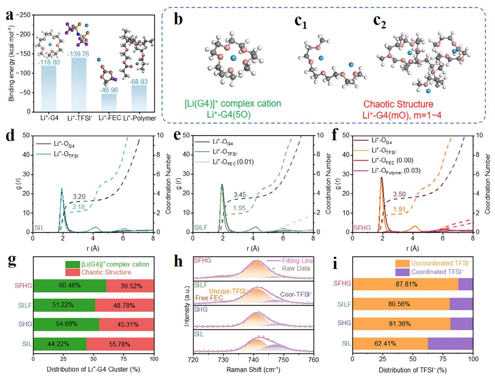
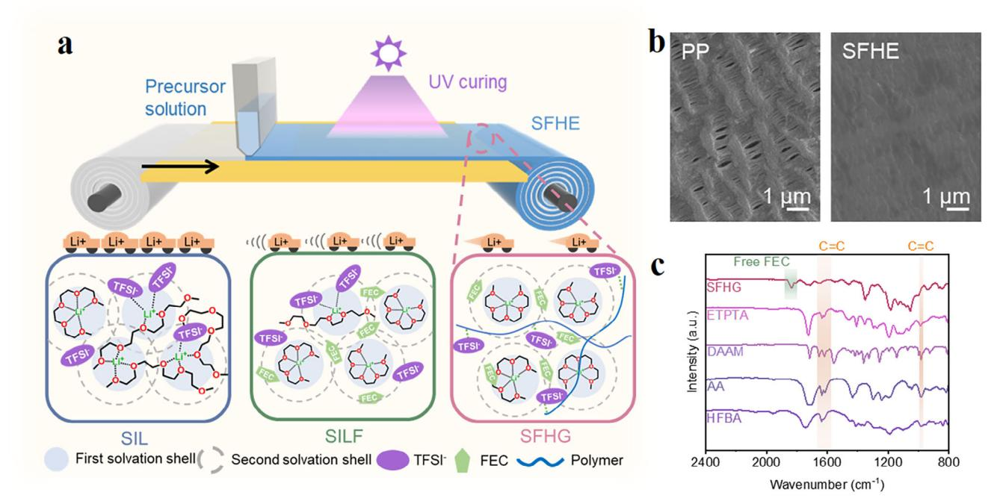
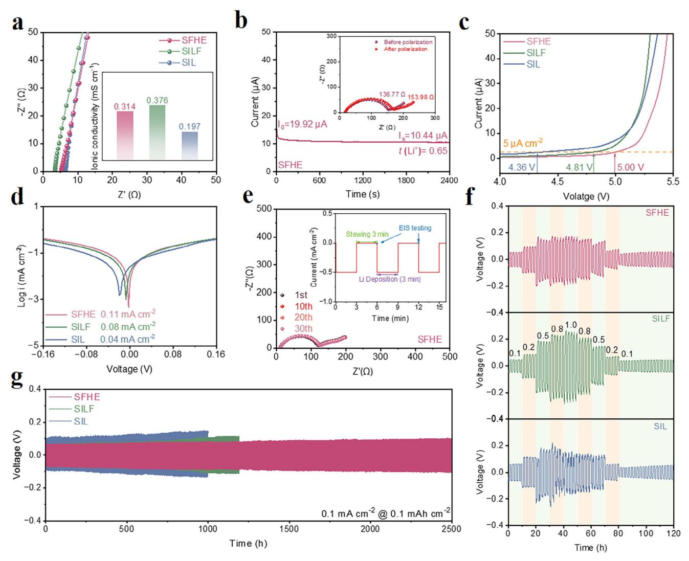
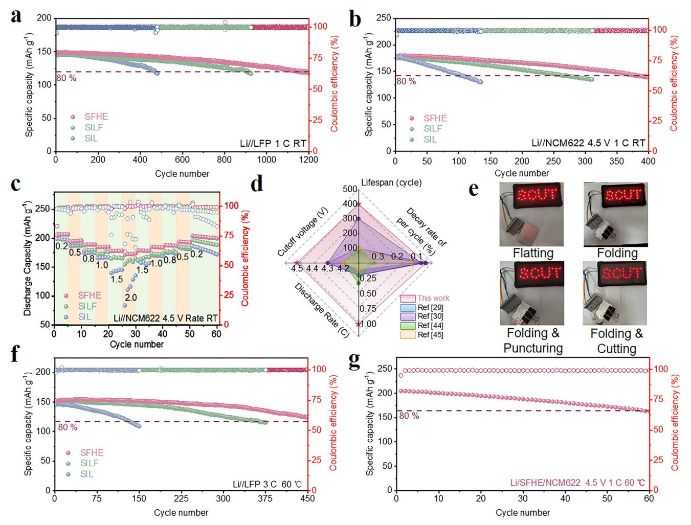
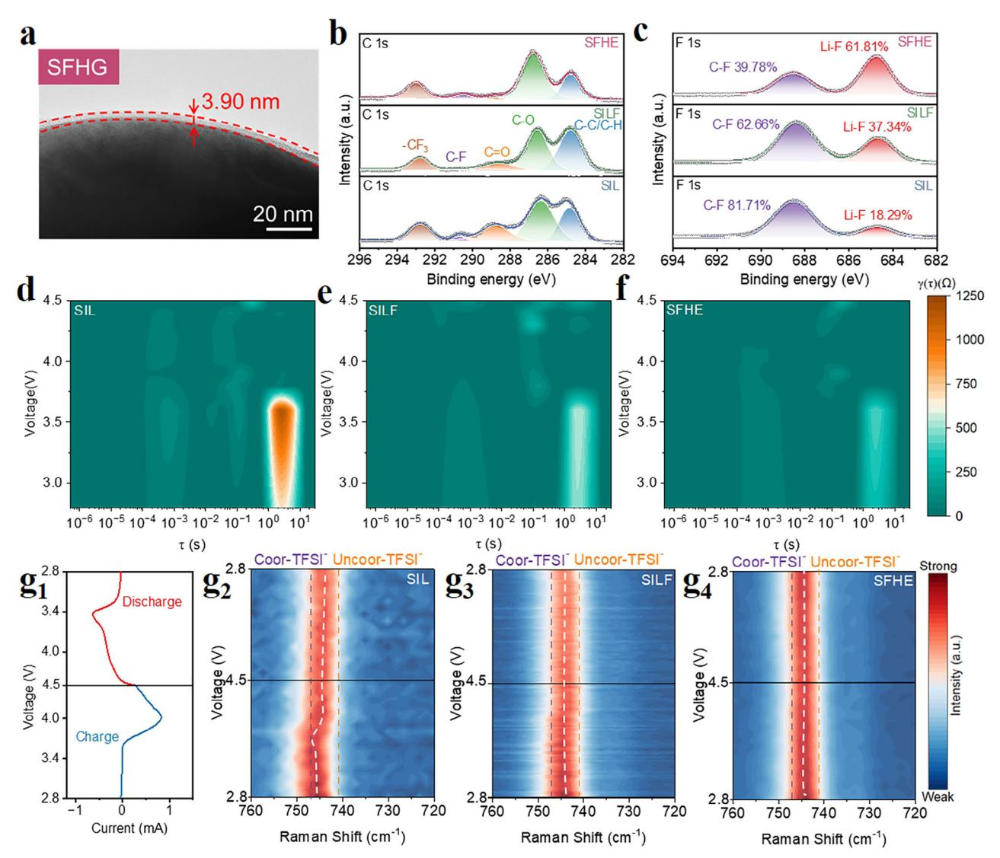

# **Ordering the Coordination Environment of Solvated Ionic Liquid Gel Electrolytes: Pathway to High-Efficiency 4.5 V Lithium Metal Batteries**

*Yufeng Su, Baolin Zhang, Shengguang Qi, Tongmei Ma, Boyong Wu, Yankui Mo, Mianrui Li, Siyuan Peng, and Li Du\**

**Solvated ionic liquids (SILs) are promising candidates for lithium metal battery (LMB) electrolytes owing to their facile synthesis and high safety. However, the high-voltage stability and ionic conductivity of ether-based SILs are compromised by their chaotic coordination structure, characterized by bulky solvation shells and poor oxidation stability. Here, optimizing electrolyte performance is proposed by incorporating weakly coordinating fluoroethylene carbonate (FEC) and a hydrogen-bond (H-bond)-rich polymer into SILs. FEC occupies the second solvation shell, suppressing large-volume solvation structures and improving ion transfer kinetics, while H-bonds anchor TFSI−, reducing its competitive coordination and suppressing its diffusion. This dual approach inhibits the formation of chaotic structures, leading to the development of a SIL-FEC (SILF) based H-bond gel electrolyte (SFHE) for LMBs, which exhibits high Li+ conductivity and superior oxidative stability. The resulting electrolyte exhibits a high Li+ transference number of 0.65. Furthermore, Li/SFHE/LiNi0.6Co0.2Mn0.2O2 (NCM622) battery can operate stably at a high cut-off voltage of 4.5 V, achieving an impressive capacity retention of ≈80% after 400 cycles at 1C. Additionally, the Li/SFHE/LiFePO4 (LFP) retains 81.8% capacity after 450 cycles at a high rate of 3C at 60 °C. This work provides a strategy for achieving high-voltage LMBs by ordering electrolyte micro-solvation structures.**

# **1. Introduction**

Lithium metal anodes, known for their low reduction-oxidation potential and extremely high specific energy density, are considered one of the most promising anode materials for highspecific-energy batteries.[\[1–3\]](#page-8-0) The pairing of high-energy-density lithium metal anodes with high-capacity cathodes, such as LiNixCoyMn(1−x−y)O2, has become a major research focus in the

The ORCID identification number(s) for the author(s) of this article can be found under <https://doi.org/10.1002/smll.202505552>

**DOI: 10.1002/smll.202505552**

scientific community.[\[4–6\]](#page-8-0) Ether-based electrolytes, known for their reduction resistance and low viscosity, offer high ionic conductivity and excellent compatibility with lithium metal, facilitating smooth lithium plating and stripping.[\[7,8\]](#page-8-0) These attributes render them a focal point in LMBs research.[\[9\]](#page-8-0) However, their limited oxidation resistance (*<*4.0 V vs. Li+/Li) at typical 1 m lithium salt concentration leads to side reactions and capacity loss at high voltages, limiting their use in high-voltage cathodes.[\[10,11\]](#page-8-0) Balancing lithium metal compatibility with high-voltage stability while enhancing safety is crucial for LMB development. Moreover, conventional ether electrolytes are flammable and volatile, posing significant safety risks in practical battery use. Therefore, there is an urgent need for efficient and safe alternatives.

Due to their exceptional compatibility with lithium metal, notable resistance to electrochemical oxidation, and low volatility, SILs have garnered significant attention.[\[12\]](#page-8-0) SILs are typically prepared by mixing equimolar amounts of metal cation salts with oligoether, forming large

complex clusters with metal ions. This promotes salt dissociation and yields ionic liquid characteristics such as high thermal stability and a wide electrochemical window.[\[13,14\]](#page-8-0) As a typical representative, a solution of tetraethylene glycol dimethyl ether (TEGDME), commonly abbreviated as G4, and LiTFSI in equimolar amounts forms long-lived solvated cations, such as [Li(G4)]+. The strong interaction between negatively charged ether oxygen in G4 and positively charged Li+ homogenizes charge distribution, giving complex ions higher antioxidant activity than free G4 molecules.[\[15,16\]](#page-8-0) Additionally, SIL based on ether G4 exhibits high compatibility with lithium metal. However, G4's long chain segments and strong ether oxygen coordination, along with the strong interaction between TFSI− and Li+, cause some Li+ to coordinate with both TFSI− and multiple G4 segments simultaneously, resulting in a chaotic structure. This forms largevolume, long-lived solvation clusters and leaves some uncoordinated G4 molecules within the SIL. These effects significantly hinder Li+ transport and diminish the electrolyte's stability at high voltages.[\[17–23\]](#page-8-0)

Y. Su, B. Zhang, S. Qi, T. Ma, B. Wu, Y. Mo, M. Li, S. Peng, L. Du Guangdong Provincial Key Laboratory of Fuel Cell Technology School of Chemistry and Chemical Engineering South China University of Technology Guangzhou 5510640, China E-mail: [duli@scut.edu.cn](mailto:duli@scut.edu.cn)

Optimizing the Li+ solvation structure within SIL to reduce chaotic structures is an effective way to enhance the Li+ transport capacity and high voltage tolerance of SIL-based electrolytes. This can be achieved by adding weakly coordinating additives or incorporating functional polymer monomers to construct functionalized polymer electrolytes.[\[18,24–26\]](#page-8-0) FEC serves as a particularly effective additive due to the weak solvation capability induced by strong electron-withdrawing effects of fluorine atoms, primarily occupies the second solvation shell of Li+ in ether electrolytes, thereby preventing the formation of largevolume solvation structures. Additionally, FEC in the second solvation shell promotes faster transfer kinetics of solvation clusters, thereby enhancing the electrolyte's conductivity.[\[27,28\]](#page-8-0) Meanwhile, polymer frameworks with Lewis acid binding sites, such as H-bonds, can effectively anchor the TFSI− anions, limiting TFSI− participation in the solvation structure of Li+ and further suppressing the formation of chaotic structures. Concurrently, the anchoring of TFSI− further promotes the migration of Li+. [\[29,30\]](#page-8-0)

In this work, we report a gel electrolyte for LMBs constructed by incorporating a weakly coordinating additive and a functional polymer backbone into SIL to simultaneously enhance Li+ transport efficiency and high-voltage tolerance. The gel electrolyte, comprising weakly coordinating FEC and an H-bond-rich polymer framework, effectively suppresses the formation of chaotic Li+ coordination structures in SIL and anchors TFSI− to prevent its competitive coordination. These synergistic effects promote efficient Li+ transport while enhancing oxidation stability. Theoretical calculations and spectroscopic analyses confirm the existence of chaotic coordination structures in SIL and the positive role of FEC and the polymer framework in adjusting Li+ solvation and transport. The resulting electrolyte exhibits a high Li+ transference number of 0.65, and the Li//Li symmetric battery using the SFHE can stably cycle for over 2500 h at 0.1 mA cm−2 with low and stable overpotential. By orderly arranging the Li+ solvation structure, facilitating efficient Li+ transport, and suppressing side reactions, the Li/SFHE/NCM622 cell exhibits excellent cycling stability at room temperature (RT), even at a high cut-off voltage of 4.5 V (retaining ≈80% capacity after 400 cycles). At elevated temperatures, SFHE maintains excellent compatibility with LMBs. The Li/SFHE/LFP sustains a high-capacity retention of 81.8% after 450 cycles at 3C. This work effectively modulates the solvation structure of Li+ from a microscopic perspective at the molecular level, providing new insights into the development of high electrochemical performance and high-voltage LMBs.

# **2. Results and Discussion**

#### **2.1. Design Principle**

First, we designed an optimized approach for constructing functional polymer networks in SIL (Figure S1, Supporting Information). Using density functional theory, the binding energy (BE) between Li+ and different components in the electrolyte was calculated individually (**Figure 1**[a\)](#page-2-0). It was found that TFSI− exhibited a notably high BE with Li+, confirming our hypothesis that TFSI− competes with G4 for coordination in actual electrolytes, which affected the complete coordination of Li+ with G4 and the formation of stable complex cations. Additionally, polymer and FEC with weak binding affinity mainly occupied the second solvation shell of Li+ in the electrolyte, which helped inhibit the formation of larger solvation clusters of Li+. [\[27\]](#page-8-0) By calculating the BE between each monomer within the functional fragment and TFSI− and G4 (Figure S2, Supporting Information), we found that H-bond-rich polymer segments interacted with TFSI− and G4, then facilitating the further dissociation of LiTFSI, anchoring uncoordinated G4 in bulk electrolyte, and inhibiting adverse side reactions at the interface. Furthermore, as exhibited in Figures S3 and S4 (Supporting Information), it was worth noting that the HOMO value of the Li+-G4 complexes increased with decreasing oxygen coordination number, indicating that clusters are more prone to adverse oxidation under high voltage. On this basis, we designated the Li+-G4 (5O) as [Li(G4)]+ (Figure [1b;](#page-2-0) Figure S5a, Supporting Information), and the incomplete coordination (Li+-G4 (mO), m = 1–4) as chaotic structure (Figure [1c;](#page-2-0) Figure S5b, Supporting Information). Compared to a chaotic structure, [Li(G4)]+ exhibits higher oxidation stability and smaller solvation volume.[\[14,23,31\]](#page-8-0) Furthermore, the LUMO values of the polymer and FEC are lower than free G4, indicating that both of them can undergo reduction on the lithium metal and participate in the construction of the interface layer rich in LiF.[\[32\]](#page-8-0)

To further explore the effects of polymer and FEC in adjusting the solvation mechanism of Li+ in SIL, molecular dynamics (MD) simulations were performed on both systems, including SIL, SIL-based H-bond gel (SHG), SILF, and SILF-based H-bond gel (SFHG) (Figure [1d–f;](#page-2-0) Figures S6 and S7, Supporting Information). Radial distribution functions and coordination numbers were initially extracted to examine the impact of additional FEC and polymer fragments added to SIL. As depicted in Figures [1d–f](#page-2-0) and Figure S6 (Supporting Information), adding FEC or functional polymers separately to SIL significantly adjusted the coordination of Li+ with anions and G4 molecules, characterized by increased coordination with G4 and decreased coordination with TFSI−. When FEC and polymer were added together, the coordination of Li+ became more pronounced. Additionally, the lack of coordination effect of FEC in the first shell of Li+ suggests that FEC molecules were primarily distributed in the second solvation shell, consistent with predictions of the electrolyte's interactions through BE analysis. Further analysis of the specific coordination of Li+ with G4 molecules, as shown in Figure [1g,](#page-2-0) a dominant portion of the coordination between Li+ and G4 in SIL was composed of a chaotic structure. With the introduction of FEC and the polymer framework, the coordination clusters of Li+ were transformed into [Li(G4)]+.

Subsequently, Raman spectroscopy was used to characterize the distribution of TFSI− within the materials, thereby experimentally validating our design approach. As shown in Figure [1h,](#page-2-0) distinct free FEC signals (730 cm−1) were observed in SFHG and SILF.[\[27\]](#page-8-0) Simultaneously, the signals between 720 and 760 cm−1 came from the vibrations of the S─N─S bond in TFSI−, which have been commonly used to present the binding feature between Li+ and TFSI− in electrolytes.[\[13,33\]](#page-8-0) As shown in Figure [1i,](#page-2-0) the proportion of uncoordinated TFSI− in SFHG, SILF, and SHG was higher than that in SIL.[\[34\]](#page-8-0) This indicated that more Li+ were fully complexed with G4, proving that the introduction of FEC

**[www.advancedsciencenews.com](http://www.advancedsciencenews.com) [www.small-journal.com](http://www.small-journal.com)**

**Figure 1.** a) BE between Li+ and other components in the electrolytes and the corresponding optimized geometrical structure (H: White; C: Grey; O: Pink; F: Purple; Li: Sky Blue; S: Yellow). Structures of b) [Li(G4)]+ complex cation and c) chaotic structure. Radial distribution functions and coordinated numbers obtained from MD simulations of d) SIL, e) SILF, and f) SFHG. g) Distribution of Li+ – G4 coordination states. h) Raman spectra of different materials and i) the proportion of peak areas related to TFSI− anions in the region.

and the polymer framework in SIL effectively regulated the solvation structure of Li+, and significantly increased the content of [Li(G4)]+.

Fourier transform infrared spectroscopy (FTIR) analysis was conducted to further investigate the effect of added FEC and polymer on SIL. As depicted in Figure S8 (Supporting Information), the characteristic peak of free FEC at ≈1800 cm−1 is visible in both SFHG and SILF. This observation aligns with prior MD simulations' predictions that a significant number of FEC molecules did not participate in the first solvation shell of Li+. Moreover, the C─O─C and ─CH2─ characteristic peaks exhibit a red shift or weakening after the addition of FEC and polymer, indicating a reduction in the content of uncoordinated G4 within the electrolyte.[\[35,36\]](#page-8-0) In summary, the addition of polymers and FEC optimized the solvation structure of Li+, generated a more oxidation-resistant structure, and significantly enhanced the oxidation stability of the electrolyte. These smaller solvation structures also facilitated more efficient Li+ conduction.

#### **2.2. Construction of Different Electrolytes**

The above calculation results have predicted the potential positive effects of introducing FEC and the polymer framework into SIL to construct electrolytes for LMBs. Subsequently, we conducted actual experiments to verify these effects. First, different mass fractions of polymer monomers were added to SIL or SILF for curing, and the ionic conductivity of these electrolytes was tested at RT (Figures S9 and S10, Supporting Information). After determining the optimal amount of functional polymer to add, we prepared SFHE by coating SFHG onto a polypropylene (PP) separator using scraper-coating, followed by UV curing, as shown in **Figure 2**[a](#page-3-0) and Figures S11–S13 (Supporting Information).

As illustrated in Figure [2b,](#page-3-0) the PP separator was completely covered, and a smooth surface was obtained. Further energydispersive spectrometer spectroscopy also revealed that the distribution of various elements of the SFHE electrolyte was uniform (Figure S13, Supporting Information). As shown in Figure S14 (Supporting Information), different electrolytes were subjected

**Figure 2.** a) Schematic diagram of preparation of SFHE film by UV curing method, chemical structures, and Li+ solvation structures of each electrolyte. b) SEM images of PP separator (left) and SFHE (right). c) FTIR spectra of each monomer before curing and SFHG after curing.

to flammability testing under direct flame. Among them, traditional ether electrolyte (1 M LiTFSI in DOL/DME) was ignited and continued to burn within 2 s of contact with the flame, while SIL and SFHG did not burn after 180 s, exhibiting excellent nonflammable properties. The structures of monomers and copolymers were characterized via FTIR. As exhibited in Figure 2c, each monomer presented a clear peak at around 980 and 1630  $cm^{-1}$ , corresponding to C=C stretching and bending vibration, respectively. By contrast, no characteristic peaks of  $C=C$  bonds were evident in the SFHG, which revealed that all monomers had successfully polymerized.[37-39] In summary, polymer electrolytes have been successfully prepared through a simple UV curing method.

#### 2.3. Electrochemical Properties and Compatibility with Li Anodes

To confirm the feasibility of SFHE for use in LMBs, the electrochemical impedance spectrum (EIS) was conducted at RT (Figure 3a). Due to the presence of FEC and the polymer, the ion transfer resistance of SFHE was reduced. As a result, SFHE achieved a high ionic conductivity of  $3.14 \times 10^{-4}$  S cm-1. Moreover, because the H-bond-rich polymer network provided a significant anchoring effect on TFSI- and promoted the formation of more  $[Li(G4)]$ + with small solvent volumes, SFHE exhibited a higher lithium transference number ( $t_{Li+}$ ) of 0.65 than SILF (0.35) and SIL (0.16) (Figure 3b; Figure S15, Supporting Information). Linear sweep voltammetry measurements were conducted to evaluate the electrochemical stability of electrolytes. As shown in Figure 3c, the addition of FEC and the H-bond polymer skeleton increased the electrochemical stability of the SIL from 4.36 to 5.00 V. This improvement was attributed to the reduction of uncoordinated ether oxygen in the electrolyte, which enhanced highvoltage stability. Electrolytes with high oxidation ability typically show great potential for high-voltage LMBs, in which energy density is further improved.[4] As shown in Figure  $3d$ , the interfacial Li+ diffusion kinetics were related to the exchange current density ( $j_0$ ) explored through Li//Li symmetrical cells. The values of  $j_0$  obtained from Tafel plots of SFHE (0.11 mA cm-2) were larger than SILF (0.08 mA  $cm^{-2}$ ) and SIL (0.04 mA  $cm^{-2}$ ), indicating a facile Li plating/stripping process.[40] To further reveal Li+ transport kinetics during Li deposition at the electrode interface, in situ EIS measurements were carried out (Figure 3e; Figure S16, Supporting Information). Through cyclic testing and EIS analysis of lithium deposition, the in situ behavior of  $Li^+$  on the electrode surface can be monitored. The compatibility between electrolytes and lithium anodes was assessed by evaluating impedance values and their changes at different deposition times. It was noted that the Li//Li symmetric cell loaded with SFHE exhibited low and stable impedance during 30 cycles of lithium deposition, which was attributed to the rapid replenishment of Li+ at the interface, as well as the quick construction of a stable interface layer on the lithium metal surface promoted by SFHE.[41]

To further investigate the compatibility of the electrolyte with Li metal, the long-term electrochemical compatibility and stability with Li metal were characterized by galvanostatic charge/discharge tests at different current densities. As shown in Figure  $3f$ , as the current density increased from 0.1 to 1 mA  $\text{cm}^{-2}$ , both the Li/SFHE/Li cell and the Li/SILF/Li cell exhibited stable and uniform voltage changes, and the polarization voltage of the Li/SFHE/Li was lower than that of Li/SILF/Li, while the Li/SIL/Li cell showed significant voltage fluctuations when the current density reached 0.8 mA cm-2. This was attributed to the joint efforts of FEC and polymer frameworks, which **[www.advancedsciencenews.com](http://www.advancedsciencenews.com) [www.small-journal.com](http://www.small-journal.com)**

**Figure 3.** a) Nyquist curves and ionic conductivity at RT of SIL, SILF, and SFHE. b) Chronoamperometry polarization curve and impedance spectra before and after polarization of Li/SFHE/Li symmetric cell. c) Linear sweep voltammograms of different electrolytes at a scan rate of 0.1 mV s−1. d) Tafel plots and corresponding exchange current density of each electrolyte. e) EIS impedance spectra of Li/SFHE/Li under different lithium deposition cycles. Procedure for in situ EIS measurement as shown in the attached image. f) Cyclic testing of Li//Li symmetric cells with different electrolytes under different current densities from 0.1 to 1 mA cm−2. g) Galvanostatic cycling curves of Li//Li symmetric cells with SIL, SILF, and SFHE at 0.1 mA cm−2 with a capacity of 0.1 mAh cm−2.

promoted more uniform and efficient Li+ conduction within the electrolyte. Subsequently, the long-term cycling stability of different electrolytes was tested at 0.1 mA cm−2 with a fixed capacity of 0.1 mAh cm−2 (Figure 3g; Figure S17, Supporting Information). Li/SFHE/Li symmetric cell exhibited a lower overpotential and excellent long-term stability for up to 2500 h with only a negligible overpotential increase. On the contrary, the Li//Li cells with SIL as the electrolyte exhibited an initial overpotential of 90 mV, which gradually increased to 130 mV after 900 h. Furthermore, the Li/SFHE/Li symmetric cells were tested at a higher current density of up to 0.5 mA cm−2 with a fixed capacity of 0.5 mAh cm−2 (Figure S18, Supporting Information). The overpotential was maintained at ≈160 mV during 1000 h, demonstrating outstanding cycling reversibility and high current density tolerance.

#### **2.4. Electrochemical Capability in LFP and High-Cut-Off Voltage NCM622-Based Cells**

The above tests demonstrate that SFHE exhibits excellent electrochemical performance and significant compatibility with Li metal. To further validate the application prospects of SFHE in high-performance energy storage devices, we assembled and tested both LFP and NCM622 batteries, aiming to demonstrate the practical application potential of SFHE in battery systems. The Li//LFP cells were assembled and tested within a potential range of 2.5–3.8 V at RT. As presented in **Figures 4**[a](#page-5-0) and S19 (Supporting Information), the Li/SFHE/LFP achieved a superior initial capacity of 150 mAh g−1 at a current density of 1C, maintaining a capacity retention rate of 82.1% after 1100 cycles. Compared to the Li/SIL/LFP, the Li/SFHE/LFP demonstrated www.advancedsciencenews.com

CIENCE NEWS

**Figure 4.** a) Cycling performance of Li//LFP cells with different electrolytes at 1C. b) Cycling performance of 4.5 V Li//NCM622 cells at 1C, and c) rate performance from 0.2C to 2C with different electrolytes. d) Radar chart comparing the performance of high-voltage NCM cathode batteries based on SIL-related research. e) Optical images of light-emitting diodes operated by Li/SFHE/NCM622 pouch cell under flatting, bending, folding & puncturing and folding & cutting states. f) Cycling performance of Li//LFP cells using different electrolytes at high temperature (60 °C) and high current rate of 3C. g) Cycling performance of Li/SFHE/NCM622 at high temperature (60 °C) with a high cut-off voltage of 4.5 V at 1C.

superior cycling stability with reduced capacity loss. Furthermore, SFHE demonstrated excellent rate performance (Figure S20, Supporting Information). The comprehensive electrochemical performance described above demonstrates substantial advantages compared to most recent research findings on electrolytes for Li//LFP batteries using SIL as the electrolyte, as illustrated in Figure S21 (Supporting Information).  $[26,29,30,33,37,42]$ 

SIL-based electrolytes are considered to have oxidation stability, which ensures operability in high-voltage battery systems. A higher cut-off voltage means that the active material can release more capacity, and the application prospects of the electrolyte can be further evaluated using a high-voltage NCM622 cathode.[43] Long cycle tests were conducted at 1C with a high cut-off voltage of 4.5 V to evaluate the feasibility of different electrolytes in Li//NCM622 cells. As shown in Figure 4b and Figure S22 (Supporting Information), the Li/SFHE/NCM622 cell exhibited a remarkably low-capacity decay rate of 0.053% per cycle over 400 cycles. In contrast, the cells based on SIL experienced significant capacity decay, with a capacity retention of  $74.3\%$  after 130 cycles. This rapid capacity fade was attributed to uncontrolled parasitic reactions that led to the swift consumption of both active Li and electrolyte. Subsequently, Figure 4c shows the 4.5 V Li//NCM622 batteries at different current rates from 0.2C to 2C. Benefiting from the regulation of Li+ solvation structures and enhanced ion transfer kinetics by FEC, both Li/SFHE/NCM622 and Li/SILF/NCM622 exhibited excellent tolerance to high current densities, demonstrating minimal capacity decay even at a high current rate of up to 2C. In sharp contrast, Li/SIL/NCM622 experienced a prominent decrease in capacity when the current rate was higher than 1.5C. Moreover, Li/SFHE/NCM622 exhibited higher capacity retention at high current rates, attributed to the effective anchoring of TFSI- by H-bond segments within the polymer electrolyte, which facilitated Li+ conduction. The Li/SFHE/NCM622 batteries assembled with our SIL-based gel electrolyte show outstanding high-voltage tolerance, cycling stability, and high current rate performance under the combined

NANO . MICP

www.small-journal.com

**Figure 5.** a) TEM image of the NCM622 of Li/SFHE/NCM622 after 25 cycles at 1C. XPS analysis of b) the C 1s energy level for the CEI layer of the NCM622 cathode and c) the F 1s energy level for the SEI layer of the Li anode of Li//NCM622 cells after 25 cycles at 1C. 2D intensity color maps of DRT analysis for Li//NCM622 using d) SIL, e) SILF, and f) SFHE as electrolytes within the voltage range of 2.8–4.5 V. g) In situ Raman characterization of the composition evolution inside the electrolyte during the first electrochemical cycle of Li//NCM622 cells using different electrolytes.

effects of FEC and functional polymers. These batteries clearly outperform most LMB electrolytes based on SIL reported recently (Figure [4d\)](#page-5-0).[\[29,30,44,45\]](#page-8-0)

Further, the electrochemical performances of Li/SFHE/LFP cell and 4.5 V Li/SFHE/NCM622 cell using cathodes with higher mass loading were examined to explore the potential of SFHE in high-energy LMBs (Figures S23 and S24, Supporting Information). Specifically, the Li//LFP (10.56 mg cm−2) cell matched with SFHE maintained 80.1% capacity retention after 160 cycles at 0.3C, while the 4.5 V Li/SFHE/NCM622 (12.12 mg cm−2) cell retained 81.6% capacity after 90 cycles at 0.2C. In addition, a pouch cell was assembled to evaluate the safety properties of SFHE under harsh conditions. As shown in Figure [4e,](#page-5-0) the Li/SFHE/NCM622 pouch cell was able to light up an LED device even if the pouch cell was folded, punctured, and cut, suggesting its high safety.

At elevated temperatures, the coordination interactions between Li+ and solvent molecules are weakened, exacerbating the occurrence of side reactions. A stable solvation structure at high temperatures is crucial for maintaining stability.[\[35,46\]](#page-8-0) To further evaluate the positive role of FEC and H-bond polymer in regulating the Li+ structure, we tested the cycling performance of Li//LFP cells at elevated temperatures with different electrolytes (Figure S25, Supporting Information; Figure [4f\)](#page-5-0). Impressively, SFHE also displayed outstanding compatibility with Li//LFP at 60 °C, achieving a low-capacity decay rate of 0.025% per cycle over 450 cycles at 1C and 0.032% per cycle over 450 cycles at high current rate up to 3C, indicating fewer chaotic structures in SFHE. Additionally, supplementary tests on Li/SFHE/NCM622 with different cut-off voltages at 60 °C were carried out. As presented in Figure S26 (Supporting Information), Li/SFHE/NCM622 maintained a capacity retention of ≈80% after 90 cycles at 1C at a cut-off voltage of 4.3 V. Notably, even when the cut-off voltage was raised to 4.5 V, Li/SFHE/NCM622 still exhibited an acceptable capacity retention of 79.3% after 60 cycles at 1C (Figure  $4g$ ). These results further validate the advantages of SFHE in highperformance LMB electrolytes.

#### 2.5. Interfacial Evolution and Reaction Process

Further investigation into the morphology and composition of electrode/electrolyte interface derived from different electrolytes can provide deeper insights into how electrolytes enhance the overall performance of batteries. TEM images of cycled NCM622 were presented in **Figures 5a** and **S27** (Supporting Information). The cathode-electrolyte interface (CEI) formed on NCM622 using SFHE appeared homogeneous, with a thickness of  $\approx$ 3.9 nm. In stark contrast, the CEI layer on NCM622 using SIL was thick and uneven, which is speculated to result from the repeated formation of a loose CEI. Additionally, X-ray photoelectron spectroscopy (XPS) was used to detect the CEI compositions formed in different electrolytes, with the variation in element content shown in Figure 5b. The C 1s spectra of the CEI revealed that the intensity of the  $C=O$  peak in SFHE was weaker, attributed to less oxidation of organic compounds.[47] This observation demonstrated the reduction of the content of chaotic structures with low oxidation stability. Additionally, the microscopic morphology of Li+ deposition, as shown in Figure S28 (Supporting Information), varies significantly with different electrolytes. The Li metal surface using SFHE as the electrolyte was flat and free of obvious protrusions, whereas the surface using SIL exhibited prominent moss-like deposits. This suggests that SFHE facilitates rapid Li+ conduction and uniform interface deposition during the cycling of the Li/SFHE/NCM622 cell. Moreover, as illustrated in Figure 5c, the solid electrolyte interphase (SEI) formed on Li metal using SFHE exhibited the highest LiF content, characterized by low electronic conductivity, high ionic conductivity, and high mechanical strength, effectively suppresses lithium dendrites growth and promotes the uniform Li+ deposition, thereby enhancing the safety and cycling stability of the batteries.[48,49]

To delve deeper into the impact of different electrolytes on battery performance during high-voltage charging and discharging, we monitored the impedance of the batteries in the voltage range of 2.8–4.5 V (Figure S29, Supporting Information). To gain deeper insights into the electrochemical reactions during cycling, we utilized MATLAB-based relaxation time distribution (DRT) tools developed by Ciucci and Chen.[50,51] In general, the peak in the high-frequency region corresponds to Li+ in the interface layer ( $R_{\mbox{\tiny SEI/CEI}}$ ), while the mid-frequency region to the charge transfer process (charge transfer resistance,  $R_{ct}$ ), and the low-frequency region to the Li+ diffusion in the cathode (diffusion resistance,  $R_D$ ). The typical DRT curve of the cycled Li//NCM622 cell and the types of impedance corresponding to peaks at different time constants are shown in Figure S30 (Supporting Information),[52-55] and the DRT analysis of Li//NCM622 with different electrolytes is shown in Figures 5d-f. Compared to SIL, SFHE exhibited significantly lower  $R_D$ , indicating that FEC and H-bond polymers effectively suppressed the formation of chaotic structures then enhanced the diffusion of Li+ during the electrochemical cycle. Additionally, SFHE shows lower  $\rm R_{\rm SEI/CEI}$ 

and  $Rct$  across various voltages, further demonstrating that FEC and H-bond polymers promoted the formation of a thin, stable interfacial electrode layer and optimized Li+ transport.[56]

Besides, in situ Raman spectroscopy was employed to examine changes in component distribution near the anode during the charge-discharge cycle of the Li//NCM622 cell (Figure 5g). During charging, as Li+ was consumed, the SIL electrolyte exhibited a pronounced shift in the peak corresponding to the transition from coordinated TFSI- to uncoordinated TFSI-. This shift was attributed to Li+ moving from the chaotic structure into the anode, thereby releasing coordinated TFSI-. In contrast, SFHE showed a negligible peak shift, indicating reduced coordination between Li+ and TFSI-. Throughout the electrochemical cycling, the behavior of Li+ had minimal impact on the ratio of coordination to uncoordinated TFSI-. These findings confirm that our approach effectively suppresses the competitive coordination between  $Li^+$  and TFSI-.

#### 3. Conclusion

In summary, this study developed a gel electrolyte with efficient Li+ transport and high electrochemical stability by integrating additives and a functional polymer framework into the SIL matrix. Through simulations and spectroscopic analyses, we demonstrated that the SIL exhibits chaotic structures due to the molecular volume effect of G4 and the competitive coordination effect between G4 and TFSI-. By incorporating FEC as an additive and constructing an H-bond polymer network, we suppressed the formation of chaotic structures in SIL and promoted faster transport kinetics of Li+. Consequently, the resulting SFHE exhibited rapid Li+ conduction and enhanced oxidation stability. Specifically, the Li/SFHE/LFP battery maintained a capacity retention of 82.1% after 1100 cycles at 1C, while the Li/SFHE/NCM622 battery retained  $\approx$ 80% capacity after 400 cycles at 1C, even at a high cut-off voltage of 4.5 V. Additionally, SFHE demonstrated excellent performance when tested at an elevated temperature of 60 °C, further highlighting its promising application prospects. The substantial potential of SFHE for practical applications for highperformance LMBs is fully realized, offering unique insights for the engineering design of electrolytes for LMBs with efficient Li+ transport and high cut-off voltage capabilities.

#### 4. Experimental Section

Details pertaining to the Experimental Section are provided in the Supporting Information.

### Supporting Information

Supporting Information is available from the Wiley Online Library or from the author.

#### **Acknowledgements**

Y.S. and B.Z. contributed equally to this work. The authors gratefully acknowledged the financial support of the National Natural Science Foundation of China (No. 22378139), Guangdong Basic and Applied Basic Research Foundation (Nos. 2021B1515020025 and 2024A1515011370), and the Guangzhou Applied Basic Research Foundation (No. 2024A04J3037).

# **Conflict of Interest**

The authors declare no conflict of interest.

# **Data Availability Statement**

The data that support the findings of this study are available from the corresponding author upon reasonable request.

#### **Keywords**

high voltage, hydrogen bond polymer, lithium metal batteries, solvated ionic liquids, weak solvation additive

> Received: May 7, 2025 Revised: June 26, 2025 Published online: July 4, 2025

- [1] M. A. J.-M. Tarascon, *Nature* **2001**, *414*, 359.
- [2] Y. Zou, F. Cheng, Y. Lu, Y. Xu, C. Fang, J. Han, *Small* **2023**, *19*, 2203394.
- [3] D. Lin, Y. Liu, Y. Cui, *Nat. Nanotechnol.* **2017**, *12*, 194.
- [4] Q. Lv, C. Li, Y. Liu, Y. Jing, J. Sun, H. Wang, L. Wang, H. Ren, B. Wu, T. Cheng, D. Wang, H. Liu, S.-X. Dou, B. Wang, J. Wang, *ACS Nano* **2024**, *18*, 23253.
- [5] Q. Zhou, H. Zhao, C. Fu, J. Jian, H. Huo, Y. Ma, C. Du, Y. Gao, G. Yin, P. Zuo, *Angew. Chem., Int. Ed.* **2024**, *63*, 202402625.
- [6] Y. Bi, J. Tao, Y. Wu, L. Li, Y. Xu, E. Hu, B. Wu, J. Hu, C. Wang, J.-G. Zhang, Y. Qi, J. Xiao, *Science* **2020**, *370*, 1313.
- [7] S. Chen, W. Zhu, L. Tan, D. Ruan, J. Fan, Y. Chen, X. Meng, Q. Nian, X. Zhao, J. Jiang, Z. Wang, S. Jiao, X. Wu, X. Ren, *ACS Appl. Mater. Interfaces* **2023**, *15*, 13155.
- [8] J. Ning, K. Duan, K. Wang, J. Liu, S. Wang, J. Zhang, *J. Energy Chem.* **2022**, *67*, 290.
- [9] Z. Yu, P. E. Rudnicki, Z. Zhang, Z. Huang, H. Celik, S. T. Oyakhire, Y. Chen, X. Kong, S. C. Kim, X. Xiao, H. Wang, Y. Zheng, G. A. Kamat, M. S. Kim, S. F. Bent, J. Qin, Y. Cui, Z. Bao, *Nat. Energy* **2022**, *7*, 94.
- [10] S. Jiao, X. Ren, R. Cao, M. H. Engelhard, Y. Liu, D. Hu, D. Mei, J. Zheng, W. Zhao, Q. Li, N. Liu, B. D. Adams, C. Ma, J. Liu, J.-G. Zhang, W. Xu, *Nat. Energy* **2018**, *3*, 739.
- [11] U. Pal, D. Rakov, B. Lu, B. Sayahpour, F. Chen, B. Roy, D. R. MacFarlane, M. Armand, P. C. Howlett, Y. S. Meng, M. Forsyth, *Energy Environ. Sci.* **2022**, *15*, 1907.
- [12] R. Xu, X. Shen, X. Ma, C. Yan, X. Zhang, X. Chen, J. Ding, J. Huang, *Angew. Chem.* **2021**, *133*, 4261.
- [13] T. Tamura, K. Yoshida, T. Hachida, M. Tsuchiya, M. Nakamura, Y. Kazue, N. Tachikawa, K. Dokko, M. Watanabe, *Chem. Lett.* **2010**, *39*, 753.
- [14] K. Yoshida, M. Nakamura, Y. Kazue, N. Tachikawa, S. Tsuzuki, S. Seki, K. Dokko, M. Watanabe, *J. Am. Chem. Soc.* **2011**, *133*, 13121.
- [15] K. Ueno, R. Tatara, S. Tsuzuki, S. Saito, H. Doi, K. Yoshida, T. Mandai, M. Matsugami, Y. Umebayashi, K. Dokko, M. Watanabe, *Phys. Chem. Chem. Phys.* **2015**, *17*, 8248.
- [16] H. Moon, T. Mandai, R. Tatara, K. Ueno, A. Yamazaki, K. Yoshida, S. Seki, K. Dokko, M. Watanabe, *J. Phys. Chem. C* **2015**, *119*, 3957.
- [17] H. Chen, H. Tu, C. Hu, Y. Liu, D. Dong, Y. Sun, Y. Dai, S. Wang, H. Qian, Z. Lin, L. Chen, *J. Am. Chem. Soc.* **2018**, *140*, 896.
- [18] R. Li, H. Hua, X. Yang, J. Tian, Q. Chen, R. Huang, X. Li, P. Zhang, J. Zhao, *Energy Environ. Sci.* **2024**, *17*, 5601.
- [19] T. Harte, B. Dharmasiri, P. Coia, D. J. Eyckens, L. C. Henderson, *J. Mol. Liq.* **2024**, *402*, 124689.
- [20] N. J. Shah, C. Fang, N. C. Osti, E. Mamontov, X. Yu, J. Lee, H. Watanabe, R. Wang, N. P. Balsara, *Nat. Mater.* **2024**, *23*, 664.

- [21] Z. Yu, N. P. Balsara, O. Borodin, A. A. Gewirth, N. T. Hahn, E. J. Maginn, K. A. Persson, V. Srinivasan, M. F. Toney, K. Xu, K. R. Zavadil, L. A. Curtiss, L. Cheng, *ACS Energy Lett.* **2022**, *7*, 461.
- [22] S. Li, M. Jin, X. Song, S. Xu, Q. Dou, J. Zhu, X. Yan, *Energy Storage Mater.* **2024**, *73*, 103815.
- [23] C. Zhang, K. Ueno, A. Yamazaki, K. Yoshida, H. Moon, T. Mandai, Y. Umebayashi, K. Dokko, M. Watanabe, *J. Phys. Chem. B* **2014**, *118*, 5144.
- [24] K. Dokko, N. Tachikawa, K. Yamauchi, M. Tsuchiya, A. Yamazaki, E. Takashima, J.-W. Park, K. Ueno, S. Seki, N. Serizawa, M. Watanabe, *J. Electrochem. Soc.* **2013**, *160*, A1304.
- [25] Y. Wang, Y. Ji, Z. Yin, T. Sheng, A. Cao, W. Zhao, Y. Huang, J. Li, F. Pan, L. Yang, *Adv. Funct. Mater.* **2024**, *34*, 2401515.
- [26] Y. Yuan, X. Peng, B. Wang, K. Xue, Z. Li, Y. Ma, B. Zheng, Y. Song, H. Lu, *J. Mater. Chem. A* **2023**, *11*, 1301.
- [27] Y. Zhang, F. Li, Y. Cao, M. Yang, X. Han, Y. Ji, K. Chen, L. Liang, J. Sun, G. Hou, *Adv. Funct. Mater.* **2024**, *34*, 2315527.
- [28] G. Zhang, X. Deng, J. Li, J. Wang, G. Shi, Y. Yang, J. Chang, K. Yu, S.-S. Chi, H. Wang, P. Wang, Z. Liu, Y. Gao, Z. Zheng, Y. Deng, C. Wang, *Nano Energy* **2022**, *95*, 107014.
- [29] Z. Liu, Z. Hu, X. Jiang, X. Wang, Z. Li, Z. Chen, Y. Zhang, S. Zhang, *Small* **2022**, *18*, 2203011.
- [30] J. Zhang, J. Zhu, R. Zhao, J. Liu, X. Song, N. Xu, Y. Liu, H. Zhang, X. Wan, Y. Ma, C. Li, Y. Chen, *Energy Environ. Sci.* **2024**, *17*, 7119.
- [31] S. Chen, J. Fan, Z. Cui, L. Tan, D. Ruan, X. Zhao, J. Jiang, S. Jiao, X. Ren, *Angew. Chem., Int. Ed.* **2023**, *62*, 202219310.
- [32] C. Jiang, Q. Jia, M. Tang, K. Fan, Y. Chen, M. Sun, S. Xu, Y. Wu, C. Zhang, J. Ma, C. Wang, W. Hu, *Angew. Chem., Int. Ed.* **2021**, *60*, 10871.
- [33] Y. Xu, X. Jiang, Z. Liu, Z. Chen, S. Zhang, Y. Zhang, *J. Power Sources* **2022**, *546*, 231952.
- [34] M. Li, J. Wu, Z. You, Z. Dai, Y. Gu, L. Shi, M. Wu, Z. Wen, *Angew. Chem., Int. Ed.* **2024**, *63*, 202403521.
- [35] T. Chen, Z. Jin, Y. Liu, X. Zhang, H. Wu, M. Li, W. Feng, Q. Zhang, C. Wang, *Angew. Chem., Int. Ed.* **2022**, *61*, 202207645.
- [36] F. Fu, Y. Zheng, N. Jiang, Y. Liu, C. Sun, A. Zhang, H. Teng, L. Sun, H. Xie, *Chem. Eng. J.* **2022**, *450*, 137776.
- [37] X. Gao, W. Yuan, Y. Yang, Y. Wu, C. Wang, X. Wu, X. Zhang, Y. Yuan, Y. Tang, Y. Chen, C. Yang, B. Zhao, *ACS Appl. Mater. Interfaces* **2022**, *14*, 43397.
- [38] S. Qi, M. Li, Y. Gao, W. Zhang, S. Liu, J. Zhao, L. Du, *Adv. Mater.* **2023**, *35*, 2304951.
- [39] J. I. Kim, Y. G. Choi, Y. Ahn, D. Kim, J. H. Park, *J. Membr. Sci.* **2021**, *619*, 118771.
- [40] P. Yang, H. Xing, P. Wang, Y. Niu, X. Ding, Y. Xu, *Adv. Funct. Mater.* **2025**, *35*, 2500067.
- [41] B. Wu, T. Yan, S. Liu, Y. Su, C. Xiang, M. Li, Z. Cui, L. Du, Z. Liang, H. Song, *Adv. Funct. Mater.* **2025**, *35*, 2421244.
- [42] X. Jiang, Z. Liu, W. Liu, D. Yu, J. Zhang, X. Wang, Y. Zhang, S. Zhang, *Matter* **2024**, *7*, 1558.
- [43] W. Yang, Z. Zhang, X. Sun, Y. Liu, C. Sheng, A. Chen, P. He, H. Zhou, *Angew. Chem., Int. Ed.* **2024**, *63*, 202410893.
- [44] L. Yu, S. Guo, Y. Lu, Y. Li, X. Lan, D. Wu, R. Li, S. Wu, X. Hu, *Adv. Energy Mater.* **2019**, *9*, 1900257.
- [45] R. Tamate, Y. Peng, Y. Kamiyama, K. Nishikawa, *Adv. Mater.* **2023**, *35*, 2211679.
- [46] G. Hu, Z. Yang, X. Zhang, Y. Liu, Y. Lin, S. Chen, Y. Chen, B. Sa, Y. Zhang, *Energy Storage Mater.* **2024**, *69*, 103402.
- [47] H. Yang, W. Wang, Z. Huang, Z. Wang, L. Hu, M. Wang, S. Yang, S. Jiao, *Adv. Mater.* **2024**, *36*, 2401008.
- [48] Q. Sun, S. Wang, Y. Ma, D. Song, H. Zhang, X. Shi, N. Zhang, L. Zhang, *Adv. Mater.* **2023**, *35*, 2300998.
- [49] Y. M. Jeon, S. Kim, M. Lee, W. B. Lee, J. H. Park, *Adv. Energy Mater.* **2020**, *10*, 2003114.
- [50] F. Ciucci, C. Chen, *Electrochim. Acta* **2015**, *167*, 439.

**[www.advancedsciencenews.com](http://www.advancedsciencenews.com) [www.small-journal.com](http://www.small-journal.com)**

- [51] Y. Lu, C.-Z. Zhao, J.-Q. Huang, Q. Zhang, *Joule* **2022**, *6*, 1172.
- [52] X. Wang, C. Yang, L. Yao, Y. Wang, N. Jiang, Y. Liu, *Adv. Funct. Mater.* **2024**, *34*, 2315007.
- [53] G. Zheng, S. Xue, Y. Li, S. Chen, J. Qiu, Y. Ji, M. Liu, L. Yang, *Nano Energy* **2024**, *125*, 109617.
- [54] Y. Lu, C.-Z. Zhao, R. Zhang, H. Yuan, L.-P. Hou, Z.-H. Fu, X. Chen,

J.-Q. Huang, Q. Zhang, *Sci. Adv.* **2021**, *7*, abi5520.

- [55] J. Guo, Y. Xu, M. Exner, X. Huang, Y. Li, Y. Liu, H. Wang, J. Kowal, Q. Zhang, P. K. Kristensen, D. Wang, K. Pedersen, L. Gurevich, D. Stroe, P. Adelhelm, *Adv. Energy Mater.* **2024**, *14*, 2400190.
- [56] Q. Zhou, Z. Huang, T. Yang, H. Zhang, X. Yao, W. Zhang, H. Huang, Y. Xia, X. Tao, J. Zhang, *Chem. Eng. J.* **2025**, *504*, 158719.