# **Dry Processing Technique for High-Energy Density Lithium Batteries**

Yu Liu, Pengbo Fang, Bohua Wen, Xiangkun Wu, $\ast$  and Lan Zhang $\ast$ 

Using no solvents, dry processing technique (DPT), especially for binder fibrillation is drawing more research attention due to its feasibility in fabricating thick electrodes as well as ultra-thin solid electrolyte (SE) films. However, DPT electrodes and SE films are still facing multiple challenges including processing sensitivity (to temperature, humidity, as well as particle size and mechanical properties of the electrode/electrolyte materials, to name but a few), poor compatibility with lithium metal anode, as well as hindered ion transportation, which are restricting their commercial applications. Focus on the charge percolating of the high loading DPT electrodes/SE films and their stability toward metal Li, the mainstream commercial electrode characteristics including area loading and porosity are begun with, then the latest advances on DPT is reviewed from the electrode and SE aspect, respectively. It is found that although DPT achieved great success in academic study, there's still a large space to be explored before it can energize the battery industry.

# 1. Introduction

As one of the most important energy storage devices, lithium ion batteries (LIBs) are currently widely used in electric vehicles, commercial electronics, as well as large scale power stations. However, state-of-the-art (SOA) LIBs based on intercalation chemistry are approaching their energy density limit, i.e.,

Y. Liu, P. Fang University of Chinese Academy of Sciences Beijing 100049, P. R. China B. Wen Materials Research Institute Shenzhen International Graduate School Tsinghua University

Shenzhen 518055, P. R. China L. Zhang Longzihu New Energy Laboratory School of Energy Science and Technology Henan University Zhengzhou 450000, P. R. China

The ORCID identification number(s) for the author(s) of this article can be found under https://doi.org/10.1002/smll.202510454

#### DOI: 10.1002/smll.202510454

300 Wh kg-1, while still hard to satisfy the requirements of ever-developing mobile society. Preparing thick electrode with higher areal capacity ( $Careal$ ) by improving active material (AM) loading[1-3] or utilizing AM with higher theoretical capacity (such as  $Si$ ,[4,5] sulfur[6,7] or metal  $Li$ [8,9]) is the most versatile method to increase the cell energy density  $(E_{cell})$  due to the reduced ratio of inactive (current collectors and separator/solid electrolyte membrane (SE)) as depicted in **Figure 1a**. While on one hand, it's challenging to fabricate thick electrodes with the SOA slurry casting technique, whose thickness  $(h)$  is restrained by the solvent-air interfacial tension (Equation 1,[10] in which G, M,  $\varphi_{rcn}$ , R and  $\gamma$  refers to shear modulus of the AM particles, the coordination number, particle volume fraction at random close

packing, particle radius, and surface energy, respectively). And on the other hand, thick electrodes also increase the charge transport passage, which thus affect the battery kinetics as well as capacity delivery ( $Q_{eff}$ , Equation 2,[11] where  $Q_0$ ,  $\varepsilon$ , and  $\tau$  refers to theoretical capacity, porosity and tortuosity of the electrode,  $D_0$ ,  $C_0$  and  $t_{+}$  refers to diffusion coefficient, concentration, and lithium ion transference number, respectively) under a certain current density (I). In this consideration, advance binders to increase  $h_{max}$ and technique to reduce the ratio between porosity and tortuosity ( $\frac{\varepsilon}{2}$ ) are essential in thick electrode fabrication.

$$h_{max} = 0.41 \left( \frac{GM\varphi_{rcp}R^3}{2\gamma} \right)^{1/2} \tag{1}$$

$$Q_{eff} = Q_0 \times \frac{\varepsilon}{h\tau} \times \frac{D_0 C_0 F}{(1 - t_+) I}$$
 (2)

Using no solvent, the dry processing technique (DPT) assembles the particles together by physical forces, such as fibrous entanglement or electrostatic attraction. Theoretically, DPT could prepare thick electrodes with reduce energy consumption as it avoided the drying process of slurry casting, in the meantime, it can also enable enhanced kinetics due to the less binder coverage which may hinder charge transportation.[12-14] Therefore, DPT was widely investigated in the past few years for the fabrication procedure,[15-17] optimized binder,[18-20] as well as its contribution in thick electrode or ultra-thin SE membrane[21,22] (which is also essential in high energy density batteries[23] as shown in Figure 1b preparation for those potential merits. In fact,

Y. Liu, P. Fang, X. Wu, L. Zhang

Beijing Key Laboratory of Solid State Battery and Energy Storage Process State Key Laboratory of Mesoscience and Engineering Institute of Process Engineering Chinese Academy of Sciences Beijing 100190, P. R. China E-mail: xkwu@ipe.ac.cn; zhangl@ipe.ac.cn

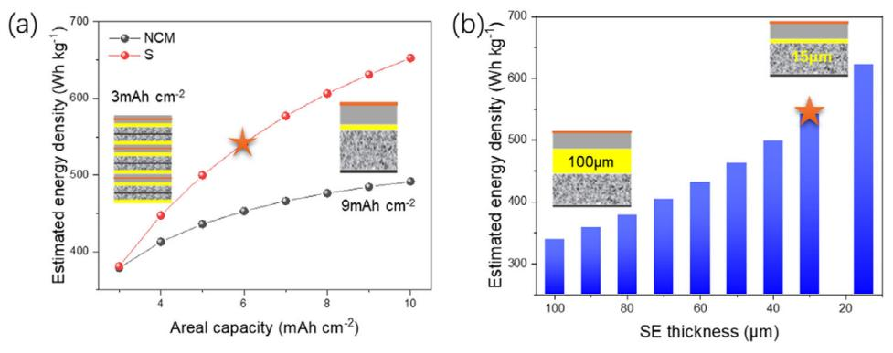

**Figure 1.** Estimated energy density of the solid state (SE density: 2 g cm−3) lithium metal batteries (LMBs, anode specific capacity: 2000 mAh g−1), tab and package materials are not included. a) With Ni-rich LiNi*x*Co*y*Mn(1-*x-y*)O2 (NCM) (negative to positive capacity ratio (N/P): 1, AM ratio in electrode: 80%, reversible capacity: 200 mAh g−1) or sulfur (N/P ratio = 2, AM ratio: 50%, AM utilization: 80%, reversible capacity: 1350 mAh g−1) as cathode material, of different *Careal*, SE thickness: 30 μm; b) with SE membrane of different thicknesses (Li-S battery, areal capacity: 6 mAh cm−2 as labeled by the pentacle in Figure 1a). The inserts scheme illustrates the effect of a thick electrode and thin SE on reducing the inactive materials. Other details are given in Tables S1–S3 (Supporting Information).

several high-quality review papers concerning DPT were published recently,[\[24–26\]](#page-15-0) while most of them concentrated on the tech or contribution to the electrodes. Limited attention was paid to several basic issues, such as failure of physical interlock under mechanical or electrochemical stress, the adaptability to composite materials with different mechanical properties, to name but a few. Herein in review, we briefly recalled the history and theory of the dry processing technique, summarized the advances and limitations in electrode/SE applications, and hopefully, it could shed some light on future research directions.

# **2. Overview of Electrode Fabrication Techniques**

## **2.1. State-of-the-Art (SOA) Electrode Fabrication Technique**

SOA LIB electrodes are mainly manufactured through the wet slurry casting roll-to-roll processes, which involve sequential steps of mixing, coating, drying, and calendering. These steps influence the electrode's microstructure, thereby determining the final battery's performance.[\[27–29\]](#page-15-0) Electrode formulations (e.g., ratios of conductive additive and binder) and microstructural characteristics (e.g., *Careal*, ɛ, and ) are typically optimized through extensive experiments and simulations.

**Table [1](#page-2-0)** and **[Figu](#page-15-0)re [2](#page-2-0)** list the specific parameters of typical commercial LIBs,[30–36] either for high-power or high-energy applications. Power-type batteries usually employ lower areal capacity and higher porosity, whereas energy-type uses higher areal loading and reduced porosity. Notably, Tesla's 4680 battery cell demonstrates the highest reported areal capacities (cathode: 5.00 mAh cm−2, anode: 5.49 mAh cm−2), with its anode fabricated by dry processing technology.[\[31\]](#page-15-0)

With growing demands for advanced batteries, researchers and engineers are focusing on innovative manufacturing techniques. Recent studies highlight methods to produce thick electrodes with high AM loadings and precisely controlled microstructures, aiming to enhance the energy and power capabilities simultaneously. Representative innovations including template-assisted fabrication,[\[37–41\]](#page-16-0) field-assisted manufacturing,[\[42\]](#page-16-0) 3D printing,[\[43,44\]](#page-16-0) and multilayer or gradient electrode technology.[\[45–47\]](#page-16-0) Sacrificial templating (such as ice[\[37,38\]](#page-16-0) or wood[\[41\]](#page-16-0) ), magnetic field[\[39,40\]](#page-16-0) or laser[\[42\]](#page-16-0) assisted alignment to construct ordered pore channels within the electrodes, thereby engineering low-tortuosity microstructures that mitigate ionic transport constraints in high-loading electrodes. However, electrodes with such vertically channels usually exhibit inferior mechanical stability and limited tolerance to the compaction process. It may also lead to compromised electronic conduction. 3D printing relies on precise tuning of the slurry rheological properties to optimize its compatibility with the printing process.[\[43,44\]](#page-16-0) During extrusion through the nozzle, the slurry experiences high shear rates, requiring shear-thinning behavior to ensure smooth flowability. Upon deposition the substrate, rapid viscosity recovery is critical to retain the deposited architecture and enable self-supporting capability.

Multilayer electrode enables the application of slurries with varying component ratios, on the one hand, it enhances process adaptability and stability by preventing binder migration during drying (which causes uneven distribution)[\[48\]](#page-16-0) and suppresses the cracks in thick electrodes.[\[49\]](#page-16-0) On the other hand, it allows precise microstructure regulation in each layer through component proportion adjustments, thereby improving electron/ion transport efficiency to synergistically boost both energy density and power density. Bak et al.[\[45\]](#page-16-0) studied the trilayered LiNi0.6Co0.2Mn0.2O2 (NCM622) electrodes with distinct binder distributions: top-to-bottom incremental gradients (IG), uniform dispersion (UD), and decremental gradients (DG), in which significant binder-dependent performances was demonstrated: the UD ones exhibited optimal characteristics: the highest adhesive strength, superior electronic conductivity, and minimal interfacial resistance. This can be attributed to the uniform electrode having abundant charge transport pathways throughout its entire thickness, thereby maintaining a constant potential gradient across the electrode and achieving optimal performance. Zhou et al.[\[46\]](#page-16-0) prepared the gradient-structured electrodes with thickness-directional particle size variation via a dual-layer

**Table 1.** Electrode parameters of typical commercial LIBs.

| No. | Cell                 | Manufacturer | Capacity, Ah | Active material |          | Electrode area, cm2 |         | Electrode thickness, μm |       | Careal mAh cm−2 a) |       | Porosity b) |       | Refs.   |
|-----|----------------------|--------------|--------------|-----------------|----------|---------------------|---------|----------------------------|-------|--------------------|-------|-------------|-------|---------|
|     |                      |              |              | Cathode         | Anode    | Cathode             | Anode   | Cathode                    | Anode | Cathode            | Anode | Cathode     | Anode |         |
| 1   | M1A-18650            | A123         | 1.01         | LFP             | Graphite | 794                 | /       | 162                        | 82    | 1.27               | 1.4   | 0.26        | 0.25  | [30]    |
| 2   | BYD blade 135Ah   | BYD          | 135          | LFP             | Graphite | 56398.65            | 59935.2 | 160                        | 140   | 2.39               | 2.63  | /           | /     | [31]    |
| 3   | LFP6228082           | CATL         | 161.50       | LFP             | Graphite | 58960               | 63280   | 200                        | 147   | 2.74               | 3.01  | 0.32        | 0.32  | [32]    |
| 4   | 25R-18650            | Samsung      | 2.57         | NCA             | Si/C     | 1036                | /       | 86                         | 86    | 2.48               | 2.73  | 0.09        | 0.21  | [30]    |
| 5   | 30Q-18650            | Samsung      | 3.09         | NCA             | Si/C     | 1032                | /       | 104                        | 96    | 2.99               | 3.29  | 0.09        | 0.25  | [30]    |
| 6   | VTC5A-18650          | Sony         | 2.56         | NCA             | Si/C     | 1024                | /       | 101                        | 108   | 2.50               | 2.75  | 0.13        | 0.27  | [30]    |
| 7   | VTC6-18650           | Sony         | 3.16         | NCA             | Si/C     | 952                 | /       | 116                        | 116   | 3.32               | 3.65  | 0.15        | 0.38  | [30]    |
| 8   | Model S NCR18650B | Panasonic    | 3.10         | NCA             | Si/C     | 765.6               | 780     | 140                        | 180   | 4.05               | 4.45  | /           | /     | [33]    |
| 9   | Model 3 NCR21700  | Panasonic    | 4.78         | NCA             | Si/C     | 1082                | 1125    | 143                        | 174   | 4.42               | 4.86  | /           | /     |         |
| 10  | 48G-21700            | Samsung      | 4.84         | NCA             | Si/C     | 989                 | /       | 153                        | 180   | 4.89               | 5.38  | 0.13        | 0.22  | [30]    |
| 11  | HB4-18650            | LG           | 1.54         | NCM111          | Graphite | 778                 | /       | 125                        | 101   | 1.97               | 2.17  | 0.26        | 0.24  | [30]    |
| 12  | HB2-18650            | LG           | 1.53         | NCM523          | Graphite | 848                 | /       | 113                        | 103   | 1.8                | 1.98  | 0.28        | 0.23  | [30]    |
| 13  | LG E78               | LG           | 79.90        | NCM712          | Graphite | 17442               | 18872   | 188.5                      | 242.6 | 4.58               | 5.04  | 0.219       | 0.224 | [34]    |
| 14  | HG2-18650            | LG           | 3.02         | NCM811          | Si/C     | 929                 | /       | 114                        | 120   | 3.25               | 3.58  | 0.17        | 0.25  | [30]    |
| 15  | M50-21700            | LG           | 5.00         | NCM811          | Si/C     | 1027                | 1047    | 167                        | 182   | 4.87               | 5.34  | 0.25        | 0.335 | [35]    |
| 16  | Model Y Tesla4680 | Telsa        | 23.13        | NCM811          | Graphite | 4630                | 4825    | 174                        | 252   | 5.00               | 5.49  | /           | /     | [31,36] |

a) The cathode areal capacity is calculated by dividing the tested or nominal capacity by the cathode coating area, while that of the anode is calculated by assuming a negativeto-positive capacity ratio (N/P) of 1.1; b) Porosity is estimated based on the inferred electrode composition and material density.

coating technique, it demonstrated that the gradient design electrode, which is composed of small particles near the current collector (CC) side and large particles near the separator side, substantially reduced the non-uniformity of the local state of charge (SOC) and contributed to the overall AM utilization during cycling in high-loading electrodes. Xie's group[\[47\]](#page-16-0) engineered triple gradient LiFePO4 (LFP) electrodes with distribution modulation of the AM particles, conductive agent, and porosity through combining suction filtration with the phase inversion method, achieving a high *Careal* of ≈9 mAh cm−2 under the loading of 56.6 mg cm−2.

The wet slurry processing techniques are facing critical challenges including drying-induced cracks, excessive energy consumption in the drying process, and reliance on hazardous solvents such as N-Methylpyrrolidone (NMP). To settle these issues, people are developing aqueous binder to eliminate toxic solvents, optimizing high-solid-content formulations during mixing/coating to minimize solvent utilization and drying energy

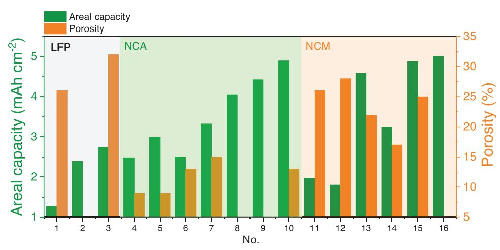

**Figure 2.** Areal capacity and porosity of the cathodes from typical commercial batteries.

input. These efforts are ultimately advancing toward the solventfree DPTs, a focal point of energy storage research in the past decade.

#### **2.2. Major Dry Processing Techniques (DPTs)**

Several DPTs were developed and some of them have already been adopted in other industrial fields. The introduction of Tesla's 4680 battery featuring dry-process electrodes has sparked research efforts in applying it to LIBs as well as solid-state batteries. Below is a brief introduction to typical DPTs applicable to the battery industry.

#### *2.2.1. Direct Powder Compaction (DPC)*

DPC typically involves compressing the homogeneous powder mixture of AM, conductive additive (CA), and binder into the electrode layer under high pressure using molds and then combining it with the current collector (CC). Sufficient densification necessitates extreme compression forces, often followed by post-processing heat treatment. For instance, Hu et al.[\[50\]](#page-16-0) preheated the mixture of LFP, polyvinylidene difluoride (PVDF), and CA at 270 °C for 1 h, followed by hydraulic pressing at 100–300 psi. By which ultra-thick LFP electrodes (up to 1 mm) with exceptional *Careal* (≈15 mAh cm−2) were fabricated, demonstrating excellent rate performance (C/10: ≈98% utilization, C/5: ≈95%, C/2: ≈76%). Walker and coworkers[\[51\]](#page-16-0) fabricated solvent and binder-free LiNi0.5Co0.2Mn0.3O2 (NCM523) cathodes by incorporating porous graphene. Through mechanical milling to ensure the homogeneous blending followed by a 5 min compression at 20–25 MPa, the resulting high loading electrode (≈26 mg cm−2) demonstrated remarkable AM utilization, and the authors attribute it to the unique dry compressibility and non-tortuous ion transport pathways of porous graphene.

# *2.2.2. Dry Powder Spray Deposition (DPSD)*

DPSP technique employs a positively charged spray gun and a negatively connected CC to establish an electric field. Dry powder particles are propelled through the nozzle via carrier gas (e.g., N2) while acquiring charge and accelerated motion under the electric field. followed by deposition onto the CC, hot calendering is implemented to finalize the electrode formation. Typically, PVDF binder is utilized, and the calendering temperature is set around the binder's melting point (≈177 °C) to enhance particle bonding and structural integrity. This methodology has been successfully applied to fabricate electrodes for various LIB materials, including NCM,[\[52–54\]](#page-16-0) LiCoO2 (LCO),[\[55,56\]](#page-16-0) Li4Ti5O12 (LTO),[\[57,58\]](#page-16-0) and graphite,[\[59\]](#page-16-0) demonstrating its versatility across cathode and anode.

## *2.2.3. Powder Extrusion Moulding (PEM)*

The PEM process typically requires high polymer content, sacrificial binders such as polypropylene (PP), paraffin wax (PW), or stearic acid (SA) is used.[\[60\]](#page-16-0) The process initiates with the uniform blending of binder and CA with the AM particles, followed by thermal fusion of the mixture. Subsequently, it was introduced into a screw extruder for shear-enhanced homogenization and controlled shaping into electrodes with specific thickness. Post-processing selectively removes the polymer binder via thermal decomposition, ultimately enabling the formation of interconnected porosity within the electrode architecture. Sotomayor et al.[\[60\]](#page-16-0) developed LIBs featuring ultra-thick (≈500 μm) LTO/LFP electrodes, the electrode with a mass loading of ≈100 mg cm−2 demonstrated *Careal* exceeding 13 mAh cm−2. Thick LCO electrodes with a high mass loading of 180 mg cm−2 using the PEM process was also reported, and the *Careal* is as high as 17 mAh cm−2 at C/25 and 7 mAh cm−2 at C/6.25, respectively.[\[61\]](#page-16-0) However, the PEM process exhibits inherent particle size sensitivity, necessitating precise regulation of temperature profiles, shear stress gradients, and dwell time during operation. Furthermore, its practical scalability also faces challenges such as high energy consuming in polymer melting/sintering, complex manufacturing protocols, which constrain its broader industrial adoptions.

# *2.2.4. Binder Fibrillation (BF)*

The BF process utilizes fibrillate binders (primarily polytetrafluoroethylene, PTFE), which are thoroughly mixed with the AM and CA particles. The mixture is subjected to high shear forces to fibrillate the binder, generate nanofibers that entangle the particles without coating their surfaces, and form the self-standing film. Subsequently, it was laminated onto the CC via hot calendering to produce the final electrode. Tesla has successfully implemented it to fabricate graphite anodes for its 4680 battery cells.[\[36\]](#page-15-0) Recent studies on the BF technique focus on powder blending homogeneity, the fibrillation process, new binder, and performance benchmarking against conventional slurry-cast methods. For instance, Tao et al.[\[62\]](#page-16-0) demonstrated that dry-blending homogeneity of AM, CA, and binder critically governs the electrode morphology, component distribution uniformity, and PTFE fibrillation efficiency, thereby directly impacting mechanical robustness and electrochemical performance of the electrode. Shen et al.[\[63\]](#page-16-0) developed ultra-thick LCO electrodes (up to 1170 μm) through a designed CA/binder composite synthesized from carbon nano tube (CNT) and PTFE, achieving an areal loading of 101 mg cm−2. Matthews's group[\[64\]](#page-16-0) used advanced microscopy techniques to resolve the structural details of PTFE fibers, revealing nanofibril network formation mechanisms. Specifically, the rough surfaces of AM first anchor the binder, then under mutual shear forces, PTFE is fibrillated into fibrous structures. Studies also demonstrated that the AM particle morphology (spherical vs flake geometries)[\[65\]](#page-16-0) and chemistry[\[66,67\]](#page-16-0) also effect the dry-process compatibility and performance.

While solvent-free DPT exhibits scenario-specific applicability, binder fibrillation and dry powder spray deposition demonstrate the highest industrialization potential. These methodologies enable continuous roll-to-roll (R2R) manufacturing, a critical advantage for seamless integration with existing commercial LIB production infrastructure.

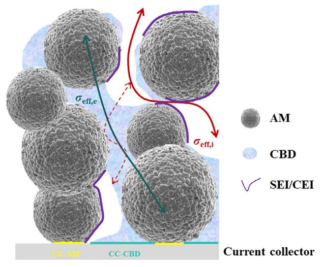

Figure 3. Typical electrode microstructural characteristics and key quantitative descriptors.

#### 2.3. Merits of DPTs

The electrodes directly govern the cell's electrochemical performance and energy density. As illustrated in Figure 3, the electrode's microstructural characteristics and critical parameters including: 1) AM volume fraction dictating theoretical capacity[68]; 2) the contact area ratio of carbon-binder domain (CBD) to the CC (CC-CBD) or AM particles (CC-AM) which dictates electron transport between the electrode and the out circuit; 3) effective electronic conductivity ( $\sigma_{eff,e}$ ) influenced by microstructure, content as well as the dispersion of the CA particles; 4) porosity ( $\varepsilon$ , including the micropores in the CBD) which largely affect the effective ionic conductivity ( $\sigma_{eff,i}$ ); 5) the exposed AM surface, which usually covered by CEI or SEI. It is worth mentioning that CBD plays a vital role in the electrode, as it is not only the major pass for electron, but also Li+ conductive due to the electrolyte filling within it. Besides, similar to solid state batteries, the triple points where ion/electron/AM met are the energy storage locations, otherwise, parasitic reactions would inevitably lead to the generation of SEI or CEI.

DPT creates a fibrillated binder network and allows the CAs to mainly coat the AM surface. This carbon-binder distribution feature increases the pore space among particles while reducing the tortuosity $[14,15,58]$  (Figure 3), which thus lower the ionic transport resistance and enhances fast-charging capability.[37,38] Furthermore, DPT also simplified the fabrication of solid electrolyte films and electrodes used for solid-state batteries, especially for those sensitive to moisture, which makes it a vital technique for the future battery industry.

### 3. Dry Processing Electrodes for Lithium-Ion **Battery using Liquid Electrolytes**

As previously discussed, DPT abandons the drying process, realizes the direct integration of AM, CAs, and binders through solid-solid combination, and makes high areal capacity possible. However, powder compaction, spray deposition, and powder extrusion moulding are rarely adopted in the LIB industry due to the technique complexity as well as high expense. While the BF technique was widely studied especially after the commercial application by Tesla. Currently, it encounters various technical challenges, such as the kinetic limitation (which is common in thick electrodes), lithiation of PTFE under low potential, which may destroy the anode structure integrity. Herein, we will analyze bottlenecks and optimization strategies, hopefully to offer new insights for the advancement of next-generation lithium batteries.

#### 3.1. Dry Processing Cathode

BF is regarded as a key path for preparing thick electrodes with those energy dense cathodes (including nickel-rich layered oxides such as LiNi0.8Co0.1Mn0.1O2 short as NCM811, Li-rich layered oxides,  $xLi_2MnO_3$ ·(1-x)LiMO2, short as LLO) to break through the energy density bottleneck of 300 Wh kg-1. Although DPT can hinder the electrodes from cracking in the drying process, while thick electrode does not guarantee high areal capacity as the longer ion/electron passway inevitably affect the battery kinetics or AM utilization.[69] It's widely accepted that ion transport is usually the dominate factor,[70] and it is the concentration gradient in the electrode thickness direction that lead to the local SOC difference. Based on the pioneer works of Newman[71,72] and Johns,[73] Gallagher et al. $[74]$  derived the concept of electrolyte penetration depth (Equation 3),  $L_d$ , to quantify the point where Li+ concentration drops to zero in the electrode (which is also the point where the AM can be utilized) under certain current density ( $I$ ):

$$L_d = \frac{\varepsilon}{\tau} \frac{D_0 C_0 F}{(1 - t_+) I}$$
 (3)

Where  $\varepsilon$  is the porosity of the electrode,  $\tau$  is the tortuosity factor of the pore matrix,  $F$  is the Faraday constant,  $C_0$  is the Li+ concentration in the electrolyte,  $D_0$  and  $t_{\perp}$  is the diffusion coefficient and transference number of the Li+, respectively. Obviously,  $L_d$ was controlled by both the electrode parameters  $\left(\frac{\varepsilon}{\varepsilon}\right)$  and that of electrolyte ( $D_0$ ,  $C_0$  and  $t_+$ ). Therefore, to overcome the limitations of DP thick electrodes and improve their kinetic performances, researchers conducted works on both electrode architecture via the adoption of dimensional CA, functional binder or additive, as well as electrolyte optimizations to promote Li+ migration.

Electrode porosity and tortuosity are the core parameters that affect the kinetics performance. They regulate the distribution of ion transport pathways and reaction interfaces, affecting the electrode's ion transport, mechanical strength, as well as electrolyte storage capacity.[75,76] While to attain high volumetric energy density, porosity of LIB electrodes is usually set within a narrow range according to the AM characteristics as listed in Table 1. Therefore, reducing tortuosity became the ultimate goal of thick electrode research.

Pore structure optimization, such as combining the nanoscale pores to larger ones or creating a uniform and open pore structure thus to ensure high connectivity and freedom of ion path selection, are effective strategies to reduce the tortuosity without increasing the porosity. He et al.[77] introduced flour into the DP LCO electrode fabrication by replacing part of the PTFE. It was found that flour facilitates the formation of large pores, which

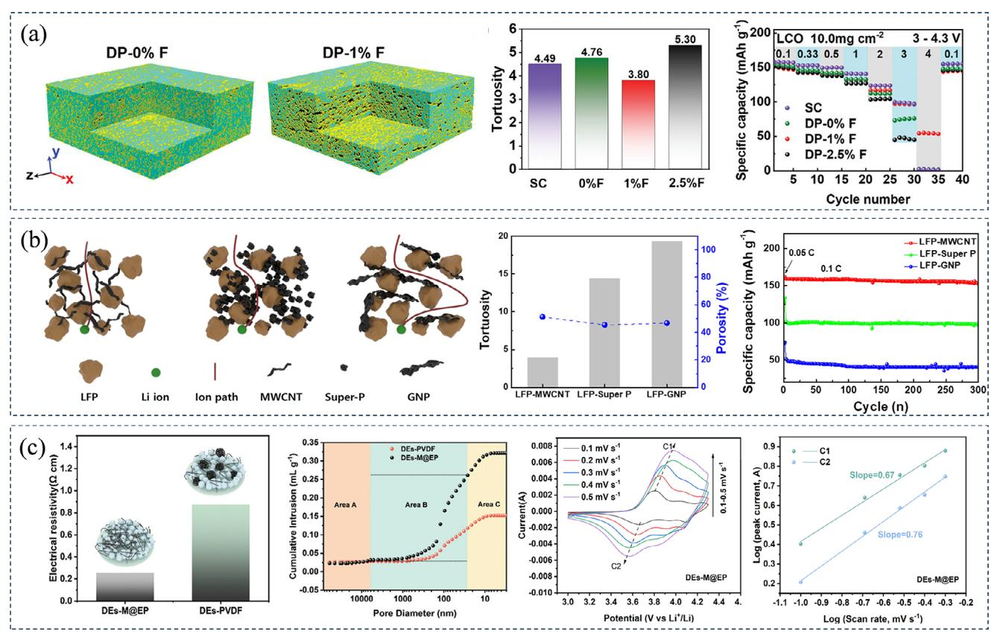

**Figure 4.** The influence of pore structures on battery performances. a) Nano-CT results of DP-0%F and DP-1%F electrodes, comparison of tortuosity between different electrodes, and rate performance of the LCO electrodes. Reproduced with permission.[\[77\]](#page-16-0) Copyright 2024, Wiley. b) Schematic diagram of the ion path in the LFP electrodes using different CAs, comparison of tortuosity and porosity, and long-term cycling performances at 0.1C. Reproduced with permission.[\[78\]](#page-16-0) Copyright 2025, Wiley. c) Surface resistance and the cumulative intrusion-pore size curve of DEs-M@EP and DEs-PVDF, CV scans and the corresponding peak current vs scan rate plots demonstrated the enhanced kinetics. Reproduced with permission.[\[79\]](#page-16-0) Copyright 2025, Wiley.

thus reduces the electrode tortuosity and endowing the DP– 1%F electrode with improved kinetic behavior. As depicted in **Figure 4**a, nano-CT clearly shows the small pores in the electrode using no flour (DP-0%F), they merged into larger ones in DP-1%F and reduced the from 4.76 to 3.80 simultaneously. As a result, the electrode demonstrates much enhanced rate capability even under 4.0C rate.

Morphology and distribution of the CA have a significant influence on pore structure, thus affecting the charge transport pathways.[\[80,55\]](#page-16-0) Therefore, intensive efforts were made to CA optimization in the DPT study. Jin et al.[\[78\]](#page-16-0) prepared DP LFP electrodes using 0D Super P, 1D multi-walled carbon nanotubes (MWCNTs), or 2D graphene nanoplatelets (GNPs) and found that their microstructure can largely influence the resultant porosity and tortuosity. Specifically, the fibrous 1D MWCNT with a highly interconnected network structure and large surface area is effective in reducing the (Figure 4b). In contrast, the compact structure of GNP and agglomeration of Super P increased the and hinders the migration of Li+ within the electrode. As a result, the high loading electrodes (≈42 mg cm−2) using different CAs demonstrated distinct AM utilization even under a 0.1C rate. While it must be declared that even dispersion of the CAs is also vital for the electrode performances. Using 0D porous Ketjen Blacks (KB), 1D single-walled carbon nanotubes (SWC- NTs), and 2D graphene, Oh et al.[\[12\]](#page-15-0) prepared NCM811 electrodes with the areal capacity up to 20 mAh cm−2. The electrode demonstrated a very low of 1.3 when using porous 0D KB because of its high porosity and high specific surface area, the electrode showed the best performances even its electronic conductivity is lower than the one using SWCNT. They attributed the inferior performance to the high aspect ratio and morphological characteristics of SWCNT which led to uneven dispersion.

In DP thick electrodes, function of the binder not only limit to adhesive but also regulates the electrode microstructure and affect the charge transport.[\[15,64,81,82\]](#page-15-0) Therefore, binder optimization became another way to enhance the kinetics performance of the DP electrodes. Zhu et al.[\[79\]](#page-16-0) designed a conductive binder composed of MWNTs and epoxy resin (EP), namely M@EP, which significantly improved the dispersion of MWNTs thus provided continuous electronic transport pathways by forming a 3D crosslinked network. The abundant ether groups (C─O─C) and nitrogen elements in EP promote the dissociation and migration of Li+ through coordination interactions, ensuring stable electrochemical performance of the thick electrodes. As shown in Figure 4c and M@EP enabled the formation of a 3D conductive network in the NCM811 electrodes, result in a significant reduction of the resistance to 0.25 Ω cm. Additionally, DEs-M@EP exhibits a larger pore size than the one using PVDF, which

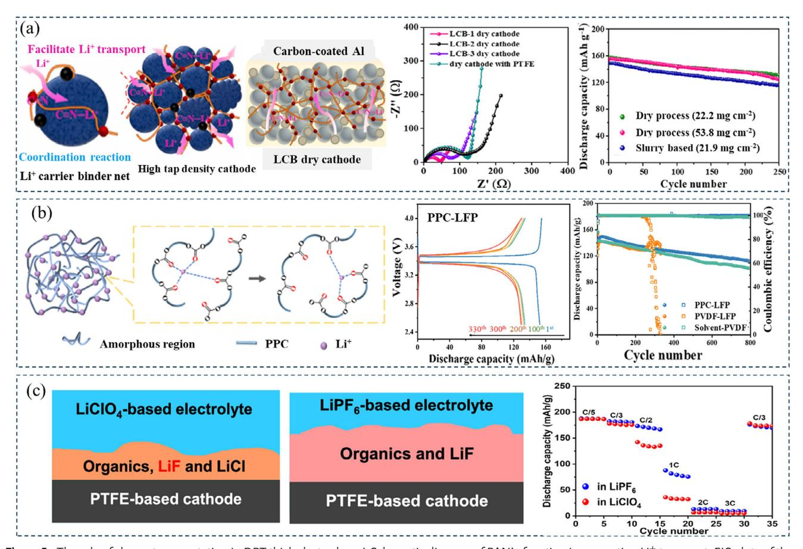

**Figure 5.** The role of charge transportation in DPT thick electrodes. a) Schematic diagram of PAN's function in promoting Li+ transport, EIS plots of the electrodes using different binders after the first cycle, and the cycling performances. Reproduced with permission.[\[84\]](#page-16-0) Copyright 2025, Elsevier Ltd. b) Ion conduction mechanism of PPC, charge–discharge and cycling performance of PPC-LFP batteries at 0.5 C. Reproduced with permission.[\[86\]](#page-16-0) Copyright 2023, Springer Nature. c) Schematic diagram of the CEI formed by LiPF6 or LiClO4 electrolyte and rate performance of the DP electrodes using different electrolytes. Reproduced with permission.[\[87\]](#page-16-0) Copyright 2023, American Chemical Society.

enhanced its ability to accommodate more electrolyte thus to accelerate the ion transportation. CV curves further confirm its enhanced Li+ diffusion capability. Similarly, Shen et al.[\[63\]](#page-16-0) prepared ultra-thick LCO electrodes with a high AM ratio (≥98 wt.%) and a cross-linked conductive network using a binder composed of PTFE and CNT. The uniformly distributed binder significantly reduces the battery resistance. As a result, the LCO electrode demonstrates excellent cycling performance and rate capability even with an ultra-high areal loading of 101.4 mg cm−2.

Introducing functional groups capable of dissociate and transport Li+ into the binder can suppress the concentration gradient, thus improve the AM utilization in thick electrodes.[\[83\]](#page-16-0) Wang et al.[\[84\]](#page-16-0) developed a novel lithium carrier composite (LCB) composed of PTFE and polyacrylonitrile (PAN), among which PAN provides an additional ion transfer carrier by the C≡N─Li+ interactions, which facilitates uniform distribution of the electrolyte and rapid Li+ transport (**Figure 5**a). The NCM523 cathode fabricated using LCB-1 exhibits the lowest interfacial resistance, and the high-loading electrode (53.8 mg cm−2) retains 80.8% of its initial capacity after 250 cycles at 0.5C. Kang et al.[\[85\]](#page-16-0) introduced a dual adhesive system (PC-PTFE) termed the bollard hitch model, in which poly(acrylic acid) (PAA) grafted carboxymethyl cellulose (CMC), acts as the "bollard," firmly attached to the PTFE "anchor." PAA and CMC contain abundant polar functional groups (-COOH and -OH) promoted Li+ transfer between adjacent polar sites. The 30 mg cm−2 high-loading NCM622 cathode prepared using the PC-PTFE matrix exhibits higher porosity and lower tortuosity than the one using PTFE, facilitating easier electrolyte penetration. The battery delivers a high capacity of 139.2 mAh g−1, with a capacity retention of 83% after 100 cycles at 1/3C. Zhang et al.[\[86\]](#page-16-0) successfully prepared LiFePO4 cathodes using Li+ conductive and biodegradable polycarbonate propylene carbonate (PPC) binder. PPC has a low glass transition temperature (36.5 °C), offering advantages for low-temperature processing. Further, the intensive polar carbonate groups (─O─(C═O)─O─) which form moderate-strength coordination with Li+, could facilitate ion migration (Figure 5b). The PPC-LFP cathodes exhibit no significant capacity decay, with a capacity of 129.7 mAh g−1 after 330 cycles. At 0.5 C, the initial specific capacity is 141.9 mAh g−1 (solvent-PVDF is 143.25 mAh g−1). After 800 stable cycles, the discharge capacity remains at 112.2 mAh g−1, which is higher than that of solvent-PVDF (101.3 mAh g−1).

As illustrated in Equation [\(3\)](#page-4-0), electrolytes play a decisive role in the kinetics performance of the cell. While due to the universality for thick electrodes, limited works were reported in terms of DP electrodes. Tao et al.[\[87\]](#page-16-0) investigate the interaction between PTFE-based high-loading DP electrodes and various electrolytes based on LiPF6 or LiClO4. Their study confirmed that when using LiClO4 electrolyte, PTFE, as the sole fluorine source, undergoes decomposition reactions to form LiF. This finding directly proves the existence of electrochemical side reactions involving PTFE in the cathode. As shown in Figure [5c,](#page-6-0) although the LiPF6 electrolyte forms a thicker cathode electrolyte interphase (CEI), its high ionic conductivity enables more efficient Li+ transport and results in significantly enhanced high-rate performance than the LiClO4 one. Considering the different microstructures brought about by DPT, as well as the special characteristics of the DPT binders (such as the hydrophobic of PTFE), it is necessary to strengthen the research on electrolyte so that to better fulfill the requirements of DPT thick electrodes.

#### **3.2. Dry Processing Anode**

Similar to the case in the cathode, DPT attracted lots of research interests for the merits in thick electrode preparation. However, it encounters additional challenges due to the lithiation of PTFE which not only leads to active Li loss, but also may destroy the anode structure integrity,[\[88\]](#page-16-0) which affect the rate capability and cycle life of the electrodes.[\[89–91\]](#page-16-0) Therefore, a thorough investigation and resolution of these challenges are essential for advancing the application of DPT, thereby enhancing the overall performance of LIBs.

To address the issues associated with PTFE, current research mainly focuses on inhibiting its decomposition via coating/electrolyte engineering to form a protective layer, or employing alternative binders. Like other electrochemical reactions, lithiation of PTFE takes place at the point where it meets both Li+ and an electron, therefore, an ion or electron insulating physical barrier can effectively hinder the parasitic reaction. While considering the fibrillation process as well its function in the electrode, certain deformability is required for the barrier.

To ensure intimate contact with the PTFE fiber, the coating layer should be formed after the fibrillation process. Therefore, Wei et al.[\[19\]](#page-15-0) coated graphite particles with poly(ethylene oxide) (PEO), which is ionic conductive but electrical insulating, to interrupt the contact between PTFE and graphite particles. The polymer coating transferred to the PTFE fiber surface during calendaring and thus inhibits the reduction of PTFE. As a result, the initial coulombic efficiency (ICE) of the graphite/Li half cells increased from 69.5% to 90.9%. Similarly, Lee et al.[\[92\]](#page-16-0) used PEO and poly(vinylidene fluoride-trifluoroethylenechlorofluoroethylene) (P(VDF-TrFE-CFE)) as the coatings for graphite (**Figure 6**[a\)](#page-8-0). Among them, P(VDF-TrFE-CFE) has a high dielectric constant, which can effectively mitigate Li+ polarization and reduce the hindrance to ion transport, enabling effective regulation of the electric field distribution at the electrode/electrolyte interface and further enhancing the solid electrolyte interphase (SEI) stability. As shown in Figure [6a,](#page-8-0) the ICE of the full cells increased from 67.2% (bare) to 79.1% (PEO coated) and 77.8% (P(VDF-TrFE-CFE) coated), and the corresponding initial discharge capacity also increased from 157.7 to 185.1 and 182.5 mAh g−1, respectively.

Electrolyte additives with a higher reduction potential than PTFE can also protect it from decomposition. Han et al.[\[93\]](#page-16-0) used fluoroethylene carbonate (FEC) as an additive to form a preemptive and stable SEI. As shown in Figure [6b,](#page-8-0) FEC significantly reduces the peak associate with PTFE decomposition due to its prior reduction, and relative symmetry evolution (after the first cycle) of the D and G bands occurs, exhibiting a higher ID/IG ratio (0.92) when using FEC electrolyte. Wei et al.[\[95\]](#page-16-0) developed an anodic film-forming additive, N-phenylbis(trifluoromethanesulfonimide) (PTFSI), with higher reduction activity than PTFE, which can preferentially reduce to form a thin and dense SEI to passivate PTFE before its reduction. Adding PTFSI alone to the electrolyte significantly increases the ICE of the graphite||Li half cell from 66.47% (without PTFSI) to 86.48%. The ICE of LiNi+ 0.75Mn0.25O2 (NM75)/graphite full cell increased from 50.94% to 78.2% when PTFSI was used as an additive, and the initial discharge capacity also increased from 158.8 to 227.7 mAh. Pouch cell using PTFSI additive demonstrated a high capacity retention of 80.5% and coulombic efficiency of 99.94% after 400 cycles.

Although inhibiting the reduction of PTFE can effectively enhance the batteries' cycle stability, it does not completely prevent the occurrence of lithiation. Acknowledging this limitation, some scholars proposed that other binders should be considered to replace PTFE. This includes the development of new nonfluorinated binders or the optimization of existing binder systems. Lee et al.[\[94\]](#page-16-0) proposed a binary binder system composed of PTFE and polyvinylpyrrolidone (PVP) (Figure [6c\)](#page-8-0), in which the vinylpyrrolidone (VP) monomer can participate in the formation of SEI by self-decomposition due to its lower LUMO value. The passivation effect of PVP prevents direct contact between PTFE and graphite, blocks the charge transfer pathway, and enhances the electrochemical performance. As shown in Figure [6c,](#page-8-0) PVP reduced the initial irreversible capacity from 48 (DG) to 24 (DG-P) mAh g−1, with ICE increased from 85.1% to 92.4%. After 10 cycles, EIS measurements revealed that the DG-P electrode exhibited lower impedance, further confirming its enhanced stability. Kim et al.[\[96\]](#page-16-0) presented a non-fluorinated styrene-butadiene rubber (SBR)-based binder that demonstrates unique physical properties as a pressure-sensitive adhesive (PSA). When subjected to external pressure at room temperature, the binder becomes highly viscous thus enabling DP electrode preparation, and it serves as an elastic support within the electrode when no pressure is applied. Additionally, PSA in DPT creates an open-channel interface, enhancing electrolyte contact with the graphite surface and promoting the formation of a thin, stable inorganic SEI, thereby reducing resistance and improving the battery performance. An electrode with a high areal capacity of 10.6 mAh cm−2 was achieved. Li et al.[\[97\]](#page-16-0) used a conductive polymer, polyaniline (PANI), as the binder for DP electrodes. PANI exhibits excellent conductivity and adhesion, serving as both binder and CA in the graphite anodes, which thus reduces the content of inactive components and eliminates the need for PTFE, thereby achieving higher discharge capacity and superior performance.

The primary challenge in DPT thick anodes is the capacity loss triggered by PTFE lithiation, which can be addressed through various strategies including protective coatings, controlled SEI formation, or alternative binder systems. These

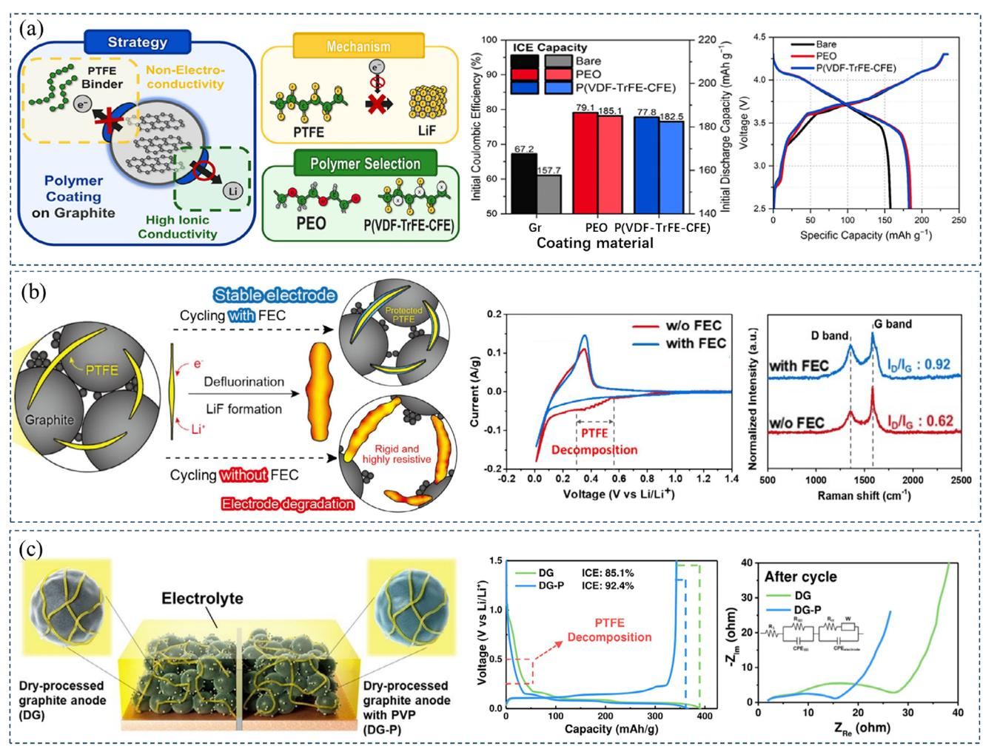

**Figure 6.** Strategies to suppress the reduction of PTFE. a) PEO or P(VDF–TrFE–CFE) coating. Reproduced with permission.[\[92\]](#page-16-0) Copyright 2024, American Chemical Society. b) FEC-derived SEI forms a physical barrier between PTFE and the charge, as illustrated by the CV curves and the Raman spectra after 1 cycle. Reproduced with permission.[\[93\]](#page-16-0) Copyright 2024, Elsevier Ltd. c) Schematic diagram of DPT graphite anode with or without PVP, voltage curves in the first cycle, and EIS spectra after 10 cycles of the electrodes. Reproduced with permission.[\[94\]](#page-16-0) Copyright 2024 Elsevier B.V.

strategies also enhance the overall stability and kinetics performance of the LIBs, offering novel perspectives for the development of high-energy-density batteries. While the limited binders available and equipment-dependent processing technique hinder the understanding as well as the utilization of the DPT. Leveraging simulation technology to optimize the electrode's microstructure, in conjunction with advanced characterization techniques, is expected to overcome the performance bottlenecks.

# **4. DPT for Solid-State Lithium Batteries**

Compared to conventional LIBs, all-solid-state lithium batteries (ASSLBs) simplify the internal structure and offer advantages in safety, energy density, and service life. It's much challenging to form charge percolation networks in the ASSLB electrodes than that for LIBs, which makes it less expense sensitive and gives more space to optimize the processing technique. DPT (mostly, cold or hot press classified as direct powder compaction,[\[17,98\]](#page-15-0) binder fibrillation[\[99–102\]](#page-17-0) was also reported) is currently widely adopted due to its nature of solvent free and limited binder utilization, as well as the capability to form ultra-thin solid electrolyte (SE) film or thick electrode, which can potentially avoid the SE from being contaminant, assure accelerated ion transportation and make higher energy density possible. Considering the high processiblity of soli polymer electrolytes (SPEs), here we will focus on inorganic solid electrolytes (ISEs) and ASSBs based on it.

# **4.1. Dry Processing Electrolytes**

The great advancements have pushed the bulk ionic conductivity of some ISEs beyond liquid electrolyte, while a thin film is usually required before these ISEs can be assembled into the ASSBs. Cold or hot press is currently still the dominate method in ASSBs investigation, during which the SE or a mixture of AM, SE, and CA particles with certain ratios are compressed into

|  |  |  | Table 2. Composition and characteristics of typical ISE films. |  |  |
|--|--|--|----------------------------------------------------------------|--|--|
|--|--|--|----------------------------------------------------------------|--|--|

| Electrolyte           | Binder and its utilization                           | Thickness/um | 𝜎/mS cm−1 | Refs. |  |
|-----------------------|------------------------------------------------------|--------------|-----------|-------|--|
| LGPS                  | PTFE, 1%                                             | 100          | 0.34      | [110] |  |
| Li5.4PS4.4Cl1.6       | PTFE, 0.2%                                           | 30           | 8.4       | [22]  |  |
| LPSCl                 | PTFE, 0.5%                                           | 18           | 0.85      | [111] |  |
| LPSCl                 | PTFE, 0.2%                                           | 40           | 8.4       | [112] |  |
| LPSCl                 | PTFE, 0.5%                                           | 15–20        | 1.7       | [102] |  |
| Li3InCl5              | PTFE, 0.5%                                           | 15–20        | 1.0       | [102] |  |
| Li6.5La3Zr1.5Ta0.5O12 | PTFE, 0.5%                                           | 15–20        | 0.52      | [102] |  |
| Li5.7PS4.7Cl1.3       | 0.5% PTFE with poly(ethylene vinyl acetate) scaffold | 40           | 1.1       | [101] |  |
| LPSCl                 | Polycaprolactone-based binder, 7%                    | 80           | 0.85      | [113] |  |
| LPSCl                 | Thermoplastic polyamide, 3%                          | 25           | 2.1       | [17]  |  |

pallets. Thermal treatment is largely depends on the mechanical properties of the ISE: for those sulfides (such as Li10GeP2S12 (LGPS), Li6PS5Cl (LPSCl)) with relatively low Young's modulus (typically, lower than 25 GPa[\[103–105\]](#page-17-0) ), cold press can realize intimate contact between SE and AM particles. While for those oxides such as Li7La3Zr2O12 (LLZO) whose Young's modulus is higher than 50 GPa,[\[106\]](#page-17-0) hot press is required.[\[107,108\]](#page-17-0) Through a pressure of 62 MPa, the relative density of Li5.95La3Zr2Al0.35O12 (LLZAO) increase to 86%, 97%, and 99% after sintering at 900, 1000, and 1100 °C, respectively. In the meantime, grain boundary impedance of LLZAO sintered at 1100 °C accounts for only 8% of the total impedance, which endow the SE a high total conductivity of 0.37 mS cm−1, which is close to the bulk.[\[109\]](#page-17-0)

The cold/hot press technique is no doubt a vital tool in prototype ASSB investigation, however, the thicknesses (typically, ≈500 μm) of these DPC films are too high to be commercially used. Therefore, the BF technique has been studied to fabricate thin SE films in recent years. **Table 2** lists some typical BF ISE films with their characteristics.

Type and ratio of the binder greatly influence the porosity of the SE film and affect the Li+ pathway in the SE film, thereby affecting the ionic conductivity.[\[111\]](#page-17-0) Through the fibrillation process, ultra-thin SE film with good flexibility can be prepared with low PTFE content of 0.5–2%,[\[102,112\]](#page-17-0) and less PTFE usually gave the SE film higher ionic conductivity due to its ion-insulating nature. Wang et al.[\[102\]](#page-17-0) prepared three kinds of SE films, LPSCl, Li3InCl5, and Li6.5La3Zr1.5Ta0.5O12 (LLZTO), with a thickness of only 15–20 um by adding 0.5% PTFE binder. The non-polar solvent process and the use of only 0.5% PTFE allowed the SE membrane to maintain the crystal structure of the SE and the small lithium-ion transport impedance. Therefore, the two films, LP-SCl and Li3InCl5, have high ionic conductivity of 1.7 and 1.0 mS cm−1, respectively. Li et al.[\[112\]](#page-17-0) prepared a 42 μm LPSCl film by hot pressing with only 0.2 wt.% PTFE. The film showed a high ionic conductivity of 8.4 mS cm−1. Meanwhile, the all-solid NCM622 battery using it provided an initial capacity of 161 and 115 mAh g−1 at 0.1 and 1C, respectively, the capacity retention is 86.4% after 1000 cycles at 1C. Li[\[112\]](#page-17-0) compared the cold-pressed SE films and cathode in the PEEK mold and the BF one. The CV and rate performance results show that the BF ASSB had less polarization and better rate capability. LNO@NCM622 coin cells have a capacity retention of 91% after 500 cycles at 4C, while cold-pressed ASSBs have almost no capacity at 4C. This is attributed to the unique fiber structure formed by PTFE that ensures tight contact between inorganic components with better ion transport, and the better flexibility of the SE and cathode membranes also improves interfacial contact, reducing stress and strain caused by volume changes during cycling.

Although flexible sulfide films can be prepared by the BF technique, the tensile strength is usually limited.[\[99\]](#page-17-0) In addition, similar to the case in LIB anode, PTFE is easily reduced and affected the interfacial stability with metal lithium,[\[87,99,114\]](#page-16-0) which is not conducive to the stable cycle of ASSB. Lee et al.[\[99\]](#page-17-0) investigated the side reactions of PTFE in LPSCl membranes, as shown in **Figure 7**[a.](#page-10-0) X-ray photoelectron spectroscopy (XPS) analysis shows that upon contact with Li metal, PTFE was defluorinated to form LiF and the conductive carbon species, while adjacent LP-SCl was reduced to Li2S. This reaction continuously propagates through PTFE fibers and eventually reaches the cathode side, which is confirmed by the same reduction products observed on the Li side. Therefore, it is still necessary to develop new binders or strategies for better flexibility and stable electrochemical properties of the DPT thin SE films.

A proper scaffold can not only enhance the structure stability, but also sometimes, alleviate the PTFE reduction under low potential. Fan et al.[\[101\]](#page-17-0) used a porous adhesive poly(ethylene vinyl acetate) (PEVA) scaffold in Li5.7PS4.7Cl1.3 film preparation. The product has a thickness of 40 μm, ionic conductivity of 1.1 mS cm−1 and a tensile strength of 74 MPa, as shown in Figure [7b.](#page-10-0) Azido-trimethyl silane (C3H9SiN3) was used as the interlayer to construct a Li3N-rich SEI, which effectively prevented the decomposition of PTFE. ASSLB using a composite cathode composed of Li2ZrCl5F (LZCF) electrolyte and NMC811 provided a discharge capacity of 182 mAh g−1 and ICE of 85.1%, it also showed excellent stability with a capacity retention of 86.7% after 200 cycles under 0.1C. The scaffolds can greatly improve the mechanical strength of the SE membranes, but it inevitably occupies a certain volume and weight of the film. Therefore, the ratio of skeleton must be controlled to achieve a balance between mechanical strength and ionic conductivity.

Some polymers or SPEs are considered as good binders due to their excellent flexibility and high ionic conductivity.[\[115,116\]](#page-17-0) Therefore, using those organics instead of PTFE to prepare SE films is another strategy to enhance the overall performance. Unlike the point contact formed by PTFE fiber,[\[16\]](#page-15-0) ion conductive polymers with solid-liquid phase transition or

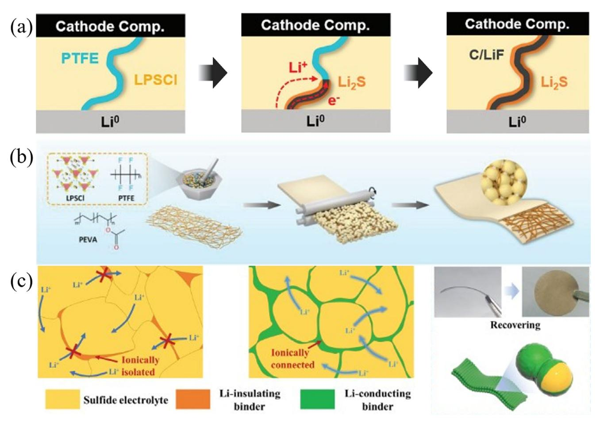

**Figure 7.** Issues in SE film fabrication using BF tech and strategies to settle them. a) Reaction between PTFE and lithium metal. Reproduced with permission.[\[99\]](#page-17-0) Copyright 2023, Wiley. b) PEVA skeleton support provides sufficient rigidity for the LPSC films. Reproduced with permission.[\[101\]](#page-17-0) Copyright 2024, Wiley. c) Low melting point and lithium conductive polymer binders PLI (prepared by adding LiTFSI and ionic liquid Pyr13TFSI to PCL) form a uniform coating on SE at 80 °C and facilitate the inter-particle ion transport.[\[113\]](#page-17-0)

thermoplastic characteristics can fill the voids among SE particles and endow the SE films with higher ionic conductivity. Taking advantage of the solid-liquid phase change of polycaprolactone (PCL), Su et al.[\[113\]](#page-17-0) achieved stronger fluidity and dispersion by introducing it into the DPT (Figure 7c). PCL's low melting point (80 °C) enables its complete infiltration into LPSCl particles and strong interparticle adhesion derived from the C═O and C─O─C groups in the molecular chain. Lithium-conductive polymer binders PLI were prepared by adding LiTFSI and ionic liquid Pyr13TFSI to PCL. The LPSCl-PLI subsequently prepared based on 7 wt.% PLI had excellent ionic conductivity at room temperature (8.5 × 10−4 S cm−1), which was higher than that of the film prepared with PTFE (1.5 × 10−4 S cm−1). Good lithiumion transport capacity and stable SE/Li interface make SE have ideal cycling performance (symmetric Li battery runs for 1300 h). Hu et al.[\[17\]](#page-15-0) also prepared ultra-thin LPSC film (≤25 μm) using a low-heat compression adhesive (≥140 °C, ≤5 MPa) made of low-viscosity thermoplastic polyamide (TPA). The film has a high ionic conductivity of 2.1 mS cm−1 at 25 °C. The lower viscosity of TPA provides a unique stress dissipation capability that prevents interface separation and mitigates uneven local stresses during ASSB operation, thereby enhanced the cycle performance. The cell assembled with NCM83(mass loading of 28.5 mg cm−2) and Li-In anode has excellent cycle stability, it provides an initial discharge capacity of 169.6 mAh g−1 at 0.2C and keeps 80% of its capacity after 700 cycles.

The mixing of polymer and oxide electrolytes can effectively improve the ionic conductivity of the solid polymer film[\[117\]](#page-17-0) and the electrochemical stability of the SE and SE/Li interface.[\[118\]](#page-17-0) Zhao et al.[\[119\]](#page-17-0) filled only 1 wt.% of LGPS particles into the PEObased electrolyte to increase the ionic conductivity of the composite film from 6.16 × 10−6 to 1.18 × 10−5 S cm−1 at 25 °C. Compared with the one without LGPS, the PEO film of 1wt.% LGPS did not show a significant impedance increase after 7 days of contacting with the Li anode, indicating that the incorporation of LGPS could effectively improve the interface stability between Li and PEO-based film, which might be ascribed to Lewis acid– base reactions between the LGPS surface states and the PEO segments. Chen et al.[\[120\]](#page-17-0) prepared CSE by adding LLZTO to PEO and LiTFSI, with a PEO: LiTFSI: LLZTO weight ratio of 50:40:10, the ionic conductivity reached 1.15 × 10−4 S cm−1 at 25 °C. LiFePO4|Li cell assembled with the CSE showed an initial discharge capacity of 139.1 mAh g−1 and a capacity retention of 93.6% at 0.2C and 55 °C after 100 cycles. However, due to the ag**Table 3.** Cathode components and performance in all-solid-state batteries.

| Cathode composition [wt.%]                                     | SE         | Anode | Areal loading                          | Cycle performance                                     | Refs.      |
|----------------------------------------------------------------|------------|-------|----------------------------------------|-------------------------------------------------------|------------|
| NCM622:LPNS $^a$ ):AB $^a$ ) 57.7:38.5:3.8                  | LPNS       | $\ln$ | 61.22 mg cm <math>-2</math> | 0.1C, 50 cycle, 91.7%                                 | $[129]$    |
| NCM622:LPS: $CNF^{a}$ , 70:25:5                                | <b>LPS</b> | $\ln$ | 31.25 mg cm <math>-2</math> |                                                       | [125, 130] |
| NCM811:LPSC:VGCF a ) 85:12.66:2.34               | LPSCI      | Li    | 122.4 mg cm <math>-2</math> | 0.2C, 50cycle, $>90\%$                                | $[126]$    |
| $LiCoO2:Li3InCl6$ , 85:15                                      | LPSCI      | Li/C  | 15 mAh cm <math>-2</math>   | 5 mA cm -2 , 100 cycle, $\sim$ 90%         | $[124]$    |
| $Li_2S:NbSe_2:Li_{5.25}PS_{4.25}ClBr_{0.75}$ 53.33:26.67:20 | LPSCI      | Li/In | 45.20 mg cm <math>-2</math> | 0.5C, 200 cycle, $95.1\%$                             | $[131]$    |
| S:VS 2 :LPS, 20:40:40                               | <b>LPS</b> | Li/In | 15.5 mg cm <math>-2</math>  | 0.12 mA cm <math>-2</math> , 10 cycle, 67% | $[132]$    |
| $LiCoO2:4-Aminobenzonitrile$ 99:1                           | LPSCI      | Li    | 3.06 mg cm <math>-2</math>  | 0.2C, 100 cycle, 77.2%                                | $[133]$    |
| NCM:LPSC:VGCF:PTFE 79.6:16.91:2.98:0.5                      | LPSCI      | Li/In | 5 mAh cm <math>-2</math>    | 1C, 500 cycle, $>95\%$                                | $[134]$    |
| $LTG_{0.25} PSSe_{0.2}^{a}$ , 100                              | LPSCI      | Li/Si | $2 \text{mAh cm}^{-2}$                 | 2.5C, 1000 cycle, 82.3%                               | $[135]$    |
| $Li_{13}$ Fe 12 Cl 4 , 100               | LZO/LPSCI  | Li/In | 3.8 mAh cm <math>-2</math>  | 5C, 3000 cycle, 90%                                   | $[136]$    |

a) LTG0.25PSSe0.2 = Li1.75Ti2(Ge0.25P0.75S3.8Se0.2)3, LPNS = (Li2S)8(P2S5)2(Ni3S2)1, AB = acetylene black, VGCF = vaper grown carbon fiber, CNF = carbon nanofiber.

glomeration of LLZTO particles, the conductivity of the prepared composite SE film (PEO:LiTFSI:PEG:LLZTO =  $10:60:5:85$ ) was  $6.24 \times 10^{-5}$  S cm-1. Therefore, although these fluorine-free organic polymers and doping strategies effectively avoid the side reaction of the film with the lithium anode, the large-scale production of composite SE films remains challenging.

In conclusion, DPT can significantly prevent the loss of crystal structure caused by the nucleophilic attack of solvents on SE during film preparation,[121] as well as the high cost recovery of organics. Currently, dry pressing SE films achieved satisfying ionic conductivity and thickness comparable to commercial polymer separators. However, on one hand, the mechanical properties of the SE films, especially under application circumstances, are yet to be verified. On the other hand, DPT is sensitive to many factors including shape, size, fluidity, as well as hardness of the particles, which makes the large-scale production quite challenging.

## 4.2. Dry Processing of the Electrodes

The cathode for ASSLBs is usually fabricated by compressing a mixture of AM, SE, and CAs with/without the binder in a mold using the DPT. Although DPT offers a convenient method, while the high proportion of inactive substances (SE, CA, and binders) inevitably reduces the battery energy density, moreover, interfacial compatibility among the components also challenges the battery cycle performance.[122,123] A stable and fast charge percolating network with minimal proportions of inactive species in the cathode is crucial for high energy ASSLBs.

# 4.2.1. Formation of the Ion/Electron Percolating Network

For embedding the cathode with certain conductivity, it is usually necessary to add 15–30 wt.%  $SE^{[124,125]}$  (Table 3). For AM with poor conductivity, such as S or Li2S, more than 50 wt.% of SE and CA are required to ensure the AM utilization.[125,126] However, poor SE/AM/CA contact not only restricts Li+ transport within the electrode,[127] but may also suffer from performance deterioration due to volume changes of the AM during cycling which could exacerbates the interfacial contact especially under high AM loadings.[128]

Numerous efforts have been devoted to address these kinetic or interfacial challenges related to the mechanical properties of the AM and SEs[137-140] by forming a flexible ion/electron percolating network. Many strategies were used to enhance the solid-solid contact inside the cathode, such as increasing the fabrication/stacking pressure, operating temperature, using SE with lower elastic modulus,[141] optimizing SE and AM particle sizes,[142,143] adopting binders with strong adhesion,[144] to name but a few. However, high tortuosity is still limiting the fast-charging capability of thick electrodes. Selecting proper  $AM[131,145]$  or SE,[146] using binders[147] with both ionic and electronic conductivity can be more conducive to forming a continuous percolation ion/electron network inside the cathode, which is extremely important for the design of thick electrodes. Particle size is one of the main factors affecting the solid-solid contact of AM/SE.[148] Ceder et al.[125] concluded that AM utilization in the high-loading cathode is highly dependent on the particle size ratio between AM (NCM) and SE (LPS) based on simulation and experiments. **Figure 8a** shows that increasing the particle size of SE results in a coarser seepage network, which is detrimental to  $Li^+$  conduction in the cathode. By increasing the AM particle size and decreasing that of SE, AM utilization can be effectively improved. The combination of larger AM particles with smaller SE particle sizes increases the likelihood of AM contact with the SE seepage network, which enabled the increased the AM proportion from 60 to 70 wt.% without affecting the AM availability.

Uniform SE coating on the AM surface can provide an efficient ion conduction path, increase the proportion of AM in the composite cathode, and reduce the interfacial side reactions. Kim et al.[126] prepared the core-shell structure composites by coating NCM811 with a thin LPSC shell via mechanical fusion as shown in Figure 8b. The core-shell structure ensures fluent ion conduction without compromising electron transport. Therefore, with a

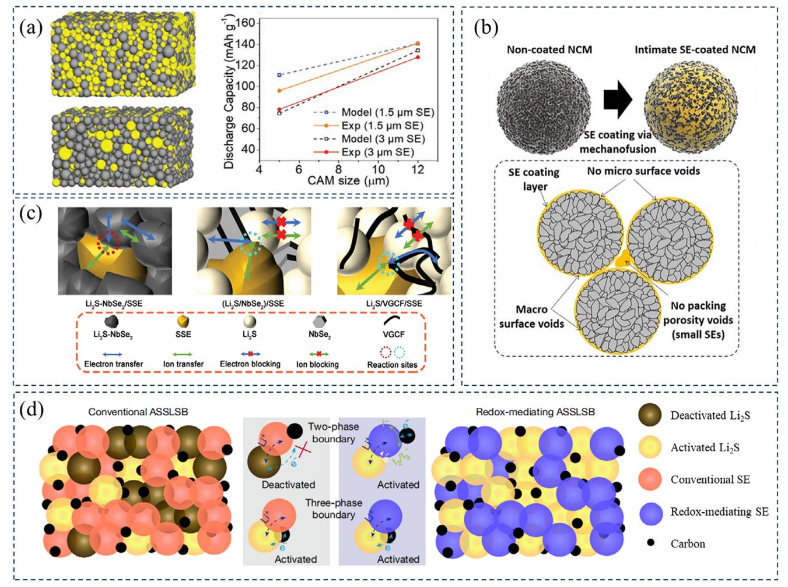

**Figure 8.** Charge transportation in the solid-state cathodes. a) Left: microstructure of the composite cathode (AM ratio: 80%) with different SE particle sizes, 3 μm (upper) and 5 μm (lower), and relationship between specific capacity and SE particle size (right).[\[125\]](#page-17-0) b) Illustration of the coating process and ion transport in the NCM cathodes.[\[126\]](#page-17-0) c) Redox mediators (the highly conductive Li2S/NbSe2) provide efficient charge transport paths in the cathode.[\[131\]](#page-17-0) Copyright 2024, Wiley. d) LBPSI can act as both an electron and an ion transport media. Reproduced with permission.[\[146\]](#page-17-0) Copyright 2025, Springer Nature.

high ratio up to 85 wt.% in the cathode, it showed a specific capacity of 198.88 mAh g−1 at 0.05C and a high volumetric energy density of 1258 Wh L−1 is achieved. Employing freeze-drying technology, Ma et al.[\[124\]](#page-17-0) coated LCO with 30 nm Li3InCl6 (LIC), which effectively avoided the side reactions between LCO and LPS. With 15 wt.% LIC added, the composite cathode achieved a specific capacity of 137.2mAh mg−1 (0.2C) and more than stable 7000 cycles at 20C at 9.4 mA cm−2. In contrast, the ball milling cathode only delivered a specific capacity of 123 mAh g−1 under the same conditions, with significant degradation after 2000 cycles at 20C due to the uneven coating.

Solid-state lithium-sulfur batteries (SLSBs) are potential candidates for next-generation energy storage devices with ultrahigh energy density. However, the inherently low ionic/electronic conductivity of sulfur and its derivatives, as well as the volume change (≈80%) during battery cycling placing stringent requirements on the conductive networks. Beyond adjusting particle size, integrating redox media into the cathode is an effective method to improve the conversion rate and reaction kinetics in SLSBs. Metal sulfides are considered good redox mediators because of their energy storage ability as well as compatibility with sulfur and sulfide electrolytes. Hu et al.[\[131\]](#page-17-0) developed a highly conductive material, Li2S/NbSe2 (LNS), which has a selfactivating effect. The interaction between Li2S and NbSe2 promotes the formation of NbSe2-XSX and Li2Se, which alters the conductivity and conversion pathways of the active substance as shown in Figure 8c. The composite cathode prepared with Li2S/NbSe2 and Li5.25PS4.25ClBr0.75 (80:20, by weight) achieved a high reversible capacity of 3.31 mAh cm−2 and an energy density of 394 Wh kg−1 at 25 °C, 1 C (4.35 mA cm−2). Notably, the capacity remained 93% after 100 cycles at 0.5 C. Xu et al.[\[132\]](#page-17-0) used VS2 due to its advantages of Li+ transport ability, electric conductivity, and effective capacity contribution. They prepared a S/VS2 and Li3PS4 (6:4, by weight) composite cathode and assembled the ASSB, which showed excellent sulfur utilization (≈85%), high coulombic efficiency (close to 100%), and good cycle stability. SEs can also be designed with the redox mediator function. Song et al.[146] constructed electron transport channels within the electrolyte using the redox reaction of lithium thioborophosphate iodide (LBPSI) glass-phase SE. Based on the reversible redox reaction between  $I^-$  and  $I_2/I_3^-$ , the electrolyte can be used as a transport medium for both ions and electrons (Figure 8d). The ASSB with C/S/LBPSI cathode, LBPSI SE, and Li/In anode demonstrates ultra-high fast charging capabilities. When  $n(P_2S_5)/n(P_2S_5+B_2S_3) = 0.17$ , LBPSI exhibited a specific capacity up to 1497 mAh  $g^{-1}$  (area capacity: 1.5 mAh cm-2) at 2C, and 447 mAh  $g^{-1}$  at 35C. The battery with a sulfur loading of 3.0 mg cm $-2$  (60 wt.% AM) also showed good cycling performance with a high specific capacity of 1004 mAh  $g^{-1}$  (3.0 mAh  $\text{cm}^{-2}$ ) at 1C (5.0 mA  $\text{cm}^{-2}$ ) and maintained at 810 mAh  $\text{g}^{-1}$  after 1000 cycles.

Similar to the conventional electrodes, the tortuosity factor  $(\tau)$  can also be used to describe the obstacle in charge transportation for the composite cathodes for ASSBs despite its much higher value due to its nature of multiphase as well as solid-solid contact.[149,150] The selective conductance of single-function conductors (SE, CA) causes electrons and ions via different ways, thereby slowing down the reaction kinetics. Therefore, many efforts have been made to prepare cathodes with unified electron/ion transport paths.[133,151] SE accounts for the largest proportion of inactive substances in the cathode and can be replaced in part or whole by AM or a binder that can transport ions. Transition metal sulfides such as chevrel-phase  $Mo_6S_8$  (MS) have electron conductivity comparable to Super P and a high Li+ diffusion coefficient comparable to common SEs. Therefore, Li et al.[152] prepared an all-electrochem-active (AEA) electrode with it and assembled the ASSLB with  $\text{Li}_{10}\text{GeP}_2\text{S}_{12}$ - $\text{Li}_3\text{PS}_4$  and Li metal anode (**Figure 9a**). MS converted to  $LiMo_6S_8$  (LMS) during the first lithation process, resulting in some irreversible capacity loss. However, LMS remains stable in subsequent cycles, proving its viability as a cathode. By combining 67.5 wt.% LMS with 32.5 wt.% S, energy density of the composite AEA cathode is higher than 770 Wh kg $-1$ . Similarly, Li et al.[150] used MS to replace the CA and SE to form electron/ion dual-carrier conductors (DCCs) and combine them with S to prepare the MS/S cathode of AEA, the ion  $\tau$  is reduced to 1–4 (Figure 9b). The thick electrode with 60 wt.% MS and 40 wt.% S (S loading: 4 mg cm-2) shows a high capacity of 1160 mAh  $g^{-1}$  in the first cycle at 0.5C.

Lithium transition metal oxides (LTMO) can also be used in single-phase cathodes. Xiong et al.[133] prepared a monophase homointerface (MH) all-solid-state electrode using LiCoO2 (LCO) and Li1.2Mn0.54Ni0.13-Co0.13O2 (LMNC). The MH cathode provides a stable ion/electron conducting interface, fundamentally eliminating the Li+ chemical potential gap of the multiphase interface, avoiding the inhomogeneous space charge layer and high interfacial resistance (Figure 9c). Using no SE, the MH cathodes can provide excellent high-voltage stability, MH-LCO and MH-LMNC can be charged up to 4.7 and 5.3 V without degradation, respectively. Moreover,  $D_{\text{I}i}^+$  of the LTMOs ranged in  $10^{-11}$ – $10^{-13}$  cm2  $S^{-1}$ , and the electronic conductivity between  $10^{-5}$ – $10^{-2}$  S cm-1, which make high loading possible. High loading ( $\approx$ 24 mg cm-2) MH-LCO cathode prepared via 950 °C sintering showed a capacity of 89.6 mAh  $g^{-1}$  with no capacity degradation after 20 cycles. While its volume change ( $\approx$ 2%) still influencing the long-term cycle stability. Cui et al.[44] prepared  $\text{Li}_{1.75}\text{Ti}_2(\text{Ge}_{0.25}\text{P}_{0.75}\text{S}_{3.8}\text{Se}_{0.2})_3$ 

 $(LTG_{0.25}PSSe_{0.2})$  with high Li+/electron conductance (Figure 9d) and used it in AEA configuration. The  $LTG_{0.25}PSSe_{0.2}/LPSC/Li-Si$ ASSB showed a capacity retention of 70% after 20 000 cycles at 2.5C and energy density of up to 390 Wh  $kg^{-1}$  at 0.1C. This is attributed to the stable and continuous ion/electron transport path due to the high conductivity of  $LTG_{0.25}PSSe_{0.2}$  (0.22/242 mS cm-1 when fully charged,  $0.66/412$  mS cm-1 when fully discharged) and the smaller volume strain during charge/discharge (1.2%). Similarly, Fu et al.[136] used  $\text{Li}_{1.3}\text{Fe}_{1.2}\text{Cl}_{4}$ 's reversible  $\text{Fe}^{2+}/\text{Fe}^{3+}$ redox and rapid Li+/e- transport to achieve an energy density of 529.3 Wh kg-1 with the AEA cathode. Due to the highly reversible local Fe migration and excellent creep properties,  $\text{Li}_{1.3}\text{Fe}_{1.2}\text{Cl}_{4}/\text{Li}_{3}\text{YCl}_{6}/\text{Li-In}$  ASSLB maintains 90% capacity after 3000 cycles at 5C.

In summary, the DP electrode and SE achieved promising performances in the laboratory scale.[131,134] And by optimizing the manufacturing process, the energy density of ASSBs can also be effectively improved. Incorporating a thin SSE layer and a high loading (5 mAh  $cm^{-2}$ ), high AM (80 wt.%) cathode by co-rolling the SSE and cathode feeding, the ASSB reported by Lee[134] achieves a high energy density of more than 310 Wh kg $-1$  with stable cycles (500 times capacity maintained  $>80\%$ ) at low stack pressures (2 MPa). Rationally designed microstructure and percolation network in the electrodes can greatly enhance the electrochemical performances. However, for the sake of largescale preparation of ASSBs, lower stack pressure or even pressure free is necessary for application, which requires comprehensive optimization of both cathode and anode. As to cathode preparation, new binders could adapt the volume change of the cathode or the strain caused by the anode still need to be developed.

# 5. Perspective

The dry processing techniques, especially for binder fibrillation (BF) and direct powder compaction (DPC), are unquestionably essential for the development of the battery industry, both SOA lithium/sodium ion and the forthcoming all-solid-state lithium/sodium metal batteries. DPT has already illustrated its ability to fabricate both high-loading electrodes and ultra-thin SE films, which are vital for improving the energy density of the batteries. It must be mentioned that although no binder was used during the DPC process in ASSLMB SE or electrode fabrication and they can keep integrated under certain stack pressure, we believe that binder is necessary to make low stack pressure possible. Besides, there are still some scientific and technological issues to be considered:

# 5.1. Active Material Utilization in Thick Electrodes

As previously discussed, a longer traveling distance in thick electrodes inevitably leads to concentration gradients and reduces the AM utilization when a liquid electrolyte is used. Although it can be amended by reducing the electrode tortuosity or increasing  $Li^+$  diffusion coefficients of the electrolyte, while tortuosity control in DPT is still challenging. First, introducing SE into the electrode could largely relieve the concentration gradient, which has already been verified in the cells using both liquid[83] and

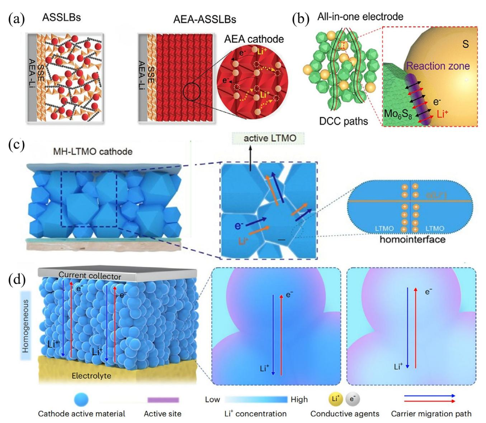

**Figure 9.** Strategy to mitigate the interfaces in the ASSB cathode. a) Schematic diagram of AEA cathode, all cathodes are composed of all-electrochemactive materials. Reproduced with permission.[\[152\]](#page-17-0) Copyright 2021, Springer Nature. b) Charge transport in the all-in-one electrode composed of MS and S. Reproduced with permission.[\[150\]](#page-17-0) Copyright 2022, American Chemical Society. c) The cathode of the fully active material composed of lithium transition metal oxides can provide a homointerface. Reproduced with permission.[\[133\]](#page-17-0) Copyright 2024, Springer Nature.d) high ionic/electron conductivity and small volume strain enable Li1.75Ti2(Ge0.25P0.75S3.8Se0.2)3 to prepare homogenized cathode materials. Reproduced with permission.[\[135\]](#page-17-0) Copyright 2024, Springer Nature.

solid electrolyte.[\[153\]](#page-17-0) While considering fibrillation of the binder is largely affected by the shear process, on which hardness of the particles (AM, CB, and SE) may influence the uniformity and stability of the products. Therefore, the fibrillation process of the binder is still to be investigated.

Second, ion conductive binder is also a direction worthy of study.[\[154\]](#page-17-0) Although the room temperature ionic conductivity of typical polymer single ion conductors is too low to be used in ASSLBs,[\[155\]](#page-17-0) while the intrinsic high lithium ion transference number may contribute in the cells using liquid electrolytes.

Besides, electrolyte is no doubt an essential method to relief the concentration gradient and realize high AM utilization as well as enhanced kinetics performances in thick electrode. In this consideration, promoted Li+ diffusion coefficient by reducing electrolyte viscosity[\[156\]](#page-17-0) or introducing a special additive[\[157\]](#page-18-0) are worth well for further investigation.

#### **5.2. Structure Stability of Ultra-Thin SE Films**

As the basis of ASSLMBs, ionic conductivity and mechanical properties (including shear modulus to tolerate the dendrite and tensile strength to make roll-to-roll production feasible) of the SE films are the most important characteristics to evaluate before its

mass production. In fact, SOA polyolefin separators (≈20 μm in thickness) show yield strength of several MPa in the transverse direction and more than 100 MPa in the machine direction,[\[158\]](#page-18-0) similar to typical nonwoven separators.[\[159\]](#page-18-0) With low binder content (as low as 0.1 wt.%[\[134\]](#page-17-0) ), the SE films are usually vulnerable to crack and a scaffold was usually required,[\[101\]](#page-17-0) which inevitably hinders the ion transportation. However, simply increasing the binder content may also reduce the ionic conductivity, not even to say the reduction of PTFE on contact with metal Li. In this consideration, on the first hand, new binders with better electrochemical stability and stronger adhesion is vital to be studied.[\[160\]](#page-18-0) And on the other hand, electric insulating interlayers used for anodefree cells[\[161–163\]](#page-18-0) can also potentially avoid the lithation of PTFE and thus stabilize the SE film. The combination of anode-free and thick electrode may greatly promote the advance of ASSLBs.

# **Supporting Information**

Supporting Information is available from the Wiley Online Library or from the author.

# **Acknowledgements**

This work is financially supported by National Key Research and Development Program of China (No. 2021YFB2500100), Major Program of National Natural Science Foundation of China (No. 22393964), Key R & D Plan of Henan Province (No. 241111241500), Major scientific and technological projects of Henan Province (No. 241100240200), National Natural Science Foundation of China (52202263), Guangdong Basic and Applied Basic Research Foundation (2023A1515011716) and "Pearl River Talent Program" Introduces High-level Talents (Young Top Talents) (No. 2021QN020176).

# **Conflict of Interest**

The authors declare no conflict of interest.

# **Keywords**

dry processing technique, energy density, high loading electrodes, lithium battery, thin solid electrolyte film

> Received: August 27, 2025 Revised: September 26, 2025 Published online:

- [1] J. Wu, X. Zhang, Z. Ju, L. Wang, Z. Hui, K. Mayilvahanan, K. J. Takeuchi, A. C. Marschilok, A. C. West, E. S. Takeuchi, G. Yu, G. Yu, *Adv. Mater.* **2021**, *33*, 2101275.
- [2] C. Lu, W. Wu, L. Wang, R. Tian, F. Du, *Next Mater.* **2024**, *4*, 100170.
- [3] D. J. Arnot, K. S. Mayilvahanan, Z. Hui, K. J. Takeuchi, A. C. Marschilok, D. C. Bock, L. Wang, A. C. West, E. S. Takeuchi, *Acc. Mater. Res.* **2022**, *3*, 472.
- [4] Q. Wang, M. Zhu, G. Chen, N. Dudko, Y. Li, H. Liu, L. Shi, G. Wu, D. Zhang, *Adv. Mater.* **2022**, *34*, 2109658.
- [5] Y.-F. Tian, G. Li, D.-X. Xu, Z.-Y. Lu, M.-Y. Yan, J. Wan, J.-Y. Li, Q. Xu, S. Xin, R. Wen, Y.-G. Guo, *Adv. Mater.* **2022**, *34*, 2200672.

- [6] W. Zuo, R. Li, X. Wu, Y. Guo, S. Zhou, B. Wen, J. Luo, L. Zhang, *Chem. Eng. J.* **2024**, *491*, 151977.
- [7] W. Qian, Y. Guo, W. Zuo, X. Wu, L. Zhang, *Mater. Chem. Front.* **2024**, *8*, 2556.
- [8] Y.-G. Lee, S. Fujiki, C. Jung, N. Suzuki, N. Yashiro, R. Omoda, D.-S. Ko, T. Shiratsuchi, T. Sugimoto, S. Ryu, J. H. Ku, T. Watanabe, Y. Park, Y. Aihara, D. Im, I. T. Han, *Nat. Energy* **2020**, *5*, 299.
- [9] Q. Li, Y. Yang, X. Yu, H. Li, *Chin. Phys. Lett.* **2023**, *40*, 048201.
- [10] K. B. Singh, M. S. Tirumkudulu, *Phys. Rev. Lett.* **2007**, *98*, 218302.
- [11] S. J. Tambio, F. Cadiou, E. Maire, N. Besnard, M. Deschamps, B. Lestriez, *J. Electrochem. Soc.* **2020**, *167*, 160509.
- [12] H. Oh, G.-S. Kim, J. Bang, S. Kim, K.-M. Jeong, *Energy Environ. Sci.* **2025**, *18*, 645.
- [13] W. Yao, M. Chouchane, W. Li, S. Bai, Z. Liu, L. Li, A. X. Chen, B. Sayahpour, R. Shimizu, G. Raghavendran, M. A. Schroeder, Y.-T. Chen, D. H. S. Tan, B. Sreenarayanan, C. K. Waters, A. Sichler, B. Gould, D. J. Kountz, D. J. Lipomi, M. Zhang, Y. S. Meng, *Energy Environ. Sci.* **2023**, *16*, 1620.
- [14] M. Ryu, Y. K. Hong, S. Y. Lee, J. H. Park, *Nat. Commun.* **2023**, *14*, 1316.
- [15] R. Tao, B. Steinhoff, X.-G. Sun, K. Sardo, B. Skelly, H. M. Meyer, C. Sawicki, G. Polizos, X. Lyu, Z. Du, J. Yang, K. Hong, J. L. Li, *Chem. Eng. J.* **2023**, *471*, 144300.
- [16] D. Lee, Y. Shim, Y. Kim, G. Kwon, S. H. Choi, K. Kim, D. J. Yoo, *Nat. Commun.* **2024**, *15*, 4763.
- [17] L. Hu, Y. Ren, C. Wang, J. Li, Z. Wang, F. Sun, J. Ju, J. Ma, P. Han, S. Dong, G. Cui, *Adv. Mater.* **2024**, *36*, 2401909.
- [18] J. M. Kim, S. H. Kim, N. Y. Kim, M. H. Ryou, H. Bae, J. H. Kim, S. Y. Lee, *iScience* **2020**, *23*, 101739.
- [19] Z. Wei, D. Kong, L. Quan, J. He, J. Liu, Z. Tang, S. Chen, Q. Cai, R. Zhang, H. Liu, K. Xu, L. Xing, W. Li, *Joule* **2024**, *8*, 1350.
- [20] A. Beharaj, E. Z. McCaslin, W. A. Blessing, M. W. Grinstaff, *Nat. Commun.* **2019**, *10*, 5478.
- [21] Z. Jiang, H. Peng, J. Li, Y. Liu, Y. Zhong, C. Gu, X. Wang, X. Xia, J. Tu, *J. Energy Chem.* **2022**, *74*, 309.
- [22] Z. Zhang, L. Wu, D. Zhou, W. Weng, X. Yao, *Nano Lett.* **2021**, *21*, 5233.
- [23] M. Balaish, J. C. Gonzalez-Rosillo, K. J. Kim, Y. Zhu, Z. D. Hood, J. L. M. Rupp, *Nat. Energy* **2021**, *6*, 227.
- [24] Y. Lu, C.-Z. Zhao, H. Yuan, J.-K. Hu, J.-Q. Huang, Q. Zhang, *Matter* **2022**, *5*, 876.
- [25] Y. Nikodimos, M. Ihrig, B. W. Taklu, W.-N. Su, B. J. Hwang, *Energy Storage Mater.* **2023**, *63*, 103030.
- [26] Y. Zhang, S. Lu, Z. Wang, V. Volkov, F. Lou, Z. Yu, *Renewable Sustainable Energy Rev.* **2023**, *183*, 113515.
- [27] X. Lu, S. R. Daemi, A. Bertei, M. D. R. Kok, K. B. O'Regan, L. Rasha, J. Park, G. Hinds, E. Kendrick, D. J. L. Brett, P. R. Shearing, *Joule* **2020**, *4*, 2746.
- [28] W. Sun, C. Huang, *J. Power Sources* **2024**, *611*, 234774.
- [29] M. Abdollahifar, H. Cavers, S. Scheffler, A. Diener, M. Lippke, A. Kwade, *Adv. Energy Mater.* **2023**, *13*, 2300973.
- [30] M. J. Lain, J. Brandon, E. Kendrick, *Batteries* **2019**, *5*, 64.
- [31] J. Gorsch, J. Schneiders, M. Frieges, N. Kisseler, D. Klohs, H. Heimes, A. Kampker, M. Muñoz Castro, E. Siebecke, *Cell Rep. Phys. Sci.* **2025**, *6*, 102453.
- [32] S. Stock, J. Hagemeister, S. Grabmann, J. Kriegler, J. Keilhofer, M. Ank, J. L. S. Dickmanns, M. Schreiber, F. Konwitschny, N. Wassiliadis, M. Lienkamp, R. Daub, *Electrochim. Acta* **2023**, *471*, 143341.
- [33] F. E. Hust, Dissertation, RWTH Aachen University, Aachen, Germany **2018**.
- [34] F. J. Günter, N. Wassiliadis, *J. Electrochem. Soc.* **2022**, *169*, 030515.
- [35] C. H. Chen, F. B. Planella, K. O'Regan, D. Gastol, W. D. Widanage,
  - E. Kendrick, *J. Electrochem. Soc.* **2020**, *167*, 080534.

- [36] M. Ank, A. Sommer, K. Abo Gamra, J. Schöberl, M. Leeb, J. Schachtl, N. Streidel, S. Stock, M. Schreiber, P. Bilfinger, C. Allgäuer, P. Rosner, J. Hagemeister, M. Rößle, R. Daub, M. Lienkamp, *J. Electrochem. Soc.* **2023**, *170*, 120536.
- [37] Z. Han, S. Li, R. Xiong, Z. Jiang, M. Sun, W. Hu, L. Peng, R. He, H. Zhou, C. Yu, S. Cheng, J. Xie, *Adv. Funct. Mater.* **2022**, *32*, 2108669.
- [38] C. Huang, M. Dontigny, K. Zaghib, P. S. Grant, *J. Mater. Chem. A* **2019**, *7*, 21421.
- [39] L. Li, R. M. Erb, J. Wang, J. Wang, Y.-M. Chiang, *Adv. Energy Mater.* **2019**, *9*, 1802472.
- [40] G. Cheng, H. Sun, H. Wang, Z. Ju, Y. Zhu, W. Tian, J. Chen, H. Wang, J. Wu, G. Yu, *Adv. Mater.* **2024**, *36*, 2312927.
- [41] S. N. Bryntesen, P. H. Finne, A. M. Svensson, P. R. Shearing, N. Tolstik, I. T. Sorokina, J. Vinje, J. J. Lamb, O. S. Burheim, *J. Mater. Chem. A* **2023**, *11*, 6483.
- [42] L. Hille, M. P. Noecker, B. Ko, J. Kriegler, J. Keilhofer, S. Stock, M. F. Zaeh, *J. Power Sources* **2023**, *556*, 232478.
- [43] S. Huo, L. Sheng, B. Su, W. Xue, L. Wang, H. Xu, X. He, *Adv. Mater.* **2024**, *36*, 2310396.
- [44] M. Li, S. Zhou, L. Cheng, W. Ren, L. Chen, S. Yu, J. Wei, *Energy Storage Mater.* **2024**, *72*, 103754.
- [45] C. Bak, K.-G. Kim, H. Lee, S. Byun, M. Lim, H. An, Y. Roh, J. Lim, C. B. Dzakpasu, D. Kim, J. Lee, H. Lee, H. Lee, Y. M. Lee, *Chem. Eng. J.* **2024**, *483*, 148913.
- [46] H. Y. Zhou, L. T. Gao, Y. M. Li, Y. H. Lyu, Z. S. Guo, *Electrochim. Acta* **2024**, *476*, 143656.
- [47] R. He, C. Cai, S. Li, S. Cheng, J. Xie, *Small.* **2024**, *20*, 2311044.
- [48] T. Lombardo, A. C. Ngandjong, A. Belhcen, A. A. Franco, *Energy Storage Mater.* **2021**, *43*, 337.
- [49] A. M. Boyce, E. Martínez-Pañeda, A. Wade, Y. S. Zhang, J. J. Bailey, T. M. M. Heenan, D. J. L. Brett, P. R. Shearing, *J. Power Sources* **2022**, *526*, 231119.
- [50] K. Hu, W. Fu, A. C. West, D. A. Steingart, *Batteries Supercaps* **2025**, *8*, 202400301.
- [51] B. A. Walker, C. O. Plaza-Rivera, S.-S. Sun, W. Lu, J. W. Connell, Y. Lin, *Electrochim. Acta* **2020**, *362*, 137129.
- [52] Z. Gao, J. Fu, C. Podder, X. Gong, Y. Wang, H. Pan, *J. Energy Storage* **2024**, *83*, 110605.
- [53] J. Liu, B. Ludwig, Y. Liu, Z. Zheng, F. Wang, M. Tang, J. Wang, J. Wang, H. Pan, Y. Wang, *Adv. Mater. Technol.* **2017**, *2*, 1700106.
- [54] M. Al-Shroofy, Q. Zhang, J. Xu, T. Chen, A. P. Kaur, Y.-T. Cheng, *J. Power Sources* **2017**, *352*, 187.
- [55] B. Ludwig, Z. Zheng, W. Shou, Y. Wang, H. Pan, *Sci. Rep.* **2016**, *6*, 23150.
- [56] B. Ludwig, J. Liu, I. M. Chen, Y. Liu, W. Shou, Y. Wang, H. Pan, *Adv. Mater. Interfaces* **2017**, *4*, 1700570.
- [57] D.-W. Park, N. A. Cañas, N. Wagner, K. A. Friedrich, *J. Power Sources* **2016**, *306*, 758.
- [58] C. Lv, W. He, J. Jiang, E. Zhen, H. Dou, X. Zhang, *J. Power Sources* **2023**, *556*, 232487.
- [59] J. Liu, B. Ludwig, Y. Liu, H. Pan, Y. Wang, *ACS Appl. Mater. Interfaces* **2019**, *11*, 25081.
- [60] M. E. Sotomayor, C. D. L. Torre-Gamarra, B. Levenfeld, J.-Y. Sanchez, A. Varez, G.-T. Kim, A. Varzi, S. Passerini, *J. Power Sources* **2019**, *437*, 226923.
- [61] D. del Rio-Santos, C. de la Torre-Gamarra, A. J. Fernández-Ropero, B. Levenfeld, A. Varez, *Ceram. Int.* **2024**, *50*, 32954.
- [62] R. Tao, B. Steinhoff, C. H. Sawicki, J. Sharma, K. Sardo, A. Bishtawi, T. Gibbs, J. Li, *J. Power Sources* **2023**, *580*, 233379.
- [63] X. Shen, H. Yu, L. Ben, W. Zhao, Q. Wang, G. Cen, R. Qiao, Y. Wu, X. Huang, *J. Energy Chem.* **2024**, *90*, 133.
- [64] G. A. B. Matthews, S. Wheeler, J. Ramírez-González, P. S. Grant, *Front. Energy Res.* **2024**, *11*, 2023.

- [65] J. H. Hwang, H. Yoo, S. Oh, H. Kim, *Electrochem. Commun.* **2024**, *165*, 107761.
- [66] Y. Zhang, F. Huld, S. Lu, C. Jektvik, F. Lou, Z. Yu, *Batteries* **2022**, *8*, 57.
- [67] R. Tao, B. Su, S. Thapa, K. Uzun, H. Alolaywi, X. Lyu, B. Steinhoff, K. Sardo, Z. Du, Y.-T. Cheng, C. Yuan, K. Z. Pupek, G. Polizos, J. Li, *Chem. Eng. J.* **2024**, *500*, 157194.
- [68] M. Duquesnoy, T. Lombardo, M. Chouchane, E. N. Primo, A. A. Franco, *J. Power Sources* **2020**, *480*, 229103.
- [69] K.-Y. Park, J.-W. Park, W. M. Seong, K. Yoon, T.-H. Hwang, K.-H. Ko, J.-H. Han, Y. Jaedong, K. Kang, *J. Power Sources* **2020**, *468*, 228369.
- [70] N. Ogihara, Y. Itou, T. Sasaki, Y. Takeuchi, *J. Phys. Chem. C* **2015**, *119*, 4612.
- [71] T. F. Fuller, M. Doyle, J. Newman, *J. Electrochem. Soc.* **1994**, *141*, 1.
- [72] M. Doyle, T. F. Fuller, J. Newman, *J. Electrochem. Soc.* **1993**, *140*, 1526.
- [73] P. A. Johns, M. R. Roberts, Y. Wakizaka, J. H. Sanders, J. R. Owen, *Electrochem. Commun.* **2009**, *11*, 2089.
- [74] K. G. Gallagher, S. E. Trask, C. Bauer, T. Woehrle, S. F. Lux, M. Tschech, P. Lamp, B. J. Polzin, S. Ha, B. Long, Q. Wu, W. Lu, D. W. Dees, A. N. Jansen, *J. Electrochem. Soc.* **2015**, *163*, A138.
- [75] S. Pinilla, F. M. Zanotto, D. Z. Dominguez, T. García, A. A. Franco, *Energy Storage Mater.* **2025**, *74*, 103818.
- [76] E. G. Sukenik, L. Kasaei, G. G. Amatucci, *J. Power Sources* **2023**, *579*, 233327.
- [77] R. He, W. Zhong, C. Cai, S. Li, S. Cheng, J. Xie, *Adv. Energy Mater.* **2024**, *14*, 2402109.
- [78] B. Kim, D. K. Kim, J. Yu, Y. Yoo, *Energy Environ. Mater.* **2025**, *8*, 70019.
- [79] P. Zhu, W. Zheng, L. Zhao, L. Liu, Y. Huang, J. Li, F. Li, *Small* **2025**, *21*, 2500107.
- [80] J. F. Baumgärtner, K. V. Kravchyk, M. V. Kovalenko, *Adv. Energy Mater.* **2025**, *15*, 2400499.
- [81] G. Matthews, B. Meyer, C. Doerrer, J. Ramírez-González, E. Darnbrough, N. Hallemans, D. Armstrong, P. S. Grant, *J. Mater. Chem. A* **2025**, *13*, 18283.
- [82] K. Huber, S. Stojcevic, Y.-C. Hsieh, E. B. Müftügil, J. Terada, C. Schriever, A. Kwade, *J. Energy Storage* **2025**, *124*, 116850.
- [83] Y. Guo, X. Wu, R. Li, M. Jia, B. Wen, L. Zhang, *J. Power Sources* **2025**, *648*, 237375.
- [84] F. Wang, Q. Han, Y. Guo, S. Ji, J. Wang, K. Li, L. Tian, S. Tang, W. Zhang, S. Cheng, Y.-C. Cao, *Composites, Part B* **2025**, *302*, 112541.
- [85] J. Kang, H. Eom, S. Jang, D. Yoo, H. Lee, M. Kim, M.-L. Seol, J. W. Han, I. Nam, H. Song, *Adv. Mater.* **2025**, *37*, 2416872.
- [86] Z. Zhang, D. Han, M. Xiao, S. Wang, Y. Feng, S. Huang, Y. Meng, *Ionics* **2023**, *29*, 3895.
- [87] R. Tao, S. Tan, H. M. Meyer III, X.-G. Sun, B. Steinhoff, K. Sardo, A. Bishtawi, T. Gibbs, J. Li, *ACS Appl. Mater. Interfaces* **2023**, *15*, 40488.
- [88] G. Li, R. Xue, L. Chen, *Solid State Ionics* **1996**, *90*, 221.
- [89] S. Zhang, *npj Comput. Mater.* **2017**, *3*, 7.
- [90] J. P. Maranchi, A. F. Hepp, A. G. Evans, N. T. Nuhfer, P. N. Kumta, *J. Electrochem. Soc.* **2006**, *153*, A1246.
- [91] K. Uzun, B. Sharma, B. R. Frieberg, M. Wang, J. Hu, A. Li, X. Huang, Y.-T. Cheng, *J. Electrochem. Soc.* **2024**, *171*, 020516.
- [92] T. Lee, J. An, W. J. Chung, H. Kim, Y. Cho, H. Song, H. Lee, J. H. Kang, J. W. Choi, *ACS Appl. Mater. Interfaces* **2024**, *16*, 8930.
- [93] S. Han, E.-H. Noh, S. Chae, K. Kwon, J. Lee, J.-S. Woo, S. Park, J. W. Lee, P. J. Kim, T. Song, W.-J. Kwak, J. Choi, *J. Energy Storage* **2024**, *96*, 112693.
- [94] J. Lee, C. Y. Son, S. Han, S. Yang, P. J. Kim, D. Lee, J. W. Lee, W.-H. Ryu, J. Choi, *Chem. Eng. J.* **2025**, *503*, 158271.
- [95] Z. Wei, D. Kong, L. Quan, J. Huang, S. Chen, X. Cao, R. Zhang, H. Liu, L. Xing, W. Li, *Energy Storage Mater.* **2025**, *75*, 104071.
- [96] J. Kim, J. S. Park, J.-j. Woo, S. Choi, J. Ma, J. Kim, S. F.-F Choi, *ACS Energy Lett.* **2025** ,*10*, 2670.

- [97] L. Yuan, H. Liu, X. Jiang, *J. Energy Storage* **2024**, *90*, 111912.
- [98] C. Doerrer, I. Capone, S. Narayanan, J. Liu, C. R. M. Grovenor, M. Pasta, P. S. Grant, *ACS Appl. Mater. Interfaces* **2021**, *13*, 37809.
- [99] D. J. Lee, J. Jang, J.-P. Lee, J. Wu, Y.-T. Chen, J. Holoubek, K. Yu, S.-Y. Ham, Y. Jeon, T.-H. Kim, J. B. Lee, M.-S. Song, Y. S. Meng, Z. Chen, *Adv. Funct. Mater.* **2023**, *33*, 2301341.
- [100] S. Kim, S. Shin, D. S. Jung, J. Chun, Y. C. Kang, J. H. Kim, *ACS Appl. Mater. Interfaces* **2024**, *16*, 10307.
- [101] D. Li, H. Liu, C. Wang, C. Yan, Q. Zhang, C. W. Nan, L. Z. Fan, *Adv. Funct. Mater.* **2024**, *34*, 2315555.
- [102] C. Wang, R. Yu, H. Duan, Q. Lu, Q. Li, K. R. Adair, D. Bao, Y. Liu, R. Yang, J. Wang, S. Zhao, H. Huang, X. Sun, *ACS Energy Lett.* **2021**, *7*, 410.
- [103] A. Sakuda, A. Hayashi, M. Tatsumisago, *Sci. Rep.* **2013**, *3*, 2261.
- [104] S. Song, C. Shi, A. Pakhare, B. W. Sheldon, P. R. Guduru, *ACS Appl. Energy Mater.* **2025**, *8*, 5636.
- [105] L. L. Baranowski, C. M. Heveran, V. L. Ferguson, C. R. Stoldt, *ACS Appl. Mater. Interfaces* **2016**, *8*, 29573.
- [106] M. Kotobuki, H. Munakata, K. Kanamura, Y. Sato, T. Yoshida, *J. Electrochem. Soc.* **2010**, *157*, A1076.
- [107] J. Zheng, J. Elgin, J. Shao, Y. Wu, *eScience* **2022**, *2*, 639.
- [108] W. E. Tenhaeff, E. Rangasamy, Y. Wang, A. P. Sokolov, J. Wolfenstine, J. Sakamoto, N. J. Dudney, *ChemElectroChem.* **2013**, *1*, 375.
- [109] I. N. David, T. Thompson, J. Wolfenstine, J. L. Allen, J. Sakamoto, B. Viyas, *J. Am. Ceram. Soc.* **2015**, *98*, 1209.
- [110] T. Jiang, P. He, Y. Liang, L.-Z. Fan, *Chem. Eng. J.* **2021**, *421*, 129965.
- [111] S. Yoon, S. H. Kang, J. Choi, J. Y. Kim, Y. G. Lee, Y. S. Park, D. O. Shin, *Small* **2025**, *21*, 2407882.
- [112] J. Li, Y. Li, S. Zhang, T. Liu, D. Li, L. Ci, *Chem. Eng. J.* **2023**, *455*, 140605.
- [113] Z. Su, Q. Zhou, J. Jin, S. Yang, G. Li, J. Zhang, *Adv. Sci.* **2024**, *11*, 2407798.
- [114] S.-B. Hong, Y.-J. Lee, U.-H. Kim, C. Bak, Y. M. Lee, W. Cho, H. J. Hah, Y.-K. Sun, D.-W. Kim, *ACS Energy Lett.* **2022**, *7*, 1092.
- [115] J. Han, M. J. Lee, K. Lee, Y. J. Lee, S. H. Kwon, J. H. Min, E. Lee, W. Lee, S. W. Lee, B. J. Kim, *Adv. Mater.* **2023**, *35*, 2205194.
- [116] Y. Fu, Z. Gu, Q. Gan, Y.-W. Mai, *Mater. Sci. Eng.: R: Rep.* **2024**, *160*, 100815.
- [117] H. Yang, N. Wu, *Energy Sci. Eng.* **2022**, *10*, 1643.
- [118] H. Yang, J. Bright, B. Chen, P. Zheng, X. Gao, B. Liu, S. Kasani, X. Zhang, N. Wu, *J. Mater. Chem. A* **2020**, *8*, 7261.
- [119] Y. Zhao, C. Wu, G. Peng, X. Chen, X. Yao, Y. Bai, F. Wu, S. Chen, X. Xu, *J. Power Sources* **2016**, *301*, 47.
- [120] L. Chen, Y. Li, S.-P. Li, L.-Z. Fan, C.-W. Nan, J. B. Goodenough, *Nano Energy* **2018**, *46*, 176.
- [121] Y. Nikodimos, C.-J. Huang, B. W. Taklu, W.-N. Su, B. J. Hwang, *Energy Environ. Sci.* **2022**, *15*, 991.
- [122] K. Yoon, J.-J. Kim, W. M. Seong, M. H. Lee, K. Kang, *Sci. Rep.* **2018**, *8*, 8066.
- [123] J. Auvergniot, A. Cassel, J.-B. Ledeuil, V. Viallet, V. Seznec, R. Dedryvère, *Chem. Mater.* **2017**, *29*, 3883.
- [124] T. Ma, D. Wu, Z. Wang, Z. Li, P. Lu, M. Yang, Q. Gao, Z. Jiang, L. Chen, H. Li, F. Wu, *Nano Energy* **2024**, *124*, 109522.
- [125] T. Shi, Q. Tu, Y. Tian, Y. Xiao, L. J. Miara, O. Kononova, G. Ceder, *Adv. Energy Mater.* **2019**, *10*, 1902881.
- [126] M. J. Kim, J.-S. Park, J. W. Lee, S. E. Wang, D. Yoon, J. D. Lee, J. H. Kim, T. Song, J. Li, Y. C. Kang, D. S. Jung, *Nano-Micro Lett.* **2025**, *17*, 119.
- [127] C. Yu, S. Ganapathy, E. Eck, H. Wang, S. Basak, Z. Li, M. Wagemaker, *Nat. Commun.* **2017**, *8*, 1086.
- [128] C. Yuan, W. Lu, J. Xu, *Energy Storage Mater.* **2023**, *60*, 102834.
- [129] B.-N. Yun, S. Lee, W. D. Jung, H.-J. Shin, J. T. Kim, S. Yu, K. Y. Chung, H. Kim, H.-G. Jung, *ACS Appl. Mater. Interfaces* **2022**, *14*, 9242.

- [130] H. Kim, M. J. Kim, M. S. Shin, H. N. Choi, I. Belharouak, Y. K. Sun, *Adv. Energy Mater.* **2025**, *15*, 2500867.
- [131] Y. Hu, Y. Liu, Y. Lu, Z. Zhang, S. Liu, F. He, Y. Liu, Y. Chen, F. Liu, *Adv. Funct. Mater.* **2024**, *35*, 2412070.
- [132] S. Xu, C. Y. Kwok, L. Zhou, Z. Zhang, I. Kochetkov, L. F. Nazar, *Adv. Funct. Mater.* **2020**, *31*, 2004239.
- [133] X. Xiong, X. Ma, T. Lv, L. Chen, L. Suo, *Sci. China: Chem.* **2024**, *67*, 1729.
- [134] D. J. Lee, Y. Jeon, J.-P. Lee, L. Zhang, K. H. Koh, F. Li, A. U. Mu, J. Wu, Y.-T. Chen, S. McNulty, W. Tang, M. Vicencio, D. Xu, J. Kim, Z. Chen, *Nat. Commun.* **2025**, *16*, 4200.
- [135] L. Cui, S. Zhang, J. Ju, T. Liu, Y. Zheng, J. Xu, Y. Wang, J. Li, J. Zhao, J. Ma, J. Wang, G. Xu, T.-S. Chan, Y.-C. Huang, S.-C. Haw, J.-M. Chen, Z. Hu, G. Cui, *Nat. Energy* **2024**, *9*, 1084.
- [136] J. Fu, C. Wang, S. Wang, J. W. Reid, J. Liang, J. Luo, J. T. Kim, Y. Zhao, X. Yang, F. Zhao, W. Li, B. Fu, X. Lin, Y. Hu, H. Su, X. Hao, Y. Gao, S. Zhang, Z. Wang, J. Liu, H. Abdolvand, T.-K. Sham, Y. Mo, X. Sun, *Nature* **2025**, *643*, 111.
- [137] C. Yuan, J. Xu, *Nano Energy* **2024**, *121*, 109193.
- [138] S. Farzanian, J. Vazquez Mercado, I. Shozib, N. Sivadas, V. Lacivita, Y. Wang, Q. H. Tu, *ACS Appl. Energy Mater.* **2023**, *6*, 9615.
- [139] S. Huang, B. Luo, Z. Zhang, Q. Wang, G. Yu, X. Bu, Z. Huang, X. Wang, W.-L. Song, J. Zhang, S. Jiao, *Chin. Chem. Lett.* **2024** ,110729, [https://doi.org/10.1016/j.cclet.2024.110729.](https://doi.org/10.1016/j.cclet.2024.110729)
- [140] R. Moschner, M. Gerle, T. Danner, E. K. Simanjuntak, P. Michalowski, A. Latz, M. Nojabaee, A. Kwade, K. A. Friedrich, *Adv. Sci.* **2025**, *12*, 2415436.
- [141] H. Nakamura, T. Kawaguchi, T. Masuyama, A. Sakuda, T. Saito, K. Kuratani, S. Ohsaki, S. Watano, *J. Power Sources* **2020**, *448*, 227579.
- [142] X. Bai, F. Xie, Z. Zhang, M. Cao, Q. Wang, S. Wang, C. Liu, X. Su, Z. Lin, G. Cui, *Adv. Energy Mater.* **2024**, *14*, 2401336.
- [143] W.-Z. Liu, X.-H. Meng, Z.-Y. Zhou, Q. Zheng, J.-L. Shi, Y. Gong, Y.-G. Guo, *J. Energy Chem.* **2024**, *98*, 123.
- [144] Z. Song, T. Zhang, S. Liu, W. Shao, W. Jiang, R. Mao, X. Jian, F. Hu, *SusMat* **2023**, *3*, 111.
- [145] J. Zhou, M. L. Holekevi Chandrappa, S. Tan, S. Wang, C. Wu, H. Nguyen, C. Wang, H. Liu, S. Yu, Q. R. S. Miller, G. Hyun, J. Holoubek, J. Hong, Y. Xiao, C. Soulen, Z. Fan, E. E. Fullerton, C. J. Brooks, C. Wang, R. J. Clément, Y. Yao, E. Hu, S. P. Ong, P. Liu, *Nature* **2024**, *627*, 301.
- [146] H. Song, K. Münch, X. Liu, K. Shen, R. Zhang, T. Weintraut, Y. Yusim, D. Jiang, X. Hong, J. Meng, Y. Liu, M. He, Y. Li, P. Henkel, T. Brezesinski, J. Janek, Q. Pang, *Nature* **2025**, *637*, 846.
- [147] Y. Li, Y. Wu, T. Ma, Z. Wang, Q. Gao, J. Xu, L. Chen, H. Li, F. Wu, *Adv. Energy Mater.* **2022**, *12*, 2201732.
- [148] F. Strauss, T. Bartsch, L. de Biasi, A. Y. Kim, J. Janek, P. Hartmann, T. Brezesinski, *ACS Energy Lett.* **2018**, *3*, 992.
- [149] G. F. Dewald, S. Ohno, J. G. C. Hering, J. Janek, W. G. Zeier, *Batteries Supercaps* **2020**, *4*, 183.
- [150] M. Li, H. Pan, T. Liu, X. Xiong, X. Yu, Y.-S. Hu, H. Li, X. Huang, L. Suo, L. Chen, *ACS Energy Lett.* **2022**, *7*, 766.
- [151] X. Xiong, T. Lin, C. Tian, G. Jiang, R. Xu, H. Li, L. Chen, L. Suo, *Nat. Commun.* **2024**, *15*, 3706.
- [152] M. Li, T. Liu, Z. Shi, W. Xue, Y.-S. Hu, H. Li, X. Huang, J. Li, L. Suo, L. Chen, *Adv. Mater.* **2021**, *33*, 2008723.
- [153] Y. Li, S. Song, H. Kim, K. Nomoto, H. Kim, X. Sun, S. Hori, K. Suzuki, N. Matsui, M. Hirayama, T. Mizoguchi, T. Saito, T. Kamiyama, R. Kanno, *Science* **2023**, *381*, 50.
- [154] L. Zhang, X. Wu, W. Qian, K. Pan, X. Zhang, L. Li, M. Jia, S. Zhang, *Electrochem. Energy Rev.* **2023**, *6*, 36.
- [155] Y. Luo, L. Gao, W. Kang, *J. Energy Chem.* **2024**, *89*, 543.

- [156] E. R. Logan, D. S. Hall, M. M. E. Cormier, T. Taskovic, M. Bauer, I. Hamam, H. Hebecker, L. Molino, J. R. Dahn, *J. Phys. Chem. C* **2020**, *124*, 12269.
- [157] L. Peng, C. Jian, X. Wu, Y. Ren, J. Luo, S. Zhang, L. Zhang, *Energy Storage Mater.* **2024**, *65*, 103192.
- [158] S. Kalnaus, Y. Wang, J. A. Turner, *J. Power Sources* **2017**, *348*, 255.
- [159] N. Lingappan, W. Lee, S. Passerini, M. Pecht, *Renew. Sustain. Energy Rev.* **2023**, *187*, 113726.
- [160] N. Zhang, W. Li, R. Li, H. Di, B. Wen, L. Zhang, *Small* **2024**, *20*, 2402164.
- [161] S. Lee, K.-S. Lee, S. Kim, K. Yoon, S. Han, M. H. Lee, Y. Ko, J. H. Noh, W. Kim, K. Kang, *Sci. Adv.* **2022**, *8*, abq0153.
- [162] J. Wan, X. Liu, T. Diemant, M. Wan, S. Passerini, E. Paillard, *Energy Storage Mater.* **2023**, *63*, 103029.
- [163] Z. Wang, J. Xia, X. Ji, Y. Liu, J. Zhang, X. He, W. Zhang, H. Wan, C. Wang, *Nat. Energy* **2024**, *9*, 251.

**Liu Yu** is a master's student of IPE, CAS. Her research focuses on the preparation and kinetic performance optimization of dry processing electrodes.

**Pengbo Fang** is currently a PhD candidate at IPE, CAS. His research interests are focused on the construction of high-specific-energy solid-state lithium-sulfur batteries.

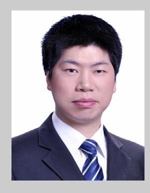

**Xiangkun WU** is currently an associate professor of IPE, CAS. His research interests include structural design and process optimization for lithium-ion batteries and lithium slurry batteries.

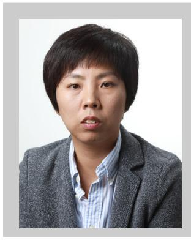

**Lan Zhang** is currently an associate professor of IPE, CAS. Her research interests are focused on advanced electrolytes (liquid and solid), functional binders, high energy cathode materials, as well as electrode structure optimization for lithium batteries.