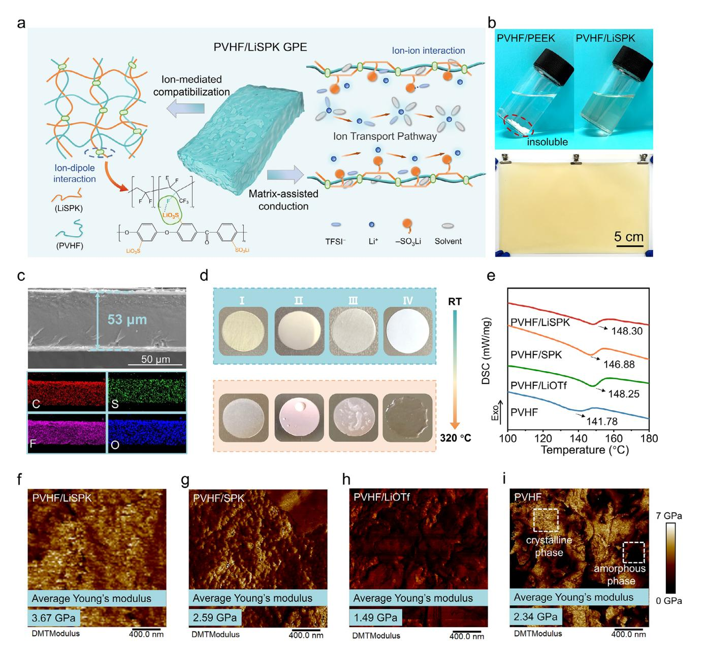
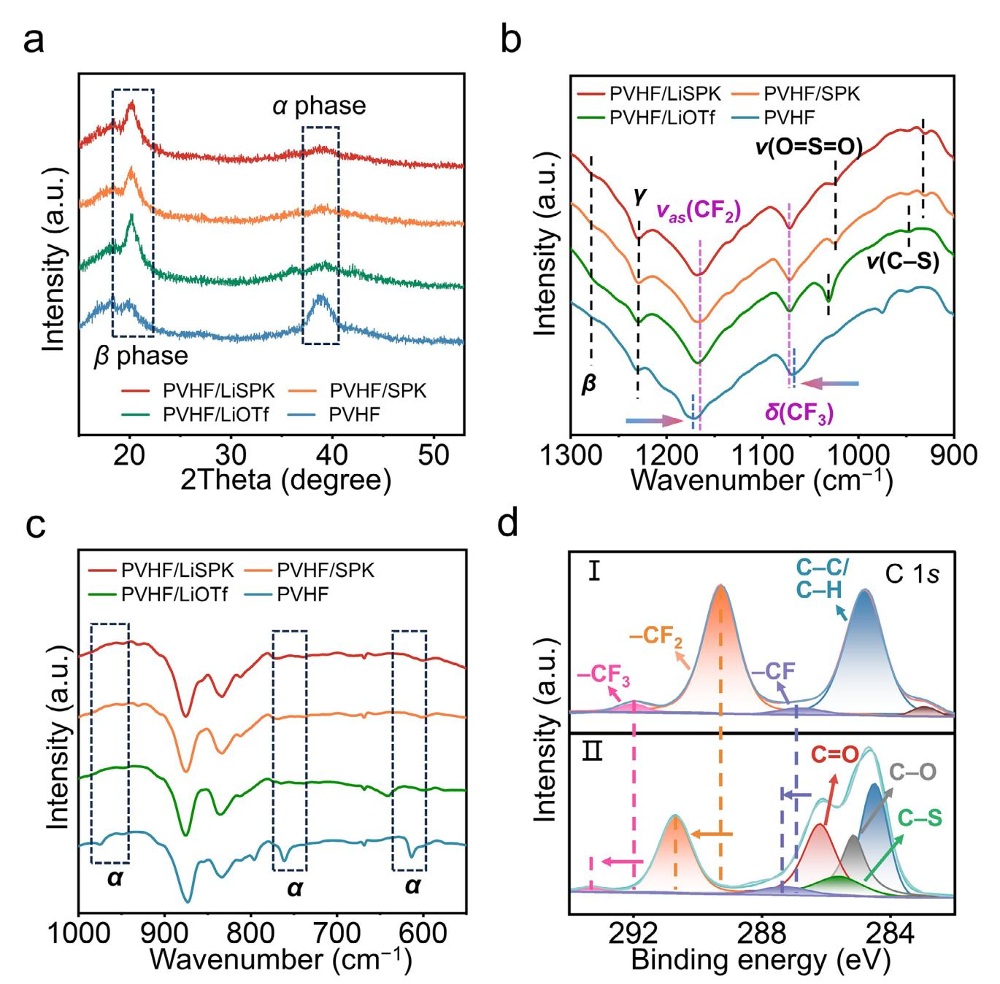
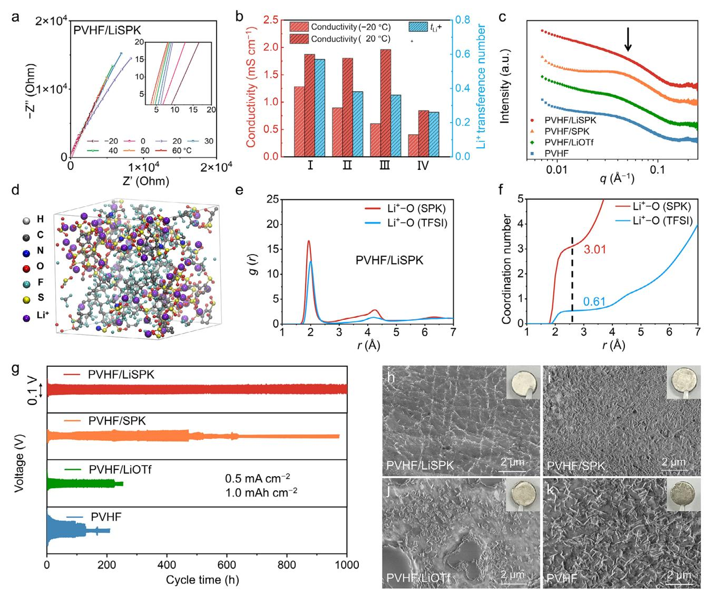
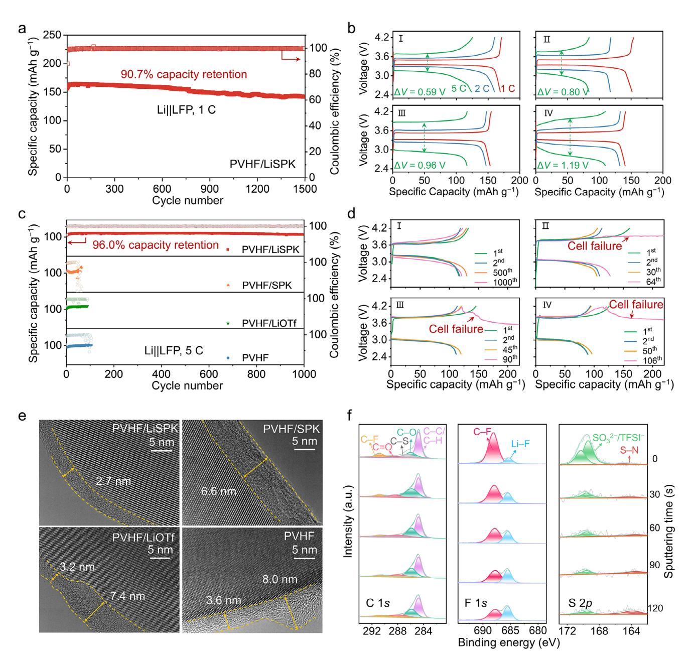
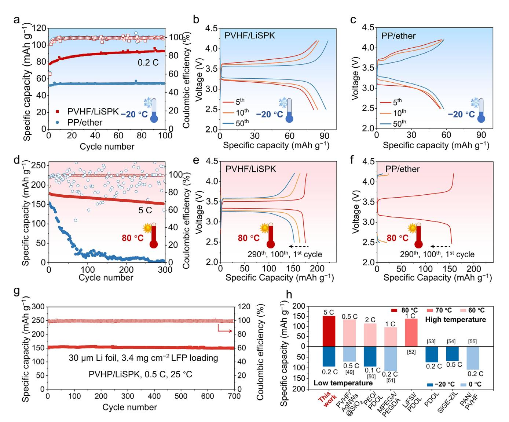

# **Composite Gel Electrolytes with Ion-Mediated Compatibilization and Matrix-Assisted Conduction for Wide-Temperature Lithium Metal Batteries**

*Bingxin Qi, Chi Wang, Hanpei Liu, Xiaoyue Li, Wen Yan,\* and Chao Lai\**

**Gel polymer electrolytes (GPEs) with solvent-in-polymer structure typically encounter a trade-off between ionic conductivity and mechanical properties. This challenge has not been adequately addressed by conventional single-material, miscible polymers, or polymer/ceramic composite electrolytes. Herein, the phase consistency of composite GPE matrix, which contains polymer blends of "soft" poly(vinylidene fluoride-co-hexafluoropropylene) (PVHF) and "hard" polyether-ether-ketone (PEEK), is enhanced by ion-mediated compatibilization through the incorporation of lithium sulfonate groups. In addition, the electrolyte's ionic environment is optimized by the pendent lithium sulfonate positioned at the interface between polymer-rich and solvent-rich domains, thus achieving high ionic conductivity of 1.87 mS cm−1 at 20 °C and 1.28 mS cm−1 at −20 °C via the matrix-assisted conduction. As a consequence, the composite gel electrolyte confers the Li||LiFePO4 battery with high discharge capacity of 157.0 mAh g−1 at 1 C and capacity retention of 90.7% after 1500 cycles, and superior electrochemical performance under harsh conditions, including high rate of 5 C (96.0% capacity retention after 1000 cycles), extreme temperatures from −20 °C to 80 °C, and in conjunction with 30-µm lithium metal anode. This work advances the development of high-performance gel polymer electrolytes through innovative nanostructure and molecule design.**

# **1. Introduction**

Gel polymer electrolytes (GPEs), which encapsulate salts and solvents/plasticizers within 3D polymer hosts, offer notable advantages in lithium batteries comparable with conventional electrolyte counterparts, such as reduced solvent leakage and improved interfacial contact with electrodes.[\[1,2\]](#page-8-0) The solvent-inpolymer structure of GPEs provides a liquid-like local environment, enabling fast ion motion through solvent-rich domains. However, excessive solvent uptake can disrupt the polymer matrix, leading to a loss of dimensional stability and mechanical integrity. To overcome this challenge, significant progresses have

B. Qi, C. Wang, H. Liu, X. Li, W. Yan, C. Lai School of Chemistry and Materials Science Jiangsu Normal University Xuzhou, Jiangsu 221116, China E-mail: [wenyan@jsnu.edu.cn;](mailto:wenyan@jsnu.edu.cn) [laichao@jsnu.edu.cn](mailto:laichao@jsnu.edu.cn)

The ORCID identification number(s) for the author(s) of this article can be found under <https://doi.org/10.1002/smtd.202501229>

**DOI: 10.1002/smtd.202501229**

been made to reinforce the polymer framework and regulate its swelling behavior.[\[3–6\]](#page-8-0) Promising strategies include the design of tailored polymer hosts,[\[7–9\]](#page-8-0) the introduction of (semi-)interpenetrating polymer networks,[\[10–12\]](#page-8-0) and the development of composite gel electrolytes (incorporating polymer–ceramic or polymer– polymer hybrids).[\[4,13–17\]](#page-8-0) Among these approaches, composite electrolytes have attracted considerable attention due to their ability to synergistically combine the strengths of individual components. However, poor compatibility between the polymer matrix (continuous phase) and ceramic fillers (discontinuous phase) often causes severe particle agglomeration and macroscopic phase separation. This incompatibility can make the composite electrolytes locally brittle and generate undesirable grain boundary resistances and interfacial voids.[\[18\]](#page-8-0)

Compared to conventional polymer– ceramic composites, GPEs matrices formed by blending two or more

polymers are expected to exhibit superior compatibility while integrating the advantageous properties of each constituent.[\[19\]](#page-8-0) In such polymer blends, the abundant chain entanglement of polymer molecules increases the affinity between coexisting phases/domains, and significantly reduces interfacial voids. According to thermodynamic theory, polymer blends can be classified into two major categories: miscible (homogeneous) blends, which form a single phase, and immiscible (heterogeneous) blends, which exhibit phase separation from nano- to macroscopic scale.[\[19–21\]](#page-8-0) For miscible blends, the polymer mixing process must be exothermic, as described by Equation (1), necessitating strong intermolecular interactions within the mixture.[\[4\]](#page-8-0)

$$\Delta G_{mix} = \Delta H_{mix} - T \Delta S_{mix} < 0 \tag{1}$$

However, typical neutral polymer blends primarily rely on weak van der Waals interactions, which are insufficient to achieve complete molecular-level miscibility, ultimately leading to macrophase separation. Recent studies have demonstrated that introducing ionic bonds or ion-dipole interactions between polymer segments can promote compatibilization, yielding composites with enhanced durability.[\[20–23\]](#page-8-0) For composite GPEs, the formation of homogeneous structure among dissimilar polymer matrices is of critical importance, not only for maintaining mechanical integrity in the swollen state but also as a key determinant for stable high-temperature operation (*>*50 °C).[\[24\]](#page-8-0) Furthermore, to enable GPE applications in low-temperature lithium batteries, efficient ion transport must be ensured both in the bulk and at the electrolyte/electrode interfaces. While conventional liquid electrolytes rely on vehicular transport of solvents, their strongly solvated structures often induce high desolvation energy. In contrast, GPEs exhibit unique advantages: the matrixassisted ionic conduction, enabled by tailored interactions between lithium salts and polymer chains, can effectively modulate ion transport behavior, thereby facilitating fast and uniform Li+ deposition at extreme temperatures.[\[25,26\]](#page-8-0) Despite these advantages, systematic investigations remain scarce regarding how ion-mediated compatibilization and matrix-assisted conduction synergistically optimize the performance of GPEs across wide-temperature ranges.

In this work, we introduce lithium sulfonate functionalizedpolyether-ether-ketone (LiSPK) as a multifunctional scaffold material for constructing advanced composite gel electrolytes. Unlike conventional inert fillers limited to mechanical reinforcement, the use of LiSPK leverages ion-dipole interactions between sulfonate groups and poly(vinylidene fluoride-cohexafluoropropylene) (PVHF) matrix to achieve nearly miscible polymer blends with optimized phase morphology. Through systematic experiments and simulations, we unveil a dualfunction mechanism of the lithium sulfonate groups in LiSPK (**Figure 1**[a\)](#page-2-0): 1) enabling uniform distribution of blending polymer matrices with nanoscale phase separation through ionmediated compatibilization, and 2) engaging in the ionic solvation structure of polymer chains, and facilitating ion transport via the additional matrix-assisted conduction pathway. As a result, the developed GPE exhibits exceptional electrochemical performance in lithium metal batteries, showing 96.0% capacity retention after 1000 cycles at high rate of 5 C and maintaining stable operation over a wide temperature ranges (−20 to 80 °C). This study underscores the efficacy of ion-mediated compatibilization and matrix-assisted conduction strategies in the development of high-performance composite GPEs.

# **2. Results and Discussion**

In poly(ether-ether-ketone) (PEEK), the rigid component of polymer blends, the repeated units consist of ether (C–O–C) and ketone (–C═O) groups bridged by aromatic rings. The aromatic backbone, with its planar structure, coupled with ketone groups, endows PEEK with exceptional mechanical rigidity, thermal stability (exceeding 300 °C), and inherent flame retardancy.[\[27\]](#page-8-0) The ether linkages allow for internal rotation freedom, thereby enhancing toughness and chemical resistance. However, PEEK's insolubility in common solvents poses significant challenges for solution-based processing and homogeneous blend formation (Figure [1b\)](#page-2-0). Sulfonation introduces polar sulfonic acid groups (–SO3H) at the para-position of the phenyl rings, rendering the polymer soluble in polar solvents like N,N-dimethylacetamide (DMAc). The high solubility was a prerequisite for employing the solution blending approach (Figure [1b\)](#page-2-0), in which a stable, homogeneous dual-solvent casting solution (LiSPK in DMAc and PVHF in acetone) is formed. Furthermore, sulfonate groups offer distinct advantages over alternative functionalities (e.g., cyano, carboxylate, and hydroxyl) when incorporated into polymer matrices. Their intense polarity generates localized negative charge centers and substantial molecular dipole moments, which promotes lithium salt dissociation, accelerates ion mobility, and simultaneously maintains excellent electrochemical stability. The sulfonation modification involves reacting with concentrated sulfuric acid at 70 °C to yield sulfonated PEEK (SPK) with a high degree of sulfonation (95.6%). Subsequent ion exchange replaces protons (H+) with lithium ions (Li+) to produce the lithium-ion conducting ionomer (LiSPK), as evidenced by the absence of the characteristic proton peak at 4.3 ppm in the 1H NMR (Figure S1, Supporting Information).[\[28\]](#page-8-0) To resolve the compromise between mechanical integrity and ionic conductivity in GPEs, we developed a "soft–hard" composite system combining flexible PVHF ("soft") matrix with rigid LiSPK ("hard") scaffold via the binary-solvent solution casting method. For mechanism studies, three control samples were prepared: i) PVHF/SPK (protonated form), ii) PVHF/lithium trifluoromethanesulfonate (Li-OTf ) (without PEEK backbone), representing mobile sulfonate groups without polymeric anchoring, and iii) pure PVHF. As shown in Figure [1b,c,](#page-2-0) the as-prepared PVHF/LiSPK composite exhibits a homogeneous, free-standing membrane (28 × 17 cm2, 53 μm thickness). Energy dispersive X-ray (EDX) elemental mappings confirm the uniform blending of LiSPK within PVHF matrix without detectable phase segregation (Figure [1c\)](#page-2-0).

The PVHF component facilitates abundant uptake and retention of solvent/plasticizer due to its high dielectric constant and mobile polymer segments. Concurrently, the LiSPK framework provides essential mechanical reinforcement, maintaining dimensional stability in both gel states and under thermal stress. As a result, PVHF/LiSPK composite exhibits moderate swelling behavior, with an electrolyte uptake of 58.1% versus 854.2% for pure PVHF (Figure S2, Supporting Information), indicating suppressed over-swelling and negligible dissolution. The controlled swelling was further validated through folding tests of solvent-saturated membranes. After 10-day immersion in ether-based electrolyte, the PVHF/LiSPK membrane maintained structural integrity under folding deformation, whereas pure PVHF underwent obvious fracture (Figure S3, Supporting Information). These results confirm that the rigid architecture of LiSPK effectively inhibits solvent-induced excessive swelling, thereby preserving excellent mechanical robustness. Tensile experiments were performed to quantitatively assess key mechanical properties of GPE membranes. Compared with pure PVHF, PVHF/LiSPK composite shows improved tensile strength of 19.0 MPa and elongation at break of 400% (Figure S4, Supporting Information). Thermal stability of the electrolyte is another crucial metric for battery safety. Although PVHF matrix exhibits superior thermal stability compared to conventional polypropylene (PP) separators (Figure S5, Supporting Information) and polyethylene oxide (PEO) electrolytes, its structural integrity deteriorates at elevated temperatures, transitioning to a molten state at 320 °C (Figure [1d\)](#page-2-0). In contrast, the PVHF/LiSPK composite maintains outstanding stability under extreme thermal conditions. Compared to PVHF and PVHF/LiOTf, the enhanced

**Figure 1.** a) Schematic illustration of ion-mediated compatibilization and matrix-assisted conduction mechanisms in the PVHF/LiSPK composite GPE. b) Digital photographs showing the blending processes of PVHF/PEEK and PVHF/LiSPK, and the resulting PVHF/LiSPK membrane. c) Cross sectional SEM image of PVHF/LiSPK and corresponding EDX elemental mapping images. d) Thermal stability comparison of different electrolytes at 320 °C: (I) PVHF/LiSPK, (II) PVHF/SPK, (III) PVHF/LiOTf, and (IV) PVHF. e) DSC curves. f–i) AFM images of (f) PVHF/LiSPK, (g) PVHF/SPK, (h) PVHF/LiOTf, and (i) PVHF.

thermal performance of PVHF/LiSPK arises from two factors: i) the intrinsic high-temperature resistance imparted by the aromatic PEEK backbone in LiSPK, and ii) the formation of an intertwined network that constrains PVHF chain mobility within the matrix. As shown in differential scanning calorimetry (DSC) results, the melting points (*T*m) of PVHF in blend systems are significantly higher than that of pure PVHF (141.78 °C) (Figure 1e), with the PVHF/LiSPK exhibiting the highest *T*m (148.30 °C). This observation confirms the presence of strong intermolecular interactions, which enhance the thermal stability of the PVHF matrix. The entanglement of polymer chains and intermolecular interactions restrict the rearrangement kinetics of PVHF segments, thereby inhibiting macrophase separation and improving the compatibility of the blended system.[\[29,30\]](#page-8-0) Atomic force microscopy (AFM) characterization was employed to probe the nanoscale phase morphology of blended polymer matrices (Figure 1f–i). Derjaguin-Muller-Toporov (DMT) modulus mapping reveals that the incorporation of LiSPK moderately reduces PVHF crystallinity but increases the overall Young's modulus to 3.67 GPa. Notably, nearly miscible morphology is observed in the

**Figure 2.** a) XRD patterns of the PVHF/LiSPK, PVHF/SPK, PVHF/LiOTf, and PVHF. b,c) ATR-FTIR spectra in the ranges of b) 1300–900 cm−1 and c) 1000–550 cm−1. d) High-resolution XPS spectra in the C 1*s* region for (I) PVHF and (II) PVHF/LiSPK.

PVHF/LiSPK composite (Figure [1f\)](#page-2-0). Small-angle X-ray scattering (SAXS) analysis further confirms the nanoscale homogeneity, showing phase domain of ≈9.5 nm (Figure S6, Supporting Information), which is favorable for the mechanical/thermal durability of GPEs.

To elucidate the molecular interactions within the polymer blends, X-ray diffraction (XRD), attenuated total reflection-Fourier transformation infrared spectroscopy (ATR-FTIR), and X-ray photoelectron spectroscopy (XPS) analysis were employed. The XRD patterns (**Figure 2**a) reveal diffraction peaks at 38.7° and 18.3°, corresponding to the non-polar phase and electroactive phase of PVHF, respectively.[\[31\]](#page-8-0) Polymer blending induces a notable decrease of the -phase intensity while promoting -phase dominance. The structural evolution is advantageous, as the polar phase enhances the interactions between C–F groups and Li+ ions, and promotes lithium-ion dissociation and transport.[\[32\]](#page-8-0) ATR-FTIR analysis shows characteristic peak at 1598 cm−1, assigned to aromatic C═C stretching in LiSPK and SPK (Figure S7, Supporting Information). Peaks at 1024 and 1031 cm−1 are attributed to O═S═O stretching in the SO3 − moieties of LiSPK, SPK, and LiOTf (Figure 2b),[33] while the 930 cm-1 band represents C–S stretching.[34,35] Notably, the CF2 (1171 cm-1) and  $CF3$  (1072 cm-1) vibrational modes undergo significant shifts upon blending, implying strong intermolecular interactions. The attenuation of  $\alpha$ -phase peaks (615, 766, and 976 cm-1) further confirms disrupted PVHF chain arrangement and reduced crystallinity in the blended matrices (Figure 2c).[36] XPS analysis of PVHF (Figure 2d; Figure S8, Supporting Information) reveals C 1s peaks at 284.8 (C-C/C-H), 286.8 (C-F), 289.3 (CF2), and 292.0 eV ( $CF_3$ ),[37] with an additional peak at 283.1 eV indicating PVHF cross-linking via intermolecular dehydrofluorination.[38,39] For the PVHF/LiSPK composite, new peaks at 285.2 (C–S), 285.6 (C–O), and 286.3 eV (C=O) are originated from LiSPK. It can be found that the binding energies of C–F,  $CF2$ , and  $CF3$  shift to higher values, further corroborating the ion-dipole interactions between LiSPK and PVHF.

The ion-mediated compatibilization facilitates uniform nanoscale phase distribution within the polymer matrices, significantly enhancing the thermal stability, mechanical properties, and durability of GPEs. Furthermore, the LiSPK ionomer containing pendant ionic groups along the polymer backbone enables matrix-assisted conduction, thereby optimizing ion transport characteristics in the GPE system. In the pristine PVHF GPE, the limited solvation of polymer chains results in a vehicular transport mechanism analogous to liquid electrolytes, with an ionic conductivity of 0.84 mS cm $-1$  at 20 °C (Figure S9 and Table **S1**, Supporting Information) and lithium-ion transference number ( $t_{Li+}$ ) of 0.26 (Figure S10, Supporting Information). The incorporaton of LiSPK into PVHF creates a well-compatible polymer matrix with abundant chain entanglement and iondipole interactions at the diffusion interface. Notably, the lithium sulfonate groups in LiSPK significantly enhance interfacial solvation through their pro-solvent effect, contributing to the matrix-assisted conduction mechanism.[25] Consequently, the PVHF/LiSPK GPE delivers higher ionic conductivity of 1.87 and 1.28 mS cm-1 at 20 °C and -20 °C, respectively, with  $t_{1,i+}$  value of 0.57 (Figure  $3a,b$ ). In contrast, while the sulfonic groups in PVHF/SPK GPE favor ion conduction through solvation effect, the competition between  $H^+$  and  $Li^+$  cannot be overlooked.[40] More critically, the migration of  $H^+$  ions to the solvent-rich region and subsequent corrosion to the lithium anode may result in electrolyte decomposition and electrode degradation.

SAXS measurements were employed to probe the nanoscale organization of ionic clusters in GPEs. Figure 3c displays azimuthally averaged scattering intensity profiles versus scattering vector  $(q)$ . The primary peak, corresponding to firstneighbor interactions, provides quantitative insight into average spacing between adjacent species. For pure PVHF GPE, a scattering peak at  $q = 0.041$  Å-1 yields an inter-cluster distance (d) of 15.3 nm via Bragg equation ( $d = 2\pi/q$ ).[41] This  $d$ -spacing represents the center-to-center distance of lithium bis(trifluoromethanesulphonyl)imide (LiTFSI) ion clusters. PVHF/LiSPK GPE exhibits markedly different scattering behavior, showing weak maximum with broad shoulder rather than a well-defined cluster peak. The cluster coalescence generates continuous ion-transport network, [42,43] thus achieving optimized ion transport in GPE. Comparative analysis shows that PVHF/LiOTf (containing mobile lithium sulfonate) mirrors pristine PVHF behavior, with ionic species aggregating into

nanoclusters within solvent-rich microphases. Consequently, while PVHF/LiOTf demonstrates higher room-temperature ionic conductivity, it suffers a significantly more pronounced decline at low temperatures due to its higher activation energy ( $E_0 = 0.151$ eV vs 0.078 eV for PVHF/LiSPK). The elevated activation energy signifies a greater barrier to Li+ transport, which is primarily attributed to the formation of large, aggregated ionic clusters that immobilize lithium ions. In contrast, for PVHF/LiSPK, the rigid PEEK backbone impedes tight ion pairing and suppresses PVHF crystallization. The sulfonate groups covalently anchored along the backbone maintain well-percolated ion-conduction pathways.

To investigate the molecular mechanism underlying matrixassisted ion conduction, molecular dynamics (MD) simulations were conducted. The resulting structural snapshots, radial distribution function (RDF) analyses, and coordination numbers are displayed in Figure 3d-i. Specifically, the PVHF/LiSPK snapshot shows uniform distribution of LiSPK, with inter-chain entanglement at domain interfaces and abundant Li+ ions bound around the sulfonic groups of LiSPK (Figure 3d). In the corresponding RDF profiles, the first peak position signifies the Li–O distance within ionic clusters. The PVHF/LiSPK displays a sharp  $\text{Li}^+$ –O (SPK) peak at 1.94 Å with a coordination number of 3.01 (Figure  $3e.f$ ). In contrast, Li+–O (TFSI) interactions show a coordination peak at 2.00  $\AA$  with a significantly lower coordination number of 0.61. The reduced coordination number supports the hypothesis that Li+ interactions with pendant sulfonic groups in the PVHF/LiSPK matrix promote the dissociation of LiTFSI.[44] A broader second peak at longer distances represents the formation of loosely aggregated Li+ salt clusters that self-assemble into longrange amorphous structures. Compared to PVHF/LiOTf (Figure **S11**, Supporting Information), the reduced RDF peak intensities for PVHF/LiSPK suggest weaker ionic agglomeration, which is attributed to steric hindrance in PVHF/LiSPK.[45,46] The matrixassisted conduction via pendant sulfonic groups along LiSPK not only enables uniform distribution of lithium ions but also weakens LiTFSI cluster agglomeration through competitive Li+ coordination, ultimately achieving high ionic conductivity.

To evaluate interfacial stability with lithium metal anode, symmetric Li||Li cells were cycled. At 0.5 mA cm-2 with 0.5 mAh  $cm^{-2}$  deposition capacity (Figure S12, Supporting Information), the PVHF/LiSPK cell shows stable cycling for 1000 h (500 cycles). Overpotentials measured at 10, 200, 500, and 1000 h are 20.6, 25.6, 38.5, and 39.0 mV, respectively. In comparison, cells with PVHF, PVHF/SPK, and PVHF/LiOTf electrolytes failed after 481, 424, 453 h, respectively. At 1.0 mAh  $\text{cm}^{-2}$  areal capacity, the PVHF/LiSPK cell sustained stable operation for 1000 h (250 cycles), significantly outperforming all counterparts, confirming rapid and uniform lithium deposition/stripping at the electrolyte/electrode interface (Figure 3g). As shown in scanning electron microscopy (SEM), Li anode maintained a smooth and compact deposition morphology without dendrite growth in PVHF/LiSPK cell (Figure 3h). Rate performance testing further demonstrates the superiority of PVHF/LiSPK GPE (Figure S13, Supporting Information), exhibiting low overpotentials of 26.0, 44.6, and 91.5 mV at 0.5, 1.0, and 2.0 mA  $\text{cm}^{-2}$ , respectively. By contrast, PVHF and PVHF/LiOTf display cell failure at 2.0 mA cm-2, indicative of unstable interfaces. Morphological characterization (Figure  $3i-k$ ) shows that Li||Li cells with control GPEs produce whisker-shaped, and loosely structured Li

**Figure 3.** a) Nyquist plots of PVHF/LiSPK GPE from −20 to 60 °C. Inset shows magnified high-frequency region. b) Comparison of ionic conductivity and Li-ion transference number for various GPEs: (I) PVHF/LiSPK, (II) PVHF/SPK, (III) PVHF/LiOTf, and (IV) PVHF. c) SAXS profiles of the GPEs. d) MD simulation snapshot of the PVHF/LiSPK system. e) RDF analysis of Li+–O interactions in PVHF/LiSPK. (f) Calculated Li+ coordination numbers. g) Long-term cycling performance of Li||Li cells using various PVHF-based electrolytes at 0.5 mA cm−2 with areal capacity of 1.0 mAh cm−2. h–k) SEM surface morphology of the cycled lithium metal anodes from cells containing: (h) PVHF/LiSPK, (i) PVHF/SPK, (j) PVHF/LiOTf, and (k) PVHF electrolytes.

deposits. Such microstructures cause uneven electric field distribution and destabilize the solid–electrolyte interphase (SEI). In contrast, lithium anodes in PVHF/LiSPK cell maintain dense surface morphology that effectively mitigates side reactions and inhibits lithium dendrite growth.

Li||LiFePO4 (LFP) cells with PVHF-based GPEs were assembled to evaluate practical electrochemical performance. The PVHF/LiSPK cell demonstrated an initial discharge capacity of 157.0 mAh g−1 at 1 C, maintaining 142.4 mAh g−1 after 1500 cycles (**Figure 4**[a\)](#page-6-0). The capacity retention is 90.7%, corresponding to an ultralow decay rate of 0.006% per cycle, with high Coulombic efficiencies exceeding 99.5%. The PVHF/LiSPK cell exhibited discharge capacities of 155.8 mAh g−1 at 2 C and 123.8 mAh g−1 at 5 C with small voltage hysteresis, surpassing the rate performance of control GPE samples (Figure [4b\)](#page-6-0). For fast-charging applications, Li||LFP batteries were cycled at 5 C from 2.5 to 4.2 V (Figure [4c,d\)](#page-6-0). The PVHF/LiSPK cell sustained 96.0% capacity retention after 1000 cycles, significantly outperforming reference electrolytes, which failed at the 64th (SPK), 90th (LiOTf ), and 106th (PVHF) cycles, respectively. Notably, LFP batteries employing the PVHF/LiSPK GPE deliver highly competitive performance among state-of-the-art composite GPEs incorporating diverse functional groups, including sulfonate, cyano, carboxylate, and hydroxyl moieties (Table S2, Supporting Information). Stable cell operation under high-rate conditions necessitates robust and protective cathode–electrolyte interphase (CEI). Highresolution transmission electron microscopy (HRTEM) confirms that PVHF/LiSPK generates a uniform CEI with an average thickness of 2.7 nm (Figure [4e\)](#page-6-0). The CEI composition was further analyzed using XPS with argon-ion (Ar+) depth profiling (Figure [4f\)](#page-6-0). www.advancedsciencenews.com

IENCE NEWS

www.small-methods.com

Figure 4. a) Cycling performance of Li||LFP battery at 1 C. b) Charge/discharge voltage profiles of Li||LFP batteries across different current rates for configurations I: PVHF/LiSPK; II: PVHF/SPK; III: PVHF/LiOTf; IV: PVHF.c) Cycling performance of Li||LFP batteries at a high rate of 5 C. d) Representative charge/discharge voltage profiles at 5 C for (I) PVHF/LiSPK, (II) PVHF/SPK, (III) PVHF/LiOTf, and (IV) PVHF. e) HRTEM characterization of CEI layers on the cycled LFP cathodes. f) XPS depth profiling analysis of C 1s, F 1s, and S 2p spectra for the LFP cathode cycled with PVHF/LiSPK GPE.

High-resolution spectra (C 1s, F 1s, and S 2p) acquired during 0-120 sputtering show progressive composional evolution. The C 1s spectra can be deconvoluted into  $C-C/C-H$  (284.8 eV), C-O (286.5 eV), C=O (288.5 eV), and C-F (290.0 eV). The initial C- $-$ S signal (attributed to adsorbed TFSI- anions) disappears with sputtering. The C-C/C-H peak intensity deceases with sputtering, confirming the formation of thin CEI. The F 1s spectra exhibit a more dominant Li–F peak  $\approx$ 685.2 eV with a diminished C–F peak at 688.0 eV, indicating TFSI $-$  decomposition at the interface and the formation of LiF-rich CEI. The S  $2p$  spectra at  $\approx$ 169 eV correspond to S=O bonds in TFSI- and its decomposition product of  $SO_3^{2-}$ .[47] Depth profiling analysis reveals that the TFSI $^{-}$ /SO32- signals remain detectable even in deeper CEI layers, suggesting that LiTFSI plays a role in CEI formation from the very early stages of cycling. The robust and ultrathin CEI enriched with LiF and Li2SO3 components synergistically facilitates rapid ion transport and enhances high-rate cycling stability.[48]

Benefiting from fast charge transfer enabled by ion-mediated compatibilization and matrix-assisted conduction, PVHF/LiSPK cells can be operated across a wide temperature range (from

**Figure 5.** a) Low-temperature (−20 °C) cycling performance of Li||LFP cells at 0.2 C. b,c) Corresponding charge/discharge voltage profiles for (b) PVHF/LiSPK and (c) PP/ether cells. d) High-temperature (80 °C) cycling performance of Li||LFP cells at 5 C. e,f) Charge/discharge voltage profiles for (e) PVHF/LiSPK and (f) PP/ether cells. g) Cycling performance using 30-μm Li metal anode and 3.4 mg cm−2 LFP cathode at 0.5 C. h) Wide-temperature battery performance comparison between PVHF/LiSPK and other GPEs.

−20°C to 80 °C). At −20 °C, the cell delivers an initial discharge capacity of 77.4 mAh g−1 with voltage polarization of 0.52 V (**Figure 5**a,b). After 100 cycles, the capacity increases to 92.9 mAh g−1 with reduced polarization of 0.31 V. The standard liquid system using conventional PP separator and ether-based electrolyte (PP/ether) exhibits inferior low-temperature electrochemical performance, with discharge capacity of only 52.4 mAh g−1 and polarization of 0.87 V (Figure 5c). At elevated temperatures, while reaction kinetics are enhanced, challenges such as increased solvent volatilization and depletion arise when liquid components are involved. At 80 °C, the significant solvent depletion in PP/ether configuration results in increased interfacial resistance and catastrophic capacity decay, from 154.3 to 1.8 mAh g−1 after 300 cycles (Figure 5d–f). In contrast, the PVHF/LiSPK GPE with 3D network and strong interactions with solvent domain can encapsulate and confine solvent within its robust gel matrix, producing remarkably safer battery than standard liquid systems. The retention of liquid components ensures the durability of GPEs, maintaining discharge capacity of 152.2 mAh g−1 after 300 cycles at a high temperature of 80 °C. To further assess the commercial viability of PVHF/LiSPK, a full battery configuration featuring 30-μm ultrathin Li anode and 3.4 mg cm−2 LFP cathode was tested at 25 °C (Figure 5g). Specifically, the PVHF/LiSPK cell exhibits high initial capacity of 153.0 mAh g−1 and maintains 97.4% of the initial capacity after 700 cycles at 0.5 C, with high Coulombic efficiencies nearing 100%. These results demonstrate that the PVHF/LiSPK GPE delivers competetive performance for high-rate and wide-temperature lithium metal batteries compared to state-of-the-art GPEs (Figure 5h; and Table S3, Supporting Information).[\[49–55\]](#page-9-0)

### **3. Conclusion**

In summary, we have developed composite PVHF/LiSPK GPE with high ionic conductivity and mechanical robustness for wide-temperature lithium metal batteries. The polymer matrix integrates the flexible PVHF with the rigid LiSPK, achieving nanoscale phase consistency through ion-mediated compatibilization. In addition to conventional vehicular transport of solvated Li+, lithium sulfonate groups anchored on the LiSPK ionomer foster the formation of continuous Li-conductive channels, accelerating Li+ transfer via matrix-assisted conduction pathway. Consequently, the PVHF/LiSPK GPE demonstrates high ionic conductivity (1.87 mS cm−1 at 20 °C and 1.28 mS cm−1 at −20 °C), excellent thermal stability (up to 320 °C), and stable interfacial properties. These advantages collectively contribute to superior performance under demanding conditions, including high-rate cycling (5 C), extreme temperatures (from −20 to 80 °C), and compatibility with 30 μm-thin Li metal anode, demonstrating its potential for advanced energy storage applications. This study demonstrates that the rational design of polymer matrix (e.g. polymer scaffold engineering, functional group modification, and phase manipulation) greatly optimizes the bulk ion transport and interfacial properties of GPEs.

#### **Supporting Information**

Supporting Information is available from the Wiley Online Library or from the author.

#### **Acknowledgements**

B.Q. and C.W. contributed equally to this work. This work was supported by the National Natural Science Foundation of China (Nos: 22209062 and 22222902).

# **Conflict of Interest**

The authors declare no conflict of interest.

# **Data Availability Statement**

The data that support the findings of this study are available from the corresponding author upon reasonable request.

# **Keywords**

compatibilization, gel polymer electrolytes, ionic transport, lithium metal batteries, wide-temperature applications

> Received: June 25, 2025 Revised: August 14, 2025 Published online:

[1] C. Lu, H. Jiang, X. Cheng, J. He, Y. Long, Y. Chang, X. Gong, K. Zhang, J. Li, Z. Zhu, J. Wu, J. Wang, Y. Zheng, X. Shi, L. Ye, M. Liao, X. Sun, B. Wang, P. Chen, Y. Wang, H. Peng, *Nature* **2024**, *629*, 86.

- [2] J. Huang, Z. Shen, J. Li, A. N. Alodhayb, C. Li, Y. Sun, F. Cheng, Z. Shi, *Chem. Eng. J.* **2025**, *504*, 158671.
- [3] G. Lu, Y. Zhang, J. Zhang, X. Du, Z. Lv, J. Du, Z. Zhao, Y. Tang, J. Zhao, G. Cui, *Carbon Energy* **2023**, *5*, 287.
- [4] T. Wang, L. Zhong, M. Xiao, D. Han, S. Wang, Z. Huang, S. Huang, L. Sun, Y. Meng, *Prog. Polym. Sci.* **2023**, *146*, 101743.
- [5] Z. Shen, J. Huang, Y. Yang, Y. Xie, A. N. Alodhayb, Y. Wang, Y. Liu, M. Shao, C. Li, Y. Sun, X. Xu, Z. Shi, *J. Power Sources* **2025**, *629*, 236060.
- [6] B. Qi, X. Hong, Y. Jiang, J. Shi, M. Zhang, W. Yan, C. Lai, *Nano-Micro Lett.* **2024**, *16*, 71.
- [7] Z. Tian, L. Hou, D. Feng, Y. Jiao, P. Wu, *ACS Nano* **2023**, *17*, 3786.
- [8] Z. Katcharava, T. E. Orlamünde, L. T. Tema, H. Hong, M. Beiner, B. Iliev, A. Marinow, W. H. Binder, *Adv. Funct. Mater.* **2024**, *34*, 2403487.
- [9] J. Huang, Z. Shen, S. J. Robertson, Y. Lin, J. Zhu, K. Yang, Y. Wang, M. Shao, Z. Shi, *Chem. Eng. J.* **2023**, *475*, 145802.
- [10] Y. Jiang, P. Huang, M. Tong, B. Qi, T. Sun, Z. Xian, W. Yan, C. Lai, *Carbon Energy* **2024**, *6*, 478.
- [11] Y. Du, Y. Xie, L. Chen, F. Hu, X. Liu, S. Yin, H. Jiang, X. Liang, F. Wu, L. Qiao, Y. Mei, D. Xie, *Chem. Eng. J.* **2024**, *493*, 152810.
- [12] Y. Jiang, X. Hong, P. Huang, J. Shi, W. Yan, C. Lai, *J. Energy Chem.* **2024**, *98*, 58.
- [13] Y. Su, F. Xu, X. Zhang, Y. Qiu, H. Wang, *Nano-Micro Lett.* **2023**, *15*, 82.
- [14] X. C. Chen, Y. Zhang, L. C. Merrill, C. Soulen, M. L. Lehmann, J. L. Schaefer, Z. Du, T. Saito, N. J. Dudney, *J. Mater. Chem. A* **2021**, *9*, 6555.
- [15] C. Li, L. Ou, Y. Liu, L. Xu, S. Zhou, L. Guo, H. Liu, Z. Zhang, M. Cui, G. Chen, J. Huang, J. Tao, *Adv. Mater. Technol.* **2023**, *8*, 2202002.
- [16] Z. Liu, K. Zhang, G. Huang, B. Xu, Y. Hong, X. Wu, Y. Nishiyama, S. Horike, G. Zhang, S. Kitagawa, *Angew. Chem., Int. Ed.* **2022**, *61*, 202110695.
- [17] N. T. M. Balakrishnan, A. Das, J. D. Joyner, M. J. Jabeen Fatima, L. R. Raphael, A. Pullanchiyodan, P. Raghavan, *Mater. Today Chem.* **2023**, *29*, 101407.
- [18] X. Yu, A. Manthiram, *Energy Storage Mater.* **2021**, *34*, 282.
- [19] M. P. Blatt, D. T. Hallinan, Jr., *Ind. Eng. Chem. Res.* **2021**, *60*, 17303.
- [20] S. Li, Z. Cui, L. Zhang, B. He, J. Li, *J. Membr. Sci.* **2016**, *513*, 1.
- [21] M. Siber, O. J. J. Ronsin, J. Harting, *J. Mater. Chem. C* **2023**, *11*, 15979.
- [22] N. Meng, Y. Ye, Z. Yang, H. Li, F. Lian, *Adv. Funct. Mater.* **2023**, *33*, 2305072.
- [23] G. H. Fredrickson, S. Xie, J. Edmund, M. L. Le, D. Sun, D. J. Grzetic, D. L. Vigil, K. T. Delaney, M. L. Chabinyc, R. A. Segalman, *ACS Polymer Au* **2022**, *2*, 299.
- [24] X. Zhou, Y. Zhou, L. Yu, L. Qi, K. S. Oh, P. Hu, S. Y. Lee, C. Chen, *Chem. Soc. Rev.* **2024**, *53*, 5291.
- [25] M. Pathak, A. Mahun, P. Cernoch, Z. Morávková, ˇ *ACS Appl. Polym. Mater.* **2025**, *7*, 2371.
- [26] S. Liu, W. Tian, J. Shen, Z. Wang, H. Pan, X. Kuang, C. Yang, S. Chen, X. Han, H. Quan, S. Zhu, *Nat. Commun.* **2025**, *16*, 2474.
- [27] K. D. Papadimitriou, F. Paloukis, S. G. Neophytides, J. K. Kallitsis, *Macromolecules* **2011**, *44*, 4942.
- [28] X. Liu, J. Liu, B. Lin, F. Chu, Y. Ren, *ACS Appl. Energy Mater.* **2022**, *5*, 1031.
- [29] H. Lu, S. G. Kazarian, H. Sato, *Macromolecules* **2020**, *53*, 9074.
- [30] H. Lu, H. Sato, S. G. Kazarian, *Polymer* **2022**, *248*, 124820.
- [31] C. Zhao, J. Liang, Q. Sun, J. Luo, Y. Liu, X. Lin, Y. Zhao, H. Yadegari, M. N. Banis, R. Li, H. Huang, L. Zhang, R. Yang, S. Lu, X. Sun, *Small Methods* **2019**, *3*, 1800437.
- [32] R. Lu, A. Shokrieh, C. Li, B. Zhang, K. Amin, L. Mao, Z. Wei, *Nano Energy* **2022**, *95*, 107009.
- [33] Q. Liu, S. Zhang, Z. Wang, J. Han, C. Song, P. Xu, X. Wang, S. Fu, X. Jian, *Phys. Chem. Chem. Phys.* **2022**, *24*, 1760.
- [34] Z. Jiang, L. Shi, M. Wu, J. Jin, Z. Wen, *ACS Appl. Energy Mater.* **2023**, *6*, 6381.

- [35] Y. Weng, H. Liu, A. Pei, F. Shi, H. Wang, C. Y. Lin, S. Huang, L. Su, J. P. Hsu, C. C. Fang, Y. Cui, N. L. Wu, *Nat. Commun.* **2019**, *10*, 5824.
- [36] W. Liu, C. Yi, L. Li, S. Liu, Q. Gui, D. Ba, Y. Li, D. Peng, J. Liu, *Angew. Chem., Int. Ed.* **2021**, *60*, 12931.
- [37] J. Jie, Y. Liu, L. Cong, B. Zhang, W. Lu, X. Zhang, J. Liu, H. Xie, L. Sun, *J. Energy Chem.* **2020**, *49*, 80.
- [38] W. Zhang, Z. Shi, F. Zhang, X. Liu, J. Jin, L. Jiang, *Adv. Mater.* **2013**, *25*, 2071.
- [39] Y. C Woo, Y. Chen, L. D. Tijing, S. Phuntsho, T. He, J. S. Choi, S. H. Kim, H. Kyong Shon, *J. Membr. Sci.* **2017**, *529*, 234.
- [40] K. He, S. H. S. Cheng, J. Hu, Y. Zhang, H. Yang, Y. Liu, W. Liao, D. Chen, C. Liao, X. Cheng, Z. Lu, J. He, J. Tang, R. K. Y. Li, C. Liu, *Angew. Chem., Int. Ed.* **2021**, *60*, 12116.
- [41] X. Liu, M. Zarrabeitia, A. Mariani, X. Gao, H. M. Schütz, S. Fang, T. Bizien, G. A. Elia, S. Passerini, *Small Methods* **2021**, *5*, 2100168.
- [42] R. Wang, S. Jeong, H. Ham, J. Kim, H. Lee, C. Son, M. J. Park, *Adv. Mater.* **2023**, *35*, 2203413.
- [43] Z. Huang, S. Choudhury, H. Gong, Y. Cui, Z. Bao, *J. Am. Chem. Soc.* **2020**, *142*, 21393.
- [44] D. Zhang, Y. Liu, Z. Sun, Z. Liu, X. Xu, L. Xi, S. Ji, M. Zhu, J. Liu, *Angew. Chem., Int. Ed.* **2023**, *62*, 202310006.

- [45] G. Polizos, M. Goswami, J. K. Keum, L. He, C. J. Jafta, J. Sharma, Y. Wang, L. T. Kearney, R. Tao, J. Li, *ACS Nano* **2024**, *18*, 2750.
- [46] A. Agrawal, D. Perahia, G. S. Grest, *Phys. Rev. E* **2015**, *92*, 022601.
- [47] X. Deng, J. Li, P. Lai, S. Kuang, J. Liu, P. Dai, H. Hua, P. Dong, Y. Zhang, Y. Yang, J. Zhao, *Chem. Eng. J.* **2023**, *465*, 142907.
- [48] J. Yang, X. Li, K. Qu, Y. Wang, K. Shen, C. Jiang, B. Yu, P. Luo, Z. Li, M. Chen, B. Guo, M. Wang, J. Chen, Z. Ma, Y. Huang, Z. Yang, P. Liu, R. Huang, X. Ren, D. Mitlin, *Carbon Energy* **2023**, *5*, 275.
- [49] H. Gan, J. Yuan, Y. Zhang, S. Li, L. Yu, J. Wang, J. Hu, N. Yang, Z. Xue, *ACS Appl. Energy Mater.* **2021**, *4*, 8130.
- [50] Y. He, X. Shan, Y. Li, Z. Li, L. Li, S. Zhao, S. Gao, J. Qu, H. Yang, P.-F. Cao, *Energy Storage Mater.* **2024**, *68*, 103281.
- [51] X. Li, Y. Wang, K. Xi, W. Yu, J. Feng, G. Gao, H. Wu, Q. Jiang, A. Abdelkader, W. Hua, G. Zhong, S. Ding, *Nano-Micro Lett.* **2022**, *14*, 210.
- [52] T. Shen, Q. Yu, J. Wei, Y. Wang, H. Wang, Z. Li, X. Ma, J. Sun, J. Ma, Z. Tie, Z. Jin, *Nano Lett.* **2025**, *25*, 10102.
- [53] W. Ren, Y. Zhang, R. Lv, S. Guo, W. Wu, Y. Liu, J. Wang, *J. Power Sources* **2022**, *542*, 231773.
- [54] Y. Dai, Y. Zhang, P. Zhang, Y. Liu, S. Liu, J. Wang, W. Wu, J. Wang, *J. Power Sources* **2024**, *591*, 233891.
- [55] Y. Wang, Z. Chen, Y. Wu, Y. Li, Z. Yue, M. Chen, *ACS Appl. Mater. Interfaces* **2023**, *15*, 21526.