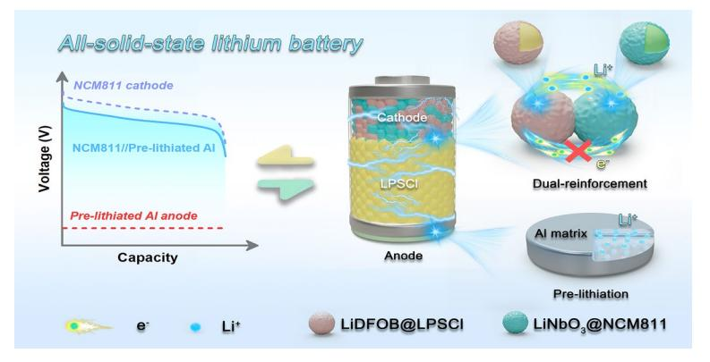
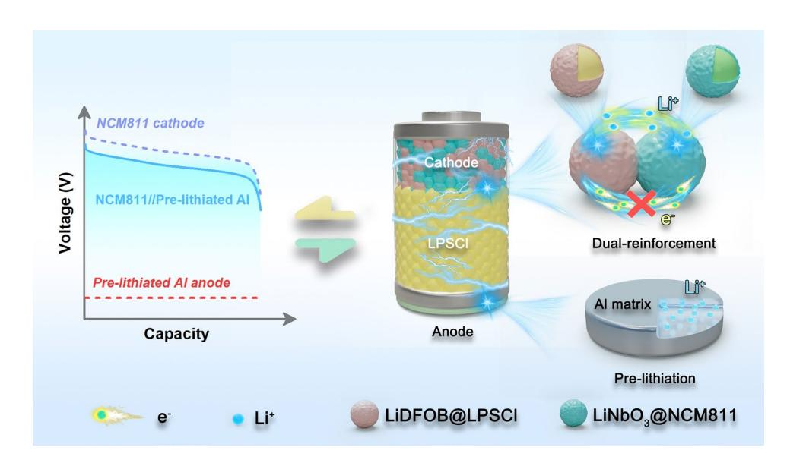
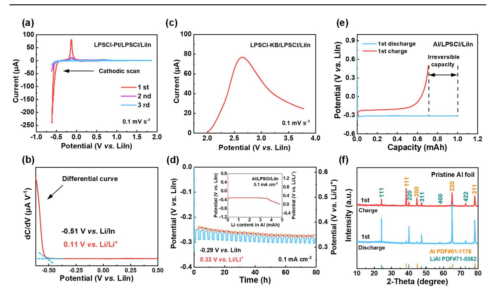
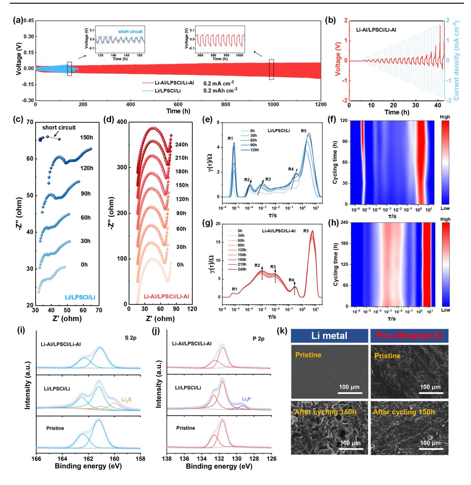
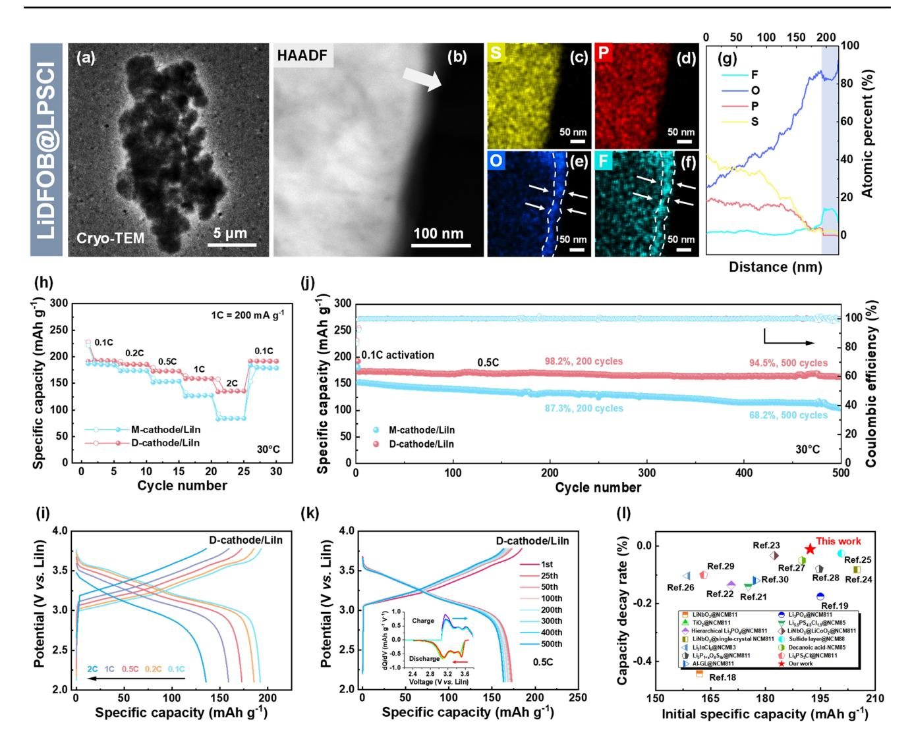
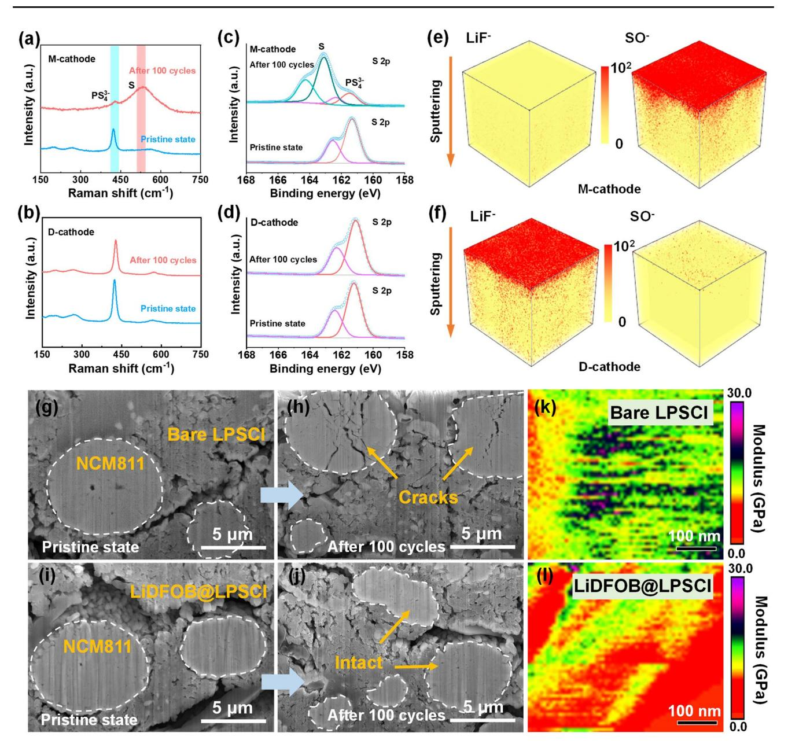
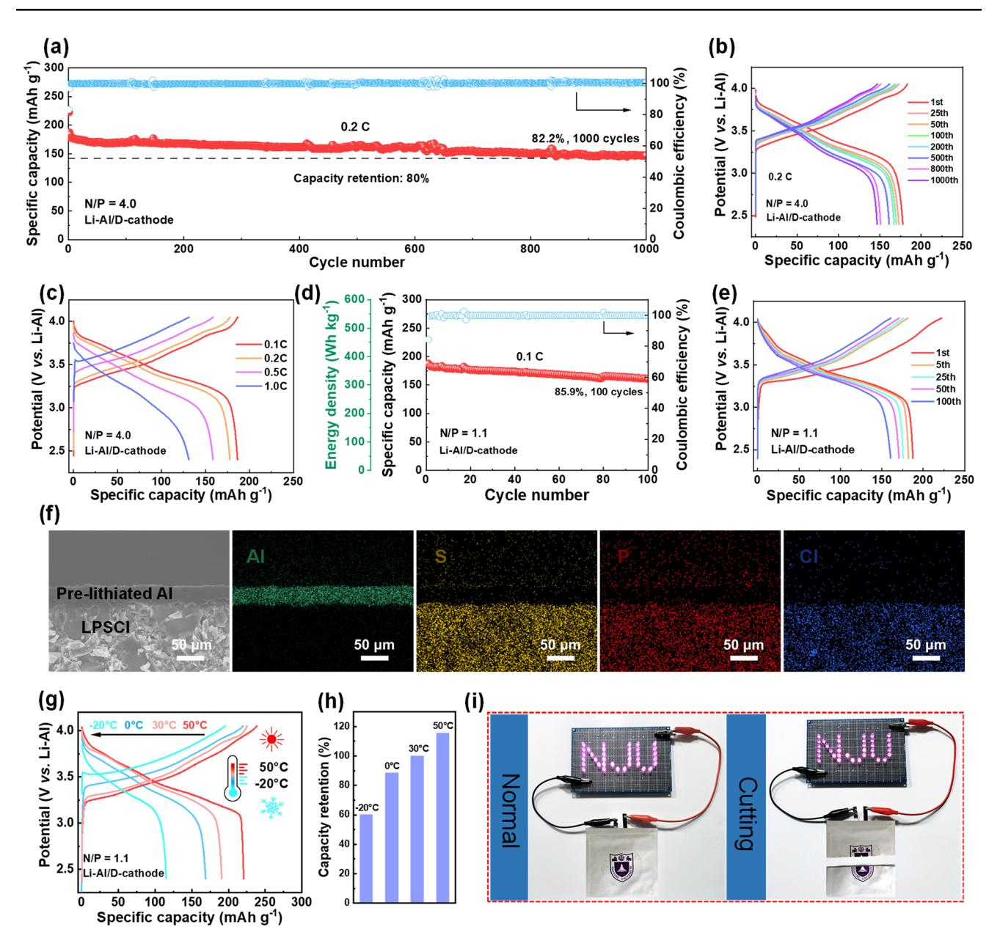

**ARTICLE**

**Cite as** Nano-Micro Lett. (2025) 17:239

Received: 14 February 2025 Accepted: 27 March 2025 © The Author(s) 2025

# **Developing High‑Energy, Stable All‑Solid‑State Lithium Batteries Using Aluminum‑Based Anodes and High‑Nickel Cathodes**

Xin Wu1 , Meiyu Wang2 , Hui Pan1 , Xinyi Sun1 , Shaochun Tang2 \*, Haoshen Zhou1 , Ping He1 \*

# **HIGHLIGHTS**

- Anode pre-lithiation technique was employed to promote the reversibility of Al.
- Dual-reinforcement technology was developed to address the interfacial incompatibility between the Ni-rich cathode active material and sulfde solid-state electrolyte.
- The fabricated all-solid-state lithium battery comprising the pre-lithiated Al anode and dual-reinforced Ni-rich cathode achieves stable cycling for 1000 cycles with a capacity retention of 82.2%.

**ABSTRACT** Aluminum (Al) exhibits excellent electrical conductivity, mechanical ductility, and good chemical compatibility with high-ionic-conductivity electrolytes. This makes it more suitable as an anode material for all-solid-state lithium batteries (ASSLBs) compared to the overly reactive metallic lithium anode and the mechanically weak silicon anode. This study fnds that the pre-lithiated Al anode demonstrates outstanding interfacial stability with the Li6PS5Cl (LPSCl) electrolyte, maintaining stable cycling for over 1200 h under conditions of deep charge–discharge. This paper

combines the pre-lithiated Al anode with a high-nickel cathode, LiNi0.8Co0.1Mn0.1O2, paired with the highly ionic conductive LPSCl electrolyte, to design an ASSLB with high energy density and stability. Using anode pre-lithiation techniques, along with dual-reinforcement technology between the electrolyte and the cathode active material, the ASSLB achieves stable cycling for 1000 cycles at a 0.2C rate, with a capacity retention rate of up to 82.2%. At a critical negative-to-positive ratio of 1.1, the battery's specifc energy reaches up to 375 Wh kg−1, and it maintains over 85.9% of its capacity after 100 charge–discharge cycles. This work provides a new approach and an excellent solution for developing low-cost, high-stability all-solid-state batteries.

**KEYWORDS** All-solid-state lithium battery; Ni-rich cathode; Pre-lithiated Al anode; High energy density; Interface modifcation

Xin Wu and Meiyu Wang have contributed equally to this work.

\* Shaochun Tang, tangsc@nju.edu.cn; Ping He, pinghe@nju.edu.cn

1 Center of Energy Storage Materials & Technology, Department of Energy Science and Engineering, College of Engineering and Applied Sciences, Jiangsu Key Laboratory of Artifcial Functional Materials, National Laboratory of Solid-State Microstructures, and Collaborative Innovation Center of Advanced Microstructures, Nanjing University, Nanjing 210093, People's Republic of China

2 Department of Materials Science and Engineering, College of Engineering and Applied Sciences, Jiangsu Key Laboratory of Artifcial Functional Materials, National Laboratory of Solid-State Microstructures, and Collaborative Innovation Center of Advanced Microstructures, Nanjing University, Nanjing 210093, People's Republic of China

# **1 Introduction**

Sulfde-based all-solid-state lithium batteries (ASSLBs) with high energy density and safety are expected to satisfy the demands of long-range electric vehicles and electric fight [\[1](#page-13-0)]. As one of the key components of the battery, negative electrode plays a critical role in battery performance [[2,](#page-13-1) [3](#page-13-2)]. Lithium (Li) metal anode, which exhibits low electrode potential (−3.04 V vs. standard hydrogen electrode) and high theoretical capacity (3860 mAh g−1), has been extensively investigated for ASSLBs [[4\]](#page-13-3). Nonetheless, the issues related to interfacial instabilities between Li and sulfde electrolytes, as well as the short circuits caused by Li dendrites penetrating the electrolyte, have proved to be exceedingly challenging to address [[5–](#page-13-4)[7](#page-13-5)].

Other alternative anode materials such as Li alloys not only retain a signifcant capacity advantage, but also possess improved interfacial stability due to the reduced thermodynamic driving force for electrolyte reduction. Moreover, Li alloys can promote uniform plating and stripping of Li+ and thus prevent the safety hazards caused by the growth of Li dendrites [[6\]](#page-13-6). Metal indium (In) is a commonly used reversible counter electrode tool in the study of cathodes for sulfde-based ASSLBs. Nevertheless, its high operating potential (0.62 V vs. Li/Li+) and small electrochemical capacity hinder it from being utilized as an actual battery anode [\[8](#page-13-7), [9\]](#page-13-8). High-capacity silicon (Si) materials also encounter extremely challenging difculties in all-solid-state batteries. The chemical instability at the interface with the electrolyte and the stress failure due to signifcant volume deformation are both concerning issues [\[10,](#page-13-9) [11](#page-13-10)]. In addition, the poor conductivity of Si also raises concerns of slow kinetics during charge and discharge period.

Aluminum (Al), as the most abundant metallic element in the earth's crust, has a good conductivity and competitive capacity of 990 mAh g−1. Compared with Si anode, Al exhibits smaller volume changes during cycling (96% vs. 320%), which is favorable for maintaining good anode–electrolyte interface stability. Moreover, the moderate working potential of Li-Al alloy (~0.3 V vs. Li/Li+) can also facilitate the realization of high energy density in batteries. Since Al can be economically and efciently fabricated as a freestanding foil, the application of Al does not involve any inactive conductive agents and binders, nor require an additional current collector [\[12](#page-13-11)]. In consideration of these advantages, Al is a promising candidate for advanced anode material.

In our previous work, we proposed a stable all-solid-state lithium–sulfur battery system, in which Li0.8Al alloy was employed to replace Li as an anode to achieve excellent stability with the Li10GeP2S12 electrolyte [[13\]](#page-13-12). However, the overall energy density of the battery is limited to the low operating potential of the S cathode (~ 2.0 V). High-nickel layered oxide cathode (LiNi*x*Co*y*Mn1−*x*−*y*O2, x≥0.8, NCM), which delivers an output voltage of~3.7 V and decent specifc capacity, is desirable to enable a more practical ASSLB. Nevertheless, constrained by the severe interface incompatibility between the cathode active materials (CAMs) and sulfde electrolytes, the realization of stable sulfde-based all-solid-state battery composed of Al-based anode and high-nickel cathode is still impeded.

Here, by addressing the interface issues between the electrode materials and sulfde electrolytes, a promising type of ASSLB with high energy and stability was designed (as illustrated in Fig. [1\)](#page-2-0). First, an anode pre-lithiation technique was adopted for Al to promote its reversibility, and the outstanding stability of the pre-lithiated Al anode toward sulfde electrolyte (Li6PS5Cl, LPSCl) was confrmed by the electrochemical tests of symmetric cells under deep charge–discharge conditions. Then, a dual-reinforcement technology was developed to efectively suppress the side reactions between the LiNi0.8Co0.1Mn0.1O2 (NCM811) CAMs and LPSCl electrolyte, as well as strengthen the oxidation tolerance of LPSCl at high potentials. The superior electrochemical properties of the modifed composite cathode were identifed by the cycling and rate tests, as well as the postmortem characterizations. Furthermore, an ASSLB composed of the well-designed negative and positive electrodes was fabricated and evaluated to verify the feasibility of the proposed battery system. The ASSLB achieved stable cycling for 1000 cycles with an excellent capacity retention of 82.2%. At a critical negative-to-positive (N/P) ratio of 1.1, the battery's specifc energy reaches up to 375 Wh kg−1 (based on the mass of the positive and negative electrodes), and it maintains over 85.9% of its capacity after 100 charge–discharge cycles, which demonstrates a bright practical prospect of the ASSLB.

# **2 Experimental Section**

#### **2.1 Materials**

Niobium ethoxide ([Nb(C2H5O)5], Alfa Aesar, 99.9%), lithium acetate (CH3COOLi, Aladdin, 99.9%), lithium difluoro(oxalate)-borate (LiDFOB, Aladdin, 99%), LiNi0.8Co0.1Mn0.1O2 (NCM811, Hefei Kejing Material Technology Co. Ltd.), Li6PS5Cl (LPSCl, Hefei Kejing Material Technology Co. Ltd.), Ketjen Black (KB, Hefei Kejing Material Technology Co. Ltd.), Pt powder (Macklin, 99.9%), and Al (Alfa Aesar, 20 μm thickness) were purchased without further purifcation.

# **2.2 Preparation of LiNbO3@NCM811, LiDFOB@ LPSCl, Pre‑Lithiated Al Anode, and Composite Cathode**

# *2.2.1 Preparations of the LiNbO3@NCM811*

0.0194 g of niobium ethoxide and 0.004 g of lithium acetate (molar ratio 1:1) were dissolved in anhydrous ethanol and stirred for 12 h. Then 0.973 g NCM811 was added and ultrasonically dispersed for 2 h. After homogeneous dispersion by ultrasonication, the mixture was stirred for another 1 h and then transferred in a vacuum oven to remove the solvents and obtain the LiNbO3-coated NCM811 powder. The powder was annealed in air at 450 °C for 1 h to obtain the fnal product, denoted as LiNbO3@NCM811.

#### *2.2.2 Preparations of the LiDFOB@LPSCl*

LPSCl and LiDFOB were weighed according to the mass ratios of 100:0.5, 100:1, 100:1.5, and 100:2, respectively, and mixed in a mortar. The above operations were carried out in a glove box (H2O <0.01 ppm, O2<0.01 ppm). The mixture was poured into a ball milling jar and milled under Ar atmosphere for 15 h at a speed of 500 r min−1 with a ball-to-feed ratio of 50:1. The obtained sample is denoted as LiDFOB@LPSCl.

#### *2.2.3 Preparations of the Pre‑Lithiated Al Anode*

The Al foil with a diameter of 10 mm was cleaned with anhydrous ethanol before use. Li foil with an optimal molar ratio of Li:Al=0.14:1 was pressed onto the Al foil, and then, 300 MPa pressure was applied and kept for 6 h. The above operation was conducted in a glove box.

#### *2.2.4 Preparations of the Composite Cathode*

The prepared LiNbO3@NCM811 and sulfde electrolytes (LiDFOB@LPSCl or bare LPSCl) were put into a mortar

**Fig. 1** Schematic diagram of all-solid-state battery confguration composed of pre-lithiated Al anode and dual-reinforced NCM811 cathode

with a mass ratio of 7:3 and ground for 0.5 h to ensure homogeneous mixing. The above operation was conducted in a glove box.

#### **2.3 Cell Assembly**

For the assembly of D-cathode/LiIn or M-cathode/LiIn battery, 120 mg LPSCl was added into a poly(ether-etherketone) (PEEK) mold with an internal diameter of 10 mm and 280 MPa pressure was applied and held for 2 min (The thickness of the molded electrolyte pellet is~1.2 mm). Then the prepared composite cathode was evenly dispersed on the one side of the LPSCl pellet and 280 MPa pressure was applied and held for 5 min. In foil was placed on the other side of the LPSCl pellet and a Li foil with a molar ratio of Li:In=0.5:1 was pressed on the In foil. Carbon-coated Al and Cu foils were used as the collectors at the cathode and anode sides, respectively. The assembled battery was operated under pressure of 80 MPa by a stainless steel frame. For the assembly of Li-Al/D-cathode battery, the procedures remain the same except that the prepared pre-lithiated Al anode was used to replace LiIn and no additional Cu foil was added as the collector. The symmetric cells were assembled with the same method except that the pre-lithiated Al or Li anode was placed on both sides of the LPSCl pellet. As for the assembly of the Li-Al/D-cathode pouch cell, frstly, the prepared composite cathode was thoroughly mixed with polytetrafuoroethylene with a mass ratio of 99:1 and ground with an agate mortar until a dough was formed. Then the dough was roll-pressed into a sheet with desired thickness to obtain the cathode flm. The LPSCl flm was fabricated following similar procedures. Finally, the cathode flm, LPSCl flm, and the freestanding pre-lithiated Al anode were pressed together and vacuum-sealed in aluminum plastic flm. Nickel and aluminum metal tabs were welded to anode and cathode side as collectors, respectively.

LiDFOB@LPSCl-KB/LPSCl/LiIn battery: LiDFOB@ LPSCl and KB mixture was obtained by grinding the prepared LiDFOB@LPSCl and KB with a mass ratio of 1:1 for 1 h. The LiDFOB@LPSCl-KB/LPSCl/LiIn battery was assembled with the same method as D-cathode/LiIn or M-cathode/LiIn battery except the change of the electrodes. The LiDFOB@LPSCl-KB (10 mg) mixture was adopted as the working electrode and distributed evenly on the one side of the LPSCl pellet. The LPSCl-KB/LPSCl/LiIn or LPSCl-Pt/LPSCl/LiIn battery was fabricated following similar procedures.

Al/LPSCl/LiIn battery: The Al/LPSCl/LiIn battery was assembled with the same method as LiDFOB@LPSCl-KB/ LPSCl/LiIn battery except that the LiDFOB@LPSCl-KB mixture was changed to an Al foil with a diameter of 10 mm.

#### **2.4 Electrochemical Tests**

The galvanostatic discharge/charge tests of the ASSLBs were carried out on the Neware battery test system. Cyclic voltammetry and linear sweep voltammetry tests were conducted on the CHI with a scan rate of 0.1 mV s−1. Electrochemical impedance spectroscopy (EIS) tests were performed on the Solartron with an applied frequency range of 0.1–106 Hz and an amplitude of 5 mV. The voltage ranges were set to 2.1–3.78 V versus LiIn for D-cathode/LiIn or M-cathode/LiIn battery and 2.4–4.07 V versus Li-Al for Li-Al/D-cathode battery. Specifc capacity calculations were based on the mass of LiNbO3@NCM811. The N/P ratio is defned as the ratio between the maximum capacity of the pre-lithiated Al anode under conditions of maintaining a constant potential (3 mAh) and the theoretical capacity that can be provided by the composite cathode. For the Li-Al/D-cathode battery with a N/P ratio of 1.1, the mass of the pre-lithiated Al anode and composite cathode was 4.3 and 20 mg, respectively.

#### **2.5 Material Characterization**

X-ray difraction (XRD, Bruker D8) analysis was carried out to analyze the structure change of NCM811 and LPSCl after modifcation. The morphology observation was conducted by scanning electron microscopy (SEM, Hitachi SU8010). The successful formation of the coating layer on NCM811 and LPSCl was demonstrated by transmission electron microscopy (TEM, FEI TF20) and cryo-TEM, respectively. And the corresponding composition mapping was obtained by the equipped energy-dispersive X-ray spectrometry (EDS). X-ray photoelectron spectroscopy (XPS) test was performed on PHI 5000 VersaProbe-II to analyze the specifc components of the coating layer on LPSCl and structure change of LPSCl after cycling. The cross-sectional microstructure of the composite cathode before and after cycling was observed by focused ion/electron dual-beam electron microscopy (Helios G4 CX). Atomic force microscopy (AFM, Bruker Dimension ICON) and RTESP-525 tip were used to analyze the Young's modulus of the LiDFOB@LPSCl and LPSCl electrolytes. Raman spectroscopy was carried out on a confocal Raman microscope (inVia, Renishaw) with an excitation wavelength of 633 nm. Time-of-fight secondary-ion mass spectrometry (ToF–SIMS) measurements were taken via a TOF-SIMS5 (ION-TOF-GmbH) in Nano-X. And a pulsed Bi3+ ion beam (30 keV) set in high current mode was applied for ToF–SIMS surface analysis.

# **3 Results and Discussion**

#### **3.1 Practical Stability Window of LPSCl and Elec‑ trochemical Property of Al**

The stability of the electrode–electrolyte interface is intimately linked to the electrochemical stability window (ESW) of the electrolyte. Theoretical calculations indicate that the ESW of LPSCl ranges from 1.71 to 2.01 V versus Li/Li+, suggesting that LPSCl undergoes degradation when the applied voltage falls below 1.71 V or exceeds 2.01 V [[14](#page-13-13)]. Despite this, anodes such as Li-In alloy and Li4Ti5O12, which operate at potentials below 1.71 V, have been identifed as stable in LPSCl-based batteries, implying that the practical stability window for LPSCl may indeed be broader than the theoretical predictions.

To ofer practical guidance for LPSCl applications, the ESW of LPSCl under operational conditions was investigated. The practical reductive stability limit of LPSCl was determined via cyclic voltammetry (CV) experiments. The experimental setup featured a LPSCl-Pt/LPSCl/LiIn confguration, where platinum (Pt) powder was introduced to the working electrode in lieu of carbon materials to enhance electrical contact area and prevent carbon lithiation at low potentials. The Li-In alloy, with a molar ratio of Li:In at 0.5:1 and a stable potential of 0.62 V versus Li/Li+, demonstrated exceptional compatibility with LPSCl, thus serving as both counter and reference electrodes in the study [[13](#page-13-12)]. As depicted in Fig. [2a](#page-5-0), a discernible reduction current peak emerged at low potentials during the initial cathodic sweep, indicating the decomposition of LPSCl. The corresponding diferential curve in Fig. [2](#page-5-0)b reveals a sharp increase at −0.51 V versus LiIn (0.11 V vs. Li/Li+), which suggests that the reductive stability limit of LPSCl is 0.11 V versus

Li/Li+. The oxidation peak exhibits reduced intensity during the subsequent anodic scan, implying that the electrochemical reduction of LPSCl is not entirely reversible. The second and third cycles display diminished reduction and oxidation current peaks, likely due to the passivation efect of the decomposition products. The oxidative behavior of LPSCl was examined using a linear sweep voltammetry test. As illustrated in Fig. [2c](#page-5-0), the decomposition current of the LPSCl electrolyte was observable from the open-circuit voltage (2.5 V vs. Li/Li+) of the battery up to the cutof voltage of 3.78 V versus LiIn (4.4 V vs. Li/Li+), suggesting that the actual oxidation limit of LPSCl is less than 2.5 V versus Li/Li+.

The characteristics of Al foil were studied to estimate its feasibility as the anode of ASSLBs with LPSCl electrolyte. The equilibrium potential of Al after lithiation was measured by the galvanostatic intermittent titration technique (GITT) test. As shown in Fig. [2](#page-5-0)d, the lithiated Al foil presented a stable potential of −0.29 V versus LiIn (0.33 V vs. Li/ Li+). The moderate operating potential of Al foil is higher than the decomposition potential of LPSCl, guaranteeing the anode–electrolyte interface stability. Quantitative lithiation test of Al foil was also carried out to reveal the maximum Li content that can be accommodated in Al (inset in Fig. [2](#page-5-0)d). The Al foil maintains a constant potential until the Li content in Al exceeds 3.6 mAh (4.6 mAh cm−2), which demonstrates that the Al foil can enable a commercially relevant capacity (2–5 mAh cm−2) while still retaining interface stability with the LPSCl electrolyte. The electrochemical performance of Al foil was investigated. Figure [2e](#page-5-0) displays the initial discharge–charge profles of the Al/LPSCl/LiIn battery with a Coulombic efciency of 70.9%, which indicates that a portion of Li ions cannot be reversibly released after entering into the Al skeleton, as further evidenced by the X-ray difraction (XRD) results presented in Fig. [2](#page-5-0)f. In the subsequent cycles, the irreversible capacity in Al foil gradually increased until the Coulombic efciency of the battery reached~100% after 25 cycles (Fig. S1).

## **3.2 Interface Stability Between the Pre‑Lithiated Al Anode and LPSCl**

To improve the reversibility of the Al foil, an anode prelithiation technique was employed. In this study, the optimal amount of implanted Li in the Al matrix was determined to

Fig. 2 Practical ESW of the LPSCI electrolyte and the lithiation behaviors of Al. a CV test of the LPSCI-Pt/LPSCI/LiIn battery at a scan rate of 0.1 mV s-1. **b** Differential curve of the first cathodic scan in **a**. **c** Linear sweep voltammetry test of the LPSCI-KB/LPSCI/LiIn battery at a scan rate of 0.1 mV s-1. **d** GITT profile of the Al foil. The current pulse was 0.1 mA cm-2 and for 1 h, followed by a rest time for 2 h. Inset is the lithiation profile of Al in the Al/LPSCI/LiIn battery at a current density of 0.1 mA cm-2. **e** Initial discharge and charge profiles of the Al/LPSCI/ LiIn battery. The discharge capacity was set at 1 mAh, and the charging cutoff voltage was set at 0.5 V vs. LiIn. f XRD pattern of the pristine Al foil after initial discharge (blue) and charge (red)

be 0.6 mAh (corresponding to a Li:Al molar ratio of 0.14:1). This quantity effectively compensates for irreversible capacity losses in the Al matrix while preserving sufficient sites for  $Li^+$  released from the cathode (Fig. S2). Pre-lithiation of the Al foil was achieved via a mechanical alloying method. As illustrated in Fig. S3, the continuous pressure applied during this process accelerates the diffusion of Li atoms into Al matrix at the interface, promoting a solid-state reaction to form the Li-Al alloy [13]. XRD analysis confirmed that the pre-lithiated Al foil consists of a mixture of Al and Li-Al phases (Fig. S4), which indicates that the lithiation of Al proceeds through a biphasic reaction characterized by a constant potential, consistent with the flat potential curve shown in Fig. 2d. SEM was utilized to characterize the pre-lithiated Al foil. As shown in Fig. S5, the surface and cross-sectional morphologies exhibit a dense and uniform structure.

Symmetric Li-Al/LPSCI/Li-Al cell (note: Li-Al refers to the pre-lithiated Al foil) was fabricated to evaluate the interfacial stability between the pre-lithiated Al anode and LPSCI electrolyte. As shown in Fig. 3a, the Li-Al/LPSCI/Li-Al cell exhibits excellent cycling stability with a small polarization at 0.2 mA cm-2 (0.2 mAh cm-2) after 1200 h. For comparison, a symmetric Li/LPSCI/Li cell was assembled and tested under the same conditions, which suffered from a short circuit after cycling for 140 h, indicating that Li dendrites had pierced through the electrolyte. The Li-Al/LPSCI/Li-Al cell was evaluated under deeper charge-discharge conditions  $(0.5 \text{ mA cm}^{-2}, 0.5 \text{ mAh cm}^{-2})$  and demonstrated stable cycling for over 1000 h, as shown in Fig. S6. Critical current density (CCD) tests were also conducted to determine the maximum current density that the Li-Al/LPSCI/Li-Al cell can tolerate without failure. As depicted in Fig. 3b, although the overpotential increased gradually with the rise in current density, no signs of cell failure were observed. In contrast, short circuits occurred in the Li/LPSCI/Li cell when the current density reached 0.9 mA cm $-2$  (Fig. S7).

EIS measurements were taken to probe into the internal impedance variation of the Li/LPSCI/Li and Li-Al/LPSCI/ Li-Al cells. The Li/LPSCl/Li experienced cell failure before 150 h (Fig. [3c](#page-7-0)). Conversely, the Li-Al/LPSCl/Li-Al cell maintained a stable impedance profle, with no indication of short-circuiting within the 240 h timeframe (Fig. [3](#page-7-0)d). To gain deeper insights into the impedance characteristics, the EIS data were further deconvoluted using semiquantitative distribution of relaxation times (DRT) analysis. As depicted in Fig. [3](#page-7-0)e-h, fve distinct relaxation processes (R1–R5) were identifed [\[15](#page-13-14)]. R1 corresponds to the bulk electrolyte resistance, while R2 and R3 refect the SEI impedance. R4 is attributed to charge transfer resistance, and R5 represents difusion impedance within the electrodes. Notably, a low time constant (τ) in the R2 and R3 regions indicates rapid Li-ion transport kinetics across the interphase, while a low τ value in the R4 region implies an enhanced response for charge transfer. Due to the unstable interface between Li and LPSCl, both the SEI resistance (*R*SEI) and charge transfer resistance (*R*ct) progressively increase in the Li/LPSCl/Li cell over extended cycling. In stark contrast, the *R*SEI and *R*ct of Li-Al/LPSCl/Li-Al cell could remain stable with slight changes.

XPS was used to study the composition change of the LPSCl electrolyte after the Li/LPSCl/Li and Li-Al/LPSCl/ Li-Al cell cycling for 150 h (Fig. [3i](#page-7-0), j). The XPS S 2*p* and P 2*p* spectra collected at the Li-Al/LPSCl interface maintain consistency with the characteristic peaks of the pristine LPSCl, while new peaks representing the reduced products of Li2S and Li3P can be detected at the Li/LPSCl interface. The above discoveries demonstrate that the pre-lithiated Al anode has better interfacial compatibility with LPSCl compared to Li anode. In addition, the postmortem characterizations were also conducted by SEM (Fig. [3](#page-7-0)k). Compared with the pristine state, neither dendrites nor pulverization is observed on the pre-lithiated Al anode, while obvious Li dendrites appeared on Li anode after cycling 150 h.

#### **3.3 Interfacial Stability Between NCM811 and LPSCl**

The electrochemical window of LPSCl is limited, rendering it prone to interfacial incompatibility when paired with high-voltage oxide cathodes that operate above 4.2 V versus Li/Li⁺ [\[16\]](#page-13-15). To mitigate this issue, coating CAMs with a stabilizing layer has emerged as a viable strategy to enhance interfacial stability with the electrolyte [[17](#page-13-16)]. However, technical hurdles and the imperative to ensure

sufcient electronic conductivity within the active material during charge and discharge often result in incomplete surface coatings on CAM particles. Consequently, interfacial side reactions can still be triggered between these partially coated CAM particles and the electrolyte.

To overcome the interfacial incompatibility between high-nickel CAMs and LPSCl electrolyte, we employed a dual-reinforcement approach, wherein concurrent modifcations to both the CAMs and electrolyte were implemented to synergistically enhance their interfacial stability. Lithium niobate (LiNbO3), known for its good ionic conductivity and electrical insulating properties [[17](#page-13-16)], was applied as a protective coating on NCM811. Characterization (Fig. S8) confrmed the successful synthesis of an amorphous LiNbO3 layer, approximately 3.2 nm thick, on the NCM811 surface (denoted as LiNbO3@NCM811). Furthermore, to improve the oxidative stability of LPSCl at high potentials and to mitigate side reactions between any uncoated areas of NCM811 particles and the LPSCl electrolyte, lithium difuoro(oxalate) borate (LiDFOB) was incorporated as a functional additive into the LPSCl electrolyte. The synthesis procedure is illustrated in Fig. S9, and the resulting electrolyte is referred to as LiDFOB@LPSCl.

To ascertain the optimal concentration of the LiDFOB additive, we investigated the ionic conductivity of LiD-FOB@LPSCl electrolytes and evaluated the cycling stability of batteries assembled with varying amounts of LiD-FOB. As depicted in Fig. S10a, b, the ionic conductivity of LiDFOB@LPSCl demonstrated a consistent decline with increasing LiDFOB content. Concerning the cycling stability of the batteries (Fig. S10c, d), the most favorable electrochemical performance was observed when the mass fraction of LiDFOB reached 1 wt%. This phenomenon can be attributed to the fact that an insufcient quantity of LiDFOB may not adequately form a protective layer on the LPSCl surface, whereas an excessive amount of LiDFOB can signifcantly diminish Li⁺ conductivity, resulting in pronounced polarization efects.

Cryo-transmission electron microscopy (cryo-TEM) was used to investigate the LiDFOB@LPSCl electrolyte (Fig. [4](#page-9-0)a). The corresponding EDS mappings (Fig. [4b](#page-9-0)–f) and linear scans (Fig. [4](#page-9-0)g) reveal an additional layer, 15–25 nm thick, on the LPSCl surface. XPS tests were conducted to determine the specifc composition of the coating layer. As shown in Fig. S11, the results indicate that the surface layer of LPSCl consists of inorganic (LiF, Li*x*PO*y*F*z*, and LiBO2)

**Fig. 3** Compatibility evaluation between the pre-lithiated Al anode and LPSCl electrolyte. **a** Galvanostatic Li plating/stripping profles of the Li/ LPSCl/Li (blue) and Li-Al/LPSCl/Li-Al (red) cells at 0.2 mA cm−2 and 0.2 mAh cm−2. (Inset is the enlarged galvanostatic Li plating/stripping profles.) **b** Critical current density of the Li-Al/LPSCl/Li-Al cell. Nyquist plots of **c** Li/LPSCl/Li cell and **d** Li-Al/LPSCl/Li-Al cell after diferent cycling time. **e–h** DRT analyses of Li/LPSCl/Li and Li-Al/LPSCl/Li-Al cells after diferent cycling time. **i** S 2*p* and **j** P 2*p* X-ray photoelectron spectroscopy of the LPSCl electrolyte. **k** Scanning electron microscopy images of the Li and pre-lithiated Al anodes before and after cycling 150 h

and organic (B-C) components. CV measurements were taken on LiDFOB@LPSCl to demonstrate that LiDFOB addition enhances the stability of LPSCl under high-potential conditions. No signifcant peaks were observed during cathodic and anodic scans (Fig. S12), indicating that the oxidation tolerance of LPSCl was efectively promoted.

To validate the enhanced stability of nickel-rich cathodes via concurrent modifcation of NCM811 and LPSCl, we fabricated an ASSLB comprising a dual-reinforced cathode, wherein LiNbO3@NCM811 served as the active material and LiDFOB@LPSCl acted as the electrolyte, paired with a LiIn anode (denoted as D-cathode/LiIn). For comparative purposes, a reference ASSLB was also assembled, featuring a mono-modifed cathode with LiNbO3@NCM811 as the active material and pristine LPSCl as the electrolyte, paired with a LiIn anode (denoted as M-cathode/LiIn).

The electrochemical performances of the D-cathode/LiIn and M-cathode/LiIn batteries were evaluated at various current densities. As displayed in Fig. [4h](#page-9-0), the D-cathode/LiIn battery delivered reversible capacities of 191.2, 185.3, 172.5, 158.8, and 134.3 mAh g−1 at 0.1C, 0.2C, 0.5C, 1C, and 2C, respectively. The capacity recovered to 191.8 mAh g−1 when the current density was restored to 0.1C. Under the same conditions, the M-cathode/LiIn battery delivered lower reversible capacities of 187.0, 173.2, 151.7, 125.9, and 82.8 mAh g−1. The corresponding charge/discharge curves at diferent rates are shown in Figs. [4i](#page-9-0) and S13. The D-cathode/ LiIn battery exhibited better reversibility and lower voltage polarization than the M-cathode/LiIn, indicating improved interfacial compatibility between NCM811 and LPSCl.

The cycling properties of the D-cathode/LiIn and M-cathode/LiIn batteries are illustrated in Fig. [4j](#page-9-0). The D-cathode/ LiIn battery delivered an initial reversible specifc capacity of 192.2 mAh g−1 with a decent initial coulombic efciency (ICE) of 84.8%. At a higher current density of 0.5C, the battery achieved a reversible specifc capacity of 172.6 mAh g−1 and operated steadily for over 500 cycles with an excellent capacity retention of 94.5%. In comparison, the M-cathode/ LiIn battery exhibited a lower ICE of 82.8% and a capacity retention of 68.2% after 500 cycles. The charge/discharge curves of the D-cathode/LiIn and M-cathode/LiIn batteries at diferent cycles are displayed in Figs. [4](#page-9-0)k and S14. The well-overlapped curves of the D-cathode/LiIn battery imply excellent cycling stability. Additionally, the diferential capacity (dQ/dV) analysis of the D-cathode/LiIn battery (inset in Fig. [4](#page-9-0)k) shows that the intensity of the dQ/dV peaks did not decrease or shift signifcantly even after 500 cycles, which indicates that the internal structure of the electrode was well preserved. The electrochemical performance of the D-cathode was carefully compared with other similar cathodes reported previously (Fig. [4](#page-9-0)l), demonstrating its great competitiveness in terms of reversible capacity and cycling stability [\[18](#page-13-17)[–30](#page-14-0)].

To elucidate the mechanisms underlying the improved battery performance achieved through the dual-reinforcement strategy, the impedance evolution of the M-cathode/LiIn and D-cathode/LiIn batteries was analyzed. As shown in Fig. S15a, the initial interfacial impedances of the M-cathode/ LiIn and D-cathode/LiIn batteries were 25.9 and 54.5 Ω, respectively. The higher initial impedance of the D-cathode/LiIn cell can be attributed to the additional protective layer on LPSCl. However, the interfacial impedance of the M-cathode/LiIn battery increased substantially to 358.7 Ω after 100 cycles, whereas the D-cathode/LiIn battery exhibited a considerably lower impedance of 129.9 Ω (Fig. S15b). To further investigate the compositional changes within the cathodes, Raman spectroscopy and XPS analyses were performed. As depicted in Fig. [5](#page-10-0)a, c, a distinct oxidation product of sulfur (S) was detected in the M-cathode after 100 cycles, indicating severe decomposition of LPSCl. In contrast, the Raman and XPS spectra of the D-cathode remained nearly unchanged (Fig. [5](#page-10-0)b, d).

Furthermore, time-of-fight secondary-ion mass spectrometry (ToF–SIMS) was employed to investigate the surfaceto-bulk composition distribution in the cycled cathodes. As shown in Fig. S16, with increasing sputtering time, the content of the LiF− and SO− ionic fragments (characteristic of LiF and S, respectively) decreased and reached equilibrium after 800 s of sputtering in both M-cathode and D-cathode. The corresponding three-dimensional reconstructed spatial distributions of each component are presented in Fig. [5e](#page-10-0), f, where the intensity of the red color represents the concentration of the ionic fragments. In the M-cathode, the LiF− signal was nearly absent, while a high concentration of the SO− component was observed, pointing to severe decomposition of the LPSCl electrolyte [\[31](#page-14-1)]. In contrast, the D-cathode exhibited a detectable LiF− signal from the surface layer of LPSCl, and the signal intensity of the SO− fragment was weak, which demonstrates that the stability of LPSCl was efectively improved after modifcation.

Cross-sectional focused ion beam (FIB)-SEM characterizations were conducted to visualize the structural variations in the cathodes of the M-cathode/LiIn and D-cathode/LiIn batteries. As shown in Fig. [5g](#page-10-0)-j, obvious cracks appeared in NCM811 particles of the M-cathode after 100 cycles, which suggests that severe stress concentrations occurred in the M-cathode after cycling. In stark contrast, the cycled D-cathode remained superior structural integrity without cracks or pulverizations. Atomic force microscopy tests were performed on the LPSCl and LiDFOB@LPSCl electrolytes to understand their surface properties. As displayed

**Fig. 4** Characterization and electrochemical performance of the dual-reinforced cathode. **a** Cryo-TEM image of LiDFOB@LPSCl. **b** HAADF image and **c-f** corresponding elemental mapping images of LiDFOB@LPSCl. **g** Linear scans in the direction of the arrow in **b**. **h** Rate performance and **i** charge/discharge curves of the D-cathode/LiIn battery at various rates ranging from 0.1C to 2.0C. **j** Long-term cycling performance of the D-cathode/LiIn battery and **k** charge/discharge curves at diferent cycles (inset: corresponding dQ/dV curves). **l** Comparison of initial specifc capacity and capacity decay rate per cycle between previous work and this study

in Figs. [5k](#page-10-0), l, and S17, the bare LPSCl, ball-milled LPSCl and LiDFOB@LPSCl exhibited average Young's modulus of 15.7, 17, and 9.7 GPa, respectively. The lower Young's modulus of LiDFOB@LPSCl than those of the bare LPSCl and ball-milled LPSCl electrolytes could be attributed to the good fexibility of the C-B organic component formed on LPSCl, which provided better bufering functions and alleviated the stresses generated inside the electrodes.

### **3.4 Electrochemical Performances of the All‑Solid‑State Li‑Al/D‑Cathode Battery**

After achieving excellent reversibility of the negative and positive electrodes and superior interfacial compatibility with the sulfde electrolyte, a promising type of ASSLB with diferent battery confguration was further fabricated, comprising the pre-lithiated Al anode, dual-reinforced NCM811 cathode, and LPSCl electrolyte, denoted as Li-Al/D-cathode. The long-term cycling stability of the Li-Al/D-cathode battery was evaluated. As shown in Fig. [6](#page-11-0)a,

**Fig. 5** Composition and structure investigation of the M-cathode and D-cathode. **a, b** Raman and **c, d** XPS results of the M-cathode and D-cathode before and after cycling for 100 cycles. ToF–SIMS 3D reconstructed images of **e** the M-cathode and **f** D-cathode. Cross-sectional FIB-SEM images of **g, h** M-cathode and **i, j** D-cathode before and after cycling for 100 cycles. Areal distribution of Young's modulus of **k** bare LPSCl and **l** LiDFOB@LPSCl electrolytes

b, the Li-Al/D-cathode battery with a N/P ratio of 4.0 presented an initial reversible capacity of 185.0 mAh g−1 at 0.1C and operated steadily for more than 1000 cycles at 0.2C with an excellent capacity retention of 82.2%. Rate performance of the Li-Al/D-cathode battery was also explored and displayed in Figs. [6c](#page-11-0) and S18. At current densities of 0.1C, 0.2C, 0.5C and 1C, the Li-Al/D-cathode battery delivered reversible capacities of 185.0, 177.7, 160.0, and 131.7 mAh g−1, respectively.

The performance of the Li-Al/D-cathode battery was evaluated under stringent conditions to assess its durability for practical applications. Given that cathode areal capacity is a key factor infuencing overall battery energy density, the N/P ratio of the Li-Al/D-cathode battery was reduced

**Fig. 6** Electrochemical tests of the designed all-solid-state Li-Al/D-cathode battery. **a** Long-term cycling performance at 0.2C with a N/P ratio of 4.0 (activation at 0.1C for the frst two cycles) and **b** corresponding charge–discharge curves at diferent cycles. **c** Charge/discharge curves at various rates ranging from 0.1C to 1.0 C. **d** Cycling performance at 0.1C with a N/P ratio of 1.1 and **e** corresponding charge–discharge curves at diferent cycles. **f** Interfacial morphology and corresponding EDS mappings between the pre-lithiated Al anode and LPSCl electrolyte after cycling for 100 cycles. **g** Charge–discharge curves and **h** corresponding capacity retention at diferent temperature ranging from −20 °C to 50 °C. **i** Illustration of the Li-Al/D-cathode pouch cell powering an LED light

to 2.0 by increasing the cathode loading. As shown in Fig. S19, the battery delivered an initial reversible specifc capacity of 182.2 mAh g−1 at 0.1C, with an impressive capacity retention of 88.1% after 200 cycles. Furthermore, the Li-Al/D-cathode battery with a critical N/P ratio of 1.1 was developed, increasing the areal capacity of the NCM811 cathode to 3.5 mAh cm−2. The battery exhibited a reversible capacity of 187.5 mAh g−1 at 0.1C, corresponding to an energy density of 375 Wh kg−1 (calculated based on the total mass of the positive and negative electrodes). Even after more than 100 cycles, it maintained a high energy density of 322 Wh kg−1 with a capacity retention of 85.9% (Fig. [6d](#page-11-0), e). Post-cycling SEM analysis of the anode–electrolyte cross section revealed that the pre-lithiated Al anode maintained intimate contact with the LPSCl electrolyte after 100 cycles, demonstrating excellent interfacial stability (Fig. [6](#page-11-0)f).

The electrochemical performance of the Li-Al/D-cathode battery (N/P=1.1) was also evaluated across a wide temperature range. As shown in Fig. S20, the battery delivered reversible specifc capacities of 220.6, 190.7, 168.8, and 114.9 mAh g−1 at 50, 30, 0, and −20 °C, respectively. Notably, when the temperature was restored to 50 °C, the capacity recovered to 189.3 mAh g−1. The corresponding charge/ discharge profles of the Li-Al/D-cathode battery at diferent temperatures are presented in Fig. [6](#page-11-0)g. Even at −20 °C, the battery retained 60.3% of its reversible capacity measured at 30 °C, despite increased polarization at lower temperatures (Fig. [6](#page-11-0)h), demonstrating its excellent reversibility. Additionally, an Li-Al/D-cathode pouch cell was fabricated. As depicted in Fig. [6i](#page-11-0), the battery successfully powered an LED light with the "NJU" pattern, and the LED light remained fully operational even when the battery was cut open in the air.

# **4 Conclusions**

In summary, a promising type of ASSLB with high specifc energy and long cycle stability was successfully constructed using high-capacity pre-lithiated Al anode, high-voltage NCM811 cathode, and LPSCl electrolyte. To provide guidance for the practical application of LPSCl, we frstly explored the ESW of LPSCl under operating conditions and determined the reduction (0.11 V vs. Li/Li+) and oxidation (<2.5 V vs. Li/Li+) limit of LPSCl, respectively. Then, we demonstrated that Al can enable a commercial capacity of 4.6 mAh cm−2 while retaining a stable working potential of 0.33 V versus Li/Li+. To address the issues of poor reversibility of Al, anode pre-lithiation technique was adopted. The fabricated pre-lithiated Al anode shows superior interface stability with LPSCl, as verifed by the steady operation of the Li-Al/LPSCl/Li-Al symmetric cell for over 1200 h at 0.2 mA cm−2. In addition, to resolve the interfacial instability between the CAMs and LPSCl, a dual-reinforcement technology was employed, where NCM811 and LPSCl particles in the composite cathode were simultaneously protected with LiNbO3 and LiDFOB, respectively. The assembled ASSLB composed of the dual-reinforced NCM811 cathode and LiIn anode (half-cell confguration) exhibits a high reversible capacity of 192.2 mAh g−1 with improved ICE of 84.8% at 0.1C, and achieved an excellent capacity retention of 94.5% at 0.5C after 500 cycles. Furthermore, the ASSLB composed of the pre-lithiated Al anode and dual-reinforced NCM811 cathode (full-cell confguration) was fabricated, which could operate steadily for more than 1000 cycles at 0.2C with a superb capacity retention of 82.2%. At a critical N/P ratio of 1.1, the battery achieved a reversible energy density of 375 Wh kg−1 with a retention of 85.9% after 100 cycles. Over a wide temperature range from −20 to 50 °C, good reversibility and stability of the battery could still be attained. This work provides a promising anode selection for developing reliable ASSLBs with high energy and stability. Meanwhile, unlike many reports in the literature where two diferent electrolytes are required to guarantee cathode–electrolyte and anode–electrolyte interface stability, this work addressed the instability issues between the electrode materials and sulfde electrolyte, and realized stable electrochemical performances of all-solid-state battery by using one single electrolyte. In addition, considering the moderate potential, abundant reserves, and easy processability of Al, we also believe that the pre-lithiated Al anode combined with high-nickel cathode has great potential to realize an ASSLB with high safety and low cost, thus contributing to opening a new avenue for the practical ASSLBs.

**Acknowledgements** The authors are grateful for the technical support for Nano-X from Suzhou Institute of Nano-Tech and Nano-Bionics, Chinese Academy of Sciences (SINANO). This research was supported by the National Key R&D Program of China (2021YFB3800300), the National Natural Science Foundation of China (22179059, 22239002, 92372201), the science and technology innovation fund for emission peak and carbon neutrality of Jiangsu province (BK20231512, BK20220034), and the Key R&D project funded by department of science and technology of Jiangsu Province (BE2020003).

**Author Contributions** P.H. conceived the idea and supervised the research. X.W. conducted the experiments. M.W. carried out the transmission electron microscopy characterization. X.W. and P.H. analyzed experiment results, with help from H.P. and X.S. to scientifc discussion. X.W. and P.H. wrote the manuscript. All authors commented on the manuscript.

#### **Declarations**

**Conflict of Interest** The authors declare no interest confict. They have no known competing fnancial interests or personal relationships that could have appeared to infuence the work reported in this paper.

**Open Access** This article is licensed under a Creative Commons Attribution 4.0 International License, which permits use, sharing, adaptation, distribution and reproduction in any medium or format, as long as you give appropriate credit to the original author(s) and the source, provide a link to the Creative Commons licence, and indicate if changes were made. The images or other third party material in this article are included in the article's Creative Commons licence, unless indicated otherwise in a credit line to the material. If material is not included in the article's Creative Commons licence and your intended use is not permitted by statutory regulation or exceeds the permitted use, you will need to obtain permission directly from the copyright holder. To view a copy of this licence, visit <http://creativecommons.org/licenses/by/4.0/>.

**Supplementary Information** The online version contains supplementary material available at [https://doi.org/10.1007/s40820-](https://doi.org/10.1007/s40820-025-01751-y) [025-01751-y.](https://doi.org/10.1007/s40820-025-01751-y)

# **References**

- 1. X. Lu, Y. Wang, X. Xu, B. Yan, T. Wu et al., Polymer-based solid-state electrolytes for high-energy-density lithium-ion batteries–review. Adv. Energy Mater. **13**(38), 2301746 (2023). <https://doi.org/10.1002/aenm.202301746>
- 2. S. Jeong, Y. Li, W.H. Sim, J. Mun, J.K. Kim et al., Advances of sulfde-type solid-state batteries with negative electrodes: progress and perspectives. EcoMat **5**(6), e12338 (2023). [https://](https://doi.org/10.1002/eom2.12338) [doi.org/10.1002/eom2.12338](https://doi.org/10.1002/eom2.12338)
- 3. X. Xu, Y. Wang, Q. Yi, X. Wang, R.A.P. Camacho et al., Ion conduction in composite polymer electrolytes: potential electrolytes for sodium-ion batteries. ChemSusChem **16**(8), e202202152 (2023). <https://doi.org/10.1002/cssc.202202152>
- 4. H.H. Jia, C.J. Hu, Y.X. Zhang, L.W. Chen, A review on solidstate Li-S battery: from the conversion mechanism of sulfur to engineering design. J. Electrochem. **29**, 2217008 (2023). <https://doi.org/10.13208/j.electrochem.2217008>
- 5. B. Du, H. Zhou, P. He, Halide lithium conductors: from design and synthesis to application for all-solid-state batteries. ACS Appl. Energy Mater. **8**(2), 723–745 (2025). [https://doi.org/10.](https://doi.org/10.1021/acsaem.4c02948) [1021/acsaem.4c02948](https://doi.org/10.1021/acsaem.4c02948)
- 6. J.A. Lewis, F.J.Q. Cortes, Y. Liu, J.C. Miers, A. Verma et al., Linking void and interphase evolution to electrochemistry in solid-state batteries using operando X-ray tomography. Nat. Mater. **20**(4), 503–510 (2021). [https://doi.org/10.1038/](https://doi.org/10.1038/s41563-020-00903-2) [s41563-020-00903-2](https://doi.org/10.1038/s41563-020-00903-2)
- 7. J. Li, J. Luo, X. Li, Y. Fu, J. Zhu et al., Li metal anode interface in sulfde-based all-solid-state Li batteries. EcoMat **5**(8), e12383 (2023). <https://doi.org/10.1002/eom2.12383>
- 8. S. Liu, L. Zhou, J. Han, K. Wen, S. Guan et al., Super longcycling all-solid-state battery with thin Li6PS5Cl-based electrolyte. Adv. Energy Mater. **12**(25), 2200660 (2022). [https://](https://doi.org/10.1002/aenm.202200660) [doi.org/10.1002/aenm.202200660](https://doi.org/10.1002/aenm.202200660)

- 9. X.L. Wang, R.J. Xiao, Y. Xiang, H. Li, L.Q. Chen, Density functional investigation on cathode/electrolyte interface in solid-state lithium batteries. J. Electrochem. **23**, 381–390 (2017). <https://doi.org/10.13208/j.electrochem.170142>
- 10. X. Li, F.E. Kersey-Bronec, J. Ke, J.E. Cloud, Y. Wang et al., Study of lithium silicide nanoparticles as anode materials for advanced lithium ion batteries. ACS Appl. Mater. Interfaces **9**(19), 16071–16080 (2017). [https://doi.org/10.1021/acsami.](https://doi.org/10.1021/acsami.6b16773) [6b16773](https://doi.org/10.1021/acsami.6b16773)
- 11. D.H.S. Tan, Y.-T. Chen, H. Yang, W. Bao, B. Sreenarayanan et al., Carbon-free high-loading silicon anodes enabled by sulfide solid electrolytes. Science **373**(6562), 1494–1499 (2021). <https://doi.org/10.1126/science.abg7217>
- 12. Y. Liu, C. Wang, S.G. Yoon, S.Y. Han, J.A. Lewis et al., Aluminum foil negative electrodes with multiphase microstructure for all-solid-state Li-ion batteries. Nat. Commun. **14**(1), 3975 (2023). <https://doi.org/10.1038/s41467-023-39685-x>
- 13. H. Pan, M. Zhang, Z. Cheng, H. Jiang, J. Yang et al., Carbonfree and binder-free Li-Al alloy anode enabling an all-solidstate Li-S battery with high energy and stability. Sci. Adv. **8**(15), eabn4372 (2022). [https://doi.org/10.1126/sciadv.abn43](https://doi.org/10.1126/sciadv.abn4372) [72](https://doi.org/10.1126/sciadv.abn4372)
- 14. Y. Zhu, X. He, Y. Mo, Origin of outstanding stability in the lithium solid electrolyte materials: insights from thermodynamic analyses based on frst-principles calculations. ACS Appl. Mater. Interfaces **7**(42), 23685–23693 (2015). [https://](https://doi.org/10.1021/acsami.5b07517) [doi.org/10.1021/acsami.5b07517](https://doi.org/10.1021/acsami.5b07517)
- 15. Y. Lu, C.-Z. Zhao, J.-Q. Huang, Q. Zhang, The timescale identifcation decoupling complicated kinetic processes in lithium batteries. Joule **6**(6), 1172–1198 (2022). [https://doi.org/10.](https://doi.org/10.1016/j.joule.2022.05.005) [1016/j.joule.2022.05.005](https://doi.org/10.1016/j.joule.2022.05.005)
- 16. Y. Jung, Y.Y. Song, Y.S. Kim, Y. Chung, D.H. Lee et al., Impact of conducting agents on sulfde and halide electrolytes in disordered rocksalt cathode-based all-solid-state batteries. EcoMat **6**, e12502 (2024). [https://doi.org/10.1002/eom2.](https://doi.org/10.1002/eom2.12502) [12502](https://doi.org/10.1002/eom2.12502)
- 17. X. Li, Z. Ren, M. Norouzi Banis, S. Deng, Y. Zhao et al., Unravelling the chemistry and microstructure evolution of a cathodic interface in sulfde-based all-solid-state Li-ion batteries. ACS Energy Lett. **4**(10), 2480–24 (2019). [https://doi.](https://doi.org/10.1021/acsenergylett.9b01676) [org/10.1021/acsenergylett.9b01676](https://doi.org/10.1021/acsenergylett.9b01676)
- 18. X. Li, L. Jin, D. Song, H. Zhang, X. Shi et al., LiNbO3-coated LiNi0.8Co0.1Mn0.1O2 cathode with high discharge capacity and rate performance for all-solid-state lithium battery. J. Energy Chem. **40**, 39–45 (2020). [https://doi.org/10.1016/j.jechem.](https://doi.org/10.1016/j.jechem.2019.02.006) [2019.02.006](https://doi.org/10.1016/j.jechem.2019.02.006)
- 19. J.Y. Lee, S. Noh, J.Y. Seong, S. Lee, Y.J. Park, Suppressing unfavorable interfacial reactions using polyanionic oxides as efcient bufer layers: low-cost Li3PO4 coatings for sulfdeelectrolyte-based all-solid-state batteries. ACS Appl. Mater. Interfaces **15**(10), 12998–13011 (2023). [https://doi.org/10.](https://doi.org/10.1021/acsami.2c21511) [1021/acsami.2c21511](https://doi.org/10.1021/acsami.2c21511)
- 20. Q. Zhang, A.M. Bruck, A.M. Stavola, W. Liang, P. Aurora et al., Enhanced electrochemical stability of sulfde-based LiNi0.8Mn0.1Co0.1O2 all-solid-state batteries by Ti surface

doping. Batter. Supercaps **4**(3), 529–535 (2021). [https://doi.](https://doi.org/10.1002/batt.202000213) [org/10.1002/batt.202000213](https://doi.org/10.1002/batt.202000213)

- 21. T.-T. Zuo, F. Walther, S. Ahmed, R. Rueß, J. Hertle et al., Formation of an artifcial cathode–electrolyte interphase to suppress interfacial degradation of Ni-rich cathode active material with sulfde electrolytes for solid-state batteries. ACS Energy Lett. **8**(3), 1322–1329 (2023). [https://doi.org/10.1021/acsen](https://doi.org/10.1021/acsenergylett.2c02835) [ergylett.2c02835](https://doi.org/10.1021/acsenergylett.2c02835)
- 22. S. Deng, X. Li, Z. Ren, W. Li, J. Luo et al., Dual-functional interfaces for highly stable Ni-rich layered cathodes in sulfde all-solid-state batteries. Energy Storage Mater. **27**, 117–123 (2020). <https://doi.org/10.1016/j.ensm.2020.01.009>
- 23. X. Li, Q. Sun, Z. Wang, D. Song, H. Zhang et al., Outstanding electrochemical performances of the all-solid-state lithium battery using Ni-rich layered oxide cathode and sulfde electrolyte. J. Power Sources **456**, 227997 (2020). [https://doi.org/](https://doi.org/10.1016/j.jpowsour.2020.227997) [10.1016/j.jpowsour.2020.227997](https://doi.org/10.1016/j.jpowsour.2020.227997)
- 24. X. Liu, J. Shi, B. Zheng, Z. Chen, Y. Su et al., Constructing a high-energy and durable single-crystal NCM811 cathode for all-solid-state batteries by a surface engineering strategy. ACS Appl. Mater. Interfaces **13**(35), 41669–41679 (2021). [https://](https://doi.org/10.1021/acsami.1c11419) [doi.org/10.1021/acsami.1c11419](https://doi.org/10.1021/acsami.1c11419)
- 25. Y. Wang, Z. Wang, D. Wu, Q. Niu, P. Lu et al., Stable Ni-rich layered oxide cathode for sulfde-based all-solid-state lithium battery. eScience **2**(5), 537–545 (2022). [https://doi.org/10.](https://doi.org/10.1016/j.esci.2022.06.001) [1016/j.esci.2022.06.001](https://doi.org/10.1016/j.esci.2022.06.001)
- 26. J. Wang, S. Zhao, A. Zhang, H. Zhuo, G. Zhang et al., High lithium-ion conductivity, halide-coated, Ni-rich NCM improves cycling stability in sulfde all-solid-state batteries.

ACS Appl. Energy Mater. **6**, 3671–3681 (2023). [https://doi.](https://doi.org/10.1021/acsaem.2c02774) [org/10.1021/acsaem.2c02774](https://doi.org/10.1021/acsaem.2c02774)

- 27. Y. Huang, L. Zhou, C. Li, Z. Yu, L.F. Nazar, Waxing bare high-voltage cathode surfaces to enable sulfde solid-state batteries. ACS Energy Lett. **8**(11), 4949–4956 (2023). [https://doi.](https://doi.org/10.1021/acsenergylett.3c01717) [org/10.1021/acsenergylett.3c01717](https://doi.org/10.1021/acsenergylett.3c01717)
- 28. J. Liang, Y. Zhu, X. Li, J. Luo, S. Deng et al., A gradient oxy-thiophosphate-coated Ni-rich layered oxide cathode for stable all-solid-state Li-ion batteries. Nat. Commun. **14**(1), 146 (2023). <https://doi.org/10.1038/s41467-022-35667-7>
- 29. J. Kim, M.J. Kim, J. Kim, J.W. Lee, J. Park et al., High-performance all-solid-state batteries enabled by intimate interfacial contact between the cathode and sulfde-based solid electrolytes. Adv. Funct. Mater. **33**(12), 2211355 (2023). [https://doi.](https://doi.org/10.1002/adfm.202211355) [org/10.1002/adfm.202211355](https://doi.org/10.1002/adfm.202211355)
- 30. Y. Su, X. Liu, H. Yan, J. Zhao, Y. Cheng et al., Assembly of an elastic & sticky interfacial layer for sulfde-based all-solidstate batteries. Nano Energy **113**, 108572 (2023). [https://doi.](https://doi.org/10.1016/j.nanoen.2023.108572) [org/10.1016/j.nanoen.2023.108572](https://doi.org/10.1016/j.nanoen.2023.108572)
- 31. H. Kim, J.Y. Jung, K. Kim, C. Hwang, J. Yu et al., Functionalized electrode additive for simultaneously reinforcing chemomechanical properties of millimeter-thick dry-electrode for high-energy all-solid-state batteries. Adv. Energy Mater. **14**(14), 2303965 (2024). [https://doi.org/10.1002/aenm.20230](https://doi.org/10.1002/aenm.202303965) [3965](https://doi.org/10.1002/aenm.202303965)

**Publisher's Note** Springer Nature remains neutral with regard to jurisdictional claims in published maps and institutional afliations.