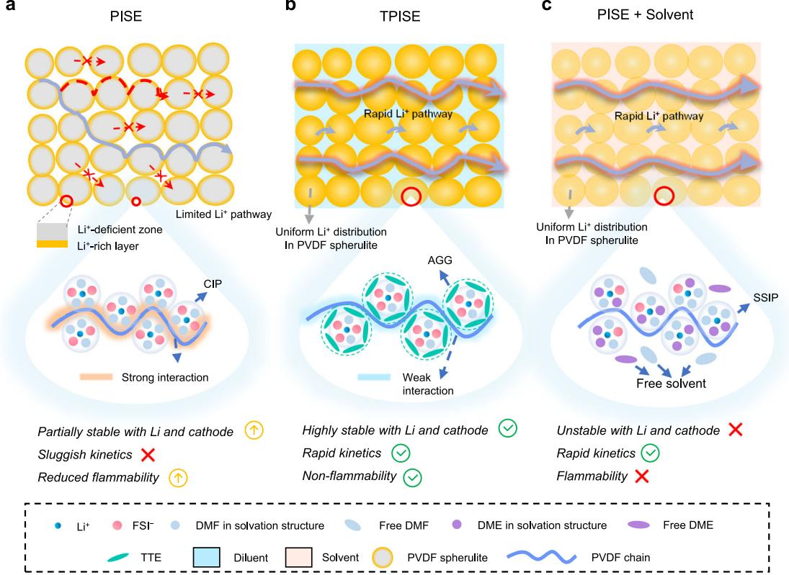
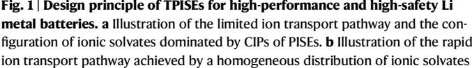
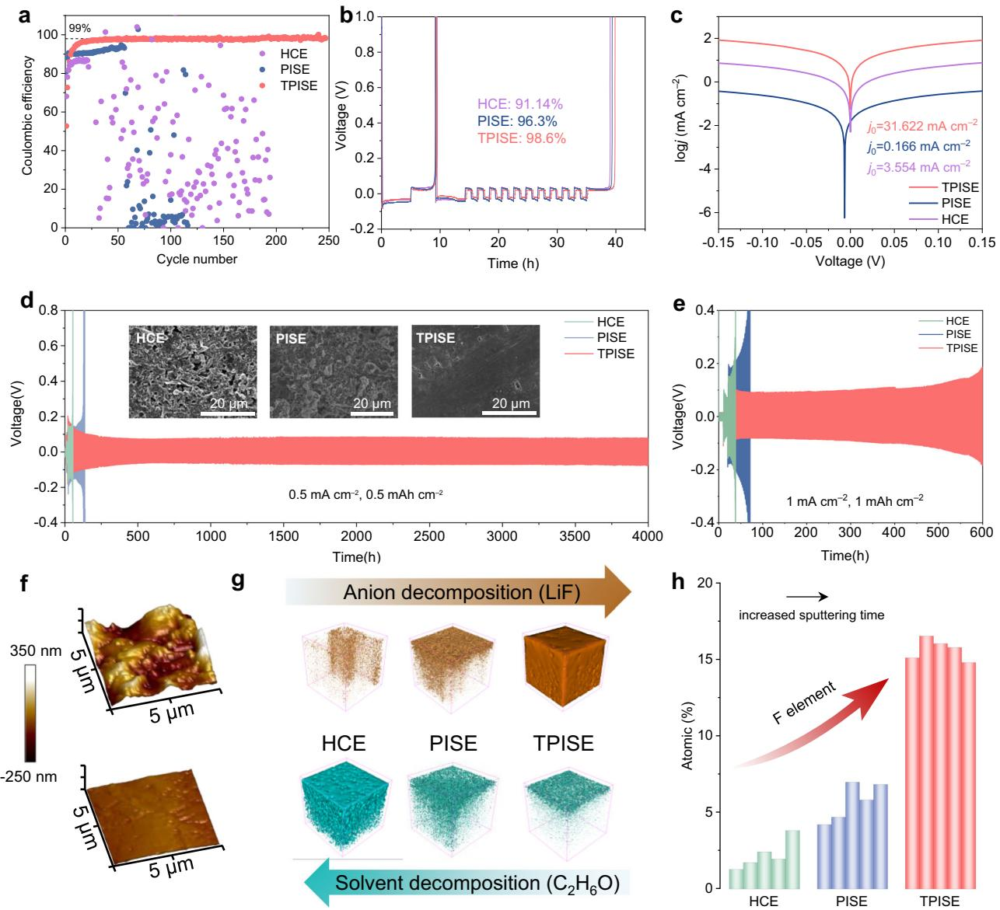
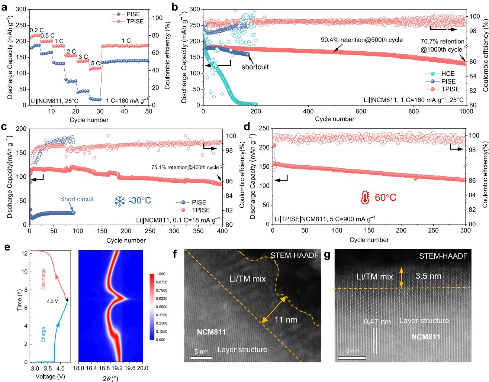
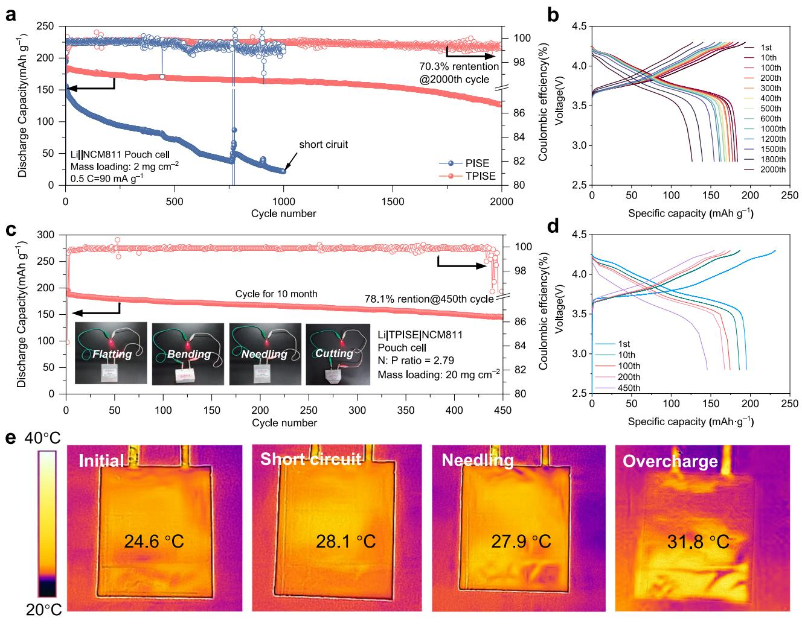

# Homogeneous polymer-ionic solvate electrolyte with weak dipole-dipole interaction enabling long cycling pouch lithium metal battery

Received: 5 June 2024

Accepted: 27 March 2025

Check for updates

Likun Che[n](http://orcid.org/0000-0003-4901-5257) 1,2,3, Tian Gu1,2,3, Jinshuo Mi1,2,3, Yuhang Li1,2, Ke Yang1,2, Jiabin Ma1,2, Xufei An1,2, Yuyuan Jiang1 , Danfeng Zhan[g](http://orcid.org/0000-0002-6273-3395) [1](http://orcid.org/0000-0002-6273-3395) , Xing Cheng1 , Shaoke Guo1,2, Zhuo Han1,2, Tingzheng Ho[u](http://orcid.org/0000-0002-7163-2561) 1 , Yidan Ca[o](http://orcid.org/0000-0002-2914-9699) [1](http://orcid.org/0000-0002-2914-9699) , Ming Li[u](http://orcid.org/0000-0003-0569-7073) 1 , Wei L[v](http://orcid.org/0000-0003-0874-3477) [1](http://orcid.org/0000-0003-0874-3477) , Yan-Bing H[e](http://orcid.org/0000-0001-5787-5498) 1 & Feiyu Kang1,2

Solid polymer electrolytes (SPEs) are considered as promising electrolytes for high-voltage lithium metal batteries. Whereas, the strong dipole-dipole interaction in polymer electrolytes limits the enhancement of the ionic conductivity. Here, we propose the 1,1,2,2-Tetrafluoroethyl-2,2,3,3- Tetrafluoropropylether (TTE) diluent to significantly regulate the dipoledipole interaction in polymer-ionic solvate electrolytes (TPISEs). The TTE encapsulates ionic solvate to reduce the dipole-dipole interaction of ionic solvate with the polymer matrix, which promotes their homogeneous distribution, creating a continuous ion percolating network among the polymer matrix. The ion conductivity of TPISEs is therefore enhanced to 1.27×10−3 S cm−1 at 25 °C. Meanwhile, the TTE induces the ionic solvate to transform from contact ion pairs to aggregates, contributing to a stable lithium/electrolyte interface with exchange current density 190 times larger than that without TTE. The Li||LiNi0.8Co0.1Mn0.1O2 full cells exhibit good cycling stability from −30 °C to 60 °C. The practical pouch cells consisting of a thin Li metal foil (50 μm) and a high-areal-capacity positive electrode (3.58 mAh cm−2 ) achieve a high specific energy of 354.4 Wh·kg−1 and maintain 78.1% capacity after 450 cycles at 54 mA g−1 and 25 °C. This work provides a design strategy for SPEs beyond the bottleneck of ionic conductivity for practical solid-state batteries.

Lithium (Li) metal batteries with high energy density promise highly enhanced energy storage properties, while which either face huge hurdles due to uncontrollable Li dendrite growth, unstable solidelectrolyte interphases (SEIs), and poor cycling stability of Li metal negative electrode[s1](#page-9-0),[2](#page-9-0) . Solid-state electrolytes (SSE) present intrinsic safety and high mechanical strength, which is an enticing prospect for Li metal batteries[3](#page-9-0) . Among these SSE systems, solid polymer electrolytes (SPEs) have emerged as promising candidates due to their facile processibility, cost-effectiveness, and good interfacial contact with electrode[s4](#page-9-0) . However, high-energy-density pouch cells based on SPEs

1 Shenzhen All-Solid-State Lithium Battery Electrolyte Engineering Research Center, Institute of Materials Research (IMR), Tsinghua Shenzhen International Graduate School, Tsinghua University, Shenzhen, China. 2 School of Materials Science and Engineering, Tsinghua University, Beijing, China. 3 These authors contributed equally: Likun Chen, Tian Gu, Jinshuo Mi. e-mail: [liuming@sz.tsinghua.edu.cn](mailto:liuming@sz.tsinghua.edu.cn); [lv.wei@sz.tsinghua.edu.cn;](mailto:lv.wei@sz.tsinghua.edu.cn) [he.yanbing@sz.tsinghua.edu.cn](mailto:he.yanbing@sz.tsinghua.edu.cn); [fykang@sz.tsinghua.edu.cn](mailto:fykang@sz.tsinghua.edu.cn)

Article https://doi.org/10.1038/s41467-025-58689-3

rarely demonstrate long lifespans, mainly because of the low critical current density (CCD) and coulombic efficiency (CE) associated with SPEs[5](#page-9-0) . The traditional SPEs, including the most well-studied polyethylene oxide (PEO)-based SPEs, exhibit poor ionic conductivity (generally <10−5 S cm−1 at room temperature), which hinders the operation of batteries at room temperatur[e6](#page-9-0) . This is attributed to the fact that Li+ is directly solvated with ether oxygen bonds and transported along the polymer chains based on the segmental motion, whereas strong ion-dipole interactions between ethylene oxide (EO) chains and Li+ lead to the sluggish Li+ transpor[t7](#page-9-0) . To overcome this problem, gel polymer electrolytes using liquid plasticizers have been developed to enhance ionic conductivity[8](#page-9-0) . Nevertheless, their large amount of free solvents and poor mechanical strength lead to poor cyclicality of the Li metal negative electrode and severe Li dendrites growth.

Recently, a series of SPEs with trace-bound solvents, such as poly(vinylidene fluoride) (PVDF)-based electrolytes, has garnered widespread research interest due to their relatively high ionic conductivity (>10−4 S cm−1 at room temperature) and robust mechanical strength[9](#page-9-0),[10.](#page-10-0) It is proved that the residual solvents are mostly correlated with Li+ to form an ionic solvate (a high-concentration solvation structure[\)11,12,](#page-10-0) which is transported along the polymer chain as a whole, thereby is designated as polymer-ionic solvate electrolytes (denoted as PISEs, as depicted in Fig. 1a). The dipole-dipole interactions between the polymer chain and ionic solvates are relatively weaker than iondipole interactions, resulting in a much enhanced ionic conductivity compared to PEO-based SPE[s13.](#page-10-0) However, the solvated solvent, such as N,N-dimethylformamide (DMF), is highly unstable against Li metal, even in the high-concentration solvation structure. There are many efforts to enhance the interface stability of ionic solvates, such as inorganic filler absorptio[n14,15](#page-10-0), solvent or Li salt modificatio[n10,16](#page-10-0), polymer molecular configuration optimization[17,18](#page-10-0), and additives regulatio[n13](#page-10-0),[19](#page-10-0). However, the solvation structure of the ionic solvates has not been fundamentally altered, leading to continuous solvent decomposition, especially in high-areal-capacity Li metal batteries and at high temperatures. In addition, the strong dipole-dipole interactions between the ionic solvates and polymer matrix remain the main obstacle to breaking through the threshold value of ionic conductivity of 10−4 S cm−1 [20.](#page-10-0) Therefore, the applications of PISEs in practical pouch cells remain challenging due to their insufficient ionic conductivity, poor interfacial stability and Li dendrite growth.

Herein, we demonstrate a homogeneous polymer-ionic solvate electrolyte with weak dipole-dipole interaction that achieves an high ionic conductivity of 1.27 × 10−3 S cm−1 and enable long cycling pouch lithium metal battery, which is achieved by introducing the 1,1,2,2- Tetrafluoroethyl-2,2,3,3-Tetrafluoropropylether (TTE) into the PVDFbased PISEs (TPISEs, as depicted in Fig. 1b). The TTE can encapsulate the ionic solvates to facilitate the transformation of contact ion pairs to aggregates (AGGs) of solvation structures, which results in the evolution of LiF-rich SEIs and cathode electrolyte interphase (CEIs). Whereas, introducing traditional solvents such as dimethoxyethane (DME) induces the formation of free solvent-dominated ionic solvates due to the competitive coordination of DME and DMF with Li+ (Fig. 1c). Furthermore, the encapsulated ionic solvates by TTE exhibit weak dipole-dipole interactions with the polymer matrix, which promotes homogeneous Li+ distribution and rapid transport to achieve a high ionic conductivity of 1.27 × 10−3 S cm−1 . As a result, the Li|TPISE| LiNi0.8Co0.1Mn0.1O2 (NCM811) full cells can stably work at a wide temperature range from −30 °C to 60 °C. More importantly, the practical pouch cell with 50 μm Li metal negative electrode and high areal

and weak interaction environment. The configuration of ionic solvates is dominated by AGGs in TPISEs. c Illustration of the Li+ transport pathway and the configuration of ionic solvates dominated by SSIPs of PISEs with traditional solvents.

H in DMF either directly

capacity positive electrode (3.58 mAh cm−2 ) presents a capacity retention of 78.1% after 450 cycles. Furthermore, the TPISEs are inherently nonflammable and amenable to large-scale production. This work reveals the microstructure and ionic conductive mechanism of PISEs and provides fundamental insights into the advanced polymer electrolyte design for practical solid-state batteries.

# Results

#### Design of homogeneous polymer-ionic solvate electrolytes (TPISEs)

The traditional free-standing PVDF-based PISE membrane was prepared using the solution cast method. As shown in Supplementary Fig. 1, the content of residual DMF was determined to be 18.0 wt% by thermogravimetric analysis (TGA), and the molar ratio of lithium bis(fluorosulfonyl)imide (LiFSI) to DMF is calculated to be 1:1.4. It can be found that the phase separation during the preparation process results in an obvious porous structure consisting of spherulite and pore structure (Supplementary Figs. 2, 3). Raman mapping image reveals that the Li(DMF)x is mainly associated with PVDF spherulite particles, resulting in a non-continuous Li-ion percolation network (Supplementary Fig. 4). The electron energy-loss spectroscopy elemental mapping was further performed to reveal the distributions of Li-ion distribution within PVDF spherulites, which shows that the Liions enrich in the surface layer of PVDF spherulites (Fig. [2](#page-3-0)a and Supplementary Note 1). This may be due to that different states of DMF solvents during the drying process lead to different DMF evaporation and PVDF precipitation rates, resulting in a higher concentration of Liions at the surface layer of the PVDF spherulites (Supplementary Note 2). This non-uniform Li-ion distribution and the substantial ion transport barrier across the PVDF spherulite render the Li-ion transport in PISEs.

To solve the above problem, the solvent was introduced into PISEs to create a continuous Li-ion percolation network by facilitating the uniform distribution of Li-ions and ion transport across PVDF spherulites (Supplementary Fig. 6). We evaluated several representative common solvents in terms of electrochemical performance, including ethers (DME), esters (DEC, DMC), and fluorinated anti-solvents (TTE) (Supplementary Fig. 7). Poor cycling performances are observed for both Li symmetrical cells and Li||NCM811 full cells using the PISE-DME, PISE-DEC, and PISE-DMC (Supplementary Figs. 8, 9). In sharp contrast, only the cells using PVDF-TTE (denoted as TPISEs) exhibit stable cycling performance (Supplementary Figs. 8, 9).

Benefiting from the rheology of liquid TTE, TPISEs attain a uniform distribution of Li-ions (Fig. [2b](#page-3-0) and Supplementary Note 1), which contributes to uniform Li-ion fluxes. The TPISEs exhibit superior ionic conductivity (1.27 × 10−3 S cm−1 ) and much lower activation energy (0.144 eV) than PISEs (3.40 × 10−4 S cm−1 , 0.341 eV) at room temperature (Fig. [2](#page-3-0)c). For PISEs, molecular dynamics simulations (MDs) and radial distribution functions (RDFs) reveal that Li-ions were solvated by DMF molecules and transported along the PVDF chain (Supplementary Fig. 11a, b), where the dipole-dipole interactions between PVDF and DMF determine ion transport property. To reveal the complex dipoledipole interactions within electrolytes, we performed one-dimensional (1D) 19F cross-polarization (CP) MAS (CPMAS) and 2D 1 H–19F heteronuclear correlation (HETCOR) solid-state NMR experiments. For PISEs, a broadened peak at −92.51 ppm, assigned to the PVDF polymer, was observed with direct excitation (Supplementary Fig. 12a). In the CPMAS experiments, polarization transfer from protons (1 H) in PVDF and DMF to 19F of the PVDF polymer led to the significant enhancement in the 19F peak intensity, manifesting the strong interactions between DMF and PVDF (Supplementary Fig. 12a). For TPISEs, four narrow peaks assigned to TTE and a broad peak for PVDF were detected. Interestingly, the 19F signals of TTE disappeared in the CPMAS experiments, indicating weak interactions between TTE and both PVDF and DMF (Supplementary Fig. 12b). The 2D 1 H–19F HETCOR experiment bonded to, or in very close proximity to each other. As explained in Supplementary Note 3, the intensity of these cross-peaks reflects the distance and strength of interaction between 19F and 1 H, representing the dipole-dipole interactions between DMF and PVDF. As shown in Fig. [2](#page-3-0)d, PISEs exhibit high cross-peak intensity, indicating the strong dipole-dipole interactions between DMF and PVDF. In contrast, the reduced cross-peak intensity in TPISEs reflects that the addition of TTE achieves weak dipole-dipole interactions between DMF and PVDF (Fig. [2e](#page-3-0)). The RDF results also indicate that these dipole-dipole interactions were significantly reduced in TPISEs (Supplementary Fig. 14), which contributes to the high ionic conductivity of TPISEs. Notably, TPISE samples achieve higher ionic conductivity than PISE samples with the same solvent concentration, confirming that the weak coordination environment induced by TTE is the main contributor to the enhancement of ionic conductivity (Supplementary Note 4 and Supplementary Table 2).

shows corrections between 19F in PVDF and 1

The [Li(DMF)x] solvation structure in TPISEs is encapsulated by TTE, and the formed [Li(DMF)x(TTE)y] complex is transported together along PVDF chains (Fig. [2](#page-3-0)f and Supplementary Fig. 11c, d). The density functional theory (DFT) calculations reveal that the dipoledipole interaction of PVDF-TTE (−1.09 eV) is obviously weaker than that of PVDF-DMF (−1.28 eV) (Supplementary Fig. 15). Therefore, the TPISEs present an unrestricted transport with a higher diffusion coefficient (7.60 × 10−9 cm2 s−1 ) than the restricted transport of PISEs (1.60 × 10−9 cm2 s−1 ) [21](#page-10-0) at 25 °C (Fig. [2](#page-3-0)g). These findings highlight that the ion transport efficiency of TPISEs is markedly improved through the construction of a continuous Li-ion percolation network and the reduction of polymer-ionic solvate dipole-dipole interactions.

#### Characterization of solvation structure in TPISEs

The solvation structure plays a crucial role in the SEI formation and cycling performance[22](#page-10-0). Therefore, the solvation structure of the highconcentration LiFSI-DMF electrolytes (LiFSI: DMF = 1:1.4, HCEs), PISEs, and TPISEs was studied in detail by molecular dynamics (MD) simulations (Supplementary Fig. 11 and Supplementary Fig. 16). As for the three electrolytes, the inner solvation sheath is predominantly composed of DMF and FSI− . However, the coordination number of FSI− in TPISEs is improved to 3.63 compared to 2.77 for HCEs and 2.72 for PISEs, which can be attributed to the addition of the anti-solvent of TT[E23.](#page-10-0) Additionally, short interaction distances between Li-ions in PISEs and TPISEs suggest the enhancement of AGGs configuration in TPISEs[24](#page-10-0) (Supplementary Fig. 17). It is noted that the PVDF chain and TTE cannot participate in the solvation structure and serve as "diluent" similar to LHCEs. Raman spectroscopy is further carried out to reveal solvation structures experimentally. The HCEs, PISEs, and TPISEs are primarily composed of contact ion pairs (one Li+ binding with one FSI− , CIPs) and aggregates (one Li+ binding with two or above FSI− , AGGs), while the TPISEs exhibit the highest proportion of AGGs configuration (Fig. [2](#page-3-0)h and Supplementary Fig. 18). We investigated the Li+ transference number of electrolytes using the Bruce-Vincent metho[d25](#page-10-0) and the Pulsed Field Gradient Nuclear Magnetic Resonance (PFG NMR) technique[26](#page-10-0). As is shown in Supplementary Figs. 19, 20, the increased participation of FSI− in the inner solvation sheath restricts the anion diffusion, which results in an enhanced Li-ions transference number of 0.50 for TPISEs compared to PISEs (0.20)[27,28](#page-10-0). Moreover, this aniondominated solvation sheath is beneficial for the formation of inorganic-rich SEI and CE[I29](#page-10-0),[30](#page-10-0). Furthermore, the optimized ionic solvates enhance the chemical stability of PVDF and Li(DMF)x towards Li metal (Supplementary Fig. 21). However, traditional solvents such as DME compete with DMF for solvating with Li-ions, thereby disrupting the CIP-dominated ionic solvates to form solvent-separated ion pair (all Li+ binding with solvents, SSIP)-dominated ionic solvates, which leads to the poor interfacial stability and electrochemical performance (Supplementary Fig. 22). Therefore, developing TPISEs by adding TTE

Fig. 2 | Properties and solvation structure of PISEs-based electrolytes. a, b HAADF image and the corresponding electron energy-loss spectroscopy elemental mappings of (a) PISEs and (b) TPISEs. c Arrhenius plots of PISEs and TPISEs. 2D 1 H-19F HETCOR spectra of (d) PISEs and (e) TPISEs. f Schematic of the solvation

structure of TPISEs. g Li-ions self-diffusion coefficient from the MD simulated mean squared displacement and the corresponding diffusion mode. h Raman spectra of PISEs and TPISEs. PDOSs profiles of i HCEs, j PISEs, and k TPISEs.

with no solvating ability offers a strategy for simultaneously achieving high ionic conductivity and good interfacial stability.

Projected density of states (PDOS) calculations were conducted to reveal the highest occupied molecular orbital (HOMO) energy of electrolytes (Supplementary Fig. 23). In the case of HCEs, it is observed that the HOMO energy was mainly located in the DMF solvent (Fig. 2i). This suggests that DMF undergoes preferential oxidation at high voltage, leading to a corrosive organic-rich CEI layer with high impedance and resulting in capacity loss of high-voltage positive electrode[14](#page-10-0). For PISEs, the HOMO energy was located on DMF and FSI− (Fig. 2j). The DMF and FSI− decompose almost simultaneously, and therefore, the formed organic-inorganic CEI improves the stability at the positive electrode/electrolyte interface. In TPISEs, the HOMO energy completely shifts from DMF to FSI− , thereby favoring the formation of LiFrich CEI (Fig. 2k). The change in HOMO location may be attributed to the enhanced interaction between FSI− and DMF[31](#page-10-0). Note that both

Fig. 3 | Li reversibility and microstructure of SEIs. a Li plating/stripping CEs in Li|| Cu cells with HCEs, PISEs, and TPISEs with 0.1 mA cm–2 and 0.2 mAh cm–2 . b Modified aurbach CE test in Li||Cu cells with HCEs, PISEs, and TPISEs. c Tafel plots obtained from Li symmetric cells using PISEs and TPISEs. Galvanostatic cycling curves of Li symmetric cells using HCEs, PISEs, and TPISEs at a current density of (d) 0.5 mA cm−2 and (e) 1 mA cm−2 . The corresponding SEM images of the cycled

Li metal negative electrodes after 100 h are shown in the inset of (d). f AFM images of the cycled Li metal negative electrodes with PISEs (bottom) and TPISEs (top). g 3D views of LiF and C2H6O in the TOF-SIMS sputtered volumes of SEIs formed in HCEs, PISEs, and TPISEs. h F element atomic ratios in the SEIs formed with HCEs, PISEs, and TPISEs by XPS characterization.

TPISEs and PISEs reach an oxidation voltage of 5.35 V, which is sufficient to sustain the operation of high-voltage positive electrodes (Supplementary Fig. 24). The slightly reduced oxidation voltage of PISEs and TPISEs than HCEs (5.50 V) may be attributed to the preferential oxidation of FSI− due to the alterations of electrolyte compositions.

Nuclear magnetic resonance (NMR) measurements were conducted to investigate the solvation environment of Li-ions in PISEs and TPISEs. Compared to PISEs, the downshift of 7 Li NMR in TPISEs was observed, implying the reduced electron density around Li-ions (Supplementary Fig. 25a). This suggests that the weak solvation environment is established in TPISEs, which is favorable for the desolvation dynamics of Li-ions during faradaic reactions. In addition, 19F NMR of FSI− in TPISEs exhibits a lower chemical shift than PISEs, which may be attributed to the more AGGs configuration and the interactions between FSI− with TTE (Supplementary Fig. 25b). We further quantified the conformations of solvation structure within PISEs and TPISEs by analysing the MD trajectory (Supplementary Fig. 26). The most probable solvation structures were extracted to compute the desolvation energy (Supplementary Fig. 27). This result suggests that the solvation structure in TPISEs is more prone to undergo desolvation in contrast to PISEs, which presents the rapid interfacial kinetics for TPISEs.

Li cycling reversibility and interface characteristics with TPISEs The CE of Li||Cu half cells is measured to confirm the cycling reversibility of Li metal negative electrodes. The CE of cells using HCEs drops rapidly during long-term cycling, while those using PISEs exhibit relatively longer lifespans but also fail at the 56th cycle due to the porous structure and resulting inhomogeneous ion transport (Fig. 3a). By contrast, the CE of cells using TPISEs maintains an average of 98.50% for over 250 cycles (Fig. 3a and Supplementary Fig. 28). In addition, the modified Aurbach CE tests further demonstrate the good stability of Li metal negative electrode using TPISE[s32](#page-10-0), showing a substantially improved CE (98.60%) compared with that using HCEs (91.14%) and PISEs (96.30%) (Fig. [3](#page-4-0)b). Furthermore, the exchange current density (j0) of TPISEs is 31.62 mA cm−2 , about 190 times and 8.9 times larger than those of PISEs (0.17 mA cm−2 ) and HCEs (3.55 mA cm−2 ), suggesting the fast charge transfer kinetics at Li/TPISEs interface (Fig. [3c](#page-4-0)). The exchange current density in our study exceeds those in the recently reported polymer-based lithium metal batteries (Supplementary Table 3). The reversible Li+ plating/stripping process was confirmed using Li symmetric cells. The Li symmetric cells with PISEs and HCEs exhibit large overpotentials and a short cycling life of 50 h and 131 h at 0.5 mA cm−2 and 0.5 mAh cm−2 due to uncontrolled side reactions and Li dendrites growth. In sharp comparison, the TPISEs experienced a stable cycling performance of 4000 h with low overpotentials of ~50 mV (Fig. [3d](#page-4-0) and Supplementary Fig. 29), which is well-placed among the state-of-art polymer-based Li metal batteries (Supplementary Fig. 30 and Supplementary Table 4). The morphology of the cycled Li metal negative electrode was further examined by ex-situ scanning electron microscopy (SEM). The HCEs and PISEs result in the whisker-like and protrusion-like deposited Li with high specific surface area, respectively, leading to severe Li metal corrosion (inset image of Fig. [3](#page-4-0)d). In comparison, TPISEs enable dense and flat Li deposition (inset image of Fig. [3](#page-4-0)d). Even at a high current density of 1 mA cm−2 and high areal capacity of 1 mAh cm−2 , the Li symmetric cells with TPISEs can also stably cycle over 600 h, while those using HCEs and PISEs exhibit rapid voltage hysteresis increase and then fail within 80 h (Fig. [3e](#page-4-0)). The symmetric cells show jumps in voltage in the early stages of cycling, and subsequent decreases in voltage hysteresis, which may be due to the formation of a stable solid electrolyte interphase (SEI) layer with high kinetics during initial cycling, not attributed to the soft short[s33](#page-10-0) (Supplementary Note 6 and Supplementary Figs. 31, 32). We further enhance the areal capacity up to 4 mAh cm−2 at a current density of 0.2 mA cm−2 , the Li symmetric cells with TPISEs exhibit stable cycling for more than 800 h (Supplementary Fig. 33), which allows the TPISEs to be compatible with high-capacity positive electrodes. In addition, the CCD of TPISEs reaches up to a value of 4.0 mA cm−2 , which is much higher than that measured for PISEs (0.8 mA cm−2 , Supplementary Fig. 34).

For PISEs, the Li depositions present a notably rough texture, with an average roughness (Ra) of 66.2 nm (Fig. [3f](#page-4-0), top). Conversely, the Li depositions induced by the TPISEs exhibit a remarkably flat morphology (Ra = 12.6 nm, Fig. [3f](#page-4-0), bottom). Additionally, the average Derjaguin–MüllerToporov (DMT) modulus of SEIs formed by TPISEs is 9.46 GPa, which is 8 times higher than that of SEIs (1.18 GPa) associated with PISEs (Supplementary Fig. 35). This enhanced mechanical modulus can effectively suppress the Li dendrite growt[h34,35](#page-10-0).

We employed Time-of-Flight Secondary Ion Mass Spectrometry (TOF-SIMS) and X-ray photoelectron spectroscopy (XPS) to analyze the compositions of the SEI and their spatial distribution (Fig. [3](#page-4-0)g). The SEI formed with TPISEs features an abundant and uniform distribution of the ionic fragments of LiF. However, the SEI with HCEs and PISEs display an insufficient presence of LiF and exhibits a non-uniform distribution (Fig. [3](#page-4-0)g). Conversely, organic components, identified as C2H6O, believed to be decomposition products of DMF, were detected as a thin layer on the SEI surface in TPISEs. Yet, a thick organic-rich layer was found in the SEI associated with HCEs and PISEs (Fig. [3](#page-4-0)g). Moreover, the XPS results also confirm the reduced decomposition of DMF and the enhanced formations of LiF in TPISEs (Fig. [3](#page-4-0)h, Supplementary Figs. 36−38).

Generally, an inorganic-rich SEI with high mechanical modulus and homogeneity formed in TPISEs is expected to effectively block the growth of Li dendrites, which is verified by the Cryo-TEM image of deposited Li metal (Supplementary Fig. 39). This observation likely stems from the significant presence of AGGs configurations in the TPISEs, making the FSI− more susceptible to decomposition, which is confirmed by the cyclic voltammetry (CV) results of Li||Cu cells (Supplementary Fig. 40). The formed LiF reduces the decomposition of DMF, resulting in formation of an inorganic-rich SEI to hinder its extended growth.

#### Compatibility of positive electrodes with TPISEs

The high ionic conductivity and good electrochemical stability make the advanced TPISEs promising for Li||NCM811 full batteries. For rate performance measurement, the discharge capacities of Li|TPISE| NCM811 cells are obviously higher than that of the Li|PISE|NCM811 cells, reflecting highly efficient electrochemical reactions achieved by TPISEs (Fig. [4](#page-6-0)a and Supplementary Fig. 41). The Li|TPISE|NCM811 cells exhibit a high specific capacity of 183.9 mAh g−1 and long cycling performance with 1000 times lifespan and 70.7% capacity retention at the current of 180 mA g−1 and room temperature (Fig. [4b](#page-6-0) and Supplementary. Fig. 42). While the Li|HCE|NCM811 and Li|PISE|NCM811 cells show rapid fade and short-circuited failures within 200 cycles, respectively. Notably, the unstable CE of Li|HCE|NCM811 cells indicates the sustained oxidation of DMF during cycling, which is consistent with the PDOS results. Moreover, the Li|TPISE|NCM811 cells show a specific capacity of up to 120.6 mAh g−1 and a high capacity retention of 75.1% over 400 cycles at −30 °C and the current of 18 mA g−1 (Supplementary. Fig. 43), surpassing most of the reported low-temperature electrochemical performance of solid-state batteries (Supplementary Table 5). In contrast, the Li|PISE|NCM811 cells show a very low specific capacity of ~20 mAh g−1 . This largely improved performance should be attributed to the high ionic conductivity and improved interfacial kinetics of TPISEs (Supplementary Fig. 44). At a high temperature of 60 °C, the Li| TPISE|NCM811 cells achieve 73.7% capacity retention after 300 cycles at the current of 900 mA g−1 (Fig. [4](#page-6-0)d and Supplementary Fig. 45a). While the Li|PISE|NCM811 cells cannot operate even at 60 °C due to the uncontrollable side reactions of PISEs (Supplementary Fig. 45b). In addition, the TPISEs exhibit nonflammable features due to the inherent nonflammability of TTE evidenced by a self-extinguishing time (SET) of 0sg−1 compared to 71 s g−1 for PISEs, which mitigates the safety hazards during practical battery operation (Supplementary Fig. 46).

Operando X-ray diffraction (XRD) measurements were performed to explore the structural evolution of the NCM811 positive electrode paired with different electrolytes during the initial charge-discharge cycle. For TPISEs, no pronounced (003) peak splitting was observed except for a gradually continuous shift during the charging process (Fig. [4e](#page-6-0)), which indicates a solid-solution behavior. In comparison, it is observed that (003) peak splitting occurs during the H1-M phase transition of the Li|PISE|NCM811 cell (Supplementary Fig. 47). The additional phase can be attributed to the sluggish delithiation, resulting from the poor interfacial dynamics and unsatisfactory Li+ transport efficienc[y36,37](#page-10-0). In addition, the phase of 100% State-of-Charge (SOC) is persistently present during the whole (de)lithiation process, indicating that some of the positive electrode particles do not contribute to the capacity. We further carried out ex-situ XRD characterization for the cycled NCM811 positive electrode using different electrolytes. The higher peak intensity ratio of R-factor (I(003)/I(104)) indicates the lower degree of cation mixing of the cycled NCM811 with TPISEs (Supplementary Fig. 48a[\)38.](#page-10-0) The clearer separation of (006)/ (102) peaks suggests the irreversible structure transformation from layered to rock salt phase is suppressed for the cycled NMC811 with TPISEs (Supplementary Fig. 48b[\)39.](#page-10-0) To elucidate the surface reconstruction condition of the cycled NCM811 particles, atomic-scale annular dark-field scanning transmission electron microscopy (ADF-STEM) was performed. As shown in Fig. [4](#page-6-0)f, the NCM811 particles cycled with the TPISEs maintains a layered structure from surface to bulk, indicating negligible capacity loss and stable performance[40.](#page-10-0) In sharp contrast, a thick disordered rock-salt phase layer was observed at the surface of the cycled NCM811 particle with PISEs, which resulted from the side reactions between the highly active Ni4+ and Li(DMF)x in PISEs

Fig. 4 | Cycling stability of Li||NCM811 full cells and positive electrode structure characterizations. a Rate performance of Li||NCM811 full cells using PISEs and TPISEs. Long-term cycling stability of Li||NCM811 full cells at b 25 °C, c −30 °C, d 60 °C (positive electrode mass loadings = 2 mg cm–2 , thickness of

Li metal = 450 μm). e Operando XRD characterization for NCM811 positive electrode during the initial cycle with TPISEs. HAADF-STEM images of cycled NCM811 particles using (f) PISEs and (g) TPISEs.

(Fig. 4g). In addition, the cycled NCM811 positive electrode with different electrolytes was sliced using a cross-section polisher (CP) and was subsequently observed examined through ex-situ SEM. Evident intergranular macro cracking occurs in NCM811 particles with PISEs, while this phenomenon is absent in the cycled NCM811 positive electrode with TPISEs, which retains its structural integrity (Supplementary Fig. 49).

The high-quality CEI can effectively prevent side reactions between electrolytes and Ni-rich positive electrodes. Firstly, a robust CEI with a thickness of ~2 nm was observed on the surface of cycled NCM811 particles with TPISEs, which is thinner than that of PISEs (~10 nm), as is shown in Supplementary Fig. 50. The thin CEI suggests the reduced corrosion of TPISEs and also facilitates the rapid migration of Li+ . Furthermore, the chemical composition of CEI with different electrolytes was detected using XPS. The C−O, C −O−C, and C=O species are commonly regarded as the oxidative decomposition products of DMF[14,41](#page-10-0). Therefore, the C−O+C −O + C=O/C−C ratio follows the sequence from high to low as HCEs>PISEs>TPISEs, indicating reduced decomposition of DMF in TPISEs (Supplementary Fig. 51a, b). In addition, the prior oxidation of FSI− in TPISEs produced more LiF on the CEI of cycled NCM811 positive electrode compared with PISEs (Supplementary Fig. 51c). These results indicate that the interfacial chemistry and phase transition behavior were optimized by creating the anion-derived ionic solvates.

#### Practical Li metal pouch cells using TPISEs

The long-term cycling stability has also been verified in Li||NCM811 pouch cells, which are assembled as shown in Supplementary Fig. 52. The Li|TPISE|NCM811 pouch cells maintain a high capacity retention of 70.3% over 2000 cycles with a high initial specific capacity of 180.6 mAh g−1 at the current of 90 mA g−1 . In contrast, the specific capacity of Li|PISE|NCM811 pouch cells shows a low specific capacity of 156.0 mAh g−1 , higher impedance and gradually deteriorates during cycling at the current of 90 mA g−1 (Fig. [5a](#page-7-0), b and Supplementary Fig. 53).

To further assess the feasibility of TPISEs in practical applications, the Li|TPISE|NCM811 pouch cells were assembled using thin Li foils (50 μm) and high-loading NCM811 (~3.58 mAh cm−2 ) with a low capacity ratio of the negative electrode to the positive electrode (N/P) of 2.79. The energy density reaches up to 354.4 Wh kg−1 at a single cell level, which surpasses the energy density of state-of-the-art polymer-based pouch cells (Supplementary Tables 6–8 and Supplementary Figs. 54, 55). Excitingly, these pouch cells achieve capacity retention of 78.1% after 450 cycles at the current of 54 mA g−1 (Fig. [5c](#page-7-0), d). The cycling performance of our TPISE-based pouch cells outperforms the reported

Fig. 5 | Cycling stability of pouch cells and safety test. a Long-term cycling stability of Li||NCM811 pouch cells using PISEs and TPISEs at 25 °C (positive electrode mass loading = 2 mg cm–2 , thickness of Li metal = 50 μm). b Charge-discharge profiles of Li||NCM811 pouch cells using TPISEs at different cycles. c Long-term cycling stability of high-energy Li||NCM811 pouch cells using TPISEs at 25 °C

(positive electrode mass loading = 20 mg cm–2 , thickness of Li metal = 50 μm). The abuse test of Li|TPISE|NCM811-based pouch cells is shown in the inset. d Chargedischarge profiles of high-energy Li||NCM811 pouch cells using TPISEs at different cycles. e Infrared thermal imaging photographs of Li|TPISE|NCM811 pouch cells at abuse conditions.

polymer solid-state pouch cells, indicating the advanced design of TPISEs in practical Li metal batteries (Supplementary Fig. 56). Besides such good cyclability, the TPISE-based pouch cells steadily powered a light-emitting diode even under bending, needling and cutting, indicating their flexibility, high safety and stability (inset of Fig. 5c). Moreover, this high-energy Li|TPISE|NCM811 pouch cell can charge mobile phones, suggesting its practical applications (Supplementary Fig. 57). To further examine the safety of TPISE-based pouch cells, we utilized the infrared camera to detect the skin temperature during the abuse test including short-circuit, needling, and overcharge. Despite slight temperature rises, the absence of thermal runaway emphasizes the safety of the TPISE-based cells even under strenuous conditions (Fig. 5e).

# Discussion

The unstable ionic solvates and limited ionic conductivity are commonly encountered challenges for polymer-based solid-state batteries. We design a homogeneous polymer-ionic solvate electrolyte featuring weak dipole-dipole interactions and a continuous and uniform ionpercolating network to achieve ion conductivity as high as 1.27 × 10−3 S cm−1 at 25 °C. Meanwhile, the TTE-induced aggregatedominated ionic solvates contribute to the formation of stable LiF-rich SEIs and CEIs simultaneously stabilizing Li metal negative electrode and NCM811 positive electrode interfaces. Especially, the exchange current density (j0) of Li/TPISEs interface is higher 190 times than that without TTE. The average DMT modulus of SEIs formed by TPISEs is 8 times higher than that of SEIs associated without TTE. As a result, the solid-state Li|TPISE|NCM811 batteries exhibit good cycling stability at a wide temperature range of −30 °C to 60 °C. Excitingly, the practical Li metal pouch cells with 354.4 Wh kg−1 achieve a long lifespan of 450 cycles with 78.1% capacity retention.

# Methods

#### Materials

LiFSI (99.9%) was purchased from Guangdong Canrd New Energy Technology Co., Ltd. N-methyl-2-pyrrolidone (NMP, 99.99%) and N,N-Dimethylformamide (DMF, 99.9%) came from Shanghai Aladdin Biochemical Technology Co., Ltd. PVDF (Mw = 300,000, Kynar 761, 99%) was purchased from Arkema. Dimethoxyethane (DME, 99.9%), Dimethyl carbonate (DMC, 99.9%), Diethyl carbonate (DEC, 99.9%), and 1,1,2,2-Tetrafluoroethyl-2,2,3,3-Tetrafluoropropylether (TTE, 99.9%) were purchased from DodoChem. Metallic Li foil (450 μm in thickness, 99%) and Li-coated Cu foil (50 μm Li coated on 10 μm Cu) came from China Energy Lithium Co., Ltd.

#### Preparation of HCEs, PISEs and TPISEs

For HCEs, the LiFSI was dissolved in DMF with a molar ratio of 1:1.4 in an argon-filled glovebox (O2 < 0.1 ppm, H2O < 0.1 ppm). The mixed solution was stirred for 4 h to obtain a transparent solution. PVDF powders were dried at 60 °C in a vacuum oven for 24 h as a standby. The solidstate PISEs were prepared by the solution method. Specifically, the LiFSI (270 mg) and PVDF powder (405 mg) with a weight ratio of 2:3 were dissolved in DMF solvent and then stirred for 5 h. The above solution was poured into a glass petri dish with a diameter of 10 cm, dried at 55 °C for 26 h, and the free-standing PISE film was obtained. TPISEs were prepared by adding an appropriate amount of TTE onto the PISE film, maintaining a molar ratio of DMF to TTE at 1:1 (Supplementary Table 1). Specifically, 8 μL of TTE was added to a PISE film with a diameter of 17 mm. The PVDF-DME, PVDF-DMC, and PVDF-DEC electrolytes were prepared by a similar method using DME, DMC, and DEC solvents instead of TTE.

#### Preparation of positive electrodes

For the NCM811 positive electrode with a mass loading of 2 mg cm−2 , the slurry was obtained by mixing LiNi0.8Co0.1Mn0.1O2 (NCM811) powders (800 mg), Super P (100 mg), and PVDF binder (100 mg) with a weight ratio of 8:1:1 in 2.5 mL NMP solvent using an automatic mixer (HASAIMIXER HM800). Subsequently, the positive electrode was prepared by casting this slurry on Al foil using a doctor blade and dried at 120 °C in a vacuum oven for 5 h. This NCM811 electrode was not calendared, and the porosity of the electrodes is about ~54.57%, measured by mercury intrusion porosimetry. For the NCM811 positive electrode with a mass loading of 20 mg cm−2 , the slurry was obtained by mixing NCM811 powder (4.70 g), Super P (150 mg), and PVDF binder (150 mg) with a weight ratio of 94:3:3 in 4 mL NMP solvent using an automatic mixer (HASAIMIXER HM800). This high-loading NCM811 electrode was calendered using the rolling machine (MSK-2150), and the porosity is ~45.16%. The prepared electrodes were cut using a manual slicer (MSK-T10). The mixing, casting, and cutting processes were conducted in air atmosphere and at room temperature. It should be noted that no additional electrolyte was added to the NCM811 positive electrode coin/pouch cells.

#### Materials characterization

The Raman spectra were studied by LabRAM HR Evolution with a 532 nm laser source. TGA was performed using a Netzsch STA 449F3 thermal analyzer from 25 °C to 800 °C with a heating rate of 10 °C min−1 in N2 atmosphere. Gas Chromatography-Mass Spectrometry (GC-MS) was performed on the Trace1300-ISQ instrument. The in-situ XRD measurements were performed on Rigaku Smartlab with Cu-Kα radiation with a scan rate of 8 °/min. The in-situ model battery was assembled and galvanostatically cycled at 0.1 C. SEM imaging and energy-dispersive X-ray spectroscopy characterizations were performed at a HITACH S4800 scanning electron microscope. The HAADF-STEM image of electrolytes and the cycled NCM811 were prepared by dual-beam plasma focused ion beam (FIB) technique (Thermo G4 UC). For the cryo-TEM test of Li deposition morphology, Li metal with a capacity of 0.5 mAh cm−2 was deposited on a Cu grid at 0.1 mA cm−2 . Then, the Cu grid was directly mounted to the holder (Gatan 698, cryo-transfer holder) and maintained at a low temperature of −170 °C. The HAADF-STEM images were collected by a cold-fieldemission spherical aberration corrected transmission electron microscope (Thermo Fisher Scientific, Spectra 300) operated at 200 kV. The CEI layer of the cycled NCM811 positive electrode was characterized by TEM (FEI Tecnai F30). XPS was conducted using a PHI 5000 VersaProbe II, equipped with a monochromatic Al-Kα X-ray source and a beam size of 200 μm. The surface morphologies and DMT modulus were measured by atomic force microscope (AFM, Bruker Dimensionicon, Germany) in an Ar-filled glovebox. TOF-SIMS measurements were carried out on a Nano TOF-2 instrument (ULVACPHI, Japan) equipped with a Bi3 ++ beam (30 kV) cluster primary-ion gun. For the above ex-situ measurements of the electrodes and electrolytes, the samples were prepared in an Ar-filled glovebox and transport to the corresponding equipment in a vacuum sample holder without exposure to air. For the samples after cell assembly, the cycled cells were first disassembled in an Ar-filled glovebox to obtain electrode and electrolyte samples.

#### Solid-state NMR experiments

All of samples for solid-state NMR experiments were prepared in an Arfilled glovebox, and the rotor or tube was sealed to avoid air exposure. The 19F and 1 H solid-state NMR experiments and related relaxation time measurements were conducted on a Bruker AVANCE III 400 MHz spectrometer operating at resonance frequencies of 376.47 and 400.15 MHz, respectively. The 1 H chemical shift was referenced to D2O (4.7 ppm), and 19F chemical shift was referenced to CCl3F (0 ppm). A Bruker HFX 2.5 mm magic-angle spinning (MAS) probe was used, and the MAS spin rate was set to 30 kHz. The 19F CPMAS experiments were conducted with an initial 1 H π/2 pulse duration of 3.0 μs. During crosspolarization for 19F, an r.f. field strength of 83 kHz and a contact time of 1.7 ms were applied. For each sample, 512 scans were collected with a recycle delay of 1 s. 2D 1 H–19F heteronuclear correlation (HETCOR) spectra were obtained via 1 H spin diffusion with a contact time of 500 ms, followed by 1.3 ms of 1 H-19F cross-polarization. Quantitive 1 H MAS NMR experiments were conducted on a Bruker AVANCE III 400 MHz spectrometer operating at 1 H resonance frequencies of 400.15 MHz, using a Bruker HX 4 mm MAS probe. The MAS spin rate was set to 12 kHz and π/6 pulse length of 1.04 μs and recycle delay of 10 s are used for sufficient relaxation. The PFG-NMR experiments were carried out on a Bruker Avance NEO 400 M spectrometer with a widebore magnet under a magnetic field of 9.4 T (155.506 MHz for 7 Li, 376.331 MHz for 19F). 7 Li- and 19F-PFG measurements were performed to determine the self-diffusion coefficients of Li+ and FSI− . Appropriate diffusion delay (Δ) and gradient pulse duration (δ) were selected to ensure a sufficient signal decay. Self-diffusion coefficients were calculated by fitting peak integrals to the Stejskal−Tanner equatio[n42](#page-10-0). The Li+ transference number was calculated by the following equatio[n43:](#page-10-0)

$$
t_{Li^{+}} = \frac{c_{Li^{+}} \cdot D_{Li^{+}}}{c_{Li^{+}} \cdot D_{Li^{+}} + c_{anion} \cdot D_{anion}}
$$
 (1)

Where DLi + and Danion are the measured self-diffusion coefficients for Li+ and anion, cLi + and canion are the concentrations of Li+ and anion, respectively. The concentrations of Li+ and anion are both 2.16 mol L–1 .

#### Electrochemical characterization

The CR2032 coin cells were all assembled in an argon-filled glovebox (O2 < 0.1 ppm, H2O < 0.1 ppm). The single-layer pouch cells were prepared in a dry room with the dew point at −40 °C for electrochemical measurements. The ionic conductivity of different electrolytes was calculated through electrochemical impedance spectroscopy (EIS) of stainless steel||stainless-steel cells. The potentiostatic EIS was tested by a VMP3 electrochemical station (Bio-Logic Science Instruments) from 7 MHz to 0.1 Hz (a.c. oscillation = 10 mV) at a quasi-stationary potential condition after open-circuit voltage for 2 h. The ionic conductivity at different temperatures was collected to calculate the activation energy (Ea) according to the Arrhenius equation:

$$
\sigma = \sigma_0 \exp\left(-\frac{E_a}{RT}\right) \tag{2}
$$

where σ is the ionic conductivity at different temperatures, σ0 is the pre-exponential factor, R is the standard gas constant and T is the absolute temperature. Tafel curves of different electrolytes were obtained at s scan speed of 0.1 mV s−1 within a voltage range of −0.2 to 0.2 V. The exchange current (j0) was extrapolated from Tafel curves. The Li+ transference number was measured using the Bruce-Vincent method with Li symmetrical cell[s25](#page-10-0). The EIS measurement was first performed in their initial state. Then, a polarization voltage of 10 mV was applied to the cell for 4000 s, and after polarization, the EIS measurement of the steady state was performed. The Li+ transference number was calculated by the following equation:

$$
t_{Li^+} = \frac{I_S (\Delta V - I_0 R_0)}{I_0 (\Delta V - I_S R_S)}
$$
(3)

where IS and I0 are the steady-state currents and initial current, respectively, R0 and RS are the interfacial resistance before and after polarization, respectively.

The linear sweep voltammetry curves of Li||Al cells were measured at a scan rate of 0.1 mV s−1 . The Li+ transference number of electrolytes was measured by Li symmetric cells through the reported metho[d15.](#page-10-0) The cyclic voltammetry testing was performed with a voltage range of 2.8~4.3 V at different scan rates at the VMP3 electrochemical station. The galvanostatic charge/discharge tests of both coin cells and pouch cells were performed on the LAND CT2001A battery test system and NEWARE Battery Testing System (MIHW-200-160CH). The Li||Cu half cells were used for CE cycling tests, an initial step of five pre-cycles between 0.1 and 1.0 V was performed to cleanse the Cu electrode surface. Subsequent cycling was conducted by depositing 0.1 mAh cm−2 of Li onto the Cu electrode, followed by stripping back to 1 V. For the modified Aurbach CE test[32,](#page-10-0) the CE was determined by the following equation:

$$
CE = \frac{nQ_c + Q_s}{nQ_c + Q_T} \tag{4}
$$

Where n = 10, Qc = 1 mAh cm−2 , QT = 1 mAh cm−2 , QS is the specific area capacity of the final stripping step and the current density was set as 0.2 mA cm−2 . Unless otherwise specified, the electrochemical measurements were performed in a constant-temperature chamber at 25 ± 2 °C. The electrochemical measurements at high and low temperatures were conducted in a constant-temperature oven with the heating type of convection, such as at −30 °C and 60 °C. All measurements were only performed once.

#### Abuse evaluation of pouch cells

Three-layer Li||NCM811 pouch cells were assembled for abuse evaluation, featuring a positive electrode with a mass loading of 20 mg cm−1 and 50 μm-Li foil. The infrared thermography photos were taken by FLIR ONE PRO. Before the short circuit and needling test, the pouch cells were charged to 4.3 V at 0.1 C and maintained until the current rate decreased to less than 0.02 C (1 C = 180 mA g–1 ). For the needling test, a steel nail with a diameter of 2.5 mm was used to completely penetrate the entire battery three times. For the bending test, the pouch cell was bent around a radius of 2 cm. The highest temperatures were recorded during the short circuit and needling test. In the overcharge experiment, the pouch cells were charged from open circuit voltage to 10 V at a scan rate of 10 mV s−1 .

#### MD simulations

Quantum chemistry calculations were first performed to optimize the molecular geometry of PVDF, DMF, DME, and TTE using the Gaussian 16 packag[e44](#page-10-0) at B3LYP/6-311 + G(d) level of theory. It is noted that the PVDF chain is represented by a short oligomer consisting of six CF2 monomers to achieve better computational efficiency. The all-atom optimized potentials for liquid simulation forcefield were used for simulations. The solvent force field parameters were generated by the LigParGen web serve[r45](#page-10-0) except for the atomic charges, which were derived from the electrostatic potential (ESP) charges using the Multiwfn progra[m46](#page-10-0), i.e., restrained ESP atomic partial charges. All MD simulations were conducted with the Gromacs 2018 program[47](#page-10-0). The initial energy minimization (energy and force tolerance of 10−5 ) was performed for each system to obtain the ground-state structure. After minimization, the simulation started with a 2 ns NP[T48](#page-10-0) at 500 K followed by a 3 ns NPT at 330 K to ensure the full dissolution of Li salts. Then, the systems were equilibrated at 298 K in the NPT ensemble for 5 ns. Finally, an MD run in the NVT[49](#page-10-0),[50](#page-10-0) ensemble was performed for 5 ns for equilibrium, and a following 20 ns NVT simulation was used to obtain the production data. The snapshots of MD structures and radial distribution functions were obtained using the Visual Molecular Dynamics software.

#### DFT calculations

The DFT calculations were carried out in Gaussian 16 packag[e44](#page-10-0) at B3LYP/6-311 + G(d) level. The solvation structure was obtained from the MD simulation results. The desolvation energy (Edesolvation) was calculated using the following equatio[n30](#page-10-0):

$$
E_{desolution} = E_{solution} - (E_{Li^+} + nE_{solvent} + mE_{anion})
$$
 (5)

where Esolvation, ELi + , Esolvent and Eanion represents the energy of the solvation structure, Li+ , DMF, and FSI− , while n and m denote the number of DMF and FSI− in the solvation structure, respectively.

The binding energy of PVDF-TTE and PVDF-DMF was calculated based on the following equation:

$$
E_{binding} = E_{PVDF-solvent} - (E_{PVDF} + E_{solvent})
$$
 (6)

where EPVDFsolvent, EPVDF and Esolvent represents the energy of the PVDF-solvent cluster, PVDF, and solvent. The PDOS were further calculated using the Gaussian 16 packag[e44](#page-10-0) at B3LYP/6-311 + G(d) level of theory. Then the PDOS profiles were obtained using the Multiwfn progra[m46.](#page-10-0)

### Data availability

Source data are provided in this paper.

#### References

- 1. Tarascon, J. M. & Armand, M. Issues and challenges facing rechargeable lithium batteries. Nature 414, 359–367 (2001).
- 2. Cheng, X.-B., Zhang, R., Zhao, C.-Z. & Zhang, Q. Toward safe lithium metal anode in rechargeable batteries: a review. Chem. Rev. 117, 10403–10473 (2017).
- 3. Quartarone, E. & Mustarelli, P. Electrolytes for solid-state lithium rechargeable batteries: recent advances and perspectives. Chem. Soc. Rev. 40, 2525 (2011).
- 4. Zhao, Q., Stalin, S., Zhao, C.-Z. & Archer, L. A. Designing solid-state electrolytes for safe, energy-dense batteries. Nat. Rev. Mater. 5, 229–252 (2020).
- 5. Zhang, W. et al. Single-phase local-high-concentration solid polymer electrolytes for lithium-metal batteries. Nat. Energy 9, 386–400 (2024).
- 6. Lopez, J., Mackanic, D. G., Cui, Y. & Bao, Z. Designing polymers for advanced battery chemistries. Nat. Rev. Mater. 4, 312–330 (2019).
- 7. Xue, Z., He, D. & Xie, X. Poly(ethylene oxide)-based electrolytes for lithium-ion batteries. J. Mater. Chem. A 3, 19218–19253 (2015).
- 8. Yuan, S. et al. Advanced electrolyte design for high‐energy‐density Li‐metal batteries under practical conditions. Angew. Chem. Int. Ed. 60, 25624–25638 (2021).
- 9. Zhang, X. et al. Synergistic coupling between Li6.75La3Zr1.75Ta0.25O12 and poly(vinylidene fluoride) induces high ionic conductivity, mechanical strength, and thermal stability of solid composite electrolytes. J. Am. Chem. Soc. 139, 13779–13785 (2017).
- 10. Zhang, X. et al. Self‐suppression of lithium dendrite in all‐solid‐state lithium metal batteries with poly(vinylidene difluoride)‐based solid electrolytes. Adv. Mater. 31, 1806082 (2019).
- 11. Zhang, X. et al. High cycling stability for solid‐state Li metal batteries via regulating solvation effect in poly(vinylidene fluoride)‐ based electrolytes. Batter. Supercaps 3, 876–883 (2020).
- 12. Zhang, X. et al. Response to comment on "self‐suppression of lithium dendrite in all‐solid‐state lithium metal batteries with poly(vinylidene difluoride)‐based solid electrolytes". Adv. Mater. 32, 2000026 (2020).
- 13. Xue, C., Zhang, X., Wang, S., Li, L. & Nan, C.-W. Organic–organic composite electrolyte enables ultralong cycle life in solid-state lithium metal batteries. ACS Appl. Mater. Interfaces 12, 24837–24844 (2020).
- 14. Yang, K. et al. Stable interface chemistry and multiple ion transport of composite electrolyte contribute to ultra‐long cycling solid‐state LiNi0.8Co0.1Mn0.1O2/lithium metal batteries. Angew. Chem. Int. Ed. 60, 24668–24675 (2021).
- 15. Chen, L. et al. In situ construction of Li3N-enriched interface enabling ultra-stable solid-state LiNi0.8Co0.1Mn0.1O2/lithium metal batteries. Nano Energy 100, 107470 (2022).
- 16. Yu, Z. et al. Rational solvent molecule tuning for high-performance lithium metal battery electrolytes. Nat. Energy 7, 94–106 (2022).
- 17. Huang, Y. F. et al. Conformational regulation of dielectric poly( vinylidene fluoride)‐based solid‐state electrolytes for efficient lithium salt dissociation and lithium‐ion transportation. Adv. Energy Mater. 13, 2203888 (2023).
- 18. Liu, J. F., Wu, Z. Y., Stadler, F. J. & Huang, Y. F. High dielectric poly(vinylidene fluoride)-based polymer enables uniform lithium‐ ion transport in solid‐state ionogel electrolytes. Angew. Chem. Int. Ed. 62, e202300243 (2023).
- 19. Zhu, Y. et al. Uncoordinated chemistry enables highly conductive and stable electrolyte/filler interfaces for solid-state lithium–sulfur batteries. Proc. Natl. Acad. Sci. USA 120, e2300197120 (2023).
- 20. Xu, F., Deng, S., Guo, Q., Zhou, D. & Yao, X. Quasi‐ionic liquid enabling single‐phase poly(vinylidene fluoride)‐based polymer electrolytes for solid‐state LiNi0.6Co0.6Mn0.6O2||Li Batteries with rigid‐flexible coupling interphase. Small Methods 5, 2100262–2100262 (2021).
- 21. Kusumi, A., Sako, Y. & Yamamoto, M. Confined lateral diffusion of membrane receptors as studied by single particle tracking (nanovid microscopy). Effects of calcium-induced differentiation in cultured epithelial cells. Biophys. J. 65, 2021–2040 (1993).
- 22. Cao, X. et al. Effects of fluorinated solvents on electrolyte solvation structures and electrode/electrolyte interphases for lithium metal batteries. Proc. Natl. Acad. Sci. USA 118, e2020357118 (2021).
- 23. Jia, H. et al. A systematic study on the effects of solvating solvents and additives in localized high‐concentration electrolytes over electrochemical performance of lithium‐ion batteries. Angew. Chem. Int. Ed. 62, e202218005 (2023).
- 24. Li, Z. et al. Non-polar ether-based electrolyte solutions for stable high-voltage non-aqueous lithium metal batteries. Nat. Commun. 14, 868 (2023).
- 25. Evans, J., Vincent, C. A. & Bruce, P. G. Electrochemical measurement of transference numbers in polymer electrolytes. Polymer 28, 2324–2328 (1987).
- 26. Chen, Y. et al. Failure process during fast charging of lithium metal batteries with weakly solvating fluoroether electrolytes. J. Phys. Chem. C 128, 11487–11497 (2024).
- 27. Zhou, X. et al. Anion‐reinforced solvation for a gradient inorganic‐ rich interphase enables high‐rate and stable sodium batteries. Angew. Chem. Int. Ed. 61, e202205045 (2022).
- 28. Ma, B. et al. Molecular-docking electrolytes enable high-voltage lithium battery chemistries. Nat. Chem. 16, 1427–1435 (2024).
- 29. Ren, X. et al. Role of inner solvation sheath within salt–solvent complexes in tailoring electrode/electrolyte interphases for lithium metal batteries. Proc. Natl. Acad. Sci. USA117, 28603–28613 (2020).
- 30. Yao, N. et al. The anionic chemistry in regulating the reductive stability of electrolytes for lithium metal batteries. Angew. Chem. Int. Ed. 61, e202210859 (2022).
- 31. Chen, S. et al. Unveiling the critical role of ion coordination configuration of ether electrolytes for high voltage lithium metal batteries. Angew. Chem. Int. Ed. 62, e202219310 (2023).
- 32. Adams, B. D., Zheng, J., Ren, X., Xu, W. & Zhang, J. G. Accurate determination of coulombic efficiency for lithium metal anodes and lithium metal batteries. Adv. Energy Mater. 8, 1–11 (2018).
- 33. Wang, M. et al. Effect of LiFSI concentrations to form thickness- and modulus-controlled SEI layers on lithium metal anodes. J. Phys. Chem. C. 122, 9825–9834 (2018).
- 34. Ferrese, A. & Newman, J. Mechanical deformation of a lithium-metal anode due to a very stiff separator. J. Electrochem. Soc. 161, A1350–A1359 (2014).
- 35. Zhang, Q.-K. et al. Homogeneous and mechanically stable solid–electrolyte interphase enabled by trioxane-modulated electrolytes for lithium metal batteries. Nat. Energy 8, 725–735 (2023).
- 36. Märker, K., Reeves, P. J., Xu, C., Griffith, K. J. & Grey, C. P. Evolution of structure and lithium dynamics in LiNi0.8Co0.1Mn0.1O2 (NMC811) cathodes during electrochemical cycling. Chem. Mater. 31, 2545–2554 (2019).
- 37. Xu, C., Reeves, P. J., Jacquet, Q. & Grey, C. P. Phase behavior during electrochemical cycling of Ni‐rich cathode materials for Li‐ion batteries. Adv. Energy Mater. 11, 2003404 (2021).
- 38. Weigel, T. et al. Structural and electrochemical aspects of LiNi0.8Co0.1Mn0.1O2 cathode materials doped by various cations. ACS Energy Lett. 4, 508–516 (2019).
- 39. Wei, Y. et al. Kinetics tuning of Li-Ion diffusion in layered Li(NixMnyCoz)O2. J. Am. Chem. Soc. 137, 8364–8367 (2015).
- 40. Liu, T. et al. Understanding Co roles towards developing Co-free Nirich cathodes for rechargeable batteries. Nat. Energy 6, 277–286 (2021).
- 41. Chang, C.-P., Chen, J.-N., Lu, M.-C. & Yang, H.-Y. Photocatalytic oxidation of gaseous DMF using thin film TiO2 photocatalyst. Chemosphere 58, 1071–1078 (2005).
- 42. Stejskal, E. O. & Tanner, J. E. Spin diffusion measurements: spin echoes in the presence of a time-dependent field gradient. J. Chem. Phys. 42, 288–292 (1965).
- 43. Han, K. S. et al. Pulsed field gradient nuclear magnetic resonance and diffusion analysis in battery research. Chem. Mater. 33, 8562–8590 (2021).
- 44. Gaussian, R. A. 1, mj frisch, gw trucks, hb schlegel, ge scuseria, ma robb, jr cheeseman, g. Scalmani, v. Barone, b. Mennucci, ga petersson et al. Gaussian. Inc. 121, 150–166 (2009).
- 45. Dodda, L. S., Cabeza de Vaca, I., Tirado-Rives, J. & Jorgensen, W. L. LigParGen web server: an automatic OPLS-AA parameter generator for organic ligands. Nucleic Acids Res. 45, W331–W336 (2017).
- 46. Lu, T. & Chen, F. Multiwfn: a multifunctional wavefunction analyzer. J. Comput. Chem. 33, 580–592 (2012).
- 47. Abraham, M. J. et al. GROMACS: high performance molecular simulations through multi-level parallelism from laptops to supercomputers. SoftwareX 1-2, 19–25 (2015).
- 48. Parrinello, M. & Rahman, A. Polymorphic transitions in single crystals: a new molecular dynamics method. J. Appl. Phys. 52, 7182–7190 (1981).
- 49. Hoover, W. G. Canonical dynamics: equilibrium phase-space distributions. Phys. Rev. A 31, 1695–1697 (1985).
- 50. Nosé, S. A molecular dynamics method for simulations in the canonical ensemble. Mol. Phys. 52, 255–268 (1984).

# Acknowledgements

This work was supported by the National Science Fund for Distinguished Young Scholars (No.52325206 [Y.-B.H.]), National Key Research and Development Program of China (2021YFF0500600 [Y.- B.H.]), Shenzhen All-Solid-State Lithium Battery Electrolyte Engineering Research Centre Upgrade Project (XMHT20240108008 [Y.-B.H.]), National Natural Science Foundation of China (No. U2001220 [Y.-B.H.], 523B2022 [K.Y.] and 52203298 [M.L.]), Shenzhen Outstanding Talents Training Fund (RCJC20200714114436091 [Y.-B.H.]) and Shenzhen Technical Plan Project (Nos. JCYJ20220530143012027 [M.L.], JCYJ20220818101003007 [Y.-B.H.], and JCYJ20241202124002004 [Y.- B.H.]), Shenzhen Pengrui Young Faculty Program Research Plan (SZPR2023006 [Y.-B.H.]), Shenzhen Science and Technology Program (WDZC20231126160733001 [K.Y.]). The authors would like to thank K. Gong at the Instruments Center for Physical Science at University of Science and Technology of China for helpful discussions about solidstate magic-angle spinning nuclear magnetic resonance characterizations. The authors would like to thank the testing technology center of materials and devices, Tsinghua Shenzhen International Graduate School [\(https://mdtc.sz.tsinghua.edu.cn](https://mdtc.sz.tsinghua.edu.cn)) for the AFM, Raman, XPS, TOF-SIMS measurements.

# Author contributions

Y.-B.H. and M.L. conceived the idea. Y.-B.H., F.K., W.L., and M.L. supervised the project. Y.-B.H., L.C., F.K, M.L., W.L., T.G., T.H., and J.Mi. designed the experiments. L.C. and T.G. performed the experiments with help from J.Mi., Y.L., K.Y., J.Ma, X.A., D.Z., X.C., S.G., Z.H., Y.C., and Y.J. performed the cryo-TEM experiment. All authors discussed the results in the manuscript. L.C., Y.-B.H., M.L., T.G., W.L., and F.K. wrote and revised the initial paper, which was approved by all authors.

## Competing interests

The authors declare no competing interests.

# Additional information

Supplementary information The online version contains supplementary material available at [https://doi.org/10.1038/s41467-025-58689-3.](https://doi.org/10.1038/s41467-025-58689-3)

Correspondence and requests for materials should be addressed to Ming Liu, Wei Lv, Yan-Bing He or Feiyu Kang.

Peer review information Nature Communications thanks the anonymous reviewers for their contribution to the peer review of this work. A peer review file is available.

Reprints and permissions information is available at <http://www.nature.com/reprints>

Publisher's note Springer Nature remains neutral with regard to jurisdictional claims in published maps and institutional affiliations.

Open Access This article is licensed under a Creative Commons Attribution-NonCommercial-NoDerivatives 4.0 International License, which permits any non-commercial use, sharing, distribution and reproduction in any medium or format, as long as you give appropriate credit to the original author(s) and the source, provide a link to the Creative Commons licence, and indicate if you modified the licensed material. You do not have permission under this licence to share adapted material derived from this article or parts of it. The images or other third party material in this article are included in the article's Creative Commons licence, unless indicated otherwise in a credit line to the material. If material is not included in the article's Creative Commons licence and your intended use is not permitted by statutory regulation or exceeds the permitted use, you will need to obtain permission directly from the copyright holder. To view a copy of this licence, visit [http://](http://creativecommons.org/licenses/by-nc-nd/4.0/) [creativecommons.org/licenses/by-nc-nd/4.0/](http://creativecommons.org/licenses/by-nc-nd/4.0/).

© The Author(s) 2025