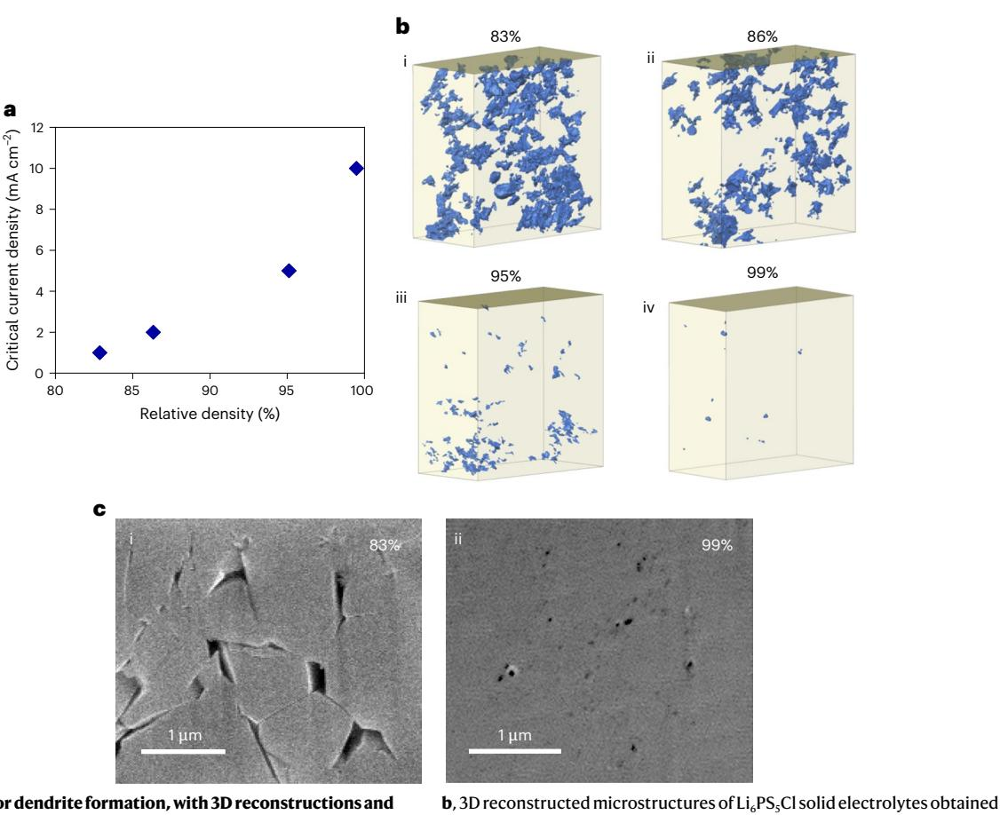
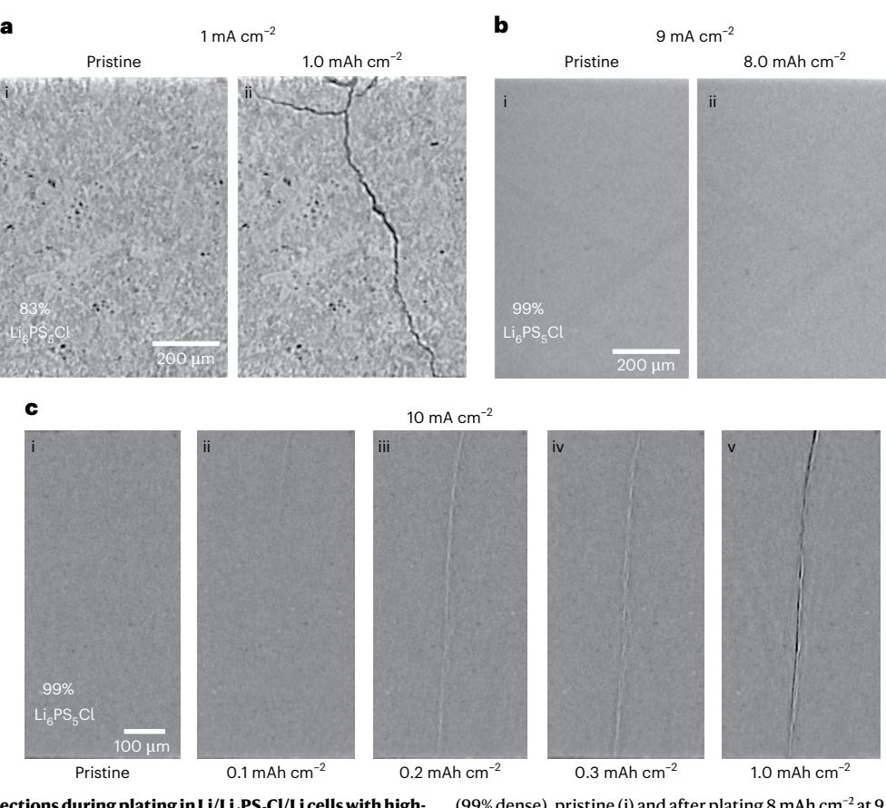
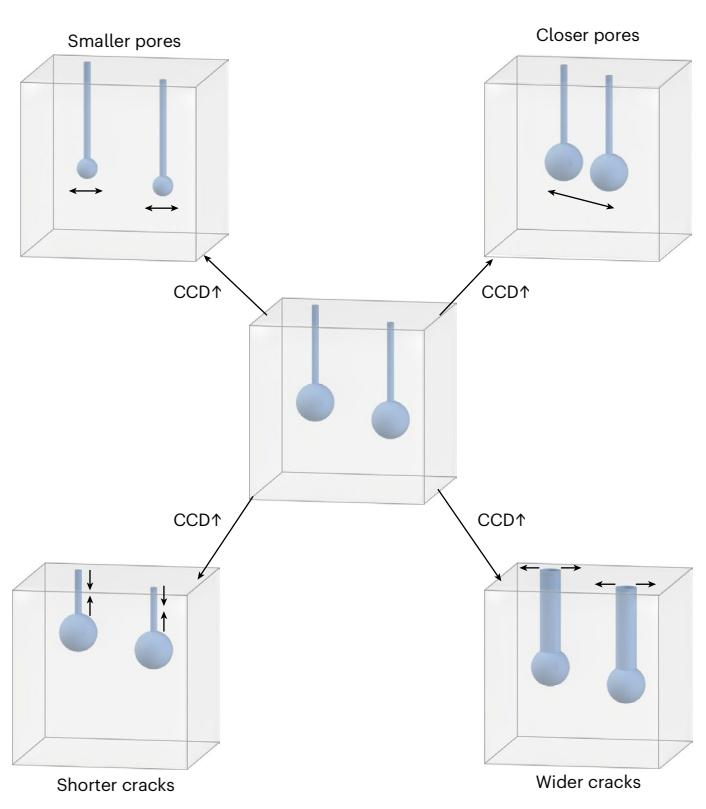
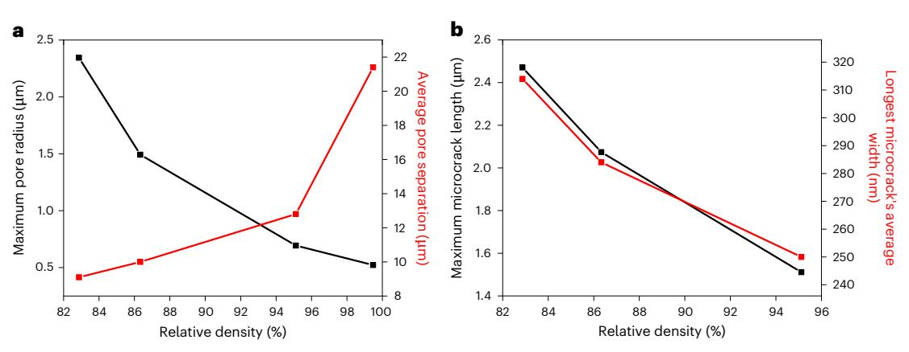
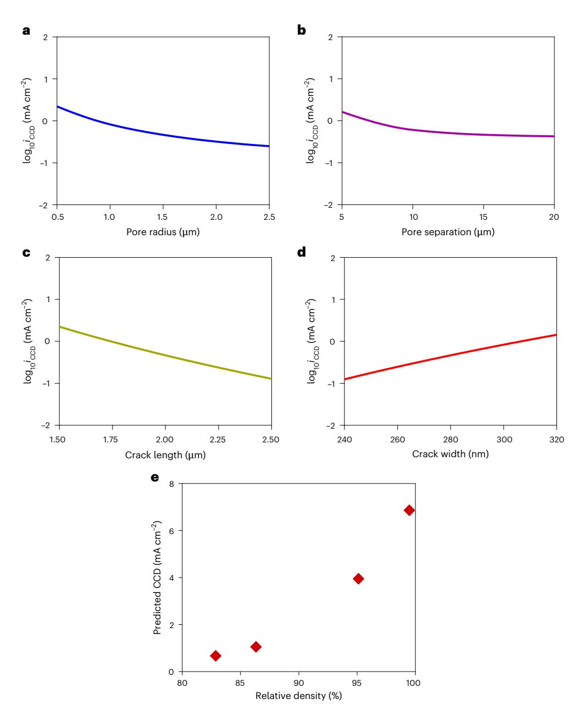
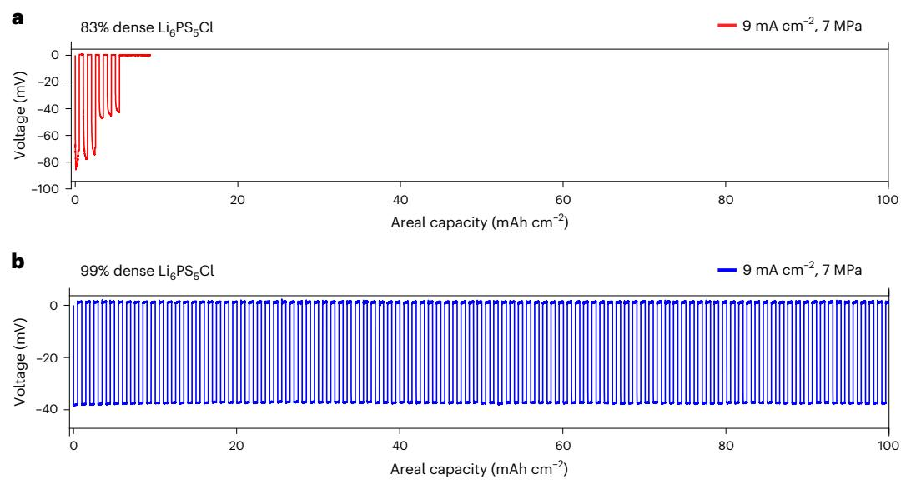

# nature energy

**Article** 

https://doi.org/10.1038/s41560-025-01847-0

# High plating currents without dendrites at the interface between a lithium anode and solid electrolyte

Received: 12 November 2024

Accepted: 31 July 2025

Published online: 04 September 2025

Check for updates

Dominic L. R. Melvin1, Marco Siniscalchi1, Dominic Spencer-Jolly 12, Bingkun Hu1, Ziyang Ning1, Shengming Zhang1, Junfu Bu1, Shashidhara Marathe3, Anne Bonnin4, Johannes Ihli1,4, Gregory J. Rees 1 Patrick S. Grant 1, Charles W. Monroe 5, T. James Marrow 1, Guanchen Li  $\mathbf{D}^6 \boxtimes \&$  Peter G. Bruce  $\mathbf{D}^{1,7} \boxtimes$ 

Avoiding lithium dendrites at the lithium/ceramic electrolyte interface and, as a result, avoiding cell short circuit when plating at practical current densities remains a significant challenge for all-solid-state batteries. Typically, values are limited to around 1 mA cm $-2$ , even, for example, for garnets with a relative density of  $>99\%$ . It is not obvious that simply densifying ceramic electrolytes will deliver high plating currents. Here we show that plating currents of 9 mA cm-2 can be achieved without dendrite formation, by densifying argyrodite, Li6PS5Cl, to 99%. Changes in the microstructure of Li6PS5Cl on densification from 83 to 99% were determined by focused ion beam-scanning electron microscopy tomography and used to calculate their effect on the critical current density (CCD). Modelling shows that not all changes in microstructure with densification act to increase CCD. Whereas smaller pores and shorter cracks increase CCD, lower pore population and narrower cracks act to decrease CCD. Calculations show that the former changes dominate over the latter, predicating an overall increase in CCD, as observed experimentally.

All-solid-state batteries based on a lithium metal anode and ceramic electrolyte have the potential to achieve high energy densities1-3. Avoiding lithium dendrites (filaments of lithium) that penetrate the solid electrolyte (SE) on charging (lithium plating) leading ultimately to a short circuit at practical current densities remains a substantial challenge4-22. The need for fast charging in, for example, electric vehicles means that plating current densities in excess of 5 mA cm $-2$  are desirable23,24. The major classes of solid electrolyte under consideration, garnets, sulfides and halides, struggle to achieve lithium plating currents in this range without dendrite penetration, short circuit and cell failure25-29. For example, extensive work on garnets, including lithium lanthanum zirconium oxide (LLZO), have shown that plating currents are typically limited to around 1 mA cm-2 even when the electrolyte is 99% dense or above, calling into question whether densifying polycrystalline ceramic electrolytes can achieve high plating currents30-32

Work to address the challenge of avoiding dendrites at high plating currents, that is achieving a high critical current density (CCD), has explored altering the Li/SE interface or modifying the solid electrolyte. At the Li/SE interface, notable strategies have included the addition of a thin interlayer and patterning of the solid electrolyte

1Department of Materials, University of Oxford, Oxford, UK. 2School of Metallurgy and Materials, University of Birmingham, Birmingham, UK. 3Diamond Light Source, Harwell Campus, Didcot, UK. 4Paul Scherrer Institut, Villigen, Switzerland. 5Department of Engineering Science, University of Oxford, Oxford, UK. 6James Watt School of Engineering, University of Glasgow, Glasgow, UK. 7Department of Chemistry, University of Oxford, Oxford, UK. e-mail: Guanchen.Li@glasgow.ac.uk; peter.bruce@materials.ox.ac.uk

**Fig. 1 | Critical currents for dendrite formation, with 3D reconstructions and FIB-SEM cross sections showing how CCDs increase with densification. a**, CCD for dendrite formation versus relative density of Li6PS5Cl solid electrolytes densified under different conditions: 83% (cold pressed), 86%, 95% and 99% spark plasma sintered at 300, 350 and 400 °C for 5 mins.

surface[33–](#page-7-7)[47.](#page-7-8) Regarding the solid electrolyte, the addition of composite phases, bilayered electrolytes and the use of single crystals have all been explored[30,](#page-7-5)[48–](#page-7-9)[54.](#page-7-10) An important study by Krauskopf et al[.55](#page-8-2) has demonstrated that high plating currents can be obtained at microelectrodes placed within grains, that is, in defect-free regions, yet, as the authors point out, such currents remain elusive when using bulk Li anodes. In an attempt to avoid grain boundaries, glasses have been investigate[d52](#page-7-11),[56](#page-8-3)[–59](#page-8-4). However, generally, glasses are found to be brittle, and despite avoiding grain boundaries, limiting imperfections may still remain[56](#page-8-3)[,60](#page-8-5). It has been reported that thin-film batteries based on LiPON can avoid dendrites when charged at fast rates, but their low conductivity means that they are not suitable for larger cell[s61](#page-8-6)[,62.](#page-8-7)

Sulfide-based solid electrolytes such as argyrodite, Li6PS5Cl, have high conductivities and have therefore received considerable attention as possible solid electrolytes for solid-state batterie[s63.](#page-8-8) Here we investigate the effect of densification on the Li6PS5Cl microstructure and CCD. We show that plating currents as high as 9 mA cm−2 can be achieved without lithium dendrites (and as a consequence without short circuit) by densifying the solid electrolyte to 99%. Extracting the changes in the microstructure on densification from focused ion beam-scanning electron microscopy (FIB-SEM) tomography and then using the changes in the microstructural dimensions to calculate CCD shows that the smaller pores and shorter cracks that occur on densification act to increase CCD, whereas narrower cracks and greater distance between pores (lower population density) act to reduce CCD. Therefore, not all the changes in the microstructure of Li6PS5Cl upon densification act to increase CCD. The calculations show that the reduction in pore size

using FIB-SEM serial sectioning and imaging: (i) 83% dense, (ii) 86% dense, (iii) 95% dense, (iv) 99% dense. Regions of porosity are coloured blue. **c**, (i) and (ii) are magnified FIB-SEM cross sections of the 83% and 99% dense solid electrolytes in (i) and (iv) from panel **b**.

and the shorter crack lengths outweigh the narrower cracks and lower population density, predicting higher CCDs overall with densification, which is confirmed by experiment. These high plating currents avoiding dendrites are achieved without the need to form alloys with lithium, without the need to modify the solid electrolyte surface or to introduce interlayers.

#### **CCD and microstructure on densification**

Li6PS5Cl polycrystalline solid electrolytes with a range of densities from 83% to 99% were prepared by sintering under different conditions. Powder X-ray diffraction patterns confirming the single-phase nature of the argyrodite after sintering are shown in Supplementary Fig. 1. The critical currents at which dendrites form (CCD) for the solid electrolytes of different density are shown in Fig. [1](#page-1-0), along with 3D reconstructed microstructures obtained by FIB-SEM serial sectioning and imaging and FIB-SEM cross sections. The CCD measurements and FIB-SEM are described in Methods. The CCD increases from 1 mA cm−2 for the 83% dense solid electrolyte to 10 mA cm−2 for the material with 99% relative density. The CCD results are supported by the micro X-ray computed tomography (XCT) data in Fig. [2](#page-2-0) discussed below, which show no dendritic cracks in the 99% dense solid electrolyte at 9 mA cm−2 but a dendrite at 10 mA cm−2. The lowest density solid electrolyte was formed by cold pressing the powder, which is the most widely used method for forming sulfide solid electrolyte[s5,](#page-6-3)[64](#page-8-0)[,65.](#page-8-1) Higher densities were achieved by spark plasma sintering. The process involves passing a current through the die and solid electrolyte disc, resulting in more homogeneous and rapid heating than conventional methods. Densities

**Fig. 2 | In situ XCT cross sections during plating in Li/Li6PS5Cl/Li cells with highand low-density electrolytes show dendrite cracks at the CCD but not below. a**–**c**, Virtual XCT cross sections of Li/Li6PS5Cl/Li cells with plating at the top electrode for a cold pressed Li6PS5Cl electrolyte (83% dense): pristine (i) and after plating 1 mAh cm−2 at 1 mA cm−2 (ii), (**a**); for a 400 °C sintered Li6PS5Cl electrolyte

(99% dense), pristine (i) and after plating 8 mAh cm−2 at 9 mA cm−2 (ii), (**b**), and the same density electrolyte with plating at 10 mA cm−2, pristine (i), after plating 0.1 mAh cm−2 (ii), 0.2 mAh cm−2 (iii), 0.3 mAh cm−2 (iv) and 1 mAh cm−2 (v) (**c**). The Li electrodes have been removed from the images for clarity.

of 86, 95 and 99% were obtained by heating respectively at 300, 350 and 400 °C for 5 mins. CCDs were determined as described in Methods (Supplementary Figs. 2 and 3), which also contains more details of the sintering. Densities were determined by weighing the discs and establishing the volume of the electrolyte from XCT measurements.

The microstructure changes significantly between 83% and 99% dense solid electrolytes. The 3D reconstructions (Fig. [1b\)](#page-1-0) show that the porosity decreases markedly with increasing densification. The SEM images in Fig. [1c](#page-1-0) show the presence of grains in the 83% dense material, whereas the 99% dense material exhibits greater homogeneity, making it harder to identify individual grains. Sulfides are mechanically soft. Their Young's moduli are typically in the range of 10–30 GPa (refs. [12,](#page-7-12)[60,](#page-8-5)[66](#page-8-9)[,67](#page-8-10)) compared with oxides of 150–200 GPa (refs. [68](#page-8-11)[–70\)](#page-8-12). We have previously measured the Young's modulus of Li6PS5Cl to be as low as 28 GPa (ref. [12](#page-7-12)). Conventional thinking based on oxide ceramics may not be the best approach to understand these compliant materials, which densify to some extend even with cold pressing and to a very significant extent when heated at relatively low temperatures (several hundred degrees) for short durations.

Whereas the CCD measurements indicate that densifying the electrolyte suppresses dendrites, and as a consequence short circuits, it is instructive to examine with XCT what happens when lithium is plated. XCT virtual cross sections are presented in Fig. [2.](#page-2-0) The data were collected from symmetric two-electrode cells with lithium being plated at the electrode at the top of the images. The lithium electrodes have been removed from the XCT for clarity. Figure [2a](#page-2-0) shows the virtual cross section of the cell with the 83% dense solid electrolyte before and after plating a capacity of 1 mAh cm−2 at a rate of 1 mA cm−2. The image after plating is very similar to those reported previously for lower-density argyrodite[12](#page-7-12),[13](#page-7-13), with a spalled-out piece of the ceramic and the transverse crack reaching the other electrode. The current density at which this occurs is also consistent with previous work[12,](#page-7-12)[13,](#page-7-13)[25](#page-7-3). In contrast, the cell with the 99% solid electrolyte plated at a current density of 9 mA cm−2 shows no evidence of a dendritic crack (Fig. [2b\)](#page-2-0). This is also demonstrated in the 3D reconstructions of the XCT data in Supplementary Fig. 4. Repeating the experiment on the 99% dense solid electrolyte but increasing the current density to 10 mA cm−2 does result in a dendritic crack (Fig. [2c](#page-2-0) and Supplementary Fig. 4). The cracks are however different between the low- and high-density ceramics. In the case of the dense solid electrolyte there is no evidence of spallation, and the transverse crack follows a very straight path to the other electrode. The XCT virtual cross-sectional images in Fig. [2b,c](#page-2-0) for 99% dense solid electrolytes confirm that the CCD is between 9 and 10 mA cm−2, in accord with the electrochemical measurements in Fig. [1](#page-1-0) and Supplementary Figs. 2 and 3.

#### **Microstructure determines critical current density**

The experimental results in Figs. [1](#page-1-0) and [2](#page-2-0) show that sintering changes the Li6PS5Cl solid electrolyte microstructure and increases CCD. However, are the changes in microstructure with densification responsible for the high CCD? To explore how the changes in microstructure influence CCD, we need to extract the dimensions of the microstructure (pores and cracks) and how they change on densification, then use these to calculate the CCDs. For the latter, we employ the recently published model of dendrite penetration into polycrystalline ceramic electrolyte[s12.](#page-7-12)

**Fig. 3 | Schematic demonstrating key parameters affecting dendrite initiation.** Reduction in pore size and pore separation, shorter and wider cracks lead to an increase in the CCD.

The dendrite model is based on the viscoplastic flow of lithium. On plating, Li deposits and grows along cracks in the ceramic from the anode to fill sub-surface pores. If the current density is sufficiently high that the Li being plated into the pores exceeds the Li flow out to the extent that pressure in the pores exceeds the local fracture strength at the grain boundaries, then a dendritic crack initiates. As illustrated in Fig. [3,](#page-3-0) the CCD for crack initiation depends on the pore size and population density (pore proximity) and the length and width of cracks connecting the pores to the interfac[e12](#page-7-12). More details of the model can be found in the Supplementary Methods and Supplementary Fig. 5.

The dimensions of the microstructure pores and cracks for each of the densified Li6PS5Cl solid electrolytes were determined by analysing the FIB-SEM tomographic images from the near surface region of each electrolyte, providing a resolution (~40 nm) which is below the limit typically available from XCT measurements. The method involves imaging a series of FIB-SEM sections allowing reconstruction of a 3D volume, which can be analysed. How the dimensions were obtained from the imaging for each microstructure is described further in the Methods. The microstructure of a polycrystalline ceramic contains a distribution of pore and crack sizes. Our previous work showed that it is the large pores within the distribution of pore sizes that are primarily responsible for dendrite formation[12](#page-7-12). They are the weakest points as their larger surface area results in greater influx of lithium, hence greater pressure in the pore for a given overall current density. Considering the differently densified solid electrolytes, the largest pores range from 0.5 (high density) to 2.3 µm (low density) in radii. Our model does not consider an isolated pore but rather an array of pores distributed in three dimensions. The current at a given pore is affected by the size and proximity of the neighbouring pores[12.](#page-7-12) The neighbouring pores spread the current reducing it at each pore. When evaluating the proximity of pores, we consider only the large pores, that is, within a pore radius of 1/3rd. This is because we have shown that it is the large pores that take by far the most current. Pores that are less than 1/3rd of the radius of the larger pores attract less than 10% of the current. This is shown in Supplementary Fig. 6, where we calculate the current distribution between pores and show that the central smaller pore, which is 1/3rd smaller in radius, experiences only 10% of the current. Because it is these larger pores that are experiencing and influencing the vast majority of the current, they are those critical to predicting dendrite crack initiation. When considering the proximity of the large pores to one another across different density electrolytes, the average pore proximity ranges from 10 (in low-density microstructures) to 22 µm (in high-density microstructures), as shown in Fig. [4a](#page-4-0). The pore sizes and proximities from the microstructural analysis were used to define the ranges shown in Fig. [4a](#page-4-0). Pores very close to the surface cannot build pressures to crack the ceramic as extrusion is too fast (easy), also the modelling shows deeper pores attract more current and so will build greater pressure (Supplementary Fig. 7). Therefore, we consider the longer cracks (deeper pores) for each density and their associated widths. The longest cracks measured within the differently densified solid electrolytes were found to range from 2.5 (low density) to 1.5 µm (high density). The average widths of the longest cracks (within 33% of the longest cracks) within each electrolyte was found to vary from 158 (low density) to 125 nm (high density). The crack lengths and widths were used to define the ranges in Fig. [4b](#page-4-0).

Figure [5a–d](#page-4-1) illustrates how CCD varies with pore size and separation and crack length and width. The ranges of the microstructure dimensions used in Fig. [5](#page-4-1) are obtained from Fig. [4,](#page-4-0) and thus represent typical values expected when densifying Li6PS5Cl. Looking at Fig. [5a,b](#page-4-1), CCD decreases with increasing pore size and separation, both due to their effect on the magnitude of current experienced by a given pore. As shown in Fig. [5c,d](#page-4-1), CCD increases with increasing crack width and decreases with increasing crack length, both due to the effect of width and length on the rate of Li extrusion. The dependence of CCD on a wider range of microstructural dimensions is shown in Supplementary Figs. 8 and 9, but the trends are the same as in Fig. [5.](#page-4-1) Figure [4](#page-4-0) shows that densifying Li6PS5Cl results in shorter and narrower cracks and smaller pores with greater separation. Therefore modelling shows that not all changes in microstructure during the densification of Li6PS5Cl act to increase CCD. Whereas decreasing crack width and increasing pore separation acts to decrease CCD, at the same time, the decreasing crack length and pore size act to increase it. The calculations show (Fig. [5e](#page-4-1)) that the former outweigh the latter predicting an overall increase in CCD as observed experimentally (Fig. [1\)](#page-1-0). Whereas the trends in the predicted and experimental CCDs are the same (Figs. [1a](#page-1-0) and [5e\)](#page-4-1), we do not expect a close match between the absolute values; for example, even the larger pores for a given density are not of identical size. Also, the microstructure model assumes a simple geometry for pores (spheres) and cracks (cylinders) whereas actual pores and cracks will have more complex shapes. We used a combination of cold pressing and spark plasma sintering because no single method alone could provide a density range as wide as 83–99%, the alignment between experimental and modelled CCDs shows that our model is more general than just one densification method, and it shows that the CCD is indeed determined by the microstructure, however formed.

#### **Stable lithium plating at high current density**

The high CCD of 10 mA cm−2 for the 99% densified solid electrolyte (Fig. [1\)](#page-1-0) enables extended cycling without short circuit at high, practical, plating current densities. This is illustrated in Fig. [6](#page-5-0), where three electrode cells with a lithium working electrode are plated at a current density of 9 mA cm−2. In the case of the 83% dense (cold pressed) Li6PS5Cl solid electrolyte the cell short circuits after six cycles. Whereas the 99% dense Li6PS5Cl solid electrolyte cycled continuously until the cycling was stopped after 100 cycles. In both cases stripping was carried out at the lower current density of 0.05 mA cm−2 to avoid voiding at the interface. It is worth noting that even the 99% dense Li6PS5Cl discs retain surface roughness, as shown by the atomic force microscopy

Fig. 4 | Plots of how pore and crack dimensions vary with density of Li6PS3Cl constructed using values from FIB-SEM tomography. a, The largest pore size and their average separation. **b**, The maximum crack length and their associated width. Black data correspond to the left y axis and red data correspond to the right y axis.

Fig. 5| Effect of pore size and separation as well as crack length and width on the CCD calculated using the dendrite model. a-d, The effect on the CCD for dendrite initiation of pore radius (a), pore separation (b), crack length (c) and crack width (d). e, Plot of predicted overall CCDs for each density of  $Li_6PS_3Cl$ .

**Fig. 6 | Repeated fast plating at 9 mA cm−2 enabled by densifying the Li6PS5Cl microstructure. a**,**b**, Cycling of Li/Li6PS5Cl 3-electrode cells with current densities of 9 mA cm−2 for plating, 0.05 mA cm−2 for stripping (to avoid void

formation), both for a capacity of 0.5 mAh cm−2, under 7 MPa stack pressure, with a cold pressed Li6PS5Cl disk (83% dense) (**a**) and a 400 °C sintered Li6PS5Cl disk (99% dense) (**b**).

(AFM) scans in Supplementary Fig. 10, therefore the differences in CCD are not due to difference in surface roughness. A previous interesting study by Diallo et al.[71](#page-8-13) discusses how dendrites may form in low-density electrolytes where there is continuous and connected porosity. The study is complementary to our work which further explores the dendrite mechanism of the high-density regime where the porosity of the electrolyte is isolated, and cracks are initiated for the lithium to grow. In this case it is necessary to reach a critical current, CCD, to initiate dendrites. Together the studies offer important insights to the dendrite problem. As the focus of this Article is the effect of densification on dendrite suppression on plating and not on voiding, when stripping, we used a 7 MPa stack pressure along with the 0.05 mA cm−2 stripping current mentioned above to prevent voiding formation. The sustained cyclability of the 99% dense solid electrolyte is not related to any suppression of dendrite propagation after initiation. As shown by the XCT images in Fig. [2,](#page-2-0) there are no dendrites at this plating current density.

It has been shown previously that Li6PS5Cl reacts with Li metal to form a solid electrolyte interphase. However, the growth slows with time and the layer stabilizes regardless of electrolyte density (Supplementary Fig. 11) and is invariant with cycling (Supplementary Fig. 12).

# **Conclusions**

Sintering argyrodite, Li6PS5Cl, solid electrolytes to a density of 99% results in a critical current for lithium dendrites of 10 mA cm−2. Plating lithium at the solid electrolyte interface at a current density of 9 mA cm−2 shows no evidence of lithium dendrites electrochemically or in XCT imaging. The early motivation to develop ceramic electrolyte batteries was based on the belief that dense ceramics would not permit Li dendrites to form and short circuit cells. Yet, previous studies have suggested that dense ceramics, even with 99% density, do not guarantee Li plating at practical current[s30](#page-7-5)[,31](#page-7-14). Critical currents are often limited to a few mA cm−2. The results here show that not all the changes in microstructure on densification necessarily favour increased CCDs. Densification decreases crack width and increasing pore separation, which act to decrease CCD, whereas the decreasing crack length and smaller pores act to increase CCD. For Li6PS5Cl, the latter outweighs the former. The high degree of densification is achieved here by spark plasma sintering. A future challenge is to achieve high degrees of densification by more scalable routes. It is known that spark plasma sintering

[Nature Energy](http://www.nature.com/natureenergy)

typically induces densification of ceramics with limited grain growth as compared to other techniques, and in general, different densification protocols are known to result in different microstructures of polycrystalline ceramics[72](#page-8-14)–[77.](#page-8-15) The results reported here inspire investigation of other densification methods directed to optimizing the microstructural parameters that increase CCD, such as small pores, while suppressing those that act to decrease CCD, such as narrow cracks. Our results also highlight the need to study microstructure and CCD relations across a range of material systems. Future work focussed on scalable sintering of sulfide electrolytes may enable practical charging rates for solid-state cells employing lithium anodes without the need to form composite electrolytes or use interlayers.

# **Methods**

#### **Spark plasma sintering and electrolyte preparation**

All procedures were performed in an Ar-filled glovebox (O2 and H2O levels < 1 ppm). Li6PS5Cl powder was purchased from Ampcera (scanning electron microscopy (SEM) of as-received power shown in Supplementary Fig. 13), and measurements were performed to verify the absence of any carbon impurities (Supplementary Fig. 14). The powder was loaded into a graphite die set, which was then inserted into a spark plasma sintering system (FCT systeme GmbH) within an Ar-filled glovebox and subject to 50 MPa uniaxial pressure at either 300 °C, 350 °C or 400 °C for 5 min while under vacuum by passing a current through the die set. Five-mm-diameter sintered electrolyte discs of identical thickness (1 mm) were then used for cell assembly. Electrochemical impedance spectroscopy (EIS) measurements confirm an increase in conductivity with densification (Supplementary Figs. 15 and 16), consisted with lower grain boundary resistances on densification. Cold pressed electrolyte discs were formed by loading the same pristine electrolyte powder into a 5-mm-diameter stainless-steel die set and pressing under a uniaxial pressure of 400 MPa. To determine the relative density of the electrolytes, discs were weighed, and their total volume measured using micro-XCT. The densities calculated from the FIB-SEM tomography deviate within 2% of the bulk micro-XCT measurement. When using micro-XCT, the volume of the entire electrolyte disc is determined with a spatial resolution of ~1.6 µm and the weight of the disc measured to ±1 µg accuracy, and so its value is considered the most accurate.

#### **Three-electrode cells**

For a three-electrode cell, two disc-shaped lithium electrodes of 1-mm diameter were pressed onto the same side of the electrolyte disc as the working and reference electrodes, respectively. The remaining areas of the electrolyte surface were then covered by insulating polymer tape. A 5-mm lithium disc was pressed onto the opposite side as the counter electrode. The assembly was placed into a pouch cell and sealed under vacuum. A stack pressure of 7 MPa was applied to all cells in this study. The CCD is strictly defined as the current density at which dendrites form and below which they do not. Commonly implemented 'rate-test' protocols using symmetric cells with two Li electrodes can suffer from a number of problems including void formation at the interface[31](#page-7-14),[78.](#page-8-16) Here we determine CCD using three-electrode cells to avoid interference from the second electrode. By using asymmetrical three-electrode cells, we can further mitigate any void formation at the counter, which may influence the CCD measurement in symmetrical cells. To enable a more statistical conclusion, three tests at each current were repeated at the same relative density; currents below the CCD showed no indications of dendrite failure whereas those at the CCD always failed. Galvanostatic single plating for a capacity of 8 mAh cm−2 was used. For cycling studies, cells were cycled galvanostatically with a capacity on each half cycle of 0.5 mAh cm−2. Although the plating current on the working electrode was 9.0 mA cm−2, a current density of 0.05 mA cm−2 was used on stripping to avoid void formation at the working electrode–solid electrolyte interface (Supplementary Fig. 17). The 1-mm diameter working electrode compared with the 5-mm diameter counter can lead to some current focussing at the working electrode edge. This would mean that the CCD could be even higher than observed here. The 1-mm diameter working electrode still represents a sampling of thousands of pores and cracks, even for high-density electrolytes. All galvanostatic measurements were performed using a Gamry Interface 1010 potentiostat.

#### **Potentiostatic EIS**

Potentiostatic electrochemical impedance spectroscopy (PEIS) was taken using a 5-mV voltage perturbation, collecting ten points per decade across a frequency range of 1 MHz–1 Hz. PEIS data were analysed and fitted by equivalent circuit models using the ZView software package.

#### **In situ X-ray tomography**

X-ray tomograms were recorded at the I13-2 beamline at the Diamond Light Source and the TOMCAT beamline at the Swiss Light Source (Paul Scherrer Institute). For both experiments the projections were collected with a PCO pco.edge 5.5 sCMOS camera combined with an optical microscope with a 4× magnification, resulting in a pixel size of 1.63 µm. For each tomogram, 1,801 equiangularly distributed projections were taken over 180°. Additionally, X-ray tomograms were collected using a Zeiss Xradia 610 Versa X-ray microscope and 3,201 equiangularly distributed projections were taken over 360° for each tomogram, with a resultant pixel size of 1.63 µm. For the in situ measurements, metallic lithium foil was punched into disc-shaped lithium electrodes and pressed onto both sides of the electrolyte disc, 1-mm diameter electrodes were used for the working electrode and 3 mm for the counter. X-ray tomograms were obtained at the pristine state and after charging in successive steps of 0.1 mAh cm−2. During the experiment, 7 MPa of pressure was applied using a constantly applied spring force, which was measured and calibrated using a transducer.

# **Plasma FIB-SEM and microstructure analysis**

Solid electrolyte discs were transferred into the chamber of a plasma FIB scanning electron microscope (Helios G4 PFIB DualBeam, ThermoFisher Scientific) for FIB milling with an iLoad vacuum sample transfer system without exposure to air. Automated serial sectioning was used to obtain a three-dimensional depiction of the porosity. A 30 kV and 15 nA Xe+ beam was used to slice the volume of interest and capture a stack of secondary electron cross-sectional images. Each slice had a thickness of 100 nm. The freshly milled cross section was then imaged with the SEM to visualize the pores and cracks in proximity of the pellet surface. To construct a three-dimensional view, the sequence of 2D secondary electron images were aligned using Avizo 3D (version 2021.2, ThermoFisher Scientific). Example 2D secondary electron images used to generate the 3D microstructures in Fig. [1b](#page-1-0) are shown in Supplementary Fig. 18. Using the Avizo 3D software the images were subjected to a semi-automated segmentation process to differentiate between pores, cracks and bulk electrolyte. In our microstructural analysis, we only considered features with a 3:1 length:width aspect ratio or higher as cracks. The dimensions of the largest pores and longest cracks were obtained from the segmentation analysis and used as inputs for the modelling simulations.

#### **Powder XRD**

The electrolyte discs were ground into powders using a pestle and mortar. X-ray diffraction was performed using a Rigaku MiniFlex 600 instrument located within a nitrogen glovebox.

## **Data availability**

The data supporting the findings of this study are available within the article and its Supplementary Information files.

# **Code availability**

The code used for the modelling in this study is available via Zenodo at<https://doi.org/10.5281/zenodo.10523607> (ref. [79](#page-8-17)).

#### **References**

- 1. Janek, J. & Zeier, W. G. A solid future for battery development. *Nat. Energy* **1**, 16141 (2016).
- 2. Liu, J. et al. Pathways for practical high-energy long-cycling lithium metal batteries. *Nat. Energy* **4**, 180–186 (2019).
- 3. Famprikis, T., Canepa, P., Dawson, J. A., Islam, M. S. & Masquelier, C. Fundamentals of inorganic solid-state electrolytes for batteries. *Nat. Mater.* **18**, 1278–1291 (2019).
- 4. McConohy, G. et al. Mechanical regulation of lithium intrusion probability in garnet solid electrolytes. *Nat. Energy* **8**, 241–250 (2023).
- 5. Singh, D. K. et al. Li6PS5Cl microstructure and influence on dendrite growth in solid-state batteries with lithium metal anode. *Cell Rep. Phys. Sci.* **3**, 101043 (2022).
- 6. Singh, D. K., Fuchs, T., Krempaszky, C., Mogwitz, B. & Janek, J. Non-linear kinetics of the lithium metal anode on Li6PS5Cl at high current density: dendrite growth and the role of lithium microstructure on creep. *Adv. Sci.* **10**, 2302521 (2023).
- 7. Cho, J. H. et al. An investigation of chemo-mechanical phenomena and Li metal penetration in all-solid-state lithium metal batteries using in situ optical curvature measurements. *Adv. Energy Mater.* **12**, 2200369 (2022).
- 8. Barroso-Luque, L., Tu, Q. & Ceder, G. An analysis of solid-state electrodeposition-induced metal plastic flow and predictions of stress states in solid ionic conductor defects. *J. Electrochem. Soc.* **167**, 20534 (2020).
- 9. Tu, Q., Shi, T., Chakravarthy, S. & Ceder, G. Understanding metal propagation in solid electrolytes due to mixed ionic-electronic conduction. *Matter* **4**, 3248–3268 (2021).
- 10. Cheng, L. et al. Efect of surface microstructure on electrochemical performance of garnet solid electrolytes. *ACS Appl. Mater. Interfaces* **7**, 2073–2081 (2015).
- 11. Geng, L. et al. Morphodynamics of dendrite growth in alumina based all solid-state sodium metal batteries. *Energy Environ. Sci.* **16**, 2658–2668 (2023).

- 12. Ning, Z. et al. Dendrite initiation and propagation in lithium metal solid-state batteries. *Nature* **618**, 287–293 (2023).
- 13. Ning, Z. et al. Visualizing plating-induced cracking in lithium-anode solid-electrolyte cells. *Nat. Mater.* **20**, 1121–1129 (2021).
- 14. Kazyak, E. et al. Li penetration in ceramic solid electrolytes: operando microscopy analysis of morphology, propagation, and reversibility. *Matter* **2**, 1025–1048 (2020).
- 15. Fincher, C. D. et al. Controlling dendrite propagation in solid-state batteries with engineered stress. *Joule* **6**, 2794–2809 (2022).
- 16. Liu, X. et al. Local electronic structure variation resulting in Li 'filament' formation within solid electrolytes. *Nat. Mater.* **20**, 1485–1490 (2021).
- 17. Han, F. et al. High electronic conductivity as the origin of lithium dendrite formation within solid electrolytes. *Nat. Energy* **4**, 187–196 (2019).
- 18. Fu, C. et al. Universal chemomechanical design rules for solid-ion conductors to prevent dendrite formation in lithium metal batteries. *Nat. Mater.* **19**, 758–766 (2020).
- 19. Wan, H. et al. Critical interphase overpotential as a lithium dendrite-suppression criterion for all-solid-state lithium battery design. *Nat. Energy* **8**, 473–481 (2023).
- 20. Dixit, M. B. et al. Polymorphism of garnet solid electrolytes and its implications for grain-level chemo-mechanics. *Nat. Mater.* **21**, 1298–1305 (2022).
- 21. Lewis, J. A. et al. Linking void and interphase evolution to electrochemistry in solid-state batteries using operando X-ray tomography. *Nat. Mater.* **20**, 503–510 (2021).
- 22. Liang, Z. et al. Understanding the failure process of sulfide-based all-solid-state lithium batteries via operando nuclear magnetic resonance spectroscopy. *Nat. Commun.* **14**, 259 (2023).
- 23. Wang, M. J., Kazyak, E., Dasgupta, N. P. & Sakamoto, J. Transitioning solid-state batteries from lab to market: linking electro-chemo-mechanics with practical considerations. *Joule* **5**, 1371–1390 (2021).
- 24. Janek, J. & Zeier, W. G. Challenges in speeding up solid-state battery development. *Nat. Energy* **8**, 230–240 (2023).
- 25. Kasemchainan, J. et al. Critical stripping current leads to dendrite formation on plating in lithium anode solid electrolyte cells. *Nat. Mater.* **18**, 1111 (2019).
- 26. Ham, S.-Y. et al. Assessing the critical current density of all-solid-state Li metal symmetric and full cells. *Energy Storage Mater.* **55**, 455–462 (2023).
- 27. Zhu, C. et al. Understanding the evolution of lithium dendrites at Li6.25Al0.25La3Zr2O12 grain boundaries via operando microscopy techniques. *Nat. Commun.* **14**, 1300 (2023).
- 28. Zhou, L. et al. High areal capacity, long cycle life 4 V ceramic all-solid-state Li-ion batteries enabled by chloride solid electrolytes. *Nat. Energy* **7**, 83–93 (2022).
- 29. Yin, Y.-C. et al. A LaCl3-based lithium superionic conductor compatible with lithium metal. *Nature* **616**, 77–83 (2023).
- 30. Reisecker, V. et al. Efect of pulse-current-based protocols on the lithium dendrite formation and evolution in all-solid-state batteries. *Nat. Commun.* **14**, 2432 (2023).
- 31. Fuchs, T., Haslam, C. G., Richter, F. H., Sakamoto, J. & Janek, J. Evaluating the use of critical current density tests of symmetric lithium transference cells with solid electrolytes. *Adv. Energy Mater.* **13**, 2302383 (2023).
- 32. Shen, F., Dixit, M. B., Xiao, X. & Hatzell, K. B. Efect of pore connectivity on Li dendrite propagation within LLZO electrolytes observed with synchrotron X-ray tomography. *ACS Energy Lett.* **3**, 1056–1061 (2018).
- 33. Lee, Y.-G. et al. High-energy long-cycling all-solid-state lithium metal batteries enabled by silver–carbon composite anodes. *Nat. Energy* **5**, 299–308 (2020).

- 34. Spencer-Jolly, D. et al. Structural changes in the silver-carbon composite anode interlayer of solid-state batteries. *Joule* **7**, 503–514 (2023).
- 35. Kim, N. et al. Carbide-mediated catalytic hydrogenolysis: defects in graphene on a carbonaceous lithium host for liquid and all-solid-state lithium metal batteries. *Energy Environ. Sci.* **16**, 2505–2517 (2023).
- 36. Chen, Y. et al. Li metal deposition and stripping in a solid-state battery via Coble creep. *Nature* **578**, 251–255 (2020).
- 37. Deng, T. et al. Tuning the anode–electrolyte interface chemistry for garnet-based solid-state Li metal batteries. *Adv. Mater.* **32**, 2000030 (2020).
- 38. Han, X. et al. Negating interfacial impedance in garnet-based solid-state Li metal batteries. *Nat. Mater.* **16**, 572 (2017).
- 39. Feng, W. et al. Stabilization of garnet/Li interphase by diluting the electronic conductor. *Sci. Adv.* **8**, eadd8972 (2023).
- 40. Landgraf, V. et al. Li5NCl2: a fully-reduced, highly-disordered nitride-halide electrolyte for solid-state batteries with lithium-metal anodes. *ACS Appl. Energy Mater.* **6**, 1661–1672 (2023).
- 41. Inaoka, T. et al. Tin interlayer at the Li/Li3PS4 interface for improved Li stripping/plating performance. *J. Phys. Chem. C* **127**, 10453–10458 (2023).
- 42. Park, R. J.-Y. et al. Semi-solid alkali metal electrodes enabling high critical current densities in solid electrolyte batteries. *Nat. Energy* **6**, 314–322 (2021).
- 43. Peng, J. et al. High current density and long cycle life enabled by sulfide solid electrolyte and dendrite-free liquid lithium anode. *Adv. Funct. Mater.* **32**, 2105776 (2022).
- 44. Basappa, R.H. et al. Contact between garnet-type solid eleÿctrolyte and lithium metal anode: influence on charge transfer resistance and short circuit prevention. *J. Electrochem. Soc.* **164**, A666 (2017).
- 45. Xu, R. et al. A morphologically stable Li/electrolyte interface for all-solid-state batteries enabled by 3D-micropatterned garnet. *Adv. Mater.* **33**, 2104009 (2021).
- 46. Xu, S. et al. Three-dimensional, solid-state mixed electron–ion conductive framework for lithium metal anode. *Nano Lett.* **18**, 3926–3933 (2018).
- 47. Zhang, S. et al. Influence of contouring the lithium metal/solid electrolyte interface on the critical current for dendrites. *Energy Environ. Sci.* **17**, 1448–1456 (2024).
- 48. Yersak, T., Salvador, J. R., Schmidt, R. D. & Cai, M. Hot pressed, fiber-reinforced (Li2S)70(P2S5)30 solid-state electrolyte separators for Li metal batteries. *ACS Appl. Energy Mater.* **2**, 3523–3531 (2019).
- 49. Wang, S. et al. High-conductivity free-standing Li6PS5Cl/ poly(vinylidene difluoride) composite solid electrolyte membranes for lithium-ion batteries. *J. Materiomics* **6**, 70–76 (2020).
- 50. Ye, L. & Li, X. A dynamic stability design strategy for lithium metal solid state batteries. *Nature* **593**, 218–222 (2021).
- 51. Pervez, S. A. et al. Fabrication of a dendrite-free all solid-state Li metal battery via polymer composite/garnet/polymer composite layered electrolyte. *Adv. Mater. Interfaces* **6**, 1900186 (2019).
- 52. Porz, L. et al. Mechanism of lithium metal penetration through inorganic solid electrolytes. *Adv. Energy Mater.* **7**, 1701003 (2017).
- 53. Swamy, T. et al. Lithium metal penetration induced by electrodeposition through solid electrolytes: example in single-crystal Li6La3ZrTaO12 garnet. *J. Electrochem. Soc.* **165**, A3648–A3655 (2018).
- 54. Hu, B. et al. Deflecting lithium dendritic cracks in multi-layered solid electrolytes. *Joule* **8**, 2623–2638 (2024).

- 55. Krauskopf, T. et al. The fast charge transfer kinetics of the lithium metal anode on the garnet-type solid electrolyte Li6.25Al0.25La3Zr2O12. *Adv. Energy Mater.* **10**, 2000945 (2020).
- 56. Yersak, T. A., Salvador, J. R., Pieczonka, N. P. W. & Cai, M. Dense, melt cast sulfide glass electrolyte separators for Li metal batteries. *J. Electrochem. Soc.* **166**, A1535 (2019).
- 57. Garcia-Mendez, R., Mizuno, F., Zhang, R., Arthur, T. S. & Sakamoto, J. Efect of processing conditions of 75Li2S-25P2S5 solid electrolyte on its DC electrochemical behavior. *Electrochim. Acta* **237**, 144–151 (2017).
- 58. Garcia-Mendez, R., Smith, J. G., Neuefeind, J. C., Siegel, D. J. & Sakamoto, J. Correlating macro and atomic structure with elastic properties and ionic transport of glassy Li2S–P2S5 (LPS) solid electrolyte for solid-state Li metal batteries. *Adv. Energy Mater.* **5**, 2000335 (2020).
- 59. Asakura, T. et al. Stack pressure dependence of Li stripping/ plating performance in all-solid-state Li metal cells containing sulfide glass electrolytes. *ACS Appl. Mater. Interfaces* **15**, 31403–31408 (2023).
- 60. McGrogan, F. P. et al. Compliant yet brittle mechanical behavior of Li2S–P2S5 lithium-ion-conducting solid electrolyte. *Adv. Energy Mater.* **7**, 1602011 (2017).
- 61. Bates, J. B., Dudney, N. J., Neudecker, B., Ueda, A. & Evans, C. D. Thin-film lithium and lithium-ion batteries. *Solid State Ion.* **135**, 33–45 (2000).
- 62. López-Aranguren, P. et al. Crystalline LiPON as a bulk-type solid electrolyte. *ACS Energy Lett.* **6**, 445–450 (2021).
- 63. Kato, Y. et al. High-power all-solid-state batteries using sulfide superionic conductors. *Nat. Energy* **1**, 16030 (2016).
- 64. Lewis, J. A. et al. Role of areal capacity in determining short circuiting of sulfide-based solid-state batteries. *ACS Appl. Mater. Interfaces* **14**, 4051–4060 (2022).
- 65. Doux, J.-M. et al. Stack pressure considerations for room-temperature all-solid-state lithium metal batteries. *Adv. Energy Mater.* **10**, 1903253 (2020).
- 66. Kato, A., Yamamoto, M., Sakuda, A., Hayashi, A. & Tatsumisago, M. Mechanical properties of Li2S–P2S5 glasses with lithium halides and application in all-solid-state batteries. *ACS Appl. Energy Mater.* **1**, 1002–1007 (2018).
- 67. Hikima, K., Totani, M., Obokata, S., Muto, H. & Matsuda, A. Mechanical properties of sulfide-type solid electrolytes analyzed by indentation methods. *ACS Appl. Energy Mater.* **5**, 2349–2355 (2022).
- 68. Wang, A.-N. et al. Mechanical properties of the solid electrolyte Al-substituted Li7La3Zr2O12 (LLZO) by utilizing micro-pillar indentation splitting test. *J. Eur. Ceram. Soc.* **38**, 3201–3209 (2018).
- 69. Wolfenstine, J., Allen, J. L., Sakamoto, J., Siegel, D. J. & Choe, H. Mechanical behavior of Li-ion-conducting crystalline oxide-based solid electrolytes: a brief review. *Ionics* **24**, 1271–1276 (2018).
- 70. Ni, J. E., Case, E. D., Sakamoto, J. S., Rangasamy, E. & Wolfenstine, J. B. Room temperature elastic moduli and Vickers hardness of hot-pressed LLZO cubic garnet. *J. Mater. Sci.* **47**, 7978–7985 (2012).
- 71. Diallo, M. S. et al. Efect of solid-electrolyte pellet density on failure of solid-state batteries. *Nat. Commun.* **15**, 858 (2024).
- 72. Lian, J. et al. Influence of cooling rates on the microstructure and mechanical properties of aluminum titanate flexible ceramic. *Adv. Eng. Mater.* **23**, 2100170 (2021).
- 73. Shojai, F. & Mäntylä, T. A. Efect of sintering temperature and holding time on the properties of 3Y-ZrO2 microfiltration membranes. *J. Mater. Sci.* **36**, 3437–3446 (2001).
- 74. Varela, J. A., Whittemore, O. J. & Longo, E. Pore size evolution during sintering of ceramic oxides. *Ceram. Int.* **16**, 177–189 (1990).

- 75. Lóh, N. J., Simão, L., Faller, C. A., De Noni, A. & Montedo, O. R. K. A review of two-step sintering for ceramics. *Ceram. Int.* **42**, 12556–12572 (2016).
- 76. Olevsky, E. A., Kandukuri, S. & Froyen, L. Consolidation enhancement in spark-plasma sintering: impact of high heating rates. *J. Appl. Phys.* **102**, 114913 (2007).
- 77. Zhang, Y. et al. Sintering characteristics and grain growth behavior of MgO nanopowders by spark plasma sintering. *J. Alloy. Compd.* **608**, 304–310 (2014).
- 78. Lu, Y. et al. Critical current density in solid-state lithium metal batteries: mechanism, influences, and strategies. *Adv. Funct. Mater.* **31**, 2009925 (2021).
- 79. Li, G., Melvin, D.L.R., Ning, Z., Monroe, C.W. & Bruce, P.G., Model of dendritic crack initiation. *Zenodo* [https://doi.org/10.5281/](https://doi.org/10.5281/zenodo.10523607) [zenodo.10523607](https://doi.org/10.5281/zenodo.10523607) (2024).

## **Acknowledgements**

P.G.B. is indebted to the Faraday Institution SOLBAT (FIRG007, FIRG008, FIRG026, FIRG056, FIRG078) and the Engineering and Physical Sciences Research Council, the University of Oxford experimental equipment upgrade (EP/M02833X/1) and the Henry Royce Institute for Advanced Materials (EP/R0066X/1, EP/S019367/1, EP/R010145/1) for financial support. G.L acknowledges the support from Royal Society Research Grant (number RG\R1\251234). D.S.-J. acknowledges support from the Royal Society (grant RGS\R2\242573). We thank Diamond Light Source, Harwell, United Kingdom, and Paul Scherrer Institut, Villigen, Switzerland, for provision of synchrotron radiation beam time. We acknowledge technical and experimental support at I13-2 by S. Marathe and at TOMCAT by A. Bonnin. We acknowledge use of characterization facilities within the David Cockayne Centre for Electron Microscopy, Department of Materials, University of Oxford, alongside financial support provided by the Henry Royce Institute (grant reference EP/R010145/1).

# **Author contributions**

D.L.R.M. contributed to all aspects of the research. D.L.R.M., D.S.-J., B.H, S.Z., Z.N., A.B., J.I. and S.M. carried out the in situ synchrotron XCT. D.L.R.M. performed the preparation of electrolyte discs and cell assembly. D.L.R.M., Z.N. and J.B. optimized the sintering conditions for the electrolyte. D.L.R.M. and Z.N. performed the powder X-ray difraction. G.J.R. performed the Raman spectroscopy. M.S. and D.L.R.M. performed the plasma FIB imaging. D.L.R.M., G.L., Z.N. and C.W.M. developed the model. G.L. performed and implemented the modelling. D.L.R.M., G.L., D.S.J., M.S., P.S.G., T.J.M. and P.G.B. discussed the data. All authors contributed to the interpretation of data. D.L.R.M., G.L., D.S.J. and P.G.B. wrote the paper with contributions and revisions from all authors. The project was supervised by D.S.J. and P.G.B.

# **Competing interests**

The authors declare no competing interests.

# **Additional information**

**Supplementary information** The online version contains supplementary material available at <https://doi.org/10.1038/s41560-025-01847-0>.

**Correspondence and requests for materials** should be addressed to Guanchen Li or Peter G. Bruce.

**Peer review information** *Nature Energy* thanks Howard Tu and the other, anonymous, reviewer(s) for their contribution to the peer review of this work.

**Reprints and permissions information** is available at [www.nature.com/reprints](http://www.nature.com/reprints).

**Publisher's note** Springer Nature remains neutral with regard to jurisdictional claims in published maps and institutional afiliations.

**Open Access** This article is licensed under a Creative Commons Attribution 4.0 International License, which permits use, sharing, adaptation, distribution and reproduction in any medium or format, as long as you give appropriate credit to the original author(s) and the source, provide a link to the Creative Commons licence, and indicate if changes were made. The images or other third party material in this

article are included in the article's Creative Commons licence, unless indicated otherwise in a credit line to the material. If material is not included in the article's Creative Commons licence and your intended use is not permitted by statutory regulation or exceeds the permitted use, you will need to obtain permission directly from the copyright holder. To view a copy of this licence, visit [http://creativecommons.](http://creativecommons.org/licenses/by/4.0/) [org/licenses/by/4.0/.](http://creativecommons.org/licenses/by/4.0/)

© The Author(s) 2025