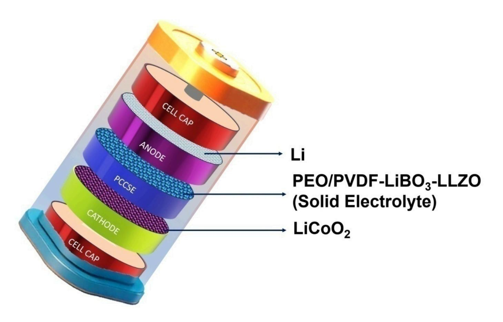
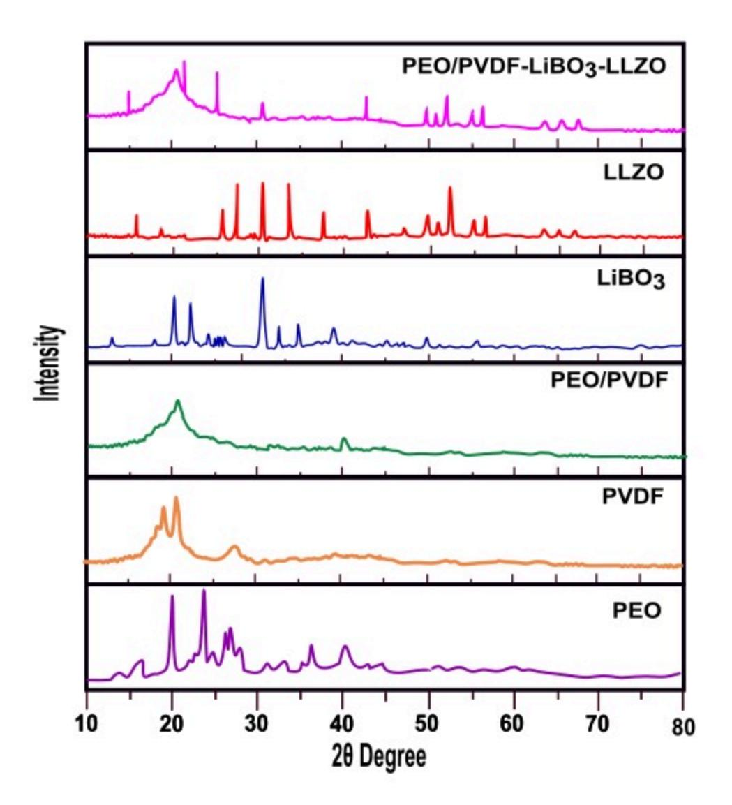
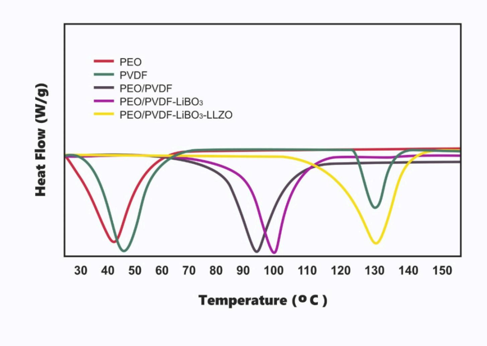
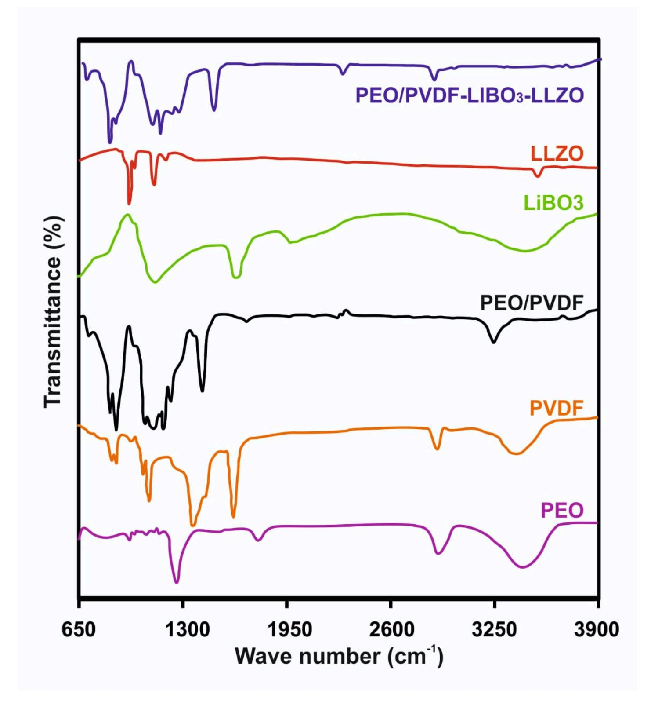
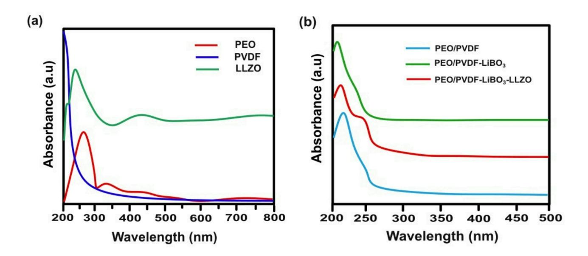
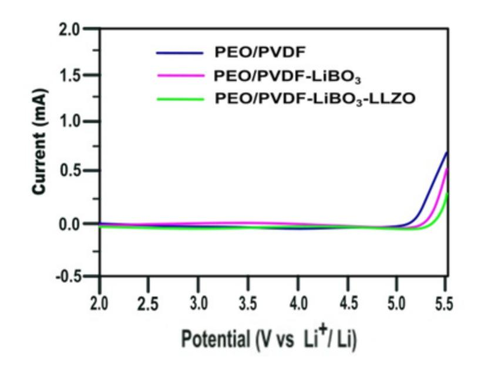
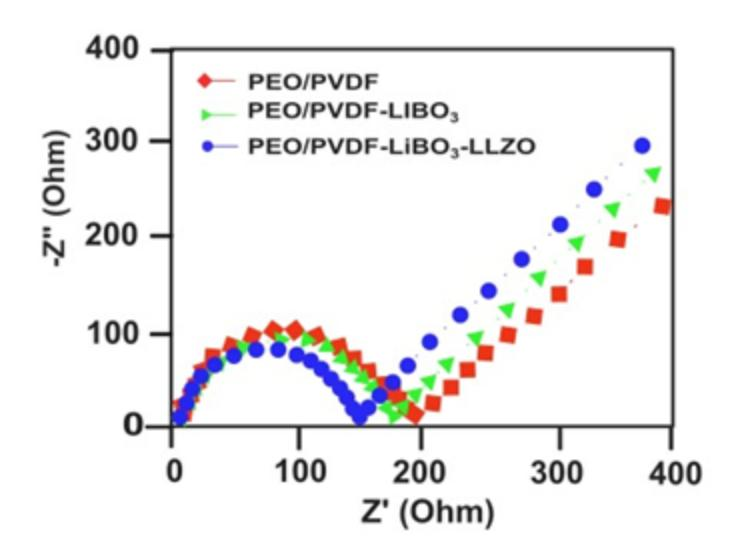
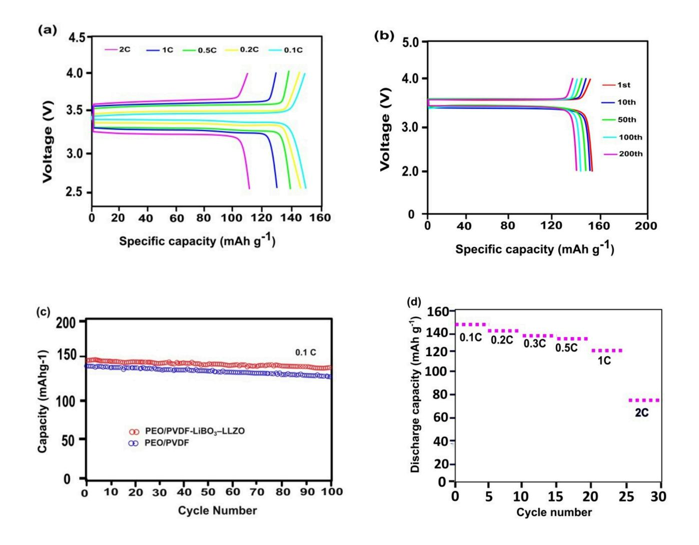
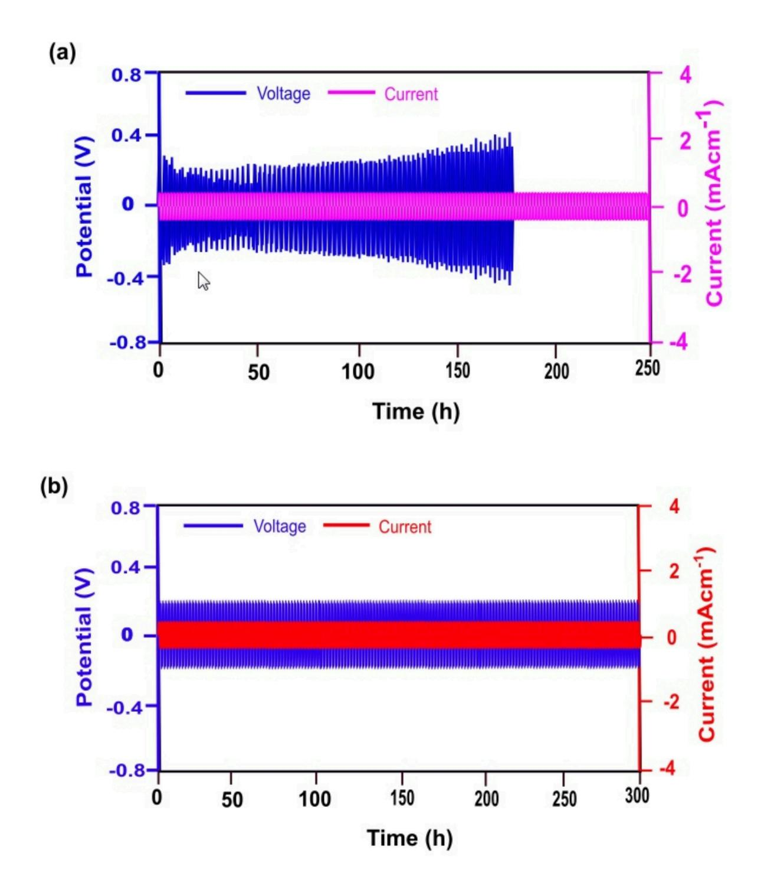

# Polymer–Ceramic Framework Stabilized Solid Electrolyte for Advanced Lithium-Ion Energy Storage

ilakkiya Pandurangan Presidency College Muthukumaran Balakrishnan

Presidency College <https://orcid.org/0000-0002-1594-0076>

#### Research Article

Keywords: Lithium-metal solid-state battery, Polymer blend matrix, Polymer composite ceramflux solid electrolyte, LLZO Ceramic Fillers

Posted Date: September 25th, 2025

DOI: <https://doi.org/10.21203/rs.3.rs-7606253/v1>

License: This work is licensed under a Creative Commons Attribution 4.0 International License. [Read Full License](https://creativecommons.org/licenses/by/4.0/)

# Abstract

Advancing lithium-metal solid-state batteries (LSSBs) demands innovative composite solid electrolytes with superior safety, energy density, and cycle life. Here, we report a high-performance polymer-ceramic composite solid electrolyte (PCCSE) engineered by integrating lithium perborate (LiBO3 ) and surfacefunctionalized lithium lanthanum zirconium oxide (LLZO) nanofibers into a polyethylene oxide/polyvinylidene fluoride (PEO/PVDF) matrix using an optimized Stokes' solution casting method. The synergistic interplay of LiBO3 and LLZO disrupts polymer crystallinity, enhances amorphization, and facilitates ionic transport through robust polymer–ceramic interfacial interactions. Advanced characterization via X-ray diffraction (XRD), Fourier-transform infrared spectroscopy (FTIR), ultraviolet– visible spectroscopy (UV–Vis), and electrochemical impedance spectroscopy (EIS) confirms reduced crystallinity, improved segmental chain mobility, and optimized ionic pathways. The resulting PCCSE achieves a remarkable ionic conductivity of 4.25 × 10− 5 S cm-1 at room temperature and a wide electrochemical stability window of 5.33 V, enabling compatibility with high-voltage cathodes. Full-cell tests with a lithium metal anode and LiCoO₂ cathode demonstrate high specific capacity, exceptional rate capability, and 95% capacity retention after 100 cycles. The PCCSE effectively mitigates lithium dendrite growth through uniform ion conduction and enhanced interfacial stability. These findings position PCCSE as a promising, safe, and high-performance electrolyte for next-generation all-solid-state lithium-metal batteries, paving the way for scalable, high-energy-density energy storage solutions.

# Introduction

Lithium-metal batteries (LMBs) are pivotal to modern energy storage, powering portable electronics with their high energy density, specific capacity, and extended cycle life. However, the surging demand for ultra-high-energy-density batteries, driven by the proliferation of smart devices and large-scale applications such as electric vehicles and grid storage, has intensified safety concerns (Ding et al. 2019). These stem primarily from the volatility of organic liquid electrolytes, which pose risks of leakage and flammability, and the challenges associated with transitioning from graphite to lithium-metal anodes, notably lithium dendrite growth, which compromises battery safety and performance (Liu et al. 2011). To address these issues, lithium-metal solid-state batteries (LSSBs) have emerged as a transformative solution, replacing liquid electrolytes with solid-state alternatives (Han et al. 2020). LSSBs offer compelling advantages, including enhanced safety, wider electrochemical stability windows, broader operating temperature ranges, and the potential for compact, direct-stacking architectures, positioning them as a cornerstone for next-generation energy storage (Lee et al. 2022, Li et al. 2021).

Among solid electrolyte materials, polyethylene oxide (PEO)-based polymers have garnered significant interest due to their ability to form stable Li-salt complexes that facilitate ion transport (D'Epifanio et al. 2004). However, their semi-crystalline nature at room temperature limits ionic conductivity by restricting segmental chain mobility, while their modest mechanical strength fails to suppress lithium dendrite growth during cycling (Kannadasan et al. 2024, Wang et al. 2005). To overcome these limitations, blending PEO with polyvinylidene fluoride (PVDF) to form a polymer blend matrix (PBM) has proven

effective (Nasir et al. 2007, Xi et al. 2006). PVDF contributes high mechanical strength, electrochemical stability, and favorable interactions with lithium salts, enhancing the thermal stability and amorphous content of the PEO-PVDF blend (Li et al. 2025, Wu et al. 2021). This synergy improves ionic conductivity and electrode-electrolyte interfacial compatibility, yet achieving optimal ionic conductivity and dendrite suppression at ambient conditions remains a critical challenge.

To further enhance performance, lithium perborate ( $LiBO3$ ), a dimeric salt with water of hydration  $(Li_2[B_2(O_2)_2(OH)_4]$ ·4H2O), has been incorporated as a cost-effective, environmentally benign, non-toxic lithium salt and its gives hydrogen peroxide on hydration (Pandurangan et al. 2024, Li et al. 2024). LiBO3increases the concentration of mobile lithium ions, disrupts ion pairing within the PBM, and reduces PEO crystallinity, thereby boosting ionic conductivity and electrochemical stability (Sampathkumar et al. 2019). Its compatibility with PEO-PVDF blends further enhances miscibility and widens the operating voltage window, offering a sustainable alternative to conventional salts like LiClO4, LiTFSI, and LiBF $_4$ .

To address mechanical and ionic conductivity limitations, lithium lanthanum zirconium oxide (LLZO), a garnet-structured ceramic, is integrated as a filler (Hegazy et al. 2022, Hu et al. 2022). LLZO's high ionic conductivity, exceptional mechanical strength, and stability against lithium metal provide additional ion conduction pathways, reduce polymer crystallinity, and effectively suppress dendrite growth. The synergistic combination of PEO, PVDF, LiBO3, and LLZO yields a polymer composite ceramflux solid electrolyte (PCCSE), which combines the flexibility and interfacial compatibility of the PBM, the enhanced conductivity and stability of LiBO3, and the mechanical and ionic transport benefits of LLZO.

This study presents the synthesis and characterization of a novel PCCSE comprising PEO/PVDF, LiBO3, and LLZO, tailored for LSSBs with a lithium-metal anode and a lithium cobalt oxide (LiCoO2) cathode (Li et al. 2021). Emphasis is placed on elucidating the interfacial interactions among the PBM, LiBO3, and LLZO, which critically govern ion transport, mechanical properties, and electrochemical performance. By addressing the longstanding challenges of ionic conductivity, mechanical stability, and dendrite suppression, this PCCSE represents a significant advancement in LSSB technology, with far-reaching implications for electric vehicles, grid-scale energy storage, and the future of sustainable energy systems.

### **Experimental Section**

# **Materials**

A combination of different chemicals was used to prepare the PCCSE material, such as Lithium carbonate (Li2CO3, from Sigma-Aldrich), Lanthanum oxide (La2O3, from Alfa Aesar), Ethylene glycol  $(C_2H_6O_2$ , from Merck), Zirconium ethoxide  $(Zr(OC_2H_5)_4$ , from Alfa Aesar), Dilute Nitric acid (HNO3, from Sigma-Aldrich), Citric acid ( $C_6H_8O_7$ , from Sigma-Aldrich), Ethanol ( $C_2H_5OH$ , from Merck), Polyethylene

oxide (PEO) from Merck, Polyvinylidene fluoride (PVDF, from Merck),), Dimethylformamide (DMF, from Merck), Lithium perborate tetrahydrate (LiBO3.4H2O, from Alfa Aesar). Only analytically pure, high-quality compounds were employed in this study (Patla et al. 2018).

## Preparation of LiLaZrO (LLZO) powder

A mixture of Li2CO3, La2O3, Zr(OC2H5)4, C6H8O7 (as an organic complexing agent), and C2H6O2 (as an organic medium) was prepared at a molar proportion of 7:3:4:28:14 as the reactant material.  $La_2O_3$  and  $Li_2CO_3$  were solubilised in HNO3, whereas Zr(OC2H5)4 was dissolved in pure C2H5OH. The two liquid phases were then combined, and  $C_6H_8O_7$  and  $C_2H_6O_2$  subsequently incorporated into the formulation. The resulting mixture solution was vigorously stirred and heated at 70°C to evaporate the solvent. The synthesized sol was subsequently left to dry at 110°C for 12 hours. Upon drying, the gel obtained was subjected to heat at 600°C over 120 minutes periods, later on sintering at 800°C for 600 minutes to yield  $Li_7La_3Zr_2O_{12}$  powder (Sakamoto et al. 2013).

### Preparation of PEO/PVDF-LiBO-LLZO

A Stokes' solution-casting method was adopted to prepare PCCSE. Solutions of the PEO/PVDF PBM with a compositional mass ratio of 80/20 wt% were prepared by dissolving PEO (800 mg) and PVDF (200 mg) in conical glass flasks with stopper, followed by dissolving them in 15 ml of DMF at 80°C with constant stirring using magnetic stirrer. Thereafter, 30 wt% of LiBO3 (0.30 g) in relation to the polymer blend, it was incorporated, followed by magnetic stirring to completely solvate the salt, resulting in polymeric blend matrix electrolyte ( $(80PEO/20PVDF)/30$  wt% LiBO3). The required amount of LLZO (0.05 g), corresponding to 5 wt% with respect to the polymeric blend matrix electrolyte (1 g), was mixed in DMF and then combined with the polymeric blend matrix electrolyte solutions. The mixture was then cast onto Teflon-coated plates and placed on a heating plate at 75°C, allowing the solvent to evaporate completely. The films were then cooled to room temperature, then subjected to vacuum drying at 40°C for a day to remove any residual solvent, and stored in desiccators (Dhatarwal and Sengwa 2019).

### **Characterization**

# **Physical characteristics**

The crystal structures of the PEO, PVDF, PEO/PVDF, LiBO3, LLZO and PEO/PVDF-LiBO3-LLZO electrolytes were investigated using XRD analysis with a Rigaku RU-200B diffractometer and Cu K $\alpha$  radiation ( $\lambda$  = 1.5406 Å). XRD measurements, taken at 5°C/min scanning speed and 40 an operating voltage, covering a 20 range of 10–90°, revealing the crystalline phases. Differential scanning calorimetry (DSC) using a DSC 7 Perkin Elmer instrument elucidated the thermal behaviour and LiBO3 solid electrolyte, and LLZO filler. (Tamaño-Machiavello et al. 2015) DSC analysis provided insights into the phase transitions, melting points, and crystallization behaviour, highlighting influence the LLZO filler on the properties. FTIR by employing a Thermo Nicolet 380 spectrometer was used to analyze the molecular structure by measuring the infrared radiation absorption. A Cary 60 UV–Vis spectrophotometer (Agilent, USA) was used for absorption analysis over the wavelength range of 200 − 1000 nm. The band gap of the electrolytes are calculated using

$$E=\;\frac{1240}{\lambda}$$

Where,

E = Band gap in eV

= wavelength in nm

1240 is the wavelength incident on 1eV (López and Gómez 2011).

# Chemical characteristic

LSV was used to examine the electrochemical behaviour and redox reaction kinetics by sweeping the working electrode potential linearly with time using an electrochemical analyzer (CHI-6650; CH Instruments) at 60o C at a rate of 1.0mVs− 1 between the range of 2 and 6 V. Electrochemical impedance spectroscopy (EIS) provides insights into electrode-electrolyte interfaces and charge transfer processes using a small amplitude AC potential (Rathika et al. 2017). Charge-discharge test and galvanostatic cycling tests were used to evaluate the electrochemical performance and cycling stability through repeated charging and discharging at controlled current densities. LSSBs batteries are fabricated with a lithium metal anode, lithium cobalt oxide (LiCoO2 ) cathode and prepared PCCSE (Li et al. 2021).

# Schematic illustration of a lithium-metal solid-state battery

A schematic illustration of a lithium-metal solid-state battery is shown in Fig. 1. The battery features a Li metal anode and lithium cobalt oxide (LiCoO2 ) cathode, with a polymer composite ceramflux solid electrolyte (PCCSE) in between. The PCCSE consists of a polymer blend matrix composed of polyethylene oxide (PEO) and polyvinylidene fluoride (PVDF), providing a flexible and process able medium for lithium-ion transport. Embedded within this matrix are lithium perborate (LiBO3 ), an environmentally friendly, cost-effective, and non-toxic solid electrolyte known for its mild oxidizing properties and wide applicability, and lithium lanthanum zirconium oxide (LLZO), a ceramic filler that significantly enhances ionic transport and thermal resistance. This configuration leverages the processability and flexibility of the PBM in conjunction with the high ion conductivity and thermal stability of ceramic materials, resulting in improved overall performance, safety, and longevity of the battery.

# **Result and discussion Physical characteristics**

Fig. 2 shows the XRD patterns of PEO, PVDF, PEO/PVDF blend, LiBO3, LLZO, and the PEO/PVDF-LiBO3-LLZO (PCCSE) (Jacob 1997). PEO exhibits characteristic sharp peaks at 19.2° and 23.6° (20), confirming its semicrystalline nature, while PVDF shows distinct crystalline reflections at 18.3°, 20.5°, and 26° (20). The PEO/PVDF blend demonstrates reduced peak intensities compared to the individual polymers, indicating a suppression of PEO crystallinity due to intermolecular interactions between the two polymers. Upon the incorporation of LiBO3 electrolyte and LLZO fillers into the PEO-PVDF matrix, the PCCSE shows further reduction in crystallinity, along with new diffraction peaks corresponding to the ceramic phases. These results confirm that the PEO/PVDF-LiBO3-LLZO composite effectively suppresses crystallinity and promotes phase integration, suggesting strong polymer-ceramic interactions that enhance its performance as a electrolyte for solid-state battery applications.

The thermal characteristics of the synthesized PCCSE were investigated using DSC (Karaman et al. 2019, Haridass et al. 2023). As shown in **Fig. 3**, DSC thermograms were obtained for pure PEO, PVDF, their PEO/PVDF blend, and the composites PEO/PVDF-LiBO3 and PEO/PVDF-LiBO3-LLZO. The analysis revealed distinct melting temperatures at 42.5°C (PEO), 48°C (PVDF), 45°C (PEO/PVDF blend), 94.5°C (PEO/PVDF-LiBO3), and 100°C (PEO/PVDF-LiBO3-LLZO). The PEO/PVDF-LiBO3-LLZO composite exhibited a single, well-defined melting endotherm at 100°C, achieving the optimal balance of thermal stability and amorphous phase characteristics, which are essential for advanced solid-state electrolyte applications.

FTIR spectroscopy is a powerful analytical technique used to investigate the functional groups, and ionpolymer interactions of PCCSE (Li et al. 2020). Fig. 4 shows the FTIR spectra of PEO, PVDF, PEO/PVDF, LiBO3, LLZO and (PEO/PVDF-LiBO3-LLZO). Upon the incorporation of the solid electrolyte LiBO3 and the inorganic filler LLZO, the intensity the -OH bond (2880 cm-1), C – C bond (1068 cm-1, 1111 cm-1) and the -CH2 bond (1460 cm-1) decreased significantly, while adjacent peaks appeared at 830 cm-1. These spectral modifications indicate that LiBO3 and LLZO disrupt polymer crystallinity through weakened intermolecular interactions. The observed peak attenuation and shifts suggest the formation of amorphous domains that facilitate Li+ ion transport, a crucial characteristic for enhancing the performance of solid polymer electrolytes.

The UV–Visible spectra in Fig. 5a illustrate the absorbance characteristics of PEO, PVDF, and LLZO, highlighting their maximum absorbance within the 200–1200 nm range (Sreekanth et al. 2019, Marceau et al. 2016). Fig. 5b presents the UV-Vis absorbance spectra of PEO/PVDF, PEO/PVDF-LiBO3, and PCCSE, revealing that the PEO/PVDF polymer blend matrix exhibits a strong absorption band at 215 nm, attributed to electronic transitions in the chromophore groups of PVDF and PEO. The PEO/PVDF-LiBO3 composite shows a slightly shifted absorption band at 218 nm. In PCCSE, a strong and intense band appears at 225 nm, along with an additional peak at 283 nm, indicating interactions between the PBM,

the solid electrolyte, and the LLZO filler. Moreover, PCCSE exhibits no absorption bands in the visible region, consistent with its transparent nature. The band gap values of PEO/PVDF, PEO/PVDF-LiBO3, and PEO/PVDF-LiBO3-LLZO are presented in Table 1, among the electrolytes, PCCSE possesses the lowest band gap, promoting better electron conduction.

| Sample                           | Band Gap (eV) |
|----------------------------------|---------------|
| PEO/PVDF                         | 5.76          |
| PEO/PVDF-LiBO 3       | 5.68          |
| PEO/PVDF-LiBO 3 -LLZO | 4.38          |

#### Table 1 The Band gaps values of PEO/PVDF, PEO/PVDF-LiBO3 and PEO/PVDF-LiBO3-LLZO.

#### **Chemical characteristic**

LSV was used to determine the electrochemical window, which is a critical factor in assessing the suitability of PCCSE for battery applications (Deng et al. 2015, Muzadi et al. 2023a). Fig. 6, presents the decomposition voltage of PEO/PVDF, PEO/PVDF-LiBO3, and PEO/PVDF-LiBO3-LLZO. The decomposition voltage of the polymer blend matrix (PBM) **(PEO/PVDF)** was **5.13 V**. The introduction of the solid electrolyte **LiBO**3 increased the decomposition voltage to  $5.25 \text{ V}$ , while further doping with the inorganic ceramic filler **LLZO** resulted in an even higher value of **5.33 V**. [34] The **Electrochemical Stability Window** (ESW) and Electrochemical Window (EW) of PEO/PVDF, PEO/PVDF-LiBO3, and PEO/PVDF-LiBO3-LLZO PCCSE are summarized in **Table 2**.

|               | Table 2 The Electrochemical Stability Window (ESW) and Electrochemical Window (EW) of the |  |  |  |
|---------------|-------------------------------------------------------------------------------------------|--|--|--|
| electrolytes. |                                                                                           |  |  |  |

| Sample                                           | <b>Electrochemical Stability</b> Window (ESW) | <b>Electrochemical Window (EW)</b> (Reduction Potential – Oxidation Potential) |
|--------------------------------------------------|--------------------------------------------------|--------------------------------------------------------------------------------|
| PEO/PVDF                                         | 5.13V                                            | 3.13V                                                                          |
| PEO/PVDF-LiBO 3                       | 5.25V                                            | 3.25V                                                                          |
| PEO/PVDF-LiBO 3 - LLZ 0 | 5.33V                                            | 3.33V                                                                          |

The electrical behaviour of the system was evaluated using EIS (Suo et al. 2015, Koduru et al. 2016). Fig. 7, displays the Nyquist plots for the PEO/PVDF blend, PEO/PVDF-LiBO3 and the composite (PEO/PVDF-LiBO3-LLZO). The impedance value (Z') for the PEO/PVDF blend (PBM) is approximately 200  $\Omega$ , while for PEO/PVDF-LiBO3 it it 180  $\Omega$ . In Contrast, the composite PCCSE (PEO/PVDF-LiBO3-LLZO) shows a significantly reduced Z' value of 150  $\Omega$ . This reduction in impedance reflects a reduction in the total

resistance of the system, which arises from the incorporation of LiBO3 electrolyte and the inorganic ceramic filler LLZO. Owning to this, the ionic conductivity of the PCCSE, calculated from the resistance values obtained from the Nyquist plot, is determined to be  $4.25 \times 10^{-5}$  S/cm.

The electrochemical performance of the prepared PCCSE was explored through charge-discharge tests using  $\text{LiCoO}_2$  as the cathode and Li metal as the anode (Nguyen et al. 2025, Liang et al. 2018). PEO/PVDF-LiBO3-LLZO demonstrated distinct discharge and charge voltage platforms across current densities observed from 0.1 C to 2 C at 30o C fig. 8(a). At 0.1 C, the discharge stable voltage curve is observed at 3.45 V, while the charge voltage curve shows a plateau around 3.48 V. An increase in current density leads to more significant potential variations over the entire electrochemical cycle. The discharge capacity of the cell is 148.5 mAh  $g^{-1}$ , 143.8 mAh  $g^{-1}$ , 135.6 mAh  $g^{-1}$ , 118.4 mAh  $g^{-1}$ , 75.5 mAh  $g^{-1}$  at the rate of 0.1 C, 0.2 C, 0.5 C, 1C and 2C respectively. Fig. 8(b) illustrates the charging and discharging plateaus for the 1st, 10th, 50th, 100th and 200th cycle. There is no significant difference in the specific capacity as the number of cycles increases. Fig. 8(c) exhibits the durability of the battery through cycling tests with electrolyte PEO/PVDF and PEO/PVDF-LiBO3-LLZO at 30°C and 0.1C rate. The maximum discharge capacity of the PCCSE is 147.3 mAh g-1 in the initial cycle and decreases slightly to 145.2 mAh g-1 after hundred cycles, demonstrating a stability of 95% of the initial capacity. The power capability performance of the battery with PCCSE, depicted in Fig. 8(d), illustrates the relationship between the specific discharge capacity and cycle number over a range of 0.1C to 2C. As the number of cycles increased, the specific capacity clearly decreases, which can be attributed to the limitations in Li+ diffusion within the electrode material. The cell cycle shows a stable discharge capacity above 140 mAh g-1 at 0.1 C, 0.2 C and 0.5 C. The Charge and discharge capacity of the Li II PEO/PVDF-LiBO3-LLZO II  $\text{LiCoO}_2$  at various C – rate at 30o C is shown in the table 3.

#### Table 3 The energy cycling capacity of the Li $\&$ PEO/PVDF-LiBO3-LLZO $\&$ LiCoO2 at various C − rate at 30o $\mathbf{C}$

| C - rate                                                               | $0.1C$ $0.2C$ $0.5C$ $1C$ |                              | $2\,\mathrm{C}$ |
|------------------------------------------------------------------------|---------------------------|------------------------------|-----------------|
| <b>Discharge Capacity</b> (mAh $g^{-1}$ ) 148.5 143.8 135.6 118.4 75.5 |                           |                              |                 |
| <b>Charge Capacity</b> (mAh $g^{-1}$ )                                 |                           | 149.4 145.7 137.8 119.8 77.8 |                 |

The electrochemical durability and long-term behavior of PCCSE with the Li anode were evaluated using Li || PCCSE || LiCoO2 cells in a galvanostatic cycling test (Xue et al. 2020, Kannadasan et al. 2024). The potential variation profiles of the electrolytes, Li || PBM || LiCoO2 (Fig. 9a) and Li || PCCSE || LiCoO2 (Fig. 9b), were monitored throughout the duration in symmetrical Li cells. The cell system was maintained at a stable temperature of 30°C and subjected to a uniform current of 0.2 mA cm-2. The symmetrical Li cell with Li || PBM || LiCoO2 functioned for 300 hours, but a short-circuit phenomenon occurred after 180 hours due to uneven lithium electrodeposition, which typically leads reduced stability. In contrast, the

symmetrical Li cell with Li || PCCSE || LiCoO2 operated for 300 hours without encountering short circuits. The incorporation of the LiBO3 electrolyte and LLZO ceramic filler contributed to the extended cycle life of the Li || PCCSE || LiCoO2 cells by effectively reducing the growth of Li dendrite. The outcomes of the galvanostatic cycling experiments indicate that the PEO/PVDF-LiBO3 -LLZO electrolyte promotes stable lithium deposition and inhibits dendrite lithium growth.

### Conclusion

This study successfully developed and characterized a novel polymer composite ceramflux solid electrolyte (PCCSE), composed of PEO/PVDF, LiBO3 , and LLZO, demonstrating strong potential for application in lithium-metal solid-state batteries (LSSBs). The incorporation of LLZO and LiBO3 significantly reduced the crystallinity of the PBM, thereby enhancing the ion transport properties, mechanical strength, and electrochemical stability. Structural modifications were confirmed through XRD and DSC analyses, while FTIR and UV-Visible spectroscopy provided valuable insights into molecular interactions. Electrochemical evaluations, including impedance spectroscopy and linear sweep voltammetry, revealed an extended electrochemical stability window and reduced resistance. Full-cell testing using a LiCoO2 cathode and a Li metal anode showed a substantial discharge capacity of 148.5 mAh g⁻¹ at 0.1C and 30°C, with excellent cycling durability, retaining 95% of its capacity after hundred cycles. Moreover, the electrolyte efficiently suppressed lithium dendrite formation, contributing to enhanced safety and prolonged cycle life. These findings highlight the promise of PCCSE as a potential solid electrolyte for next-generation lithium-metal batteries, offering a balanced combination of high energy output, safety, and long-term stability. The development of such materials marks a significant step toward safer, high-performance energy storage solutions, with important implications for sustainable transportation and portable electronic technologies.

# Declarations

#### CRediT authorship contribution statement

Ilakkiya Pandurangan: Manuscript preparation, validation of findings and conceptual planning. Muthukumaran Balakrishnan: Manuscript reviewing and editing, Supervision, Methodology, and investigative work.

#### Declaration of competing interest

The authors declare that they have no competing interests.

# References

1. D'Epifanio A, Traversa E, Croce F, Serraino Fiory F, Scrosati B, Licoccia S (2004) Metallic-lithium, LiFePO4-based polymer battery using PEO–ZrO2 nanocomposite polymer electrolyte. J Appl

Electrochem 34:403–408

- 2. Deng F, Wang X, He D, Hu J, Gong C, Ye YS, et al. (2015) Microporous polymer electrolyte based on PVDF/PEO star polymer blends for lithium-ion batteries. J Membr Sci 491:82–89
- 3. Dhatarwal P, Sengwa RJ (2019) Dielectric relaxation, Li-ion transport, electrochemical, and structural behaviour of PEO/PVDF/LiClO4/TiO2/PC-based plasticized nanocomposite solid polymer electrolyte films. Compos Commun 17:182–191
- 4. Ding Y, Yu A, Lu J, Chen Z, Cano ZP (2019) Automotive Li-ion batteries: Current status and future perspectives. Electrochem Energy Rev 2:1–28
- 5. Han L, Zhu J, Lehmann ML, Saito T, Tang X, Liu T, et al. (2020) Recent developments and challenges in hybrid solid electrolytes for lithium-ion batteries. Front Energy Res 8:202
- 6. Haridass R, Augustin N, Brahmadesam Thoopul Srinivasa Raghava R, Annamalai PK, Sabu A (2023) Effect of polyvinylpyrrolidone on the structure development, electrical, thermal, and wetting properties of polyvinylidene fluoride–expanded graphite nanocomposites. ACS Omega 9:178–195
- 7. Hegazy A, Higashiya S, Efstathiadis H, Mckinney J (2022) Evaluation of porous lithium lanthanum zirconium oxide (LLZO) anode host structures for Li-metal batteries. Electrochem Soc Meet Abstr MA2022-02:272
- 8. Hu Y, Luo L, Feng T, Zhang L, Xu L (2022) Probing the phase transition during the formation of lithium lanthanum zirconium oxide solid electrolyte. ACS Appl Mater Interfaces 14:41978–41987
- 9. Jacob MME (1997) Effect of PEO addition on the electrolytic and thermal properties of PVDF– LiClO4 polymer electrolytes. Solid State Ionics 104:267–276
- 10. Kannadasan M, Sathiasivan K, Pandurangan I, Balakrishnan M (2024) Synergistic nanocomposite polymer electrolytes for advanced all-solid-state sodium-ion batteries. Int J Hydrogen Energy 78:634–641
- 11. Kannadasan M, Varuvel EG, Sathiasivan K, Balakrishnan M, Subramanian B (2024) Crafting highperformance polymer-integrated solid electrolyte for solid-state sodium-ion batteries. Energy Storage 6:636
- 12. Karaman B, Bozkurt A, Çevik E (2019) Novel flexible Li-doped PEO/copolymer electrolytes for supercapacitor application. Ionics 25:1773–1781
- 13. Koduru HK, Zhao X-Z, Scaramuzza N, Iliev MT, Karashanova D, Vlakhov T, et al. (2016) Investigations on poly(ethylene oxide) (PEO)-blend based solid polymer electrolytes for sodium-ion batteries. J Phys Conf Ser 764:012006
- 14. Lee MJ, Lee YJ, Han J, Kim BJ, Lee SW, Lee K, et al. (2022) Elastomeric electrolytes for high-energy solid-state lithium batteries. Nature 601:217–222
- 15. Li C, Zhang Z, Miao X, Wang C, Zhang S, Yin L, et al. (2021) Designing lithium argyrodite solid-state electrolytes for high-performance all-solid-state lithium batteries. Batteries Supercaps 5:1–10
- 16. Li J, Qiu Y, Yang K, Chen P, Sun J, Hong Y, et al. (2021) Structural origin of the high-voltage instability of lithium cobalt oxide. Nat Nanotechnol 16:599–605

- 17. Li J, Zhu K, Wang J, Yan K, Liu J, Yao Z, et al. (2020) Optimisation of conductivity of PEO/PVDFbased solid polymer electrolytes in all-solid-state Li-ion batteries. Mater Technol 37:240–247
- 18. Li L, Deng Y, Duan H, Qian Y, Chen G (2021) LiF and LiNO3 as synergistic additives for PEO– PVDF/LLZTO-based composite electrolyte towards high-voltage lithium batteries with dualinterfaces stability. J Energy Chem 65:319–328
- 19. Li Y, Yuan W, Hu Z, Shen Y, Wu G, Cong F, et al. (2025) Constructing PVDF-based polymer electrolyte for lithium metal batteries by polymer-induced phase structure adjustment strategy. Adv Funct Mater 35:24763
- 20. Li Z, He X, Wang L, Huang X (2024) Lithium bis(trifluoromethanesulfonyl)imide (LiTFSI): A prominent lithium salt in lithium-ion battery electrolytes – fundamentals, progress, and future perspectives. Adv Funct Mater 34:8319
- 21. Liang YF, Xia Y, Zhang SZ, Wang XL, Xia XH, Gu CD, et al. (2018) A preeminent gel blending polymer electrolyte of poly(vinylidene fluoride-hexafluoropropylene)–poly(propylene carbonate) for solidstate lithium-ion batteries. Electrochim Acta 296:1064–1069
- 22. Liu XH, Sullivan JP, Zhang LQ, Kushima A, Huang JY, Ye ZZ, et al. (2011) Lithium fiber growth on the anode in a nanowire lithium-ion battery during charging. Appl Phys Lett 98:183107
- 23. López R, Gómez R (2011) Band-gap energy estimation from diffuse reflectance measurements on sol–gel and commercial TiO2: A comparative study. J Sol-Gel Sci Technol 61:1–7
- 24. Marceau H, Kim C-S, Paolella A, Ladouceur S, Lagacé M, Chaker M, et al. (2016) In operando scanning electron microscopy and ultraviolet–visible spectroscopy studies of lithium/sulfur cells using all solid-state polymer electrolyte. J Power Sources 319:247–254
- 25. Muzadi H, Kamalia NZ, Lestariningsih T, Astuti Y (2023) Effect of LiTFSI electrolyte salt composition on characteristics of PVDF–PEO–LiTFSI-based solid polymer electrolyte (SPE) for lithium-ion battery. Molekul 18:98
- 26. Muzadi H, Kamalia NZ, Lestariningsih T, Astuti Y (2023) Effect of LiTFSI electrolyte salt composition on characteristics of PVDF–PEO–LiTFSI-based solid polymer electrolyte (SPE) for lithium-ion battery. Molekul 18:98
- 27. Nasir M, Matsumoto H, Danno T, Minagawa M, Tanioka A, Horibe H (2007) Preparation of porous PVDF nanofiber from PVDF/PVP blend by electrospray deposition. Polym J 39:1060–1064
- 28. Nguyen HBT, Ding L, Pohle B, Schmeida T, Nguyen HBA, Mikhailova D (2025) Ternary PEO/PVDF-HFP-based polymer electrolytes for Li-ion batteries. Batteries 11:45
- 29. Pandurangan I, Kannadasan M, Sathiasivan K, Aarimuthu G, Balakrishnan M (2024) Lithium perborate-based composite polymer electrolytes for all-solid-state lithium-ion batteries: Performance enhancement and stability. J Solid State Electrochem 28:1–12
- 30. Patla SK, Asokan K, Karmakar S, Ray R (2018) Investigation of ionic conduction in PEO–PVDF based blend polymer electrolytes. J Appl Phys 123:125102
- 31. Rathika R, Padmaraj O, Suthanthiraraj SA (2017) Electrical conductivity and dielectric relaxation behaviour of PEO/PVdF-based solid polymer blend electrolytes for zinc battery applications. Ionics

24:243–255

- 32. Sakamoto J, Kim H, Wolfenstine J, Rangasamy E, Kim Y (2013) Synthesis of nano-scale fast ion conducting cubic Li7La3Zr2O12. Nanotechnology 24:424005
- 33. Sampathkumar L, Selvasekarapandian S, Chitra R, Muthukrishnan M, Christopher Selvin P, Perumal P (2019) Synthesis and characterization of biopolymer electrolyte based on tamarind seed polysaccharide, lithium perchlorate and ethylene carbonate for electrochemical applications. Ionics 25:1067–1082
- 34. Sreekanth K, Madhava Kumar Y, Ramu C, Gopal NO, Siddaiah T (2019) Optical and electrical conductivity studies of VO2+ doped polyvinyl pyrrolidone (PVP) polymer electrolytes. J Sci Adv Mater Devices 4:230–236
- 35. Suo L, Fan X, Xu K, Wang C, Olguin M, Gao T, et al. (2015) "Water-in-salt" electrolyte enables highvoltage aqueous lithium-ion chemistries. Science 350:938–943
- 36. Tamaño-Machiavello MN, Costa CM, Molina-Mateo J, Torregrosa-Cabanilles C, Meseguer-Dueñas JM, Kalkura SN, et al. (2015) Phase morphology and crystallinity of poly(vinylidene fluoride)/poly(ethylene oxide) piezoelectric blend membranes. Mater Today Commun 4:214–221
- 37. Wang GX, Yang L, Liu HK, Dou SX, Wang JZ (2005) Enhancement of ionic conductivity of PEO based polymer electrolyte by the addition of nanosize ceramic powders. J Nanosci Nanotechnol 5:1135– 1140
- 38. Wu Y, Li Y, Wang Y, Liu Q, Chen Q, Chen M (2021) Advances and prospects of PVDF based polymer electrolytes. J Energy Chem 64:62–84
- 39. Xi J, Qiu X, Chen L (2006) PVDF–PEO/ZSM-5 based composite microporous polymer electrolyte with novel pore configuration and ionic conductivity. Solid State Ionics 177:709–713
- 40. Xue X, Chen Y, Zhang X, Chen S, Lin J, Zhang Y, et al. (2020) Boosting the performance of solid-state lithium battery based on hybridizing micron-sized LATP in a PEO/PVDF-HFP heterogeneous polymer matrix. Energy Technol 8:2000444

### Figures

Schematic illustration of lithium-metal solid-state battery (LSSB)

Figure 2

XRD patterns of PEO, PVDF, PEO/PVDF (PBM), LiBO3, LLZO, and PEO/PVDF-LiBO3-LLZO (PCCSE).

DSC of a) PEO b) PVDF c) PEO/PVDF (PBM) d) PEO/PVDF-LiBO3 d) PEO/PVDF-LiBO3-LLZO (PCCSE).

FTIR spectra of PEO, PVDF, PEO/PVDF (PBM), LiBO3, LLZO, and PEO/PVDF-LiBO3-LLZO (PCCSE).

UV-Visible Spectra of (a) PEO, PVDF, LLZO (b) PEO/PVDF (PBM), PEO/PVDF-LiBO3 and PEO/PVDF-LiBO3-LLZO (PCCSE)

#### Figure 6

Linear Sweep Voltammetry of PEO/PVDF (PBM), PEO/PVDF-LiBO3, and PEO/PVDF-LiBO3-LLZO (PCCSE).

Impedance plots of PEO/PVDF (PBM), PEO/PVDF-LiBO3 and PEO/PVDF-LiBO3-LLZO (PCCSE).

(a) Specific capacity voltage curves of Li  $\&$  PEO/PVDF-LiBO3-LLZO  $\&$  LiCoO2 with different C - rate, (b) Specific capacity voltage curves of Li 

PEO/PVDF-LiBO3-LLZO 
LiCoO2 at the C-rate of 0.1 C, (c) cycling performance of PEO/PVDF (PBM), and PEO/PVDF-LiBO3-LLZO (PCCSE) at 0.1C, (d) Discharge capacity with various cycle number.

Galvanostatic cycling test of (a) Li || PEO/PVDF (PBM) || LiCoO2 cell (b) Li || PEO/PVDF-LiBO3-LLZO (PCCSE) ||  $\text{LiCoO}_2$  cell.