http://doi.org/10.31613/ceramist.2025.00353

## **Recent Advances in Fabrication Technologies for Lithium Metal Anodes**

Hyunsang Joo1,2†, Jeongsik Yun3,4†

1Aging and Lifetime Prediction of Batteries, Institute for Power Electronics and Electrical Drives (ISEA), RWTH Aachen University, Campus-Boulevard 89, 52074 Aachen, Germany 2PRELI GmbH, Campus-Boulevard 79, 52074 Aachen, Germany 3Department of Energy and Chemical Engineering, Incheon National University, 119 Academy-ro, Yeonsu-gu, Incheon, 22012, Republic of Korea 4Innovation Center for Chemical Engineering, Incheon National University, 119 Academy-ro, Yeonsu-gu, Incheon, 22012, Republic of Korea

## 리튬 금속 음극 제조 기술의 최근 연구동향과 발전

주현상1,2†. 윤정식3,4†

1라인-베스트팔렌 아헨 공과대학교 전기정보공학부, 2PRELI GmbH, 3인천대학교 에너지화학공학과, 4인천대학교 화공혁신연구소

(Received August 6, 2025; Revised September 8, 2025; Accepted September 9, 2025)

#### Abstracts

Lithium-ion batteries have become essential to modern energy storage technologies, supporting a wide range of applications from portable electronics to electric vehicles and grid-scale energy storage systems. However, their energy density is fundamentally constrained by the low specific capacity of graphite anodes  $(372 \text{ mAH g}^{-1})$ . As graphite-based anodes approach their theoretical limits, lithium metal has emerged as a promising alternative due to its ultrahigh capacity  $(3,860 \text{ mAH g}^{-1})$  and the lowest electrochemical potential ( $-3.04$  V vs. standard hydrogen electrode). Despite these advantages, its practical application remains hindered by dendritic growth, unstable solid electrolyte interphase, and limited cycling reversibility,

This review presents a comprehensive overview of lithium metal anode development, beginning with upstream resource extraction and refinement from brine, hard-rock, and sedimentary sources. Subsequently, we classify fabrication strategies into six categories: mechanical processing, vapor-phase deposition, molten lithium infusion, electrochemical deposition, composite-based strategies, and anode-free designs.

&lt;sup>†Corresponding Author: hyunsang.joo@isea.rwth-aachen.de, jeongsik.yun@inu.ac.kr

© 2025 The Korean Ceramic Society

This is an Open Access article distributed under the terms of Creative Attributions Non-Commercial License (https://creativecommons.org/li-censes/ by-nc/4.0/) which permits unrestricted noncommercial use, distribution, and reproduction in any medium, provided the original work is properly cited.

To guide the fabrication approaches, we construct a comparative matrix that correlates lithium efficiency with manufacturability, thereby enabling the integration of lithium metal anodes into scalable and commercially relevant battery architectures.

**Keywords:** Battery production, Lithium–metal anode, Lithium Plating/Stripping, Lithium surface treatment, Next-generation Batteries

## 서론

최근 수년간 리튬 이차전지는 소형 전자기기부터 전기 차(Electric Vehicle, EV), 에너지 저장 시스템(Energy Storage system. ESS)에 이르기까지 다양한 응용 분야 에서 핵심 에너지 저장 기술로 자리 잡고 있다. [1,2] 특히 전기차 및 대규모 전력망 연계 저장장치의 수요가 급격히 증가하면서. 기존 리튬 이온 배터리의 한계를 극복할 수 있는 고에너지 밀도 및 고효율 배터리 시스템에 대한 필요 성이 대두되고 있다. 현재 상용화된 리튬 이온 전지의 음극으로 주로 사용되는 흑연은 높은 안정성과 긴 수명 특성을 보유하고 있으나, 낮은 이론 용량 (372 mAh g-1) 으로 인해 차세대 고용량 배터리 구현에 한계가 존재한 다. [3,4] 따라서 이러한 흐름은 배터리의 구성 요소 중 에너지 저장 용량과 출력 특성에 직접적으로 영향을 미치 는 음극(anode) 소재의 고도화를 요구하고 있다. [5] 이에 따라 리튬 금속은 3860 mAh g-1의 이론 용량과 −3.04 V vs. SHE (standard hydrogen electrode) 의 전기화 학적 전위를 기반으로 가장 이상적인 음극 소재로 주목받 고 있다. 뿐만 아니라. 전고체전지의 핵심 소재로 각광 받는다.[6,7] 하지만 리튬 금속은 충방전 반복 시 덴드라 이트 형성, 불균일한 리튬 전착, 고체전해질 계면(Solid Electrolyte Interphase, SEI)의 불안정성과 같은 문제 를 동반하며, 이는 실질적인 상용화를 어렵게 하는 주요 장애 요소로 작용하고 있다. [8-11] 따라서 이러한 문제를 해결하기 위한 리튬 금속 음극 제조 기술의 정밀화 및 안정화 전략이 절실히 필요한 실정이다. 고에너지 밀도 구현을 위한 리튬 음극 기술의 개발은 단순히 음극 재료의

성형 가공에 그치지 않으며, 그 출발점인 리튬 원료의 확보 및 금속화 공정 전반에 대한 이해를 필요로 한다. 실제로 리튬 금속은 자연 상태에서 단독으로 존재하지 않기 때문에, 다양한 형태의 리튬 함유 자원으로부터 리 튬 이온을 추출하고, 이를 금속 리튬으로 정제하는 복합 적인 공정이 선행되어야 한다. 이 과정은 음극 성능 뿐 아니라 제조 공정의 경제성, 지속 가능성 측면에서도 큰 영향을 미치기 때문에, 리튬 자원의 종류와 이에 기반한 추출 및 정제 기술에 대한 고찰이 필수적이다.

리튬은 지질학적 기원에 따라 염수형(brine-type), 경 암형(hard-rock-type), 퇴적암형(sedimentary-type) 자원으로 구분되며, 각 자원의 특성에 따라 추출 및 정제 공정이 상이하다. 염수형 리튬은 고염도의 지하 염수에 리튬 이온이 용해된 형태로 존재하며 주로 리튬 트라이앵 글 (전 세계 리튬 매장량의 54% 차지) 이라고 불리는 <table><tbody>칠레, 아르헨티나, 볼리비아 지역과 중국, 티베트 고원 등의</tbody> 고산 건조 지대에 주로 분포한다. [12] 경암형 리튬은 스포 듀민(spodumene)과 같은 리튬 함유 광물 내 고체 상태로 존재하며 호주, 캐나다, 짐바브웨, 포르투갈 등에서 광범위 하게 채굴된다. 최근에는 헥토라이트(hectorite)와 같은 점토 광물 내에 리튬 이온이 흡착된 형태로 존재하는 퇴적 암형 리튬 자원에 대한 연구도 활발히 이루어지고 있으 며, 미국 네바다, 세르비아, 멕시코 등에서 그 매장 잠재 력이 주목받고 있다. 이러한 자원으로부터 리튬 금속을 얻기 위해서는 일련의 추출 및 전환 공정을 거쳐야 하며, 추출 기술은 자원의 특성과 경제적 조건에 따라 다양하게 발전하고 있다. 염수형 자원은 브라인(brain)을 추출한 후 약 18~24개월 간의 자연 증발 과정을 통해 마그네슘

# **Incompletence**

#### 리튬 금속 음극 제조 기술의 최근 연구동향과 발전 🏽

(Mg2+)과 황산염 (SO42-) 등의 불순물을 제거하고, 최종 적으로 LiCl 농도를 약 6000 ppm까지 농축시킨다. 이후 탄산나트륨(Na2CO3)과 반응시켜 가장 일반적인 전구체 인 탄산리튬(Li2CO3)을 회수한다. [13] 전통적인 증발-침전법은 공정 단가가 낮으나. Mg2+/Li+ 질량비가 높거 나 경쟁 이온(Na+, K+) 등의 이온이 존재할 경우 선택적 분리에 한계가 있다. 이를 극복하기 위해 리튬—선택성 컬럼 흡착(column adsorption) 및 확산 투석(diffusion dialysis), 삼투 증류(osmotic distillation) 기반의 멤브 레인 기술이 개발되었으며, 이들은 연속 공정 운용이 가 능하고 높은 선택성을 바탕으로 고순도 LiCl 수용액 생산 이 가능하다. 후처리 단계에서는 이온교환, 연속 흡착, 용매 추출 등 기술이 병용되어 고품질 리튬 확보가 가능하 다. 경암형 리튬 자원은 페그마타이트(pegmatites) 계열 의 스포듀민을 대상으로 한다. 회수 공정은 약 1100℃에 서 광물을 소성한 후, 황산(H2SO4) 처리를 통해 황산리튬 (Li2SO4)를 형성하고, 이를 탄산나트륨과 반응시켜 탄산리 튬으로 침전시키는 방식이다. 고온 반응과 다단 정제 과정을 요구하는 만큼, 에너지 및 시약 소모가 크고 경제성이 낮다. 이에 따라 로스팅-칼시네이션(roasting-calcination) 또 는 염소화—침출(chlorination—leaching)등 새로운 공정 이 제안되고 있다. 퇴적암형 자원은 아직 상용화 초기 단계지만, 저비용 채굴과 풍부한 매장량 덕분에 주목받고 있다. 리튬 이온이 점토 구조에 고정되어 있어 침출 효율 이 낮기 때문에. 산/알칼리 조합 침출제. 전처리 열처리. 첨가제 기반 촉진 침출 등 기술이 병행되고 있다. 특히

환경 친화적인 저온 기반 침출 기술의 개발이 활발하다. 위와 같은 다양한 자원에서 회수된 탄산리튬은 양극재 제조에는 곧바로 활용될 수 있으나, 금속 리튬 음극 제조를 위해서는 무수 염화리튬(anhydrous LiCl)으로의 전환이 필요하다. 일반적으로 탄산리튬은 염산(HCI)과 반응시켜 수용성 LiCl로 전환된 후, 약 100℃에서 결정화 과정을 통해 무수 LiCl로 정제된다.[14] 이는 산업적으로 100년 이상 사용되어 온 공정이지만, 고온/고에너지 공정이며 Cl2 가스 발생이라는 환경적 문제도 수반된다. [15,16] 최 근에는 저온/저에너지 기반의 전기화학 전환 기술이나 폐 소재 기반 리튬 회수 기술이 대안으로 제시되고 있다. 전환 된 LiCl은 고온 용융염 전해(electrowinning) 공정을 통 해 금속 리튬으로 전환될 수 있으며 생성된 금속 리튬은 다양한 응용 목적에 따라 박막, 와이어, 펠렛 등 여러 형태로 성형 가공되어 사용된다(Fig. 1). 이를 위해 현재 까지 다양한 가공 기술이 개발되어 왔으며, 대표적으로는 압출(extrusion)과 압연(rolling) 등의 기계적 가공 (mechanical processing), 고순도 리튬 박막 형성을 위 한 기상 증착법(vapor deposition), 용융 리튬 주입법 (melting lithium), 전기화학적 증착(electrochemical deposition), 고분자 또는 세라믹 매트릭스와의 복합체 기반 제조, 사전 리튬없이 충전 중 리튬이 음극에 증착되 는 무음극 전략 등이 있다. 이들 기술은 리튬의 물리적 특성, 공정 환경, 목표 향상 및 두께 등에 따라 선택되며, 최종 전극의 성능과 수명에도 큰 영향을 미친다.

본 논문에서는 앞서 설명한 리튬 자원의 추출 및 금속화

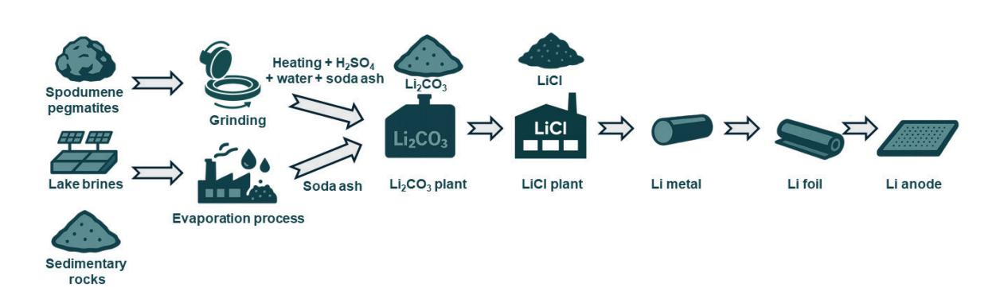

Fig. 1. Schematic of the lithium metal anode production process. Adapted from Acebedo et al. Adv. Energy Mater, 2023;13:2203744, with permission of Wiley.[17]

공정을 바탕으로, 이후 이차전지용 리튬 금속 음극 제조 를 위한 제조를 위한 주요 기술들을 체계적으로 분류하 고, 각 제조 방식의 기술적 특징, 장단점, 그리고 대표적 인 연구 사례들을 중심으로 종합적으로 고찰하고자 한 다

## 본론

리튬 음극 가공은 리튬 자원으로부터 회수 및 전환된 LiCO3 또는 이로부터 정제된 LiCl등의 전구체로부터 시 작되며, 이는 Fig. 2에 도시된 바와 같이 세단계의 과정을 거친다. 리튬 음극 가공기술을 본격적으로 논의하기에 앞 서, 먼저 이러한 전구체로부터 금속 리튬을 제조하는 핵심 기술인 고온 용융염 기반 전기화학법(electrowinning) 공정에 대해 살펴보고자 한다. 고온 융해염 기반 전기화 학법은 리튬 금속을 대량 생산하는 정제 공정으로, 일반 적으로  $400 \sim 500$  C의 고온에서 LiCl 또는 LiCl-KCl 공 융염을 전해질로 사용하여 리튬 이온을 환원시키는 방식

이다. 이때 전극 반응은 아래식과 같고, 생성된 리튬은 밀도가 낮아 전해질 상단에 부상하여 효율적으로 회수된 다. [18.19]

 $\mathbf{C}$ 

 $\mathbf{E} = \mathbf{R}$ 

 $\mathbf{M}$ 

 $\mathbf{A}$ 

 $\mathbf{S}$ 

 $\mathbf{r}$ 

양극 반응 : Cl-  $\rightarrow$  1/2 Cl2 + e-

음극 반응 :  $Li^+ + e^- \rightarrow Li$ 

전체 반응 : LiCl  $\rightarrow$  Li + 1/2Cl2

해당 공정은 구조가 단순하고 금속 회수율이 높으며 고순도 리튬 확보에 유리하지만. 고온 운전이 필수이며 유독한 염소가스가 부산물로 발생하고. 반응성 리튬 및 용융염을 다루기 위한 고내식성 셀 설계와 불활성 분위기 유지가 필요하다는 점에서 환경적, 경제적 부담이 따른 다. 이에 따라 최근에는 고온 염의 내구성을 향상시키기 위한 세라믹 분리막 개발, 탄화물 코팅 전극 적용, LiCl의 폐배터리 기반 재활용. 에너지 효율 향상형 전해조 설계. 부산물 가스 정화 및 회수 시스템 개발 등 공정 엔지니어 링 중심의 연구가 활발히 진행되고 있다. 최근에는 폐배 터리 기반 자원 순환 및 금속 리튬 리사이클링 측면에서도 주목받고 있다.

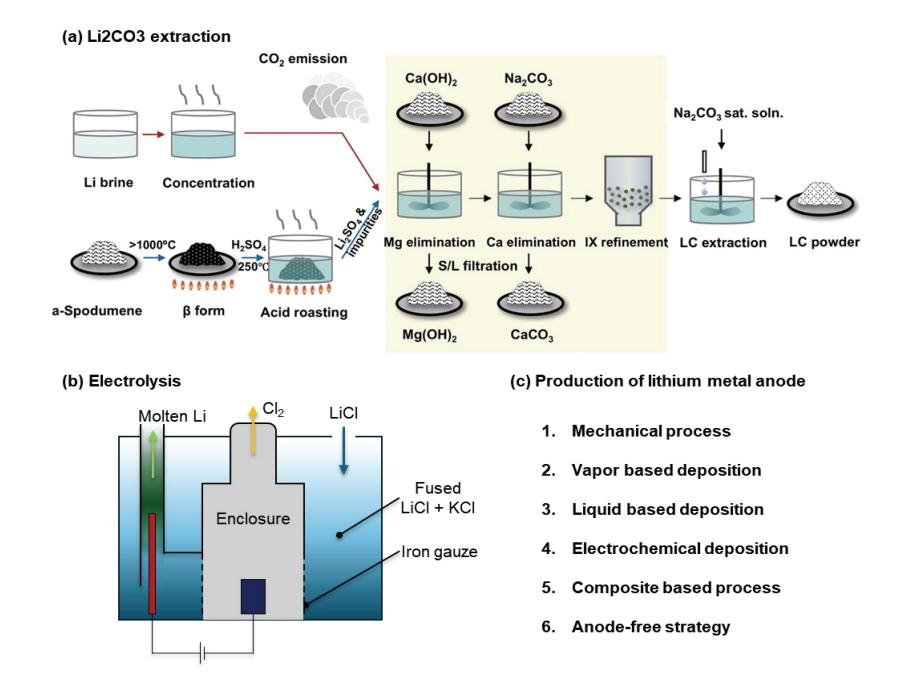

Fig. 2, Schematic illustration of the stepwise fabrication process of lithium metal anodes: (a) extraction of lithium carbonate. Adapted from Xiao et al. Chem, Rev, 2025;125: 6397-643, licensed under CC BY-NC-ND 4.0 [20], (b) electrolysis for producing lithium from LiCl and KCl eutectic salt, and (c) subsequent process for lithium metal anode production,

이를 해결하고자 Zavahir et al.은 탄화물 코팅 전극과 알루미나 세라믹 라이닝을 적용하여 셀 내 부식 억제와 전해질 안정성을 향상시켰으며, 장기 내구성을 확보하는 데 성공하였다. 또한, 폐배터리 유래 리튬염(예:Li2CO3) 을 염화 처리 후 용융염 전해질로 전환하여 리튬 금속으로 정제하는 폐자원 순환형 공정도 최근 주목받고 있다. Zhou et al.은 폐배터리에서 회수한 Li2CO3를 HCl 처리 후 LiCl로 전환하고 이를 electrowinning 공정에 적용하 여, 상용 등급의 금속 리튬을 제조함과 동시에 기존 공정 보다 에너지 소비를 20% 이상 저감함을 입증하였다. 아 울러, 염소가스를 정화 회수하기 위한 고체 흡착 필터 통합형 funnel—shaped 전해조 설계 역시 고온 시스템의 안정성과 친환경성을 동시에 향상시키는 연구가 보고되 었다. 이러한 고온 기반 증착 기술은 리튬 자원의 정련. 리사이클링, 대량 생산이라는 산업적 목적에 최적화된 기술이며, 자원 순환형 배터리 생태계 구축과 리튬 공급 망 안정화 측면에서도 중요성이 점점 부각되고 있다. 이 러한 공정을 통해 추출 및 정제된 금속 리튬은 이후 다양 한 형태로 가공되어 리튬 음극으로 활용된다. 다음 절에 서는 리튬 금속을 원하는 형태로 가공하는 대표적인 기계 적 처리 공정부터 살펴보고자 한다.

## 2.1 기계적 가공 (Mechanical processing : extrusion/rolling)

## 2.1.1 압출(Extrusion)을 이용한 리튬 음극 제조

압출은 금속 리튬을 원하는 형상으로 성형하는 데 사용 되는 대표적인 기계적 가공 기술로, 리튬 잉곳(ingot)에 압력을 가해 다이(die)를 통과시켜 연속적인 스트립 또는 로드 형태로 가공하는 방식이다. 리튬은 높은 연성과 낮 은 전단 강도를 가진 금속으로, 가공 시 외부 응력에 의해 쉽게 소성 변형되며, 동시에 표면 산화와 기계적 손상이 매우 쉽게 유발되기 때문에, 기존 금속과는 다른 정밀한 가공 전략이 요구된다. 이러한 특성을 고려하여, 리튬 금속 압출에는 일반적으로 고압 유체를 이용하는 하이드 로스태틱 압출(Hydrostatic extrusion) 방식이 적용된 다.[21] 이 방식은 Fig. 3(a)에 도식된 바와 같이, 원형의 리튬 잉곳(ingot)을 챔버에 삽입한 후, 비대칭 다이 리튬 금속 음극 제조 기술의 최근 연구동향과 발전 🏽

(asymmetric die)를 통해 유압식 램(hydraulic ram)으 로 압력을 가해 금속을 밀어내는 구조를 갖는다. [17] 하 이드로스태틱 압출의 핵심은 금속과 다이 챔버 간 직접 마찰을 차단하고, 유체가 윤활 및 압력 매개체로 작용함 으로써 가공 시 발생할 수 있는 마찰열. 표면 결함. 신화를 효과적으로 억제한다는 데 있다. 이를 통해 수백 마이크 로미터 두께 (250~400 µm) 수준의 고균일 스트립 또는 로드 형태 제품을 얻을 수 있으며, 다이 개구각, 유체 점도, 압출 속도 등 공정 변수의 정밀한 제어를 통해 원하 는 치수 정밀도와 제품 품질을 향상시킬 수 있다. [17] 특히, 리튬은 고온에서 재결정화를 유발할 수 있기 때문 에 대부분의 공정은 저온 (20~100℃) 조건에서 진행되 며, 이에 따라 공정 중 산화 방지를 위한 불활성 분위기 조성 또는 진공 시스템을 도입해 산화 방지를 병행해야 한다. 특히 이 공정은 반복성과 재현성이 우수하고, 생산 스케일 확장이 가능하다는 측면에서 산업적 적용 가능성 도 높다고 평가된다. 하지만 기존 압출 방식에는 두께 균일도 확보에 어려움이 따르며, 압출 도중 발생하는 미 세 진동이나 장비의 구조적 불안정성은 제품의 형상 정확 도에 영향을 줄 수 있다. 이러한 문제를 해결하기 위해 일부 시스템에서는 다이 홀더(die holder)를 활용한 구조 적 설계를 채택한다. 다이 홀더는 다이의 위치를 고정하 고 미세 변형을 제어하여, 두께 편차를 줄이고 형상 정밀 도를 높이는 역할을 하며, 더불어 다이 수명을 연장하고 응력을 효과적으로 분산시키는데 기여한다. 특히 연성이 높은 리튬의 경우, 이러한 구조적 보완이 제품 품질 확보 에 핵심적인 영향을 미친다. 최근에는 전통적인 압출 방 식의 한계를 보완하고, 초박막 리튬을 연속 생산할 수 있는 하이브리드 시스템들이 개발되고 있다. Mohanty et al.은 하이브리드 커팅-압출 시스템(Hybrid cuttingextrusion system)을 제안하며(Fig. 3(b)), 이를 통해 단일 스텝에서 폭 5 mm, 두께 25 µm 이하의 리튬 스트립 을 제작하는데 성공하였다. [22] 해당 시스템은 고경도 커팅(cutting tool)과 제약 툴(constraint tool)을 조합 한 장비를 이용해 리튬 블록의 상단을 절삭하면서 동시에 얇은 스트립 형태로 성형하는 단일 공정이다. 커팅 과정 에서 절단된 리튬은 제약 툴에 의해 형상 제한을 받으면서

# **Manager Manager**

#### ▌주현상, 윤정식

평탄한 박막 형태로 변형되어, 초박막 리튬 포일을 실온 에서 구현할 수 있다. Fig. 3(b)에 도식된 것처럼, 커팅 툴에 의해 형성된 전단면(shear plane)을 따라 리튬 재료 가 재구성되며. 이때의 전단 각도와 커팅 속도. 힘의 균형 이 박막의 두께와 형상에 직접적으로 영향을 준다. Mohanty 연구팀은 해당 공정을 통해 수십 µm 두께의 고균일 리튬 스트립을 윤활제 없이 구현하였으며, 기존 압출 공정에서 가장 큰 장애 요소로 지적되는 점착성 (stickiness) 문제, 즉 압출된 리튬이 다이 혹은 롤러 표면에 들러붙어 발생하는 필름 파손, 박리, 누적 압축 현상 등을 근본적으로 억제하였다. 또한 실온에서 진행 되는 본 공정은 열적 에너지 소비가 낮고, 기존 기계적 가공 라인과도 통합 운용이 가능하다는 점에서 높은 제조

유연성을 가지며, 점착성 문제를 근본적으로 해소하여 리튬과 공정 장비 간의 부착 문제를 완화하였다.

압출 공정은 산업적 수준의 박막 정밀 제어 및 대량 생산을 위해서는 기술적 개선이 요구되지만 공정이 간단 하고 대면적 생산이 가능하여. 향후 고에너지 밀도 리튬 금속 전지 제조를 위한 음극 가공 공정으로서 주목 받고 있다.

### 2.1.2 압연(Rolling)을 통한 리튬 박막 제조

압연은 금속 리튬을 정밀한 박막 형태로 가공하는데 가장 일반적으로 사용되는 기계적 가공 기술로, 특히 압 출을 통해 얻어진 스트립을 원하는 두께로 조절하는 후속 공정으로서 널리 활용된다. [23] 이 공정은 이미 금속

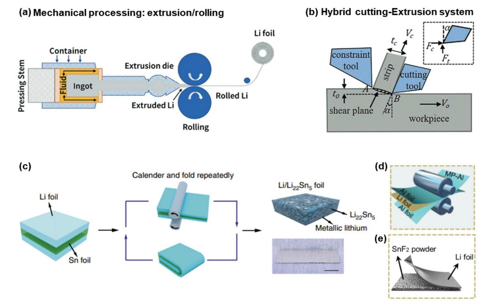

Fig. 3. (a) Schematic illustration of the lithium extrusion and rolling process, Adapted from Acebedo et al. Adv. Energy Mater. 2023;13:2203744, licensed under CC BY-NC-ND 4.0.[17] (b) Integrated cutting-extrusion system for lithium processing, Adapted from Mohanty et al., Adv., Mater, Technol., 2024;9:2301315, licensed under CC BY 4,0,[22] (c) Repetitive calendaring and folding of Li/Sn bilayer foil for alloy electrode fabrication, Adapted from Wan et al., Nat. Commun. 2020;11:829, under the terms of the CC BY 4.0 license. [28] (d) Li/Al alloy foil by rolling process. Adapted from Fan et al. Small 2022;18:2204037, with permission of Wiley.[29] (e) Multilayer Li/Li22Sn5/LiF alloy foil from the rolling process, Adapted from Li et al. Adv. Mater, 2023;35:2207310 with permission of Wiley,[30]

#### 리튬 금속 음극 제조 기술의 최근 연구동향과 발전 🏽

가공 산업에서 상용화된 기술로 높은 공정 성숙도를 가지 고 있으며, roll-to-roll (R2R) 연속 공정 형태로 구현 가능해 대량 생산성과 고속 제조에 적합하다. 하지만 리 튬 금속 고유의 성질인 높은 연성과 점착성, 비다공성 구조는 기존 금속 압연 공정과 달리 다양한 공정적 도전 과제를 수반한다. 특히 일반적인 캘린더(calendering) 방 식으로 가공할 경우 필름 손상, 표면 균열, 박리 등의 문제가 쉽게 발생할 수 있다. 또한 제조 과정에서 장력 (tension) 조절이 중요한 인자로 작용한다. [24] 이는 필 름의 박리 및 균일한 두께 확보에 유리하지만, 과도한 장력으로 인해 리튬 박막의 휘어짐(camber), 찢어짐 등 의 문제가 생길 수 있다.

이러한 문제를 극복하기 위해 다양한 공정적 접근법이 제안되어 왔다. Becking et al.은 실리콘화된 폴리에스 터 필름을 롤러에 적용함으로써, 가공 중의 리튬 표면 손상과 휘어짐을 억제하여 셀의 전기화학적 성능을 향상 시켰다. [25] 최근에는 다른 전략으로는 윤활제를 롤링에 도입하여 22 µm 두께의 리튬 박막을 제조한 연구가 보고 되었으며, [26] 유사한 방식으로 최대 30 m 길이, 15 cm 폭의 연속 생산도 보고되었다. [17] 뿐만 아니라. 압연 공정 최적화를 위해 Stumper et al.은 반경험적 모델 (semi-empirical model)을 통해 선하중, 롤러 온도, 리 튬 포일의 형상에 따른 변형 특성 등 다양한 공정 요소의 최적 조건을 도출하여, 안정적인 박막 압연 공정 설계를 제안하였다. [27] 최근 압연 기발 리튬 가공 기술은 단순 히 공정 안정성과 물리적 특성 확보에 국한되지 않고, 리튬 음극의 전기화학적 성능을 향상시키기 위한 구조 설계 및 조성 제어 수단으로도 활발히 응용되고 있 다. [28,29] 단순 기계적 공정으로 집전체 위에 리튬을 접착시키는 방식은 계면 저항을 줄이고 공정 단순화를 유도할 수 있어. 고체 전해질 시스템에서 높은 제조 유연 성을 제공하는 전략으로 각광받는다. 특히 캘린더링, 프 레싱(pressing)과 같은 압연 공정을 단독 박막 제조가 아닌, 기능성 계면 형성, 합금층 도입, 복합 구조체 설계 를 위한 핵심 도구로 활용하는 사례들이 증가하고 있다. 이러한 연구들은 기존의 기계적 한계를 넘어서, 고전류 밀도, 고용량 조건에서도 안정적인 리튬 금속 음극을

구현하고자 하는 전략으로 자리매김하고 있다. 예를 들 어, Wan et al.에서는 Sn foil에 Li foil을 적층한 후, 캘린더링 및 접기를 반복함으로써 두 재료가 자발적 합금 화 반응이 일어나도록 유도하였다(Fig. 3(c)).[28] 반복 적인 캘린더링과 접기를 통해 하부에는 Li22Sn5 합금층 이, 상부에는 잔존 리튬 금속층을 형성하는 안정화된 이 중층 복합 전극을 구현하였다. 화학적으로 Li22Sn5는 리 튬보다 낮은 반응성을 지녀 균일한 SEI 형성과 계면 내구 성을 동시에 향상 시키는 역할을 하고 높은 기계적 강도로 인해 반복적인 충 • 방전 중 리튬의 부피 팽창을 효과적으 로 흡수할 수 있어 전극 계면 구조 붕괴를 방지함으로써 장기적 안정성을 강화하였다. 특히, 30 mA cm-2의 고전 류 밀도 및 5 mAh cm-2의 용량 조건에서도 20 mV 이하의 낮은 과전압과 함께 200 사이클 이상의 안정적인 충방전 특성을 구현함으로써 기계적 압입 방식의 우수성 을 입증하였다. [28] 비슷한 접근법으로 Al foil과 리튬 포일을 압연을 통해 합금화에 성공하여. 리튬 음극의 성 능을 향상시켰으며(Fig. 3(d)), [29] SnF2 파우더를 리튬 포일에 도입해서 합금화하여  $Li/Li_{22}Sn_5/LiF$  구조의 음 극 개발도 보고 되었다(Fig. 3(e)). [30] 더 나아가 최근에 는 이러한 기계적 조립 방식이 3차원 다공성 구조체 기반 집전체와 결합되어 고도화되고 있다. 프레싱 또는 압연을 통해 리튬 금속 또는 리튬 합금을 다공성 금속 구조체(Cu foam, Ni foam 등) 혹은 탄소 기반 프레임워크(Carbon nanotube (CNT) sponge, carbon scaffold 등) 내부로 기계적으로 주입하거나, 표면에 밀착시키는 방식이 대표 적이다. 이 방식은 고온 용융을 필요로 하지 않기 때문에 열에 민감한 소재에도 적용 가능하며, 제조 장비가 간단 하고 재현성이 우수하다. 이 구조는 리튬이 기공 내부 깊숙이 침투한 형태로 구현되었으며, 나노미터 크기의 인터페이스가 형성되어 계면 접촉 저항을 크게 낮추는 데 기여하였다. 다공성 집전체는 리튬과의 기계적 적층에 유리하며, 내부 공간을 통해 체적 팽창 완충 및 리튬 침투 를 유도함으로써 전극 전체의 구조적 안정성과 전기화학 적 성능을 향상시킨다. Shu et al.은 리튬 금속 필름을 탄소 기반 구조체 위에 프레싱하여 복합 음극을 제작하였 다. [31] 해당 구조는 구조체와 리튬 사이의 밀착력을 크게

# **Increase Information**

#### ▌주현상, 윤정식

향상시켰으며, 사이클링 과정에서의 덴드라이트 형성 억 제와 전기화학적 안정성 확보에 효과적이었다. 이와 같은 방식은 복잡한 화학적 표면 개질 없이도 단순한 기계적 공정만으로 리튬과 구조체 사이의 계면 접촉을 강화할 수 있으며. 특히 제조 공정의 재현성과 확장성이 우수하 다는 점에서 주목 받는다. 또한 최근 보고된 바에 따르면. 리튬-마그네슘(Li-Mg), [32] 리튬-아연(Li-Zn), [33] 리튬-주석-인듐(Li-Sn-In)[34] 등의 합금 소재를 활 용한 기계적 도입 방식도 활발히 연구되고 있다. Liu 연구 팀은 Cu-Ni 합금 기반의 다공성 메탈 매트릭스에 리튬을 도입하고 고압 롤링을 통해 계면 밀착성을 향상시킨 구조 를 보고하였다. [35] 이 방식은 다공성 구조의 기계적 지 지와 리튬의 변형성을 조합하여 높은 전류 밀도 조건에서 도 덴드라이트 억제 효과를 나타내며, 장기 사이클 안정 성을 보였다. 이러한 전략은 단순한 리튬 필름 압입을 넘어, 구조체의 기공 설계 및 합금 조성 제어를 병행하여 고출력과 장수명을 동시에 확보할 수 있는 통합적 시스템 으로 진화하고 있다. 또 다른 예로 Zhu et al은 다공성 탄소 기반 프레임워크에 비정형 리튬을 압연 접합하는 구 조를 제시하였다. [36] 이 공정은 복잡한 용융 주입 없이 상온에서 리튬을 탄소 매트릭스에 일관되게 주입할 수 있으며, 결과적으로 덴드라이트 형성 억제, 계면 저항 감소, 고속 충방전 특성 확보 등의 장점을 보여준다. 특히 이 과정에서 사용된 질화알루미늄(Aluminum nitride)은 은 우수한 열전도성과 전기절연 특성을 갖는 세라믹 소재 로 탄소 기반 그래핀 산화물과 복합화되어 환원 처리된 뒤, 용융 리튬과 반응함으로써 Li3N과 Li3Al2를 포함한 안정한 계면 화합물을 형성하게 된다. 이 과정을 통해 형성된 Li-AIN-rGO 복합체는 압연을 통해 균일한 물리 적 밀착을 확보하면서도, 높은 계면 안정성과 낮은 저항 을 실현할 수 있다. 상용 기술 관점에서도, 이러한 압연 기반 박막화 및 복합화 기술은 높은 기술 성숙도를 보이고 있으며, 특히 R2R 기반의 자동화 압연 시스템은 배터리 대량 생산 공정에 손쉽게 통합 가능하며 실제로 최근 보고 된 Pasta 연구팀은 격자 설계된 캡슐형 하우징과 고속 슬리팅 기술을 활용해 기계적 손상을 최소화하고 수um 두께의 리튬 박막을 안정적으로 다량 제조할 수 있는 연속

406 | 세라미스트

C E R A M I S T

압연 공정을 구현하였다. 이 기술은 리튬 금속 음극을 대면적 상용화 수준으로 전개할 수 있는 가능성을 보여주 며, 실질적 생산 환경에 적용 가능한 고도화된 압연 전략 으로 평가된다. [37]

더 나아가. 압연 및 프레싱 기반 공정은 단순한 구조 형성에서 나아가 표면 안정화 기술과도 결합되고 있다. 특히 금속 리튬은 가공 직후 수 초 내에 외부 환경과 급격 히 반응하여 비균일한 산화물 층이나 불균일한 SEI가 형 성 될 수 있으며, 이는 전기화학적 성능 저하 및 장기적 불안정성으로 이어진다. 이러한 문제를 해결하기 위해. 최근에는 압연 직후 리튬 표면에 수동화(passivation) 코팅을 도입하여 표면을 보호하고 계면을 안정화시키는 전략이 활발히 연구되고 있다. poly(vinylidene fluoride-cohexafluropropylene) (PVDF-HFP), Polytetrafluoroethylene (PTFE)와 같은 고분자 필름을 슬롯다이(slot-die) 방식이 나 딥코팅(dip-coating) 방식으로 코팅하거나.[38,39] 원자층 증작(Atomic layer deposition, ALD) 기반의 LiF,  $Al_2O_3$ ,  $Li_3PO_4$  등의 무기막을 형성하는 방식이 활용 된다.[40] 이러한 수동화 레이어는 외부 수분 및 CO2와의 반응을 억제할 뿐만 아니라. 후속 고체 전해질 적층 공정 에서도 계면 안정성과 접착력을 크게 향상시킬 수 있다. 특히 표면 안정화 레이어는 전기화학적 비활성 물질로 구성되어도 리튬의 용출 또는 침투를 저지함으로써 장기적 인 구조 유지에 기여하며 실제로 다수의 연구에서 수동화 층이 계면 안정성과 고속 충방전 특성 개선에 직접적으로 기여함을 실험적으로 입증하였다. [28,36] 최근 Suk group에서는 수직 정렬 리튬 나노 섬유(Vertically aligned lithium nanofibers, VA-LiNF) 기반의 고성능 음극 제조 전략을 제안하였다. 연구진은 리튬 포일에 압 연 공정을 적용하여, 리튬 결정립을 재배열시켜 표면에 수직으로 돌출된 나노섬유 형태의 구조체를 형성하였다. 이 구조는 기존 평탄한 리튬 표면 대비 훨씬 넓은 전기활 성 면적을 제공하며, 국부 전류 밀도 감소, 리튬 이온 플럭스 균일화, 덴드라이트 억제 등의 이점을 갖는다. 이후 VA-LiNF 표면에 고분자 기반의 수동화 레이어 (Highly protective layer, HPL)를 형성하여 리튬 표면 을 안정화시켰다. 전 공정은 R2R 기반의 연속 시스템으로

#### 리튬 금속 음극 제조 기술의 최근 연구동향과 발전 🏽

구현 가능하며, 실제로 본 연구에서는 수십 미터에 이르 는 고품질 리튬 음극을 연속적으로 제조하였다. HPL층 을 알루미늄 포일에 코팅하고 이어지는 R2R 압연 과정을 통해 리튬 금속 위에 성공적으로 전사시켰다. (비전, SEM 이미지를 통해 처음 HPL층을 코팅한 알루미늄 포 일의 표면에 HPL이 남아있지 않음을 보임으로써. 모든 HPL층이 리튬으로 전사됨을 입증하였다.) 본 연구를 통 해 연구진은 차세대 리튬 금속 전극 제조의 공정 융합 가능성과 상용화 잠재력을 시사하였다. [41]

이처럼 수동화 처리 기술은 압연 공정의 연장선상에서 리튬 금속 전극의 표면 안정성과 수명을 향상시키는 핵심 요소로 작용하며 후속 고체 전해질 기반 시스템과의 적층 공정에도 직접적인 영향을 미친다. 따라서 압연 기반 리 튬 금속 전극 제조에서 수동화 기술은 전극 설계의 필수적 인 일환으로 고려되어야 하며 기계적 가공 기술과 통합된 다기능 공정으로 발전하고 있다. 이후 슬리팅(slitting) 공정을 통해 단위 전극으로 절단되고 다양한 전해질 시스 템에 접목되어 활용된다.

이처럼 기계적 가공 기반의 리튬 금속 전극 제조 기술 은 단순성, 공정 효율성과 같은 여러 측면에서 중요한 이 점을 지닌다. 압연. 캘린더링. 프레싱 등의 기술은 산업적 으로 이미 검증된 금속 가공 방식으로 리튬을 정밀한 박막 으로 가공하거나 집전체 위에 압착 접합하는 용도로 활용 될 수 있다. 특히 Cu foil, Cu foam, CNT 등 다양한 2D 또는 3D 집전체 위에 리튬을 물리적으로 적층하는 공정이 보고 되고 있으며, 이는 구조 안정성과 계면 밀착 향상에 효과적인 전략으로 평가된다. 그러나 이러한 방식 은 리튬의 특징상 여전히 몇 가지 구조적 기능적 한계를 내포 하고 있다. 리튬 금속은 자가지지(self-supporting)가 어려워 기계적 유연성이 낮고, 집전체 유무와 무관하게 전기화학적 불균일성(도금, 분포, SEI 균열 등) 및 장기 적 파손(dendrite, dead Li 등)에 취약하다. 또한 리튬 자체가 전극 및 집전체의 역할을 모두 담당해야 하는 경우에는 전기적 접속성, 열 안정성, 계면 접착력 확보에 구조적 제약이 존재하며, 실제 셀 조립 단계에서는 과량 리튬 사용이 필요해 부피 및 무게 기반 에너지 밀도 저하를 초래한다. 특히, 얇고 정밀한 리튬 박막 형성이

어렵고, 장시간 운전 시 전기화학적 성능 저하와 기계 적 파손 위험이 커 실제 셀 설계에서의 유연성은 매우 낮다.

이러한 한계점을 해결하고자 최근에는 리튬 금속을 직 접 전극으로 사용하는 대신 금속 또는 탄소 기반의 집전체 를 활용해 리튬을 구조적으로 지지하거나. 얇고 정밀하게 증착 주입 도포하는 방식이 주류로 자리잡고 있다. 이러한 전략은 리튬의 화학적 불안정성을 보완함과 동시에 공정 융합성을 높이고 구조 설계를 가능케 하며, 반복적인 충 방전 조건에서도 안정적인 전기화학적 성능을 확보할 수 있다는 점에서 큰 주목을 받고 있다. 특히, 3차원 구조의 집전체는 넓은 전기활성 면적(electroactive surface area)을 바탕으로 국부 전류 밀도를 낮추고, 리튬 이온의 플럭스(flux)를 균일하게 분산 시킬 수 있으며, 체적 팽창 과 기계적 스트레스를 흡수하는 여유 공간을 제공할 수 있어 구조적 장점이 뚜렷하다. 이러한 전극의 리튬 수용 능력은 다음과 같이 정량화할 수 있다.[42]

$$\eta=\frac{r\!-\!1}{r}$$

여기서 r은 전기활성 면적 비율을 의미하며, 이 때 전기활 성 면적이란 실제 반응이 일어나는 기하학적 면적을 뜻한 다. 이 식에 따르면. 전기활성 면적 비가 클수록 구조체 내부에 리튬이 효율적으로 수용될 수 있으며, 전기활성 면적 비율이 무한에 가까워질수록 (r → ∞) 리튬 수용률 이 1로 수렴하게 되어 거의 모든 리튬이 안정적으로 구조 내에 도입될 수 있음을 보여준다. Guo 연구팀은 이를 실험적으로 검증하여. 구조체의 비표면적이 리튬의 저장 능력에 결정적인 영향을 미친다는 사실을 3차원 구리 구 조체 기반 음극을 통해 제시하였다.[43]

더불어, 최근에는 구조체의 설계 고도화를 위해 기공 반 경, 표면 장력, 젖음각 등 열역학적 인지를 기반으로 한 확산 모델이 중요 설계 인자로 부각되고 있다. 대표적으로 Young-Laplace 방정식은 용융 리튬이 구조체 내부로 자 발적으로 침투할 수 있는 조건을 설명한다.

$$P = \frac{2\gamma cos\theta}{r}$$

여기서 ΔP는 유체의 계면에 작용하는 압력, γ는 리튬의 표면 장력,  $\theta$ 는 젖음각(Contact angle),  $r$ 은 구조체의 기공 반경이다. 이 식에 따르면, 기공 반경이 작고 젖음각 이 작을수록 유체의 계면에 작용하는 압력이 커져. 리튬 이 구조체 내부로 퍼져나가는 자발적 확산이 가능하다. 이는 곧. Washburn equation에서 유체가 모세관 현상 에 의해 자발적으로 미세 유체관을 침투하는 길이 (L)로 도 표현된다.

$$L = \sqrt{\frac{\gamma rt cos \theta}{2\eta}}$$

유체의 침투길이는 시간(t) 제곱근에 비례하며 유체의 동적 점도 (η)가 작을수록 더 빠르게 침투한다는 것을 알 수 있다. 실제로 Xie 등은 이러한 원리를 바탕으로 친리튬성 표면을 조성하고, 외부 압력 없이도 구조체 내 부로 용융 리튬이 신속하게 확산되는 자발적 주입 시스템 을 구현한 바 있다.[44]

이후에서 다룰 다양한 리튬 금속 음극 제조 기술 (기상 증착법, 용융 기반 리튬 주입, 전기화학적 증착 등)의 제 조법은 리튬을 보다 정밀하게 형성 제어하기 위한 제조 접근법이며, 이에 따라 집전체의 구조적 설계, 계면공학, 열역학 설계 변수의 조합은 차세대 리튬 음극 기술의 핵심 으로 자리 잡고 있다.

### 2.2 기상 증착법(Vapor deposition)

기상 증착법은 고체 리튬 금속을 기화시킨 뒤. 이를 진공 또는 반응성 분위기 하에서 기판에 증착하여 박막을 형성하는 공정이다. 이러한 기상 증착 기반 박막 제조 공정은 기계적 가공보다 정밀한 박막 형성과 균일한 계면 조절이 가능하다는 장점을 지닌다. 특히 고에너지 밀도 배터리의 성능과 안정성을 좌우하는 리튬 금속의 초기 증착 두께 및 형상 제어, 그리고 고체전해질과의 계면 안정성 확보를 위해 널리 연구되고 있다. 기상 증착법은 증착 메커니즘과 공정 조건에 따라 (1) 물리적 기상 증착 (Physical vapor deposition, PVD), (2) 화학적 기상 증착(Chemical vapor deposition, CVD) 및 ALD 등으 로 분류된다. 각 기법은 리튬의 높은 반응성, 낮은 융점, 증기압 특성 등을 고려해 선택적으로 적용된다. 다음 절 에서는 그중 대표적인 PVD 기술을 중심으로 리튬 박막 제조 응용 사례를 살펴보고자 한다.

### 2.2.1 물리적 기상 증착(PVD)

PVD은 고체상태의 재료를 증발 또는 스퍼터링 통해 기화시킨 뒤, 이를 기판에 응축시켜 박막을 형성하는 기술 로, 전극 및 전해질 계면을 원자 수준에서 정밀하게 조절 할 수 있는 공정이다. 일반적인 고온 세라믹 공정과는 달리 상대적으로 낮은 온도에서 공정이 가능하며, 성장 속도는 약 0.1~100 nm/s 범위로, 수 Å에서 수십 μm에 이르는 다양한 두께 조절이 가능하다. PVD는 다시 전자빔 증발(E-beam evaporation, EB-PVD), 펄스 레이저 증착 (Pulsed laser deposition, PLD), 스퍼터링(Magnetron sputtering), 열증발법(Thermal evaporation) 등으로 세분화된다(Fig. 4(a-d)). 먼저 전자빔 증착법은 고체 리튬 금속의 계면 제어 및 고정밀 박막 형성에 유용한 PVD 기법 중 하나로, 초고진공(Ultra-high vacuum, UHV) 환경에서 고순도의 금속 또는 화합물을 정밀하게 증착할 수 있는 기술이다. 이 방법은 텅스텐 필라멘트를 가열하여 열전자 방출(Thermionic emission)을 유도하 고, 방출된 전자를 고전압으로 가속시켜 타겟 재료에 충 돌시킴으로써 타겟을 국소적으로 용융 또는 승화시킨다. 이후 증기화된 원자가 기판 표면에 응축되며, 방향성 높 은 증착 특성으로 균일한 박막을 형성한다. EB-PVD의 가장 큰 장점은 매우 높은 순도의 박막을 낮은 온도에서 형성할 수 있다는 점이다. 이로 인해 리튬과 같이 고반응 성을 가지며 열에 민감한 금속에 대한 증착이 가능하며, 다양한 기판 위에 계면 반응 없이 조밀하고 균일한 층을 구성할 수 있다. 실제로 EB-PVD는 높은 증착 에너지와 진공도를 바탕으로 유기 불순물의 오염을 방지하고, 화학 적으로 불안정한 재료에도 무리 없이 적용될 수 있어 고체 전해질 배터리 인터페이스 연구에 자주 활용된다. 예를 들어, Janek 연구팀에서는 EB-PVD를 이용하여 리튬

리튬 금속 음극 제조 기술의 최근 연구동향과 발전❚

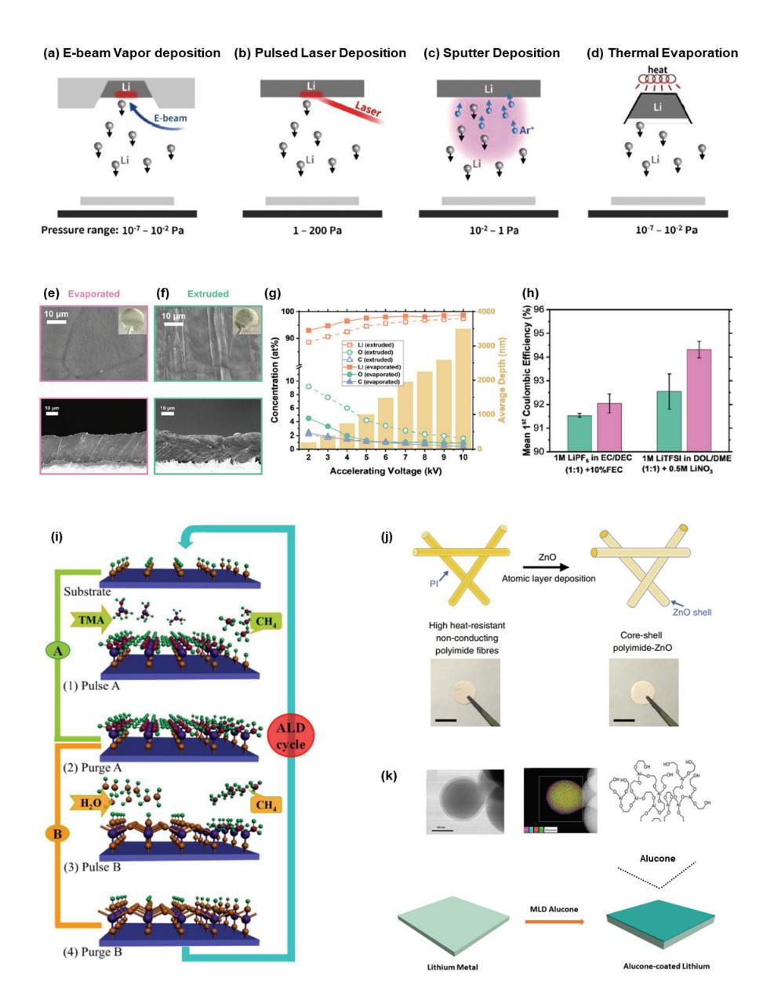

Fig. 4. (a–e) Conceptual schematics of vapor deposition methods: (a) electron-beam evaporation, (b) pulsed laser deposition, (c) sputtering, and (d) thermal evaporation. Adapted from Acebedo et al. Adv. Energy Mater. 2023;13:2203744, licensed under CC BY-NC-ND 4.0.[17] Cross-sectional SEM images and optical photographs of lithium foil fabricated via (e) evaporation and (f) extrusion. (g) Analysis of impurity concentration in lithium foil as a function of accelerating voltage. (h) Full-cell electrochemical performance of lithium foils prepared by vacuum evaporation (magenta) and extrusion (green). Panels (f–h) adapted from Rospars et al. Commun. Mater. 2024;5:179, licensed under CC BY 4.0.[53] (i) Schematic illustration of the atomic layer deposition (ALD) cycle for Al2O3 protective layer formation. Adapted from Meng et al. Adv. Mater. 2012;24:3589–3615 with permission of Wiley.[60] (j) Porous current collector formed by ALD of ZnO onto high-temperature-resistant polyimide fibers. Adapted from Liu et al. Nat. Commun. 2016;7:10992, licensed under CC BY 4.0.[61] (k) MLD-derived alucone interfacial layer schematic, including TEM and EDX characterization. Adapted from Chen et al. ACS Appl. Mater. Interfaces 2018;10:7043–7051 with permission of the American Chemical Society.[62]

박막을 고체전해질(LiPON)위에 증착한 후, 계면의 전기 화학적 안정성과 리튬 이온 전달 특성을 분석하였다. [45] 이 연구는 전해질-음극 계면에서 발생할 수 있는 전자 누설, 계면 반응, 혹은 리튬 덴드라이트 발생 가능성을 정량적으로 평가하기 위한 목적에서 진행되었으며. EB-PVD로 형성된 박막은 균일한 두께와 구성으로 계면 의 화학 안정성을 유지하는데 중요한 역할을 하였다. 특 히 리튬 박막이 고체전해질과의 접합 계면에서 고른 전위 분포를 나타내었고 리튬 이온이 안정적으로 확산되는 경 로를 제공함으로써 이상적인 고체 계면 모델 시스템 구축 이 가능함을 보였다. 이러한 EB-PVD 기반 연구는 계면 반응성이 큰 리튬 금속과 고체전해질 사이의 계면 특성을 제어하거나 이해하는데 원자 수준에서 음극의 작동 메커 니즘을 규명할 수 있는 기반을 마련해준다. 다만 EB-PVD 기술은 장비 비용이 높고 공정 환경 조성이 까다로우며, 대면적 제조 및 상용화를 위한 스케일업에 제한이 있다. 결과적으로 EB-PVD는 리튬 금속 음극과 고체전해질 간 계면의 정밀한 물성 분석과 구조 제어가 필요한 경우에 매우 유용하며, 향후에는 고체 상태 내 인터페이스의 반응 억제 및 수명 향상을 위한 도구로 그 활용도가 더욱 더 확대될 것으로 전망된다. 두번째 기상 증착 기술로 펄스 레이저 증착(PLD)은 고에너지 레이저 펄스를 리튬 또는 보호층 타겟에 조사하여 생성된 플라즈 마 플룸(plume)을 기판 위에 응축시키는 방식이다(Fig. 4(b)). UHV 챔버 내에서 플루언스, 반복주기, 기판 온도. 타겟-기판 간 거리 등 다양한 파라미터를 정밀하게 조정 할 수 있으며, 특히 조성 정합성과 에피택셜 성장 (epitaxy) 가능성 면에서 우수한 제어 능력을 제공한다. PLD는 리튬 금속 자체 증착에는 제한적이지만, 최근 보 고된 논문에 따르면 수  $\mu$ m 두께의 균일한 리튬 박막을 성공적으로 증착하고, 이를 통해 낮은 계면 저항과 균일 한 전기화학 성능을 확보했음을 보고하였다. [46] 더욱이, PLD는 리튬 금속보다는 Li3PO4, LiNBO3, LiPON과 같 은 고체전해질 또는 보호층, 나노 구조 탄소 기반 전극 표면 개질에 활용되는 경우가 많다. 예를 들어 최근 Zamperlin et al. 에서는 리튬 고체전해질과 리튬 금속 음극 사이의 계면을 안정화 하기 위해 PLD로 LAGP

표면에 20 nm 두께의  $Li_3PO_4$  박막을 증착함으로써, 리튬과 고체전해질 사이에서 발생하는 화학적 열화를 억제하고 계면 저항을 효과적으로 감소시켰다. [46] 실험 결과, 대칭셀(Symmetric cell)에서  $Li_3PO_4$  박막이 존재 할 경우 계면저항이 감소하고 고온 (60℃) 조건에서도 사이클 수명 및 전기화학적 안정성이 현저히 향상되었다. 또한, NMC90505 양극 기반 full cell 시스템에서 보호층 이 없는 리튬 전극에서 불완전 충전이 발생하는 반면,  $Li3PO4$  박막이 존재하는 경우에는 초기 용량 187 mAh g-1로 계면 안정성 및 에너지 밀도 측면에서 명확한 개선 효과가 나타났다. 이러한 결과는 PLD 기반 박막 기술이 고체전해질 기반 리튬 금속 전지에서 계면 안정성과 에너 지 밀도 측면에서 실질적인 개선을 제공할 수 있음 시사한 다. 따라서, PLD는 리튬 친화성 층의 정밀 증착 및 다층 계면 설계에 유리하여, 특히 차세대 무음극 구조 개발에 효과적일 것이라고 기대하고 있다. 세번째 기술로. 스퍼 터링 증착법은 플라즈마 상태의 가스 이온을 고체 타겟 표면에 가속하여 물질을 비산(spallation)시켜 기판 위에 증착하는 방법으로, 고체전해질 박막, 전극 보호층, 계면 조절층 등 다양한 구성요소의 정밀 증착에 활용되고 있 다. 특히 전기 전도성이 낮은 절연성 타겟 (예: Li3PO4,  $Al_2O_3$  등)의 경우, Radio frequency 마그네트론 스퍼터 링 방식이 주로 사용되며, 이는 13.56 MHz의 고주파 전력을 통해 안정적인 플라즈마를 생성하고 증착 공정을 수행할 수 있게 한다(Fig. 4(c)). 스퍼터링은 일반적인 증발 기반 증착법과 달리, 고에너지 플라즈마 환경에서 진행되어 증착된 입자의 에너지가 더 높고, 기판에 대한 밀착력(adhesion) 및 박막 치밀도(density)가 우수하다. 이는 배터리 내 계면 저항을 감소시키고 화학적 열화를 억제하는데 유리한 특성으로 작용한다. 예를 들어, 고체 전해질과 리튬 금속 간 화학적 반응이나 확산 문제를 완화 하기 위해 비활성 산화물 박막(LiPON, Li3PO4)을 스퍼 터링으로 증착함으로써 계면 안정화 및 충방전 수명 향상을 유도한 연구들이 보고되었다.[47-49] 최근 연구에서는 LixSny, Zn/ZnO와 같은 합금 또는 신화물계 타겟을 이용해 Cu 기판 위에 중간층을 형성하고, 이를 통해 리튬의 핵 형성 제어 및 덴드라이트 억제를 실현하였다. [50] 또한,

리튬 금속 음극 제조 기술의 최근 연구동향과 발전 🏽

Deng 연구팀은 DC 마그네트론 스퍼터링으로 리튬 금속 음극 표면에 Al층을 증착하였고, 이후 열처리를 통해 Li-Al (Li9Al4)으로 변환하여 고체전해질인  $\text{Li}_{6.4}\text{La}_{3}\text{Zr}_{1.4}\text{Ta}_{0.6}\text{O}_{12}$  (LLZTO)와 리튬 금속 사이에 인터레이어로 사용하여 계면 저항과 화학 반응성 개선을 유도하는데 성공하였다. Li-Al 합금층 도입으로 계면저 항을 660 에서 90  $\Omega$  cm-2로 약 7배 이상 감소 시켰으며. 전기화학적 사이클 수명 역시 증대시켰다. [51] 한편, 반 응성 스퍼터링은 일반 스퍼터링과 구분되는 방식으로, 두 가지 주요 차별점을 가진다. 첫째. 타겟-기체-증착층 의 조성이 서로 일치하지 않는다. 둘째, 탈착된 스퍼터링 원자가 의도적으로 주입된 반응성 기체 분자 (예: O2, N2 등)와 충돌 반응하여 새로운 화합물을 형성한다. 이를 위해 일반 스퍼터링보다 조금 더 높은 기체 압력을 유지하 여 기상에서의 충돌 확률을 높이며. 이로 인해 물질의 수송 거동은 탄도 수송(ballistic)과 확산 수송(diffusive) 수송 사이의 전이영역에 놓이게 된다. [52] 이러한 반응성 조건은 기존 PVD 증착보다 높은 에너지의 입자를 생성하 고, 층의 조성 및 구조를 더욱 정밀하게 제어할 수 있게 하여 복합 산화물, 질화물 계열의 박막 증착에 특히 적합 하다. 마지막 기술인 열증발법은 가장 단순하고 산업 적 용성이 높은 박막 제조 기술로, 전기 저항 가열(Jolue heating)이나 전자빔 가열을 통해 타겟을 기화시키고, UHV 조건 하에서 기판 위에 응축시켜 박막을 형성한다  $(Fig. 4(d))$ . 이 기술은 높은 순도와 균일한 박막 형성이 가능하다는 장점과 10 nm 이하의 정밀한 두께 제어가 가능하며, 전고체전지 계면의 치밀도 확보 및 접합 특성 개선 측면에서 유리하다. 이러한 장점으로 열 증발로 제 조된 리튬은 기존 상용 압출 리튬 대비 passivation 층 두께가 얇고, 표면이 보다 균일하게 형성된다. 이로 인해 초기 쿨롱 효율이 향상되고, 고전류 밀도에서의 안정성 및 덴드라이트 억제 효과 등 다양한 전기화학적 성능 개선 이 보고 되고 있다. 최근 Rospars et al.은 진공 열증발 방식을 통해 ≤25 µm 두께의 초박막 리튬 음극을 구현하 였다. [53] 본 연구에서 제조된 리튬 금속 음극은 상용 압출 방식과 비교하여 구조적, 화학적 우위를 보인다. 열증발법 기반 리튬 음극은 매끄러운 표면과 크고 균일한

결정립을 가지며, 실리콘이나 구리 기반의 불순물이 검출 되지 않았다(Fig. 4(e)). 반면, 압출 리튬은 가공 중 발생 한 스트리에이션(striation)과 함께 실리콘 오일 기인 불 순물이 존재하였다(Fig. 4(f)). 두 방식 모두 동일한 25 µm 두께로 제조되었으며 열증발법이 재현성 높은 정밀 두께 제어에 적합함이 확인되었다. 또한, EDX 분석 결과 (Fig. 4(g))에서 확인된 바와 같이, 열 증발 리튬은 표면 산소 및 탄소농도가 낮고, 가속 전압 증가 시 급격한 산소 함량 감소를 보여 passivation layer가 얇음을 입증하였 다. 반면, 압출 리튬은 10 kV 가속 전압에서도 산소 함량이 2 at% 수준으로 유지되어 두꺼운 산화층 존재를 시사한다. 이러한 구조적 차이는 계면 반응성 및 전기화학적 성능에 큰 영향을 미치고 두 종류의 전해질 (EC/DEC+FEC,  $DOL/DME+LiNO3$ ) 조건 모두에서 열증발 리튬이 상용 압출 리튬보다 더 높은 초기 쿨롱 효율을 기록하며 우수한 계면 특성을 입증하였다(Fig. 4(h)). 이러한 구조적, 화학 적 장점은 최근 열증발 기반 초박막 리튬 금속 음극 제조 가 단순한 증착 기술을 넘어서 계면 공학의 핵심 플랫폼으 로 진화하고 있음을 시사한다. 특히 리튬 표면에 자연스 럽게 형성되는 passivation layer ( $Li_2CO_3$ ,  $Li_2O$ ,  $LiOH$ 등)의 영향이 점차 부각되며, 이를 최소화할 수 있는 고순 도 열증발법 기반 제조 기술이 각광받고 있다. 이러한 결과는 최근 보고된 Zhang 그룹의 연구 결과와도 일치한 다.[54] 해당 연구에서는 vacuum evaporation plating 기술을 활용하여 2-10 µm 두께의 초박막 리튬 금속 음극 을 구리기판 위에 정밀하게 증착하여, 0.5 mAh cm-2 조건에서 대칭셀 기준 20시간 이상 안정적인 사이클 수명 과 25% 이상의 리튬 이용률을 달성하였으며, LiFePO4 기반 전체 셀에서도 240 사이클 후 90.56%의 용량 유지 율, 5 C의 고율 조건에서도 99.4 mAhg-1의 높은 용량을 유지하는 우수한 성능을 보였다. 이러한 결과는 열증발법 이 다순한 구조에도 불구하고 고순도, 고밀도, 대면적 증착에 유리하여 초박막 리튬 음극의 상용화를 위한 유망 한 증착 기술임을 입증하는 사례로 평가된다. 또한 열증 발법은 R2R 연속 공정과의 호환성이 뛰어나며. Liu 연구 팀의 최근 발표 문헌에 따르면 열증발을 기반으로한 리튬 음극제조의 giga factory로의 확장 가능성을 제시하며,

단가와 에너지 밀도 측면에서 상업화 가능 수준에 근접했 음을 분석하였다. [55] 그러나 증착 시 리튬은 산소와 수 분에 매우 민감하게 반응하여 산화물층을 형성하기 때문 에, Ar과 같은 불활성 분위기에서의 보관과 공정이 필수 적이며, 산화층이 존재할 경우 증착 초기 고전력이 요구 될 수 있다. 따라서 용융 전력을 사전에 파악하고 증착 전력 상승을 점진적으로 조절해야 하며, 고온에서의 고증 기압 특성으로 진공 시스템 오염 가능성도 고려되어야 한다.

## 2.2.2 화학적 기상 증착법(CVD) 및 원자(ALD)/ 분자층(MLD) 기반 증착법

리튬 금속 음극의 실용화를 위해서는 고체전해질과의 안정적인 계면 형성과 더불어 구조적 안정성 확보가 필수 적이며, 이를 위한 전략 중 하나로 CVD, ALD, 분자층 증착(MLD) 기술이 각광받고 있다. 이들 증착 기술은 원자 단위의 정밀 제어를 통해 수 나노미터 두께의 고순도 박막을 균일하게 형성할 수 있으며, 단순한 보호층(passivation layer) 형성에 그치지 않고, 전극 전체의 기능을 다면적으로 개선하는데 기여하고 있다. 원자층 증착법은 자가 제한적 (self-limiting)인 표면 반응을 기반으로 전구체를 기판 에 주기적으로 주입하여, 나노미터 이하의 정밀한 두께 제어와 균일한 조성을 갖는 박막을 증착할 수 있는 기술이 다. ALD 기반 Al2O3 박막은 가장 널리 연구된 보호층 중 하나로, 리튬 표면에서의 산화반응과 수분반응을 억제 하고. 자연적으로 형성되는 불균일한 SEI층을 대신하여 계면 저항을 줄이는데 효과적인 것으로 보고되었다. [40.  $56-59$ ] Al2O3 박막은 TMA (trimethylaluminum)와 H2O를 교대로 주입하여 사이클당 약 0.13 nm의 증착 속도로 성장시킬 수 있다. 이때, 반응은 시간 간격을 두고 전구체 주입과 purge 단계로 구분되어 기상 혼합을 방지 한다(Fig. 4(i)).[60] 이러한 ALD 기술은 기존 리튬 이차 전지의 양극 보호층 형성에는 다수 활용되어 왔지만, 금 속 리튬 음극에의 적용은 여전히 도전적인 주제로 남아 있다. Kozen et al.은 플라즈마 강화 ALD(PEALD)를 활용해 TMA와  $O_2$  플라즈마로  $Al_2O_3$  박막을 리튬 금속 표면에 증착하였으며, 이를 리튬-황 전지에 적용하였

다. [57] 해당 보호층은 리튬의 신화를 억제하고, 리튬-황 전지에서 덴드라이트 형성을 방지하고 초기 용량 손실을 최소화하여 100 사이클 이후에도 90% 이상의 용량 유지 율을 달성하였으나, 실제 리튬 재도금 위치 (Al2O3 위 또는 아래)에 대한 명확한 분석은 부족하였다. 후속 연구 로 Kazyak et al.은 TMA/H2O 기반 ALD-Al2O3 박막 을 리튬 대칭 셀에 적용하여 덴드라이트 성장을 정량적으 로 분석하였다. [58] 결과적으로 보호층은 사이클 수명을 두배로 증가시키고, 최대 1280회의 충방전 후에도 표면 거칠기 증가 없이 평탄함을 유지함을 입증하였다. 또한 XPS 분석을 통해서 리튬 박막 내 알루미늄 성분이 여전히 존재함을 확인하였고, 이는 리튬 이온이 박막을 통과하여 기저 금속 표면에 재도금 되었음을 시사하였다. 그러나 이들 연구에서는 ALD 전구체인 TMA와 H2O가 리튬과 반응하여 LiOH와 H2를 발생시키며, 이 반응은 매우 발열 적 특성을 지닌다. 이론적 계산에 따라 150℃. 0.02 Torr 조건에서 LiOH가 6 nm/s 속도로 형성되며.  $[61]$  이는 일반적인 ALD 성장 속도 (0.13 nm/cycle)를 훨씬 초과 한다. 또한 H2O 노출 조건에 따라 LiOH와 Li2O의 형성 비율이 달라지며. 이에 따라 박막의 균일도를 떨어뜨릴 수 있다. 따라서 Kozen과 Kazyak의 후속 연구에서는 in-situ QCM 및 X-ray Floresence를 통해 리튬 표면 위 박막 성장 거동과 실제 증착 두께를 정량적으로 분석하 고자 하였다. [56] Sahadeo et al. 에서는  $Al_2O_3$  층이 전 해질의 wetting을 개선하고, SEI 균일화, 수명 향상 등을 유도함을 확인하였다. [59] 최근에는 Pakseresht et al. 은 ALD 코팅 사이클 수에 따른 배터리 효율을 분석하였 으며, 150 사이클 ALD-Al2O3 코팅으로 고전압 조건 (양극: LiN0.8Mn0.1Co0.1O2, 전류밀도: 200 mA  $g^{-1}$ , 200 회 사이클링 테스트)에서도 덴드라이트 형성 억제 및 용량 유지율을 32%이상 향상시키는 성과를 보고하였 다. [40] 이러한 결과들은 Al2O3 코팅이 리튬 금속 표면의 passivation과 전기화학적 안정성 향상에 유의미한 기여 를 할 수 있음을 실험적으로 뒷받침한다. 한편, ZnO 역시 ALD 기반 passivation layer로 활용되며, Cui 연구팀에 서 ALD 기술을 활용한 ZnO 코팅을 성공적으로 발표한 바 있다. [62] 해당 연구는 원자층증착을 통해 약 3 nm

## 두께의 ZnO 박막을 리튬 표면에 정밀하게 형성하였으며, 이 박막이 단순한 물리적 보호층을 넘어서 안정적인 계면 을 유도하는 핵심적 역할을 수행함을 입증했다.이후, 용 융 리튬을 도포하여 리튬 음극을 제조하였다(Fig. 4(j)). 이 과정에서 ZnO는 리튬과의 자발적인 산화-환원 반응 을 통해 금속 아연과 산화리튬으로 분해되며. 생성된 아 연은 다시 리튬과 합금화 되어 LiZn 합금층을 형성한다. 이러한 이중 구조, 즉 상부의 $Li_2O$ passivation층과 하부 의 LiZn 합금층은 리튬 이온의 도금 과정에서 안정적인 핵 생성을 유도하고. 덴드라이트 형성을 억제하는 데 크 게 기여한다. 추가적으로, Chen et al.의 연구는 MLD 방식으로 증착한 alucone 박막을 통해 리튬 금속의 산화 및 수분 민감도를 효과적으로 억제하였고, 장기적인 공기 안정성 또한 확보할 수 있음을 보여주었다. 이 alcone은 TMA 와 EG (ethylene glycol)의 교차 반응을 통해 형성 된 유기-무기 하이브리드 박막으로 2.5 Å/cycle의 정밀 제어가 가능하다(Fig. 4(k)). 코팅된 리튬은 대칭 셀에서 낮은 과전압과 (무코팅 리튬 대비 약 0.05-0.10 V 감소) 높은 capacity (무코팅 리튬—황 배터리 보다 39.5% 향 상)을 보였으며, 140 사이클 후에도 99.5% Columbic efficiency와 84% 이상의 용량 유지율을 달성한 바 있 다.[63] 이와 함께, ALD 및 MLD 기반 박막은 고체전해 질과 리튬 금속 음극 사이에 중간층 또는 완충층으로 활용 되어 계면 안정성을 극대화하는데 사용된다. 특히 이러한 박막은 3차원 구조 집전체에 적용되어 리튬 도금의 핵 생성 위치를 제어하고 도금 균일성을 개선하는 역할도 수행할 수 있다. 전통적인 구리(Cu) 집전체는 리튬과의 약한 결합력으로 인해 리튬 전기 도금 시 핵 생성에 필요 한 과전압을 증가시켜, 작은 임계의 리튬 핵 행성을 초래 한다. 구리 위에서 형성된 작은 리튬 핵은 서로 응집되고 리튬의 불균일한 도금으로 인해 덴드라이트 형성 위험이 크다. 이러한 문제를 해결하기 위해 일반적으로 핵 생성 과전압이 낮은 친리튬성 물질을 도입하는 전략을 사용한 다. Oyakhire et al.의 연구에서는 이러한 친리튬성 물질 인 TiO2 박막을 ALD기술로 10 nm로 얇게 증착하였다. ALD 기술을 도입함으로써 박막의 균일한 피복성을 보장 하고, 일정하게 10 nm 이하의 얇은 층을 유지함으로써

### 리튬 금속 음극 제조 기술의 최근 연구동향과 발전 🏽

리튬 금속의 높은 에너지 밀도는 보존하였다. [64] 이후, 후속 연구로 10 nm 이하의 SnO2, ZnO, Al2O3 박막을 구리표면에 도금하고 구리 집전체의 전기저항이 리튬 도 금 형상에 미치는 영향을 연구하였다. 이를 통해, 친리튬 성 박막은 단순 보호층 이상의 역할을 하며, 리튬 도금의 핵 생성 위치와 형태 제어까지 제어할 수 있음을 규명하였 다.[65] 최근에는 PEALD 기반 Titanium nitride (TiN) 박막을 3차원 구조의 CNT 기반 카본 집전체에 증착하여 친리튬성 핵 생성 사이트를 형성하여, 리튬이 TiN 위에 균일한 형태로 도금되며 덴드라이트 없이 높은 coulombic efficiency와 긴 싸이클 수명을 확보 할 수 있음이 보고되었다. 해당 연구에서는 TiN이 리튬 금속과 의 전자전도도 및 계면 반응성을 동시에 개선하여 리튬 이온의 횡방향 이동(lateral growth)을 유도하며, 높은 전류 밀도 조건에서도 안정적인 충·방전 성능을 유지함 을 입증하였다.[66]

결론적으로, 화학적 증착 기술은 단순한 passivation 을 넘어 리튬 금속 계면의 기능적 제어, 계면 안정화, 덴드 라이트 억제, 그리고 나아가 무음극 설계 기반 리튬 금속 음극 제조에 이르기까지 폭넓은 응용 가능성을 제공한다. 향후에는 이러한 박막 기술을 기반으로 R2R 공정, 저온 스케일업을 통해 차세대 리튬 금속 배터리의 상용화를 견인할 핵심 공정 플랫폼으로 자리매김 할 수 있을 것으로 기대된다.

## 2.3 용융 리튬 주입 기반 도포법

기계적 가공 기반 전략이 저온에서의 간단한 제조 및 구조적 정합성 확보에 주력하는 반면, 최근에는 용융 리 튬을 활용한 주입 기반 제조법도 활발히 연구되고 있다. 이 방식은 리튬 금속을 고온에서 용융시킨 후, 구조체 내부 또는 표면으로 자발적 또는 외력 기반 주입을 통해 음극을 형성하는 접근이다. 용융 리튬은 우수한 유동성과 리튬 원자 농도를 기반으로, 고밀도 리튬 충전과 양호한 계면 접촉성을 확보할 수 있는 장점을 갖는다. 최근 리튬 금속을 고온에서 용융시켜 금속 집전체 위에 직접 도포하는 용융 기반 도포법이 주목받고 있다. 리튬은 비교적 낮은 용융점 (180.5℃)을 가지기 때문에, 기존의 열 증착이나

진공 기반 방법에 비해 간단하고 저비용의 습식 코팅 공정 (예: 닥터 블레이딩, 딥 코팅, 스프레이 코팅 등)을 통해 액상 리튬을 도포할 수 있다는 장점을 가진다. 용융 주입 기반 도포법에는 용융 리튬을 금속 기판 위에 적하 해 자연적으로 퍼지게 하는 열적 습윤 도포(Thermal wetting), 그리고 진공 상태에서의 주입(Melt infiltration) 방식이 있다.

또한 최근에는 전기 저항 가열(Resistance heating)을 통해 금속 기판 표면을 국소적으로 가열한 뒤, 리튬을 순간적으로 도포하는 공정도 제안되고 있다. 이와 같은 제조법은 연속적이고 scalable한 금속 리튬 박막 제조 가능성을 제공함으로써, 고에너지 밀도 전지에서 요구되 는 정밀한 리튬 음극 설계에 적합하다. 하지만 초기 용융 리튬 증착 시도들은 대부분 100 µm 이상의 두꺼운 두께 및 집전체와의 낮은 접착력이라는 한계를 보여왔다. 특 히, 리튬은 높은 표면 에너지로 인해 집전체 표면과의 젖음성이 매우 낮아. 균일한 도포 및 계면 안정성이 저하 되는 문제가 있다. 이를 해결하기 위한 전략으로 실리콘 과 주석과 같은 리튬 합금 형성 금속이나,  $Cu_2O$ ,  $Al_2O_3$ 등의 금속 산화물 기반 리튬 친화성 계면층(Lithiophilic interlayers)을 도입하여 리튬 젖음성을 향상시키는 연 구가 활발이 진행 중이다. 예를 들어, Kaskel 연구팀은 Cu 호일 표면에 Cu2O 층을 형성한 후, 리튬을 용융시켜 주입하는 전략을 사용하였다.[67] Cu2O는 리튬과 강한 상호작용을 통해 균일하게 리튬이 도금될 수 있도록 유도 하는 역할을 하고. 이 방식으로 형성된 음극의 경우 Coulombic efficiency가 98% 이상을 달성하였다(Fig. 5(a,b)). 가장 널리 활용되는 3차원 집전체 기반 리튬 금속 음극 제조 기술 중 하나는 융용 리튬 주입법(Melt infiltration)이다. 이 방법은 금속 리튬을 융점(180. 5℃) 이상에서 용융한 뒤 이를 다공성 구조체 (예: Cu foam, Ni foam, carbon scaffold 등) 내부로 주입하여 프리리튬(Pre-lithiated) 구조를 형성하는 방식이다. 이 방식은 구현이 비교적 간단하며, 구조체 내부에 고함량의 리튬을 안정적으로 도입할 수 있어 실용성이 높다. 핵심 은 리튬 젖음성(Wettability)을 높여 구조체 내부로 균일 하게 침투시키는 것으로, 이를 위해 다양한 친리튬성 표 면 처리 전략이 고안되고 있다. 최근에는 3차원 집전체

414 | 세라미스트

C E R A M I S T

표면에 친리튬성(Lithiophilic)  $유 \cdot$  무기 물질, 고분자, 또는 금속 나노 입자를 도입하여, 리튬과의 계면 친화력 을 높이는 전략이 활발히 연구되고 있다. 대표적으로 Yi Cui 연구팀은 CVD을 이용해 실리콘(Si)을 탄소 및 구리 기반 3차원 집전체 표면에 코팅한 뒤. 이를 300℃에서 용융된 리튬에 침지(Soaking)하여 균일한 리튬 주입을 성 공시켰다. 이 구조는 낮은 과전압 (약 90 mV)과 함께 3  $mA \text{ cm}^{-2}$ 의 조건에서도 안정적인 사이클 성능을 구현하 였으며, 리튬과 구조체 간 계면 저항을 효과적으로 저감하 는 데 기여하였다(Fig. 5(c,d)).[68] Song 연구팀은 3차 원 구리 폼(Cu foam)에 300℃에서 용융한 리튬을 주입 한 후, 폴리아크릴산(Poly acrylic acid)을 드롭 캐스팅 방식으로 코팅함으로써 반복 사이클 시 발생하는 과도한 체적 팽창을 10% 미만으로 억제하는데 성공했다. [69] 이는 리튬 전착 및 박리 과정에서의 구조 안정성 확보에 효과적이었으며, 장기적인 사이클 수명 향상에 기여하였 다. 또한 최근 Kang 연구팀은 셀룰로오스 종이를 탄화시 켜 얻은 3차원 구조체(CC)에 줄-열(Joule-heating) 방 식을 활용하여 수십 나노미터 크기의 은(Ag) 나노입자를 도포하였다(Fig.  $5(e)$ ). 이때 생성된 Ag@CC 구조체는 리튬과 높은 친화력을 갖는 은 입자 덕분에 리튬의 모세관 주입을 유도하는 친리튬성 경로를 조성하였고, 구조체 내부에 리튬이 균일하게 분포됨으로써 고밀도 및 고효율 리튬 저장을 가능하게 하였다. [70] 구조체의 3D 형상 (Fig. 5(f))과 표면에 균일하게 분포된 Ag 나노 입자를 SEM 및 EDS 분석을 통해 확인되었으며(Fig. 5(g)). XRD 분석 결과에서도 은의 결정성 피크를 확인할 수 있었다(Fig. 5(h)). 특히 용융 리튬을 Ag@CC 구조체에 접촉시킨 결과, 약 1~10초 사이의 짧은 시간 내에 리튬이 구조체 하부에서 상부로 퍼져 나가며 내부 기공을 빠르게 채우는 것이 확인되었다(Fig. 5(i)). 이러한 결과는 Yong-Laplace 방정식에 기반한 열역학적 침투 조건을 만족시키는 친리튬성 표면 조성이 효과적으로 작용했음 을 의미하며, 고속 리튬 침투 뿐만 아니라 리튬의 균일 분포 및 고밀도 저장 측면에서도 우수한 성능을 기대할 수 있다 이외에도 다양한 친리튬성 금속 (Ti,[71] Sn,[72]  $Zn$ , [73] 등) 및 산화물 (Li3PO4, Mg-Al double oxide

리튬 금속 음극 제조 기술의 최근 연구동향과 발전❚

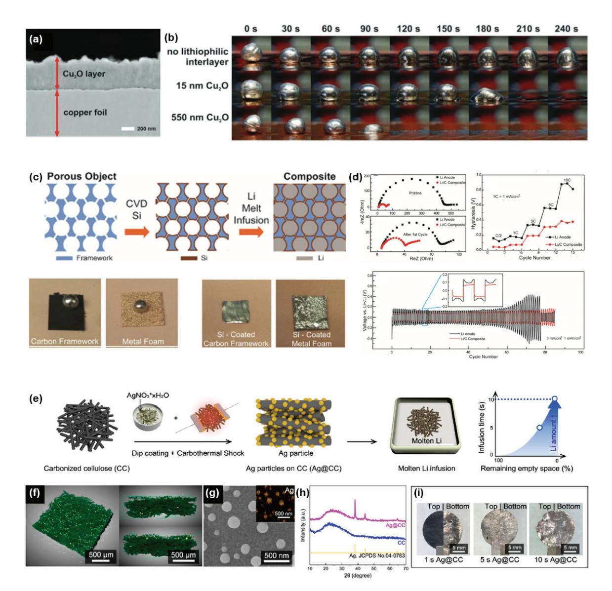

Fig. 5. Design and characterization of lithiophilic interfacial layers and structured hosts for molten lithium infusion. (a) Cross-sectional SEM image of a Cu2O lithiophilic layer deposited on copper foil. (b) Photographic observation of wettability variations of molten lithium with different Cu2O layer thicknesses. Adapted from Schömherr et al. Chem. Eng. J. Adv. 2022;9:100218, licensed under CC BY-NC-ND 4.0.[67] (c) Schematic of molten lithium infusion into a porous framework pre-coated with lithiophilic silicon. Reproduced from Liang et al. Proc. Natl. Acad. Sci. U.S.A 2016;113:2862–2867. Non-commercial educational use only.[68] (d) Electrochemical performance of the silicon-based lithiophilic anode. (e) Schematic illustration of molten lithium infusion into a 3D carbon host decorated with nanoscale Ag particles via Joule-heating. (f) Micro-CT image and (g) SEM/EDX elemental mapping of the developed 3D lithiophilic scaffold. (h) X-ray diffraction patterns of the infused lithium anode. (i) Photographs of the lithium anode as a function of molten lithium infusion time. Panels (e)–(i) are adapted from Baek et al. Nano Lett. 2023;23:8515–8523 with permission from the American Chemical Society.[70]

(LDO)[74] 등)을 구조체 표면에 도입하여 용융 리튬의 확산성을 향상시키고, 계면 반응을 안정화하려는 전략이 보고된다. 예를 들어, Li et al.에서는 Mg-Al 기반의 이중산화물(LDO) 나노시트를 표면에 도입하여, 220℃ 에서 단 3초 이내에 용융 리튬이 구조체 내부로 완전 주입 되는 고속 주입 시스템을 구현하였으며 1000시간 이상의 사이클 수명과 4 mAh cm-2의 고리튬 저장 밀도를 달성 하였다. [74] 이와 같은 용융 리튬 주입법은 간단한 장비 구성으로도 구현이 가능하며, 높은 리튬 함량 확보, 계면 접촉 특성 향상, 덴드라이트 억제 및 데드 리튬 형성 감소 등에서 유리한 이점을 제공한다. 그러나 고온 공정이라는 점에서 산화 및 안전성 문제, 구조체 내부의 리튬 분포 불균일성, 표면 개질의 정밀 제어 및 재현성 확보 등의 기술적 과제가 여전히 존재한다. 이에 따라 향후에는 저 온 리튬 주입 기술, 리튬의 모세관 주입 메커니즘에 기반 한 공정 최적화, 구조체 설계 (기공 크기, 표면 에너지, 경로 제어 등)를 병행하는 융합적 접근이 요구된다. 따라 서 용융 리튬 기반 공정은 습식 코팅 공정의 장점을 활용 할 수 있는 장점을 갖지만 리튬의 낮은 기판 젖음성, 박막 두께 제어의 어려움. 높은 반응성에 따른 취급상의 위험 성 등 여러 기술적 장애물을 해결해야만 상용화 가능성이 높아질 것이다. 특히, 리튬과의 계면 상호작용을 제어할 수 있는 리튬 친화 계면 구조의 설계 및 얇은 리튬 박막을 안정적으로 코팅할 수 있는 기술 개발이 핵심 과제로 부각 되고 있다.

## 2.4 저온 기반리튬 음극 제조용 전기화학 증착법

전기화학적 증착(Electrochemical deposition)은 리 튬 이온을 전극에서 환원시켜 금속 리튬으로 석출시키는 공정으로, 리튬 금속 음극의 제조 및 고순도 리튬의 정련 등 다양한 분야에서 핵심적으로 활용되는 기술이다. 이 과정은 외부 전류 또는 전압을 인가하여 전해질 내의 리튬 이온이 작동전극(working electrode)으로 이동하고. 그 표면에서 전자를 받아 금속으로 환원되며, 석출된 리튬이 결정 성장 과정을 거쳐 금속막을 형성한다. 해당 기술은 크게 고온 용융염 기반 electrowinning 방식과 저온 유 기 전해질 기반 전기 분해 방식으로 나뉜다. 두 방식 모두

416 | 세라미스트

C E R A M I S T

전기화학적으로는 동일한 기본 반응 메커니즘을 따르나. 그 활용 목적과 적용 스케일에 따라 크게 두 가지 방향으 로 구분된다. 첫 번째는 리튬 자원을 원료로부터 금속 리튬 형태로 정제하거나 재활용하는 고온 기반의 전기화 학적 증착 기술로, 주로 LiCl 또는 폐배터리 유래 LigCO2 등의 무기 염을 용융염 시스템에서 환원시켜 대량의 고순 도 리튬을 확보하는데 목적을 둔다. 두번째는 유기 전해 질 시스템을 기반으로 상온 또는 중온 환경에서 리튬을 금속 기판에 정밀하게 증착하여 차세대 고성능 리튬 금속 음극을 제조하는 저온 기반의 전기화학적 증착 기술이다. 이는 박막 형성, 계면 제어, 기판 설계와 같은 소재 및 전극 수준의 미세 제어가 핵심이며, 무음극 리튬 금속 배터리와 같은 응용 기술에 직결되는 핵심 제조 전략으로 주목받고 있다. 본 절에서는 고온 용융염 기반의 전기화학 적 공정보다 차세대 고성능 리튬 금속 음극을 제조하는 저온 기반의 전기화학적 증착 기술에 집중한다. 저온 기 반 전기화학적 증착 기술은 차세대 리튬 금속 음극을 제조 하기 위한 고정밀 박막 형성 및 계면 제어 기술로 각광받 고 있으며, 특히 고에너지 밀도, 안정적인 사이클 수명을 목표로 한다. 이 기술은 상온 또는 중온 (25~60℃)의 환경에서 유기 용매 기반 전해질 (LiFSI/DME, LiTFSI/ DOL 등)을 이용하여 박막 리튬을 기판 (Cu, Ni 등)에 정밀하게 증착하는 기술로 특히, 증착 위치, 두께, 표면 조성 등을 전기화학적 인가 조건 및 기판 설계를 통해 정밀하게 조절할 수 있으며, 다양한 구조체 및 전해질 시스템과의 호환성이 높다는 장점을 가진다. 그럼에도 불구하고 전해질의 분해 반응, 불안정한 SEI 형성, 비균 일한 리튬 핵 생성 및 덴드라이트 성장과 같은 심각한 문제를 안고 있다. 이를 해결하기 위한 접근으로는 전해 질 시스템 자체의 안전성 확보와 음극 기판 (집전체) 표면 의 구조 화학적 개질이라는 두 축으로 나뉘어 진행되 고 있다. 첫번째는 전해질 시스템 자체의 물리화학적 특성을 제어함으로써 전기화학적 부반응을 억제하고. 리튬 이온의 환원 환경을 안정화하려는 접근이다. 대표적으로 고농도 전해질 또는 localized high-concentration electrolyte 시스템이 이에 해당하며, 이들은 용매화된 리튬 이온 주변에 anion-rich solvation shell을 형성하여

# **International**

리튬 금속 음극 제조 기술의 최근 연구동향과 발전 🏽

전해질 자체의 환원 안정성을 높이고, LiF 중심의 조밀 한 SEI를 자발적으로 형성함으로써 증착의 균일성과 계 면 안정성을 향상시킨다. [75-77] 예시로 ether계를 희석 제로 사용한 유사 시스템을 통해 고전류 조건에서도 안정 적인 리튬 증착이 가능한 초구형 형태의 리튬 증착 구조 를 구현하였다. [78] 또한, LiTFSO(Lithium bis (trifluoromethanesulfonyl)imide) 및 DOL(Dioxolane)/ DME(Dimethylether) 고농도 시스템은 FEC(Fluoroethylene Carbonate) 가 첨가될 경우 anion-derived SEI 형성을 가속화하고. 초기 nucleation barrier를 줄여 덴드라이 트 형성을 억제할 수 있음을 규명하였다. [79] 두번째로, 기판 설계 측면에서는 3차원 다공성 구조와 친리튬성 계 면 설계를 통한 전기장 완화와 리튬 증착의 균일한 핵 생성 유도가 핵심 전략으로 자리 잡고 있다. 기판의 친리튬 성 개선을 위한 초기 사례로, Guo et al.은 freestanding 형태의 단결정 구리 나노와이어 네트워크를 개발하여 리 튬 금속 전착의 안정성을 크게 향상시켰다. [43] 이 구조 는 submicron 골격 구조를 통해 리튬 이온 플럭스를 구 조 내부로 유도하며 균일한 핵 생성을 가능케 하였고. 고비표면적 및 전기장 균일성을 바탕으로 덴드라이트 형 성 없이 대칭 셀에서 1200시간 이상의 장기 사이클 성능 을 실현하였다. 또한 리튬의 3차원 침투--증착--방출 과정 을 유도하여 계면 스트레스 및 부피 팽창 문제를 효과적으 로 억제하였다. 비슷한 방법으로 Yang 연구팀에서는 3 차원 구조의 구리 폼에 친리튬성 Zn를 증착시키고, Li을 층착함으로써 3차원 구조의 리튬음극을 성공적으로 개발 하였다.[33] 이후, Lu et al.에서는 다양한 다공성 구리 집전체 구조를 정량적으로 설계 및 비교 분석하며(Fig.  $6(a)$ ) 집전체의 표면적, tortuosity (비틀림도), 표면화 학성 등의 세가지 핵심 파라미터가 증착 성능에 미치는 영향을 평가하였다. [80] 이를 통해 porosity와 구조 길이 의 최적화 결과 최대 CE 99.56%를 달성하였으며, 추가 로 passivation층으로 Zn를 표면에 코팅하여 핵 생성 과전압을 낮추는 효과도 확인했다. 또한 최근에는 전기화 학적 증착 공정을 활용하여 고정밀 SEI 코팅을 선형 성장 시켜 장기 사이클 안정성을 확보하거나 무음극(anode free)시스템에서 초기 리튬 층을 형성하는 응용 사례도

등장하고 있다. Ingber et al.에서 Open-porous Cu micro foam 구조를 cryo-FIB-SEM 분석을 통해 실시 간 추적하여, 기공 내부와 표면에서의 리튬 저장 메커니 즘 차이를 규명하였다. 해당 구조는 평면 기판 대비 과전 압을 약 40% 줄였으며. 이를 무음극 파우치 셀 시스템 성공적으로 적용함으로써 상용화 적용 가능성을 높였 다. [81] 무음극 시스템에 대해서는 2.6절에서 따로 자세 하게 다루고자 한다. 더불어 Lee 연구팀은 보다 실용적인 접근으로, 3D 프린팅 기반의 dual-gradient 구조 Ag-carbon 기반 집전체를 3D 프린팅으로 제작하였으 며, 전기장 및 농도 구배를 활용하여 리튬을 친리튬성 물질인 Ag가 위치한 집전체 하부로 유도함으로써 고전류  $(10 \text{ mA cm}^{-2})$ , 고용량 (> 10 mAh cm-2)에서도 덴드라 이트 억제 및 장기 안정성을 확보하였다. [82] 특히 이 구조체는 R2R 기반 연속 가공이 가능하며. 실제 수 cm2 급 대면적 시편을 활용해 파우치 셀에서의 실용성도 입증 함으로써 리튬 금속 음극의 대량 제조 및 실제 셀 적용 가능성을 함께 제시하였다. 직접적인 리튬 금속 제조를 다루는 연구가 아니더라도. 전고체전지와 같은 실제 전지 구동 환경에서의 리튬 전착층 형성에 관한 연구는 전기화 학적 리튬 금속 제조에 대한 새로운 통찰을 제공할 수 있다. 예를 들어, Becker 등은 전기화학적 증착 과정에서 전류 밀도 및 전착층 두께에 따른 리튬의 미세구조 변화를 실험과 Monte Carlo Potts 모델을 통해 분석하였으며, 그 결과 리튬 전착층의 평균 입자 크기가 전착층의 두께와 밀접하게 연관되어 있음을 확인하였다(Fig. 6(b-d)).[83] 이와 같이, 전기화학적 증착 기술은 단순히 실험실 수준의 구조 설계를 넘어서, 고면적/고속 제조 공정과의 융합을 통해 상용화를 고려한 방향으로 점점 발전하고 있다. 이러한 일련의 연구들은 고온 및 저온 기반 전기화학적 증착 기술 모두를 포함하며, 각각 고유 한 목적과 장점을 바탕으로 병행 발전하고 있다. 고온 용융염 기반의 전기화학적 증착은 산업용 리튬 정련 및 대량 생산을 위한 주요 기술로서, 공정 단순성, 고순도 회수율, 장비 확장성 측면에서 강점을 가진다. 최근에는 폐배터리 기반 LiCl 재활용, 세라믹 분리막 도입, 부산물 가스 정화 시스템 설계 등 고온 공정의 환경 에너지 효율

향상을 위한 공정 엔지니어링이 활발히 진행되고 있으며, 이를 통해 리튬 자원 순환 기술로의 확대 가능성 또한 제시되고 있다. 반면, 저온 전기화학적 증착 기반 연구들 은 고비표면적 3D 구조체와 리튬 친화성 계면 설계를 결합 하여 증착의 공간 분포와 핵 생성 특성을 정밀 제어하고자 한다는 공통점을 갖는다. 특히 cryo-FIB, in situ TEM, XPS 등 첨단 분석 기술과 병행한 정량적 계면 평가 및

설계 전략은, 향후 고밀도 리튬 금속 음극의 실질적인 셀 적용을 위한 핵심 기술 기반으로 작용할 것으로 기대된 다. 즉. 저온 기반 기술은 고성능 음극 제조를 위한 정밀 제어 및 셀 적용성 향상에 중점을 두는 반면, 고온 기반 기술은 대량 생산과 자원 순환을 중심으로 확장되고 있으 며, 두 기술은 상호보완적 발전 양상을 보이고 있다.

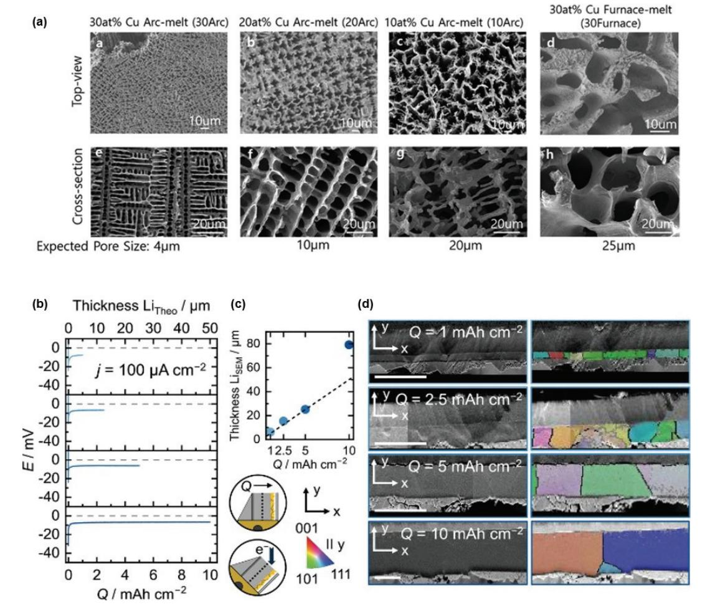

Fig. 6. (a) SEM images showing lithium deposition behavior influenced by various 3D porous current collectors. Adapted from Lu et al. ACS Appl. Energy Mater. 2021;4:6454-6465, with permission from the American Chemical Society.[80] (b) Lithium electrodeposition behavior and microstructure as a function of deposited capacity. Voltage profiles at 100 µA  $cm^{-2}$  for capacities of 1, 2.5, 5, and 10 mAh  $cm^{-2}$ . (c) SEM-determined layer thickness with theoretical values shown as dashed lines; schematic of electron backscatter diffraction setup. (d) SEM cross-sections of steel|Li6PS5CI interfaces after deposition and SEM-inverse pole figure overlays aligned along the y-direction, highlighting grain boundaries (>10°, black) and low-angle misorientations (2-10°, grey). Scale bars: 50 µm. Adapted from Becker et al. Adv. Energy Mater. 2025;15:2404975, licensed by CC BY-NC-ND 4.0.[83]

#### 리튬 금속 음극 제조 기술의 최근 연구동향과 발전 🏽

#### 2.5 복합체 전극 및 기타 제조 방법

앞 절에서 제시한 제조 방법들은 주로 호스트(host) 없는 리튬 금속 음극 구조를 기반으로 하며, 이 경우 심각한 부피 변화, 덴드라이트 성장, 전해질과의 격렬 한 부반응 등의 문제가 수반될 수 있는 위험이 있다. 이러한 한계를 극복하기 위해 금속/합금, 탄소 재료, 무기물(산화물·질화물·불화물 등), 고분자 등을 리 튬과 복합화한 다양한 전략이 보고되어 왔다. 앞 절이 주로 제조 공정 자체에 초점을 두었다면, 본 절에서는 복합체 소재 유형별 리튬 금속 음극 제조 기술을 원리와 구조 설계, 장단점, 적용 전지 유형 측면에서 분류・고 찰하다.

#### 2.5.1 금속/합금 기반 복합체

리튬과 합금을 형성할 수 있는 금속 또는 합금 입지를 첨가 • 도핑하여 Li-M 복합 음극을 제조하는 전략이다. 첨가 금속은 리튬과 반응하여 lithiophilic intermetallic phase를 형성함으로써 용융 리튬의 표면 장력을 감소시 키고, 수십  $\mu$  m 두께의 초박형 리튬 복합 전극 제조를 가능하게 한다. 또한, 리튬 내부에 3차원 자체 지지  $(self$ -supporting) 합금 네트워크를 형성하여 리튬을 기 계적으로 지지하고 공간적으로 분리함으로써 덴드라이 트 성장을 억제한다. [84] 예를 들어. Li-Ca 복합 금속의 냉각 과정에서 리튬과 칼슘이 분리되며 CaLi2 합금 골격 이 규칙적인 격자 구조를 형성하고. 과잉 리튬은 그 기공 내에 균일하게 분포한다. 이 구조는 전류 분포 균질화와 부피 변화 완충에 효과적이며. Li/Ca 원자비 10으로 합 성한 음극은 대칭 셀 실험에서 고전류 조건에서도 안정적 인 성능을 보였다.[85]

Yu-Guo Guo 연구팀은 In, Pb, Ga, Mg, Ca, Sc, Y, Ba, Cd, Pd 등 다양한 금속 원소를 10-50 wt% 비율로 첨가한 Li-M 복합 금속을 합성하고, 용융 리튬의 젖음성 변화를 체계적으로 분석하였다(Fig. 7). 본 연구에서는. 리튬에 유기 화합물을 코팅하거나 특정 금속을 첨가하면 표면에너지가 감소하고 젖음성이 향상되어, 원래 리튬이 젖지 않던 스테인리스강 표면에도 균일하게 코팅이 가능 함을 확인하였다. 젖음성의 변화는 깁스 형성에너지 (Gibss formation energy)와 새롭게 형성된 화합물의 결합 에너지가 젖음성을 결정하는 중요한 인자로 밝혀졌 다. 이로써 제조된 초박형 리튬 전극은  $LiFePO_4$  (LFP) 양극과 조합된 full cell에서 에너지 밀도와 수명 향상을 동시에 달성하였다. [86]

이와 같이. 금속/합금 복합체는 리튬의 젖음성 향상에 크게 기여하지만. 금속 부형물이 리튬보다 비중이 크기 때문에 과도하게 첨가할 경우 전체 에너지 밀도가 저하된 다. 예를 들어, Li-AlF3와 같이 부피 안정성이 뛰어난 복합체의 경우에도. 용량에 기여하지 않는 불활성 첨가물 함량이 높으면 실제 용량이 1.571 mAh g-1 (이론치의 40% 수준) 정도로 감소하게 된다. [87] 또한, 합금 형성 시 부피 변화, 상 분리에 따른 계면 저항 증가, SEI 불안정 화 등도 전극 설계 시 고려해야 한다.

#### 2.5.2 탄소 재료 기반 복합체

3차원 다공성 탄소 구조를 리튬 금속의 호스트(host) 로 활용하여, 리튬을 내부에 함침하거나 표면에 도금함으 로써 호스트가 없는 구조(hostless)의 한계를 보완하는 접근이 활발히 연구되고 있다. 대표적인 소재로는 탄소나 노섬유지(carbon nanofiber), 탄소나노튜브(carbon nanotube), 그래핀 폼(graphene foam) 등이 있으며, 이들은 매우 큰 비표면적을 가져 국부 전류밀도를 효과적 으로 낮추고. 부피 변화에 대응할 수 있는 공간을 제공하 여 덴드라이트 성장으로 인한 부작용을 완화한다.[68]

그러나 탄소 표면은 리튬 친화성(lithiophilicity)이 낮 아 용융 리튬이 쉽게 젖지 않는다는 단점이 있다. 이러한 소수성(lithiophobic) 특성은 액상 리튬과 탄소 표면 간 결합 상호작용의 부재에서 기인하며.[88] 이를 개선하기 위해 Si, Ag, SnO2 등의 친리튬(lithiophilic) 물질을 탄 소 기재 표면에 증착하여 Li-X 합금을 형성하는 표면 개 질이 적극적으로 활용되고 있다. [84,89] 친리튬 처리를 거친 탄소 매트릭스에 180°C 이상의 용융 리튬을 몰드-인퓨전(melt-infusion) 방식으로 주입하면, 모세관력 에 의해 리튬이 기공 내부로 빠르게 침투 · 봉입되어 Li/C 복합 전극이 형성된다.[68] 한편, 3차원 다공성 흑연 구 조체를 부분적으로 lithiation하여 친리튬 계면을 형성하는

방법도 보고된 바 있다. Chen et al.은 melamine (C3H6N6)을 탄화시켜 얻은 99% 공국율을 갖는 부분흑연 질 탄소폼(Partly graphitic carbon foam, PGCF)에 균일하게 리튬을 도포시킨 구조체를 만들었으며 (PGCF-Li/Li), 이를 이용해 10 mA cm $-1$ 에서도 안정 적인 충방전 특성을 보여주었다. 이로인해. LTO (Lithium Titanate)를 상대전극으로 한 수명 평가에서도 700 cycle동안 91%라는 높은 용량유지율을 보였고, 1C 가속 충방전 후 0.2C 감속하였을 때 초기용량의 98%를 유지하였다(Fig. 8).[90]

탄소 기반 복합체는 높은 전기전도도와 낮은 밀도를 동시에 지녀 무게 증가를 최소화하면서 고율 충 · 방전에 유리하다. 또한, 다공성 탄소 골격은 리튬을 기계적으로 지지 • 격리하여 균일한 리튬 증착을 유도하고 부피 팽창 을 흡수함으로써 SEI 파괴와 덴드라이트 형성을 억제한 다. 표면 작용기 도입과 질소(N), 황(S) 등 이종원소 도핑 은 리튬 친화성을 더욱 향상시킬 수 있으며, 특히 탄소나 노섬유의 유연성(flexibility)은 전극의 기계적 내구성을 높여 장수명 용량 유지에 기여한다. 예를 들어. Liwei Chen 연구팀은 CNT 입자에 리튬을 함침시켜 전극을 제 조한 결과, 300회 사이클 후에도 90.1%의 쿨롱 효율을 기록하였다. [91] 정전류 충・방전 실험에서 리튬 포일 기반 셀은 Li-CNT 기반 셀에 비해 초기 과전압이 크게 형성되었으나, 덴드라이트 성장으로 유효 표면적이 증가 하면서 과전압이 빠르게 감소하였다. 반면, Li-CNT 전극 은 사이클이 진행됨에 따라 SEI 성장으로 인해 과전압이

 $\mathbf{C}$  $\mathbf{E}$  $\mathbf{R}$   $\mathbf{M}$ 

 $\mathbf{A}$ 

 $\mathbf{I} = \mathbf{S}$ 

 $\scriptstyle\top$ 

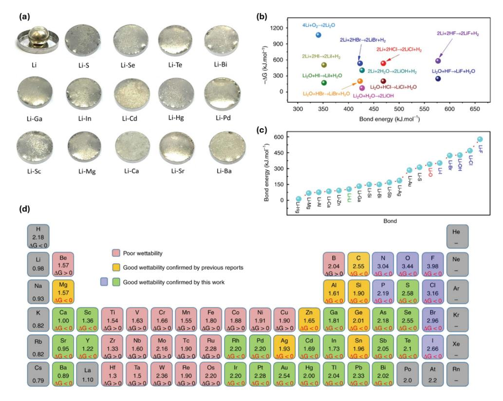

Fig. 7. (a) Variation of surface tension (contact angle) of molten Li on Cu substrates in the presence of different metals, (b) Gibbs formation energy of several reaction candidates and (c) bond energies of the resulting compounds that contain the newly formed bond. (d) Electronegativities of elements and Gibbs formation energy for their reactions with molten Li. Elements highlighted in green and blue can react with molten Li at 180-300° C to form new chemical bonds, thereby enhancing wettability. Panels (a)-(e) are adapted from Wang et al., Nat. Commun. 2019;10:4930, under the terms of the CC BY 4.0 international license.[86]

#### 리튬 금속 음극 제조 기술의 최근 연구동향과 발전

점진적으로 증가하는 경향을 보였다.

Yi Cui 연구팀은 Si 코팅 탄소나노섬유 매트릭스에 용융 리튬을 주입하여 3 mA cm $-2$ 의 높은 전류밀도 조건에서 80회 사이클 동안 2,000 mAh  $g^{-1}$  이상의 안정적인 용량을 유지하였다. [68] Qiang Zhang 연구 팀은 Ag 코팅 탄소섬유지(carbon fiber, CF)를 친리튬 표면으로 활용하여 용융 리튬을 주입한 Coralloid

CF/Ag-Li 복합 음극을 제작하고, 이를 Li-S 전지에 적용하여 초기 방전 용량 785 mAh g-1, 400회 후 64.3%의 용량 유지율을 달성하였다. 또한, LFP 양극 과의 조합에서는 500회 이상 사이클 동안 리튬 포일 대비 우수한 용량 유지(20 mAh  $g^{-1} \rightarrow 86$  mAh  $g^{-1}$ ) 를 보였다. [92]

탄소 재료 기반 복합체는 다양한 접근법을 통해 성능 향상

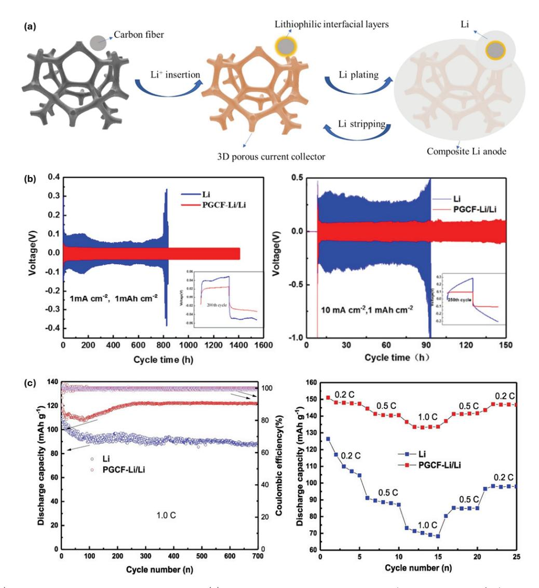

Fig. 8. (a) Schematic of PGCF-Li fabrication, and (b) galvanostatic cycling profiles of Li | Li and PGCF-Li/Li | PGCF-Li/Li cells at current densities of 1 and 10 mA  $\text{cm}^{-2}$ . (c) Discharge capacity, Coulombic efficiency at 1.0 C, and rate performance of PGCF-Li/Li | LTO and Li | LTO cells, Adapted from Chen et al., Electrochem, Comm, 2019;107:106535, licensed under CC BY-NC-ND 4.0.[90]

사례가 다수 보고되고 있으나, 탄소 표면의 소수성으로 인해 별도의 코팅이나 표면 개질 없이는 용융 리튬이 균일 하게 침투하지 못하므로 전처리가 필수적이다. 이러한 전처리 요구는 제조 공정의 복잡성을 증가시키며, 또한 탄소 함량이 과도할 경우 비활성 질량이 증가하여 에너지 밀도 저하를 초래할 수 있다

### 2.5.3 무기물 기반 복합체

리튬과 반응하거나 반응하지 않은 상태로 공존하는 무 기물 분말(세라믹 등)을 리튬과 복합화하여 이상 구조 (two phase)를 형성하는 합성 전략이 보고되고 있다. 대표적인 설계 방식으로는, 리튬과 반응하는 산화물·할 로겐화물 · 질화물 첨가제를 혼합하여 복합 반응을 유도 하는 방법이 있다. 예를 들어. 리튬과 SiO2를 혼합하면  $Li_xSi$  합금 +  $Li_2O$ 의 이상 구조가, AlF3를 혼합하면 LixAl 합금 + LiF의 구조가 형성되는 식이다. 이때 생성 되는 Li2O와 LiF는 전기적으로는 절연체이지만 화학적 으로 안정한 2차상(secondary phase)으로서, 리튬 내부 또는 표면에 분산되어 전자 전도는 차단하고 결정립계에 서 리튬 이온의 균일한 확산 경로를 제공한다. [93]

LiF 복합 음극의 경우, LiF가 표면층에 풍부하게 존재 하여 전해질 분해를 억제하고 안정적인 사이클 성능을 유지하는 데 기여한다. 예를 들어, Polyvinylidene fluoride (PVDF)-dimethylformamide용액을 이용해 in-situ로 리튬 포일 표면에 LiF 코팅층을 형성한 결과.  $\text{LiCoO}_{2}(\text{LCO})$  양극과 조합된 full cell에서 200회 사이클 후에도 85.7%의 용량을 유지하여, 무코팅 리튬 대비 현 저한 성능 향상을 나타냈다. [94] 또한 Hansen Wang 등은 메조다공성 AlF3 입자와 같은 금속 불화물을 용융 리튬과 교반하여 Li-Al 합금(Al4Li9)과 LiF 보호층을 형 성하였다. 이때 LiF는 Al4Li9 나노입자를 전기화학적으 로 안정화하고 균일한 리튬 도금을 유도하여, 20 mA cm-2라는 초고율 조건에서도 약 0.4 V 수준의 낮은 과전 압을 유지하는데 기여하였다(Fig. 9(a)).[87]

이와 같은 2차상은 높은 기계적 강도를 지녀 덴드라이 트 성장을 억제하고, 리튬의 부피 팽창을 흡수하여 구조 붕괴를 방지하는 역할을 한다. 특히 Li3N과 같은 질화물 은 높은 이온전도도( $\sigma_{ion} \approx 10^{-3} \text{ S cm}^{-1}$ )와 매우 낮은 전자전도도( $\sigma$ e ≪ 10-12 S cm-1)를 동시에 가져, 자체 고체전해질과 유사한 기능을 수행한다. [95] 이에 따라 리튬 증착 시 전자 흐름은 차단하고 이온만을 통과시켜 덴드라이트 성장 경로를 효과적으로 봉쇄한다. 산화물이 나 불화물과 달리 다수의 질화물은 고온에서 안정하기 때문에 합성 반응이 느리며. 이로 인해 혼합 과정에서 질화물이 용융 리튬 표면에 부유하여 자연스럽게 표면 보호막 역할을 수행할 수 있다.

무기물 기반 복합체는 리튬 음극의 치밀도(density)를 향상시키며, 특히 전고체전지에서는 무기물 첨가를 통해 리튬과 고체전해질 계면의 미세 간극을 메우는 효과를 기대할 수 있다. [84] 그러나 반응성 첨가제를 사용할 경우 일부 리튬이 비가역적으로 소모되어 초기 가용 용량이 감소하는 한계가 있다(Li2O, LiF 등). 또한 무기물 입자의 균일 분산이 어렵고, 미세 입자가 응집하면 국부 전류 집중으로 오히려 덴드라이트 성장을 촉진할 위험이 있다. 더불어 생성된 2차상에 미세 균열이 형성될 경우 리튬 이온의 확산 경로가 방해 받을 수 있으며, 합성 시 고온 처리가 필요한 경우 공정 복잡성이 증가하는 점도 고려해야 한다.

#### 2.5.4 고분자 기반 복합체

유연한 고분자 매트릭스를 활용하여 리튬 금속을 물리 적으로 지지 · 분산시키는 전략은 기계적 안정성과 계면 특성을 동시에 개선할 수 있는 접근이다. 일반적으로 절 연성 또는 약한 이온전도도를 가지는 고분자 필름을 mesoscale 골격으로 삼아 리튬 포일과 결합한 뒤, 기계 적 압연이나 적층 공정을 거쳐 리튬-고분자 복합체를 제 조하다

예를 들어, Yi Cui 연구진은 얇은 polyethylene (PE) 필름을 리튬 금속과 함께 roll pressing하여 원통 형태로 말아붙인 후 절단해 디스크 형태의 Li-PE 복합 음극을 제작하였다. 이 구조에서 PE 매트릭스는 전해질을 흡수 하여 젤 상(gel-phase) 이온 전도 경로를 형성하며, 스트 립 형태로 분산된 리튬은 반응 표면적을 증가시켜 전기화 학적 반응성을 향상시켰다(Fig. 9(b)). 이를 통해 5 mA  $\text{cm}^{-2}$ 의 고전류 조건에서도 낮은 과전압과 함께 200회

#### 리튬 금속 음극 제조 기술의 최근 연구동향과 발전 🏽

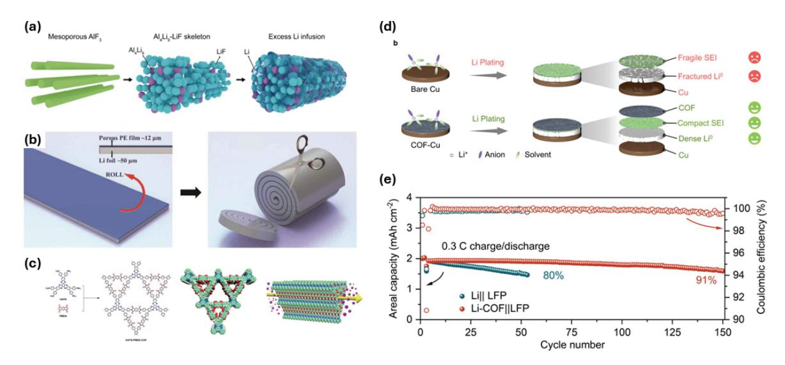

Fig. 9. (a) Schematic representation of the AIF3 mesoporous framework, AI4Li9-LiF skeleton, and Li-infused AI4Li9-LiF composite. Adapted from Wang et al. Sci. Adv. 2017;3:e1701301, licensed under CC BY-NC 4,0.[87] (b) Schematic illustration of the fabrication process and structure of the Li-PE composite prepared via mechanical deformation, Adapted from Liang et al. Sci. Adv. 2019;5:eau5655, licensed under CC BY-NC 4.0.[96] (c) Graphic depiction of the synthesis route for a polyimide-linked hexaazatrinaphthalene (HAHATN)-pyromellitic dianhydride (PMDA) COF, (d) its functional role in guiding uniform Li deposition, and (e) cycling performance of a full cell paired with an LFP cathode. Adapted from Wu et al. Angew Chem Int Ed;2024:e202319355 with permission of Wiley.[100]

이상의 안정적인 사이클 수명을 구현하였다. [96]

또한 Krzysztof Matyjaszewski 연구팀은 리튬 금속. 리튬 염, poly(ethylene glycol) monomethyl ether (mPEG)을 혼합하여 점성이 높은 액상 리튬-고분자 복합 체를 개발하였다. 이 복합체는 고분자 표면의 -OH기와 리튬이 반응하여 리튬 알콕사이드 결합(-O-Li+)을 형성 함으로써 리튬 금속을 미세 입자 형태로 균일하게 분산시 켰다. 그 결과 계면 접촉이 극대화되고 반응성이 안정화 되어. 황화물계 전고체전지에서 약 150 mV의 낮은 과전 압으로 400시간 이상 안정적인 리튬 도금 · 스트리핑을 달성하였다. [97]

그러나 고분자는 일반적으로 전자전도도가 낮아 복합 음극 내 전기 저항 증가를 초래할 수 있으며, 이를 보완하기 위해 카본 블랙 등 도전재를 첨가해야 한다. 이 경우 구조가 복잡해지고 제조 공정이 길어질 수 있다. 또한, 고분자는 순수 무기물에 비해 열 안정성이 낮고, 일부는 장기간 리튬과 접촉 시 분해되어 불순물을 생성하거나 SEI 안정성 을 저하시킬 가능성이 있어 신중한 설계가 요구된다.

#### 2.5.5 프레임워크 소재를 사용한 복합체

금속-유기 프레임워크(Metal-organic framework. MOF)와 공유결합 유기 프레임워크(Covalent organic framework, COF)는 규칙적인 다공성 구조와 다양한 화학적 기능기를 갖춘 재료로, 리튬 금속 음극의 계면 설계에 유망한 후보군이다. [98]

예를 들어. 전도성 MOF의 한 사례로 2D 평면 전도성 MOF인  $Ni_3(HITP)_2$ 를 Cu 집전체 표면에 증착하여 벌집 (honeycomb) 구조의 다공성 코팅층을 형성한 연구가 보고되었다. MOF 코팅층은 층상 다공 구조를 통해 Li+의 수직 확산 경로를 제공하며, 높은 비표면적을 바탕으로 국부 전류밀도를 저감한다. 또한, Ni3(HITP)2의 유기 리 간드에 존재하는 pyridinic/pyrrolic-N 작용기가 리튬 친화적 Li-N 결합 형성을 촉진하여, 리튬이 MOF 표면에 서 균일하게 핵을 형성하고 성장하도록 유도하였다. [99] COF 기반 접근에서는 리튬이온과 친화적으로 결합할 수 있는 극성 작용기와 정렬된 1D 나노채널을 활용하여 인공 SEI로 기능하는 코팅층을 형성한다. Ning Huang

## **Incommunication**

### ▌주현상, 윤정식

연구팀은 polyimide (PI) 기반 COF를 Li 음극 표면에 코팅해 균일한 1D 채널을 통한 Li+ 수송 경로를 제공하였 다. 이를 통해 리튬이온 탈용매화(desorvation) 이후 확 산 · 석출 경로를 제어하여 덴드라이트 성장을 억제하였 고, LiFePO4(LFP) 양극과의 full cell에서 5 C의 고율 조건에서도 높은 용량을 유지했으며, 150사이클 후 91% 의 용량 유지율을 달성하였다(Fig. 9(c-e)).[100]

MOF와 COF 기반 복합체는 원자 수준의 구조 설계가 가능하여, 기공 크기와 형상, 표면 기능기를 정밀하게 조절함으로써 리튬이온 거동을 제어할 수 있다. 다공성 MOF/COF 코팅층은 전극 표면을 균일한 나노망으로 덮 어 덴드라이트 돌파를 억제하며, 기공을 통한 선택적 이 온 통과와 리튬 금속 돌기 성장을 차단하는 장벽 효과를 제공한다. 또한 MOF의 금속 노드와 COF 내 헤테로원자 자리는 리튬과의 배위 결합 및 친화적 상호작용을 통해 핵 생성 에너지 장벽을 낮추고 균일한 핵 분포 형성을 유도한다.[101]

다만 대부분의 MOF/COF는 유기 성분을 포함하고 있 어 강한 환원성을 가진 리튬 금속과의 직접 접촉 시 유기 리간드 분해나 구조 붕괴가 일어날 수 있다. 이를 방지하 기 위해 사전 리튬화(prelithiation) 또는 보호 코팅이 요구될 수 있으며, 전극 표면에서 충분한 접착력을 확보 하는 것도 중요한 과제이다. 또한 두께 제어, 전극 제조 공정과의 호환성, 대량 생산성 확보 등 상용화를 위한 기술적 허들이 여전히 남아 있다.

## 2.6 무음극 셀 시스템

무음극 리튬 금속 전지(Anode-free lithium-metal batteries, AFLMB)는 초기 조립 시, 음극에 리튬을 포함 하지 않으며, 최초 충전 과정에서 양극에서 방출된 리튬 이온이 집전체에 금속 리튬 형태로 전착되어 in-situ 리 튬 금속 음극이 형성되는 개념의 전지이다. AFLMB는 표면적으로는 기존 리튬 금속 음극과 별개의 주제로 보일 수 있으나, 실제 충·방전 과정이 리튬 금속의 도금 (plating)과 박리(stripping)를 기반으로 진행되며, 장수 명 구현을 위해 덴드라이트 억제와 균일 도금을 유도하는 기술 그리고 리튬 금속 위에 형성되는 SEI에 대한 구체적인 이해가 필수적이라는 점에서, 리튬 금속 음극의 제조 및 표면 가공 기술과 밀접한 기술적 연관성을 갖는다(Fig.  $10(a)$ . [102]

C E R A M I S T

AFLMB의 가장 큰 특징은 음극에 사용되는 리튬의 양을 완전히 제거함으로써 다양한 이점을 확보할 수 있다 는 점이다. 첫째. 셀 단위에서 부피 및 질량 에너지 밀도를 극대화할 수 있으며(각각 1435 Wh  $L^{-1}$ , 500 Wh kg-1 이상)[103,104], 둘째, 슬러리 코팅이나 수분 조절 등 활물질 관련 공정이 불필요해 제조 공정을 단순화할 수 있다. 셋째, 제조 과정에서 리튬 포일 등 금속 형태의 리튬을 직접 취급할 필요가 없어 안전성이 크게 향상된다 (Fig.  $10(b,c)$ ).[105]

이러한 장점으로 인해 무음극 전략은 일부 차세대 전지 분야에서 유망한 음극 기술로 채택되고 있다. 예를 들어. 리튬 황 전지에서는 기존 리튬 포일 대신 구리 집전체를 사용한 무음극 시스템이 적용되어. 기존 대비 에너지 밀 도를 크게 향상(이론적:∼2565 Wh kg-1. 실질적:∼ 1870 Wh kg $^{-1}$ )시키고, 안전성과 용량당 비용을 개선하 여 상용화 가능성을 높이고 있다. [106,107]

최근 가장 주목받는 무음극 시스템의 응용 분야는 전고체 전지이다. 현재 주요 셀 제조사와 자동차 OEM을 중심으로 upscaling 및 양산 준비가 활발히 진행 중이며, 일부 기업 은 향후 5년 이내 초기 상용 셀 생산을 목표로 하고 있다. 예를 들어, QuantumScape(미국)는 Volkswagen 그룹 (독일)의 PowerCo(독일)와 협력하여 무음극 기술을 적 용한 QSE-5 셀을 발표했으며, 301 Wh kg-1 및 844 Wh L-1의 높은 에너지 밀도를 달성하였다. 또한, 기존 음극 활물질의 리튬 이온 확산 제한 문제를 해소하여 4 C 고속 충전을 실현하는 것을 목표로 하고 있다. [108] 삼성SDI(대한민국)는 Ag-C 중간층을 적용해 Li-Ag 합 금 형성을 유도함으로써 리튬의 균일 전착을 구현하고 음극 측 열화를 억제하였다. [109,110] 해당 기술은 5년 이상 파일럿 생산을 거쳐 2027년에는 체적 에너지 밀도 900 Wh  $L^{-1}$ 에 달하는 상용 전고체 전지 양산을 목표로 하고 있다. [111]

생산 관점에서 무음극 전략은 기존 셀 조립 라인에 큰 변화를 요구하지 않으므로 기존 제조 역량을 유지한 채

#### 리튬 금속 음극 제조 기술의 최근 연구동향과 발전 🏽

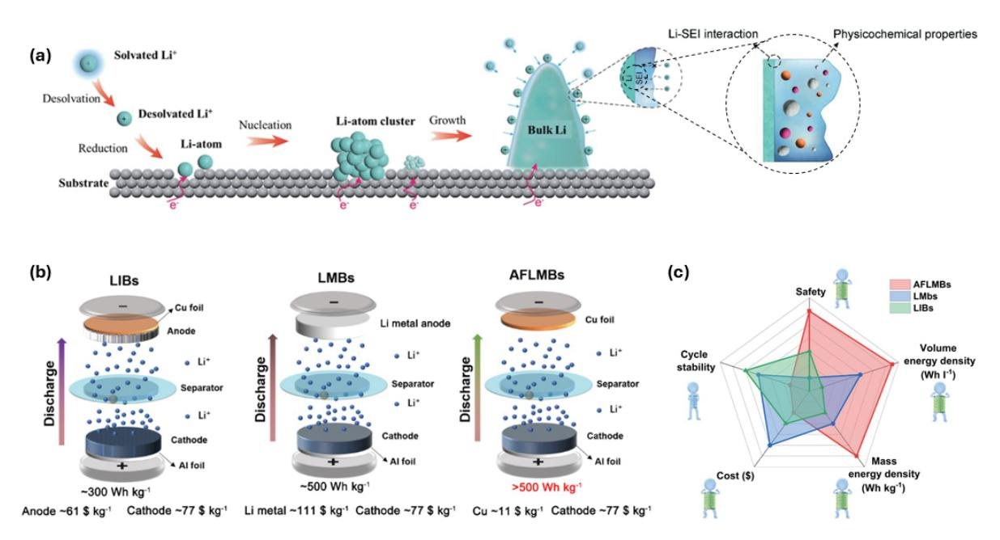

Fig. 10. (a) Schematic illustration of Li nucleation and growth, with detailed depiction of the SEI formed on the Li metal surface. Adapted from Xu et al. Adv. Energy Mater. 2022;12:2200398, under the terms of the CC BY 4.0 license.[102] (b) Schematic cell configurations of LIBs, LMBs, and AFLMBs, and (c) performance comparison among the three systems. Adapted from Li et al. Energy Mater Adv 2025;6:0168, licensed by CC BY 4.0.[105]

차세대 혁신을 도입할 수 있다는 장점이 있다. 그러나 여전히 해결해야 할 도전 과제가 남아 있다. 예를 들어. 고체 전해질과 집전체 간 밀착성 확보를 위해 압력 조절이 필수이며, 다양한 인자를 고려한 덴드라이트 제어 기술 및  $균일한$  리튬 plating/stripping기술이 필요하 다. [103] QuantumScape는 세라믹 분리막을 통해 덴드 라이트 형성을 억제할 수 있다고 발표했으나. 메가셀 규 모에서 장기 안정성과 수명 확보는 여전히 과제로 남아 있다. [112]

또한. 리튬 포일 및 활물질 기반 음극을 사용하는 셀과 달리, 무음극 셀에서는 충·방전 용량에 기여하는 리튬이 오직 양극에서만 공급되므로 추가 리튬 공급이 불가능하 다. 이로 인해 plating/stripping 과정에서 가역적 리튬 손실(loss of lithium inventory)이 빠르게 진행되며, 부피 변화로 인한 SEI 손상, 지속적 부반응, 쿨롱 효율 저하로 이어진다. [104]. 특히, 충전 시, 호스트(host)가 없는 상태에서 구리 집전체 표면에 직접 전착되는 리튬은 lithiophobic 표면 특성과 높은 초기 핵 생성 에너지 장벽 으로 인해. 기존 리튬 금속 표면에 증착되는 경우보다 불균일한 막 형성 및 덴드라이트 촉진 가능성이 높 다. [113, 114]

결과적으로 무음극 전지는 초기 성능은 우수하나 사이 클 진행과 함께 용량이 급격히 감소하는 경향이 있다. 이를 극복하기 위해 다양한 접근법이 제안되고 있으며. 대표적으로 집전체 표면 및 계면 개질. 전해액 조성 최적 화(용매 및 첨가제 변형). [115,116] 고농도 또는 이종염 전해액 도입.[117] lithium-rich 양극활물질 활용 [118.119] 등이 시도되고 있다.

본 절에서는 이러한 다양한 실질적 접근법 중에서도. 특히 음극 집전체와 관련된 연구를 중심으로 네 가지 범주 로 구분하여 고찰한다.

## 2.6.1 기계적 표면 전처리: 전착 유도 나노층/시드 구조 도입

무음극 시스템에서는 리튬이 집전체 표면에 직접 전착 되므로, 집전체가 리튬의 초기 핵 생성 조건 및 이후 성장

방향을 결정하는 데 결정적인 역할을 한다. 특히, 리튬 이온이 음극 표면에서 전자를 받아 최초의 리튬 금속 입자 (embryo)를 형성하기 위해서는 일정 수준 이상의 에너지 장벽을 극복해야 하며, 이를 위해서는 핵 생성 과전위(η) 이상의 전압이 요구된다(Fig.  $11(a)$ ). 초기 embryo가 형성된 이후에는 리튬이 해당 핵 위에 지속적으로 증착되 며 성장하게 되는데. 이때의 성장 과전위( $\eta_m$ )는 일반적으 로 핵 생성 과전위( $\eta_n$ )보다 작기 때문에(절대값 기준), 새로운 embryo가 생성되기보다는 기존 핵 위에 리튬이 중첩되어 성장하는 경향이 강하다. [120] 이 과정에서 초

기 리튬 핵의 돌출 정도에 따라 국부 전기장이 집중되며, 특정 위치에 리튬이 집중 증착되는 현상이 심화될 수 있 다. 따라서 전류밀도 등 셀의 구동 조건이 초기 리튬 수지 상의 형상 및 분포에 미치는 영향을 체계적으로 이해하는 것은 무음극 시스템의 설계에 있어 핵심적인 요소로 간주 된다.

 $\mathbf{C}$ 

 $\mathbf{E} = \mathbf{R}$ 

 $\mathbf{A}$  $\mathbf{M}$   $\mathbf{I} = \mathbf{S}$ 

π

이에 대해 Cui Yi 연구팀은 리튬 핵의 크기가 과전압과 반비례하고, 단위 면적당 핵의 개수는 과전압의 세제곱에 비례함을 밝혀냈으며. 이러한 관계를 바탕으로 균일한 리튬 금속 증착을 유도하는 정전류 순간 전착(pulsed

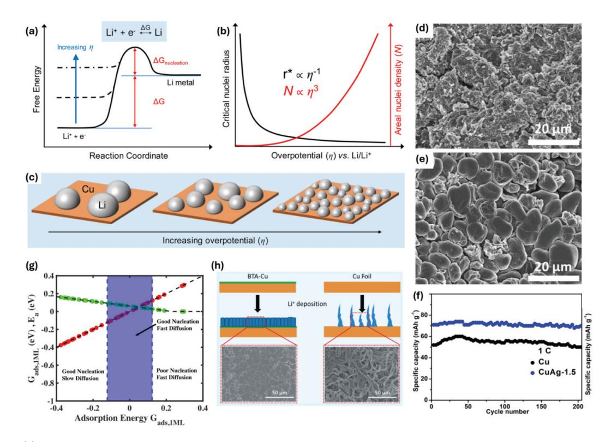

Fig. 11. (a) Schematic free-energy diagram illustrating the effect of increasing overpotential on the nucleation energy barrier. (b) accompanied by plots showing the critical Li nuclei radius and areal nuclei density as a function of overpotential versus Li/Li+, and (c) schematic depictions of Li nuclei size and density at different overpotentials, Adapted from Pei et al. Nano Lett. 2017;17:1132-1139, with permission of American Chemical Society.[121] (d) SEM image of bare Cu foil and (e) Cu-Ag substrate after 150 cycles at 1 mA cm-2. (f) Cycling performance of cells employing Cu and Cu-Ag current collectors paired with an LFP cathode. Adapted from Hou et al. ACS Appl. Mater. Interfaces 2019;11:8148-8154, with permission of American Chemical Society. [126]. (g) Volcano relationship derived from DFT calculation. Adapted from Pande et al. ACS Energy Lett. 2019;4:2952-2959, with permission of American Chemical Society [129]. (h) Schematic illustration and SEM images of Li deposition on benzotriazole(BTA)-coated Cu foil versus bare Cu foil, Adapted from Kang et al. ACS Appl. Mater. Interfaces 2020;12:8168-8175, with permission of American Chemical Society [134].

# **Increase Increase**

#### 리튬 금속 음극 제조 기술의 최근 연구동향과 발전 🏽

constant current nucleation) 기법을 제안하였다(Fig. 11(b,c)).[121] 이러한 기반 연구는 집전체 표면 개질의 방향성을 제시하였으며, 이를 바탕으로 다양한 표면 엔지 니어링 전략이 개발되었다.

표면 개질 기법은 크게 두 가지로 나뉘며, 첫째는 나노 패턴(nanopattern) 또는 시드(seed) 입자를 집전체에 도입하여 리튬의 전착 위치와 분포를 물리적으로 제어하 는 방법이고, 둘째는 표면 코팅층을 통해 리튬의 초기 핵 생성 장벽을 낮추는 화학적 접근이다. [122]

기계적 표면 개질의 대표적인 예로는 CNT forest. graphene layer, nano-patterned metal array, ALD 기반 ultrathin seed layer 등이 있으며, 이들은 전기장 분포를 조절하고 국부 전류밀도를 완화하여 전착의 재현 성을 높이는 데 기여한다. 예를 들어, 리튬 친화적 (lithiophilic) 나노섬유 또는 나노입자를 Cu 기판에 도입 하면, 초기 Li+ 환원 시 이 부위에서 우선적으로 핵 생성이 유도되며. 필요에 따라 Cu 집전체 자체에 미세 패턴을 부여함으로써 전착 거동을 능동적으로 조절할 수 있 다. [123]

Yiping Tang 연구팀은 3D mesh 구조의 구리 집전체 에 lithiophilic한 ZnO 코팅층을 도입하고, 여기에 pulse current를 인가하여 리튬 이온의 이동 및 분산을 제어함 으로써 97.8%의 높은 쿨롱 효율을 달성하였다.[124] 또 한 Sh-Hong Yu 연구팀은 구리 nanowire network 집전체를 사용하여 다공성 나노구조물 사이로 리튬을 증 착시킴으로써 덴드라이트 생성을 억제하였다. 이는 낮은 전압 hysteresis (~0.04 V)와 함께 200사이클 후에도 98.6%의 쿨롱 효율을 유지하는 안정적인 성능으로 이어 졌다. [125] Zewei Quan 연구팀은 무전해 도금 방식으로 구리 집전체 위에 nanostructured Ag 입자를 균일하게 적층하여 리튬의 핵 생성 및 도금 품질을 개선하였다(Fig. 11(d,e)). 이러한 무음극 전극은 LFP 양극과의 조합에서 도 우수한 사이클 특성을 보였다(Fig. 11(f)).[126]

한편, 집전체로는 구리(Cu) 외에 황동(brass, CuZn) 도 사용되었으며. 이는 고유의 lithophilicity로 인해 균 일한 리튬 전착을 유도한다. 특히, 이를 3D 다공성 구조로 패터닝하면 리튬이 기공 내부에 우선적으로 증착되면서 덴드라이트 성장을 안정화할 수 있다. [127] Hao Zhang 연구팀은 황동 집전체에 300°C 열처리를 통해 in-situ ZnO 코팅층을 형성하였으며, 이로 인해 핵 형성 과전압 이 순수 CuZn의 180 mV에서 65 mV로 감소하고, 100 사이클 후에도 97.48%의 높은 쿨롱 효율을 유지할 수 있었다. [128]

이와 같은 미세 패턴 기반의 표면 개질은 리튬 핵 생성 을 나노 수준에서 정밀하게 제어할 수 있다는 장점이 있으 며, 다양한 재료 시스템에 적용 가능하다는 범용성도 가 진다. 그러나 3D 패턴 도입은 내부 저항 및 전기적으로 활성화되는 표면적 증가로 인해 실효 전류밀도 감소 및 전해질 분해 반응을 유도할 수 있다. 이에 따라, 이러한 표면 개질 기술은 2.6.3절에서 다룰 인공 계면층 기술과 병행하여 연구되는 경우가 많다.

아울러. 나노 패터닝 기술은 형성된 구조의 기계적 강 성 확보. 셀 전체의 전기화학적 성능에 대한 부정적 영향 최소화, 제조 공정의 단순화 및 비용 절감 가능성 등 다양 한 측면에서 고려되어야 하며, 이러한 요소들을 충족할 수 있을 때 실현 가능한 표면 개질 전략으로 자리잡을 수 있다.

## 2.6.2 화학적/전기화학적 표면 전처리: 리튬 친화성 (lithiophlic) 표면 개질법

물리적인 구조체나 중간층을 삽입하는 대신. 전착이 이루어질 집전체 표면을 사전에 화학적으로 개질하여 리 튬이 잘 젖고 균일하게 핵이 형성되도록 유도하는 전략도 활발히 연구되고 있다. 대표적으로, Cu 등 집전체 표면에 리튬 친화성(lithiophilic) 금속 또는 산화물(Au, Ag, Zn, Mg, ZnO 등)을 도포하거나, 아민계 기능기(-NH2), 산소 · 질소 도핑 등을 적용하여 계면 에너지를 낮추고 젖음성(wettability)을 향상시키는 방법이 널리 사용된 다. 이러한 표면 개질은 전착 초기 핵 생성 밀도를 높여 리튬이 특정 지점에 집중되지 않고 균일하게 전착되도록 하며, 결과적으로 덴드라이트 성장을 억제하고 쿨롱 효율 을 향상시킨다. 또한, 일부 코팅층은 인공 SEI로서 작동 하여 전착된 리튬 표면에서 전해질 분해를 억제하는 부수 적인 기능도 수행할 수 있다. [104]

이종 금속 기반 개질 전략은 리튬과의 합금 형성 여부 에 따라 크게 두 그룹으로 분류된다. 첫째, Ni, Fe, Cr, Ti, Mo, W, V, Zr, Mn, Cu와 같이 리튬 합금 상을 형성하 지 않는 전이금속 그룹, 둘째, Ga(Li2Ga), Ag(Li3Ag), Cd(Li3Cd), Al(Li9Al4), Sn(Li17Sn4), Si(Li22Si5),  $Pb(Li_{22}Pb_5)$ ,  $B(Li_3B)$ ,  $Zn(Li_2Zn)$  등과 같이 리튬 합금 상을 형성하는 금속 그룹이다. 후자의 경우. 열역학적으 로 낮은 핵 생성 활성화 에너지와 과전압을 보여 리튬 전착에 특히 유리한 것으로 보고되었다. [104.113]

Vikram Pande 등은 DFT (Density functional theory) 계산을 통해 리튬 핵 생성과 표면 확산이 유리한 집전체 소재를 탐색하였으며, 앞선 분류와 유사한 결과를 제시하였다. Cu, Fe, Ti, Ni, Cr, Mo, V, W, Zr, Mn 등 대부분의 전이금속은 리튬과의 결합력이 지나치게 강 하여 핵 생성 과전위가 높고 확산이 제한적이었다. 그러 나 Cu(111), Fe(110), V(110), Ni(111) 면은 상대적으 로 낮은 확산 장벽과 적절한 결합 에너지를 보여 잠재적인 후보로 제시되었다. 한편, Li-Zn, Li-Al, Li-B, Li-Cd, Li-Ag, Li-Si, Li-Pb, Li-Sn, Li-Mg 등의 합금은 핵 생성 과전위가 거의 0에 가깝고 표면 확산 활성화 에너지  $(E_a)$ 가 약 0.05 eV로 매우 낮아 우수한 집전체 소재로 평가되었다. Fig. 11(g)에 나타난 DFT 기반 Volcano relationship에 따르면, 리튬 흡착 에너지( $\Delta G_{ads, 1ML}$ )가 지나치게 낮으면 결합이 너무 강해 표면 확산이 느려지고 덴드라이트 위험이 커지며, 반대로 값이 너무 높으면 핵 생성이 어려워 높은 과전위가 필요하다. [129]

또한, 리튬 금속과 결정 구조 부정합이 큰 금속 기판에 서는 높은 핵 생성 과전위가 나타나는 경향이 있다. 금속 리튬은 체심입방(Body centered cubic lattice, BCC) 구조를 가지므로, 동일한 BCC 구조의 기판 위에서 epitaxial 성장이 더 원활하다. 반면, Cu는 면심입방 (Face-centered cubic) 구조를 가져 리튬 금속의 epitaxial 성장을 방해하므로 이상적인 전착 기판이라고 보기는 어렵다. 종합적으로, 친리튬성 표면을 가지거나 BCC 구조를 갖는 금속은 낮은 핵 생성 과전위를 제공하여 금속 리튬의 적층에 열역학적으로 유리하다. [130]

이를 응용 사례로, 삼성전자 종합기술원 (대한민국)은

Ag-C 복합층을 적용한 무음극 파우치셀을 제작하여  $Li(Ni_{0.90}Mn_{0.05}C_{0.05})O_2$  양극과 결합 시 900 Wh L-1 이상 의 에너지 밀도와 1000사이클 이상 높은 용량 유지율을 기록하였다. [109] 또 다른 사례로, 친리튬성이 높은 산화니 켈(NiO)을 3D 구조로 형성하고. 표면에 Polydopamine (PDA) 코팅을 적용하여 인공 SEI를 형성한 복합 전략이 보고되었다. 이 방법은 150사이클 후에도 92%의 용량 유지율과 99%의 쿨롱효율를 달성하였으며, PDA 층의 하이드록실기가 Li+와 반응해 균일 분포된 리튬 복합 카 보닐 그룹을 생성하여 안정적인 도금 · 박리 반응을 유도 하였다. [131, 132]

C E R A M I S T

금속 외에도 비금속 헤테로원자 또는 이를 포함한 폴리 머의 도입 역시 리튬 친화성 향상과 전착 안정성에 효과적 이다. 예를 들어, O, B, N과 같은 비금속 원자는 루이스 염기로 작용하여 Li+를 끌어당기고 균일한 전착을 촉진한 다. [133] Liwei Chen 연구팀은 방청제로 널리 쓰이는 Benzotriazole (BTA)와 ethyl alcohol 혼합 용액에 구 리 포일을 5분간 침지하여 N 원자의 비공유 전자쌍이 구리의 sp hybrid orbital로 전이되도록 하였다. 이렇게 개질된 BTA-Cu 포일은 N 원자의 리튬 친화성 덕분에 덴드라이트가 없는 균일한 리튬 도금을 가능하게 하였다 (Fig.  $11(h)$ ).[134]

요컨대, 화학적 · 전기화학적 표면 개질은 구현이 비교 적 간단하면서도 무음극 시스템에서 필수적인 초기 리튬 핵 생성을 효과적으로 제어할 수 있는 전략이다. 그러나 적용되는 리튬 친화성 물질의 질량 및 부피로 인한 에너지 밀도 저하를 최소화하는 것이 향후 상용화를 위한 중요한 과제이다.

#### 2.6.3 인공 계면층(SEI layer) 형성

무음극 셀 시스템에서 첫 리튬 도금 시 형성되는 리튬 핵의 배향 및 분포 뿐만 아니라. 사이클 안정성을 좌우하 는 또 다른 핵심 요소는 안정적인 SEI 층의 확보이다. 구리 등의 집전체에 전기화학적으로 도금된 리튬 표면에 자연적으로 형성되는 SEI는 불안정하고 두꺼운 경우가 많으며, 이는 지속적인 전해액 분해와 함께 상당한 양의 가역 리튬 손실을 초래한다. [135]

# **International**

#### 리튬 금속 음극 제조 기술의 최근 연구동향과 발전 🏽

이를 완화하기 위해, 집전체 표면에 얇고 균질한 유사 SEI 인공 계면층(artificial SEI)을 사전에 형성하는 전략 이 활발히 연구되고 있다. 이러한 인공 SEI는 실제 충 · 방전 과정에서 형성되는 SEI의 두께를 제어하고, 불필요 한 리튬 소모를 줄이며. 균일한 도금을 유도하여 덴드라 이트 성장을 억제할 수 있다. 대표적인 재료군으로는 Polyethylene oxdie (PEO), perfluoropolyether, LiF, Li2N, Al2O3 등 무기 $\cdot$  고분자 코팅이 있으며, ALD, 용액 코팅, 전기화학 반응 등을 통해 형성된다. 이러한 계면층은 리튬 도금을 균일하게 유도할 뿐 아니라 전해질 분해를 억제하며, 경우에 따라서는 리튬 이온의 선택적 전도성(selective  $Li^+$  conductivity)까지 제공한다.

특히, 고분자 코팅층은 높은 이온전도도를 기반으로 리튬 이온이 SEI를 통과하여 집전체 계면까지 원활히 도 달하도록 하며, 리튬 석출 시 전해액 추가 소모 없이 균일 한 도금이 가능하도록 돕는다. 예를 들어, Jiangxuan Song 연구팀은 Poly(methyl methacrylate))/PVDF) 하이브리드 폴리머 층을 Cu 집전체 위에 도입하여, 계면 에서 Li-F, Li-O 결합을 형성시켰다. 이러한 결합은 이온 전도도를 높여 안정적인 리튬 도금 · 박리를 가능하게 했 으며, 기계적 강성과 연성을 함께 제공하여 부피 변화 완화 및 덴드라이트 억제에 기여하였다. 결과적으로, 2 C 조건에서 300사이클 후에도 82.3%의 용량 유지율을 기록하였다. [136] Bin-Joe Hwang 연구팀은 나노 사이 즈의 PEO 필름 코팅을 통해 전착된 리튬을 캡슐화 (encapsulation)하여 전해질 접촉을 제한함으로써 약 30 mV의 안정적인 전압 히스테리시스(hysteresis)를 구 현하였다. PEO 필름의 극성 산소 원자는 Li+와의 상호작 용을 통해 균일한 리튬 이온 플럭스를 형성하며, 높은 전기 절연성을 제공해 광범위한 전압 범위에서 안정적인 SEI 역할을 수행했다. 다만, 마이크로 사이즈 PEO 필름 의 경우, 결함 발생 및 필름 두께 증가로 인해 장기 사이클 성능이 저하되는 한계가 있었다. [137]

고분자 외에도 기계적 강성과 유연성을 겸비한 다양한 무기 · 탄소 기반 계면층 연구가 진행되고 있다. 예를 들 어, h-BN (hexagonal boron nitride) 또는 그래핀을 구리 집전체에 코팅하면, 리튬이 이끼(mossy) 형태로 전착되어 2.0 mA cm-2의 높은 전류 밀도에서도 5.0  $mAh \text{ cm}^{-2}$ 의 용량을 안정적으로 유지할 수 있다. 이는 h-BN의 모서리 및 결함부에서 Li+ 확산이 용이해져. 리튬이 h-BN과 구리 계면에 안정적으로 석출되기 때문 이다(Fig. 12(a,b)). [138] Yi Cui 연구팀은 비정질 탄소 hollow nanosphere를 단층(monolayer)으로 Cu 집전 체 위에 형성하여. 리튬이 nanosphere와 구리 사이에 증착 되도록 유도하였다. 이 hollow 구조는 일종의 비계 (scaffold)로 작용하여 안정적인 인공 SEI 역할을 수행하였 다. 반면, 동일한 탄소를 박막 형태로 코팅할 경우. 충·방 전 반복에 따라 균열이 발생하여 약 50사이클 후 급격한 쿨롱효율의 저하가 나타났다. 그러나 hollow nanosphere 구조는 유연성을 바탕으로 구리와의 약한 결합을 보완하 여 150사이클 이상 높은 쿨롱효율을 유지하였다. [139] 또 다른 접근으로, 은(Ag) 코팅 구리 집전체에 리튬을 전 기화학적으로 도급한 뒤, TREAT-HF(triethylamine trihydrofluoride) 용액에 5분간 침지하여 Li와 HF 반응 으로 LiF-rich 인공 SEI를 형성하는 방법이 보고되었다. 이 LiF-rich SEI는 전극 전해질 계면 반응을 안정화시 키고, 균일한 Li+ 분포와 전착을 유도하여 덴드라이트 없는 균일한 리튬 도금층을 제공하였다. [140]

이와 같이, 인공 SEI 형성을 위해 다양한 소재와 접근 법이 활발히 연구 중이다. 그러나, SEI층의 코팅 두께 제어는 여전히 매우 중요한 과제로 남아있다. 과도한 두 께는 계면의 전기화학적 저항을 증가시켜 리튬 이온 수송 을 방해할 수 있으며, 전체 집전체 표면에 걸쳐 균일한 박막 형성 (두께 및 성분)을 구현해야 하는 공정적 과제도 존재한다. 따라서, 효과적인 인공 SEI 전략은 이온전도성 과 기계적 안정성을 균형 있게 확보하면서도, 제조 공정 의 균일성과 재현성을 보장해야 한다.

#### 2.6.4 초기 리튬 보완 구조 설계(Prelithiation)

무음극 셀 시스템의 본질적인 한계 중 하나는 가용 리튬 부족으로 인한 초기 용량 손실이다. 이를 해결하기 위해, 양극 · 음극 집전체 · 분리막 등에 리튬을 사전에 저장(prelithiation)하여 초기 충 · 방전에서 소모되는 가역 리튬을 보상하는 전략이 활발히 연구되고 있다.

이러한 방법은 표면 개질이나 인공 SEI 형성과 달리 실 제 리튬 공급원을 미리 제공함으로써 초기 쿨롱 효율 (ICE)을 높이고, 초기 에너지 밀도를 향상시키는 데 효 과적이다.

2.6.4.1 양극 활물질 기반 Prelithiation

양극 활물질 합성 단계에서 리튬을 초과 도핑 (over-lithiation) 하여, 첫 사이클에서 더 많은  $Li^+$ 가 방출되도록 하는 방법이 널리 활용된다. 대표적으로

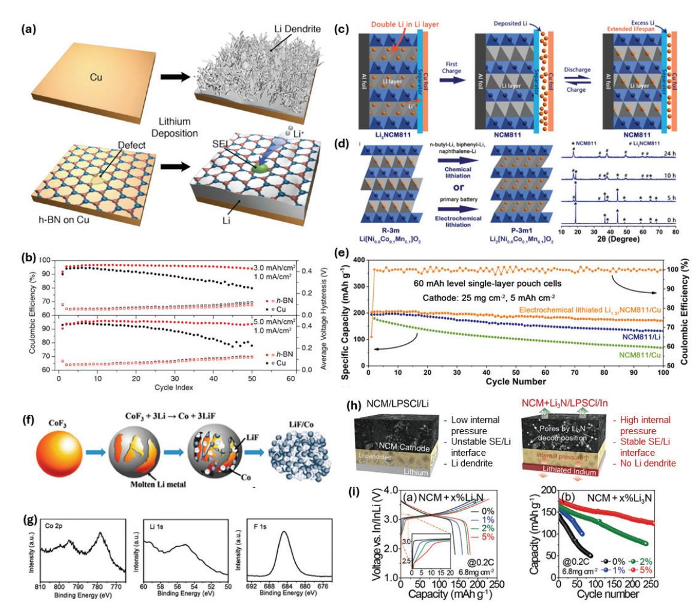

Fig. 12, (a) Schematic illustrations of lithium deposition on bare Cu foil and Cu foil coated with an h-BN film, and (b) coulombic efficiency and voltage hysteresis of Li anodes with and without h-BN coating at areal capacities of 3,0 and 5.0 mAh cm-2. Adapted from Yan et al. Nano Lett. 2014;14:6016-6022, with permission of American Chemical Society [138]. (c) Schematic illustration for the concept of extended cycle life via Li2[Ni0.8Co0.1Mn0.1]O2 (Li2NCM811) for AFLMBs (d) and synthesis routes to Li2NCM811 via chemical or electrochemical lithiation, X-ray diffraction (XRD) patterns of NCM811 after reaction with n-butyllithium (n-BuLi) for varying durations are also displayed. (e) Electrochemical cycling data of NCM811/Cu, NCM811/Li, and Li1,37NCM811/Cu cells. Adapted from Lin et al. Angew. Chem. 2021;16:8289-8296, with permission of Wiley. [141] (f) Schematic illustrating the formation of the LiF/Co nanocomposite and (g) high-resolution XPS spectra for the nanocomposite. Adapted from Sun et al. Nano. Lett. 2016;16:1497-1501, with permission of American Chemical Society. [144] (h) Schematic comparison of a battery cell during charging with Li-metal (left) and In-metal anode paired with Li3N sacrificial cathode (right). (i) First-cycle voltage profiles and cycling performance of NCM+Li3N cells at 0.2 C a function of Li3N content, Adapted from Park et al. Adv. Funct. Mater. 2022;32:2108203, with permission of Wiley.[147]

#### 리튬 금속 음극 제조 기술의 최근 연구동향과 발전 🏽

 $\text{Li}_2(\text{Ni}_{0.8}\text{Mn}_{0.1}\text{Co}_{0.1})\text{O}_2$  (Li2NMC811), [141] Li2Ni0.5  $Mn_{1.5}O_4$  (Li2NMO), [142] Li5FeO4[143] 등이 보고되었 다. 특히, Liangdong Lin 등은  $Li_{1.37}$ NMC811을 이용한 파우치 셀 테스트에서 음극으로 Cu를 사용하고도 LiNMC811|Li 구성의 셀 보다도 높은 초기 용량과 우수 한 용량 유지율을 보여주었다(Fig. 12(c-e)).[141] 이 방식은 합성 시, 도핑 비율만 조절하면 되므로 추가 제조 공정이 불필요하고 균일한 리튬 공급이 가능하다. 그러나 과잉 도핑은 활물질 구조 붕괴 위험이 있으며, 일부 양극 재의 경우, 고전압으로 충전을 해야 초과 리튬이 방출되 어 전해질 산화가 심화되고 SEI 열화가 가속될 수 있다. 또한, 일부 초과 리튬은 비가역적으로 손실되어 장기 수 명 개선 효과가 제한될 수 있다.

이를 보완하기 위해 희생 양극 물질(sacrificial cathode materials)이 사용된다. 일례로, Co/LiF.[144]  $\text{Li}_2\text{C}_2\text{O}_4$ , [145]  $\text{Li}_3\text{P}$ , [146]  $\text{Li}_3\text{N}$ , [147]  $\text{Li}_2\text{O}$ [117] 등이 양극 슬러리에 혼합되어 리튬 공급원으로 활용된다  $(Fig. 12(f.g))$  Huiqiao Li 그룹은 입자 크기, 도전제, 촉매 조성에 따라 Li2C2O4의 리튬 방출 전압이 달라짐을 규명하고, 이를 4.3 V 이하로 조정하는 데 성공하였 다.[148] 또한, Li2S는 높은 단위질량 용량(~1166 mAh g-1)과 저전위 작동(2.3~2.5 V) 특성을 지니나, 낮은 전기전도도와 황계 부산물 형성 위험이 단점이다. [149]  $Li_3$ N은 약 2.4 V(약 3.0 V vs.  $Li/Li^+$ )에서 분해되어 리튬을 공급하며, 5 wt.% 첨가만으로 80사이클 후 37.9%였던 용량 유지율을 200사이클에서 75.8%까지 향상시킨 사례가 보고되었다(Fig. 12(h,i)).[147] 그러 나  $Li_3N$ ,  $Li_2O$  등은 탈리튬 과정에서  $N_2$ ,  $O_2$  가스 발생 가능성이 있으며, 수분 민감성과 열적 불안정성, 낮은 전도도 및 고비용 문제가 상용화의 걸림돌로 남아 있 다. [130]

#### 2.6.4.2 음극 집전체 Prelithiation

셀 조립 시. 매우 얇은 리튬 포일 또는 리튬 함유 합금판 (Li-Al, Li-Si, Li-Mg 등)을 전기적으로 절연된 상태로 삽입하고, 초기 충전에서 절연층 파괴 또는 스위칭 소재 변형을 통해 전기적 연결을 형성한 후, 리튬을 전기화학 적으로 도금시키는 방식이 있다. Zhaoping Liu 그룹은 electroless plating을 통해 구리 포일에 주석(Sn)을 도 포하고, 화학적 prelithiation을 거쳐  $Li_{4.4}$ Sn 층을 형성 하였다. 이 무음극 셀은 lithiophilic한 Sn 합금층 덕분에 낮은 과전압으로 균일하고 치밀한 리튬 도금을 구현하였 으며, NMC811 양극과 결합 시 355 Wh kg-1의 에너지 밀도와 50사이클 후 85.5%의 용량 유지율을 달성하였 다. [150] 또한 Li2CuO2 첨가제를 활용하여 in-situ로 구리 집전체 표면에 리튬 프라이머 층(primer layer)을 형성. 초기 리튬 도금 · 확산 · 스트리핑의 균일성을 향상 시킨 사례도 보고되었다. [151]

음극에 대한 prelithiation 기술은 흑연이나 실리콘 등의 활물질을 포함한 음극에서 이미 오랜 기간 검증이 되어왔던 기술인만큼 다양한 방식들이 개발되어왔다. (a) 반응성이 높은 Li-dissolved reagent를 이용하는 화학 적 방법.[152] (b) 외부 전류를 인가해 리튬을 전착시키는 전기화학적 방법. [153] (c) 리튬 포일이나 파우더를 직접 음극에 접합하여 lithiation을 유도하는 물리적 방법 [154,155] 등이 있다. 최근에는 R2R 기반 대면적 · 연속 공정을 통해 양산 적용 가능성을 검증하는 Proof of Concept(POC) 단계 연구도 활발히 진행되고 있 다. [156, 157]

#### 2.6.4.3 분리막 기반 Prelithiation

비정질 탄소로 코팅된 황화리튬 희생물질(Li2S@C)을 분리막에 슬러리 코팅하는 방법도 제안되었다. Li2SO4, polyvinylpyrrolidone(PVP), acetylene black 혼합물 을 탄소 열환원하여 Li2S@C 복합체를 제조하고, 이를 PE 분리막에 코팅하면, 초기 충전 시 Li2S 산화 반응으로 리튬이 방출되어 Ag-Cu 집전체에 도금된다. 동시에 생 성된 lithium polysulfide는 양극 계면 보호층 역할을 하여 전이금속 용출을 억제하는 효과도 나타내었 다. [158]

종합적으로, prelithiation 전략은 무음극 배터리의 리튬 고갈 문제를 완화하고, 초기 SEI 형성을 안정화하며, 실용 사이클 수명 향상에 기여할 수 있다. 그러나, 리튬 금속 취급 시 안전성 문제, 질량 증가로 인한 에너지 밀도

향상 효과 감소, 공정 복잡성 증가 등의 한계가 존재한다. 그럼에도 불구하고, 무음극 리튬전지는 여전히 초기 효율 및 수명 개선이 필요한 단계이며, 다양한 prelithiation 전략과 표면 개질 · 계면층 기술을 병합 적용하는 연구가 활발히 진행되고 있다.

## 3. 결론

리튬 금속은 이론 용량(3,860 mAh g-1)과 가장 낮은 전기화학적 환원 전위 $(-3.04 \text{ V vs. SHE})$ 를 동시에 갖 춘 이상적인 음극 소재로, 현재 상용 리튬 이온 전지에서 사용되는 흑연 음극(370 mAh g-1)에 비해 약 10배 이상 의 용량 우위를 제공한다. 이러한 특성은 리튬 금속을 차세대 고에너지 밀도 전지 시스템의 핵심 후보로 부각시 키고 있으며, 이를 적용한 전지는 기존 리튬 이온 전지의 에너지 및 용량 한계를 넘어설 잠재력을 지닌다. 그러나 높은 화학적 반응성, 덴드라이트 형성, 계면 불안정성, 가공성 부족 등 복합적인 문제로 인해 상용화에는 여전히 기술적 난제가 존재한다.

본 논문에서는 이러한 한계를 극복하고 리튬 금속 음극

 $\mathbf{C}$  $\mathbf{E}$  $\mathbf{R}$  $\mathbf{A}$  $\boldsymbol{\mathsf{M}}$  $\blacksquare$ π

기반 전지의 실질적 구현을 위한 제조 기술을 2.1~2.4절 에 걸쳐 네 가지 범주로 구분하여 정리하였다. 2.1절에서 는 기계적 제조 기술, 2.2절에서는 기상 증착법, 2.3절에 서는 용융 리튬 기반 음극 제조 기술, 2.4절에서는 전기화 학적 증착 기반 제조 기술을 다루었다. 이와 더불어. 2.5 절에서는 소재 중심의 접근으로 다양한 복합체 기반 기술 을, 2.6절에서는 무음극(anode-free) 리튬 금속 전지 구현을 위한 전략을 종합적으로 고찰하였다. 이러한 기술 들은 서로 상호보완적 관계에 있으며, 각 기술의 개념과 장단점을 종합적으로 이해한다면. 이를 적절히 융합하여 단점을 보완하고 상용화에 근접한 새로운 제조 기술을 개발할 수 있을 것으로 기대된다.

리튬 음극 제조 기술의 실질적 응용 가능성과 기술 간 비교 우위를 명확히 하기 위해, Fig. 13에서는 주요 제조 기술을 리튬 활용 효율과 제조 적합성의 관점에서 도식화 하여 비교하였다. 분석 결과, 용융 리튬 주입 방식은 높은 리튬 활용 효율을 제공하나 공정 제어와 안정성 측면에서 보완이 필요하며, 전기화학적 도금 방식은 공정이 단순하 고 비용이 낮지만 리튬 활용률이 상대적으로 제한적이다. 반면, 증기 증착법과 압출 기반 가공법은 제조 정밀성과

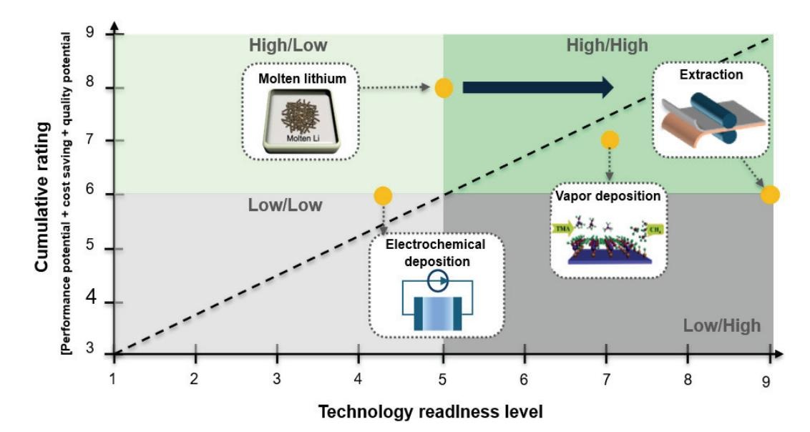

Fig. 13. Technology maturity levels of lithium metal anode fabrication approaches, Adapted from Baek et al. Nano Lett, 2023; 23:8515-8523 with permission from the American Chemical Society, [70] Meng et al. Adv. Mater. 2012;24:3589-3615 with permission of Wiley.[60]

# **Manager Manager**

#### 리튬 금속 음극 제조 기술의 최근 연구동향과 발전

구조 제어 측면에서 장점을 가지며, 특히 압연 및 분리 기술은 대면적 처리와 R2R 공정 연계가 가능하여 상용화 친화도가 높다. [159]

이러한 제조 기술들은 공통적으로 리튬 금속의 전기화 학적 거동, 계면 반응 안정성, 구조적 안정성, 제조 공정 성을 향상시키는 것을 목표로 한다. 최근에는 단일 기술 의 한계를 극복하기 위해 복합적 · 융합적 접근이 시도되 고 있으며, 셀 전체의 성능 · 수명 · 안정성을 종합적으로 향상시키는 방향으로 발전하고 있다.

향후 연구는 개별 음극 수준의 최적화를 넘어. 고용량 양극, 고효율 전해질, 무음극 셀 등과의 시스템 통합 설계 까지 포함하는 전지 단위 최적화가 필요하다. 리튬 금속 음극 제조 기술은 단순한 소재 개발을 넘어, 리튬 이차전 지의 에너지 한계를 돌파하고 차세대 고에너지 저장장치 로 도약하기 위한 핵심 기반 기술로서 그 중요성이 더욱 부각될 것이다.

#### **REFERENCES**

- 1. B. Liu, J.-G. Zhang and W. Xu, Joule, 2(5), 833-845 (2018). https://doi.org/10.1016/j.joule.2018.03.008
- 2. Z. Chen, G.-T. Kim, J.-K. Kim, et al., Adv. Energy Mater., 11(30), 2101339 (2021). https://doi.org/10. 1002/aenm.202101339
- 3. X. Ren, L. Zou, X. Cao, et al., Joule, 3(7), 1662-1676 (2019). https://doi.org/10.1016/j.joule.2019.05.006
- 4. C. Niu, H. Lee, S. Chen, et al., Nat Energy, 4, 551-559 (2019)., https://doi.org/10.1038/s41560-019-0390-6
- 5. H.-P. Liang, M. Zarrabeitia, Z. Chen, et al., Adv. Energy Mater., 12(16), 2200013 (2022). https://doi.org/10.10 02/aenm.202200013
- 6. S. Xia, X. Wu, Z. Zhang, et al., Chem, 5(4), 753-785 (2019). https://doi.org/10.1016/j.chempr.2018.11.013
- 7. J. Janek and W. G. Zeier, Nat Energy, 1, 16141 (2016). https://doi.org/10.1038/nenergy.2016.141
- 8. D. Liu, X. Xiong, Q. Liang, et al., Chem. Commun., 57(73), 9232-9235 (2021). https://doi.org/10.1039/D1 CC03676A
- 9. W. Cao, J. Lu, K. Zhou, et al., Nano Energy, 95, 106983 (2022). https://doi.org/10.1016/j.nanoen.20 22.106983

- 10. W. Ren, Y. Zheng, Z. Cui, et al., Energy Storage Materials, 35, 157-168 (2021). https://doi.org/10.  $1016/j.ensm.2020.11.019$
- 11. L. Wang, F. Wu, Y. Yao, et al., ChemElectroChem, 11(15), e202400019 (2024). https://doi.org/10.1002/ celc.202400019
- 12. P. W. Gruber, P. A. Medina, G. A. Keoleian, et al., J. Ind. Ecol., **15**(5), 760-775 (2011). https://doi. org/10.1111/j.1530-9290.2011.00359.x
- 13. L. T. Peiró, G. V. Méndez and R. U. Ayres, JOM, **65**(8), 986-996 (2013). https://doi.org/10.1007/s11 837-013-0666-4
- 14. W. H. Kruesi and D. J. Fray, Metall. Trans. B, 24(4), 605-615 (1993). https://doi.org/10.1007/BF02673176
- 15. A. S. Basin, A. B. Kaplun, A. B. Meshalkin, et al., Russ. J. Inorg. Chem., 53(9), 1509-1511 (2008). https://doi.org/10.1134/S003602360809026X
- 16. A. Adachi, Y. Katayama, T. Miura, et al., J. Power Sources,  $68(2)$ , 348-351 (1997). https://doi.org/10. 1016/S0378-7753(97)02587-1
- 17. B. Acebedo, M. C. Morant-Miñana, E. Gonzalo, et al., Adv. Energy Mater., 13(13), 2203744 (2023). https://doi.org/10.1002/aenm.202203744
- 18. O. Takeda, M. Li, T. Toma, et al., J. Electrochem. Soc., 161(14), D820-D823 (2014). https://doi.org/ 10.1149/2.0871414jes
- 19. X. He, D. Bresser, S. Passerini, et al., Nat. Rev. Mater., 6, 1036-1052 (2021). https://doi.org/10.1038/ s41578-021-00345-5
- 20. J. Xiao, X. Cao, B. Gridley, et al., Chem. Rev., 125(13), 6397-6431 (2025). https://doi.org/10.1021/acs.chem rev.4c00980
- 21. R. R. Yadav, Y. Dewang and J. Raghuvanshi, International Journal of LNCT, **2**(6), 124-130 (2018).
- 22. D. P. Mohanty, J. B. Mann, V. N. Payathuparambil, et al., Adv Mater. Technol., 9(4), 2301315 (2024). https://doi.org/10.1002/admt.202301315
- 23. R. Schmuch, R. Wagner, G. Hörpel, et al., Nat Energy, 3, 267-278 (2018). https://doi.org/10.1038/s41560-018-0107-2
- 24. J. Schnell, T. Günther, T. Knoche, et al., J. Power Sources, 382, 160-175 (2018). https://doi.org/10.10 16/j.jpowsour.2018.02.062
- 25. J. Becking, A. Gröbmeyer, M. Kolek, et al., Adv. Mater. Interfaces, 4(16), 1700166 (2017). https://doi.

org/10.1002/admi.201700166

- 26. S. Huang, Z. Wu, B. Johannessen, et al., Nat. Commun., 14, 5678 (2023). https://doi.org/10.103 8/s41467-023-41514-0
- 27. B. Stumper, J. Dhom, L. Schlosser, et al., Procedia CIRP, 107, 984-990 (2022). https://doi.org/10.1016/ j.procir.2022.05.096
- 28. M. Wan, S. Kang, L. Wang, et al., Nat. Commun., 11, 829 (2020). https://doi.org/10.1038/s41467-020- 14550-3
- 29. Z. Fan, B. Ding, Z. Li, et al., Small, 18(44), 2204037 (2022). https://doi.org/10.1002/smll.202204037
- 30. G. Li, X. Duan, X. Liu, et al., Adv. Mater., 35(2), 2207310 (2023). https://doi.org/10.1002/adma.20220 7310
- 31. N. Shu, J. Xie, X. Wang, et al., Energy Storage Materials, 24, 689-693 (2020). https://doi.org/10.10 16/j.ensm.2019.07.044
- 32. B. Guo, P. Guo, G. Zhao, et al., Sustainable Energy Fuels, 6(18), 4137-4145 (2022). https://doi.org/10.10 39/D2SE00910B
- 33. Y. Ye, Y. Liu, et al., J. Power Sources, 472, 228520 (2020). https://doi.org/10.1016/j.jpowsour.2020.228 520
- 34. X. Wang, X. Duan, Q. Chen, et al., Energy Storage Materials, 78, 104259 (2025). https://doi.org/10.1016/ j.ensm.2025.104259
- 35. B. He, W. Deng, Q. Han, et al., J. Mater. Chem. A, 9(45), 25558-25566 (2021). https://doi.org/10. 1039/D1TA07660D
- 36. J. Zhu, D. Cai, J. Li, et al., Energy Storage Materials, 49, 546-554 (2022). https://doi.org/10.1016/j.ensm. 2022.05.001
- 37. M. Burton, S. Narayanan, B. Jagger, et al., Nat Energy, 10, 135-147 (2025). https://doi.org/10.1038/s41560- 024-01676-7
- 38. Q. Gao, D. Wu, X. Zhu, et al., Nano Energy, 117, 108922 (2023). https://doi.org/10.1016/j.nanoen.20 23.108922
- 39. H. Li, R. Hua, Y. Xu, et al., Chem. Sci., 14(37), 10147-10154 (2023). https://doi.org/10.1039/D3SC 03884J
- 40. S. Pakseresht, V. Miikkulainen, F. A. Obrezkov, et al., J. Power Sources, 653, 237731 (2025). https://doi. org/10.1016/j.jpowsour.2025.237731
- 41. J. Choi, J. Park and J. Suk, Energy Storage Materials,

80, 104428 (2025). https://doi.org/10.1016/j.ensm. 2025.104428

- 42. X. He, K. Zhang, Z. Zhu, et al., Chem. Soc. Rev., 53(1), 9-24 (2024). https://doi.org/10.1039/D3CS0 0495C
- 43. C.-P. Yang, Y.-X. Yin, S.-F. Zhang, et al., Nat. Commun., 6, 8058 (2015). https://doi.org/10.1038/nc omms9058
- 44. J. Xie, J. Wang, H. R. Lee, et al., Sci. Adv., 4(7), eaat5168 (2018). https://doi.org/10.1126/sciadv.aat 5168
- 45. J. G. Connell, T. Fuchs, H. Hartmann, et al., Chem. Mater., 32(23), 10207-10215 (2020). https://doi.org/ 10.1021/acs.chemmater.0c03869
- 46. N. Zamperlin, R. Cid, V. Kekkonen, et al., J. Power Sources, 655, 237986 (2025). https://doi.org/10.10 16/j.jpowsour.2025.237986
- 47. W. C. West, J. F. Whitacre and J. R. Lim, J. Power Sources, 126(1-2), 134-138 (2004). https://doi.org/10. 1016/j.jpowsour.2003.08.030
- 48. T. Ohnishi and K. Takada, ACS Omega, 7(24), 21199-21206 (2022). https://doi.org/10.1021/acsome ga.2c02104
- 49. N. Delaporte, A. Perea, S. Collin-Martin, et al., Batteries, 10(7), 253 (2024). https://doi.org/10.3390/ batteries10070253
- 50. M. Liu, C. Wang, Z. Cheng, et al., ACS Materials Lett., 2(7), 665-670 (2020). https://doi.org/10.1021/ acsmaterialslett.0c00152
- 51. Y. Zhang, X. Gao, Z. Tang, et al.,J. Alloys Compd., 904, 163908 (2022). https://doi.org/10.1016/j.jallcom. 2022.163908
- 52. S. Lobe, A. Bauer, S. Uhlenbruck, et al., Advanced Science, 8(11), 2002044 (2021). https://doi.org/10. 1002/advs.202002044
- 53. N. Rospars, M. Srout, C. Fu, et al., Commun. Mater., 5, 179 (2024). https://doi.org/10.1038/s43246-024- 00619-9
- 54. Y. Zhao, S. Li, X. Huang, et al., Small, 20(34), 2312129 (2024). https://doi.org/10.1002/smll.202312129
- 55. J. Xiao, F. Shi, T. Glossmann, et al., Nat Energy, 8, 329-339 (2023). https://doi.org/10.1038/s41560- 023-01221-y
- 56. L. Chen, J. G. Connell, A. Nie, et al., J. Mater. Chem. A, 5(24), 12297-12309 (2017). https://doi.org/10.10 39/C7TA03116E

#### 리튬 금속 음극 제조 기술의 최근 연구동향과 발전❚

- 57. A. C. Kozen, C.-F. Lin, A. J. Pearse, et al., ACS Nano, 9(6), 5884-5892 (2015). https://doi.org/10.10 21/acsnano.5b02166
- 58. E. Kazyak, K. N. Wood and N. P. Dasgupta, Chem. Mater., 27(18), 6457-6462 (2015). https://doi.org/ 10.1021/acs.chemmater.5b02789
- 59. E. Sahadeo, G. Rubloff, S. B. Lee, et al., Front. Energy Res., 9, 618368 (2021). https://doi.org/10.33 89/fenrg.2021.618368
- 60. X. Meng, X. Yang and X. Sun, Adv. Mater., 24(27), 3589-3615 (2012). https://doi.org/10.1002/adma.20 1200397
- 61. W. R. Irvine and J. A. Lund, J. Electrochem. Soc., 110(2), 141 (1963). https://doi.org/10.1149/1.2425 691
- 62. Y. Liu, D. Lin, Z. Liang, J. Zhao, K. Yan, and Y. Cui, Nat Commun, 7, 10992 (2016). https://doi.org/10. 1038/ncomms10992
- 63. L. Chen, Z. Huang, R. Shahbazian-Yassar, et al., ACS Appl. Mater. Interfaces, 10(8), 7043-7051 (2018). https://doi.org/10.1021/acsami.7b15879
- 64. S. T. Oyakhire, W. Huang, H. Wang, et al., Adv. Energy Mater., 10(44), 2002736 (2020). https://doi. org/10.1002/aenm.202002736
- 65. S. T. Oyakhire, W. Zhang, A. Shin, et al., Nat Commun, 13, 3986 (2022). https://doi.org/10.1038/s41467-022- 31507-w
- 66. H. Shen, G. Wu, T. Ma, et al., Nanomaterials, 15(10), 710 (2025). https://doi.org/10.3390/nano15100710
- 67. K. Schönherr, B. Schumm, F. Hippauf, et al., Chem. Eng. J. Adv., 9, 100218 (2022). https://doi.org/10. 1016/j.ceja.2021.100218
- 68. Z. Liang, D. Lin, J. Zhao, et al., Proc. Natl. Acad. Sci. U.S.A., 113(11), 2862-2867 (2016). https://doi. org/10.1073/pnas.1518188113
- 69. Y. Feng, C. Zhang, X. Jiao, et al., Energy Storage Materials, 25, 172-179 (2020). https://doi.org/10.10 16/j.ensm.2019.10.017
- 70. K. Baek, W.-G. Lee, E. Im, et al., Nano Lett., 23(18), 8515-8523 (2023). https://doi.org/10.1021/acs.nano lett.3c02229
- 71. S. Zhang, Y. Xing, T. Jiang, et al., J. Power Sources, 196(16), 6915-6919 (2011). https://doi.org/10.1016/j. jpowsour.2010.12.021
- 72. L. Tan, S. Feng, X. Li, et al., Chem. Eng. J., 394, 124848 (2020). https://doi.org/10.1016/j.cej.2020.

124848

- 73. S.-S. Chi, Q. Wang, B. Han, et al., Nano Lett., 20(4), 2724-2732 (2020). https://doi.org/10.1021/acs.nanolett. 0c00352
- 74. L.-X. Li, Y.-N. Li, F.-F. Cao, et al., Nano Res., 16(6), 8297-8303 (2023). https://doi.org/10.1007/s12274- 022-4981-3
- 75. X. Zhang, Y. Yang and Z. Zhou, Chem. Soc. Rev., 49(10), 3040-3071 (2020). https://doi.org/10.1039/ C9CS00838A
- 76. B. Horstmann, J. Shi, R. Amine, et al., Energy Environ. Sci., 14(10), 5289-5314 (2021). https://doi.org/10. 1039/D1EE00767J
- 77. J. Liu, Z. Bao, Y. Cui, et al., Nat Energy, 4, 180-186 (2019). https://doi.org/10.1038/s41560-019-0338-x
- 78. J. Yang, X. Shi, W. Wang, et al., Batteries, 9(3), 155 (2023). https://doi.org/10.3390/batteries9030155
- 79. E. Huangzhang, X. Zeng, T. Yang, et al., Chem. Eng. J., 439, 135534 (2022).: https://doi.org/10.1016/j. cej.2022.135534
- 80. B. Lu, E. Olivera, J. Scharf, et al., ACS Appl. Energy Mater., 4(7), 6454-6465 (2021). https://doi.org/10. 1021/acsaem.1c00438
- 81. T. T. K. Ingber, M. M. Bela, F. Püttmann, et al., J. Mater. Chem. A, 11(33), 17828-17840 (2023). https://doi.org/ 10.1039/ d3ta04060g
- 82. J. Seo, W. Jeong, M. Lim, et al., Energy Storage Materials, 60, 102827 (2023). https://doi.org/10.1016/ j.ensm.2023.102827
- 83. J. Becker, T. Fuchs, T. Ortmann, et al., Advanced Energy Materials, 15(16), 2404975 (2025). https://doi. org/10.1002/aenm.202404975
- 84. Y. Huang, J. Duan, X. Zheng, et al., Matter, 3(4), 1009-1030 (2020). https://doi.org/10.1016/j.matt.20 20.07.005
- 85. W. Jia, Z. Wang, J. Li, et al., J. Mater. Chem. A, 7(39), 22377-22384 (2019). https://doi.org/10.1039/ C9TA08798B
- 86. S.-H. Wang, J. Yue, W. Dong, et al., Nat Commun, 10, 4930 (2019). https://doi.org/10.1038/s41467-019- 12938-4
- 87. H. Wang, D. Lin, Y. Liu, et al., Sci. Adv., 3(9), e1701301 (2017). https://doi.org/10.1126/sciadv.170 1301
- 88. P. Fiflis, A. Press, W. Xu, et al., Fusion Eng. Des., 89(12), 2827-2832 (2014). https://doi.org/10.1016/j.

fusengdes.2014.03.060

- 89. J. E. Cloud, Y. Wang, X. Li, et al., Inorg. Chem., 53(20), 11289-11297 (2014). https://doi.org/10.1021/ ic501923s
- 90. T. Chen, W. Jia, Z. Yao, et al., Electrochem. Commun., 107, 106535 (2019). https://doi.org/10.1016/j.elecom. 2019.106535
- 91. Y. Wang, Y. Shen, Z. Du, et al., J. Mater. Chem. A, 5(45), 23434-23439 (2017). https://doi.org/10.10 39/C7TA08531A
- 92. R. Zhang, X. Chen, X. Shen, et al., Joule, 2(4), 764-777 (2018). https://doi.org/10.1016/j.joule.2018.02.001
- 93. M. V. Reddy, G. V. Subba Rao and B. V. R. Chowdari, Chem. Rev., 113(7), 5364-5457 (2013). https://doi. org/10.1021/cr3001884
- 94. J. Lang, Y. Long, J. Qu, et al., Energy Storage Materials, 16, 85-90 (2019). https://doi.org/10.1016/ j.ensm.2018.04.024
- 95. S. Park, S. Kim, J.-A. Lee, et al., Chem. Sci., 14(37), 9996-10024 (2023). https://doi.org/10.1039/D3SC03 514J
- 96. Z. Liang, K. Yan, G. Zhou, et al., Sci. Adv., 5(3), eaau5655 (2019). https://doi.org/10.1126/sciadv.aau 5655
- 97. S. Li, H. Wang, J. Cuthbert, et al., Joule, 3(7), 1637-1646 (2019). https://doi.org/10.1016/j.joule.20 19.05.022
- 98. L. Feng, K.-Y. Wang, J. Willman, et al., ACS Cent. Sci., 6(3), 359-367 (2020). https://doi.org/10.1021/ acscentsci.0c00158
- 99. J. Zhao, H. Yuan, G. Wang, et al., J. Mater. Chem. A, 9(20), 12099-12108 (2021). https://doi.org/10.10 39/D1TA01568K
- 100. X. Wu, S. Zhang, X. Xu, et al., Angew. Chem., Int. Ed., 63(11), e202319355 (2024). https://doi.org/ 10.1002/anie.202319355
- 101. S. Zheng, Y. Fu, S. Bi, et al., Angew. Chem., Int. Ed., 64(6), e202417973 (2025). https://doi.org/10. 1002/anie.202417973
- 102. Y. Xu, K. Dong, Y. Jie, et al., Advanced Energy Materials, 12(19), 2200398 (2022). https://doi.org/ 10.1002/aenm.202200398
- 103. S. E. Sandoval, C. G. Haslam, B. S. Vishnugopi, et al., Nat. Mater., 24, 673-681 (2025). https://doi. org/10.1038/s41563-024-02055-z
- 104. S. Nanda, A. Gupta and A. Manthiram, Adv. Energy

Mater., 11(2), 2000804 (2021). https://doi.org/10.10 02/aenm.202000804

- 105. S. Li, F. Wu, T. Chen, et al., Energy Mater. Adv., 6, 0168 (2025). https://doi.org/10.34133/energy matadv.0168
- 106. S. Nanda, A. Gupta and A. Manthiram, Adv. Energy Mater., 8(25), 1801556 (2018). https://doi.org/10. 1002/aenm.201801556
- 107. J. Offermann, A. Paolella, R. Adelung, et al., Chem. Eng. J., 502, 157920 (2024). https://doi.org/10.1016/ j.cej.2024.157920
- 108. QuantumScape. https://www.quantumscape.com/ battery-technology/Accessed 06 August 2025
- 109. Y.-G. Lee, S. Fujiki, C. Jung, et al., Nat Energy, 5, 299-308 (2020). https://doi.org/10.1038/s41560- 020-0575-z
- 110. J. Kang, J. Kim, R. Kim, et al., Energy Storage Materials, 76, 104164 (2025). https://doi.org/10. 1016/j.ensm.2025.104164
- 111. X. He, Solid-State Battery Commercialization: Mass Production Taking Off (IDTechEx, 2025). https:// www.idtechex.com/en/research-article/solid-state-b attery-commercialization-mass-production-taking-o ff/32942. Accessed 06 August 2025
- 112. C. Agatie, QuantumScape Claims Breakthrough With Its Anode-Free, Lithium-Metal Battery (autoevolution, 2025). https://www.autoevolution. com/news/quantumscape-claims-breakthrough-wit h-its-anode-free-lithium-metal-battery-249396.html Accessed 06 August 2025
- 113. S. Cui, P. Zhai, W. Yang, et al., Small, 16(5), 1905620 (2020). https://doi.org/ 10.1002/smll.201905620
- 114. C. Zhang, W. Lv, G. Zhou, et al., Advanced Energy Materials, 8(21), 1703404 (2018). https://doi.org/10. 1002/aenm.201703404
- 115. J. Kim, T. Yoon and O. B. Chae, Batteries, 10(4), 135 (2024). https://doi.org/10.3390/batteries1004 0135
- 116. P. Li, Z. Zhang, Z. Zhao, et al., Angew. Chem., Int. Ed., 63(8), e202319090 (2024). https://doi.org/ 10.1002/anie.202319090
- 117. H. Choi, Y. Bae, S.-M. Lee, et al., J. Electrochem. Sci. Technol., 13(1), 78-89 (2022). https://doi.org/ 10.33961/jecst.2021.00535
- 118. Y. Qiao, H. Yang, Z. Chang, et al., Nat Energy, 6, 653-662 (2021). https://doi.org/10.1038/s41560-021- 00839-0

### 리튬 금속 음극 제조 기술의 최근 연구동향과 발전❚

- 119. P. Li, H. Kim, J. Ming, et al., eScience, 1(1), 3-12 (2021). https://doi.org/10.1016/j.esci.2021.10.002
- 120 . D. R. Ely and R. E. García, J. Electrochem. Soc., 160(4), A662 (2013). https://doi.org/10.1149/1.05 7304jes
- 121. A. Pei, G. Zheng, F. Shi, et al., Nano Lett., 17(2), 1132-1139 (2017). https://doi.org/10.1021/acs.nano lett.6b04755
- 122. P. Zhao, J. Pan, D. Zhang, et al., Batteries, 9(7), 381 (2023). https://doi.org/10.3390/batteries9070 381
- 123. D. Li, B. Chen, H. Hu, et al., Adv. Sustainable Syst., 6(5), 2200010 (2022). https://doi.org/10.1002/ adsu.202200010
- 124. Z. Zhou, Q. Chen, Y. Wang, et al., Batteries, 9(3), 188 (2023). https://doi.org/10.3390/batteries9030 188
- 125. L.-L. Lu, J. Ge, J.-N. Yang, et al., Nano Lett., 16(7), 4431-4437 (2016). https://doi.org/10.1021/acs.nano lett.6b01581
- 126. Z. Hou, Y. Yu, W. Wang, et al., ACS Appl. Mater. Interfaces, 11(8), 8148-8154 (2019). https://doi.org/ 10.1021/acsami.9b01521
- 127. D. Zhang, A. Dai, M. Wu, et al., ACS Energy Lett., 5(1), 180-186 (2020). https://doi.org/10.1021/acsen ergylett.9b01987
- 128. S. Huang, W. Zhang, H. Ming, et al., Nano Lett., 19(3), 1832-1837 (2019). https://doi.org/10.1021/ acs.nanolett.8b04919
- 129. V. Pande and V. Viswanathan, ACS Energy Lett., 4(12), 2952-2959 (2019). https://doi.org/10.1021/ acsenergylett.9b02306
- 130. A. Shao, X. Tang, M. Zhang, et al., Adv. Energy Sustainability Res., 3(4), 2100197 (2022). https://doi. org/10.1002/aesr.202100197
- 131. S. Nam, M. G. Nam, M. Kim, et al., Appl. Surf. Sci., 639, 158282 (2023). https://doi.org/10.1016/ j.apsusc.2023.158282
- 132. Y. He, H. Xu, J. Shi, et al., Energy Storage Materials, 23, 418-426 (2019). https://doi.org/10.1016/j.ensm. 2019.04.026
- 133. N. Li, T. Jia, Y. Liu, et al., Front. Chem., 10, 884308 (2022). https://doi.org/10.3389/fchem.2022.884308
- 134. T. Kang, J. Zhao, F. Guo, et al., ACS Appl. Mater. Interfaces, 12(7), 8168-8175 (2020). https://doi.org/ 10.1021/acsami.9b19655

- 135. J.-A. Lee, H. Kang, S. Kim, et al., Energy Storage Materials, 73, 103826 (2024). https://doi.org/10.10 16/j.ensm.2024.103826
- 136. Z. Zhou, Y. Feng, J. Wang, et al., Chem. Eng. J., 396, 125254 (2020). https://doi.org/10.1016/ j.cej.2020.125254
- 137. A. A. Assegie, J.-H. Cheng, L.-M. Kuo, et al., Nanoscale, 10(13), 6125-6138 (2018). https://doi. org/10.1039/C7NR09058G
- 138. K. Yan, H.-W. Lee, T. Gao, et al., Nano Lett., 14(10), 6016-6022 (2014). https://doi.org/10.1021/nl503125u
- 139. G. Zheng, S. W. Lee, Z. Liang, et al., Nat. Nanotechnol., 9, 618-623 (2014). https://doi.org/10. 1038/nnano.2014.152
- 140. K. Yu, J. Chen, X. Xie, et al., Surf. Interfaces, 34, 102326 (2022). https://doi.org/10.1016/j.surfin. 2022.102326
- 141. L. Lin, K. Qin, Q. Zhang, et al., Angew. Chem.,Int. Ed., 60(15), 8289-8296 (2021). https://doi.org/10.10 02/anie.202017063
- 142. L. Lin, K. Qin, M. Li, et al., Energy Storage Materials, 45, 821-827 (2022). https://doi.org/10.1016/j.ensm. 2021.12.036
- 143. X. Su, C. Lin, X. Wang, et al., J. Power Sources, 324, 150-157 (2016). https://doi.org/10.1016/j.jp owsour.2016.05.063
- 144. Y. Sun, H.-W. Lee, G. Zheng, et al., Nano Lett., 16(2), 1497-1501 (2016). https://doi.org/10.1021/ acs.nanolett.5b05228
- 145. S. Solchenbach, M. Wetjen, D. Pritzl, et al., J. Electrochem. Soc., 165(3), A512-A524 (2018). https://doi.org/10.1149/2.0611803jes
- 146. E. Mao, W. Wang, M. Wan, et al., Nano Res., 13, 1122-1126 (2020). https://doi.org/10.1007/s 12274-020-2756-2
- 147. S. W. Park, H. J. Choi, Y. Yoo, et al., Adv. Funct. Mater., 32(5), 2108203 (2022). https://doi.org/10. 1002/adfm.202108203
- 148. G. Huang, J. Liang, X. Zhong, et al., Nano Res., 16, 3872-3878 (2023). https://doi.org/10.1007/s122 74-022-5146-0
- 149. Y. Sun, H.-W. Lee, Z. W. Seh, et al., Adv. Energy Mater., 6(12), 1600154 (2016). https://doi.org/10. 1002/aenm.201600154
- 150. Z. Zhang, H. Luo, Z. Liu, et al., J. Mater. Chem. A, 10(17), 9670-9679 (2022). https://doi.org/10.10 39/D2TA00167E

#### ❚주현상, 윤정식

- 151. S. S. Zhang, X. Fan and C. Wang, Electrochem. Commun., 89, 23-26 (2018). https://doi.org/10.1016/ j.elecom.2018.02.011
- 152. W. He, H. Xu, Z. Chen, et al., Nano-Micro Lett., 15, 107 (2023). https://doi.org/10.1007/s40820-023- 01068-8
- 153. M. T. F. Rodrigues, J. A. Gilbert, K. Kalaga, et al., JPhys Energy, 2(2), 024002 (2020). https://doi. org/10.1088/2515-7655/ab6b3a
- 154. K. Schönherr, M. Pöthe, B. Schumm, et al., Batteries, 9(1), 53 (2023). https://doi.org/10.3390/batteries 9010053
- 155. Q. Pan, P. Zuo, T. Mu, et al., J. Power Sources, 347, 170-177 (2017). https://doi.org/10.1016/j.jpow

⊙ ⊙ 주현상

- ⊙ 2011년 포항공과대학교 기계공학 학사
- ⊙ 2013년 서울대학교 기계공학 석사 ⊙ 2021년∼현재 아헨공과대학교 전기공학 박사과정
- ⊙ 2013년∼2019년 삼성 SDI 생산기술연구팀 연구원
- ⊙ 2019년∼2025년 Helmholtz Institute Münster 연구원
- ⊙ 2023년∼현재 PRELI GmbH, Co-founder, Managing Director
- ⊙ 2023년∼현재 재유럽한인배터리연구원그룹 (EK-DeBatt) 운영위원

sour.2017.02.061

- 156. B. Stumper, A. Mayr and G. Reinhart, Procedia CIRP, 93, 156-161 (2020). https://doi.org/10.1016/j. procir.2020.05.159
- 157. C. Yang, H. Ma, R. Yuan, et al., Nat Energy, 8, 703-713 (2023). https://doi.org/10.1038/s41560- 023-01272-1
- 158. A. Shao, H. Wang, M. Zhang, et al., Nat Commun, 16, 4145 (2025). https://doi.org/10.1038/s41467- 025-59521-8
- 159. G. Bockey, J. F. Plumeyer, S. Wennemar, et al., Proceedings of the Conference on Production Systems and Logistics, 222-233 (2023). ttps://doi. org/10.15488/15282

#### ⊙ ⊙ 윤정식

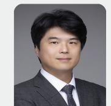

- ⊙ 2012년 부산대학교 나노소재공학과 학사
- ⊙ 2016년 뮌헨공과대학교 물리학 석사
- ⊙ 2020년 뮌헨공과대학교 물리학 박사
- ⊙ 2021년 부경대학교 연구 교수
- ⊙ 2023년 포항산업과학연구원 책임연구원
- ⊙ 2023년∼현재 인천대학교 에너지화학공학 과 조교수