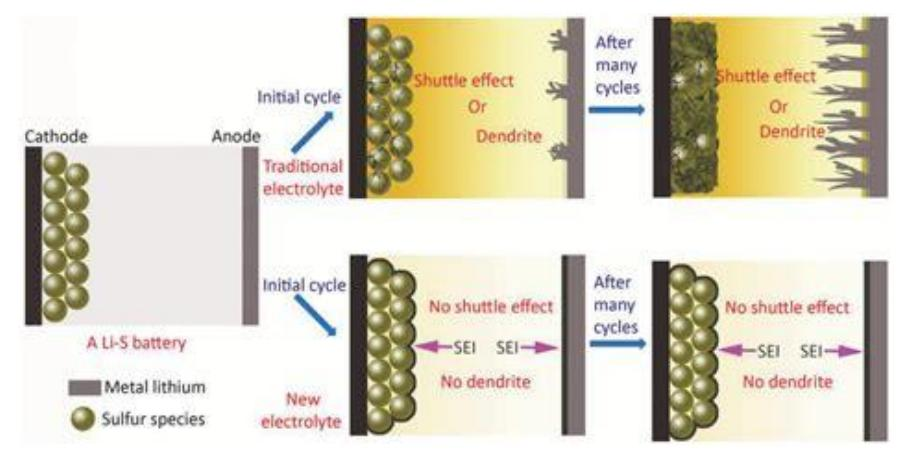

# **Electrolyte Design and Challenges in Lithium-Sulfur Batteries**

Yueran Sun \*

University of Southern California, Los Angeles, California, USA

\* Corresponding Author Email: yuerans0525@gmail.com

**Abstract.** There is a wide discussion about lithium-sulfur batteries concerning electrolytes due to their potential ability to exceed the traditional circumstances of energy density in lithium-ion systems. However, the commercialization of this system is facing crucial challenges currently because of the insulting nature and the volume expansion of sulfur, roughly about 76%, the movement of polysulfides between the two electrodes, and the insufficient surface qualities of the lithium metal anode with non-aqueous lithium electrolytes [1]. The electrolyte here becomes a very influential factor in all active compositions that work in lithium polysulfides and lithium, primarily functioning on safety and lifespan. This review article unravels the electrolyte design for lithium-sulfur batteries in recent literature and research, focusing on liquid, solid-state, and quasi-solid systems. Also, a special insight looks into electrolyte composites, additives, and concentrates due to the shuttle effect, interfacial stability, and ionic conductivity. Many studies today have approached promising strategies and ongoing limitations in the field, as well as some potential solutions, helping the electrolyte system maintain high energy density and long-term stability.

**Keywords:** Lithium-sulfur batteries, Electrolytes, Shuttle effect.

## **1. Introduction**

The history of lithium-sulfur batteries traces back to 1817, when Aefwedson and Berzelius first identified lithium in petalite ore [2], followed by its isolation through electrolysis of lithium oxide by Brande and Davy in 1821[3]. This discovery laid the foundation for Lewis to investigate lithium's electrochemical properties nearly a century later [4]. Lithium soon emerged as a promising anode material due to its favorable physical characteristics such as low density (~0.534 g/cm³), high specific capacity (3860 mAh/g), and low redox potential (−3.04 V vs. SHE). During the early 1970s, progress in lithium intercalation chemistry laid the foundation for rechargeable battery technology. Armand and colleagues demonstrated early intercalation in Prussian-blue compounds, while others explored transition metal disulfides like TiS₂, which Whittingham later patented for lithium batteries [5]. These materials were eventually commercialized in various cell formats. MoS₂ and NbSe₃ also showed promising performance, with commercial cells emerging by the late 1980s. Around the same period, Goodenough's group introduced LiCoO₂, a stable, high-voltage cathode that became dominant in commercial applications [6]. Other alternatives, such as LiMn₂O₄ and LiFePO₄, were later developed to ensure safety and reduce cost, leading to further innovations like NMC cathodes. Sooner after that, Li₄Ti₅O₁₂ was also introduced for improved stability and cycling performance, especially in highpower and sodium-ion systems.

The lithium-sulfur battery (Li-S battery) is demonstrated as a promising alternative energy resource, serving as a developing technology for storing energy at a large scale as well as electrifying vehicles because of the high theoretical energy density (up to 2600Wh/kg for a 2V) and low cost of sulfur. Generally, this type of battery uses lithium as the negative electrode and sulfur as the positive electrode to manage the flow of ions through the charging or discharging process, and the redox reaction proceeds by the chemical reaction between lithium ions and sulfur [7]. Plus, the all-solidstate structure allows lithium-sulfur batteries to reduce carbon emissions, since the energy transformation process no longer consumes fossil fuels or produces greenhouse gases. This indeed showcases the very beneficial feature of the Li-S battery, the ability to maintain sustainability [8]. For applications like electric cars and energy storage of natural resources from wind and tidal power, Li-S batteries are very appealing and desirable due to their features [9]. However, it also reveals several notable drawbacks that restrict the market potential of Li-S batteries, and the electrolyte is one of the critical factors affecting their stability and efficiency.

An electrolyte is typically described as a material that conducts electricity because it contains free ions such as cations and anions. Moreover, an electrolyte solution forms when a solute, like an inorganic salt, dissolves in a solvent, which can be both protic or aprotic, meaning the properties of being a hydrogen bond donor and acceptor [10]. In Li-S batteries, the electrolyte performs various functions. First, it enables ionic transportation between electrodes, stabilization of the lithium metal anode, and interaction with sulfur species during cycling [11]. In contrast to the traditional functions, Li-S batteries undergo a unique process called the shuttle effect, meaning the charging and discharging process gets repetitive like a cycle. During the shuttle effect, the intermediate lithium polysulfides dissolve into the electrolyte and migrate between the electrodes [12], further weakening the capacity and reducing coulombic efficiency. In addition, the active reactivity between lithium metal and electrolyte solvents can cause the dendrite product, a solid electrolyte interphase in another way [13], and other safety concerns such as short circuit and potential flame [14].

Due to these challenges, electrolyte design and optimization have been central in battery research. In order to solve these problems, a wide range of electrolytes in different states, such as liquid, solid, and gel, have been discussed and tested, addressing key limitations such as polysulfide dissolution, poor cycling stability, and intersurfacial instability with lithium metal. Each type of electrolyte has its distinct benefits and drawbacks, showing the current energy storage challenges regarding ionic conductivity, compatibility, and safety. This review focuses on the latest developments in Li–S battery electrolyte design, particularly on how well they may mitigate the challenges with different formulations. Through the comparisons across the recent advancements in battery electrolyte systems, this paper also illustrates the promising direction for future innovation and highlights factors needed to maintain stable, scalable, and high-performance Li-S battery technologies.

#### **2. Fundamentals of Lithium–Sulfur Battery Chemistry**

Li-S batteries can provide a very high theoretical energy density through a series of redox reactions between lithium and sulfur. The entire process of the reactions can be listed as follows: anode reaction, which is the oxidation process during discharging; cathode reactions, the stepwise reduction of sulfur; the overall discharge reaction, as well as the charging process [15].

During discharge, lithium atoms at the anode are oxidized to lithium ions (Li⁺), releasing electrons into the external circuit. The Li⁺ ions migrate through the electrolyte and react with elemental sulfur (S₈) at the cathode, forming higher-order lithium polysulfides (Li₂S₈, Li₂S₆), which are soluble in ether-based solvents. These intermediates are then stepwise reduced to shorter chain polysulfides (Li₂S₄, Li₂S₂) and finally to solid Li₂S, which precipitates onto the cathode surface [16]. Upon charging, this process reverses: Li₂S oxidizes back to sulfur, and lithium ions return to the anode where they are reduced to metallic lithium. However, this cycling process is complicated by the "shuttle effect," where dissolved polysulfides diffuse back and forth between the cathode and anode, causing loss of active material, capacity fading, and low coulombic efficiency [17]. Additionally, both sulfur and Li₂S are electronically insulating, requiring conductive additives like carbon materials to facilitate electron transport during redox reactions. The choice of electrolyte is also critical; ethers such as 1,2-dimethoxyethane (DME) and 1,3-dioxolane (DOL) are often used for their ability to dissolve polysulfides and support efficient redox kinetics.

However, there are some common issues regarding the electrolyte-electrode interface in Li-S batteries, which significantly challenge the performance and stability of the entire battery system. The biggest problem is the formation of unstable solid electrolyte interphases (SEIs) on the lithium metal anode, resulting in dendrite growth and internal short circuits [18]. Also, the inadequate contact between the electrodes and the electrolyte hinders ion transport and raises interfacial resistance. The interaction between lithium polysulfides exacerbates these issues by deteriorating the interface and causing capacity fading. Improving the long-term cyclability of Li-S batteries requires resolving these interracial problems.

To further explain the shuttle effect, it primarily results from the dissolution and migration of double lithium polysulfides, which are the product of the reactions between the cathode and anode. This also becomes the biggest limitation for Li-S batteries to maintain high efficiency. During the discharging process, the cathode derived from Li ions reacts with sulfur, depending on various ratios of the chemical reaction, and forms smaller LiPSs. However, the tiny size of LiPSs can be challenging for the later delithiation process because they can address problems such as unavoidable and insistent resistance, reduction of the battery's ability, shorter cycle life [19], as well as unpredictable side reactions, forcing the lithium anode to deteriorate [20]. Intensive research has been conducted to resolve these limitations, such as optimizing the sulfur cathode structures, electrolyte modification, and the utilization of functionalizing separators. The separator coating eventually stands out as a relatively highly efficient strategy to show promise in reducing the subtle effect while improving the battery performance [21].

#### **3. Types of Electrolytes in Li–S Batteries**

#### **3.1. Liquid Electrolytes**

It should be emphasized that in Li–S batteries, liquid (aqueous), electrolytes play a crucial role since they are responsible for the Li ion transfer between the electrodes. The typical liquid systems are ether-based, usually a 1:1 ratio of 1,3-dioxolane (DOL) and 1,2-dimethoxyethane (DME). This type of mixing typically forms a lithium salt, for example, LiTFSI, and special additives, for example, LiNO₃, for stable conditions. Firstly, there are so-called ether solvents, which have a fine capacity for dissolving lithium polysulfides (LiPSs) – key materials that are created and utilized during the charge and discharge of the above battery. However, there is one critical problem: these LiPSs can be dissolved in the electrolyte and migrate into the electrolyte and then enter the anode, causing a "shuttle effect" that results in energy wasting and battery life decay. LiNO₃ is capable of forming a slim protective layer on lithium metal, which inhibits undesired reactions and facilitates the implementation of long-life and high-performing battery [22]. Yet, ether-based electrolytes are not ideal. They are flammable and volatile, meaning they're likely to catch on fire or evaporate. Also, even with LiNO₃, polysulfides continue to dissolve and be a problem. Scientists have tried to address this by using other additives, such as fluorinated solvents or KPF₆, which reinforce the protective layer on the lithium surface and reduce the volume of LiPSs that form the crystal.

On the other hand, the carbonate-based electrolytes, which are frequently applied in normal lithium-ion batteries, usually don't perform quite well in the Li–S cells. That's because when LiPSs meet carbonate solvents, they react negatively, yielding unwanted byproducts that harm the battery's performance. These are irreversible reactions, and consequently, the battery charge capacity can rapidly be discharged reducing its performance [23]. But new evidence suggests there may be ways to make carbonate systems more efficient. Some researchers have even managed to make sulfur cathodes that don't generate free polysulfides at all; those, of course, don't experience the negative reactions with the carbonates. Others rely on barrier layers to minimize contact between the polysulfide and the electrolyte. These novel concepts are lifting the promising carbonate-based Li–S batteries closer to practical use.

Ultimately, ether-based electrolytes are still commonly used for Li–S batteries. They are very well suited for sulfur chemistry and prefer fast redox reaction, so this type of associative compounds can offer high energy output and are often used in lab and prototype. But with that, overall, potential problems may exist, which could be safety problems since solvents are flammable or explosive under certain conditions. The carbonate-based electrolytes, previously incompatible, are on the other hand starting to draw more attention because of the up-to-date innovations. In one case, sulfur electrodes were design-designed to minimize polysulfide formation, and in another, protective interlayers were added to the cell to reduce the undesirable reaction with carbonates. Should these also be improved and developed further in future, then a carbonate-based system could perhaps offer a safe and less expensive alternative for commercial purposes.

#### **3.2. Solid-State Electrolytes (SSEs)**

Solid-state electrolytes (SSEs) are ideal candidates to address some of the safety and performance problems that exist in conventional Li–S batteries research. SSEs differ from the flammable liquid electrolytes since they are solid, non-volatile, and chemically stable, which means they do not leak, evaporate, and are less likely to cause fire. They may also serve as a physical barrier to the growth of lithium dendrites, which, left unperturbed, will ram through the separator and force dangerous short-circuits [24]. That makes SSEs particularly appealing to construct safer and more durable batteries for electric vehicles and grid storage.

SSEs are generally classified into inorganic and polymeric SSEs. Among inorganic SSEs, sulphide-based electrolytes like Li₆PS₅Cl have emerged as promising due to their high lithium-ion conductivity that is comparable to that of liquid electrolytes [24]. These sulfides also possess a soft and deformable structure that is conducive to proper physical contact between lithium metal and sulfur cathodes. There's just one large downside to sulfides: they are highly reactive with air or water, and this can result in the liberation of deadly hydrogen sulfide gas during manipulation [25]. Oxidebased electrolytes such as garnet-type LLZO, meanwhile, are stable in the air and have a broader electrochemical stability window. Because oxides are stiff and brittle, though, they usually must be processed at extremely high temperatures, and they often don't conform well to electrode surfaces, unless additional force or surface coatings are applied. These issues can increase production costs and prevent the application in the bendable battery system.

SSEs, which are a relatively new group of materials, do and consequently provide a compromise between the two extremes. Materials such as Li₃InCl₆ exhibit moderate ionic conductivity, high stability and are less sensitive to moisture compared to sulphide analogues [26]. While these halides are still in the early stages of research, preliminary results show that they may have better interface compatibility with both lithium metal anodes and sulfur as cathodes. That would make them a promising candidate for next-generation Li–S designs with a blend of safety and energy density. However, their full-cell Li–S electrochemical cycling performance has not yet been comprehensively addressed in the context of long cycling life.

On the other hand, polymer-based SSEs, for example, polyethylene oxide (PEO)-based, are attractive because of the processability and flexibility. PEO can be prepared in thin film, fitting easily into the batteries, and is lightweight [27]. However, PEO has a limitation in that it has low ionic conduction at room temperature. That's because lithium ions diffuse slowly through the polymer unless the chains have some heat-induced wiggle room, typically gained by heating the battery to 60ºC or higher. To address the above problem, the researchers have developed composite polymer electrolytes in which ceramic fillers or plasticizers are added to improve simultaneously the conductivity and mechanical strength. Even newer ones can self-heal, where they automatically fix small cracks that develop due to charging and discharging cycles [28]. These developments are designed to improve the lifespan of polymer-based SSEs and enhance their practical stability.

Nonetheless, significant challenges remain facing this technology. But one of the largest is the solid electrolytes' inadequate contact with the electrodes, particularly at room temperature. This contact resistance results in a decrease in the rate of Li-ion transference, then effectively slows down the power output and lowers the battery efficiency [29]. Engineers are currently investigating options like pressure-assisted assembly, surface coatings, and hybrid SSE designs that combine polymers and ceramics. Thereby, they may enable the maximum potential energy density of solid-state Li–S batteries that amalgamate the high safety solid materials with the high energy density of sulfur chemistry.

#### **3.3. Quasi-Solid/Gel Electrolytes**

Gel and quasi-solid electrolytes have become an important development in the progress of lithium–sulfur (Li–S) batteries. Such electrolytes aim to strike the balance between the virtues of liquids and solids—maintaining high ionic conductivity of the former, but gaining mechanical stability and safety of the latter. They are a liquid-like matter that can flow into the pores of electrodes to facilitate ion transport, and which are structured enough to prevent leakage and evaporation. By retaining the liquid phase in the polymer or gel matrices, these systems could retard the leakage of active substances, which should be useful in inhibiting the polysulfide shuttle effect normally occurred in Li–S cells [30].

One of the most important advantages of quasi-solid electrolytes is the enhanced mechanical strength. Conventional liquid electrolytes may suffer from leakage as well as dendrite generation to be pierced through the separator, leading to short-circuits. Gel and quasi-solid-like electrolytes create a physical barrier more resistant to deformation and better blocking dendrites. This extra stiffness translates in an increasing safety and thermal stability of the battery. At the same time, these gels are soft and pliable compared to inflexible solid ceramic electrolytes, which can conform to the surfaces of electrodes and maintain uniform interfacial contact. This effectively enhances the charge transfer and lowers the interfacial resistance [31]. Examples of such polymers include poly(vinylidene fluoride-co-hexafluoropropylene) (PVDF-HFP) and poly(ethylene oxide) (PEO), which have been widely used as the polymer hosts of gel electrolyte since they can absorb large amounts of the liquid electrolyte and provide dimensional stability. These polymers are usually combined with ceramic fillers or crosslinked with other materials to additionally improve the conductivity and restrain of the swelling. For instance, the reinforcement of matrix and ionic mobility was found to be enhanced by introducing SiO₂ or TiO₂ nanoparticles, leading to a network of continuous paths for lithium ions [32]. In addition to trapping the lithium salt, the gel matrix can also help confine the polysulfides to limit the diffusion of the polysulfides toward the lithium anode. This slows down the capacity fading due to the shuttle effect markedly and improves the cycle stability.

In addition, the quasi-solid electrolytes provide better interfaces with the lithium metal anodes. In liquid configuration, such contact of the electrolyte and the surface of lithium is generally not stable and is followed by side reactions. In comparison to the rigid yet flexible skeleton of the quasi-solid matrix, it can mitigate the volume change during cycling and keep close contact with the electrolyte. This contributes to a more homogeneous and stable SEI layer, which suppresses parasitic reactions and enhances the coulombic efficiency [33]. In some other findings, quasi-solid-state systems can even enhance low-temperature performance by retaining the fluidity and the transport properties of the electrolyte, while maintaining the safety.

Due to their hybrid properties—liquid-like conductivities, solid-like safety, and stable interfaces quasi-solid electrolytes that are a combination of the two are regarded as an appealing compromise between liquid and all-solid-state systems. Though not yet in widespread commercial deployment, work in polymer chemistry, additive design, and electrode compatibility has continuously increased the performance and scale of these systems [34]. Quasi-solid electrolytes could stand as an important key enabler of next-generation Li–S batteries, in the event of being successfully integrated into highloading sulfur cathodes and lithium-metal anodes.

## **4. Electrolyte Design Strategies and Functional Additives**

Rational electrolyte design in lithium–sulfur (Li–S) batteries is not only the case for ion mobility it also provides an approach for control of complicated interfacial chemistry and suppressing the degradation mechanisms accompanied by cycling. As sulfur is soluble in highly dispersed polysulfides, which form during the redox process, the latter may diffuse to the lithium anode and lead to self-discharge, active material loss, and dendrite growth. The use of an effective additive for overcoming this issue is lithium nitrate (LiNO3). LiNO3 can facilitate the generation of a passivating solid electrolyte interphase (SEI) on the lithium surface in ether-based electrolytes. This layer can not only retard further side reactions with polysulfides, but also serve as a structural barrier to inhibit dendrite growth [36]. Nevertheless, as LiNO₃ is gradually used up during a cycle, its function can deteriorate over time. To overcome this limitation, some researchers integrate sacrificial components or construct SEI-supporting structures directly in the separator or the electrolyte system, thereby prolonging the advantages over long-term operation [39].

**Figure 1.** fluorinated systems giving rise to thicker and uniform SEI layers

Next to the use of LiNO3 also fluorinated solvents provide another strategic approach to interface stabilization. Such solvents are typically chemically inactive, low in donor numbers, and not prone to oxidative breakdown. As co-solvents or diluents, fluorinated ethers such as TTE serve to suppress the solubility of polysulfides, thereby mitigating the reactivity of electrolytes with lithium [35]. In addition, they increase the oxidative stability of the electrolytes, making it possible to efficiently use the electrolytes at higher voltages with increased safety. As demonstrated in Figure 1, which describes behaviors of various solvent systems in contact with lithium metal, fluorinated systems give rise to thicker and uniform SEI layers as compared with conventional ethers. This is in good agreement with the fact that solvent choice has a great effect on the interfacial chemistry and longer battery lifetime.

The second generation of electrolyte formulation is a high-concentration electrolyte (HCE). HCEs decrease parasitic reactions and polysulfide dissolution by lowering the concentration of free solvent molecules. Unfortunately, these materials are usually highly viscous, which restricts ion mobility and processability. To address this issue, it was produced localized high-concentration electrolytes (LHCEs) were produced by inserting nonreacting non-coordinating diluents, which conserve the desired solvation structure of HCEs but largely reduce the viscosity [37]. These systems largely preserve the protective action of concentrated systems but are more appropriate for practical cell assembly. The specific solvation structure of LHCEs also induces the generation of the inorganicrich SEI layers, which are more stable in terms of chemical stability.

Co-solvents and viscosity modifiers: in addition to additives and concentration tuning, co-solvents and viscosity modifiers are also staple tools in electrolyte engineering. For example, dimethoxyethane (DME) is usually combined with tetraethylene glycol dimethyl ether (TEGDME) to tailor solvent polarity and better coordinate lithium ions. Such a combination leads to a good compromise between high ionic conductivity and low volatility [38]. Viscosity-modifying agents, typically polymers or low molecular weight organics, are usually added to enhance electrode wetting and electrolyte immobilization, particularly at high-loading sulfur scenarios. These optimizations contribute to a uniform electrochemical environment, leading to enhanced coulombic efficiency and rate performance.

In a word, the current route of rational design in electrolyte for Li–S batteries focusses on the collaboration of chemical modulating and interfacial engineering. And the electrolyte additive, LiNO₃ and fluorinated solvents can regulate the formation of SEI and inhibit the dendrite growth. Innovations such as LHCEs help provide an improved processability without compromising electrochemical stability. Combinatorial with appropriate co-solvents and viscosity management these approaches combine to produce a high performing electrolyte which can fulfil the needs of advanced Li–S systems.

### **5. Challenges in Electrolyte Development**

The design of electrolytes that are perfectly suited to lithium–sulfur (Li–S) batteries is dyadic due to the high solubility of lithium polysulfides (LiPSs), which readily dissolve in traditional organic electrolytes, and to their migration between electrodes. This is called the shuttle effect, resulting from self-discharge, active material release and low coulombic efficiency. This Li2S would also otherwise form long chain polysulfides (Li2S8, Li2S6) near the cathode, which can migrate to the lithium metal anode and react there, producing undesirable, precipitating short chain species such as Li2S. Upon cycling, this leads to deterioration of sulfur utilization, which causes high capacity fading [12]. While tactics such as separator coats and anchor materials assist in holding the polysulfide hostage, the crux of the matter is still the electrolyte and whether those traps last. It is evident that the polysulfides solubility is not only a matter of material engineering; it should be addressed directly through the electrolyte chemistry.

The formation of lithium dendrites – an outcome of uneven lithium deposition during charging – is another key obstacle. Needlelike growths that can puncture the separator and short-circuit, or catch fire, can be formed by the highly reactive surface of the lithium metal. This problem is in itself related with the instability of the electrolyte–anode interphase. In a number of Li–S systems, particularly those with liquid electrolytes based on ethers, the native SEI is chemically labile and mechanically fragile. He et al. demonstrated that inorganic SEI species (such as LiF) may contribute to enhanced interfacial stability, however, the formation of a uniform SEI throughout the anode surface is yet an issue [13]. In the end, the growth of dendrite and SEI decomposition remain the main triggers for safety attention and endurance degradation in commercial cells.

In the case of solid-state electrolytes (SSEs) used as safer replacements for flammable liquid electrolytes, a different set of constraints is introduced. Although inorganic SSEs such as sulfides and oxides possess excellent stability and thermal stability, these materials typically show a low roomtemperature ionic conductivity. The problem is becoming more serious if the rigid solid electrolyte is barely in contact to the soft lithium metal anode. Zhang et al. reported that it is challenging to achieve both high ionic transport and stable interfaces in solid-state electrolytes (SSE) without high pressure or expensive process techniques [24]. Without resolving these bottlenecks, SSEs will have difficulty in radio frequency (RF) power matching that they need for marketing device applications.

Finally, there are cost, and scalability, the remaining major challenges towards the electrolyte innovation. Other advanced electrolytes — those made with fluorinated solvents, complex additives or hybrid formulations — work well in the lab but are too expensive or problematic for mass production. Moreover, the large-scale preparation of solid electrolytes is associated with rare and sensitive materials, which also could result in high cost in terms of both the environment and economy. Roth and Orendorff pointed out that safety, cost, and performance should be closely weighed in scale-up [14]. To drive Li–S technologies from lab to industry, the electrolyte solutions should be manufacturable, stable and economic.

#### **6. Emerging Trends and Future Directions**

The use of high-concentration electrolytes (HCEs) and their modified variant, localized highconcentration electrolytes (LHCEs), has been one of the most stimulating advances in the recent electrolyte research. The high salt-to-solvent ratio of HCEs modifies the solvation atmosphere, which can reduce free solvent molecules that react with the lithium and dissolve polysulfides. This forces the formation of stable SEI layers and inhibits side reactions. The only problem is their high viscosity that makes ion movement so much more sluggish. LHCEs tackle this issue by introducing nonsolvent diluents to retain the HCEs' desirable structure while allowing processability. As Liu et al. shown, LHCEs possess better oxidative stability, interfacial compatibility, and cycle performance than the conventional ones [9]. To do so, the focus has been widely turned into these electrolyte systems as a compromise between performance and feasibility as candidates of next generation lithium–sulfur cells.

Apart from chemical optimization, increasing attention has been given to bio-inspired and green electrolytes, meeting environment-targeted goals. Novel solvents such as those derived from renewable sources or those based on less toxic salts, for example, lithium bis(oxalato)borate (LiBOB) in place of standard lithium bis(trifluoromethanesulfonyl)imide (LiTFSI), have recently been investigated in the literature [22]. Furthermore, biodegradable polymers are also under investigation as hosts for gel electrolytes. These substitutions hold promise in lowering the environmental impact of battery manufacturing while meeting functional requirements. In addition, although many green systems are still facing challenges in conductivity or stability, their scalability and regulatory safety provide a promising prospect for sustainable energy storage in the future. As regulations on the environment tighten, green electrolytes may shift from niche lab projects to mainstream industrial solutions.

Another promising approach is through the application of ML- and AI-guided design of electrolytes. With large chemical spaces to search, heuristic trial-and-error techniques are too slow and resource-intensive. Recent modeling methods integrate computational chemistry and AI algorithms to estimate solvent compatibility, ionic conductivity, and electrochemical stability for thousands of potential formulations [34]. These methods can also help characterize trends in SEI composition and to correlate SEI constituents with long-term cycling performance. Although young, ML-guided electrolyte design is a potential game changer due to the possibility of accelerating discovery and cutting costs through early-stage identification of favorable candidates before they even enter the lab.

Finally, researchers are also searching for hybrid electrolyte systems, which may include the benefits of more than one phase, like liquid-solid or gel-polymer composites. These systems can combine the high ionic conductivity of liquids and the mechanical strength and safety of solids. For instance, when a solid-state framework is mixed with a gel that is plasticized, the resultant material may have enhanced interface and flexibility, without any loss of rigidity [29]. Hybrid electrolytes are particularly attractive for the development of flexible or high-energy density batteries, as they provide a tunable platform for customizing the electrolyte according to application. The modularity of these systems renders them flexible for future development.

# **7. Conclusion**

The efficiency, safety and lifetime of lithium–sulfur batteries are critically dependent on the electrolytes for lithium–sulfur chemistries. Herein, many above-mentioned issues, including the polysulfide shuttling, dendrite growth and interface instability, have already been demonstrated that they be mainly ascribed to the inadequacy of the traditional electrolyte system in this review. Many ingenious strategies, such as high-concentration and local electrolyte, gel, and solid-state electrolytes, have been reported to increase ionic transport, SEI stability, and safety for tackling these issues.

The optimal avenues for progress include localized high-concentration electrolytes, which offer the stability and the conductivity of lithium ion that exceeds as much as 24 M Li+, with modest viscosity, as well as hybrid systems that combine the outstanding properties of both solid and liquid electrolytes. These new systems are more than incremental advances – they redefine what electrolyte chemistry can do for sulfur-based energy storage.

However, none of these approaches is able to address all of the multiple issues of Li–S batteries. For further improvement, future progress may need to focus on integrated designs that unify the optimization in all components line up, such as the detailed design of electrodes, separator and safety. Interdisciplinary work — blending electrochemistry, materials science and data-driven design — will be critical. With further progress achieved, electrolytes can evolve from the bottleneck to the essential facilitator for high-performance and practical lithium–sulfur batteries.

## **References**

- [1] Angulakshmi, N., Dhanalakshmi, R. B., Sathya, S., Ahn, J., & Stephan, A. M. (2021). Understanding the electrolytes of Lithium−Sulfur batteries. Batteries & Supercaps, 4(7), 1064–1095.
- [2] Arfwedson, A. (1818). Untersuchung einiger bei der Eisen-Grube von Utö vorkommenden Fossilien und von einem darin gefundenen neuen feuerfesten Alkali. Journal für Chemie und Physik, 22, 93–117.
- [3] Berzelius, J. J. (1817). Ein neues mineralisches Alkali und ein neues Metall. Journal für Chemie und Physik, 21, 44–48.
- [4] Lewis, G. N., & Keyes, F. G. (1913). The potential of the lithium electrode. Journal of the American Chemical Society, 35(4), 340–344.
- [5] Armand, M., & Touzain, P. (1977). Graphite intercalation compounds as cathode materials. Materials Science and Engineering, 31, 319–329. https://doi.org/10.1016/0025-5416(77)90052-0
- [6] Padhi, A. K., Nanjundaswamy, K. S., & Goodenough, J. B. (1997). Phospho‐olivines as positive‐electrode materials for rechargeable lithium batteries. Journal of the Electrochemical Society, 144(4), 1188–1194.
- [7] Fu, Y., Singh, R. K., Feng, S., Singh, R. K., Liu, J., Xiao, J., Bao, J., Xu, Z., & Lu, D. (2023). Understanding of low‐porosity sulfur electrode for high‐energy lithium-sulfur batteries. Nano Energy, 115, 108782.
- [8] Li, G., Chen, Z., & Lu, J. (2018). Lithium-sulfur batteries for commercial applications. Chem, 4(1), 3–7.
- [9] Liu, Y., Elias, Y., Meng, J., Aurbach, D., Zou, R., Xia, D., & Pang, Q. (2021). Electrolyte solutions designed for lithium-sulfur batteries. Joule, 5(9), 2323–2364.
- [10] Hanibah, H., Ahmad, A., & Hassan, N. H. (2014). A new approach to determining the limiting molar conductivity value for the liquid electrolyte. Electrochimica Acta, 147, 758–764.
- [11] Argonne National Laboratory. (2025, January 13). Unlocking the potential of lithium-sulfur batteries.
- [12] Ren, W., Ma, W., Zhang, S., & Tang, B. (2019). Recent advances in shuttle effect inhibition for lithium sulfur batteries. Energy Storage Materials, 23, 707–732.
- [13] He, M., Guo, R., Hobold, G. M., Gao, H., & Gallant, B. M. (2019). The intrinsic behavior of lithium fluoride in solid electrolyte interphases on lithium. Proceedings of the National Academy of Sciences, 117(1), 73–79.
- [14] Roth, E. P., & Orendorff, C. J. (2012). How electrolytes influence battery safety. Interface, 21(2), 45–49.
- [15] Gronwald, O., Garsuch, A., & Panchenko, A. (2013). Operation principle of a lithium-sulfur battery [Figure]. In Novel cathode material for rechargeable lithium–sulfur batteries. ResearchGate.
- [16] Bhargav, A., He, J., Gupta, A., & Manthiram, A. (2020). Lithium-sulfur batteries: Attaining the critical metrics. Joule, 4(2), 285–291.
- [17] Li, Y., & Guo, S. (2021). Material design and structure optimization for rechargeable lithium-sulfur batteries. Matter, 4(4), 1142–1188.
- [18] Wang, H., Shen, Y., Peng, Z., Xie, M., Du, C., Jiang, Y., ... & Zhang, H. (2024). Interfacial chemistry in lithium–sulfur batteries: Challenges and advances. Energy Storage Materials, 66, 104089.
- [19] Li, X., & Song, D. (2025). Anchoring enhancement of Graphdiyne by doping and molecular intercalation for lithium−sulfur batteries. Journal of Electroanalytical Chemistry, 119, 131.
- [20] Mao, D., Fu, Y., Ba, J., Li, J., Yin, X., Wang, C., Wei, Y., & Wang, Y. (2025). Synergistic vanadium carbide/oxide heterostructures within layered carbon for enhanced lithium–sulfur battery performance. Journal of Colloid and Interface Science, 693, 137646.
- [21] Song, Y., Wei, X., Zhao, Z., Yao, Y., Bi, L., Qiu, Y., Long, X., Chen, Z., Wang, S., & Liao, J. (2023). Corrigendum to "Plasma and magnetron sputtering constructed dual-functional polysulfides barrier separator for high-performance lithium-sulfur batteries." Journal of Colloid and Interface Science, 640, 372.

- [22] Zeng, L., Xu, H., Zhang, Y., Li, W., Li, M., Li, Q., & Lu, Y. (2021). A Review on Electrolyte Additives for Lithium–Sulfur Batteries. Energy & Fuels, 35(12), 9834–9857. https://doi.org/10.1021/acs. energyfuels.1c00990
- [23] Zhang, S. S. (2017). Liquid electrolyte lithium/sulfur battery: Fundamental chemistry, problems, and solutions. Journal of Power Sources, 231, 153–162.<https://doi.org/10.1016/j.jpowsour.2017.02.053>
- [24] Zhang, Z., Shao, Y., Lotsch, B., Hu, Y.-S., Li, H., Janek, J., Nazar, L. F., Nan, C.-W., Maier, J., & Armand, M. (2020). New horizons for inorganic solid state ion conductors. Nanomaterials, 10(8), 1606. https://doi.org/10.3390/nano10081606
- [25] Kato, Y., Hori, S., Saito, T., Suzuki, K., Hirayama, M., & Kanno, R. (2016). High-power all-solid-state batteries using sulfide superionic conductors. Nature Energy, 1(4), 16030. https://doi.org/10.1038/ nenergy.2016.30
- [26] Wang, C., Liu, Y., Zhou, Y., Fan, X., & Ji, X. (2023). Compatibility of halide electrolytes in solid-state Li–S batteries. Chemistry of Materials, 35(4), 1234–1242. https://doi.org/10.1021/acs. chemmater.4c02159
- [27] Zhou, D., Shanmukaraj, D., Sun, C., & Armand, M. (2022). Interfacial self-healing polymer electrolytes for long-cycle solid-state lithium metal batteries. Nature Communications, 13, 43467. https://doi.org/10.1038/s41467-023-43467-w
- [28] Chen, R., Li, Q., Yu, X., Chen, L., & Li, H. (2021). Polymer electrolytes for lithium–sulfur batteries: Advances and prospects. Batteries, 9(10), 488. https://doi.org/10.3390/batteries9100488
- [29] Wu, B., Zhang, Y., Fu, Y., Wei, H., & Zhang, Q. (2022). Recent progress in quasi/all-solid-state electrolytes for lithium–sulfur batteries. Frontiers in Energy Research, 10, 945003. <https://doi.org/10.3389/fenrg.2022.945003>
- [30] Sun, Q., Zhang, Y., Zhang, H., Zhu, J., & Wang, Y. (2021). Recent progress in gel polymer electrolytes for lithium-sulfur batteries. Journal of Energy Chemistry, 61, 282–298. https://doi.org/10.1016/j.jechem.2021.01.017
- [31] Wang, H., Xu, G., Xu, Y., Liu, J., & Li, H. (2023). Quasi-solid-state electrolytes for lithium–sulfur batteries: Advances and perspectives. EcoMat, 5(2), e12256. https://doi.org/10.1002/eom2.12256
- [32] Zhang, S., Yang, J., Xu, C., Chen, H., & Wang, X. (2020). High-performance quasi-solid-state lithium– sulfur batteries with gel polymer electrolytes. Chemical Engineering Journal, 395, 125064. https://doi.org/10.1016/j.cej.2020.125064
- [33] Lu, Y., Zhang, H., & Chen, L. (2024). Recent development of quasi-solid-state electrolytes for advanced lithium batteries. Nano-Micro Letters, 16, 59. https://doi.org/10.1007/s40820-024-01632-w
- [34] Yang, S., Zhang, Z., Lin, J., Zhang, L., Wang, L., Chen, S., Zhang, C., & Liu, X. (2022). Recent progress in quasi/all-solid-state electrolytes for lithium–sulfur batteries. Frontiers in Energy Research, 10, 945003. <https://doi.org/10.3389/fenrg.2022.945003>
- [35] Azimi, N., Xue, Z., Rago, N. D., Takoudis, C., Gordin, M. L., Song, J., Wang, D., & Zhang, Z. (2015). Fluorinated electrolytes for Li-S battery: Suppressing the self-discharge with an electrolyte containing fluoroether solvent. Journal of The Electrochemical Society, 162(1), A64–A68. https://doi.org/10.1149/2.0431501jes
- [36] Zhang, S. S. (2013). Role of LiNO₃ in rechargeable lithium/sulfur battery. Electrochimica Acta, 70, 344– 348. https://doi.org/10.1016/j.electacta.2012.03.172
- [37] Yamada, Y., & Yamada, A. (2015). Superconcentrated electrolytes to create new interfacial chemistry in non-aqueous and aqueous batteries. Chemistry Letters, 44(6), 820–829. https://doi.org/10.1246/cl.150165
- [38] Cheng, X. B., Zhang, R., Zhao, C. Z., & Zhang, Q. (2017). Toward safe lithium metal anode in rechargeable batteries: A review. Chemical Reviews, 117(15), 10403–10473. <https://doi.org/10.1021/acs.chemrev.7b00115>
- [39] Li, B., Chao, Y., Li, M., Xiao, Y., Li, R., Yang, K., Cui, X., Xu, G., Li, L., Yang, C., Yu, Y., Wilkinson, D. P., & Zhang, J. (2023). A review of solid electrolyte interphase (SEI) and dendrite formation in lithium batteries. Electrochemical Energy Reviews, 6, 7. https://doi.org/10.1007/s41918-022-00147-5.