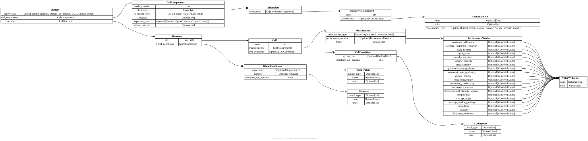

# Summary
Current developments in machine learning and artificial intelligence are motivating the use of data-driven approaches across multiple scientific fields. While this has lead to significant results in e.g. protein folding, the performance of these methods is often hampered by the availability of data. Especially when it comes to learning on non-synthetic data, databases are often too small and of too poor quality to achieve reliable predictions. One potential solution to this problem is the creation of databases from scientific literature. This is however a very resource intensive task which scales very poorly. The development of programmatic approaches for data extraction and database creation is thus an important endeavour for all scientific domains.
SciPubCrawl is an end-to-end Python pipeline for building domain-specific corpora from scientific literature. It automates four tightly coupled stages: search, scrape, convert, and extract. Its search covers popular scholarly sources (Crossref, Europe PMC, ChemRxiv). The project emphasizes provenance (directory-per-stage outputs), fault tolerance (retry/backoff, skip lists), and structured downstream analysis via large language models (LLMs) with Pydantic schemas. Researchers can replicate literature studies, mix multiple providers, and obtain validated JSON suitable for databases or downstream modeling.

# Statement of Need
Scientific discovery workflows often require assembling ad-hoc corpora around evolving topics (e.g., electrolyte additives, battery materials). Existing tooling typically covers either search APIs (e.g. paperscraper[@born2021trends]) or PDF parsing (e.g. marker[@Marker], nougat[@blecher2023nougat]), but does not offer a cohesive pipeline with consistent configuration and standardized output ready for conversion to a database. 

SciPubCrawl fills this gap with a staged workflow. First, the search layer harmonizes heterogeneous metadata from Crossref[@CrossrefAPI], Europe PMC[@EuropePMC2015], and ChemRxiv[@ChemRxivAPI] regardless of their native schemas into JSONL files that expose consistent keys for DOI, title, abstract, and provider metadata. This process can be controlled via the command line for quick tests, or via parameter files that can be saved and stored for reproducibility. In addition to high-level search parameters such as article type and year range, the user can specify regex keywords to refine the search based on the article's title and/or abstract. Next, every download, conversion, and extraction artifact is written into deterministic folder structures so that any run can be reproduced, audited, or resumed later. The code respects API etiquette and has multiple built-in fallbacks: the scraping of full text pdfs directly via publisher API is preferred, followed by publisher xml files and full text retrieval via Unpaywall[@Unpaywall]. We recommend the execution of this process via an IP address connected to an educational site. While pdf files are useful for human readability, programmatic analysis requires a transformation into a text-based format. This is achieved using marker which results in markdown files for the extracted text plus cached assets such as figures.

The following extraction stage uses a schema-constrained LLM pipeline powered by LiteLLM[@LiteLLM], Instructor[@liu2024instructor], and Pydantic[@pydanticValidation2025]. Figure \autoref{fig:example} shows the schema diagram generated for the lithium metal anode case study, highlighting the nested entities captured during extraction and the guarantees provided by schema validation.

This step is crucial for the useability of LLM output in database creation in order to guarantee standardized output across model calls. It does however not necessary result in a standardization of output per category, particularly regarding units (e.g. Fahrenheit or Celsius for temperature). The user can choose to either address this in the model prompt by providing examples showcasing which conversion the model should expect, or standardizing units in a post-process step. Control of the extraction step is provided via parameter files, the creation of pydantic schemas and zero-, one- or fewshot prompting.

# Acknowledgements
This project has received funding from the AI for Chemistry: AIchemy Hub (EPSRC grant EP/Y028775/1 and EP/Y028759/1). The authors acknowledge funding from the Faraday Institution through the LiSTAR programme (Grants FIRG014, FIRG058), from Horizon Europe through the OPERA consortium (Grant Number 101103834) and under the UKRI Horizon Europe Guarantee Extension (Ref Number 10078555), and from the Royal Society (`IEC\NSFC\211200`). This work builds upon public APIs (Crossref, Europe PMC, ChemRxiv) and open-source libraries including Marker, LiteLLM, Instructor, Pydantic, and erdantic. Their maintainers’ efforts are gratefully acknowledged.

# References
